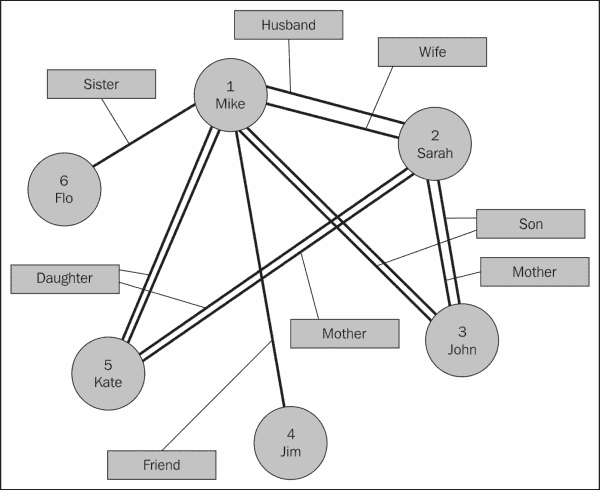

# 第六章：基于图形的存储

使用 Apache Spark 和特别是 GraphX 进行处理提供了使用基于内存的集群的实时图形处理的能力。然而，Apache Spark 并不提供存储；基于图形的数据必须来自某个地方，并且在处理之后，可能会需要存储。在本章中，我将以 Titan 图形数据库为例，研究基于图形的存储。本章将涵盖以下主题：

+   Titan 概述

+   TinkerPop 概述

+   安装 Titan

+   使用 HBase 与 Titan

+   使用 Cassandra 的 Titan

+   使用 Spark 与 Titan

这个处理领域的年轻意味着 Apache Spark 和基于图形的存储系统 Titan 之间的存储集成还不够成熟。

在上一章中，我们研究了 Neo4j Mazerunner 架构，展示了基于 Spark 的事务如何被复制到 Neo4j。本章讨论 Titan 并不是因为它今天展示的功能，而是因为它与 Apache Spark 一起在图形存储领域所提供的未来前景。

# Titan

Titan 是由 Aurelius（[`thinkaurelius.com/`](http://thinkaurelius.com/)）开发的图形数据库。应用程序源代码和二进制文件可以从 GitHub（[`thinkaurelius.github.io/titan/`](http://thinkaurelius.github.io/titan/)）下载，该位置还包含 Titan 文档。Titan 已经作为 Apache 2 许可证的开源应用程序发布。在撰写本书时，Aurelius 已被 DataStax 收购，尽管 Titan 的发布应该会继续。

Titan 提供了许多存储选项，但我只会集中在两个上面，即 HBase——Hadoop NoSQL 数据库和 Cassandra——非 Hadoop NoSQL 数据库。使用这些底层存储机制，Titan 能够在大数据范围内提供基于图形的存储。

基于 TinkerPop3 的 Titan 0.9.0-M2 版本于 2015 年 6 月发布，这将使其与 Apache Spark 更好地集成（TinkerPop 将在下一节中解释）。我将在本章中使用这个版本。Titan 现在使用 TinkerPop 进行图形操作。这个 Titan 版本是一个实验性的开发版本，但希望未来的版本能够巩固 Titan 的功能。

本章集中讨论 Titan 数据库而不是其他图形数据库，比如 Neo4j，因为 Titan 可以使用基于 Hadoop 的存储。此外，Titan 在与 Apache Spark 集成方面提供了未来的前景，用于大数据规模的内存图形处理。下图显示了本章讨论的架构。虚线表示直接 Spark 数据库访问，而实线表示 Spark 通过 Titan 类访问数据。


Spark 接口目前还没有正式存在（只在 M2 开发版本中可用），但这只是为了参考而添加的。尽管 Titan 提供了使用 Oracle 进行存储的选项，但本章不会涉及。我将首先研究 Titan 与 HBase 和 Cassandra 的架构，然后考虑 Apache Spark 的集成。在考虑（分布式）HBase 时，还需要 ZooKeeper 进行集成。鉴于我正在使用现有的 CDH5 集群，HBase 和 ZooKeeper 已经安装好。

# TinkerPop

TinkerPop，截至 2015 年 7 月目前版本为 3，是一个 Apache 孵化器项目，可以在[`tinkerpop.incubator.apache.org/`](http://tinkerpop.incubator.apache.org/)找到。它使得图形数据库（如 Titan）和图形分析系统（如 Giraph）可以将其作为图形处理的子系统使用，而不是创建自己的图形处理模块。


前面的图表（从 TinkerPop 网站借来）显示了 TinkerPop 架构。蓝色层显示了核心 TinkerPop API，为图、顶点和边处理提供了图处理 API。**供应商 API**框显示了供应商将实现以整合其系统的 API。图表显示有两种可能的 API：一种用于**OLTP**数据库系统，另一种用于**OLAP**分析系统。

图表还显示，**Gremlin**语言用于为 TinkerPop 和 Titan 创建和管理图。最后，Gremlin 服务器位于架构的顶部，并允许集成到像 Ganglia 这样的监控系统。

# 安装 Titan

由于本章需要使用 Titan，我现在将安装它，并展示如何获取、安装和配置它。我已经下载了最新的预构建版本（0.9.0-M2）的 Titan：[s3.thinkaurelius.com/downloads/titan/titan-0.9.0-M2-hadoop1.zip](http://s3.thinkaurelius.com/downloads/titan/titan-0.9.0-M2-hadoop1.zip)。

我已将压缩版本下载到临时目录，如下所示。执行以下步骤，确保 Titan 在集群中的每个节点上都安装了：

```scala
[[hadoop@hc2nn tmp]$ ls -lh titan-0.9.0-M2-hadoop1.zip
-rw-r--r-- 1 hadoop hadoop 153M Jul 22 15:13 titan-0.9.0-M2-hadoop1.zip

```

使用 Linux 的解压命令，解压缩压缩的 Titan 发行文件：

```scala
[hadoop@hc2nn tmp]$ unzip titan-0.9.0-M2-hadoop1.zip

[hadoop@hc2nn tmp]$ ls -l
total 155752
drwxr-xr-x 10 hadoop hadoop      4096 Jun  9 00:56 titan-0.9.0-M2-hadoop1
-rw-r--r--  1 hadoop hadoop 159482381 Jul 22 15:13 titan-0.9.0-M2-hadoop1.zip

```

现在，使用 Linux 的`su`（切换用户）命令切换到`root`账户，并将安装移到`/usr/local/`位置。更改安装文件和组成员身份为`hadoop`用户，并创建一个名为`titan`的符号链接，以便将当前的 Titan 版本简化为路径`/usr/local/titan`：

```scala
[hadoop@hc2nn ~]$ su –
[root@hc2nn ~]# cd /home/hadoop/tmp
[root@hc2nn titan]# mv titan-0.9.0-M2-hadoop1 /usr/local
[root@hc2nn titan]# cd /usr/local
[root@hc2nn local]# chown -R hadoop:hadoop titan-0.9.0-M2-hadoop1
[root@hc2nn local]# ln -s titan-0.9.0-M2-hadoop1 titan
[root@hc2nn local]# ls -ld *titan*
lrwxrwxrwx  1 root   root     19 Mar 13 14:10 titan -> titan-0.9.0-M2-hadoop1
drwxr-xr-x 10 hadoop hadoop 4096 Feb 14 13:30 titan-0.9.0-M2-hadoop1

```

使用稍后将演示的 Titan Gremlin shell，现在可以使用 Titan。这个版本的 Titan 需要 Java 8；确保您已经安装了它。

# 带有 HBase 的 Titan

如前图所示，HBase 依赖于 ZooKeeper。鉴于我在 CDH5 集群上有一个正常运行的 ZooKeeper 仲裁（运行在`hc2r1m2`、`hc2r1m3`和`hc2r1m4`节点上），我只需要确保 HBase 在我的 Hadoop 集群上安装并正常运行。

## HBase 集群

我将使用 Cloudera CDH 集群管理器安装分布式版本的 HBase。使用管理器控制台，安装 HBase 是一项简单的任务。唯一需要决定的是在集群上放置 HBase 服务器的位置。下图显示了 CDH HBase 安装的**按主机查看**表单。HBase 组件显示在右侧作为**已添加角色**。

我选择将 HBase 区域服务器（RS）添加到`hc2r1m2`、`hc2r1m3`和`hc2r1m4`节点上。我在`hc2r1m1`主机上安装了 HBase 主服务器（M）、HBase REST 服务器（HBREST）和 HBase Thrift 服务器（HBTS）。


我过去曾手动安装和配置过许多基于 Hadoop 的组件，我发现这种简单的基于管理器的安装和配置组件的方法既快速又可靠。这节省了我时间，让我可以集中精力处理其他系统，比如 Titan。

安装了 HBase，并且已经从 CDH 管理器控制台启动，需要检查以确保它正常工作。我将使用下面显示的 HBase shell 命令来执行此操作：

```scala
[hadoop@hc2r1m2 ~]$ hbase shell
Version 0.98.6-cdh5.3.2, rUnknown, Tue Feb 24 12:56:59 PST 2015
hbase(main):001:0>

```

如前面的命令所示，我以 Linux 用户`hadoop`身份运行 HBase shell。已安装 HBase 版本 0.98.6；在开始使用 Titan 时，这个版本号将变得重要：

```scala
hbase(main):001:0> create 'table2', 'cf1'
hbase(main):002:0> put 'table2', 'row1', 'cf1:1', 'value1'
hbase(main):003:0> put 'table2', 'row2', 'cf1:1', 'value2'

```

我已经创建了一个名为`table2`的简单表，列族为`cf1`。然后我添加了两行，每行有两个不同的值。这个表是从`hc2r1m2`节点创建的，现在将从 HBase 集群中的另一个名为`hc2r1m4`的节点进行检查：

```scala
[hadoop@hc2r1m4 ~]$ hbase shell

hbase(main):001:0> scan 'table2'

ROW                     COLUMN+CELL
 row1                   column=cf1:1, timestamp=1437968514021, value=value1
 row2                   column=cf1:1, timestamp=1437968520664, value=value2
2 row(s) in 0.3870 seconds

```

如您所见，从不同的主机可以看到`table2`中的两行数据，因此 HBase 已安装并正常工作。现在是时候尝试使用 HBase 和 Titan Gremlin shell 在 Titan 中创建图了。

## Gremlin HBase 脚本

我已经检查了我的 Java 版本，以确保我使用的是 8 版本，否则 Titan 0.9.0-M2 将无法工作：

```scala
[hadoop@hc2r1m2 ~]$ java -version
openjdk version "1.8.0_51"

```

如果您没有正确设置 Java 版本，您将会遇到这样的错误，直到您谷歌它们，它们似乎没有意义：

```scala
Exception in thread "main" java.lang.UnsupportedClassVersionError: org/apache/tinkerpop/gremlin/groovy/plugin/RemoteAcceptor :
Unsupported major.minor version 52.0

```

交互式 Titan Gremlin shell 可以在 Titan 安装的 bin 目录中找到，如下所示。一旦启动，它会提供一个 Gremlin 提示：

```scala
[hadoop@hc2r1m2 bin]$ pwd
/usr/local/titan/

[hadoop@hc2r1m2 titan]$ bin/gremlin.sh
gremlin>

```

以下脚本将使用 Gremlin shell 输入。脚本的第一部分定义了存储（HBase）的配置，使用的 ZooKeeper 服务器，ZooKeeper 端口号以及要使用的 HBase 表名：

```scala
hBaseConf = new BaseConfiguration();
hBaseConf.setProperty("storage.backend","hbase");
hBaseConf.setProperty("storage.hostname","hc2r1m2,hc2r1m3,hc2r1m4");
hBaseConf.setProperty("storage.hbase.ext.hbase.zookeeper.property.clientPort","2181")
hBaseConf.setProperty("storage.hbase.table","titan")

titanGraph = TitanFactory.open(hBaseConf);

```

下一部分定义了要使用管理系统创建的图的通用顶点属性的名称和年龄。然后提交管理系统的更改：

```scala
manageSys = titanGraph.openManagement();
nameProp = manageSys.makePropertyKey('name').dataType(String.class).make();
ageProp  = manageSys.makePropertyKey('age').dataType(String.class).make();
manageSys.buildIndex('nameIdx',Vertex.class).addKey(nameProp).buildCompositeIndex();
manageSys.buildIndex('ageIdx',Vertex.class).addKey(ageProp).buildCompositeIndex();

manageSys.commit();

```

现在，将六个顶点添加到图中。每个顶点都被赋予一个数字标签来表示其身份。每个顶点都被赋予年龄和姓名值：

```scala
v1=titanGraph.addVertex(label, '1');
v1.property('name', 'Mike');
v1.property('age', '48');

v2=titanGraph.addVertex(label, '2');
v2.property('name', 'Sarah');
v2.property('age', '45');

v3=titanGraph.addVertex(label, '3');
v3.property('name', 'John');
v3.property('age', '25');

v4=titanGraph.addVertex(label, '4');
v4.property('name', 'Jim');
v4.property('age', '53');

v5=titanGraph.addVertex(label, '5');
v5.property('name', 'Kate');
v5.property('age', '22');

v6=titanGraph.addVertex(label, '6');
v6.property('name', 'Flo');
v6.property('age', '52');

```

最后，图的边被添加以将顶点连接在一起。每条边都有一个关系值。一旦创建，更改就会被提交以将它们存储到 Titan，因此也存储到 HBase：

```scala
v6.addEdge("Sister", v1)
v1.addEdge("Husband", v2)
v2.addEdge("Wife", v1)
v5.addEdge("Daughter", v1)
v5.addEdge("Daughter", v2)
v3.addEdge("Son", v1)
v3.addEdge("Son", v2)
v4.addEdge("Friend", v1)
v1.addEdge("Father", v5)
v1.addEdge("Father", v3)
v2.addEdge("Mother", v5)
v2.addEdge("Mother", v3)

titanGraph.tx().commit();

```

这导致了一个简单的基于人的图，如下图所示，这也是在上一章中使用的：



然后可以在 Titan 中使用 Gremlin shell 测试这个图，使用与之前类似的脚本。只需在`gremlin>`提示符下输入以下脚本，就像之前展示的那样。它使用相同的六行来创建`titanGraph`配置，但然后创建了一个图遍历变量`g`：

```scala
hBaseConf = new BaseConfiguration();
hBaseConf.setProperty("storage.backend","hbase");
hBaseConf.setProperty("storage.hostname","hc2r1m2,hc2r1m3,hc2r1m4");
hBaseConf.setProperty("storage.hbase.ext.hbase.zookeeper.property.clientPort","2181")
hBaseConf.setProperty("storage.hbase.table","titan")

titanGraph = TitanFactory.open(hBaseConf);

gremlin> g = titanGraph.traversal()

```

现在，图遍历变量可以用来检查图的内容。使用`ValueMap`选项，可以搜索名为`Mike`和`Flo`的图节点。它们已经成功找到了：

```scala
gremlin> g.V().has('name','Mike').valueMap();
==>[name:[Mike], age:[48]]

gremlin> g.V().has('name','Flo').valueMap();
==>[name:[Flo], age:[52]]

```

因此，使用 Gremlin shell 在 Titan 中创建并检查了图，但我们也可以使用 HBase shell 检查 HBase 中的存储，并检查 Titan 表的内容。以下扫描显示表存在，并包含此小图的`72`行数据：

```scala
[hadoop@hc2r1m2 ~]$ hbase shell
hbase(main):002:0> scan 'titan'
72 row(s) in 0.8310 seconds

```

现在图已经创建，并且我确信它已经存储在 HBase 中，我将尝试使用 apache Spark 访问数据。我已经在所有节点上启动了 Apache Spark，如前一章所示。这将是从 Apache Spark 1.3 直接访问 HBase 存储。我目前不打算使用 Titan 来解释存储在 HBase 中的图。

## Spark on HBase

为了从 Spark 访问 HBase，我将使用 Cloudera 的`SparkOnHBase`模块，可以从[`github.com/cloudera-labs/SparkOnHBase`](https://github.com/cloudera-labs/SparkOnHBase)下载。

下载的文件是以压缩格式的，需要解压。我使用 Linux unzip 命令在临时目录中完成了这个操作：

```scala
[hadoop@hc2r1m2 tmp]$ ls -l SparkOnHBase-cdh5-0.0.2.zip
-rw-r--r-- 1 hadoop hadoop 370439 Jul 27 13:39 SparkOnHBase-cdh5-0.0.2.zip

[hadoop@hc2r1m2 tmp]$ unzip SparkOnHBase-cdh5-0.0.2.zip

[hadoop@hc2r1m2 tmp]$ ls
SparkOnHBase-cdh5-0.0.2  SparkOnHBase-cdh5-0.0.2.zip

```

然后，我进入解压后的模块，并使用 Maven 命令`mvn`来构建 JAR 文件：

```scala
[hadoop@hc2r1m2 tmp]$ cd SparkOnHBase-cdh5-0.0.2
[hadoop@hc2r1m2 SparkOnHBase-cdh5-0.0.2]$ mvn clean package

[INFO] -----------------------------------------------------------
[INFO] BUILD SUCCESS
[INFO] -----------------------------------------------------------
[INFO] Total time: 13:17 min
[INFO] Finished at: 2015-07-27T14:05:55+12:00
[INFO] Final Memory: 50M/191M
[INFO] -----------------------------------------------------------

```

最后，我将构建的组件移动到我的开发区域，以保持整洁，这样我就可以在我的 Spark HBase 代码中使用这个模块：

```scala
[hadoop@hc2r1m2 SparkOnHBase-cdh5-0.0.2]$ cd ..
[hadoop@hc2r1m2 tmp]$ mv SparkOnHBase-cdh5-0.0.2 /home/hadoop/spark

```

## 使用 Spark 访问 HBase

与以前的章节一样，我将使用 SBT 和 Scala 将基于 Spark 的脚本编译成应用程序。然后，我将使用 spark-submit 在 Spark 集群上运行这些应用程序。我的 SBT 配置文件如下所示。它包含了 Hadoop、Spark 和 HBase 库：

```scala
[hadoop@hc2r1m2 titan_hbase]$ pwd
/home/hadoop/spark/titan_hbase

[hadoop@hc2r1m2 titan_hbase]$ more titan.sbt
name := "T i t a n"
version := "1.0"
scalaVersion := "2.10.4"

libraryDependencies += "org.apache.hadoop" % "hadoop-client" % "2.3.0"
libraryDependencies += "org.apache.spark" %% "spark-core"  % "1.3.1"
libraryDependencies += "com.cloudera.spark" % "hbase"   % "5-0.0.2" from "file:///home/hadoop/spark/SparkOnHBase-cdh5-0.0.2/target/SparkHBase.jar"
libraryDependencies += "org.apache.hadoop.hbase" % "client"   % "5-0.0.2" from "file:///home/hadoop/spark/SparkOnHBase-cdh5-0.0.2/target/SparkHBase.jar"
resolvers += "Cloudera Repository" at "https://repository.cloudera.com/artifactory/clouder
a-repos/"

```

请注意，我正在`hc2r1m2`服务器上运行此应用程序，使用 Linux`hadoop`帐户，在`/home/hadoop/spark/titan_hbase`目录下。我创建了一个名为`run_titan.bash.hbase`的 Bash shell 脚本，允许我运行在`src/main/scala`子目录下创建和编译的任何应用程序：

```scala
[hadoop@hc2r1m2 titan_hbase]$ pwd ; more run_titan.bash.hbase
/home/hadoop/spark/titan_hbase

#!/bin/bash

SPARK_HOME=/usr/local/spark
SPARK_BIN=$SPARK_HOME/bin
SPARK_SBIN=$SPARK_HOME/sbin

JAR_PATH=/home/hadoop/spark/titan_hbase/target/scala-2.10/t-i-t-a-n_2.10-1.0.jar
CLASS_VAL=$1

CDH_JAR_HOME=/opt/cloudera/parcels/CDH/lib/hbase/
CONN_HOME=/home/hadoop/spark/SparkOnHBase-cdh5-0.0.2/target/

HBASE_JAR1=$CDH_JAR_HOME/hbase-common-0.98.6-cdh5.3.3.jar
HBASE_JAR2=$CONN_HOME/SparkHBase.jar

cd $SPARK_BIN

./spark-submit \
 --jars $HBASE_JAR1 \
 --jars $HBASE_JAR2 \
 --class $CLASS_VAL \
 --master spark://hc2nn.semtech-solutions.co.nz:7077  \
 --executor-memory 100M \
 --total-executor-cores 50 \
 $JAR_PATH

```

Bash 脚本保存在相同的`titan_hbase`目录中，并接受应用程序类名的单个参数。`spark-submit`调用的参数与先前的示例相同。在这种情况下，在`src/main/scala`下只有一个脚本，名为`spark3_hbase2.scala`：

```scala
[hadoop@hc2r1m2 scala]$ pwd
/home/hadoop/spark/titan_hbase/src/main/scala

[hadoop@hc2r1m2 scala]$ ls
spark3_hbase2.scala

```

Scala 脚本首先定义了应用程序类所属的包名称。然后导入了 Spark、Hadoop 和 HBase 类：

```scala
package nz.co.semtechsolutions

import org.apache.spark.SparkContext
import org.apache.spark.SparkContext._
import org.apache.spark.SparkConf

import org.apache.hadoop.hbase._
import org.apache.hadoop.fs.Path
import com.cloudera.spark.hbase.HBaseContext
import org.apache.hadoop.hbase.client.Scan
```

应用程序类名也被定义，以及主方法。然后根据应用程序名称和 Spark URL 创建一个配置对象。最后，从配置创建一个 Spark 上下文：

```scala
object spark3_hbase2
{

  def main(args: Array[String]) {

    val sparkMaster = "spark://hc2nn.semtech-solutions.co.nz:7077"
    val appName = "Spark HBase 2"
    val conf = new SparkConf()

    conf.setMaster(sparkMaster)
    conf.setAppName(appName)

    val sparkCxt = new SparkContext(conf)
```

接下来，创建一个 HBase 配置对象，并添加一个基于 Cloudera CDH `hbase-site.xml`文件的资源：

```scala
    val jobConf = HBaseConfiguration.create()

    val hbasePath="/opt/cloudera/parcels/CDH/etc/hbase/conf.dist/"

    jobConf.addResource(new Path(hbasePath+"hbase-site.xml"))
```

使用 Spark 上下文和 HBase 配置对象创建一个 HBase 上下文对象。还定义了扫描和缓存配置：

```scala
    val hbaseContext = new HBaseContext(sparkCxt, jobConf)

    var scan = new Scan()
    scan.setCaching(100)
```

最后，使用`hbaseRDD` HBase 上下文方法和扫描对象检索了 HBase `Titan`表中的数据。打印了 RDD 计数，然后关闭了脚本：

```scala
    var hbaseRdd = hbaseContext.hbaseRDD("titan", scan)

    println( "Rows in Titan hbase table : " + hbaseRdd.count() )

    println( " >>>>> Script Finished <<<<< " )

  } // end main

} // end spark3_hbase2
```

我只打印了检索到的数据计数，因为 Titan 以 GZ 格式压缩数据。因此，直接尝试操纵它将没有多大意义。

使用`run_titan.bash.hbase`脚本运行名为`spark3_hbase2`的 Spark 应用程序。它输出了一个 RDD 行计数为`72`，与先前找到的 Titan 表行计数相匹配。这证明 Apache Spark 已能够访问原始的 Titan HBase 存储的图形数据，但 Spark 尚未使用 Titan 库来访问 Titan 数据作为图形。这将在稍后讨论。以下是代码：

```scala
[hadoop@hc2r1m2 titan_hbase]$ ./run_titan.bash.hbase nz.co.semtechsolutions.spark3_hbase2

Rows in Titan hbase table : 72
 >>>>> Script Finished <<<<<

```

# 使用 Cassandra 的 Titan

在本节中，Cassandra NoSQL 数据库将作为 Titan 的存储机制。尽管它不使用 Hadoop，但它本身是一个大规模的基于集群的数据库，并且可以扩展到非常大的集群规模。本节将遵循相同的流程。与 HBase 一样，将创建一个图，并使用 Titan Gremlin shell 将其存储在 Cassandra 中。然后将使用 Gremlin 进行检查，并在 Cassandra 中检查存储的数据。然后将从 Spark 中访问原始的 Titan Cassandra 图形数据。因此，第一步是在集群中的每个节点上安装 Cassandra。

## 安装 Cassandra

创建一个允许使用 Linux 的`yum`命令安装 DataStax Cassandra 社区版本的 repo 文件。这将需要 root 访问权限，因此使用`su`命令切换用户到 root。在所有节点上安装 Cassandra：

```scala
[hadoop@hc2nn lib]$ su -
[root@hc2nn ~]# vi /etc/yum.repos.d/datastax.repo

[datastax]
name= DataStax Repo for Apache Cassandra
baseurl=http://rpm.datastax.com/community
enabled=1
gpgcheck=0

```

现在，在集群中的每个节点上使用 Linux 的`yum`命令安装 Cassandra：

```scala
[root@hc2nn ~]# yum -y install dsc20-2.0.13-1 cassandra20-2.0.13-1

```

通过修改`cassandra.yaml`文件，在`/etc/cassandra/conf`下设置 Cassandra 配置：

```scala
[root@hc2nn ~]# cd /etc/cassandra/conf   ; vi cassandra.yaml

```

我已经做了以下更改，以指定我的集群名称、服务器种子 IP 地址、RPC 地址和 snitch 值。种子节点是其他节点首先尝试连接的节点。在这种情况下，NameNode（`103`）和 node2（`108`）被用作`seeds`。snitch 方法管理网络拓扑和路由：

```scala
cluster_name: 'Cluster1'
seeds: "192.168.1.103,192.168.1.108"
listen_address:
rpc_address: 0.0.0.0
endpoint_snitch: GossipingPropertyFileSnitch

```

现在可以作为 root 在每个节点上启动 Cassandra，使用 service 命令：

```scala
[root@hc2nn ~]# service cassandra start

```

日志文件可以在`/var/log/cassandra`下找到，数据存储在`/var/lib/cassandra`下。`nodetool`命令可以在任何 Cassandra 节点上使用，以检查 Cassandra 集群的状态：

```scala
[root@hc2nn cassandra]# nodetool status
Datacenter: DC1
===============
Status=Up/Down
|/ State=Normal/Leaving/Joining/Moving
--  Address        Load       Tokens  Owns (effective)  Host ID Rack
UN  192.168.1.105  63.96 KB   256     37.2%             f230c5d7-ff6f-43e7-821d-c7ae2b5141d3  RAC1
UN  192.168.1.110  45.86 KB   256     39.9%             fc1d80fe-6c2d-467d-9034-96a1f203c20d  RAC1
UN  192.168.1.109  45.9 KB    256     40.9%             daadf2ee-f8c2-4177-ae72-683e39fd1ea0  RAC1
UN  192.168.1.108  50.44 KB   256     40.5%             b9d796c0-5893-46bc-8e3c-187a524b1f5a  RAC1
UN  192.168.1.103  70.68 KB   256     41.5%             53c2eebd-
a66c-4a65-b026-96e232846243  RAC1

```

Cassandra CQL shell 命令称为`cqlsh`，可用于访问集群并创建对象。接下来调用 shell，它显示 Cassandra 版本 2.0.13 已安装：

```scala
[hadoop@hc2nn ~]$ cqlsh
Connected to Cluster1 at localhost:9160.
[cqlsh 4.1.1 | Cassandra 2.0.13 | CQL spec 3.1.1 | Thrift protocol 19.39.0]
Use HELP for help.
cqlsh>

```

Cassandra 查询语言接下来显示了一个名为`keyspace1`的键空间，通过 CQL shell 创建和使用：

```scala
cqlsh> CREATE KEYSPACE keyspace1 WITH REPLICATION = { 'class' : 'SimpleStrategy', 'replication_factor' : 1 };

cqlsh> USE keyspace1;

cqlsh:keyspace1> SELECT * FROM system.schema_keyspaces;

 keyspace_name | durable_writes | strategy_class                              | strategy_options
--------------+------+---------------------------------------------+----------------------------
 keyspace1  | True | org.apache.cassandra.locator.SimpleStrategy | {"replication_factor":"1"}
 system  | True |  org.apache.cassandra.locator.LocalStrategy |                         {}
system_traces | True | org.apache.cassandra.locator.SimpleStrategy | {"replication_factor":"2"}

```

由于 Cassandra 已安装并运行，现在是时候使用 Cassandra 创建 Titan 图形存储。这将在下一节中使用 Titan Gremlin shell 来解决。它将遵循之前 HBase 部分的相同格式。

## Gremlin Cassandra 脚本

与之前的 Gremlin 脚本一样，这个 Cassandra 版本创建了相同的简单图。这个脚本的不同之处在于配置。后端存储类型被定义为 Cassandra，主机名被定义为 Cassandra 种子节点。指定了 key space 和端口号，最后创建了图：

```scala
cassConf = new BaseConfiguration();
cassConf.setProperty("storage.backend","cassandra");
cassConf.setProperty("storage.hostname","hc2nn,hc2r1m2");
cassConf.setProperty("storage.port","9160")
cassConf.setProperty("storage.keyspace","titan")
titanGraph = TitanFactory.open(cassConf);
```

从这一点开始，脚本与之前的 HBase 示例相同，所以我不会重复它。这个脚本将作为`cassandra_create.bash`在下载包中提供。可以在 Gremlin shell 中使用之前的配置进行相同的检查以检查数据。这返回与之前检查相同的结果，证明图已经被存储：

```scala
gremlin> g = titanGraph.traversal()

gremlin> g.V().has('name','Mike').valueMap();
==>[name:[Mike], age:[48]]

gremlin> g.V().has('name','Flo').valueMap();
==>[name:[Flo], age:[52]]

```

通过使用 Cassandra CQL shell 和 Titan `keyspace`，可以看到在 Cassandra 中已经创建了许多 Titan 表：

```scala
[hadoop@hc2nn ~]$ cqlsh
cqlsh> use titan;
cqlsh:titan> describe tables;
edgestore        graphindex        system_properties systemlog  txlog
edgestore_lock_  graphindex_lock_  system_properties_lock_  titan_ids

```

还可以看到数据存在于 Cassandra 的`edgestore`表中：

```scala
cqlsh:titan> select * from edgestore;
 key                | column1            | value
--------------------+--------------------+------------------------------------------------
 0x0000000000004815 |               0x02 |                                     0x00011ee0
 0x0000000000004815 |             0x10c0 |                           0xa0727425536fee1ec0
.......
 0x0000000000001005 |             0x10c8 |                       0x00800512644c1b149004a0
 0x0000000000001005 | 0x30c9801009800c20 |   0x000101143c01023b0101696e6465782d706ff30200

```

这向我保证了在 Gremlin shell 中已经创建了 Titan 图，并且存储在 Cassandra 中。现在，我将尝试从 Spark 中访问数据。

## Spark Cassandra 连接器

为了从 Spark 访问 Cassandra，我将下载 DataStax Spark Cassandra 连接器和驱动程序库。关于这方面的信息和版本匹配可以在[`mvnrepository.com/artifact/com.datastax.spark/`](http://mvnrepository.com/artifact/com.datastax.spark/)找到。

这个 URL 的版本兼容性部分显示了应该与每个 Cassandra 和 Spark 版本一起使用的 Cassandra 连接器版本。版本表显示连接器版本应该与正在使用的 Spark 版本匹配。下一个 URL 允许在[`mvnrepository.com/artifact/com.datastax.spark/spark-cassandra-connector_2.10`](http://mvnrepository.com/artifact/com.datastax.spark/spark-cassandra-connector_2.10)找到这些库。

通过上面的 URL，并选择一个库版本，你将看到与该库相关的编译依赖关系表，其中指示了你需要的所有其他依赖库及其版本。以下库是与 Spark 1.3.1 一起使用所需的。如果你使用前面的 URL，你将看到每个 Spark 版本应该使用哪个版本的 Cassandra 连接器库。你还将看到 Cassandra 连接器依赖的库。请小心选择所需的库版本：

```scala
[hadoop@hc2r1m2 titan_cass]$ pwd ; ls *.jar
/home/hadoop/spark/titan_cass

spark-cassandra-connector_2.10-1.3.0-M1.jar
cassandra-driver-core-2.1.5.jar
cassandra-thrift-2.1.3.jar
libthrift-0.9.2.jar
cassandra-clientutil-2.1.3.jar
guava-14.0.1.jar
joda-time-2.3.jar
joda-convert-1.2.jar

```

## 使用 Spark 访问 Cassandra

现在我已经准备好了 Cassandra 连接器库和所有的依赖关系，我可以开始考虑连接到 Cassandra 所需的 Scala 代码。首先要做的事情是设置 SBT 构建配置文件，因为我使用 SBT 作为开发工具。我的配置文件看起来像这样：

```scala
[hadoop@hc2r1m2 titan_cass]$ pwd ; more titan.sbt
/home/hadoop/spark/titan_cass

name := "Spark Cass"
version := "1.0"
scalaVersion := "2.10.4"
libraryDependencies += "org.apache.hadoop" % "hadoop-client" % "2.3.0"
libraryDependencies += "org.apache.spark" %% "spark-core"  % "1.3.1"
libraryDependencies += "com.datastax.spark" % "spark-cassandra-connector"  % "1.3.0-M1" fr
om "file:///home/hadoop/spark/titan_cass/spark-cassandra-connector_2.10-1.3.0-M1.jar"
libraryDependencies += "com.datastax.cassandra" % "cassandra-driver-core"  % "2.1.5" from
"file:///home/hadoop/spark/titan_cass/cassandra-driver-core-2.1.5.jar"
libraryDependencies += "org.joda"  % "time" % "2.3" from "file:///home/hadoop/spark/titan_
cass/joda-time-2.3.jar"
libraryDependencies += "org.apache.cassandra" % "thrift" % "2.1.3" from "file:///home/hado
op/spark/titan_cass/cassandra-thrift-2.1.3.jar"
libraryDependencies += "com.google.common" % "collect" % "14.0.1" from "file:///home/hadoo
p/spark/titan_cass/guava-14.0.1.jar
resolvers += "Cloudera Repository" at "https://repository.cloudera.com/artifactory/clouder
a-repos/"

```

Cassandra 连接器示例的 Scala 脚本，名为`spark3_cass.scala`，现在看起来像以下代码。首先，定义了包名。然后，为 Spark 和 Cassandra 连接器导入了类。接下来，定义了对象应用类`spark3_cass` ID，以及主方法：

```scala
package nz.co.semtechsolutions

import org.apache.spark.SparkContext
import org.apache.spark.SparkContext._
import org.apache.spark.SparkConf

import com.datastax.spark.connector._

object spark3_cass
{

  def main(args: Array[String]) {
```

使用 Spark URL 和应用程序名称创建了一个 Spark 配置对象。将 Cassandra 连接主机添加到配置中。然后，使用配置对象创建了 Spark 上下文：

```scala
    val sparkMaster = "spark://hc2nn.semtech-solutions.co.nz:7077"
    val appName = "Spark Cass 1"
    val conf = new SparkConf()

    conf.setMaster(sparkMaster)
    conf.setAppName(appName)

    conf.set("spark.cassandra.connection.host", "hc2r1m2")

    val sparkCxt = new SparkContext(conf)
```

要检查的 Cassandra `keyspace`和表名已经定义。然后，使用名为`cassandraTable`的 Spark 上下文方法连接到 Cassandra，并获取`edgestore`表的内容作为 RDD。然后打印出这个 RDD 的大小，脚本退出。我们暂时不会查看这些数据，因为只需要证明可以连接到 Cassandra：

```scala
    val keySpace =  "titan"
    val tableName = "edgestore"

    val cassRDD = sparkCxt.cassandraTable( keySpace, tableName )

    println( "Cassandra Table Rows : " + cassRDD.count )

    println( " >>>>> Script Finished <<<<< " )

  } // end main

} // end spark3_cass
```

与之前的示例一样，Spark 的`submit`命令已放置在一个名为`run_titan.bash.cass`的 Bash 脚本中。下面显示的脚本看起来与已经使用的许多其他脚本类似。这里需要注意的是有一个 JARs 选项，列出了所有在运行时可用的 JAR 文件。这个选项中 JAR 文件的顺序已经确定，以避免类异常错误：

```scala
[hadoop@hc2r1m2 titan_cass]$ more run_titan.bash

#!/bin/bash

SPARK_HOME=/usr/local/spark
SPARK_BIN=$SPARK_HOME/bin
SPARK_SBIN=$SPARK_HOME/sbin

JAR_PATH=/home/hadoop/spark/titan_cass/target/scala-2.10/spark-cass_2.10-1.0.jar
CLASS_VAL=$1

CASS_HOME=/home/hadoop/spark/titan_cass/

CASS_JAR1=$CASS_HOME/spark-cassandra-connector_2.10-1.3.0-M1.jar
CASS_JAR2=$CASS_HOME/cassandra-driver-core-2.1.5.jar
CASS_JAR3=$CASS_HOME/cassandra-thrift-2.1.3.jar
CASS_JAR4=$CASS_HOME/libthrift-0.9.2.jar
CASS_JAR5=$CASS_HOME/cassandra-clientutil-2.1.3.jar
CASS_JAR6=$CASS_HOME/guava-14.0.1.jar
CASS_JAR7=$CASS_HOME/joda-time-2.3.jar
CASS_JAR8=$CASS_HOME/joda-convert-1.2.jar

cd $SPARK_BIN

./spark-submit \
 --jars $CASS_JAR8,$CASS_JAR7,$CASS_JAR5,$CASS_JAR4,$CASS_JAR3,$CASS_JAR6,$CASS_JAR2,$CASS_JAR1 \
 --class $CLASS_VAL \
 --master spark://hc2nn.semtech-solutions.co.nz:7077  \
 --executor-memory 100M \
 --total-executor-cores 50 \
 $JAR_PATH

```

此应用程序是通过之前的 Bash 脚本调用的。它连接到 Cassandra，选择数据，并返回基于 Cassandra 表数据的计数为`218`行。

```scala
[hadoop@hc2r1m2 titan_cass]$ ./run_titan.bash.cass nz.co.semtechsolutions.spark3_cass

Cassandra Table Rows : 218
 >>>>> Script Finished <<<<<

```

这证明了可以从 Apache Spark 访问基于原始 Cassandra 的 Titan 表数据。然而，与 HBase 示例一样，这是基于原始表的 Titan 数据，而不是 Titan 图形中的数据。下一步将是使用 Apache Spark 作为 Titan 数据库的处理引擎。这将在下一节中进行讨论。

# 使用 Spark 访问 Titan

到目前为止，在本章中，已经安装了 Titan 0.9.0-M2，并成功使用 HBase 和 Cassandra 作为后端存储选项创建了图形。这些图形是使用基于 Gremlin 的脚本创建的。在本节中，将使用属性文件通过 Gremlin 脚本来处理基于 Titan 的图形，使用相同的两个后端存储选项 HBase 和 Cassandra。

以下图表基于本章前面的 TinkerPop3 图表，展示了本节中使用的架构。我简化了图表，但基本上与之前的 TinkerPop 版本相同。我只是通过图形计算机 API 添加了到 Apache Spark 的链接。我还通过 Titan 供应商 API 添加了 HBase 和 Cassandra 存储。当然，HBase 的分布式安装同时使用 Zookeeper 进行配置，使用 HDFS 进行存储。

Titan 使用 TinkerPop 的 Hadoop-Gremlin 包进行图处理 OLAP 过程。文档部分的链接可以在这里找到：[`s3.thinkaurelius.com/docs/titan/0.9.0-M2/titan-hadoop-tp3.html`](http://s3.thinkaurelius.com/docs/titan/0.9.0-M2/titan-hadoop-tp3.html)。

本节将展示如何使用 Bash shell、Groovy 和属性文件来配置和运行基于 Titan Spark 的作业。它将展示配置作业的不同方法，并展示管理日志以启用错误跟踪的方法。还将描述属性文件的不同配置，以便访问 HBase、Cassandra 和 Linux 文件系统。

请记住，本章基于的 Titan 0.9.0-M2 版本是一个开发版本。这是一个原型版本，尚未准备好投入生产。我假设随着未来 Titan 版本的推出，Titan 与 Spark 之间的链接将更加完善和稳定。目前，本节中的工作仅用于演示目的，考虑到 Titan 版本的性质。


在下一节中，我将解释使用 Gremlin 和 Groovy 脚本，然后转向使用 Cassandra 和 HBase 作为存储选项将 Titan 连接到 Spark。

## Gremlin 和 Groovy

用于执行 Groovy 命令的 Gremlin shell 可以以多种方式使用。第一种使用方法只涉及启动 Gremlin shell 以用作交互式会话。只需执行以下命令：

```scala
cd $TITAN_HOME/bin ; ./ gremlin.sh

```

这将启动会话，并自动设置所需的插件，如 TinkerPop 和 Titan（见下文）。显然，之前的`TITAN_HOME`变量用于指示所讨论的 bin 目录位于您的 Titan 安装（`TITAN_HOME`）目录中：

```scala
plugin activated: tinkerpop.server
plugin activated: tinkerpop.utilities
plugin activated: tinkerpop.hadoop
plugin activated: tinkerpop.tinkergraph
plugin activated: aurelius.titan

```

然后它会提供一个 Gremlin shell 提示符，您可以在其中交互式地执行对 Titan 数据库的 shell 命令。此 shell 对于测试脚本和针对 Titan 数据库运行临时命令非常有用。

```scala
gremlin>

```

第二种方法是在调用`gremlin.sh`命令时将您的 Groovy 命令嵌入到脚本中。在这个例子中，EOF 标记之间的 Groovy 命令被传送到 Gremlin shell 中。当最后一个 Groovy 命令执行完毕时，Gremlin shell 将终止。当您仍希望使用 Gremlin shell 的自动化环境设置，但仍希望能够快速重新执行脚本时，这是很有用的。这段代码片段是从 Bash shell 脚本中执行的，如下一个例子所示。以下脚本使用`titan.sh`脚本来管理 Gremlin 服务器：

```scala
#!/bin/bash

TITAN_HOME=/usr/local/titan/

cd $TITAN_HOME

bin/titan.sh start

bin/gremlin.sh   <<  EOF

 t = TitanFactory.open('cassandra.properties')
 GraphOfTheGodsFactory.load(t)
 t.close()
EOF

bin/titan.sh stop

```

第三种方法涉及将 Groovy 命令移动到一个单独的 Groovy 文件中，并使用 Gremlin shell 的`-e`选项来执行该文件。这种方法为错误跟踪提供了额外的日志选项，但意味着在为 Groovy 脚本设置 Gremlin 环境时需要采取额外的步骤：

```scala
#!/bin/bash

TITAN_HOME=/usr/local/titan/
SCRIPTS_HOME=/home/hadoop/spark/gremlin
GREMLIN_LOG_FILE=$TITAN_HOME/log/gremlin_console.log

GROOVY_SCRIPT=$1

export GREMLIN_LOG_LEVEL="DEBUG"

cd $TITAN_HOME

bin/titan.sh start

bin/gremlin.sh -e  $SCRIPTS_HOME/$GROOVY_SCRIPT  > $GREMLIN_LOG_FILE 2>&1

bin/titan.sh stop

```

因此，这个脚本定义了 Gremlin 日志级别，可以设置为不同的日志级别以获取有关问题的额外信息，即 INFO、WARN 和 DEBUG。它还将脚本输出重定向到日志文件（`GREMLIN_LOG_FILE`），并将错误重定向到同一个日志文件（`2>&1`）。这样做的好处是可以持续监视日志文件，并提供会话的永久记录。要执行的 Groovy 脚本名称然后作为参数（`$1`）传递给封装的 Bash shell 脚本。

正如我之前提到的，以这种方式调用的 Groovy 脚本需要额外的环境配置，以设置 Gremlin 会话，与之前的 Gremlin 会话选项相比。例如，需要导入将要使用的必要的 TinkerPop 和 Aurelius 类：

```scala
import com.thinkaurelius.titan.core.*
import com.thinkaurelius.titan.core.titan.*
import org.apache.tinkerpop.gremlin.*
```

在描述了启动 Gremlin shell 会话和运行 Groovy 脚本所需的脚本和配置选项之后，从现在开始我将集中讨论 Groovy 脚本和配置 Gremlin 会话所需的属性文件。

## TinkerPop 的 Hadoop Gremlin

正如前面在本节中已经提到的，Titan 中的 TinkerPop Hadoop Gremlin 包将用于调用 Apache Spark 作为处理引擎（Hadoop Giraph 也可以用于处理）。链接[`s3.thinkaurelius.com/docs/titan/0.9.0-M2/titan-hadoop-tp3.html`](http://s3.thinkaurelius.com/docs/titan/0.9.0-M2/titan-hadoop-tp3.html)提供了 Hadoop Gremlin 的文档；请记住，这个 TinkerPop 包仍在开发中，可能会有所改变。

在这一点上，我将检查一个属性文件，该文件可用于将 Cassandra 作为 Titan 的存储后端进行连接。它包含了用于 Cassandra、Apache Spark 和 Hadoop Gremlin 配置的部分。我的 Cassandra 属性文件名为`cassandra.properties`，内容如下（以井号（`#`）开头的行是注释）：

```scala
####################################
# Storage details
####################################
storage.backend=cassandra
storage.hostname=hc2r1m2
storage.port=9160
storage.cassandra.keyspace=dead
cassandra.input.partitioner.class=org.apache.cassandra.dht.Murmur3Partitioner

```

前面基于 Cassandra 的属性描述了 Cassandra 主机和端口。这就是存储后端类型为 Cassandra 的原因，要使用的 Cassandra `keyspace`称为`dead`（代表感激的死者——在本例中将使用的数据）。请记住，Cassandra 表是在 keyspaces 中分组的。前面的`partitioner`类定义了将用于对 Cassandra 数据进行分区的 Cassandra 类。Apache Spark 配置部分包含主 URL、执行器内存和要使用的数据`serializer`类：

```scala
####################################
# Spark
####################################
spark.master=spark://hc2nn.semtech-solutions.co.nz:6077
spark.executor.memory=400M
spark.serializer=org.apache.spark.serializer.KryoSerializer

```

最后，这里显示了属性文件中 Hadoop Gremlin 部分，该部分定义了用于图形和非图形输入和输出的类。它还定义了数据输入和输出位置，以及用于缓存 JAR 文件和推导内存的标志。

```scala
####################################
# Hadoop Gremlin
####################################
gremlin.graph=org.apache.tinkerpop.gremlin.hadoop.structure.HadoopGraph
gremlin.hadoop.graphInputFormat=com.thinkaurelius.titan.hadoop.formats.cassandra.CassandraInputFormat
gremlin.hadoop.graphOutputFormat=org.apache.tinkerpop.gremlin.hadoop.structure.io.gryo.GryoOutputFormat
gremlin.hadoop.memoryOutputFormat=org.apache.hadoop.mapreduce.lib.output.SequenceFileOutputFormat

gremlin.hadoop.deriveMemory=false
gremlin.hadoop.jarsInDistributedCache=true
gremlin.hadoop.inputLocation=none
gremlin.hadoop.outputLocation=output

```

蓝图是 TinkerPop 属性图模型接口。Titan 发布了自己的蓝图实现，所以在前面的属性中，你会看到`gremlin.graph`而不是`blueprints.graph`。这定义了用于定义应该使用的图的类。如果省略了这个选项，那么图类型将默认为以下内容：

```scala
com.thinkaurelius.titan.core.TitanFactory

```

`CassandraInputFormat`类定义了数据是从 Cassandra 数据库中检索出来的。图输出序列化类被定义为`GryoOutputFormat`。内存输出格式类被定义为使用 Hadoop Map Reduce 类`SequenceFileOutputFormat`。

`jarsInDistributedCache`值已被定义为 true，以便将 JAR 文件复制到内存中，使 Apache Spark 能够使用它们。如果有更多时间，我会研究使 Titan 类对 Spark 可见的方法，以避免过多的内存使用。

鉴于 TinkerPop Hadoop Gremlin 模块目前仅作为开发原型版本发布，目前文档很少。编码示例非常有限，似乎也没有文档描述之前的每个属性。

在我深入探讨 Groovy 脚本示例之前，我想向您展示一种使用配置对象配置 Groovy 作业的替代方法。

## 替代 Groovy 配置

可以使用`BaseConfiguration`方法创建配置对象。在这个例子中，我创建了一个名为`cassConf`的 Cassandra 配置：

```scala
cassConf = new BaseConfiguration();

cassConf.setProperty("storage.backend","cassandra");
cassConf.setProperty("storage.hostname","hc2r1m2");
cassConf.setProperty("storage.port","9160")
cassConf.setProperty("storage.cassandra.keyspace","titan")

titanGraph = TitanFactory.open(cassConf);
```

然后使用`setProperty`方法来定义 Cassandra 连接属性，如后端类型、主机、端口和`keyspace`。最后，使用 open 方法创建了一个名为`titanGraph`的 Titan 图。稍后将会展示，Titan 图可以使用配置对象或属性文件路径来创建。已设置的属性与之前描述的 Cassandra 属性文件中定义的属性相匹配。

接下来的几节将展示如何创建和遍历图。它们将展示如何使用 Cassandra、HBase 和文件系统进行存储。鉴于我已经花了很多篇幅描述 Bash 脚本和属性文件，我只会描述每个实例中需要更改的属性。我还将在每个实例中提供简单的 Groovy 脚本片段。

## 使用 Cassandra

名为`cassandra.properties`的基于 Cassandra 的属性文件已经在前面描述过，所以我不会在这里重复细节。这个示例 Groovy 脚本创建了一个示例图，并将其存储在 Cassandra 中。它已经使用**EOF**来将脚本传输到 Gremlin shell 执行：

```scala
t1 = TitanFactory.open('/home/hadoop/spark/gremlin/cassandra.properties')
GraphOfTheGodsFactory.load(t1)

t1.traversal().V().count()

t1.traversal().V().valueMap()

t1.close()

```

使用`TitanFactory.open`方法和 Cassandra 属性文件创建了一个 Titan 图。它被称为`t1`。上帝之图，一个提供给 Titan 的示例图，已经被加载到图`t1`中，使用了`GraphOfTheGodsFactory.load`方法。然后生成了顶点的计数(`V()`)以及`ValueMap`来显示图的内容。输出如下：

```scala
==>12

==>[name:[jupiter], age:[5000]]
==>[name:[hydra]]
==>[name:[nemean]]
==>[name:[tartarus]]
==>[name:[saturn], age:[10000]]
==>[name:[sky]]
==>[name:[pluto], age:[4000]]
==>[name:[alcmene], age:[45]]
==>[name:[hercules], age:[30]]
==>[name:[sea]]
==>[name:[cerberus]]
==>[name:[neptune], age:[4500]]

```

因此，图中有 12 个顶点，每个顶点都有一个在前面数据中显示的名称和年龄元素。成功创建了一个图后，现在可以配置之前的图遍历 Gremlin 命令以使用 Apache Spark 进行处理。只需在遍历命令中指定`SparkGraphComputer`即可实现。有关架构细节，请参见本章顶部的完整*TinkerPop*图。执行此命令时，您将在 Spark 集群用户界面上看到任务出现：

```scala
t1.traversal(computer(SparkGraphComputer)).V().count()

```

## 使用 HBase

在使用 HBase 时，需要更改属性文件。以下数值取自我的`hbase.properties`文件：

```scala
gremlin.hadoop.graphInputFormat=com.thinkaurelius.titan.hadoop.formats.hbase.HBaseInputFormat

input.conf.storage.backend=hbase
input.conf.storage.hostname=hc2r1m2
input.conf.storage.port=2181
input.conf.storage.hbase.table=titan
input.conf.storage.hbase.ext.zookeeper.znode.parent=/hbase

```

请记住，HBase 使用 Zookeeper 进行配置。因此，连接的端口号和服务器现在变成了`zookeeper`服务器和`zookeeper`主端口 2181。在 Zookeeper 中，`znode`父值也被定义为顶级节点`/hbase`。当然，后端类型现在被定义为`hbase`。

此外，`GraphInputFormat`类已更改为`HBaseInputFormat`，以描述 HBase 作为输入源。现在可以使用此属性文件创建 Titan 图，就像上一节所示的那样。我不会在这里重复图的创建，因为它与上一节相同。接下来，我将转向文件系统存储。

## 使用文件系统

为了运行这个例子，我使用了一个基本的 Gremlin shell（`bin/gremlin.sh`）。在 Titan 发布的数据目录中，有许多可以加载以创建图形的示例数据文件格式。在这个例子中，我将使用名为`grateful-dead.kryo`的文件。因此，这次数据将直接从文件加载到图形中，而不需要指定存储后端，比如 Cassandra。我将使用的属性文件只包含以下条目：

```scala
gremlin.graph=org.apache.tinkerpop.gremlin.hadoop.structure.HadoopGraph
gremlin.hadoop.graphInputFormat=org.apache.tinkerpop.gremlin.hadoop.structure.io.gryo.GryoInputFormat
gremlin.hadoop.graphOutputFormat=org.apache.tinkerpop.gremlin.hadoop.structure.io.gryo.GryoOutputFormat
gremlin.hadoop.jarsInDistributedCache=true
gremlin.hadoop.deriveMemory=true

gremlin.hadoop.inputLocation=/usr/local/titan/data/grateful-dead.kryo
gremlin.hadoop.outputLocation=output

```

再次，它使用了 Hadoop Gremlin 包，但这次图形输入和输出格式被定义为`GryoInputFormat`和`GryoOutputFormat`。输入位置被指定为实际的基于`kyro`的文件。因此，输入和输出的源是文件。现在，Groovy 脚本看起来像这样。首先，使用属性文件创建图形。然后创建图形遍历，以便我们可以计算顶点并查看结构：

```scala
graph = GraphFactory.open('/home/hadoop/spark/gremlin/hadoop-gryo.properties')
g1 = graph.traversal()

```

接下来，执行了一个顶点计数，显示有 800 多个顶点；最后，一个值映射显示了数据的结构，我显然剪辑了一些以节省空间。但你可以看到歌曲名称、类型和表演细节：

```scala
g1.V().count()
==>808
g1.V().valueMap()
==>[name:[MIGHT AS WELL], songType:[original], performances:[111]]
==>[name:[BROWN EYED WOMEN], songType:[original], performances:[347]]

```

这给您一个关于可用功能的基本概念。我相信，如果您搜索网络，您会发现更复杂的使用 Spark 与 Titan 的方法。以这个为例：

```scala
r = graph.compute(SparkGraphComputer.class).program(PageRankVertexProgram.build().create()).submit().get()

```

前面的例子指定了使用`SparkGraphComputer`类的 compute 方法。它还展示了如何使用 Titan 提供的页面排名顶点程序来执行程序方法。这将通过为每个顶点添加页面排名来修改您的图形。我提供这个作为一个例子，因为我不确定它现在是否适用于 Spark。

# 总结

本章介绍了 Aurelius 的 Titan 图形数据库。它展示了如何在 Linux 集群上安装和配置它。使用 Titan Gremlin shell 示例，图形已经被创建，并存储在 HBase 和 Cassandra NoSQL 数据库中。所需的 Titan 存储选项将取决于您的项目需求；HBase 基于 HDFS 的存储或 Cassandra 非 HDFS 的存储。本章还表明，您可以交互地使用 Gremlin shell 开发图形脚本，并使用 Bash shell 脚本运行带有关联日志的定期作业。

提供了简单的 Spark Scala 代码，显示了 Apache Spark 可以访问 Titan 在 HBase 和 Cassandra 上创建的基础表。这是通过使用 Cloudera 提供的数据库连接器模块（用于 HBase）和 DataStax（用于 Cassandra）实现的。所有示例代码和构建脚本都已经描述，并附有示例输出。我包含了这个基于 Scala 的部分，以向您展示可以在 Scala 中访问基于图形的数据。前面的部分从 Gremlin shell 处理数据，并使用 Spark 作为处理后端。这一部分将 Spark 作为主要处理引擎，并从 Spark 访问 Titan 数据。如果 Gremlin shell 不适合您的需求，您可以考虑这种方法。随着 Titan 的成熟，您可以通过 Scala 以不同的方式将 Titan 与 Spark 集成。

最后，Titan 的 Gremlin shell 已经与 Apache Spark 一起使用，演示了创建和访问基于 Titan 的图形的简单方法。为此，数据已存储在文件系统、Cassandra 和 HBase 上。

通过以下网址，Aurelius 和 Gremlin 用户可以使用 Google 群组：[`groups.google.com/forum/#!forum/aureliusgraphs`](https://groups.google.com/forum/#!forum/aureliusgraphs) 和 [`groups.google.com/forum/#!forum/gremlin-users`](https://groups.google.com/forum/#!forum/gremlin-users)。

尽管 Titan 社区似乎比其他 Apache 项目要小，帖子数量可能有些少，很难得到回复。

今年，创建了 Cassandra 的 DataStax 收购了创建 Titan 的 Aurelius。Titan 的创建者现在参与开发 DataStax 的 DSE 图数据库，这可能会对 Titan 的发展产生影响。话虽如此，0.9.x Titan 版本已经发布，预计会有 1.0 版本的发布。

因此，通过一个使用 Scala 和 Gremlin 的示例展示了 Titan 功能的一部分后，我将在此结束本章。我想展示基于 Spark 的图处理和图存储系统的配对。我喜欢开源系统的开发速度和可访问性。我并不是说 Titan 就是适合你的数据库，但它是一个很好的例子。如果它的未来能够得到保证，并且其社区不断壮大，那么随着其成熟，它可能会成为一个有价值的资源。

请注意，本章中使用了两个版本的 Spark：1.3 和 1.2.1。较早的版本是必需的，因为显然它是唯一与 Titan 的`SparkGraphComputer`兼容的版本，因此避免了 Kyro 序列化错误。

在下一章中，将从[`h2o.ai/`](http://h2o.ai/) H2O 产品的角度，研究对 Apache Spark MLlib 机器学习库的扩展。将使用 Scala 开发一个基于神经网络的深度学习示例，以展示其潜在功能。
