# 第七章：用 H2O 扩展 Spark

H2O 是一个由[`h2o.ai/`](http://h2o.ai/)开发的开源系统，用于机器学习。它提供了丰富的机器学习算法和基于 Web 的数据处理用户界面。它提供了使用多种语言开发的能力：Java、Scala、Python 和 R。它还具有与 Spark、HDFS、Amazon S3、SQL 和 NoSQL 数据库进行接口的能力。本章将集中讨论 H2O 与 Apache Spark 的集成，使用 H2O 的**Sparkling Water**组件。将使用 Scala 开发一个简单的示例，基于真实数据创建一个深度学习模型。本章将：

+   检查 H2O 功能

+   考虑必要的 Spark H2O 环境

+   检查 Sparkling Water 架构

+   介绍并使用 H2O Flow 界面

+   通过示例介绍深度学习

+   考虑性能调优

+   检查数据质量

下一步将概述 H2O 功能和本章中将使用的 Sparkling Water 架构。

# 概述

由于本章只能检查和使用 H2O 功能的一小部分，我认为提供一个功能区域列表将是有用的。此列表取自[`h2o.ai/`](http://h2o.ai/)网站的[`h2o.ai/product/algorithms/`](http://h2o.ai/product/algorithms/)，基于数据整理、建模和对结果模型进行评分：

| 过程 | 模型 | 评分工具 |
| --- | --- | --- |
| 数据概要分析 | 广义线性模型（GLM） | 预测 |
| 摘要统计 | 决策树 | 混淆矩阵 |
| 聚合、过滤、分箱和派生列 | 梯度提升（GBM） | AUC |
| 切片、对数变换和匿名化 | K 均值 | 命中率 |
| 变量创建 | 异常检测 | PCA 得分 |
| PCA | 深度学习 | 多模型评分 |
| 训练和验证抽样计划 | 朴素贝叶斯 |   |
|   | 网格搜索 |   |

下一节将解释本章中 Spark 和 H2O 示例使用的环境，并解释遇到的一些问题。

# 处理环境

如果你们中有人查看过我的基于 Web 的博客，或者阅读过我的第一本书《大数据简化》，你会发现我对大数据集成和大数据工具的连接很感兴趣。这些系统都不是独立存在的。数据将从上游开始，在 Spark 加上 H2O 中进行处理，然后结果将被存储，或者移动到 ETL 链中的下一步。根据这个想法，在这个示例中，我将使用 Cloudera CDH HDFS 进行存储，并从那里获取我的数据。我也可以很容易地使用 S3、SQL 或 NoSQL 数据库。

在开始本章的开发工作时，我安装并使用了 Cloudera CDH 4.1.3 集群。我还安装了各种 Spark 版本，并可供使用。它们如下：

+   将 Spark 1.0 安装为 CentOS 服务

+   下载并安装的 Spark 1.2 二进制文件

+   从源快照构建的 Spark 1.3

我认为我会进行实验，看看哪些 Spark 和 Hadoop 的组合可以一起工作。我在[`h2o-release.s3.amazonaws.com/sparkling-water/master/98/index.html`](http://h2o-release.s3.amazonaws.com/sparkling-water/master/98/index.html)下载了 Sparkling Water 的 0.2.12-95 版本。我发现 1.0 版本的 Spark 与 H2O 一起工作，但缺少 Spark 库。许多基于 Sparkling Water 的示例中使用的一些功能是可用的。Spark 版本 1.2 和 1.3 导致出现以下错误：

```scala
15/04/25 17:43:06 ERROR netty.NettyTransport: failed to bind to /192.168.1.103:0, shutting down Netty transport
15/04/25 17:43:06 WARN util.Utils: Service 'sparkDriver' could not bind on port 0\. Attempting port 1.

```

尽管 Spark 中正确配置了主端口号，但没有被识别，因此 H2O 应用无法连接到 Spark。在与 H2O 的工作人员讨论了这个问题后，我决定升级到 H2O 认证版本的 Hadoop 和 Spark。应该使用的推荐系统版本可在[`h2o.ai/product/recommended-systems-for-h2o/`](http://h2o.ai/product/recommended-systems-for-h2o/)上找到。

我使用 Cloudera Manager 界面的包管理页面将我的 CDH 集群从版本 5.1.3 升级到版本 5.3。这自动提供了 Spark 1.2——这个版本已经集成到 CDH 集群中。这解决了所有与 H2O 相关的问题，并为我提供了一个经过 H2O 认证的 Hadoop 和 Spark 环境。

# 安装 H2O

为了完整起见，我将向您展示如何下载、安装和使用 H2O。尽管我最终选择了版本 0.2.12-95，但我首先下载并使用了 0.2.12-92。本节基于早期的安装，但用于获取软件的方法是相同的。下载链接会随时间变化，因此请在[`h2o.ai/download/`](http://h2o.ai/download/)上关注 Sparkling Water 下载选项。

这将获取压缩的 Sparkling Water 发布，如下所示的 CentOS Linux 长文件列表：

```scala
[hadoop@hc2r1m2 h2o]$ pwd ; ls -l
/home/hadoop/h2o
total 15892
-rw-r--r-- 1 hadoop hadoop 16272364 Apr 11 12:37 sparkling-water-0.2.12-92.zip

```

这个压缩的发布文件使用 Linux 的`unzip`命令解压，得到一个 Sparkling Water 发布文件树：

```scala
[hadoop@hc2r1m2 h2o]$ unzip sparkling-water-0.2.12-92.zip

[hadoop@hc2r1m2 h2o]$ ls -d sparkling-water*
sparkling-water-0.2.12-92  sparkling-water-0.2.12-92.zip

```

我已将发布树移动到`/usr/local/`目录下，使用 root 账户，并创建了一个名为`h2o`的简单符号链接到发布版本。这意味着我的基于 H2O 的构建可以引用这个链接，并且不需要随着新版本的 Sparkling Water 的获取而更改。我还使用 Linux 的`chmod`命令确保我的开发账户 hadoop 可以访问发布版本。

```scala
[hadoop@hc2r1m2 h2o]$ su -
[root@hc2r1m2 ~]# cd /home/hadoop/h2o
[root@hc2r1m2 h2o]# mv sparkling-water-0.2.12-92 /usr/local
[root@hc2r1m2 h2o]# cd /usr/local

[root@hc2r1m2 local]# chown -R hadoop:hadoop sparkling-water-0.2.12-92
[root@hc2r1m2 local]#  ln –s sparkling-water-0.2.12-92 h2o

[root@hc2r1m2 local]# ls –lrt  | grep sparkling
total 52
drwxr-xr-x   6 hadoop hadoop 4096 Mar 28 02:27 sparkling-water-0.2.12-92
lrwxrwxrwx   1 root   root     25 Apr 11 12:43 h2o -> sparkling-water-0.2.12-92

```

发布已安装在我的 Hadoop CDH 集群的所有节点上。

# 构建环境

从过去的例子中，您会知道我偏爱 SBT 作为开发 Scala 源代码示例的构建工具。我已在 Linux CentOS 6.5 服务器上使用 hadoop 开发账户创建了一个名为`hc2r1m2`的开发环境。开发目录名为`h2o_spark_1_2`。

```scala
[hadoop@hc2r1m2 h2o_spark_1_2]$ pwd
/home/hadoop/spark/h2o_spark_1_2

```

我的 SBT 构建配置文件名为`h2o.sbt`，位于这里；它包含以下内容：

```scala
[hadoop@hc2r1m2 h2o_spark_1_2]$ more h2o.sbt

name := "H 2 O"

version := "1.0"

scalaVersion := "2.10.4"

libraryDependencies += "org.apache.hadoop" % "hadoop-client" % "2.3.0"

libraryDependencies += "org.apache.spark" % "spark-core"  % "1.2.0" from "file:///opt/cloudera/parcels/CDH-5.3.3-1.cdh5.3.3.p0.5/jars/spark-assembly-1.2.0-cdh5.3.3-hadoop2.5.0-cdh5.3.3.jar"

libraryDependencies += "org.apache.spark" % "mllib"  % "1.2.0" from "file:///opt/cloudera/parcels/CDH-5.3-1.cdh5.3.3.p0.5/jars/spark-assembly-1.2.0-cdh5.3.3-hadoop2.5.0-cdh5.3.3.jar"

libraryDependencies += "org.apache.spark" % "sql"  % "1.2.0" from "file:///opt/cloudera/parcels/CDH-5.3.3-1.cdh5.3.3.p0.5/jars/spark-assembly-1.2.0-cdh5.3.3-hadoop2.5.0-cdh5.3.3.jar"

libraryDependencies += "org.apache.spark" % "h2o"  % "0.2.12-95" from "file:///usr/local/h2o/assembly/build/libs/sparkling-water-assembly-0.2.12-95-all.jar"

libraryDependencies += "hex.deeplearning" % "DeepLearningModel"  % "0.2.12-95" from "file:///usr/local/h2o/assembly/build/libs/sparkling-water-assembly-0.2.12-95-all.jar"

libraryDependencies += "hex" % "ModelMetricsBinomial"  % "0.2.12-95" from "file:///usr/local/h2o/assembly/build/libs/sparkling-water-assembly-0.2.12-95-all.jar"

libraryDependencies += "water" % "Key"  % "0.2.12-95" from "file:///usr/local/h2o/assembly/build/libs/sparkling-water-assembly-0.2.12-95-all.jar"

libraryDependencies += "water" % "fvec"  % "0.2.12-95" from "file:///usr/local/h2o/assembly/build/libs/sparkling-water-assembly-0.2.12-95-all.jar"

```

我在之前的章节中提供了 SBT 配置示例，所以我不会在这里逐行详细介绍。我使用基于文件的 URL 来定义库依赖，并从 Cloudera parcel 路径获取 CDH 安装的 Hadoop JAR 文件。Sparkling Water JAR 路径被定义为`/usr/local/h2o/`，这刚刚创建。

我在这个开发目录中使用一个名为`run_h2o.bash`的 Bash 脚本来执行基于 H2O 的示例代码。它将应用程序类名作为参数，并如下所示：

```scala
[hadoop@hc2r1m2 h2o_spark_1_2]$ more run_h2o.bash

#!/bin/bash

SPARK_HOME=/opt/cloudera/parcels/CDH
SPARK_LIB=$SPARK_HOME/lib
SPARK_BIN=$SPARK_HOME/bin
SPARK_SBIN=$SPARK_HOME/sbin
SPARK_JAR=$SPARK_LIB/spark-assembly-1.2.0-cdh5.3.3-hadoop2.5.0-cdh5.3.3.jar

H2O_PATH=/usr/local/h2o/assembly/build/libs
H2O_JAR=$H2O_PATH/sparkling-water-assembly-0.2.12-95-all.jar

PATH=$SPARK_BIN:$PATH
PATH=$SPARK_SBIN:$PATH
export PATH

cd $SPARK_BIN

./spark-submit \
 --class $1 \
 --master spark://hc2nn.semtech-solutions.co.nz:7077  \
 --executor-memory 85m \
 --total-executor-cores 50 \
 --jars $H2O_JAR \
 /home/hadoop/spark/h2o_spark_1_2/target/scala-2.10/h-2-o_2.10-1.0.jar

```

这个 Spark 应用程序提交的示例已经涵盖过了，所以我不会详细介绍。将执行器内存设置为正确的值对避免内存不足问题和性能问题至关重要。这将在*性能调优*部分进行讨论。

与之前的例子一样，应用 Scala 代码位于`development`目录级别下的`src/main/scala`子目录中。下一节将检查 Apache Spark 和 H2O 的架构。

# 架构

本节中的图表来自[`h2o.ai/`](http://h2o.ai/)网站，网址为[`h2o.ai/blog/2014/09/how-sparkling-water-brings-h2o-to-spark/`](http:// http://h2o.ai/blog/2014/09/how-sparkling-water-brings-h2o-to-spark/)，以清晰地描述 H2O Sparkling Water 如何扩展 Apache Spark 的功能。H2O 和 Spark 都是开源系统。Spark MLlib 包含大量功能，而 H2O 通过一系列额外的功能扩展了这一点，包括深度学习。它提供了用于*转换*（转换）、建模和评分数据的工具。它还提供了一个基于 Web 的用户界面进行交互。

下一个图表，来自[`h2o.ai/`](http://h2o.ai/)，显示了 H2O 如何与 Spark 集成。正如我们已经知道的，Spark 有主服务器和工作服务器；工作服务器创建执行器来执行实际工作。运行基于 Sparkling water 的应用程序发生以下步骤：

1.  Spark 的`submit`命令将闪亮的水 JAR 发送到 Spark 主服务器。

1.  Spark 主服务器启动工作服务器，并分发 JAR 文件。

1.  Spark 工作程序启动执行器 JVM 来执行工作。

1.  Spark 执行器启动 H2O 实例。

H2O 实例嵌入了 Executor JVM，因此它与 Spark 共享 JVM 堆空间。当所有 H2O 实例都启动时，H2O 形成一个集群，然后 H2O 流 Web 界面可用。

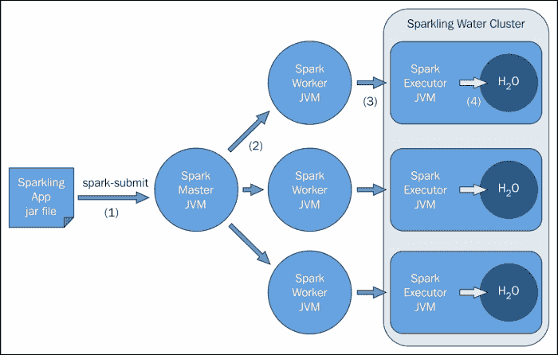

上图解释了 H2O 如何适应 Apache Spark 架构，以及它是如何启动的，但是数据共享呢？数据如何在 Spark 和 H2O 之间传递？下图解释了这一点：

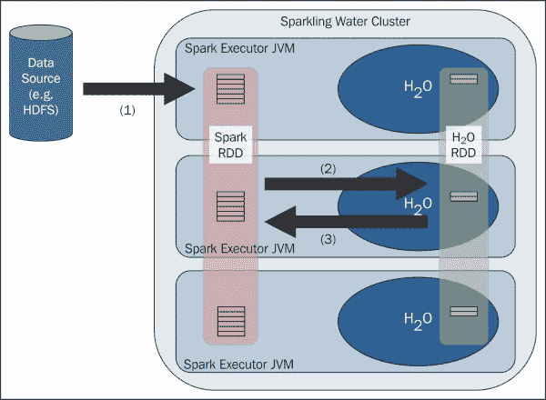

为 H2O 和 Sparkling Water 创建了一个新的 H2O RDD 数据结构。它是一个层，位于 H2O 框架的顶部，其中的每一列代表一个数据项，并且独立压缩以提供最佳的压缩比。

在本章后面呈现的深度学习示例中，您将看到已经从 Spark 模式 RDD 和列数据项隐式创建了一个数据框，并且收入已被枚举。我现在不会详细解释这一点，因为稍后会解释，但这是上述架构的一个实际示例：

```scala
  val testFrame:DataFrame = schemaRddTest
  testFrame.replace( testFrame.find("income"), testFrame.vec("income").toEnum)
```

在本章中将处理的基于 Scala 的示例中，将发生以下操作：

1.  数据来自 HDFS，并存储在 Spark RDD 中。

1.  Spark SQL 用于过滤数据。

1.  Spark 模式 RDD 转换为 H2O RDD。

1.  基于 H2O 的处理和建模正在进行。

1.  结果被传递回 Spark 进行准确性检查。

到目前为止，已经检查了 H2O 的一般架构，并且已经获取了用于使用的产品。已经解释了开发环境，并且已经考虑了 H2O 和 Spark 集成的过程。现在，是时候深入了解 H2O 的实际用法了。不过，首先必须获取一些真实世界的数据用于建模。

# 数据来源

自从我已经在第二章中使用了**人工神经网络**（**ANN**）功能，*Apache Spark MLlib*，来对图像进行分类，似乎只有使用 H2O 深度学习来对本章中的数据进行分类才合适。为了做到这一点，我需要获取适合分类的数据集。我需要包含图像标签的图像数据，或者包含向量和标签的数据，以便我可以强制 H2O 使用其分类算法。

MNIST 测试和训练图像数据来自[ann.lecun.com/exdb/mnist/](http://ann.lecun.com/exdb/mnist/)。它包含 50,000 个训练行和 10,000 个测试行。它包含数字 0 到 9 的数字图像和相关标签。

在撰写本文时，我无法使用这些数据，因为 H2O Sparkling water 中存在一个 bug，限制了记录大小为 128 个元素。MNIST 数据的记录大小为*28 x 28 + 1*，包括图像和标签：

```scala
15/05/14 14:05:27 WARN TaskSetManager: Lost task 0.0 in stage 9.0 (TID 256, hc2r1m4.semtech-solutions.co.nz): java.lang.ArrayIndexOutOfBoundsException: -128
```

在您阅读此文时，这个问题应该已经得到解决并发布，但在短期内，我从[`www.cs.toronto.edu/~delve/data/datasets.html`](http://www.cs.toronto.edu/~delve/data/datasets.html)获取了另一个名为 income 的数据集，其中包含了加拿大雇员的收入数据。以下信息显示了属性和数据量。它还显示了数据中的列列表和一行样本数据：

```scala
Number of attributes: 16
Number of cases: 45,225

age workclass fnlwgt education educational-num marital-status occupation relationship race gender capital-gain capital-loss hours-per-week native-country income

39, State-gov, 77516, Bachelors, 13, Never-married, Adm-clerical, Not-in-family, White, Male, 2174, 0, 40, United-States, <=50K

```

我将枚举数据中的最后一列——收入等级，所以`<=50k`将枚举为`0`。这将允许我强制 H2O 深度学习算法进行分类而不是回归。我还将使用 Spark SQL 来限制数据列，并过滤数据。

数据质量在创建本章描述的基于 H2O 的示例时至关重要。下一节将探讨可以采取的步骤来改善数据质量，从而节省时间。

# 数据质量

当我将 HDFS 中的 CSV 数据文件导入到我的 Spark Scala H2O 示例代码时，我可以过滤传入的数据。以下示例代码包含两行过滤器；第一行检查数据行是否为空，而第二行检查每个数据行中的最后一列（收入）是否为空：

```scala
val testRDD  = rawTestData
  .filter(!_.isEmpty)
  .map(_.split(","))
  .filter( rawRow => ! rawRow(14).trim.isEmpty )
```

我还需要清理原始数据。有两个数据集，一个用于训练，一个用于测试。训练和测试数据必须具备以下特点：

+   相同数量的列

+   相同的数据类型

+   代码中必须允许空值

+   枚举类型的值必须匹配——尤其是标签

我遇到了与枚举标签列收入及其包含的值相关的错误。我发现我的测试数据集行以句点字符“。”结尾。处理时，这导致训练和测试数据的值在枚举时不匹配。

因此，我认为应该花费时间和精力来保障数据质量，作为训练和测试机器学习功能的预备步骤，以免浪费时间和产生额外成本。

# 性能调优

如果在 Spark 网络用户界面中看到以下错误，就需要监控 Spark 应用程序错误和标准输出日志：

```scala
05-15 13:55:38.176 192.168.1.105:54321   6375   Thread-10 ERRR: Out of Memory and no swap space left from hc2r1m1.semtech-solutions.co.nz/192.168.1.105:54321

```

如果您遇到应用执行器似乎没有响应的情况，可能需要调整执行器内存。如果您在执行器日志中看到以下错误，就需要这样做：

```scala
05-19 13:46:57.300 192.168.1.105:54321   10044  Thread-11 WARN: Unblock allocations; cache emptied but memory is low:  OOM but cache is emptied:  MEM_MAX = 89.5 MB, DESIRED_CACHE = 96.4 MB, CACHE = N/A, POJO = N/A, this request bytes = 36.4 MB

```

这可能会导致循环，因为应用程序请求的内存超过了可用内存，因此会等待下一次迭代重试。应用程序似乎会挂起，直到执行器被终止，并在备用节点上重新执行任务。由于这些问题，短任务的运行时间可能会大大延长。

监控 Spark 日志以查找这些类型的错误。在前面的示例中，更改`spark-submit`命令中的执行器内存设置可以消除错误，并大大减少运行时间。所请求的内存值已经降低到低于可用内存的水平。

```scala
 --executor-memory 85m

```

# 深度学习

神经网络在第二章中介绍，*Apache Spark MLlib*。本章在此基础上介绍了深度学习，它使用深度神经网络。这些是功能丰富的神经网络，包含额外的隐藏层，因此它们提取数据特征的能力增强。这些网络通常是前馈网络，其中特征特性是输入到输入层神经元的输入。然后这些神经元激活并将激活传播到隐藏层神经元，最终到输出层，应该呈现特征标签值。然后通过网络（至少在反向传播中）传播输出中的错误，调整神经元连接权重矩阵，以便在训练期间减少分类错误。

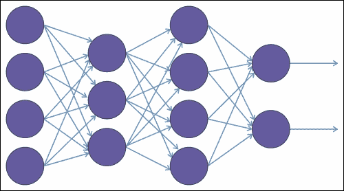

在[H2O 手册](https://leanpub.com/deeplearning/read)中描述的前面的示例图显示了一个深度学习网络，左侧有四个输入神经元，中间有两个隐藏层，右侧有两个输出神经元。箭头显示了神经元之间的连接以及激活通过网络的方向。

这些网络功能丰富，因为它们提供以下选项：

+   多种训练算法

+   自动网络配置

+   能够配置许多选项

+   结构

隐藏层结构

+   训练

学习率、退火和动量

因此，在对深度学习进行简要介绍之后，现在是时候看一些基于 Scala 的示例代码了。H2O 提供了大量的功能；构建和运行网络所需的类已经为您开发好了。您只需要做以下事情：

+   准备数据和参数

+   创建和训练模型

+   使用第二个数据集验证模型

+   对验证数据集输出进行评分

在评分模型时，您必须希望以百分比形式获得高值。您的模型必须能够准确预测和分类您的数据。

## 示例代码 - 收入

本节将使用之前的加拿大收入数据源，检查基于 Scala 的 H2O Sparkling Water 深度学习示例。首先，导入了 Spark（`Context`、`Conf`、`mllib`和`RDD`）和 H2O（`h2o`、`deeplearning`和`water`）类：

```scala
import org.apache.spark.SparkContext
import org.apache.spark.SparkContext._
import org.apache.spark.SparkConf

import hex.deeplearning.{DeepLearningModel, DeepLearning}
import hex.deeplearning.DeepLearningModel.DeepLearningParameters
import org.apache.spark.h2o._
import org.apache.spark.mllib
import org.apache.spark.mllib.feature.{IDFModel, IDF, HashingTF}
import org.apache.spark.rdd.RDD
import water.Key
```

接下来定义了一个名为`h2o_spark_dl2`的应用程序类，创建了主 URL，然后基于此 URL 创建了一个配置对象和应用程序名称。然后使用配置对象创建 Spark 上下文：

```scala
object h2o_spark_dl2  extends App
{
  val sparkMaster = "spark://hc2nn.semtech-solutions.co.nz:7077"
  val appName = "Spark h2o ex1"
  val conf = new SparkConf()

  conf.setMaster(sparkMaster)
  conf.setAppName(appName)

  val sparkCxt = new SparkContext(conf)
```

从 Spark 上下文创建 H2O 上下文，还有一个 SQL 上下文：

```scala
  import org.apache.spark.h2o._
  implicit val h2oContext = new org.apache.spark.h2o.H2OContext(sparkCxt).start()

  import h2oContext._
  import org.apache.spark.sql._

  implicit val sqlContext = new SQLContext(sparkCxt)
```

使用`openFlow`命令启动 H2O Flow 用户界面：

```scala
  import sqlContext._
  openFlow
```

现在定义了数据文件的训练和测试（在 HDFS 上）使用服务器 URL、路径和文件名：

```scala
  val server    = "hdfs://hc2nn.semtech-solutions.co.nz:8020"
  val path      = "/data/spark/h2o/"

  val train_csv =  server + path + "adult.train.data" // 32,562 rows
  val test_csv  =  server + path + "adult.test.data"  // 16,283 rows
```

使用 Spark 上下文的`textFile`方法加载基于 CSV 的训练和测试数据：

```scala
  val rawTrainData = sparkCxt.textFile(train_csv)
  val rawTestData  = sparkCxt.textFile(test_csv)
```

现在，模式是根据属性字符串定义的。然后，通过使用一系列`StructField`，基于每一列拆分字符串，创建了一个模式变量。数据类型保留为字符串，true 值允许数据中的空值：

```scala
  val schemaString = "age workclass fnlwgt education “ + 
“educationalnum maritalstatus " + "occupation relationship race 
gender “ + “capitalgain capitalloss " + hoursperweek nativecountry income"

  val schema = StructType( schemaString.split(" ")
      .map(fieldName => StructField(fieldName, StringType, true)))
```

原始 CSV 行“训练”和测试数据现在通过逗号分割成列。数据被过滤以确保最后一列（“收入”）不为空。实际数据行是从原始 CSV 数据中的十五个（0-14）修剪的元素创建的。训练和测试数据集都经过处理：

```scala
  val trainRDD  = rawTrainData
         .filter(!_.isEmpty)
         .map(_.split(","))
         .filter( rawRow => ! rawRow(14).trim.isEmpty )
         .map(rawRow => Row(
               rawRow(0).toString.trim,  rawRow(1).toString.trim,
               rawRow(2).toString.trim,  rawRow(3).toString.trim,
               rawRow(4).toString.trim,  rawRow(5).toString.trim,
               rawRow(6).toString.trim,  rawRow(7).toString.trim,
               rawRow(8).toString.trim,  rawRow(9).toString.trim,
               rawRow(10).toString.trim, rawRow(11).toString.trim,
               rawRow(12).toString.trim, rawRow(13).toString.trim,
               rawRow(14).toString.trim
                           )
             )

  val testRDD  = rawTestData
         .filter(!_.isEmpty)
         .map(_.split(","))
         .filter( rawRow => ! rawRow(14).trim.isEmpty )
         .map(rawRow => Row(
               rawRow(0).toString.trim,  rawRow(1).toString.trim,
               rawRow(2).toString.trim,  rawRow(3).toString.trim,
               rawRow(4).toString.trim,  rawRow(5).toString.trim,
               rawRow(6).toString.trim,  rawRow(7).toString.trim,
               rawRow(8).toString.trim,  rawRow(9).toString.trim,
               rawRow(10).toString.trim, rawRow(11).toString.trim,
               rawRow(12).toString.trim, rawRow(13).toString.trim,
               rawRow(14).toString.trim
                           )
             )
```

现在使用 Spark 上下文的`applySchema`方法，为训练和测试数据集创建了 Spark Schema RDD 变量：

```scala
  val trainSchemaRDD = sqlContext.applySchema(trainRDD, schema)
  val testSchemaRDD  = sqlContext.applySchema(testRDD,  schema)
```

为训练和测试数据创建临时表：

```scala
  trainSchemaRDD.registerTempTable("trainingTable")
  testSchemaRDD.registerTempTable("testingTable")
```

现在，对这些临时表运行 SQL，既可以过滤列的数量，也可以潜在地限制数据。我可以添加`WHERE`或`LIMIT`子句。这是一个有用的方法，使我能够操纵基于列和行的数据：

```scala
  val schemaRddTrain = sqlContext.sql(
    """SELECT
         |age,workclass,education,maritalstatus,
         |occupation,relationship,race,
         |gender,hoursperweek,nativecountry,income
         |FROM trainingTable """.stripMargin)

  val schemaRddTest = sqlContext.sql(
    """SELECT
         |age,workclass,education,maritalstatus,
         |occupation,relationship,race,
         |gender,hoursperweek,nativecountry,income
         |FROM testingTable """.stripMargin)
```

现在从数据中创建了 H2O 数据框。每个数据集中的最后一列（收入）是枚举的，因为这是将用于数据的深度学习标签的列。此外，枚举此列会强制深度学习模型进行分类而不是回归：

```scala
  val trainFrame:DataFrame = schemaRddTrain
  trainFrame.replace( trainFrame.find("income"),        trainFrame.vec("income").toEnum)
  trainFrame.update(null)

  val testFrame:DataFrame = schemaRddTest
  testFrame.replace( testFrame.find("income"),        testFrame.vec("income").toEnum)
  testFrame.update(null)
```

现在保存了枚举结果数据收入列，以便可以使用该列中的值对测试模型预测值进行评分：

```scala
  val testResArray = schemaRddTest.collect()
  val sizeResults  = testResArray.length
  var resArray     = new ArrayDouble

  for ( i <- 0 to ( resArray.length - 1)) {
     resArray(i) = testFrame.vec("income").at(i)
  }
```

现在，深度学习模型参数已经设置好，包括迭代次数（或迭代次数）-用于训练和验证的数据集以及标签列收入，这将用于对数据进行分类。此外，我们选择使用变量重要性来确定数据中哪些数据列最重要。然后创建深度学习模型：

```scala
  val dlParams = new DeepLearningParameters()

  dlParams._epochs               = 100
  dlParams._train                = trainFrame
  dlParams._valid                = testFrame
  dlParams._response_column      = 'income
  dlParams._variable_importances = true
  val dl = new DeepLearning(dlParams)
  val dlModel = dl.trainModel.get
```

然后对模型进行针对测试数据集的评分，进行预测，这些收入预测值与先前存储的枚举测试数据收入值进行比较。最后，从测试数据中输出准确率百分比：

```scala
  val testH2oPredict  = dlModel.score(schemaRddTest )('predict)
  val testPredictions  = toRDDDoubleHolder
          .collect.map(_.result.getOrElse(Double.NaN))
  var resAccuracy = 0
  for ( i <- 0 to ( resArray.length - 1)) {
    if (  resArray(i) == testPredictions(i) )
      resAccuracy = resAccuracy + 1
  }

  println()
  println( ">>>>>>>>>>>>>>>>>>>>>>>>>>>>>>>>>>>>>" )
  println( ">>>>>> Model Test Accuracy = "
       + 100*resAccuracy / resArray.length  + " % " )
  println( ">>>>>>>>>>>>>>>>>>>>>>>>>>>>>>>>>>>>>" )
  println()
```

在最后一步中，应用程序被停止，通过`shutdown`调用终止 H2O 功能，然后停止 Spark 上下文：

```scala
  water.H2O.shutdown()
  sparkCxt.stop()

  println( " >>>>> Script Finished <<<<< " )

} // end application
```

基于训练数据集的 32,000 条记录和测试数据集的 16,000 条收入记录，这个深度学习模型非常准确。它达到了`83`％的准确度水平，这对于几行代码、小数据集和仅 100 个迭代次数来说是令人印象深刻的，如运行输出所示：

```scala
>>>>>>>>>>>>>>>>>>>>>>>>>>>>>>>>>>>>>
>>>>>> Model Test Accuracy = 83 %
>>>>>>>>>>>>>>>>>>>>>>>>>>>>>>>>>>>>>

```

在下一节中，我将检查处理 MNIST 数据所需的一些编码，尽管由于编码时的 H2O 限制，该示例无法完成。

## 示例代码-MNIST

由于 MNIST 图像数据记录非常庞大，在创建 Spark SQL 模式和处理数据记录时会出现问题。此数据中的记录以 CSV 格式形成，并由 28 x 28 数字图像组成。然后，每行以图像的标签值终止。我通过定义一个函数来创建表示记录的模式字符串，然后调用它来创建我的模式：

```scala
  def getSchema(): String = {

    var schema = ""
    val limit = 28*28

    for (i <- 1 to limit){
      schema += "P" + i.toString + " "
    }
    schema += "Label"

    schema // return value
  }

  val schemaString = getSchema()
  val schema = StructType( schemaString.split(" ")
      .map(fieldName => StructField(fieldName, IntegerType, false)))
```

与先前的示例一样，可以采用与深度学习相同的一般方法来处理数据，除了实际处理原始 CSV 数据。有太多列需要单独处理，并且它们都需要转换为整数以表示它们的数据类型。可以通过两种方式之一来完成。在第一个示例中，可以使用`var args`来处理行中的所有元素：

```scala
val trainRDD  = rawTrainData.map( rawRow => Row( rawRow.split(",").map(_.toInt): _* ))
```

第二个示例使用`fromSeq`方法来处理行元素：

```scala
  val trainRDD  = rawTrainData.map(rawRow => Row.fromSeq(rawRow.split(",") .map(_.toInt)))
```

在下一节中，将检查 H2O Flow 用户界面，以了解如何使用它来监视 H2O 并处理数据。

# H2O 流

H2O Flow 是 H2O 的基于 Web 的开源用户界面，并且由于它与 Spark 一起使用，因此也可以使用 Sparkling Water。这是一个完全功能的 H2O Web 界面，用于监视 H2O Sparkling Water 集群和作业，以及操作数据和训练模型。我已经创建了一些简单的示例代码来启动 H2O 界面。与之前基于 Scala 的代码示例一样，我所需要做的就是创建一个 Spark，一个 H2O 上下文，然后调用`openFlow`命令，这将启动 Flow 界面。

以下 Scala 代码示例仅导入了用于 Spark 上下文、配置和 H2O 的类。然后根据应用程序名称和 Spark 集群 URL 定义配置。然后使用配置对象创建 Spark 上下文：

```scala
import org.apache.spark.SparkContext
import org.apache.spark.SparkContext._
import org.apache.spark.SparkConf
import org.apache.spark.h2o._

object h2o_spark_ex2  extends App
{
  val sparkMaster = "spark://hc2nn.semtech-solutions.co.nz:7077"
  val appName = "Spark h2o ex2"
  val conf = new SparkConf()

  conf.setMaster(sparkMaster)
  conf.setAppName(appName)

  val sparkCxt = new SparkContext(conf)
```

然后创建了一个 H2O 上下文，并使用 Spark 上下文启动了它。导入了 H2O 上下文类，并使用`openFlow`命令启动了 Flow 用户界面：

```scala
  implicit val h2oContext = new org.apache.spark.h2o.H2OContext(sparkCxt).start()

  import h2oContext._

  // Open H2O UI

  openFlow
```

请注意，为了让我能够使用 Flow 应用程序，我已经注释掉了 H2O 关闭和 Spark 上下文停止选项。我通常不会这样做，但我想让这个应用程序长时间运行，这样我就有足够的时间使用界面：

```scala
  // shutdown h20

//  water.H2O.shutdown()
//  sparkCxt.stop()

  println( " >>>>> Script Finished <<<<< " )

} // end application
```

我使用我的 Bash 脚本`run_h2o.bash`，并将应用程序类名称为`h2o_spark_ex2`作为参数。这个脚本包含对`spark-submit`命令的调用，它将执行编译后的应用程序：

```scala
[hadoop@hc2r1m2 h2o_spark_1_2]$ ./run_h2o.bash h2o_spark_ex2

```

当应用程序运行时，它会列出 H2O 集群的状态，并提供一个 URL，通过该 URL 可以访问 H2O Flow 浏览器：

```scala
15/05/20 13:00:21 INFO H2OContext: Sparkling Water started, status of context:
Sparkling Water Context:
 * number of executors: 4
 * list of used executors:
 (executorId, host, port)
 ------------------------
 (1,hc2r1m4.semtech-solutions.co.nz,54321)
 (3,hc2r1m2.semtech-solutions.co.nz,54321)
 (0,hc2r1m3.semtech-solutions.co.nz,54321)
 (2,hc2r1m1.semtech-solutions.co.nz,54321)
 ------------------------

 Open H2O Flow in browser: http://192.168.1.108:54323 (CMD + click in Mac OSX)

```

前面的例子表明，我可以使用主机 IP 地址`192.168.1.108`上的端口号`54323`访问 H2O 界面。我可以简单地检查我的主机文件，确认主机名是`hc2r1m2`：

```scala
[hadoop@hc2nn ~]$ cat /etc/hosts | grep hc2
192.168.1.103 hc2nn.semtech-solutions.co.nz   hc2nn
192.168.1.105 hc2r1m1.semtech-solutions.co.nz   hc2r1m1
192.168.1.108 hc2r1m2.semtech-solutions.co.nz   hc2r1m2
192.168.1.109 hc2r1m3.semtech-solutions.co.nz   hc2r1m3
192.168.1.110 hc2r1m4.semtech-solutions.co.nz   hc2r1m4

```

因此，我可以使用`hc2r1m2:54323`的 URL 访问界面。下面的截图显示了 Flow 界面没有加载数据。页面顶部有数据处理和管理菜单选项和按钮。右侧有帮助选项，让您可以更多地了解 H2O：

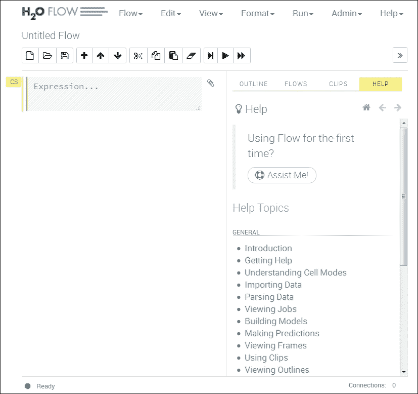

以下截图更详细地显示了菜单选项和按钮。在接下来的章节中，我将使用一个实际的例子来解释其中一些选项，但在本章中没有足够的空间来涵盖所有的功能。请查看[`h2o.ai/`](http://h2o.ai/)网站，详细了解 Flow 应用程序，可在[`h2o.ai/product/flow/`](http://h2o.ai/product/flow/)找到：

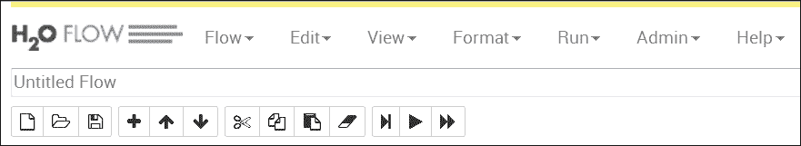

更详细地说，前面的菜单选项和按钮允许您管理您的 H2O Spark 集群，并操纵您希望处理的数据。下面的截图显示了可用的帮助选项的重新格式化列表，这样，如果遇到问题，您可以在同一个界面上调查解决问题：

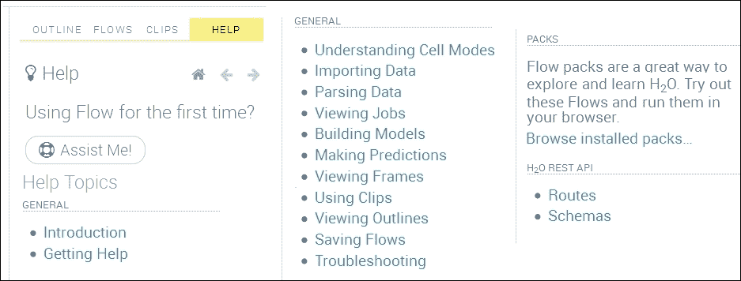

如果我使用菜单选项**Admin** | **Cluster Status**，我将获得以下截图，显示了每个集群服务器的内存、磁盘、负载和核心状态。这是一个有用的快照，为我提供了状态的彩色指示：

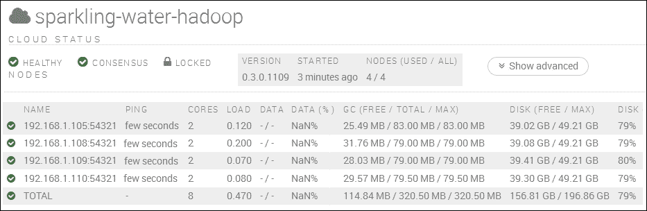

菜单选项**Admin** | **Jobs**提供了当前集群作业的详细信息，包括开始、结束和运行时间，以及状态。单击作业名称会提供更多详细信息，包括数据处理细节和估计的运行时间，这是很有用的。此外，如果选择**Refresh**按钮，显示将持续刷新，直到取消选择为止：

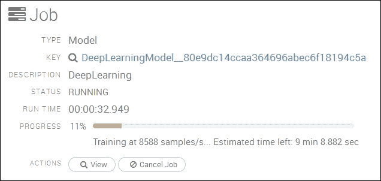

**Admin** | **Water Meter**选项提供了集群中每个节点的 CPU 使用情况的可视化显示。如下截图所示，我的仪表显示我的集群处于空闲状态：

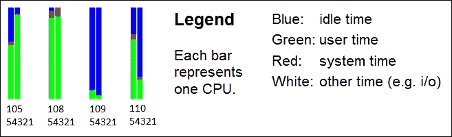

使用菜单选项**Flow** | **Upload File**，我已经上传了之前基于 Scala 的深度学习示例中使用的一些训练数据。数据已加载到数据预览窗格中；我可以看到数据的样本已经组织成单元格。还对数据类型进行了准确的猜测，这样我就可以看到哪些列可以被列举。如果我想考虑分类，这是很有用的：

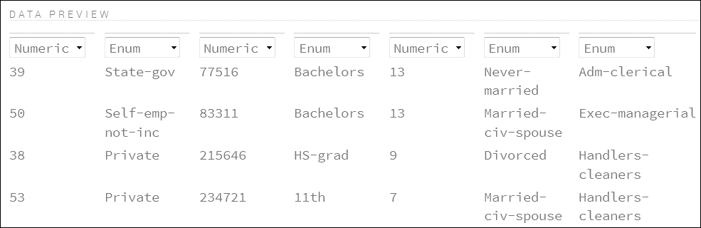

加载完数据后，我现在看到了一个**Frame**显示，它让我能够查看、检查、构建模型、创建预测或下载数据。数据显示了最小值、最大值和平均值等信息。它显示了数据类型、标签和零数据计数，如下截图所示：

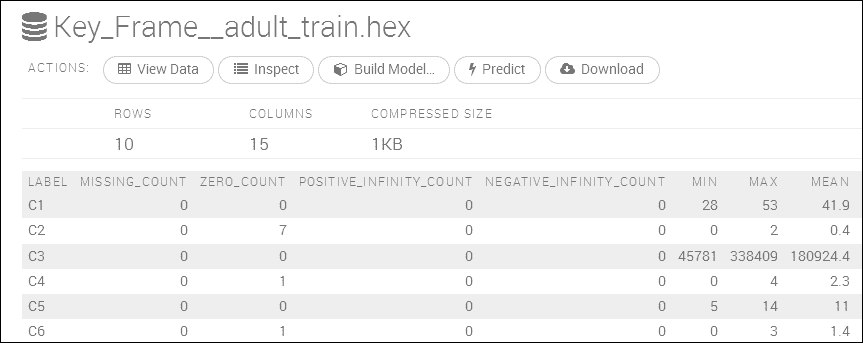

我认为基于这些数据创建深度学习分类模型，以比较基于 Scala 的方法和 H2O 用户界面会很有用。使用查看和检查选项，可以直观地交互式地检查数据，并创建与数据相关的图表。例如，使用先前的检查选项，然后选择绘制列选项，我能够创建一个数据标签与列数据中零计数的图表。以下截图显示了结果：

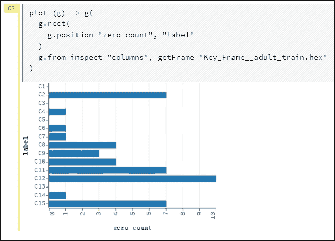

通过选择构建模型选项，会提供一个菜单选项，让我选择模型类型。我将选择深度学习，因为我已经知道这些数据适合这种分类方法。先前基于 Scala 的模型的准确度达到了 83%：

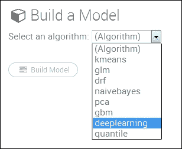

我选择了深度学习选项。选择了这个选项后，我可以设置模型参数，如训练和验证数据集，以及选择模型应该使用的数据列（显然，两个数据集应该包含相同的列）。以下截图显示了被选择的数据集和模型列：

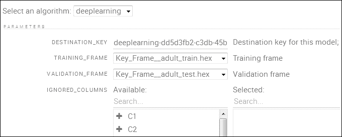

有大量基本和高级模型选项可供选择。其中一些显示在以下截图中。我已将响应列设置为 15 作为收入列。我还设置了**VARIABLE_IMPORTANCES**选项。请注意，我不需要枚举响应列，因为它已经自动完成了：

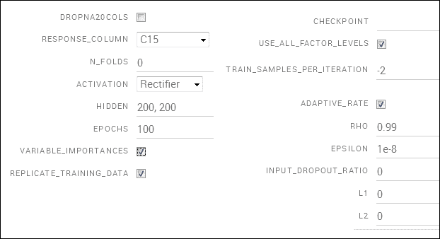

还要注意，迭代选项设置为**100**与之前一样。此外，隐藏层的`200,200`表示网络有两个隐藏层，每个隐藏层有 200 个神经元。选择构建模型选项会根据这些参数创建模型。以下截图显示了正在训练的模型，包括训练时间的估计和迄今为止处理的数据的指示。

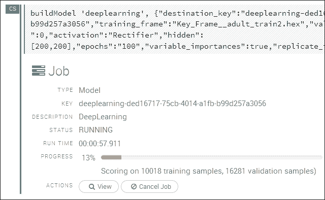

一旦训练完成，查看模型会显示训练和验证指标，以及重要训练参数的列表：

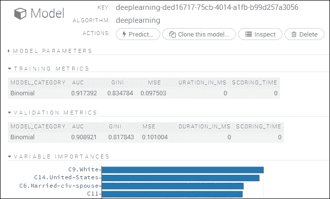

选择**预测**选项可以指定另一个验证数据集。使用新数据集选择**预测**选项会导致已经训练的模型针对新的测试数据集进行验证：

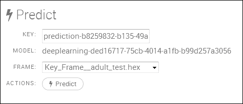

选择**预测**选项会导致深度学习模型和数据集的预测细节显示如下截图所示：

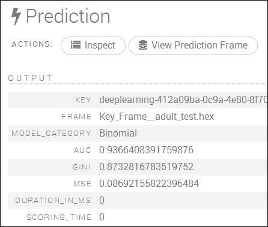

前面的截图显示了测试数据框架和模型类别，以及 AUC、GINI 和 MSE 的验证统计数据。

AUC 值，即曲线下面积，与 ROC 曲线相关，ROC 曲线也显示在以下截图中。TPR 表示**真正率**，FPR 表示**假正率**。AUC 是一个准确度的度量，值为 1 表示完美。因此，蓝线显示的准确度比红线高：

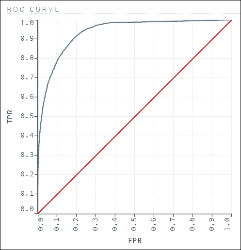

这个界面中有很多功能，我没有解释，但我希望我已经让您感受到了它的强大和潜力。您可以使用这个界面来检查数据，并在尝试开发代码之前创建报告，或者作为一个独立的应用程序来深入研究您的数据。

# 摘要

当我检查 Apache Hadoop 和 Spark 时，我的持续主题是，这些系统都不是独立的。它们需要集成在一起形成基于 ETL 的处理系统。数据需要在 Spark 中进行源和处理，然后传递到 ETL 链中的下一个链接，或者存储起来。我希望本章已经向您展示了，Spark 功能可以通过额外的库和 H2O 等系统进行扩展。

尽管 Apache Spark MLlib（机器学习库）具有许多功能，但 H2O Sparkling Water 和 Flow web 界面的组合提供了额外丰富的数据分析建模选项。使用 Flow，您还可以直观、交互式地处理数据。希望本章能向您展示，尽管无法涵盖 H2O 提供的所有内容，但 Spark 和 H2O 的组合扩大了您的数据处理可能性。

希望您觉得本章内容有用。作为下一步，您可以考虑查看[`h2o.ai/`](http://h2o.ai/)网站或 H2O Google 小组，该小组可在[`groups.google.com/forum/#!forum/h2ostream`](https://groups.google.com/forum/#!forum/h2ostream)上找到。

下一章将审查基于 Spark 的服务[`databricks.com/`](https://databricks.com/)，该服务将在云中使用 Amazon AWS 存储来创建 Spark 集群。
