# 第八章：Spark Databricks

创建大数据分析集群，导入数据，创建 ETL 流以清洗和处理数据是困难且昂贵的。Databricks 的目标是降低复杂性，使集群创建和数据处理过程更加简单。他们创建了一个基于 Apache Spark 的云平台，自动化了集群创建，并简化了数据导入、处理和可视化。目前，存储基于 AWS，但未来他们计划扩展到其他云提供商。

设计 Apache Spark 的同一批人参与了 Databricks 系统。在撰写本书时，该服务只能通过注册访问。我获得了 30 天的试用期。在接下来的两章中，我将检查该服务及其组件，并提供一些示例代码来展示其工作原理。本章将涵盖以下主题：

+   安装 Databricks

+   AWS 配置

+   帐户管理

+   菜单系统

+   笔记本和文件夹

+   通过库导入作业

+   开发环境

+   Databricks 表

+   Databricks DbUtils 包

鉴于本书以静态格式提供，完全检查流式等功能将会很困难。

# 概述

Databricks 服务，可在[`databricks.com/`](https://databricks.com/)网站上获得，基于集群的概念。这类似于 Spark 集群，在之前的章节中已经进行了检查和使用。它包含一个主节点、工作节点和执行器。但是，集群的配置和大小是自动化的，取决于您指定的内存量。诸如安全性、隔离、进程监控和资源管理等功能都会自动为您管理。如果您有一个短时间内需要使用 200GB 内存的基于 Spark 的集群，这项服务可以动态创建它，并处理您的数据。处理完成后，您可以终止集群以减少成本。

在集群中，引入了笔记本的概念，以及一个位置供您创建脚本和运行程序。可以在笔记本中创建基于 Scala、Python 或 SQL 的文件夹。可以创建作业来执行功能，并可以从笔记本代码或导入的库中调用。笔记本可以调用笔记本功能。此外，还提供了根据时间或事件安排作业的功能。

这为您提供了 Databricks 服务提供的感觉。接下来的章节将解释每个引入的主要项目。请记住，这里呈现的内容是新的并且正在发展。此外，我在这个演示中使用了 AWS US East (North Virginia)地区，因为亚洲悉尼地区目前存在限制，导致 Databricks 安装失败。

# 安装 Databricks

为了创建这个演示，我使用了 AWS 提供的一年免费访问，该访问可在[`aws.amazon.com/free/`](http://aws.amazon.com/free/)上获得。这有一些限制，比如 5GB 的 S3 存储和 750 小时的 Amazon Elastic Compute Cloud (EC2)，但它让我以较低成本访问并减少了我的整体 EC2 成本。AWS 账户提供以下内容：

+   帐户 ID

+   一个访问密钥 ID

+   一个秘密访问密钥

这些信息项目被 Databricks 用来访问您的 AWS 存储，安装 Databricks 系统，并创建您指定的集群组件。从安装开始，您就开始产生 AWS EC2 成本，因为 Databricks 系统使用至少两个运行实例而没有任何集群。一旦您成功输入了 AWS 和计费信息，您将被提示启动 Databricks 云。

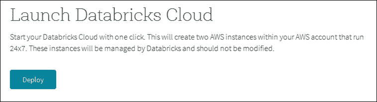

完成这些操作后，您将获得一个 URL 来访问您的云、一个管理员账户和密码。这将允许您访问 Databricks 基于 Web 的用户界面，如下面的截图所示：

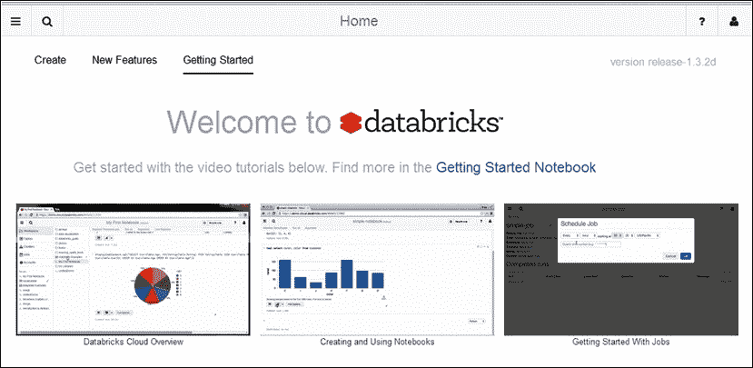

这是欢迎界面。它显示了图像顶部的菜单栏，从左到右依次包括菜单、搜索、帮助和账户图标。在使用系统时，还可能有一个显示最近活动的时钟图标。通过这个单一界面，您可以在创建自己的集群和代码之前搜索帮助屏幕和使用示例。

# AWS 计费

请注意，一旦安装了 Databricks 系统，您将开始产生 AWS EC2 存储成本。Databricks 试图通过保持 EC2 资源活动来最小化您的成本，以便进行完整的计费周期。例如，如果终止 Databricks 集群，基于集群的 EC2 实例仍将存在于 AWS 为其计费的一个小时内。通过这种方式，如果您创建一个新的集群，Databricks 可以重用它们。下面的截图显示，尽管我正在使用一个免费的 AWS 账户，并且我已经仔细减少了我的资源使用，但我在短时间内产生了 AWS EC2 成本：

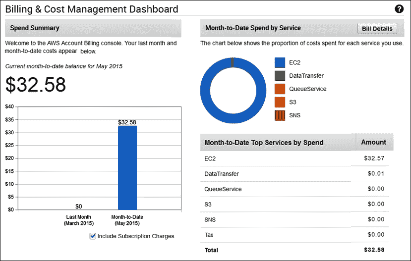

您需要了解您创建的 Databricks 集群，并了解，当它们存在并被使用时，将产生 AWS 成本。只保留您真正需要的集群，并终止其他任何集群。

为了检查 Databricks 数据导入功能，我还创建了一个 AWS S3 存储桶，并将数据文件上传到其中。这将在本章后面进行解释。

# Databricks 菜单

通过选择 Databricks Web 界面上的左上角菜单图标，可以展开菜单系统。下面的截图显示了顶级菜单选项，以及**工作区**选项，展开到`/folder1/folder2/`的文件夹层次结构。最后，它显示了可以在`folder2`上执行的操作，即创建一个笔记本、创建一个仪表板等。

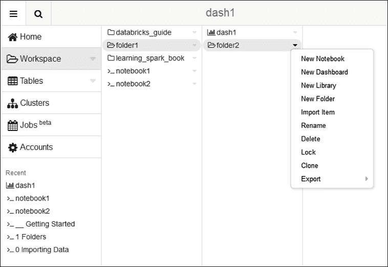

所有这些操作将在以后的章节中扩展。下一节将介绍账户管理，然后转到集群。

# 账户管理

在 Databricks 中，账户管理非常简化。有一个默认的管理员账户，可以创建后续账户，但您需要知道管理员密码才能这样做。密码需要超过八个字符；它们应该包含至少一个数字、一个大写字母和一个非字母数字字符。**账户**选项可以从右上角的菜单选项中访问，如下面的截图所示：

账户管理

这也允许用户注销。通过选择账户设置，您可以更改密码。通过选择**账户**菜单选项，将生成一个**账户**列表。在那里，您将找到一个**添加账户**的选项，并且每个账户行都可以通过每个账户行上的**X**选项进行删除，如下面的截图所示：

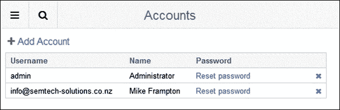

还可以从账户列表重置账户密码。选择**添加账户**选项会创建一个新的账户窗口，需要一个电子邮件地址、全名、管理员密码和用户密码。因此，如果您想创建一个新用户，您需要知道您的 Databricks 实例管理员密码。您还必须遵循新密码的规则，如下所示：

+   至少八个字符

+   必须包含 0-9 范围内的至少一个数字

+   必须包含 A-Z 范围内的至少一个大写字母

+   必须包含至少一个非字母数字字符：!@#$%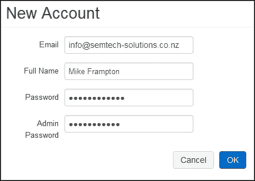

下一节将介绍**集群**菜单选项，并使您能够管理自己的 Databricks Spark 集群。

# 集群管理

选择**集群**菜单选项会提供您当前的 Databricks 集群及其状态的列表。当然，当前您还没有。选择**添加集群**选项允许您创建一个。请注意，您指定的内存量决定了您的集群的大小。创建具有单个主节点和工作节点的集群需要至少 54GB。对于每增加的 54GB，将添加一个工作节点。

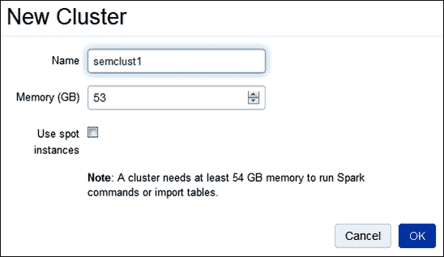

下面的截图是一个连接的图像，显示了一个名为`semclust1`的新集群正在创建中，处于**Pending**状态。在**Pending**状态下，集群没有仪表板，集群节点也无法访问。

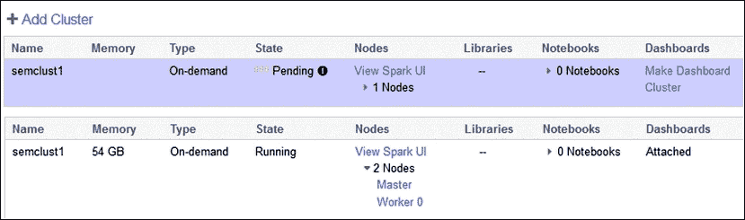

创建后，集群内存会被列出，并且其状态会从**Pending**变为**Running**。默认情况下会自动附加一个仪表板，并且可以访问 Spark 主节点和工作节点用户界面。这里需要注意的是，Databricks 会自动启动和管理集群进程。在显示的右侧还有一个**Option**列，提供了**配置**、**重启**或**终止**集群的能力，如下面的截图所示：

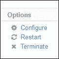

通过重新配置集群，可以改变其大小。通过增加内存，可以增加工作节点。下面的截图显示了一个集群，创建时默认大小为 54GB，其内存扩展到了`108`GB。

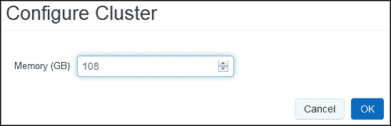

终止集群会将其删除，无法恢复。因此，您需要确保删除是正确的操作。在终止实际发生之前，Databricks 会提示您确认您的操作。


创建和终止集群都需要时间。在终止期间，集群会被标记为橙色横幅，并显示**终止**状态，如下面的截图所示：

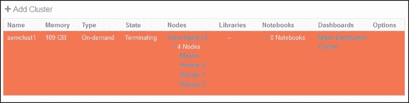

请注意，前面截图中的集群类型显示为**按需**。创建集群时，可以选择一个名为**使用竞价实例创建竞价集群**的复选框。这些集群比按需集群更便宜，因为它们出价更低的 AWS 竞价。但是，它们启动可能比按需集群慢。

Spark 用户界面与您在非 Databricks Spark 集群上期望的一样。您可以检查工作节点、执行器、配置和日志文件。创建集群时，它们将被添加到您的集群列表中。其中一个集群将被用作运行仪表板的集群。可以通过使用**创建仪表板集群**选项来更改这一点。当您向集群添加库和笔记本时，集群详细信息条目将更新为添加的数量。

我现在唯一想说的关于 Databricks Spark 用户界面选项，因为它很熟悉，就是它显示了使用的 Spark 版本。下面的截图从主用户界面中提取，显示了正在使用的 Spark 版本（1.3.0）非常新。在撰写本文时，最新的 Apache Spark 版本是 1.3.1，日期为 2015 年 4 月 17 日。

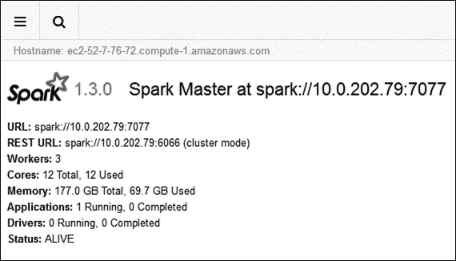

下一节将介绍 Databricks 笔记本和文件夹——如何创建它们以及它们的用途。

# 笔记本和文件夹

笔记本是一种特殊类型的 Databricks 文件夹，可用于创建 Spark 脚本。笔记本可以调用笔记本脚本来创建功能层次结构。创建时，必须指定笔记本的类型（Python、Scala 或 SQL），然后可以指定集群可以运行笔记本功能。下面的截图显示了笔记本的创建。

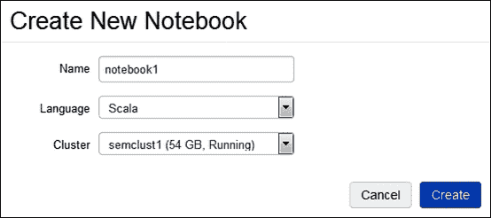

请注意，笔记本会话右侧的菜单选项允许更改笔记本的类型。下面的示例显示了 Python 笔记本可以更改为**Scala**、**SQL**或**Markdown**：

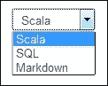

请注意，Scala 笔记本无法更改为 Python，Python 笔记本也无法更改为 Scala。Python、Scala 和 SQL 这些术语作为开发语言是众所周知的，然而，**Markdown**是新的。Markdown 允许从文本中的格式化命令创建格式化文档。可以在[`forums.databricks.com/static/markdown/help.html`](https://forums.databricks.com/static/markdown/help.html)找到一个简单的参考。

这意味着在创建脚本时，格式化的注释可以添加到笔记本会话中。笔记本进一步细分为单元格，其中包含要执行的命令。可以通过悬停在左上角并将其拖放到位置来在笔记本中移动单元格。可以在笔记本中的单元格列表中插入新单元格。

此外，在 Scala 或 Python 笔记本单元格中使用`%sql`命令允许使用 SQL 语法。通常，*Shift* + *Enter*的组合会导致笔记本或文件夹中的文本块被执行。使用`%md`命令允许在单元格内添加 Markdown 注释。还可以向笔记本单元格添加注释。在笔记本单元格的右上部分显示的菜单选项显示了注释以及最小化和最大化选项：


多个基于 Web 的会话可以共享一个笔记本。在笔记本中发生的操作将被填充到查看它的每个 Web 界面中。此外，Markdown 和注释选项可用于启用用户之间的通信，以帮助分布式组之间的交互式数据调查。

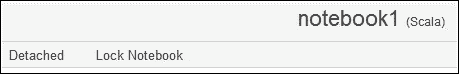

上面的屏幕截图显示了**notebook1**的笔记本会话的标题。它显示了笔记本名称和类型（**Scala**）。它还显示了将笔记本锁定以使其只读的选项，以及将其从其集群中分离的选项。下面的屏幕截图显示了在笔记本工作区内创建文件夹的过程：

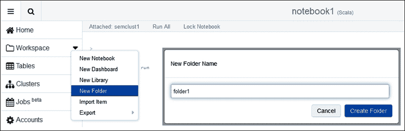

从**工作区**主菜单选项的下拉菜单中，可以创建一个文件夹，例如`folder1`。稍后的部分将描述此菜单中的其他选项。创建并选择后，从名为`folder1`的新文件夹的下拉菜单中，显示了与其关联的操作，如下面的屏幕截图所示：

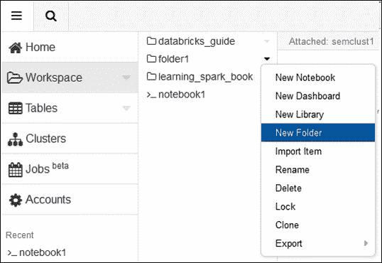

因此，文件夹可以导出为 DBC 存档。它可以被锁定，或者克隆以创建副本。也可以重命名或删除。可以将项目导入其中；例如，稍后将通过示例解释文件。还可以在其中创建新的笔记本、仪表板、库和文件夹。

与文件夹一样，笔记本也有一组可能的操作。下面的屏幕截图显示了通过下拉菜单可用的操作，用于名为`notebook1`的笔记本，它当前附加到名为`semclust1`的运行集群。可以重命名、删除、锁定或克隆笔记本。还可以将其从当前集群中分离，或者如果它被分离，则可以附加它。还可以将笔记本导出到文件或 DBC 存档。

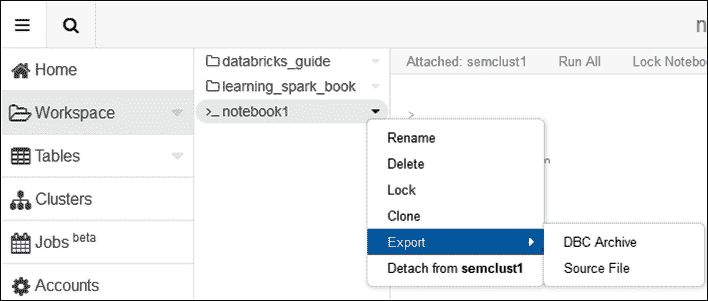

从文件夹**导入**选项，文件可以导入到文件夹中。下面的屏幕截图显示了如果选择此选项将调用的文件拖放选项窗口。可以将文件拖放到本地服务器上的上传窗格上，也可以单击该窗格以打开导航浏览器，以搜索要上传的文件。

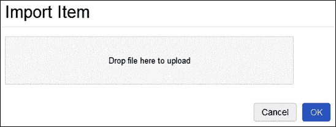

需要上传的文件需要是特定类型。以下截图显示了支持的文件类型。这是从文件浏览器中浏览要上传的文件时拍摄的截图。这也是有道理的。支持的文件类型包括 Scala、SQL 和 Python；以及 DBC 存档和 JAR 文件库。

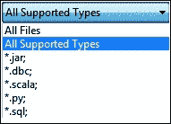

在离开这一部分之前，还应该注意到，可以拖放笔记本和文件夹来改变它们的位置。下一节将通过简单的示例来检查 Databricks 作业和库。

# 工作和图书馆

在 Databricks 中，可以导入 JAR 库并在集群上运行其中的类。我将创建一个非常简单的 Scala 代码片段，以在我的 Centos Linux 服务器上本地打印出斐波那契数列的前 100 个元素作为`BigInt`值。我将使用 SBT 将我的类编译成一个 JAR 文件，在本地运行以检查结果，然后在我的 Databricks 集群上运行以比较结果。代码如下所示：

```scala
import org.apache.spark.SparkContext
import org.apache.spark.SparkContext._
import org.apache.spark.SparkConf

object db_ex1  extends App
{
  val appName = "Databricks example 1"
  val conf = new SparkConf()

  conf.setAppName(appName)

  val sparkCxt = new SparkContext(conf)

  var seed1:BigInt = 1
  var seed2:BigInt = 1
  val limit = 100
  var resultStr = seed1 + " " + seed2 + " "

  for( i <- 1 to limit ){

    val fib:BigInt = seed1 + seed2
    resultStr += fib.toString + " "

    seed1 = seed2
    seed2 = fib
  }

  println()
  println( "Result : " + resultStr )
  println()

  sparkCxt.stop()

} // end application
```

并不是最优雅的代码片段，也不是创建斐波那契数列的最佳方式，但我只是想要一个用于 Databricks 的示例 JAR 和类。在本地运行时，我得到了前 100 个项，如下所示（我已剪辑了这些数据以节省空间）：

```scala
Result : 1 1 2 3 5 8 13 21 34 55 89 144 233 377 610 987 1597 2584 4181 6765 10946 17711 28657 46368 75025 121393 196418 317811 514229 832040 1346269 2178309 3524578 5702887 9227465 14930352 24157817 39088169 63245986 102334155 165580141 267914296 433494437 701408733 1134903170 1836311903 2971215073 4807526976 7778742049 12586269025 20365011074 32951280099 53316291173

4660046610375530309 7540113804746346429 12200160415121876738 19740274219868223167 31940434634990099905 51680708854858323072 83621143489848422977 135301852344706746049 218922995834555169026 354224848179261915075 573147844013817084101 927372692193078999176

```

已创建的库名为`data-bricks_2.10-1.0.jar`。从我的文件夹菜单中，我可以使用下拉菜单选项创建一个新的库。这允许我指定库源为一个 JAR 文件，命名新库，并从我的本地服务器加载库 JAR 文件。以下截图显示了这个过程的一个例子：

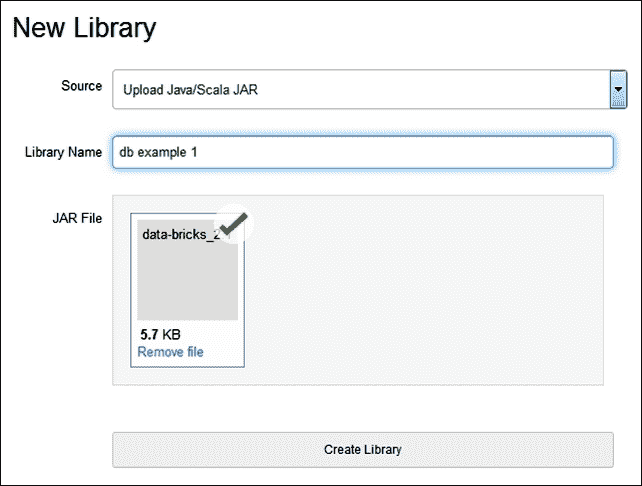

创建库后，可以使用**附加**选项将其附加到名为`semclust1`的集群，即我的 Databricks 集群。以下截图显示了正在附加新库的过程：

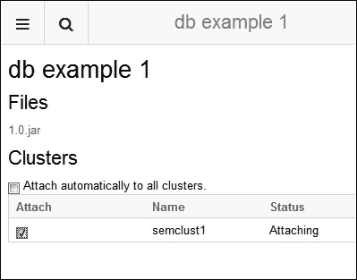

在下面的例子中，通过在**任务**项目上选择**jar**选项创建了一个名为**job2**的作业。对于该作业，已加载了相同的 JAR 文件，并将类`db_ex1`分配到库中运行。集群已被指定为按需，这意味着将自动创建一个集群来运行作业。**活动运行**部分显示了作业在以下截图中的运行情况：

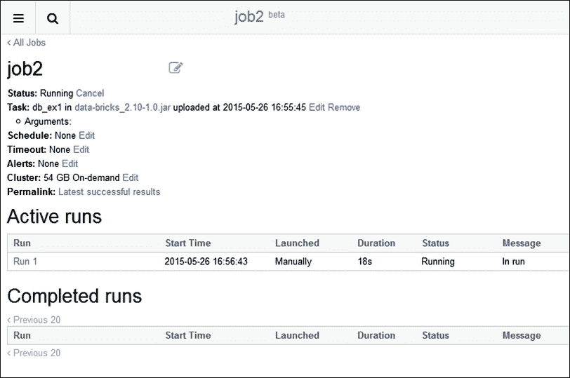

运行后，作业将移至显示的**已完成运行**部分。对于相同的作业，以下截图显示了它运行了`47`秒，是手动启动的，并且成功了。

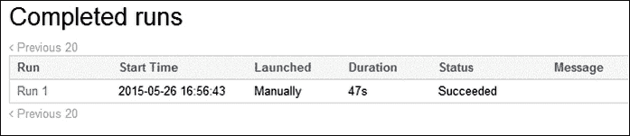

通过在前面的截图中选择名为**Run 1**的运行，可以查看运行输出。以下截图显示了与本地运行相同的结果，显示了来自我的本地服务器执行的结果。我已剪辑输出文本以使其在此页面上呈现和阅读，但您可以看到输出是相同的。

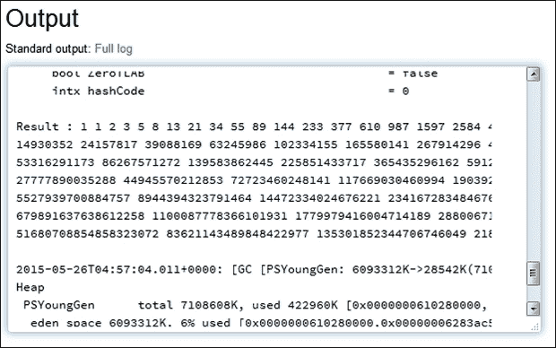

因此，即使从这个非常简单的例子中，很明显可以远程开发应用程序，并将它们作为 JAR 文件加载到 Databricks 集群中以执行。然而，每次在 AWS EC2 存储上创建 Databricks 集群时，Spark URL 都会发生变化，因此应用程序不应该硬编码诸如 Spark 主 URL 之类的细节。Databricks 将自动设置 Spark URL。

以这种方式运行 JAR 文件类时，也可以定义类参数。作业可以被安排在特定时间运行，或定期运行。还可以指定作业超时和警报电子邮件地址。

# 开发环境

已经证明可以在 Scala、Python 或 SQL 的笔记本中创建脚本，但也可以使用诸如 IntelliJ 或 Eclipse 之类的 IDE 来开发代码。通过在开发环境中安装 SBT 插件，可以为 Databricks 环境开发代码。在我写这本书的时候，Databricks 的当前版本是 1.3.2d。在起始页面的**新功能**下的**发布说明**链接中包含了 IDE 集成的链接，即`https://dbc-xxxxxxx-xxxx.cloud.databricks.com/#shell/1547`。

URL 将采用这种形式，以`dbc`开头的部分将更改以匹配您将创建的 Databricks 云的 URL。我不会在这里展开，而是留给您去调查。在下一节中，我将调查 Databricks 表数据处理功能。

# Databricks 表

Databricks 的**表**菜单选项允许您以表格形式存储数据，并附带模式。**表**菜单选项允许您创建表格，并刷新表格列表，如下面的截图所示：

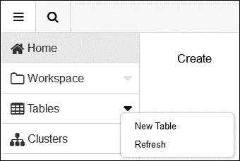

## 数据导入

您可以通过数据导入创建表，并同时指定列名和类型的表结构。如果要导入的数据具有标题，则可以从中获取列名，尽管所有列类型都被假定为字符串。下面的截图显示了在创建表时可用的数据导入选项和表单的连接视图。导入文件位置选项包括**S3**、**DBFS**、**JDBC**和**文件**。

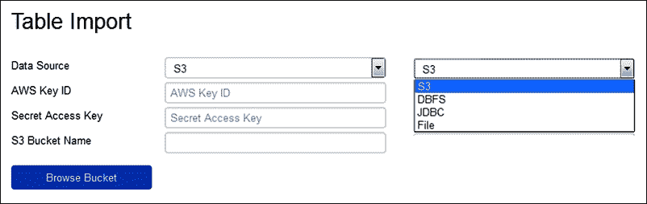

前面的截图显示了选择了**S3**。为了浏览我的**S3**存储桶以将文件导入表中，我需要输入**AWS Key ID**、**Secret Access Key**和**AWS S3 Bucket Name**。然后，我可以浏览、选择文件，并通过预览创建表。在下面的截图中，我选择了**文件**选项：

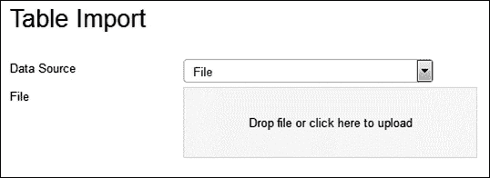

我可以将要导入的文件拖放到下面截图中的上传框中，或者单击框以浏览本地服务器以选择要上传的文件。选择文件后，可以定义数据列分隔符，以及数据是否包含标题行。可以预览数据，并更改列名和数据类型。还可以指定新表名和文件类型。下面的截图显示了加载示例文件数据以创建名为`shuttle`的表：

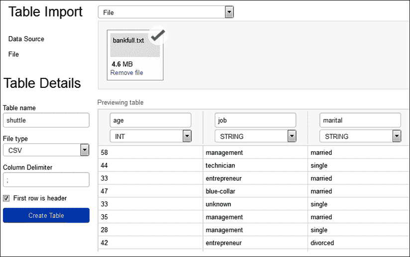

创建后，菜单表列表可以刷新，并且可以查看表模式以确认列名和类型。通过这种方式，还可以预览表数据的样本。现在可以从 SQL 会话中查看和访问表。下面的截图显示了使用`show tables`命令可见**shuttle**表：

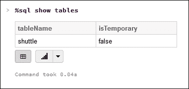

一旦导入，此表中的数据也可以通过 SQL 会话访问。下面的截图显示了一个简单的 SQL 会话语句，显示了从新的**shuttle**表中提取的数据：

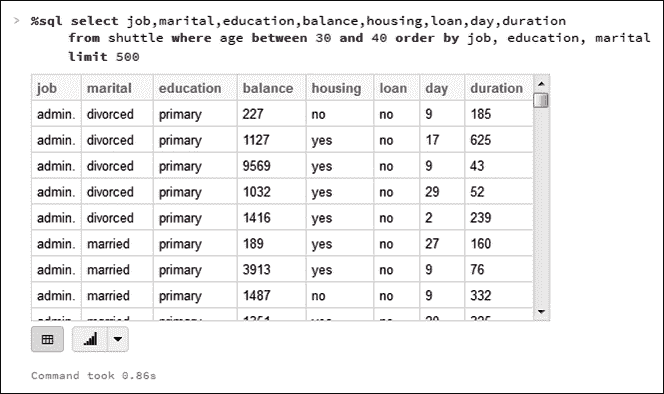

因此，这提供了从各种数据源导入多个表格，并创建复杂模式以通过列和行过滤和连接数据的手段，就像在传统的关系数据库中一样。它提供了一种熟悉的大数据处理方法。

本节描述了可以通过数据导入创建表的过程，但是如何通过编程方式创建表，或者创建外部对象作为表呢？接下来的部分将提供这种表管理方法的示例。

## 外部表

Databricks 允许您针对外部资源（如 AWS S3 文件或本地文件系统文件）创建表。在本节中，我将针对基于 S3 的存储桶、路径和一组文件创建外部表。我还将检查 AWS 中所需的权限和使用的访问策略。以下截图显示了一个名为**dbawss3test2**的 AWS S3 存储桶的创建。已授予所有人访问列表的权限。我并不建议您这样做，但请确保您的组可以访问您的存储桶。

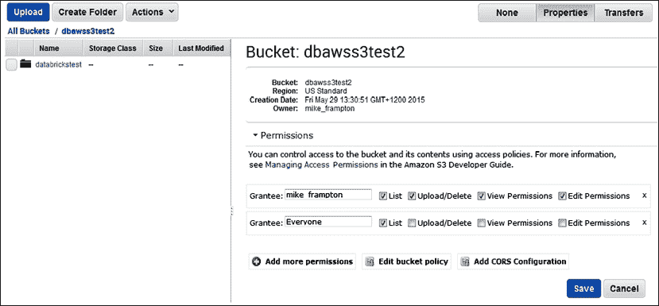

此外，还添加了一个策略以帮助访问。在这种情况下，匿名用户已被授予对存储桶和子内容的只读访问权限。您可以创建一个更复杂的策略，以限制对您的组和各种文件的访问。以下截图显示了新策略：

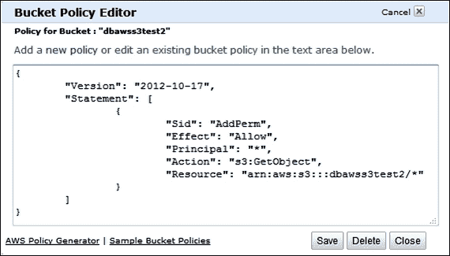

有了访问策略和使用正确访问策略创建的存储桶，我现在可以创建文件夹并上传文件以供 Databricks 外部表使用。如下截图所示，我已经做到了。上传的文件以 CSV 文件格式有十列：

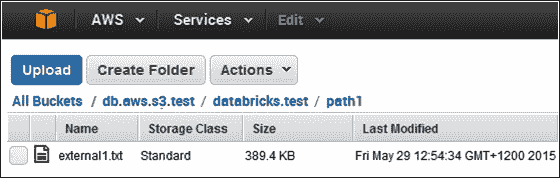

现在，AWS S3 资源已设置好，需要将其挂载到 Databricks，如下面基于 Scala 的示例所示。出于安全目的，我已从脚本中删除了我的 AWS 和秘密密钥。您的挂载目录将需要以`/mnt`和任何`/`字符开头，并且您的秘密密钥值将需要替换为`%2F`。使用`dbutils.fs`类来创建挂载，代码在一秒内执行，如下结果所示：

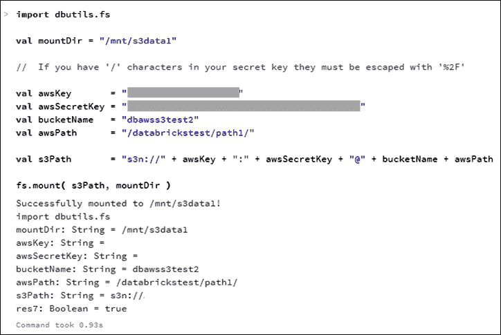

现在，可以使用基于笔记本的 SQL 会话针对此挂载路径和其中包含的文件创建外部表，如下截图所示。名为`s3test1`的表已针对挂载目录包含的文件创建，并指定逗号作为分隔符，以解析基于 CSV 的内容。

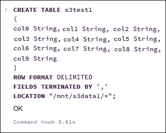

**表**菜单选项现在显示**s3test1**表存在，如下截图所示。因此，应该可以针对此表运行一些 SQL：

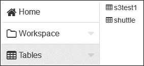

我在基于 SQL 的笔记本会话中运行了一个`SELECT`语句，使用`COUNT(*)`函数从外部表中获取行数，如下截图所示。可以看到表包含**14500**行。

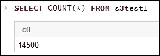

我现在将向基于 S3 的文件夹添加另一个文件。在这种情况下，它只是第一个文件的 CSV 格式副本，因此外部表中的行数应该加倍。以下截图显示了添加的文件：

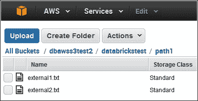

对外部表运行相同的`SELECT`语句确实提供了**29000**行的加倍行数。以下截图显示了 SQL 语句和输出：

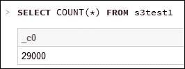

因此，在 Databricks 内部很容易创建外部表，并对动态更改的内容运行 SQL。文件结构需要是统一的，如果使用 AWS，则必须定义 S3 存储桶访问权限。下一节将检查 Databricks 提供的 DbUtils 包。

# DbUtils 包

之前基于 Scala 的脚本使用了 DbUtils 包，并在最后一节中创建了挂载点，只使用了该包的一小部分功能。在本节中，我想介绍一些 DbUtils 包和**Databricks 文件系统**（**DBFS**）的更多功能。在连接到 Databricks 集群的笔记本中，可以调用 DbUtils 包中的帮助选项，以了解其结构和功能。正如下面的截图所示，在 Scala 笔记本中执行`dbutils.fs.help()`可以提供有关 fsutils、cache 和基于挂载的功能的帮助：

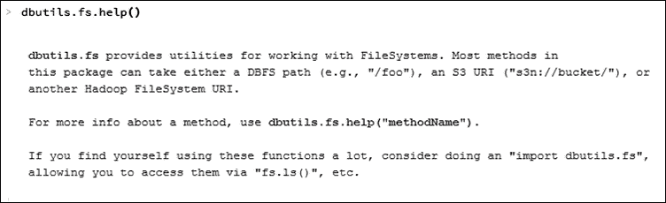

也可以获取关于单个函数的帮助，就像之前截图中的文本所示。下面的截图中的示例解释了**cacheTable**函数，提供了描述性文本和带有参数和返回类型的示例函数调用：

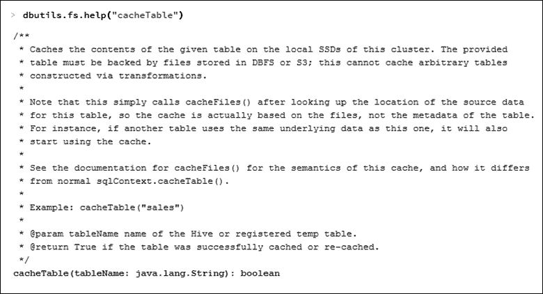

下一节将简要介绍 DBFS，然后继续检查更多的`dbutils`功能。

## Databricks 文件系统

可以使用`dbfs:/*`形式的 URL 访问 DBFS，并使用`dbutils.fs`中可用的函数。

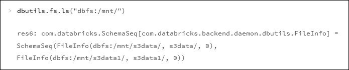

之前的截图显示了使用`ls`函数检查`/mnt`文件系统，然后显示挂载目录——`s3data`和`s3data1`。这些是在之前的 Scala S3 挂载示例中创建的目录。

## Dbutils fsutils

`dbutils`包中的`fsutils`函数组包括`cp`、`head`、`mkdirs`、`mv`、`put`和`rm`等函数。之前显示的帮助调用可以提供更多关于它们的信息。您可以使用`mkdirs`调用在 DBFS 上创建一个目录，如下所示。请注意，我在这个会话中在`dbfs:/`下创建了许多名为`data*`的目录。下面的例子创建了一个名为`data2`的目录：

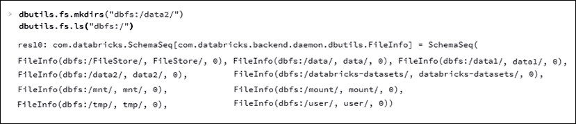

之前的截图通过执行`ls`显示了 DBFS 上已经存在许多默认目录。例如，参见以下内容：

+   `/tmp`是一个临时区域

+   `/mnt`是远程目录的挂载点，即 S3

+   `/user`是一个用户存储区域，目前包含 Hive

+   `/mount`是一个空目录

+   `/FileStore`是用于存储表、JAR 和作业 JAR 的存储区域

+   `/databricks-datasets`是 Databricks 提供的数据集

接下来显示的`dbutils`复制命令允许将文件复制到 DBFS 位置。在这个例子中，`external1.txt`文件已经被复制到`/data2`目录，如下面的截图所示：

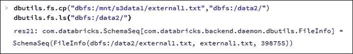

`head`函数可用于从 DBFS 文件的开头返回前 maxBytes 个字符。下面的例子显示了`external1.txt`文件的格式。这很有用，因为它告诉我这是一个 CSV 文件，因此告诉我如何处理它。

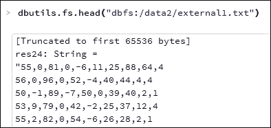

也可以在 DBFS 内部移动文件。下面的截图显示了使用`mv`命令将`external1.txt`文件从`data2`目录移动到名为`data1`的目录。然后使用`ls`命令确认移动。

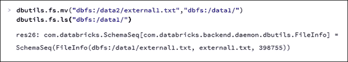

最后，使用 remove 函数（`rm`）来删除刚刚移动的名为`external1.txt`的文件。以下的`ls`函数调用显示，该文件不再存在于`data1`目录中，因为在函数输出中没有`FileInfo`记录：

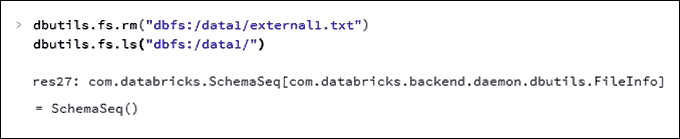

## DbUtils 缓存

在 DbUtils 中的缓存功能提供了缓存（和取消缓存）表和文件到 DBFS 的方法。实际上，表也被保存为文件到名为`/FileStore`的 DBFS 目录。下面的截图显示了缓存功能是可用的：

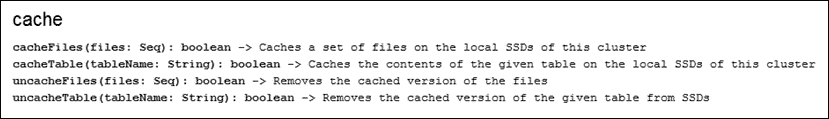

## DbUtils 挂载

挂载功能允许您挂载远程文件系统，刷新挂载，显示挂载详细信息，并卸载特定的已挂载目录。在前几节中已经给出了 S3 挂载的示例，所以我在这里不会重复了。以下截图显示了`mounts`函数的输出。`s3data`和`s3data1`挂载是我创建的。根目录和数据集的另外两个挂载已经存在。挂载按`MountInfo`对象的顺序列出。我重新排列了文本，使其更有意义，并更好地呈现在页面上。

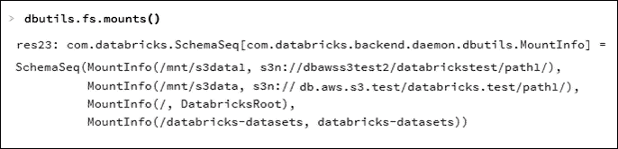

# 总结

本章介绍了 Databricks。它展示了如何访问该服务，以及它如何使用 AWS 资源。请记住，未来，发明 Databricks 的人计划支持其他基于云的平台，如 Microsoft Azure。我认为介绍 Databricks 很重要，因为参与 Apache Spark 开发的人也参与了这个系统。自然的发展似乎是 Hadoop，Spark，然后是 Databricks。

我将在下一章继续对 Databricks 进行调查，因为重要的功能，如可视化，尚未被审查。此外，Databricks 术语中尚未介绍的主要 Spark 功能模块称为 GraphX，流式处理，MLlib 和 SQL。在 Databricks 中使用这些模块处理真实数据有多容易？继续阅读以了解更多。
