# 第九章：Databricks 可视化

本章是在第八章*Spark Databricks*中完成的工作的基础上继续研究基于 Apache Spark 的服务的功能[`databricks.com/`](https://databricks.com/)。尽管我在本章中将使用基于 Scala 的代码示例，但我希望集中在 Databricks 功能上，而不是传统的 Spark 处理模块：MLlib、GraphX、Streaming 和 SQL。本章将解释以下 Databricks 领域：

+   使用仪表板的数据可视化

+   基于 RDD 的报告

+   基于数据流的报告

+   Databricks Rest 接口

+   使用 Databricks 移动数据

因此，本章将审查 Databricks 中通过报告和仪表板进行数据分析可视化的功能。它还将检查 REST 接口，因为我认为它是远程访问和集成目的的有用工具。最后，它将检查将数据和库移动到 Databricks 云实例的选项。

# 数据可视化

Databricks 提供了访问 S3 和基于本地文件系统的文件的工具。它提供了将数据导入表格的能力，如已经显示的。在上一章中，原始数据被导入到航天飞机表中，以提供可以针对其运行 SQL 的表格数据，以针对行和列进行过滤，允许数据进行排序，然后进行聚合。这非常有用，但当图像和报告呈现可以更容易和直观地解释的信息时，我们仍然在查看原始数据输出。

Databricks 提供了一个可视化界面，基于您的 SQL 会话产生的表格结果数据。以下截图显示了一些已经运行的 SQL。生成的数据和数据下面的可视化下拉菜单显示了可能的选项。

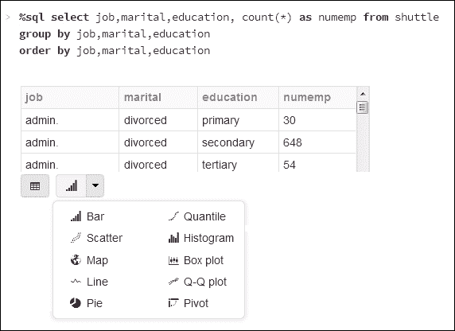

这里有一系列的可视化选项，从更熟悉的**柱状图**和**饼图**到**分位数**和**箱线图**。我将更改我的 SQL，以便获得更多绘制图形的选项，如下所示：

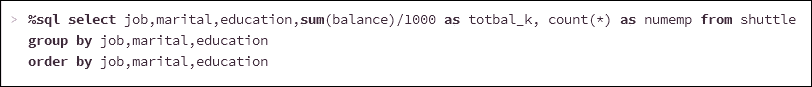

然后，在选择了可视化选项；**柱状图**后，我将选择**绘图**选项，这将允许我选择图形顶点的数据。它还将允许我选择要在其上进行数据列的数据列。以下截图显示了我选择的值。

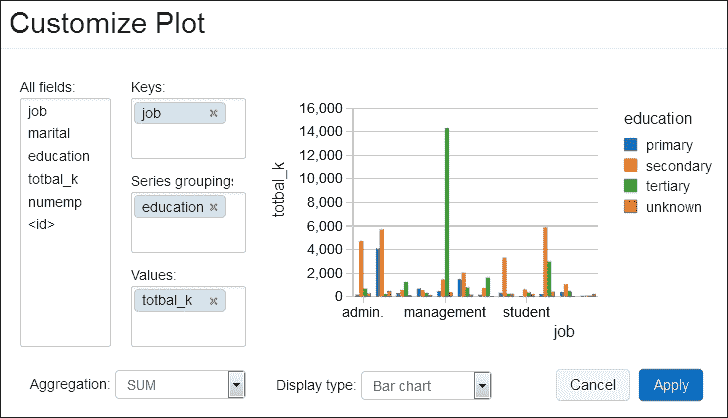

**绘图**选项显示的**所有字段**部分显示了可以从 SQL 语句结果数据中用于图形显示的所有字段。**键**和**值**部分定义了将形成图形轴的数据字段。**系列分组**字段允许我定义一个值，教育，进行数据透视。通过选择**应用**，我现在可以创建一个根据教育类型分组的工作类型的总余额图表，如下截图所示：

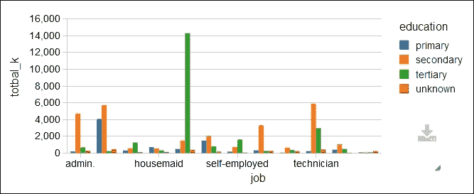

如果我是一名会计师，试图确定影响工资成本的因素，以及公司内成本最高的员工群体，那么我将看到上一个图表中的绿色峰值。它似乎表明具有高等教育的**管理**员工是数据中成本最高的群体。这可以通过更改 SQL 以过滤**高等教育**来确认，按余额降序排序结果，并创建一个新的柱状图。

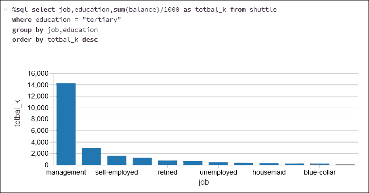

显然，**管理**分组约为**1400 万**。将显示选项更改为**饼图**，将数据表示为饼图，具有清晰大小的分段和颜色，从视觉上清晰地呈现数据和最重要的项目。

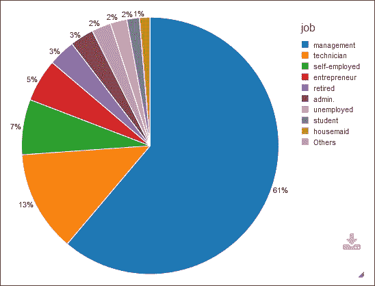

我无法在这个小章节中检查所有的显示选项，但我想展示的是可以使用地理信息创建的世界地图图表。我已从[`download.geonames.org/export/dump/`](http://download.geonames.org/export/dump/)下载了`Countries.zip`文件。

这将提供一个约 281MB 压缩的庞大数据集，可用于创建新表。它显示为世界地图图表。我还获取了一个 ISO2 到 ISO3 的映射数据集，并将其存储在一个名为`cmap`的 Databricks 表中。这使我能够将数据中的 ISO2 国家代码（例如“AU”）转换为 ISO3 国家代码（例如“AUS”）（地图图表所需）。我们将用于地图图表的数据的第一列必须包含地理位置数据。在这种情况下，ISO 3 格式的国家代码。因此，从国家数据中，我将按 ISO3 代码为每个国家创建记录计数。还要确保正确设置绘图选项的键和值。我已将下载的基于国家的数据存储在一个名为`geo1`的表中。以下截图显示了使用的 SQL：

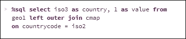

如前所示，这给出了两列数据，一个基于 ISO3 的值称为`country`，和一个称为`value`的数字计数。将显示选项设置为`地图`会创建一个彩色世界地图，如下截图所示：

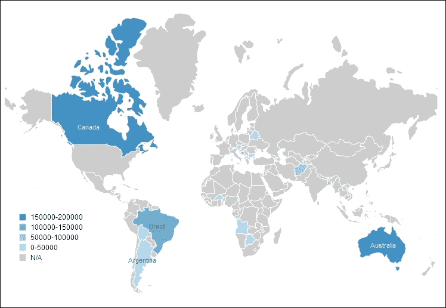

这些图表展示了数据可以以各种形式进行视觉呈现，但如果需要为外部客户生成报告或需要仪表板怎么办？所有这些将在下一节中介绍。

## 仪表板

在本节中，我将使用上一节中创建的名为`geo1`的表中的数据进行地图显示。它被用来创建一个简单的仪表板，并将仪表板发布给外部客户。从**工作区**菜单中，我创建了一个名为`dash1`的新仪表板。如果我编辑此仪表板的控件选项卡，我可以开始输入 SQL，并创建图表，如下截图所示。每个图表都表示为一个视图，并可以通过 SQL 定义。它可以通过绘图选项调整大小和配置，就像每个图表一样。使用**添加**下拉菜单添加一个视图。以下截图显示`view1`已经创建，并添加到`dash1`。`view2`正在被定义。

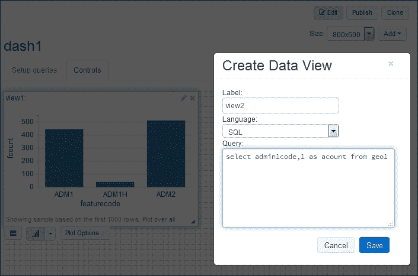

一旦所有视图都被添加、定位和调整大小，可以选择编辑选项卡来呈现最终的仪表板。以下截图现在显示了名为`dash1`的最终仪表板，其中包含三种不同形式的图表和数据的部分：

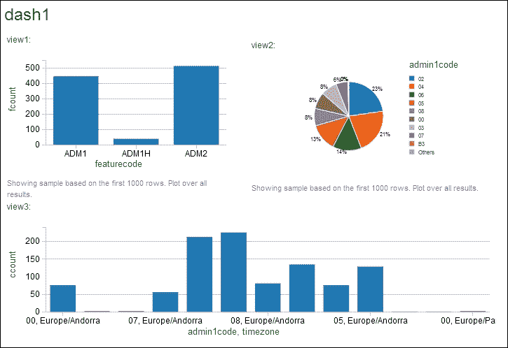

这对于展示数据非常有用，但这个仪表板是在 Databricks 云环境中。如果我想让客户看到呢？仪表板屏幕右上角有一个**发布**菜单选项，允许您发布仪表板。这将在新的公开发布的 URL 下显示仪表板，如下截图所示。请注意以下截图顶部的新 URL。您现在可以与客户分享此 URL 以呈现结果。还有定期更新显示以表示基础数据更新的选项。

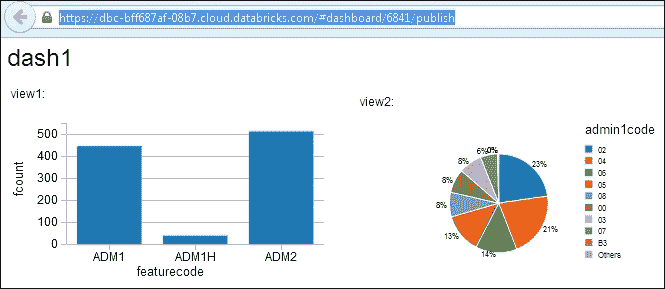

这给出了可用的显示选项的概念。到目前为止，所有创建的报告和仪表板都是基于 SQL 和返回的数据。在下一节中，我将展示可以使用基于 Scala 的 Spark RDD 和流数据以编程方式创建报告。

## 基于 RDD 的报告

以下基于 Scala 的示例使用了一个名为`birdType`的用户定义类类型，基于鸟的名称和遇到的数量。 创建了一个鸟类记录的 RDD，然后转换为数据框架。 然后显示数据框架。 Databricks 允许将显示的数据呈现为表格或使用绘图选项呈现为图形。 以下图片显示了使用的 Scala：

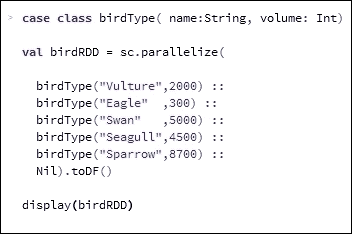

这个 Scala 示例允许创建的条形图显示在以下截图中。 前面的 Scala 代码和下面的截图不如这个图表是通过数据框架以编程方式创建的这一事实重要：

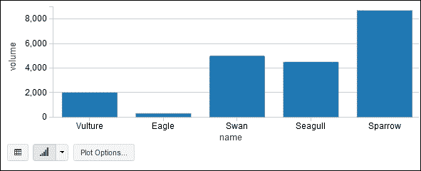

这打开了以编程方式从基于计算的数据源创建数据框架和临时表的可能性。 它还允许处理流数据，并使用仪表板的刷新功能，以不断呈现流数据的窗口。 下一节将介绍基于流的报告生成示例。

## 基于流的报告

在本节中，我将使用 Databricks 的能力上传基于 JAR 的库，以便我们可以运行基于 Twitter 的流式 Apache Spark 示例。 为了做到这一点，我必须首先在[`apps.twitter.com/`](https://apps.twitter.com/)上创建一个 Twitter 帐户和一个示例应用程序。

以下截图显示我创建了一个名为`My example app`的应用程序。 这是必要的，因为我需要创建必要的访问密钥和令牌来创建基于 Scala 的 Twitter feed。

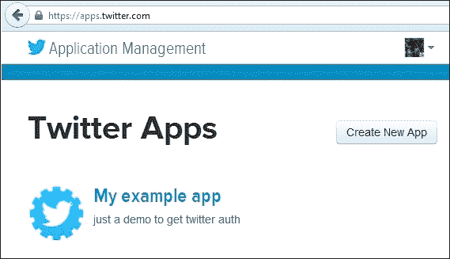

如果我现在选择应用程序名称，我可以看到应用程序详细信息。 这提供了一个菜单选项，该选项提供对应用程序详细信息、设置、访问令牌和权限的访问。 还有一个按钮，上面写着**测试 OAuth**，这使得将要创建的访问和令牌密钥可以进行测试。 以下截图显示了应用程序菜单选项：

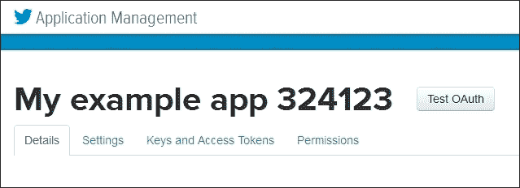

通过选择**密钥和访问令牌**菜单选项，可以为应用程序生成访问密钥和访问令牌。 在本节中，每个应用程序设置和令牌都有一个 API 密钥和一个秘密密钥。 在以下截图的表单顶部显示了消费者密钥和消费者秘钥（当然，出于安全原因，这些图像中的密钥和帐户详细信息已被删除）。

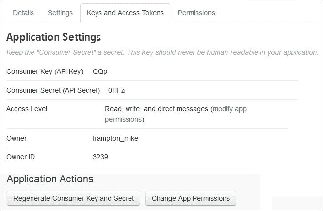

在上一张截图中还有重新生成密钥和设置权限的选项。 下一张截图显示了应用程序访问令牌的详细信息。 有一个访问令牌和一个访问令牌秘钥。 还有重新生成值和撤销访问的选项：

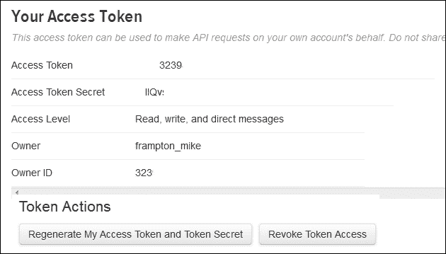

使用这四个字母数字值字符串，可以编写一个 Scala 示例来访问 Twitter 流。 需要的值如下：

+   消费者密钥

+   消费者秘钥

+   访问令牌

+   访问令牌秘钥

在以下代码示例中，出于安全原因，我将删除自己的密钥值。 您只需要添加自己的值即可使代码正常工作。 我已经开发了自己的库，并在本地运行代码以检查它是否能正常工作。 我在将其加载到 Databricks 之前就这样做了，以减少调试所需的时间和成本。 我的 Scala 代码示例如下。 首先，我定义一个包，导入 Spark 流和 Twitter 资源。 然后，我定义了一个名为`twitter1`的对象类，并创建了一个主函数：

```scala
package nz.co.semtechsolutions

import org.apache.spark._
import org.apache.spark.SparkContext._
import org.apache.spark.streaming._
import org.apache.spark.streaming.twitter._
import org.apache.spark.streaming.StreamingContext._
import org.apache.spark.sql._
import org.apache.spark.sql.types.{StructType,StructField,StringType}

object twitter1 {

  def main(args: Array[String]) {
```

接下来，我使用应用程序名称创建一个 Spark 配置对象。 我没有使用 Spark 主 URL，因为我将让`spark-submit`和 Databricks 分配默认 URL。 从这里，我将创建一个 Spark 上下文，并定义 Twitter 消费者和访问值：

```scala
    val appName = "Twitter example 1"
    val conf    = new SparkConf()

    conf.setAppName(appName)
    val sc = new SparkContext(conf)

    val consumerKey       = "QQpl8xx"
    val consumerSecret    = "0HFzxx"
    val accessToken       = "323xx"
    val accessTokenSecret = "Ilxx"
```

我使用`System.setProperty`调用设置了 Twitter 访问属性，并使用它来设置四个`twitter4j` `oauth`访问属性，使用之前生成的访问密钥：

```scala
    System.setProperty("twitter4j.oauth.consumerKey", consumerKey)
    System.setProperty("twitter4j.oauth.consumerSecret",
       consumerSecret)
    System.setProperty("twitter4j.oauth.accessToken", accessToken)
    System.setProperty("twitter4j.oauth.accessTokenSecret",
       accessTokenSecret)
```

从 Spark 上下文创建了一个流上下文，用于创建基于 Twitter 的 Spark DStream。流被空格分割以创建单词，并且通过以`#`开头的单词进行过滤，以选择哈希标签：

```scala
    val ssc    = new StreamingContext(sc, Seconds(5) )
    val stream = TwitterUtils.createStream(ssc,None)
       .window( Seconds(60) )

    // split out the hash tags from the stream

    val hashTags = stream.flatMap( status => status.getText.split(" ").filter(_.startsWith("#")))
```

下面用于获取单例 SQL 上下文的函数在本示例的末尾定义。因此，对于哈希标签流中的每个 RDD，都会创建一个单独的 SQL 上下文。这用于导入隐式，允许 RDD 通过`toDF`隐式转换为数据框。从每个`rdd`创建了一个名为`dfHashTags`的数据框，然后用它注册了一个临时表。然后我对表运行了一些 SQL 以获取行数。然后打印出行数。代码中的横幅只是用来在使用`spark-submit`时更容易查看输出结果：

```scala
hashTags.foreachRDD{ rdd =>

val sqlContext = SQLContextSingleton.getInstance(rdd.sparkContext)
import sqlContext.implicits._

val dfHashTags = rdd.map(hashT => hashRow(hashT) ).toDF()

dfHashTags.registerTempTable("tweets")

val tweetcount = sqlContext.sql("select count(*) from tweets")

println("\n============================================")
println(  "============================================\n")

println("Count of hash tags in stream table : "
   + tweetcount.toString )

tweetcount.map(c => "Count of hash tags in stream table : "
   + c(0).toString ).collect().foreach(println)

println("\n============================================")
println(  "============================================\n")

} // for each hash tags rdd
```

我还输出了当前推文流数据窗口中前五条推文的列表。你可能会认出以下代码示例。这是来自 GitHub 上 Spark 示例。同样，我使用了横幅来帮助输出结果的查看：

```scala
val topCounts60 = hashTags.map((_, 1))
   .reduceByKeyAndWindow(_ + _, Seconds(60))
.map{case (topic, count) => (count, topic)}
.transform(_.sortByKey(false))

topCounts60.foreachRDD(rdd => {

  val topList = rdd.take(5)

  println("\n===========================================")
  println(  "===========================================\n")
  println("\nPopular topics in last 60 seconds (%s total):"
     .format(rdd.count()))
  topList.foreach{case (count, tag) => println("%s (%s tweets)"
     .format(tag, count))}
  println("\n===========================================")
  println(  "==========================================\n")
})
```

然后，我使用 Spark 流上下文`ssc`的`start`和`awaitTermination`来启动应用程序，并保持其运行直到停止：

```scala
    ssc.start()
    ssc.awaitTermination()

  } // end main
} // end twitter1
```

最后，我已经定义了单例 SQL 上下文函数，并且为哈希标签数据流`rdd`中的每一行定义了`dataframe` `case` `class`：

```scala
object SQLContextSingleton {
  @transient private var instance: SQLContext = null

  def getInstance(sparkContext: SparkContext):
    SQLContext = synchronized {
    if (instance == null) {
      instance = new SQLContext(sparkContext)
    }
    instance
  }
}
case class hashRow( hashTag: String)
```

我使用 SBT 编译了这个 Scala 应用程序代码，生成了一个名为`data-bricks_2.10-1.0.jar`的 JAR 文件。我的`SBT`文件如下：

```scala
[hadoop@hc2nn twitter1]$  cat twitter.sbt

name := "Databricks"
version := "1.0"
scalaVersion := "2.10.4"
libraryDependencies += "org.apache.spark" % "streaming" % "1.3.1" from "file:///usr/local/spark/lib/spark-assembly-1.3.1-hadoop2.3.0.jar"
libraryDependencies += "org.apache.spark" % "sql" % "1.3.1" from "file:///usr/local/spark/lib/spark-assembly-1.3.1-hadoop2.3.0.jar"
libraryDependencies += "org.apache.spark.streaming" % "twitter" % "1.3.1" from file:///usr/local/spark/lib/spark-examples-1.3.1-hadoop2.3.0.jar

```

我下载了正确版本的 Apache Spark 到我的集群上，以匹配 Databricks 当前使用的版本（1.3.1）。然后我在集群中的每个节点下安装了它，并以 spark 作为集群管理器在本地模式下运行。我的`spark-submit`脚本如下：

```scala
[hadoop@hc2nn twitter1]$ more run_twitter.bash
#!/bin/bash

SPARK_HOME=/usr/local/spark
SPARK_BIN=$SPARK_HOME/bin
SPARK_SBIN=$SPARK_HOME/sbin

JAR_PATH=/home/hadoop/spark/twitter1/target/scala-2.10/data-bricks_2.10-1.0.jar
CLASS_VAL=nz.co.semtechsolutions.twitter1

TWITTER_JAR=/usr/local/spark/lib/spark-examples-1.3.1-hadoop2.3.0.jar

cd $SPARK_BIN

./spark-submit \
 --class $CLASS_VAL \
 --master spark://hc2nn.semtech-solutions.co.nz:7077  \
 --executor-memory 100M \
 --total-executor-cores 50 \
 --jars $TWITTER_JAR \
 $JAR_PATH

```

我不会详细介绍，因为已经涵盖了很多次，除了注意现在类值是`nz.co.semtechsolutions.twitter1`。这是包类名，加上应用对象类名。所以，当我在本地运行时，我得到以下输出：

```scala
======================================
Count of hash tags in stream table : 707
======================================
Popular topics in last 60 seconds (704 total):
#KCAMÉXICO (139 tweets)
#BE3 (115 tweets)
#Fallout4 (98 tweets)
#OrianaSabatini (69 tweets)
#MartinaStoessel (61 tweets)
======================================

```

这告诉我应用程序库起作用了。它连接到 Twitter，创建数据流，能够将数据过滤为哈希标签，并使用数据创建临时表。因此，创建了一个用于 Twitter 数据流的 JAR 库，并证明它有效后，我现在可以将其加载到 Databricks 云上。以下截图显示了从 Databricks 云作业菜单创建了一个名为`joblib1`的作业。**设置 Jar**选项已用于上传刚刚创建的 JAR 库。已指定了到`twitter1`应用对象类的完整基于包的名称。

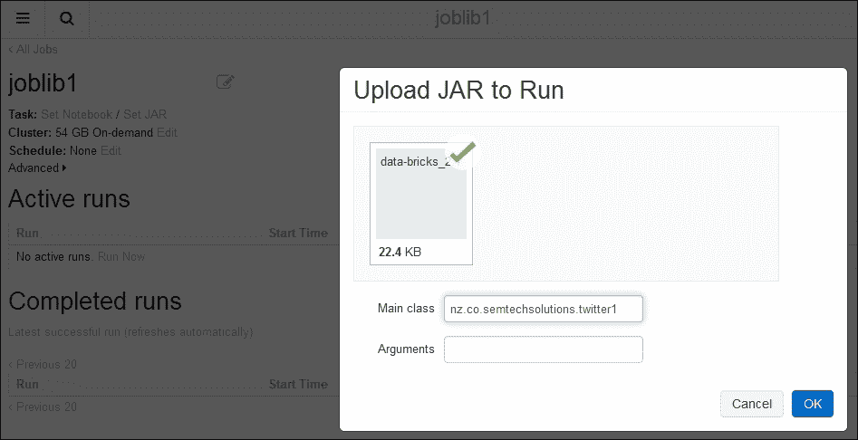

以下截图显示了名为`joblib1`的作业，已准备就绪。基于 Spark 的集群将根据需要创建，一旦使用**立即运行**选项执行作业，将在**活动运行**部分下立即执行。虽然没有指定调度选项，但可以定义作业在特定日期和时间运行。

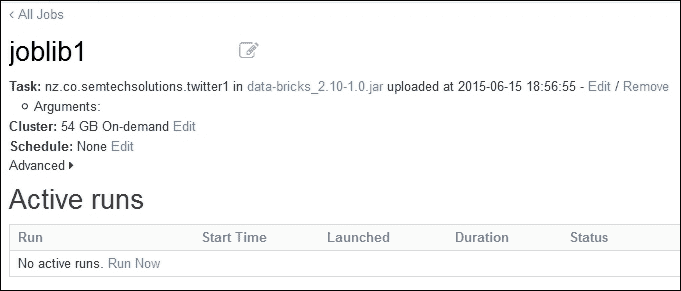

我选择了**立即运行**选项来启动作业运行，如下截图所示。这显示现在有一个名为`Run 1`的活动运行。它已经运行了六秒。它是手动启动的，正在等待创建按需集群。通过选择运行名称`Run 1`，我可以查看有关作业的详细信息，特别是已记录的输出。

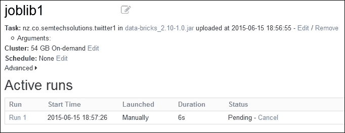

以下截图显示了`joblib1`的`Run 1`输出的示例。它显示了开始时间和持续时间，还显示了运行状态和作业详细信息，包括类和 JAR 文件。它本应该显示类参数，但在这种情况下没有。它还显示了 54GB 按需集群的详细信息。更重要的是，它显示了前五个推文哈希标签值的列表。

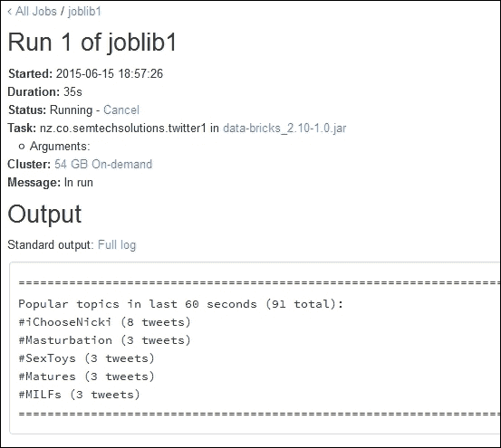

以下截图显示了 Databricks 云实例中相同作业运行输出窗口。但这显示了来自 SQL `count(*)`的输出，显示了当前数据流推文窗口中临时表中的推文哈希标签数量。

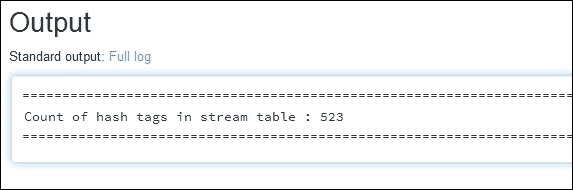

因此，这证明了我可以在本地创建一个应用程序库，使用基于 Twitter 的 Apache Spark 流处理，并将数据流转换为数据框架和临时表。它表明我可以通过在本地开发，然后将我的库移植到 Databricks 云来降低成本。我知道在这个例子中我既没有将临时表可视化，也没有将 DataFrame 可视化为 Databricks 图表，但时间不允许我这样做。另外，如果有时间，我会做的另一件事是在应用程序失败时进行检查点或定期保存流到文件。然而，这个主题在第三章中有所涵盖，*Apache Spark Streaming*中有一个例子，所以如果您感兴趣，可以在那里看一下。在下一节中，我将检查 Databricks REST API，它将允许您的外部应用程序与 Databricks 云实例更好地集成。

# REST 接口

Databricks 为基于 Spark 集群的操作提供了 REST 接口。它允许集群管理、库管理、命令执行和上下文的执行。要能够访问 REST API，AWS EC2 基础的 Databricks 云中的实例必须能够访问端口`34563`。以下是尝试访问我 Databricks 云实例端口`34563`的 Telnet 命令。请注意，Telnet 尝试已成功：

```scala
[hadoop@hc2nn ~]$ telnet dbc-bff687af-08b7.cloud.databricks.com 34563
Trying 52.6.229.109...
Connected to dbc-bff687af-08b7.cloud.databricks.com.
Escape character is '^]'.

```

如果您没有收到 Telnet 会话，请通过`<help@databricks.com>`联系 Databricks。接下来的部分提供了访问 Databricks 云实例的 REST 接口示例。

## 配置

为了使用接口，我需要将我用于访问 Databricks 集群实例的 IP 地址加入白名单。这是我将运行 REST API 命令的机器的 IP 地址。通过将 IP 地址加入白名单，Databricks 可以确保每个 Databricks 云实例都有一个安全的用户访问列表。

我通过之前的帮助电子邮件地址联系了 Databricks 支持，但在您的云实例的**工作区**菜单中还有一个白名单 IP 指南：

**工作区** | **databricks_guide** | **DevOps 工具** | **白名单 IP**。

现在可以使用 Linux `curl`命令从 Linux 命令行向我的 Databricks 云实例提交 REST API 调用。下面显示了`curl`命令的示例通用形式，使用了我的 Databricks 云实例用户名、密码、云实例 URL、REST API 路径和参数。

Databricks 论坛和之前的帮助电子邮件地址可用于获取更多信息。接下来的部分将提供一些 REST API 的工作示例：

```scala
curl –u  '<user>:<paswd>' <dbc url> -d "<parameters>"

```

## 集群管理

您仍然需要从您的云实例用户界面创建 Databricks Spark 集群。列表 REST API 命令如下：

```scala
/api/1.0/clusters/list

```

它不需要任何参数。此命令将提供您的集群列表、它们的状态、IP 地址、名称以及它们运行的端口号。以下输出显示，集群`semclust1`处于挂起状态，正在创建过程中：

```scala
curl -u 'xxxx:yyyyy' 'https://dbc-bff687af-08b7.cloud.databricks.com:34563/api/1.0/clusters/list'

 [{"id":"0611-014057-waist9","name":"semclust1","status":"Pending","driverIp":"","jdbcPort":10000,"numWorkers":0}]

```

当集群可用时运行相同的 REST API 命令，显示名为`semcust1`的集群正在运行，并且有一个 worker：

```scala
[{"id":"0611-014057-waist9","name":"semclust1","status":"Running","driverIp":"10.0.196.161","jdbcPort":10000,"numWorkers":1}]

```

终止此集群，并创建一个名为`semclust`的新集群，将更改 REST API 调用的结果，如下所示：

```scala
curl -u 'xxxx:yyyy' 'https://dbc-bff687af-08b7.cloud.databricks.com:34563/api/1.0/clusters/list'

[{"id":"0611-023105-moms10","name":"semclust", "status":"Pending","driverIp":"","jdbcPort":10000,"numWorkers":0},
 {"id":"0611-014057-waist9","name":"semclust1","status":"Terminated","driverIp":"10.0.196.161","jdbcPort":10000,"numWorkers":1}]

```

## 执行上下文

使用这些 API 调用，您可以创建、显示或删除执行上下文。REST API 调用如下：

+   `/api/1.0/contexts/create`

+   `/api/1.0/contexts/status`

+   `/api/1.0/contexts/destroy`

在以下 REST API 调用示例中，通过`curl`提交，为标识为其集群 ID 的`semclust`创建了一个 Scala 上下文。

```scala
curl -u 'xxxx:yyyy' https://dbc-bff687af-08b7.cloud.databricks.com:34563/api/1.0/contexts/create -d "language=scala&clusterId=0611-023105-moms10"

```

返回的结果要么是错误，要么是上下文 ID。以下三个示例返回值显示了由无效 URL 引起的错误，以及两个成功调用返回的上下文 ID：

```scala
{"error":"ClusterNotFoundException: Cluster not found: semclust1"}
{"id":"8689178710930730361"}
{"id":"2876384417314129043"}

```

## 命令执行

这些命令允许您运行命令、列出命令状态、取消命令或显示命令的结果。REST API 调用如下：

+   /api/1.0/commands/execute

+   /api/1.0/commands/cancel

+   /api/1.0/commands/status

下面的示例显示了针对名为`cmap`的现有表运行的 SQL 语句。上下文必须存在，并且必须是 SQL 类型。参数已通过`-d`选项传递给 HTTP GET 调用。参数是语言、集群 ID、上下文 ID 和 SQL 命令。命令 ID 返回如下：

```scala
curl -u 'admin:FirmWare1$34' https://dbc-bff687af-08b7.cloud.databricks.com:34563/api/1.0/commands/execute -d
"language=sql&clusterId=0611-023105-moms10&contextId=7690632266172649068&command=select count(*) from cmap"

{"id":"d8ec4989557d4a4ea271d991a603a3af"}

```

## 库

REST API 还允许上传库到集群并检查它们的状态。REST API 调用路径如下：

+   `/api/1.0/libraries/upload`

+   `/api/1.0/libraries/list`

接下来给出了一个上传到名为`semclust`的集群实例的库的示例。通过`-d`选项将参数传递给 HTTP GET API 调用的语言、集群 ID、库名称和 URI。成功的调用将返回库的名称和 URI，如下所示：

```scala
curl -u 'xxxx:yyyy' https://dbc-bff687af-08b7.cloud.databricks.com:34563/api/1.0/libraries/upload
 -d "language=scala&clusterId=0611-023105-moms10&name=lib1&uri=file:///home/hadoop/spark/ann/target/scala-2.10/a-n-n_2.10-1.0.jar"

{"name":"lib1","uri":"file:///home/hadoop/spark/ann/target/scala-2.10/a-n-n_2.10-1.0.jar"}

```

请注意，此 REST API 可能会随内容和版本而更改，因此请在 Databricks 论坛中检查，并使用以前的帮助电子邮件地址与 Databricks 支持检查 API 详细信息。我认为，通过这些简单的示例调用，很明显这个 REST API 可以用于将 Databricks 与外部系统和 ETL 链集成。在下一节中，我将概述 Databricks 云内的数据移动。

# 数据移动

有关在 Databricks 中移动数据的一些方法已经在第八章 *Spark Databricks*和第九章 *Databricks Visualization*中进行了解释。我想在本节中概述所有可用的移动数据方法。我将研究表、工作区、作业和 Spark 代码的选项。

## 表数据

Databricks 云的表导入功能允许从 AWS **S3**存储桶、**Databricks 文件系统**（**DBFS**）、通过 JDBC 以及从本地文件导入数据。本节概述了每种类型的导入，从**S3**开始。从 AWS **S3**导入表数据需要 AWS 密钥、AWS 秘钥和**S3**存储桶名称。以下屏幕截图显示了一个示例。我已经提供了一个**S3**存储桶创建的示例，包括添加访问策略，因此我不会再次介绍它。

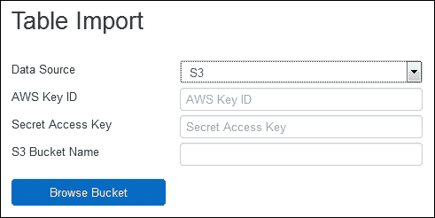

一旦添加了表单详细信息，您就可以浏览您的**S3**存储桶以获取数据源。选择`DBFS`作为表数据源可以浏览您的`DBFS`文件夹和文件。选择数据源后，可以显示预览，如下面的屏幕截图所示：

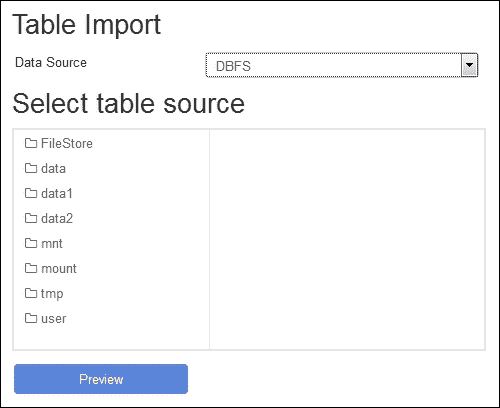

选择`JDBC`作为表格数据源允许您指定远程 SQL 数据库作为数据源。只需添加一个访问**URL**、**用户名**和**密码**。还可以添加一些 SQL 来定义表和源列。还有一个通过**添加属性**按钮添加额外属性的选项，如下面的屏幕截图所示：

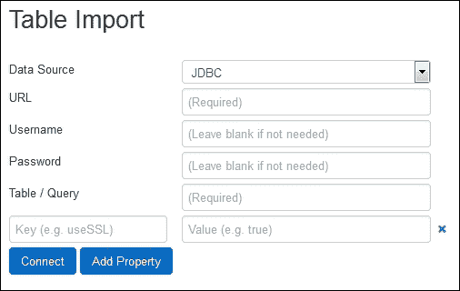

选择**文件**选项以从文件中填充 Databricks 云实例表，创建一个下拉或浏览。此上传方法先前用于将基于 CSV 的数据上传到表中。一旦指定了数据源，就可以指定数据分隔符字符串或标题行，定义列名或列类型，并在创建表之前预览数据。

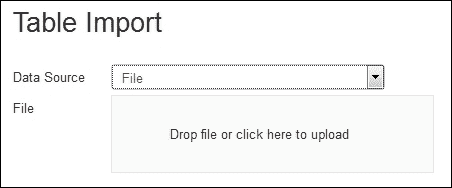

## 文件夹导入

从工作区或文件夹下拉菜单中，可以导入项目。以下屏幕截图显示了**导入项目**菜单选项的复合图像：

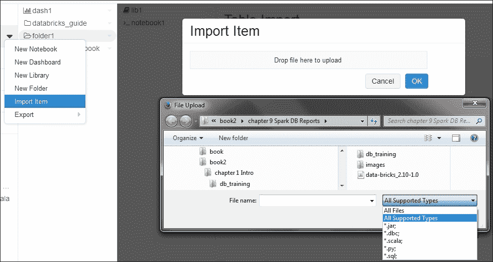

这将创建一个文件拖放或浏览窗口，当点击时，允许您浏览本地服务器以导入项目。选择“所有支持的类型”选项显示可以导入的项目可以是 JAR 文件、dbc 存档、Scala、Python 或 SQL 文件。

## 库导入

以下屏幕截图显示了来自 Workspace 和文件夹菜单选项的**新库**功能。这允许将外部创建和测试的库加载到您的 Databricks 云实例中。该库可以是 Java 或 Scala JAR 文件、Python Egg 或用于访问存储库的 Maven 坐标。在下面的屏幕截图中，正在从本地服务器通过浏览窗口选择一个 JAR 文件。本章中使用了此功能来测试基于流的 Scala 编程：

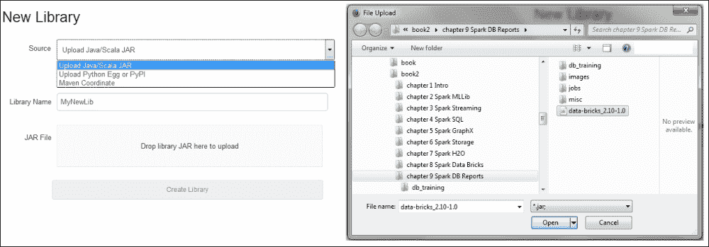

# 进一步阅读

在总结本章之前，也是 Databricks 云端使用 Apache Spark 的最后一章，我想提及一些关于 Apache Spark 和 Databricks 的额外信息资源。首先，有 Databricks 论坛可供访问：[forums.databricks.com/](http://forums.databricks.com/)，用于与[`databricks.com/`](https://databricks.com/)的使用相关的问题和答案。此外，在您的 Databricks 实例中，在 Workspace 菜单选项下，将有一个包含许多有用信息的 Databricks 指南。Apache Spark 网站[`spark.apache.org/`](http://spark.apache.org/)也包含许多有用信息，以及基于模块的 API 文档。最后，还有 Spark 邮件列表，`<user@spark.apache.org>`，提供了大量关于 Spark 使用信息和问题解决的信息。

# 摘要

第八章、*Spark Databricks*和第九章、*Databricks 可视化*，已经介绍了 Databricks 在云安装方面的情况，以及 Notebooks 和文件夹的使用。已经检查了帐户和集群管理。还检查了作业创建、远程库创建的概念以及导入。解释了 Databricks `dbutils`包的功能，以及 Databricks 文件系统在第八章、*Spark Databricks*中。还展示了表格和数据导入的示例，以便对数据集运行 SQL。

已经检查了数据可视化的概念，并创建了各种图表。已经创建了仪表板，以展示创建和共享这种数据呈现的简易性。通过示例展示了 Databricks REST 接口，作为远程使用 Databricks 云实例并将其与外部系统集成的辅助。最后，已经检查了关于工作区、文件夹和表的数据和库移动选项。

您可能会问为什么我要把两章内容都献给像 Databricks 这样的基于云的服务。原因是 Databricks 似乎是从 Apache Spark 发展而来的一个逻辑上的基于云的进展。它得到了最初开发 Apache Spark 的人的支持，尽管作为一个服务还处于初期阶段，可能会发生变化，但仍然能够提供基于 Spark 的云生产服务。这意味着一家希望使用 Spark 的公司可以使用 Databricks，并随着需求增长而扩展他们的云，并且可以访问动态的基于 Spark 的机器学习、图处理、SQL、流处理和可视化功能。

正如以往一样，这些 Databricks 章节只是触及了功能的表面。下一步将是自己创建一个 AWS 和 Databricks 账户，并使用这里提供的信息来获得实际经验。

由于这是最后一章，我将再次提供我的联系方式。我对人们如何使用 Apache Spark 感兴趣。我对您创建的集群规模以及您处理的数据感兴趣。您是将 Spark 作为处理引擎使用吗？还是在其上构建系统？您可以在 LinkedIn 上与我联系：[linkedin.com/profile/view?id=73219349](http://linkedin.com/profile/view?id=73219349)。

您可以通过我的网站`semtech-solutions.co.nz`或最后通过电子邮件联系我：`<info@semtech-solutions.co.nz>`。

最后，我在有空的时候会维护一个与开源软件相关的演示文稿列表。任何人都可以免费使用和下载它们。它们可以在 SlideShare 上找到：[`www.slideshare.net/mikejf12/presentations`](http://www.slideshare.net/mikejf12/presentations)。

如果您有任何具有挑战性的机会或问题，请随时使用上述联系方式与我联系。
