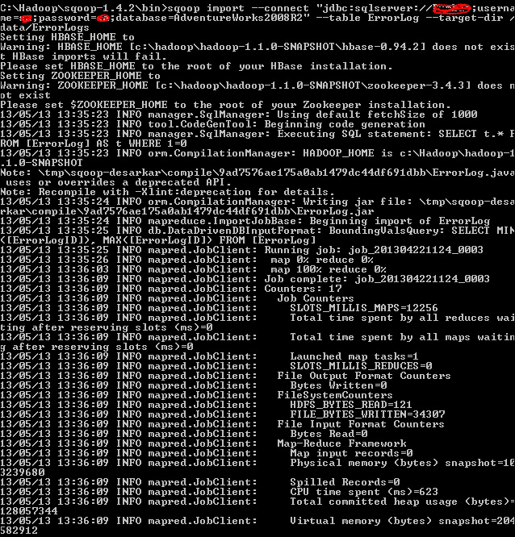
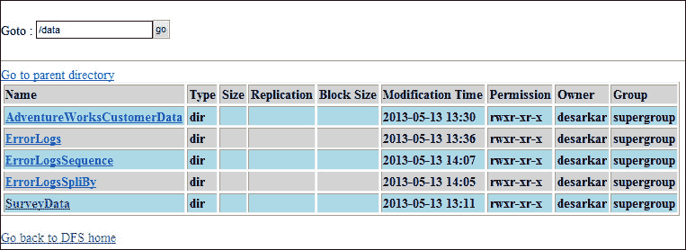

# 二、使用 Sqoop——SQL Server Hadoop 连接器

**Sqoop**是一个开源的 Apache 项目，它促进了 Hadoop 和任何传统的**关系数据库管理系统**(**RDBMS**)之间的数据交换。 它在幕后使用 MapReduce 框架执行导入/导出操作，通常是集成来自关系和非关系数据存储的数据的常见选择。

Microsoft SQL Server Connector for Apache Hadoop(SQL Server-Hadoop Connector)是一款基于 Sqoop 的连接器，专为在 SQL Server 和 Hadoop 之间高效传输数据而设计。 此连接器针对双向大容量数据传输进行了优化，它不支持在动态导入或导出数据时对数据进行大量格式化或转换。 阅读本章后，您将能够：

*   安装和配置 Sqoop 连接器
*   将数据从 SQL Server 导入 Hadoop
*   将数据从 Hadoop 导出到 SQL Server

# SQL Server-Hadoop 连接器

Sqoop 是使用 JDBC 实现的，因此它也符合标准的 JDBC 特性。 数据的模式或结构由数据源提供，Sqoop 使用 JDBC 生成并执行 SQL 语句。 下表总结了 SQL Server 连接器提供的几个重要命令及其功能：

<colgroup><col style="text-align: left"> <col style="text-align: left"></colgroup> 
| 

命令 / 掌握 / 俯视 / 控制

 | 

功能 / 目的 / 函数关系

 |
| --- | --- |
| `sqoop import` | `import`命令允许您将 SQL Server 数据导入 HDFS。 您可以选择使用`--table`开关导入整个表，也可以选择使用`--query`开关根据条件导入所选记录。 数据一旦导入 Hadoop 文件系统，就会存储为分隔文本文件或`SequenceFiles`以供进一步处理。 您还可以使用`import`命令将 SQL Server 数据移动到配置单元表中，这些配置单元表类似于 HDFS 之上的逻辑架构。 |
| `sqoop export` | 您可以使用`export`命令将数据从 HDFS 移动到 SQL Server 表中。 与`import`命令非常类似，`export`命令允许您将数据从分隔文本文件、`SequenceFiles`和`Hive`表导出到 SQL Server 中。 `export`命令支持向目标 SQL Server 表插入新行、基于更新键列更新现有行以及调用存储过程执行。 |
| `sqoop job` | 使用`job`命令可以将`import`/`export`命令保存为作业以备将来重用。 保存的作业会记住执行过程中指定的参数，在需要定期重复运行`import`/`export`命令时尤其有用。 |
| `sqoop version` | 要快速检查您正在使用的 sqoop 版本，可以运行`sqoop version`命令在控制台中打印已安装的版本详细信息。 |

`The SequenceFiles`Hadoop 中是包含序列化数据的二进制内容，而不是分隔的文本文件。 请参考 Hadoop 页面[http://hadoop.apache.org/docs/current/api/org/apache/hadoop/io/SequenceFile.html](http://hadoop.apache.org/docs/current/api/org/apache/hadoop/io/SequenceFile.html)，详细了解`SequenceFiles`是如何构造的。 此外，我们还将在本章的后续小节中介绍几个带有不同参数的示例`import`/`export`命令。 有关 SQOOP 命令及其开关的完整参考，请参阅 Apache Sqoop 用户指南[http://sqoop.apache.org/docs/1.4.2/SqoopUserGuide.html](http://sqoop.apache.org/docs/1.4.2/SqoopUserGuide.html)。

### 备注

HIVE 是构建在 Hadoop 之上的数据仓库基础设施，这将在下一章中讨论。

## 安装前提条件

本章假设您有一个配置了 Hadoop 和配置单元的 Linux 群集，以及一个运行 SQL Server 2012 的 Windows 系统。 使用 SQL Server-Hadoop 连接器和运行本章中的示例命令都需要这两种环境。

### Linux 上的 Hadoop 集群

第一步是在 Linux 上启动并运行 Hadoop 集群。 我们将使用此群集的 HDFS 从 SQL Server 导入和导出数据。 本章中的示例命令假定它们在 Red Hat Enterprise Linux 5.8 上的 Hadoop 版本 1.1.0、配置单元版本 0.9.0 上运行。

### 备注

确保将`HADOOP_HOME`环境变量设置为安装 Hadoop 的父目录。

### 安装和配置 Sqoop

下一步是在 Hadoop 集群的 NameNode 上安装和配置 Sqoop 连接器(如果尚未安装)。 我建议从 Apache 的网站下载并安装 Sqoop 1.4.2，这是本章中运行示例命令所使用的版本。

安装完成后，必须验证 Sqoop 环境变量是否设置了正确的值。 它们应设置为指向下表中所述的路径，SQL Server-Hadoop 连接器才能正常工作。 这还使您不必在每次需要执行各种 Sqoop 命令行实用程序时完全限定它们的路径。

下表介绍了 Sqoop 环境变量：

<colgroup><col style="text-align: left"> <col style="text-align: left"></colgroup> 
| 

环境变量

 | 

要赋值的值

 |
| --- | --- |
| `SQOOP_HOME` | 安装 Sqoop 的绝对路径。 |
| `SQOOP_CONF_DIR` | `$SQOOP_HOME/conf`假设`SQOOP_HOME`已经设置了正确的值。 |

### 设置 Microsoft JDBC 驱动

Sqoop 和 SQL 服务器-Hadoop 连接器使用**Java 数据库连接**(**JDBC**)技术建立到远程 RDBMS 服务器的连接，因此需要用于 SQL Server 的 JDBC 驱动。 本章假定使用 SQL Server JDBC 驱动 3.0 版(sqljdbc_3.0)。 要在刚刚安装了 Sqoop 的 Linux NameNode 上安装此驱动，请执行以下步骤：

1.  访问[http://www.microsoft.com/en-us/download/details.aspx?displaylang=en&id=21599](http://www.microsoft.com/en-us/download/details.aspx?displaylang=en&id=21599)并将`sqljdbc_3.0_enu.tar.gz`下载到您的群集的 NameNode。
2.  使用以下命令解压下载的文件：`tar –zxvf sqljdbc_3.0_enu.tar.gz`。 这将在当前目录中创建一个目录`sqljdbc_3.0`。
3.  将驱动 JAR(`sqljdbc_3.0/enu/sqljdbc4.jar`)文件复制到 NameNode 上的`$SQOOP_HOME/lib`目录。

# 下载 SQL Server-Hadoop 连接器

如果您已经达到这一点，最后，您就可以在集群的 NameNode 上下载、安装和配置 SQL Server-Hadoop 连接器了。

Microsoft SQL Server SQOOP Connector for Hadoop 现在是 Apache SQOOP 1.4.x 系列项目的一部分，Microsoft 不再从他们的站点提供单独的下载。 该连接器现在可以从 Apache 的网站下载：[http://sqoop.apache.org/](http://sqoop.apache.org/)

下表总结了下载连接器后部署到 NameNode 的不同文件。 该表包含 SQL Server-Hadoop 连接器安装程序归档文件：

<colgroup><col style="text-align: left"> <col style="text-align: left"></colgroup> 
| 

文件/目录

 | 

描述 / 描写 / 形容 / 类别

 |
| --- | --- |
| `install.sh` | 这是一个 shell 脚本，其中包含复制 SQL Server-Hadoop 连接器所需文件和目录结构的命令。 |
| `Microsoft SQL``Server-Hadoop``Connector User``Guide.pdf` | 部署和执行 SQL Server-Hadoop 连接器命令的用户指南。 |
| `lib/` | 此目录包含`sqoop-sqlserver-1.0.jar`文件。 这是包含大部分 Sqoop 命令定义的归档文件。 |
| `conf/` | 此目录包含 SQL Server-Hadoop 连接器的配置文件。 |
| `THIRDPARTYNOTICES``FOR HADOOP-BASED``CONNECTORS.txt` | 本文件由第三方通知组成。 |
| `SQL Server``Connector for``Apache Hadoop``MSLT.pdf` | SQL Server Connector for ApacheHadoop 的最终用户许可协议。 |

# 安装 SQL Server-Hadoop 连接器

要安装 SQL Server-Hadoop 连接器，需要执行以下步骤：

1.  使用用户凭据登录到您的群集 NameNode，该用户凭据具有安装文件的权限。
2.  使用以下命令解压存档：`tar –zxvf sqoop-sqlserver-1.0.tar.gz`。 这将在当前工作目录中创建`sqoop-sqlserver-1.0`目录。
3.  确保将`MSSQL_CONNECTOR_HOME`环境变量设置为`sqoop-sqlserver-1.0`目录的绝对路径。
4.  将目录(`cd`)更改为`sqoop-sqlserver-1.0`，并在没有任何附加参数的情况下运行 shell`scriptinstall.sh`。
5.  安装程序将复制现有 Sqoop 安装目录下的连接器 JAR 和配置文件。

# Sqoop 导入工具

现在，您可以使用 SQL Server-Hadoop 连接器并将数据从 SQL Server 2012 导入 HDFS。 导入过程的输入是 SQL Server 表，该表将由 Sqoop 逐行读取到 HDFS 中。 此导入过程的输出是一组文件，其中包含导入的表的副本。 由于导入过程是并行执行的，因此输出将位于多个文件中。

使用`sqoop import`命令时，必须指定以下强制参数：

*   `--connect`指定到 SQL Server 数据库的连接字符串的参数
*   `--username`和`--password`参数提供连接到 SQL Server 数据库的有效凭据
*   `--table`或`--query`参数，用于导入整个表或自定义查询执行的结果

以下命令将 SQL Server`Adventureworks2012`数据库中`ErrorLog`表中的数据导入 HDFS 上`/data/ErrorLogs`目录中的分隔文本文件。

### 备注

Sqoop 1.4.2 不识别不属于默认`dbo`架构的 SQL Server 表。 通过添加`--schema`开关修复了这一问题，您可以在 Sqoop 1.4.3 中指定非默认模式名称。

以下命令介绍如何将数据从 SQL Server 表导入 HDFS：

```sh
$bin/ sqoop import --connect "jdbc:sqlserver://<YourServerName>;username=<user>;password=<pwd>;database=Adventureworks2012" --table ErrorLog --target-dir /data/ErrorLogs –-as-textfile

```

### 备注

您还可以使用`--as-avrodatafile`或`--as-sequencefile`将数据分别导入到`Avro`文件和`SequenceFiles`，而不是在前面的示例命令中使用`--as-textfile`时使用纯文本。

成功执行上述代码将把 SQL 表的所有记录传输到逗号分隔的 HDFS 文件，输出应类似于以下屏幕截图：



您可以为`sqoop import`命令指定一个`--split-by`参数，并指定一个列来确定如何在映射器之间拆分数据。 如果未指定`split-by`列，则默认情况下使用主键列。 以下命令指定`split-by`列来计算映射器的拆分：

```sh
$bin/sqoop import --connect "jdbc:sqlserver://<YourServerName>;username=<user>;password=<pwd>;database=Adventureworks2012" --table ErrorLog --target-dir /data/ErrorLogsSplitBy --split-by  ErrorLogID -m  3

```

## 导入配置单元中的表

Sqoop 为提供`-hive-import`参数，用于将 SQL Server 表直接导入配置单元表。 以下命令显示如何将 SQL Server 数据导入配置单元：

```sh
$bin/ sqoop import --connect "jdbc:sqlserver://<YourServerName>;username=<user>;password=<pwd>;database=Adventureworks2012" --table ErrorLog -hive-import

```

请注意命令行输出的最后一部分的不同之处，它确认了配置单元中的操作，如以下屏幕截图所示：


### 备注

要使用配置单元`import`命令，请确保已安装配置单元，并将`HIVE_HOME`设置为安装配置单元的父目录。

运行`import`命令后，您可以验证在 Hadoop NameNode 管理门户中创建的输出文件夹，如以下屏幕截图所示：



# Sqoop 导出工具

如前所述，Sqoop 是一个双向连接器。 Sqoop 的导出过程将并行地从 HDFS 读取一组分隔文本文件，将它们解析成记录，并将它们作为新行插入到目标数据库表中。 以下示例将数据从 HDFS 和配置单元导出到 SQL Server。 假设您正在安装 Sqoop 的 Hadoop 集群的主节点上的`$SQOOP_HOME`目录中运行命令。

使用`sqoop export`命令时，必须指定以下强制参数：

*   `--connect`指定到 SQL Server 数据库的连接字符串的参数
*   `--username`和`--password`参数提供连接到 SQL Server 数据库的有效凭据
*   `--table`或`--call`参数，用于导出到 SQL 表或调用存储过程调用
*   `--export-dir`参数指定要导出的 HDFS 目录

以下命令将数据从 HDFS 上`/data/ErrorLogs`中的分隔文本文件导出回 SQL Server 上`Adventureworks2012`数据库中的`ErrorLog`表：

```sh
$bin/ sqoop export --connect "jdbc:sqlserver://<YourServerName>;username=<user>;password=<pwd>;database=Adventureworks2012" --table ErrorLog-export-dir /data/ErrorLogs

```

您可以在执行`export`命令时指定映射器的数量。

以下命令使用用户定义的映射任务数从 HDFS 上的分隔文本文件导出数据：

```sh
$bin/sqoop export --connect "jdbc:sqlserver://<YourServerName>;username=<user>;password=<pwd>;database=Adventureworks2012" --table ErrorLog-export-dir /data/ErrorLogs-m 3

```

通常使用 Sqoop 在中间临时表中托管数据，以便在最终将数据加载到仓库之前应用一些转换和业务逻辑。 以下命令使用临时表，并指定在开始导出之前先清除临时表：

```sh
$bin/sqoop export --connect "jdbc:sqlserver://<YourServerName>;username=<user>;password=<pwd>;database=Adventureworks2012"   --table ErrorLog   --export-dir /data/ErrorLogs--staging-table ErrorLog_stage --clear-staging-table

```

### 备注

对于当前版本，使用`--direct`选项与执行`import`/`export`流无关。

## 数据类型

下表总结了此版本的 SQL Server-Hadoop 连接器支持的数据类型。 您应该参考本指南，以避免在数据迁移期间或之后出现任何类型的兼容性问题。 目前不支持下表中未提及的所有其他本机 SQL Server 类型，例如 XML、GEOGRAPHY、GEOMETRY、SQL_VARIANT 等：

<colgroup><col style="text-align: left"> <col style="text-align: left"> <col style="text-align: left"> <col style="text-align: left"> <col style="text-align: left"></colgroup> 
| 

数据类型类别

 | 

SQL Server 数据类型

 | 

SQL Server 数据类型范围

 | 

Sqoop 数据类型

 | 

Sqoop 数据类型范围

 |
| --- | --- | --- | --- | --- |
| 精确数字 | `bigint` | -2^63 到 2^63-1 | `Long` | 最大值：2^63-1(9223372036854775807)最小值：-2^63(9223372036854775808) |
| `bit` | 0 或 1 | `Boolean` | 1 位 |
| `int` | -2^31 到 2^31-1 | `Integer` | 最大值：2^31-1(2147483647)最小值：-2^31(-2147483648) |
| 近似值 | `float` | -1.79E+308 至-2.23E-308，0 和 2.23E-308 至 1.79E+308 | `Double` | MAX_VALUE：(2-2^52)·2^1023 或(1.7976931348623157E3)08d)最小值：2^-1074 或(4.9E-324d) |
| 日期和时间 | `date` | 公元 1 年 1 月 1 日至公元 9999 年 12 月 31 日 | `java.sql.Date` | Int 年、int 月、int 日期：年份：减去 1900 年的年份。 必须在 0 到 8099 之间(请注意，8099 是 9999 减去 1900)月份：0 至 11 日期：1 至 31 |
| `datetime` | 日期范围：1753 年 1 月 1 日至(九九年十二月三十一日)时间范围：00：00：00 至 23：59：59.997 | `java.sql.Timestamp` | Int 年、int 月、int 日期、int 小时、int 分钟、int 秒、intNano：年份：年份减去 1900 月份：0 至 11 日期：1 至 31 日小时：0 至 23 分钟：0 到 59 秒：0 到 59 纳米：0 至 999,999,999 |
| 字符串 | `char` | 固定长度的非 Unicode 字符数据长度为`n`字节。 `n`必须是介于 1 和 8,000 之间的值。 | `String` | 最多 8,000 个字符 |
| `varchar` | 可变长度的非 Unicode 字符数据。 `n`可以是 1 到 8,000 之间的值。不支持 VAXERR(Max)。 | `String` | 最多 8,000 个字符 |
| Unicode 字符串 | `nchar` | `n`个字符的定长 Unicode 字符数据。 `n`必须是介于 1 到 4,000 之间的值。 | `String` | 最多 4,000 个 Unicode 字符 |
| `nvarchar` | 可变长度 Unicode 字符数据`n`可以是 1 到 4,000 之间的值。`N`不支持 varchar(Max)。 | `String` | 最多 4,000 个 Unicode 字符 |
| 二进制字符串 | `binary` | 固定长度的二进制数据，长度为`n`字节，其中`n`是 1 到 8,000 之间的值。 | `BytesWritable.java` | 最高可达 8,000 字节 |
| `varbinary` | 可变长度的二进制数据。 `n`可以是 1 到 8,000 之间的值。不支持变量二进制(Max)。 | `BytesWritable.java` | 最高可达 8,000 字节 |

有关支持的数据类型的完整列表，请参阅[http://www.microsoft.com/en-us/download/confirmation.aspx?id=27584](http://www.microsoft.com/en-us/download/confirmation.aspx?id=27584)上的 SQL Server-Hadoop 连接器参考。

# 摘要

Sqoop 是一种基于 JDBC 的技术，用于从 Hadoop 到任何 RDBMS 解决方案的双向数据传输。 这为合并结构化和非结构化数据开辟了空间，并提供了对数据整体的强大分析。 SQL Server-Hadoop 连接器是一种 Sqoop 实施，专门为 SQL Server 和 Hadoop 之间的数据传输而设计。 本章介绍了如何在 Hadoop NameNode 上配置和安装 Sqoop，以及如何执行示例`import`/`export`命令在 SQL Server 和 Hadoop 之间来回移动数据。 在下一章中，您将通过另一个支持 Apache 的项目(称为配置单元)学习如何使用 Hadoop 数据。 您还将了解如何使用客户端配置单元 ODBC 驱动来使用商业智能工具(例如 SQL Server Integration Services)中的配置单元数据。