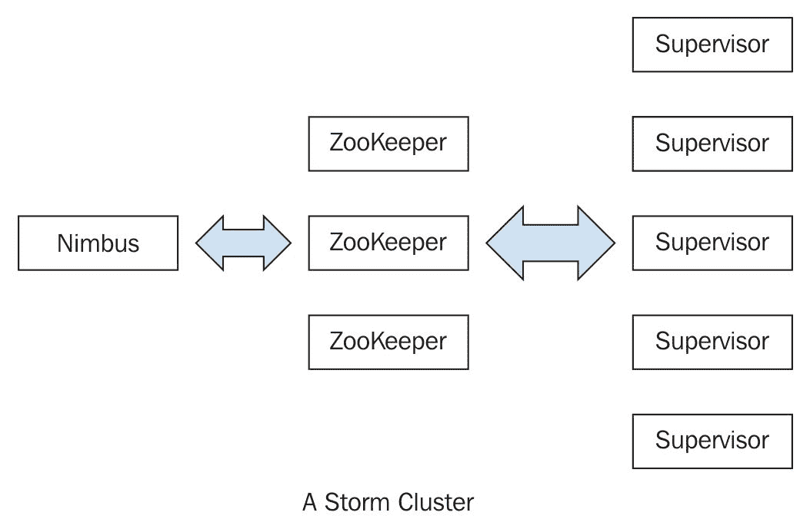
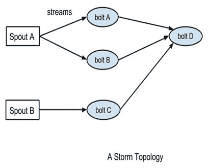

# 第一章：实时处理和 Storm 介绍

随着生成的数据量呈指数级增长和先进的数据捕获能力，企业面临着从这些海量原始数据中获取信息的挑战。在批处理方面，Hadoop 已成为处理大数据的首选框架。直到最近，当人们寻找构建实时流处理应用程序的框架时，一直存在空白。这些应用程序已成为许多企业的重要组成部分，因为它们使企业能够迅速响应事件并适应不断变化的情况。其例子包括监视社交媒体以分析公众对您推出的任何新产品的反应，并根据与选举相关的帖子的情绪来预测选举结果。

组织正在从外部来源收集大量数据，并希望实时评估/处理数据以获取市场趋势、检测欺诈、识别用户行为等。实时处理的需求日益增加，我们需要一个支持以下功能的实时系统/平台：

+   **可扩展**：平台应具有水平可扩展性，无需任何停机时间。

+   **容错性**：即使集群中的一些节点出现故障，平台也应能够处理数据。

+   **无数据丢失**：平台应提供消息的可靠处理。

+   **高吞吐量**：系统应能够支持每秒数百万条记录，并支持任何大小的消息。

+   **易于操作**：系统应具有易于安装和操作的特点。此外，集群的扩展应是一个简单的过程。

+   **多语言**：平台应支持多种语言。最终用户应能够用不同的语言编写代码。例如，用户可以用 Python、Scala、Java 等编写代码。此外，我们可以在一个集群中执行不同语言的代码。

+   **集群隔离**：系统应支持隔离，以便为处理分配专用进程到专用机器。

# Apache Storm

Apache Storm 已成为行业领袖开发分布式实时数据处理平台的首选平台。它提供了一组原语，可用于开发可以高度可扩展地实时处理大量数据的应用程序。

风暴对实时处理就像 Hadoop 对批处理一样重要。它是开源软件，由 Apache 软件基金会管理。它已经被 Twitter、Yahoo!和 Flipboard 等公司部署，以满足实时处理的需求。Storm 最初是由 BackType 的 Nathan Marz 开发的，BackType 是一家提供社交搜索应用的公司。后来，BackType 被 Twitter 收购，成为其基础设施的关键部分。Storm 可以用于以下用例：

+   **流处理**：Storm 用于处理数据流并实时更新各种数据库。这种处理是实时的，处理速度需要与输入数据速度匹配。

+   **持续计算**：Storm 可以对数据流进行持续计算，并实时将结果传输给客户端。这可能需要在每条消息到达时进行处理，或者在短时间内创建小批处理。持续计算的一个例子是将 Twitter 上的热门话题流式传输到浏览器中。

+   **分布式 RPC**：Storm 可以并行处理复杂查询，以便您可以实时计算它。

+   **实时分析**：Storm 可以分析并响应来自不同数据源的实时数据。

在本章中，我们将涵盖以下主题：

+   什么是 Storm？

+   Storm 的特点

+   Storm 集群的架构和组件

+   Storm 的术语

+   编程语言

+   操作模式

# Storm 的特点

以下是一些使 Storm 成为实时处理数据流的完美解决方案的特点：

+   **快速**：据报道，Storm 每个节点每秒可以处理高达 100 万个元组/记录。

+   **横向可扩展**：快速是构建高容量/高速数据处理平台的必要特性，但单个节点对其每秒处理事件数量有上限。节点代表设置中的单台机器，执行 Storm 应用程序。作为分布式平台，Storm 允许您向 Storm 集群添加更多节点，并增加应用程序的处理能力。此外，它是线性可扩展的，这意味着通过增加节点可以使处理能力加倍。

+   **容错**：Storm 集群中的工作单元由工作进程执行。当工作进程死掉时，Storm 将重新启动该工作进程，如果运行该工作进程的节点死掉，Storm 将在集群中的其他节点上重新启动该工作进程。这个特性将在第三章中详细介绍，*Storm 并行性和数据分区*。

+   **数据处理保证**：Storm 提供强有力的保证，即进入 Storm 进程的每条消息至少会被处理一次。在发生故障时，Storm 将重放丢失的元组/记录。此外，它可以配置为每条消息只被处理一次。

+   **易于操作**：Storm 部署和管理都很简单。一旦部署了集群，就需要很少的维护。

+   **编程语言无关**：尽管 Storm 平台在**Java 虚拟机**（**JVM**）上运行，但在其上运行的应用程序可以用任何能够读写标准输入和输出流的编程语言编写。

# Storm 组件

Storm 集群遵循主从模型，其中主和从进程通过 ZooKeeper 协调。以下是 Storm 集群的组件。

# Nimbus

Nimbus 节点是 Storm 集群中的主节点。它负责在各个工作节点之间分发应用程序代码，将任务分配给不同的机器，监视任务是否出现故障，并在需要时重新启动它们。

Nimbus 是无状态的，它将所有数据存储在 ZooKeeper 中。在 Storm 集群中只有一个 Nimbus 节点。如果活动节点宕机，那么备用节点将成为活动节点。它被设计为快速失败，因此当活动 Nimbus 宕机时，备用节点将成为活动节点，或者宕机的节点可以重新启动而不会对工作节点上已经运行的任务产生任何影响。这与 Hadoop 不同，如果 JobTracker 宕机，所有正在运行的作业都会处于不一致状态，需要重新执行。即使所有 Nimbus 节点都宕机，Storm 工作节点也可以正常工作，但用户无法向集群提交任何新作业，或者集群将无法重新分配失败的工作节点到另一个节点。

# 主管节点

主管节点是 Storm 集群中的工作节点。每个主管节点运行一个主管守护进程，负责创建、启动和停止工作进程以执行分配给该节点的任务。与 Nimbus 一样，主管守护进程也是快速失败的，并将其所有状态存储在 ZooKeeper 中，以便可以在不丢失状态的情况下重新启动。通常，单个主管守护进程会处理在该机器上运行的多个工作进程。

# ZooKeeper 集群

在任何分布式应用程序中，各种进程需要相互协调并共享一些配置信息。ZooKeeper 是一个应用程序，以可靠的方式提供所有这些服务。作为一个分布式应用程序，Storm 也使用 ZooKeeper 集群来协调各种进程。与 ZooKeeper 中的所有状态和提交给 Storm 的各种任务相关的所有数据都存储在 ZooKeeper 中。Nimbus 和监督节点不直接相互通信，而是通过 ZooKeeper。由于所有数据都存储在 ZooKeeper 中，因此 Nimbus 和监督守护程序都可以突然被杀死而不会对集群产生不利影响。

以下是一个 Storm 集群的架构图：

# Storm 数据模型

Storm 应用程序可以处理的基本数据单元称为元组。每个元组由预定义的字段列表组成。每个字段的值可以是字节、字符、整数、长整数、浮点数、双精度浮点数、布尔值或字节数组。Storm 还提供了一个 API 来定义自己的数据类型，这些数据类型可以作为元组中的字段进行序列化。

元组是动态类型的，也就是说，您只需要定义元组中字段的名称而不需要它们的数据类型。动态类型的选择有助于简化 API 并使其易于使用。此外，由于 Storm 中的处理单元可以处理多种类型的元组，因此声明字段类型并不实际。

元组中的每个字段都可以通过其名称`getValueByField(String)`或其位置索引`getValue(int)`来访问。元组还提供了方便的方法，例如`getIntegerByField(String)`，可以使您免于对对象进行类型转换。例如，如果您有一个表示分数的*Fraction (numerator, denominator)*元组，那么您可以通过使用`getIntegerByField("numerator")`或`getInteger(0)`来获取分子的值。

您可以在位于[`storm.apache.org/releases/1.0.2/javadocs/org/apache/storm/tuple/Tuple.html`](https://storm.apache.org/releases/1.0.2/javadocs/org/apache/storm/tuple/Tuple.html)的 Java 文档中查看`org.apache.storm.tuple.Tuple`支持的完整操作集。

# Storm 拓扑的定义

在 Storm 术语中，拓扑是定义计算图的抽象。您可以创建一个 Storm 拓扑并将其部署到 Storm 集群中以处理数据。拓扑可以用有向无环图表示，其中每个节点都进行某种处理并将其转发到流程中的下一个节点。以下图是一个示例 Storm 拓扑：

以下是 Storm 拓扑的组件：

+   **Tuple**：在拓扑的不同实例之间流动的单个消息/记录称为元组。

+   **Stream**：Storm 中的关键抽象是流。流是一系列可以由 Storm 并行处理的元组。每个流可以由单个或多个类型的 bolt（Storm 中的处理单元，在本节后面定义）并行处理。因此，Storm 也可以被视为转换流的平台。在前面的图中，流用箭头表示。Storm 应用程序中的每个流都被赋予一个 ID，bolt 可以根据其 ID 从这些流中产生和消费元组。每个流还有一个与其流经的元组相关的模式。

+   **Spout**：Spout 是 Storm 拓扑中元组的来源。它负责从外部来源读取或监听数据，例如从日志文件中读取或监听队列中的新消息并发布它们--在 Storm 术语中发射到流中。Spout 可以发射多个流，每个流具有不同的模式。例如，它可以从日志文件中读取包含 10 个字段的记录，并将它们作为包含七个字段元组和四个字段元组的不同流发射出去。

`org.apache.storm.spout.ISpout`接口是用于定义喷口的接口。如果您在 Java 中编写拓扑，则应使用`org.apache.storm.topology.IRichSpout`，因为它声明了与`TopologyBuilder`API 一起使用的方法。每当喷口发射一个元组时，Storm 会跟踪处理此元组时生成的所有元组，当源元组的图中所有元组的执行完成时，它将向喷口发送确认。只有在发射元组时提供了消息 ID 时才会发生此跟踪。如果使用 null 作为消息 ID，则不会发生此跟踪。

还可以为拓扑定义元组处理超时，如果元组在指定的超时时间内未被处理，将向喷口发送失败消息。再次强调，只有在定义消息 ID 时才会发生这种情况。通过跳过发射元组时的消息 ID 来禁用消息确认，可以从 Storm 中获得一些小的性能提升，但也会有一些数据丢失的风险。

喷口的重要方法有：

+   +   `nextTuple()`: Storm 调用此方法从输入源获取下一个元组。在此方法内部，您将具有从外部源读取数据并将其发射到`org.apache.storm.spout.ISpoutOutputCollector`实例的逻辑。可以使用`org.apache.storm.topology.OutputFieldsDeclarer`的`declareStream`方法声明流的模式。

如果喷口希望向多个流发射数据，可以使用`declareStream`方法声明多个流，并在发射元组时指定流 ID。如果此时没有更多的元组要发射，此方法将不会被阻塞。此外，如果此方法不发射元组，则 Storm 将在再次调用它之前等待 1 毫秒。可以使用`topology.sleep.spout.wait.strategy.time.ms`设置来配置此等待时间。

+   +   `ack(Object msgId)`: 当具有给定消息 ID 的元组被拓扑完全处理时，Storm 将调用此方法。在这一点上，用户应标记消息已处理，并进行必要的清理，例如从消息队列中删除消息，以便不再处理它。

+   `fail(Object msgId)`: 当 Storm 识别出具有给定消息 ID 的元组未能成功处理或超时配置的时间间隔时，将调用此方法。在这种情况下，用户应进行必要的处理，以便通过`nextTuple`方法再次发射消息。一个常见的做法是将消息放回传入消息队列。

+   `open()`: 当喷口初始化时，只调用一次此方法。如果需要连接到外部源以获取输入数据，应在 open 方法中定义连接到外部源的逻辑，然后在`nextTuple`方法中不断从外部源获取数据以进一步发射它。

在编写喷口时需要注意的另一点是，不能阻塞任何方法，因为 Storm 在同一线程中调用所有方法。每个喷口都有一个内部缓冲区，用于跟踪到目前为止发射的元组的状态。喷口将保留这些元组在缓冲区中，直到它们被确认或失败，分别调用`ack`或`fail`方法。只有当此缓冲区不满时，Storm 才会调用`nextTuple`方法。

+   **Bolt**: 一个 bolt 是 Storm 拓扑的处理引擎，负责转换流。理想情况下，拓扑中的每个 bolt 都应该对元组进行简单的转换，许多这样的 bolt 可以相互协调，展示复杂的转换。

`org.apache.storm.task.IBolt`接口通常用于定义 bolt，如果拓扑是用 Java 编写的，则应该使用`org.apache.storm.topology.IRichBolt`接口。Bolt 可以订阅拓扑中其他组件（spouts 或其他 bolts）的多个流，同样也可以向多个流发出输出。可以使用`org.apache.storm.topology.OutputFieldsDeclarer`的`declareStream`方法声明输出流。

一个 bolt 的重要方法有：

+   +   `execute(Tuple input)`: 对于通过订阅的输入流传入的每个元组，将执行此方法。在此方法中，您可以对元组进行所需的任何处理，然后以发出更多元组到声明的输出流的形式，或者其他操作，比如将结果持久化到数据库。

在调用此方法时，您不需要立即处理元组，可以将元组保留直到需要。例如，在连接两个流时，当一个元组到达时，您可以将其保留，直到其对应的元组也到达，然后您可以发出连接的元组。

与元组相关的元数据可以通过`Tuple`接口中定义的各种方法来检索。如果元组关联了消息 ID，则 execute 方法必须使用`OutputCollector`为 bolt 发布`ack`或`fail`事件，否则 Storm 将不知道元组是否被成功处理。`org.apache.storm.topology.IBasicBolt`接口是一个方便的接口，在 execute 方法完成后会自动发送确认。如果要发送失败事件，此方法应该抛出`org.apache.storm.topology.FailedException`。

+   +   `prepare(Map stormConf, TopologyContext context, OutputCollector collector)`: 在 Storm 拓扑中，一个 bolt 可以由多个 worker 执行。Bolt 的实例在客户端机器上创建，然后序列化并提交给 Nimbus。当 Nimbus 为拓扑创建 worker 实例时，它会将这个序列化的 bolt 发送给 worker。worker 将解序列化 bolt 并调用`prepare`方法。在这个方法中，您应该确保 bolt 被正确配置以执行元组。您希望保持的任何状态可以存储为 bolt 的实例变量，稍后可以进行序列化/反序列化。

# Storm 中的操作模式

操作模式指示了拓扑在 Storm 中的部署方式。Storm 支持两种类型的操作模式来执行 Storm 拓扑：

+   **本地模式**：在本地模式下，Storm 拓扑在单个 JVM 中在本地机器上运行。这种模式模拟了单个 JVM 中的 Storm 集群，并用于拓扑的测试和调试。

+   **远程模式**：在远程模式下，我们将使用 Storm 客户端将拓扑提交给主节点，以及执行拓扑所需的所有必要代码。Nimbus 将负责分发您的代码。

在下一章中，我们将更详细地介绍本地模式和远程模式，以及一个示例。

# 编程语言

Storm 从一开始就被设计为可用于任何编程语言。Storm 的核心是用于定义和提交拓扑的 thrift 定义。由于 thrift 可以在任何语言中使用，因此可以用任何语言定义和提交拓扑。

同样，spouts 和 bolts 可以用任何语言定义。非 JVM spouts 和 bolts 通过`stdin`/`stdout`上的基于 JSON 的协议与 Storm 通信。实现这种协议的适配器存在于 Ruby、Python、JavaScript 和 Perl 中。您可以参考[`github.com/apache/storm/tree/master/storm-multilang`](https://github.com/apache/storm/tree/master/storm-multilang)了解这些适配器的实现。

Storm-starter 有一个示例拓扑，[`github.com/apache/storm/tree/master/examples/storm-starter/multilang/resources`](https://github.com/apache/storm/tree/master/examples/storm-starter/multilang/resources)，其中使用 Python 实现了其中一个 bolt。

# 总结

在本章中，我们向您介绍了 Storm 的基础知识以及构成 Storm 集群的各种组件。我们看到了 Storm 集群可以操作的不同部署/运行模式的定义。

在下一章中，我们将建立一个单节点和三节点的 Storm 集群，并看看如何在 Storm 集群上部署拓扑。我们还将看到 Storm 支持的不同类型的流分组以及 Storm 提供的消息语义保证。
