# 第二章：Storm 部署、拓扑开发和拓扑选项

本章中，我们将从在多个节点（三个 Storm 和三个 ZooKeeper）集群上部署 Storm 开始。这一章非常重要，因为它关注了我们如何设置生产 Storm 集群以及为什么我们需要 Storm Supervisor、Nimbus 和 ZooKeeper 的高可用性（因为 Storm 使用 ZooKeeper 来存储集群、拓扑等元数据）。

以下是本章将要涵盖的关键点：

+   Storm 集群的部署

+   程序和部署词频统计示例

+   Storm UI 的不同选项——kill、active、inactive 和 rebalance

+   Storm UI 的演练

+   动态日志级别设置

+   验证 Nimbus 的高可用性

# Storm 的先决条件

在开始部署 Storm 集群之前，您应该安装 Java JDK 和 ZooKeeper 集群。

# 安装 Java SDK 7

执行以下步骤在您的机器上安装 Java SDK 7。您也可以选择 JDK 1.8：

1.  从 Oracle 网站（[`www.oracle.com/technetwork/java/javase/downloads/index.html`](http://www.oracle.com/technetwork/java/javase/downloads/index.html)）下载 Java SDK 7 RPM。

1.  使用以下命令在您的 CentOS 机器上安装 Java `jdk-7u<version>-linux-x64.rpm`文件：

```scala
sudo rpm -ivh jdk-7u<version>-linux-x64.rpm 
```

1.  在`~/.bashrc`文件中添加以下环境变量：

```scala
export JAVA_HOME=/usr/java/jdk<version>
```

1.  将 JDK 的`bin`目录的路径添加到`PATH`系统环境变量中，添加到`~/.bashrc`文件中：

```scala
export PATH=$JAVA_HOME/bin:$PATH 
```

1.  运行以下命令在当前登录终端重新加载`bashrc`文件：

```scala
source ~/.bashrc
```

1.  检查 Java 安装如下：

```scala
java -version  
```

上述命令的输出如下：

```scala
java version "1.7.0_71"
Java(TM) SE Runtime Environment (build 1.7.0_71-b14)
Java HotSpot(TM) 64-Bit Server VM (build 24.71-b01, mixed mode) 
```

# ZooKeeper 集群的部署

在任何分布式应用程序中，各种进程需要相互协调并共享配置信息。ZooKeeper 是一个应用程序，以可靠的方式提供所有这些服务。作为一个分布式应用程序，Storm 也使用 ZooKeeper 集群来协调各种进程。与集群相关的所有状态和提交给 Storm 的各种任务都存储在 ZooKeeper 中。本节描述了如何设置 ZooKeeper 集群。我们将部署一个由三个节点组成的 ZooKeeper 集群，可以处理一个节点故障。以下是三个节点 ZooKeeper 集群的部署图：

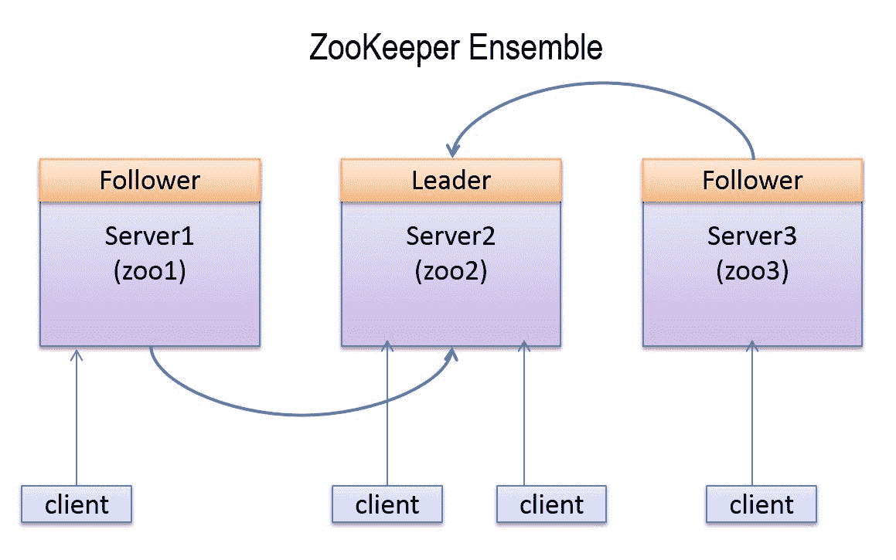

在 ZooKeeper 集群中，集群中的一个节点充当领导者，而其余的节点充当跟随者。如果 ZooKeeper 集群的领导者节点死亡，那么在剩余的活动节点中进行新的领导者选举，并选举出一个新的领导者。来自客户端的所有写请求都会被转发到领导者节点，而跟随者节点只处理读请求。此外，我们无法通过增加节点数量来增加 ZooKeeper 集合的写性能，因为所有写操作都经过领导者节点。

建议运行奇数个 ZooKeeper 节点，因为只要大多数节点（活动节点数大于*n/2*，其中*n*为部署节点数）在运行，ZooKeeper 集群就会继续工作。因此，如果我们有一个由四个 ZooKeeper 节点组成的集群（*3 > 4/2*；只能有一个节点死亡），那么我们只能处理一个节点故障，而如果我们在集群中有五个节点（*3 > 5/2*；可以处理两个节点故障），那么我们可以处理两个节点故障。

步骤 1 到 4 需要在每个节点上执行以部署 ZooKeeper 集群：

1.  从 ZooKeeper 网站（[`zookeeper.apache.org/releases.html`](http://zookeeper.apache.org/releases.html)）下载最新的稳定 ZooKeeper 版本。在撰写本文时，最新版本是 ZooKeeper 3.4.6。

1.  一旦你下载了最新版本，解压它。现在，我们设置`ZK_HOME`环境变量以使设置更容易。

1.  将`ZK_HOME`环境变量指向解压后的目录。使用以下命令在`$ZK_HOME/conf`目录中创建配置文件`zoo.cfg`：

```scala
cd $ZK_HOME/conf 
touch zoo.cfg 
```

1.  将以下属性添加到`zoo.cfg`文件中：

```scala
tickTime=2000 
dataDir=/var/zookeeper 
clientPort=2181 
initLimit=5 
syncLimit=2 
server.1=zoo1:2888:3888 
server.2=zoo2:2888:3888 
server.3=zoo3.2888.3888  
```

这里，`zoo1`、`zoo2`和`zoo3`是 ZooKeeper 节点的 IP 地址。以下是每个属性的定义：

+   +   `tickTime`：这是 ZooKeeper 中以毫秒为单位使用的基本时间单位。它用于发送心跳，最小会话超时将是`tickTime`值的两倍。

+   `dataDir`：这是用于存储内存数据库快照和事务日志的目录。

+   `clientPort`：这是用于监听客户端连接的端口。

+   `initLimit`：这是允许跟随者连接和同步到领导者节点所需的`tickTime`值的数量。

+   `syncLimit`：这是一个跟随者可以用来与领导者节点同步的`tickTime`值的数量。如果同步在此时间内未发生，跟随者将从集合中删除。

`server.id=host:port:port`格式的最后三行指定了集群中有三个节点。在集合中，每个 ZooKeeper 节点必须具有 1 到 255 之间的唯一 ID 号。通过在每个节点的`dataDir`目录中创建名为`myid`的文件来定义此 ID。例如，ID 为 1 的节点（`server.1=zoo1:2888:3888`）将在目录`/var/zookeeper`中具有一个`myid`文件，其中包含`1`。

对于此集群，在三个位置创建`myid`文件，如下所示：

```scala
At zoo1 /var/zookeeper/myid contains 1 
At zoo2 /var/zookeeper/myid contains 2 
At zoo3 /var/zookeeper/myid contains 3  
```

1.  在每台机器上运行以下命令以启动 ZooKeeper 集群：

```scala
bin/zkServer.sh start  
```

通过执行以下步骤检查 ZooKeeper 节点的状态：

1.  在`zoo1`节点上运行以下命令以检查第一个节点的状态：

```scala
bin/zkServer.sh status 
```

以下信息显示：

```scala
JMX enabled by default 
Using config: /home/root/zookeeper-3.4.6/bin/../conf/zoo.cfg 
Mode: follower   
```

第一个节点以`follower`模式运行。

1.  通过执行以下命令检查第二个节点的状态：

```scala
bin/zkServer.sh status  
```

以下信息显示：

```scala
JMX enabled by default 
Using config: /home/root/zookeeper-3.4.6/bin/../conf/zoo.cfg 
Mode: leader  
```

第二个节点以`leader`模式运行。

1.  通过执行以下命令检查第三个节点的状态：

```scala
bin/zkServer.sh status

```

以下信息显示：

```scala
JMX enabled by default 
Using config: /home/root/zookeeper-3.4.6/bin/../conf/zoo.cfg 
Mode: follower  
```

第三个节点以`follower`模式运行。

1.  在领导者机器上运行以下命令以停止领导者节点：

```scala
bin/zkServer.sh stop  
```

现在，通过执行以下步骤检查剩余两个节点的状态：

1.  使用以下命令检查第一个节点的状态：

```scala
bin/zkServer.sh status  
```

以下信息显示：

```scala
JMX enabled by default 
Using config: /home/root/zookeeper-3.4.6/bin/../conf/zoo.cfg 
Mode: follower   
```

第一个节点再次以`follower`模式运行。

1.  使用以下命令检查第二个节点的状态：

```scala
bin/zkServer.sh status   
```

以下信息显示：

```scala
JMX enabled by default 
Using config: /home/root/zookeeper-3.4.6/bin/../conf/zoo.cfg 
Mode: leader  
```

第三个节点被选举为新的领导者。

1.  现在，使用以下命令重新启动第三个节点：

```scala
bin/zkServer.sh status  
```

这是一个快速介绍，介绍了如何设置 ZooKeeper，可用于开发；但是，不适合生产。有关 ZooKeeper 管理和维护的完整参考，请参阅 ZooKeeper 网站上的在线文档[`zookeeper.apache.org/doc/trunk/zookeeperAdmin.html`](http://zookeeper.apache.org/doc/trunk/zookeeperAdmin.html)。

# 设置 Storm 集群

在本章中，我们将学习如何设置一个三节点 Storm 集群，其中一个节点将是活动的主节点（Nimbus），另外两个将是工作节点（supervisors）。

以下是我们三个节点 Storm 集群的部署图：

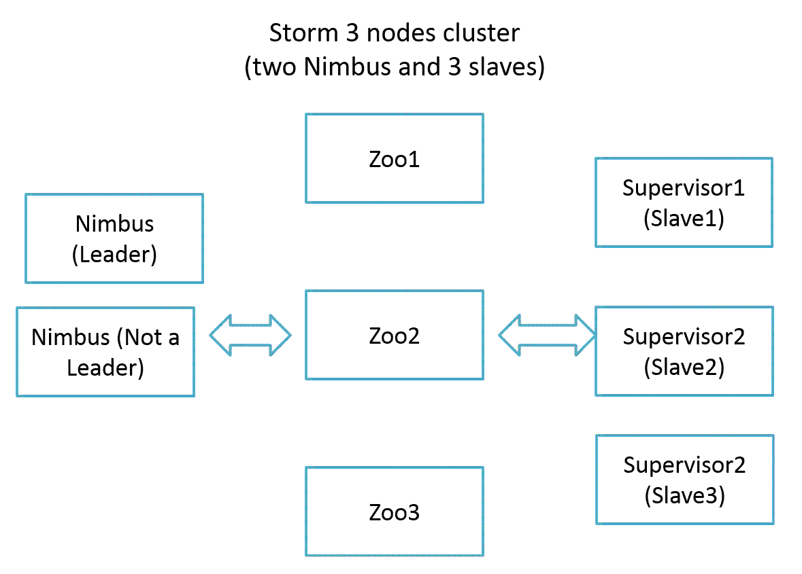

以下是设置三节点 Storm 集群所需执行的步骤：

1.  安装并运行 ZooKeeper 集群。有关安装 ZooKeeper 的步骤在前一节中提到。

1.  从[`storm.apache.org/downloads.html`](https://storm.apache.org/downloads.html)下载最新稳定的 Storm 版本；在撰写本文时，最新版本是 Storm 1.0.2。

1.  一旦你下载了最新版本，在所有三台机器上复制并解压。现在，我们将在每台机器上设置`$STORM_HOME`环境变量，以便更轻松地进行设置。`$STORM_HOME`环境变量包含 Storm `home`文件夹的路径（例如，导出`STORM_HOME=/home/user/storm-1.0.2`）。

1.  在主节点的`$STORM_HOME/conf`目录中，向`storm.yaml`文件添加以下行：

```scala
storm.zookeeper.servers: 
- "zoo1" 
- "zoo2" 
- "zoo3" 
storm.zookeeper.port: 2181 
nimbus.seeds: "nimbus1,nimbus2" 
storm.local.dir: "/tmp/storm-data"  
```

我们正在安装两个主节点。

1.  在每个工作节点的`$STORM_HOME/conf`目录中，向`storm.yaml`文件添加以下行：

```scala
storm.zookeeper.servers: 
- "zoo1" 
- "zoo2" 
- "zoo3" 
storm.zookeeper.port: 2181 
nimbus.seeds: "nimbus1,nimbus2" 
storm.local.dir: "/tmp/storm-data" 
supervisor.slots.ports: 
- 6700 
- 6701 
- 6702 
- 6703  
```

如果你计划在同一台机器上执行 Nimbus 和 supervisor，则也在 Nimbus 机器上添加`supervisor.slots.ports`属性。

1.  在主节点的`$STORM_HOME`目录中执行以下命令来启动主守护进程：

```scala
$> bin/storm nimbus &  
```

1.  在每个工作节点（或 supervisor 节点）的`$STORM_HOME`目录中执行以下命令来启动工作守护进程：

```scala
$> bin/storm supervisor &  
```

# 开发 hello world 示例

在开始开发之前，你应该在你的项目中安装 Eclipse 和 Maven。这里解释的样本拓扑将涵盖如何创建一个基本的 Storm 项目，包括一个 spout 和 bolt，以及如何构建和执行它们。

通过使用`com.stormadvance`作为`groupId`和`storm-example`作为`artifactId`创建一个 Maven 项目。

在`pom.xml`文件中添加以下 Maven 依赖项：

```scala
<dependency> 
  <groupId>org.apache.storm</groupId> 
  <artifactId>storm-core</artifactId> 
  <version>1.0.2</version> 
  <scope>provided<scope> 
</dependency> 
```

确保 Storm 依赖的范围是提供的，否则你将无法在 Storm 集群上部署拓扑。

在`pom.xml`文件中添加以下 Maven `build`插件：

```scala
<build> 
  <plugins> 
    <plugin> 
      <artifactId>maven-assembly-plugin</artifactId> 
      <version>2.2.1</version> 
      <configuration> 
        <descriptorRefs> 
          <descriptorRef>jar-with-dependencies 
          </descriptorRef> 
        </descriptorRefs> 
        <archive> 
          <manifest> 
            <mainClass /> 
          </manifest> 
        </archive> 
      </configuration> 
      <executions> 
        <execution> 
          <id>make-assembly</id> 
          <phase>package</phase> 
          <goals> 
            <goal>single</goal> 
          </goals> 
        </execution> 
      </executions> 
    </plugin> 
  </plugins> 
</build> 
```

通过在`com.stormadvance.storm_example`包中创建`SampleSpout`类来编写你的第一个样本 spout。`SampleSpout`类扩展了序列化的`BaseRichSpout`类。这个 spout 不连接到外部源来获取数据，而是随机生成数据并发出连续的记录流。以下是`SampleSpout`类的源代码及其解释：

```scala
public class SampleSpout extends BaseRichSpout { 
  private static final long serialVersionUID = 1L; 

  private static final Map<Integer, String> map = new HashMap<Integer, String>(); 
  static { 
    map.put(0, "google"); 
    map.put(1, "facebook"); 
    map.put(2, "twitter"); 
    map.put(3, "youtube"); 
    map.put(4, "linkedin"); 
  } 
  private SpoutOutputCollector spoutOutputCollector; 

  public void open(Map conf, TopologyContext context, SpoutOutputCollector spoutOutputCollector) { 
    // Open the spout 
    this.spoutOutputCollector = spoutOutputCollector; 
  } 

  public void nextTuple() { 
    // Storm cluster repeatedly calls this method to emita continuous 
    // stream of tuples. 
    final Random rand = new Random(); 
    // generate the random number from 0 to 4\. 
    int randomNumber = rand.nextInt(5); 
    spoutOutputCollector.emit(new Values(map.get(randomNumber))); 
    try{ 
      Thread.sleep(5000); 
    }catch(Exception e) { 
      System.out.println("Failed to sleep the thread"); 
    } 
  } 

  public void declareOutputFields(OutputFieldsDeclarer declarer) { 

  // emit the tuple with field "site" 
  declarer.declare(new Fields("site")); 
  } 
} 
```

通过在同一包中创建`SampleBolt`类来编写你的第一个样本 bolt。`SampleBolt`类扩展了序列化的`BaseRichBolt`类。这个 bolt 将消耗`SampleSpout` spout 发出的元组，并在控制台上打印`site`字段的值。以下是`SampleStormBolt`类的源代码及其解释：

```scala
public class SampleBolt extends BaseBasicBolt { 
  private static final long serialVersionUID = 1L; 

  public void execute(Tuple input, BasicOutputCollector collector) { 
    // fetched the field "site" from input tuple. 
    String test = input.getStringByField("site"); 
    // print the value of field "site" on console. 
    System.out.println("######### Name of input site is : " + test); 
  } 

  public void declareOutputFields(OutputFieldsDeclarer declarer) { 
  } 
} 
```

在同一包中创建一个主`SampleStormTopology`类。这个类创建了一个 spout 和 bolt 的实例以及类，并使用`TopologyBuilder`类将它们链接在一起。这个类使用`org.apache.storm.LocalCluster`来模拟 Storm 集群。`LocalCluster`模式用于在部署到 Storm 集群之前在开发者机器上进行调试/测试拓扑。以下是主类的实现：

```scala
public class SampleStormTopology { 
  public static void main(String[] args) throws AlreadyAliveException, InvalidTopologyException { 
    // create an instance of TopologyBuilder class 
    TopologyBuilder builder = new TopologyBuilder(); 
    // set the spout class 
    builder.setSpout("SampleSpout", new SampleSpout(), 2); 
    // set the bolt class 
    builder.setBolt("SampleBolt", new SampleBolt(), 4).shuffleGrouping("SampleSpout"); 
    Config conf = new Config(); 
    conf.setDebug(true); 
    // create an instance of LocalCluster class for 
    // executing topology in local mode. 
    LocalCluster cluster = new LocalCluster(); 
    // SampleStormTopology is the name of submitted topology 
    cluster.submitTopology("SampleStormTopology", conf, builder.createTopology()); 
    try { 
      Thread.sleep(100000); 
    } catch (Exception exception) { 
      System.out.println("Thread interrupted exception : " + exception); 
    } 
    // kill the SampleStormTopology 
    cluster.killTopology("SampleStormTopology"); 
    // shutdown the storm test cluster 
    cluster.shutdown(); 
  } 
} 
```

转到你的项目主目录，并运行以下命令以在本地模式下执行拓扑：

```scala
$> cd $STORM_EXAMPLE_HOME 
$> mvn compile exec:java -Dexec.classpathScope=compile -Dexec.mainClass=com.stormadvance.storm_example.SampleStormTopology 
```

现在为在实际 Storm 集群上部署拓扑创建一个新的拓扑类。在同一包中创建一个主`SampleStormClusterTopology`类。这个类还创建了一个 spout 和 bolt 的实例以及类，并使用`TopologyBuilder`类将它们链接在一起。

```scala
public class SampleStormClusterTopology { 
  public static void main(String[] args) throws AlreadyAliveException, InvalidTopologyException { 
    // create an instance of TopologyBuilder class 
    TopologyBuilder builder = new TopologyBuilder(); 
    // set the spout class 
    builder.setSpout("SampleSpout", new SampleSpout(), 2); 
    // set the bolt class 
    builder.setBolt("SampleBolt", new SampleBolt(), 4).shuffleGrouping("SampleSpout"); 
    Config conf = new Config(); 
    conf.setNumWorkers(3); 
    // This statement submit the topology on remote 
    // args[0] = name of topology 
    try { 
      StormSubmitter.submitTopology(args[0], conf, builder.createTopology()); 
    } catch (AlreadyAliveException alreadyAliveException) { 
      System.out.println(alreadyAliveException); 
    } catch (InvalidTopologyException invalidTopologyException) { 
      System.out.println(invalidTopologyException); 
    } catch (AuthorizationException e) { 
      // TODO Auto-generated catch block 
      e.printStackTrace(); 
    } 
  } 
} 
```

通过在项目的主目录上运行以下命令来构建你的 Maven 项目：

```scala
mvn clean install  
```

上述命令的输出如下：

```scala
    ------------------------------------------------------------------ ----- 
    [INFO] ----------------------------------------------------------- ----- 
    [INFO] BUILD SUCCESS 
    [INFO] ----------------------------------------------------------- ----- 
    [INFO] Total time: 58.326s 
    [INFO] Finished at: 
    [INFO] Final Memory: 14M/116M 
    [INFO] ----------------------------------------------------------- ----

```

我们可以使用以下 Storm 客户端命令将拓扑部署到集群：

```scala
bin/storm jar jarName.jar [TopologyMainClass] [Args] 
```

上述命令使用参数`arg1`和`arg2`运行`TopologyMainClass`。`TopologyMainClass`的主要功能是定义拓扑并将其提交到 Nimbus 机器。`storm jar`部分负责连接到 Nimbus 机器并上传 JAR 部分。

登录到 Storm Nimbus 机器并执行以下命令：

```scala
$> cd $STORM_HOME
$> bin/storm jar ~/storm_example-0.0.1-SNAPSHOT-jar-with-dependencies.jar com.stormadvance.storm_example.SampleStormClusterTopology storm_example  
```

在上述代码中，`~/storm_example-0.0.1-SNAPSHOT-jar-with-dependencies.jar`是我们在 Storm 集群上部署的`SampleStormClusterTopology` JAR 的路径。

显示以下信息：

```scala
702  [main] INFO  o.a.s.StormSubmitter - Generated ZooKeeper secret payload for MD5-digest: -8367952358273199959:-5050558042400210383
793  [main] INFO  o.a.s.s.a.AuthUtils - Got AutoCreds []
856  [main] INFO  o.a.s.StormSubmitter - Uploading topology jar /home/USER/storm_example-0.0.1-SNAPSHOT-jar-with-dependencies.jar to assigned location: /tmp/storm-data/nimbus/inbox/stormjar-d3007821-f87d-48af-8364-cff7abf8652d.jar
867  [main] INFO  o.a.s.StormSubmitter - Successfully uploaded topology jar to assigned location: /tmp/storm-data/nimbus/inbox/stormjar-d3007821-f87d-48af-8364-cff7abf8652d.jar
868  [main] INFO  o.a.s.StormSubmitter - Submitting topology storm_example in distributed mode with conf {"storm.zookeeper.topology.auth.scheme":"digest","storm.zookeeper.topology.auth.payload":"-8367952358273199959:-5050558042400210383","topology.workers":3}
 1007 [main] INFO  o.a.s.StormSubmitter - Finished submitting topology: storm_example  
```

运行`jps`命令，查看运行的 JVM 进程数量如下：

```scala
jps   
```

前面命令的输出是：

```scala
26827 worker 
26530 supervisor 
26824 worker 
26468 nimbus 
26822 worker  
```

在上述代码中，`worker`是为`SampleStormClusterTopology`拓扑启动的 JVM。

# Storm 拓扑的不同选项

此部分涵盖了用户可以在 Storm 集群上执行的以下操作：

+   停用

+   激活

+   重新平衡

+   杀死

+   动态日志级别设置

# 停用

Storm 支持停用拓扑。在停用状态下，spout 不会向管道中发射任何新的元组，但已经发射的元组的处理将继续。以下是停用运行中拓扑的命令：

```scala
$> bin/storm deactivate topologyName 
```

使用以下命令停用`SampleStormClusterTopology`：

```scala
bin/storm deactivate SampleStormClusterTopology 
```

显示以下信息：

```scala
0 [main] INFO backtype.storm.thrift - Connecting to Nimbus at localhost:6627 
76 [main] INFO backtype.storm.command.deactivate - Deactivated topology: SampleStormClusterTopology  
```

# 激活

Storm 还支持激活拓扑。当拓扑被激活时，spout 将重新开始发射元组。以下是激活拓扑的命令：

```scala
$> bin/storm activate topologyName  
```

使用以下命令激活`SampleStormClusterTopology`：

```scala
bin/storm activate SampleStormClusterTopology
```

显示以下信息：

```scala
0 [main] INFO backtype.storm.thrift - Connecting to Nimbus at localhost:6627 
65 [main] INFO backtype.storm.command.activate - Activated topology: SampleStormClusterTopology  
```

# 重新平衡

在运行时更新拓扑并行度的过程称为**重新平衡**。有关此操作的更详细信息可以在第三章中找到，*Storm 并行性和数据分区*。

# 杀死

Storm 拓扑是永无止境的进程。要停止一个拓扑，我们需要杀死它。被杀死后，拓扑首先进入停用状态，处理已经发射到其中的所有元组，然后停止。运行以下命令杀死`SampleStormClusterTopology`：

```scala
$> bin/storm kill SampleStormClusterTopology  
```

显示以下信息：

```scala
0 [main] INFO backtype.storm.thrift - Connecting to Nimbus at localhost:6627 
80 [main] INFO backtype.storm.command.kill-topology - Killed topology: SampleStormClusterTopology

```

现在，再次运行`jps`命令，查看剩余的 JVM 进程如下：

```scala
jps  
```

前面命令的输出是：

```scala
26530 supervisor 
27193 Jps 
26468 nimbus  
```

# 动态日志级别设置

这允许用户在不停止拓扑的情况下更改拓扑的日志级别。此操作的详细信息可以在本章末尾找到。

# Storm UI 的演练

此部分将向您展示如何启动 Storm UI 守护程序。但是，在启动 Storm UI 守护程序之前，我们假设您已经有一个运行中的 Storm 集群。Storm 集群部署步骤在本章的前几节中有提到。现在，转到 Storm 主目录（`cd $STORM_HOME`）在领导 Nimbus 机器上，并运行以下命令启动 Storm UI 守护程序：

```scala
$> cd $STORM_HOME
$> bin/storm ui &  
```

默认情况下，Storm UI 在启动的机器的`8080`端口上启动。现在，我们将浏览到`http://nimbus-node:8080`页面，查看 Storm UI，其中 Nimbus 节点是 Nimbus 机器的 IP 地址或主机名。

以下是 Storm 主页的屏幕截图：

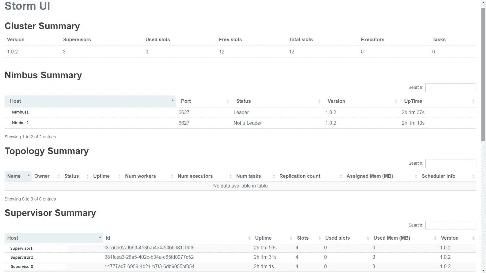

# 集群摘要部分

Storm UI 的这一部分显示了在集群中部署的 Storm 版本、Nimbus 节点的正常运行时间、空闲工作插槽数量、已使用的工作插槽数量等。在向集群提交拓扑时，用户首先需要确保空闲插槽列的值不为零；否则，拓扑将不会获得任何用于处理的工作进程，并将在队列中等待，直到有工作进程空闲为止。

# Nimbus 摘要部分

Storm UI 的这一部分显示了在 Storm 集群中运行的 Nimbus 进程数量。该部分还显示了 Nimbus 节点的状态。状态为`Leader`的节点是活动主节点，而状态为`Not a Leader`的节点是被动主节点。

# 监督摘要部分

Storm UI 的这一部分显示了运行在集群中的监督节点的列表，以及它们的 Id、主机、正常运行时间、插槽和已使用插槽列。

# Nimbus 配置部分

Storm UI 的此部分显示了 Nimbus 节点的配置。一些重要的属性是：

+   `supervisor.slots.ports`

+   `storm.zookeeper.port`

+   `storm.zookeeper.servers`

+   `storm.zookeeper.retry.interval`

+   `worker.childopts`

+   `supervisor.childopts`

以下是 Nimbus 配置的屏幕截图：

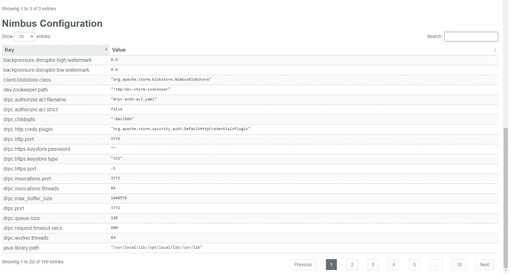

# 拓扑摘要部分

Storm UI 的此部分显示了在 Storm 集群中运行的拓扑列表，以及它们的 ID，分配给拓扑的工作进程数量，执行器数量，任务数量，正常运行时间等。

让我们通过运行以下命令在远程 Storm 集群中部署示例拓扑（如果尚未运行）：

```scala
$> cd $STORM_HOME
$> bin/storm jar ~/storm_example-0.0.1-SNAPSHOT-jar-with-dependencies.jar com.stormadvance.storm_example.SampleStormClusterTopology storm_example  
```

我们通过定义三个工作进程、两个执行器用于`SampleSpout`和四个执行器用于`SampleBolt`创建了`SampleStormClusterTopology`拓扑。

在 Storm 集群上提交`SampleStormClusterTopology`后，用户必须刷新 Storm 主页。

以下屏幕截图显示在拓扑摘要部分为`SampleStormClusterTopology`添加了一行。拓扑部分包含拓扑的名称，拓扑的唯一 ID，拓扑的状态，正常运行时间，分配给拓扑的工作进程数量等。状态字段的可能值为`ACTIVE`，`KILLED`和`INACTIVE`。

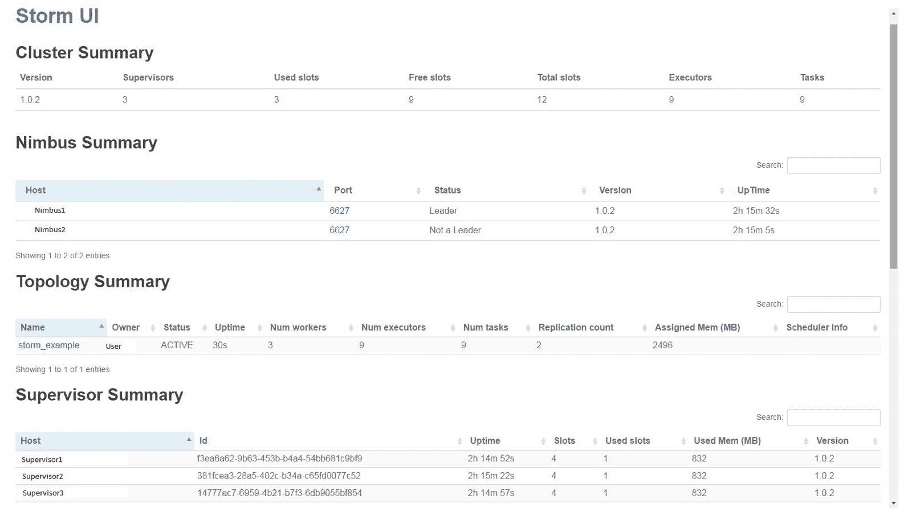

让我们单击`SampleStormClusterTopology`以查看其详细统计信息。有两个屏幕截图。第一个包含有关分配给`SampleStormClusterTopology`拓扑的工作进程、执行器和任务数量的信息。

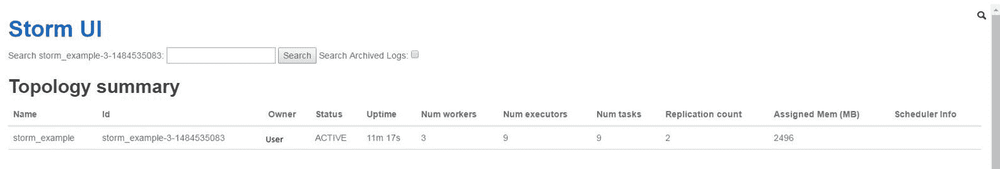

下一个屏幕截图包含有关喷口和螺栓的信息，包括分配给每个喷口和螺栓的执行器和任务数量：

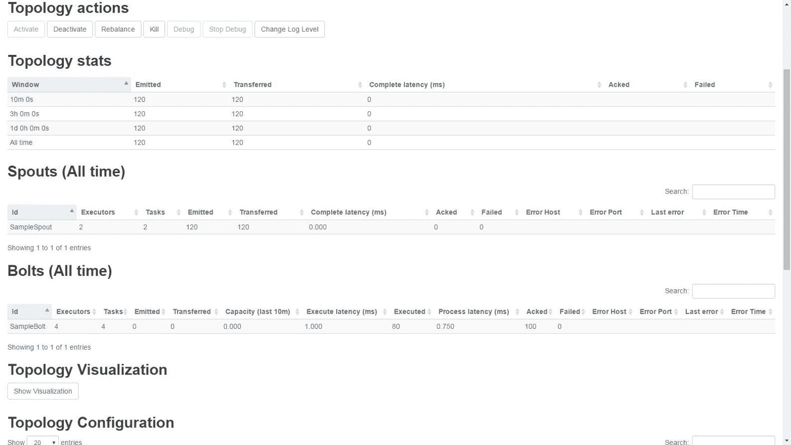

前面屏幕截图中显示的信息如下：

+   拓扑统计：此部分将提供有关在 10 分钟、3 小时、1 天和自拓扑启动以来的窗口内发出的元组数量、传输数量、确认数量、容量延迟等信息。

+   喷口（所有时间）：此部分显示拓扑内所有运行的喷口的统计信息

+   Bolts（所有时间）：此部分显示拓扑内所有运行的螺栓的统计信息

+   拓扑操作：此部分允许我们通过 Storm UI 直接对拓扑执行激活、停用、重平衡、杀死等操作：

+   停用：单击停用以停用拓扑。一旦拓扑停用，喷口停止发出元组，并且在 Storm UI 上拓扑的状态变为 INACTIVE。

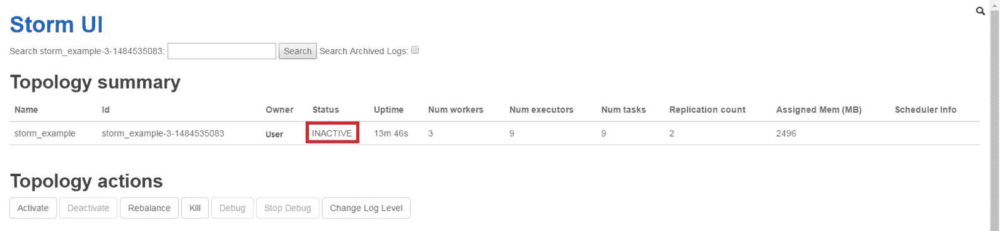

停用拓扑不会释放 Storm 资源。

+   +   激活：单击激活按钮以激活拓扑。一旦拓扑被激活，喷口将再次开始发出元组。

+   Kill：单击 Kill 按钮销毁/杀死拓扑。一旦拓扑被杀死，它将释放分配给该拓扑的所有 Storm 资源。在杀死拓扑时，Storm 将首先停用喷口，并等待警报框中提到的杀死时间，以便螺栓有机会完成喷口发出的元组的处理，然后再执行杀命令。以下屏幕截图显示了如何通过 Storm UI 杀死拓扑：

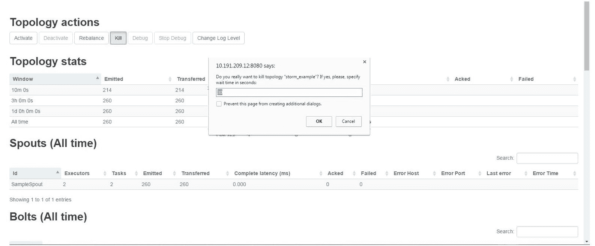

让我们转到 Storm UI 的主页，以查看`SampleStormClusterToplogy`的状态，如下图所示：

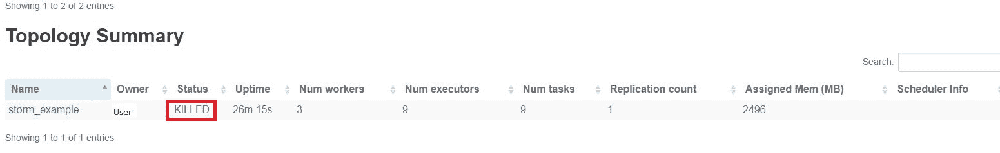

# 动态日志级别设置

动态日志级别允许我们从 Storm CLI 和 Storm UI 在运行时更改拓扑的日志级别设置。

# 从 Storm UI 更新日志级别

按照以下步骤从 Storm UI 更新日志级别：

1.  如果`SampleStormClusterTopology`没有运行，请在 Storm 集群上再次部署。

1.  浏览 Storm UI，网址为`http://nimbus-node:8080/`。

1.  单击`storm_example`拓扑。

1.  现在点击“更改日志级别”按钮来更改拓扑的`ROOT`记录器，如下面的屏幕截图所示：

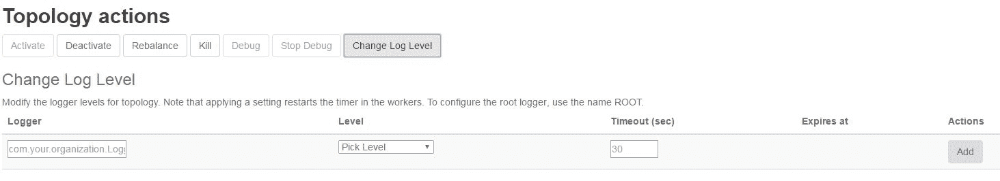

1.  配置以下屏幕截图中提到的条目，将`ROOT`记录器更改为 ERROR：

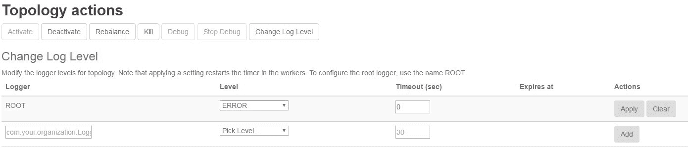

1.  如果您计划将日志级别更改为 DEBUG，则必须指定该日志级别的超时（过期时间），如下面的屏幕截图所示：

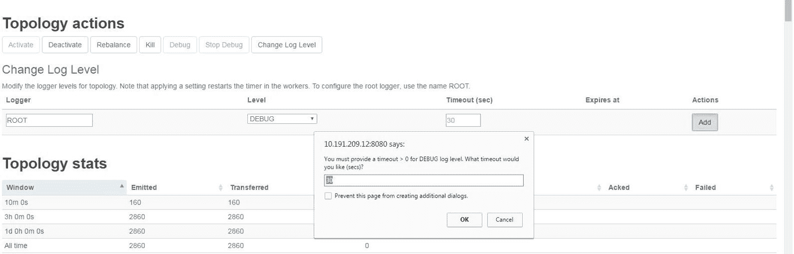

1.  一旦到达超时时间中提到的时间，日志级别将恢复为默认值：

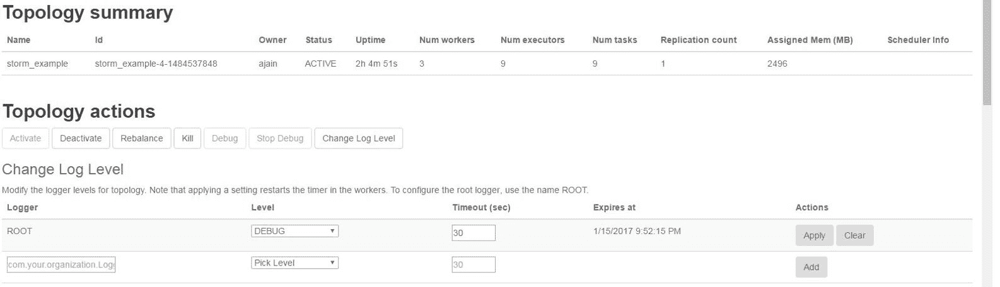

1.  操作列中提到的清除按钮将清除日志设置，并且应用将再次设置默认的日志设置。

# 从 Storm CLI 更新日志级别

我们可以从 Storm CLI 修改日志级别。以下是用户必须从 Storm 目录执行的命令，以更新运行时的日志设置：

```scala
bin/storm set_log_level [topology name] -l [logger name]=[LEVEL]:[TIMEOUT] 
```

在上述代码中，`topology name`是拓扑的名称，`logger name`是我们想要更改的记录器。如果要更改`ROOT`记录器，则将`ROOT`用作`logger name`的值。`LEVEL`是您要应用的日志级别。可能的值包括`DEBUG`、`INFO`、`ERROR`、`TRACE`、`ALL`、`WARN`、`FATAL`和`OFF`。

`TIMEOUT`是以秒为单位的时间。超时时间后，日志级别将恢复为正常。如果要将日志级别设置为`DEBUG`/`ALL`，则`TIMEOUT`的值是必需的。

以下是更改`storm_example`拓扑的日志级别设置的命令：

```scala
$> bin/storm set_log_level storm_example -l ROOT=DEBUG:30  
```

以下是清除日志级别设置的命令：

```scala
$> ./bin/storm set_log_level storm_example -r ROOT 
```

# 总结

在本章中，我们已经涵盖了 Storm 和 ZooKeeper 集群的安装，Storm 集群上拓扑的部署，Nimbus 节点的高可用性，以及通过 Storm UI 进行拓扑监控。我们还介绍了用户可以在运行中的拓扑上执行的不同操作。最后，我们重点关注了如何改变运行中拓扑的日志级别。

在下一章中，我们将重点关注在多个 Storm 机器/节点上分发拓扑。
