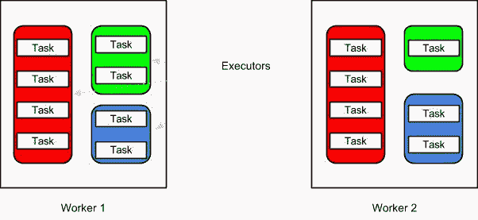
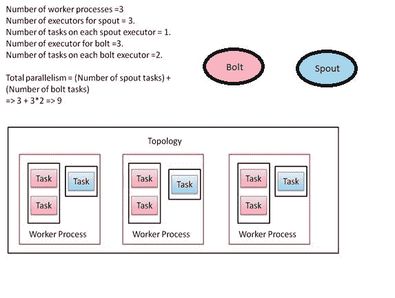
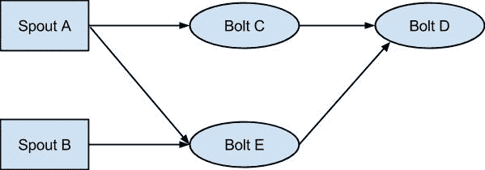
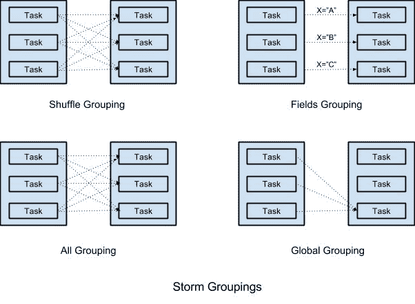
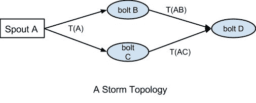

# 第三章：Storm 并行性和数据分区

在前两章中，我们已经介绍了 Storm 的概述、Storm 的安装以及开发一个示例拓扑。在本章中，我们将专注于将拓扑分布在多个 Storm 机器/节点上。本章涵盖以下内容：

+   拓扑的并行性

+   如何在代码级别配置并行性

+   Storm 集群中不同类型的流分组

+   消息处理保证

+   Tick tuple

# 拓扑的并行性

并行性意味着将作业分布在多个节点/实例上，每个实例可以独立工作并有助于数据的处理。让我们首先看一下负责 Storm 集群并行性的进程/组件。

# 工作进程

Storm 拓扑在 Storm 集群中的多个监督节点上执行。集群中的每个节点可以运行一个或多个称为**工作进程**的 JVM，负责处理拓扑的一部分。

工作进程特定于特定的拓扑，并且可以执行该拓扑的多个组件。如果同时运行多个拓扑，它们中的任何一个都不会共享任何工作进程，因此在拓扑之间提供了一定程度的隔离。

# 执行器

在每个工作进程中，可以有多个线程执行拓扑的部分。这些线程中的每一个都被称为**执行器**。执行器只能执行拓扑中的一个组件，即拓扑中的任何 spout 或 bolt。

每个执行器作为一个单独的线程，只能按顺序执行分配给它的任务。在拓扑运行时，可以动态更改为 spout 或 bolt 定义的执行器数量，这意味着您可以轻松控制拓扑中各个组件的并行度。

# 任务

这是 Storm 中任务执行的最细粒度单位。每个任务都是 spout 或 bolt 的一个实例。在定义 Storm 拓扑时，可以为每个 spout 和 bolt 指定任务的数量。一旦定义，组件的任务数量就不能在运行时更改。每个任务可以单独执行，也可以与相同类型的另一个任务或相同 spout 或 bolt 的另一个实例一起执行。

以下图表描述了工作进程、执行器和任务之间的关系。在下图中，每个组件有两个执行器，每个执行器承载不同数量的任务。

此外，您可以看到为一个组件定义了两个执行器和八个任务（每个执行器承载四个任务）。如果您对这个配置没有获得足够的性能，您可以轻松地将组件的执行器数量更改为四个或八个，以增加性能，并且任务将在该组件的所有执行器之间均匀分布。以下图表显示了执行器、任务和工作进程之间的关系：



# 在代码级别配置并行性

Storm 提供了一个 API 来在代码级别设置工作进程的数量、执行器的数量和任务的数量。以下部分展示了我们如何在代码级别配置并行性。

我们可以通过使用`org.apache.storm.Config`类的`setNumWorkers`方法在代码级别设置工作进程的数量。以下是代码片段，展示了这些设置的实际应用：

```scala
Config conf = new Config(); 
conf.setNumWorkers(3); 
```

在上一章中，我们将工作进程的数量配置为三。Storm 将为`SampleStormTopology`和`SampleStormClusterTopology`拓扑分配三个工作进程。

我们可以通过在`org.apache.storm.topology.TopologyBuilder`类的`setSpout(args,args,parallelism_hint)`或`setBolt(args,args,parallelism_hint)`方法中传递`parallelism_hint`参数来在代码级别设置执行器的数量。以下是代码片段，展示了这些设置的实际应用：

```scala
builder.setSpout("SampleSpout", new SampleSpout(), 2); 
// set the bolt class 
builder.setBolt("SampleBolt", new SampleBolt(), 4).shuffleGrouping("SampleSpout"); 
```

在上一章中，我们为`SampleSpout`设置了`parallelism_hint=2`，为`SampleBolt`设置了`parallelism_hint=4`。在执行时，Storm 将为`SampleSpout`分配两个执行器，为`SampleBolt`分配四个执行器。

我们可以配置在执行器内部可以执行的任务数量。以下是展示这些设置的代码片段：

```scala
builder.setSpout("SampleSpout", new SampleSpout(), 2).setNumTasks(4); 
```

在上述代码中，我们已经配置了`SampleSpout`的两个执行器和四个任务。对于`SampleSpout`，Storm 将为每个执行器分配两个任务。默认情况下，如果用户在代码级别不设置任务数量，Storm 将为每个执行器运行一个任务。

# Worker 进程、执行器和任务分布

假设为拓扑设置的 worker 进程数量为三，`SampleSpout`的执行器数量为三，`SampleBolt`的执行器数量为三。此外，`SampleBolt`的任务数量为六，这意味着每个`SampleBolt`执行器将有两个任务。以下图表显示了拓扑在运行时的样子：



# 重新平衡拓扑的并行性

在上一章中已经解释过，Storm 的一个关键特性是它允许我们在运行时修改拓扑的并行性。在运行时更新拓扑并行性的过程称为**rebalance**。

有两种重新平衡拓扑的方式：

+   使用 Storm Web UI

+   使用 Storm CLI

在上一章中介绍了 Storm Web UI。本节介绍了如何使用 Storm CLI 工具重新平衡拓扑。以下是我们需要在 Storm CLI 上执行的命令：

```scala
> bin/storm rebalance [TopologyName] -n [NumberOfWorkers] -e [Spout]=[NumberOfExecutos] -e [Bolt1]=[NumberOfExecutos] [Bolt2]=[NumberOfExecutos]
```

`rebalance`命令将首先在消息超时期间停用拓扑，然后在 Storm 集群中均匀重新分配 worker。几秒钟或几分钟后，拓扑将恢复到之前的激活状态，并重新开始处理输入流。

# 重新平衡 SampleStormClusterTopology 拓扑的并行性

首先通过在 supervisor 机器上运行`jps`命令来检查 Storm 集群中运行的 worker 进程的数量：

在 supervisor-1 上运行`jps`命令：

```scala
> jps
24347 worker
23940 supervisor
24593 Jps
24349 worker  
```

两个 worker 进程分配给 supervisor-1 机器。

现在，在 supervisor-2 上运行`jps`命令：

```scala
> jps
24344 worker
23941 supervisor
24543 Jps
```

一个 worker 进程分配给 supervisor-2 机器。

Storm 集群上运行着三个 worker 进程。

让我们尝试重新配置`SampleStormClusterTopology`，使用两个 worker 进程，`SampleSpout`使用四个执行器，`SampleBolt`使用四个执行器：

```scala
> bin/storm rebalance SampleStormClusterTopology -n 2 -e SampleSpout=4 -e SampleBolt=4

0     [main] INFO  backtype.storm.thrift  - Connecting to Nimbus at nimbus.host.ip:6627
58   [main] INFO  backtype.storm.command.rebalance  - Topology SampleStormClusterTopology is rebalancing
```

重新运行 supervisor 机器上的`jps`命令，查看 worker 进程的数量。

在 supervisor-1 上运行`jps`命令：

```scala
> jps
24377 worker
23940 supervisor
24593 Jps 
```

在 supervisor-2 上运行`jps`命令：

```scala
> jps
24353 worker
23941 supervisor
24543 Jps  
```

在这种情况下，之前显示了两个 worker 进程。第一个 worker 进程分配给 supervisor-1，另一个分配给 supervisor-2。worker 的分布可能会根据系统上运行的拓扑数量和每个 supervisor 上可用的插槽数量而有所不同。理想情况下，Storm 会尝试在所有节点之间均匀分配负载。

# Storm 集群中不同类型的流分组

在定义拓扑时，我们创建了一个计算图，其中包含了多个 bolt 处理流。在更细粒度的层面上，每个 bolt 在拓扑中执行多个任务。因此，特定 bolt 的每个任务只会从订阅的流中获取一部分元组。

Storm 中的流分组提供了对如何在订阅流的许多任务之间对元组进行分区的完全控制。可以在使用`org.apache e.storm.topology.TopologyBuilder.setBolt`方法定义 bolt 时，通过`org.apache.storm.topology.InputDeclarer`的实例来定义 bolt 的分组。

Storm 支持以下类型的流分组。

# Shuffle 分组

Shuffle 分组以均匀随机的方式在任务之间分发元组。每个任务将处理相等数量的元组。当您希望在任务之间均匀分配处理负载，并且不需要任何数据驱动的分区时，这种分组是理想的。这是 Storm 中最常用的分组之一。

# 字段分组

此分组使您能够根据元组中的某些字段对流进行分区。例如，如果您希望特定用户的所有推文都发送到一个任务，则可以使用字段分组按用户名对推文流进行分区：

```scala
builder.setSpout("1", new TweetSpout()); 
builder.setBolt("2", new TweetCounter()).fieldsGrouping("1", new Fields("username")) 
```

由于字段分组是*hash（字段）%（任务数）*，它不能保证每个任务都会获得要处理的元组。例如，如果您对字段应用了字段分组，比如*X*，只有两个可能的值，*A*和*B*，并为 bolt 创建了两个任务，那么*hash（A）%2*和*hash（B）%2*可能返回相等的值，这将导致所有元组都被路由到一个任务，另一个任务完全空闲。

字段分组的另一个常见用途是连接流。由于分区仅基于字段值而不是流类型，因此我们可以使用任何公共连接字段连接两个流。字段的名称不需要相同。例如，在订单处理领域，我们可以连接`Order`流和`ItemScanned`流以查看何时完成订单：

```scala
builder.setSpout("1", new OrderSpout()); 
builder.setSpount("2", new ItemScannedSpout()); 
builder.setBolt("joiner", new OrderJoiner()) 
.fieldsGrouping("1", new Fields("orderId")) 
.fieldsGrouping("2", new Fields("orderRefId")); 
```

由于流上的连接因应用程序而异，您将自己定义连接的定义，比如在时间窗口上进行连接，可以通过组合字段分组来实现。

# 所有分组

所有分组是一种特殊的分组，不会对元组进行分区，而是将它们复制到所有任务中，也就是说，每个元组将被发送到 bolt 的每个任务进行处理。

所有分组的一个常见用例是向 bolt 发送信号。例如，如果您对流进行某种过滤，可以通过向所有 bolt 的任务发送这些参数的流来传递或更改过滤参数，并使用所有分组进行订阅。另一个例子是向聚合 bolt 中的所有任务发送重置消息。

# 全局分组

全局分组不会对流进行分区，而是将完整的流发送到具有最小 ID 的 bolt 任务。这种情况的一般用例是在拓扑中需要减少阶段的情况，其中您希望将拓扑中以前步骤的结果合并到单个 bolt 中。

全局分组乍看起来可能是多余的，因为如果只有一个输入流，您可以通过将 bolt 的并行度定义为 1 来实现相同的结果。但是，当您有多个数据流通过不同路径传入时，您可能希望只有一个流被减少，而其他流被并行处理。

例如，考虑以下拓扑。在这种情况下，您可能希望将来自**Bolt C**的所有元组组合在一个**Bolt D**任务中，而您可能仍希望将来自**Bolt E**到**Bolt D**的元组并行处理：



# 直接分组

在直接分组中，发射器决定每个元组将在哪里进行处理。例如，假设我们有一个日志流，我们希望根据资源类型将每个日志条目处理为特定的 bolt 任务。在这种情况下，我们可以使用直接分组。

直接分组只能与直接流一起使用。要声明一个流为直接流，请使用`backtype.storm.topology.OutputFieldsDeclarer.declareStream`方法，该方法带有一个`boolean`参数。一旦有了要发射的直接流，请使用`backtype.storm.task.OutputCollector.emitDirect`而不是 emit 方法来发射它。`emitDirect`方法带有一个`taskId`参数来指定任务。您可以使用`backtype.storm.task.TopologyContext.getComponentTasks`方法获取组件的任务数。

# 本地或 shuffle 分组

如果 tuple 源和目标 bolt 任务在同一个 worker 中运行，使用此分组将仅在同一 worker 上运行的目标任务之间起到洗牌分组的作用，从而最大程度地减少任何网络跳数，提高性能。

如果源 worker 进程上没有运行目标 bolt 任务，这种分组将类似于前面提到的 shuffle 分组。

# None 分组

当您不关心 tuple 在各个任务之间如何分区时，可以使用 None 分组。从 Storm 0.8 开始，这相当于使用 shuffle 分组。

# 自定义分组

如果前面的分组都不适合您的用例，您可以通过实现`backtype.storm.grouping.CustomStreamGrouping`接口来定义自己的自定义分组。

以下是一个基于 tuple 中的类别对流进行分区的示例自定义分组：

```scala
public class CategoryGrouping implements CustomStreamGrouping, Serializable { 
  private static final Map<String, Integer> categories = ImmutableMap.of 
  ( 
    "Financial", 0,  
    "Medical", 1,  
    "FMCG", 2,  
    "Electronics", 3 
  ); 

  private int tasks = 0; 

  public void prepare(WorkerTopologyContext context, GlobalStreamId stream, List<Integer> targetTasks)  
  { 
    tasks = targetTasks.size(); 
  } 

  public List<Integer> chooseTasks(int taskId, List<Object> values) { 
    String category = (String) values.get(0); 
    return ImmutableList.of(categories.get(category) % tasks); 
  } 
} 
```

以下图表以图形方式表示了 Storm 分组：



# 保证消息处理

在 Storm 拓扑中，spout 发出的单个 tuple 可能会导致拓扑后期生成多个 tuple。例如，考虑以下拓扑：



在这里，**Spout A**发出一个 tuple **T(A)**，由**bolt B**和**bolt C**处理，它们分别发出 tuple **T(AB)**和**T(AC)**。因此，当作为 tuple **T(A)**结果产生的所有 tuple--即 tuple 树**T(A)**，**T(AB)**和**T(AC)**--都被处理时，我们说该 tuple 已完全处理。

当 tuple 树中的一些 tuple 由于某些运行时错误或每个拓扑可配置的超时而未能处理时，Storm 将视其为失败的 tuple。

Storm 需要以下六个步骤来保证消息处理：

1.  用唯一的消息 ID 标记 spout 发出的每个 tuple。这可以通过使用`org.apache.storm.spout.SpoutOutputColletor.emit`方法来实现，该方法带有一个`messageId`参数。Storm 使用此消息 ID 来跟踪由此 tuple 生成的 tuple 树的状态。如果您使用不带`messageId`参数的 emit 方法之一，Storm 将不会跟踪它以进行完全处理。当消息完全处理时，Storm 将使用发出 tuple 时使用的相同`messageId`发送确认。

1.  spout 实现的通用模式是，它们从消息队列（例如 RabbitMQ）中读取消息，将 tuple 生成到拓扑中进行进一步处理，然后一旦收到 tuple 已完全处理的确认，就将消息出队。

1.  当拓扑中的一个 bolt 在处理消息过程中需要生成一个新的 tuple 时，例如前面拓扑中的**bolt B**，那么它应该发出新的 tuple，并用它从 spout 获取的原始 tuple 进行关联。这可以通过使用`org.apache.storm.task.OutputCollector`类中带有 anchor tuple 参数的重载 emit 方法来实现。如果您从同一个输入 tuple 发出多个 tuple，则要为每个输出的 tuple 进行关联。

1.  每当您在 bolt 的 execute 方法中处理完一个 tuple 时，使用`org.apache.storm.task.OutputCollector.ack`方法发送确认。当确认到达发射的 spout 时，您可以安全地将消息标记为已处理，并从消息队列中出队（如果有的话）。

1.  同样，如果在处理元组时出现问题，应该使用`org.apache.storm.task.OutputCollector.fail`方法发送失败信号，以便 Storm 可以重放失败的消息。

1.  在 Storm bolt 中处理的一般模式之一是在 execute 方法的末尾处理一个元组，发出新的元组，并在 execute 方法的末尾发送确认。Storm 提供了`org.apache.storm.topology.base.BasicBasicBolt`类，它会在 execute 方法的末尾自动发送确认。如果要发出失败信号，请在 execute 方法中抛出`org.apache.storm.topology.FailedException`。

这种模型导致至少一次消息处理语义，并且你的应用程序应该准备好处理一些消息会被多次处理的情况。Storm 还提供了一次消息处理语义，我们将在第五章 *Trident Topology and Uses*中讨论。

尽管可以通过这里提到的方法在 Storm 中实现一些消息处理的保证，但你是否真正需要它，这总是一个需要考虑的问题，因为你可以通过冒一些消息不被 Storm 完全处理来获得很大的性能提升。这是在设计应用程序时可以考虑的一个权衡。

# Tick 元组

在某些用例中，一个 bolt 需要在执行某些操作之前缓存数据几秒钟，比如在每 5 秒清理缓存或者在单个请求中插入一批记录到数据库中。

tick 元组是系统生成（由 Storm 生成）的元组，我们可以在每个 bolt 级别进行配置。开发人员可以在编写 bolt 时在代码级别配置 tick 元组。

我们需要在 bolt 中重写以下方法以启用 tick 元组：

```scala
@Override 
public Map<String, Object> getComponentConfiguration() { 
  Config conf = new Config(); 
  int tickFrequencyInSeconds = 10; 
  conf.put(Config.TOPOLOGY_TICK_TUPLE_FREQ_SECS, 
  tickFrequencyInSeconds); 
  return conf; 
} 
```

在前面的代码中，我们已经将 tick 元组的时间配置为 10 秒。现在，Storm 将在每 10 秒开始生成一个 tick 元组。

此外，我们需要在 bolt 的 execute 方法中添加以下代码以识别元组的类型：

```scala
@Override 
public void execute(Tuple tuple) { 
  if (isTickTuple(tuple)) { 
    // now you can trigger e.g. a periodic activity 
  } 
  else { 
    // do something with the normal tuple 
  } 
} 

private static boolean isTickTuple(Tuple tuple) { 
  return
  tuple.getSourceComponent().equals(Constants.SYSTEM_COMPONENT_ID) && tuple.getSourceStreamId().equals(Constants.SYSTEM_TICK_STREAM_ID); 
} 
```

如果`isTickTuple()`方法的输出为 true，则输入元组是一个 tick 元组。否则，它是由前一个 bolt 发出的普通元组。

请注意，tick 元组会像普通元组一样发送到 bolt/spout，这意味着它们将排在 bolt/spout 即将通过其`execute()`或`nextTuple()`方法处理的其他元组之后。因此，你为 tick 元组配置的时间间隔在实践中是尽力而为的。例如，如果一个 bolt 受到高执行延迟的影响--例如，由于被常规非 tick 元组的传入速率压倒--那么你会观察到在 bolt 中实现的周期性活动会比预期触发得晚。

# 总结

在本章中，我们已经介绍了如何定义 Storm 的并行性，如何在多个节点之间分发作业，以及如何在多个 bolt 实例之间分发数据。本章还涵盖了两个重要特性：消息处理的保证和 tick 元组。

在下一章中，我们将介绍 Storm 上的 Trident 高级抽象。Trident 主要用于解决实时事务问题，这是无法通过普通的 Storm 解决的。
