# 第四章：Trident 介绍

在前几章中，我们介绍了 Storm 的架构、拓扑、bolt、spout、元组等。在本章中，我们介绍了 Trident，它是 Storm 的高级抽象。

本章涵盖了以下内容：

+   Trident 介绍

+   理解 Trident 的数据模型

+   编写 Trident 函数、过滤器和投影

+   Trident 重新分区操作

+   Trident 聚合器

+   何时使用 Trident

# Trident 介绍

Trident 是建立在 Storm 之上的高级抽象。Trident 支持有状态的流处理，而纯 Storm 是一个无状态的处理框架。使用 Trident 的主要优势在于它保证每个进入拓扑的消息只被处理一次，这在纯 Storm 中很难实现。Trident 的概念类似于高级批处理工具，如 Cascading 和 Pig，它们是在 Hadoop 上开发的。为了实现精确一次处理，Trident 会将输入流分批处理。我们将在第五章的*Trident 拓扑和用途*、*Trident 状态*部分详细介绍。

在前三章中，我们了解到，在 Storm 的拓扑中，spout 是元组的来源。元组是 Storm 应用程序可以处理的数据单元，而 bolt 是我们编写转换逻辑的处理引擎。但在 Trident 拓扑中，bolt 被更高级的函数、聚合、过滤器和状态的语义所取代。

# 理解 Trident 的数据模型

Trident 元组是 Trident 拓扑的数据模型。Trident 元组是可以被 Trident 拓扑处理的数据的基本单元。每个元组由预定义的字段列表组成。每个字段的值可以是字节、字符、整数、长整型、浮点数、双精度浮点数、布尔值或字节数组。在构建拓扑时，对元组执行操作，这些操作要么向元组添加新字段，要么用一组新字段替换元组。

元组中的每个字段都可以通过名称`(getValueByField(String))`或其位置索引`(getValue(int))`来访问。Trident 元组还提供了方便的方法，如`getIntegerByField(String)`，可以避免您对对象进行类型转换。

# 编写 Trident 函数、过滤器和投影

本节介绍了 Trident 函数、过滤器和投影的定义。Trident 函数、过滤器和投影用于根据特定条件修改/过滤输入元组。本节还介绍了如何编写 Trident 函数、过滤器和投影。

# Trident 函数

Trident 函数包含修改原始元组的逻辑。Trident 函数接收元组的一组字段作为输入，并输出一个或多个元组。输出元组的字段与输入元组的字段合并，形成完整的元组，然后传递给拓扑中的下一个操作。如果 Trident 函数没有输出与输入元组对应的元组，则该元组将从流中移除。

我们可以通过扩展`storm.trident.operation.BaseFunction`类并实现`execute(TridentTuple tuple, TridentCollector collector)`方法来编写自定义的 Trident 函数。

让我们编写一个示例的 Trident 函数，它将返回一个名为`sum`的新字段：

```scala
public class SumFunction extends BaseFunction { 

  private static final long serialVersionUID = 5L; 

  public void execute(TridentTuple tuple, TridentCollector collector) { 
    int number1 = tuple.getInteger(0); 
    int number2 = tuple.getInteger(1); 
    int sum = number1+number2; 
    // emit the sum of first two fields 
    collector.emit(new Values(sum)); 

  } 

} 
```

假设我们将`dummyStream`作为输入，其中包含四个字段`a`、`b`、`c`、`d`，并且只有字段`a`和`b`作为输入字段传递给`SumFunction`函数。`SumFunction`类会发出一个新字段`sum`。`SumFunction`类的`execute`方法发出的`sum`字段与输入元组合并，形成完整的元组。因此，输出元组中的字段总数为`5 (a, b, c, d, sum)`。以下是一个示例代码片段，展示了如何将输入字段和新字段的名称传递给 Trident 函数：

```scala
dummyStream.each(new Fields("a","b"), new SumFunction (), new Fields("sum")) 
```

以下图显示了输入元组，`SumFunction`和输出元组。输出元组包含五个字段，`a`，`b`，`c`，`d`和`sum`：

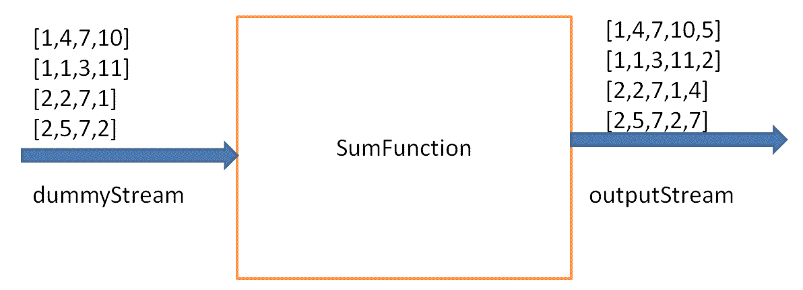

# Trident 过滤器

Trident 过滤器以一组字段作为输入，并根据某种条件是否满足返回 true 或 false。如果返回 true，则元组保留在输出流中；否则，元组从流中移除。

我们可以通过扩展`storm.trident.operation.BaseFilter`类并实现`isKeep(TridentTuple tuple)`方法来编写自定义的 Trident 过滤器。

让我们编写一个示例 Trident 过滤器，检查输入字段的和是偶数还是奇数。如果和是偶数，则 Trident 过滤器发出 true；否则发出 false：

```scala
public static class CheckEvenSumFilter extends BaseFilter{ 

  private static final long serialVersionUID = 7L; 

  public boolean isKeep(TridentTuple tuple) { 
    int number1 = tuple.getInteger(0); 
    int number2 = tuple.getInteger(1); 
    int sum = number1+number2; 
    if(sum % 2 == 0) { 
      return true; 
    } 
    return false; 
  } 

} 
```

假设我们得到了名为`dummyStream`的输入，其中包含四个字段，`a`，`b`，`c`，`d`，并且只有字段`a`和`b`作为输入字段传递给`CheckEvenSumFilter`过滤器。`CheckEvenSumFilter`类的`execute`方法将仅发出那些`a`和`b`的和为偶数的元组。以下是一段示例代码，展示了如何为 Trident 过滤器定义输入字段：

```scala
dummyStream.each(new Fields("a","b"), new CheckEvenSumFilter ()) 
```

以下图显示了输入元组，`CheckEvenSumFilter`和输出元组。`outputStream`仅包含那些字段`a`和`b`的和为偶数的元组：

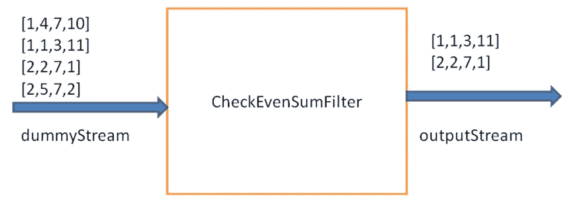

# Trident 投影

Trident 投影仅保留流中在投影操作中指定的字段。假设输入流包含三个字段，`x`，`y`和`z`，并且我们将字段`x`传递给投影操作，那么输出元组将包含一个字段`x`。以下是一段代码，展示了如何使用投影操作：

```scala
mystream.project(new Fields("x")) 
```

以下图显示了 Trident 投影：

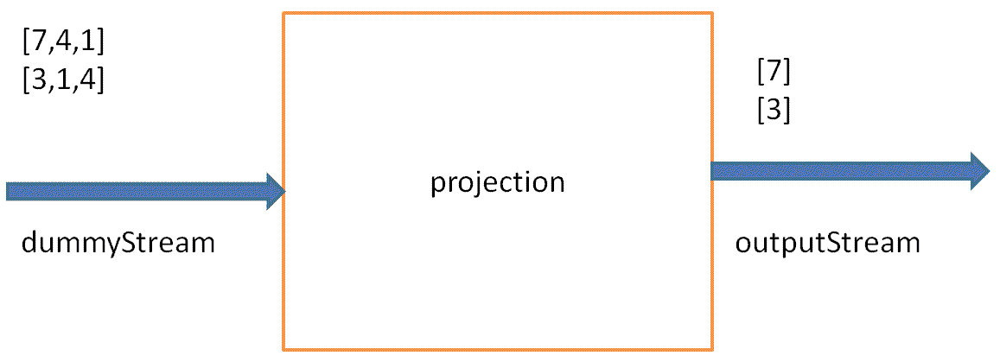

# Trident 重新分区操作

通过执行重新分区操作，用户可以将元组分布在多个任务中。重新分区操作不会对元组的内容进行任何更改。此外，元组只会通过网络进行重新分区操作。以下是不同类型的重新分区操作。

# 利用 shuffle 操作

这种重新分区操作以一种均匀随机的方式将元组分布在多个任务中。当我们希望在任务之间均匀分配处理负载时，通常会使用这种重新分区操作。以下图显示了如何使用`shuffle`操作重新分区输入元组：

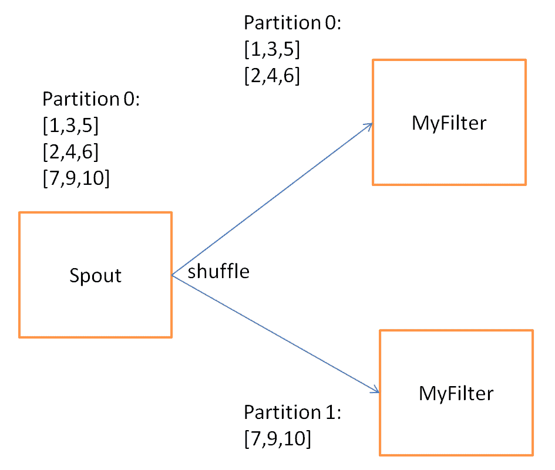

以下是一段代码，展示了如何使用`shuffle`操作：

```scala
mystream.shuffle().each(new Fields("a","b"), new myFilter()).parallelismHint(2) 
```

# 利用 partitionBy 操作

这种重新分区操作使您能够根据元组中的字段对流进行分区。例如，如果您希望来自特定用户的所有推文都发送到同一个目标分区，则可以通过以下方式对推文流进行分区，即应用`partitionBy`到`username`字段：

```scala
mystream.partitionBy(new Fields("username")).each(new Fields("username","text"), new myFilter()).parallelismHint(2) 
```

`partitionBy`操作应用以下公式来决定目标分区：

*目标分区 = 哈希(字段) % (目标分区数)*

如前面的公式所示，`partitionBy`操作计算输入字段的哈希以决定目标分区。因此，它不能保证所有任务都会得到元组进行处理。例如，如果您对一个字段应用了`partitionBy`，比如`X`，只有两个可能的值，`A`和`B`，并为`MyFilter`过滤器创建了两个任务，那么可能会出现哈希(`A`) % 2 和哈希(`B`) % 2 相等的情况，这将导致所有元组都被路由到一个任务，而其他元组完全空闲。

以下图显示了如何使用`partitionBy`操作重新分区输入元组：

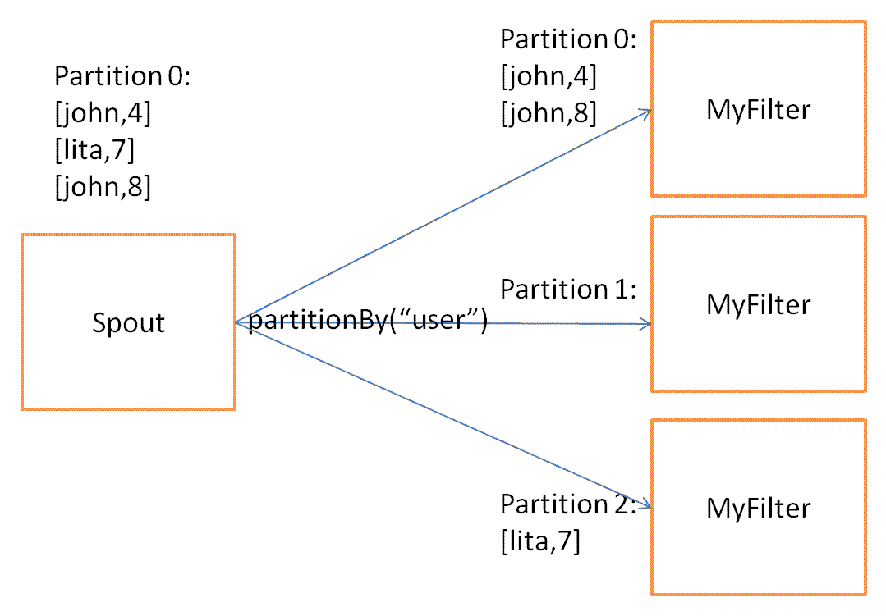

如前图所示，**Partition 0**和**Partition 2**包含一组元组，但**Partition 1**为空。

# 利用全局操作

这种重新分配操作将所有元组路由到同一分区。因此，流中所有批次都选择相同的目标分区。以下是一个显示如何使用`global`操作重新分配元组的图表：

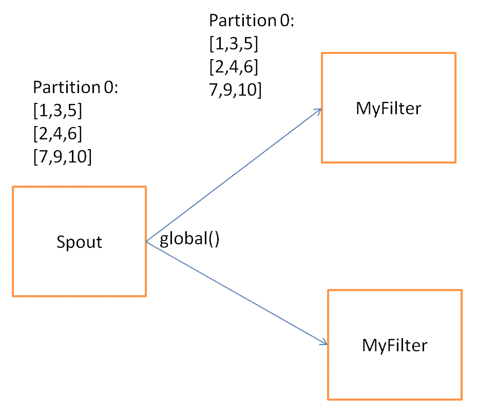

以下是一段代码，显示了如何使用`global`操作：

```scala
mystream.global().each(new Fields("a","b"), new myFilter()).parallelismHint(2) 
```

# 利用 broadcast 操作

`broadcast`操作是一种特殊的重新分配操作，不会对元组进行分区，而是将它们复制到所有分区。以下是一个显示元组如何通过网络发送的图表：

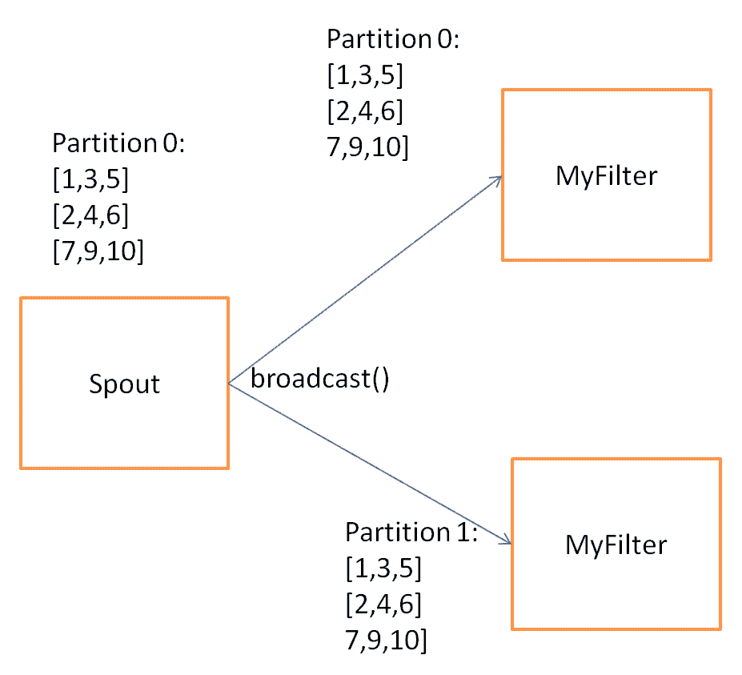

以下是一段代码，显示了如何使用`broadcast`操作：

```scala
mystream.broadcast().each(new Fields("a","b"), new myFilter()).parallelismHint(2) 
```

# 利用 batchGlobal 操作

这种重新分配操作将属于同一批次的所有元组发送到同一分区。同一流的其他批次可能会进入不同的分区。正如其名称所示，此重新分配在批次级别是全局的。以下是一个显示如何使用`batchGlobal`操作重新分配元组的图表：

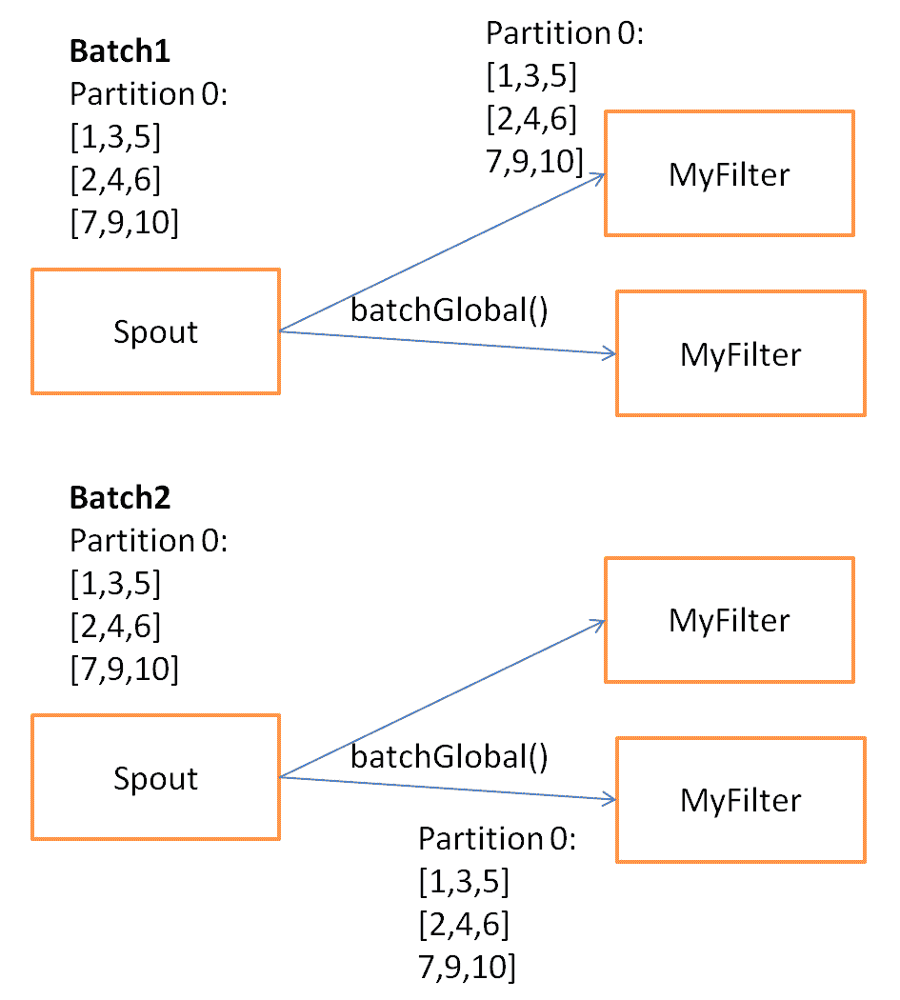

以下是一段代码，显示了如何使用`batchGlobal`操作：

```scala
mystream.batchGlobal().each(new Fields("a","b"), new myFilter()).parallelismHint(2) 
```

# 利用分区操作

如果前面的重新分配都不适合您的用例，您可以通过实现`org.apche.storm.grouping.CustomStreamGrouping`接口来定义自己的自定义重新分配函数。

以下是一个示例自定义重新分配，根据`country`字段的值对流进行分区：

```scala
public class CountryRepartition implements CustomStreamGrouping, Serializable { 

  private static final long serialVersionUID = 1L; 

  private static final Map<String, Integer> countries = ImmutableMap.of ( 
    "India", 0,  
    "Japan", 1,  
    "United State", 2,  
    "China", 3, 
    "Brazil", 4 
  ); 

  private int tasks = 0; 

  public void prepare(WorkerTopologyContext context, GlobalStreamId stream, List<Integer> targetTasks)  
    { 
      tasks = targetTasks.size(); 
    } 

  public List<Integer> chooseTasks(int taskId, List<Object> values) { 
    String country = (String) values.get(0);    
    return ImmutableList.of(countries.get(country) % tasks); 
  } 
} 
```

`CountryRepartition`类实现了`org.apache.storm.grouping.CustomStreamGrouping`接口。`chooseTasks()`方法包含重新分配逻辑，用于确定拓扑中输入元组的下一个任务。`prepare()`方法在开始时被调用，并执行初始化活动。

# Trident 聚合器

Trident 聚合器用于对输入批次、分区或输入流执行聚合操作。例如，如果用户想要计算每个批次中元组的数量，则可以使用计数聚合器来计算每个批次中元组的数量。聚合器的输出完全替换输入元组的值。Trident 中有三种可用的聚合器：

+   `partitionAggregate`

+   `aggregate`

+   `persistenceAggregate`

让我们详细了解每种类型的聚合器。

# partitionAggregate

正如其名称所示，`partitionAggregate`在每个分区上工作，而不是整个批次。`partitionAggregate`的输出完全替换输入元组。此外，`partitionAggregate`的输出包含一个单字段元组。以下是一段代码，显示了如何使用`partitionAggregate`：

```scala
mystream.partitionAggregate(new Fields("x"), new Count() ,new new Fields("count")) 
```

例如，我们得到一个包含字段`x`和`y`的输入流，并对每个分区应用`partitionAggregate`函数；输出元组包含一个名为`count`的字段。`count`字段表示输入分区中元组的数量：

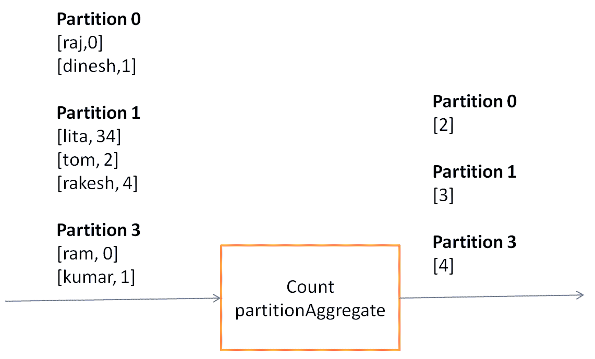

# aggregate

`aggregate`在每个批次上工作。在聚合过程中，首先使用全局操作对元组进行重新分配，将同一批次的所有分区合并为单个分区，然后对每个批次运行聚合函数。以下是一段代码，显示了如何使用`aggregate`：

```scala
mystream.aggregate(new Fields("x"), new Count() ,new new Fields("count")) 
```

Trident 中有三种可用的聚合器接口：

+   `ReducerAggregator`

+   `Aggregator`

+   `CombinerAggregator`

这三种聚合器接口也可以与`partitionAggregate`一起使用。

# ReducerAggregator

`ReducerAggregator`首先对输入流运行全局重新分配操作，将同一批次的所有分区合并为单个分区，然后对每个批次运行聚合函数。`ReducerAggregator<T>`接口包含以下方法：

+   `init()`: 此方法返回初始值

+   `Reduce(T curr, TridentTuple tuple)`: 此方法遍历输入元组，并发出一个具有单个值的单个元组

此示例显示了如何使用`ReducerAggregator`实现`Sum`：

```scala
public static class Sum implements ReducerAggregator<Long> { 

  private static final long serialVersionUID = 1L; 
  /** return the initial value zero     
  */ 
  public Long init() { 
    return 0L; 
  } 
  /** Iterates on the input tuples, calculate the sum and   
  * produce the single tuple with single field as output. 
  */ 
  public Long reduce(Long curr, TridentTuple tuple) {                       
    return curr+tuple.getLong(0);              
  } 

} 
```

# 聚合器

`Aggregator`首先在输入流上运行全局重分区操作，将同一批次的所有分区组合成单个分区，然后在每个批次上运行聚合函数。根据定义，`Aggregator`与`ReduceAggregator`非常相似。`BaseAggregator<State>`包含以下方法：

+   `init(Object batchId, TridentCollector collector)`: 在开始处理批次之前调用`init()`方法。此方法返回将用于保存批次状态的`State`对象。此对象由`aggregate()`和`complete()`方法使用。

+   `aggregate (State s, TridentTuple tuple, TridentCollector collector)`: 此方法迭代给定批次的每个元组。此方法在处理每个元组后更新`State`对象中的状态。

+   `complete(State state, TridentCollector tridentCollector)`: 如果给定批次的所有元组都已处理完毕，则调用此方法。此方法返回与每个批次对应的单个元组。

以下是一个示例，展示了如何使用`BaseAggregator`实现求和：

```scala
public static class SumAsAggregator extends BaseAggregator<SumAsAggregator.State> { 

  private static final long serialVersionUID = 1L; 
  // state class 
  static class State { 
    long count = 0; 
  } 
  // Initialize the state 
  public State init(Object batchId, TridentCollector collector) { 
    return new State(); 
  } 
  // Maintain the state of sum into count variable.   
  public void aggregate(State state, TridentTuple tridentTuple, TridentCollector tridentCollector) { 
    state.count = tridentTuple.getLong(0) + state.count; 
  } 
  // return a tuple with single value as output  
  // after processing all the tuples of given batch.       
  public void complete(State state, TridentCollector tridentCollector) { 
    tridentCollector.emit(new Values(state.count)); 
  } 

} 
```

# CombinerAggregator

`CombinerAggregator`首先在每个分区上运行`partitionAggregate`，然后运行全局重分区操作，将同一批次的所有分区组合成单个分区，然后在最终分区上重新运行`aggregator`以发出所需的输出。与其他两个聚合器相比，这里的网络传输较少。因此，`CombinerAggregator`的整体性能优于`Aggregator`和`ReduceAggregator`。

`CombinerAggregator<T>`接口包含以下方法：

+   `init()`: 此方法在每个输入元组上运行，以从元组中检索字段的值。

+   `combine(T val1, T val2)`: 此方法组合元组的值。此方法发出具有单个字段的单个元组作为输出。

+   `zero()`: 如果输入分区不包含元组，则此方法返回零。

此示例显示了如何使用`CombinerAggregator`实现`Sum`：

```scala
public class Sum implements CombinerAggregator<Number> { 

  private static final long serialVersionUID = 1L; 

  public Number init(TridentTuple tridentTuple) { 
    return (Number) tridentTuple.getValue(0); 
  } 

  public Number combine(Number number1, Number number2) { 
    return Numbers.add(number1, number2); 
  } 

  public Number zero() { 
    return 0; 
  } 

} 
```

# persistentAggregate

`persistentAggregate`适用于流中所有批次的所有元组，并将聚合结果持久化到状态源（内存、Memcached、Cassandra 或其他数据库）中。以下是一些代码，展示了如何使用`persistentAggregate`：

```scala
mystream.persistentAggregate(new MemoryMapState.Factory(),new Fields("select"),new Count(),new Fields("count")); 
```

我们将在第五章 *Trident Topology and Uses*，*Trident state*部分进行更详细的讨论。

# 聚合器链接

Trident 提供了一种功能，可以将多个聚合器应用于同一输入流，这个过程称为**聚合器链接**。以下是一段代码，展示了如何使用聚合器链接：

```scala
mystream.chainedAgg() 
        .partitionAggregate(new Fields("b"), new Average(), new Fields("average")) 
        .partitionAggregate(new Fields("b"), new Sum(), new Fields("sum")) 
        .chainEnd(); 
```

我们已将`Average()`和`Sum()`聚合器应用于每个分区。`chainedAgg()`的输出包含与每个输入分区对应的单个元组。输出元组包含两个字段，`sum`和`average`。

以下图表显示了聚合器链接的工作原理：

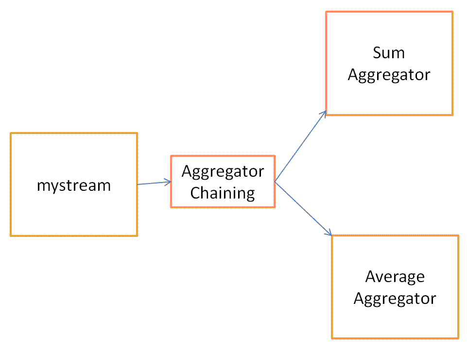

# 利用 groupBy 操作

`groupBy`操作不涉及任何重分区。`groupBy`操作将输入流转换为分组流。`groupBy`操作的主要功能是修改后续聚合函数的行为。以下图表显示了`groupBy`操作如何对单个分区的元组进行分组：

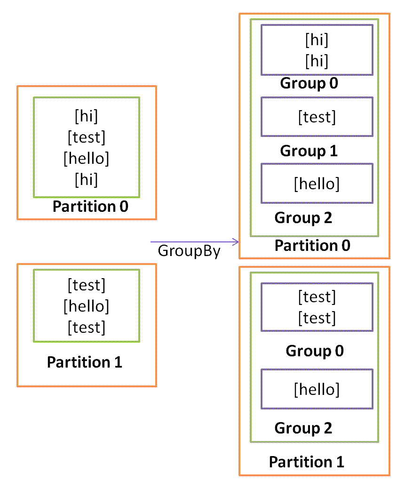

`groupBy`的行为取决于其使用的位置。可能有以下行为：

+   如果在`partitionAggregate`之前使用`groupBy`操作，则`partitionAggregate`将在分区内创建的每个组上运行`aggregate`。

+   如果在聚合之前使用`groupBy`操作，同一批次的元组首先被重新分区到一个单一分区，然后`groupBy`被应用于每个单一分区，最后对每个组执行`aggregate`操作。

# 何时使用 Trident

使用 Trident 拓扑非常容易实现一次性处理，并且 Trident 就是为此目的而设计的。使用原始的 Storm 很难实现一次性处理，因此当我们需要一次性处理时，Trident 会很有用。

Trident 并不适用于所有用例，特别是对于高性能的用例，因为 Trident 会给 Storm 增加复杂性并管理状态。

# 总结

在本章中，我们主要集中讨论了 Trident 作为 Storm 的高级抽象，并学习了 Trident 的过滤器、函数、聚合器和重新分区操作。

在下一章中，我们将涵盖非事务拓扑、Trident 拓扑和使用分布式 RPC 的 Trident 拓扑。
