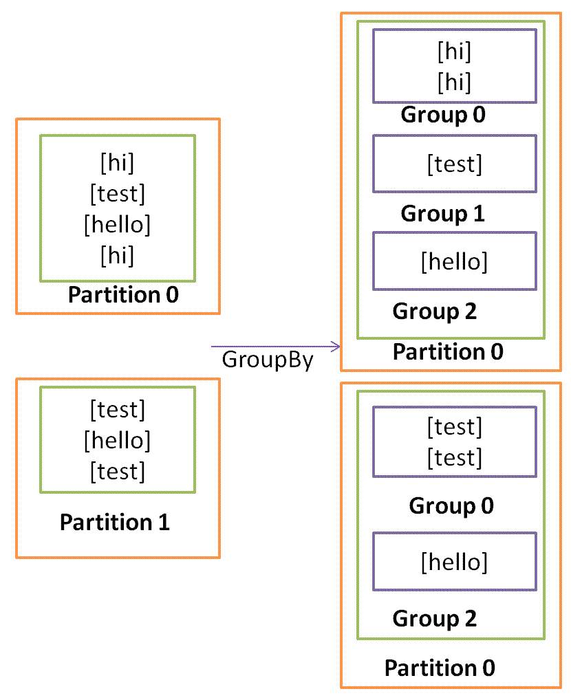
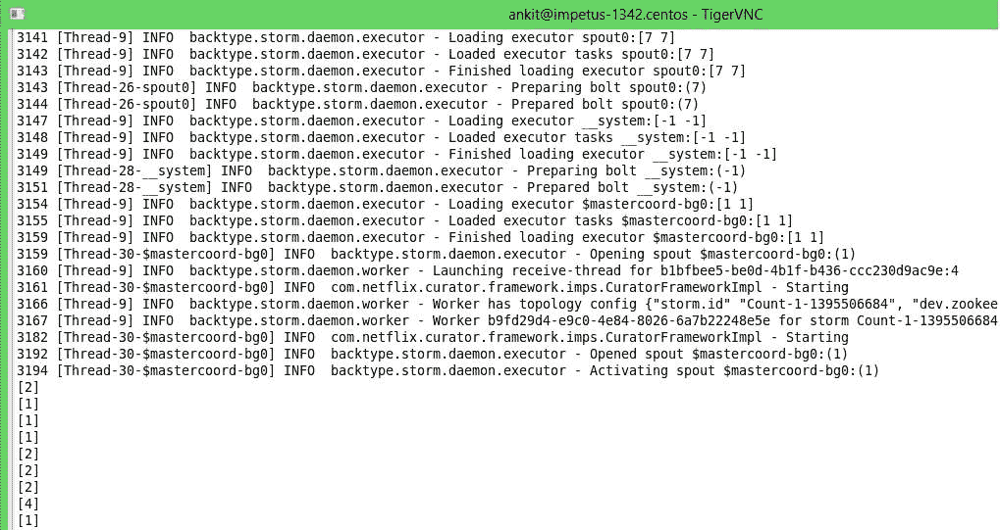
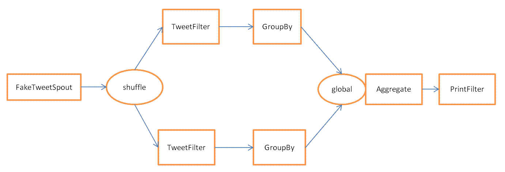
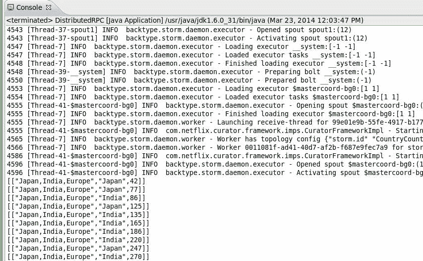

# 第五章：Trident 拓扑和用途

在上一章中，我们介绍了 Trident 的概述。在本章中，我们将介绍 Trident 拓扑的开发。以下是本章将要涵盖的重点：

+   Trident `groupBy`操作

+   非事务拓扑

+   Trident hello world 拓扑

+   Trident 状态

+   分布式 RPC

+   何时使用 Trident

# Trident groupBy 操作

`groupBy`操作不涉及任何重分区。`groupBy`操作将输入流转换为分组流。`groupBy`操作的主要功能是修改后续聚合函数的行为。



# 在分区聚合之前进行分组

如果在`partitionAggregate`之前使用`groupBy`操作，则`partitionAggregate`将在分区内创建的每个组上运行`aggregate`。

# 在聚合之前进行分组

如果在`aggregate`之前使用`groupBy`操作，则首先对输入元组进行重分区，然后对每个组执行`aggregate`操作。

# 非事务拓扑

在非事务拓扑中，spout 发出一批元组，并不保证每个批次中有什么。通过处理机制，我们可以将管道分为两类：

+   **至多一次处理**：在这种类型的拓扑中，失败的元组不会被重试。因此，spout 不会等待确认。

+   **至少一次处理**：处理管道中的失败元组将被重试。因此，这种类型的拓扑保证进入处理管道的每个元组至少被处理一次。

我们可以通过实现`org.apache.storm.trident.spout.IBatchSpout`接口来编写一个非事务 spout。

这个例子展示了如何编写一个 Trident spout：

```scala
public class FakeTweetSpout implements IBatchSpout{ 

   private static final long serialVersionUID = 10L; 
   private intbatchSize; 
   private HashMap<Long, List<List<Object>>>batchesMap = new HashMap<Long, List<List<Object>>>(); 
   public FakeTweetSpout(intbatchSize) { 
         this.batchSize = batchSize; 
   } 

   private static final Map<Integer, String> TWEET_MAP = new HashMap<Integer, String>(); 
   static { 
         TWEET_MAP.put(0, "#FIFA worldcup"); 
         TWEET_MAP.put(1, "#FIFA worldcup"); 
         TWEET_MAP.put(2, "#FIFA worldcup"); 
         TWEET_MAP.put(3, "#FIFA worldcup"); 
         TWEET_MAP.put(4, "#Movie top 10"); 
   } 

   private static final Map<Integer, String> COUNTRY_MAP = new HashMap<Integer, String>(); 
   static { 
         COUNTRY_MAP.put(0, "United State"); 
         COUNTRY_MAP.put(1, "Japan"); 
         COUNTRY_MAP.put(2, "India"); 
         COUNTRY_MAP.put(3, "China"); 
         COUNTRY_MAP.put(4, "Brazil"); 
   } 

   private List<Object>recordGenerator() { 
         final Random rand = new Random(); 
         intrandomNumber = rand.nextInt(5); 
         int randomNumber2 = rand.nextInt(5); 
         return new Values(TWEET_MAP.get(randomNumber),COUNTRY_MAP.get(randomNumber2)); 
   } 

   public void ack(long batchId) { 
         this.batchesMap.remove(batchId); 

   } 

   public void close() { 
         // Here we should close all the external connections 

   } 

   public void emitBatch(long batchId, TridentCollector collector) { 
         List<List<Object>> batches = this.batchesMap.get(batchId); 
         if(batches == null) { 
               batches = new ArrayList<List<Object>>();; 
               for (inti=0;i<this.batchSize;i++) { 
                     batches.add(this.recordGenerator()); 
               } 
               this.batchesMap.put(batchId, batches); 
         } 
         for(List<Object>list : batches){ 
collector.emit(list); 
        } 

   } 

   public Map getComponentConfiguration() { 
         // TODO Auto-generated method stub 
         return null; 
   } 

   public Fields getOutputFields() { 
         return new Fields("text","Country"); 
   } 

   public void open(Map arg0, TopologyContext arg1) { 
         // TODO Auto-generated method stub 

   } 

} 
```

`FakeTweetSpout`类实现了`org.apache.storm.trident.spout.IBatchSpout`接口。`FakeTweetSpout(intbatchSize)`的构造以`batchSize`作为参数。如果`batchSize`为`3`，则`FakeTweetSpout`类发出的每个批次包含三个元组。`recordGenerator`方法包含生成虚假推文的逻辑。以下是示例虚假推文：

```scala
["Adidas #FIFA World Cup Chant Challenge", "Brazil"] 
["The Great Gatsby is such a good movie","India"] 
```

`getOutputFields`方法返回两个字段，`text`和`Country`。`emitBatch(long batchId, TridentCollector collector)`方法使用`batchSize`变量来决定每个批次中的元组数量，并将一批发出到处理管道中。

`batchesMap`集合包含`batchId`作为键和元组批次作为值。`emitBatch(long batchId, TridentCollector collector)`发出的所有批次将被添加到`batchesMap`中。

`ack(long batchId)`方法接收`batchId`作为确认，并将从`batchesMap`中删除相应的批次。

# Trident hello world 拓扑

本节解释了如何编写 Trident hello world 拓扑。执行以下步骤创建 Trident hello world 拓扑：

1.  使用`com.stormadvance`作为`groupId`和`storm_trident`作为`artifactId`创建一个 Maven 项目。

1.  将以下依赖项和存储库添加到`pom.xml`文件中：

```scala
         <dependencies> 
         <dependency> 
               <groupId>junit</groupId> 
               <artifactId>junit</artifactId> 
               <version>3.8.1</version> 
               <scope>test</scope> 
         </dependency> 
         <dependency> 
               <groupId>org.apache.storm</groupId> 
               <artifactId>storm-core</artifactId> 
               <version>1.0.2</version> 
               <scope>provided</scope> 
         </dependency> 
   </dependencies> 
```

1.  在`com.stormadvance.storm_trident`包中创建一个`TridentUtility`类。这个类包含我们将在 Trident hello world 示例中使用的 Trident 过滤器和函数：

```scala
public class TridentUtility { 
   /** 
    * Get the comma separated value as input, split the field by comma, and 
    * then emits multiple tuple as output. 
    *  
    */ 
   public static class Split extends BaseFunction { 

         private static final long serialVersionUID = 2L; 

         public void execute(TridentTuple tuple, TridentCollector collector) { 
               String countries = tuple.getString(0); 
               for (String word :countries.split(",")) { 
                     // System.out.println("word -"+word); 
                     collector.emit(new Values(word)); 
               } 
         } 
   } 

   /** 
    * This class extends BaseFilter and contain isKeep method which emits only 
    * those tuple which has #FIFA in text field. 
    */ 
   public static class TweetFilter extends BaseFilter { 

         private static final long serialVersionUID = 1L; 

         public booleanisKeep(TridentTuple tuple) { 
               if (tuple.getString(0).contains("#FIFA")) { 
                     return true; 
               } else { 
                     return false; 
               } 
         } 

   } 

   /** 
    * This class extends BaseFilter and contain isKeep method which will print 
    * the input tuple. 
    *  
    */ 
   public static class Print extends BaseFilter { 

         private static final long serialVersionUID = 1L; 

         public booleanisKeep(TridentTuple tuple) { 
               System.out.println(tuple); 
               return true; 
         } 

   } 
} 
```

`TridentUtility`类包含三个内部类：`Split`、`TweetFilter`和`Print`。

`Split`类扩展了`org.apache.storm.trident.operation.BaseFunction`类，并包含`execute(TridentTuple tuple, TridentCollector collector)`方法。`execute()`方法以逗号分隔的值作为输入，拆分输入值，并将多个元组作为输出发出。

`TweetFilter`类扩展了`org.apache.storm.trident.operation.BaseFilter`类，并包含`isKeep(TridentTuple tuple)`方法。`isKeep()`方法以元组作为输入，并检查输入元组的`text`字段是否包含值`#FIFA`。如果元组的`text`字段包含`#FIFA`，则该方法返回 true。否则，返回 false。

`Print`类扩展了`org.apache.storm.trident.operation.BaseFilter`类，并包含`isKeep(TridentTuple tuple)`方法。`isKeep()`方法打印输入元组并返回 true。

1.  在`com.stormadvance.storm_trident`包中创建一个`TridentHelloWorldTopology`类。该类定义了 hello world Trident 拓扑：

```scala
public class TridentHelloWorldTopology {   
   public static void main(String[] args) throws Exception { 
         Config conf = new Config(); 
         conf.setMaxSpoutPending(20); 
         if (args.length == 0) { 
               LocalCluster cluster = new LocalCluster(); 
               cluster.submitTopology("Count", conf, buildTopology()); 
         } else { 
               conf.setNumWorkers(3); 
               StormSubmitter.submitTopology(args[0], conf, buildTopology()); 
         } 
   } 

   public static StormTopologybuildTopology() { 

         FakeTweetSpout spout = new FakeTweetSpout(10); 
         TridentTopology topology = new TridentTopology(); 

         topology.newStream("spout1", spout) 
                     .shuffle() 
                     .each(new Fields("text", "Country"), 
                                 new TridentUtility.TweetFilter()) 
                     .groupBy(new Fields("Country")) 
                     .aggregate(new Fields("Country"), new Count(), 
                                 new Fields("count")) 
                     .each(new Fields("count"), new TridentUtility.Print()) 
                     .parallelismHint(2); 

         return topology.build(); 
   } 
} 
```

让我们逐行理解代码。首先，我们创建了一个`TridentTopology`类的对象来定义 Trident 计算。

`TridentTopology`包含一个名为`newStream()`的方法，该方法将以输入源作为参数。在本例中，我们使用在非事务性拓扑部分创建的`FakeTweetSpout`作为输入源。与 Storm 一样，Trident 也在 ZooKeeper 中维护每个输入源的状态。在这里，`FakeTweetSpout`字符串指定了 Trident 在 ZooKeeper 中维护元数据的节点。

喷口发出一个具有两个字段`text`和`Country`的流。

我们正在使用`shuffle`操作重新分区输入源发出的元组批量。拓扑定义的下一行对每个元组应用`TweetFilter`。`TweetFilter`过滤掉所有不包含`#FIFA`关键字的元组。

`TweetFilter`的输出按`Country`字段分组。然后，我们应用`Count`聚合器来计算每个国家的推文数量。最后，我们应用`Print`过滤器来打印`aggregate`方法的输出。

这是`TridentHelloWorldTopology`类的控制台输出：



这是显示 hello world Trident 拓扑执行的图表：



# Trident 状态

Trident 提供了一个从有状态源读取和写入结果的抽象。我们可以将状态维护在拓扑内部（内存）或者存储在外部源（Memcached 或 Cassandra）中。

让我们考虑一下，我们正在将之前的 hello world Trident 拓扑的输出保存在数据库中。每次处理元组时，元组中的国家计数都会在数据库中增加。我们无法通过仅在数据库中维护计数来实现精确一次的处理。原因是，如果在处理过程中任何元组失败，那么失败的元组将会重试。这给我们带来了一个问题，因为我们不确定这个元组的状态是否已经更新过。如果元组在更新状态之前失败，那么重试元组将会增加数据库中的计数并使状态一致。但如果元组在更新状态之后失败，那么重试相同的元组将再次增加数据库中的计数并使状态不一致。因此，仅通过在数据库中维护计数，我们无法确定这个元组是否已经被处理过。我们需要更多的细节来做出正确的决定。我们需要按照以下步骤来实现精确一次的处理语义：

1.  以小批量处理元组。

1.  为每个批次分配一个唯一 ID（事务 ID）。如果批次重试，它将获得相同的唯一 ID。

1.  批量之间的状态更新是有序的。例如，批量 2 的状态更新在批量 1 的状态更新完成之前是不可能的。

如果我们使用上述三种语义创建一个拓扑，那么我们可以轻松地判断元组是否已经被处理过。

# 分布式 RPC

分布式 RPC 用于即时查询和检索 Trident 拓扑的结果。Storm 有一个内置的分布式 RPC 服务器。分布式 RPC 服务器接收来自客户端的 RPC 请求，并将其传递给 Storm 拓扑。拓扑处理请求并将结果发送到分布式 RPC 服务器，然后由分布式 RPC 服务器重定向到客户端。

我们可以通过在`storm.yaml`文件中使用以下属性来配置分布式 RPC 服务器：

```scala
drpc.servers: 
     - "nimbus-node" 
```

在这里，`nimbus-node`是分布式 RPC 服务器的 IP。

现在，在`nimbus-node`机器上运行以下命令以启动分布式 RPC 服务器：

```scala
> bin/storm drpc 
```

假设我们正在将 hello world Trident 拓扑的计数聚合存储在数据库中，并且想要即时检索给定国家的计数。我们需要使用分布式 RPC 功能来实现这一点。这个例子展示了如何在前一节创建的 hello world Trident 拓扑中整合分布式 RPC：

我们正在创建一个包含`buildTopology()`方法的`DistributedRPC`类：

```scala
public class DistributedRPC { 

  public static void main(String[] args) throws Exception { 
    Config conf = new Config(); 
    conf.setMaxSpoutPending(20); 
    LocalDRPCdrpc = new LocalDRPC(); 
    if (args.length == 0) { 

      LocalCluster cluster = new LocalCluster(); 
      cluster.submitTopology("CountryCount", conf, buildTopology(drpc)); 
      Thread.sleep(2000); 
      for(inti=0; i<100 ; i++) { 
        System.out.println("Result - "+drpc.execute("Count", "Japan India Europe")); 
        Thread.sleep(1000); 
      } 
    } else { 
      conf.setNumWorkers(3); 
      StormSubmitter.submitTopology(args[0], conf, buildTopology(null)); 
      Thread.sleep(2000); 
      DRPCClient client = new DRPCClient(conf, "RRPC-Server", 1234); 
      System.out.println(client.execute("Count", "Japan India Europe")); 
    } 
  } 

  public static StormTopologybuildTopology(LocalDRPCdrpc) { 

    FakeTweetSpout spout = new FakeTweetSpout(10); 
    TridentTopology topology = new TridentTopology(); 
    TridentStatecountryCount = topology.newStream("spout1", spout) 
                     .shuffle() 
                     .each(new Fields("text","Country"), new TridentUtility.TweetFilter()).groupBy(new Fields("Country")) 
                     .persistentAggregate(new MemoryMapState.Factory(),new Fields("Country"), new Count(), new Fields("count")) 
                     .parallelismHint(2); 

    try { 
      Thread.sleep(2000); 
    } catch (InterruptedException e) { 
    } 

    topology.newDRPCStream("Count", drpc) 
         .each(new Fields("args"), new TridentUtility.Split(), new Fields("Country"))                        
         .stateQuery(countryCount, new Fields("Country"), new MapGet(), 
                     new Fields("count")).each(new Fields("count"), 
                             new FilterNull()); 

    return topology.build(); 
  } 
} 
```

让我们逐行理解这段代码。

我们使用`FakeTweetSpout`作为输入源，并使用`TridentTopology`类来定义 Trident 计算。

在下一行中，我们使用`persistentAggregate`函数来表示所有批次的计数聚合。`MemoryMapState.Factory()`用于维护计数状态。`persistentAggregate`函数知道如何在源状态中存储和更新聚合：

```scala
persistentAggregate(new MemoryMapState.Factory(),new Fields("Country"), new Count(), new Fields("count")) 
```

内存数据库将国家名称存储为键，聚合计数存储为值，如下所示：

```scala
India 124 
United State 145 
Japan 130 
Brazil 155 
China 100 
```

`persistentAggregate`将流转换为 Trident `State`对象。在这种情况下，Trident `State`对象表示迄今为止每个国家的计数。

拓扑的下一部分定义了一个分布式查询，以即时获取每个国家的计数。分布式 RPC 查询以逗号分隔的国家列表作为输入，并返回每个国家的计数。以下是定义分布式查询部分的代码片段：

```scala
topology.newDRPCStream("Count", drpc) 
         .each(new Fields("args"), new TridentUtility.Split(), new Fields("Country"))                        
         .stateQuery(countryCount, new Fields("Country"), new MapGet(), 
                     new Fields("count")).each(new Fields("count"), 
                             new FilterNull()); 
```

`Split`函数用于拆分逗号分隔的国家列表。我们使用了`stateQuery()`方法来查询拓扑的第一部分中定义的 Trident `State`对象。`stateQuery()`接受状态源（在本例中是拓扑的第一部分计算出的国家计数）和用于查询此函数的函数。我们使用了`MapGet()`函数，用于获取每个国家的计数。最后，每个国家的计数作为查询输出返回。

以下是一段代码，展示了我们如何将输入传递给本地分布式 RPC：

```scala
System.out.println(drpc.execute("Count", "Japan,India,Europe")); 
```

我们已经创建了一个`backtype.storm.LocalDRPC`的实例来模拟分布式 RPC。

如果正在运行分布式 RPC 服务器，则需要创建分布式 RPC 客户端的实例来执行查询。以下是展示如何将输入传递给分布式 RPC 服务器的代码片段：

```scala
DRPCClient client = new DRPCClient(conf,"RRPC-Server", 1234); 
System.out.println(client.execute("Count", "Japan,India,Europe")); 
```

Trident 分布式 RPC 查询的执行方式类似于普通的 RPC 查询，只是这些查询是并行运行的。

以下是`DistributedRPC`类的控制台输出：



# 何时使用 Trident

使用 Trident 拓扑非常容易实现精确一次处理，Trident 也是为此而设计的。另一方面，在普通的 Storm 中实现精确一次处理会比较困难。因此，Trident 将对需要精确一次处理的用例非常有用。

Trident 并不适用于所有用例，特别是高性能用例，因为 Trident 会增加 Storm 的复杂性并管理状态。

# 摘要

在本章中，我们主要集中在 Trident 示例拓扑、Trident `groupBy`操作和非事务性拓扑上。我们还介绍了如何使用分布式 RPC 即时查询 Trident 拓扑。

在下一章中，我们将介绍不同类型的 Storm 调度程序。
