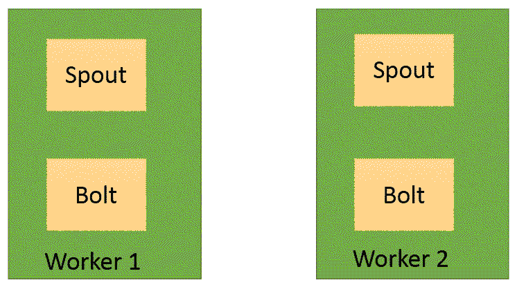
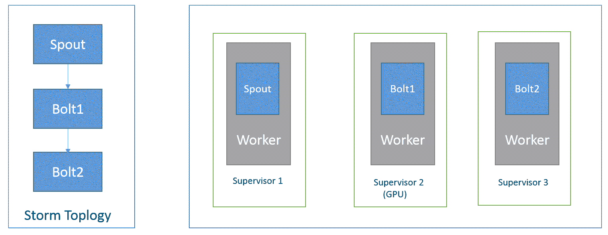
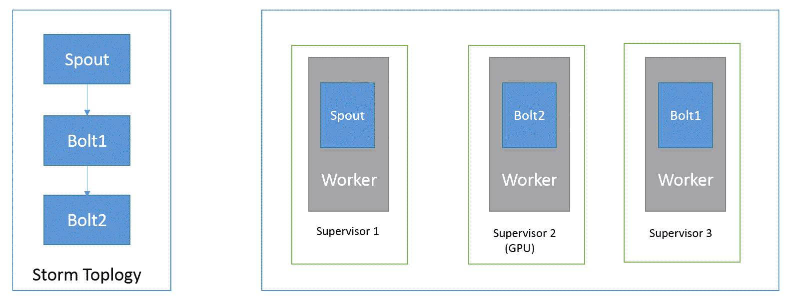

# 第六章：Storm 调度程序

在前几章中，我们介绍了 Storm 的基础知识，Storm 的安装，Storm 的开发和部署，以及 Storm 集群中的 Trident 拓扑。在本章中，我们将专注于 Storm 调度程序。

在本章中，我们将涵盖以下要点：

+   Storm 调度程序介绍

+   默认调度程序

+   隔离调度程序

+   资源感知调度程序

+   客户感知调度程序

# Storm 调度程序介绍

如前两章所述，Nimbus 负责部署拓扑，监督者负责执行 Storm 拓扑的 spouts 和 bolts 组件中定义的计算任务。正如我们所展示的，我们可以根据调度程序策略为每个监督者节点配置分配给拓扑的工作插槽数量，以及为拓扑分配的工作节点数量。简而言之，Storm 调度程序帮助 Nimbus 决定任何给定拓扑的工作分配。

# 默认调度程序

Storm 默认调度程序在给定拓扑分配的所有工作节点（监督者插槽）之间尽可能均匀地分配组件执行器。

让我们考虑一个包含一个 spout 和一个 bolt 的示例拓扑，两个组件都有两个执行器。如果我们通过分配两个工作节点（监督者插槽）提交了拓扑，下图显示了执行器的分配：



如前图所示，每个工作节点包含一个 spout 的执行器和一个 bolt 的执行器。只有当每个组件中的执行器数量可以被分配给拓扑的工作节点数量整除时，才能在工作节点之间均匀分配执行器。

# 隔离调度程序

隔离调度程序提供了一种在许多拓扑之间轻松安全地共享 Storm 集群资源的机制。隔离调度程序有助于在 Storm 集群中为拓扑分配/保留专用的 Storm 节点集。

我们需要在 Nimbus 配置文件中定义以下属性以切换到隔离调度程序：

```scala
storm.scheduler: org.apache.storm.scheduler.IsolationScheduler 
```

我们可以通过在`isolation.scheduler.machines`属性中指定拓扑名称和节点数量来为任何拓扑分配/保留资源，如下一节所述。我们需要在 Nimbus 配置中定义`isolation.scheduler.machines`属性，因为 Nimbus 负责在 Storm 节点之间分配拓扑工作节点：

```scala
isolation.scheduler.machines:  
  "Topology-Test1": 2 
  "Topology-Test2": 1 
  "Topology-Test3": 4 
```

在上述配置中，`Topology-Test1`分配了两个节点，`Topology-Test2`分配了一个节点，`Topology-Test3`分配了四个节点。

以下是隔离调度程序的关键要点：

+   隔离列表中提到的拓扑优先于非隔离拓扑，这意味着如果与非隔离拓扑竞争，资源将首先分配给隔离拓扑

+   在运行时没有办法更改拓扑的隔离设置。

+   隔离调度程序通过为拓扑分配专用机器来解决多租户问题

# 资源感知调度程序

资源感知调度程序帮助用户指定单个组件实例（spout 或 bolt）所需的资源量。我们可以通过在`storm.yaml`文件中指定以下属性来启用资源感知调度程序：

```scala
storm.scheduler: "org.apache.storm.scheduler.resource.ResourceAwareScheduler" 
```

# 组件级配置

您可以为任何组件分配内存需求。以下是可用于为任何组件的单个实例分配内存的方法：

```scala
public T setMemoryLoad(Number onHeap, Number offHeap) 
```

或者，您可以使用以下方法：

```scala
public T setMemoryLoad(Number onHeap) 
```

以下是每个参数的定义：

+   `onHeap`：此组件实例将消耗的堆内存空间量（以兆字节为单位）

+   `offHeap`：此组件实例将消耗的堆外内存空间量（以兆字节为单位）

`onHeap`和`offHeap`的数据类型均为`Number`，默认值为`0.0`。

# 内存使用示例

让我们考虑一个具有两个组件（一个 spout 和一个 bolt）的拓扑：

```scala
SpoutDeclarer spout1 = builder.setSpout("spout1", new spoutComponent(), 4); 
spout1.setMemoryLoad(1024.0, 512.0); 
builder.setBolt("bolt1", new boltComponent(), 5).setMemoryLoad(512.0); 
```

`spout1`组件的单个实例的内存请求为 1.5 GB（堆上 1 GB，堆外 0.5 GB），这意味着`spout1`组件的总内存请求为 4 x 1.5 GB = 6 GB。

`bolt1`组件的单个实例的内存请求为 0.5 GB（堆上 0.5 GB，堆外 0.0 GB），这意味着`bolt1`组件的总内存请求为 5 x 0.5 GB = 2.5 GB。计算两个组件所需的总内存的方法可以总结如下：

*拓扑分配的总内存= spout1 + bolt1 = 6 + 2.5 = 8.5 GB*

您还可以将 CPU 需求分配给任何组件。

以下是为任何给定组件的单个实例分配 CPU 资源量所需的方法：

```scala
public T setCPULoad(Double amount) 
```

`amount`是任何给定组件实例将消耗的 CPU 资源量。 CPU 使用是一个难以定义的概念。不同的 CPU 架构根据手头的任务而表现不同。按照惯例，CPU 核心通常有 100 个点。如果您觉得您的处理器更强大或更弱，可以相应地进行调整。CPU 密集型的重型任务将获得 100 分，因为它们可以占用整个核心。中等任务应该获得 50 分，轻型任务 25 分，微小任务 10 分。

# CPU 使用示例

让我们考虑一个具有两个组件（一个 spout 和一个 bolt）的拓扑：

```scala
SpoutDeclarer spout1 = builder.setSpout("spout1", new spoutComponent(), 4); 
spout1.setCPULoad(15.0); 
builder.setBolt("bolt1", new boltComponent(), 5).setCPULoad(450.0); 
```

# 工作节点级配置

您可以为每个工作节点/插槽分配堆大小。以下是定义每个工作节点的堆大小所需的方法：

```scala
public void setTopologyWorkerMaxHeapSize(Number size) 
```

在这里，`size`是以兆字节为单位的单个工作节点可用的堆空间量。

这是一个例子：

```scala
Config conf = new Config(); 
conf.setTopologyWorkerMaxHeapSize(1024.0); 
```

# 节点级配置

我们可以通过在`storm.yaml`文件中设置以下属性来配置 Storm 节点可以使用的内存和 CPU 量。我们需要在每个 Storm 节点上设置以下属性：

```scala
supervisor.memory.capacity.mb: [amount<Double>] 
supervisor.cpu.capacity: [amount<Double>] 
```

这是一个例子：

```scala
supervisor.memory.capacity.mb: 10480.0 
supervisor.cpu.capacity: 100.0 
```

在这里，`100`表示整个核心，如前面讨论的。

# 全局组件配置

如前一节所述，我们可以通过定义拓扑来为每个组件定义内存和 CPU 需求。用户还可以在`storm.yaml`文件中设置组件的默认资源使用情况。如果我们在代码中定义组件配置，那么代码值将覆盖默认值：

```scala
//default value if on heap memory requirement is not specified for a component  
topology.component.resources.onheap.memory.mb: 128.0 

//default value if off heap memory requirement is not specified for a component  
topology.component.resources.offheap.memory.mb: 0.0 

//default value if CPU requirement is not specified for a component  
topology.component.cpu.pcore.percent: 10.0 

//default value for the max heap size for a worker   
topology.worker.max.heap.size.mb: 768.0 
```

# 自定义调度程序

在 Storm 中，Nimbus 使用调度程序将任务分配给监督者。默认调度程序旨在将计算资源均匀分配给拓扑。在拓扑之间公平性方面表现良好，但用户无法预测 Storm 集群中拓扑组件的放置，即拓扑的哪个组件需要分配给哪个监督者节点。

让我们考虑一个例子。假设我们有一个具有一个 spout 和两个 bolts 的拓扑，每个组件都有一个执行器和一个任务。如果我们将拓扑提交到 Storm 集群，则以下图表显示了拓扑的分布。假设分配给拓扑的工作节点数量为三，Storm 集群中的监督者数量为三：



假设我们的拓扑中的最后一个 bolt **Bolt2** 需要使用 GPU 而不是 CPU 来处理一些数据，并且只有一个监督者具有 GPU。我们需要编写自己的自定义调度程序来实现将任何组件分配给特定监督者节点的任务。以下是我们需要执行的步骤：

1.  配置监督者节点中的更改。

1.  在组件级别配置设置。

1.  编写自定义调度程序类。

1.  注册自定义调度程序类。

# 配置监督者节点中的更改

Storm 在监督节点的配置中为用户提供了一个字段，用于指定自定义调度元数据。在这种情况下，我们在监督节点中输入`/tag`和它们运行的类型，这是通过在它们的`$STORM_HOME/conf/storm.yaml`文件中的一行配置完成的。例如，每个监督节点的配置应该包含以下内容：

```scala
supervisor.scheduler.meta: 
  type: GPU 
```

在对每个监督节点添加配置更改后，我们需要重新启动监督节点。对于所有非 GPU 机器，您需要使用 CPU 类型。

# 组件级别的配置设置

这一步是在拓扑结构中使用`TopologyBuilder`的主方法中完成的。`ComponentConfigurationDeclarer`有一个叫做`addConfiguration(String config, String value)`的方法，允许添加自定义配置，也就是元数据。在我们的情况下，我们使用这个方法添加类型信息：

```scala
TopologyBuilder builder = new TopologyBuilder(); 
builder.setSpout("spout", new SampleSpout(), 1); builder.setBolt("bolt1", new ExampleBolt1(), 1).shuffleGrouping("spout"); 
builder.setBolt("bolt3", new SampleBolt2(), 1).shuffleGrouping("bolt2").addConfiguration("type", "GPU"); 
```

前面的代码显示我们已经用`type`为`GPU`对`bolt2`组件进行了类型化。

# 编写自定义监督类

我们可以通过实现`org.apache.storm.scheduler.IScheduler`接口来编写我们的`CustomScheduler`类。这个接口包含两个重要的方法：

+   `prepare(Map conf)`：这个方法只是初始化调度程序。

+   `schedule(Topologies topologies, Cluster cluster)`：这个方法包含负责在集群监督节点插槽中进行拓扑工作的逻辑。

`CustomScheduler`包含以下私有方法，负责将工作程序分配给集群监督节点的插槽。

`getSupervisorsByType()`方法返回映射。映射的键表示节点类型（例如，CPU 或 GPU），值包含该类型监督节点的列表：

```scala
    private Map<String, ArrayList<SupervisorDetails>> getSupervisorsByType( 
            Collection<SupervisorDetails> supervisorDetails 
    ) { 
        // A map of type -> supervisors, to help with scheduling of components with specific types 
        Map<String, ArrayList<SupervisorDetails>> supervisorsByType = new HashMap<String, ArrayList<SupervisorDetails>>(); 

        for (SupervisorDetails supervisor : supervisorDetails) { 
            @SuppressWarnings("unchecked") 
            Map<String, String> metadata = (Map<String, String>) supervisor.getSchedulerMeta(); 

            String types; 

            if (metadata == null) { 
                types = unType; 
            } else { 
                types = metadata.get("types"); 

                if (types == null) { 
                    types = unType; 
                } 
            }
```

```scala
            // If the supervisor has types attached to it, handle it by populating the supervisorsByType map. 
            // Loop through each of the types to handle individually 
            for (String type : types.split(",")) { 
                type = type.trim(); 

                if (supervisorsByType.containsKey(type)) { 
                    // If we've already seen this type, then just add the supervisor to the existing ArrayList. 
                    supervisorsByType.get(type).add(supervisor); 
                } else { 
                    // If this type is new, then create a new ArrayList<SupervisorDetails>, 
                    // add the current supervisor, and populate the map's type entry with it. 
                    ArrayList<SupervisorDetails> newSupervisorList = new ArrayList<SupervisorDetails>(); 
                    newSupervisorList.add(supervisor); 
                    supervisorsByType.put(type, newSupervisorList); 
                } 
            } 
        } 

        return supervisorsByType; 
    } 
```

`populateComponentsByType()`方法也返回映射。映射的键表示类型（CPU 或 GPU），值包含需要分配给该类型监督节点的拓扑组件的列表。我们在这里使用一个无类型的类型来将没有类型的组件分组。这样做的目的是有效地处理这些无类型的组件，就像默认调度程序执行分配一样。这意味着没有类型组件的拓扑将以相同的方式成功调度，跨无类型的监督节点没有问题：

```scala
    private <T> void populateComponentsByType( 
            Map<String, ArrayList<String>> componentsByType, 
            Map<String, T> components 
    ) { 
        // Type T can be either Bolt or SpoutSpec, so that this logic can be reused for both component types 
        JSONParser parser = new JSONParser(); 

        for (Entry<String, T> componentEntry : components.entrySet()) { 
            JSONObject conf = null; 

            String componentID = componentEntry.getKey(); 
            T component = componentEntry.getValue(); 

            try { 
                // Get the component's conf irrespective of its type (via java reflection) 
                Method getCommonComponentMethod = component.getClass().getMethod("get_common"); 
                ComponentCommon commonComponent = (ComponentCommon) getCommonComponentMethod.invoke(component); 
                conf = (JSONObject) parser.parse(commonComponent.get_json_conf()); 
            } catch (Exception ex) { 
                ex.printStackTrace(); 
            } 

            String types; 

            // If there's no config, use a fake type to group all untypeged components 
            if (conf == null) { 
                types = unType; 
            } else { 
                types = (String) conf.get("types"); 

                // If there are no types, use a fake type to group all untypeged components 
                if (types == null) { 
                    types = unType; 
                } 
            } 

            // If the component has types attached to it, handle it by populating the componentsByType map. 
            // Loop through each of the types to handle individually 
            for (String type : types.split(",")) { 
                type = type.trim(); 

                if (componentsByType.containsKey(type)) { 
                    // If we've already seen this type, then just add the component to the existing ArrayList. 
                    componentsByType.get(type).add(componentID); 
                } else { 
                    // If this type is new, then create a new ArrayList, 
                    // add the current component, and populate the map's type entry with it. 
                    ArrayList<String> newComponentList = new ArrayList<String>(); 
                    newComponentList.add(componentID); 
                    componentsByType.put(type, newComponentList); 
                } 
            } 
        } 
    } 
```

`populateComponentsByTypeWithStormInternals()`方法返回 Storm 启动的内部组件的详细信息。

```scala
    private void populateComponentsByTypeWithStormInternals( 
            Map<String, ArrayList<String>> componentsByType, 
            Set<String> components 
    ) { 
        // Storm uses some internal components, like __acker. 
        // These components are topology-agnostic and are therefore not accessible through a StormTopology object. 
        // While a bit hacky, this is a way to make sure that we schedule those components along with our topology ones: 
        // we treat these internal components as regular untypeged components and add them to the componentsByType map. 

        for (String componentID : components) { 
            if (componentID.startsWith("__")) { 
                if (componentsByType.containsKey(unType)) { 
                    // If we've already seen untypeged components, then just add the component to the existing ArrayList. 
                    componentsByType.get(unType).add(componentID); 
                } else { 
                    // If this is the first untypeged component we see, then create a new ArrayList, 
                    // add the current component, and populate the map's untypeged entry with it. 
                    ArrayList<String> newComponentList = new ArrayList<String>(); 
                    newComponentList.add(componentID); 
                    componentsByType.put(unType, newComponentList); 
                } 
            } 
        } 
    } 
```

前三种方法管理监督和组件的映射。现在，我们将编写`typeAwareScheduler()`方法，它将使用这两个映射：

```scala
    private void typeAwareSchedule(Topologies topologies, Cluster cluster) { 
        Collection<SupervisorDetails> supervisorDetails = cluster.getSupervisors().values(); 

        // Get the lists of typed and unreserved supervisors. 
        Map<String, ArrayList<SupervisorDetails>> supervisorsByType = getSupervisorsByType(supervisorDetails); 

        for (TopologyDetails topologyDetails : cluster.needsSchedulingTopologies(topologies)) { 
            StormTopology stormTopology = topologyDetails.getTopology(); 
            String topologyID = topologyDetails.getId(); 

            // Get components from topology 
            Map<String, Bolt> bolts = stormTopology.get_bolts(); 
            Map<String, SpoutSpec> spouts = stormTopology.get_spouts(); 

            // Get a map of component to executors 
            Map<String, List<ExecutorDetails>> executorsByComponent = cluster.getNeedsSchedulingComponentToExecutors( 
                    topologyDetails 
            ); 

            // Get a map of type to components 
            Map<String, ArrayList<String>> componentsByType = new HashMap<String, ArrayList<String>>(); 
            populateComponentsByType(componentsByType, bolts); 
            populateComponentsByType(componentsByType, spouts); 
            populateComponentsByTypeWithStormInternals(componentsByType, executorsByComponent.keySet()); 

            // Get a map of type to executors 
            Map<String, ArrayList<ExecutorDetails>> executorsToBeScheduledByType = getExecutorsToBeScheduledByType( 
                    cluster, topologyDetails, componentsByType 
            ); 

            // Initialise a map of slot -> executors 
            Map<WorkerSlot, ArrayList<ExecutorDetails>> componentExecutorsToSlotsMap = ( 
                    new HashMap<WorkerSlot, ArrayList<ExecutorDetails>>() 
            ); 

            // Time to match everything up! 
            for (Entry<String, ArrayList<ExecutorDetails>> entry : executorsToBeScheduledByType.entrySet()) { 
                String type = entry.getKey(); 

                ArrayList<ExecutorDetails> executorsForType = entry.getValue(); 
                ArrayList<SupervisorDetails> supervisorsForType = supervisorsByType.get(type); 
                ArrayList<String> componentsForType = componentsByType.get(type); 

                try { 
                    populateComponentExecutorsToSlotsMap( 
                            componentExecutorsToSlotsMap, 
                            cluster, topologyDetails, supervisorsForType, executorsForType, componentsForType, type 
                    ); 
                } catch (Exception e) { 
                    e.printStackTrace(); 

                    // Cut this scheduling short to avoid partial scheduling. 
                    return; 
                } 
            } 

            // Do the actual assigning 
            // We do this as a separate step to only perform any assigning if there have been no issues so far. 
            // That's aimed at avoiding partial scheduling from occurring, with some components already scheduled 
            // and alive, while others cannot be scheduled. 
            for (Entry<WorkerSlot, ArrayList<ExecutorDetails>> entry : componentExecutorsToSlotsMap.entrySet()) { 
                WorkerSlot slotToAssign = entry.getKey(); 
                ArrayList<ExecutorDetails> executorsToAssign = entry.getValue(); 

                cluster.assign(slotToAssign, topologyID, executorsToAssign); 
            } 

            // If we've reached this far, then scheduling must have been successful 
            cluster.setStatus(topologyID, "SCHEDULING SUCCESSFUL"); 
        } 
    } 
```

除了前面提到的四种方法，我们还使用了更多的方法来执行以下操作。

# 将组件 ID 转换为执行程序

现在让我们从组件 ID 跳转到实际的执行程序，因为这是 Storm 集群处理分配的级别。

这个过程非常简单：

+   从集群获取按组件的执行程序的映射

+   根据集群检查哪些组件的执行程序需要调度

+   创建类型到执行程序的映射，只填充等待调度的执行程序：

```scala
private Set<ExecutorDetails> getAllAliveExecutors(Cluster cluster, TopologyDetails topologyDetails) { 
        // Get the existing assignment of the current topology as it's live in the cluster 
        SchedulerAssignment existingAssignment = cluster.getAssignmentById(topologyDetails.getId()); 

        // Return alive executors, if any, otherwise an empty set 
        if (existingAssignment != null) { 
            return existingAssignment.getExecutors(); 
        } else { 
            return new HashSet<ExecutorDetails>(); 
        } 
    } 

    private Map<String, ArrayList<ExecutorDetails>> getExecutorsToBeScheduledByType( 
            Cluster cluster, 
            TopologyDetails topologyDetails, 
            Map<String, ArrayList<String>> componentsPerType 
    ) { 
        // Initialise the return value 
        Map<String, ArrayList<ExecutorDetails>> executorsByType = new HashMap<String, ArrayList<ExecutorDetails>>(); 

        // Find which topology executors are already assigned 
        Set<ExecutorDetails> aliveExecutors = getAllAliveExecutors(cluster, topologyDetails); 

        // Get a map of component to executors for the topology that need scheduling 
        Map<String, List<ExecutorDetails>> executorsByComponent = cluster.getNeedsSchedulingComponentToExecutors( 
                topologyDetails 
        ); 

        // Loop through componentsPerType to populate the map 
        for (Entry<String, ArrayList<String>> entry : componentsPerType.entrySet()) { 
            String type = entry.getKey(); 
            ArrayList<String> componentIDs = entry.getValue(); 

            // Initialise the map entry for the current type 
            ArrayList<ExecutorDetails> executorsForType = new ArrayList<ExecutorDetails>(); 

            // Loop through this type's component IDs 
            for (String componentID : componentIDs) { 
                // Fetch the executors for the current component ID 
                List<ExecutorDetails> executorsForComponent = executorsByComponent.get(componentID); 

                if (executorsForComponent == null) { 
                    continue; 
                } 

                // Convert the list of executors to a set 
                Set<ExecutorDetails> executorsToAssignForComponent = new HashSet<ExecutorDetails>( 
                        executorsForComponent 
                ); 

                // Remove already assigned executors from the set of executors to assign, if any 
                executorsToAssignForComponent.removeAll(aliveExecutors); 

                // Add the component's waiting to be assigned executors to the current type executors 
                executorsForType.addAll(executorsToAssignForComponent); 
            } 

            // Populate the map of executors by type after looping through all of the type's components, 
            // if there are any executors to be scheduled 
            if (!executorsForType.isEmpty()) { 
                executorsByType.put(type, executorsForType); 
            } 
        } 

        return executorsByType; 
} 
```

# 将监督转换为插槽

现在是我们必须执行的最终转换：从监督到插槽的跳转。与组件及其执行程序一样，我们需要这个，因为集群在插槽级别分配执行程序，而不是监督级别。

在这一点上有一些事情要做；我们已经将这个过程分解成更小的方法来保持可读性。我们需要执行的主要步骤如下：

找出我们可以分配的插槽，给定一个类型的监督节点列表。这只是使用一个 for 循环收集所有监督节点的插槽，然后返回拓扑所请求的插槽数量。

将等待调度的类型的执行程序分成均匀的组。

用条目填充插槽到执行程序的映射。

这里的想法是每种类型调用`populateComponentExecutorsToSlotsMap`方法一次，这将导致一个包含我们需要执行的所有分配的单个映射。

如代码注释中所解释的，我们先前发现有时我们会急切地将类型的执行者分配给一个插槽，只是为了让后续的类型无法分配其执行者，导致部分调度。我们已经确保调度流程确保不会执行部分调度（要么全部被调度，要么全部不被调度），尽管这会增加一个额外的循环，但我们认为这是拓扑结构的更清洁状态：

```scala
    private void handleFailedScheduling( 
            Cluster cluster, 
            TopologyDetails topologyDetails, 
            String message 
    ) throws Exception { 
        // This is the prefix of the message displayed on Storm's UI for any unsuccessful scheduling 
        String unsuccessfulSchedulingMessage = "SCHEDULING FAILED: "; 

        cluster.setStatus(topologyDetails.getId(), unsuccessfulSchedulingMessage + message); 
        throw new Exception(message); 
    } 

    private Set<WorkerSlot> getAllAliveSlots(Cluster cluster, TopologyDetails topologyDetails) { 
        // Get the existing assignment of the current topology as it's live in the cluster 
        SchedulerAssignment existingAssignment = cluster.getAssignmentById(topologyDetails.getId()); 

        // Return alive slots, if any, otherwise an empty set 
        if (existingAssignment != null) { 
            return existingAssignment.getSlots(); 
        } else { 
            return new HashSet<WorkerSlot>(); 
        } 
    } 

    private List<WorkerSlot> getAllSlotsToAssign( 
            Cluster cluster, 
            TopologyDetails topologyDetails, 
            List<SupervisorDetails> supervisors, 
            List<String> componentsForType, 
            String type 
    ) throws Exception { 
        String topologyID = topologyDetails.getId(); 

        // Collect the available slots of each of the supervisors we were given in a list 
        List<WorkerSlot> availableSlots = new ArrayList<WorkerSlot>(); 
        for (SupervisorDetails supervisor : supervisors) { 
            availableSlots.addAll(cluster.getAvailableSlots(supervisor)); 
        } 

        if (availableSlots.isEmpty()) { 
            // This is bad, we have supervisors and executors to assign, but no available slots! 
            String message = String.format( 
                    "No slots are available for assigning executors for type %s (components: %s)", 
                    type, componentsForType 
            ); 
            handleFailedScheduling(cluster, topologyDetails, message); 
        } 

        Set<WorkerSlot> aliveSlots = getAllAliveSlots(cluster, topologyDetails); 

        int numAvailableSlots = availableSlots.size(); 
        int numSlotsNeeded = topologyDetails.getNumWorkers() - aliveSlots.size(); 

        // We want to check that we have enough available slots 
        // based on the topology's number of workers and already assigned slots. 
        if (numAvailableSlots < numSlotsNeeded) { 
            // This is bad, we don't have enough slots to assign to! 
            String message = String.format( 
                    "Not enough slots available for assigning executors for type %s (components: %s). " 
                            + "Need %s slots to schedule but found only %s", 
                    type, componentsForType, numSlotsNeeded, numAvailableSlots 
            ); 
            handleFailedScheduling(cluster, topologyDetails, message); 
        } 

        // Now we can use only as many slots as are required. 
        return availableSlots.subList(0, numSlotsNeeded); 
    } 

    private Map<WorkerSlot, ArrayList<ExecutorDetails>> getAllExecutorsBySlot( 
            List<WorkerSlot> slots, 
            List<ExecutorDetails> executors 
    ) { 
        Map<WorkerSlot, ArrayList<ExecutorDetails>> assignments = new HashMap<WorkerSlot, ArrayList<ExecutorDetails>>(); 

        int numberOfSlots = slots.size(); 

        // We want to split the executors as evenly as possible, across each slot available, 
        // so we assign each executor to a slot via round robin 
        for (int i = 0; i < executors.size(); i++) { 
            WorkerSlot slotToAssign = slots.get(i % numberOfSlots); 
            ExecutorDetails executorToAssign = executors.get(i); 

            if (assignments.containsKey(slotToAssign)) { 
                // If we've already seen this slot, then just add the executor to the existing ArrayList. 
                assignments.get(slotToAssign).add(executorToAssign); 
            } else { 
                // If this slot is new, then create a new ArrayList, 
                // add the current executor, and populate the map's slot entry with it. 
                ArrayList<ExecutorDetails> newExecutorList = new ArrayList<ExecutorDetails>(); 
                newExecutorList.add(executorToAssign); 
                assignments.put(slotToAssign, newExecutorList); 
            } 
        } 

        return assignments; 
    } 

    private void populateComponentExecutorsToSlotsMap( 
            Map<WorkerSlot, ArrayList<ExecutorDetails>> componentExecutorsToSlotsMap, 
            Cluster cluster, 
            TopologyDetails topologyDetails, 
            List<SupervisorDetails> supervisors, 
            List<ExecutorDetails> executors, 
            List<String> componentsForType, 
            String type 
    ) throws Exception { 
        String topologyID = topologyDetails.getId(); 

        if (supervisors == null) { 
            // This is bad, we don't have any supervisors but have executors to assign! 
            String message = String.format( 
                    "No supervisors given for executors %s of topology %s and type %s (components: %s)", 
                    executors, topologyID, type, componentsForType 
            ); 
            handleFailedScheduling(cluster, topologyDetails, message); 
        } 

        List<WorkerSlot> slotsToAssign = getAllSlotsToAssign( 
                cluster, topologyDetails, supervisors, componentsForType, type 
        ); 

        // Divide the executors evenly across the slots and get a map of slot to executors 
        Map<WorkerSlot, ArrayList<ExecutorDetails>> executorsBySlot = getAllExecutorsBySlot( 
                slotsToAssign, executors 
        ); 

        for (Entry<WorkerSlot, ArrayList<ExecutorDetails>> entry : executorsBySlot.entrySet()) { 
            WorkerSlot slotToAssign = entry.getKey(); 
            ArrayList<ExecutorDetails> executorsToAssign = entry.getValue(); 

            // Assign the topology's executors to slots in the cluster's supervisors 
            componentExecutorsToSlotsMap.put(slotToAssign, executorsToAssign); 
        } 
    } 
```

# 注册一个 CustomScheduler 类

我们需要为`CustomScheduler`类创建一个 JAR，并将其放在`$STORM_HOME/lib/`中，并通过将以下行附加到`$STORM_HOME/conf/storm.yaml`配置文件中告诉 Nimbus 使用新的调度程序：

```scala
storm.scheduler: "com.stormadvance.storm_kafka_topology.CustomScheduler" 
```

重新启动 Nimbus 守护程序以反映对配置的更改。

现在，如果我们部署与上一个图中显示的相同的拓扑结构，那么执行者的分布将如下所示（**Bolt2**分配给了一个 GPU 类型的监督者）：



# 摘要

在本章中，我们了解了内置的 Storm 调度程序，还介绍了如何编写和配置自定义调度程序。

在下一章中，我们将介绍使用 Graphite 和 Ganglia 监视 Storm 集群。
