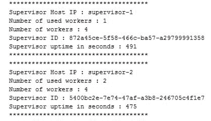
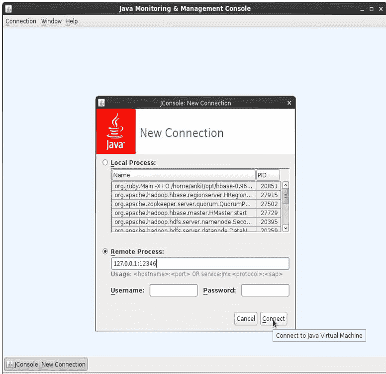
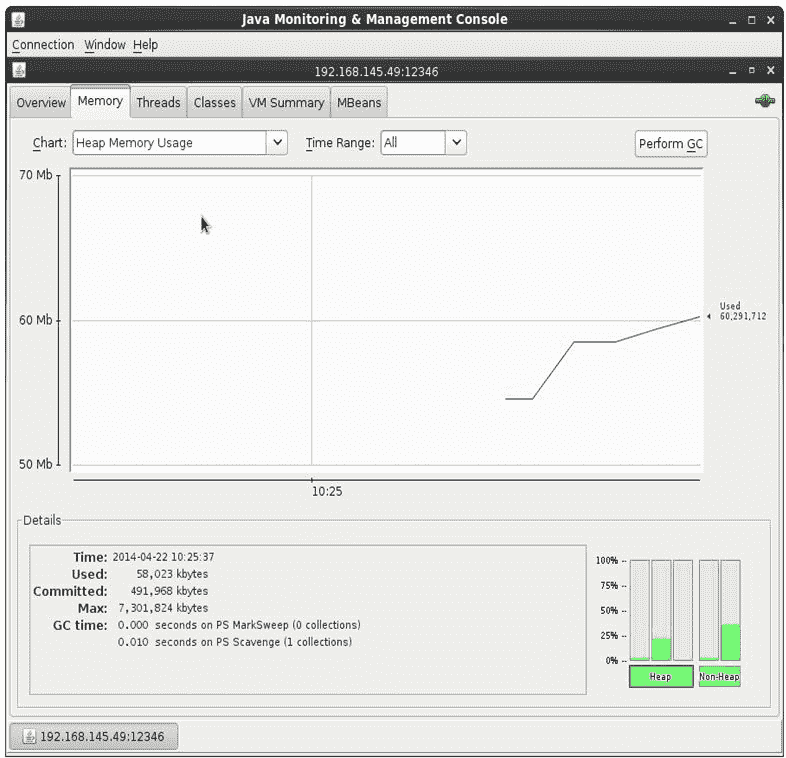
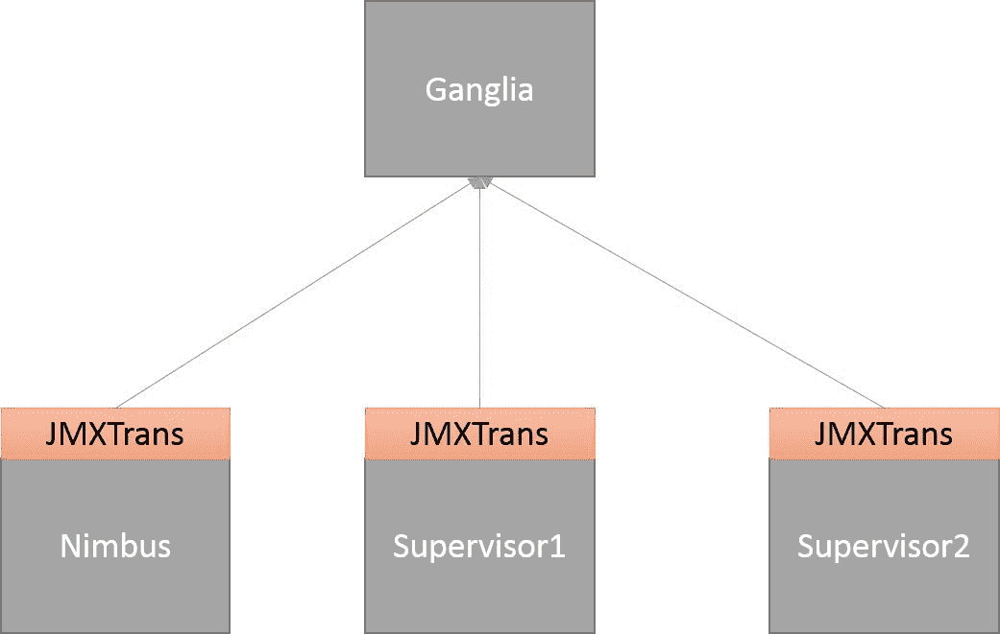
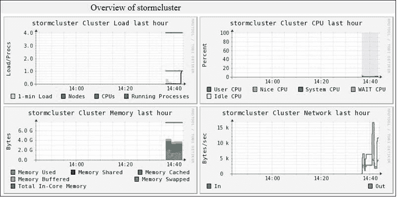
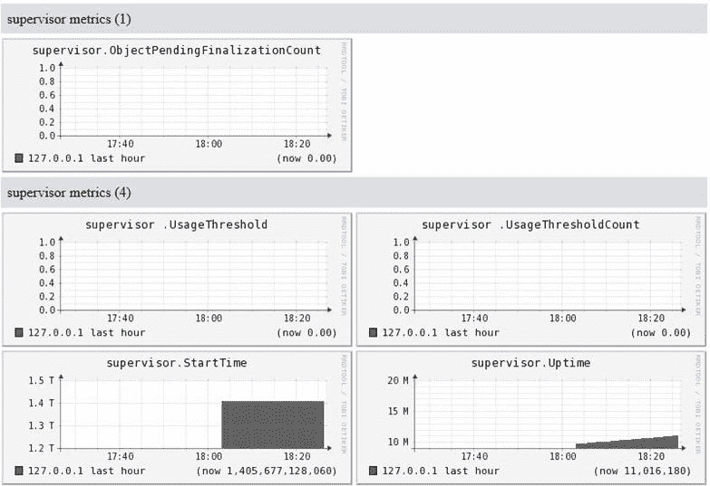
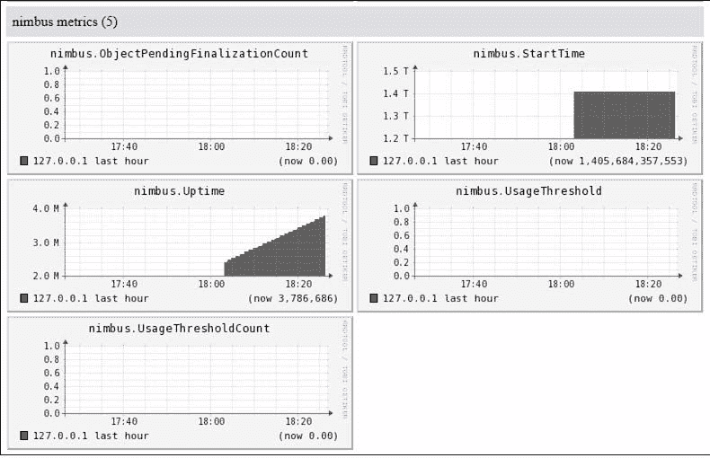

# 第七章：监控 Storm 集群

在之前的章节中，我们学习了如何在远程 Storm 集群上部署拓扑，如何配置拓扑的并行性，不同类型的流分组等。在本章中，我们将专注于如何监视和收集运行在 Storm 集群上的拓扑的统计信息。

在本章中，我们将涵盖以下主题：

+   通过 Nimbus thrift 端口收集 Storm 指标

+   将 Storm 与 Ganglia 集成

+   安装 Graphite

# 使用 Nimbus thrift 客户端收集集群统计信息

本节涵盖了如何使用 Nimbus thrift 客户端收集集群详细信息（类似于 Storm UI 页面上显示的详细信息）。通过 Nimbus thrift 客户端提取/收集信息可以让我们可视化数据。

Nimbus thrift API 非常丰富，可以公开监视 Storm 集群所需的所有必要信息。

# 使用 Nimbus thrift 获取信息

在本节中，我们将使用 Nimbus thrift 客户端创建一个 Java 项目，该项目将包含执行以下操作的类：

+   收集 Nimbus 配置

+   收集监督者统计信息

+   收集拓扑统计信息

+   收集给定拓扑的喷口统计信息

+   收集给定拓扑的螺栓统计信息

+   终止给定的拓扑

以下是使用 Nimbus thrift 客户端获取集群详细信息的步骤：

1.  使用`com.stormadvance`作为`groupId`和`stormmonitoring`作为`artifactId`创建一个 Maven 项目。

1.  将以下依赖项添加到`pom.xml`文件中：

```scala
<dependency> 
  <groupId>org.apache.storm</groupId> 
  <artifactId>storm-core</artifactId> 
  <version>1.0.2</version> 
  <scope>provided</scope> 
</dependency> 

```

1.  在`com.stormadvance`包中创建一个名为`ThriftClient`的实用类。`ThriftClient`类包含逻辑，用于与 Nimbus thrift 服务器建立连接并返回 Nimbus 客户端：

```scala
public class ThriftClient { 
  // IP of the Storm UI node 
  private static final String STORM_UI_NODE = "127.0.0.1"; 
  public Client getClient() { 
    // Set the IP and port of thrift server. 
    // By default, the thrift server start on port 6627 
    TSocket socket = new TSocket(STORM_UI_NODE, 6627); 
    TFramedTransport tFramedTransport = new TFramedTransport(socket); 
    TBinaryProtocol tBinaryProtocol = new TBinaryProtocol(tFramedTransport); 
    Client client = new Client(tBinaryProtocol); 
    try { 
      // Open the connection with thrift client. 
      tFramedTransport.open(); 
    }catch(Exception exception) { 
      throw new RuntimeException("Error occurs while making connection with Nimbus thrift server"); 
    } 
    // return the Nimbus Thrift client. 
    return client;           
  } 
} 
```

1.  让我们在`com.stormadvance`包中创建一个名为`NimbusConfiguration`的类。该类包含使用 Nimbus 客户端收集 Nimbus 配置的逻辑：

```scala
public class NimbusConfiguration { 

  public void printNimbusStats() { 
    try { 
      ThriftClient thriftClient = new ThriftClient(); 
      Client client = thriftClient.getClient(); 
      String nimbusConiguration = client.getNimbusConf(); 
      System.out.println("*************************************"); 
      System.out.println("Nimbus Configuration : "+nimbusConiguration); 
      System.out.println("*************************************"); 
    }catch(Exception exception) { 
      throw new RuntimeException("Error occure while fetching the Nimbus statistics : "); 
    } 
  }

  public static void main(String[] args) { 
    new NimbusConfiguration().printNimbusStats(); 
  }      
}
```

上述代码使用`org.apache.storm.generated.Nimbus.Client`类的`getNimbusConf()`方法来获取 Nimbus 配置。

1.  在`com.stormadvance`包中创建一个名为`SupervisorStatistics`的类，以收集 Storm 集群中所有监督者节点的信息：

```scala
public class SupervisorStatistics { 

  public void printSupervisorStatistics()  { 
    try { 
      ThriftClient thriftClient = new ThriftClient(); 
      Client client = thriftClient.getClient(); 
      // Get the cluster information. 
      ClusterSummary clusterSummary = client.getClusterInfo(); 
      // Get the SupervisorSummary iterator 
      Iterator<SupervisorSummary> supervisorsIterator = clusterSummary.get_supervisors_iterator(); 

      while (supervisorsIterator.hasNext()) { 
        // Print the information of supervisor node 
        SupervisorSummary supervisorSummary = (SupervisorSummary) supervisorsIterator.next();

        System.out.println("*************************************"); 
        System.out.println("Supervisor Host IP : "+supervisorSummary.get_host()); 
        System.out.println("Number of used workers : "+supervisorSummary.get_num_used_workers()); 
        System.out.println("Number of workers : "+supervisorSummary.get_num_workers()); 
        System.out.println("Supervisor ID : "+supervisorSummary.get_supervisor_id()); 
        System.out.println("Supervisor uptime in seconds : "+supervisorSummary.get_uptime_secs());

        System.out.println("*************************************"); 
      } 

    }catch (Exception e) { 
      throw new RuntimeException("Error occure while getting cluster info : "); 
    } 
  } 

} 
```

`SupervisorStatistics`类使用`org.apache.storm.generated.Nimbus.Client`类的`getClusterInfo()`方法来收集集群摘要，然后调用`org.apache.storm.generated.ClusterSummary`类的`get_supervisors_iterator()`方法来获取`org.apache.storm.generated.SupervisorSummary`类的迭代器。

请参阅`SupervisorStatistics`类的输出。

****

1.  在`com.stormadvance`包中创建一个名为`TopologyStatistics`的类，以收集 Storm 集群中所有运行拓扑的信息：

```scala
public class TopologyStatistics { 

  public void printTopologyStatistics() { 
    try { 
      ThriftClient thriftClient = new ThriftClient(); 
      // Get the thrift client 
      Client client = thriftClient.getClient(); 
      // Get the cluster info 
      ClusterSummary clusterSummary = client.getClusterInfo(); 
      // Get the iterator over TopologySummary class 
      Iterator<TopologySummary> topologiesIterator = clusterSummary.get_topologies_iterator(); 
      while (topologiesIterator.hasNext()) { 
        TopologySummary topologySummary = topologiesIterator.next();

        System.out.println("*************************************"); 
        System.out.println("ID of topology: " + topologySummary.get_id()); 
        System.out.println("Name of topology: " + topologySummary.get_name()); 
        System.out.println("Number of Executors: " + topologySummary.get_num_executors()); 
        System.out.println("Number of Tasks: " + topologySummary.get_num_tasks()); 
        System.out.println("Number of Workers: " + topologySummary.get_num_workers()); 
        System.out.println("Status of toplogy: " + topologySummary.get_status()); 
        System.out.println("Topology uptime in seconds: " + topologySummary.get_uptime_secs());

        System.out.println("*************************************"); 
      } 
    }catch (Exception exception) { 
      throw new RuntimeException("Error occure while fetching the topolgies  information"); 
    } 
  }      
} 
```

`TopologyStatistics`类使用`org.apache.storm.generated.ClusterSummary`类的`get_topologies_iterator()`方法来获取`org.apache.storm.generated.TopologySummary`类的迭代器。`TopologyStatistics`类将打印每个拓扑分配的执行器数量、任务数量和工作进程数量的值。

1.  在`com.stormadvance`包中创建一个名为`SpoutStatistics`的类，以获取喷口的统计信息。`SpoutStatistics`类包含一个名为`printSpoutStatistics(String topologyId)`的方法，用于打印给定拓扑提供的所有喷口的详细信息：

```scala
public class SpoutStatistics { 

  private static final String DEFAULT = "default"; 
  private static final String ALL_TIME = ":all-time"; 

  public void printSpoutStatistics(String topologyId) { 
    try { 
      ThriftClient thriftClient = new ThriftClient(); 
      // Get the nimbus thrift client 
      Client client = thriftClient.getClient(); 
      // Get the information of given topology  
      TopologyInfo topologyInfo = client.getTopologyInfo(topologyId);          
      Iterator<ExecutorSummary> executorSummaryIterator = topologyInfo.get_executors_iterator(); 
      while (executorSummaryIterator.hasNext()) { 
        ExecutorSummary executorSummary = executorSummaryIterator.next(); 
        ExecutorStats executorStats = executorSummary.get_stats(); 
        if(executorStats !=null) { 
          ExecutorSpecificStats executorSpecificStats = executorStats.get_specific(); 
          String componentId = executorSummary.get_component_id(); 
          //  
          if (executorSpecificStats.is_set_spout()) { 
            SpoutStats spoutStats = executorSpecificStats.get_spout();

             System.out.println("*************************************"); 
            System.out.println("Component ID of Spout:- " + componentId); 
            System.out.println("Transferred:- " + getAllTimeStat(executorStats.get_transferred(),ALL_TIME)); 
            System.out.println("Total tuples emitted:- " + getAllTimeStat(executorStats.get_emitted(), ALL_TIME)); 
            System.out.println("Acked: " + getAllTimeStat(spoutStats.get_acked(), ALL_TIME)); 
            System.out.println("Failed: " + getAllTimeStat(spoutStats.get_failed(), ALL_TIME));
             System.out.println("*************************************"); 
          } 
        } 
      } 
    }catch (Exception exception) { 
      throw new RuntimeException("Error occure while fetching the spout information : "+exception); 
    } 
  } 

  private static Long getAllTimeStat(Map<String, Map<String, Long>> map, String statName) { 
    if (map != null) { 
      Long statValue = null; 
      Map<String, Long> tempMap = map.get(statName); 
      statValue = tempMap.get(DEFAULT); 
      return statValue; 
    } 
    return 0L; 
  } 

  public static void main(String[] args) { 
    new SpoutStatistics().printSpoutStatistics("StormClusterTopology-1-1393847956"); 
  } 
}      
```

上述类使用`org.apache.storm.generated.Nimbus.Client`类的`getTopologyInfo(topologyId)`方法来获取给定拓扑的信息。`SpoutStatistics`类打印喷口的以下统计信息：

+   +   喷口 ID

+   发射的元组数量

+   失败的元组数量

+   确认的元组数量

1.  在`com.stormadvance`包中创建一个`BoltStatistics`类，以获取螺栓的统计信息。`BoltStatistics`类包含一个`printBoltStatistics(String topologyId)`方法，用于打印给定拓扑提供的所有螺栓的信息：

```scala
public class BoltStatistics { 

  private static final String DEFAULT = "default"; 
  private static final String ALL_TIME = ":all-time"; 

  public void printBoltStatistics(String topologyId) { 

    try { 
      ThriftClient thriftClient = new ThriftClient(); 
      // Get the Nimbus thrift server client 
      Client client = thriftClient.getClient(); 

      // Get the information of given topology 
      TopologyInfo topologyInfo = client.getTopologyInfo(topologyId); 
      Iterator<ExecutorSummary> executorSummaryIterator = topologyInfo.get_executors_iterator(); 
      while (executorSummaryIterator.hasNext()) { 
        // get the executor 
        ExecutorSummary executorSummary = executorSummaryIterator.next(); 
        ExecutorStats executorStats = executorSummary.get_stats(); 
        if (executorStats != null) { 
          ExecutorSpecificStats executorSpecificStats = executorStats.get_specific(); 
          String componentId = executorSummary.get_component_id(); 
          if (executorSpecificStats.is_set_bolt()) { 
            BoltStats boltStats = executorSpecificStats.get_bolt();

            System.out.println("*************************************"); 
            System.out.println("Component ID of Bolt " + componentId); 
            System.out.println("Transferred: " + getAllTimeStat(executorStats.get_transferred(), ALL_TIME)); 
            System.out.println("Emitted: " + getAllTimeStat(executorStats.get_emitted(), ALL_TIME)); 
            System.out.println("Acked: " + getBoltStats(boltStats.get_acked(), ALL_TIME)); 
            System.out.println("Failed: " + getBoltStats(boltStats.get_failed(), ALL_TIME)); 
            System.out.println("Executed : " + getBoltStats(boltStats.get_executed(), ALL_TIME));
            System.out.println("*************************************"); 
          } 
        } 
      } 
    } catch (Exception exception) { 
      throw new RuntimeException("Error occure while fetching the bolt information :"+exception); 
    } 
  } 

  private static Long getAllTimeStat(Map<String, Map<String, Long>> map, String statName) { 
    if (map != null) { 
      Long statValue = null; 
      Map<String, Long> tempMap = map.get(statName); 
      statValue = tempMap.get(DEFAULT); 
      return statValue; 
    } 
    return 0L; 
  } 

  public static Long getBoltStats(Map<String, Map<GlobalStreamId, Long>> map, String statName) { 
    if (map != null) { 
      Long statValue = null; 
      Map<GlobalStreamId, Long> tempMap = map.get(statName); 
      Set<GlobalStreamId> key = tempMap.keySet(); 
      if (key.size() > 0) { 
        Iterator<GlobalStreamId> iterator = key.iterator(); 
        statValue = tempMap.get(iterator.next()); 
      } 
      return statValue; 
    } 
    return 0L; 
  }
```

```scala

  public static void main(String[] args) { new BoltStatistics().printBoltStatistics("StormClusterTopology-1-1393847956"); 
}  
```

前面的类使用`backtype.storm.generated.Nimbus.Client`类的`getTopologyInfo(topologyId)`方法来获取给定拓扑的信息。`BoltStatistics`类打印了以下螺栓的统计信息：

+   +   螺栓 ID

+   发射的元组数量

+   元组失败的数量

+   确认的元组数量

1.  在`com.stormadvance`包中创建一个`killTopology`类，并按照以下所述定义一个`kill`方法：

```scala
public void kill(String topologyId) { 
  try { 
    ThriftClient thriftClient = new ThriftClient(); 
    // Get the Nimbus thrift client 
    Client client = thriftClient.getClient(); 
    // kill the given topology 
    client.killTopology(topologyId); 

  }catch (Exception exception) { 
    throw new RuntimeException("Error occure while fetching the spout information : "+exception); 
  } 
} 

public static void main(String[] args) { 
  new killTopology().kill("topologyId"); 
} 
```

前面的类使用`org.apache.storm.generated.Nimbus.Client`类的`killTopology(topologyId)`方法来终止拓扑。

在本节中，我们介绍了使用 Nimbus thrift 客户端收集 Storm 集群指标/详情的几种方法。

# 使用 JMX 监控 Storm 集群

本节将解释如何使用**Java 管理扩展**（**JMX**）监控 Storm 集群。 JMX 是一组用于管理和监控在 JVM 中运行的应用程序的规范。我们可以在 JMX 控制台上收集或显示 Storm 指标，例如堆大小、非堆大小、线程数、加载的类数、堆和非堆内存、虚拟机参数和托管对象。以下是我们使用 JMX 监控 Storm 集群需要执行的步骤：

1.  我们需要在每个监督者节点的`storm.yaml`文件中添加以下行以在每个监督者节点上启用 JMX：

```scala
supervisor.childopts: -verbose:gc -XX:+PrintGCTimeStamps - XX:+PrintGCDetails -Dcom.sun.management.jmxremote - Dcom.sun.management.jmxremote.ssl=false - Dcom.sun.management.jmxremote.authenticate=false - Dcom.sun.management.jmxremote.port=12346   
```

这里，`12346`是通过 JMX 收集监督者 JVM 指标的端口号。

1.  在 Nimbus 机器的`storm.yaml`文件中添加以下行以在 Nimbus 节点上启用 JMX：

```scala
nimbus.childopts: -verbose:gc -XX:+PrintGCTimeStamps - XX:+PrintGCDetails -Dcom.sun.management.jmxremote - Dcom.sun.management.jmxremote.ssl=false - Dcom.sun.management.jmxremote.authenticate=false - Dcom.sun.management.jmxremote.port=12345
```

这里，`12345`是通过 JMX 收集 Nimbus JVM 指标的端口号。

1.  此外，您可以通过在每个监督者节点的`storm.yaml`文件中添加以下行来收集工作进程的 JVM 指标：

```scala
worker.childopts: -verbose:gc -XX:+PrintGCTimeStamps - XX:+PrintGCDetails -Dcom.sun.management.jmxremote - Dcom.sun.management.jmxremote.ssl=false - Dcom.sun.management.jmxremote.authenticate=false - Dcom.sun.management.jmxremote.port=2%ID%   
```

这里，`％ID％`表示工作进程的端口号。如果工作进程的端口是`6700`，则其 JVM 指标将发布在端口号`26700`（`2％ID％`）上。

1.  现在，在安装了 Java 的任何机器上运行以下命令以启动 JConsole：

```scala
cd $JAVA_HOME ./bin/jconsole
```

以下截图显示了我们如何使用 JConsole 连接到监督者 JMX 端口：



如果您在监督者机器之外的机器上打开 JMX 控制台，则需要在上述截图中使用监督者机器的 IP 地址，而不是`127.0.0.1`。

现在，单击“连接”按钮以查看监督者节点的指标。以下截图显示了 JMX 控制台上 Storm 监督者节点的指标：



同样，您可以通过在 JMX 控制台上指定 Nimbus 机器的 IP 地址和 JMX 端口来收集 Nimbus 节点的 JVM 指标。

以下部分将解释如何在 Ganglia 上显示 Storm 集群指标。

# 使用 Ganglia 监控 Storm 集群

Ganglia 是一个监控工具，用于收集集群上运行的不同类型进程的指标。在大多数应用程序中，Ganglia 被用作集中监控工具，用于显示集群上运行的所有进程的指标。因此，通过 Ganglia 启用 Storm 集群的监控至关重要。

Ganglia 有三个重要组件：

+   **Gmond**：这是 Ganglia 的监控守护程序，用于收集节点的指标并将此信息发送到 Gmetad 服务器。要收集每个 Storm 节点的指标，您需要在每个节点上安装 Gmond 守护程序。

+   **Gmetad**：这从所有 Gmond 节点收集指标并将它们存储在循环数据库中。

+   **Ganglia Web 界面**：以图形形式显示指标信息。

Storm 没有内置支持使用 Ganglia 监视 Storm 集群。但是，使用 JMXTrans，您可以启用使用 Ganglia 监视 Storm。JMXTrans 工具允许您连接到任何 JVM，并在不编写一行代码的情况下获取其 JVM 指标。通过 JMX 公开的 JVM 指标可以使用 JMXTrans 在 Ganglia 上显示。因此，JMXTrans 充当了 Storm 和 Ganglia 之间的桥梁。

以下图表显示了 JMXTrans 在 Storm 节点和 Ganglia 之间的使用方式：



执行以下步骤设置 JMXTrans 和 Ganglia：

1.  运行以下命令在每个 Storm 节点上下载并安装 JMXTrans 工具：

```scala
wget https://jmxtrans.googlecode.com/files/jmxtrans-239-0.noarch. rpm sudo rpm -i jmxtrans-239-0.noarch.rpm
```

1.  运行以下命令在网络中的任何机器上安装 Ganglia Gmond 和 Gmetad 包。您可以在不属于 Storm 集群的机器上部署 Gmetad 和 Gmond 进程：

```scala
sudo yum -q -y install rrdtool sudo yum -q -y install ganglia-gmond sudo yum -q -y install ganglia-gmetad sudo yum -q -y install ganglia-web
```

1.  编辑`gmetad.conf`配置文件中的以下行，该文件位于 Gmetad 进程的`/etc/ganglia`中。我们正在编辑此文件以指定数据源的名称和 Ganglia Gmetad 机器的 IP 地址：

```scala
data_source "stormcluster" 127.0.0.1
```

您可以将`127.0.0.1`替换为 Ganglia Gmetad 机器的 IP 地址。

1.  编辑`gmond.conf`配置文件中的以下行，该文件位于 Gmond 进程的`/etc/ganglia`中：

```scala
cluster { 
  name = "stormcluster" 
  owner = "clusterOwner" 
  latlong = "unspecified" 
  url = "unspecified" 
  }
  host { 
    location = "unspecified" 
  }
  udp_send_channel { 
    host = 127.0.0.1 
    port = 8649 
    ttl = 1 
  }
  udp_recv_channel { 
    port = 8649 
  }
```

这里，`127.0.0.1`是 Storm 节点的 IP 地址。您需要将`127.0.0.1`替换为实际机器的 IP 地址。我们主要编辑了 Gmond 配置文件中的以下条目：

+   +   集群名称

+   `udp_send`通道中的主 Gmond 节点的主机地址

+   `udp_recv`通道中的端口

1.  编辑`ganglia.conf`文件中的以下行，该文件位于`/etc/httpd/conf.d`。我们正在编辑`ganglia.conf`文件以启用从所有机器访问 Ganglia UI：

```scala
Alias /ganglia /usr/share/ganglia <Location /ganglia>Allow from all</Location>
```

`ganglia.conf`文件可以在安装 Ganglia web 前端应用程序的节点上找到。在我们的情况下，Ganglia web 界面和 Gmetad 服务器安装在同一台机器上。

1.  运行以下命令启动 Ganglia Gmond、Gmetad 和 web UI 进程：

```scala
sudo service gmond start setsebool -P httpd_can_network_connect 1 sudo service gmetad start sudo service httpd stop sudo service httpd start
```

1.  现在，转到`http://127.0.0.1/ganglia`验证 Ganglia 的安装，并将`127.0.0.1`替换为 Ganglia web 界面机器的 IP 地址。

1.  现在，您需要在每个监督者节点上编写一个`supervisor.json`文件，以使用 JMXTrans 收集 Storm 监督者节点的 JVM 指标，然后使用`com.googlecode.jmxtrans.model.output.GangliaWriter OutputWriters`类将其发布在 Ganglia 上。`com.googlecode.jmxtrans.model.output.GangliaWriter OutputWriters`类用于处理输入的 JVM 指标并将其转换为 Ganglia 使用的格式。以下是`supervisor.json` JSON 文件的内容：

```scala
{ 
  "servers" : [ { 
    "port" : "12346", 
    "host" : "IP_OF_SUPERVISOR_MACHINE", 
    "queries" : [ { 
      "outputWriters": [{ 
        "@class": 
        "com.googlecode.jmxtrans.model.output.GangliaWriter", "settings": { 
          "groupName": "supervisor", 
          "host": "IP_OF_GANGLIA_GMOND_SERVER", 
          "port": "8649" } 
      }], 
      "obj": "java.lang:type=Memory", 
      "resultAlias": "supervisor", 
      "attr": ["ObjectPendingFinalizationCount"] 
    }, 
    { 
      "outputWriters": [{ 
        "@class": 
        "com.googlecode.jmxtrans.model.output.GangliaWriter", "settings" { 
          "groupName": " supervisor ", 
          "host": "IP_OF_GANGLIA_GMOND_SERVER", 
          "port": "8649" 
        } 
      }], 
      "obj": "java.lang:name=Copy,type=GarbageCollector", 
      "resultAlias": " supervisor ", 
      "attr": [ 
        "CollectionCount", 
        "CollectionTime"  
      ] 
    }, 
    { 
      "outputWriters": [{ 
        "@class": 
        "com.googlecode.jmxtrans.model.output.GangliaWriter", "settings": { 
          "groupName": "supervisor ", 
          "host": "IP_OF_GANGLIA_GMOND_SERVER", 
          "port": "8649" 
        } 
      }], 
      "obj": "java.lang:name=Code Cache,type=MemoryPool", 
      "resultAlias": "supervisor ", 
      "attr": [ 
        "CollectionUsageThreshold", 
        "CollectionUsageThresholdCount", 
        "UsageThreshold", 
        "UsageThresholdCount" 
      ] 
    }, 
    { 
      "outputWriters": [{ 
        "@class": 
        "com.googlecode.jmxtrans.model.output.GangliaWriter", "settings": { 
          "groupName": "supervisor ", 
          "host": "IP_OF_GANGLIA_GMOND_SERVER", 
          "port": "8649" 
        } 
      }], 
      "obj": "java.lang:type=Runtime", 
      "resultAlias": "supervisor", 
      "attr": [ 
        "StartTime", 
        "Uptime" 
      ] 
    }
    ], 
    "numQueryThreads" : 2 
  }] 
} 
```

这里，`12346`是`storm.yaml`文件中指定的监督者的 JMX 端口。

您需要将`IP_OF_SUPERVISOR_MACHINE`的值替换为监督机器的 IP 地址。如果集群中有两个监督者，那么节点 1 的`supervisor.json`文件包含节点 1 的 IP 地址，节点 2 的`supervisor.json`文件包含节点 2 的 IP 地址。

您需要将`IP_OF_GANGLIA_GMOND_SERVER`的值替换为 Ganglia Gmond 服务器的 IP 地址。

1.  在 Nimbus 节点上创建`nimbus.json`文件。使用 JMXTrans，收集 Storm Nimbus 进程的 JVM 指标，并使用`com.googlecode.jmxtrans.model.output.GangliaWriter OutputWriters`类将其发布在 Ganglia 上。以下是`nimbus.json`文件的内容：

```scala
{ 
  "servers" : [{ 
    "port" : "12345", 
    "host" : "IP_OF_NIMBUS_MACHINE", 
    "queries" : [ 
      { "outputWriters": [{ 
        "@class": 
        "com.googlecode.jmxtrans.model.output.GangliaWriter", 
        "settings": { 
          "groupName": "nimbus", 
          "host": "IP_OF_GANGLIA_GMOND_SERVER", 
          "port": "8649" 
        } 
      }], 
      "obj": "java.lang:type=Memory", 
      "resultAlias": "nimbus", 
      "attr": ["ObjectPendingFinalizationCount"] 
      }, 
      { 
        "outputWriters": [{ 
          "@class": 
          "com.googlecode.jmxtrans.model.output.GangliaWriter", "settings": { 
            "groupName": "nimbus", 
            "host": "IP_OF_GANGLIA_GMOND_SERVER", 
            "port": "8649" 
          } 
        }], 
        "obj": "java.lang:name=Copy,type=GarbageCollector", 
        "resultAlias": "nimbus", 
        "attr": [ 
          "CollectionCount", 
          "CollectionTime" 
        ] 
      }, 
      { 
        "outputWriters": [{ 
          "@class": 
          "com.googlecode.jmxtrans.model.output.GangliaWriter", 
          "settings": { 
            "groupName": "nimbus", 
            "host": "IP_OF_GANGLIA_GMOND_SERVER", 
            "port": "8649" 
          } 
        }], 
        "obj": "java.lang:name=Code Cache,type=MemoryPool", 
        "resultAlias": "nimbus", 
        "attr": [ 
          "CollectionUsageThreshold", 
          "CollectionUsageThresholdCount", 
          "UsageThreshold", 
          "UsageThresholdCount" 
        ] 
      }, 
      { 
        "outputWriters": [{ 
          "@class": 
          "com.googlecode.jmxtrans.model.output.GangliaWriter", "settings": {    
           "groupName": "nimbus", 
            "host": "IP_OF_GANGLIA_GMOND_SERVER", 
            "port": "8649" 
          } 
        }], 
        "obj": "java.lang:type=Runtime",
        "resultAlias": "nimbus", 
        "attr": [ 
          "StartTime", 
          "Uptime" 
        ] 
      }
    ] 
    "numQueryThreads" : 2 
  } ] 
} 
```

这里，`12345`是`storm.yaml`文件中指定的 Nimbus 机器的 JMX 端口。

您需要将`IP_OF_NIMBUS_MACHINE`的值替换为 Nimbus 机器的 IP 地址。

您需要将`IP_OF_GANGLIA_GMOND_SERVER`的值替换为 Ganglia Gmond 服务器的 IP 地址。

1.  在每个 Storm 节点上运行以下命令以启动 JMXTrans 进程：

```scala
cd /usr/share/jmxtrans/ sudo ./jmxtrans.sh start PATH_OF_JSON_FILES
```

这里，`PATH_OF_JSON_FILE`是`supervisor.json`和`nimbus.json`文件的位置。

1.  现在，转到`http://127.0.0.1/ganglia`上的 Ganglia 页面，查看 Storm 指标。以下截图显示了 Storm 指标的样子：



执行以下步骤来查看 Ganglia UI 上的 Storm Nimbus 和 supervisor 进程的指标：

1.  打开 Ganglia 页面。

1.  现在点击`stormcluster`链接，查看 Storm 集群的指标。

以下截图显示了 Storm supervisor 节点的指标：



以下截图显示了 Storm Nimbus 节点的指标：



# 总结

在本章中，我们通过 Nimbus thrift 客户端监控了 Storm 集群，类似于我们通过 Storm UI 所做的。我们还介绍了如何配置 Storm 来发布 JMX 指标以及 Storm 与 Ganglia 的集成。

在下一章中，我们将介绍 Storm 与 Kafka 的集成，并查看一些示例来说明这个过程。
