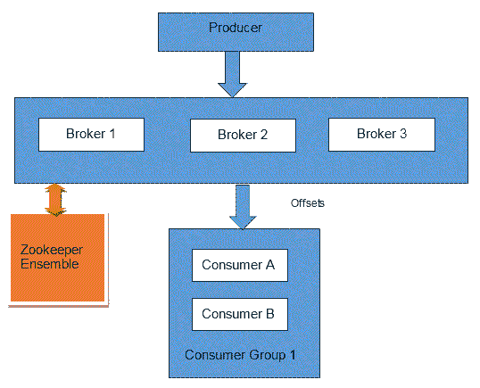
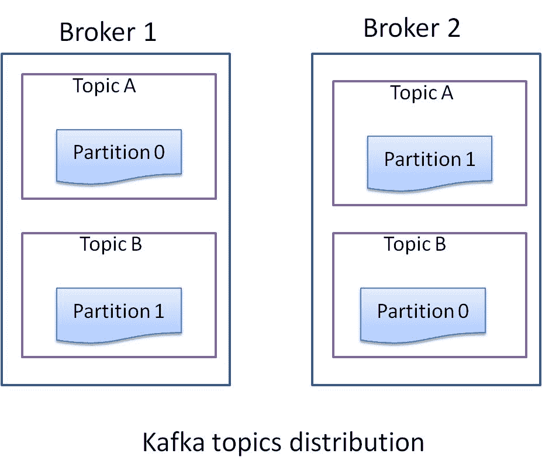
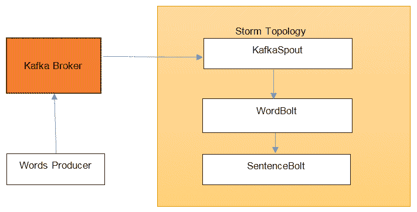

# 第八章：Storm 和 Kafka 的集成

Apache Kafka 是一个高吞吐量、分布式、容错和复制的消息系统，最初在 LinkedIn 开发。Kafka 的用例从日志聚合到流处理再到替代其他消息系统都有。

Kafka 已经成为实时处理流水线中与 Storm 组合使用的重要组件之一。Kafka 可以作为需要由 Storm 处理的消息的缓冲区或者提供者。Kafka 也可以作为 Storm 拓扑发出的结果的输出接收端。

在本章中，我们将涵盖以下主题：

+   Kafka 架构——broker、producer 和 consumer

+   Kafka 集群的安装

+   在 Kafka 之间共享 producer 和 consumer

+   使用 Kafka consumer 作为 Storm spout 开发 Storm 拓扑

+   Kafka 和 Storm 集成拓扑的部署

# Kafka 简介

本节中，我们将介绍 Kafka 的架构——broker、consumer 和 producer。

# Kafka 架构

Kafka 具有与其他消息系统显著不同的架构。Kafka 是一个点对点系统（集群中的每个节点具有相同的角色），每个节点称为**broker**。broker 通过 ZooKeeper 集合协调它们的操作。ZooKeeper 集合管理的 Kafka 元数据在*在 Storm 和 Kafka 之间共享 ZooKeeper*部分中提到。



图 8.1：Kafka 集群

以下是 Kafka 的重要组件：

# Producer

生产者是使用 Kafka 客户端 API 将消息发布到 Kafka 集群的实体。在 Kafka broker 中，消息由生产者实体发布到名为**topics**的实体。主题是一个持久队列（存储在主题中的数据被持久化到磁盘）。

为了并行处理，Kafka 主题可以有多个分区。每个分区的数据都以不同的文件表示。同一个主题的两个分区可以分配到不同的 broker 上，从而增加吞吐量，因为所有分区都是相互独立的。每个分区中的消息都有一个与之关联的唯一序列号，称为**offset**：



图 8.2：Kafka 主题分布

# 复制

Kafka 支持主题分区的复制以支持容错。Kafka 自动处理分区的复制，并确保分区的副本将分配给不同的 broker。Kafka 选举一个 broker 作为分区的 leader，并且所有写入和读取都必须到分区 leader。复制功能是在 Kafka 8.0.0 版本中引入的。

Kafka 集群通过 ZooKeeper 管理**in sync replica**（ISR）的列表——与分区 leader 同步的副本。如果分区 leader 宕机，那么在 ISR 列表中存在的跟随者/副本才有资格成为失败分区的下一个 leader。

# Consumer

消费者从 broker 中读取一系列消息。每个消费者都有一个分配的 group ID。具有相同 group ID 的所有消费者作为单个逻辑消费者。主题的每条消息都会传递给具有相同 group ID 的消费者组中的一个消费者。特定主题的不同消费者组可以以自己的速度处理消息，因为消息在被消费后并不会立即从主题中移除。事实上，消费者有责任跟踪他们已经消费了多少消息。

如前所述，每个分区中的每条消息都有一个与之关联的唯一序列号，称为 offset。通过这个 offset，消费者知道他们已经处理了多少流。如果消费者决定重新播放已经处理过的消息，他只需要将 offset 的值设置为之前的值，然后再从 Kafka 中消费消息。

# Broker

经纪人从生产者（推送机制）接收消息，并将消息传递给消费者（拉取机制）。经纪人还管理文件中消息的持久性。Kafka 经纪人非常轻量级：它们只在队列（主题分区）上打开文件指针，并管理 TCP 连接。

# 数据保留

Kafka 中的每个主题都有一个关联的保留时间。当此时间到期时，Kafka 会删除该特定主题的过期数据文件。这是一个非常高效的操作，因为它是一个文件删除操作。

# 安装 Kafka 经纪人

在撰写本文时，Kafka 的稳定版本是 0.9.x。

运行 Kafka 的先决条件是 ZooKeeper 集合和 Java 版本 1.7 或更高版本。Kafka 附带了一个方便的脚本，可以启动单节点 ZooKeeper，但不建议在生产环境中使用。我们将使用我们在第二章中部署的 ZooKeeper 集群。

我们将首先看如何设置单节点 Kafka 集群，然后再看如何添加另外两个节点以运行一个完整的、启用了复制的三节点 Kafka 集群。

# 设置单节点 Kafka 集群

以下是设置单节点 Kafka 集群的步骤：

1.  从[`apache.claz.org/kafka/0.9.0.1/kafka_2.10-0.9.0.1.tgz`](http://apache.claz.org/kafka/0.9.0.1/kafka_2.10-0.9.0.1.tgz)下载 Kafka 0.9.x 二进制分发版，文件名为`kafka_2.10-0.9.0.1.tar.gz`。

1.  使用以下命令将存档文件提取到您想要安装 Kafka 的位置：

```scala
tar -xvzf kafka_2.10-0.9.0.1.tgz
cd kafka_2.10-0.9.0.1  
```

从现在开始，我们将把 Kafka 安装目录称为`$KAFKA_HOME`。

1.  更改`$KAFKA_HOME/config/server.properties`文件中的以下属性：

```scala
log.dirs=/var/kafka-logszookeeper.connect=zoo1:2181,zoo2:2181,zoo3:2181
```

在这里，`zoo1`、`zoo2`和`zoo3`代表了 ZooKeeper 节点的主机名。

以下是`server.properties`文件中重要属性的定义：

+   +   `broker.id`：这是 Kafka 集群中每个经纪人的唯一整数 ID。

+   `port`：这是 Kafka 经纪人的端口号。默认值为`9092`。如果您想在单台机器上运行多个经纪人，请为每个经纪人指定一个唯一的端口。

+   `host.name`：代表经纪人应该绑定和宣传自己的主机名。

+   `log.dirs`：这个属性的名称有点不幸，因为它代表的不是 Kafka 的日志目录，而是 Kafka 存储实际发送到它的数据的目录。它可以接受单个目录或逗号分隔的目录列表来存储数据。通过将多个物理磁盘连接到经纪人节点并指定多个数据目录，每个目录位于不同的磁盘上，可以增加 Kafka 的吞吐量。在同一物理磁盘上指定多个目录并没有太大用处，因为所有 I/O 仍然会在同一磁盘上进行。

+   `num.partitions`：这代表了新创建主题的默认分区数。在创建新主题时，可以覆盖此属性。分区数越多，可以实现更大的并行性，但会增加文件数量。

+   `log.retention.hours`：Kafka 在消费者消费消息后不会立即删除消息。它会保留消息一定小时数，由此属性定义，以便在出现任何问题时，消费者可以从 Kafka 重放消息。默认值为`168`小时，即 1 周。

+   `zookeeper.connect`：这是以`hostname:port`形式的 ZooKeeper 节点的逗号分隔列表。

1.  通过运行以下命令启动 Kafka 服务器：

```scala

> ./bin/kafka-server-start.sh config/server.properties 

[2017-04-23 17:44:36,667] INFO New leader is 0 (kafka.server.ZookeeperLeaderElector$LeaderChangeListener)
[2017-04-23 17:44:36,668] INFO Kafka version : 0.9.0.1 (org.apache.kafka.common.utils.AppInfoParser)
[2017-04-23 17:44:36,668] INFO Kafka commitId : a7a17cdec9eaa6c5 (org.apache.kafka.common.utils.AppInfoParser)
[2017-04-23 17:44:36,670] INFO [Kafka Server 0], started (kafka.server.KafkaServer)  
```

如果您在控制台上得到类似于前三行的内容，那么您的 Kafka 经纪人已经启动，我们可以继续测试。

1.  现在我们将通过发送和接收一些测试消息来验证 Kafka 经纪人是否设置正确。首先，让我们通过执行以下命令为测试创建一个验证主题：

```scala

> bin/kafka-topics.sh --zookeeper zoo1:2181 --replication-factor 1 --partition 1 --topic verification-topic --create

Created topic "verification-topic".  
```

1.  现在让我们通过列出所有主题来验证主题创建是否成功：

```scala

> bin/kafka-topics.sh --zookeeper zoo1:2181 --list

verification-topic  
```

1.  主题已创建；让我们为 Kafka 集群生成一些示例消息。Kafka 附带了一个命令行生产者，我们可以用来生成消息：

```scala

> bin/kafka-console-producer.sh --broker-list localhost:9092 --topic verification-topic    

```

1.  在控制台上写入以下消息：

```scala
Message 1
Test Message 2
Message 3  
```

1.  让我们通过在新的控制台窗口上启动新的控制台消费者来消费这些消息：

```scala
> bin/kafka-console-consumer.sh --zookeeper localhost:2181 --topic verification-topic --from-beginning

Message 1
Test Message 2
Message 3  
```

现在，如果我们在生产者控制台上输入任何消息，它将自动被此消费者消费并显示在命令行上。

**使用 Kafka 的单节点 ZooKeeper** 如果您不想使用外部 ZooKeeper 集合，可以使用 Kafka 附带的单节点 ZooKeeper 实例进行快速开发。要开始使用它，首先修改`$KAFKA_HOME/config/zookeeper.properties`文件以指定数据目录，提供以下属性：

`dataDir=/var/zookeeper`

现在，您可以使用以下命令启动 Zookeeper 实例：

`> ./bin/zookeeper-server-start.sh config/zookeeper.properties`

# 设置三节点 Kafka 集群

到目前为止，我们有一个单节点 Kafka 集群。按照以下步骤部署 Kafka 集群：

1.  创建一个三节点 VM 或三台物理机。

1.  执行*设置单节点 Kafka 集群*部分中提到的步骤 1 和 2。

1.  更改文件`$KAFKA_HOME/config/server.properties`中的以下属性：

```scala
broker.id=0
port=9092
host.name=kafka1
log.dirs=/var/kafka-logs
zookeeper.connect=zoo1:2181,zoo2:2181,zoo3:2181
```

确保`broker.id`属性的值对于每个 Kafka 代理都是唯一的，`zookeeper.connect`的值在所有节点上必须相同。

1.  通过在所有三个框上执行以下命令来启动 Kafka 代理：

```scala
> ./bin/kafka-server-start.sh config/server.properties
```

1.  现在让我们验证设置。首先使用以下命令创建一个主题：

```scala
> bin/kafka-topics.sh --zookeeper zoo1:2181 --replication-factor 4 --partition 1 --topic verification --create

    Created topic "verification-topic".  
```

1.  现在，我们将列出主题以查看主题是否成功创建：

```scala
> bin/kafka-topics.sh --zookeeper zoo1:2181 --list

                topic: verification     partition: 0      leader: 0   replicas: 0             isr: 0
                topic: verification     partition: 1      leader: 1   replicas: 1             isr: 1
                topic: verification     partition: 2      leader: 2   replicas: 2             isr: 2  
```

1.  现在，我们将通过使用 Kafka 控制台生产者和消费者来验证设置，就像在*设置单节点 Kafka 集群*部分中所做的那样：

```scala
> bin/kafka-console-producer.sh --broker-list kafka1:9092,kafka2:9092,kafka3:9092 --topic verification  
```

1.  在控制台上写入以下消息：

```scala
First
Second
Third  
```

1.  让我们通过在新的控制台窗口上启动新的控制台消费者来消费这些消息：

```scala
> bin/kafka-console-consumer.sh --zookeeper localhost:2181 --topic verification --from-beginning

First
Second
Third 
```

到目前为止，我们有三个在工作的 Kafka 集群代理。在下一节中，我们将看到如何编写一个可以向 Kafka 发送消息的生产者：

# 单个节点上的多个 Kafka 代理

如果您想在单个节点上运行多个 Kafka 代理，则请按照以下步骤进行操作：

1.  复制`config/server.properties`以创建`config/server1.properties`和`config/server2.properties`。

1.  在`config/server.properties`中填写以下属性：

```scala
broker.id=0 
port=9092 
log.dirs=/var/kafka-logs 
zookeeper.connect=zoo1:2181,zoo2:2181,zoo3:2181 
```

1.  在`config/server1.properties`中填写以下属性：

```scala
broker.id=1 
port=9093 
log.dirs=/var/kafka-1-logs 
zookeeper.connect=zoo1:2181,zoo2:2181,zoo3:2181 
```

1.  在`config/server2.properties`中填写以下属性：

```scala
broker.id=2 
port=9094 
log.dirs=/var/kafka-2-logs 
zookeeper.connect=zoo1:2181,zoo2:2181,zoo3:2181 
```

1.  在三个不同的终端上运行以下命令以启动 Kafka 代理：

```scala
> ./bin/kafka-server-start.sh config/server.properties
> ./bin/kafka-server-start.sh config/server1.properties
> ./bin/kafka-server-start.sh config/server2.properties

```

# 在 Storm 和 Kafka 之间共享 ZooKeeper

我们可以在 Kafka 和 Storm 之间共享相同的 ZooKeeper 集合，因为两者都将元数据存储在不同的 znodes 中（ZooKeeper 使用共享的分层命名空间协调分布式进程，其组织方式类似于标准文件系统。在 ZooKeeper 中，由数据寄存器组成的命名空间称为 znodes）。

我们需要打开 ZooKeeper 客户端控制台来查看为 Kafka 和 Storm 创建的 znodes（共享命名空间）。

转到`ZK_HOME`并执行以下命令以打开 ZooKeeper 控制台：

```scala
> bin/zkCli.sh  
```

执行以下命令以查看 znodes 列表：

```scala
> [zk: localhost:2181(CONNECTED) 0] ls /

**[storm, consumers, isr_change_notification, zookeeper, admin, brokers]**
```

在这里，消费者、`isr_change_notification`和代理是 znodes，Kafka 正在将其元数据信息管理到 ZooKeeper 的此位置。

Storm 在 ZooKeeper 中的 Storm znodes 中管理其元数据。

# Kafka 生产者并将数据发布到 Kafka

在本节中，我们正在编写一个 Kafka 生产者，它将发布事件到 Kafka 主题中。

执行以下步骤创建生产者：

1.  使用`com.stormadvance`作为`groupId`和`kafka-producer`作为`artifactId`创建一个 Maven 项目。

1.  在`pom.xml`文件中为 Kafka 添加以下依赖项：

```scala
<dependency> 
  <groupId>org.apache.kafka</groupId> 
  <artifactId>kafka_2.10</artifactId> 
  <version>0.9.0.1</version> 
  <exclusions> 
    <exclusion> 
      <groupId>com.sun.jdmk</groupId> 
      <artifactId>jmxtools</artifactId> 
    </exclusion> 
    <exclusion> 
      <groupId>com.sun.jmx</groupId> 
      <artifactId>jmxri</artifactId> 
    </exclusion> 
  </exclusions> 
</dependency> 
<dependency> 
  <groupId>org.apache.logging.log4j</groupId> 
  <artifactId>log4j-slf4j-impl</artifactId> 
  <version>2.0-beta9</version> 
</dependency> 
<dependency> 
  <groupId>org.apache.logging.log4j</groupId> 
  <artifactId>log4j-1.2-api</artifactId> 
  <version>2.0-beta9</version> 
</dependency>  
```

1.  在`pom.xml`文件中添加以下`build`插件。这将允许我们使用 Maven 执行生产者：

```scala
<build> 
  <plugins> 
    <plugin> 
      <groupId>org.codehaus.mojo</groupId> 
      <artifactId>exec-maven-plugin</artifactId> 
      <version>1.2.1</version> 
      <executions> 
        <execution> 
          <goals> 
            <goal>exec</goal> 
          </goals> 
        </execution> 
      </executions> 
      <configuration> 
        <executable>java</executable
        <includeProjectDependencies>true</includeProjectDependencies
        <includePluginDependencies>false</includePluginDependencies> 
        <classpathScope>compile</classpathScope> 
        <mainClass>com.stormadvance.kafka_producer. KafkaSampleProducer 
        </mainClass> 
      </configuration> 
    </plugin> 
  </plugins> 
</build> 
```

1.  现在我们将在`com.stormadvance.kafka_producer`包中创建`KafkaSampleProducer`类。该类将从弗朗茨·卡夫卡的《变形记》第一段中的每个单词产生单词，并将其作为单个消息发布到 Kafka 的`new_topic`主题中。以下是`KafkaSampleProducer`类的代码及解释：

```scala
public class KafkaSampleProducer { 
  public static void main(String[] args) { 
    // Build the configuration required for connecting to Kafka 
    Properties props = new Properties(); 

    // List of kafka borkers. Complete list of brokers is not required as 
    // the producer will auto discover the rest of the brokers. 
    props.put("bootstrap.servers", "Broker1-IP:9092"); 
    props.put("batch.size", 1); 
    // Serializer used for sending data to kafka. Since we are sending string, 
    // we are using StringSerializer. 
    props.put("key.serializer", "org.apache.kafka.common.serialization.StringSerializer"); 
    props.put("value.serializer", "org.apache.kafka.common.serialization.StringSerializer"); 

    props.put("producer.type", "sync"); 

    // Create the producer instance 
    Producer<String, String> producer = new KafkaProducer<String, String>(props); 

    // Now we break each word from the paragraph 
    for (String word : METAMORPHOSIS_OPENING_PARA.split("\\s")) { 
      System.out.println("word : " + word); 
      // Create message to be sent to "new_topic" topic with the word 
      ProducerRecord<String, String> data = new ProducerRecord<String, String>("new_topic",word, word); 
      // Send the message 
      producer.send(data); 
    } 

    // close the producer 
    producer.close(); 
    System.out.println("end : "); 
  } 

  // First paragraph from Franz Kafka's Metamorphosis 
  private static String METAMORPHOSIS_OPENING_PARA = "One morning, when Gregor Samsa woke from troubled dreams, he found " 
               + "himself transformed in his bed into a horrible vermin.  He lay on " 
               + "his armour-like back, and if he lifted his head a little he could " 
               + "see his brown belly, slightly domed and divided by arches into stiff " 
               + "sections.  The bedding was hardly able to cover it and seemed ready " 
               + "to slide off any moment.  His many legs, pitifully thin compared " 
               + "with the size of the rest of him, waved about helplessly as he " 
               + "looked."; 

}  
```

1.  现在，在运行生产者之前，我们需要在 Kafka 中创建`new_topic`。为此，请执行以下命令：

```scala

> bin/kafka-topics.sh --zookeeper ZK1:2181 --replication-factor 1 --partition 1 --topic new_topic --create 

Created topic "new_topic1".    

```

1.  现在我们可以通过执行以下命令运行生产者：

```scala
> mvn compile exec:java
......
103  [com.learningstorm.kafka.WordsProducer.main()] INFO                kafka.client.ClientUti
ls$  - Fetching metadata from broker                                    id:0,host:kafka1,port:9092 with correlation id 0 for 1                  topic(s) Set(words_topic)
110  [com.learningstorm.kafka.WordsProducer.main()] INFO                kafka.producer.SyncProducer  - Connected to kafka1:9092 for             producing
140  [com.learningstorm.kafka.WordsProducer.main()] INFO                kafka.producer.SyncProducer  - Disconnecting from                       kafka1:9092
177  [com.learningstorm.kafka.WordsProducer.main()] INFO                kafka.producer.SyncProducer  - Connected to kafka1:9092 for             producing
378  [com.learningstorm.kafka.WordsProducer.main()] INFO                kafka.producer.Producer  - Shutting down producer
378  [com.learningstorm.kafka.WordsProducer.main()] INFO                kafka.producer.ProducerPool  - Closing all sync producers
381  [com.learningstorm.kafka.WordsProducer.main()] INFO                kafka.producer.SyncProducer  - Disconnecting from                       kafka1:9092
```

1.  现在让我们通过使用 Kafka 的控制台消费者来验证消息是否已被生产，并执行以下命令：

```scala
> bin/kafka-console-consumer.sh --zookeeper ZK:2181 --topic verification --from-beginning

                One
                morning,
                when
                Gregor
                Samsa
                woke
                from
                troubled
                dreams,
                he
                found
                himself
                transformed
                in
                his
                bed
                into
                a
                horrible
                vermin.
                ......
```

因此，我们能够向 Kafka 生产消息。在下一节中，我们将看到如何使用`KafkaSpout`从 Kafka 中读取消息并在 Storm 拓扑中处理它们。

# Kafka Storm 集成

现在我们将创建一个 Storm 拓扑，该拓扑将从 Kafka 主题`new_topic`中消费消息并将单词聚合成句子。

完整的消息流如下所示：



我们已经看到了`KafkaSampleProducer`，它将单词生产到 Kafka 代理中。现在我们将创建一个 Storm 拓扑，该拓扑将从 Kafka 中读取这些单词并将它们聚合成句子。为此，我们的应用程序中将有一个`KafkaSpout`，它将从 Kafka 中读取消息，并且有两个 bolt，`WordBolt`从`KafkaSpout`接收单词，然后将它们聚合成句子，然后传递给`SentenceBolt`，它只是在输出流上打印它们。我们将在本地模式下运行此拓扑。

按照以下步骤创建 Storm 拓扑：

1.  创建一个新的 Maven 项目，`groupId`为`com.stormadvance`，`artifactId`为`kafka-storm-topology`。

1.  在`pom.xml`文件中添加以下 Kafka-Storm 和 Storm 的依赖项：

```scala
<dependency> 
  <groupId>org.apache.storm</groupId> 
  <artifactId>storm-kafka</artifactId> 
  <version>1.0.2</version> 
  <exclusions> 
    <exclusion> 
      <groupId>org.apache.kafka</groupId> 
      <artifactId>kafka-clients</artifactId> 
    </exclusion> 
  </exclusions> 
</dependency> 

<dependency> 
  <groupId>org.apache.kafka</groupId> 
  <artifactId>kafka_2.10</artifactId> 
  <version>0.9.0.1</version> 
  <exclusions> 
    <exclusion> 
      <groupId>com.sun.jdmk</groupId> 
      <artifactId>jmxtools</artifactId> 
    </exclusion> 
    <exclusion> 
      <groupId>com.sun.jmx</groupId> 
      <artifactId>jmxri</artifactId> 
    </exclusion> 
  </exclusions> 
</dependency> 

<dependency> 
  <groupId>org.apache.storm</groupId> 
  <artifactId>storm-core</artifactId> 
  <version>1.0.2</version> 
  <scope>provided</scope> 
</dependency> 
<dependency> 
  <groupId>commons-collections</groupId> 
  <artifactId>commons-collections</artifactId> 
  <version>3.2.1</version> 
</dependency> 

<dependency> 
  <groupId>com.google.guava</groupId> 
  <artifactId>guava</artifactId> 
  <version>15.0</version> 
</dependency>  
```

1.  在`pom.xml`文件中添加以下 Maven 插件，以便我们能够从命令行运行它，并且还能够打包拓扑以在 Storm 中执行：

```scala
<build> 
  <plugins> 
    <plugin> 
      <artifactId>maven-assembly-plugin</artifactId> 
      <configuration> 
        <descriptorRefs> 
          descriptorRef>jar-with-dependencies</descriptorRef> 
        </descriptorRefs> 
        <archive> 
          <manifest> 
            <mainClass></mainClass> 
          </manifest> 
        </archive> 
      </configuration> 
      <executions> 
        <execution> 
          <id>make-assembly</id> 
          <phase>package</phase> 
          <goals> 
            <goal>single</goal> 
          </goals> 
        </execution> 
      </executions> 
    </plugin> 

    <plugin> 
      <groupId>org.codehaus.mojo</groupId> 
      <artifactId>exec-maven-plugin</artifactId> 
      <version>1.2.1</version> 
      <executions> 
        <execution> 
          <goals> 
            <goal>exec</goal> 
          </goals> 
        </execution> 
      </executions> 
      <configuration> 
        <executable>java</executable
        <includeProjectDependencies>true</includeProjectDependencies
        <includePluginDependencies>false</includePluginDependencies> 
        <classpathScope>compile</classpathScope> 
        <mainClass>${main.class}</mainClass> 
      </configuration> 
    </plugin> 

    <plugin> 
      <groupId>org.apache.maven.plugins</groupId> 
      <artifactId>maven-compiler-plugin</artifactId> 
    </plugin> 

  </plugins> 
</build> 
```

1.  现在我们将首先创建`WordBolt`，它将单词聚合成句子。为此，在`com.stormadvance.kafka`包中创建一个名为`WordBolt`的类。`WordBolt`的代码如下，附有解释：

```scala
public class WordBolt extends BaseBasicBolt { 

  private static final long serialVersionUID = -5353547217135922477L; 

  // list used for aggregating the words 
  private List<String> words = new ArrayList<String>(); 

  public void execute(Tuple input, BasicOutputCollector collector) { 
    System.out.println("called"); 
    // Get the word from the tuple 
    String word = input.getString(0); 

    if (StringUtils.isBlank(word)) { 
      // ignore blank lines 
      return; 
    } 

    System.out.println("Received Word:" + word); 

    // add word to current list of words 
    words.add(word); 

    if (word.endsWith(".")) { 
      // word ends with '.' which means this is // the end of the sentence 
      // publish a sentence tuple 
      collector.emit(ImmutableList.of((Object) StringUtils.join(words, ' '))); 

      // reset the words list. 
      words.clear(); 
    } 
  } 

  public void declareOutputFields(OutputFieldsDeclarer declarer) { 
    // here we declare we will be emitting tuples with 
    // a single field called "sentence" 
    declarer.declare(new Fields("sentence")); 
  } 
} 
```

1.  接下来是`SentenceBolt`，它只是打印接收到的句子。在`com.stormadvance.kafka`包中创建`SentenceBolt`。代码如下，附有解释：

```scala
public class SentenceBolt extends BaseBasicBolt { 

  private static final long serialVersionUID = 7104400131657100876L; 

  public void execute(Tuple input, BasicOutputCollector collector) { 
    // get the sentence from the tuple and print it 
    System.out.println("Recieved Sentence:"); 
    String sentence = input.getString(0); 
    System.out.println("Recieved Sentence:" + sentence); 
  } 

  public void declareOutputFields(OutputFieldsDeclarer declarer) { 
         // we don't emit anything 
  } 
} 
```

1.  现在我们将创建`KafkaTopology`，它将定义`KafkaSpout`并将其与`WordBolt`和`SentenceBolt`连接起来。在`com.stormadvance.kafka`包中创建一个名为`KafkaTopology`的新类。代码如下，附有解释：

```scala
public class KafkaTopology { 
  public static void main(String[] args) { 
    try { 
      // ZooKeeper hosts for the Kafka cluster 
      BrokerHosts zkHosts = new ZkHosts("ZKIP:PORT"); 

      // Create the KafkaSpout configuartion 
      // Second argument is the topic name 
      // Third argument is the zookeepr root for Kafka 
      // Fourth argument is consumer group id 
      SpoutConfig kafkaConfig = new SpoutConfig(zkHosts, "new_topic", "", "id1"); 

      // Specify that the kafka messages are String 
      // We want to consume all the first messages in the topic everytime 
      // we run the topology to help in debugging. In production, this 
      // property should be false 
      kafkaConfig.scheme = new SchemeAsMultiScheme(new StringScheme()); 
      kafkaConfig.startOffsetTime = kafka.api.OffsetRequest.EarliestTime(); 

      // Now we create the topology 
      TopologyBuilder builder = new TopologyBuilder(); 

      // set the kafka spout class 
      builder.setSpout("KafkaSpout", new KafkaSpout(kafkaConfig), 2); 

      // set the word and sentence bolt class 
      builder.setBolt("WordBolt", new WordBolt(), 1).globalGrouping("KafkaSpout"); 
      builder.setBolt("SentenceBolt", new SentenceBolt(), 1).globalGrouping("WordBolt"); 

      // create an instance of LocalCluster class for executing topology 
      // in local mode. 
      LocalCluster cluster = new LocalCluster(); 
      Config conf = new Config(); 
      conf.setDebug(true); 
      if (args.length > 0) { 
        conf.setNumWorkers(2); 
        conf.setMaxSpoutPending(5000); 
        StormSubmitter.submitTopology("KafkaToplogy1", conf, builder.createTopology()); 

      } else { 
        // Submit topology for execution 
        cluster.submitTopology("KafkaToplogy1", conf, builder.createTopology()); 
        System.out.println("called1"); 
        Thread.sleep(1000000); 
        // Wait for sometime before exiting 
        System.out.println("Waiting to consume from kafka"); 

        System.out.println("called2"); 
        // kill the KafkaTopology 
        cluster.killTopology("KafkaToplogy1"); 
        System.out.println("called3"); 
        // shutdown the storm test cluster 
        cluster.shutdown(); 
      } 

    } catch (Exception exception) { 
      System.out.println("Thread interrupted exception : " + exception); 
    } 
  } 
} 
```

1.  现在我们将运行拓扑。确保 Kafka 集群正在运行，并且您已经在上一节中执行了生产者，以便 Kafka 中有消息可以消费。

1.  通过执行以下命令运行拓扑：

```scala
> mvn clean compile exec:java  -Dmain.class=com.stormadvance.kafka.KafkaTopology 
```

这将执行拓扑。您应该在输出中看到类似以下的消息：

```scala
Recieved Word:One
Recieved Word:morning,
Recieved Word:when
Recieved Word:Gregor
Recieved Word:Samsa
Recieved Word:woke
Recieved Word:from
Recieved Word:troubled
Recieved Word:dreams,
Recieved Word:he
Recieved Word:found
Recieved Word:himself
Recieved Word:transformed
Recieved Word:in
Recieved Word:his
Recieved Word:bed
Recieved Word:into
Recieved Word:a
Recieved Word:horrible
Recieved Word:vermin.
Recieved Sentence:One morning, when Gregor Samsa woke from              troubled dreams, he found himself transformed in his bed                   into a horrible vermin.  
```

因此，我们能够从 Kafka 中消费消息并在 Storm 拓扑中处理它们。

# 在 Storm 集成拓扑中部署 Kafka

在 Storm 集群上部署 Kafka 和 Storm 集成拓扑与部署其他拓扑类似。我们需要设置工作程序的数量和最大的 spout pending Storm 配置，并且我们需要使用`StormSubmitter`的`submitTopology`方法将拓扑提交到 Storm 集群上。

现在，我们需要按照以下步骤构建拓扑代码，以创建 Kafka Storm 集成拓扑的 JAR 包：

1.  转到项目主页。

1.  执行命令：

```scala
mvn clean install
```

上述命令的输出如下：

```scala
------------------------------------------------------------------ ----- [INFO] ----------------------------------------------------------- ----- [INFO] BUILD SUCCESS [INFO] ----------------------------------------------------------- ----- [INFO] Total time: 58.326s [INFO] Finished at: [INFO] Final Memory: 14M/116M [INFO] ----------------------------------------------------------- -----
```

1.  现在，将 Kafka Storm 拓扑复制到 Nimbus 机器上，并执行以下命令将拓扑提交到 Storm 集群上：

```scala
bin/storm jar jarName.jar [TopologyMainClass] [Args]
```

前面的命令运行`TopologyMainClass`并带有参数。`TopologyMainClass`的主要功能是定义拓扑并将其提交到 Nimbus。Storm JAR 部分负责连接到 Nimbus 并上传 JAR 部分。

1.  登录 Storm Nimbus 机器并执行以下命令：

```scala
$> cd $STORM_HOME
$> bin/storm jar ~/storm-kafka-topology-0.0.1-SNAPSHOT-jar-with-dependencies.jar com.stormadvance.kafka.KafkaTopology KafkaTopology1
```

在这里，`~/ storm-kafka-topology-0.0.1-SNAPSHOT-jar-with-dependencies.jar`是我们在 Storm 集群上部署的`KafkaTopology` JAR 的路径。

# 总结

在本章中，我们学习了 Apache Kafka 的基础知识以及如何将其作为与 Storm 一起构建实时流处理管道的一部分。我们了解了 Apache Kafka 的架构以及如何通过使用`KafkaSpout`将其集成到 Storm 处理中。

在下一章中，我们将介绍 Storm 与 Hadoop 和 YARN 的集成。我们还将介绍此操作的示例示例。
