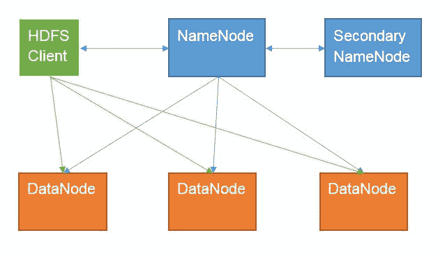
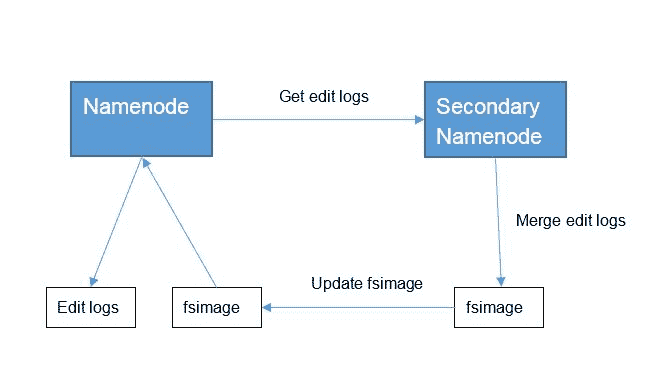
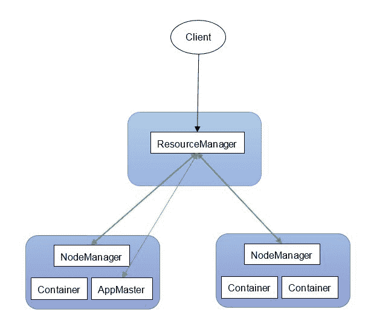
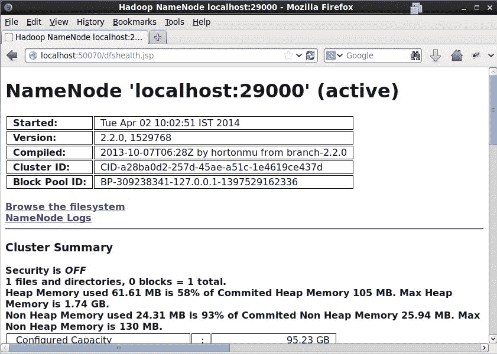
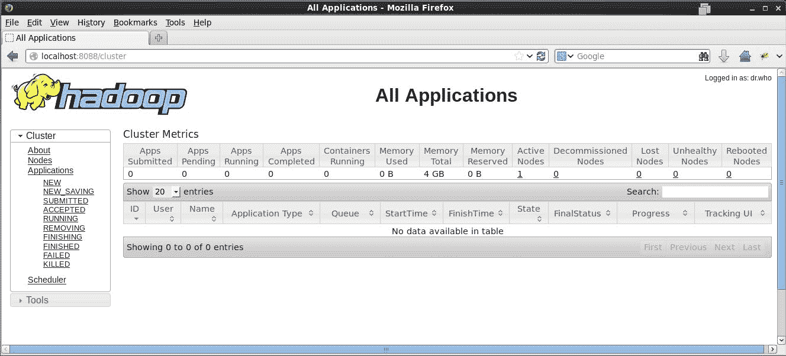
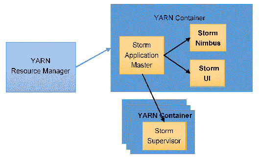
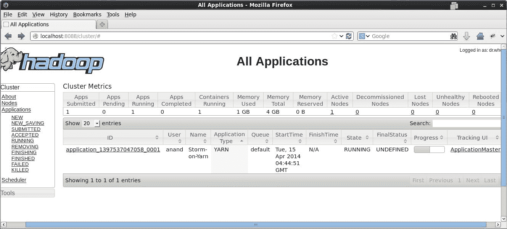
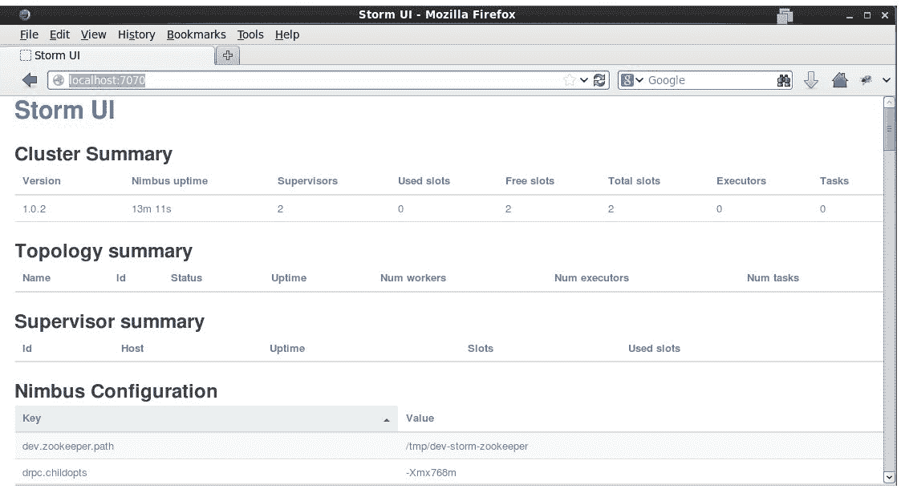
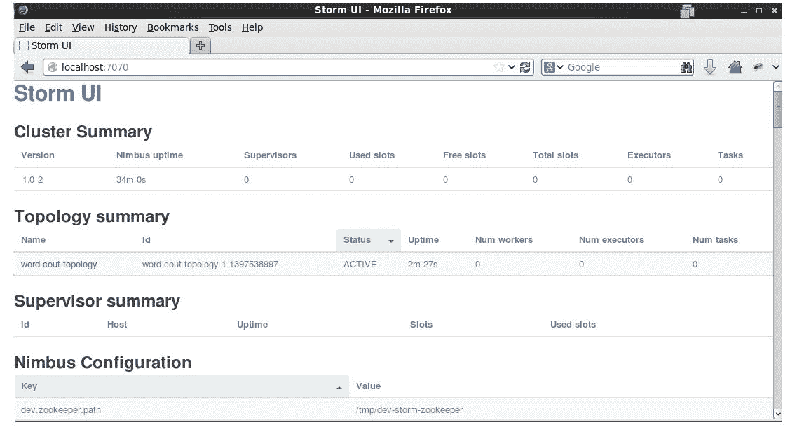

# 第九章：Storm 和 Hadoop 集成

到目前为止，我们已经看到了 Storm 如何用于开发实时流处理应用程序。一般来说，这些实时应用程序很少单独使用；它们更常用于与其他批处理操作结合使用。

开发批处理作业的最常见平台是 Apache Hadoop。在本章中，我们将看到如何使用 Apache Storm 构建的应用程序可以借助 Storm-YARN 框架在现有的 Hadoop 集群上进行部署，以优化资源的使用和管理。我们还将介绍如何通过在 Storm 中创建一个 HDFS bolt 来将处理数据写入 HDFS。

在本章中，我们将涵盖以下主题：

+   Apache Hadoop 及其各个组件概述

+   设置 Hadoop 集群

+   将 Storm 拓扑写入 HDFS 以持久化数据

+   Storm-YARN 概述

+   在 Hadoop 上部署 Storm-YARN

+   在 Storm-YARN 上运行 storm 应用程序。

# Hadoop 简介

Apache Hadoop 是一个用于开发和部署大数据应用程序的开源平台。最初是在 Yahoo!上开发的，基于 Google 发布的 MapReduce 和 Google 文件系统论文。在过去几年里，Hadoop 已成为旗舰大数据平台。

在本节中，我们将讨论 Hadoop 集群的关键组件。

# Hadoop 通用

这是其他 Hadoop 模块基于的基本库。它提供了一个操作系统和文件系统操作的抽象，使得 Hadoop 可以部署在各种平台上。

# Hadoop 分布式文件系统

通常被称为**HDFS**，**Hadoop 分布式文件系统**是一种可扩展的、分布式的、容错的文件系统。HDFS 充当了 Hadoop 生态系统的存储层。它允许在 Hadoop 集群中的各个节点之间共享和存储数据和应用程序代码。

在设计 HDFS 时，做出了以下关键假设：

+   它应该可以部署在一组廉价硬件的集群上。

+   硬件故障是预期的，它应该能够容忍这些故障。

+   它应该可扩展到数千个节点。

+   它应该针对高吞吐量进行优化，即使牺牲延迟。

+   大多数文件都会很大，因此应该针对大文件进行优化。

+   存储是廉价的，因此使用复制来保证可靠性。

+   它应该具有位置感知能力，以便对数据请求的计算可以在实际数据所在的物理节点上执行。这将导致较少的数据移动，从而降低网络拥塞。

一个 HDFS 集群有以下组件。

# Namenode

Namenode 是 HDFS 集群中的主节点。它负责管理文件系统的元数据和操作。它不存储任何用户数据，只存储集群中所有文件的文件系统树。它还跟踪文件的块的物理位置。

由于 namenode 将所有数据保存在 RAM 中，因此应该部署在具有大量 RAM 的机器上。此外，不应该在托管 namenode 的机器上托管其他进程，以便所有资源都专门用于它。

Namenode 是 HDFS 集群中的单点故障。如果 namenode 死机，HDFS 集群上将无法进行任何操作。



图 1：HDFS 集群

# Datanode

Datanode 负责在 HDFS 集群中存储用户数据。在 HDFS 集群中可以有多个 datanode。Datanode 将数据存储在托管 datanode 的系统上的物理磁盘上。不建议将 datanode 数据存储在 RAID 配置的磁盘上，因为 HDFS 通过在 datanode 之间复制数据来实现数据保护。

# HDFS 客户端

HDFS 客户端是一个客户端库，可用于与 HDFS 集群交互。它通常与 namenode 通信，执行元操作，如创建新文件等，而 datanodes 提供实际的数据读写请求。

# 次要名称节点

辅助 namenode 是 HDFS 中命名不当的组件之一。尽管它的名字是这样，但它并不是 namenode 的备用。要理解它的功能，我们需要深入了解 namenode 的工作原理。

Namenode 将文件系统元数据保存在主内存中。为了持久性，它还将这些元数据以镜像文件的形式写入本地磁盘。当 namenode 启动时，它读取这个 fs 镜像快照文件，以重新创建内存数据结构来保存文件系统数据。文件系统的任何更新都会应用到内存数据结构，但不会应用到镜像中。这些更改会被写入称为编辑日志的单独文件中。当 namenode 启动时，它将这些编辑日志合并到镜像中，以便下次重新启动将会很快。在生产环境中，由于 namenode 不经常重新启动，编辑日志可能会变得非常大。这可能导致 namenode 在重新启动时启动时间非常长。

辅助 namenode 负责将 namenode 的编辑日志与镜像合并，以便下次 namenode 启动更快。它从 namenode 获取镜像快照和编辑日志，然后将它们合并，然后将更新后的镜像快照放在 namenode 机器上。这减少了 namenode 在重新启动时需要进行的合并量，从而减少了 namenode 的启动时间。

以下截图展示了辅助 namenode 的工作原理：



图 2：辅助 Namenode 的功能

到目前为止，我们已经看到了 Hadoop 的存储部分。接下来我们将看一下处理组件。

# YARN

YARN 是一个集群资源管理框架，它使用户能够向 Hadoop 集群提交各种作业，并管理可伸缩性、容错性、作业调度等。由于 HDFS 提供了大量数据的存储层，YARN 框架为编写大数据处理应用程序提供了所需的基础设施。

以下是 YARN 集群的主要组件。

# ResourceManager（RM）

ResourceManager 是 YARN 集群中应用程序的入口点。它是集群中负责管理所有资源的主进程。它还负责调度提交到集群的各种作业。这种调度策略是可插拔的，用户可以根据需要支持新类型的应用程序进行自定义。

# NodeManager（NM）

在集群中的每个处理节点上部署了一个 NodeManager 代理。它是与节点级别的 ResourceManager 对应的。它与 ResourceManager 通信，更新节点状态并接收来自 ResourceManager 的任何作业请求。它还负责生命周期管理和向 ResourceManager 报告各种节点指标。

# ApplicationMaster（AM）

一旦 ResourceManager 调度了作业，它就不再跟踪其状态和进度。这使得 ResourceManager 能够支持集群中完全不同类型的应用程序，而不必担心应用程序的内部通信和逻辑。

每当提交一个应用程序时，ResourceManager 都会为该应用程序创建一个新的 ApplicationMaster，然后负责与 ResourceManager 协商资源，并与 NodeMangers 通信以获取资源。NodeManager 以资源容器的形式提供资源，这是资源分配的抽象，您可以告诉需要多少 CPU、内存等。

一旦应用程序在集群中的各个节点上开始运行，ApplicationMaster 就会跟踪各种作业的状态，并在失败时重新运行这些作业。作业完成后，它将释放资源给 ResourceManager。

以下截图展示了 YARN 集群中的各种组件：



图 3：YARN 组件

# Hadoop 安装

现在我们已经看到了 Hadoop 集群的存储和处理部分，让我们开始安装 Hadoop。在本章中，我们将使用 Hadoop 2.2.0。请注意，此版本与 Hadoop 1.X 版本不兼容。

我们将在单节点上设置一个集群。在开始之前，请确保您的系统上已安装以下内容：

+   JDK 1.7

+   `ssh-keygen`

如果您没有`wget`或`ssh-keygen`，请使用以下命令进行安装：

```scala
# yum install openssh-clients  
```

接下来，我们需要在此计算机上设置无密码 SSH，因为这对于 Hadoop 是必需的。

# 设置无密码 SSH

以下是设置无密码 SSH 的步骤：

1.  通过执行以下命令生成您的 SSH 密钥对：

```scala
    $ ssh-keygen -t rsa -P ''
    Generating public/private rsa key pair.
    Enter file in which to save the key (/home/anand/.ssh/id_rsa): 
    Your identification has been saved in /home/anand/.ssh/id_rsa.
    Your public key has been saved in /home/anand/.ssh/id_rsa.pub.
    The key fingerprint is:
    b7:06:2d:76:ed:df:f9:1d:7e:5f:ed:88:93:54:0f:24 anand@localhost.localdomain
    The key's randomart image is:
    +--[ RSA 2048]----+
    |                 |
    |            E .  |
    |             o   |
    |         . .  o  |
    |        S + .. o |
    |       . = o.   o|
    |          o... .o|
    |         .  oo.+*|
    |            ..ooX|
    +-----------------+

```

1.  接下来，我们需要将生成的公钥复制到当前用户的授权密钥列表中。要做到这一点，执行以下命令：

```scala
$ cp ~/.ssh/id_rsa.pub ~/.ssh/authorized_keys  
```

1.  现在，我们可以通过以下命令连接到 localhost 检查无密码 SSH 是否正常工作：

```scala
$ ssh localhost
Last login: Wed Apr  2 09:12:17 2014 from localhost  
```

由于我们能够在本地主机上使用 SSH 而无需密码，我们的设置现在正在工作，我们现在将继续进行 Hadoop 设置。

# 获取 Hadoop 捆绑包并设置环境变量

以下是设置 Hadoop 的步骤：

1.  从 Apache 网站下载 Hadoop 2.2.0 [`hadoop.apache.org/releases.html#Download`](http://hadoop.apache.org/releases.html#Download)。

1.  在我们想要安装 Hadoop 的位置解压存档。我们将称此位置为`$HADOOP_HOME`：

```scala
$ tar xzf hadoop-2.2.0.tar.gz
$ cd hadoop-2.2.0  
```

1.  接下来，我们需要设置环境变量和 Hadoop 的路径，将以下条目添加到您的`~/.bashrc`文件中。确保根据您的系统提供 Java 和 Hadoop 的路径：

```scala
    export JAVA_HOME=/usr/java/jdk1.7.0_45
    export HADOOP_HOME=/home/anand/opt/hadoop-2.2.0
    export HADOOP_COMMON_HOME=/home/anand/opt/hadoop-2.2.0
    export HADOOP_HDFS_HOME=$HADOOP_COMMON_HOME
    export HADOOP_MAPRED_HOME=$HADOOP_COMMON_HOME
    export HADOOP_YARN_HOME=$HADOOP_COMMON_HOME
    export HADOOP_CONF_DIR=$HADOOP_COMMON_HOME/etc/hadoop
    export HADOOP_COMMON_LIB_NATIVE_DIR=$HADOOP_COMMON_HOME/lib/native
    export HADOOP_OPTS="-Djava.library.path=$HADOOP_COMMON_HOME/lib"

    export PATH=$PATH:$JAVA_HOME/bin:$HADOOP_COMMON_HOME/bin:$HADOOP_COMMON_HOME/sbin

```

1.  刷新您的`~/.bashrc`文件：

```scala
$ source ~/.bashrc  
```

1.  现在让我们用以下命令检查路径是否正确配置：

```scala
$ hadoop version
Hadoop 2.2.0
Subversion https://svn.apache.org/repos/asf/hadoop/common -r 1529768
Compiled by hortonmu on 2013-10-07T06:28Z
Compiled with protoc 2.5.0
From source with checksum 79e53ce7994d1628b240f09af91e1af4
This command was run using /home/anand/opt/hadoop-
2.2.0/share/hadoop/common/hadoop-common-2.2.0.jar  
```

在前面的片段中，我们可以看到路径已正确设置。现在我们将在系统上设置 HDFS。

# 设置 HDFS

按照以下步骤设置 HDFS：

1.  创建用于保存 namenode 和 datanode 数据的目录：

```scala
$ mkdir -p ~/mydata/hdfs/namenode
$ mkdir -p ~/mydata/hdfs/datanode  
```

1.  通过在`$HADOOP_CONF_DIR/core-site.xml`文件的`<configuration>`标记中添加以下属性来指定 namenode 端口：

```scala
<property> 
        <name>fs.default.name</name> 
        <value>hdfs://localhost:19000</value> 
   <!-- The default port for HDFS is 9000, but we are using 19000 Storm-Yarn uses port 9000 for its application master --> 
</property> 
```

1.  通过在`$HADOOP_CONF_DIR/hdfs-site.xml`文件的`<configuration>`标记中添加以下属性来指定 namenode 和 datanode 目录：

```scala
<property> 
        <name>dfs.replication</name> 
        <value>1</value> 
   <!-- Since we have only one node, we have replication factor=1 --> 
</property> 
<property> 
        <name>dfs.namenode.name.dir</name> 
        <value>file:/home/anand/hadoop-data/hdfs/namenode</value> 
   <!-- specify absolute path of the namenode directory --> 
</property> 
<property> 
        <name>dfs.datanode.data.dir</name> 
        <value>file:/home/anand/hadoop-data/hdfs/datanode</value> 
   <!-- specify absolute path of the datanode directory --> 
</property> 
```

1.  现在我们将格式化 namenode。这是一个一次性的过程，只需要在设置 HDFS 时执行：

```scala
    $ hdfs namenode -format
    14/04/02 09:03:06 INFO namenode.NameNode: STARTUP_MSG: 
    /*********************************************************
    STARTUP_MSG: Starting NameNode
    STARTUP_MSG:   host = localhost.localdomain/127.0.0.1
    STARTUP_MSG:   args = [-format]
    STARTUP_MSG:   version = 2.2.0
    ... ...
    14/04/02 09:03:08 INFO namenode.NameNode: SHUTDOWN_MSG: 
    /*********************************************************
    SHUTDOWN_MSG: Shutting down NameNode at localhost.localdomain/127.0.0.1
    ********************************************************/

```

1.  现在，我们已经完成了配置，我们将启动 HDFS：

```scala
    $ start-dfs.sh 
    14/04/02 09:27:13 WARN util.NativeCodeLoader: Unable to load native-hadoop library for your platform... using builtin-java classes where applicable
    Starting namenodes on [localhost]
    localhost: starting namenode, logging to /home/anand/opt/hadoop-2.2.0/logs/hadoop-anand-namenode-localhost.localdomain.out
    localhost: starting datanode, logging to /home/anand/opt/hadoop-2.2.0/logs/hadoop-anand-datanode-localhost.localdomain.out
    Starting secondary namenodes [0.0.0.0]
    0.0.0.0: starting secondarynamenode, logging to /home/anand/opt/hadoop-2.2.0/logs/hadoop-anand-secondarynamenode-localhost.localdomain.out
    14/04/02 09:27:32 WARN util.NativeCodeLoader: Unable to load native-hadoop library for your platform... using builtin-java classes where applicable

```

1.  现在，执行`jps`命令查看所有进程是否正常运行：

```scala
$ jps
50275 NameNode
50547 SecondaryNameNode
50394 DataNode
51091 Jps  
```

在这里，我们可以看到所有预期的进程都在运行。

1.  现在，您可以通过在浏览器中打开`http://localhost:50070`来检查 HDFS 的状态。您应该看到类似以下的内容：



图 4：Namenode web UI

1.  您可以使用`hdfs dfs`命令与 HDFS 进行交互。在控制台上运行`hdfs dfs`以获取所有选项，或者参考[`hadoop.apache.org/docs/r2.2.0/hadoop-project-dist/hadoop-common/FileSystemShell.html`](http://hadoop.apache.org/docs/r2.2.0/hadoop-project-dist/hadoop-common/FileSystemShell.html)上的文档。

现在 HDFS 已部署，我们将接下来设置 YARN。

# 设置 YARN

以下是设置 YARN 的步骤：

1.  从模板`mapred-site.xml.template`创建`mapred-site.xml`文件：

```scala
$ cp $HADOOP_CONF_DIR/mapred-site.xml.template $HADOOP_CONF_DIR/mapred-
site.xml  
```

1.  通过在`$HADOOP_CONF_DIR/mapred-site.xml`文件的`<configuration>`标记中添加以下属性来指定我们正在使用 YARN 框架：

```scala
<property> 
        <name>mapreduce.framework.name</name> 
        <value>yarn</value> 
</property> 
```

1.  在`$HADOOP_CONF_DIR/yarn-site.xml`文件中配置以下属性：

```scala
<property> 
        <name>yarn.nodemanager.aux-services</name> 
        <value>mapreduce_shuffle</value> 
</property> 

<property> 
        <name>yarn.scheduler.minimum-allocation-mb</name> 
        <value>1024</value> 
</property> 

<property> 
        <name>yarn.nodemanager.resource.memory-mb</name> 
        <value>4096</value> 
</property> 

<property> 
        <name>yarn.nodemanager.aux-services.mapreduce.shuffle.class</name> 
   <value>org.apache.hadoop.mapred.ShuffleHandler</value> 
</property> 
<property> 
        <name>yarn.nodemanager.vmem-pmem-ratio</name> 
        <value>8</value> 
</property> 
```

1.  使用以下命令启动 YARN 进程：

```scala
$ start-yarn.sh 
starting yarn daemons
starting resourcemanager, logging to /home/anand/opt/hadoop-2.2.0/logs/yarn-anand-resourcemanager-localhost.localdomain.out
localhost: starting nodemanager, logging to /home/anand/opt/hadoop-2.2.0/logs/yarn-anand-nodemanager-localhost.localdomain.out  
```

1.  现在，执行`jps`命令查看所有进程是否正常运行：

```scala
$ jps
50275 NameNode
50547 SecondaryNameNode
50394 DataNode
51091 Jps
50813 NodeManager
50716 ResourceManager  
```

在这里，我们可以看到所有预期的进程都在运行。

1.  现在，您可以通过在浏览器中打开`http://localhost:8088/cluster`来检查 YARN 的状态，使用 ResourceManager web UI。您应该会看到类似以下内容的内容：



图 5：ResourceManager web UI

1.  您可以使用`yarn`命令与 YARN 进行交互。在控制台上运行`yarn`或参考[`hadoop.apache.org/docs/r2.2.0/hadoop-yarn/hadoop-yarn-site/YarnCommands.html`](http://hadoop.apache.org/docs/r2.2.0/hadoop-yarn/hadoop-yarn-site/YarnCommands.html)获取所有选项。要获取当前在 YARN 上运行的所有应用程序，请运行以下命令：

```scala
    $ yarn application -list
    14/04/02 11:41:42 WARN util.NativeCodeLoader: Unable to load native-hadoop library for your platform... using builtin-java classes where applicable
    14/04/02 11:41:42 INFO client.RMProxy: Connecting to ResourceManager at /0.0.0.0:8032
    Total number of applications (application-types: [] and states: [SUBMITTED, ACCEPTED, RUNNING]):0
                    Application-Id          Application-Name        Application-Type          User       Queue               State             Final-State             Progress                          Tracking-URL

```

通过这样，我们已经完成了在单节点上部署 Hadoop 集群。接下来我们将看到如何在此集群上运行 Storm 拓扑。

# 将 Storm 拓扑写入 HDFS 以持久化数据

在本节中，我们将介绍如何编写 HDFS bolt 以将数据持久化到 HDFS 中。在本节中，我们将重点介绍以下几点：

+   从 Kafka 消费数据

+   将数据存储到 HDFS 的逻辑

+   在预定义的时间或大小后将文件旋转到 HDFS

执行以下步骤来创建将数据存储到 HDFS 的拓扑：

1.  创建一个新的 maven 项目，groupId 为`com.stormadvance`，artifactId 为`storm-hadoop`。

1.  在`pom.xml`文件中添加以下依赖项。我们在`pom.xml`中添加 Kafka Maven 依赖项以支持 Kafka 消费者。请参考前一章节，在那里我们将从 Kafka 消费数据并存储在 HDFS 中：

```scala
         <dependency> 
               <groupId>org.codehaus.jackson</groupId> 
               <artifactId>jackson-mapper-asl</artifactId> 
               <version>1.9.13</version> 
         </dependency> 

         <dependency> 
               <groupId>org.apache.hadoop</groupId> 
               <artifactId>hadoop-client</artifactId> 
               <version>2.2.0</version> 
               <exclusions> 
                     <exclusion> 
                           <groupId>org.slf4j</groupId> 
                           <artifactId>slf4j-log4j12</artifactId> 
                     </exclusion> 
               </exclusions> 
         </dependency> 
         <dependency> 
               <groupId>org.apache.hadoop</groupId> 
               <artifactId>hadoop-hdfs</artifactId> 
               <version>2.2.0</version> 
               <exclusions> 
                     <exclusion> 
                           <groupId>org.slf4j</groupId> 
                           <artifactId>slf4j-log4j12</artifactId> 
                     </exclusion> 
               </exclusions> 
         </dependency> 
         <!-- Dependency for Storm-Kafka spout --> 
         <dependency> 
               <groupId>org.apache.storm</groupId> 
               <artifactId>storm-kafka</artifactId> 
               <version>1.0.2</version> 
               <exclusions> 
                     <exclusion> 
                           <groupId>org.apache.kafka</groupId> 
                           <artifactId>kafka-clients</artifactId> 
                     </exclusion> 
               </exclusions> 
         </dependency> 

         <dependency> 
               <groupId>org.apache.kafka</groupId> 
               <artifactId>kafka_2.10</artifactId> 
               <version>0.9.0.1</version> 
               <exclusions> 
                     <exclusion> 
                           <groupId>com.sun.jdmk</groupId> 
                           <artifactId>jmxtools</artifactId> 
                     </exclusion> 
                     <exclusion> 
                           <groupId>com.sun.jmx</groupId> 
                           <artifactId>jmxri</artifactId> 
                     </exclusion> 
               </exclusions> 
         </dependency> 

         <dependency> 
               <groupId>org.apache.storm</groupId> 
               <artifactId>storm-core</artifactId> 
               <version>1.0.2</version> 
               <scope>provided</scope> 
         </dependency> 
   </dependencies> 
   <repositories> 
         <repository> 
               <id>clojars.org</id> 
               <url>http://clojars.org/repo</url> 
         </repository> 
   </repositories> 
```

1.  编写一个 Storm Hadoop 拓扑来消费 HDFS 中的数据并将其存储在 HDFS 中。以下是`com.stormadvance.storm_hadoop.topology.StormHDFSTopology`类的逐行描述：

1.  使用以下代码行从 Kafka 消费数据：

```scala
         // zookeeper hosts for the Kafka cluster 
         BrokerHosts zkHosts = new ZkHosts("localhost:2181"); 

         // Create the KafkaReadSpout configuartion 
         // Second argument is the topic name 
         // Third argument is the zookeeper root for Kafka 
         // Fourth argument is consumer group id 
         SpoutConfig kafkaConfig = new SpoutConfig(zkHosts, "dataTopic", "", 
                     "id7"); 

         // Specify that the kafka messages are String 
         kafkaConfig.scheme = new SchemeAsMultiScheme(new StringScheme()); 

         // We want to consume all the first messages in the topic everytime 
         // we run the topology to help in debugging. In production, this 
         // property should be false 
         kafkaConfig.startOffsetTime = kafka.api.OffsetRequest.EarliestTime(); 

         // Now we create the topology 
         TopologyBuilder builder = new TopologyBuilder(); 

         // set the kafka spout class 
         builder.setSpout("KafkaReadSpout", new KafkaSpout(kafkaConfig), 1); 
```

1.  使用以下代码行定义 HDFS Namenode 的详细信息和 HDFS 数据目录的名称，以将数据存储到 HDFS 中，在每存储 5MB 数据块后创建一个新文件，并在每存储 1,000 条记录后将最新数据同步到文件中：

```scala
         // use "|" instead of "," for field delimiter 
         RecordFormat format = new DelimitedRecordFormat() 
                     .withFieldDelimiter(","); 

         // sync the filesystem after every 1k tuples 
         SyncPolicy syncPolicy = new CountSyncPolicy(1000); 

         // rotate files when they reach 5MB 
         FileRotationPolicy rotationPolicy = new FileSizeRotationPolicy(5.0f, 
                     Units.MB); 

         FileNameFormat fileNameFormatHDFS = new DefaultFileNameFormat() 
                     .withPath("/hdfs-bolt-output/"); 

         HdfsBolt hdfsBolt2 = new HdfsBolt().withFsUrl("hdfs://127.0.0.1:8020") 
                     .withFileNameFormat(fileNameFormatHDFS) 
                     .withRecordFormat(format).withRotationPolicy(rotationPolicy) 
                     .withSyncPolicy(syncPolicy); 
```

1.  使用以下代码将 Spout 连接到 HDFS bolt：

```scala
HdfsBolt hdfsBolt2 = new HdfsBolt().withFsUrl("hdfs://127.0.0.1:8020") 
                     .withFileNameFormat(fileNameFormatHDFS) 
                     .withRecordFormat(format).withRotationPolicy(rotationPolicy) 
                     .withSyncPolicy(syncPolicy); 
```

# 将 Storm 与 Hadoop 集成

开发和运行大数据应用程序的组织已经部署了 Hadoop 集群的可能性非常高。此外，他们也很可能已经部署了实时流处理应用程序，以配合在 Hadoop 上运行的批处理应用程序。

如果可以利用已部署的 YARN 集群来运行 Storm 拓扑，那将是很好的。这将通过只管理一个集群而不是两个来减少维护的操作成本。

Storm-YARN 是 Yahoo!开发的一个项目，它可以在 YARN 集群上部署 Storm 拓扑。它可以在 YARN 管理的节点上部署 Storm 进程。

以下图表说明了 Storm 进程如何部署在 YARN 上：



图 6：YARN 上的 Storm 进程

在接下来的部分，我们将看到如何设置 Storm-YARN。

# 设置 Storm-YARN

由于 Storm-YARN 仍处于 alpha 阶段，我们将继续使用`git`存储库的基础主分支。确保您的系统上已安装了`git`。如果没有，请运行以下命令：

```scala
# yum install git-core  
```

还要确保您的系统上已安装了 Apache Zookeeper 和 Apache Maven。有关其设置说明，请参考前面的章节。

部署 Storm-YARN 的步骤如下：

1.  使用以下命令克隆`storm-yarn`存储库：

```scala
$ cd ~/opt
$ git clone https://github.com/yahoo/storm-yarn.git
$ cd storm-yarn  
```

1.  通过运行以下`mvn`命令构建`storm-yarn`：

```scala
    $ mvn package
    [INFO] Scanning for projects...
    [INFO] 
    [INFO] ----------------------------------------------------
    [INFO] Building storm-yarn 1.0-alpha
    [INFO] ----------------------------------------------------
    ...
    [INFO] ----------------------------------------------------
    [INFO] BUILD SUCCESS
    [INFO] ----------------------------------------------------
    [INFO] Total time: 32.049s
    [INFO] Finished at: Fri Apr 04 09:45:06 IST 2014
    [INFO] Final Memory: 14M/152M
    [INFO] ----------------------------------------------------

```

1.  使用以下命令将`storm.zip`文件从`storm-yarn/lib`复制到 HDFS：

```scala
$ hdfs dfs -mkdir -p  /lib/storm/1.0.2-wip21
$ hdfs dfs -put lib/storm.zip /lib/storm/1.0.2-wip21/storm.zip  
```

确切的版本在您的情况下可能与`1.0.2-wip21`不同。

1.  创建一个目录来保存我们的 Storm 配置：

```scala
$ mkdir -p ~/storm-data
$ cp lib/storm.zip ~/storm-data/
$ cd ~/storm-data/
$ unzip storm.zip  
```

1.  在`~/storm-data/storm-1.0.2-wip21/conf/storm.yaml`文件中添加以下配置：

```scala
storm.zookeeper.servers: 
     - "localhost" 

nimbus.host: "localhost" 

master.initial-num-supervisors: 2 
master.container.size-mb: 128 
```

如有需要，根据您的设置更改值。

1.  通过将以下内容添加到`~/.bashrc`文件中，将`storm-yarn/bin`文件夹添加到您的路径中：

```scala
export PATH=$PATH:/home/anand/storm-data/storm-1.0.2-wip21/bin:/home/anand/opt/storm-yarn/bin 
```

1.  刷新`~/.bashrc`：

```scala
$ source ~/.bashrc  
```

1.  确保 Zookeeper 在您的系统上运行。如果没有，请运行以下命令启动 ZooKeeper：

```scala
$ ~/opt/zookeeper-3.4.5/bin/zkServer.sh start  
```

1.  使用以下命令启动`storm-yarn`：

```scala
    $ storm-yarn launch ~/storm-data/storm-1.0.2-wip21/conf/storm.yaml 
    14/04/15 10:14:49 INFO client.RMProxy: Connecting to ResourceManager at /0.0.0.0:8032
    14/04/15 10:14:49 INFO yarn.StormOnYarn: Copy App Master jar from local filesystem and add to local environment
    ... ... 
    14/04/15 10:14:51 INFO impl.YarnClientImpl: Submitted application application_1397537047058_0001 to ResourceManager at /0.0.0.0:8032
    application_1397537047058_0001

```

Storm-YARN 应用程序已经提交，应用程序 ID 为`application_1397537047058_0001`。

1.  我们可以使用以下`yarn`命令检索应用程序的状态：

```scala
    $ yarn application -list
    14/04/15 10:23:13 INFO client.RMProxy: Connecting to ResourceManager at /0.0.0.0:8032
    Total number of applications (application-types: [] and states: [SUBMITTED, ACCEPTED, RUNNING]):1
                    Application-Id          Application-Name        Application-Type          User       Queue               State             Final-State             Progress                          Tracking-URL
    application_1397537047058_0001             Storm-on-Yarn                    YARN         anand    default             RUNNING               UNDEFINED                  50%                                   N/A

```

1.  我们还可以在 ResourceManager web UI 上看到`storm-yarn`运行在`http://localhost:8088/cluster/`。您应该能够看到类似以下内容：



图 7：ResourceManager web UI 上的 Storm-YARN

您可以通过单击 UI 上的各种链接来探索各种公开的指标。

1.  Nimbus 现在也应该在运行中，您应该能够通过 Nimbus web UI 看到它，网址为`http://localhost:7070/`：



图 8：Nimbus web UI 在 YARN 上运行

1.  现在我们需要获取将在 YARN 上的 Storm 集群上部署拓扑时使用的 Storm 配置。为此，请执行以下命令：

```scala
    $ mkdir ~/.storm
    $ storm-yarn getStormConfig --appId application_1397537047058_0001 --output ~/.storm/storm.yaml
    14/04/15 10:32:01 INFO client.RMProxy: Connecting to ResourceManager at /0.0.0.0:8032
    14/04/15 10:32:02 INFO yarn.StormOnYarn: application report for application_1397537047058_0001 :localhost.localdomain:9000
    14/04/15 10:32:02 INFO yarn.StormOnYarn: Attaching to localhost.localdomain:9000 to talk to app master application_1397537047058_0001
    14/04/15 10:32:02 INFO yarn.StormMasterCommand: storm.yaml downloaded into /home/anand/.storm/storm.yaml  
```

确保将正确的应用程序 ID（在第 9 步中检索）传递给`-appId`参数。

现在我们已经成功部署了 Storm-YARN，我们将看到如何在这个 storm 集群上运行我们的拓扑。

# 在 Storm-YARN 上运行 Storm-Starter 拓扑

在本节中，我们将看到如何在`storm-yarn`上部署 Storm-Starter 拓扑。Storm-Starter 是一组随 Storm 一起提供的示例拓扑。

按照以下步骤在 Storm-YARN 上运行拓扑：

1.  克隆`storm-starter`项目：

```scala
$ git clone https://github.com/nathanmarz/storm-starter
$ cd storm-starter  
```

1.  使用以下`mvn`命令打包拓扑：

```scala
$ mvn package -DskipTests  
```

1.  使用以下命令在`storm-yarn`上部署拓扑：

```scala
    $ storm jar target/storm-starter-0.0.1-SNAPSHOT.jar storm.starter.WordCountTopology word-cout-topology
    545  [main] INFO  backtype.storm.StormSubmitter - Jar not uploaded to master yet. Submitting jar...
    558  [main] INFO  backtype.storm.StormSubmitter - Uploading topology jar target/storm-starter-0.0.1-SNAPSHOT.jar to assigned location: storm-local/nimbus/inbox/stormjar-9ab704ff-29f3-4b9d-b0ac-e9e41d4399dd.jar
    609  [main] INFO  backtype.storm.StormSubmitter - Successfully uploaded topology jar to assigned location: storm-local/nimbus/inbox/stormjar-9ab704ff-29f3-4b9d-b0ac-e9e41d4399dd.jar
    609  [main] INFO  backtype.storm.StormSubmitter - Submitting topology word-cout-topology in distributed mode with conf {"topology.workers":3,"topology.debug":true}
    937  [main] INFO  backtype.storm.StormSubmitter - Finished submitting topology: word-cout-topology

```

1.  现在我们可以在 Nimbus web UI 上看到部署的拓扑，网址为`http://localhost:7070/`：



图 9：Nimbus web UI 显示了 YARN 上的单词计数拓扑

1.  要查看如何与在`storm-yarn`上运行的拓扑进行交互，请运行以下命令：

```scala
$ storm-yarn  
```

1.  它将列出与各种 Storm 进程交互和启动新监督者的所有选项。

因此，在本节中，我们构建了一个 Storm-started 拓扑，并在`storm-yarn`上运行它。

# 摘要

在本章中，我们介绍了 Apache Hadoop 以及 HDFS、YARN 等各种组件，这些组件是 Hadoop 集群的一部分。我们还看到了 HDFS 和 YARN 集群的子组件以及它们之间的交互。然后我们演示了如何设置单节点 Hadoop 集群。

我们还介绍了 Storm-YARN，这是本章的重点。Storm-YARN 使您能够在 Hadoop 集群上运行 Storm 拓扑。从可管理性和运维角度来看，这对我们很有帮助。最后，我们看到了如何在 YARN 上运行的 Storm 上部署拓扑。

在下一章中，我们将看到 Storm 如何与其他大数据技术（如 HBase、Redis 等）集成。
