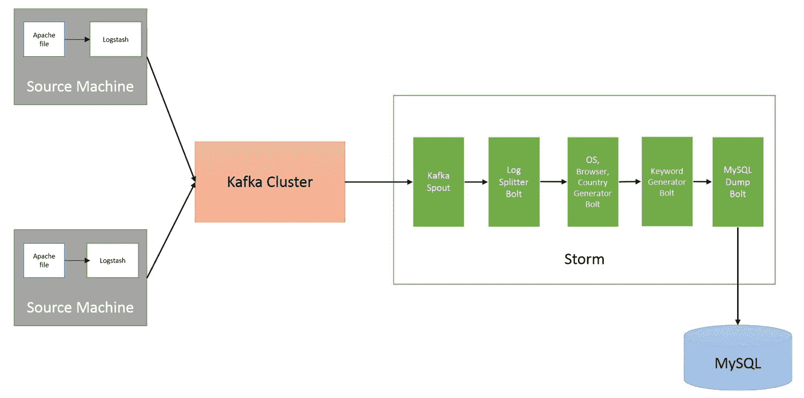

# 第十一章：使用 Storm 进行 Apache 日志处理

在上一章中，我们介绍了如何将 Storm 与 Redis、HBase、Esper 和 Elasticsearch 集成。

在本章中，我们将介绍 Storm 最流行的用例，即日志处理。

本章涵盖以下主要部分：

+   Apache 日志处理元素

+   安装 Logstash

+   配置 Logstash 以将 Apache 日志生成到 Kafka

+   拆分 Apache 日志文件

+   计算国家名称、操作系统类型和浏览器类型

+   识别网站的搜索关键词

+   持久化处理数据

+   Kafka spout 和定义拓扑

+   部署拓扑

+   将数据存储到 Elasticsearch 并生成报告

# Apache 日志处理元素

日志处理正在成为每个组织的必需品，因为他们需要从日志数据中收集业务信息。在本章中，我们基本上是在讨论如何使用 Logstash、Kafka、Storm 和 Elasticsearch 来处理 Apache 日志数据，以收集业务信息。

以下图示了我们在本章中开发的所有元素：



图 11.1：日志处理拓扑

# 使用 Logstash 在 Kafka 中生成 Apache 日志

如第八章中所解释的，*Storm 和 Kafka 的集成*，Kafka 是一个分布式消息队列，可以与 Storm 很好地集成。在本节中，我们将向您展示如何使用 Logstash 来读取 Apache 日志文件并将其发布到 Kafka 集群中。我们假设您已经运行了 Kafka 集群。Kafka 集群的安装步骤在第八章中概述。

# 安装 Logstash

在继续安装 Logstash 之前，我们将回答以下问题：什么是 Logstash？为什么我们要使用 Logstash？

# 什么是 Logstash？

Logstash 是一个用于收集、过滤/解析和发送数据以供将来使用的工具。收集、解析和发送分为三个部分，称为输入、过滤器和输出：

+   **input**部分用于从外部来源读取数据。常见的输入来源是文件、TCP 端口、Kafka 等。

+   **filter**部分用于解析数据。

+   **output**部分用于将数据发送到某些外部来源。常见的外部来源是 Kafka、Elasticsearch、TCP 等。

# 为什么我们要使用 Logstash？

在 Storm 开始实际处理之前，我们需要实时读取日志数据并将其存储到 Kafka 中。我们使用 Logstash 是因为它非常成熟地读取日志文件并将日志数据推送到 Kafka 中。

# 安装 Logstash

在安装 Logstash 之前，我们应该在 Linux 服务器上安装 JDK 1.8，因为我们将使用 Logstash 5.4.1，而 JDK 1.8 是此版本的最低要求。以下是安装 Logstash 的步骤：

1.  从[`artifacts.elastic.co/downloads/logstash/logstash-5.4.1.zip`](https://artifacts.elastic.co/downloads/logstash/logstash-5.4.1.zip)下载 Logstash 5.4.1。

1.  将设置复制到所有你想要发布到 Kafka 的 Apache 日志的机器上。

1.  通过运行以下命令提取设置：

```scala
> unzip logstash-5.4.1.zip
```

# Logstash 的配置

现在，我们将定义 Logstash 配置来消耗 Apache 日志并将其存储到 Kafka 中。

创建一个`logstash.conf`文件并添加以下行：

```scala
input {
  file {
    path => "PATH_TO_APACHE_LOG"
    start_position => "beginning"
  }
}
output {
  kafka {
    topic_id => "TOPIC_NAME"
    bootstrap_servers => "KAFKA_IP:KAFKA_PORT"
  }
}
```

我们应该更改前述配置中的以下参数：

+   `TOPIC_NAME`：替换为您要用于存储 Apache 日志的 Kafka 主题

+   `KAFKA_IP`和`KAFKA_PORT`：指定所有 Kafka 节点的逗号分隔列表

+   `PATH_TO_APACHE_LOG`：Logstash 机器上 Apache 日志文件的位置

转到 Logstash 主目录并执行以下命令以开始读取日志并发布到 Kafka：

```scala
$ bin/logstash agent -f logstash.conf
```

现在，实时日志数据正在进入 Kafka 主题。在下一节中，我们将编写 Storm 拓扑来消费日志数据，处理并将处理数据存储到数据库中。

# 为什么在 Logstash 和 Storm 之间使用 Kafka？

众所周知，Storm 提供了可靠的消息处理，这意味着每条消息进入 Storm 拓扑都将至少被处理一次。在 Storm 中，数据丢失只可能发生在 spout 端，如果 Storm spout 的处理能力小于 Logstash 的生产能力。因此，为了避免数据在 Storm spout 端丢失，我们通常会将数据发布到消息队列（Kafka），Storm spout 将使用消息队列作为数据源。

# 分割 Apache 日志行

现在，我们正在创建一个新的拓扑，它将使用`KafkaSpout` spout 从 Kafka 中读取数据。在本节中，我们将编写一个`ApacheLogSplitter` bolt，它具有从 Apache 日志行中提取 IP、状态码、引用来源、发送的字节数等信息的逻辑。由于这是一个新的拓扑，我们必须首先创建新项目。

1.  创建一个新的 Maven 项目，`groupId`为`com.stormadvance`，`artifactId`为`logprocessing`。

1.  在`pom.xml`文件中添加以下依赖项：

```scala
       <dependency> 
             <groupId>org.apache.storm</groupId> 
             <artifactId>storm-core</artifactId> 
             <version>1.0.2</version> 
             <scope>provided</scope> 
       </dependency> 

       <!-- Utilities --> 
       <dependency> 
             <groupId>commons-collections</groupId> 
             <artifactId>commons-collections</artifactId> 
             <version>3.2.1</version> 
       </dependency> 
       <dependency> 
             <groupId>com.google.guava</groupId> 
             <artifactId>guava</artifactId> 
             <version>15.0</version> 
       </dependency> 
```

1.  我们将在`com.stormadvance.logprocessing`包中创建`ApacheLogSplitter`类。这个类包含了从 Apache 日志行中提取不同元素（如 IP、引用来源、用户代理等）的逻辑。

```scala
/** 
 * This class contains logic to Parse an Apache log file with Regular 
 * Expressions 
 */ 
public class ApacheLogSplitter { 

 public Map<String,Object> logSplitter(String apacheLog) { 

       String logEntryLine = apacheLog; 
       // Regex pattern to split fetch the different properties from log lines. 
       String logEntryPattern = "^([\\d.]+) (\\S+) (\\S+) \\[([\\w-:/]+\\s[+\\-]\\d{4})\\] \"(.+?)\" (\\d{3}) (\\d+) \"([^\"]+)\" \"([^\"]+)\""; 

       Pattern p = Pattern.compile(logEntryPattern); 
       Matcher matcher = p.matcher(logEntryLine); 
       Map<String,Object> logMap = new HashMap<String, Object>(); 
       if (!matcher.matches() || 9 != matcher.groupCount()) { 
             System.err.println("Bad log entry (or problem with RE?):"); 
             System.err.println(logEntryLine); 
             return logMap; 
       } 
       // set the ip, dateTime, request, etc into map. 
       logMap.put("ip", matcher.group(1)); 
       logMap.put("dateTime", matcher.group(4)); 
       logMap.put("request", matcher.group(5)); 
       logMap.put("response", matcher.group(6)); 
       logMap.put("bytesSent", matcher.group(7)); 
       logMap.put("referrer", matcher.group(8)); 
       logMap.put("useragent", matcher.group(9)); 
       return logMap; 
 } 
```

1.  `logSplitter(String apacheLog)`方法的输入是：

```scala
98.83.179.51 - - [18/May/2011:19:35:08 -0700] \"GET /css/main.css HTTP/1.1\" 200 1837 \"http://www.safesand.com/information.htm\" \"Mozilla/5.0 (Windows NT 6.0; WOW64; rv:2.0.1) Gecko/20100101 Firefox/4.0.1\" 
```

1.  `logSplitter(String apacheLog)`方法的输出是：

```scala
{response=200, referrer=http://www.safesand.com/information.htm, bytesSent=1837, useragent=Mozilla/5.0 (Windows NT 6.0; WOW64; rv:2.0.1) Gecko/20100101 Firefox/4.0.1, dateTime=18/May/2011:19:35:08 -0700, request=GET /css/main.css HTTP/1.1, ip=98.83.179.51}  
```

1.  现在我们将在`com.stormadvance.logprocessing`包中创建`ApacheLogSplitterBolt`类。`ApacheLogSplitterBolt`扩展了`org.apache.storm.topology.base.BaseBasicBolt`类，并将`ApacheLogSplitter`类生成的字段集传递给拓扑中的下一个 bolt。以下是`ApacheLogSplitterBolt`类的源代码：

```scala
/** 
 *  
 * This class call the ApacheLogSplitter class and pass the set of fields (ip, 
 * referrer, user-agent, etc) to next bolt in Topology. 
 */ 

public class ApacheLogSplitterBolt extends BaseBasicBolt { 

 private static final long serialVersionUID = 1L; 
 // Create the instance of ApacheLogSplitter class. 
 private static final ApacheLogSplitter apacheLogSplitter = new ApacheLogSplitter(); 
 private static final List<String> LOG_ELEMENTS = new ArrayList<String>(); 
 static { 
       LOG_ELEMENTS.add("ip"); 
       LOG_ELEMENTS.add("dateTime"); 
       LOG_ELEMENTS.add("request"); 
       LOG_ELEMENTS.add("response"); 
       LOG_ELEMENTS.add("bytesSent"); 
       LOG_ELEMENTS.add("referrer"); 
       LOG_ELEMENTS.add("useragent"); 
 } 

 public void execute(Tuple input, BasicOutputCollector collector) { 
       // Get the Apache log from the tuple 
       String log = input.getString(0); 

       if (StringUtils.isBlank(log)) { 
             // ignore blank lines 
             return; 
       } 
       // call the logSplitter(String apachelog) method of ApacheLogSplitter 
       // class. 
       Map<String, Object> logMap = apacheLogSplitter.logSplitter(log); 
       List<Object> logdata = new ArrayList<Object>(); 
       for (String element : LOG_ELEMENTS) { 
             logdata.add(logMap.get(element)); 
       } 
       // emits set of fields (ip, referrer, user-agent, bytesSent, etc) 
       collector.emit(logdata); 

 } 

 public void declareOutputFields(OutputFieldsDeclarer declarer) { 
       // specify the name of output fields. 
       declarer.declare(new Fields("ip", "dateTime", "request", "response", 
                   "bytesSent", "referrer", "useragent")); 
 } 
} 

```

`ApacheLogSplitterBolt`类的输出包含七个字段。这些字段是`ip`，`dateTime`，`request`，`response`，`bytesSent`，`referrer`和`useragent`。

# 从日志文件中识别国家、操作系统类型和浏览器类型

本节解释了如何通过分析 Apache 日志行来计算用户国家名称、操作系统类型和浏览器类型。通过识别国家名称，我们可以轻松地确定我们网站受到更多关注的地点以及我们受到较少关注的地点。让我们执行以下步骤来计算 Apache 日志文件中的国家名称、操作系统和浏览器：

1.  我们使用开源的`geoip`库来从 IP 地址计算国家名称。在`pom.xml`文件中添加以下依赖项：

```scala
       <dependency> 
             <groupId>org.geomind</groupId> 
             <artifactId>geoip</artifactId> 
             <version>1.2.8</version> 
       </dependency> 
```

1.  在`pom.xml`文件中添加以下存储库：

```scala
        <repository> 
             <id>geoip</id> 
             <url>http://snambi.github.com/maven/</url> 
       </repository> 
```

1.  我们将在`com.stormadvance.logprocessing`包中创建`IpToCountryConverter`类。这个类包含了带有`GeoLiteCity.dat`文件位置作为输入的参数化构造函数。你可以在`logprocessing`项目的资源文件夹中找到`GeoLiteCity.dat`文件。`GeoLiteCity.dat`文件的位置在所有 Storm 节点中必须相同。`GeoLiteCity.dat`文件是我们用来从 IP 地址计算国家名称的数据库。以下是`IpToCountryConverter`类的源代码：

```scala
/** 
 * This class contains logic to calculate the country name from IP address 
 *  
 */ 
public class IpToCountryConverter { 

 private static LookupService cl = null; 

 /** 
  * An parameterised constructor which would take the location of 
  * GeoLiteCity.dat file as input. 
  *  
  * @param pathTOGeoLiteCityFile 
  */ 
 public IpToCountryConverter(String pathTOGeoLiteCityFile) { 
       try { 
             cl = new LookupService("pathTOGeoLiteCityFile", 
                         LookupService.GEOIP_MEMORY_CACHE); 
       } catch (Exception exception) { 
             throw new RuntimeException( 
                         "Error occurs while initializing IpToCountryConverter class : "); 
       } 
 } 

 /** 
  * This method takes ip address an input and convert it into country name. 
  *  
  * @param ip 
  * @return 
  */ 
 public String ipToCountry (String ip) { 
       Location location = cl.getLocation(ip); 
       if (location == null) { 
             return "NA"; 
       } 
       if (location.countryName == null) { 
             return "NA"; 
       } 
       return location.countryName; 
 } 
} 
```

1.  现在从[`code.google.com/p/ndt/source/browse/branches/applet_91/Applet/src/main/java/edu/internet2/ndt/UserAgentTools.java?r=856`](https://code.google.com/p/ndt/source/browse/branches/applet_91/Applet/src/main/java/edu/internet2/ndt/UserAgentTools.java?r=856)下载`UserAgentTools`类。这个类包含了从用户代理中计算操作系统和浏览器类型的逻辑。你也可以在`logprocessing`项目中找到`UserAgentTools`类。

1.  让我们在`com.stormadvance.logprocessing`包中编写`UserInformationGetterBolt`类。这个 bolt 使用`UserAgentTools`和`IpToCountryConverter`类来计算国家名称、操作系统和浏览器。

```scala
 /** 
 * This class use the IpToCountryConverter and UserAgentTools class to calculate 
 * the country, os and browser from log line. 
 *  
 */ 
public class UserInformationGetterBolt extends BaseRichBolt { 

 private static final long serialVersionUID = 1L; 
 private IpToCountryConverter ipToCountryConverter = null; 
 private UserAgentTools userAgentTools = null; 
 public OutputCollector collector; 
 private String pathTOGeoLiteCityFile; 

 public UserInformationGetterBolt(String pathTOGeoLiteCityFile) { 
       // set the path of GeoLiteCity.dat file. 
       this.pathTOGeoLiteCityFile = pathTOGeoLiteCityFile; 
 } 

 public void declareOutputFields(OutputFieldsDeclarer declarer) { 
       declarer.declare(new Fields("ip", "dateTime", "request", "response", 
                   "bytesSent", "referrer", "useragent", "country", "browser", 
                   "os")); 
 } 

 public void prepare(Map stormConf, TopologyContext context, 
             OutputCollector collector) { 
       this.collector = collector; 
       this.ipToCountryConverter = new IpToCountryConverter( 
                   this.pathTOGeoLiteCityFile); 
       this.userAgentTools = new UserAgentTools(); 

 } 

 public void execute(Tuple input) { 

       String ip = input.getStringByField("ip").toString(); 

       // calculate the country from ip 
       Object country = ipToCountryConverter.ipToCountry(ip); 
       // calculate the browser from useragent. 
       Object browser = userAgentTools.getBrowser(input.getStringByField( 
                   "useragent").toString())[1]; 
       // calculate the os from useragent. 
       Object os = userAgentTools.getOS(input.getStringByField("useragent") 
                   .toString())[1]; 
       collector.emit(new Values(input.getString(0), input.getString(1), input 
                   .getString(2), input.getString(3), input.getString(4), input 
                   .getString(5), input.getString(6), country, browser, os)); 

 } 
} 
```

1.  `UserInformationGetterBolt`类的输出包含 10 个字段。这些字段是`ip`、`dateTime`、`request`、`response`、`bytesSent`、`referrer`、`useragent`、`country`、`browser`和`os`。

# 计算搜索关键词

本节解释了如何从引荐 URL 计算搜索关键词。假设引荐 URL 是[`www.google.co.in/#q=learning+storm`](https://www.google.co.in/#q=learning+storm)。我们将把这个引荐 URL 传递给一个类，这个类的输出将是*learning storm*。通过识别搜索关键词，我们可以轻松地确定用户搜索关键词以到达我们的网站。让我们执行以下步骤来计算引荐 URL 中的关键词：

1.  我们在`com.stormadvance.logprocessing`包中创建一个`KeywordGenerator`类。这个类包含从引荐 URL 生成搜索关键词的逻辑。以下是`KeywordGenerator`类的源代码：

```scala
/** 
 * This class takes referrer URL as input, analyze the URL and return search 
 * keyword as output. 
 *  
 */ 
public class KeywordGenerator { 
 public String getKeyword(String referer) { 

       String[] temp; 
       Pattern pat = Pattern.compile("[?&#]q=([^&]+)"); 
       Matcher m = pat.matcher(referer); 
       if (m.find()) { 
             String searchTerm = null; 
             searchTerm = m.group(1); 
             temp = searchTerm.split("\\+"); 
             searchTerm = temp[0]; 
             for (int i = 1; i < temp.length; i++) { 
                   searchTerm = searchTerm + " " + temp[i]; 
             } 
             return searchTerm; 
       } else { 
             pat = Pattern.compile("[?&#]p=([^&]+)"); 
             m = pat.matcher(referer); 
             if (m.find()) { 
                   String searchTerm = null; 
                   searchTerm = m.group(1); 
                   temp = searchTerm.split("\\+"); 
                   searchTerm = temp[0]; 
                   for (int i = 1; i < temp.length; i++) { 
                         searchTerm = searchTerm + " " + temp[i]; 
                   } 
                   return searchTerm; 
             } else { 
                   // 
                   pat = Pattern.compile("[?&#]query=([^&]+)"); 
                   m = pat.matcher(referer); 
                   if (m.find()) { 
                         String searchTerm = null; 
                         searchTerm = m.group(1); 
                         temp = searchTerm.split("\\+"); 
                         searchTerm = temp[0]; 
                         for (int i = 1; i < temp.length; i++) { 
                               searchTerm = searchTerm + " " + temp[i]; 
                         } 
                         return searchTerm; 
                   }  else { 
                               return "NA"; 
                         } 
                   } 
       } 
 } 

} 
```

1.  如果`KeywordGenerator`类的输入是：[`in.search.yahoo.com/search;_ylt=AqH0NZe1hgPCzVap0PdKk7GuitIF?p=india+live+score&toggle=1&cop=mss&ei=UTF-8&fr=yfp-t-704`](https://in.search.yahoo.com/search;_ylt=AqH0NZe1hgPCzVap0PdKk7GuitIF?p=india+live+score&toggle=1&cop=mss&ei=UTF-8&fr=yfp-t-704)

1.  然后，`KeywordGenerator`类的输出是：

```scala
india live score
```

1.  我们在`com.stormadvance.logprocessing`包中创建一个`KeyWordIdentifierBolt`类。这个类调用`KeywordGenerator`来从引荐 URL 生成关键词。以下是`KeyWordIdentifierBolt`类的源代码：

```scala
/** 
 * This class use the KeywordGenerator class to generate the search keyword from 
 * referrer URL. 
 *  
 */ 
public class KeyWordIdentifierBolt extends BaseRichBolt { 

 private static final long serialVersionUID = 1L; 
 private KeywordGenerator keywordGenerator = null; 
 public OutputCollector collector; 

 public KeyWordIdentifierBolt() { 

 } 

 public void declareOutputFields(OutputFieldsDeclarer declarer) { 
       declarer.declare(new Fields("ip", "dateTime", "request", "response", 
                   "bytesSent", "referrer", "useragent", "country", "browser", 
                   "os", "keyword")); 
 } 

 public void prepare(Map stormConf, TopologyContext context, 
             OutputCollector collector) { 
       this.collector = collector; 
       this.keywordGenerator = new KeywordGenerator(); 

 } 

 public void execute(Tuple input) { 

       String referrer = input.getStringByField("referrer").toString(); 
       // call the getKeyword(String referrer) method KeywordGenerator class to 
       // generate the search keyword. 
       Object keyword = keywordGenerator.getKeyword(referrer); 
       // emits all the field emitted by previous bolt + keyword 
       collector.emit(new Values(input.getString(0), input.getString(1), input 
                   .getString(2), input.getString(3), input.getString(4), input 
                   .getString(5), input.getString(6), input.getString(7), input 
                   .getString(8), input.getString(9), keyword)); 

 } 
} 
```

1.  `KeyWordIdentifierBolt`类的输出包含 11 个字段。这些字段是`ip`、`dateTime`、`request`、`response`、`bytesSent`、`referrer`、`useragent`、`country`、`browser`、`os`和`keyword`。

# 持久化处理数据

本节将解释如何将处理数据持久化到数据存储中。我们在日志处理用例中使用 MySQL 作为数据存储。我假设您已经在您的 centOS 机器上安装了 MySQL，或者您可以按照[`www.rackspace.com/knowledge_center/article/installing-mysql-server-on-centos`](http://www.rackspace.com/knowledge_center/article/installing-mysql-server-on-centos)上的博客来安装 MySQL。让我们执行以下步骤将记录持久化到 MySQL 中：

1.  将以下依赖项添加到`pom.xml`：

```scala

       <dependency> 
             <groupId>mysql</groupId> 
             <artifactId>mysql-connector-java</artifactId> 
             <version>5.1.6</version> 
       </dependency> 
```

1.  我们在`com.stormadvance.logprocessing`包中创建一个`MySQLConnection`类。这个类包含`getMySQLConnection(String ip, String database, String user, String password)`方法，该方法返回 MySQL 连接。以下是`MySQLConnection`类的源代码：

```scala
/** 
 *  
 * This class return the MySQL connection. 
 */ 
public class MySQLConnection { 

 private static Connection connect = null; 

 /** 
  * This method return the MySQL connection. 
  *  
  * @param ip 
  *            ip of MySQL server 
  * @param database 
  *            name of database 
  * @param user 
  *            name of user 
  * @param password 
  *            password of given user 
  * @return MySQL connection 
  */ 
 public static Connection getMySQLConnection(String ip, String database, String user, String password) { 
       try { 
             // this will load the MySQL driver, each DB has its own driver 
             Class.forName("com.mysql.jdbc.Driver"); 
             // setup the connection with the DB. 
             connect = DriverManager 
                         .getConnection("jdbc:mysql://"+ip+"/"+database+"?" 
                                     + "user="+user+"&password="+password+""); 
             return connect; 
       } catch (Exception e) { 
             throw new RuntimeException("Error occurs while get mysql connection : "); 
       } 
 } 
} 
```

1.  现在，我们在`com.stormadvance.logprocessing`包中创建一个`MySQLDump`类。这个类有一个带参数的构造函数，它以 MySQL 的`服务器 ip、数据库名称、用户和密码`作为参数。这个类调用`MySQLConnection`类的`getMySQLConnection(ip,database,user,password)`方法来获取 MySQL 连接。`MySQLDump`类包含`persistRecord(Tuple tuple)`记录方法，这个方法将输入元组持久化到 MySQL 中。以下是`MySQLDump`类的源代码：

```scala
/** 
 * This class contains logic to persist record into MySQL database. 
 *  
 */ 
public class MySQLDump { 
 /** 
  * Name of database you want to connect 
  */ 
 private String database; 
 /** 
  * Name of MySQL user 
  */ 
 private String user; 
 /** 
  * IP of MySQL server 
  */ 
 private String ip; 
 /** 
  * Password of MySQL server 
  */ 
 private String password; 

 public MySQLDump(String ip, String database, String user, String password) { 
       this.ip = ip; 
       this.database = database; 
       this.user = user; 
       this.password = password; 
 } 

 /** 
  * Get the MySQL connection 
  */ 
 private Connection connect = MySQLConnection.getMySQLConnection(ip,database,user,password); 

 private PreparedStatement preparedStatement = null; 

 /** 
  * Persist input tuple. 
  * @param tuple 
  */ 
 public void persistRecord(Tuple tuple) { 
       try { 

             // preparedStatements can use variables and are more efficient 
             preparedStatement = connect 
                         .prepareStatement("insert into  apachelog values (default, ?, ?, ?,?, ?, ?, ?, ? , ?, ?, ?)"); 

             preparedStatement.setString(1, tuple.getStringByField("ip")); 
             preparedStatement.setString(2, tuple.getStringByField("dateTime")); 
             preparedStatement.setString(3, tuple.getStringByField("request")); 
             preparedStatement.setString(4, tuple.getStringByField("response")); 
             preparedStatement.setString(5, tuple.getStringByField("bytesSent")); 
             preparedStatement.setString(6, tuple.getStringByField("referrer")); 
             preparedStatement.setString(7, tuple.getStringByField("useragent")); 
             preparedStatement.setString(8, tuple.getStringByField("country")); 
             preparedStatement.setString(9, tuple.getStringByField("browser")); 
             preparedStatement.setString(10, tuple.getStringByField("os")); 
             preparedStatement.setString(11, tuple.getStringByField("keyword")); 

             // Insert record 
             preparedStatement.executeUpdate(); 

       } catch (Exception e) { 
             throw new RuntimeException( 
                         "Error occurs while persisting records in mysql : "); 
       } finally { 
             // close prepared statement 
             if (preparedStatement != null) { 
                   try { 
                         preparedStatement.close(); 
                   } catch (Exception exception) { 
                         System.out 
                                     .println("Error occurs while closing PreparedStatement : "); 
                   } 
             } 
       } 

 } 
 public void close() { 
       try { 
       connect.close(); 
       }catch(Exception exception) { 
             System.out.println("Error occurs while clossing the connection"); 
       } 
 } 
} 
```

1.  让我们在`com.stormadvance.logprocessing`包中创建一个`PersistenceBolt`类。这个类实现了`org.apache.storm.topology.IBasicBolt`。这个类调用`MySQLDump`类的`persistRecord(Tuple tuple)`方法来将记录/事件持久化到 MySQL。以下是`PersistenceBolt`类的源代码：

```scala
/** 
 * This Bolt call the getConnectionn(....) method of MySQLDump class to persist 
 * the record into MySQL database. 
 *  
 * @author Admin 
 *  
 */ 
public class PersistenceBolt implements IBasicBolt { 

 private MySQLDump mySQLDump = null; 
 private static final long serialVersionUID = 1L; 
 /** 
  * Name of database you want to connect 
  */ 
 private String database; 
 /** 
  * Name of MySQL user 
  */ 
 private String user; 
 /** 
  * IP of MySQL server 
  */ 
 private String ip; 
 /** 
  * Password of MySQL server 
  */ 
 private String password; 

 public PersistenceBolt(String ip, String database, String user, 
             String password) { 
       this.ip = ip; 
       this.database = database; 
       this.user = user; 
       this.password = password; 
 } 

 public void declareOutputFields(OutputFieldsDeclarer declarer) { 
 } 

 public Map<String, Object> getComponentConfiguration() { 
       return null; 
 } 

 public void prepare(Map stormConf, TopologyContext context) { 

       // create the instance of MySQLDump(....) class. 
       mySQLDump = new MySQLDump(ip, database, user, password); 
 } 

 /** 
  * This method call the persistRecord(input) method of MySQLDump class to 
  * persist record into MySQL. 
  */ 
 public void execute(Tuple input, BasicOutputCollector collector) { 
       System.out.println("Input tuple : " + input); 
       mySQLDump.persistRecord(input); 
 } 

 public void cleanup() { 
       // Close the connection 
       mySQLDump.close(); 
 } 

} 
```

在本节中，我们已经介绍了如何将输入元组插入数据存储中。

# Kafka spout 和定义拓扑

本节将解释如何从 Kafka 主题中读取 Apache 日志。本节还定义了将在前面各节中创建的所有 bolt 链接在一起的`LogProcessingTopology`。让我们执行以下步骤来消费来自 Kafka 的数据并定义拓扑：

1.  在`pom.xml`文件中添加以下 Kafka 的依赖和仓库：

```scala
       <dependency> 
             <groupId>org.apache.storm</groupId> 
             <artifactId>storm-kafka</artifactId> 
             <version>1.0.2</version> 
             <exclusions> 
                   <exclusion> 
                         <groupId>org.apache.kafka</groupId> 
                         <artifactId>kafka-clients</artifactId> 
                   </exclusion> 
             </exclusions> 
       </dependency> 

       <dependency> 
             <groupId>org.apache.kafka</groupId> 
             <artifactId>kafka_2.10</artifactId> 
             <version>0.9.0.1</version> 
             <exclusions> 
                   <exclusion> 
                         <groupId>com.sun.jdmk</groupId> 
                         <artifactId>jmxtools</artifactId> 
                   </exclusion> 
                   <exclusion> 
                         <groupId>com.sun.jmx</groupId> 
                         <artifactId>jmxri</artifactId> 
                   </exclusion> 
             </exclusions> 
       </dependency> 
```

1.  在`pom.xml`文件中添加以下`build`插件。这将让我们使用 Maven 执行`LogProcessingTopology`：

```scala
       <build> 
       <plugins> 
             <plugin> 
                   <artifactId>maven-assembly-plugin</artifactId> 
                   <configuration> 
                         <descriptorRefs> 
                               <descriptorRef>jar-with-
                               dependencies</descriptorRef> 
                         </descriptorRefs> 
                         <archive> 
                               <manifest> 
                                     <mainClass></mainClass> 
                               </manifest> 
                         </archive> 
                   </configuration> 
                   <executions> 
                         <execution> 
                               <id>make-assembly</id> 
                               <phase>package</phase> 
                               <goals> 
                                     <goal>single</goal> 
                               </goals> 
                         </execution> 
                   </executions> 
             </plugin> 

             <plugin> 
                   <groupId>org.codehaus.mojo</groupId> 
                   <artifactId>exec-maven-plugin</artifactId> 
                   <version>1.2.1</version> 
                   <executions> 
                         <execution> 
                               <goals> 
                                     <goal>exec</goal> 
                               </goals> 
                         </execution> 
                   </executions> 
                   <configuration> 
                         <executable>java</executable> 
                    <includeProjectDependencies>true</includeProjectDependencies> 
                    <includePluginDependencies>false</includePluginDependencies> 
                         <classpathScope>compile</classpathScope> 
                         <mainClass>${main.class}</mainClass> 
                   </configuration> 
             </plugin> 

             <plugin> 
                   <groupId>org.apache.maven.plugins</groupId> 
                   <artifactId>maven-compiler-plugin</artifactId> 
             </plugin> 

       </plugins> 
 </build> 
```

1.  在`com.stormadvance.logprocessing`包中创建一个`LogProcessingTopology`类。该类使用`org.apache.storm.topology.TopologyBuilder`类来定义拓扑。以下是`LogProcessingTopology`类的源代码及解释：

```scala
public class LogProcessingTopology { 
 public static void main(String[] args) throws Exception { 

       // zookeeper hosts for the Kafka cluster 
       BrokerHosts zkHosts = new ZkHosts("ZK:2183"); 

       // Create the KafkaSpout configuartion 
       // Second argument is the topic name 
       // Third argument is the zookeepr root for Kafka 
       // Fourth argument is consumer group id 
       SpoutConfig kafkaConfig = new SpoutConfig(zkHosts, "apache_log", "", 
                   "id2"); 

       // Specify that the Kafka messages are String 
       kafkaConfig.scheme = new SchemeAsMultiScheme(new StringScheme()); 

       // We want to consume all the first messages in the topic everytime 
       // we run the topology to help in debugging. In production, this 
       // property should be false 

       kafkaConfig.startOffsetTime = kafka.api.OffsetRequest 
                   .EarliestTime(); 

       // Now we create the topology 
       TopologyBuilder builder = new TopologyBuilder(); 

       // set the Kafka spout class 
       builder.setSpout("KafkaSpout", new KafkaSpout(kafkaConfig), 2); 

       // set the LogSplitter, IpToCountry, Keyword and PersistenceBolt bolts 
       // class. 
       builder.setBolt("LogSplitter", new ApacheLogSplitterBolt(), 1) 
                   .globalGrouping("KafkaSpout"); 

       builder.setBolt( 
                   "IpToCountry", 
                   new UserInformationGetterBolt( 
                               args[0]), 1) 
                   .globalGrouping("LogSplitter"); 
       builder.setBolt("Keyword", new KeyWordIdentifierBolt(), 1) 
                   .globalGrouping("IpToCountry"); 
       builder.setBolt("PersistenceBolt", 
                   new PersistenceBolt(args[1], args[2], args[3], args[4]), 
                   1).globalGrouping("Keyword"); 

       if (args.length == 6) { 
             // Run the topology on remote cluster. 
             Config conf = new Config(); 
             conf.setNumWorkers(4); 
             try { 
                   StormSubmitter.submitTopology(args[4], conf, 
                               builder.createTopology()); 
             } catch (AlreadyAliveException alreadyAliveException) { 
                   System.out.println(alreadyAliveException); 
             } catch (InvalidTopologyException invalidTopologyException) { 
                   System.out.println(invalidTopologyException); 
             } 
       } else { 
             // create an instance of LocalCluster class for executing topology 
             // in local mode. 
             LocalCluster cluster = new LocalCluster(); 
             Config conf = new Config(); 
             conf.setDebug(true); 
             // Submit topology for execution 
             cluster.submitTopology("KafkaToplogy1", conf, 
                         builder.createTopology()); 

             try { 
                   // Wait for sometime before exiting 
                   System.out 
                               .println("**********************Waiting to consume from kafka"); 
                   Thread.sleep(100000); 
                   System.out.println("Stopping the sleep thread"); 

             } catch (Exception exception) { 
                   System.out 
                               .println("******************Thread interrupted exception : " 
                                           + exception); 
             } 

             // kill the KafkaTopology 
             cluster.killTopology("KafkaToplogy1"); 

             // shutdown the storm test cluster 
             cluster.shutdown(); 

       } 

 } 
} 
```

本节介绍了如何将不同类型的 bolt 链接成拓扑。我们还介绍了如何从 Kafka 消费数据。在下一节中，我们将解释如何部署拓扑。

# 部署拓扑

本节将解释如何部署`LogProcessingTopology`。执行以下步骤：

1.  在 MySQL 控制台上执行以下命令定义数据库架构：

```scala
mysql> create database apachelog; 
mysql> use apachelog; 
mysql> create table apachelog( 
       id INT NOT NULL AUTO_INCREMENT, 
       ip VARCHAR(100) NOT NULL, 
       dateTime VARCHAR(200) NOT NULL, 
       request VARCHAR(100) NOT NULL, 
       response VARCHAR(200) NOT NULL, 
       bytesSent VARCHAR(200) NOT NULL, 
        referrer VARCHAR(500) NOT NULL, 
       useragent VARCHAR(500) NOT NULL, 
       country VARCHAR(200) NOT NULL, 
       browser VARCHAR(200) NOT NULL, 
       os VARCHAR(200) NOT NULL, 
       keyword VARCHAR(200) NOT NULL, 
       PRIMARY KEY (id) 
 ); 
```

1.  我假设您已经通过 Logstash 在`apache_log`主题上产生了一些数据。

1.  进入项目主目录并运行以下命令构建项目：

```scala
> mvn clean install -DskipTests 
```

1.  执行以下命令以在本地模式下启动日志处理拓扑：

```scala
> java -cp target/logprocessing-0.0.1-SNAPSHOT-jar-with-dependencies.jar:$STORM_HOME/storm-core-0.9.0.1.jar:$STORM_HOME/lib/* com.stormadvance.logprocessing.LogProcessingTopology path/to/GeoLiteCity.dat localhost apachelog root root 
```

1.  现在，进入 MySQL 控制台，检查`apachelog`表中的行：

```scala
mysql> select * from apachelog limit 2 
    -> ; 
+----+----------------+--------------------------+----------------+----------+-----------+-----------------------------------------+-----------------------------------------------------------------------------------------+---------------+----------------+-------+---------+ 
| id | ip             | dateTime                 | request        | response | bytesSent | referrer                                | useragent                                                                               | country       | browser        | os    | keyword | 
+----+----------------+--------------------------+----------------+----------+-----------+-----------------------------------------+-----------------------------------------------------------------------------------------+---------------+----------------+-------+---------+ 
|  1 | 24.25.135.19   | 1-01-2011:06:20:31 -0500 | GET / HTTP/1.1 | 200      | 864       | http://www.adeveloper.com/resource.html | Mozilla/5.0 (Windows; U; Windows NT 5.1; hu-HU; rv:1.7.12) Gecko/20050919 Firefox/1.0.7 | United States | Gecko(Firefox) | WinXP | NA      | 
|  2 | 180.183.50.208 | 1-01-2011:06:20:31 -0500 | GET / HTTP/1.1 | 200      | 864       | http://www.adeveloper.com/resource.html | Mozilla/5.0 (Windows; U; Windows NT 5.1; hu-HU; rv:1.7.12) Gecko/20050919 Firefox/1.0.7 | Thailand      | Gecko(Firefox) | WinXP | NA      | 
+----+----------------+--------------------------+----------------+----------+-----------+-----------------------------------------+-----------------------------------------------------------------------------------------+---------------+----------------+-------+---------+ 
```

在本节中，我们介绍了如何部署日志处理拓扑。下一节将解释如何从 MySQL 中存储的数据生成统计信息。

# MySQL 查询

本节将解释如何分析或查询存储数据以生成一些统计信息。我们将涵盖以下内容：

+   计算每个国家的页面点击量

+   计算每个浏览器的数量

+   计算每个操作系统的数量

# 计算每个国家的页面点击量

在 MySQL 控制台上运行以下命令，计算每个国家的页面点击量：

```scala
mysql> select country, count(*) from apachelog group by country; 
+---------------------------+----------+ 
| country                   | count(*) | 
+---------------------------+----------+ 
| Asia/Pacific Region       |        9 | 
| Belarus                   |       12 | 
| Belgium                   |       12 | 
| Bosnia and Herzegovina    |       12 | 
| Brazil                    |       36 | 
| Bulgaria                  |       12 | 
| Canada                    |      218 | 
| Europe                    |       24 | 
| France                    |       44 | 
| Germany                   |       48 | 
| Greece                    |       12 | 
| Hungary                   |       12 | 
| India                     |      144 | 
| Indonesia                 |       60 | 
| Iran, Islamic Republic of |       12 | 
| Italy                     |       24 | 
| Japan                     |       12 | 
| Malaysia                  |       12 | 
| Mexico                    |       36 | 
| NA                        |       10 | 
| Nepal                     |       24 | 
| Netherlands               |      164 | 
| Nigeria                   |       24 | 
| Puerto Rico               |       72 | 
| Russian Federation        |       60 | 
| Singapore                 |      165 | 
| Spain                     |       48 | 
| Sri Lanka                 |       12 | 
| Switzerland               |        7 | 
| Taiwan                    |       12 | 
| Thailand                  |       12 | 
| Ukraine                   |       12 | 
| United Kingdom            |       48 | 
| United States             |     5367 | 
| Vietnam                   |       12 | 
| Virgin Islands, U.S.      |      129 | 
+---------------------------+----------+ 
36 rows in set (0.08 sec) 
```

# 计算每个浏览器的数量

在 MySQL 控制台上运行以下命令，计算每个浏览器的数量：

```scala
mysql> select browser, count(*) from apachelog group by browser; 
+----------------+----------+ 
| browser        | count(*) | 
+----------------+----------+ 
| Gecko(Firefox) |     6929 | 
+----------------+----------+ 
1 row in set (0.00 sec)  
```

# 计算每个操作系统的数量

在 MySQL 控制台上运行以下命令，计算每个操作系统的数量：

```scala
mysql> select os,count(*) from apachelog group by os; 
+-------+----------+ 
| os    | count(*) | 
+-------+----------+ 
| WinXP |     6929 | 
+-------+----------+ 
1 row in set (0.00 sec) 
```

# 总结

在本章中，我们向您介绍了如何处理 Apache 日志文件，如何通过分析日志文件识别 IP 的国家名称，如何通过分析日志文件识别用户操作系统和浏览器，以及如何通过分析引荐字段识别搜索关键字。

在下一章中，我们将学习如何通过 Storm 解决机器学习问题。
