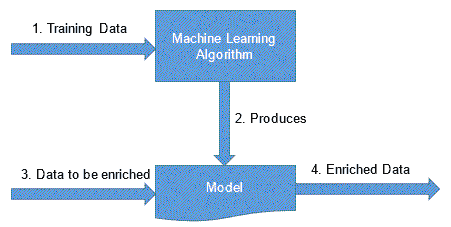
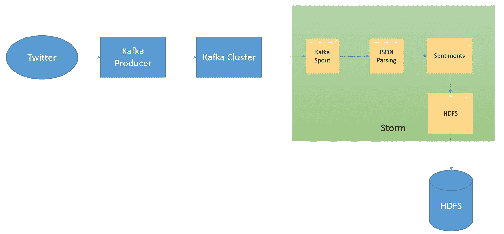

# 第十二章：Twitter 推文收集和机器学习

在上一章中，我们介绍了如何使用 Storm 和 Kafka 创建日志处理应用程序。

在本章中，我们将涵盖 Storm 机器学习的另一个重要用例。

本章涵盖的主要主题如下：

+   探索机器学习

+   使用 Kafka 生产者将推文存储在 Kafka 集群中

+   使用 Kafka Spout 从 Kafka 读取数据

+   使用 Storm Bolt 来过滤推文

+   使用 Storm Bolt 来计算推文的情感

+   拓扑的部署

# 探索机器学习

机器学习是应用计算机科学的一个分支，在这个分支中，我们基于现有的可供分析的数据构建真实世界现象的模型，然后使用该模型，预测模型以前从未见过的数据的某些特征。机器学习已经成为实时应用程序非常重要的组成部分，因为需要实时做出决策。

从图形上看，机器学习的过程可以用以下图示表示：



从数据构建模型的过程在机器学习术语中称为**训练**。训练可以实时在数据流上进行，也可以在历史数据上进行。当训练实时进行时，模型随着数据的变化而随时间演变。这种学习被称为*在线*学习，当模型定期更新，通过在新数据集上运行训练算法时，被称为*离线*学习。

当我们谈论 Storm 上的机器学习时，往往我们谈论的是在线学习算法。

以下是机器学习的一些真实应用：

+   在线广告优化

+   新文章聚类

+   垃圾邮件检测

+   计算机视觉

+   情感分析

# Twitter 情感分析

我们将情感用例分为两部分：

+   从 Twitter 收集推文并将其存储在 Kafka 中

+   从 Kafka 读取数据，计算情感，并将其存储在 HDFS 中



# 使用 Kafka 生产者将推文存储在 Kafka 集群中

在本节中，我们将介绍如何使用 Twitter 流 API 从 Twitter 中获取推文。我们还将介绍如何将获取的推文存储在 Kafka 中，以便通过 Storm 进行后续处理。

我们假设您已经拥有 Twitter 账户，并且为您的应用程序生成了消费者密钥和访问令牌。您可以参考：[`bdthemes.com/support/knowledge-base/generate-api-key-consumer-token-access-key-twitter-oauth/`](https://bdthemes.com/support/knowledge-base/generate-api-key-consumer-token-access-key-twitter-oauth/) 生成消费者密钥和访问令牌。请按照以下步骤进行：

1.  使用`groupId`为`com.stormadvance`和`artifactId`为`kafka_producer_twitter`创建一个新的 maven 项目。

1.  将以下依赖项添加到`pom.xml`文件中。我们正在向`pom.xml`添加 Kafka 和 Twitter 流 Maven 依赖项，以支持 Kafka 生产者和从 Twitter 流式传输推文。

```scala
   <dependencies> 
         <dependency> 
               <groupId>org.apache.kafka</groupId> 
               <artifactId>kafka_2.10</artifactId> 
               <version>0.9.0.1</version> 
               <exclusions> 
                     <exclusion> 
                           <groupId>com.sun.jdmk</groupId> 
                           <artifactId>jmxtools</artifactId> 
                     </exclusion> 
                     <exclusion> 
                           <groupId>com.sun.jmx</groupId> 
                           <artifactId>jmxri</artifactId> 
                     </exclusion> 
               </exclusions> 
         </dependency> 
         <dependency> 
               <groupId>org.apache.logging.log4j</groupId> 
               <artifactId>log4j-slf4j-impl</artifactId> 
               <version>2.0-beta9</version> 
         </dependency> 
         <dependency> 
               <groupId>org.apache.logging.log4j</groupId> 
               <artifactId>log4j-1.2-api</artifactId> 
               <version>2.0-beta9</version> 
         </dependency> 

         <!-- https://mvnrepository.com/artifact/org.twitter4j/twitter4j-stream --> 
         <dependency> 
               <groupId>org.twitter4j</groupId> 
               <artifactId>twitter4j-stream</artifactId> 
               <version>4.0.6</version> 
         </dependency> 

   </dependencies> 
```

1.  现在，我们需要创建一个名为`TwitterData`的类，其中包含从 Twitter 获取/流式传输数据并将其发布到 Kafka 集群的代码。我们假设您已经有一个运行中的 Kafka 集群和在 Kafka 集群中创建的`twitterData`主题。有关 Kafka 集群的安装和创建 Kafka 主题的信息，请参阅第八章，*Storm 和 Kafka 的集成*。

该类包含`twitter4j.conf.ConfigurationBuilder`类的一个实例；我们需要在配置中设置访问令牌和消费者密钥，如源代码中所述。

1.  `twitter4j.StatusListener`类在`onStatus()`方法中返回推文的连续流。我们在`onStatus()`方法中使用 Kafka Producer 代码来发布推文到 Kafka。以下是`TwitterData`类的源代码：

```scala
public class TwitterData { 

   /** The actual Twitter stream. It's set up to collect raw JSON data */ 
   private TwitterStream twitterStream; 
   static String consumerKeyStr = "r1wFskT3q"; 
   static String consumerSecretStr = "fBbmp71HKbqalpizIwwwkBpKC"; 
   static String accessTokenStr = "298FPfE16frABXMcRIn7aUSSnNneMEPrUuZ"; 
   static String accessTokenSecretStr = "1LMNZZIfrAimpD004QilV1pH3PYTvM"; 

   public void start() { 
         ConfigurationBuilder cb = new ConfigurationBuilder(); 
         cb.setOAuthConsumerKey(consumerKeyStr); 
         cb.setOAuthConsumerSecret(consumerSecretStr); 
         cb.setOAuthAccessToken(accessTokenStr); 
         cb.setOAuthAccessTokenSecret(accessTokenSecretStr); 
         cb.setJSONStoreEnabled(true); 
         cb.setIncludeEntitiesEnabled(true); 
         // instance of TwitterStreamFactory 
         twitterStream = new TwitterStreamFactory(cb.build()).getInstance(); 

         final Producer<String, String> producer = new KafkaProducer<String, String>( 
                     getProducerConfig()); 
         // topicDetails 
         // new CreateTopic("127.0.0.1:2181").createTopic("twitterData", 2, 1); 

         /** Twitter listener **/ 
         StatusListener listener = new StatusListener() { 
               public void onStatus(Status status) { 
                     ProducerRecord<String, String> data = new ProducerRecord<String, String>( 
                                 "twitterData", DataObjectFactory.getRawJSON(status)); 
                     // send the data to kafka 
                     producer.send(data); 
               } 

               public void onException(Exception arg0) { 
                     System.out.println(arg0); 
               } 

               public void onDeletionNotice(StatusDeletionNotice arg0) { 
               } 

               public void onScrubGeo(long arg0, long arg1) { 
               } 

               public void onStallWarning(StallWarning arg0) { 
               } 

               public void onTrackLimitationNotice(int arg0) { 
               } 
         }; 

         /** Bind the listener **/ 
         twitterStream.addListener(listener); 

         /** GOGOGO **/ 
         twitterStream.sample(); 
   } 

   private Properties getProducerConfig() { 

         Properties props = new Properties(); 

         // List of kafka borkers. Complete list of brokers is not required as 
         // the producer will auto discover the rest of the brokers. 
         props.put("bootstrap.servers", "localhost:9092"); 
         props.put("batch.size", 1); 
         // Serializer used for sending data to kafka. Since we are sending 
         // string, 
         // we are using StringSerializer. 
         props.put("key.serializer", 
                     "org.apache.kafka.common.serialization.StringSerializer"); 
         props.put("value.serializer", 
                     "org.apache.kafka.common.serialization.StringSerializer"); 

         props.put("producer.type", "sync"); 

         return props; 

   } 

   public static void main(String[] args) throws InterruptedException { 
         new TwitterData().start(); 
   } 
```

在执行`TwitterData`类之前，请使用有效的 Kafka 属性。

在执行上述类之后，用户将在 Kafka 中获得 Twitter 推文的实时流。在下一节中，我们将介绍如何使用 Storm 来计算收集到的推文的情感。

# Kafka spout，情感 bolt 和 HDFS bolt

在本节中，我们将编写/配置一个 Kafka spout 来消费来自 Kafka 集群的推文。我们将使用开源的 Storm spout 连接器来从 Kafka 消费数据：

1.  使用`groupID`为`com.stormadvance`和`artifactId`为`Kafka_twitter_topology`创建一个新的 maven 项目。

1.  将以下 maven 依赖项添加到`pom.xml`文件中：

```scala
   <dependencies> 
         <dependency> 
               <groupId>org.codehaus.jackson</groupId> 
               <artifactId>jackson-mapper-asl</artifactId> 
               <version>1.9.13</version> 
         </dependency> 

         <dependency> 
               <groupId>org.apache.hadoop</groupId> 
               <artifactId>hadoop-client</artifactId> 
               <version>2.2.0</version> 
               <exclusions> 
                     <exclusion> 
                           <groupId>org.slf4j</groupId> 
                           <artifactId>slf4j-log4j12</artifactId> 
                     </exclusion> 
               </exclusions> 
         </dependency> 
         <dependency> 
               <groupId>org.apache.hadoop</groupId> 
               <artifactId>hadoop-hdfs</artifactId> 
               <version>2.2.0</version> 
               <exclusions> 
                     <exclusion> 
                           <groupId>org.slf4j</groupId> 
                           <artifactId>slf4j-log4j12</artifactId> 
                     </exclusion> 
               </exclusions> 
         </dependency> 
         <!-- Dependency for Storm-Kafka spout --> 
         <dependency> 
               <groupId>org.apache.storm</groupId> 
               <artifactId>storm-kafka</artifactId> 
               <version>1.0.2</version> 
               <exclusions> 
                     <exclusion> 
                           <groupId>org.apache.kafka</groupId> 
                           <artifactId>kafka-clients</artifactId> 
                     </exclusion> 
               </exclusions> 
         </dependency> 

         <dependency> 
               <groupId>org.apache.kafka</groupId> 
               <artifactId>kafka_2.10</artifactId> 
               <version>0.9.0.1</version> 
               <exclusions> 
                     <exclusion> 
                           <groupId>com.sun.jdmk</groupId> 
                           <artifactId>jmxtools</artifactId> 
                     </exclusion> 
                     <exclusion> 
                           <groupId>com.sun.jmx</groupId> 
                           <artifactId>jmxri</artifactId> 
                     </exclusion> 
               </exclusions> 
         </dependency> 

         <dependency> 
               <groupId>org.apache.storm</groupId> 
               <artifactId>storm-core</artifactId> 
               <version>1.0.2</version> 
               <scope>provided</scope> 
         </dependency> 
   </dependencies> 
   <repositories> 
         <repository> 
               <id>clojars.org</id> 
               <url>http://clojars.org/repo</url> 
         </repository> 
   </repositories> 
```

1.  在`com.stormadvance.Kafka_twitter_topology.topology`包内创建一个`StormHDFSTopology`类，并添加以下依赖项以指定 Kafka spout 从`twitterData`主题中消费数据：

```scala
BrokerHosts zkHosts = new ZkHosts("localhost:2181"); 

       // Create the KafkaSpout configuartion 
       // Second argument is the topic name 
       // Third argument is the zookeeper root for Kafka 
       // Fourth argument is consumer group id 
       SpoutConfig kafkaConfig = new SpoutConfig(zkHosts, "twitterData", "", 
                   "id7"); 

       // Specify that the kafka messages are String 
       kafkaConfig.scheme = new SchemeAsMultiScheme(new StringScheme()); 

       // We want to consume all the first messages in the topic everytime 
       // we run the topology to help in debugging. In production, this 
       // property should be false 
       kafkaConfig.startOffsetTime = kafka.api.OffsetRequest 
                   .EarliestTime(); 

       // Now we create the topology 
       TopologyBuilder builder = new TopologyBuilder(); 

       // set the kafka spout class 
       builder.setSpout("KafkaSpout", new KafkaSpout(kafkaConfig), 1); 
```

1.  在`com.stormadvance.Kafka_twitter_topology.bolt`包内创建一个`JSONParsingBolt`类，以从 Twitter 接收的 JSON 推文中提取推文文本：

```scala
public class JSONParsingBolt extends BaseRichBolt implements Serializable{ 

   private OutputCollector collector; 

   public void prepare(Map stormConf, TopologyContext context, 
               OutputCollector collector) { 
         this.collector = collector; 

   } 

   public void execute(Tuple input) { 
         try { 
               String tweet = input.getString(0); 
               Map<String, Object> map = new ObjectMapper().readValue(tweet, Map.class); 
               collector.emit("stream1",new Values(tweet)); 
               collector.emit("stream2",new Values(map.get("text"))); 
               this.collector.ack(input); 
         } catch (Exception exception) { 
               exception.printStackTrace(); 
               this.collector.fail(input); 
         } 
   } 

   public void declareOutputFields(OutputFieldsDeclarer declarer) { 
         declarer.declareStream("stream1",new Fields("tweet")); 
         declarer.declareStream("stream2",new Fields("text")); 
   } 

} 
```

1.  在`com.stormadvance.Kafka_twitter_topology.sentiments`包内创建一个`SentimentBolt`类，以创建每条推文的情感。我们使用字典文件来查找推文中使用的词语是积极的还是消极的，并计算整条推文的情感。以下是该类的源代码：

```scala
public final class SentimentBolt extends BaseRichBolt { 
   private static final Logger LOGGER = LoggerFactory 
               .getLogger(SentimentBolt.class); 
   private static final long serialVersionUID = -5094673458112825122L; 
   private OutputCollector collector; 
   private String path; 
   public SentimentBolt(String path) { 
         this.path = path; 
   } 
   private Map<String, Integer> afinnSentimentMap = new HashMap<String, Integer>(); 

   public final void prepare(final Map map, 
               final TopologyContext topologyContext, 
               final OutputCollector collector) { 
         this.collector = collector; 
         // Bolt will read the AFINN Sentiment file [which is in the classpath] 
         // and stores the key, value pairs to a Map. 
         try { 
               BufferedReader br = new BufferedReader(new FileReader(path)); 
               String line; 
               while ((line = br.readLine()) != null) { 
                     String[] tabSplit = line.split("\t"); 
                     afinnSentimentMap.put(tabSplit[0], 
                                 Integer.parseInt(tabSplit[1])); 
               } 
               br.close(); 

         } catch (final IOException ioException) { 
               LOGGER.error(ioException.getMessage(), ioException); 
               ioException.printStackTrace(); 
               System.exit(1); 
         } 

   }
```

```scala
   public final void declareOutputFields( 
               final OutputFieldsDeclarer outputFieldsDeclarer) { 
         outputFieldsDeclarer.declare(new Fields("tweet","sentiment")); 
   } 

   public final void execute(final Tuple input) { 
         try { 
         final String tweet = (String) input.getValueByField("text"); 
         final int sentimentCurrentTweet = getSentimentOfTweet(tweet); 
         collector.emit(new Values(tweet,sentimentCurrentTweet)); 
         this.collector.ack(input); 
         }catch(Exception exception) { 
               exception.printStackTrace(); 
               this.collector.fail(input); 
         } 
   } 

   /** 
    * Gets the sentiment of the current tweet. 
    * 
    * @param status 
    *            -- Status Object. 
    * @return sentiment of the current tweet. 
    */ 
   private final int getSentimentOfTweet(final String text) { 
         // Remove all punctuation and new line chars in the tweet. 
         final String tweet = text.replaceAll("\\p{Punct}|\\n", " ") 
                     .toLowerCase(); 
         // Splitting the tweet on empty space. 
         final Iterable<String> words = Splitter.on(' ').trimResults() 
                     .omitEmptyStrings().split(tweet); 
         int sentimentOfCurrentTweet = 0; 
         // Loop thru all the wordsd and find the sentiment of this tweet. 
         for (final String word : words) { 
               if (afinnSentimentMap.containsKey(word)) { 
                     sentimentOfCurrentTweet += afinnSentimentMap.get(word); 
               } 
         } 
         LOGGER.debug("Tweet : Sentiment {} ==> {}", tweet, 
                     sentimentOfCurrentTweet); 
         return sentimentOfCurrentTweet; 
   } 

} 
```

1.  我们需要将情感存储在 HDFS 中以生成图表或特征分析。接下来，在`StormHDFSTopology`类中添加以下代码以链接 spout 和 bolts：

```scala
// use "|" instead of "," for field delimiter 
         RecordFormat format = new DelimitedRecordFormat() 
                     .withFieldDelimiter(","); 

         // sync the filesystem after every 1k tuples 
         SyncPolicy syncPolicy = new CountSyncPolicy(1000); 

         // rotate files when they reach 5MB 
         FileRotationPolicy rotationPolicy = new FileSizeRotationPolicy(5.0f, 
                     Units.MB); 

         FileNameFormat fileNameFormatSentiment = new DefaultFileNameFormat() 
         .withPath("/sentiment-tweet/"); 

         HdfsBolt hdfsBolt2 = new HdfsBolt().withFsUrl("hdfs://127.0.0.1:8020") 
                     .withFileNameFormat(fileNameFormatSentiment).withRecordFormat(format) 
                     .withRotationPolicy(rotationPolicy).withSyncPolicy(syncPolicy); 

         //builder.setBolt("HDFSBolt", hdfsBolt).shuffleGrouping("KafkaSpout"); 
         builder.setBolt("json", new JSONParsingBolt()).shuffleGrouping("KafkaSpout"); 

         // 
         builder.setBolt("sentiment", new SentimentBolt("/home/centos/Desktop/workspace/storm_twitter/src/main/resources/AFINN-111.txt")).shuffleGrouping("json","stream2"); 

         // 
         builder.setBolt("HDFS2", hdfsBolt2).shuffleGrouping("sentiment"); 
```

1.  以下是`StormHDFSTopology`类的完整代码：

```scala
public class StormHDFSTopology { 

   public static void main(String[] args) { 
         // zookeeper hosts for the Kafka cluster 
         BrokerHosts zkHosts = new ZkHosts("localhost:2181"); 

         // Create the KafkaSpout configuartion 
         // Second argument is the topic name 
         // Third argument is the zookeeper root for Kafka 
         // Fourth argument is consumer group id 
         SpoutConfig kafkaConfig = new SpoutConfig(zkHosts, "twitterData", "", 
                     "id7"); 

         // Specify that the kafka messages are String 
         kafkaConfig.scheme = new SchemeAsMultiScheme(new StringScheme()); 

         // We want to consume all the first messages in the topic everytime 
         // we run the topology to help in debugging. In production, this 
         // property should be false 
         kafkaConfig.startOffsetTime = kafka.api.OffsetRequest 
                     .EarliestTime(); 

         // Now we create the topology 
         TopologyBuilder builder = new TopologyBuilder(); 

         // set the kafka spout class 
         builder.setSpout("KafkaSpout", new KafkaSpout(kafkaConfig), 1); 

         // use "|" instead of "," for field delimiter 
         RecordFormat format = new DelimitedRecordFormat() 
                     .withFieldDelimiter(","); 

         // sync the filesystem after every 1k tuples 
         SyncPolicy syncPolicy = new CountSyncPolicy(1000); 

         // rotate files when they reach 5MB 
         FileRotationPolicy rotationPolicy = new FileSizeRotationPolicy(5.0f, 
                     Units.MB); 

         FileNameFormat fileNameFormatSentiment = new DefaultFileNameFormat() 
         .withPath("/sentiment-tweet/"); 

         HdfsBolt hdfsBolt2 = new HdfsBolt().withFsUrl("hdfs://127.0.0.1:8020") 
                     .withFileNameFormat(fileNameFormatSentiment).withRecordFormat(format) 
                     .withRotationPolicy(rotationPolicy).withSyncPolicy(syncPolicy); 

         //builder.setBolt("HDFSBolt", hdfsBolt).shuffleGrouping("KafkaSpout"); 
         builder.setBolt("json", new JSONParsingBolt()).shuffleGrouping("KafkaSpout"); 

         // 
         builder.setBolt("sentiment", new SentimentBolt("/home/centos/Desktop/workspace/storm_twitter/src/main/resources/AFINN-111.txt")).shuffleGrouping("json","stream2"); 

         // 
         builder.setBolt("HDFS2", hdfsBolt2).shuffleGrouping("sentiment"); 

         // create an instance of LocalCluster class for executing topology in 
         // local mode. 
         LocalCluster cluster = new LocalCluster(); 
         Config conf = new Config(); 

         // Submit topology for execution 
         cluster.submitTopology("KafkaToplogy", conf, builder.createTopology()); 

         try { 
               // Wait for some time before exiting 
               System.out.println("Waiting to consume from kafka"); 
               Thread.sleep(6000000); 
         } catch (Exception exception) { 
               System.out.println("Thread interrupted exception : " + exception); 
         } 

         // kill the KafkaTopology 
         cluster.killTopology("KafkaToplogy"); 

         // shut down the storm test cluster 
         cluster.shutdown(); 

   } 
} 
```

1.  现在，我们可以为整个项目创建 JAR 并根据本书中的第二章，*Storm 部署、拓扑开发和拓扑选项*中定义的方式部署到 Storm 集群。

# 总结

在本节中，我们介绍了如何使用 Twitter 流 API 读取 Twitter 推文，如何处理推文以计算输入 JSON 记录中的推文文本，计算推文的情感，并将最终输出存储在 HDFS 中。

通过这一点，我们来到了本书的结尾。在本书的过程中，我们已经从开始使用 Apache Storm 迈出了一大步，发展成为了真实世界应用程序的开发者。在这里，我们想总结一下我们所学到的一切。

我们向您介绍了 Storm 的基本概念和组件，并介绍了如何在本地和集群模式下编写和部署/运行拓扑。我们还介绍了 Storm 的基本命令，并介绍了如何在运行时修改 Storm 拓扑的并行性。我们还专门介绍了监控 Storm 的整个章节，这在开发过程中经常被忽视，但是对于任何生产环境来说都是至关重要的部分。您还了解了 Trident，这是低级 Storm API 的抽象，可用于开发更复杂的拓扑并维护应用程序状态。

没有任何企业应用程序可以仅使用一种技术开发，因此我们的下一步是看看如何将 Storm 与其他大数据工具和技术集成。我们看到了 Storm 与 Kafka、Hadoop、HBase 和 Redis 的特定实现。大多数大数据应用程序使用 Ganglia 作为集中监控工具，因此我们还介绍了如何通过 JMX 和 Ganglia 监控 Storm 集群。

你还学习了有关使用各种模式将不同数据源与 Storm 集成的知识。最后，在第十一章《使用 Storm 进行 Apache 日志处理》和本章中，我们实施了两个 Apache Storm 中的案例研究，这可以作为开发更复杂应用程序的起点。

我们希望阅读本书对你来说是一次富有成效的旅程，并且你对 Storm 以及一般实时流处理应用程序开发的各个方面有了基本的了解。Apache Storm 正在成为流处理的事实标准，我们希望本书能够成为你启动构建实时流处理应用程序的激动人心旅程的催化剂。
