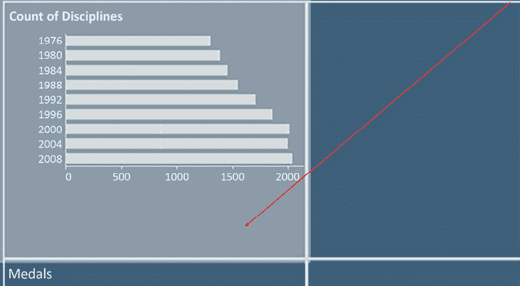
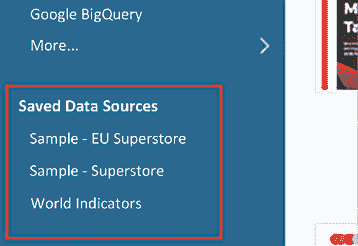

# 第一章：回顾基础知识

Tableau 是解决 **商业智能**（**BI**）和分析挑战的领先工具之一。通过本书，你将掌握 Tableau 在 BI 领域各种范式中的功能和特性。作为成功的 *掌握 Tableau* 系列的更新，本书涵盖了 Tableau 的基本概念、数据准备和计算，直至机器学习用例。

本版带来了新的数据集、更多改进仪表板性能的示例，以及关于数据可视化、Tableau Server 和 Tableau Prep Builder 的最新技术知识。

本版还将探讨 Tableau 与 Python 和 R 的连接、Tableau 扩展、连接和联合操作，最后但同样重要的是，三个新的强大自助分析用例，时间序列分析和地理空间分析，以便实施所学内容。在本书结束时，你将掌握 Tableau 的高级功能及其最新更新，直至 Tableau 2023 版本。

对于那些对 Tableau 比较陌生的读者，本章将帮助你快速入门；然而，由于本书针对的是高级话题，因此考虑基础内容的时间相对较少。如果需要更深入地了解基础知识，可以参考由 Joshua Milligan 编写、Packt Publishing 出版的 *Learning Tableau*。

在本章中，我们将讨论以下主题：

+   创建工作表和仪表板

+   连接 Tableau 与你的数据

+   度量名称和度量值

+   三个基本的 Tableau 概念

+   将数据导出到其他设备

现在，让我们通过探索 Tableau 中的工作表和仪表板创建来开始吧。

# 创建工作表和仪表板

Tableau 的核心是 **工作表** 和 **仪表板**。工作表包含单个可视化，仪表板则包含一个或多个工作表。此外，工作表和仪表板可以组合成 **故事**，通过展示环境向最终用户传达特定的见解。最后，所有的工作表、仪表板和故事都组织在 **工作簿** 中，可以通过 Tableau Desktop、Server、Reader 或 Tableau 移动应用程序访问。

在这一点上，我想向你介绍 **Tableau Public** ([`public.tableau.com/app/discover`](https://public.tableau.com/app/discover))。有时你可能需要一些灵感，或者你可能想复制其他 Tableau 用户创建的仪表板。在这种情况下，Tableau Public 将是你可以去的地方！它是一个基于网页的仪表板集合，也是一个创作者平台，允许你无需许可或安装即可设计美丽的仪表板。

你可以创建自己的个人资料——注册是免费的——并分享你认为世界不容错过的所有仪表板。然而，最棒的部分是你可以下载所有仪表板，在你自己的 Tableau 版本中打开它们，开始学习和复制。即使没有自己的个人资料或注册，也可以下载仪表板。总结一下：Tableau Public 是一个免费的选项，但提供有限的数据源连接、数据隐私和功能可用性。然而，它确实提供了一个优秀的平台，用于公开分享可视化并提升你的 Tableau 技能，无需付费许可。

在本节中，我们将讨论如何创建工作表和仪表板。我们的目标是传达基础知识，同时也提供一些对经验丰富的 Tableau 用户有用的见解。

## 创建工作表

在创建工作表之前，我们需要先创建可视化来填充它。在 Tableau 中，最基本的可视化是通过将一个或多个**字段**放置到一个或多个**架子**上来创建的。例如，注意下面的示例中，可视化是通过将**记录数量**放置到**Marks 卡片**上的**Text**架子上生成的：

图 1.1：Marks 卡片

在考虑了一些基本理论后，在下一小节中，你将有机会在自己的 Tableau 工作簿中跟随操作。让我们开始吧！

### 创建可视化

现在，让我们通过一个练习来探索创建可视化的基础：

1.  访问[`public.tableau.com/app/profile/marleen.meier`](https://public.tableau.com/app/profile/marleen.meier)以定位并下载与本章节相关的工作簿。

1.  通过双击下载的工作簿来打开文件。

1.  在工作簿中，找到并选择标签为**可视化基础**的选项卡：

图 1.2：导航工作表标签

1.  该仪表板连接了两个数据源；在这个第一个练习中，我们将使用**Summer-Olympics**数据。点击左上角的数据源**Summer-Olympics**：

图 1.3：数据源

1.  在**数据**面板中找到**Sport**，它位于**可视化基础**工作表的左侧：

图 1.4：数据面板中的维度

1.  将**Sport**拖动到**Color**上并点击**添加所有成员**：

图 1.5：将 Color 拖动到 Marks 卡片

1.  点击**颜色**（**Color**）卡片上的**标记**（**Marks**），然后点击**编辑颜色…**（**Edit Colors...**），即可根据需要调整可视化的颜色。这将允许你编辑可视化中使用的颜色，以及**透明度**和**边框**效果：

图 1.6：编辑颜色…

1.  现在，看看如果将**运动**（**Sport**）移到**大小**（**Size**）、**标签**（**Label**）、**细节**（**Detail**）、**列**（**Columns**）和**行**（**Rows**）架子上会发生什么。在每个架子上放置**运动**后，你可以单击每个架子单独访问更多选项。

1.  将其他字段拖到各个架子上，继续探索 Tableau 的行为。例如，在一个空白画布上，将**年份**（**Year**）拖到**列**（**Columns**）架子上，将**记录数**（**Number of Records**）拖到**行**（**Rows**）架子上，将**奖牌**（**Medal**）拖到**标记**卡片上的**颜色**（**Color**）。你现在将看到每种奖牌类型随时间变化的数量：

图 1.7：随时间变化的奖牌数量

1.  你是否想出了任何有趣的可视化效果？随时将它们分享到 Tableau Public。如果你希望本书的其他读者能找到它们，可以添加标签**#MasteringTableau**——分享即关怀！

当你通过将不同字段拖到不同架子上探索 Tableau 的行为时，你会注意到 Tableau 会以默认行为响应。然而，这些默认设置是可以被覆盖的，接下来我们将深入探讨。

### 超出默认行为

在前面的练习中，*创建可视化*，我们可以注意到**标记**卡片显示的是**自动**。这意味着 Tableau 正在提供默认视图。可以通过从下拉菜单中选择不同的选项轻松覆盖默认视图：

图 1.8：标记卡片下拉菜单

通过更改**标记**卡片上的这些设置，我们可以调整数据的显示格式。

另一种类型的默认行为可以通过将字段拖到架子上来观察。例如，将一个度量拖到架子上通常会导致`SUM()`聚合，它会将所有值汇总到最高聚合级别。如果没有维度，它将是所有值的总和。如果在**标记**卡片上有维度，则该维度将作为最高聚合级别。

我们将在本节稍后看到此行为的示例。

在 Windows 中，你可以通过右键单击并从**数据**（**Data**）面板中拖动一颗药丸（**pill**），并将其放到架子上来覆盖默认行为。Tableau 将弹出一个对话框，提供可能的选项：

图 1.9：更改默认聚合方式

如果您在使用 macOS，可以在将数据项拖到位置后，右键点击该数据项，然后通过更改度量来调整默认行为。Windows 系统也适用。另一种方法是，当字段仍在左侧的**数据**窗格时，右键点击该字段并选择**默认属性** | **聚合**。

现在，让我们通过一个练习来演示如何在**标记**卡上覆盖另一个默认行为：

1.  在与本章相关的工作簿中，导航到**覆盖默认设置**工作表。

1.  将**年份**从数据窗格拖放到**列**架上：

图 1.10：年份到列

1.  将**记录数量**放置在**行**架上（该字段会自动聚合为**SUM(记录数量)**），并将**运动**放置在**详细信息**架上。

1.  点击**标记**卡上的下拉菜单，选择**区域**：

图 1.11：区域图

在*图 1.11*中，我们可以看到**记录数量**随时间（**年份**）变化的图表，每一条线代表一种类型的**运动**。我们选择将其可视化为堆叠区域图。

#### 排序与嵌套排序

现在，您已经熟悉了拖放数据项的基本操作，并了解了 Tableau 的默认行为，接下来大多数用户希望做的就是对数据进行排序，以便得出初步结论，例如最小值和最大值。

导航到**嵌套排序**标签页，尝试按获得的奖牌数对国家进行排序，但要分别显示金牌、银牌和铜牌。

这对您有用吗？

在 Tableau 中，排序和嵌套排序可以通过简单地点击每个列名旁边的图标来完成：

图 1.12：排序

为了再次确认排序方式，将光标移动到**国家**区域，直到右上角出现箭头，点击给定字段旁的箭头，在本例中为**国家**，然后选择**排序…**：

图 1.13：排序设置

从下拉菜单中选择**嵌套**以及所需的**字段名称**，并选择**聚合**类型：

图 1.14：嵌套排序

完成并理解了**排序**和**嵌套排序**之后，您将能够通过以最合乎逻辑的方式展示数据，为仪表板增值。现在，我们可以继续下一个主题：Tableau 自带的不同默认图表类型：**Show Me**。

### Show Me

**Show Me**可以帮助 Tableau 新手创建他们所需的可视化，如条形图、直方图和面积图。它允许 Tableau 作者通过点击按钮快速从输入数据创建可视化。为了理解它是如何工作的，让我们参考以下屏幕截图，该截图再次使用了**Overriding Defaults**工作表。通过点击任何 Tableau 工作表右上角的**Show Me**按钮，可以访问这个视图：

图 1.15：Show Me

现在让我们看看前述屏幕截图中突出的以下几个方面：

+   **A**：**数据**面板中选择的字段

+   **B**：在视图中部署的字段，即标签

+   **C**：推荐视图，在**Show Me**面板中突出显示

+   **D**：帮助文本，传达创建推荐视图或任何选择的要求，当光标悬停在上面时显示

**Show Me**中每个未变灰的图标都表示可以通过点击它来创建的可视化。例如，在前面的屏幕截图*图 1.15*中，Tableau 作者可以选择点击面积图图标，基于选择和部署的字段创建面积图。

**Show Me**的选项是根据两个标准突出显示的：**数据**面板中选择的字段和视图中部署的字段。

**Show Me**可能因以下原因而被有效使用：

+   **效率**：熟练的 Tableau 作者已经知道如何创建基本的可视化类型。**Show Me**自动化这些基本类型，因此可以用来更快速地生成结果。

+   **灵感**：确定有效的方式来可视化数据集可能是一个挑战。**Show Me**可以通过允许 Tableau 作者快速考虑各种选项来帮助解决这个挑战。

+   **教育**：一个经验不足的 Tableau 作者可以通过访问**Show Me**来更好地理解各种可视化是如何创建的。通过阅读显示在**Show Me**底部的帮助文本，并相应地改变标签位置，可以学到很多东西：

图 1.16：Show Me

这三个原因展示了**Show Me**在工作表创建中的强大功能；然而，要小心不要将其作为依赖工具。如果你在没有理解每种可视化如何创建的情况下点击各种选项，你不仅是在缩短教育过程，还可能会生成你无法理解的结果，从而无法向利益相关者解释。

一旦你对结果感到满意，并且确信所选的可视化足够突出你的数据叙事，你的工作表就可以进入下一轮开发。我们已经查看了一些基本的可视化创建和配置技巧，现在让我们看看如何将多个工作表分组到一个仪表板中。

数据故事讲述是通过图表等可视化方式，利用数据创建引人入胜的故事的艺术。它将数据分析的力量与讲故事技巧相结合，以一种既吸引人又易于理解的方式传达复杂信息。

## 创建仪表板

如本节前述，仪表板包含一个或多个工作表，但仪表板远不止是静态的展示。它们是 Tableau 互动性的核心部分。在本节中，我们将通过工作表填充仪表板，并为互动性部署操作。

让我们开始构建一个仪表板。

### 构建仪表板

以下是构建仪表板的步骤：

1.  在本章的工作簿中，导航到**构建仪表板**标签。

1.  在*图 1.17*左侧的**仪表板**面板中，按列出的顺序双击以下每个工作表，将它们添加到仪表板面板中：**学科计数**、**与会者**、**奖牌**、**奖牌形状**：

图 1.18：删除容器

1.  点击空白区域后，您应该能看到一个蓝色边框围绕着过滤器和图例。这表示垂直容器已被选中。选择垂直容器的手柄并点击**X**来删除它。

1.  选中的容器也可以拖动到仪表板上的其他位置，替换现有的工作表或共享空间。请注意*图 1.19*中的灰色阴影，表示选中的位置。选择并按住手柄拖动**与会者**工作表，并将其放到**学科计数**工作表上，以交换这两个工作表的位置：

    图 1.19：移动工作表

    当您将元素（如工作表和容器）拖放到仪表板时，Tableau 提供的灰色阴影会帮助您清晰地了解元素将被放置的位置。在将元素放到仪表板上时，请慢慢观察，避免意外结果。

1.  请注意左下角仪表板旁边的**浮动**和**平铺**按钮，以及下拉菜单中的手柄。如果选择**浮动**而非**平铺**，您的工作表将不再自动调整，而是“浮动”在仪表板上。这是一种自由排列工作表的方式，功能强大，尤其在与透明背景结合时。请注意，浮动也可以通过从仪表板上每个工作表右侧的**更多选项**下拉菜单中选择来实现：

图 1.20：平铺和浮动

1.  现在，您可以根据需要格式化仪表板。以下提示可能会有所帮助：

    +   通过悬停在每个元素之间的边缘并点击拖动，调整屏幕上元素的大小。拖动容器的边缘来调整每个工作表的大小。

    +   使元素浮动，如*图 1.18*所示。

    +   通过将**水平**和**垂直**从**对象**面板拖到仪表板上来创建水平和垂直容器。其他对象，如**文本**、**图片**和**空白**，也可以添加到容器中。

    +   通过在顶部面板中选择**仪表板**，然后选择**显示标题**来显示仪表板标题。双击标题本身以进行调整：

    图 1.21：奥运会仪表板

如您所见，您刚刚创建了第一个仪表板。现在，所有工作表都已就位。在接下来的部分中，我们将添加过滤器功能，使仪表板更具互动性和意义。

### 向仪表板添加交互性

Tableau 的主要优势之一是它为最终用户提供的交互性。仪表板不仅仅是用来查看的；它们是为了互动而设计的。在这个练习中，我们将向之前创建的仪表板添加交互性：

1.  在仪表板上选择**奖牌**工作表，并点击右侧的下拉箭头，打开如*图 1.22*所示的菜单。从中选择**过滤器**，然后选择**运动**：

图 1.22：添加过滤器

1.  现在，选择新创建的过滤器**运动**，再次点击下拉选项箭头，选择**多个值（下拉菜单）**，以及**应用于工作表** | **所有使用此数据源的工作表**，如*图 1.23*所示：

图 1.23：过滤器设置

1.  最后，通过点击并拖动，将过滤器放置在**奖牌**工作表上方。

1.  要将奖牌的图片用作仪表板面板中其他工作表的过滤器，请点击**用作过滤器**图标，该图标位于**奖牌形状**工作表的右上角：

图 1.24：用作过滤器选项

1.  或者，导航至**仪表板** | **操作…**。在对话框中，点击**添加操作** | **过滤器**，并创建一个过滤器，如下所示：

图 1.25：导航至过滤器

图 1.26：添加过滤器操作

从此以后，您可以开始使用过滤器和操作过滤器了。

在 Tableau 中，过滤器用于根据特定条件子集化底层数据，而操作过滤器允许用户通过点击视觉元素与数据进行互动式过滤。

在*第十三章*，*提高性能*，本主题将会更详细地讨论。

完成前面的仪表板练习后，你现在应该能够点击仪表板上的各种对象，以观察交互性。

要学习一些更高级的仪表板技巧，务必查看*第十一章*，*设计仪表板和可视化最佳实践*。

总结一下，你已经学会了如何将现有的工作表作为平铺或浮动对象放到仪表板上。你已经通过拖放以及使用容器、过滤器和动作过滤器改变了仪表板的布局。每一项核心活动将在本书中多次出现，因此随时可以返回本章，重复练习步骤！

接下来，你将学习如何将自己的数据连接到 Tableau 并进行操作。

# 将 Tableau 连接到你的数据

在本文写作时，Tableau 的数据连接菜单包括 90 多种不同的连接类型。实际上，这个数字可能有些保守，因为其中一些类型包含多个选项。例如，**其他文件**包含 30 多种选项。当然，我们不会详细介绍每种连接类型，但我们会介绍基础内容。所有连接器的官方文档可以在这里找到：[`help.tableau.com/current/pro/desktop/en-us/exampleconnections_overview.htm`](https://help.tableau.com/current/pro/desktop/en-us/exampleconnections_overview.htm)。

在 Tableau Desktop 中新打开一个实例时（**文件** | **新建**），你会注意到在工作区的左上角有一个**连接到数据**链接。点击该链接可以让你连接到数据。通过在计算机上的 Tableau 应用程序位置打开新的实例时，系统会立即显示蓝色的**连接**面板。或者，你可以点击工具栏上的**新建数据源**图标。

虽然在后续章节中我们会连接到其他数据源，但在这里我们将仅限于连接到 Microsoft Excel 和文本文件。

## 连接到一个文件

让我们以 Excel 为例，看看如何连接到一个文件：

1.  在 Tableau 中，导航至**数据** | **新建数据源** | **Excel**，以连接安装在 Tableau Desktop 中的`Sample - Superstore`数据集（它应该位于你的硬盘上的**My Tableau Repository** | **Data sources**目录下）。

1.  双击**订单**工作表。

1.  点击**新工作表**标签，如*图 1.27*所示：

图 1.27：新工作表

1.  通过右键点击并选择**重命名**，将新创建的标签重命名为`第一个工作表`。

1.  将**折扣**放置在**文本**货架上的**标记**卡中。

1.  双击**利润**和**销售额**：

图 1.28：第一个工作表

你刚刚创建了你的第一个工作表！

如果你想连接到一个 `.csv` 文件，可以使用 **文本文件** 选项。在本书的 *第十二章*，*利用高级分析* 中，我们还将连接到空间文件。

在本节中，我们学习了如何连接到文件。在接下来的章节中，我们将继续介绍另一种重要的连接类型：Tableau Server。

## 连接到 Tableau Server

连接到 Tableau Server 可能是需要考虑的最重要的服务器连接类型，因为它通常用于提供比其他方式更好的性能。此外，连接到 Tableau Server 还可以让作者不仅接收数据，还能获得有关如何解读这些数据的信息——例如，某个字段是否应被视为度量值或维度。

我们将在本章稍后的 *维度和度量* 部分讨论这些术语之间的区别。

以下是连接到 Tableau Server 的步骤：

1.  为了完成这个练习，必须有 Tableau Server 实例的访问权限。如果你没有 Tableau Server 的访问权限，可以考虑在本地计算机上安装试用版本。

1.  在与本章相关的工作簿中，导航到 **连接到 Tableau Server** 工作表。

1.  右键点击 `Superstore` 数据源并选择 **发布到服务器…**：

图 1.29：发布到服务器…

1.  登录到 **Tableau Server** 并按照提示完成数据源的发布。

1.  打开一个新的 Tableau Desktop 实例，选择 **数据** | **新建数据源** | **Tableau Server**，然后搜索你刚刚发布并连接的 `Superstore` 数据集。

完成前两个练习后，让我们讨论一个最相关的点，即 **元数据**。元数据通常被定义为 *关于数据的数据*。在前面的例子中，数据源名称、默认聚合和默认数字格式都是多个作者之间一致性的例子。

如果你更改了某个字段名称，并且将数据源发布到 Tableau Server，新的字段名称将会保留，因为 Tableau 会记住对元数据所做的更改。这一点很重要，例如，如果你的公司有关于显示货币时使用小数点的政策；如果所有 Tableau 作者都开始通过指向所有已预定义格式的数据源来构建工作簿，这个政策就能轻松遵守。

在本书后面的章节中，我们将连接到其他服务器类型，比如 Google BigQuery，但所有服务器的处理方式几乎相同且非常直接。如果你还有疑问，可以随时查看[`help.tableau.com/current/pro/desktop/en-us/exampleconnections_overview.htm`](https://help.tableau.com/current/pro/desktop/en-us/exampleconnections_overview.htm)。

现在，我们关于连接的最后一个缺失部分是已保存的数据源。请跟着一起操作。

## 连接到已保存的数据源

连接到本地计算机上的已保存数据源与连接到发布在 Tableau Server 上的数据源非常相似。与本地数据源相关的元数据定义与 Tableau Server 上保持一致。当然，由于数据源是本地的而非远程的，因此发布过程不同。

让我们通过以下步骤来创建一个本地数据连接，使用一个示例：

1.  在本章相关的工作簿中，导航到**第一个工作表**标签。

1.  在**数据**窗格中，右键单击`Superstore`数据源并选择**添加到已保存的数据源**。

1.  使用弹出的对话框，将数据源保存为`Superstore`，并保存在**我的 Tableau 仓库** | **数据源**中，该文件夹位于你的硬盘驱动器上。

1.  点击屏幕左上角的**返回首页**图标，观察新保存的数据源：

图 1.30：已保存的数据源

你可以保存一个指向 Tableau Server 上发布的数据源的本地数据源。首先，连接到 Tableau Server 上的已发布数据源。然后，在工作区中右键单击数据源并选择**添加到已保存的数据源**。现在，你可以直接从启动页面连接到 Tableau Server！

现在我们已经学习了如何连接到文件、Tableau Server 和已保存的数据源，接下来我们将继续深入探讨有关**度量名称**和**度量值**的更多细节。

# 度量名称和度量值

我经常观察到以下情况：一个新的 Tableau 作者创建了一个工作表，并将一个度量拖到**文本**架上。他们将第二个度量拖到视图中的不同位置，并得到看似完全不可预测的结果。由于在 Microsoft Excel 中轻松实现这一点，作者的体验往往非常沮丧！好消息是，在 Tableau 中也很容易实现这个操作。只是需要一种不同的方法。

**度量名称**和**度量值**是 Tableau 中的生成字段。它们并不存在于基础数据中，但在创建许多类型的视图时是必不可少的。根据它们在**数据**窗格中的位置和名称，可以猜到，**度量名称**是一个维度，其成员由基础数据集中每个度量的名称组成。**度量值**包含数据集中每个度量的数值或值。

在本节中，我们将观察这些生成的字段单独使用时的表现，然后观察它们如何优雅地协作以创建视图。让我们通过一个练习来探索这个过程：

1.  在本章相关的工作簿中，导航到**度量名称**/**值**，并确保选择了`Olympics`数据源。

1.  将**Measure Values**拖到**Text**架上，观察结果，四个值都被叠加在一起：

图 1.31：Measure Values

1.  点击工具栏上的**Clear Sheet**图标清除工作表：

图 1.32：清除工作表

1.  现在，将**Measure Names**拖到**Rows**架上，可以观察到视图仅显示**No Measure Values**。

1.  将**Measure Values**拖到**Text**架上。注意度量值和关联值的列表，每个值都在相应的行中显示：

图 1.33：Measure Values 列表

或许**Measure Names**和**Measure Values**之间的关系可以通过一个类比来解释。想象有几对袜子和一个有分隔的袜子抽屉。*第 2 步*相当于把袜子丢成一堆。结果是，嗯，杂乱无章。*第 4 步*就像是一个空的、有分隔的袜子抽屉。分隔已经到位，但袜子在哪里呢？*第 5 步*则是一个分隔整齐的袜子抽屉，袜子有序地放好。`Measure Names`就像袜子抽屉，`Measure Values`就像袜子。

彼此独立时，它们并没有太大用处。将它们一起使用时，可以以多种不同的方式应用。

## **Measure Names**和**Measure Values**快捷方式

Tableau 提供了多种快捷方式，用于快速创建所需的可视化效果。如果你是软件的新手，这些快捷方式的行为可能看起来不直观，但你会逐渐理解它。让我们通过以下练习来探索如何使用快捷方式快速部署`Measure Names`和`Measure Values`：

1.  在与本章相关的工作簿中，导航到**MeasureNames**/**Values ShrtCts**工作表。

1.  将**# Women**拖到**Marks**卡片中的**Text**：

1.  将**# Men**直接拖到**# Women**上方，在视图中（**Show Me**出现）：

图 1.34：Show Me 和 Measures

1.  观察结果，包括**Measure Values**架的出现、**Measure Names**在**Rows**和**Filters**架上的部署，以及**Measure Values**在**Text**架上的展示：

图 1.35：Measure Values 外观

在这个练习的*第 2 步*中发生了几件事。在将`# Men`数字拖到`# Women`数字上方后，Tableau 执行了以下操作：

1.  将`Measure Names`部署到**Filters**架上：

    +   右键点击打开`Measure Names`过滤器并点击**编辑过滤器...**。观察到仅`# Men`和`# Women`被选中。这限制了视图只显示这两个度量。

1.  在**行**架上部署了`Measure Names`：

    +   `Measure Names` 就像是一个分区容器，也就是类比中的袜子抽屉。由于过滤器的作用，显示的只有`# Men`和`# Women`的行**。

1.  显示了**Measure Values**架：

    +   `Measure Values`架有点多余。虽然它清楚地显示了视图中展示的度量，但它本质上是访问过滤器的一种便捷方式。你可以简单地将度量拖进或拖出`Measure Values`架来调整过滤器，从而显示或隐藏更多的`Measure Values`。你也可以在`Measure Values`架中改变度量的顺序，从而改变视图中度量的显示顺序。

1.  在**文本**架上部署了`Measure Values`：

    +   `Measure Values` 只是定义每行将显示的数字——在本例中，显示的是与`# Men`和`# Women`相关的数字。

如果可视化中有轴，使用快捷方式来部署**Measure Names**和**Measure Values**需要将第二个度量放置在第一个度量的轴上方。在*图 1.36*中，**Year** 位于**列**架上，**Number of Records** 位于**行**架上。注意，截图是在**# Women**放置在*y*轴上时拍摄的：

图 1.36：轴快捷方式

结果工作表可以在*图 1.37*中看到：

图 1.37：双折线图

前面的部分帮助我们更好地理解了**Measure Names**和**Measure Values**。你将在 Tableau 的使用过程中更频繁地遇到这些概念，但既然你已经成功掌握了基础知识，让我们继续学习其他三个对你学习曲线有帮助的概念。

# 三个基本的 Tableau 概念

掌握 Tableau 的一个重要步骤涉及三个基本概念。在本节中，我们将讨论每个概念：

+   维度和度量

+   行级、汇总级和表级计算

+   连续和离散

我们将首先定义**维度**和**度量**。

## 维度和度量

Tableau 将来自底层数据源的每个字段分类为**维度**或**度量**。维度是定性的，或者换句话说，是分类的。度量是定量的，或者是可以聚合的。度量通常是一个数字，但也可以是一个聚合后的非数字字段，如`MAX (Date)`。维度通常是文本、布尔值或日期字段，但也可以是数字，如`Number of Records`。维度通过将数字切分成不同的部分/类别，赋予数字意义。没有维度的度量大多数是没有意义的。

让我们通过一个例子来更好地理解：

1.  在与本章相关的工作簿中，导航至 `维度与度量` 工作表。

1.  将 `记录数` 拖动到 **标记卡** 上的 **文本** 区域。结果大多是没有意义的。度量值是 **15,316**，但没有通过将度量值按一个或多个维度切片所提供的上下文，就无法理解它的含义：

图 1.38：没有上下文的工作表

1.  将 **国家** 和 **年份** 放置在 **列** 货架上，将 **记录数** 放置在 **行** 货架上：

图 1.39：维度与度量

如 *图 1.39* 所示，*步骤 3* 赋予了意义。将 **国家** 和 **年份** 放置在 **列** 货架上提供了上下文，这为可视化赋予了意义。

## 行级、聚合级和表级计算

Tableau 中有三种计算级别：*行级*、*聚合级*和*表级*。要理解这三种级别如何运作，了解 Tableau 的处理过程非常重要。我们将通过一个考虑 `记录数` 和 `数量` 字段的示例来说明这一点，这些字段来自 `Superstore` 数据集。

请考虑以下的计算类型、计算字段和查询。将其与常用的 SQL 语言进行对比，可以帮助我们更好地理解如何解读 Tableau 计算。请注意，为了便于此示例，SQL 稍作简化。

让我们更深入地了解三种计算级别，并考虑以下表格中的示例：

| **计算类型** | **Tableau 中的计算字段** | **传递给数据源的查询** |
| --- | --- | --- |
| **行级** | `记录数/数量` | `SELECT 记录数 / 数量 FROM Orders` |
| **聚合级** | `[记录数])/SUM(数量)` | `SELECT [记录数]), SUM(数量) FROM [Orders]` |
| **表级** | `WINDOW_Sum([记录数])/数量))` | `SELECT [记录数]), SUM(数量) FROM [Orders]` |

对于行级和聚合级计算，实际上是由数据源引擎完成计算的，因为 Tableau 是一个内存工具。Tableau 仅显示结果。然而，表级计算并非如此。尽管传递给数据源的查询对于表级计算与聚合级计算相同，Tableau 会对返回的结果进行额外的计算。让我们通过一个练习，使用相同的计算字段进一步探索这一点。

让我们看一下以下步骤，并开始我们的练习：

1.  在与本章相关的工作簿中，导航至 `Row_Agg_Tbl` 工作表。

1.  通过点击左上角 **数据** 部分的 `样本 - 超市` 来连接到 `Superstore` 数据源。

图 1.40：连接到超市数据

1.  选择**分析** | **创建计算字段**以创建以下计算字段。请注意，每个字段必须单独创建；也就是说，在此上下文中无法创建一个包含所有三个计算的单一计算字段：

    +   将第一个计算命名为`Lev – Row`并输入以下代码：`[Number of Records]/[Quantity]`。

    +   接下来，将第二个计算命名为`Lev – Agg`并输入以下代码：`SUM ([Number of Records])/SUM (Quantity)`。

    +   最后，将第三个计算命名为`Lev – Tab`并输入`WINDOW_AVG ([Lev - Agg])`。

1.  在**数据**面板中，右键单击您刚刚创建的三个计算字段，选择**默认属性** | **数字格式**。

1.  在弹出的对话框中，选择**百分比**并点击**确定**。

1.  将**订单日期**放置到**列**架上。

1.  将**度量名称**放置到**行**架上，并将**度量值**放置到**标记卡**上的**文本**上。

1.  通过将其拖出**度量值**架或从**度量名称**过滤器中删除，排除除**Lev - Row**、**Lev - Agg**和**Lev - Tab**之外的所有值：

图 1.41：计算层级

+   **Lev - Agg**是聚合级计算。该计算由数据源引擎完成。`[Number of Records]`的总和除以`[Quantity]`的总和。计算结果可能对 Tableau 作者有用。

+   **Lev - Row**是行级计算。该计算由数据源引擎完成。`[Number of Records]`除以`[Quantity]`，并且对于每一行底层数据进行计算。结果随后会在所有行中求和。当然，在这种情况下，行级计算并未提供有用的结果；然而，鉴于新手 Tableau 作者可能会错误地创建行级计算，而实际上需要的是聚合级计算，因此此示例仍在此处包含。

+   **Lev - Tab**是一个表格计算。部分计算由数据源引擎完成，即聚合。Tableau 会根据在工作表中显示的数据的维度和详细级别，对从数据源引擎返回的结果进行额外计算。具体来说，**Lev - Agg**的结果会被求和，然后除以维度中的成员数。对于之前的示例，这就是：

再次提醒，这些结果在此情况下并不是特别有用，但它们展示了一个初学者 Tableau 作者应该具备的知识。

## 连续性与离散性

连续性和离散性并不是 Tableau 独有的概念。实际上，它们可以在许多领域中观察到。考虑以下示例：

图 1.42：连续性与离散性

前面的图示展示了两条河流：*左河*和*右河*。水在左河中流动。右河由冰块组成。理论上，你能排序右河中的冰块吗？能！那么，有没有办法排序左河中的水呢？换句话说，你能从河底提取水桶，把这些水桶运送到上游，然后将水倒回左河，并且因此说“我已经排序了河中的水”吗？不能。

左河中的 H[2]O 是连续形态，即水。右河中的 H[2]O 是离散形态，即冰。

在考虑了自然界中的连续和离散示例之后，让我们回到 Tableau。以下七个要点可以帮助更清楚地理解 Tableau 中的连续和离散：

1.  连续是绿色的。离散是蓝色的：

    +   在 **数据** 面板中选择任何字段，或将任何字段放到架子上，你会注意到它是绿色的或蓝色的。与字段相关的图标也是绿色或蓝色的。

1.  连续总是 `数字`。离散可以是 `字符串`。

1.  连续和离散并不等同于维度和度量：

    +   新的 Tableau 用户常常会将连续和度量混淆，离散和维度混淆。它们并不是同义词。度量可以是离散的或连续的。

    +   此外，一个维度，如果它是数字，可能是离散的也可能是连续的。为了证明这一点，在 Tableau 中右键点击任何数字或日期字段，并注意你可以转换它：

    图 1.43：在离散和连续之间转换

1.  离散值可以排序。连续值不能：

    +   可排序/不可排序的行为最容易通过日期和类似 `Sum(Sales)` 的度量来观察，如下所示：![图形用户界面，文本，应用程序，聊天或文本消息]

    描述自动生成](img/B18435_01_44.png)

    图 1.44：左：连续（不可排序）。右：离散（可排序）

1.  连续色是渐变色。离散色是不同的：

    +   以下示例显示了**销售**作为连续和离散的情况。请注意颜色渲染的不同。屏幕截图的左部分演示了连续结果的渐变效果，右部分展示了离散结果的不同颜色类别：![图表，条形图]

    描述自动生成](img/B18435_01_45.png)

    图 1.45：连续的（左）和离散的（右）销售

1.  连续的 pills 可以放置在离散的 pills 右侧，但不能放在左侧，因为离散的 pills 定义了聚合级别：

    +   当 **年份** 是离散时，Tableau 作者能够将 **地区** 放置在 **年份** 的右侧。

    +   当 **年份** 是连续时，Tableau 作者无法将 **地区** 放置在 **年份** 的右侧。

1.  连续创建坐标轴。离散创建标题：

    +   请注意以下截图的右侧部分，**订单日期**是连续的，且选中了**订单日期的年份**轴。由于**订单日期的年份**是轴，整个*x*-轴都被选中了。然而，在左侧部分，**订单日期（年）**是离散的，且选中了**2014**。由于 2014 只是一个标题，它被选中而不是整个*x*-轴：

图 1.46：连续日期（右）和离散日期（左）

恭喜，您已经掌握了 Tableau 中的三个重要概念：度量与维度、计算级别以及离散与连续值。仅凭这些知识，您就能够创建您的第一个仪表板。我强烈鼓励您这样做；通过这些工具的练习，学习曲线将非常陡峭，您也将迅速通过实践增强信心！这也将帮助您在接下来的章节中跟得上进度。

最后，我们将介绍将仪表板导出到其他设备的基本操作。即使您目前还没有准备好这样做，它也将完成 Tableau Desktop 的基础讲解，并为您提供一个完整的基础框架。接下来，我们可以在后续章节中继续优化每个细节！

# 导出数据到其他设备

一旦仪表板达到预期效果，开发者可以选择不同的共享方式。上传到 Tableau Server 是最可能的选择。最终用户可能不仅仅使用笔记本查看结果，他们也可能使用平板或手机。

## 将数据导出到手机

在开发仪表板时，Tableau Creator 可以选择查看**设备设计器**或**设备预览**。只要您处于**仪表板**选项卡中，就可以在此找到它：

图 1.47：设备预览

Tableau 默认设置了手机配置。如果需要，您可以通过点击**手机**并点击三个点来调整这些默认设置。进入**设备设计器**模式后，选择一个**设备类型**选项，您将看到常见型号的选择：

图 1.48：设备类型设置为手机

请注意，您只能使用仪表板中默认布局的工作表。例如，如果您想为平板设备添加默认布局，请进入**设备设计器**模式，选择**平板**，并按需调整内容，使您希望在平板上查看的工作表位于设备框架内。满意了吗？那么就将新布局（如*图 1.50*所示）添加到工作簿中，它会出现在左上角的**默认**区域下：

图 1.49：添加平板布局

用户现在可以在打开 Tableau Server 上的工作簿时选择所需的设计。

您不仅可以方便地在移动设备上查看您的项目，还可以使用 Tableau Mobile 在路上进行工作！我们将在下一节中详细介绍这一点。

## Tableau Mobile

为了支持灵活工作，Tableau 创建了一个应用程序，可以从 App Store 或 Google Play 下载，名为 **Tableau Mobile**。一旦安装在您的手机和/或平板电脑上，您将有选项将该应用连接到 Tableau Server 或 Tableau Online。继续发布我们在本章创建的仪表板 *The Olympics* 到这两个实例中的任意一个。如果您对发布有疑问，请参阅 *第十四章*，*探索 Tableau Server 和 Tableau Cloud*，以获取进一步的指导。

在您的登录页面底部，点击 **探索** 查看您刚发布的所有视图。点击 **构建仪表板** 视图，查看您之前创建的仪表板 *The Olympics*：

图 1.50：移动仪表板

最棒的部分还未到来。仪表板是完全交互式的，所以尝试下拉筛选器或 **奖牌** 筛选器。还可以尝试点击一个标记并选择 **仅保留**。通过点击右上角的工作簿图标，从左侧开始的第一个图标，将显示您创建的所有其他工作表，从而可以在工作表之间进行切换：

图 1.51：表单选择

现在，如果您点击右上角的三个点，将会出现更多选项，例如 **还原**，**提醒**，**订阅** 等等。要了解更多也可以在 Tableau Server 上提供的不同选项，请参阅 *第十四章*，*探索 Tableau Server 和 Tableau Cloud*。目前，我们可以得出结论，Tableau Mobile 可以让您轻松地在任何地方查看您喜爱的仪表板。

# 概要

在本章中，我们介绍了 Tableau 的基础知识。我们从一些基本术语开始，然后看了看如何创建工作表和仪表板的基础知识。我们重点关注默认行为及如何覆盖该行为，并考虑了一些最佳实践。然后，我们审视了度量名称和度量值的基本原则。之后，我们探讨了三个重要的 Tableau 概念：维度和度量；行级、聚合级和表级计算；以及连续和离散的概念。特别重要的是理解，行级和聚合级计算是由数据源引擎计算的，而表级计算由 Tableau 处理。最后，我们看到如何调整您的仪表板以适应其他设备，如手机或平板电脑，并展示了 Tableau Mobile 的操作。

在下一章中，我们将继续探索 Tableau，详细研究数据。我们将考虑如何使用 Tableau 的数据处理引擎 Hyper 进行数据准备，并探索一些有用的数据准备模型和技术。

## 了解更多关于 Discord

加入本书的 Discord 社区——在这里你可以分享反馈、向作者提问，并了解新版本的发布——请扫描下面的二维码：

[`packt.link/tableau`](https://packt.link/tableau)

