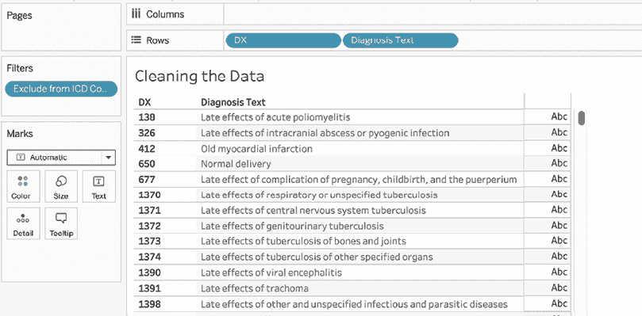

# 第二章：准备你的数据

你有没有问过自己，你的数据是否足够干净，能被分析？很可能，所有与数据打交道的人都有过这样的疑问，这也是本章致力于帮助你准备好数据进行分析的原因，这个过程通常被称为数据清理。

本章的第一部分偏向理论，不包括练习。建议仔细阅读这些信息，因为它为更深入的理解提供了基础。本章后半部分提供了专门关注数据准备的各种练习。

现在，让我们深入探讨这个令人着迷的话题，目标是丰富我们的理解，成为更好的数据管理者。

在本章中，我们将讨论以下主题：

+   理解 Hyper

+   聚焦数据准备

+   调查数据

+   清理杂乱的数据

由于 Tableau Desktop 10.5 已经上市一段时间，你可能已经听说过 Hyper。不管你是否听说过，继续阅读，了解这个功能的基础知识！

# 理解 Hyper

在本节中，我们将探索 Tableau 的数据处理引擎，以及它如何在企业中实现结构化而富有活力的数据挖掘过程。自 Tableau 10.5 发布以来，我们可以利用 Hyper 这一高性能数据库，让我们能够比以往更快地查询源数据。即使是高级开发人员，也通常对 Hyper 了解不深，因为它并不是日常活动中显而易见的一部分；然而，如果你真想掌握如何为 Tableau 准备数据，这种理解至关重要。

Hyper 最初是 2008 年在慕尼黑大学作为一个研究项目开始的。2016 年，它被 Tableau 收购，并被指定为 Tableau 的专用数据引擎小组，仍然保持其在慕尼黑的总部和员工。最初在 Tableau 10.5 中，Hyper 仅替代了早期的数据处理引擎，用于提取。至今，Hyper 仍然没有涉及实时连接，但 Tableau Prep Builder 现在也使用 Hyper 引擎，并且未来会有更多的使用场景。如[tableau.com](http://tableau.com)所述，“*Hyper 可以在几秒钟内切片并处理大量数据，你将看到查询速度提高最多 5 倍，提取创建速度提高最多 3 倍*。”如果你仍然意犹未尽，始终可以通过 API 调用在你喜欢的编程语言中使用 Hyper：[`help.tableau.com/current/api/hyper_api/en-us/docs/hyper_api_reference.html`](https://help.tableau.com/current/api/hyper_api/en-us/docs/hyper_api_reference.html)。

那么，是什么让 Hyper 如此快速呢？让我们看看它的工作原理！

## Tableau 的数据处理引擎

Hyper 的创始人共享的愿景是创建一个高性能的下一代数据库——一个系统，一个状态，没有妥协，没有延迟。并且它成功了——今天，Hyper 能够同时承担通用数据库用途、数据摄取和分析。

内存价格已呈指数下降。CPU 也是如此；晶体管数量根据摩尔定律增加，而其他特性则停滞不前。内存变便宜了，但处理能力仍需提升。

摩尔定律是英特尔联合创始人戈登·摩尔提出的观察结果：芯片上晶体管的数量每两年翻一番，而成本减半。关于摩尔定律的更多信息可以在 Investopedia 上找到：[`www.investopedia.com/terms/m/mooreslaw.asp`](https://www.investopedia.com/terms/m/mooreslaw.asp)。

在 Hyper 的实验过程中，创始人测量发现手写的 C 代码比任何现有的数据库引擎都要快，于是他们想到了一个点子：将 Tableau 查询转换为 C 代码，并同时优化它，所有这些操作都在后台进行，用户不会察觉。这种翻译和优化是有成本的；传统的数据库引擎可以立即开始执行代码，而 Tableau 需要先将查询转换为代码，再优化这段代码，然后编译成机器代码，最后才能执行。大问题是，这样做还会更快吗？通过在 Tableau Public 和其他工作簿上的许多测试验证，答案是肯定的！

此外，如果有一个查询预计在不编译成机器代码的情况下执行会更快，Tableau 拥有自己的**虚拟机**（**VM**），可以立即执行该查询。与此并行，Hyper 能够利用 99%的可用 CPU 计算能力，而其他并行处理只能利用 29%的 CPU 计算能力。这归功于**小块驱动并行化**这一独特且创新的技术。

对于那些想了解更多关于**小块驱动并行化**的人，后来成为 Hyper 引擎基准的论文可以在[`15721.courses.cs.cmu.edu/spring2016/papers/p743-leis.pdf`](https://15721.courses.cs.cmu.edu/spring2016/papers/p743-leis.pdf)找到。

如果你想了解更多关于 Hyper 引擎的信息，我强烈推荐观看以下视频：[`youtu.be/h2av4CX0k6s`](https://youtu.be/h2av4CX0k6s)。

Hyper 将传统数据仓库操作的三步进行并行化：

+   事务处理和**连续数据摄取**（**在线事务处理**，或**OLTP**）

+   **分析处理**（**在线分析处理**，或**OLAP**）

+   **超越关系型**（**在线超越关系型处理**，或**OBRP**）

同时执行这些步骤使 Hyper 更加高效和性能更强，这与传统系统不同，传统系统将这三步分开并按顺序执行。

总结来说，Hyper 是一个高度专业化的数据库引擎，它允许我们作为用户从查询中获得最佳结果。如果你还记得，在*第一章*，*回顾基础知识*中，我们已经看到，工作表或仪表板上的每一个变化，包括拖放字段、筛选器和计算字段等，都会被转换成一个查询。这些查询基本上是 SQL 类似的；然而，在 Tableau 中，我们将查询引擎称为 VizQL。

VizQL，是 Tableau Desktop 中的另一个隐藏宝藏，负责以图表形式可视化数据，并完全在内存中执行。其优势在于，这里不需要额外的数据库空间。VizQL 在用户将字段放置到货架时生成。然后，VizQL 被转换为 SQL、MDX 或 **Tableau 查询语言**（**TQL**）并通过驱动程序传递到后端数据源。

## Hyper 要点

这个 Tableau 数据处理引擎的概述展示了与数据接口的灵活方法。了解数据处理引擎可以减少数据准备和数据建模的工作量，从而帮助我们简化整个数据挖掘生命周期。在这一点上，你不需要过多担心数据类型和可以基于数据库字段计算的数据。Tableau 可以为你完成所有这方面的工作。在下一节中，我们将讨论从数据源的角度，你需要考虑的事项。

# 专注于数据准备

Tableau 可以在多个数据准备阶段有效使用。不幸的是，仅凭一章内容无法深入探讨 Tableau 如何在每个阶段中使用。实际上，这样的深入探讨可能值得写一本书！因此，我们的重点将集中在数据准备阶段，因为这个阶段历史上占据了数据挖掘工作量的 60%。我们的目标是学习如何利用 Tableau 来简化这一过程。

## 数据调查

Tableau 可以是一个非常有效的工具，用于简单的数据调查。在调查过程中，有时你可能会发现清理数据或基于现有字段填充不完整数据的方法。有时，遗憾的是，拼凑一个完整的数据集所需的拼图碎片并不充足。在这种情况下，Tableau 可以有效地帮助你明确哪些地方存在缺失，这反过来可能会激励组织更完整地填充底层数据。

在这个练习中，我们将探索如何使用 Tableau 快速发现数据集中每个字段的空值百分比。接下来，我们将探索如何从现有字段推断数据以填补空缺。

### 建立空值

以下是调查数据的步骤：

1.  如果你还没有完成，请访问 [`public.tableau.com/profile/marleen.meier`](https://public.tableau.com/profile/marleen.meier) 查找并下载与本章相关的工作簿。

1.  转到名为`Surveying` `&` `Exploring``Data`的工作表，并选择`Happiness Report`数据源。

1.  将**Region**和**Country**拖动到**Rows**架上。观察到在某些情况下，**Region**字段对于某些国家具有**Null**值：


图 2.1：空区域

1.  右键点击并**编辑**名为`Select Field`的参数。注意，**数据类型**已设置为**整数**，我们可以看到一个包含数据集中每个字段名称的列表：


图 2.2：编辑参数

1.  在**数据**窗格中，右键点击我们刚创建的参数并选择**显示参数**控制。

1.  创建一个名为`% Populated`的计算字段，并编写以下计算：

    ```py
    SUM([Number of Records]) / TOTAL(SUM([Number of Records])) 
    ```

1.  在**数据**窗格中，右键点击**% Populated**并选择**默认属性** | **数字格式...**：


图 2.3：调整默认属性

1.  在弹出的对话框中，选择**百分比**。

1.  创建一个名为`Null & Populated`的计算字段，并添加以下代码。注意，完整的 case 语句较长，但也很重复。

    在需要进行较长但重复计算的情况下，考虑使用 Excel 更快速、准确地编写代码。通过使用 Excel 的`CONCATENATE`函数，您可能节省时间并避免输入错误。

    在以下代码块中，代码行只表示总数的一部分，但应该足够帮助您生成整个块：

    ```py
    CASE [Select Field]
    WHEN 1 THEN IF ISNULL ([Country]) THEN 'Null Values' ELSE
    'Populated Values' END
    WHEN 2 THEN IF ISNULL ([Region]) THEN 'Null Values' ELSE
    'Populated Values' END
    WHEN 3 THEN IF ISNULL ([Economy (GDP per Capita)]) THEN 'Null Values' ELSE
    'Populated Values' END
    WHEN 4 THEN IF ISNULL ([Family]) THEN 'Null Values' ELSE
    'Populated Values' END
    WHEN 5 THEN IF ISNULL ([Freedom]) THEN 'Null Values' ELSE
    'Populated Values' END
    WHEN 6 THEN IF ISNULL ([Happiness Rank]) THEN 'Null Values' ELSE
    'Populated Values' END
    WHEN 7 THEN IF ISNULL ([Happiness Score]) THEN 'Null Values' ELSE
    'Populated Values' END
    WHEN 8 THEN IF ISNULL ([Health (Life Expectancy)]) THEN 'Null Values' ELSE
    'Populated Values' END
    WHEN 9 THEN IF ISNULL ([Standard Error]) THEN 'Null Values' ELSE
    'Populated Values' END
    END 
    ```

1.  从**Rows**架上移除**Region**和**Country**。

1.  将**Null & Populated**放置在**Rows**和**Color**架上，将**% Populated**放置在**Columns**和**Label**架上：


图 2.4：已填充值

1.  如有需要，可以将**Null Values**的颜色更改为红色，将**Populated Values**的颜色更改为绿色。可以通过点击**Marks**卡上的**Color**并选择**编辑颜色**来实现。

1.  点击工作表右上角的**Select Field**参数中的箭头，并选择**单一值列表**。

1.  在**Select Field**参数中选择各种选项，并注意某些字段有较高的空值百分比。例如，在以下图表中，**32.98%**的记录没有**Region**值：


图 2.5：比较空值和已填充值

基于这个练习，让我们探索如何使用相同的数据集清理和推断现有数据。

### 推断数据

本练习将扩展前一练习，通过清理现有数据并从已知信息中填充部分缺失数据来完成。我们将假设我们知道哪个国家属于哪个地区。我们将利用这些知识来修复`区域`字段中的错误，并使用 Tableau 填充空白数据：

1.  从前一练习结束的地方开始，创建一个名为`区域外推`的计算字段，其中包含以下代码块：

    ```py
    CASE [Country]
    WHEN 'Afghanistan' THEN 'Southern Asia'
    WHEN 'Albania' THEN 'Central and Eastern Europe'
    WHEN 'Algeria' THEN 'Middle East and Northern Africa'
    WHEN 'Angola' THEN 'Sub-Saharan Africa'
    WHEN 'Argentina' THEN 'Latin America and Caribbean'
    WHEN 'Armenia' THEN 'Central and Eastern Europe'
    WHEN 'Australia' THEN 'Australia and New Zealand'
    WHEN 'Austria' THEN 'Western Europe'
    //complete the case statement with the remaining fields in the data set
    END 
    ```

    作为`CASE`语句的替代方案，您可以使用`IF`语句，例如：

    ```py
    If [Country] = 'Afghanistan' then 'Southern Asia' 
    ELSEIF [Country] = 'Albania' then …
    END 
    ```

    为了加快长计算字段的繁琐创建过程，您可以将数据下载到 Excel 文件中，并通过连接各个部分来创建计算字段，如下所示：

    

    图 2.6：在 Excel 中编译计算

    然后，您可以将它们从 Excel 复制到 Tableau 中。但是，在本练习中，我创建了一个名为`备份`的备用字段，该字段可在与本章相关的 Tableau 工作簿中找到，其中包含`区域外推`字段所需的完整计算。您可以随时使用这个备份。**解决方案**仪表板还包含所有国家。因此，您还可以从该文件复制`区域外推`字段。

1.  在**选择字段**参数中添加一个**区域外推**选项：


图 2.7：将区域外推添加到参数中

1.  将以下代码添加到`空值和填充`计算字段中：

    ```py
    WHEN 10 THEN IF ISNULL ([Region Extrapolated]) THEN 'Null Values' ELSE 'Populated Values' END 
    ```

1.  注意**区域外推**字段现在已经完全填充：


图 2.8：完全填充的区域外推字段

现在让我们考虑一下前面练习中的一些具体细节。

让我们看一下以下代码块。

请注意，完整的`CASE`语句有几行长。以下是其中的一部分代表性内容：

```py
CASE [% Populated]
WHEN 1 THEN IF ISNULL ([Country]) THEN 'Null Values' ELSE
'Populated Values' END
... 
```

此`CASE`语句是一个逐行计算，考虑数据集中的每个字段，并确定哪些行是填充的，哪些不是。例如，在上述代码的代表行中，将评估`Country`字段的每一行是否为 null。这是因为计算字段将在现有数据的基础上添加一个新列——仅在 Tableau 中，而不是数据源本身——并且每一行都将获得一个值。这些值可以是 N/A 或 null 值。

下面的代码相当于快速表计算`总比例`：

```py
SUM([Number of Records]) / TOTAL(SUM([Number of Records])) 
```

与`空值和填充`计算字段一起，它允许我们查看实际填充了多少字段的百分比。

习惯于从头开始编写表计算是个好主意，即使有等效的快速表计算可用。这将帮助您更清楚地理解表计算。

以下`CASE`语句是一个示例，说明如何使用一个或多个字段来外推另一个字段的内容：

```py
CASE [Country]
WHEN 'Afghanistan' THEN 'Southern Asia'
... END 
```

例如，数据集中的`地区`字段有很大比例的空值，甚至现有的数据也存在错误。根据我们对业务的了解（即哪个国家属于哪个地区），我们能够使用`国家`字段填充数据集中的所有区域，并确保信息的准确性。

空值几乎是所有大型真实数据集的一部分。了解每个字段中有多少空值，对于确保提供准确的商业智能至关重要。当最终结果不会受到显著影响时，可能可以容忍一些空值，但空值过多可能会使结果无效。然而，正如本节所示，在某些情况下，可以使用一个或多个字段来推断应输入到数据不足或错误填充字段中的值。

如本节所示，Tableau 使你能够有效地向数据团队传达哪些值缺失，哪些值有误，以及如何进行可能的变通方法，这对整体数据挖掘工作至关重要。接下来，我们将研究一些稍微复杂的数据，这些数据不是以规范的列格式呈现。别担心，Tableau 能够应对这些情况。

## 清理杂乱数据

美国政府为各种行政流程提供了有用的文档。例如，**健康与公共服务部**（**HSS**）提供了 ICD-9 代码列表，即国际疾病分类与相关健康问题分类代码。不幸的是，这些代码并不总是以易于访问的格式提供。

作为一个示例，我们来看一个实际的 HHS 文档，名为 R756OTN，可以在[`www.cms.gov/Regulations-and-Guidance/Guidance/Transmittals/downloads/R756OTN.pdf`](https://www.cms.gov/Regulations-and-Guidance/Guidance/Transmittals/downloads/R756OTN.pdf)找到。

### 清理数据

转到本章随附工作簿中的`清理数据`工作表，并执行以下步骤：

1.  在**数据**面板中，选择**R756OTN 原始**数据源：


图 2.9：选择原始文件

1.  将**诊断**拖到**行**架上，并选择**添加所有成员**。点击**AZ**符号对**诊断**列进行排序。注意到某些行中出现的无效数据：


图 2.10：将诊断添加到行

1.  创建一个名为`DX`的计算字段，包含以下代码：

    ```py
    SPLIT([Diagnosis], " ", 1) 
    ```

1.  创建一个名为`空值排查`的计算字段，包含以下代码：

    ```py
    INT(MID([DX],2,1)) 
    ```

1.  在**数据**面板中，将`空值排查`从**度量**拖到**维度**。

1.  将**诊断**、**DX**和**空值排查**拖到**行**架上。观察当**诊断**字段中的第二个字符不是数字时，返回**空值**：


图 2.11：在行上排序字段

1.  创建一个名为`从 ICD 代码中排除`的计算字段，包含以下代码：

    ```py
    ISNULL([Null Hunting]) 
    ```

1.  清除所有字段，如 *第一章* 所示，*回顾基础知识*，并将 **标记** 卡设置为 **形状**。

1.  将 **Exclude from ICD Codes** 放到 **颜色** 和 **形状** 区域，然后将 **DX** 放到 **行** 区域。观察标记为 **True** 的行：


图 2.12：排除垃圾数据

1.  为了排除垃圾数据（即那些 `Exclude from ICD Codes` 为 `True` 的行），将 `Exclude from ICD Codes` 放到 **筛选器** 区域，并取消选择 **True**。

1.  创建一个名为 `Diagnosis Text` 的计算字段，包含以下代码：

    ```py
    REPLACE([Diagnosis],[DX] + "","") 
    ```

1.  将 **Diagnosis Text** 放到 **行** 区域，放在 **DX** 后面。同时，将 **Exclude from ICD Codes** 从 **行** 区域和 **标记** 卡中移除，并将标记类型设置为 **自动**：



图 2.13：观察清理后的数据

现在我们已经完成了练习，来花点时间回顾一下我们所用的代码：

+   `SPLIT` 函数在 Tableau 9.0 中引入：

    ```py
    SPLIT([Diagnosis], " ", 1) 
    ```

+   如 Tableau 帮助文档中关于该函数的描述，该函数执行以下操作：

*返回由分隔符确定的子字符串，提取字符串开头或结尾的字符*。

+   该函数也可以在 **数据源** 标签中直接调用，通过点击列标题并选择 **拆分**。要从字符串的末尾提取字符，令函数的最后一个参数（即令牌数）为负值。

+   考虑以下代码，这是我们用于创建 `Null Hunting` 字段的代码：

    ```py
    INT(MID([DX],2,1)) 
    ```

+   `MID` 函数的使用非常直观，和 Excel 中的对应函数类似。然而，`INT` 函数的使用在这里可能会让人困惑。将一个字母字符与 `INT` 函数结合使用时，Tableau 会返回 `Null`。这正好满足了我们的需求，因为我们只需要通过找到空值来识别那些没有以数字开头的行。

1.  `ISNULL` 是一个布尔函数，当值为 `Null` 时，它会返回 `TRUE`：

    ```py
    ISNULL([Null Hunting]) 
    ```

1.  在创建 `Diagnosis Text` 字段时使用了 `REPLACE` 函数：

    ```py
    REPLACE([Diagnosis],[DX] + "","") 
    ```

1.  这个计算字段使用 `DX` 中提取的 ICD-9 代码，去除 `Diagnosis` 字段中相同的代码，从而提供了一个相对干净的描述。注意 *相对干净* 这一说法。被移除的行最初是与较长描述相关联的，因此包括了换行符。最终结果中增加的行就是我们在本练习中移除的那些。因此，较长的描述在此解决方案中通过 `replace` 计算被截断了。

本次练习的最终输出可以是将数据从 Tableau 导出，作为额外的数据源。这些数据可以供 Tableau 以及其他工具用于未来的报告需求。例如，`DX` 字段在数据融合中可能会有用。

Tableau 是否提供了更好的方法来解决与前面解决方案相关的数据截断问题？是的！让我们转向下一个练习，考虑正则表达式函数。

### 提取数据

尽管如前面练习所示，*清洗数据*中，`SPLIT`函数可以用于清洗干净的数据，但正则表达式函数更加强大，扩展了 Tableau 传统的可视化和分析重点，也包括数据清洗能力。

让我们看一个在 Tableau 中需要处理非常混乱数据的例子。我们的目标是提取电话号码。

以下是步骤：

1.  如果尚未这样做，请从[`public.tableau.com/profile/marleen.meier`](https://public.tableau.com/profile/marleen.meier)下载并在 Tableau 中打开工作簿。

1.  选择`提取数据`选项卡。

1.  在**数据**面板中，选择**数据串**数据源，并将**数据串**字段拖放到**行**架上。观察提取电话号码时遇到的挑战：


图 2.14：从混乱数据格式中提取数据

1.  通过单击**查看数据**按钮并复制几行来访问底层数据：


图 2.15：访问底层数据

1.  转到[`regexpal.com/`](http://regexpal.com/)并将数据粘贴到标有**测试字符串**的面板中，即第二个面板：


图 2.16：Regexpal

1.  在第一个面板（标有**正则表达式**）中，输入以下内容：

    ```py
    \([0-9]{3}\)-[0-9]{3}-[0-9]{4} 
    ```

1.  返回 Tableau 并创建一个名为`Phone Number`的计算字段，使用以下代码块。注意计算字段中嵌套的正则表达式：

    ```py
    REGEXP_EXTRACT([String of Data (String of Data)],'(\([0-9]{3}\)-[0-9]{3}-[0-9]{4})') 
    ```

1.  将**Phone Number**放置在**行**架上，并观察结果：


图 2.17：提取数据的最终视图

现在让我们更详细地考虑前面练习中的一些具体内容：

+   考虑以下代码块：

    ```py
    REGEXP_EXTRACT([String of Data],'()') 
    ```

+   这里故意排除表达式模式，因为稍后将详细介绍。‘`()`’代码充当表达式模式的占位符。本例中使用的`REGEXP_EXTRACT`函数在 Tableau 的帮助文档中描述如下：

*返回与正则表达式模式中捕获组匹配的给定字符串的子字符串。*

+   请注意，截至撰写本文时，Tableau 文档未说明如何确保函数的模式输入部分正确分隔。为了本例，请确保在模式输入部分周围包含‘`()`’以避免空输出。

+   在一个计算字段中嵌套的`VizQL`查询本身的嵌套可能会影响性能（如果嵌套/聚合的层次过多）。

+   有许多正则表达式网站允许你输入自己的代码并通过提供基于你提供的示例数据的即时反馈来帮助你。[`regexpal.com/`](http://regexpal.com/)只是其中一个网站，随意搜索以找到一个符合你需求的站点！

+   现在，考虑一下这个表达式：

    ```py
    \([0-9]{3}\)-[0-9]{3}-[0-9]{4} 
    ```

在这种情况下，`\`表示接下来的字符不应被视为特殊字符，而是字面量字符。在我们的示例中，我们字面上寻找一个左括号。`[0-9]`表示我们正在寻找一个或多个数字。或者，考虑使用`\d`来获得相同的结果。`{3}`表示我们正在寻找连续的三个数字。

与模式开始时的左括号一样，`\`字符表示右括号是字面量字符。`-`是一个字面量字符，专门用于匹配连字符。其余的表达式模式应根据前面的信息进行解读。

在回顾完这个练习后，你可能会好奇如何仅返回电子邮件地址。根据[`www.regular-expressions.info/email.html`](http://www.regular-expressions.info/email.html)，符合 RFC 5322 标准的电子邮件地址的正则表达式如下：

```py
(?:[a-z0-9!#$%&'*+/=?^_'{|}~-]+(?:\.[a-z0-9!#$%&'*+/=?^_'{|}~-
]+)*|"(?:[\x01-\x08\x0b\x0c\x0e-\x1f\x21\x23-\x5b\x5d-
\x7f]|\\[\x01-\x09\x0b\x0c\x0e-\x7f])*")@(?:(?:a-z0-9?\.)+a-z0-9?|\[(?:(?:25[0-5]|2[0-4][0-9]|[01]?[0-9][0-9]?)\.){3}(?:25[0-
5]|2[0-4][0-9]|[01]?[0-9][0-9]?|[a-z0-9-]*[a-z0-9]:(?:[\x01-
\x08\x0b\x0c\x0e-\x1f\x21-\x5a\x53-\x7f]|\\[\x01-\x09\x0b\x0c\x0e-
\x7f])+)\]) 
```

电子邮件并不总是遵循 RFC 5322 标准，因此可能需要额外的工作来真正清理电子邮件地址数据。

虽然我不会详细解释这段代码，但你可以在[`www.regular-expressions.info/email.html`](http://www.regular-expressions.info/email.html)阅读相关内容，这个网站是学习正则表达式的一个很好的资源。此外，YouTube 上也有很多有用的正则表达式教程。

这个练习的最终输出可能应该用来增强现有的源数据。**数据转储**这样的例子不应该出现在数据仓库中；然而，即使是重要且必要的数据，也可能隐藏在这些转储中，Tableau 可以有效地用来提取这些数据。

# 总结

我们在本章开始时讨论了 Tableau 的数据处理引擎。这展示了 Tableau 在处理数据时的灵活性。了解数据处理引擎非常重要，以确保你的数据挖掘工作能够智能地聚焦。如果不了解，它可能会浪费在与 Tableau 无关的活动上。

接下来，我们集中讨论了数据准备工作。我们考虑使用 Tableau 进行调查并清理数据。由正则表达式函数所代表的数据清理功能特别引人注目，值得进一步研究。

在完成了我们的第一次以数据为中心的讨论后，我们将继续进行*第三章*，*使用* *Tableau Prep Builder*，并探讨 Tableau 带来的一个新功能。Tableau Prep Builder 是一个专门的数据预处理界面，可以大大减少你在预处理阶段所需的时间。我们将深入了解清理、合并、过滤、连接等功能，以及 Tableau Prep Builder 的其他功能。

## 在 Discord 上了解更多

要加入本书的 Discord 社区——在这里你可以分享反馈、向作者提问，并了解新版本发布——请扫描下面的二维码：

[`packt.link/tableau`](https://packt.link/tableau)


