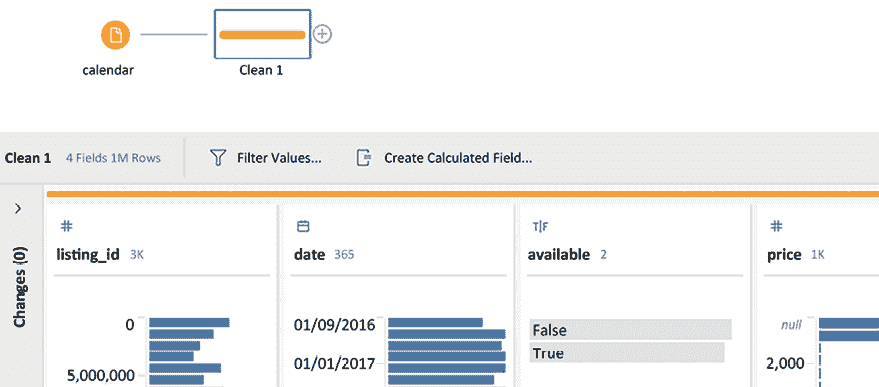
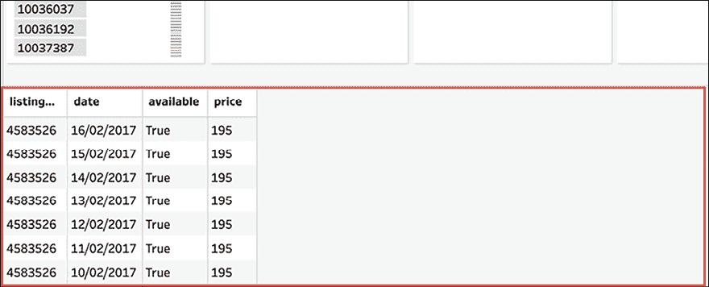
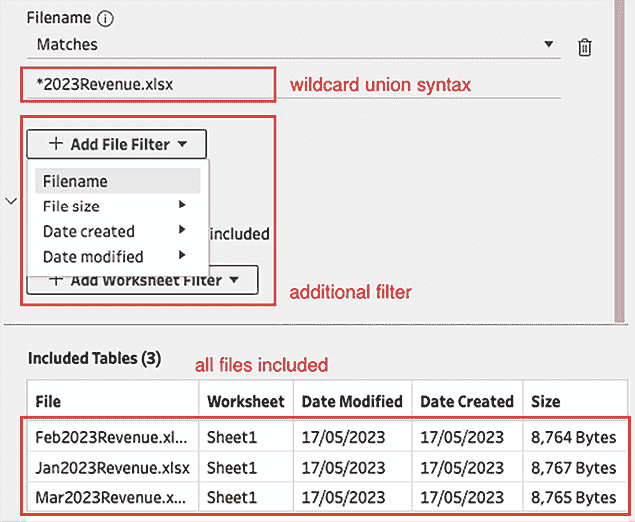

# 第三章：使用 Tableau Prep Builder

Tableau Prep Builder 随 Tableau Desktop 2018.1 版本推出，但我们可以用 Tableau Prep Builder（以下简称本章中的 *Prep*）做些什么呢？该工具的核心目的是数据准备。好消息是，Prep 完全兼容 Tableau Desktop，也兼容 Tableau Server。这意味着你可以通过一键操作在 Prep 中执行数据清理任务。此外，Prep 的可视化程度与其“大哥” Tableau Desktop 一样高，这意味着你可以在完全可视的格式中看到每一步的数据准备过程。

因此，让我们深入了解 **图形用户界面**（**GUI**），并惊叹于这个高端产品，它能帮助你快速获得初步的数据洞察，让你能够更快地决定数据集是否值得分析。Prep 将为更顺畅的 Tableau Desktop 使用体验铺平道路。

本章将讨论以下主题：

+   连接数据

+   Prep 图形用户界面

+   数据质量

+   使用 Prep 的其他选项

+   导出数据

为了开始，我们需要加载数据。如何在 Prep 中执行此操作，将在接下来的章节中描述。

# 连接数据

如果你熟悉 Tableau Desktop，那么 Prep 对你来说就是一个轻松的游戏。其操作和界面非常相似，连接数据时，如果 Prep 提供了连接器，无论是文本文件、数据库还是提取文件，都可以同样操作。乍一看，你可能甚至察觉不到 Prep 和 Tableau Desktop 的界面有何不同，这为你提供了一个方便的优势，即可以立即开始数据准备工作。

开始时，首先打开 Prep，然后点击 **+** 打开一个文件。接下来会出现如下屏幕：


图 3.1：连接数据

从之前的截图中，我们可以看到你可以在搜索栏中选择你想要连接的数据类型。就像在 Tableau 中一样，Prep 的功能包含了多个数据库。

现在让我们通过一个实际的练习来连接一个数据集。对于这个练习，我们需要以下数据集：[`www.kaggle.com/airbnb/boston`](https://www.kaggle.com/airbnb/boston)。请下载 `calendar.csv`、`listings.csv` 和 `reviews.csv`。或者，你也可以从本章在 Tableau Public 上的相关仓库下载：[`github.com/PacktPublishing/Mastering-Tableau-2023-Fourth-Edition/tree/main/Chapter03`](https://github.com/PacktPublishing/Mastering-Tableau-2023-Fourth-Edition/tree/main/Chapter03)。

首先，我们将从 `calendar.csv` 文件开始。通过与文本文件建立连接，并选择你的 `.csv` 文件，将其添加到空白的 Prep 画布中。你现在会看到如下屏幕：


图 3.2：输入数据

恭喜你——你刚刚完成了第一个 Prep 连接。在这里，你可以根据需要操作并可视化你的连接数据集！

在接下来的部分中，我将更详细地描述 GUI。

# Prep GUI

用户体验是一个重要话题，不仅仅是在构建仪表板时，使用 Tableau 的其他方面时也很重要。Tableau 的一大卖点一直是其易用的 GUI，这也是 Tableau 成为其客户深受喜爱的工具之一的原因之一。

Prep GUI 有两个重要的画布可以查看。数据连接到 Prep 后，工作区将被分成几个部分：


图 3.3：Prep 工作区部分

让我们看看从上面的截图中可以看到什么：

**A**：连接窗格，显示您在所选位置可用的输入文件。

**B**：流程窗格，显示您当前的 Prep 流程。这个流程始终从输入步骤开始。

**C**：输入窗格的设置，提供多个选项以配置您的输入。

**D**：输入窗格的示例，显示您移动到连接窗格的字段，包括示例值。

在输入窗格（**C**）中，您可以使用通配符联合（多个文件）功能，从同一目录添加多个文件。同时，您还可以限制 Prep 打印的示例集，以提高性能。在输入窗格示例（**D**）中，您可以选择和取消选择要导入的字段，并更改它们的数据类型。数据类型选项例如字符串、日期或数字。

第二个 GUI 是配置窗格。一旦选择了所需的输入数据，点击流程窗格中的**+**并选择**添加：清理步骤**。此时，配置窗格将显示数据网格：



图 3.4：清理数据

在前面的截图中，配置窗格将数据源中的每一列显示在两个部分中。上部分显示聚合信息。例如，**日期**（列 2）显示每个日期的行数，以小直方图的形式显示。列可以通过点击列名旁边的排序图标（鼠标悬停在列上时会出现的迷你条形图）来排序，并选择一个项目。例如，选择**True**，在**available**（列 3）中。所有相关特性将被高亮显示：


图 3.5：可视化筛选

这使您在开始清理数据之前，就能对数据有一些初步的了解。在以下截图中，每一行的数据都以源数据的形式显示在配置窗格的下部：



图 3.6：数据概览

到目前为止，我们已经看到，在 Prep 中加载数据后，可以通过点击字段或列中的条形图来应用可视化筛选。下方窗格将始终显示所做选择在行级别的数据源。接下来，我们将继续添加更多数据源。

## 了解 Prep

让我们从一个实际的例子开始：

在 `calendar.csv` 文件旁边，连接以下文件：

+   `listings.csv`

+   `reviews.csv`

现在，将它们拖到流程面板上：


图 3.7：多个表格输入

你能回答以下问题吗？

+   有多少房源在描述中使用了“海滩”这个词？

+   标记为“确切位置”的公寓百分比是多少？

+   哪一天输入了最多的评论？

没有像 Prep 这样的工具，解决这些类型的问题要困难得多。Prep 使我们的数据分析过程更加快速和轻松，这也是我鼓励您花更多时间学习 Prep 和 Tableau Desktop 的原因！

解决方案可以在与本章相关的工作簿中找到，网址如下：[`public.tableau.com/profile/marleen.meier`](https://public.tableau.com/profile/marleen.meier)。

在这里，作为一个例子，我对**日期**使用了**排序**功能，以回答第三个问题：*在哪一天输入了最多的评论？*


图 3.8：按日期排序

如你所见，排序这个字段后，日期按照输入数量排列，从而使得回答问题变得非常简单：*在哪一天输入了最多的评论？* 在经过几次点击后，你会发现这一切开始变得很自然，是吗？

你对数据集所做的所有更改都可以在配置文件面板的左侧追溯。但不要忘记为每一步添加一个合适的名称：这将使其他人和你自己更容易理解你的过程。

那么，接下来我们来看看 Prep 的数据质量功能。

# 数据质量

Prep 提供了许多不同的功能。有时，您可能需要使用多个工具来准备数据集，以便将其调整到所需的形状。其他时候，您可能只需运行一个聚合（一个功能）就可以完成。这真的取决于数据集本身和预期的输出。事实上，Prep 输出数据与您在 Tableau Desktop 可视化中所需数据的相似度越高，VizQL 在 Tableau Desktop 上运行的效率就越高。在 Tableau Desktop 中查询越少，仪表板生成就越快。

对我来说，Prep 最棒的地方在于它能够处理海量数据。有时，我甚至会将它用于那些我不想在 Tableau Desktop 中可视化的数据集，只是为了快速查看，比如包含特定词语的行数、需要的列数、如果我筛选某个特定值，日期范围会发生什么变化等等！在几分钟内，我就能得到一些通过数据库查询或 Excel 函数可能需要更长时间才能获得的见解。我希望到本章结束时，您能将数据准备的时间减少一半（至少）。我们将数据准备的功能分为五个子类别：清洗、合并与连接、聚合、透视和脚本。让我们从清洗数据开始！

## 清洗数据

我们在*Prep GUI*部分已经看到过以下画布。要创建清理步骤，用户只需点击输入旁边的**+**并选择**添加：清理步骤**。在清理步骤中，可以执行多个操作，例如筛选或创建计算字段。还要注意 Prep 给出的推荐：


图 3.9：推荐

Prep 分析列内容并提出可能适合该数据的更改。例如，**listing_url**列被识别为网页，因此 Prep 建议将其更改为数据角色 URL。第二个、第三个以及更多在**listing_url**之后的推荐是删除某些列。这可能是因为这些列没有数据或数据量很少。推荐列表继续。

这个功能非常有用，特别是对于不熟悉的数据集。我的工作方式是查看推荐，检查它们是否有意义，然后执行更改——或者不执行。不要盲目相信这些推荐，但它们能指出你可能忽视的数据问题。

数据通常比较杂乱，包括空值、手动输入的拼写错误、不一致的格式、来自其他系统的变动等等。因此，在进行分析或创建仪表板之前，必须先清理这些数据。此部分将向你展示如何在列级别清理数据。

一旦在清理步骤中选择了某个值，你可以选择**仅保留**、**排除**、**编辑值**或**替换为空值**：


图 3.10：快速访问

这些更改不会改变数据源本身。Prep 像是一个中间步骤，或者是原始数据源和你的 Tableau Desktop 之间的一个过滤器。排除某个值，使用图 3.10 中看到的选项，只会将其从 Prep 中移除。但是，如果稍后作为 Tableau Desktop 的输入使用，将无法再将该特定值添加回来。这个选项只会保留在 Prep 中。

另一个稍微隐藏的选项是点击列标题旁的省略号（**...**）（如*图 3.11*所示），然后选择**清理**：


图 3.11：更多选项

这个**清理**功能是基于列的数据类型运作的。在前面的截图中，数据类型是字符串（由**Abc**图标表示）。对于其他数据类型，该选项将变灰，因为**清理**仅适用于字符串类型。该选项使你能够使用八种更多的清理功能：

+   转换为大写

+   转换为小写

+   删除字母

+   删除数字

+   删除标点符号

+   去除空格

+   删除多余空格

+   删除所有空格

数据类型可以在每个列标题的上方更改；你会在列名上方找到一个符号，可以通过点击它进行更改，就像在 Tableau Desktop 中一样：


图 3.12：更改数据类型

这在 Prep 错误解释某一列的数据类型时非常有用。错误的数据类型分配会影响您在该列上执行的计算，以及 Tableau Desktop 如何可视化该列。

在接下来的部分中，我们将练习合并多个数据集。您可能想要合并订单数据与运输数据（使用联接），或者将 2020 年的销售数据附加到 2019 年的销售数据集中（使用合并）。要了解如何操作，请继续阅读！

## 合并与联接

我们现在将联接这三个数据集，以便我们可以一起分析和可视化它们。三个数据集（`listings.csv`、`reviews.csv` 和 `calendar.csv`）的特性要求进行联接而非合并。不过，我仍会向您展示合并的步骤，以便您了解何时需要使用它！

### 添加合并

在 Tableau 中，合并是将数据附加到现有数据集中的操作。想象一下，您有两个 Excel 文件。它们都有完全相同的表头，但一个包含 2019 年的数据，另一个包含 2020 年的数据。如果将 2020 年的数据合并到 2019 年的数据中，您会将 2020 年文件的行附加到 2019 年文件的行下方。执行合并时，两个数据集需要几乎相同的布局/表头。为什么是“几乎”？您将在接下来的练习中看到：

1.  开始此练习时，您的 Prep 流程面板应该如下所示：


图 3.13：流程面板

1.  通过点击 **+** 按钮旁边的 **listings** 数据集来添加清洗步骤。

    您可以通过右键点击某个步骤并选择 **编辑颜色** 来根据您的喜好更改每个步骤的颜色。

1.  选择 **host_identity_verified** 列并过滤 **True**：


图 3.14：按 True 进行过滤

1.  现在，创建一个计算字段，称为 `DatasetA_ID`，其中只包含字符串 `'A'`：


图 3.15：创建计算字段

1.  从相同的 listings 数据中创建第二个清洗步骤，这次在 **host_identity_verified** 列中过滤 **True**：


图 3.16：按 True 进行过滤

1.  创建一个计算字段 `DatasetB_ID`，其中只包含字符串 `'B'`，使用在 *图 3.15* 中显示的相同过程。右键单击并点击 **重命名** 来重命名步骤，有助于跟踪所应用的更改。您的流程应该如下所示：


图 3.17：视觉流程

1.  您现在已经创建了两个可以通过合并结合的数据集，而不需要更改原始数据。通过选择 **Union**（在点击 **Dataset A** 旁边的 **+** 后）或者将一个步骤拖到另一个步骤上（**Dataset B** 在 **Dataset A** 上方，或反之）来合并这两个数据集：


图 3.18：合并

1.  通过点击 **Union 1** 并查看屏幕左下角的输入详情来检查所有字段是否匹配：


图 3.19：视觉检查

1.  在前面的截图中，你可以看到左侧是关于联合的信息。自上而下依次是：**Inputs**及其各自的颜色（这些颜色与流程面板中的颜色相同），**Resulting Fields**，显示有 2 个不匹配的字段，最后是**Mismatched Fields**本身：**DatasetA_ID**和**DatasetB_ID**。每个不匹配字段旁边的颜色表示我们的**DatasetB_ID**字段在**DatasetA**中不存在，而**DatasetA_ID**字段在**DatasetB**中不存在。

1.  在这种情况下，我们知道即使命名约定不同，这些列也可以被追加。两个字段的更好命名应该是**Dataset_ID**（你可以回到之前的步骤试试看）。这样，Prep 就不会显示任何不匹配的情况。对于我们这里的操作，我们可以直接将一个字段拖动到另一个字段上方进行合并，从而允许 Prep 将它们视为一个列：


图 3.20：合并

1.  你可以看到**Resulting Fields**现在显示 0 个不匹配项，且两个数据集的颜色已在列标题下方的条形图中显示：


图 3.21：颜色编码

1.  通过选择并右键点击联合步骤，将**Union 1**重命名为**listings2**，并在你需要时，通过选择并右键点击联合步骤，点击**Add Description**来添加描述—现在所做的额外工作将有助于你以后进行复制、文档编写和解释。

恭喜，你的第一个联合成功了。我们首先将原始的列表数据集拆分成两个，然后再合并成一个。像我们这样将具有相同布局的数据堆叠在一起，是联合的典型任务。

### 通配符联合

你也可以选择告诉 Prep 哪些文件需要联合，而不是像我们在前一部分那样将一个数据输入拖动到另一个数据输入上方。通常，部门会有一个共享的位置，用来存储例如名为**Jan2023Revenue**、**Feb2023Revenue**、**Mar2023Revenue**等的 Excel 文件。如果你遇到这种情况，你可以执行以下操作：

1.  将 Prep 连接到你想使用的任何一个文件。

1.  点击输入数据图标，并选择**Tables**标签。现在你可以看到，在某些条件下，你可以创建一个联合：


图 3.22：Tables 菜单视图

1.  我将在同一目录中选择所有匹配的文件名，这些文件名以（*****）开头，并以**2023Revenue.xlsx**结尾。如你所见，1 月、2 月和 3 月的文件都会被包含在内，你甚至可以通过使用**File**和**Worksheet**筛选器来过滤输入，并在完成时点击**Apply**：



图 3.23：过滤联合

这就是通配符联合功能。它真的很强大！试试看，亲自体验一下。

### 添加连接

现在，我们将继续在相同的流程面板中工作，并重点关注连接。简要回顾一下，连接是横向追加数据。一般来说，联合会增加行数，而连接会改变列数：

1.  将**listings2**拖动到**reviews**上，直到出现**连接**选项。


图 3.24：连接

1.  选择**reviews**中的**listing_id**和**listings2**中的**id**作为连接字段。请注意，你可以通过点击**连接类型**下的维恩图标来更改连接类型：

    图 3.25：视觉检查连接

    上面的概述告诉我们，所有`68,275`行**评论**数据集中的数据都与**listing2**数据集中的一行匹配。然而，我们的**listing2**数据集中有`756`行不匹配。我们的**连接结果**因此为`68,275`行。但很可能并非所有的房源都有评论，因此我们可以合理地假设我们的连接按预期工作。

1.  另一个检查方法是将连接更改为完全外连接，然后稍后在 Tableau Desktop 中深入分析数据。要进行完全外连接，只需点击两个圆的外边缘：


图 3.26：全连接

1.  如果你想查看即时结果，只需右键点击，例如，连接符号（由维恩图标表示，如下截图所示），然后选择**在 Tableau Desktop 中预览**，即可在 Tableau Desktop 中查看数据：


图 3.27：预览

1.  我们还可以重新命名这一步骤；让我们将连接的名称改为`lis&rev`。

到现在为止，我们已经了解了如何清洗数据，以及如何使用联合和连接。联合部分教会我们如何将数据垂直追加或一个接一个地放在一起。连接部分让我们能够将数据横向合并或并排显示。更具体地说，我们能够将房源信息与其对应的评论结合起来。这样一来，我们不再有两个数据集，而是创建了一个数据集，让我们可以查找某个房源的评论，并在同一行中查看与房源本身相关的所有数据，例如房源类型、卧室数量、是否有海景等等。

接下来，让我们继续进行聚合步骤。

## 聚合

聚合用于当你想改变数据粒度时。在我们的数据集中，每一行对应一条评论。然而，我们想看看在波士顿做 Airbnb 的房东，如果在这个行业的时间更长，他们的评论是否更多，而那些新近开始的房东评论较少。为了实现这一目标，我们需要按房东开始提供房源的年份来聚合评论数量。**host_since**字段将为我们提供有用信息，**reviewer_id**字段也会提供帮助。对于后者，我们将计算留下评论的不同评论者。让我们开始吧！

我们当前的流程面板看起来是这样的：


图 3.28：流程面板

要对评论数量进行聚合，请执行以下步骤：

1.  首先，点击**lis&rev**旁边的**+**号，选择**聚合**：

图 3.29：聚合

1.  这将打开一个名为**聚合 1**的窗口。我们的目标是查看每年有多少人对住宿进行了评论，从主持人开始提供房源的年份算起；因此，请执行以下操作。

    1.  使用**附加字段**窗格中的搜索字段，如*图 3.30*左侧所示，通过拖放将**host_since**字段添加到**分组字段**中。

    1.  将**reviewer_id**添加到**聚合字段**，同样通过拖放的方式。请注意，默认的聚合方式是**SUM**，如右侧箭头所示：

    图 3.30：聚合字段

1.  点击**聚合字段**下的**SUM**，然后将其更改为**计数去重**，以改变**reviewer_id**的聚合方式：


图 3.31：计数去重

1.  这将把默认的聚合方式**总和**（即每条评论都会被计算）更改为**计数去重**，即计算去重后的评论者 ID 聚合。这将帮助我们专注于有多少不同的评论者留下了评论。这只是一个任意的选择，欢迎尝试其他聚合方式，看看数据如何变化。

通过右键点击流程面板中的**聚合**步骤，并选择**在 Tableau Desktop 中预览**，我们来看看 Tableau Desktop 预览：


图 3.32：主机图表

在前面的截图中，我们可以看到每个**host_since**日期的评论去重计数。当然，在这个特定示例中，如果没有 Prep 的帮助，Tableau Desktop 也可以按**host_since**日期计算评论数，前提是这些字段是唯一拖入视图中的。但在将数据导入 Tableau Desktop 之前进行聚合的好处是，你需要导入的数据量更少，因此可能会实现更好的性能。如果你想继续在 Prep 或 Tableau Desktop 中分析数据集，现在你可以提出进一步的问题，例如：

+   哪种类型的住宿在住一周而不是住一天时享有最高折扣？

+   住宿大小与月租价格之间有相关性吗？

+   有多少比例的房东有多个房源？

祝你好运，快乐地构建仪表板！

我们将在这里结束这一部分，并回顾一个由仅 9 个数据点组成的图表，这是我们通过按房东开始提供房源的年份聚合了近 64,000 行**reviewer_id**数据后创建的。图表讲述了一个故事；而 64,000 行单独的数据并没有。这就是为什么始终减少数据量，并尽可能进行聚合是如此重要的原因。在下一部分，我们将讨论另一个重要的功能：透视。

## 透视

你是否遇到过将字段拖到 Tableau Desktop 行和列架上，但可视化效果并不如预期的情况？很可能是你需要“旋转”数据，或者更准确地说，需要对数据进行 pivot。如果你期望在一个列中出现的数据分布在多行中，而实际数据却出现在多个列中，那就是需要 pivot 的情况。以下例子将展示一个需要 pivot 的场景。

在我们的 pivot 示例中，我们将使用另一个数据集。你可以在 [`github.com/PacktPublishing/Mastering-Tableau-2023-Fourth-Edition/blob/main/Chapter03/Excel_Pivot.xlsx`](https://github.com/PacktPublishing/Mastering-Tableau-2023-Fourth-Edition/blob/main/Chapter03/Excel_Pivot.xlsx) 找到它。这个数据集非常简单，内容如下：


图 3.33：Excel 输入

它包含了在五个不同的日子里观察到的三种不同颜色，每种颜色被观察了 *x* 次。这些数据是一个典型的例子，展示了在数据整理时，pivot 操作的作用，因为有多个列具有相同的用途——**B**、**C** 和 **D** 都是观察值。如果你想要可视化这个表格，它可能看起来如下：


图 3.34：Pivot I

但你可能会想，既然颜色方案已经表明了哪种颜色被观察过，是否最好把三条线放在一个图表里？在同一个折线图中为每种颜色绘制一条独立的线？我们来实现这一目标！

首先将 `PivotDataSet` 连接到 Prep，然后按照以下步骤对数据进行 pivot：

1.  从 Prep 中连接到我们刚创建的 Excel 文件，并将 **PivotDataSet** 添加到流程窗格中，点击输入数据步骤旁边的 **+**，选择 **Pivot**。这时会出现一个名为 **Pivot 1** 的新步骤：


图 3.35：添加 Pivot 步骤

1.  在流程窗格中点击 **Pivot 1** 步骤，*图 3.36* 会出现在 Prep 窗口的底部。从 **步骤 I** 显示的 **字段** 窗格中选择所有三种颜色，并将它们拖到 **Pivoted Fields** 窗格中，如 **步骤 II** 所示：


图 3.36：Pivot 步骤

1.  现在，查看 **Pivot Results** 窗格，如前面的截图中 **步骤 III** 所示，右键点击并选择 **重命名**，将 **Pivot1 Names** 重命名为 **Colors**，将 **Pivot1 Values** 重命名为 **Observations**。然后点击 **Pivot 1** 旁边的 **+**，嘿，我们现在有了一个干净的表格，名为 **Clean 1**：


图 3.37：Pivot 结果

1.  还记得我们一开始的问题吗？现在我们可以用不同的方式创建折线图，如 *图 3.38* 所示。请注意，**Colors** 现在是一个维度，而 **Observations** 是它自己的字段，之前它们位于每种颜色的列标题下：


图 3.38：Pivot 后的折线图

这是一个简单的透视应用案例，但这里的技巧可以转移到任何其他数据集。Prep 有内置的推荐功能。每当你在某列的右上角看到一个灯泡图标时，检查一下，看看这个推荐是否适合你的需求。


图 3.39：修剪空格

在这种情况下，Tableau 建议我们移除所有的前导和尾随空格，这正是我们需要的！正如这里所示，检查推荐功能总是值得的。

完美；你已经完成了主要的 Prep 功能设置。然而，你可能会想，如果需要进一步的准备该怎么办。没问题，Prep 会帮你解决。脚本功能是 Prep 中最新的添加，也是最强大的功能之一；它几乎是无限制的！继续阅读，探索 Prep 的脚本功能。

## 脚本

接下来我们将讨论的脚本功能是 Tableau 最近添加的功能之一。我们将接着讨论它，因为像 `Python` 或 `R` 这样的编程语言为你提供了无限的灵活性。如果你遇到 Prep 功能的局限，可以使用脚本并编写你自己的代码来实现你想要的功能。

为了使用它，你必须先在 Tableau 外部连接 Python（或 R）。以下步骤基于[`help.tableau.com/current/prep/en-us/prep_scripts_TabPy.htm`](https://help.tableau.com/current/prep/en-us/prep_scripts_TabPy.htm) 中 Python 的说明，或者[`help.tableau.com/current/prep/en-us/prep_scripts._R.htm`](https://help.tableau.com/current/prep/en-us/prep_scripts._R.htm) 中 R 的说明。

对于这个练习，我们将使用 Boston Airbnb 数据集，具体来说是 `calendar` 表格。从 [`www.kaggle.com/airbnb/boston`](https://www.kaggle.com/airbnb/boston) 下载这个数据集，并连接到 Prep 中的 `calendar` 表格：


图 3.40：日历数据集

现在，让我们退后一步，将 Python 连接到 Prep：

1.  从 [python.org](http://python.org) 下载并安装 `Python`（或从 [`www.r-project.org/`](https://www.r-project.org/) 下载并安装 `R`）。

1.  通过在终端或命令行中执行以下命令，下载并安装 `TabPy`：

    ```py
    pip install tabpy 
    ```

1.  如果使用 `R`，可以打开 `R` 并执行：

    ```py
    install.packages("Rserve", , "http://rforge.net") 
    ```

1.  通过输入以下命令，在命令行/终端中打开 `TabPy`：

    ```py
    tabpy 
    ```

    或者，在 R GUI 中，输入：

    ```py
    library(Rserve)
    Rserve() 
    ```

1.  回到 Prep，点击日历表右侧的 **+**，并添加一个 **Clean Step**。

1.  添加一个名为 **PythonTest** 的计算字段（如果你选择使用 `R` 进行实验，请改用 **RTest**），并赋值为字符串 `"Test"`：


图 3.41：PythonTest

1.  现在，点击 **Clean 1** 步骤右侧的 **+**，并添加 **Script**。

1.  通过选择**脚本**步骤，底部的**设置**面板（见*图 3.42*）将为你提供连接**Rserve**或**TabPy**的选项。**Rserve**是`R`的 Tableau 服务器，而**TabPy**是 Python 的 Tableau 服务器。

1.  选择你的连接类型，选择**Rserve**或**Tableau Python (TabPy) 服务器**。然后打开**帮助** | **设置和性能** | **管理分析扩展连接**。在弹出的窗口中，通过使用**localhost**和**4912 端口**（如果使用 R，请选择 Rserve 并使用**localhost**和**6311 端口**）将 Prep 连接到`TabPy`，然后点击**登录**：

    +   如果使用 SSL 加密的 Rserve 服务器，**4912 端口**是默认端口。

    图 3.42：TabPy 服务器

1.  接下来，如果进行 Python 实验，创建一个包含以下代码的`.py`文件，并确保缩进完全一致：

    图 3.43：.py 文件

    或者，创建一个包含以下代码的`.R`文件：

    ```py
    Get ChangeString<- add_column(
    .data, 
    .before = 'Test'
    .after = 'R') {
    Return (data.frame ())
    } 
    ```

1.  我们刚才创建的脚本是用来更改 Prep 中现有列并将每一行从`Test`重命名为`Python`或`R`，取决于你选择的语言。

1.  我们将继续使用 Python 脚本。回到 Prep，浏览我们刚刚创建的`.py`文件，并将函数名添加到 Prep 界面。我将文件命名为`PrepTableau.py`，函数名是`ChangeString`，如前一步所定义：


图 3.44：添加一个函数

1.  注意到**PythonTest**列已从**Test**更改为**Python**：


图 3.45：PythonTest

我们的小实验成功了！尽管我们使用了一个非常简单的例子，但它证明了脚本功能是有效的，你可以尽情发挥创意，探索脚本可能做的其他事情。示例包括从计算逆正态分布到进行情感分析或聚类的机器学习。

你可能已经注意到，我们在脚本中没有直接导入`pandas`，但仍然使用了`pandas`的 DataFrame。这是因为`pandas`的导入是随`TabPy`一起提供的。你可以在打开`TabPy`后，在命令行/终端中看到这一点：


图 3.46：在命令行中导入 pandas

如果你想在脚本中使用其他库，可以通过在命令行/终端使用`pip install`来安装它们。安装完成后，你只需重新启动`TabPy`，就能使用它们。记住，始终先在终端/命令行中打开`TabPy`，否则 Prep 无法执行脚本。

在写作时，Prep 尚不支持将脚本作为输入—不过，你可以使用一个虚拟的`.csv`文件作为解决方法，并在流程中紧接其后添加脚本。

# 使用 Prep 的附加选项

本节将讨论一些较小的独立功能，这些功能非常强大且全新。你们中的一些人可能自从 Prep 首次发布以来就已经在使用它。随着每次发布和每个新增用户及反馈的收集，Tableau 能够创建一个功能优先级列表，列出利益相关者——像你我这样的人——真正希望看到的功能。接下来的主题就是其中一些最好的例子。这些功能在初始版本中并不存在，但它们使得产品变得更加优秀、更加有价值、更加完整。现在，你可以保存部分流程并重用它，向外部数据库写回数据，刷新数据集的部分内容，并使用 Tableau 数据管理附加组件安排流程。让我们仔细看看，首先从“插入流程”功能开始。

## 插入流程

Prep 中的一个选项是将现有的流程添加到你自己的流程中。例如，假设某人已经在 Boston Airbnb 数据集上工作，并且只创建了突出显示步骤的流程：


图 3.47: 保存到文件

你可以通过右键点击并选择**保存到文件**，如*图 3.47*所示，保存你希望插入到流程中的步骤。这些步骤可以通过右键点击画布，选择**插入流程**，然后浏览你的 `.tfl` 文件来将之前下载的文件插入到流程中：


图 3.48: 插入流程

这个功能非常方便，可以共享工作并重用已经创建的步骤。接下来，我们将探讨另一个功能，它将允许你刷新在 Prep 流程中使用的数据：增量刷新。

## 增量刷新

Prep 2020.2 引入了增量刷新功能。在完成一个流程并添加输出后，你可以决定是否选择全量刷新或增量刷新，并选择作为指示器的字段。假设你有一个特定疾病每天感染人数的数据集。每天结束时，你希望将来自卫生部门数据库的新数据添加到数据集中。那么，你该怎么办？

通常，你会在添加最新数据点后加载整个数据集，所有数据都会加载。但对于比当天数据点更早的数据，数据不会改变；你之前已经加载过它们。因此，重新加载整个数据集是一种资源浪费。增量刷新只会加载新的数据点，并将其添加到已经建立了多日的数据中。你可以想象这将节省多少时间和精力。相比完全刷新，这是一个更可持续的方式来保持数据的更新。

我们将查看以下工作流中的一个示例。重要的是，**输出**步骤必须是流程的一部分：


图 3.49: 增量刷新

要添加增量刷新，请按照以下步骤操作：

1.  点击数据输入步骤，向下滚动到**设置**标签，直到看到**增量刷新**选项。然后，勾选**启用增量刷新**框：


图 3.50：设置增量刷新

1.  在你点击**启用增量刷新**框后，会出现一个下拉菜单。该下拉菜单包含 Prep 认为在数据刷新时作为指标有用的所有字段。例如，选择**日期**字段。它是一个完美的字段，因为一旦原始数据源中添加了新的日期，刷新就会开始。

1.  Prep 还会要求你选择一个输出字段，该字段将代表输出中的**日期**列。在我们的例子中，它仍然是**日期**：


图 3.51：选择输出字段

1.  设置完成后，再次点击**输出**步骤，注意现在你可以通过点击**运行流**选项旁边的下拉菜单来选择你偏好的刷新类型（全量或增量）：


图 3.52：刷新选项

你刚刚学会了如何设置数据刷新——全量刷新和增量刷新。这将帮助你在可持续使用计算资源的同时，确保数据始终是最新的。接下来，我们将介绍另一个值得调查的 Tableau 功能——批量重命名。

## 批量重命名

这个功能确实节省时间！只需选择你希望重命名的列，右键单击并选择**重命名字段**。会打开一个新视图，允许你为每个选定的列添加前缀或后缀，或者替换它们中的特定文本：


图 3.53：批量重命名操作

你还可以利用**查找文本**功能，或自动重命名所有可能在后期阶段加入的新字段，例如，因为 IT 部门向数据集中添加了额外的列。

## Tableau Prep Conductor

使用**Tableau Prep Conductor**，你可以将 Prep 流发布到 Tableau Server，安排它们在特定时间运行，并始终保持数据刷新。该工具包含在 Tableau 数据管理附加组件中，并不随 Tableau Desktop 或 Prep 一起提供。

更多信息，请访问[`www.tableau.com/products/add-ons/data-management`](https://www.tableau.com/products/add-ons/data-management)。

# 导出数据

最后但同样重要的是，我们可能希望导出数据。我们之前看到，在流面板中右击符号会提供在 Tableau Desktop 中预览数据的选项：

1.  如果你希望流按照计划运行或保存到某个位置，最好使用**添加** | **输出**。

1.  完成此操作后，将出现以下屏幕：


图 3.54：保存到文件

1.  用户现在可以选择将数据保存到文件中，还可以将其保存为`.hyper`的 Hyper 文件格式，或`.xlsx`（Tableau 2021.1 的新功能）格式，或者保存为`.csv`文件。

1.  另一种选择是将新生成的数据源直接发布到 Tableau Server，并使其他用户可以使用它。选择**发布为数据源**而不是下拉菜单中的**保存为文件**。

1.  Tableau 2020.3 添加了一个第三个保存 Prep 输出的选项：将结果数据写入外部数据库。如果你想这么做，从下拉菜单中选择**数据库**表选项。撰写本文时，七个数据库与写回功能兼容，但将根据用户需求添加更多数据库：


图 3.55：保存到外部数据库

自 Tableau 2022.3 版本以来，你还可以将数据写回到 CRM Analytics。为此，你需要一个 Salesforce 账户和相应的许可证。因此，我们不会进一步讨论这个选项，但如果你是 Salesforce Analytics 用户，可以查看这个功能！

本节展示了如何保存我们的工作，尤其是如何保存我们的 Prep 流程输出。对我来说，能够将输出保存到外部数据库是最好的新功能，因为它是将我的输出以结构化和组织化的方式与他人共享的最简单方法。因此，不仅我自己，其他用户也可以使用已准备好的数据，避免了额外的工作。然后，这个流程不仅我可以重复使用，任何人都可以使用。

# 摘要

我们从介绍 Prep 开始了本章内容。我们查看了 GUI 以及如何将数据连接到其中。之后，我们做了一些关于数据准备的练习。这些可以分为五个部分：数据清洗、联合与连接、聚合、透视和脚本。我们还考虑了一些额外的选项，以提高数据的实用性，包括插入其他流程的步骤和增量刷新。为了总结本章的 Prep 内容，我们查看了数据导出。在这里，我们看到新数据集可以保存为文件或数据提取，可以写回到外部数据库，或者直接推送到 Tableau Server。

就像 Tableau Desktop 一样，Prep 非常易于理解且高度视觉化。颜色、符号和高亮使得我们能够轻松上手这个提取、转换和加载工具，它在操作 Tableau 主界面之前，准备数据时是不可或缺的！

在下一章中，我们将继续探索 Tableau 中的数据。我们将通过查看连接、混合和数据结构来探索如何为 Tableau 准备数据。

## 在 Discord 上了解更多

要加入本书的 Discord 社区——在这里你可以分享反馈、向作者提问，并了解新版本发布——请扫描下面的二维码：

[`packt.link/tableau`](https://packt.link/tableau)


