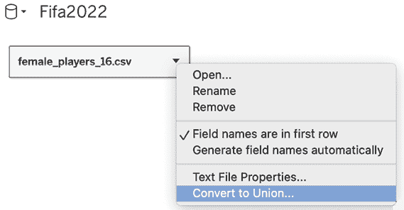
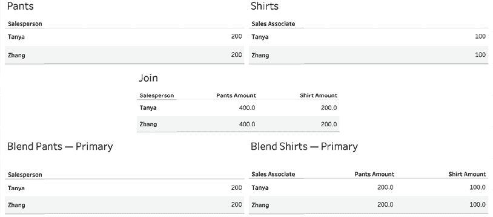
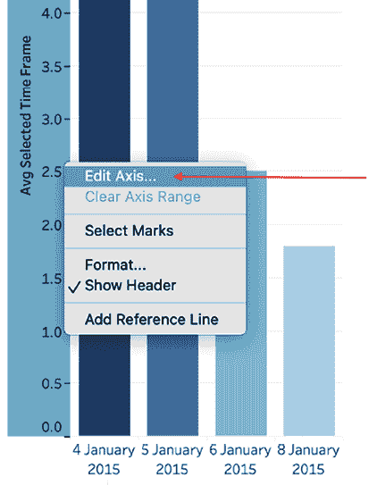

# 第四章：学习连接、混合和数据结构

连接 Tableau 到数据通常不仅仅意味着连接到单个数据**源**中的一个表。你可能需要使用 Tableau 将来自单个数据源的多个表连接起来。为此，我们可以使用连接功能，它会将一个数据集的行与另一个数据集的行合并，如果给定的键值匹配。你还可以连接来自不同数据源的表，或者联合具有相似元数据结构的数据。

有时，你可能需要合并没有共享共同行级键的数据，这意味着如果你像连接操作一样在行级别匹配两个数据集，你会复制数据，因为一个数据集中的行数据比另一个数据集的行数据更加详细（例如，包含城市），而另一个数据集可能包含国家。在这种情况下，你需要混合数据。此功能允许你，例如，在不将城市数据集更改为国家级别的情况下，显示每个国家的城市数量。

此外，你可能会发现有必要对单个数据源创建多个连接，以便从不同角度透视数据。通过操作数据结构，这是可能的，它可以帮助你从不同的角度使用相同的数据集进行数据分析。这样做可能是发现那些使用单一数据结构难以或根本无法解答的问题所必需的。

本章我们将讨论以下主题：

+   关系

+   连接

+   联合

+   混合

+   理解数据结构

在 2020.2 版本中，Tableau 添加了一个功能，允许你在不指定两种方法之一的情况下进行连接或混合。这就是**关系**功能。我们将在本章开始时解释这一新特性，然后再深入探讨连接、混合等的细节。

# 关系

尽管本章将主要集中讨论连接、混合以及数据结构的操作，但我们首先从**关系**的介绍开始：这是自 Tableau 2020.2 版本以来新增的功能，Tableau 社区一直在期待这一功能。它是数据画布中的默认选项；因此，我们将首先研究**关系**，它属于**数据模型的逻辑层**，然后再深入探讨在**物理层**上操作的连接和联合功能。

要详细了解 Tableau 数据模型的物理层和逻辑层，请访问 Tableau 帮助页面：[`help.tableau.com/current/online/en-us/datasource_datamodel.htm`](https://help.tableau.com/current/online/en-us/datasource_datamodel.htm)。

现在，你可以将逻辑层理解为能够更智能地计数。假设有一个包含唯一客户姓名的客户表和一个记录了数百条订单的订单表。在逻辑层中，一个有多个订单的客户姓名（因此在订单表中会有多个订单和客户 ID 行）将被计为一个客户，因为逻辑层非常智能，能够识别客户姓名，而物理层则会将每个订单当作一个客户，因此如果同一客户下了多个订单，物理层会把这个客户计算为多个客户。你只能通过计数不同的值来解决这个问题（但使用逻辑层时不需要这样做）。

在下图中，你可以看到数据源画布，左侧是通过关系组合的两个数据集，右侧是通过 **连接** 组合的相同数据集。请注意，关系仅在表之间显示一条线（**订单**、**人员** 和 **退货**），而连接则通过两个圆圈表示连接类型：


图 4.1：数据源画布中的关系和连接

一个关键的区别是，数据预览的底部只会显示来自关系中所选表的数据，而在使用连接时会显示所有数据。这是有道理的，因为在关系中，数据的粒度可能会发生变化，具体取决于你在仪表板中使用的字段。然而，连接具有固定的粒度级别，该级别由你选择的连接类型和连接子句定义。

关系是 Tableau Desktop 2020.2 及更高版本的默认设置。然而，如果你仍然希望使用连接功能，你可以将数据集拖入数据源画布，点击下拉箭头，并选择 **打开…**：


图 4.2：从关系到连接画布

这将以你在 Tableau 2020.2 之前的版本中常见的方式打开数据集，你将能够以旧有方式使用连接，正如我们在 *连接* 部分中所描述的那样。

在关系中的两个数据集之间的线（基于逻辑层）被称为 **面条**，因为它看起来像有嚼劲的意大利面 **–** 好吃！当你将第二个数据源拖入数据源画布时，Tableau 会立即检测到一个关系，但你可以通过点击面条本身，添加更多的键列或删除和调整它们。


图 4.3：关系键

如果你在 Tableau 2020.2 或更高版本中打开旧版仪表板，你会看到已连接的数据将显示为 **已迁移**。这是故意为之。只需点击已迁移的数据源，Tableau 将从逻辑层切换到物理层，这意味着你将看到基于连接的数据源画布，而不是关系画布。

查看工作表时，您也会注意到一些差异。您会看到，在新的关系布局中，列首先按表名划分，然后按每个数据源中的**维度**和**度量**进行拆分，而在连接中，列按**维度**和**度量**拆分，并按表名进行划分。

总结关系，新的数据源布局使得合并数据集变得更加容易，您无需事先决定是否要进行连接或合并。习惯了旧版数据源窗格的人可能需要适应新的灵活性，但对于新用户来说，从一开始就更容易处理不同的数据集。尽管如此，我们仍然会接着讲解连接，特别是因为该功能仍然是 Tableau 物理层的一部分。

# 连接

本书假设读者具备基本的连接知识，特别是内连接、左外连接、右外连接和全外连接。如果您不熟悉连接的基础知识，可以考虑参加 W3Schools 的 SQL 教程，网址为[`www.w3schools.com/sql/default.asp`](https://www.w3schools.com/sql/default.asp)。基础知识不难，因此您很快就能掌握。

以下截图展示了三个相关的数据集：


图 4.4：相关数据集

为了更好地理解 Tableau 在连接多个表时对数据的处理方式，我们将探索连接查询。

## 连接查询

以下截图展示了在*图 4.4*中的联合数据集：


图 4.5：连接裁剪

上述截图展示了**订单**和**退货**表之间的内部连接，通过共同的键**订单 ID**进行连接。**订单**和**人员**表通过共同的键**区域**连接。

为了更好地理解刚才描述的内容，我们将继续进行一个连接裁剪练习。我们将查看 Tableau 在使用这两个表构建简单视图时生成的 SQL 查询，这将向我们展示在简单的拖放操作下，Tableau 在后台做了什么。

请按照以下步骤操作：

1.  从[`public.tableau.com/profile/marleen.meier/`](https://public.tableau.com/profile/marleen.meier/)下载与本章相关的工作簿。

1.  选择**连接裁剪**工作表，点击**示例 - 欧盟超级商店连接**数据源。

1.  从菜单中选择**帮助**，然后选择**设置与性能**，接着选择**开始性能记录**：


图 4.6：开始性能记录

1.  将**人员**拖到**行**货架，并将**销售**放到**文本**货架上：


图 4.7：拖放操作

1.  通过**帮助**，然后选择**设置与性能**，最后选择**停止性能记录**来停止记录。

1.  在生成的**性能摘要**仪表板中，将时间滑块拖动到`0.0000`，并选择两个绿色条形图：**执行查询**。现在，您会看到 Tableau 生成的两个 SQL 查询：


图 4.8：性能记录

到目前为止，我们已经将 Tableau 连接到我们的数据集，然后创建了一个非常简单的工作表，显示了每个人的销售数量。但为了让 Tableau 显示人名和销售金额，它需要从两个不同的表格中获取数据：**订单**和**人员**。*图 4.8*中的性能记录显示了构建仪表板的每个步骤花费的时间以及发送到数据库的查询。由于我们首先将维度拖入工作表，然后再拖入度量，因此我们看到两个查询。第二个查询结合了两个拖动的字段，因此我们将重点关注后者。让我们详细看看：

```py
"SELECT ""People"".""People"" AS ""People"",
  SUM(""Orders"".""Sales"") AS ""sum:Sales:ok""
FROM ""TableauTemp"".""Orders$"" ""Orders""
  INNER JOIN ""TableauTemp"".""People$"" ""People"" ON (""Orders"".""Region"" = ""People"".""Region"")
  INNER JOIN ""TableauTemp"".""Returns$"" ""Returns"" ON (""Orders"".""Order ID"" = ""Returns"".""Order ID"")
GROUP BY 1" 
```

注意，表格之间生成了内连接。这是 Tableau **连接功能**背后的一个视图。

现在技术细节已经讨论完毕，让我们来看看仪表板中的连接。

## 连接计算

在 Tableau 中，可以基于计算连接两个文件。你可以使用此功能来解决两个数据源之间的不匹配问题。计算连接可以在每个连接的下拉菜单中找到。

请参见以下截图：


图 4.9：创建连接计算...

举个例子，假设一个数据集包含一列**名字**和另一列**姓氏**。你想将其连接到一个包含**姓名**列的第二个数据集，该列包含姓名和姓氏。连接这两个数据集的一种方式是在第一个数据集中创建一个**连接计算**，如下所示：

```py
[First Name] + ' ' + [Last Name] 
```

现在，选择第二个数据集中**姓名**这一列，确保你的键匹配！

如果你想了解更多关于计算连接的内容，请查看 Tableau 帮助页面：[`help.tableau.com/current/pro/desktop/en-us/joining_tables.htm#use-calculations-to-resolve-mismatches-between-fields-in-a-join`](https://help.tableau.com/current/pro/desktop/en-us/joining_tables.htm#use-calculations-to-resolve-mismatches-between-fields-in-a-join)。

## 空间连接

在 Tableau 2018.2 中，**空间连接**功能被添加了。这意味着你可以连接来自 MapInfo 表格以及 Shape、Esri、KML、TopoJSON 和 GeoJSON 文件的空间字段。你还可以使用 CSV 或 Excel 文件，并通过使用 Tableau 的`MAKEPOINT`函数将数据转换为空间数据（见*第十二章*，利用高级分析）。实际操作中，假设有两个数据集，一个是关于流域位置的，指示了一个空间字段，另一个数据集包含水鸟目击位置，同样是一个空间列。Tableau 允许你将这两个数据集合并，而这在其他情况下非常困难，因为大多数程序不支持空间数据。

要在空间列上连接，你必须从**连接**下拉菜单中选择**相交**字段，只有在处理空间数据时才能看到该选项。

有关在 Tableau 中连接空间文件的更多信息，请阅读 Tableau 提供的以下资源：

+   [`help.tableau.com/current/pro/desktop/zh-cn/maps_spatial_join.htm`](https://help.tableau.com/current/pro/desktop/zh-cn/maps_spatial_join.htm)

+   [`www.tableau.com/about/blog/2018/8/perform-advanced-spatial-analysis-spatial-join-now-available-tableau-92166`](https://www.tableau.com/about/blog/2018/8/perform-advanced-spatial-analysis-spatial-join-now-available-tableau-92166)

+   [`help.tableau.com/current/pro/desktop/zh-cn/maps_spatial_join.htm`](https://help.tableau.com/current/pro/desktop/zh-cn/maps_spatial_join.htm)

+   [`help.tableau.com/current/pro/desktop/zh-cn/examples_spatial_files.htm`](https://help.tableau.com/current/pro/desktop/zh-cn/examples_spatial_files.htm)

相较于水平连接，你可能需要垂直连接，也叫做**联合**。一个典型的联合使用场景是可视化存储在多个文件或表格中的数据，这些数据是随着时间的推移而变化的。你可能有一个每日报告，其中列的结构相同，但每天都作为一个新文件存储在一个按月或按年命名的文件夹里。

合并这些文件比逐一查看它们能提供更多的洞察！你将能够分析趋势、日常或年度变化，或进行年初至今的分析。因此，我们将继续深入讲解 Tableau 中的联合操作。

# 联合

有时你可能需要分析以相同元数据结构存储在不同文件中的数据——例如，来自多个年份、不同月份或不同国家的销售数据。与其复制粘贴数据，你可以进行联合操作。我们在*第三章*中已经提到过这个话题，*使用 Tableau Prep Builder*，但联合基本上就是 Tableau 将新数据行附加到具有相同表头的现有列中。对于接下来的练习，我们将使用 FIFA 数据（来自 PlayStation 游戏，而非世界杯）。这些数据来自 Kaggle（[`www.kaggle.com/datasets/stefanoleone992/fifa-22-complete-player-dataset?resource=download`](https://www.kaggle.com/datasets/stefanoleone992/fifa-22-complete-player-dataset?resource=download)），并且以多个 CSV 文件的形式提供；每个 CSV 文件包含一年的数据，并且按性别（男性/女性）进行了划分。

对于我们的分析，我们希望将所有文件合并成一个。因此，我们需要通过以下步骤进行联合操作：

1.  从 GitHub 下载 CSV 文件（[`github.com/PacktPublishing/Mastering-Tableau-2023-Fourth-Edition/tree/main/Chapter04`](https://github.com/PacktPublishing/Mastering-Tableau-2023-Fourth-Edition/tree/main/Chapter04)）或 Kaggle（[`www.kaggle.com/datasets/stefanoleone992/fifa-22-complete-player-dataset?resource=download`](https://www.kaggle.com/datasets/stefanoleone992/fifa-22-complete-player-dataset?resource=download)）。

1.  在本章的仪表板中，打开**连接数据**窗格，并点击**文本文件**：


图 4.10：文本文件

1.  在你的机器上找到下载的 FIFA 数据，并连接到其中一个文件。

1.  通过从左侧面板拖放**第二个文件**到**初始文件**上，直到出现“**联合**”字样，表示当数据被放下时，它将用于联合：


图 4.11：联合

1.  或者，点击主数据集的箭头，选择**转换为联合...**：



图 4.12：转换为联合...

1.  在以下弹出窗口（*图 4.13*）中，用户可以通过拖放或使用**通配符**联合，选择应该包含在联合中的所有数据表，通配符联合会基于命名约定包含某个目录中的所有表——*****代表任意字符。`players*` 将包含所有以 `players` 开头的文件。分别，`female*` 将包含所有以 `female` 开头的文件，`*` 将包含所有文件：


图 4.13：编辑联合...

联合用于组合相似的数据，并可以将它们按顺序附加在一起。它们通常用于多个数据文件，每个文件有不同的日期戳、不同的区域、不同的经理等。通过使用联合，你希望使数据集更加完整。我们看到 Tableau 允许通过拖放或右键点击初始数据源来创建联合。我们还讨论了将一个或多个其他数据集组合在一起的联合，使用拖放或通配符。*图 4.14* 展示了一个典型的联合示例：


图 4.14：联合

让我们看看我们需要记住的几个要点：

+   联合通过创建附加行来追加数据。

+   一个联合应该包含具有许多公共列的数据集。

+   联合应该仅用于存储在多个数据源中的结构相同的数据。

+   使用联合时，请注意性能。每增加一个数据集，你将增加 Tableau VizQL 的复杂度。

既然你已经成为联合专家，现在是时候进入 Tableau 提供的下一个功能：**合并**！合并帮助你结合具有不同粒度的数据集。考虑数据集之间的*一对多*关系。一个数据集每行都有唯一的键；另一个数据集每个键有多行。为了避免在第一个数据集中重复行，Tableau 提前部署了合并功能，早在关系成为软件包的一部分之前。

# 合并

关系使得数据合并变得不那么必要，并且可以视为过时功能。但为了完整性和为了支持旧版本的 Tableau（2020.2 以下），我们来看一下以下部分的总结。简而言之，数据合并允许你将多个不同的数据源合并到一个视图中。理解以下四个要点将帮助你掌握数据合并的要点：

+   数据混合通常用于合并来自多个数据源的数据。虽然从 Tableau 10 开始，多个数据源之间可以进行连接，但仍然有一些情况，数据混合是合并两个或更多数据源数据的唯一可行选项。在接下来的部分中，我们将看到一个展示这种情况的实际示例。

+   数据混合需要共享的维度。日期维度通常是混合多个数据源的可行候选项。

+   数据混合先进行聚合，然后匹配。另一方面，连接先进行匹配，然后聚合。

+   数据混合不会启用来自次级数据源的维度。尝试使用次级数据源中的维度会导致视图中显示*或 null。此规则有一个例外，我们将在稍后的*添加次级维度*部分中讨论。

现在我们已经介绍了关系、连接和并集，我想稍微调整一下你对工作簿内数据结构的关注。你可能已经设置好了完美的连接或并集，开始将字段拖拽到工作簿画布上，使用了筛选器、计算字段，然后却得到了意料之外的结果。Tableau 确实在工作，只是方式你可能不太喜欢。为什么会这样呢？！这里的操作顺序至关重要。了解每个筛选器的应用顺序及其如何影响数据非常重要。因此，接下来要讲的是：操作顺序。

## 探索操作顺序

数据混合和左连接不是同一回事吗？这是许多新 Tableau 用户经常问的问题。答案当然是否定的，但让我们来探讨一下它们的区别。下面的示例很简单，甚至有些轻松，但确实展示了由于错误的连接导致错误聚合所带来的深远后果。

我们将探讨在 Tableau 中聚合发生的顺序。这将帮助你更有效地使用数据混合和连接。

对于本示例，我们将使用以下数据：


图 4.15：裤子和衬衫销售情况

在这些表格中，列出了两个人：**Tanya**和**Zhang**。在一张表中，这两人是**销售员**维度的成员，在另一张表中，他们是**销售助理**维度的成员。此外，**Tanya**和**Zhang**分别销售了 200 美元的裤子和 100 美元的衬衫。让我们探索 Tableau 可能以新方式连接到这些数据，从而更好地理解连接和数据混合。

当你查看与本练习相关的电子表格时，你会注意到额外的列。这些列将在后续的练习中使用。

请按照以下步骤操作：

1.  在与本章相关的工作簿中，右键点击`Pants`数据源，并通过点击**查看数据**来查看数据。同样的操作也要在`Shirts`数据源上进行。

1.  右键点击`Join`数据源并选择**编辑数据源**，观察**裤子**和**衬衫**表之间的连接，使用**销售员/销售助理**作为共同的键：


图 4.16：连接

1.  在**裤子**工作表中，选择**裤子**数据源，并将**销售员**放置在**行**架上，将**裤子金额**放置在**文本**架上：


图 4.17：设置工作表

1.  在**衬衫**工作表中，选择**衬衫**数据源，并将**销售助理**放置在**行**架上，将**衬衫金额**放置在**文本**架上：


图 4.18：衬衫

1.  在**连接**工作表中，选择**连接**数据源并将**销售员**放置在**行**架上。接下来，双击**裤子金额**和**衬衫金额**，将两者都放到视图中：


图 4.19：连接

1.  在**混合 – 裤子主**工作表中，选择**裤子**数据源，并将**销售员**放置在**行**架上，将**裤子金额**放置在**文本**架上：


图 4.20：混合裤子

1.  保持在同一工作表中，从左侧的数据源面板中选择`衬衫`数据源并双击**衬衫金额**。如果弹出错误信息，点击**确定**。

1.  从菜单栏选择**数据**，然后选择**编辑混合关系…**：


图 4.21：编辑混合关系…

1.  在弹出的对话框中，选择`裤子`作为**主数据源**，选择`衬衫`作为**次数据源**，然后点击**自定义**单选按钮，如*图 4.22*所示，然后点击**添加…**。

1.  在左列中选择**销售员**，在右列中选择**销售助理**。左列代表来自**主数据源**的数据，右列代表**次数据源**中所有可用的数据。

1.  移除所有其他链接（如果有的话），然后点击**确定**。对话框中的结果应该与以下屏幕截图显示的内容相匹配：

    图 4.22：混合关系

    目前为止我们所做的简要回顾：我们正在使用三个数据源：**裤子**、**衬衫**和**连接**，其中**连接**包含**裤子**和**衬衫**。我们还创建了一个混合，**裤子**是主数据源，并且通过使用**销售员**和**销售助理**作为键将它们连接起来。

1.  不要被**Blend Relationships**的名称混淆。它与逻辑层关系无关。它只是弹出窗口的名称。

    回到练习，继续执行以下步骤：

1.  在`Blend` `–` `衬衫` `主`工作表中，选择**衬衫**数据源，并将**销售助理**放置在**行**架上，将**衬衫金额**放置在**文本**架上：


图 4.23：混合衬衫 – 主

1.  在同一个工作簿中，选择`Pants`数据源，确保**销售员**旁边的链条图标已连接/变红，然后双击**Pants Amount**将其添加到视图中：


图 4.24: 完成工作表

1.  将所有五个工作表放到仪表板上。根据需要进行格式化和排列。现在，让我们在以下截图中比较五个工作表之间的结果：



图 4.25: 比较

在前面的截图中，**Join**工作表的结果是预期结果的两倍。为什么？因为连接操作首先匹配共同的键（在这个例子中是**销售员/销售助理**），然后再聚合结果。共同键上找到的匹配越多，问题就越严重。如果在共同键上找到多个匹配，结果将呈指数级增长。两个匹配会导致结果平方，三个匹配会导致结果立方，依此类推。这个指数效应在下面的截图中有图示表示：


图 4.26: 连接

另一方面，数据融合的效率更高，但在融合能够正常工作之前，我们必须编辑数据关系，以便 Tableau 能通过**销售员**和**销售助理**字段连接两个数据源。如果这两个字段的名称相同（例如，**销售员**），Tableau 会自动提供一个选项来使用这些字段进行数据源之间的融合。

`Blend Pants – Primary`和`Blend Shirts – Primary`工作表的结果是正确的，没有出现指数效应。为什么？因为数据融合首先聚合来自两个数据源的结果，然后在共同的维度上进行匹配。

在这种情况下，使用的是**销售员/销售助理**，如下图所示：


图 4.27: 融合结果

在本次练习中，我们看到连接操作会改变数据结构，因此在使用连接时要小心，并且要非常清楚哪些列是合适的键。此外，在连接数据之前和之后进行检查也很重要，检查方法可以是简单的行数计数，并确认这是否是预期的结果。

数据融合有优点也有缺点；例如，添加维度并不像想象的那么简单。不过我们将在下一节详细探讨有关次级维度的内容。

## 添加次级维度

数据融合虽然特别适用于连接不同的数据源，但也有其局限性。需要特别注意的局限性是，数据融合不允许从次级数据源中添加维度。但有一个例外，即有一种方法可以从次级数据源中添加维度。我们接下来将进一步探讨这个问题。

数据源中除了**销售员/销售助理**和**衬衫金额/裤子金额**，还有其他字段。在本次练习中，我们将引用这些字段：

1.  在与本章关联的工作簿中，选择`添加次级维度`工作表。

1.  选择**衬衫**数据源。

1.  在**衬衫**和**裤子**数据源之间为**物料类型**添加关系，按以下步骤进行：

    1.  选择**数据**，然后选择**编辑关系**。

    1.  确保**衬衫**是主要数据源，**裤子**是次级数据源。

    1.  选择**自定义**单选按钮。

    1.  点击**添加…**。

    1.  在左列和右列中选择**物料类型**：

    图 4.28：自定义混合关系

    1.  点击**确定**返回到视图。

1.  将**物料类型**放置在**行**架上。

1.  选择**裤子**数据源，并确保**数据**窗格中**物料类型**旁边的链条图标已激活，同时**销售人员**旁边的链条图标未激活。如果图标是灰色的、断开的链条链接，则表示未激活；如果是橙色的、连接的链条链接，则表示已激活：


图 4.29：衬衫与裤子

1.  将**物料类别**放置在**物料类型**之前，并将**紧固件**放置在**物料类型**之后，按如下方式操作：


图 4.30：次级维度

**物料类别**是来自次级数据源的一个维度。数据混合并不启用来自次级数据源的维度。为什么在这种情况下它有效呢？有几个原因：

+   **物料类别**和**物料类型**之间存在一对多关系；也就是说，**物料类型**维度中的每个成员都与**物料类别**维度中的一个且仅一个成员匹配。

+   视图是基于**物料类型**进行混合的，而不是**物料类别**。这很重要，因为**物料类型**的粒度比**物料类别**更细。尝试基于**物料类别**进行混合视图将无法启用**物料类型**作为次级维度。

+   主要数据源中的每个**物料类型**维度成员在次级数据源中也存在。

**紧固件**也是来自次级数据源的一个维度。在*图 4.35*中，它在某个单元格中显示*****，这表明**紧固件**未按预期作为维度工作；也就是说，它没有按预期切分数据，正如*第一章*中讨论的*回顾基础*所提到的。显示星号的原因是与**羊毛**相关的有多个**紧固件**类型。**纽扣**和**魔术贴**显示是因为**丙烯酸**和**聚酯**在底层数据中只有一个**紧固件**类型。

如果使用混合，确保你的主要目的是合并度量，并且你不需要详细层次的维度。在创建仪表盘之前，了解这一点尤其有用，可以做好相应的准备。你的数据需要额外的预处理（请参考*第三章*，*使用 Tableau Prep Builder*），因为无论是连接还是混合都无法提供你期望的数据结构。或者你可以使用脚手架技术，这是一种利用辅助数据源的方法——我们将在下一节讨论此方法。

## 引入脚手架技术

脚手架技术是一种通过混合引入第二数据源，重新塑造和/或扩展初始数据源的方法。脚手架技术扩展了 Tableau 的功能，以满足可视化和分析需求，这些需求通常非常困难或根本不可能实现。脚手架技术的先驱乔·马科（Joe Mako）曾讲述过他如何利用该技术，通过四个工作表重新创建仪表盘的故事。原始的仪表盘没有使用脚手架技术，必须用 80 个工作表进行艰苦的逐像素对齐。

脚手架技术能够扩展 Tableau 的预测功能。Tableau 的原生预测功能有时因缺乏复杂性而受到批评。脚手架技术可以用来解决这一批评。

以下是步骤：

1.  在本章相关的工作簿中，选择`脚手架`工作表并连接到`世界指标`数据源。

1.  使用 Excel 或文本编辑器创建`记录`数据集。以下两行表格表示`记录`数据集的全部内容：


图 4.31：Excel 文件

1.  连接 Tableau 到数据集。

1.  为了方便，考虑直接使用*Ctrl* + *C*从 Excel 复制数据集，然后使用*Ctrl* + *V*直接粘贴到 Tableau 中。

1.  在 Tableau 中创建一个**开始日期**参数，设置如以下截图所示。注意截图中的高亮部分，你可以通过这些部分设置所需的显示格式：


图 4.32：显示格式

1.  创建另一个名为**结束日期**的参数，设置与前者相同。

1.  在**数据**面板中，右键点击刚创建的**开始日期**和**结束日期**参数，选择**显示参数**：


图 4.33：显示参数

1.  设置所需的开始和结束日期，例如，**2000** – **2027**：


图 4.34：开始日期和结束日期

1.  选择**记录**数据源，并创建一个名为**日期**的计算字段，代码如下：

    ```py
    IIF([Records]=1,[Start Date],[End Date]) 
    ```

1.  将**日期**字段放置到**行**货架上。

1.  右键点击**日期**字段，在**行**货架上选择**显示缺失值**。注意，现在所有开始日期和结束日期之间的日期都会显示出来：


图 4.35：显示缺失值

1.  创建一个名为**选择国家 A**的参数，并按照下图所示的设置进行配置。请注意，国家列表是通过**从中添加值**按钮添加的：


图 4.36：从字段添加

1.  创建另一个名为**选择国家 B**的参数，设置与前述相同。

1.  创建一个名为**选择国家 A 预测**的参数，并按照下图所示的设置进行配置：


图 4.37：编辑参数

1.  创建另一个名为**选择国家 B 预测**的参数，设置与前述参数相同。

1.  在**数据**面板中，右键单击刚刚创建的四个参数（**选择国家 A**、**选择国家 B**、**选择国家 A 预测**和**选择国家 B 预测**），并选择**显示参数**：


图 4.38：显示参数

1.  确保在**世界指标**数据源中，**日期**字段旁边显示有橙色链条图标。这表示该字段被用作链接字段：


图 4.39：链接

1.  在**世界指标**数据集中，创建以下计算字段：

    | **计算字段名称** | **计算字段代码** |
    | --- | --- |
    | `国家 A 人口` |

    ```py
    IIF([Country] = [Select Country A],[Population Total],NULL) 
    ```

    |

    | `国家 B 人口` |
    | --- |

    ```py
    IIF([Country] = [Select Country B],[Population Total],NULL) 
    ```

    |

1.  在**记录**数据集中，创建以下计算字段：

    | **计算字段名称** | **计算字段代码** |
    | --- | --- |
    | `实际/预测` |

    ```py
    IIF(ISNULL(AVG([World Indicators].[Population Total])),"Forecast","Actual") 
    ```

    |

    | `国家 A 人口` |
    | --- |

    ```py
    IF [Actual/Forecast] = "Actual" THEN SUM([World Indicators].[Country A Population]) ELSE PREVIOUS_VALUE(0)
    *[Select Country A Forecast] + PREVIOUS_VALUE(0)
    END 
    ```

    |

    | `国家 A 同比变化` |
    | --- |

    ```py
    ([Country A Population] - LOOKUP([Country A Population], -1)) /
    ABS(LOOKUP([Country A Population], -1)) 
    ```

    |

    | `国家 B 人口` |
    | --- |

    ```py
    IF [Actual/Forecast] = "Actual" THEN SUM([World Indicators].[Country B Population]) ELSE PREVIOUS_VALUE(0)
    *[Select Country B Forecast] + PREVIOUS_VALUE(0)
    END 
    ```

    |

    | `国家 B 同比变化` |
    | --- |

    ```py
    ([Country B Population] - LOOKUP([Country B Population], -1)) /
    ABS(LOOKUP([Country B Population], -1)) 
    ```

    |

    | `国家 A-B 差异` |
    | --- |

    ```py
    [Country A Population] - [Country B Population] 
    ```

    |

    | `国家 A-B 百分比差异` |
    | --- |

    ```py
    [Country A-B Diff]/[Country A Population] 
    ```

    |

1.  在**数据**面板中，右键单击**国家 A 同比变化**、**国家 B 同比变化**和**国家 A-B 百分比差异**，然后选择**默认属性** | **数字格式…**，将默认数字格式更改为**百分比**：


图 4.40：默认属性

1.  选择**记录**数据源，将**实际/预测**、**度量值**和**度量名称**字段分别放置在**颜色**、**文本**和**列**架构上：


图 4.41：预测设置

1.  调整**度量值**架构，使得显示的字段与下图所示相同。同时，确保每个字段的**计算方式**设置为**表（向下）**：


图 4.42：计算方式

到目前为止，我们取得了什么成果？我们创建了一个重复的数据结构，使得即使原始数据集中的数据在一列中，我们也能将两个国家放在两个单独的列中进行比较。这一设置使我们能够提出更高级的问题。

为了证明这一点，让我们问一下，“*印度的人口何时会超过中国？*” 您可以根据需要设置参数——我选择了 0.45%和 1.20%作为平均年增长率，但请随意选择您认为最适合一个国家的参数。在*图 4.48*中，您可以看到中国和印度分别以 0.45%和 1.20%的增长率，印度将在 2024 年比中国拥有更多居民。您可以通过查看**Country A Population**和**Country B Population**列来观察到这一点。所有橙色表示预测数据，而所有蓝色表示我们数据集中的实际数据：


图 4.43：预测仪表盘

我们显然已经超前了多年；你能使用这个仪表板来计算出 2012 年至 2020 年间中国和印度的实际平均增长率吗？如果告诉你 2020 年中国的人口为 1,439,323,776，印度的人口为 1,380,004,385，那么请在 Tableau Public 上分享你的结果，并标记为**#MasteringTableau**！

这个练习的关键之一是数据搭建。数据搭建生成不存在于数据源中的数据。**World Indicators**数据集仅包括 2000 年至 2012 年的日期，显然**Records**数据集不包含任何日期。通过使用**Start Date**和**End Date**参数与计算的**Date**字段，我们能够生成所需的任何日期集。我们必须混合数据，而不是联接或合并，以保持原始数据源的完整性，并在**World Indicators**之外创建所有额外的数据。

在将**Date**字段放置在**Rows**架上后，选择**Show Missing Values**后，实际数据搭建发生了。这允许显示**Start Date**和**End Date**之间的每一年，即使底层数据中没有匹配的年份。*第六章*，*使用 OData、数据搭建、大数据和 Google BigQuery*，将更详细地探讨类似于数据搭建的数据密集化。

让我们更深入地看一些计算字段，以更好地理解这个练习中的预测工作方式：

计算字段：`Actual/Forecast`:

```py
IIF(ISNULL(AVG([World Indicators].[Population Total])),"Forecast","Actual") 
```

前述代码确定了是否在**World Indicators**数据集中存在数据。如果日期在 2012 年之后，则不存在数据，因此返回`Forecast`。

计算字段：`Country A Population`：

```py
IF [Actual/Forecast] = "Actual" THEN SUM([World Indicators].[Country A Population]) ELSE PREVIOUS_VALUE(0)
*[Select Country A Forecast] + PREVIOUS_VALUE(0) END 
```

如果需要预测以确定数值（即，如果日期在 2012 年之后），则执行此代码的`ELSE`部分。`PREVIOUS_VALUE`函数返回前一行的数值，并将结果乘以预测值，然后加上前一行。

让我们来看一个示例在下表中：

| `Previous Row Value (PRV)` | 1,000 |
| --- | --- |
| `Forecast (F)` | 0.01 |
| `PRV * F` | 10 |
| `Current Row Value` | 1,010 |

在`Country A Population`计算字段中，有一点非常重要：预测非常简单：将前一个人口数乘以给定的预测值，然后求和。无需改变逻辑的整体结构，这段代码可以通过更复杂的预测方法进行修改。

这些练习表明，通过一些其他技巧和方法，数据融合可以在你的数据项目中产生很大的效果。最后，我们将讨论数据结构的一般概念，这样你就能更好地理解为什么 Tableau 这么做，以及如何实现你的可视化目标。

# 理解数据结构

正确的数据结构并不容易定义。确实，有一些基本规则。例如，长格式的数据通常比宽格式的数据更好。包含大量列的宽格式数据可能难以处理，而相同的数据如果用更少的列和更多的行呈现的长格式，通常会更容易操作。

但这并非总是如此！有些商业问题使用宽格式的数据结构更容易回答。这就是问题的关键。商业问题决定了正确的数据结构。如果一个结构能回答所有问题，那太好了！然而，你的问题可能需要多种数据结构。Tableau 中的**透视**功能可以帮助你灵活调整数据结构，以回答不同的业务问题。

在开始这个练习之前，确保你理解以下几点：

+   在 Tableau 中进行数据透视的操作仅限于 Excel、文本文件和 Google 表格；否则，您必须使用自定义 SQL 或 Tableau Prep。

+   在 Tableau 中，数据透视被称为数据库术语中的*反透视*。

作为医院的商业分析师，你正在将 Tableau 连接到病人的每日快照数据。你有两个问题：

+   在任何给定日期，发生了多少事件？例如，某天有多少病人入住？

+   事件之间消耗了多少时间？例如，住院病人的平均住院天数是多少？

为了回答这些问题，请按以下步骤操作：

1.  在本章节的启动工作簿中，选择`时间框架`工作表，并在**数据**窗格中选择**Patient_Snapshot**数据源。

1.  点击**标记**卡片中的下拉菜单，选择**条形图**作为图表类型。

1.  在**数据**窗格中右键单击，创建一个名为**选择时间框架**的参数，并使用以下截图所示的设置：


图 4.44：参数

1.  右键单击我们刚创建的参数，选择**显示参数**。

1.  在**数据**窗格中右键单击，创建一个名为**选择时间框架**的计算字段，代码如下：

    ```py
    CASE [Select Time Frame]
    WHEN 1 THEN DATEDIFF('day',[Check-in Date],[Discharge Date])
    WHEN 2 THEN DATEDIFF('day',[Surgery Date],[Discharge Date])
    WHEN 3 THEN DATEDIFF('day',[Check-in Date],[Surgery Date])
    END 
    ```

1.  将以下字段拖到相应的货架上，并按照指示进行定义：

    | 字段名称 | 货架方向 |
    | --- | --- |
    | 病人类型 | 拖动到**筛选器**货架，并勾选**住院病人**。 |
    | 入住日期 | 拖动到**筛选**架上并选择**日期范围**。同时，右键点击结果筛选并选择**显示筛选器**。 |
    | 入住日期 | 右键点击并拖动到**列**架上，选择**MDY**。 |
    | 选择的时间范围 | 右键点击并拖动到**行**架上，选择**AVG**。 |
    | 选择的时间范围 | 右键点击并拖动到**颜色**架上，选择**AVG**。根据需要设置颜色。 |

1.  完成这些操作后，你的工作表应如下所示：


图 4.45：初始仪表盘

1.  右键点击**选定时间范围**轴并选择**编辑轴...**，如下图所示。然后，删除标题：



图 4.46：编辑轴...

1.  选择**工作表** | **显示标题**。通过插入参数**选择时间范围**来编辑标题，如下截图所示：


图 4.47：添加参数

数据结构非常适合本练习的第一部分。你能够迅速创建可视化。唯一的中等难度部分是设置带有关联参数的**选定时间范围**计算字段。

这使得最终用户可以选择他们希望查看的时间范围：


图 4.48：仪表盘

那么，如果你需要查找每天参与某种事件的人数，会发生什么呢？

由于当前的数据结构是每个患者一行，且每行有多个日期，这个问题使用当前的数据结构回答起来比较困难。在*图 4.49*中，你可以看到差异：右侧是我们当前的数据结构，左侧是能够更容易按天统计事件的数据结构：


图 4.49：患者数据结构

因此，在本练习的第二部分，我们将尝试通过数据透视来采取不同的方法：

1.  在与本章节相关的启动工作簿中，选择`每日期事件`工作表。

1.  在**数据**窗格中，右键点击**患者快照**数据源并选择**复制**。

1.  重命名重复的**事件**。

1.  右键点击**事件**数据源并选择**编辑数据源...**：


图 4.50：编辑数据源...

1.  按照以下步骤操作：

    1.  使用*Shift*或*Ctrl* + 点击选择所有五个日期字段。

    1.  为任何已选择的字段选择下拉选项并选择**透视**：

    图 4.51：数据透视

    1.  数据透视将会交换行和列，我们将得到一个类似于*图 4.49*左侧的数据结构。将数据透视后的字段重命名为**事件类型**和**事件日期**。

    1.  选择`每日期事件`工作表，并将以下字段放置到关联的架上并按要求定义：

    | **字段名称** | **架上的方向** |
    | --- | --- |
    | `事件日期` | 右键点击并拖动到**行**架上，选择**MDY** |
    | `事件类型` | 放置于**事件日期**之后的**行**架上 |
    | `患者类型` | 右键点击并选择**显示筛选器** |
    | `记录数` | 拖动到**列**架上 |

    1.  基于此，您的工作表应该如下所示：

    图 4.52：按日期划分的事件

原始数据结构并不适合这个练习；然而，在复制数据源并进行数据透视后，通过仅使用三个字段：**事件日期**、**记录数**和**事件类型**，计算每日事件变得相当简单。这是主要的收获。如果你发现自己在创建一个看似简单的商业问题可视化时遇到困难，考虑使用数据透视。

# 摘要

我们从介绍关系开始这一章节，接着讨论了联接，并且了解了 Tableau 用来生成相应数据的查询。若需要将格式相同的数据从多个表格或数据源合并，**联合**操作非常有用。

然后，我们回顾了数据混合，清楚地理解了它与联接的区别。我们发现数据混合的主要限制在于不允许使用来自二级数据源的维度；然而，我们也发现这一规则是有例外的。我们还讨论了支架结构，这使得数据混合变得出乎意料的有效。

最后，我们讨论了数据结构，并学习了如何通过数据透视使得困难或不可能的可视化变得简单。完成了第二次以数据为中心的讨论后，在下一章节中，我们将讨论表计算、分区和地址处理。

## 在 Discord 上了解更多

要加入这个书籍的 Discord 社区——你可以在这里分享反馈、向作者提问，并了解新版本的发布——请扫描下面的二维码：

[`packt.link/tableau`](https://packt.link/tableau)


