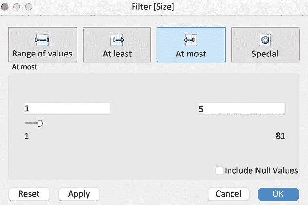
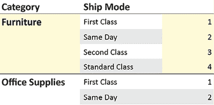
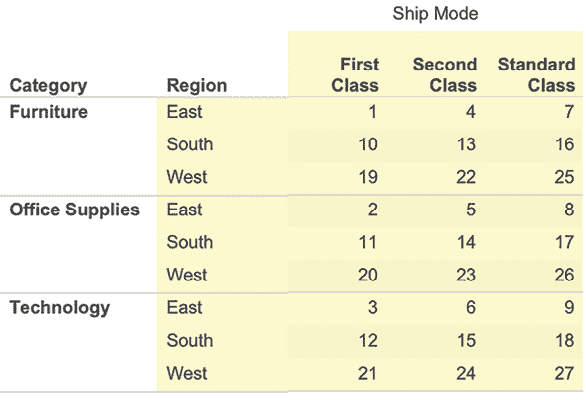

# 第五章：介绍表计算

Tableau 中的表计算主题内容丰富而深刻，单独作为一本书的主题也是完全有道理的。探索每个表计算函数可用的不同选项，以及表计算的各种应用方式，既有趣又值得尝试。在你回顾本章中的示例时，毫无疑问，你会遇到一些可以在日常工作中应用的技巧；然而，你可能会困惑为什么有些技巧有效。本章旨在提供一些思考表计算的方法，这些方法将在你掌握这个迷人主题的过程中发挥作用。在此过程中，我们也会考虑一些实际的例子。

在为本章审核的数十篇博客、论坛帖子、会议讲座、文章和白皮书中，Jonathan Drummy 的博客文章（[`drawingwithnumbers.artisart.org/at-the-level-unlocking-the-mystery-part-1-ordinal-calcs/`](http://drawingwithnumbers.artisart.org/at-the-level-unlocking-the-mystery-part-1-ordinal-calcs/)），*At the Level – Unlocking the Mystery Part 1: Ordinal Calcs*，是最清晰且最具洞察力的，帮助我们理解分区和寻址的各种细微差别——表计算的 DNA。在本章中，我们将讨论以下主题：

+   分区和寻址方向

+   有方向和无方向的寻址

+   探索每个独特的表计算函数

+   函数的应用

让我们详细探讨一下这个章节，并从表计算的一般定义开始，并提出两个相关的问题，我们将在本章结束时解答这两个问题。

# 分区和寻址方向

如*第一章*《基础回顾》中所讨论的，计算字段可以分为行级、汇总级或表级计算。对于行级和汇总级计算，底层数据源引擎完成大部分（如果不是全部）计算工作，而 Tableau 仅仅负责可视化结果。对于表计算，Tableau 也依赖底层数据源引擎和你机器上可用的内存来执行计算任务；但是，在这些工作完成并返回数据集之后，Tableau 还会进行额外的处理，然后再呈现结果。

让我们来看一下表计算的定义，如下所示：

表计算是对缓存数据集执行的一个函数，该数据集是 Tableau 向数据源查询后生成的结果。

让我们考虑一下前面定义中提到的缓存数据集的几个要点。

这个缓存不仅仅是查询返回的结果。Tableau 可能会调整返回的结果。我们将在*第六章*《利用 OData、数据密集化、大数据和 Google BigQuery》中考虑这个问题；Tableau 可能会通过数据密集化扩展缓存，但通常是由用户驱动的。从表计算的角度来看，缓存被称为**分区**。

重要的是要考虑缓存的结构。缓存中的数据集是工作表中使用的表，就像所有表一样，它由行和列组成。这对于表计算尤为重要，因为表计算可能会随着缓存的移动而计算。`previous_value()`表计算会在缓存结构发生变化时发生变化，因为它会检索当前值之前的值，而这具有很大的主观性。它是基于日期、值还是字母顺序来确定“先前”的？你需要通过使用地址划分和分区告诉 Tableau 如何构建缓存。

大多数表计算需要考虑缓存结构。这类表计算称为**有方向**。另外，表计算也可以基于整个缓存进行计算，而不考虑地址划分和分区。例如，表计算`total()`会计算总值，而该总值在缓存顺序变化时不会发生变化。另一个例子是`size()`、`script_`和`model`函数。这种类型的表计算被称为**无方向**。

请注意，在 Tableau 文档中，缓存中的数据集通常被称为分区。本章的结构旨在提供一个简单的框架，以帮助理解表计算。

*引入函数*部分探讨了每个独特的表计算函数。*函数应用*部分探讨了表计算如何通过分区和地址划分维度应用到视图中。

# 有方向和无方向的地址划分

我们将通过列出不同的表计算函数来开始这一部分内容。

Tableau 提供了广泛的表计算函数，但如果我们将考虑范围缩小到表计算函数的唯一组，我们将发现只有 11 个：

| **表计算** |
| --- |
| `LOOKUP` |
| `PREVIOUS VALUE` |
| `RUNNING` |
| `WINDOW` |
| `FIRST` |
| `INDEX` |
| `LAST` |
| `RANK` |
| `SIZE` |
| `TOTAL` |
| `SCRIPT & MODEL` |

如*地址划分与方向*中所述，表计算函数在缓存上运行，因此，如果缓存数据发生变化，根据表计算的类型（有方向或无方向），计算结果可能会发生变化。在接下来的练习中，我们将看到有方向和无方向的表计算函数的实际应用。

让我们更详细地了解有方向和无方向的表计算：

1.  访问[`public.tableau.com/profile/marleen.meier`](https://public.tableau.com/profile/marleen.meier)以查找并下载与本章相关的工作簿。

1.  导航到**定向/非定向**工作表。

1.  按下表所示创建计算字段：

    | **名称** | **计算** | **备注** |
    | --- | --- | --- |
    | `Lookup` | `LOOKUP(SUM([Sales]),-1)` | 请注意，计算中包含了`-1`。这指示 Tableau 从前一行获取值。 |
    | `Size` | `SIZE()` | `SIZE`函数返回分区中的行数。因此，正如下图所示，大小等于总行数。 |
    | `Window Sum` | `WINDOW_SUM(SUM([Sales]))` | `Window` `sum`函数（`WINDOW_SUM(expression, [start, end]`)可以定向或非定向操作。由于这个示例没有包括`[start, end]`选项，它是非定向操作的。 |
    | `Window Sum w/ Start&End` | `WINDOW_SUM(SUM([Sales]),0,1)` | 这个窗口函数的示例是定向操作的，正如通过包含`[start, end]`选项可以看出的那样。 |
    | `Running Sum` | `RUNNING_SUM(SUM([Sales]))` | 根据其本质，`RUNNING`函数是定向操作的，因为它们需要考虑前面的行进行计算。 |

1.  将**Category**和**Ship Mode**放置到**Rows**架上。

1.  双击**Sales**、**Lookup, Size**、**Window Sum**、**Window Sum w/ Start&End**和**Running Sum**，以填充如下图所示的视图：

图 5.1：表格计算

1.  *图 5.1*中的表格显示，`Size`函数和`Window Sum`函数是唯一的两个非定向函数。其他所有函数都根据方向返回一个数值。例如，`Lookup`向下移动并打印实际字段之前的值。你可以通过点击任何表格计算字段的三角形并选择**编辑表格计算**来更改方向。

第一个练习是两个表格计算类别的示例：定向和非定向。现在，我们将逐一考虑表格计算函数。遗憾的是，由于篇幅所限，无法深入探讨所有表格计算；不过，为了获得实际的理解，考虑所有独特的选项组，除了其中一个组，应该足够了。以`Script_`开头的四个表格计算，以及六个`Model_`函数，将在*第十五章*，*编程语言整合*中进行讲解。

尽管我在每个部分的结尾加入了实际场景，但跟随练习侧重于演示表格计算的功能，并考虑每个计算如何与缓存中的数据集（也称为**分区**）**定向**或**非定向**交互。

## 探索每个独特的表格计算函数

以下练习将分别展示每个表格计算；在每个部分的末尾，您将看到我对实际场景的想法。

### 查找和总计

以下工作表的目标是显示在 2013 年最后两天内进行购买的客户及其相关的绝对销售额和相对销售额（12 月）。

在下面的表格中，`LOOKUP`按方向性进行操作，而`TOTAL`是无方向性的。这种行为在结果中容易察觉。请按照以下步骤操作：

1.  在与本章相关的工作簿中，导航至**查找/总计**工作表。

1.  将**客户名称**和**订单日期**拖到**行**架上。右键点击**订单日期**，将其设置为**月/日/年**离散格式，并选择**日**和**离散**。

1.  将**订单日期**放到**筛选器**架上，选择仅查看 2013 年 12 月，并选择**月/年**作为日期格式。

1.  创建以下计算字段：

    | **名称** | **计算** |
    | --- | --- |
    | `查找介入时间` | `DATEDIFF('day',LOOKUP(Max([Order Date]),0), MAKEDATE(2013,12,31))` |
    | `% 总销售额` | `SUM(Sales)/TOTAL(SUM([Sales]))` |

1.  右键点击**% 总销售额**，选择**默认属性** | **数字格式**，将数字格式设置为百分比，并保留两位小数。

1.  将**查找介入时间**放到**筛选器**架上，并选择 0 到 1 的范围。

1.  双击**销售额**和**% 总销售额**，将这两个字段放到视图中。

1.  根据需要设置格式：

图 5.2：总销售额

让我们考虑一下前面的工作表是如何运作的：

+   **订单日期**的筛选器确保返回给 Tableau 的数据仅包括 2013 年 12 月的数据。

+   **% 总销售额** `SUM(Sales)/TOTAL(SUM([Sales]))`包括`TOTAL(SUM([Sales]))`计算字段，返回整个数据集的总销售额。将`SUM([Sales])`除以该总额，返回占总销售额的百分比。

+   **查找** **介入** **时间**：`DATEDIFF('day', 'LOOKUP(Max([Order Date]), 0)', 'MAKEDATE(2013,12,31))`将返回一个整数，反映`LOOKUP`函数返回的日期与**12/31/2013**之间的差异。请注意，`LOOKUP`函数的偏移量为零。这意味着每行返回与该行相关的日期。这与方向性和无方向性的表格计算不同，后者包括带有-1 偏移量的`LOOKUP`函数，这导致视图中的每一行返回与前一行相关的数据。

乍一看，你可能认为可以通过从**筛选器**架上移除**查找中介时间**并调整`[订单日期]`筛选器，仅显示 12 月的最后两天，来简化此工作簿。然而，如果这样做，**% 总销售额**将在视图中的所有行中加总为 100%，这将无法满足工作簿的目标。可以将**查找中介时间**视为不是筛选，而是隐藏 12 月除了最后两天以外的所有日期。这样隐藏数据，确保计算**% 总销售额**所需的数据仍然存在于缓存/分区的数据集中。

实际场景：我比**总计**更常用**查找**。在使用 Tableau 时，两者都非常重要。我们已经看到你用查找来处理变化；你可以将其视为月度利润对比、今天与去年今天的员工人数对比、按星期几的网页点击差异等等。

对于表格计算的总计，每次你想在仪表板上显示某个东西的总数，同时又想保持某种程度的聚合时，都可以使用它。**总计**的百分比在*图 5.2*中实际上是一个完美的例子。

### 前一个值

以下工作表的目标是返回每年的销售额总值并设定明年的销售目标。请注意，提供了两种确定明年销售目标的选项，以展示`PREVIOUS_VALUE`与`LOOKUP`的不同。此外，请注意`PREVIOUS_VALUE`的行为是有方向性的。

让我们来看一下步骤：

1.  在本章关联的工作簿中，导航到**前一个值**工作表。

1.  创建以下计算字段：

| **名称** | **计算** |
| --- | --- |
| `下一年目标前一个值` | `PREVIOUS_VALUE(SUM([Sales])) * 1.05` |
| `下一年目标查找` | `LOOKUP(SUM([Sales]),0) * 1.05` |

1.  将**订单日期**放置在**行**架上。

1.  双击**销售额**和**下一年目标前一个值**，将每个值放置到视图中。

1.  按照需要格式化，或参见下方截图（通过拖动**度量值**中的堆叠，顺序将在视图中相应更改，如下方截图所示）：

图 5.3：明年

让我们考虑一下前面的工作表是如何工作的：

+   **下一年目标前一个值**：`PREVIOUS_VALUE(SUM([Sales])) * 1.05`应用于此工作表，它从每一行的前一个结果中获取数据并加上 5%。换句话说，目标是每年以 5%的稳定增长率增长。

+   **下一年目标查找**：`LOOKUP(SUM([Sales]),0) * 1.05`也应用于此工作表；此计算将当前年份的销售额增加 5%。换句话说，明年的目标是比今年高出 5%的销售额。前几年的数据不考虑在内。

为了更好地理解这个练习，请考虑前面截图中与 **2014** 相关的值。**Next Year Goal Prv_Val** 通过 **2013 Next Year Goal Prv_Val** 计算得出；即 **$560,577 * 1.05**。另一方面，**Next Year Goal Lkup** 是通过 **2014** 年的销售额计算得出的；即 **$733,947 * 1.05**。

现实场景：假设你想要推算一个数据点并从该新值继续推算；为此，你可以使用 **Previous_Value**。一个例子是定期支付息票的债券。如果你的债券面值为 100，且每半年支付 4% 的息票，你可以使用 **Previous_Value** 来计算债券的最终价值，就像我们在上一个练习中使用 **Next Year Goal Prv_Val** 那样。

### 运行

以下工作表的目标是显示每个月的运行最小值利润、运行平均值利润和运行最大值利润，并与数据集中的 **SUM(Profit)** 进行比较。

以下示例展示了 `Running` 函数的方向性行为：

1.  在与本章相关的工作簿中，导航到 **Running** 工作表。

1.  创建以下计算字段：

| **名称** | **计算** |
| --- | --- |
| `运行最小值` | `RUNNING_MIN(SUM([Profit]))` |
| `运行最大值` | `RUNNING_MAX(SUM([Profit]))` |
| `运行平均值` | `RUNNING_AVG(SUM([Profit]))` |

1.  将 **订单日期** 放到 **列** 货架，并将其设置为 **月/年** 连续格式。将 **度量值** 放到 **行** 货架。

1.  从 **度量值** 货架中删除除 **运行最小值**、**运行最大值**、**运行平均值** 和 **利润** 外的所有度量实例。

1.  将 **SUM(Profit)** 从 **度量值** 货架移到 **行** 货架。右键点击 **SUM(Profit)** 并选择 **双轴**。

1.  按照需要进行格式设置。

让我们考虑一下前面的工作表是如何工作的：

+   **运行最小值**：`RUNNING_MIN(SUM([Profit]))` 在前面的截图中可见，它将当前的 **SUM(Profit)** 与截至目前记录的最小 **SUM(Profit)** 进行比较。如果当前的 **SUM(Profit)** 小于迄今为止记录的最小 **SUM(Profit)**，则当前的 **SUM(Profit)** 将替代最小的 **SUM(Profit)**。

+   **运行最大值**：`RUNNING_MAX(SUM([Profit]))` 的操作方式与 **运行最小值** 类似，当然它是寻找最大值。

+   **运行平均值**：`RUNNING_AVG(SUM([Profit]))` 根据每个月到当前月的 **SUM(Profit)** 计算平均值。

现实场景：对于这个表格计算，有很多例子可以参考。考虑年初至今的利润、基于出生人数的人口数据（别忘了减去死亡人数）、当前未解决的支持票数量，等等。

### 窗口

以下工作表的目标是显示 `WINDOW` 函数的方向性实例和非方向性实例。

请按照以下步骤操作：

1.  在与本章相关的工作簿中，导航到 **Window** 工作表。

1.  创建以下计算字段：

| **名称** | **计算** |
| --- | --- |
| `Win Avg Directional` | `WINDOW_AVG(SUM([Profit]),-2,0)` |
| `Win Avg Non-Directional` | `WINDOW_AVG(SUM([Profit]))` |

1.  将 **订单日期** 放置在 **列** 货架上，并设置为 **月/年** 连续。将 **度量值** 放置在 **行** 货架上。

1.  从 **度量值** 货架上移除所有度量实例，除了 **Win Avg Directional**、**Win Avg Non-Directional** 和 **利润**。

1.  从 **数据** 面板中，将另一个 **利润** 实例拖到 **行** 货架上。右键单击 **行** 货架上的 **利润** 实例，并选择 **快速表格计算** | **移动平均**。右键单击 **行** 货架上的 **利润** 实例，并选择 **双轴**。

1.  右键单击标记为 **利润的移动平均值** 的轴，并选择 **同步轴**。

1.  根据需要进行格式化，或按照以下截图所示进行格式化：

图 5.4：窗口

让我们来看看前面的工作表是如何工作的：

+   **Win Avg Directional**: `Window_AVG(SUM([Profit]),-2,0)` 的起始点为 -2，结束点为 0，这意味着 Tableau 会基于当前月及前两个月的 `SUM([Profit])` 计算创建一个点。如果将 `0` 改为 `2`，则每个点的平均值会计算基于前两个月、当前月和接下来的两个月。双击 **行** 货架上的 **利润** 实例以查看底层代码。（这是通过右键单击并选择 **快速表格计算** | **移动平均** 后更改为表格计算的 **利润** 实例。）请注意，计算与为 **Win Avg Directional** 创建的代码相同。然而，如果你右键单击这两个柱子并选择 **编辑表格计算**，你会发现弹出的对话框不同。与 **利润** 相关的对话框有更多选项，包括改变前后值的功能。要更改 **Win Avg Directional** 的前后值，需要调整计算字段。

+   **Win Avg Non-Directional**: `WINDOW_AVG(SUM([Profit]))` 与视图中的水平线相关。注意，它与方向无关，而是通过缓存/分区中所有聚合的 **利润** 值的平均值生成的单一值，因此无论数据点的顺序如何，它的值都是相同的。

现实场景：为什么要使用窗口平均值？因为你想平滑掉异常值，例如。窗口平均值提供了数据的平稳表示。单一的高点或低点会被去除。如果你分析股价，你会注意到价格在全年可能会有所不同！通过使用窗口平均值，或者更准确地说，使用窗口标准差作为预警指标，你将能够更清楚地看到价格的波动，并且作为投资者可以做出相应的决策。然而，稳步增长或下降会落入移动区间。这是固定区间无法实现的。

### 首次和最后一次

以下工作表的目标是显示`Superstore`数据集中畅销商品的首次和最后一次实例。注意以下示例演示了`FIRST`和`LAST`函数的方向性行为。

执行以下步骤：

1.  在与本章相关的工作簿中，转到**首次/最后一次**工作表。

1.  创建以下计算字段：

| **名称** | **计算** |
| --- | --- |
| `首次` | `FIRST()` |
| `最后一次` | `LAST()` |
| `First or Last` | `FIRST() = 0 OR LAST() = 0` |

1.  将**产品名称**放到**过滤器**架上，选择**顶部**标签，然后选择按**销售额**的**前 1**，如下面的截图所示：

图 5.5：顶部过滤器

1.  将**首次或最后一次**放到**过滤器**架上，并在弹出的对话框中选择**真**。

1.  将**产品名称**、**订单日期**和**行 ID**拖到**行**架上。

1.  将**订单日期**设置为**月/日/年**离散型。

1.  双击**销售额**、**首次**和**最后一次**，将每个字段放入视图中。

1.  右键点击**首次**、**最后一次**和**首次或最后一次**，然后选择**计算方式** | **表格（向下）**。

1.  根据需要进行格式化：

图 5.6：首次和最后一次

让我们考虑一下上面工作表的功能：

+   **首次**：`FIRST()` 从**0**开始，倒数到缓存中数据集的最后一行。在上面的截图中，注意到**佳能 imageCLASS**的首次出现是在**05/24/13**。`FIRST()`的范围从**0**到**-4**，这表明数据集中共有五次**佳能 imageCLASS**的实例，或者在窗口缓存中有五次。

+   **最后一次**：`LAST()` 从缓存中的数据集的最后一行开始，倒数到 0。在上面的截图中，注意到**佳能 imageCLASS**的最后一次出现是在**11/18/14**。`LAST()`的范围从**4**到**0**，这表明数据集中共有五次**佳能 imageCLASS**的实例。

+   **首次或最后一次**：`FIRST() = 0 OR LAST() = 0`，当放入**过滤器**架上并设置为**真**时，将隐藏所有匹配行的实例，除首次和最后一次外。

+   **行 ID**字段包含在视图中，以确保显示**佳能 imageCLASS**的第一个和最后一个实例。否则，如果**佳能 imageCLASS**在第一个或最后一个日期有多个实例，销售数字将反映多个值。对于视图中的每个表格计算，设置**计算方式**为**表格（向下）**很重要。**计算方式**与**寻址**相同，稍后将在*函数应用*部分详细讨论。

现实场景：你可以使用此类计算来分析每个季度最后五个订单之间的时间，以查看订单间的时间是增加还是减少。这有助于改进营销或更高效地安排客服时间。

### 索引

以下工作表的目标是列出美国中拥有超过 50 个邮政编码的州，这些邮政编码在底层数据集中有表示。

注意，以下示例演示了`INDEX`函数如何按方向表现，并且可以视为行的计数：

1.  在与本章相关的工作簿中，导航到**索引**工作表。

1.  将**标记**卡片设置为**圆形**。

1.  将**州**放置在**行**货架上，将**邮政编码**放置在**详细信息**货架上。

1.  创建一个名为**索引**的计算字段，代码为：`INDEX()`。将**索引**拖到**筛选器**货架上，并选择**值范围**筛选器。通过将滑块移动到**50**的最小值，仅查看大于或等于 50 的值。

1.  右键点击**索引**并选择**编辑表格计算**。选择**特定维度**并勾选**邮政编码**：

图 5.7：索引

1.  选择**分析** | **堆叠标记** | **关闭**，然后进行查看：

图 5.8：最终索引

让我们考虑一下前面工作表的功能：

**索引**：`INDEX()`从 1 计数到*n*。因此，它按方向表现。在这种情况下，由于分区和寻址设置的原因，**索引**正在计数邮政编码。（分区和寻址将在*函数应用*部分详细讨论。）将**索引**筛选器设置为仅显示大于或等于 50 的值，确保只有那些有 50 个或更多邮政编码的州出现在缓存中的分区/数据集显示中。

现实场景：通常，我将**索引**与**首项**和**末项**互换使用。

### 排名

以下工作表的目标是展示每个地区的前三大畅销商品。这个示例将演示`RANK`如何在缓存中的数据集与方向交互：

1.  在与本章相关的工作簿中，导航到**排名**工作表。

1.  将**产品名称**放置在**筛选器**货架上，选择**顶部**选项卡，并按**销售总额**选择**前 3**：

图 5.9：筛选器

1.  将**地区**和**产品名称**放置在**行**货架上，将**销售额**放置在**列**货架上。

1.  请注意，每个地区仅显示两项：

图 5.10：查看前两个项目

1.  创建一个名为**Rank**的计算字段，代码为`Rank(SUM(Sales))`。将**Rank**拖动到**Region**和**Product Name**之间的**Rows**架上。

1.  请注意，在将**Rank**放置到**Rows**架上的两个标记之间之前，必须将其转换为离散。实现这一目标的一种方法是将**Rank**放置到**Detail**架上，右键点击该标记，然后选择**Discrete**。

1.  右键点击**Rank**，然后选择**Compute Using** | **Product Name**。

1.  从**Filters**架上移除**Product Name**。

1.  按住*Ctrl*键（在 Mac 上按*Option*键），右键点击并拖动**Rank**从**Rows**架上到**Filters**架上。按住*Ctrl*键在架间拖动标记会创建该标记的副本。如果不按*Ctrl*键，当然只是移动标记。在弹出的对话框中，选择**1**、**2**和**3**。

按照需要进行格式化：

图 5.11：排名

让我们来看看前述工作表是如何工作的：

+   如果你按照步骤完成了这个练习，你会发现，在将**Region**和**Product Name**放置到**Rows**架上并设置过滤器显示仅前 3 个产品名称后，结果可视化中每个区域只显示了两个产品。这是因为**Product Name**的过滤器显示了所有产品中排名前三的产品，但恰好每个区域中总是有两个产品在前三名中。我们实际上想要展示的是每个区域的前 3 个产品，而不是整体的前 3 个产品。为了解决这个问题，我们使用了`Rank`表计算函数。

+   让我们理解它是如何工作的。与其编写`Rank(Sum(Sales))`函数，不如通过右键点击任何架上的**Sales**实例并选择**Quick Table Calculation** | **Rank**，相同的代码会自动生成。请注意，**Rank**是在每个区域内计算产品名称的。这表明，**Rank**表计算函数在缓存/分区中的数据集上按方向操作。

实际场景：当我想过滤一个持续变化的视图，并将其分成多个子部分时，我使用**Rank**——例如，查看每个博客帖子上的最后三条评论。或者当我想显示一段时间内的行为时，例如，过去两年里排名前 10 的产品。这将生成一个排名图。

### Size

以下工作表的目标是显示**Superstore**数据集中所有城市数为五个或更少的州。这个示例将演示如何利用`SIZE`在缓存中使用整个分区/数据集，因此它是无方向的。我们还将使用`FIRST`表计算函数，它是有方向的，以便清理视图。

请按照以下步骤操作：

1.  在与本章相关的工作簿中，导航到**Size**工作表。

1.  将**Analysis** | **Stack Marks**设置为**Off**。

1.  创建以下计算字段：

| **名称** | **计算公式** |
| --- | --- |
| `Size` | `SIZE()` |
| `City Count` | `IF FIRST() = 0 THEN [Size] ELSE NULL``END` |

1.  将**State**拖到**Rows**货架，**City**拖到**Detail**货架，**City Count**拖到**Text**/**Label**货架，**Size**拖到**Detail**货架。

1.  右键单击**Size**过滤器，选择**计算方式** | **City**。将**Size**从**Marks**卡片中移至**Filters**货架。

1.  在弹出的对话框中，选择一个**最多**为**5**的值：

图 5.12：最多

1.  在**Marks**卡片上，右键单击**City Count**并选择**编辑表格计算**。在**嵌套计算**下，选择**City Count**。

1.  选择**计算方式** | **特定维度**并勾选**City**：

图 5.13：特定维度

1.  现在再次使用**嵌套计算**下拉菜单并选择**Size**。然后，选择**计算方式** | **特定维度**并勾选**City**。

1.  观察最终视图：

图 5.14：最终工作表

让我们考虑一下前述工作表是如何运作的：

+   **Size**：`Size()` 会生成一个单一的数字，例如，Delaware 的值是 3，它基于缓存中的分区/数据集。该数字可以根据分区和地址设置而改变，但在分区内的移动不会改变该数字。因此，它表现为无方向性。

+   **City Count**：`IF FIRST() = 0 THEN LOOKUP([Size],0) ELSE NULLEND` 字段并非绝对必要。你可以选择直接将**Size**放置到**Text**/**Label**货架上。然而，如果这样做，你会注意到视图中的数字会变得粗体。这是因为这些数字实际上是重复的，并且被叠加在一起。使用 `FIRST() = 0` 使得只显示一组数字。

请注意，前面的练习有一个**嵌套计算**的选项，这是因为 `Size` 计算字段在 `City Count` 计算字段中被引用。

现实场景：**Size** 可能是最少使用的。我诚实地说，除了用来解释和展示它，我从未真正使用过它。但我看到其他人用**Size**做的事情是：通过开启总计列视图，**Size** 可以生成一个非默认的聚合，如标准差。只需使用以下公式：`if size()=1 then sum({STDEV([Sales])}) else sum([Sales]) end`。

如果你还想了解更多关于表格计算的内容，以下是一些额外的场景：[`www.tableau.com/blog/top-10-tableau-table-calculations`](https://www.tableau.com/blog/top-10-tableau-table-calculations)。

现在我们已经展示了不同的表格计算，我们将看到如何在分区（范围）和地址（方向）中操作它们。

# 函数的应用

到目前为止，我们已经解答了两个主要问题中的第一个：*函数是什么？* 现在我们将继续下一个问题：*如何应用这个函数？*

让我们通过以下三种选项来理解这个问题，它们都是`INDEX`函数的应用：

图 5.15：应用实例

`INDEX`函数在这三张截图中都有使用，但每个应用的方式不同。第一和第二张截图都显示**1**、**2**、和**3**，但方向上有所不同。第三张截图的范围从**1**到**9**。那么，`INDEX`在每个情况下是如何应用的呢？

回答这个问题可能会令人困惑，因为 Tableau 使用了不同的术语。在 Tableau 中，表计算的应用方式可能被称为沿着运行、沿着移动、计算使用，或者**分区（范围）**和**寻址（方向）**。为了方便起见，我们将使用分区和寻址这两个术语，这些术语的定义可以参考 Tableau 文档（[`help.tableau.com/current/pro/desktop/en-us/calculations_tablecalculations.htm`](https://help.tableau.com/current/pro/desktop/en-us/calculations_tablecalculations.htm)）：

> 定义如何对数据进行分组的维度，即定义计算作用范围的维度，称为分区字段。表计算在每个分区内单独执行。剩下的维度，表计算在其上执行，称为寻址字段，并决定计算的方向。

这基本上意味着分区定义了哪些字段正在使用，例如`Segment`。如果你有三个按三个类别划分的分段，你可以分别查看每个组合、一个分段中的所有类别，或者一个类别中的所有分段。你查看的方式就是 Tableau 所称的寻址（addressing）。

如果在视图中使用了表计算，你可以右击它并选择**编辑表计算**。这样做后，你会看到一个对话框，允许你选择特定的维度。如果一个维度被勾选，它就是寻址的。如果没有勾选，它就是分区的。

见下图中的示例：

图 5.16：寻址与分区

Tableau 提供了许多开箱即用的分区和寻址设置，包括**表格（纵向）**、**表格（横向）**、**窗格（纵向）**和**单元格**。我们会偶尔提到这些选项，但不会进行详细回顾。这引出了我们的第一个分区和寻址指南：

不要使用 Tableau 提供的开箱即用的分区和寻址设置，包括**表格**（跨）和**窗格**（纵向）。强迫自己点击**特定维度**，并手动定义分区和寻址，这样你才能清楚理解每个表计算是如何应用的。

在上述指南中有几个需要注意的事项：

+   有一个例外，即**单元格**。无法使用分区和地址在视图中定位单个单元格。相反，需要将**计算方式**设置为**单元格**，或者在**表格计算**对话框中选择**单元格**。令人惊讶的是，在每个单元格上定位表格计算是有用的。一个示例已在本章节关联的工作簿中的**总占比**工作表中提供。在那里，它用于展示每个单元格在两个类别之间的 100%。

+   如果为某个表格计算设置了分区和地址，然后向视图中添加维度，通常情况下，Tableau 不会自动调整分区和地址设置；它们是锁定的。然而，在使用**表（纵向）**、**窗格（横向）**等时，Tableau 会在向视图中添加维度时自动进行调整。

这引出了我们的下一个指南：

在设置分区和表格计算的地址之前，*先*将所有需要的维度放置在所需的架位上。

遵循这些指南将有助于确保你始终清楚你的表格计算是如何应用的。起初可能需要更多时间，但最终你会更好地掌控表格计算，进而更快地发展。

## 构建游乐场

让我们设置一个简单的游乐场环境，以快速而高效地探索分区和地址：

1.  在本章节关联的工作簿中，导航至**游乐场**工作表。

1.  将**类别**放置在**行**架上，将**索引**计算放置在**标签**架上。

1.  **索引**计算仅为`Index()`。点击与**索引**关联的下拉菜单，并选择**编辑表格计算**。在弹出的对话框中，点击**特定维度**。

1.  最优地定位屏幕组件。请参阅以下截图，查看一种可能的设置：

图 5.17：构建游乐场

你可以在*图 5.17* 中看到，我们创建了一个工作表，展示了三类：**家具**、**办公用品**和**技术**。通过将**索引**字段添加到**文本**架上，我们具备了使用表格计算的最小要求：一个维度和一个表格计算。现在我们可以改变表格计算中的计算方式，并观察可视化中发生的变化。稍后我们将探索更复杂的示例；然而，始终从简单的开始，逐步提高复杂度，以便完全理解发生了什么。

在接下来的页面中，我们将广泛使用我们的游乐场并根据需要进行修改。然而，为了提高效率，我们需要将重点集中在游乐场和随附的讨论上。讨论将仅限于**行**和**列**架上的维度以及**文本**架上的`INDEX`函数。

我们可以探索在不同架上进行的各种功能及它们提供的不同选项。例如，将日期字段放置在**页面**架上将导致使用`TOTAL`函数的表格计算，显示计算所有页面总和的选项。遗憾的是，在一个章节中探索所有可能的细节是不可行的，但如果你对这个话题感兴趣，请随时查看 Tableau 帮助页面，获取更多内容和示例：[`help.tableau.com/current/pro/desktop/en-us/functions_functions_tablecalculation.htm`](https://help.tableau.com/current/pro/desktop/en-us/functions_functions_tablecalculation.htm)。

## 使用一个维度进行分区和地址映射

让我们利用我们的实验平台，开始通过最简单的例子探索分区和地址映射：

图 5.18：使用 | 类别计算

在这个简单的例子中，选择**类别**会导致每个**类别**维度的成员被计数。这表明，选择一个维度进行地址映射决定了计算的方向。在我们的例子中，我们有**表格计算** **索引**，但**索引**依赖于我们之前所学的分区和地址映射。**类别**作为**行**架上的分区。我们将数据分为三类：**家具**、**办公用品**和**技术**。现在，我们也可以说，为了进行**表格计算**，要使用**类别**。我们通过在**计算方式**中选择**类别**来完成这一操作（*图 5.18*）。现在，**表格计算**将应用于这些类别，从而计算出 1、2、3 类别。

如果你选择**计算方式** | **单元格**，分成三类的分区仍然会保持在视图中——你依然会看到**家具**、**办公用品**和**技术**——但计数将按单元格进行，而不是按整个**类别**维度进行。因此，**索引**会先计算 1，然后移动到下一个单元格，计算 1，再到下一个单元格，再次计算 1：

图 5.19：使用 | 单元格计算

现在，让我们考虑使用两个维度来进行分区和地址映射，而不是一个维度。

## 使用两个维度进行分区和地址映射

在使用两个或更多维度进行分区和地址映射时，提供了两个额外的选项：**在级别**和**每次重启**。你可以将这个场景比作统计每个大洲的所有国家。在这个场景中，**在级别**指的是国家，因为你统计的不是街道或树木，而是国家。**重启**指的是大洲。完成一个大洲的国家统计后，你将从下一个大洲重新从 1 开始：

图 5.20：两个维度

**At the level**和**每次重启**都允许作者从下拉菜单中选择维度。**At the level**允许作者选择在哪个级别进行增量操作，正如其名称所示，**每次重启**允许作者选择在哪些维度上进行重启。这里的示例将为你提供理解的背景。

请注意，**At the level**有一个额外的选项：**Deepest**。在这种情况下，将**At the level**设置为**Deepest**与选择**运输方式**相同。这引出了我们的下一个指南：

在**“At the level”**下拉菜单中不需要选择底层维度。它总是与**Deepest**相同。

为了重新创建此处列出的迭代，你需要对演示环境做一些更改。除了将**类别**放在**行**架上，**索引**放在**标签**架上外，还需要将**运输方式**放在**行**架上。我们不会讨论包含一个或多个维度在**列**架上的迭代，因为这些可能性中的行为几乎相同。

在考虑和/或复制以下选项时，请注意**寻址**顺序非常重要。对于示例 3-5，**类别**排在寻址列表的首位。对于选项 6-8，**运输方式**排在列表的首位。

在第一个示例中，按如下方式配置分区和寻址设置：

+   **分区**：**类别**

+   **寻址**：**运输方式**

+   **At the level**：-

+   **每次重启**：-

这将产生以下可视化效果：

图 5.21：示例 1

在这里，我们按**类别**计算**运输方式**。

在第二个示例中，按如下方式配置分区和寻址设置：

+   **分区**：**运输方式**

+   **寻址**：**类别**

+   **At the level**：-

+   **每次重启**：-

这将产生以下可视化效果：

图 5.22：示例 2

在这个示例中，我们按**运输方式**计算**类别**。

在第三个示例中，按如下方式配置分区和寻址设置：

+   **分区**：-

+   **寻址**：**类别**，**运输方式**

+   **At the level**：**Deepest**

+   **每次重启**：**无**

这将产生以下可视化效果：

图 5.23：示例 3

这次，我们计算**类别**和**运输方式**的组合。

在第四个示例中，按如下方式配置分区和寻址设置：

+   **分区**：-

+   **寻址**：**类别**，**运输方式**

+   **At the level**：**Deepest**

+   **每次重启**：**类别**

这将产生以下可视化效果：

图 5.24：示例 4

在这里，我们按**类别**和**运输方式**的组合进行计数，并在每个新的**类别**时重新计数。

在第五个示例中，按如下方式配置分区和寻址设置：

+   **分区**：-

+   **寻址**：**类别**，**运输方式**

+   **At the level**：**类别**

+   **每次重启**：**无**

这将产生以下可视化效果：

图 5.25：示例 5

我们在**类别**级别计算**类别**和**运输方式**的组合。由于**类别**级别在层级结构中高于**运输方式**，因此我们最终只计算每个**类别**的一个值。

在第六个示例中，配置分区和寻址设置如下：

+   **分区**：-

+   **寻址**：**运输方式**，**类别**

+   **在级别**：**最深层**

+   **每次重启**：**无**

这将产生以下可视化效果：

图 5.26：示例 6

我们在**运输方式**级别计算**运输方式**和**类别**的组合；因此，我们首先计算**头等舱**和所有与之相关的**类别**组合，然后是**同日配送**及其与**类别**的组合。

在第七个示例中，配置分区和寻址设置如下：

+   **分区**：-

+   **寻址**：**运输方式**，**类别**

+   **在级别**：**最深层**

+   **每次重启**：**运输方式**

这将产生以下可视化效果：

图 5.27：示例 7

我们在最深层次计算**运输方式**和**类别**的组合，但我们在每次**运输方式**时都会重启；因此，我们计算**头等舱**和**家具**，**头等舱**和**办公用品**，然后是**头等舱**和**技术**。接下来，我们继续处理**同日配送**及其组合，并在 1 处重新开始。

在第八个示例中，配置分区和寻址设置如下：

+   **分区**：-

+   **寻址**：**运输方式**，**类别**

+   **在级别**：**运输方式**

+   **每次重启**：**无**

这将产生以下可视化效果：

图 5.28：示例 8

我们在**运输方式**级别计算**运输方式**和**类别**的组合。

现在，让我们更详细地考虑一下这里呈现的一些可能性。一些选项是相同的。实际上，在九个选项中，只有四个是独特的。让我们考虑一下示例 1、4 和 8，它们的最终结果是相同的。这是否意味着每个选项都完全相同？选项 1 和选项 4 是相同的。但是，选项 8 略有不同。要理解这一点，请注意选项 8 中表格计算对话框中的描述：

图 5.29：索引

示例 8 中的描述为**结果按运输方式、类别计算**（见*图 5.29*）。示例 1 中的描述框中的文本与示例 4 完全相同：**结果按运输方式、类别计算**，这可以翻译为按**类别**进行分区并按**运输方式**进行寻址。此翻译与示例 1 中实际完成的分区/寻址设置完全一致。因此，示例 1 和示例 4 是相同的。但示例 8 的细微差异是否意味着存在实际的区别呢？不！

示例 6 可能一开始会让人感到困惑。为什么会出现奇怪的编号顺序？因为处理维度的顺序与 **行** 货架上的维度顺序不同。处理顺序是 **运输方式**, **类别**，而 **行** 货架上的顺序是 **类别**, **运输方式**。只需将 **类别** 和 **运输方式** 在 **行** 货架上的位置反转，并注意数字顺序的变化，这样就能帮助消除任何困惑：

图 5.30: 切换维度

示例 6 有实际用途吗？是的。从时间到时间，可能需要按照不同于货架上列出的顺序处理维度。但通常情况下并不是这样。这引出了我们的下一个指南：

在为表格计算处理多个维度时，处理顺序通常会反映在 **行** 和/或 **列** 货架上的维度顺序。

## 使用三个维度进行分区和处理

让我们为实验添加另一个维度并稍作调整。将 **类别** 和 **地区** 放在 **行** 货架上，将 **运输方式** 放在 **列** 货架上。**索引** 应该保持在 **标记** 货架的 **文本** 上。同时，添加两个过滤器。将 **地区** 过滤为 **东部**, **南部**, 和 **西部**。将 **运输方式** 过滤为 **头等舱**, **二等舱**, 和 **标准舱**。

当分区和处理三个维度时，可能的迭代次数跃升至 57 次；然而，其中只有 14 次是唯一的。以下是这些唯一可能性的列举。

记住，处理意味着在表格计算设置中选择维度，而分区是取消选择维度，正如 *图 5.17* 所描述的那样。

在第一个示例中，配置分区和处理设置如下：

+   **分区**: **类别**, **地区**

+   **处理**: **运输方式**

+   **在该级别**: -

+   **每次重启**: -

这将产生以下可视化：

图 5.31: 示例 1

在这里，我们统计每个 **地区** 和 **类别** 组合下的不同 **运输方式** 选项。

在第二个示例中，配置分区和处理设置如下：

+   **分区**: **类别**, **运输方式**

+   **处理**: **地区**

+   **在该级别**: -

+   **每次重启**: -

这将产生以下可视化：

图 5.32: 示例 2

在这里，我们统计每个 **类别** 和 **运输方式** 组合下的不同 **地区** 选项。

在第三个示例中，配置分区和处理设置如下：

+   **分区**: **地区**, **运输方式**

+   **处理**: **类别**

+   **在该级别**: -

+   **每次重启**: -

这将产生以下可视化：

图 5.33: 示例 3

在这里，我们统计每个 **地区** 和 **运输方式** 组合下的不同 **类别** 选项。

在第四个示例中，配置分区和寻址设置为：

+   **分区**：**类别**

+   **寻址**：**地区**，**运输方式**

+   **在层级**：**最深层**

+   **每次重启**：**无**

这将生成以下可视化：

图 5.34：示例 4

在这里，我们计算不同**类别**选项在每个**地区**和**运输方式**组合下的数量，直到最深层级。

在第五个示例中，配置分区和寻址设置为：

+   **分区**：**类别**

+   **寻址**：**运输方式**，**地区**

+   **在层级**：**最深层**

+   **每次重启**：**无**

这将生成以下可视化：

图 5.35：示例 5

在这里，我们计算不同**类别**选项在每个**运输方式**和**地区**组合下的数量，直到最深层级。

在第六个示例中，配置分区和寻址设置为：

+   **分区**：**地区**

+   **寻址**：**类别**，**运输方式**

+   **在层级**：**最深层**

+   **每次重启**：**无**

这将生成以下可视化：

图 5.36：示例 6

在这里，我们计算不同**地区**在每个**类别**和**运输方式**组合下的数量，直到最深层级。

在第七个示例中，配置分区和寻址设置为：

+   **分区**：**运输方式**

+   **寻址**：**类别**，**地区**

+   **在层级**：**最深层**

+   **每次重启**：**无**

这将生成以下可视化：

图 5.37：示例 7

在这里，我们计算不同**运输方式**在每个**类别**和**地区**组合下的数量，直到最深层级。

在第八个示例中，配置分区和寻址设置为：

+   **分区**：**运输方式**

+   **寻址**：**地区**，**类别**

+   **在层级**：**最深层**

+   **每次重启**：**无**

这将生成以下可视化：

图 5.38：示例 8

在这里，我们计算不同**运输方式**在每个**地区**和**类别**组合下的数量，直到最深层级。

在第九个示例中，配置分区和寻址设置为：

+   **分区**：-

+   **寻址**：**类别**，**运输方式**，**地区**

+   **在层级**：**最深层**

+   **每次重启**：**无**

这将生成以下可视化：

图 5.39：示例 9

在这里，我们计算**类别**、**运输方式**和**地区**的组合，直到最深层级。

在第十个示例中，配置分区和寻址设置为：

+   **分区**：-

+   **寻址**：**运输方式**，**类别**，**地区**

+   **在层级**：**最深层**

+   **每次重启**：**无**

这将生成以下可视化：

图 5.40：示例 10

在这里，我们计算**运输方式**、**类别**和**地区**的组合，直到最深层级。

在第十一个示例中，配置分区和寻址设置为：

+   **分区**：-

+   **寻址**：**运输方式**、**类别**、**区域**

+   **在级别**：**类别**

+   **每次重新启动**：**无**

这将生成以下可视化效果：

图 5.41：示例 11

在这里，我们统计**运输方式**、**类别**和**区域**的组合，在**类别**级别。

在第十二个示例中，将分区和寻址设置配置为：

+   **分区**：-

+   **寻址**：**运输方式**、**区域**、**类别**

+   **在级别**：**最深**

+   **每次重新启动**：**无**

这将生成以下可视化效果：

图 5.42：示例 12

在这里，我们统计**运输方式**、**区域**和**类别**的组合，在最深级别。

在第十三个示例中，将分区和寻址设置配置为：

+   **分区**：-

+   **寻址**：**运输方式**、**区域**、**类别**

+   **在级别**：**最深**

+   **每次重新启动**：**运输方式**

这将生成以下可视化效果：

图 5.43：示例 13

在这里，我们统计**运输方式**、**区域**和**类别**的组合，在最深级别。

在第十四个示例中，将分区和寻址设置配置为：

+   **分区**：-

+   **寻址**：**区域**、**运输方式**、**类别**

+   **在级别**：**最深**

+   **每次重新启动**：**无**

这将生成以下可视化效果：

图 5.44：示例 14

我们不会讨论这些可能性中的各种实例。相反，鼓励读者在 Tableau 中重新创建这 14 种可能性，以巩固他们对分区和寻址的理解。更好的是，考虑重新创建所有 57 种可能的迭代，并努力理解 Tableau 是如何生成每个结果的。这个过程可能很繁琐，但最终获得的理解是无价的，它让用户了解 Tableau 在计算时后台做了什么。

# 指南：提醒

在本章中，我列出了关于分区和寻址的一系列指南。下面是快速提醒的内容：

+   不要使用 Tableau 提供的开箱即用的分区和寻址设置，包括**表格**（横向）和**面板**（纵向）。强迫自己点击**特定维度**，手动定义分区和寻址，以便你能清晰理解每个表计算是如何应用的。

+   在设置表计算的分区和寻址之前，将所有所需的维度放置到所需的架子上*。

+   在**级别**下拉菜单中，选择最底层维度并非必要。它总是与**最深**相同。

+   在为表计算寻址多个维度时，寻址的顺序通常会反映出**行**和/或**列**架上的维度顺序。

# 总结

在本章中，我们探讨了表格计算的内部机制。我们首先考虑了表格计算的分区和方向是什么。在接下来的部分中，我们区分了表格计算的定向和非定向寻址，最终引导我们进入**编辑表格计算**界面，我们将其确定为更改分区和寻址（也叫做范围和方向）的地方。在我们的探讨过程中，我们回顾了除`Script_`和`Model_`函数外的每一组表格计算函数，这些内容将在*第十五章*《编程语言集成》中进行更详细的讲解。我们学会了如何通过分区和寻址将这些函数应用于视图，其中分区可以看作是计算的范围，寻址则是计算的方向。

我们已经看过一些示例，比如对不同时间段进行度量比较，例如每周的利润数据，或者将部分与整体进行比较。我们接着考虑了用于股票价格警报的标准差带，以及**排名**函数来生成波动图。

利用本章所学的分区和寻址知识，在下一章中，我们将继续探讨数据密集化和大数据。

## 在 Discord 上了解更多

要加入本书的 Discord 社区——在这里你可以分享反馈、向作者提问并了解新版本——请扫描以下二维码：

[`packt.link/tableau`](https://packt.link/tableau)

