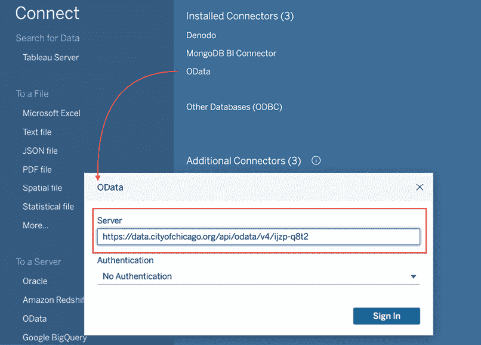

# 第六章：利用 OData、数据密集化、大数据和 Google BigQuery

Tableau 新手常遇到的问题并不涉及数据准备、连接、联合、数据混合或数据结构，而是以下几个方面：

+   如何从视图中删除空值日期？

+   为什么表计算会显示底层数据中不存在的数字？

+   Tableau 如何处理大数据？

+   如果我查询数百万行数据，Tableau 仍然能保持良好性能吗？

本章将解答上述所有问题。像往常一样，Tableau 帮助页面也是一个极好的资源。以下是一些有用的链接，可以进一步探索这些话题：

+   数据密集化：[`help.tableau.com/current/pro/desktop/en-us/predictions_generated_marks.htm`](https://help.tableau.com/current/pro/desktop/en-us/predictions_generated_marks.htm)

+   大数据：[`www.tableau.com/solutions/big-data`](https://www.tableau.com/solutions/big-data)

本章将讨论以下主题：

+   使用 OData 连接器

+   数据密集化

+   域补全

+   域填充

+   大数据

+   Google BigQuery

我们将通过介绍 OData 连接器开始本章内容。芝加哥市像其他城市、国家或公共机构一样，提供公开数据。去看看吧，你会惊讶于在线能找到多少数据。在我们的案例中，我们特别幸运，因为芝加哥市使用了 OData，这使得数据分析变得更加容易，因为 Tableau 提供了直接连接到 OData 的功能。让我们开始吧。

# 使用 OData 连接器

本章的练习可以通过下载与本章关联的工作簿来完成，工作簿可在 [`public.tableau.com/profile/marleen.meier`](https://public.tableau.com/profile/marleen.meier) 获取。接下来的步骤将解释如何通过使用 OData 端点将网络上的数据集直接加载到 Tableau 中——在本例中，数据由芝加哥市提供：

1.  访问 [`data.cityofchicago.org/Public-Safety/Crimes-2001-to-Present/ijzp-q8t2`](https://data.cityofchicago.org/Public-Safety/Crimes-2001-to-Present/ijzp-q8t2) 并选择 **更多** 图标（由省略号 **…** 表示），然后点击 **通过 OData 访问数据** 按钮：


图 6.1：芝加哥数据门户

1.  复制 **OData 端点** URL 并打开 Tableau Desktop：


图 6.2：OData

1.  在 **数据源** 面板中，搜索 `OData`，并选择 **OData** 选项：


图 6.3：OData 连接器

1.  在 **服务器** 字段中，复制芝加哥犯罪网站的 **OData** 端点。无需身份验证，点击 **登录** 开始使用：



图 6.4：服务器名称

1.  开始构建你的仪表盘！

现在我们已经设置好了数据连接，可以继续进行我们的第一个关于数据稠密化的实际练习。了解数据稠密化将帮助你在仪表板中看到意外数据输出时进行故障排除，并帮助你正确设置可视化，以便实现目标，而无需进行任何故障排除。

# 介绍数据稠密化

数据稠密化是 Tableau 中一个基本上没有文档记录的方面，它在许多情况下都非常有用，但在意外遇到时可能会令人困惑。本节将提供有关数据稠密化的信息，目的是消除困惑，并为 Tableau 用户提供足够的知识，以便将这一功能用于他们的优势。数据稠密化，简单来说，就是向视图中添加在基础数据集中不存在的数据点。这个主题一开始可能有些困惑。

如果你想了解更多内容，请查阅以下文章：[`towardsdatascience.com/data-densification-in-tableau-93c0a6bfcc5f`](https://towardsdatascience.com/data-densification-in-tableau-93c0a6bfcc5f)

要开始理解数据稠密化，需要定义四个术语：数据稠密化、稀疏数据、领域补全和领域填充。除了定义之外，每个术语将通过示例进行详细讨论，帮助加深理解：

+   **数据稠密化**：展示没有相应基础数据的数据点（例如，通过领域补全或领域填充等方式）。

+   **稀疏数据**：缺少多个数据点的数据集（想象一下瑞士奶酪的样子）。

+   **领域补全**：使稀疏数据变得稠密—领域补全是一种数据稠密化方法，它使用表格计算来填补缺失的空白，当视图中包含两个或更多维度时，Tableau 中可以使用此方法。

+   **领域填充**：向稀疏数据集中添加数据点—领域填充是一种数据稠密化方法，可以通过范围堆叠中的**显示缺失值**功能来实现（例如，日期和区间维度）。

定义现在应该已经清晰了，接下来让我们继续进行实践练习。

## 领域补全

数据稠密化有两种类型：领域补全和领域填充。**领域补全**是两者中更为复杂的一种，能够巧妙地解决稀疏数据问题，但也可能会意外出现，并且难以应对。

掌握领域补全需要对**维度**和**度量**—离散与连续—以及表格计算中的**分区**和**寻址**有深入的理解。如果你需要复习这些主题，请在继续下一个练习之前，回顾一下*第一章*，*基础回顾*（关于**维度**和**度量**），以及*第五章*，*表格计算简介*（关于**分区**和**寻址**）。

现在，让我们考虑如何应用领域补全，何时它会有帮助，何时又可能会成为问题。

### 部署领域完成

领域完成可以通过许多方式激活，甚至有时这些方式令人惊讶且令人困惑。调整货架上药丸的排列、在离散和连续之间切换维度、切换**Marks**卡片上的视图类型、调整分区、寻址等变动都可能影响领域完成的激活。尽管本书不会覆盖所有激活可能性，但回顾典型的领域完成场景应该会有所帮助。

#### 在交叉表中激活领域完成

以下步骤将引导你完成一个领域完成的示例。

导航到[`public.tableau.com/profile/marleen.meier`](https://public.tableau.com/profile/marleen.meier)来定位并下载与本章相关的工作簿，或者使用本节中描述的 OData 端点*使用 OData 连接器*：

1.  在启动工作簿中，导航至名为`DC` `-` `Crosstab`的工作表。请注意，此工作表在解决方案工作簿中不存在。由于独特的用户 OData 连接，我无法使用我的凭据保存此页面。

1.  确保**分析** | **表格布局** | **显示空行**和**显示空列**都被*取消选择*。

1.  在`Chicago` `Crime`数据集中，创建一个名为**Index**的计算字段，使用代码`INDEX()`。

1.  添加**Location Description**过滤器，只查看一些特定地点——例如，所有以`AIRPORT`开头的地点。然后将**Location Description**放置在**Rows**货架上。

1.  将**Date**放置在**Columns**货架上。保持**YEAR**聚合并将其更改为离散值。请注意，如下图所示，视图的填充较少：


图 6.5：交叉表

1.  将**Index**放置在**Detail**货架上的**Marks**卡片中。请注意，在以下截图中，视图现在显示了领域完成——也就是说，视图已完全填充：


图 6.6：交叉表 II

1.  右键点击**YEAR(Date)**并选择**连续**。请注意，数据密集化被禁用：


图 6.7：交叉表 III

1.  将**YEAR(Date)**重置为**离散**，然后右键点击**Index**并选择**编辑表计算**。

1.  在弹出的对话框中，选择**特定维度**，然后观察以下每个选择的结果：

| **选择特定维度** | **数据密集化已激活/已禁用** |
| --- | --- |
| `Location Description` | 已激活 |
| `Year of Date` | 已激活 |
| `Location Description` 和 `Year of Date` | 已禁用 |
| 无选择 | 已禁用 |

上述练习演示了部署领域完成的以下规则：

*给定一个具有离散维度的交叉表，放在**Rows**和**Columns**货架上，使用表计算（此处为**Index**字段），其中至少有一个维度（但不是所有维度）被寻址，将激活领域完成*。

上述规则中的一个关键术语可能令人困惑：寻址。分区和寻址在*第五章*，*引入表格计算*中已经介绍过，但在这里会再次定义，以确保理解此规则。请参考以下 Tableau 文档内容（[`help.tableau.com/current/pro/desktop/en-us/calculations_tablecalculations.htm`](https://help.tableau.com/current/pro/desktop/en-us/calculations_tablecalculations.htm)）：

定义如何对计算进行分组的维度，也就是定义其执行范围的数据的维度，称为**分区字段**。表格计算在每个分区内分别进行。其余维度，表格计算在这些维度上执行，称为**寻址字段**，并决定计算的方向。

在编辑表格计算时，你可以选择选中/取消选中特定维度。当某个维度被选中时，该维度用于进行表格计算的寻址。当某个维度没有被选中时，该维度用于进行表格计算的分区。下面的**表格计算**编辑对话框截图演示了**位置描述**的寻址和**日期年份**的分区：


图 6.8：表格计算

我们现在将继续探讨在交叉表中激活域补全的剩余步骤：

1.  复制前一个练习中的工作表，`DC – 交叉表`。将新工作表命名为`DC – 交叉表 II`。

1.  右键点击**索引**并选择**计算方式** | **单元格**。请注意，视图中的数据稀疏。

1.  选择**分析** | **表格布局** | **显示空列**。现在该视图已完全填充：


图 6.9：交叉表

这个练习展示了部署域补全的以下规则：

+   给定一个视图，其中**行**和**列**架上有离散维度（蓝色），选择**计算方式** | **单元格**将停用域补全。

+   给定一个视图，其中**行**和**列**架上有离散维度（蓝色），选择**分析** | **表格布局** | **显示空行/列**将激活域补全。

将**计算方式**设置为**单元格**可能会引发一个问题：其他的**计算方式**选项，如**表格（跨行）**和**表格（纵向）**怎么办？这些选项都是分区和寻址的变体。

#### 通过视图类型激活域补全

我们现在将探讨通过视图类型激活域补全：

1.  复制前一个练习中的工作表，`DC – 交叉表 II`。将新工作表命名为`DC – 视图类型`。

1.  从**标记**视图卡片中移除**索引**，并取消选中**分析** | **表格布局** | **显示空列**。现在该视图中的数据稀疏。

1.  将**标记**类型从**自动**更改为**线**。现在视图中填充了更多的标记：


图 6.10：视图类型

1.  在**标记**卡上选择每个视图类型选项，并观察哪些视图类型激活了域完成，哪些没有。

上面的练习说明了部署数据完成的以下规则：

给定一个在**行**和**列**架上有离散维度的视图，选择**线型**、**区域**和**多边形**视图类型，激活域完成。

### 域完成的实用性

域完成在许多情况下非常有用——例如，您无需手动填充缺失的值，或者在需要使用参数时，或者进行说明性分析时。事实上，您可能已经从前面的练习中获得了一些用途，尽管这些练习只是为了演示目的。以下练习展示了如何使用域完成，在一个稀疏分布的视图中显示没有值的单元格为无数据。

#### 标记空值

让我们看看以下步骤，开始本次练习：

1.  复制上一个练习的工作表`DC – View Types`，将新工作表命名为`DC – Labeling Nulls`。

1.  调整重复的工作表，使视图类型设置为**文本**。同时，确保只有**位置描述**和**年份**被部署在视图中。请确保将**位置描述**保留在**过滤器**架上，以便显示一些位置。

1.  创建一个名为**无数据**的计算字段，使用以下代码：

    ```py
    IF ISNULL(COUNT([Case Number])) THEN 'No Data' ELSE 'Data' END 
    ```

1.  将**区**和**无数据**放在**文本**架上。请注意，文本`无` `数据`没有显示：


图 6.11：标记空值

1.  将**索引**放在**详细信息**架上。请注意，文本**无数据**确实显示出来。域完成部分的练习现在已完成，但考虑通过使用形状来使可视化更加吸引人：


图 6.12：标记空值，带有额外的格式设置

我希望这个练习能给你一个关于域完成如何工作的实际示例。实际上，你可以把域完成想象成你在浏览器搜索栏中开始输入的 URL 的自动填充。但如果你想完全去掉它呢？我们将在下一部分讨论这个问题。

### 移除不需要的域完成

在了解域完成之后，用户将不再在视图中看到不需要的标记时感到困惑。但知道如何从显示中移除这些不需要的标记可能会是一个挑战。以下练习展示了一个不希望出现域完成的场景，以及如何解决这个问题。练习的目标是显示每年报告的犯罪事件，并附带一个过滤器，根据数据可用的年数调整显示的犯罪事件：

1.  在与本章相关的工作簿中，导航到`DC – Year Count`工作表。

1.  在**数据**面板中选择`Chicago Crime`数据集。

1.  将**描述**放在**过滤器**架上，并选择**AGG PO HANDS NO/MIN INJURY**。

1.  将**描述**和**日期**放置到**行**架上，确保**YEAR(Date)**是离散的，并将**Ward**放置到**文本**架上。根据需要进行格式化。请注意**2001**的缺失值，如下图所示：

    图 6.13：年份计数

    这不是数据密集化的一个实例，因为数据集中**2001**有一行记录，尽管该年份的**Ward**值为空。因此，**2001**的值是空值。

1.  要去除包含空值的字段，请点击与**SUM(Ward)**相关的下拉菜单，选择**筛选**。在弹出的对话框中，选择**特殊** | **非空值**：


图 6.14：筛选非空值

1.  创建一个名为`Year` `Count`的表格计算，使用以下代码：

    ```py
    SIZE() 
    ```

1.  如果在*第 3 步*中将**描述**维度放置到**筛选器**架上，请在接下来的步骤中将其移除。

1.  将**Year Count**的离散实例放置到**列**架上。请注意，结果数字**6411**（请注意，您可能会看到不同的数字，因为数据集不断更新）表示视图中的每一列：


图 6.15：年份计数

1.  右键点击**Year Count**，选择**计算方式** | **日期**。看起来像是*第 4 步*中讨论的场景再次出现。然而，尽管视图中的问题看起来相同，底层问题却有所不同。**Year Count**是一个表格计算，并导致了域完成。因此，这一次，即使例如**$300 AND UNDER**和**2001**的组合在数据集中不存在，我们仍然会看到每年的一行记录。我们之所以能看到每年，是因为表格计算**Year Count**：


图 6.16：年份计数域完成

1.  右键点击**Year Count**，选择**编辑表格计算**。

1.  在弹出的对话框中，选择**特定维度**。确保**描述**和**日期年份**都被勾选，并通过拖拽使其按*图 6.17*所示顺序排列。保持**At the level**设置为**Deepest**，并将**Restarting every**设置为**描述**。**排序顺序**可以保持为**特定维度**，如果勾选**显示计算辅助**框，您将在可视化中看到黄色高亮，指示与选择相关的数据点：


图 6.17：特定维度

1.  如果您有多个**Year Count**值，请通过将**Year Count**从**列**架上移到**筛选器**架上完成此练习。根据需要进行格式化（这允许您筛选在分区中具有相同行数的维度）：


图 6.18：完成年份计数工作表

前述规则中与本练习相关的部分是“在表计算中至少一个维度被寻址（但不是所有维度）时，激活域补全”。在首次部署**年份计数（Year Count）**时，发生了域补全，这时它是一个表计算。通过改变**年份计数**的寻址和分区，使得所有维度都被寻址（即没有维度被分区），问题得以解决。

恭喜你，你可以把“学习域补全”从你的“学习清单”上划掉了。如本章介绍所述，接下来要学习的是域填充。你需要了解如何使用域填充，因为它在处理日期和区间时非常有用。

## 域填充

第二种数据密集化类型被称为**域填充**。我们现在将讨论如何部署域填充以及它在何时有用。

### 部署域填充

你可能记得，部署域补全的方式之一是通过**分析** | **表格布局** | **显示空行**/**列**。域填充也是如此，如下所示的练习演示了如何开启和关闭域填充：

1.  在与本章关联的工作簿中，选择**数据** | **新数据源**并连接到随 Tableau 一起提供的`样本` `超级商店` Excel 工作簿。它位于**我的 Tableau 仓库** | **数据源+**。

1.  在随后的**数据源**页面实例中，双击**订单与退货**。这样会在**订单 ID**字段上创建一个关系。

1.  将数据源命名为`超级商店 – 退货`。

1.  导航到名为`DP` `–` `显示` `缺失` `值`的工作表，并选择刚刚创建的**超级商店 –** `退货`数据源。

1.  将**运输模式**和**状态**放置在**行**架上。接下来，将**地区**放置在**筛选器**架上并选择**西部**。最后，将**销售总和（SUM(Sales))**放置在**文本**架上。注意，举个例子，**怀俄明州**只会出现在**标准类**运输模式下：


图 6.19：显示缺失值

1.  选择**分析** | **表格布局** | **显示空行**：


图 6.20：显示缺失值 II

你可以看到域填充的实际效果。现在，所有在某年或某地区有值的状态都展示出来了，即使它们被**地区：西部**筛选器过滤过。现在，筛选器仅仅去除了**销售额**，但是仍然显示所有可能的状态。

有必要指向一个实时数据源，如与 Tableau 一起提供的**超级商店**实例，因为使用提取数据源在这种情况下无法激活域填充，即使选择了**分析** | **表格布局** | **显示空行**。一旦你激活了提取数据源，功能就会丧失。

### 域填充的实用性

在处理有间隙的日期时，领域填充通常非常有用。这样的间隙发生在某些日期有值，而其他日期没有值时。如以下示例所示，`Superstore`数据集中并非每天都有退货。由于显示有间隙的日期的可视化可能会引起混淆，因此填补这些间隙可能会有所帮助。

#### 使用领域填充来填补日期间隙

现在我们将尝试填补日期间隙：

1.  在与本章相关的工作簿中，导航到名为`DP – 填充日期间隙`的工作表。

1.  选择在前一个练习中创建的`Superstore – Returns`数据源。

1.  将**MDY(订单日期)**的离散实例放置在**列**货架上，并将**销售额**放置在**行**货架上。请注意，视图中的每个标记之间的间隔是均匀的，无论日期之间的时间间隔有多长：


图 6.21：填充日期间隙

1.  右键点击**MDY**(**订单日期**)并选择**显示缺失值**。

1.  在**行**货架上右键点击**SUM(销售额)**，选择**格式**。在弹出的**格式**窗口中，选择**面板**标签并选择**标记：显示默认值**：


图 6.22：填充日期间隙 II

请注意，现在标记之间的距离是基于日期之间的时间间隔。所有没有值的日期将显示**销售额**为零。

### 领域填充的问题

由于领域填充可以通过 Tableau 中的特定命令（即**显示缺失值**和**显示空行/列**）进行切换，因此通常不会造成问题。然而，在某些情况下，领域填充可能会引起困惑，以下示例中涵盖了其中的一种情况。

#### 从领域填充的可视化到交叉表

让我们看看如何从领域填充的可视化中创建交叉表：

1.  在与本章相关的工作簿中，导航到名为`DP – 从可视化到交叉表`的工作表。

1.  选择`Superstore – Returns`数据源。

1.  在数据面板中右键点击**折扣**，选择**创建** | **分箱**。在弹出的对话框中，选择**0.05**作为分箱大小。

1.  将新创建的**折扣（分箱）**维度放置在**列**货架上。

1.  右键点击**折扣（分箱）**，确保选中**显示缺失值**。

1.  右键点击并拖动**折扣**字段从**数据**面板到**行**货架，选择**计数**作为度量。请注意，有些分箱没有值。例如，如下截图所示，**0.35**分箱没有相关值：


图 6.23：从可视化到交叉表

1.  通过右键点击工作表标签并选择**复制为交叉表**来复制工作表。请注意，**显示缺失值**仍然处于激活状态：


图 6.24：从可视化到交叉表 II

1.  通过右键点击**折扣（分箱）**并取消选中**显示缺失值**来完成练习：


图 6.25：从 Viz 到 Crosstab III

在可视化中使用 **Show Missing Values** 来显示箱子或日期通常是有帮助的，但在交叉表视图中可能不太有用。尤其是当有许多行或列没有值时，这一点尤为明显。这样会让人难以消化大量数据，而且由于通常与不重要的数据相关联，所以在交叉表中排除缺失值通常是更好的做法——简单地保持更清晰的概览。

在进行预测建模时，数据密集化会出现一种特殊情况。正因如此，我们接下来将讨论这个话题。

## 预测建模中的数据密集化

除了趋势线和预测（可通过**分析**面板访问）外，Tableau Desktop 当前支持三种类型的内置预测建模功能。可以通过使用 Python 集成（参见*第十五章*，*编程语言集成*）等方式添加更多模型。目前可以选择线性回归、正则化线性回归和高斯过程回归。可以通过在计算字段中使用 `Model_Quantile` 和 `Model_Percentile` 函数来调用这些功能。


图 6.26：内置预测函数

在本章随附的**解决方案**仪表板中的 `DP - Show Missing Values Prediction` 工作表中，你可以看到 2020 年 10 月的每一天的 `Superstore Count(Orders)` 及其相应的每日 50% 分位数。

有关内置预测分析和 `Model_Quantile` 的更多信息，请访问 [`help.tableau.com/current/pro/desktop/en-us/predictions_overview.htm`](https://help.tableau.com/current/pro/desktop/en-us/predictions_overview.htm)。

有些天没有数据显示：


图 6.27：缺失值

但我们可以启用数据密集化来完善视图。

右键单击**DAY(Order Date)** 在**列**架上，启用 **Show Missing Values**。

选择 **分析** | **从缺失值推断属性**，查看已完成的预测：


图 6.28：数据密集化

我希望数据密集化现在变得更加清晰了。它是一个强大的功能，应该更多地讨论。把这个消息传递出去！数据密集化将增强你的可视化（参见*图 6.28*），为你插值数据点，甚至可以用于计算——一个不存在的数字会突然出现——这多酷啊！不过，我们的旅程还将继续，接下来我们将讨论的是如何处理大数据。

# Tableau 与大数据

可能，大数据的第一个挑战是如何恰当地定义它。这个术语被广泛使用，几乎变得毫无意义。例如，有些人可能会将超过 1,048,576 行的数据称为大数据（这是 Microsoft 365、Excel 2019、Excel 2016、Excel 2013、Excel 2010 和 Excel 2007 的行数限制），而其他人则可能只将多个拍字节范围的数据集称为大数据。维基百科上对大数据的定义（[`en.wikipedia.org/wiki/Big_data`](https://en.wikipedia.org/wiki/Big_data)）如此宽泛，几乎囊括了这两个例子。

诚然，考虑仅仅超过 Excel 行限制的数据为大数据可能有些过于简化；然而，从 Excel 是传统数据处理应用程序的个人角度来看，前述定义是适用的。

讨论大数据时，通常会与并行处理紧密相关。对于 Tableau 和大数据的使用，了解你的 IT 团队为并行处理设置的分区非常重要。举例来说，这些分区可能是**年份**、**月份**和**日期**列。如果你使用这些列作为数据库中的分区，你的 Tableau 仪表盘的性能将比在数据集中查询任意字段时要好得多。所以，首先设置过滤器——最好是分区。然后，基于数据的子集构建你的仪表盘。完成后，加载你需要的数据，再次检查性能。有关性能的更多信息，请参阅*第十三章*，*提升性能*。

许多组织选择基于云的解决方案，如 AWS、Azure 或 GCP。在**Google Cloud Platform**（**GCP**）中，你将找到 BigQuery，我们将在接下来的练习中使用它。

## 使用 Google BigQuery 构建可视化

一种大数据解决方案是 Google 的 BigQuery，除此之外，还有来自亚马逊、阿里巴巴、Azure、IBM 等多个供应商的解决方案。在本书的这一部分，我们随机选择了 BigQuery，如果你有 Gmail 账户，可以免费进行测试。其他供应商也提供免费套餐账户。由于我们在使用云平台，你不需要安装任何东西，这使得 Google Cloud 成为本书练习的理想平台。

要使用 Google BigQuery 构建可视化，你需要首先设置对 BigQuery 的访问。以下练习将指引你朝着正确的方向前进。一旦设置好对 BigQuery 的访问，你就可以连接到 BigQuery 的示例数据集。在接下来的练习中，你将构建一个可视化，并保持与 BigQuery 的连接。

假设你有良好的互联网连接，性能可能会超过你在处理类似大小的本地提取数据源时的体验。

让我们看看如何在 Tableau 仪表盘中使用 Google BigQuery：

1.  登录你的 Google 账号，访问 [`cloud.google.com/bigquery/`](https://cloud.google.com/bigquery/)，并按照提供的说明免费试用 **BigQuery**。

1.  在本章关联的工作簿中，导航到 `BigQuery` 工作表。

1.  按 *Ctrl* + *D* 连接数据源。在弹出的窗口中，选择**Google BigQuery**，并在提示时提供你的 Gmail 登录信息。

1.  在**数据源**页面上，选择你在 GCP 注册时设置的任何账单项目。就我而言，它叫做`BigDataProject`。

1.  然后选择`publicdata`项目、`samples`数据集和`natality`表。这些数据对所有人开放，因此你也应该能看到它。

1.  **出生率**表提供了 1969 年到 2008 年间美国的出生人口统计数据：


图 6.29：BigQuery

1.  在**数据**面板中，双击**出生率（计数）**。

1.  从**数据**面板中，将**月份**拖到**列**货架，并将其设置为**离散**。

1.  右键点击 *y* 轴，**出生率计数**，并选择**编辑轴**。取消选择**包括零**。

1.  按需格式化。此可视化显示了 1969 年到 2008 年间每个月出生的婴儿数量：


图 6.30：BigQuery 可视化

知道大数据引擎是如何分区的字段，在面对性能问题时将大有帮助。例如，如果你的数据按**年份**分区，始终尝试在过滤器和计算中使用此字段。*第十三章*，*提升性能*，包含了更多相关信息。

如你所见，BigQuery 使我们能够快速轻松地可视化包含数百万条记录的数据集。

# 总结

本章开始时我们讨论了数据密集化，并发现数据密集化有两种类型：领域补全和领域填充。在回顾这两种数据密集化类型时，我们了解了每种类型如何部署、何时有用以及何时可能引发问题。接下来，我们通过一个示例来探讨大数据，展示如何使用 Tableau 连接 Google BigQuery。

在下一章，我们将探讨另一种功能：详细级别计算。尽管表计算仍然是日常使用 Tableau 时的重要部分，但我们将发现如何通过详细级别计算轻松完成以前仅能通过复杂表计算实现的任务。

## 在 Discord 上了解更多

要加入本书的 Discord 社区——在这里你可以分享反馈、向作者提问并了解新版本——请扫描下面的二维码：

[`packt.link/tableau`](https://packt.link/tableau)


