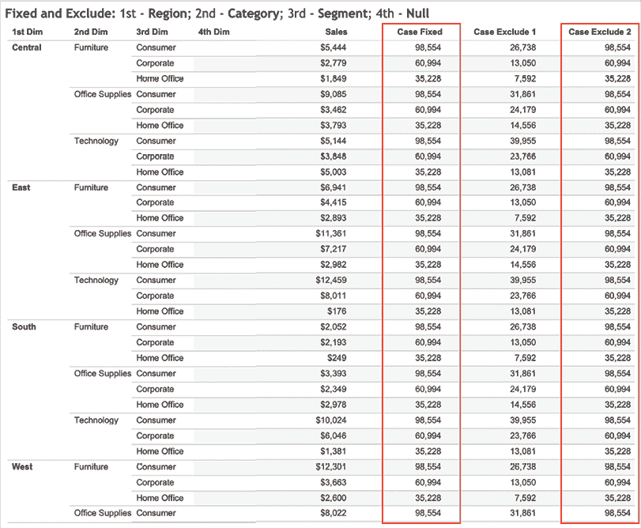

# 第七章：练习细节级别计算

当我们在 Tableau 中谈论**细节级别**（**LOD**）计算时，我们指的是三种表达式：`FIXED`、`INCLUDE` 和 `EXCLUDE`。这三种表达式通过提供创建针对特定粒度级别的计算的能力，打开了无限可能性。在旧版本的 Tableau 中，工作表的数据粒度是通过视图中的维度来确定的。如果视图中包含了例如**地区**、**州**和**邮政编码**等维度，但作者想要创建一个**城市**级别的计算，那么**城市**维度就必须包含在视图中。此外，视图中没有排除或忽略给定**维度**的机制。诚然，通常可以通过一些复杂且有时晦涩的表计算、数据混合等方法获得所需结果。幸运的是，LOD 极大地简化了这些使用场景，并且在某些情况下，能够实现之前不可能实现的功能。

在本章中，我们将讨论以下主题：

+   介绍 LOD

+   `FIXED` 和 `EXCLUDE`

+   `INCLUDE`

+   使用 LOD 构建实用应用

本章的前几部分更偏向理论，但别担心 —— 你将在*使用 LOD 构建实用应用*部分以实践的方式探索这些概念。让我们从介绍 LOD 和它的使用方法开始。

# 介绍 LOD

Tableau 的默认设置是根据视图中存在的维度显示度量。如果你有一个包含 `销售` 数据的仪表板，并且有像 `州` 和 `城市` 这样的维度，假设你将 `州` 和 `销售` 数据拖入视图中，那么 `销售` 数据会按 `州` 分割，显示每个 `州` 的 `销售` 数据。如果你希望进一步将 `销售` 数据划分成更小的部分，可以添加 `城市` 字段，结果将是每个 `州` 下的每个 `城市` 的 `销售` 数据。LOD 可以操作这个默认行为。

完成本章后，你将能够按视图中不存在的维度划分或分区度量，并使用视图中少于显示维度的方式展示度量。

为了实现这一点，我们将构建并使用两个**操作环境**。按照工作要求交付报告可能会导致对一组有限功能的深入了解；也就是说，深入但狭窄的理解。花时间（并证明这些时间的必要性）去探索 Tableau 的某些功能，可能会因为这些功能表面上看似与工作职责没有直接关系而变得困难。操作环境可以通过提供高效的探索途径，帮助克服任何困难和反对。在本章中，我们将专门为 LOD 构建两个操作环境，以帮助通过提供高效的探索和理解途径，使得深入和广泛理解变得更容易。你可以随时回到本章附带的工作簿，测试与 LOD 相关的功能。

# FIXED 和 EXCLUDE

我们将构建的第一个工作区将用于探索三种 LOD 函数中的两个：`FIXED`和`EXCLUDE`。我们将使用一组参数和相关的计算字段来高效地探索这些函数的工作原理。

## 设置工作簿

本练习的大部分基础工作已经在与本章节相关的工作簿中完成。以下步骤仅要求您打开不同的计算和参数，查看它们是如何设置的，以及为什么这样做有效。在此过程中会给出解释。如果您没有直接访问该工作簿的权限，您应该能够通过参考以下步骤构建一个类似的工作簿。

完成工作表的初始设置，请按照以下步骤操作：

1.  访问[`public.tableau.com/profile/marleen.meier`](https://public.tableau.com/profile/marleen.meier)来定位并下载与本章节相关的工作簿。

1.  打开与本章节相关的工作簿，并导航到`Fixed and Exclude`工作表。该工作表应如下所示：


图 7.1：工作表

1.  选择`Superstore`数据源，并通过右键点击选择**编辑**来检查名为**1st Dim**的参数：

    图 7.2：参数 I

    名为**2nd Dim**、**3rd Dim**和**4th Dim**的参数与**1st Dim**相同。

1.  请注意，除了**Order Date**和**Ship Date**，数据集中的每个维度都包含在值列表中（见*图 7.2*）。为了本练习的目的，**Category**、**Region**、**Segment**、**Ship Mode**和**Sub-Category**尤其重要，因为这些维度的成员较少。具有大量成员的维度在此上下文中较难使用。

1.  检查工作簿中包含的**选择固定维度**、**选择排除维度 1**和**选择排除维度 2**参数，并注意我们在**值**列下定义了多个整数，每个整数将在参数下拉框中作为**显示为**列中指定的字符串显示。**选择固定维度**的**值**和**显示为**配置如下：


图 7.3：参数 II

1.  检查名为**1st Dim**的计算字段（它位于**数据**窗格中的**Practical: All**文件夹下）；此计算使用了`1st Dim`参数，并根据选择的参数显示相应的字段。如果用户在**1st Dim**参数中选择了**Category**，则值`1`将被激活（根据*图 7.2*中指定的值）。然后，值`1`将对应到计算字段**1st Dim**中的**Category**字段，如下截图所示：


图 7.4：计算的 1st Dim 字段

1.  计算字段**2nd Dim**、**3rd Dim**和**4th Dim**与**1st Dim**相同，区别在于每个字段引用了对应名称的参数；例如，**2nd Dim**计算字段使用了`[Parameters].[2nd Dim]`。

    这些`Case`语句与相关参数结合使用，将允许你从视图中的下拉菜单中选择要查看的维度，如*第 5 步*所述。

1.  检查以下计算字段，它们使你能够选择使用哪些 LOD，从而比较和对比差异和相似性：

    图 7.5：Case Fixed

    **Case Fixed**计算表明，如果用户在**Choose Fixed Dims**参数中选择`1`（显示为**1st**），**1st Dim**将被固定——无论仪表板的设置如何。这意味着**SUM(Sales)**将按照**1st Dim**进行分区，无论它是否是仪表板的一部分：

    

    图 7.6：Case Exclude 1

    **Case Exclude 1**计算表明，如果用户在**Choose Excluded Dims 1**参数中选择`1`（显示为**1st**），**1st Dim**将从视图中的计算中排除。

    这意味着**SUM(Sales)**不会按照**1st Dim**进行分区，即使它是视图的一部分：

    

    图 7.7：Case Exclude 2

    **Case Exclude 2**计算表明，如果用户在**Choose Excluded Dims 2**参数中选择`1`（显示为**1st**），**1st Dim**将从视图中的计算中排除。这意味着**SUM(Sales)**不会按照**1st Dim**进行分区，即使它是视图的一部分。

1.  现在，右键单击**Product Name**，并打开上下文过滤器进行检查。在弹出的对话框中，点击**Wildcard**标签，并注意设置，如下图所示。该过滤器已设置为仅显示以`S`开头的产品名称（**Match value**不区分大小写）：


图 7.8：通配符过滤器

1.  单击**OK**后，右键点击过滤器并选择**Add to Context**。注意，上下文过滤器会以灰色标示：


图 7.9：灰色上下文过滤器

1.  将以下维度放置到**Rows**架上：**1st Dim**、**2nd Dim**、**3rd Dim**和**4th Dim**。

1.  将**Measure Names**拖动到**Filters**架上，选择**Sales**、**Case Fixed**、**Case Exclude 1**和**Case Exclude 2**。

1.  将**Measure Values**添加到**Text**，并将**Measure Names**添加到**Columns**：


图 7.10：度量值

1.  通过右键单击每个参数并选择**Show Parameter Control**来显示每个参数。按如下顺序排列参数控制：


图 7.11：最终的操作区

通过遵循之前的步骤，我们现在可以构建各种表格来比较不同的 LOD，因为这些参数将允许我们选择不同的维度和包含 Tableau 中 `FIXED` 和 `EXCLUDE` 函数的计算字段。接下来，我们将继续使用沙盒环境并解释 LOD 如何改变计算字段。

## 理解 FIXED

现在沙盒环境已完成，让我们构建场景来更好地理解 `FIXED` 和 `EXCLUDE` 函数。我们将从 `FIXED` 开始。`FIXED` LOD 只考虑它所指向的维度。因此，当固定在某个维度时，视图中的所有其他维度（如果有）将被忽略。当 `FIXED` LOD 未定义任何维度时，结果将是一个忽略视图中所有维度（如果有）的计算。

让我们跳入练习，亲自查看一下：

1.  使用之前描述的工作表，设置如下所示的参数：

    图 7.12：第一个例子

    通过不同的参数，我们实现了展示每个 **Region** 和每个 **Category** 的 **SUM(Sales)**，同时我们还在 **Case Fixed** 列中固定了 **Category** 维度的 **SUM(Sales)** 计算。

1.  **Case Fixed** 列现在显示每个 **Category** 的总和，并忽略 **Region**，因为我们告诉计算要固定 **2nd Dim**（**Region**），并忽略视图中的维度。

    通过比较 **Sales** 列和 **Case Fixed** 列，我们可以看到这一效果：

    

    图 7.13：Case Fixed I

1.  请自己检查，并计算 **Furniture** 的值：

    10,072 + 14,249 + 4,494 + 18,564 = 47,379。

    尽管 **Region** 在视图中可见，但 **Case Fixed** 列中的 **SUM(Sales)** 会忽略 **Region**，并显示结果，仿佛 **Category** 维度是视图中的唯一维度。我们改变了数据的粒度。在 **Case Fixed** 列中，**Region** 只是用于提供信息，不会影响 **SUM(Sales)** 的计算。

1.  现在，将 **Choose Fixed Dims** 参数更改为 **1st**，并注意 **Case Fixed** 现在显示每个 **Region** 的总和：


图 7.14：Case Fixed II

1.  这一次，我们将 **Case Fixed** 列中的计算固定为仅考虑 **Region**，而忽略 **Category**。请自己检查，并计算 **Central** 的值：10,072 + 16,340 + 13,995 = 40,406。

    将 **Choose Fixed Dims** 参数更改为 **Fixed: Nothing**，并注意该金额反映了 **SUM(Sales)** 的总和：

    

    图 7.15：已固定：无

这一次，我们将计算固定为空，意味着我们忽略视图中的所有维度。请自己检查，并通过求和 **Sales** 值来做数学计算；总和为 194,776。

正如显而易见的，`FIXED` LOD 只考虑它所指向的维度。因此，当固定在 **类别** 上时，**地区** 会被忽略。正如演示所示，当固定在 **地区** 上时，**类别** 会被忽略。最后，当 **选择固定维度** 设置为 **固定：无** 时，未受 **产品名称** 上的上下文过滤器限制的整个数据集将被显示。

接下来，让我们看一下 Tableau 2021.1 中引入的与 `FIXED` LOD 相关的一些新功能。

### 表格范围的表达式

当使用整个表格作为范围时，编写 `FIXED` LOD 表达式的快捷方式是使用如下代码：

```py
{MAX([Order Date])} 
```

如果在 `Superstore` 数据集上使用此计算，结果将与编写以下内容完全相同：

```py
{FIXED: MAX([Order Date])} 
```

无论你在视图中显示什么，该字段将始终从整个表格中检索最新数据。酷吧？

### 快速 LOD

Tableau 2021.1 允许我们更快地创建 `FIXED` LOD。只需将所需的度量值拖动到维度上方，然后按下 *Ctrl*（在 macOS 上是 *Cmd*）。

现在你会看到维度以蓝色高亮显示（参见 **地区** 在 *图 7.16* 中）。然后将度量值拖放到那里，一个新的度量字段（在此情况下为 **销售（地区）**）将被创建。


图 7.16：快速 LOD

右键点击 **销售（地区）**，注意到已经创建了一个 `FIXED` LOD：


图 7.17：快速 LOD II

如果你使用的是 Tableau 2021.1 或更高版本，可以使用此快捷键来进行 `FIXED` LOD 计算。

我们构建的游乐场不仅仅用于 `FIXED`，还用于 `EXCLUDE`。接下来让我们看一下 `EXCLUDE`。

## 理解 EXCLUDE

让我们开始理解 `EXCLUDE` LOD。`EXCLUDE` LOD 会排除任何指向的维度。如果你的视图包含 **地区** 和 **类别**，并且你在 **类别** 上编写一个 `EXCLUDE` LOD，那么计算中只会考虑 **地区**。以下示例将更清楚地说明这一点——我们在本练习中的目标是通过使用比视图中更少的维度来计算 `SUM(销售)`。我们只想从计算中排除可见的维度，但仍然在仪表板中显示维度值：

1.  设置如下截图所示的参数：


图 7.18：固定：无

1.  你可以观察到以下结果：

    图 7.19：排除 I

    **案例排除 1** 显示每个 **类别** 和 **细分** 的总计，并忽略 **地区**。例如，**家具** 类别下的 **消费者** 细分的总额为 $26,738\. 该总额会为每个 **地区** 重复。生成这些结果的相关代码是：

    ```py
    SUM({EXCLUDE [Region] : SUM([Sales])}) 
    ```

1.  对参数进行以下更改：

    图 7.20：排除 II

    任何 LOD 计算都可以与视图中的多个维度一起使用。在这种情况下，**案例排除 2** 忽略了两个维度：**第 1 维度** 和 **第 2 维度**，它们与 **地区** 和 **类别** 相关。因此，**案例排除 2** 的相关代码是：

    ```py
    SUM({EXCLUDE [Region],[Category] : SUM([Sales])}) 
    ```

    **案例固定** 的相关代码是：

    ```py
    SUM({FIXED [Segment]: SUM([Sales])}) 
    ```

    **案例排除 2** 和 **案例固定** 现在的结果是相同的。这是因为排除前两维度与固定在第三维度是相同的，两个案例中只考虑了第三维度 **细分**。

    你可以在以下截图中观察结果：

    

    图 7.21：排除 II 表

1.  对参数做出以下更改：


图 7.22：更改第 4 维度

1.  你可以如下观察结果：


图 7.23：排除 III

1.  请注意，**案例排除 2** 和 **案例固定** 不再有相同的结果。这是因为引入了 **运输方式**，而 **案例排除 2** 考虑了 **运输方式**，而 **案例固定** 没有。

1.  试验其他设置，进一步增强你对 `FIXED` 和 `EXCLUDE` LOD 的理解。

`EXCLUDE` 会导致在 LOD 计算中涉及的任何维度从计算中移除。多个维度可以是 `EXCLUDE` LOD 的一部分，常见的使用案例包括将较低层次聚合（视图中的字段）与较高聚合进行直接比较（就像维度从视图中移除一样）。假设你想要可视化不同区域的类别销售情况以及每个区域的总销售额。你可能还想计算某个区域中单个类别与该区域整体之间的差异。难道这不是很酷吗，LOD 可以解决这个看似不可能的场景？希望之前的练习让你更好地理解了 `EXCLUDE` LOD。

作为对 `FIXED` 和 `EXCLUDE` 练习后的快速过渡，让我们更仔细地了解一下 Tableau 的操作顺序。正如你现在所知，`FIXED` 和 `EXCLUDE` 获得相同结果并不总是如此——操作顺序将帮助我们理解为什么。

## 理解 Tableau 的操作顺序

之前的练习让我们相信，`FIXED` 和 `EXCLUDE` 得到相同结果的方法是通过固定未排除的维度，反之亦然。然而，Tableau 执行 `FIXED` 和 `EXCLUDE` LOD 的顺序是不同的，这可能导致意外的结果。为了避免这种情况，我将向你展示使用 `FIXED` 或 `EXCLUDE` LOD 时需要注意的事项。

让我们看看过滤的顺序：

1.  按如下方式设置参数：


图 7.24：设置参数

1.  观察结果：

    图 7.25：相同结果

    请注意，正如在之前的练习中所见，**案例排除 2** 和 **案例固定** 是相同的。

1.  右键点击 **产品名称** 过滤器，选择 **从上下文中移除**：


图 7.26：从上下文中移除

1.  在以下截图中观察结果：


图 7.27：没有上下文过滤器

1.  **案例 Exclude 2** 和 **案例 Fixed** 不再相同。**案例 Fixed** 不再受**产品名称**筛选器的影响，因为上下文已被移除。

在前一个练习中观察到的 `EXCLUDE` 和 `FIXED` 之间的行为差异反映了基础筛选器操作顺序。如*图 7.27*所示，**上下文筛选器**会影响 `FIXED`、`EXCLUDE` 和 `INCLUDE` 计算，因为**上下文** **筛选器**首先应用于数据集，然后是 LOD。然而，**维度筛选器**只会影响 `EXCLUDE` 和 `INCLUDE` LOD，因为 `FIXED` LOD 会首先应用于数据集，然后是维度筛选器，接着是 `EXCLUDE` 和 `INCLUDE` LOD。

请参见下图，这是 Tableau 操作顺序的示意图：


图 7.28：操作顺序

*图 7.28* 来自 Tableau 的帮助页面，链接如下：[`help.tableau.com/current/pro/desktop/en-us/order_of_operations.htm`](https://help.tableau.com/current/pro/desktop/en-us/order_of_operations.htm)。

本页面还包含更多有关 Tableau 操作顺序的信息。

我们刚才看到，当使用上下文筛选器时，`EXCLUDE` 和 `FIXED` LOD 可能得到相同的数字，而维度筛选器会导致结果不同。这是因为 Tableau 会依次执行不同的请求。如前面的示意图所示，操作顺序为：

1.  上下文筛选器

1.  `FIXED` LOD

1.  维度筛选器

1.  `INCLUDE` 和 `EXCLUDE` LOD

了解这一点对于您选择正确的筛选器或 LOD 非常重要。

接下来，我们将使用一个新的练习场地，这次展示 `INCLUDE` LOD 如何工作。

# INCLUDE

第二个练习场地在使用附带工作簿时已为您大部分设置好（[`github.com/PacktPublishing/Mastering-Tableau-2023-Fourth-Edition/tree/main/Chapter07`](https://github.com/PacktPublishing/Mastering-Tableau-2023-Fourth-Edition/tree/main/Chapter07)）。不过，我们将为有效探索添加一些计算字段。如果您无法直接访问该工作簿，您应该能够通过参考以下信息构建一个类似的工作簿。

## 设置工作簿

在接下来的内容中，我们将设置一个工作表，以便练习`INCLUDE` LOD：

1.  打开与本章相关的工作簿，导航到 `探索 Include` 工作表。

1.  在前面练习中创建的参数和计算字段 **1st Dim**、**2nd Dim**、**3rd Dim** 和 **4th Dim** 也会在这个工作表中使用。

1.  右键点击**第 1 维**参数并选择**复制**。

1.  将复制的 `Choose` 重命名为 `Included Dims`。

1.  创建一个新的计算字段，命名为 `Case``Include`，并使用以下代码：

    ```py
    CASE [Choose Included Dims]
    WHEN 1 THEN AVG({INCLUDE [Category]: SUM([Sales])})
    WHEN 2 THEN AVG({INCLUDE [City]: SUM([Sales])})
    WHEN 3 THEN AVG({INCLUDE [Country]: SUM([Sales])})
    WHEN 4 THEN AVG({INCLUDE [Customer ID]: SUM([Sales])})
    WHEN 5 THEN AVG({INCLUDE [Customer Name]: SUM([Sales])})
    WHEN 6 THEN AVG({INCLUDE [Order ID]: SUM([Sales])})
    WHEN 7 THEN AVG({INCLUDE [Postal Code]: SUM([Sales])})
    WHEN 8 THEN AVG({INCLUDE [Product ID]: SUM([Sales])})
    WHEN 9 THEN AVG({INCLUDE [Product Name]: SUM([Sales])})
    WHEN 10 THEN AVG({INCLUDE [Region]: SUM([Sales])})
    WHEN 11 THEN AVG({INCLUDE [Segment]: SUM([Sales])})
    WHEN 12 THEN AVG({INCLUDE [Ship Mode]: SUM([Sales])})
    WHEN 13 THEN AVG({INCLUDE [State]: SUM([Sales])})
    WHEN 14 THEN AVG({INCLUDE [Sub-Category]: SUM([Sales])})
    WHEN 15 THEN 0
    END 
    ```

1.  将**案例 Include**放到**细节**架上。

1.  将以下度量和维度放到相应的架上：


图 7.29：探索 INCLUDE

1.  通过右键单击每个参数并选择**显示参数控制**来显示以下每个参数：


图 7.30：参数

完成初始设置后，我们终于可以开始调查`INCLUDE` LOD。

## 理解 INCLUDE

现在环境已设置完毕，我们来构建一个场景，更好地理解`INCLUDE`。现在你大概能想象，如果`FIXED`和`EXCLUDE` LOD 从计算中移除维度，那么`INCLUDE`会添加维度。没错！可能会发生这样的情况，你想在计算中包括一个或多个维度，即使视图中并没有显示它们。下一个例子将利用这个功能，在不显示子类别的情况下展示每个子类别的平均值。之所以这样做，是因为子类别包含大量额外的值，这使得仪表板难以阅读，并且需要更长时间才能得出快速结论。然而，了解每个子类别的平均值仍然是很有意义的，因为子类别的数量可能因**区域**和其他维度而异，包含它将有助于揭示实际的平均销售额。

让我们来看一下实际操作：

1.  按照右侧所示设置参数：


图 7.31：初始布局

1.  通过点击**分析**添加两条参考线，并使用以下设置进行编辑：


图 7.32：参考线设置

1.  查看以下截图以查看结果。请注意，两个参考线是相等的：


图 7.33：按区域销售和参考线

1.  如果参考线彼此重叠，请编辑格式并将**对齐方式**设置为**顶部**。要访问格式设置，请单击视图中的参考线：


图 7.34：格式参考线

1.  现在，按此方式设置参数：


图 7.35：格式参考线

1.  在 Tableau Desktop 中，您现在应该看到如下内容。与之前一样，两个**参考线**是相等的：


图 7.36：参考线

1.  将**选择包含的维度**参数更改为**类别**、**运输模式**和**细分**。

1.  请注意，在每个设置下，**参考线**是相等的。这是因为**选择包含的维度**仅介绍已经在视图中表示的维度。

1.  将**选择包含的维度**参数更改为**子类别**，以便在预期的位置查看额外的参考线：


图 7.37：显示额外的参考线

**Include Dim Avg**参考线现在将**子类别**包括在平均值内，因此与**整体平均**参考线不同。平均值较小，因为总**销售额**被分配到比视图中可见的更多点上。将**子类别**添加到 LOD 后，行数增多，每行的平均值也变小。此外，注意到**子类别**维度并未在视图中使用。LOD 计算不要求计算字段必须出现在视图中。

总结一下，`INCLUDE` LOD 可以以一种方式操作可视化，添加一些在视图中未使用的分区。此外，所有三种 LOD 的命名约定将成为你理解它们的最佳记忆法：`Fixed`固定已使用的字段，`Include`添加“缺失”的字段，和`Exclude`从已存在的计算中删除不需要的字段。

为了获得更多的实操训练，我们将继续进行一些实际应用。

# 使用 LOD 构建实际应用

本章的第一部分旨在演示 LOD 的工作原理，其余部分将专注于实际应用。具体来说，我们将考虑三个典型挑战，这些挑战之前通过其他 Tableau 功能（如表格计算和数据融合）解决。

本练习将探讨一个问题，该问题出现在将计算总百分比的表格计算与维度过滤器结合使用时。我们将考虑这个问题，并使用 LOD 计算提供解决方案，最后进行与解决方案相关的点评。

## 使用 LOD FIXED 计算

你是否曾遇到过这样一种情况：你只在视图中显示了**总数**维度的子集，却又想计算**总百分比**？别担心，你并不孤单。不过，感谢 LOD（层次化计算），你很快就会学会如何解决这个问题。以下步骤将引导你完成这项练习：

1.  打开与本章相关的工作簿，并导航到名为`The Problem`的工作表。

1.  选择`2012_World_Pop`数据集。

1.  创建一个名为`Percent of Total`的计算字段，使用以下代码：

    ```py
    SUM([Population]) / TOTAL(SUM([Population])) 
    ```

1.  右键点击**Percent of Total**并选择**默认属性** | **数字格式** | **百分比**。

1.  将**国家**放置在**列**货架上，将**度量名称**放置在**行**货架上，将**度量值**放置在**文本**货架上。

1.  从**度量值**货架中移除**记录数量**。

1.  右键点击**Percent of Total**并设置为**使用计算** | **国家**。

1.  在**国家**上创建一个过滤器，使其只显示**阿富汗**：


图 7.38：阿富汗人口

**阿富汗**显示的总百分比为 100%。显然，这并不代表阿富汗在全球总人口中的百分比。让我们来探讨可能的解决方案——要通过 LOD 解决此问题，请按照练习步骤进行操作：

1.  复制名为`问题`的工作表并重命名为`解决方案 LOD`。

1.  创建一个名为`总百分比 LOD`的计算字段，代码如下：

    ```py
    SUM([Population])/SUM({ FIXED : SUM([Population])}) 
    ```

1.  将**总百分比 LOD**放置到**度量值**货架，并注意显示的百分比为**0.43%**。如果显示为**0**，请将数字格式更改为百分比：


图 7.39：总百分比

1.  从**度量值**货架中删除之前创建的**总百分比**表计算：


图 7.40：总百分比 LOD

如你所见，问题解决了！为了更好地理解后台发生了什么，我们来看看 Tableau 为名为`问题`的工作表生成的查询。生成的查询可以通过点击**帮助** | **设置与性能** | **开始性能记录**来查看。（有关查看 Tableau 生成查询的更多信息，请参阅*第十一章*，*仪表板设计与可视化最佳实践*。）

SQL 语句如下：

```py
SELECT 
['2012_World_Pop$'].[Country] AS [Country],
SUM(['2012_World_Pop$'].[Population]) AS [SUM:Population:ok] 
FROM
[dbo].['2012_World_Pop$'] ['2012_World_Pop$'] 
WHERE
(['2012_World_Pop$'].[Country] = 'Afghanistan') 
GROUP BY
['2012_World_Pop$'].[Country]] 
```

请注意，查询中的`WHERE`子句将返回的数据集限制为只有那些**国家**为`阿富汗`的行。这个`WHERE`子句是因为将**国家**放置在**筛选器**货架上所生成的。通过限制返回的数据，处理要求从 Tableau 转移到底层数据源引擎。换句话说，数据源引擎负责执行查询，因此 Tableau 使用的是较小的数据集。这个设计的理由是，数据源引擎专门设计用于高效查询大数据集，并且通常具备支持此类活动的硬件。此外，限制返回给 Tableau 的数据行数可以减少由于延迟带来的低效问题。

由于 Tableau 尽可能从缓存中工作，低效问题进一步减少。通常，用户可以执行各种操作而无需生成对底层数据源的调用。然而，在前述情况下，如果用户选择了一个不同的**国家**作为筛选条件，Tableau 将生成一个新的查询到数据源。例如，如果用户与筛选器交互，取消选择`阿富汗`并选择`阿尔巴尼亚`，则会生成一个带有相应`WHERE`子句的新查询。尽管 Tableau 依赖于数据源引擎的逻辑是可以证明的，但在前述例子中提出的问题依然存在。Tableau 作者可以做什么来计算整个数据的百分比，而不受筛选的影响呢？

一种解决方案是创建一个表计算，也可以用作过滤器。不同之处在于，与工作表`The Problem`不同，Tableau 生成的查询会返回整个数据集。当表计算用于过滤器时，过滤操作直到底层数据返回后才会发生。换句话说，Tableau 执行过滤操作。这可以保留总百分比的百分比，而不管用户选择查看哪个国家的人口总数。但表计算可能会带来潜在问题，因为返回的数据集可能非常庞大，这可能会导致性能挑战。由于返回大数据集所需的时间增加，可能会遇到延迟，且由于增加的处理责任，Tableau 可能会更慢地执行。

我们提出的解决方案——LOD 计算，能够解决这些挑战。让我们来看看在`Solution LOD`工作表中，`Percent of Total LOD`计算字段创建的 SQL 查询：

```py
SELECT 
[t0].[Country] AS [Country], 
[t1].[ measure 0] AS
[TEMP(Calculation_418553293854285824)(2417030171)(0)],
[t0].[TEMP(Calculation_418553293854285824)(616435453)(0)] AS
[TEMP(Calculation_418553293854285824)(616435453)(0)] 
FROM 
( SELECT
['2012_World_Pop$'].[Country] AS [Country], SUM(['2012_World_Pop$'].[Population])
AS [TEMP(Calculation_418553293854285824)(616435453)(0)] 
FROM
[dbo].['2012_World_Pop$'] ['2012_World_Pop$'] 
WHERE 
(['2012_World_Pop$'].[Country]= 'Afghanistan') 
GROUP BY 
['2012_World_Pop$'].[Country] ) [t0] 
CROSS JOIN
( SELECT SUM(['2012_World_Pop$'].[Population]) AS [ measure 0] FROM
[dbo].['2012_World_Pop$'] ['2012_World_Pop$'] 
GROUP BY () ) [t1] 
```

请注意术语`CROSS JOIN`；LOD 计算生成的查询指示底层数据源引擎以一种方式返回数据，允许 Tableau 将一个或多个国家的人口值除以世界总人口，从而返回正确的总百分比。

## 使用 LOD INCLUDE 计算

接下来，我们将练习`INCLUDE` LOD 计算。在本练习中，我们将创建一个工作表，显示以下内容：

+   每个区域的总销售额

+   所有区域的总销售额的平均值

+   每个区域中所有州的总销售额的平均值

使用 LOD 计算来显示这些值非常简单。让我们一起探索。请按照练习步骤操作：

1.  选择`Practical Include`工作表。

1.  选择`Superstore`数据集。

1.  创建一个名为`Per State INCLUDE`的计算字段，使用以下代码：

    ```py
    {INCLUDE [State]:SUM([Sales])} 
    ```

1.  将**区域**拖到**列**架上，**SUM(Sales)**拖到**行**架上，**AVG(Per State INCLUDE)**拖到**详细信息**架上。确保将**Per State INCLUDE**更改为平均值聚合。

1.  通过右键单击**销售额**轴并选择**添加参考线**来添加两条**参考线**。使用以下设置：


图 7.41：参考线

1.  按照所需的格式完成工作表：


图 7.42：每个区域和州的平均值

如您所见，得益于 LOD，我们可以按**区域**显示折线图，同时也可以显示整个数据集的图表。这之所以可能，是因为我们在**Per State INCLUDE**计算中包含了**州**维度。使用此计算字段创建参考线，可以让 Tableau 显示不仅是每个（可见）**区域**的平均值，还有每个**区域**的（不可见）**州**的平均值。

## 使用 LOD EXCLUDE 计算

在这个练习中，我们将使用`超级市场`数据集创建一个工作表，用于计算每个城市在地区中产生的销售百分比。

按照练习步骤操作：

1.  选择`实际排除`工作表。

1.  选择`超级市场`数据集。

1.  创建以下计算字段：


图 7.43：地区值和每地区 LOD 百分比

1.  将**地区**和**城市**放置在**行**架子上。

1.  将**度量名称**放置在**列**架子上，并将**度量值**放置在**文本**架子上。

1.  从**度量值**架子上移除所有度量，除了**销售额**、**地区值**和**每地区 LOD 百分比**。

1.  为了让**每地区 LOD 百分比**以百分比形式显示，必须调整数字格式。只需右键点击**数据**窗格中的计算，选择**默认属性** | **数字格式** | **百分比**：


图 7.44：更改数字格式

1.  将**AGG（每地区 LOD 百分比）**放置在**过滤器**架子上，并调整显示至少`0.1`（即 10%）：


图 7.45：百分比过滤器

1.  查看当前视图，其中**地区**和**城市**位于**行**架子上：


图 7.46：杰克逊维尔仍然可见

1.  现在，将**州**放置在**行**架子上，位于**地区**和**城市**之间。请注意，**杰克逊维尔**消失了：


图 7.47：当地区添加到行时，杰克逊维尔消失

这是因为**杰克逊维尔**位于**南部**地区的两个州：**佛罗里达州**和**北卡罗来纳州**。你可以看到这将**每地区 LOD 百分比**过滤器替换为**城市**：**杰克逊维尔**：


图 7.48：杰克逊维尔存在于两个州之间

我们的**地区值**计算排除了**城市**和**州**，因此**每地区 LOD 百分比**将计算视图中可见内容的**销售总和**，然后除以**地区值**。当视图中仅有**地区**和**城市**时，杰克逊维尔的**销售总和**为**44,713**（见*图 7.48*）。将这个数字除以**地区值**的**391,722**（见*图 7.46*），结果超过 10%。但是，随后我们将**州**添加到视图中，将**杰克逊维尔**在**佛罗里达州**的**销售总和**改为**39,133**，在**北卡罗来纳州**的**销售总和**为**5,580**（见*图 7.50*）。这两者在除以**地区值**的**391,722**后，结果都没有超过 10%，因此将由于过滤器的作用而从视图中删除。

LOD 是使用 Tableau 时相对高级的话题之一，但它们非常强大，值得花时间去理解。为了获得更多实际的例子，我建议你查看以下网站：[`www.tableau.com/about/blog/LOD-expressions`](https://www.tableau.com/about/blog/LOD-expressions)。我记得刚开始使用 Tableau 时，我从没想过会需要基于不在视图中的维度来展示数据，或者想要排除某些维度。但事实上，我很多时候都需要这么做，比如，在仪表板上添加距离总行平均值的计算，或者当某个维度有多个最大日期时，只想显示每个最大日期的度量。我比你想象的还要频繁地查阅 LOD 的文档，只能鼓励你也这样做；你读得越多，理解这个概念并自如使用它就会变得越容易。LOD 为你的仪表板带来的灵活性简直令人难以置信。

# 总结

我们通过探索为什么 LOD（层次级别计算）如此具有影响力，以及它们在 Tableau 中为何如此受到赞誉，开始了本章。接下来，我们构建了两个实验场来探索三种 LOD——`FIXED`、`EXCLUDE`和`INCLUDE`——的工作原理。Tableau 的默认设置是基于视图中可见的维度来进行计算。例如，如果你的视图中有州，销售额将按州展示。如果你添加了城市，销售额将按州和城市进行调整。但是，如果你想修改这种默认逻辑，你可以使用 LOD。它们允许你根据任何维度来计算度量，无论该维度是否在视图中呈现。我们还看到，`FIXED` LOD 的优先级高于`EXCLUDE`和`INCLUDE` LOD，这在 Tableau 的操作顺序中非常重要。记住这一点，以便在仪表板中使用正确的 LOD 和/或过滤器。

在下一章中，我们将关注 Tableau 的视觉部分，探索不同的图表类型以及一些不太常见但非常实用的可视化方法。

## 在 Discord 上了解更多

要加入本书的 Discord 社区——你可以在这里分享反馈、向作者提问并了解新版本——请扫描下面的二维码：

[`packt.link/tableau`](https://packt.link/tableau)


