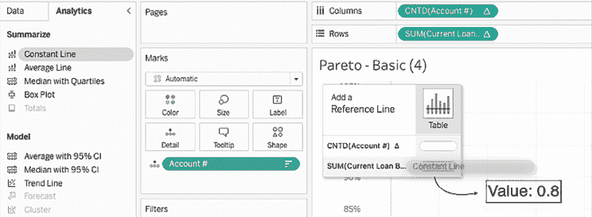
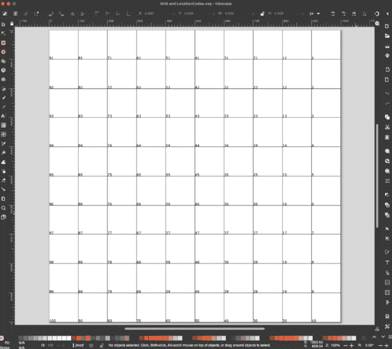

# 第八章：超越基础

本章的假设是你已经熟悉诸如条形图、折线图、树图、饼图和面积图等基本图表类型，并且曾经使用 Tableau 构建过多个图表。本章的目的是聚焦于如何改进你可能已经经常使用的可视化类型，同时介绍一些你可能不太熟悉但仍然广泛有用的图表类型。接下来我将介绍 Tableau Exchange，这是一个包含扩展、加速器和连接器的平台，它提供了一些更为独特的图表类型。

也许本章最有用的部分根本不在书中，而是在与本章相关的工作簿中。务必下载该工作簿（链接将在下一节提供），以查看各种各样的可视化类型。

本章将探讨以下可视化类型和主题：

+   改进受欢迎的可视化

+   自定义背景图片

+   Tableau Exchange

    +   扩展

    +   加速器

    +   连接器

请记住，仪表盘的内容才是最重要的，但如果你能用更漂亮的设计来呈现相同的内容，那就选择更好的设计吧。确实存在**美学偏见**和**设计驱动的消费**。你想要卖出你的产品——让它看起来好看！我希望接下来的几节内容能帮助你找到自己的方向，最终让你成为更好的仪表盘设计师。

# 改进受欢迎的可视化

最受欢迎的可视化类型之所以受欢迎，是有原因的。基本的条形图和折线图直观、灵活且易于理解，因此在数据可视化中广泛应用。其他一些不那么基础的可视化类型，如子弹图和帕累托图，可能并不是你每天都会使用的，但它们仍然是数据分析师工具箱中的有用补充。尽管这些图表都很好，但它们还有更多潜力。本节将探讨如何调整、扩展，甚至彻底改进一些受欢迎的图表类型。

## 子弹图

子弹图由 Stephen Few 发明，并在 2006 年通过他的书籍*《信息仪表盘设计：数据的有效视觉传达》*公开传播。Stephen Few 通过他的书籍和博客[www.perceptualedge.com](http://www.perceptualedge.com)，依然是数据可视化领域的有力声音。子弹图通过将大量信息压缩在小空间内，同时保持吸引力和易读性，来高效直观地传达信息。可以理解的是，它们因而获得了极大的普及，并被广泛应用于许多目的，网络搜索可以看到这一点。接下来的两个练习将介绍子弹图的基本概念以及如何在此基础上加以改进。并不是说我在本章中改进了子弹图！目的是简单地传达这种重要的可视化类型如何在 Tableau 中得到更有效的使用。让我们开始吧。

### 使用子弹图

以下步骤将教你如何使用子弹图的基本操作：

1.  访问[`public.tableau.com/profile/marleen.meier`](https://public.tableau.com/profile/marleen.meier)，找到并下载与本章节相关的工作簿。

1.  打开名为`子弹图`的工作表并选择`CoffeeChain`数据源。

1.  将以下字段放置在相应的架上：**利润**放置在**列**，**市场**放置在**行**，**预算利润**放置在**细节**中的**标记**卡片上。

1.  右键点击*X*轴并选择**添加参考线**。

1.  在**编辑参考线、带状图或框选**对话框的左上角，选择**线条**。同时，将**范围**设置为**按单元格**，将**值**设置为**SUM(预算利润)**并选择**平均值**，将**标签**设置为**无**。点击**确定**：


图 8.1：参考线

1.  我们来添加另一条参考线。这一次，作为替代方法，点击**分析**面板并将**参考线**拖到工作表中。（当然，你也可以重复*第 4 步*的方法。）

1.  在对话框中，选择**分布**并将**范围**设置为**按单元格**。将**值**设置为**百分比**，并输入**90,95,100**，将**百分比基准**设置为**SUM(预算利润)**。将**标签**设置为**无**。点击**确定**：


图 8.2：百分位数

1.  创建一个名为`利润与预算利润比率`的计算字段，使用以下代码：

    ```py
    SUM([Profit])/SUM([Budget Profit]) 
    ```

1.  创建另一个计算字段，名为`配额达成？`，并使用以下代码：

    ```py
    SUM([Profit])>=SUM([Budget Profit]) 
    ```

1.  右键点击**利润与预算利润比率**，选择**默认属性** | **数字格式** | **百分比**。

1.  将**利润与预算利润比率**放置在**标签**架上，**配额达成？**放置在**颜色**架上：


图 8.3：初步子弹图

回顾至今的结果，你会注意到该可视化图表中有一些重要的方面。例如，参考线和颜色条清晰地标示了配额是否达成。此外，百分比显示了各市场实际利润与预算利润的差距。然而，也存在一些问题需要解决：

+   与**南方**市场相关的百分比部分被遮挡。

+   由参考分布表示的背景颜色被遮挡。

+   条形图的颜色不直观。橙色被设置为**真**，表示在这种情况下，达成配额的市场。然而，从心理学角度看，橙色是一个警示色，用来传达问题，因此它更直观地与未达成配额的市场相关。此外，这些颜色在灰度显示时不易区分。

+   图例中的**假**和**真**这两个词并不直观。

在接下来的步骤中，我们将解决这些问题，并为你展示可能的解决方案。

### 子弹图——基础之外

为了解决上一部分图表中的问题，请按照以下步骤操作：

1.  继续上一个练习，访问屏幕左侧的**数据**窗格，右键点击**配额完成？**，并调整计算如下：

    ```py
    IF SUM([Profit])>=SUM([Budget Profit])
    THEN 'Quota Met'
    ELSE 'Quota Missed'
    END 
    ```

1.  这个计算会创建字符串`配额完成`，如果利润高于预算利润，或者创建字符串`配额未完成`，如果利润没有超过预算利润。这两个字符串可以作为图例，且比之前的**真**和**假**更直观。

1.  创建一个名为`利润与预算利润较大值`的计算字段，并输入以下代码：

    ```py
    IF SUM(Profit)>SUM([Budget Profit])
    THEN SUM(Profit)
    ELSE SUM([Budget Profit])
    END 
    ```

    这个计算会显示利润金额，如果它大于预算金额，或者显示预算金额，如果利润较小。这将帮助我们始终显示两者中较大的金额。

1.  将**利润与预算利润较大值**放置到**利润**之后的**列**货架上。还可以右键点击该条并选择**双轴**。

1.  右键点击**利润与预算利润较大值**的轴线，选择**同步轴**。

1.  在**标记**卡中，选择标有**全部**的窗格，并将标记类型设置为**条形图**。


图 8.4：标记卡

1.  从**颜色**货架中移除**度量名称**。

1.  在**标记**卡中，选择标有**AGG(利润与预算利润较大值)**的窗格。

1.  点击**颜色**货架并将**不透明度**设置为**0%**。

1.  在**标记**卡中，选择标有**SUM(利润)**的窗格。

1.  从**标记**卡中移除**AGG(利润与预算利润比)**，并注意百分比标签不再被遮挡。

1.  点击**颜色**货架并选择**编辑颜色**。在弹出的对话框中，完成以下步骤：

    1.  双击**配额完成**并将颜色设置为白色。

    1.  双击**配额未完成**并将颜色设置为黑色。

1.  在每个对话框点击**确定**并返回主屏幕后，再次点击**颜色**货架，并将**边框**设置为黑色。

1.  点击**大小**货架，通过将滑块向左拖动来缩小条形图的宽度。

1.  右键点击**利润**轴线，选择**编辑参考线**。然后将**值**设置为**平均预算利润的 90%、95%、100%**：


图 8.5：参考线

1.  在同一窗口中，向下滚动到**格式化**部分，将**填充**颜色设置为**浅灰色**。勾选**填充以下部分**和**反转**复选框。请注意，背景颜色现在更容易区分：


图 8.6：背景颜色

1.  右键点击标有**利润与预算利润较大值**的轴线，取消选择**显示标题**。你可能希望做一些额外调整，但我们的结果如下：


图 8.7：改进的子弹图

请注意，前述问题现已得到解决：

+   百分比数字不再被遮挡。

+   由于条形变窄，背景颜色更容易区分。

+   条形图的颜色更加直观。此外，使用黑色、白色和灰色避免了由色盲或灰度打印引起的可读性问题。

+   图例中的**False**和**True**已被更具描述性的术语**配额已达**和**配额未达**所取代。

完成本节内容后，你将学会如何通过调整来改善你的可视化效果以及选择的图表类型。每当你当前的选择尚未讲述完整故事时，你可以进行这些调整。除此之外，这也是一个卖点。你的用户喜欢漂亮的设计和清晰的仪表盘。通过使用更高级的技术改进你的可视化效果，你将能够提升你的讲故事技巧和营销效果。

在下一节中，我们将继续增加已知**可视化**的复杂性。这一次，我们将创建饼图和甜甜圈图，并最终将两者结合起来。

## 饼图和甜甜圈图

饼图在数据可视化圈中通常是不受欢迎的。它们有太多的缺点。例如，饼图在矩形屏幕上并没有很好地利用空间。树状图要适合得多。此外，饼图上合理的切片数量相当有限，最多也许是六到八个。再一次，树状图更优，因为它们可以以更精细的粒度进行切片，同时仍然保持有用。最后，在使用饼图时，可能很难分辨两个大小相似的切片哪个更大。树状图在这一点上也没有更好；然而，如果观众知道树状图的排序是从左上角到右下角，那么这一知识可以用来区分大小差异。当然，条形图完全避免了这个问题，因为眼睛可以轻松区分宽度和高度，但在分辨角度（饼图）和体积（树状图）方面却有困难。

尽管有这些缺点，但由于饼图的普及，饼图可能在未来几年仍会在数据可视化中广泛使用。人们喜欢它们，因为它们与老旧、无聊的条形图不同。用户熟悉饼图，它们无需任何解释，是展示比例的一种方式——只是我个人认为并不是最好的方式。对于悲观的 Tableau 作者来说，最好的做法是笑着接受并忍受它。但对于那些愿意探索并突破前沿边界的人来说，饼图的好用场景是可以被发现的。下面的练习就是这种探索的一个贡献。

### 地图上的饼图和甜甜圈图

有时，确实有需要（或认为需要）在地图上构建饼图的情况。这个过程并不困难（如你将在下面的练习中看到的那样），但是有一些缺点是无法轻易克服的。我们将在练习之后讨论这些缺点。

以下是步骤：

1.  在与本章相关的工作簿中，导航到名为`Pie Map`的工作表并选择`Superstore`数据源。

1.  在**数据**窗格中，双击**州**以创建美国地图。

1.  将**销售额**放置到**颜色**架上。单击**颜色**架并将**调色板**更改为**灰色**：


图 8.8：编辑颜色

1.  按住*Ctrl*（Windows）或*Command*（Mac），同时拖动**纬度（生成）**的副本到**行**架上，创建两行，每行显示一张地图：


图 8.9：纬度

1.  在**标记**卡中，您会注意到现在有三个窗格：**全部**、**纬度（生成）**和**纬度（生成）（2）**。单击**纬度（生成）（2）**并将标记类型设置为**饼图**：


图 8.10：标记卡窗格

1.  将**类别**放置到**颜色**架上，将**销售额**放置到**大小**架上。

1.  为完成可视化操作，右键单击**纬度（生成）**在**行**架上的第二个实例，并选择**双轴**：


图 8.11：饼图地图

您能在可视化中看到问题吗？应该很快就能看到两个问题：

+   首先，较小的饼图很难看清。单击**大小**图例的下拉菜单并选择**编辑大小**可能部分解决这个问题，但如**罗德岛**等较小州的饼图仍然会有问题。

+   其次，许多州即使销售金额差异较大，背景仍然是相同的浅灰色。

以下方法将解决这些问题，同时添加额外的功能。

### 饼图与甜甜圈图——超越基础

以下是创建具有饼图和甜甜圈图的瓦片网格地图的步骤。通过结合不同的方法，我们将能够在不让视图过载的情况下一次性显示更多信息：

1.  在与本章相关的工作簿中，导航到名为`Altered Pie Map`的工作表并选择`Superstore`数据源。

1.  创建以下计算字段：

    | **名称** | **代码** |
    | --- | --- |
    | `类别州销售额` |

    ```py
    {FIXED State, Category: SUM(Sales)} 
    ```

    |

    | `州最大值` |
    | --- |

    ```py
    {FIXED State : MAX([Category State Sales])} 
    ```

    |

    | `每个州的最佳销售类别` |
    | --- |

    ```py
    MAX(If [State Max] = [Category State Sales] then Category END) 
    ```

    |

1.  我们需要那前两个**细节级别**（**LOD**）计算和最后一个计算来显示每个类别的销售额，同时显示每个州的最佳销售类别。

1.  在**标记**卡中，将标记类型设置为**饼图**。

1.  在**数据**窗格中，选择**州**数据源。

1.  单击**数据**窗格中**州**旁的链条图标，将**州**用作混合字段：


图 8.12：链接维度

1.  将**列**拖动到**列**架，将**行**拖动到**行**架。

1.  从**Superstore**数据源中，将**类别**放置到**颜色**架上，将**销售额**放置到**角度**架上。

1.  将**州**放置在**标记**卡中的**详情**上。

1.  点击**大小**架并根据需要调整大小。

1.  此时，你应该能看到由饼图组成的大致美国地图。接下来，我们将通过将饼图变成甜甜圈图来进一步增强图形：


图 8.13：地图

1.  返回到**州**数据源，在**行**架中再放置一个**行**实例。

1.  在**标记**卡中，选择**行 (2)**，并将视图类型更改为**圆形**。

1.  从**超市**数据集中，将**每个州的畅销类别**放置到**颜色**架中：


图 8.14：地图 II

1.  将**销售额**放置到**标签**架中。右键点击你刚刚放置在**标签**架中的**销售额**实例，并选择**格式**。在**格式**窗口中进行以下调整：

    1.  将**数字**格式设置为**货币（自定义）**，小数位数为**0**，并将**显示单位**设置为**千（K）**：

    图 8.15：格式调整

    1.  将**对齐方式**设置为**居中**，如下图所示，以便数字位于圆圈的正中：

    图 8.16：对齐方式

    1.  在**行**架中，右键点击第二个**行**实例，选择**双轴**。

    1.  右键点击某个**行**坐标轴实例，选择**同步坐标轴**。

    1.  在**标记**卡的**行 (2)** 实例中，确保**大小**大于**行**实例的**大小**，以便将饼图显示为外环。

    1.  在**行 (2)** 和**行**实例的**标记**卡中，点击**颜色**架并选择**编辑颜色**。根据需要调整颜色设置，使得覆盖圆圈（甜甜圈的空心部分）的颜色能够与底下的颜色区分开来，同时仍然能识别出哪种**类别**卖得最好。我选择了以下设置：

    图 8.17：颜色选择

    1.  同样，在**颜色**架中，将**边框**设置为所需颜色。我使用的是白色。我还将**标签**的颜色设置为白色。

    1.  右键点击每个坐标轴，取消选择**显示标题**。选择**格式** | **线条**，并将**网格线**设置为**无**。根据需要进行其他格式调整：

    图 8.18：平铺网格图

初看之下，这种可视化可能显得有些奇特。它被称为**平铺网格图**，尽管它在数据可视化领域相对较新，但已经开始在诸如 NPR 等媒体平台上得到应用。在合适的场合下，平铺网格图可以带来一些优势。让我们考虑一下前面练习中给我们带来的几个优势。

首先，网格布局结合**对数销售额**计算字段立即创建了一个显而易见的美国地图，同时确保各种饼图的大小从最大到最小变化适度。因此，每个饼图的每一块切片都能够合理地展示；例如，哥伦比亚特区的销售额与加利福尼亚州的销售额一样容易被看到。

其次，最终用户可以通过内圆的颜色（即甜甜圈的空洞）清楚地看到每个州的畅销类别。这是通过 LOD 计算实现的。感谢 LOD，我们能够将畅销类别与其他两个类别区分开来。由于这三类都位于同一列，因此需要使用 LOD 计算。有关 LOD 计算的更多细节，请参阅*第七章*，*深入了解细节级别计算*。结果是一个信息密集型的可视化，它以实用、直观的方式使用饼图。

本节展示了从不同角度在同一可视化中展示数据的一些更具创意的方法。接下来，我们将继续讨论另一种高级可视化——帕累托图。

## 帕累托图

在 19 世纪末，一位意大利经济学家维尔弗雷多·帕累托观察到，意大利 80%的土地由 20%的人拥有。环顾四周，他发现这个数学现象出现在许多意想不到的地方。例如，他注意到他花园里 80%的豌豆是从 20%的豌豆荚里生产出来的。因此，80/20 法则已进入流行语境。你可以利用这一原则通过强调最关键的元素或焦点来创建清晰的视觉层次结构。你也可以将其作为优先排序的工具——你的 20%最重要的任务、数据集和数据质量问题是什么？先处理这些。通过优先排序，你可以集中注意力，确保有效的沟通。但这一切需要一本完整的书来讲解。让我们先专注于如何在 Tableau 中可视化 80/20 现象。在以下练习中，我们将讨论如何构建基本的帕累托图，然后如何扩展该图使其更有用。

### 使用帕累托图

当然，并非所有数据集都会遵循 80/20 法则。因此，以下练习考虑了一个社区银行的贷款数据，其中 80%的贷款余额并不由 20%的客户持有。然而，帕累托图仍然可以是一个非常有用的分析工具。

请按照以下步骤操作：

1.  在与本章相关的工作簿中，导航到名为`Pareto - Basic`的工作表，并选择`Bank data source`。

1.  在**数据**面板中，将**账户号**更改为**维度**。将**账户号**放置在**列**架上，将**当前贷款余额**放置在**行**架上。

1.  点击**适应**下拉菜单并选择**整个视图**。

1.  右键点击**账户号**字段，并选择**排序**。将**排序依据**设置为**字段**，**排序顺序**设置为**降序**，**字段名称**设置为**当前贷款余额**，**聚合方式**设置为**求和**：


图 8.19：排序

1.  右键点击**SUM(当前贷款余额)** **Δ**，位于**行**架上，然后选择**添加表计算**。选择如下截图所示的设置：


图 8.20：表计算 I

1.  将**账户号**实例拖动到**详细信息**架上。

1.  点击**颜色**架，并将**边框**设置为**无**。

1.  右键点击位于**列**架上的**账户号**实例，并选择**度量** | **计数（唯一）**。注意，单条垂直线会显示：


图 8.21：帕累托显示单个垂直线

1.  再次右键点击位于**列**架上的**CNTD(账户号)**实例，并选择**添加表格计算**。按以下截图配置设置：


图 8.22：表格计算 II

1.  点击屏幕左上角的**分析**选项卡，并执行以下两个步骤：

    1.  将**常量线**拖动到**表格** | **SUM(当前贷款余额)** **Δ**

    1.  在弹出的对话框中，选择**常量**并将**值**设置为**0.8**，如下截图所示：

    图 8.23：常量线

1.  重复前面的步骤，但有以下不同：

    1.  将**常量线**拖动到**表格** | **CNTD(账户号)**

    1.  在弹出的对话框中，选择**常量**并将**值**设置为**0.2**

1.  将**当前贷款余额**拖动到**行**架上。将其放置在**行**架上当前的**SUM(当前贷款余额) Δ**右侧。注意，轴受一个余额比其他贷款大得多的单笔贷款的影响：


图 8.24：帕累托基本

1.  右键点击**当前贷款余额**轴并选择**编辑轴**。在弹出的对话框中，将**刻度**设置为**对数**，然后关闭窗口。这解决了单笔大额贷款影响轴的问题，从而使得其他贷款的视图变得模糊。

1.  在**标记**卡中，选择第二个**SUM(当前贷款余额) Δ**实例，并将标记类型设置为**条形图**：


图 8.25：选择条形图

1.  右键点击**SUM(当前贷款余额) Δ**在**行**架上的位置，并选择**双轴**。

1.  右键点击**% 总计运行中的当前贷款余额**轴并选择**将标记卡移到前面**。根据需要更改颜色、工具提示和格式：


图 8.26：帕累托图

该可视化图表有一些值得注意的积极方面。首先，最终用户可以通过观察图表的两个部分及坐标轴上的数值，迅速获得初步理解。例如，左侧的*y*轴显示了每笔当前贷款相对于总贷款余额的百分比，以累计和的方式呈现，最终达到 100%。右侧的*y*轴则显示相同贷款的金额。*x*轴则展示了独特的账户 ID 或编号。我们可以看到，在这个例子中，20%的账户持有几乎 60%的贷款，约 50%的账户持有 80%的贷款。这些是红色线和两条参考线的交点。此外，最终用户可以将光标悬停在曲线的任何部分，查看相应的提示框。

然而，这个可视化图表还有提升空间。例如，给两条参考线添加参数，重新措辞坐标轴标签以减少冗长，是增加附加值的快速方法。因此，在下一个练习中，我们将看看是否能够在当前的可视化基础上进行一些扩展。

### 帕累托图表 - 超越基础

在前一个练习中，我们需要更加仔细地查看，以便找出每个账户占有多少贷款。接下来的步骤将向我们展示如何创建一个参数，帮助我们找出交点：

1.  复制前一个练习中的工作表，并将复制的工作表命名为**帕累托 - 改进版**。

1.  通过选择参考线并将其拖出工作表，移除两条参考线。

1.  将**SUM(当前贷款余额) Δ**（表格计算）从**行**架拖动到**数据**面板。当提示时，将该字段命名为**余额的累计百分比**。

1.  创建并显示一个参数，设置如下。该参数允许我们设置 0 到 100%之间的任意值，并且我们能够在帕累托可视化图中看到该区域的颜色：


图 8.27：编辑参数

1.  右键单击新创建的参数，选择**显示参数**。

1.  创建以下计算字段：

    | **名称** | **代码** |
    | --- | --- |
    | `贷款的累计百分比` |

    ```py
    RUNNING_SUM(COUNTD([Account #]) / TOTAL(COUNTD([Account #]))) 
    ```

    |

    | `帕累托分割` |
    | --- |

    ```py
    IF [Running % of Balance] < [% of Balance] THEN "Makes up X% of Balance" ELSE "Makes up rest of Balance" END 
    ```

    |

    | `帕累托分割（标签）` |
    | --- |

    ```py
    IF LOOKUP([Pareto Split], -1) != LOOKUP([Pareto Split], 0) THEN MID(STR([Running % of Loans] * 100), 1, 5) + "% of loans make up " +MID(STR([% of Balance] * 100), 1, 5) +"% of balance" END 
    ```

    |

1.  对帕累托图表上选定区域的着色配置需要额外的关注；因此，我们创建了三个计算。通过这些计算，我们可以更改可视化图的部分颜色，并添加一些解释文本和标签。

1.  选择**Marks**卡片中的**全部**部分。

1.  将**帕累托分割**拖动到**详细信息**架上。点击**Marks**卡片中**帕累托分割**右侧下拉菜单，选择**颜色**：


图 8.28：帕累托分割到颜色

1.  选择**Marks**卡片中的**余额的累计百分比 Δ**部分，将标记类型设置为**线**。

1.  将**Pareto Split (label)**拖动到**标签**架上。请注意，预期的标签没有显示：


图 8.29：没有标签的帕累托图

1.  为了解决这个问题，首先点击**标签**架，并选择**允许标签与其他标记重叠**。

1.  然后，右键点击**Pareto Split (label)**，在**标记**卡片上选择**按账号#计算**。现在你会看到标签：


图 8.30：带标签的帕累托图

1.  点击屏幕左上角的**分析**选项卡，执行以下两个步骤：

    1.  将**参考线**拖动到**表格 | Δ余额的运行百分比**：图 8.31：参考线

    1.  在弹出的对话框中，从**值**下拉菜单中选择**余额百分比**，并将**标签**设置为**无**：

    图 8.32：参考线 II

    1.  根据需要更改颜色、工具提示和格式：

    图 8.33：改进后的帕累托图

如你在截图中看到的，最终用户现在有一个单一的参数滑块（位于右上角），它可以移动图表上的水平参考线。当最终用户移动参考线时，文本会更新，显示贷款和余额百分比。颜色也会更新，随着用户调整参数，垂直显示正在考虑的贷款百分比。我们通过创建计算字段`Pareto Split`和`Pareto Split (Label)`，在视图数据和参数的结合下进行计算，从而实现了这一点。

下一节将讨论一个非常强大且仍然很少使用的功能，它将使你的仪表板提升到一个新的水平！想象一下，在 Tableau 中查看街景，房屋上方悬停时，你将能够看到租赁/购买价格、面积以及可能的其他特征。你还无法想象在 Tableau 中如何实现这一点？好吧，继续阅读！在下一节中，我们将讨论各种地图、图像，甚至像国际象棋和飞镖这样的游戏示例。

# 自定义背景图像

Tableau 中的自定义背景图像开启了一个充满潜力的世界。想象一下，能够可视化任何空间的能力。这个可能性涵盖了体育、医疗保健、工程、建筑、室内设计等诸多领域。尽管有如此丰富的潜力，我认为 Tableau 中的背景图像仍然未被充分利用。为什么？部分原因是生成可以与背景图像一起使用的数据集的难度。

就像之前讨论的瓦片网格地图一样，背景图像需要网格布局来定位 *x* 和 *y* 坐标。在接下来的部分，我们将介绍如何使用 Tableau 创建一个可以叠加在图像上的网格，立即识别与 *x* 和 *y* 坐标相关的位置，并相对较快地生成可以供 Tableau 用于可视化的数据集。

## 创建自定义多边形

Tableau 本身提供的地理区域多边形包括国家、州/省、县和邮政编码。这意味着，举例来说，可以轻松为世界各国创建填充地图。只需复制一份国家列表并粘贴到 Tableau 中。接着，在 Tableau 中将视图类型设置为**填充地图**，并将国家列表放置在**详细信息**架上。Tableau 会自动为每个国家绘制多边形。

此外，可能会出现特殊的映射需求，需要为通常不在地图上显示的区域绘制多边形。例如，一个组织可能会定义销售区域，这些区域的边界不符合常规地图的标准。最后，可能会有自定义图像的映射需求。Tableau 用户可以将篮球场或足球场的图片导入到 Tableau 中，并绘制多边形来表示场地的特定部分。对于这些 Tableau 没有原生提供多边形的情况，必须创建自定义多边形，才能为每个示例创建填充地图。

### 绘制 Null Island 周围的方形区域

在本节中，我们将从基础开始，绘制一个简单的方形，围绕位于本初子午线和赤道交点的神秘 Null Island。

我们将进入一个更复杂的示例，涉及为德克萨斯州的每个城市绘制多边形。Tableau 提供了一个选项，允许作者**在默认位置显示数据**，用于处理未知位置。选择此选项后，Tableau 会将所有未知位置的纬度和经度设置为 0（零），从而在世界地图上创建一个位于非洲西海岸 1600 公里处的符号。Tableau 开发者亲切地称这个区域为 Null Island。

Null Island 甚至有自己的 YouTube 视频：[`youtu.be/bjvIpI-1w84`](https://youtu.be/bjvIpI-1w84)。

在这个练习中，我们将围绕 Null Island 绘制一个方形区域：

1.  在 Excel 中重新创建以下数据集：

|  | **A** | **B** | **C** |
| --- | --- | --- | --- |
| **1** | **点** | **纬度** | **经度** |
| **2** | 0 | -1 | -1 |
| **3** | 1 | -1 | 1 |
| **4** | 2 | 1 | 1 |
| **5** | 3 | 1 | -1 |
| **6** | 4 | -1 | -1 |

1.  将数据集复制并粘贴到 Tableau 中。这样，一个名为 `Clipboard_...` 的新数据源将会出现：


图 8.34：Null Island 坐标

1.  从工作表中删除所有字段。

1.  将 **点** 转换为维度。这可以通过右键点击 **点** 并选择 **转换为维度**，或者将其拖动到 **数据** 面板中的维度部分来完成。

1.  双击 **纬度** 和 **经度**。顺序不重要；Tableau 会自动将 **经度** 放到 **列** 货架上，将 **纬度** 放到 **行** 货架上。

1.  选择 **地图** | **背景地图** | **街道**。你可能需要稍微缩小一下视图，才能看到陆地边界：


图 8.35：定位空岛

1.  将视图类型更改为 **线条**，并将 **点** 拖动到 **路径** 货架上。你应该能看到以下结果：


图 8.36：定位空岛 II

1.  返回你的 Excel 文件，交换包含第 1 点和第 2 点数据的行，然后再次将数据复制到 Tableau 中。

1.  跟随 *步骤 2–7* 并观察结果图像：


图 8.37：错误的标绘空岛

这个有趣但错误的图像是由于点的顺序不正确所致。作为经验法则，在确定点的顺序时，选择一个如果你要在纸上物理绘制多边形时会合适的顺序。如果你不能按给定的点顺序在纸上绘制出所需的多边形，那么 Tableau 也做不到。

你可能会发现，在 Tableau 中完成这个练习相对简单。挑战在于确保数据正确，特别是多边形的点。一个有用（且免费的）工具，可以用来生成多边形数据，位于 [`powertoolsfortableau.com/tools/drawing-tool`](http://powertoolsfortableau.com/tools/drawing-tool)。这是由 InterWorks 创建的许多工具之一，旨在帮助解决常见的 Tableau 挑战。

我们接下来将使用它来展示我们图书馆中哪些书籍是可用的，哪些是不可用的。

### 使用多边形创建一个互动书架

我自己不太擅长绘画，但我一直很喜欢在 Tableau Public 上看到的那些精美的多边形背景，形状各异，能够让 Tableau 与它们互动，按某个度量来上色，或者将某个动作链接到特定区域。比如你知道吗，五大洲的形状可以被重新塑造，做成一只鸡的形状？嗯，Niccolo Cirone 就是用多边形做了一个 Tableau 仪表盘：[`www.theinformationlab.co.uk/2016/06/01/polygons-people-polygon-ize-image-tableau/`](https://www.theinformationlab.co.uk/2016/06/01/polygons-people-polygon-ize-image-tableau/)。

你也想制作炫酷的仪表板，但你的绘图技能平平，就像我一样吗？别担心！这一部分将为你提供实现这一目标的工具。InterWorks 开发了一款类似按数字绘画的工具——这款应用非常适合构建多边形，而无需自己进行过多的绘制。你可以在这里找到它：[`cbistudio.interworks.com`](https://cbistudio.interworks.com)。你需要做的就是找到一张图片，上传到工具中，并开始沿着线条绘制。

对于这个练习，我在互联网上搜索了一张书架的图片。你也可以做同样的事情，找到一张图片用于本次练习，或者下载我使用的这张图片，点击这里下载：[`github.com/PacktPublishing/Mastering-Tableau-2023-Fourth-Edition/Chapter08/bookshelf.png`](https://github.com/PacktPublishing/Mastering-Tableau-2023-Fourth-Edition/Chapter08/bookshelf.png)：

1.  打开 InterWorks 提供的免费绘图工具，选择**图片**选项：


图 8.38：CBI Studio

1.  上传你的图片，并在**我正在创建**部分选择**多边形**。

1.  现在从一本书的边缘开始点击。一个橙色的点会出现。然后移动到同一本书的下一个边缘，再次点击。书的这条边缘上会绘制一条线，坐标会自动显示在右侧列表中：


图 8.39：绘图工具

1.  书籍的最后一个点应该位于第一个点的顶部（第一个点比其他点大）。再次点击第一个点将完成第一个多边形，完成的多边形会显示为绿色：


图 8.40：完成多边形

1.  你在其他地方设置的下一个点会获得一个不同的形状 ID，因此 Tableau 后续可以将其区分为一个不同的形状。记住，要沿着书的外边缘移动，并避免交叉线条。

1.  当你完成书籍轮廓的绘制后，下载数据为 `.csv` 格式，并保存该文件，用作 Tableau 的数据源。我是这么做的，另外，我还添加了**名称**和**可用**两列。你可以看到，此外，还有唯一的形状 ID、点 ID（即你点击屏幕的顺序）以及作为位置表示的 *x* 和 *y*：


图 8.41：Excel

1.  接下来，在 Tableau 中加载数据，将**X**放在**列**上，将**Y**放在**行**上。你能认出书架了吗？我这次练习只用了四本书，因此并非所有书都显示出来：


图 8.42：书店

1.  在将图像添加到 Tableau 之前，我们需要获取 Tableau 设置所需的最外层点的坐标。只需回到绘图工具并测量边缘。记录下四个边的**X**和**Y**坐标。它们可能不完全是角落位置，但以下值大致可以转换为高度 = `400` 和宽度 = `648`：


图 8.43：绘图工具

1.  回到 Tableau，点击**地图** | **背景图像**，并选择**书店....** 在弹出的窗口中，定义名称并上传你在绘图工具中使用的图像。同时填写**X**和**Y**字段的坐标，以表示图像的边缘：


图 8.44：编辑背景图像

1.  点击**选项**并选择**始终显示完整图像**。然后关闭此窗口：


图 8.45：编辑背景图像选项

1.  现在，你的图像应该出现在工作表上，书籍周围有匹配的点：


图 8.46：带点的书架

1.  要创建一个围绕线条而不是点的效果，将标记类型更改为**线条**，并将**形状 ID**放置在**详细信息**上，将**点 ID**放置在**路径**上：


图 8.47：带线条的书架

1.  要创建一个多边形，将标记类型更改为**多边形**，并将**颜色**架上的**不透明度**设置为**0%**。

1.  此外，在将书名和可用性这两个字段放置到**详细信息**架上后，你还可以添加一个带有书名和可用性的工具提示：


图 8.48：编辑工具提示

1.  如果你将鼠标悬停在书籍上，你可以看到书名和可用性：


图 8.49：使用工具提示

多边形最棒的地方在于它们填充了整个区域。在这个例子中，无论你将鼠标悬停在哪里或点击哪里，书籍的完整背面都会被覆盖，因为我们绘制的是一个区域，而不是一个点或某个默认形状。这带来了无尽的选择；想象一下，一个大型图书馆，每本书都是一个多边形，你可以将实时数据连接到多边形数据集，随时获取任何书籍的可用性。除了书籍，你还可以绘制任何东西。我在 Tableau 中最常见的是平面图、超市货架、办公室布局、分割成部分的形状……多边形真的是让你在数据可视化中尽情发挥创造力。

如果你手头没有图像，而你又想绘制一些非常具体的内容到你的仪表板中，可以使用付费或免费的软件，如 Adobe Illustrator Draw、Sketch、Sketsa SVG Editor、Boxy SVG、Gravit Designer、Vecteezy Editor、Vectr、Method Draw、Inkpad、iDesign、Affinity Designer、macSVG、Chartist.js、Plain Pattern、Inkscape 等等。

在继续之前，让我们将仪表板再推进一步：

1.  右键点击**名称** | **别名...**

1.  按照这里所示的方式更改书籍并点击**确定**：


图 8.50：选择另一本书

1.  移除`书店`工作表的**X**和**Y**轴。

1.  打开一个仪表板标签并命名为**书店**：


图 8.51：URL

1.  将`The Bookstore`工作表拖到仪表板的上半部分，将**网页**对象拖到下半部分。在 URL 弹出框中输入：[`en.wikipedia.org/wiki/`](https://en.wikipedia.org/wiki/)。

1.  选择**网页对象**并点击箭头；选择**添加 URL 操作…**


图 8.52：添加 URL 操作…

1.  在**操作**窗口中，通过从箭头下拉框中选择此字段，添加**名称**到 URL：


图 8.53：描述过滤器

1.  点击**确定**，然后选择不同的书籍，查看仪表板中的 Wikipedia 条目变化：


图 8.54：Wikipedia

我相信你现在有很多想法想用多边形做些什么。或许你想分析一盘棋局？我们接下来就做这个！

## 在 Tableau 中分析棋局

在这个练习中，我们将使用 Inkscape。但与其在某个工具中绘制某物，将其转换为多边形，并加载到 Tableau 中，我们将在 Tableau 中创建 SVG 文件的代码，加载到 Inkscape 中查看是否成功，然后将其转换为多边形，再将转换后的版本带有 *x* 和 *y* 坐标的数据加载回 Tableau，用于分析一盘棋局。通过自己创建 SVG 文件，你将能够识别 Tableau 所需的**X**和**Y**坐标，因此你将始终能够转换 SVG 文件。

### 在 Tableau 中创建 SVG 文件

在本节中，我们将使用 Tableau 生成构建 SVG 文件所需的 XML，这个文件可以用开源的矢量图形工具 Inkscape 打开，Inkscape 是免费的。请访问 [inkscape.org](http://inkscape.org) 下载最新版本。我们还需要 `Chessboard.png` 图像，图像可以在 Packt 的 GitHub 页面找到：[`github.com/PacktPublishing/Mastering-Tableau-2023-Fourth-Edition/Chapter08/Chessboard.png`](https://github.com/PacktPublishing/Mastering-Tableau-2023-Fourth-Edition/Chapter08/Chessboard.png)。请也下载此文件。

通常，多边形在非线性图形中显示出更强大的作用。然而，在此案例中，我们的棋盘是一个很好的示例，因为我们将自己创建 Tableau 使用的位置——创建一个正方形比创建一个复杂形状更容易，因为我们可以使用增量。请注意，以下示例中使用了一个包含 10 行 10 列的网格，这当然会生成一个 100 个单元格的网格。在 Inkscape 中，这个网格的表现是令人满意的。然而，如果需要更大的单元格数量，可能需要像 Adobe Illustrator 这样的专业图形工具。

### 创建网格

以下练习具有多个目的。第一个目的是展示如何使用 Tableau 创建网格。本章提供了再次使用数据搭建框架的机会，数据搭建框架在*第四章*《学习连接、混合与数据结构》中有所讨论。不同之处在于，在那一章中，使用了日期来进行框架搭建，而在以下部分中，则使用了分箱（bins）。此外，本练习需要进行许多表计算，这些计算有助于巩固在*第五章*《介绍表计算》中学到的知识。最后，本练习利用了数据密集化，这在*第六章*《利用 OData、数据密集化、大数据和 Google BigQuery》中有讨论。

要开始操作，请执行以下步骤：

1.  打开一个新的 Tableau 工作簿，并将第一个工作表命名为**Header**。

1.  使用 Excel 或文本编辑器创建一个**记录**数据集。以下的两行数据表表示**记录**数据集的完整内容：


图 8.55：Excel

1.  将 Tableau 连接到**记录**数据集：

    +   为了方便起见，可以考虑使用*Ctrl* + *C* 复制数据集，并使用 *Ctrl* + *V* 直接粘贴到 Tableau 中。

    +   Tableau 很可能将**记录**视为度量。将**记录**拖到**数据**窗格的**维度**部分。

1.  创建两个参数。一个命名为 `Overall Pixel Count`，另一个命名为 `Rows Down/Columns Across`。两个参数的设置如下：

    +   数据类型：**整数**

    +   允许值：**所有**

1.  显示两个参数。将**Rows Down/Columns Across** 设置为 `10`，并将**Overall Pixel Count** 设置为 `1,000`：


图 8.56：显示参数

1.  创建一个名为 `Concatenate Header` 的计算字段，并使用以下代码：

    ```py
    '<?xml version="1.0" encoding="utf-8"?><svg version="1.1" id="Squares"
    xmlns="http://www.w3.org/2000/svg"
    xmlns:xlink="http://www.w3.org/1999/xlink" x="0px" y="0px" viewBox="0 0 ' +
    STR( [Overall Pixel Count] ) + " " + STR([Overall Pixel Count])+ '"
    style="enable-background:new 0 0 '+ STR([Overall Pixel Count]) + ' ' +
    STR([Overall Pixel Count]) + ';" xml:space="preserve">
    <style type="text/css"> .st0{fill:none;stroke:#000000;stroke-miterlimit:10;}
    </style>' 
    ```

    请注意，在**计算字段**对话框中输入换行符可能会导致从 Tableau 中提取结果时出现困难。换句话说，删除所有换行符。

1.  现在，我们已经创建了一个框架或模板，它将帮助我们创建多个位置，以便在 Tableau 中绘制网格。

1.  将新创建的计算字段放置在**文本**架上。

1.  在工具栏中选择适应**整个视图**来查看结果；你可以看到参数填充了**STR([Overall Pixel Count])** 来自 **Concatenate Header**：


图 8.57：Concatenate Header

1.  创建一个新工作表，命名为**位置代码**。

1.  创建以下计算字段：

    | **Name** | **Code** |
    | --- | --- |
    | `Rows Down/Columns Across` |

    ```py
    [Parameters].[Rows Down/Columns Across] 
    ```

    |

    | `Which Column?` |
    | --- |

    ```py
    LAST()+1 
    ```

    |

    | `Which Row?` |
    | --- |

    ```py
    INDEX() 
    ```

    |

    | `Grid Size` |
    | --- |

    ```py
    [Overall Pixel Count]/LOOKUP([Which Column?],FIRST()) 
    ```

    |

    | `X` |
    | --- |

    ```py
    [Overall Pixel Count] - ([Grid Size] * ([Which Row?])) 
    ```

    |

    | `Y` |
    | --- |

    ```py
    [Overall Pixel Count] - ([Grid Size] * ([Which Column?]-1)) 
    ```

    |

    | `Count` |
    | --- |

    ```py
    If [Records] = 1 THEN 1 ELSE [Rows Down/Columns Across] END 
    ```

    |

    | `Decicount` |
    | --- |

    ```py
    If [Records] = 1 THEN 1 ELSE [Rows Down/Columns Across] END 
    ```

    |

    | `Location Codes` |
    | --- |

    ```py
    Index() 
    ```

    |

    | `Concatenate Locations` |
    | --- |

    ```py
    '<text transform="matrix(1 0 0 1 ' + STR([X]) + " " + STR([Y])
    +')">' + STR( [Location Codes] ) + '</text>' 
    ```

    |

1.  创建的计算字段将在接下来的步骤中用于创建一个值表，类似于我们在绘图工具中生成的值表。只不过现在我们将自己完成这一步，并使用 SVG 代码代替经度和纬度值。

1.  右键点击**Count**并选择**创建** | **分箱**。在弹出的对话框中，将**分箱大小**设置为**1**：


图 8.58: 计数区间

1.  右键点击**十进制计数**并选择**创建** | **区间**。在弹出的对话框中，将**区间大小**设置为**1**：


图 8.59: 计数区间 II

1.  将**计数（区间）**、**十进制计数（区间）**、**位置代码**、**X**和**Y**放置在**行**架上。确保按照列出的顺序放置这些字段。

1.  如果你的字段是绿色的（表示连续），右键点击每个字段并将其设置为**离散**。然后：

    +   右键点击**计数（区间）**和**十进制计数（区间）**，并确保**显示缺失值**已被选中

    +   右键点击**位置代码**并选择**使用计算** | **表格（向下）**

    +   将**X**的**使用计算**值设置为**计数（区间）**

    +   将**Y**的**使用计算**值设置为**十进制计数（区间）**！[](img/B18435_08_60.png)

    图 8.60: 位置代码工作表

1.  将**连接位置**放置在**文本**架上。

1.  右键点击刚刚放置在**文本**架上的**连接位置**实例并选择**编辑表格计算**。

1.  在弹出的对话框顶部，可以看到有四个选项在**嵌套计算**下：**网格大小**、**哪个列？**、**哪个行？**和**位置代码**。为每个选项设置**使用计算**定义如下：

    +   **嵌套计算**: **网格大小** > **使用计算**: **表格（向下）**

    +   **嵌套计算**: **哪个列？** > **使用计算：特定维度**: **十进制计数（区间）** > **将此维度移至顶部**

    +   **嵌套计算**: **哪个行？** > **使用计算：特定维度**: **计数（区间）** > **将此维度移至顶部**

    +   **嵌套计算**: **位置代码** > **使用计算**: **表格（向下）**

1.  在工具栏中选择**适应宽度**以查看结果；你可以看到多个行已经被创建。这些行稍后将用于绘制网格：


图 8.61: 适应宽度

1.  现在，创建一个名为**Lines**的新工作表。

1.  创建以下计算字段：

    | **名称** | **使用计算设置** |
    | --- | --- |
    | `H Then V` |

    ```py
    Index() 
    ```

    |

    | `HLine` |
    | --- |

    ```py
    Last() 
    ```

    |

    | `VLine` |
    | --- |

    ```py
    Index()-1 
    ```

    |

    | `X1` |
    | --- |

    ```py
    IF [H Then V] = 1 THEN 0 ELSE
    [Overall Pixel Count] - ([Grid Size] * ([VLine])) END 
    ```

    |

    | `Y1` |
    | --- |

    ```py
    IF [H Then V] = 2 THEN 0 ELSE
    [Overall Pixel Count] - ([Grid Size] * ([VLine])) END 
    ```

    |

    | `X2` |
    | --- |

    ```py
    IF [H Then V] = 1 THEN [Overall Pixel Count] ELSE [Overall Pixel Count] - ([Grid Size] * ([VLine])) END 
    ```

    |

    | `Y2` |
    | --- |

    ```py
    IF [H Then V] = 2 THEN [Overall Pixel Count] ELSE [Overall Pixel Count] - ([Grid Size] * ([VLine])) END 
    ```

    |

1.  接下来，将以下字段按顺序放置在**行**架上：**计数（区间）**、**十进制计数（区间）**、**H Then V**、**HLine**、**VLine**、**网格大小**、**哪个列？**、**X1, Y1**、**X2**和**Y2**。请注意，每个字段应设置为离散型。

1.  右键点击**计数（区间）**和**十进制计数（区间）**，并设置每个字段为**显示缺失值**。

1.  右键点击**行**架上剩余的每个字段并选择**编辑表格计算**。根据下表设置每个字段的**使用计算**定义：

| **名称** | **嵌套计算** | **使用设置进行计算** |
| --- | --- | --- |
| `H Then V` | `N/A` |

```py
Count (bin) 
```

|

| `HLine` | `N/A` |
| --- | --- |

```py
Count (bin) 
```

|

| `VLine` | `N/A` |
| --- | --- |

```py
Decicount (bin) 
```

|

| `网格大小` | `网格大小` |
| --- | --- |

```py
Table (Down) 
```

|

| `网格大小` | `哪个列？` |
| --- | --- |

```py
Decicount (bin) 
```

|

| `X1, Y1, X2, Y2` | `H Then V` |
| --- | --- |

```py
Count (bin) 
```

|

| `X1, Y1, X2, Y2` | `网格大小` |
| --- | --- |

```py
Count (bin) 
```

|

| `X1, Y1, X2, Y2` | `选择列？` |
| --- | --- |

```py
Count (bin) 
```

|

| `X1, Y1, X2, Y2` | `VLine` |
| --- | --- |

```py
Decicount (bin) 
```

|

1.  请注意，一些字段包含嵌套表计算。在这种情况下，**表计算**对话框的顶部将包含一个额外的选项，名为**嵌套计算**：


图 8.62：嵌套计算

1.  **X1**、**X2**、**Y1**和**Y2**需要为四个嵌套计算进行配置。首先打开**X1**的表格计算，然后从**嵌套计算**下拉菜单中选择**H Then V**，并将**计算方式**设置为**计数（分箱）**。然后，在同一窗口中，从下拉菜单中选择**网格大小**，并输入相应的**计算方式**设置。设置好所有四个下拉菜单后，继续进行**X2**并做相同的设置。

1.  过滤**H Then V**以仅显示**1**和**2**。

1.  创建一个名为`Concatenate Lines`的计算字段，代码如下：

    ```py
    '<line class="st0" x1="' + STR([X1]) + '" y1="' + STR([Y1]) + '" x2="' + STR( [X2] ) + '" y2="' + STR([Y2]) + '"/>' 
    ```

1.  此计算将通过包括**X1**、**X2**、**Y1**和**Y2**字段创建一个新字符串。通过这样做，我们将一行代码乘以所需的行数，每行包含一个特定的**X1**、**X2**、**Y1**和**Y2**组合。

1.  将**Concatenate Lines**放置在**文本**货架上。您的工作表应如下所示：


图 8.63：连接行

1.  导出刚刚创建的三个工作表的代码。

    从三个工作表导出代码可能会比较棘手，因为 Tableau 可能会尝试为字符串值输入额外的引号。我发现以下方法效果最好：

    1.  在**计数（分箱）**行中选择**1**。

    1.  按*Ctrl* + *A*（Mac 上为*Command* + *A*）选择工作表的所有内容。

    1.  将光标悬停在视图中选定的文本上，停留片刻，直到工具提示命令按钮出现。

    1.  在工具提示的右侧选择**查看数据**图标。

    1.  在结果的**查看数据**对话框中，选择**导出所有**。

    1.  使用与每个工作表相同的名称保存 CSV 文件；例如，从 `Header` 工作表导出的数据将命名为 `Header.csv`。

    1.  对其余工作表**Header**和**Location Codes**重复这些步骤。

1.  打开您最喜欢的文本编辑器实例，并将其保存为 `Grid and LocationCodes.svg`。

1.  从先前导出并保存的 `Header.csv` 中复制数据，并将其粘贴到 `Grid and LocationCodes.svg` 中。确保不要包含标题信息；仅包括 XML 代码。例如，在下图中，不要复制**第 1 行**，只复制**第 2 行**：


图 8.64：Excel

1.  使用 Excel，从 `Location.csv` 中复制所需数据，并将其粘贴到 `Grid and LocationCodes.svg` 中。所需的数据仅包括标记为`Concatenate Locations`的列。不要包括其他列或标题。仅包括 XML 代码。例如，在下图中，我们只复制**F**列：


图 8.65：Excel II

1.  使用 Excel，将所需的数据从`Lines.csv`复制并粘贴到`Grid and LocationCodes.svg`中。同样，所需的数据仅包括标有`Concatenate Lines`的列。不要包括其他列或标题，仅包含 XML 代码。

1.  最后，完成 SVG 文件，输入`</svg>`结束标签。完整的代码已经为您提供，位于**生成的 SVG 代码**标签中：


图 8.66：完整代码

1.  现在，在 Inkscape 中打开 SVG 文件 ([`inkscape.org/`](https://inkscape.org/)) 并观察网格：



图 8.67：Inkscape II

如果由于某种原因您的代码没有创建网格，或者您想使用我创建的版本，您可以在以下 GitHub 页面找到 SVG 文件及其他所有数据集：[`github.com/PacktPublishing/Mastering-Tableau-2023-Fourth-Edition/blob/main/Chapter08/GridandLocationCodes.svg`](https://github.com/PacktPublishing/Mastering-Tableau-2023-Fourth-Edition/blob/main/Chapter08/GridandLocationCodes.svg)。

在下一个练习中，我们将展示如何在 Tableau 中使用网格作为多边形数据源。

### 使用网格生成数据集

熟练的国际象棋选手大约在 40 步内完成一盘棋。在国际象棋比赛中，每局比赛的数据通常都会被捕获，这为数据可视化提供了机会。在本练习中，我们将使用一局棋的数据显示每个棋盘格子的占用频率：

1.  在与本章关联的工作簿中，导航到名为`棋盘`的工作表。

1.  如果您还没有下载`Chessboard.png`图片，可以从本书的 GitHub 仓库下载。

1.  打开上一个练习中创建的 SVG 文件，在 Inkscape 中查看。

    如果您没有完成之前的练习，您可以从本章关联的解决方案工作簿中复制位于仪表板上的 XML 代码，标题为**生成的 SVG 代码**。将该代码粘贴到文本编辑器中并以 SVG 扩展名保存，然后用 Inkscape 打开该文件。

1.  在**Inkscape**中，按*Ctrl* + *A*（Mac 上为*Command* + *A*）选择全部。使用*Ctrl* + *G*（Mac 上为*Command* + *G*）将选区分组。

1.  在**Inkscape**菜单中，选择**图层** | **图层和对象**。快捷键为*Shift* + *Ctrl* + *L*（Mac 上为*Shift* + *Command* + *L*）。

1.  在屏幕右侧显示的**图层**面板中，按**+**图标创建一个图层。将该图层命名为`棋盘`。然后，创建另一个名为`网格`的图层：


图 8.68：图层

1.  单击视图中的任何一行或数字。右键单击该行或数字，并选择**移动到图层**。选择**网格**图层。

1.  选择**文件** | **导入**并选择`Chessboard.png`图片。


图 8.69：图像导入

1.  确保将图像放置在**棋盘**图层上，以免遮挡位置代码编号。将棋盘图像放置在使位置代码**81**正好位于棋盘左上角的方格上。由于棋盘只有 64 个方格，它无法覆盖网格所提供的全部 100 个方格：


图 8.70：棋盘

此时，您可以根据每个位置的占用频率生成数据集。例如，您可能会注意到在一场棋局中，第 81 号位置被占用 40 次，这可能意味着玩家从未移动过那个车。然而，在另一场棋局中，该位置可能只被占用 10 次，这可能表明玩家在游戏早期进行了易位。叠加棋局和方格文件的目的是为了识别哪个方格属于棋盘上的哪个区域。

### 可视化一场棋局

在本练习中，我们将查看从一场棋局生成的数据集，并学习如何根据之前的练习结果进行可视化。以下是步骤：

1.  在本章相关的工作簿中，导航到名为`Chessboard`的工作表，并选择`Chessboard`数据源。

    为了继续执行下一步骤，您需要下载与本章相关的资源文件。为此，只需点击以下链接访问本书的 GitHub 仓库：[`github.com/PacktPublishing/Mastering-Tableau-2023-Fourth-Edition/tree/main/Chapter08`](https://github.com/PacktPublishing/Mastering-Tableau-2023-Fourth-Edition/tree/main/Chapter08)。

1.  右键点击`Chessboard`数据源，选择**编辑数据源**以查看数据集。

1.  在询问**数据文件在哪里？**的对话框中，定位到本章相关的`Chessboard.xlsx`文件。

1.  名为**棋盘网格**的表格包含每个位置代码及与之关联的**X**和**Y**坐标。这个数据集来自本章前面创建的**位置代码**工作表。名为**占用的方格**的表格包含**位置代码**和**占用的移动次数**字段。**棋盘网格**和**占用的方格**通过**位置代码**进行左连接：


图 8.71：连接

1.  在`Chessboard`工作表中，选择**地图** | **背景图片** | **棋盘**。

1.  在结果对话框中，点击**添加图像**以添加背景图片。

1.  如下所示填写**编辑背景图片**对话框：


图 8.72：棋盘背景图

1.  将**X**、**Y**（两者作为**维度**）和**位置代码**字段分别放置在**列**、**行**和**详细信息**架上，将**占用的移动次数**字段放置在**颜色**架上，并选择**标记**类型为**密度**：


图 8.73: 国际象棋棋盘背景图 II

1.  右击**X**轴和**Y**轴，并将两者设置为**固定**，设置**固定起始值**为**0**，**固定结束值**为**875**。

1.  编辑**Y**轴并设置为**反向**。不要反转**X**轴。

    这个最后一步之所以执行，是因为数据已经被结构化，以便反映**X**和**Y**坐标设置，这也是大多数图形工具中的默认设置。在这些工具中，左上角是**X**和**Y**都等于**0**的地方。

1.  根据需要调整**颜色**、**大小**、**形状**等：


图 8.74: 国际象棋棋盘

在截图中，圆圈越亮，表示这个空间在某个回合中被占用的频率越高。圆圈越暗，表示它被占用的频率越低。将鼠标悬停在某个区域时，会显示该区域的占用次数。

总结一下，我们首先通过创建一个 SVG 文件开始。我们通过按照 SVG 文件标准创建三种不同类型的代码：`Header`、`Location Codes`和`Lines`。然后我们将这三段代码复制到文本编辑器中并保存为 SVG 文件。接着，我们下载了 Inkscape 应用程序并打开了这个 SVG 文件，以查看我们工作的结果——一个 10x10 的方格区域。

我们将一个国际象棋棋盘的图像添加到 Inkscape 中，并对其进行了对齐。现在，我们可以看到每个棋盘上的方格编号与哪些棋盘区域相关联。就像书架示例一样，必须识别形状 ID，也就是棋盘区域 ID。根据棋盘区域 ID，我们能够生成第二个数据集，其中包含每个区域被占用的步数。通过将`Board Grid`数据集与`Occupied Moves`数据集连接，我们获得了一个使用案例。我们将一个国际象棋棋盘的背景图像添加到 Tableau 中，并在其上绘制了方格，根据这些方格在国际象棋游戏中被占用的次数，进行了上色和大小调整。当然，这些数字是每场游戏特有的，但通过收集多场比赛的数据，我们可以直观地分析国际象棋策略，甚至可能判断谁是更好的玩家。如果你喜欢国际象棋，随时可以试试，比较每场游戏的不同可视化结果，或者看看你是否总是得出相同的模式，看看这是否也适用于你的对手。

说到游戏，在下一个练习中，我们将可视化一个飞镖板。这个练习将比国际象棋的练习更短。请跟随步骤，了解更多关于多边形的知识。

## 在背景图像上创建多边形

在可视化的特定点上使用形状对于前面的练习来说是足够的，但有时使用多边形来勾画形状可能更有利。在这一部分中，我们将使用多边形在背景图像上进行操作，与书籍中的做法不同，我们将填充这些区域，以便不再需要背景图像（至少不需要那么多了）。

以下是所需的步骤：

1.  在与本章相关的工作簿中，导航到名为`Dashboard - Polygon`的工作表，并选择`Dartboard_W_Polygon`数据源。

    如果你在完成之前的练习时还没有这样做，下载 GitHub 上提供的图片。将其解压到你选择的目录中。

1.  选择**地图** | **背景图片** | **Dartboard - Polygon**。在**背景图片**对话框中，选择**添加图片**。按照下图填写对话框：


图 8.75：飞镖板背景图像

1.  创建一个具有以下配置的参数：


图 8.76：参数

1.  这个参数将用于在玩家 1：**Matthew**和玩家 2：**David**之间切换，或者显示两者的飞镖击中情况。

1.  通过右键点击**数据**窗格底部创建的参数，并选择**显示参数控制**，来显示之前创建的参数。

1.  创建一个名为`Total Hits`的计算字段，代码如下：

    ```py
    [David]+[Matthew] 
    ```

1.  然后，创建一个名为`Case`的计算字段，代码如下：

    ```py
    CASE [Select Player]
    WHEN 1 THEN SUM([Matthew])
    WHEN 2 THEN SUM([David])
    WHEN 3 THEN SUM([Total Hits])
    END 
    ```

1.  将**标记**卡片设置为**多边形**。

1.  检查**数据**窗格，确保**点**和**形状**都是维度（蓝色）。其他字段是度量：


图 8.77：维度和度量

1.  将**X**、**Y**、**点**、**形状**和**案例**字段放置在相应的架子上：


图 8.78：飞镖板多边形

1.  右键点击每个轴并将**范围**设置为**0**到**650**。

1.  点击**颜色**架子并选择**编辑颜色**。根据需要调整颜色。以下截图展示了一种可能的选择：


图 8.79：自定义分歧

你的最终工作表应如下所示：


图 8.80：最终飞镖板多边形

最终仪表板展示了一个不同颜色的飞镖板。灰色表示该区域在游戏中没有被击中，而颜色越红，表示该区域被击中的频率越高。通过使用该参数，你可以比较 Matthew 和 David 的得分，或者像前面的截图那样显示总击中次数。

你可能注意到，在本练习中多边形的弯曲部分并不完全完美。例如，看看围绕靶心的三环和双环区域；你会看到这些区域并不是 100% 平滑的。这只是使用 Tableau 中笛卡尔网格上的点的本质。也就是说，Tableau 基于网格结构，因此我们绘制的每一条曲线仍然是许多小线段连接网格布局上的点。点越多，点与点之间的线越短，绘制的曲线就越平滑。但如果你跟着书架练习做的话，你会看到，要做到这一点需要付出很多努力。尽管如此，我认为多边形绝对值得一试。这里我们使用了一些有趣的练习，虽然它们可能不会直接对你的日常工作产生价值，但想象一下你在其他程序中设计的一个完美无瑕的着陆页。通过使用多边形，你可以让设计元素变得可点击和互动。

接下来的主题与本章的其他部分略有不同。你听说过 Tableau Exchange 吗？Tableau Exchange 是 Tableau 世界中新加入的一个版本，结合了三种产品：扩展、加速器和连接器。感兴趣吗？请继续阅读下一节！

# Tableau Exchange

要访问 Tableau Exchange，请访问此网站：[`exchange.tableau.com`](https://exchange.tableau.com)。


图 8.81：Tableau Exchange

加速器和扩展可以从 Tableau Server 和/或 Tableau Desktop 内部访问。让我们深入了解 Tableau Exchange，看看它能提供什么！

## Tableau 扩展

扩展是最早的产品，可以从 Tableau 仪表板上的**对象**窗格中访问。基本上，扩展允许您直接在 Tableau 中使用第三方工具。某些精选的扩展可在 [`extensiongallery.tableau.com`](https://extensiongallery.tableau.com) 获取，并且这个列表还在不断增长。

请注意，Tableau 不提供对扩展的支持或保证/安全措施。这些 API 由外部方构建，因此应当视为第三方工具。如果您打算在工作中使用这些扩展，请先与 IT 安全团队确认。

我们来看看来自 Infotopics 的一个例子——一个 Sankey 图表扩展。

## 使用扩展

在关联的工作簿中，创建一个名为 `展示更多` 的新工作表，并选择 `Coffee Chain` 数据集。现在，通过将 **类型** 添加到 **列**，将 **产品类型** 添加到 **行**，并将 **利润** 添加到 **文本** 货架上，重新创建以下工作表布局：

图 8.82：展示更多

我们想在这个工作表中使用 Sankey 图表，它是一种流向图，显示基于流线的大小，某个度量和维度如何流入另一个维度。在此案例中，我们想知道**常规**类型产品的**利润**中，来自**咖啡**、**浓缩咖啡**、**草本茶**或**茶**的部分，以及与**无咖啡因**类型相关的**利润**。

假设你已经知道如何使用计算字段构建 Sankey 图表，但这非常耗时。相反，有一个**扩展功能**可以帮助你完成此任务。以下是使用此扩展功能的步骤，它最终能节省我们在构建 Sankey 图表时所花的时间：

1.  在关联的工作簿中，打开一个**仪表板**标签并命名为`Show me More DB`。

1.  将**Show me More DB**表单拖到仪表板上。现在也将**扩展功能**对象拖到仪表板上：


图 8.83：扩展功能

1.  从 Tableau 2021.1 开始，你将看到以下弹出窗口：


图 8.84：扩展功能库

1.  在**扩展功能库**中搜索**Show Me More 2.0**扩展。点击它并在下一个屏幕上选择**添加到仪表板**：


图 8.85：查看更多 2

1.  然后，选择**开始使用**并选择**Sankey 图表**可视化：


图 8.86：查看更多 II

1.  选择 Sankey 图表后，按照以下方式配置变量。如*图 8.87*中部分显示的那样，还有许多其他选项；你可以随意进行测试：


图 8.87：Sankey 图表设置

1.  点击**确定**按钮，瞧！你就得到了 Sankey 图表：


图 8.88：Sankey 图表

除了这个 Sankey 图表，我强烈建议你查看扩展功能库。这里有许多不同用途的扩展；有些是免费的，有些需要付费，但你也可以自己构建。这绝对值得一看！下一节将专门介绍一个特殊的扩展功能——它是 Tableau 2021.1 版本中最为宣传的新功能，**爱因斯坦发现**。

### 加速器

此功能工作在更基础的层面：如何设计、构建和组合一个仪表板。加速器是来自不同领域、具有不同重点的预定义仪表板。目前，已有超过 100 个加速器，支持多种语言，面向不同部门、行业和企业应用。你可以通过点击 Tableau Desktop 欢迎页面或 Tableau Server 上的链接，使用一个**加速器**仪表板，而不是从头开始：


图 8.89：Tableau 欢迎页面

在*图 8.89*中，左侧的两个仪表板总是会出现在 Tableau Desktop 的登录页面上，你已经熟悉这些了：`Superstore` 和 `World Indicators` 数据集。它们旁边，你可以看到一个带耳机的两个人图标。这就是我加载的第三个加速器仪表板。看看右上方的红框，你可以看到一个名为**More Accelerators**的超链接；点击它。

假设你想使用金融交易数据和加速器仪表板来启动你的项目。搜索*trading*：


图 8.90：搜索加速器

通过点击**Trading by Tableau**仪表板，将会打开一个新的 Tableau 工作簿——其中包含一个完整的交易仪表板，更棒的是，它具有数据映射功能，这意味着你可以在不破坏仪表板布局和预设功能的情况下，替换当前数据为不同的数据。每个加速器仪表板中的描述都包含了*数据映射可能*或*不可能*的信息。

当你打开新的仪表板时，你会看到以下弹出窗口：


图 8.91：数据映射器

点击**Get Started**，将你想要的数据集连接到加速器仪表板。

你可以使用这个数据集作为测试：[`www.kaggle.com/datasets/georgezakharov/historical-data-on-the-trading-of-cryptocurrencies`](https://www.kaggle.com/datasets/georgezakharov/historical-data-on-the-trading-of-cryptocurrencies)。


图 8.92：数据映射器 II

加载完成后，你可以开始逐一映射字段：


图 8.93：数据映射

重要的是要知道，你不必映射所有字段；然而，如果工作簿中的可视化使用了未映射的列，那么这些实例将显示为空值。

映射完成后，你的仪表板已准备好使用！检查一下所有内容是否符合预期，你的工作就完成了！

很棒吧？省时多了；我真的很喜欢 Tableau 中的这个新功能。

### 连接器

Tableau Exchange 提供的最后一个部分是**连接器**。在这里，你可以找到连接到 Tableau Desktop 中**Connect**面板中没有列出的数据库的连接器。

总结一下，Tableau Exchange 是一个平台，你可以在这里找到各种工具来增强数据分析并快速得出有意义的见解。它提供了 Tableau 加速器，这些是由专家创建的预构建仪表板，扩展功能提供了 Tableau 本身没有的功能，还有连接器，可以让你连接到默认面板中没有列出的数据库。一个真正的、免费的市场，帮助你快速启动 Tableau 的成功。

# 爱因斯坦发现

我们在前一节讨论了 Tableau 交换功能；然而，还有一个同样超出基础功能的特点也值得关注。但在继续之前，先说一下背景故事。2019 年 8 月，Tableau 被 Salesforce 收购。可能大多数人都知道 Salesforce，甚至在使用它，但对于其他读者来说，Salesforce 是一个云原生的**客户关系管理**（**CRM**）工具。除此之外，公司还开发了一个分析模块，允许 Salesforce 用户分析来自 CRM 系统和其他数据源的数据。

将 Salesforce 与 Tableau 连接在 Salesforce 收购之前就已经可以实现，但在 Tableau 2021.1 中的新变化是，Salesforce 的分析功能可以作为扩展和计算字段集成到 Tableau 中。Tableau 社区对此功能非常兴奋，因为它具备了内置的机器学习能力和实时预测功能。这个软件功能被称为 Einstein Discovery。

要使用 Einstein Discovery，你需要一个 Salesforce 许可证，特别是 Salesforce 的分析许可证。许可证的详细信息可以在此查看：[`www.salesforce.com/editions-pricing/crm-analytics/`](https://www.salesforce.com/editions-pricing/crm-analytics/)。

现在，为了让你了解 Einstein Discovery 能为你做什么，我将带你走过一个假想的用例。在供应链数据仪表板上，你发现运输时间可以改进，但你不知道哪些因素导致了延迟。在这种情况下，你可能决定使用 Einstein Discovery 来进行分析。

首先，你将**扩展**对象拖到仪表板上，就像我们之前做的**Show me More**扩展一样。然后选择**Einstein Discovery**项，此时将打开一个浏览器窗口，要求你登录到 Salesforce。登录后，你可以选择在 Tableau 仪表板上使用的模型。模型（例如，机器学习模型）必须提前在 Salesforce 中准备好。然后，Einstein Discovery 将成为你仪表板的一部分，你的工作表将显示 Salesforce 后台运行的模型输出。在我们的示例中，模型将更容易找到仪表板上与交货时间预测最相关的变量，并推荐你可以采取的行动，以改善发货时间。

你可以在[`youtu.be/dMWuy6mVE_o`](https://youtu.be/dMWuy6mVE_o)观看描述的用例视频和另一个用例的视频。

或者，你可以在计算字段中直接调用 Salesforce 模型。其工作原理请参见此处：[`help.tableau.com/current/pro/desktop/en-us/einstein_discovery_predictions.htm`](https://help.tableau.com/current/pro/desktop/en-us/einstein_discovery_predictions.htm)。

如果你想尝试这些新功能，如果你还没有 Salesforce 许可证，仍然有一种方法可以测试新的 Einstein 功能。虽然设置过程较长，但如果你确实想尝试，请查看这个视频以获得帮助：[`youtu.be/ZReSwXK0reo`](https://youtu.be/ZReSwXK0reo)。

这些是 Tableau 2021.1 中量身定制的新爱因斯坦功能的基石。详细讨论 Salesforce 平台的功能不在本书的范围之内，但如果你已经部署了 Salesforce，我肯定推荐你设置连接并测试运行一些模型。即使你不使用 Salesforce，许可可能会随时间发生变化，所以希望我们很快就能运行这些模型。暂时不用担心，我们将在*第十五章*，*集成编程语言*中讨论机器学习模型的集成。

# 摘要

我们通过考虑如何调整流行的可视化类型开始了本章。具体来说，我们微调了子弹图，考虑了在映射中使用饼图的完全不同方法，最后调整了帕累托图。接下来，我们将注意力转向了自定义背景图像，我们考虑了如何使用 XML 构建网格以生成 SVG 文件，从而加速为背景图像生成的数据。然后，我们通过在背景图像上构建多边形来完成本章，并快速进入了 Tableau Exchange 的世界。我们讨论了加速器、扩展和连接器，还讨论了 Salesforce 出售的一个独立产品——Einstein Discovery。

本书中无法覆盖所有选项，但由于你现在已经是复制的专家，我为你添加了更多包含其他可视化效果的工作表到解决方案工作簿中，供你玩耍。你会发现包含条形图、堆积条形图、分歧堆积条形图、交叉表、高亮表、离散高亮表、趋势线、面积图、火花图、组合图、双轴图、直方图、箱线图、散点图、填充地图、符号地图、树形图、树条形图、甘特图、KPI 图表、漏斗图、抖动分布、日历图、撞击图、坡度图、水流图、目标图以及条形嵌条图等工作表。务必确保使用最适合你的数据并能为你讲述的故事增值的图表。如果你仍然需要一些帮助来决定合适的可视化技术，我建议你查看 Tableau Public 上发布的以下仪表盘：[`public.tableau.com/en-us/gallery/visual-vocabulary`](https://public.tableau.com/en-us/gallery/visual-vocabulary)。此仪表盘旨在帮助你根据数据类型选择合适的可视化图表。

在下一章中，我们将重点讨论地图功能，了解如何在不离开界面的情况下扩展 Tableau 的原生地图功能，以及如何结合其他技术来扩展 Tableau 的地图功能。

## 在 Discord 上了解更多

要加入本书的 Discord 社区——在这里你可以分享反馈、向作者提问并了解新版本发布——请扫描下面的二维码：

[`packt.link/tableau`](https://packt.link/tableau)


