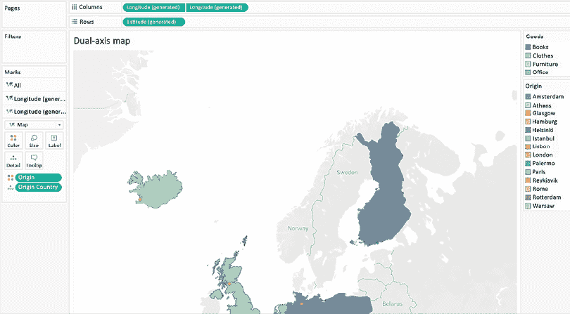
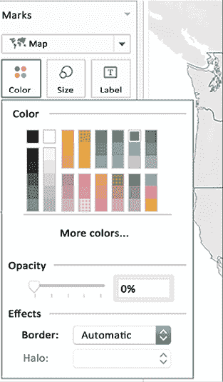

# 第九章：使用地图

当我为首次使用 Tableau 的人们举办 Tableau 课程和工作坊时，我发现展示**映射**功能总是大受欢迎，有时会引发一阵阵赞叹和惊讶。许多人曾多次告诉我，Tableau 的映射功能是他们开始关注并认真考虑 Tableau 产品的关键因素。Tableau 开箱即用的映射功能既强大又灵活。你可能会惊讶于在不离开用户界面的情况下能完成多少任务。但这些开箱即用的功能只是冰山一角。通过正确的指导（我将在本章中提供），你可以超越原生的映射功能，探索那些能大大提升工作簿功能和美学的技巧。

在本章中，我们将讨论以下主题：

+   在不离开 Tableau 的情况下扩展 Tableau 的映射功能

+   创建自定义多边形

+   热力图

+   双轴和地图分层

+   扩展 Tableau 的映射功能与其他技术

+   更换地图

+   自定义地理编码

Tableau 的默认映射功能是一个重要的卖点。无论是城市、地区、国家还是其他地理位置，只需将其放入 Tableau 工作表中，就会生成一张漂亮的地图；如果将像**销售**这样的度量放到**颜色**架上，地图的颜色就会根据销售数据发生变化。在接下来的部分，我们将更进一步，通过 Tableau 提供的一些不太明显的功能，来增强这个能力，比如在地图上测量距离和在背景中绘制附加数据（例如天气数据）。

# 在不离开 Tableau 的情况下扩展 Tableau 的映射功能

在我们的日常生活中，地图可以帮助更好地理解周围的世界。例如，地图通常在网站、电视或印刷媒体中用于展示人口统计信息。在这种情况下，映射需求是**静态**的，因为即时目标并不需要移动。有些企业只有静态映射需求——例如，零售连锁可能会创建一个可视化图表，其中包括地图，以便更好地理解某个地区的销售业绩。在这种情况下，地点之间的移动不是直接需求。

然而，通常需要使用地图来从 A 点导航到 B 点。这类映射需求更为复杂，因为它不仅包括静态需求（例如，附近有什么餐馆？），还必须提供额外信息，如路线和距离（例如，如何去那个餐馆？）。这些**动态**映射需求假设需要*移动*才能满足需求。许多企业需要了解路线和里程，也就是如何从 A 点到 B 点以及涉及的距离。这些动态映射需求可能会有所不同，但大多数需求至少有两个共同点：路线和距离。

在接下来的练习中，我们将考虑澳大利亚的航班路线和相关距离。具体来说，我们将介绍如何从 Tableau 中提取经纬度数据，并结合三角学计算各个点之间的里程。在此过程中，我们将使用数据混合、表计算、地图以及**细节级别**（**LOD**）计算，进行一个涉及许多高级功能的综合练习。

请按照以下步骤操作：

1.  访问[`public.tableau.com/profile/marleen.meier`](https://public.tableau.com/profile/marleen.meier)以查找并下载与本章节相关的工作簿。

1.  打开工作簿并转到`Map`工作表。

1.  在**数据**窗格中选择**Transit Data**，双击**City**，然后将**City**从**详细信息**更改为**标签**，在**标记**卡片中。

1.  在以下截图中，请注意，**麦凯**和**布里斯班**是唯一显示的城市。这个问题取决于你的国家设置，但以下是可能遇到的一个示例。如果你看到了这个问题，请点击右下角的**14 个未知**：

    图 9.1：澳大利亚

    注意：如果你在**美国**，佛罗里达州的墨尔本将会显示。如果你在其他国家，可能会得到不同的结果。

1.  选择**编辑位置...**：


图 9.2：编辑位置…

1.  将**Country/Region**更改为**固定** | **澳大利亚**：

    图 9.3：选择澳大利亚

    **澳大利亚**现在已显示在地图上：

    

    图 9.4：澳大利亚

1.  转到`Miles`工作表，将**Trip ID**和**City**字段放置到**行**架上，将**Latitude (generated)**和**Longitude (generated)**放置到**文本**架上，如下图所示：

    图 9.5：距离

    你的屏幕应该看起来像前面的截图。请注意，交叉表非常凌乱。理想情况下，**Latitude**和**Longitude**应显示在单独的列中。不幸的是，我们不能这样做，因为尽管它们列在**数据**窗格的**度量**部分下，Tableau 并没有将它们视为度量。为了完成练习，我们需要能够从另一个数据源中获取纬度和经度坐标。

1.  要做到这一点，首先点击`Map`工作表标签。

1.  右键点击可视化并选择**查看数据**。通过选择每个单元格并点击**复制**，将结果对话框中**摘要**标签页的所有数据复制。

1.  关闭对话框并按*Ctrl* + *V*（Mac 上为*Command* + *V*）在 Tableau 中创建一个新的数据集。将生成的数据集（现在名为`Clipboard_[时间戳]`）重命名为`Lat` `Long`。同时，将工作表命名为`Lat``Long`。

1.  在`Lat Long`工作表中，将`Latitude` `(generated)`和`Longitude (generated)`重命名为`Lat`和`Long`。

1.  返回到`Miles`工作表，在`Transit Data`数据源中创建两个计算字段：一个名为`LAT`，包含代码`AVG([Lat Long].[Lat])`，另一个名为`LONG`，包含代码`AVG([Lat Long].[Long])`。

1.  从**Marks**卡上的**Text**中移除**Latitude (generated)**和**Longitude (generated)**。

1.  将**Measure Names**放到**Columns**架和**Filter**架上，并选择**Lat**和**Long**。同时，将**Measure Values**放到**Text**架上。现在，我们可以将纬度和经度视为真正的度量值。

1.  创建另外两个计算字段，一个名为`Lookup Lat`，包含代码`Lookup(Lat,-1)`，另一个名为`Lookup Long`，包含代码`Lookup(Long, -1)`。将这两个新创建的计算字段放到**Measure Values**架上。

1.  创建一个名为`Great Circle Distance Formula`的计算字段，包含以下代码：

    ```py
    3959 * ACOS (
    SIN(RADIANS([Lat])) * SIN(RADIANS([Lookup Lat]))+ COS(RADIANS([Lat])) * COS(RADIANS([Lookup Lat])) * COS(RADIANS([Lookup Long]) - RADIANS([Long]))
    ) 
    ```

    对于公里数，将`3959`更改为`6378`。这个数字表示地球的半径，需要将其从英里更新为公里。

1.  将新创建的计算字段**Great Circle Distance Formula**放到**Measure Values**架上。

1.  更改**Great Circle Distance Formula**的计算方式，使其使用**City**进行计算，方法是点击字段本身并选择**Compute Using: City**。

1.  相应地调整以下计算：

| **名称** | **代码** |
| --- | --- |
| `Lookup Lat` |

```py
IFNULL(LOOKUP(Lat,-1), LOOKUP(Lat,1)) 
```

|

| `Lookup Long` |
| --- |

```py
IFNULL(LOOKUP(Long,-1), LOOKUP(Long,1)) 
```

|

1.  选择`Map`工作表并将**Marks**类型设置为**Line**。

1.  将**Trip ID**放到**Detail**架上。

1.  将**City**拖到**Marks**卡视图的底部。

1.  将**Great Circle Distance Formula**字段放到**Tooltip**架上。再次检查它是否仍然设置为**Compute Using: City**：

![图表

自动生成的描述

图 9.6：澳大利亚距离

1.  创建另外两个计算字段，一个名为`Source City`，包含以下代码：

    ```py
    { FIXED [Trip ID]:MIN(IF [Dest/Orig]='Source' THEN City END)} 
    ```

    第二个计算字段应命名为`Destination City`，并包含以下代码：

    ```py
    { FIXED [Trip ID]:MIN(IF [Dest/Orig]='Destination' THEN City END)} 
    ```

1.  使用新创建的计算字段按需格式化。特别注意，在以下截图中，**Source City**位于**Color**架上，而**Destination City**则用于**Tooltip**架：

。

在下一节中，我们将讨论如何利用地图和多边形的结合，进一步扩展我们的 Tableau 工具箱。

# 创建自定义多边形

Tableau 原生提供多种地理区域的多边形，包括全球机场代码、城市、国家、地区、领土、州、省以及一些邮政编码和二级行政区（县级等效）：美国区号、**核心统计区域**（**CBSAs**）、**大都市统计区域**（**MSAs**）、国会选区和邮政编码。这意味着，例如，可以轻松地为世界各国创建填充地图。只需复制世界各国的列表（*Ctrl* + *C*），然后在 Tableau Desktop 中将该列表粘贴（*Ctrl* + *V*），同时将鼠标定位在一个空白工作表上。一个新的数据源将添加到右上方的 **数据** 部分。接下来，将 Tableau 中的 **视图** 类型设置为 **填充地图**，并将国家列表放到 **详细信息** 区域。Tableau 会自动为每个数据点绘制多边形：


图 9.9：原生多边形

对于某些地理类型，Tableau 不会自动提供多边形。这些类型包括电话区号。对于这些地理类型，Tableau 会绘制符号地图，而不是填充地图，如下所示：


图 9.10：填充地图失败

即使选择了填充地图 **标记** 类型，Tableau 也无法填充地图，因为这些区域的轮廓对 Tableau 来说是未知的。此外，可能会出现需要为通常不包含在地图上的区域绘制多边形的特殊映射需求。例如，一个组织可能会定义不遵循常规地图边界的销售区域。或者，Tableau 作者可能会将篮球场或足球场的图像导入 Tableau，并绘制多边形来表示场地的特定部分。另一种替代方案是，我们在 *第八章*《超越基础》中更详细地讨论过的，可以是为商店中的书架制作地图。

除了自己绘制多边形外，还有一些文件类型支持绘制多边形。`.shp` 就是其中一种。在接下来的练习中，我们将使用这样的文件并为德克萨斯州创建多边形。

## 德克萨斯州的多边形

通过处理上述 `.shp` 文件类型的示例，Tableau 可以创建多边形。让我们尝试一下，并在德克萨斯州的地图上以多边形的形式展示德克萨斯州的人口：

1.  打开 **德克萨斯州交通部** 页面：[`gis-txdot.opendata.arcgis.com/datasets/txdot-city-boundaries/explore?location=30.990445%2C-100.168292%2C6.68`](https://gis-txdot.opendata.arcgis.com/datasets/txdot-city-boundaries/explore?location=30.990445%2C-100.168292%2C6.68)。

1.  使用 **下载** 下拉菜单下载 **Shapefile**：

    图 9.11：德克萨斯州数据

    在你的 `downloads` 目录中，你应该可以看到多个文件：

    

    图 9.12：德克萨斯州城市边界

    如果你在文本编辑器中打开 `.shp` 文件，你会看到以下内容：

    

    图 9.13：文本编辑器中的 `.shp`

1.  幸运的是，Tableau 本身具备读取 `.shp` 文件的能力。在本章相关的工作簿中，导航到 `City` `Limits` 工作表并选择 **数据** | **新建数据源** | **文本文件**。

1.  导航到你的 `downloads` 目录或保存德克萨斯州 shapefile 的路径，并选择 `.shp` 文件：


图 9.14：加载空间文件

1.  在下一个截图中，你可以看到 Tableau 如何读取 `.shp` 文件，以及它如何创建一个名为 **Geometry** 的附加字段，表示我们正在查看文件中的多边形和多重多边形：


图 9.15：几何图形

1.  打开一个新工作表并将 **Geometry** 拖动到空白画布上：


图 9.16：添加几何图形

1.  看！Tableau 立刻在德克萨斯州的区域周围创建了多边形：


图 9.17：德克萨斯州多边形

1.  可以通过 **地图** | **背景地图** | **深色** 来调整格式。

1.  将 **City Nm** 字段放在 **详细信息** 上，**Pop2010** 放在 **颜色** 上，位于 **标记** 卡片中。（*图 9.17* 中使用的颜色是 **温度渐变**。）

1.  你的工作表应如下所示：


图 9.18：德克萨斯州城市边界

如您所见，现在我们有了一张漂亮的深色地图，地图上有多边形。这些多边形定义了每个城市名称（使用字段**City Nm**）所对应的区域，这些数据由德克萨斯州政府发布。通过将 2010 年的人口数据（使用字段**Pop2010**）放置在**颜色**架上，我们还可以看到，红色多边形所在的区域在 2010 年人口最多，而深绿色区域人口最少。

您可能不喜欢多边形，或者您可能在想，像 `.shp` 这样的空间文件是否只能使用多边形。幸运的是，答案是我们可以改变地图，无论它是否是空间文件。我非常喜欢使用热力图来显示地理密度，所以我们将在接下来的部分使用它们。

# 热力图

我想与您分享一个功能，它是在早期的 Tableau 版本中加入的，已经证明在处理地理数据时非常有用。这个功能是**标记**类型**密度**，通过它您可以创建热力图。这个新功能不仅限于地图，您也可以用它来创建任何其他类型的图表。然而，它对于密集数据特别高效，在这些数据中很难轻易发现模式。

以下步骤将演示如何创建**热力图**的示例：

1.  打开与本章相关的工作簿中的`Citylimits`选项卡。如果您没有完成之前的练习，请从本章的解决方案工作簿中打开`Citylimits`选项卡。

1.  复制工作表，并将其命名为`City Limits (2)`。

1.  将**标记**卡片的类型设置为**密度**：


图 9.19：德克萨斯州城市密度

1.  点击**颜色**在**标记**卡片中，选择您喜欢的任何颜色。我选择了**密度金色深色**。

1.  通过拖动滑块向左减少**大小**，直到您喜欢地图上圆圈的大小为止：


图 9.20：热力图

热力图可以显示空间集中度，特别适合处理非常密集的数据集。在前面的图中，您可以看到城市周边的区域和多边形结构丢失了；然而，我们依然能看到人口密集的区域，并且每个城市的大小相同，使得小型和大型地理位置的比较变得更加容易。同时，我们也证明了不需要使用空间文件就可以与多边形一起使用。

在 Tableau 2020.4 版本中，新增了一个功能：地图层。它是什么以及如何使用，我们将在下一部分中介绍。

# 双轴与地图分层

您可能还记得，在之前的章节中，我们多次使用了双轴。在地图中同样可以实现双轴可视化，而且更好的是，自 Tableau 2020.4 版本以来，地图可以进行分层。我们只需添加另一个相同结构的层（在这种情况下是地图），并且每个层可以显示不同的数据。

我们将探讨两个练习，第一个是关于使用双轴，第二个是关于添加地图层。

## 使用双轴

让我们开始吧：

1.  首先，我们需要一个数据集。我自己在 Excel 中创建了一个数据集；你可以随意创建你自己的，或者复制以下截图中的内容，或者从本书的 GitHub 仓库下载文件（[`github.com/PacktPublishing/Mastering-Tableau-2023-Fourth-Edition/blob/main/Chapter09/Freight.xlsx`](https://github.com/PacktPublishing/Mastering-Tableau-2023-Fourth-Edition/blob/main/Chapter09/Freight.xlsx)）。将文件命名为`freight`：


图 9.21：Excel

1.  将新的数据集连接到 Tableau，并打开一个名为`Dual-axis map`的新工作表。

1.  双击**原产国**，接下来会显示如下地图：


图 9.22：双轴地图

1.  将**Marks**卡片类型更改为填充地图，并将**货物**拖到**颜色**架上：


图 9.23：双轴地图 II

1.  在**列**架上点击**经度**，按下*Ctrl*（在 Mac 上按*Command*），同时将字段移动到右侧。你应该已经复制了第二个**经度**字段到**列**架上：


图 9.24：复制经度

1.  你还可以看到**Marks**卡片现在保持了两个层，外加一个额外的**All**层，就像条形图的双轴一样：


图 9.25：Marks 卡片

1.  在底部层中，将**货物**替换为**原产地**，并将其添加到**颜色**架上，看看第二张地图现在如何显示代表城市的彩色点：


图 9.26：双轴地图

1.  点击**列**架右侧的**经度**字段，并选择**双轴**。

你创建了你的第一个分层地图！每个国家的颜色表示其运输的货物类型。点表示火车、船舶、飞机或卡车运输的城市：



图 9.27：双轴地图

完成第一个基本练习后，我们将进入更复杂的练习，使用新的地图层叠功能。

## 添加地图层

我们希望通过从起点到目的地城市的线条来可视化运输路线。我们还想显示交货时间以及货物的重量。我们将继续使用之前的`freight`数据集，只需要做一些调整：

1.  `freight`数据集没有经度或纬度，这对于某些 Tableau 空间计算字段至关重要，例如我们后面需要的`MAKEPOINT`。打开谷歌地图，输入数据集中的一个城市，例如`Lisbon`。在网址中，你将能够找到经度和纬度：


图 9.28：谷歌地图

1.  复制这些内容并将其添加到一个单独的 Excel 表格中，如下图所示，并将其命名为`latlong`：


图 9.29：Excel

1.  我们需要使用新的 Excel 表格，因为我们还需要为目的地创建一个空间字段。由于一些城市既是源城市也是目的城市，我们将创建两个内部连接；每次，最初的`货运`（`freight`）Excel 表格将与新创建的`经纬度`（`latlong`）Excel 表格连接（如果你从 GitHub 下载了数据，`latlong`表格位于`Freight.xlsx`的第二个标签中）：


图 9.30：连接

1.  唯一的区别在于，第一个连接是基于**源**（**Origin**）和**城市**（**City**），第二个连接是基于**目的地**（**Destination**）和**城市**（**City**）。通过双击名称来重命名**经纬度**（**latlong**）数据源，以避免混淆：


图 9.31：连接 II

1.  打开一个新的工作簿并命名为`4 层地图`（`4-layer map`）。创建一个名为`线路`（`Line`）的计算字段，代码如下：

    ```py
    MAKELINE(MAKEPOINT([Lat (Origin)], [Long (Origin)]), MAKEPOINT([Lat (Destination)], [Long (Destination)])) 
    ```

1.  Tableau 的描述显示，要根据空间位置创建一个点，Tableau 需要经度和纬度或坐标。


图 9.32：MAKEPOINT

1.  创建一个名为`交货天数`（`Days to delivery`）的计算字段，代码如下：

    ```py
    [Delivered]-[Ordered] 
    ```

1.  双击**城市**（**City**）来自**源文件**（**Origin**），地图将会显示，但你将遇到**12 个未知**（**12 unknown**）。点击错误信息然后选择**编辑位置...**（**Edit Locations…**）：


图 9.33：未知城市

1.  你会看到，Tableau 默认使用**英国**（**United Kingdom**）（你的可能不同）作为查找每个城市的默认国家，但由于我们的数据集中包含了欧洲各地的城市，Tableau 无法成功识别。你应该使用**字段中选择**（**From field**）选项，选择**源国家**（**Origin Country**）。现在这个字段将会作为每个城市在我们数据中的国家：


图 9.34：源国家（**Origin Country**）

1.  Tableau 会自动将**源国家**（**Origin Country**）添加到**详细信息**（**Detail**）货架，并且现在可以正确显示城市。你也可以通过直接将**源国家**（**Origin Country**）放到**详细信息**（**Detail**）货架来实现上一步：


图 9.35：源城市

1.  由于我们的目标之一是画出**源**（**Origin**）和**目的地**（**Destination**）城市之间的连线，因此将**目的地**（**Destination**）也加进去是有意义的，对吗？双击**目的地**（**Destination**）将其添加到可视化中。

1.  现在我们在视图中有了所有的**源**（**Origin**）和**目的地**（**Destination**）城市，但由于它们都在同一图层上，我们无法区分它们。因此，将刚刚添加的**目的地**（**Destination**）字段从**详细信息**（**Detail**）货架拖动到视图的左上角，直到出现**添加标记图层**（**Add a Marks Layer**）标志：


图 9.36：货运 II

1.  现在你会看到，**标记**卡片显示了两个层：


图 9.37：标记

1.  双击名称将`Destination`层重命名为`Destination` `Country`。

1.  通过将**线条**拖动到**添加标记层**上，再将**交货天数**添加到**颜色**中，添加另一个层并命名为`线条`，从**标记**卡片下拉菜单中选择**自动**类型：


图 9.38：标记层

1.  通过将**城市**拖动到**添加标记层**上，再命名为`City (2)`，并将**目的地国家**添加到**详情**中。从**标记**卡片下拉菜单中选择**自动**类型：


图 9.39：标记层

1.  最后，返回到**目的地国家**层，将**目的地国家**更改为**详情**，并将**重量**放置在**颜色**上。从**标记**卡片下拉菜单中选择**地图**：


图 9.40：标记层

1.  通过拖放以下顺序对层进行排序：**线条**、**城市**、**城市 (2)**、和**目的地国家**。你的工作表现在应该如下所示：


图 9.41：地图

1.  为了使可视化更容易解读，将**起点**放到**筛选器**架上，并仅选择几个你挑选的起点。

1.  为了区分**起点**和**目的地**，打开**城市**和**城市 (2)**地图层，并将**城市**和**城市（目的地）**分别从**详情**更改为**形状**。为**起点**选择一种形状，为**目的地**选择另一种形状，例如，使用实心圆表示**起点**，交叉表示**目的地**。你还可以通过点击**颜色**架来为形状上色：


图 9.42：最终分层地图

现在，让我们来看看我们创建了什么。我们可以看到，货物正从每个圆圈城市运输到交叉城市。两个城市通过一条从黄色到红色的线连接。黄色调越多表示运输越快，而红色调越多则表示运输时间较长。目的地国家的颜色从绿松石色到深蓝色的色域变化。颜色越深，表示运输的重量越大。我们可以轻松发现，意大利接收了最重的运输，来自伊斯坦布尔并在 6 天内送达。最慢的运输是从布达佩斯到华沙，历时 26 天。

希望这个练习能向你展示分层地图的好处。每一层都可以通过独特的方式使用**颜色**、**形状**、**大小**、**标签**及其他**标记**，为你的分析开辟新的路径。在接下来的部分，我们将更进一步，使用外部技术在 Tableau 中制作地图。

# 扩展 Tableau 地图功能与其他技术

接下来，我们将考虑如何利用其他工具扩展 Tableau 的地图功能。Tableau 的开发者小心翼翼地创建了一个易于扩展的地图接口。某些扩展性区域，例如连接到**Web 地图服务**（**WMS**）服务器，可以直接从界面上使用；我们接下来将探索这一部分。

## 使用 WMS 的自定义地图

将自定义地图带入 Tableau 的最简单方法是直接通过桌面。我们需要一个格式正确的 URL，指向 WMS 服务器。Tableau 桌面可以连接支持 WMS 1.0.0、1.1.0 或 1.1.1 标准的任何 WMS 服务器。

找到这类 URL 的好地方是[`directory.spatineo.com`](http://directory.spatineo.com)，它提供了大量不同地图服务的信息。

以下练习灵感来源于 Jeffrey A. Shaffer 的文章*在 Tableau 中用不到 1 分钟构建天气雷达*，可以通过此链接访问：[`www.dataplusscience.com/TableauWeatherRadar.html`](https://www.dataplusscience.com/TableauWeatherRadar.html)。不过，我们将使用不同的地图，数据源是*NASA 地球观测*数据（[`neo.gsfc.nasa.gov/`](https://neo.gsfc.nasa.gov/)）。在这个练习中，我们将看到，通过在数据集下方绘制附加数据（作为背景图像），你能够做出更好的商业决策。例如，如果你的销售数据受良好（或不良）天气的影响，或者你的生产面临附近野火的威胁，你将能够在一个 Tableau 仪表板中看到所有这些信息：

1.  打开与本章相关的工作簿，并通过桌面导航到`WMS Server`工作表。

1.  选择`Superstore`数据源。

1.  将**州/省**放在**详细信息**架上。

1.  复制[`neo.gsfc.nasa.gov/wms/wms`](http://neo.gsfc.nasa.gov/wms/wms) URL，然后在 Tableau 中，导航至**地图** | **背景地图** | **添加 WMS 地图**。粘贴 URL 并点击**确定**：


图 9.43：添加 WMS 地图

1.  在**标记**卡片中，将**视图**类型设置为**地图**。

1.  点击**颜色**架以开启**边框**，将颜色设置为白色，并将**不透明度**设置为**0%**：


图 9.44：活跃火灾地图

1.  你现在可以看到过去一个月的活跃火灾情况。但是，点击**地图**|**背景图层**，更多的选项将会出现。查看屏幕左侧，选择你感兴趣的其他信息领域；比如**平均陆地表面温度**怎么样？


图 9.45：陆地表面温度地图

1.  或者**云覆盖率**（在选择新地图之前，别忘了先取消选择当前地图）：


图 9.46：云覆盖率地图

这个功能将为你提供无尽的方式来分析与地理位置相关的数据。假设你拥有一家在线商店。你可以检查特定产品在特定区域的销售情况，例如，雨区的雨伞和热区的防晒产品。然后，你可以继续分析市场是否已经饱和，或者在这些地区投资营销是否有意义。或者，也许你想把库存转移到那些因天气变化而预期销售更高的地区。随时在 Tableau Public 上分享你的发现，并确保使用标签**#MasteringTableau**。

在我们继续之前，这里有一个关于切片和缩放的说明。由于高分辨率的地图可能有多个千兆字节，要求你下载整个地图来缩放到某个小区域是不可行的。切片解决了这个问题，通过启用多个缩放级别。缩放级别 0 会生成一个单一的切片（通常是 256 x 256 像素的 PNG 图像），显示整个地图。随着缩放级别的增加，地图切片的数量呈指数增长。同时，显示的地图区域相对变小；也就是说，随着缩放级别的增加，显示的整个地图区域变小，而填充显示的切片总数保持不变。这有助于控制在任何给定时刻下载的数据量。

接下来，我们将探索 Mapbox。

## 探索 Mapbox

Mapbox 提供自定义地图，并与 Tableau 原生集成。要了解如何构建自己的自定义地图，可以访问其网站：[`www.mapbox.com/`](https://www.mapbox.com/)。从 Tableau 2019.3 开始，多个 Mapbox 样式默认即可使用：


图 9.47：背景地图

此外，Mapbox 本身提供了一个扩展的地图服务，并配有一个网络应用程序，允许用户自定义地图。这个自定义功能涵盖了字体、颜色、背景图像等方面。Mapbox 提供基本的免费服务，但当然，更多的地图和更大的带宽需求将需要升级并支付相应费用。

这个练习将向你展示如何连接到**Mapbox**：

1.  访问 [`www.mapbox.com`](https://www.mapbox.com) 并创建一个账户。

1.  完成注册并登录到**Mapbox**后，点击**Studio**链接：


图 9.48: Mapbox

1.  点击**新建样式**并开始创建地图。我选择了**单色** | **深色** | **自定义单色**。

1.  Mapbox 编辑器应该会打开。根据您的需求调整地图：


图 9.49: Mapbox 集成

1.  完成后点击右上角的**分享**。选择**第三方** | **Tableau**并复制 URL：


图 9.50: Mapbox 集成

1.  在本章关联的工作簿中，导航到`Mapbox Classic`工作表，选择**地图** | **背景地图** | **添加** **Mapbox 地图**。

1.  添加一个**样式名称**（我使用了`MasteringTableau`）并复制 URL。点击**确定**。

1.  选择`Superstore`数据源，双击**State**，通过**地图** | **背景地图** | **MasteringTableau**路径选择**MasteringTableau**地图样式：


图 9.51: 背景地图

如您所见，Tableau 利用我们之前在 Mapbox 中创建的地图。太好了！这意味着您可以根据自己的喜好自定义地图。

如何创建自定义地图及您需要了解的关于 Mapbox 的所有内容，请参阅此处：[`docs.mapbox.com/studio-manual/guides/`](https://docs.mapbox.com/studio-manual/guides/)。

# 切换地图

现在我们将创建一个仪表板，允许最终用户在我们刚刚讨论的各种地图之间进行选择。用于这个练习的技术被称为**工作表切换**。然而，对这一技术的更深入探讨将在*第十一章*中呈现，标题为*仪表板设计与可视化最佳实践*。

让我们来看一下必要的步骤：

1.  在本章关联的工作簿中，导航到`MapSwap`工作表。双击**State**。将**标记**卡视图设置为**地图**，点击**颜色**，将**不透明度**设置为**0%**，最后，将**边框**设置为**自动**：



图 9.52: 颜色

1.  复制**MapSwap**工作表两次：


图 9.53: 复制 MapSwap 工作表

1.  选择**MapSwap**工作表，并导航到**地图** | **背景地图** | **常规**。

1.  选择**MapSwap (2)**工作表，并导航到**地图** | **背景地图** | **深色**。

1.  选择**MapSwap (3)**工作表，并导航到**地图** | **背景地图** | **卫星**。

1.  创建一个名为**Show Sheet**的参数，如下所示：


图 9.54: 参数

1.  右键点击**数据**窗格中的参数，选择**显示参数** **控制**。

1.  创建一个名为`Show Sheet Filter`的计算字段，如下所示：

    ```py
    [Show Sheet] 
    ```

1.  选择`MapSwap`工作表，并将**显示工作表筛选器**放置在**筛选器**架上。选择**从列表中选择**和**正常**：


说明自动生成](img/B18435_09_55.png)

图 9.55：工作表筛选器

1.  选择`MapSwap (2)`工作表，并将**显示工作表筛选器**放置在**筛选器**架上。这次选择**自定义值列表**并输入`Dark`：


图 9.56：自定义值列表

1.  在`MapSwap (3)`表上重复之前的步骤，并输入`Satellite`代替`Dark`。

1.  创建一个仪表板并命名为`db_MapSwap`。将一个垂直容器放置在仪表板上。

1.  将所有三个**MapSwap**表放置在垂直容器中并隐藏它们的标题。

1.  选择不同的地图样式并查看你的地图如何变化：


图 9.57：交换地图

你可能在自己的计算机上，或者像 YouTube、PyCharm 等 IDE 的网站上看到过类似的暗色/亮色或昼夜背景功能。使用**MapSwap**功能，你现在可以在 Tableau 仪表板上为用户提供相同的便利。

# 自定义地理编码

在我们结束这一章之前，我想分享一个几周前在 LinkedIn 上看到的小技巧。描述以下练习的帖子来自于德国教授和 2018 年*Iron Viz*冠军 Klaus Schulte。

他分享了他通过使用自定义地理编码构建了一个网格地图。让我们尝试复制它！

从某个地方下载六边形地图数据，或者自己创建。对于本练习，你可以使用我在 Tableau Public 或 GitHub 上的六边形地图数据：[`github.com/PacktPublishing/Mastering-Tableau-2023-Fourth-Edition/blob/main/Chapter09/hexmap.xlsx`](https://github.com/PacktPublishing/Mastering-Tableau-2023-Fourth-Edition/blob/main/Chapter09/hexmap.xlsx)。如果你想自己创建，请查看*第八章*中的多边形练习，*超越基础知识*。你可以像我们创建书本多边形一样创建该文件：

1.  将`hexmap`文件放置在你的 Tableau 仓库的`Mapsources`文件夹中。

1.  将 Tableau 桌面版连接到默认的`Superstore`数据。

1.  双击**州/省**：


图 9.58：正常地图

1.  在**数据**窗格中点击**州/省**并选择**地理角色** | **Hexmap.xlsx**。

1.  点击**地图** | **背景图层**并将**洗涤（%）**设置为`100%`。

1.  结果将如下所示：


图 9.59：XX（将变为*图 9.59*）

那么为什么要进行这些努力呢？因为网格地图均匀分布各州，如果没有它，你就无法区分相邻的州，并且会错过一些远距离的州：


图 9.60：如果没有网格地图

感谢 Klaus 提供这个很棒的建议！顺便提一下，六边形地图不仅适用于美国，还可以试试欧洲、非洲、南美洲，或者**亚太地区**（**APAC**）！每当你处理不同尺寸的变化时，网格地图非常有用。

# 总结

在本章中，我们探讨了如何在不离开界面的情况下扩展 Tableau 的映射功能，包括捕捉 Tableau 生成的纬度和经度数据，并了解如何在 Google 上查找这些数据。我们基于`.shp`文件为德克萨斯州创建了多边形和热力图，以及一个包含双地图轴的仪表板和另一个具有 4 个地图层的仪表板。接下来，我们探索了使用其他技术扩展 Tableau 映射的不同方法。我们连接到了一个 WMS 服务器，然后探索了 Mapbox 的功能，最后进入了多边形的世界。

在下一章中，我们将探讨如何使用 Tableau 进行演示。具体来说，我们将了解如何从 Tableau 中提取最佳图片，如何有效高效地将 Tableau 与 PowerPoint 结合使用，以及如何直接使用 Tableau 进行演示，而不依赖第三方工具。

## 在 Discord 上了解更多

要加入本书的 Discord 社区——在这里你可以分享反馈、向作者提问并了解新版本的发布——请扫描下面的二维码：

[`packt.link/tableau`](https://packt.link/tableau)


