# 第十章：使用 Tableau 进行演示

所有 Tableau 作者本质上都是讲故事的人。分析数据不仅仅是解谜；它是寻找一个能够产生影响的故事。主题可以从 Airbnb 到寨卡病毒不等，可能既让人愉快地转移注意力，也可能改变生活，但它们都有一个共同的目的：讲述一个故事。本章旨在帮助你丰富工具箱，提供使用 Tableau 制作引人入胜、愉悦且有影响力的演示的想法和方法。

本章将探讨以下以演示为中心的主题：

+   从 Tableau 中获取最佳图像

+   从 Tableau 到 PowerPoint

+   将 Tableau 嵌入 PowerPoint

+   Tableau 动画效果

+   演示的故事点和仪表盘

+   演示资源

# 从 Tableau 中获取最佳图像

在本节中，我们将回顾从 Tableau 导出图像到其他应用程序的选项，并讨论每种方法的优缺点。我们将首先介绍各种截图工具，接着讨论 Tableau 中的直接截图方法。

也许在 Tableau 中捕捉图像最简单的方法就是使用屏幕截图工具。以下是一些不会让你破费的截图工具：

+   **Grab** 是 macOS 系统自带的屏幕截图工具，位于 **应用程序** 下的 **实用工具** 文件夹中。你也可以通过以下快捷键访问它：*Shift* + *Command* + *3* 截取全屏截图，*Shift* + *Command* + *4* 截取部分截图，*Shift* + *Command* + *5* 截取定时截图。

+   **Snipping Tool** 是 Windows 系统默认安装的屏幕截图工具，功能非常简单，操作便捷，效果也很不错。

+   **Greenshot** 是一款开源的屏幕截图工具，拥有许多功能。访问 [`getgreenshot.org/`](http://getgreenshot.org/) 下载应用并了解更多信息。

+   **Microsoft Office OneNote** 包含屏幕截图功能。如果你已安装 OneNote，只需按 *Windows* + *S* 激活截图功能，或者按 *Windows* + *N* 然后按 *S* 键来激活截图。

    **一般经验法则**：截取比需要的更大的截图，因为捕捉更多的像素会提高图像质量。然后你可以缩小尺寸，使其适应目的，保持更多像素在较小的表面上。（对于非常小的物体，可以暂时提高显示器的分辨率，以便每平方厘米获得更多像素。）

现在我们已经介绍了图像捕捉工具，让我们来看看 Tableau 自带的原生功能。

## Tableau 的原生导出功能

屏幕捕捉工具的一个缺点是它们仅限于**光栅图像**。光栅图像通常足以用于文档或 PowerPoint 演示，但如果放大则容易出现像素化问题。而矢量图像在放大时不会出现像素化，因此能够提供更清晰的图像质量。Tableau 本身包括了光栅和矢量导出选项。以下列表将讨论这些选项。

Tableau 可以以三种格式导出图像，路径为 **工作表** | **导出** | **图像**：

+   **SVG** 是目前 Tableau 提供的唯一矢量图像格式。使用这种格式可以避免在放大时出现像素化问题。如果你的图像包含大量细节和纹理，SVG 格式可能不太适用，因为它是基于点和路径而不是单个像素。

+   **JPEG** 是一种光栅图像格式，非常适合高分辨率的图像，例如照片，但对于低色彩图像（如 Tableau 中常用的图像）效果不佳。从 Tableau 中以 JPEG 格式导出图像后，放大查看。请注意，白色区域（特别是文本周围的白色区域）可能包含杂散的像素，这些被称为**伪影**或**噪点**。虽然这些像素在不放大的情况下是不可见的，但导出的图像整体效果可能会显得模糊。因此，从 Tableau 导出 JPEG 格式几乎没有必要。

+   与 JPEG 图像一样，**PNG** 图像也是光栅图像。PNG 格式的优点是，它既适用于高色彩图像（如照片），也适用于低色彩图像（如 Tableau 中常见的图像）。从 Tableau 中以 PNG 格式导出图像并放大查看时，尽管会出现像素化，但白色区域仅包含白色。与 JPEG 图像不同，PNG 图像不会出现伪影或噪点。在使用光栅图像时，PNG 应该被视为首选格式。

+   **BMP** 是一种光栅图像格式，外观相当不错，但它是未压缩的，因此可能导致图像文件过大。如今，BMP 格式被认为是过时的，通常应该避免使用。

我建议你尝试所有四种格式。幸运的是，Tableau 还为我们提供了一个原生功能，允许我们以矢量图像的形式导出 PDF，以及直接导出到 PowerPoint。在下一部分，我们将详细了解 PowerPoint 导出功能及其一些变体。

# 从 Tableau 到 PowerPoint

**PowerPoint** 是无处不在的。虽然有人认为像 Prezi 这样的演示工具更为优秀，但对于许多组织（可能是绝大多数组织）来说，PowerPoint 仍然是首选软件。

Prezi 是一款基于网页的工具。通常，你不会看到传统的幻灯片，而是一个互动式的动态演示。在线提供了各种模板，既有免费的，也有付费的。你可以在这里查看：[www.prezi.com](http://www.prezi.com)。

因此，有效地将 Tableau 和 PowerPoint 整合起来至关重要。你可以直接将仪表板导出到 PowerPoint。你可以在**文件** | **导出为 PowerPoint...**下找到这个选项：

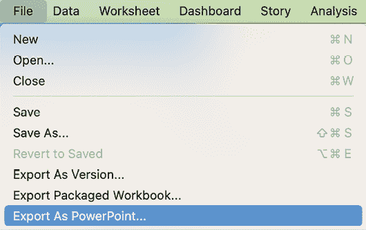

图 10.1：导出为 PowerPoint…

在做出此选择后，你将被询问是否要导出当前视图或工作簿中的部分工作表：

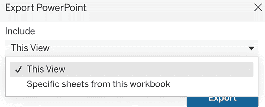

图 10.2：导出 PowerPoint

尝试这两种选项，查看原生 Tableau 导出功能在 PowerPoint 中的效果。如果你想多花点功夫，还可以通过另一种方式创建 Tableau 的 PowerPoint 实现。这些替代方案可能为你带来额外的价值。接下来的练习将探讨各种实现方法及其带来的附加价值。

## 创建模板

对于这个以 PowerPoint 为中心的练习，你将创建一个将在未来练习中使用的模板。模板将包含常见的 PowerPoint 元素，如页眉和页脚。模板的大小为 1200 x 900，符合 PowerPoint 演示文稿通常使用的 4:3 屏幕比例。当然，如果你的公司使用其他屏幕比例，你也可以随时调整！让我们看一下接下来的步骤：

1.  访问[`public.tableau.com/profile/marleen.meier`](https://public.tableau.com/profile/marleen.meier)以查找并下载本章相关的工作簿。

1.  创建一个新工作表并选择 `Superstore` 数据集。

1.  将工作表命名为 `Header`。

1.  将**销售额**放到**标记卡**中的**颜色**架上。

1.  单击**标记卡**中的**颜色**，点击**编辑颜色...**，然后选择灰色调色板，并将**不透明度**设置为 `50%`：

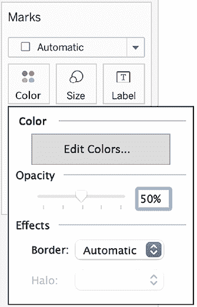

图 10.3：不透明度

1.  复制 `Header` 工作表，并将副本命名为 `Footer1`。

1.  单击**标记卡**中的**颜色**，点击**编辑颜色...**，然后选择蓝色调色板：

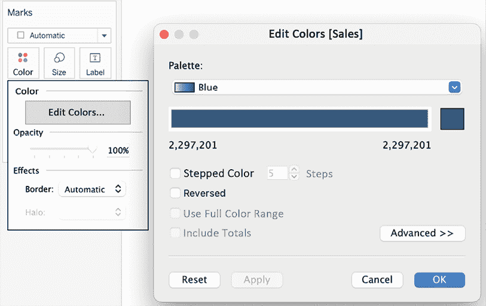

图 10.4：颜色调色板

1.  复制 `Footer1` 工作表，并将副本命名为 `Footer2`。

1.  单击**标记卡**中的**颜色**，点击**编辑颜色...**，然后选择灰色调色板，并将**不透明度**设置为 `50%`。

1.  创建一个名为`Template`的新仪表板。

1.  在**仪表板**面板中，将**大小**设置为**自定义大小（1200 x 700）**：

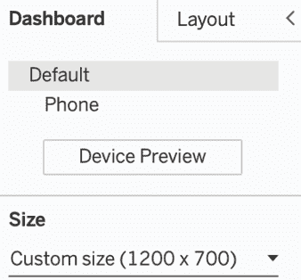

图 10.5：仪表板的自定义大小

1.  通过**仪表板** | **显示标题**来显示仪表板标题。

1.  双击**标题**。在弹出的对话框中，如果需要，可以将文本左对齐。

1.  在**仪表板**面板中，确保选中了**平铺**。这样，你可以确保单个工作表保持原位，不会相互重叠：

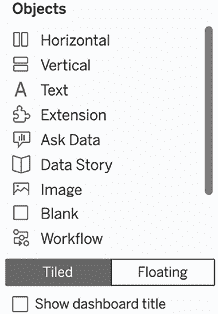

图 10.6：平铺

1.  从**仪表盘**面板中，拖动**空白**对象到仪表盘的左侧。小心确保它从仪表盘顶部延伸到底部，如下图所示：

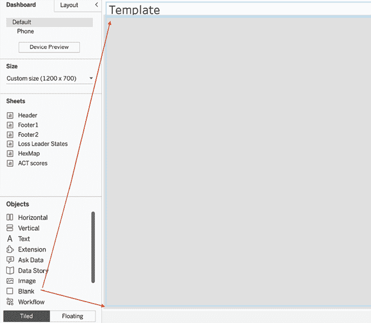

图 10.7：添加空白空间

1.  对仪表盘的右侧、中间和底部重复以上步骤。创建底部边距时，请确保将对象放置到从仪表盘的最右边延伸到最左边。最终布局应包含四个容器，并在顶部左对齐标题，如下所示：

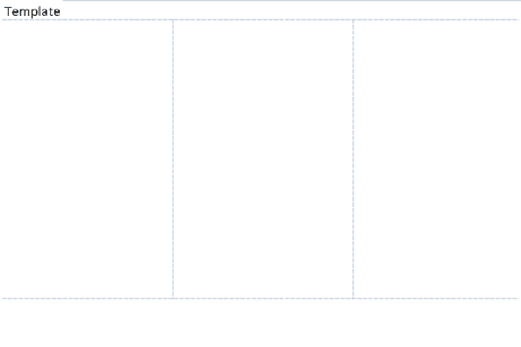

图 10.8：布局

1.  调整空白对象的大小以创建适当的边距。可以通过拖动每个**空白**对象的内边缘（即面向中心的边缘）尽可能向右、左或下方移动来完成：

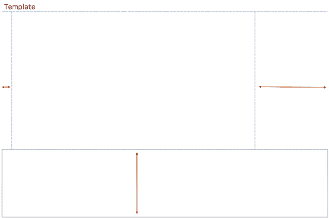

图 10.9：增大大小

1.  通过选择容器并将底部边线向下拖动，如*图 10.9*所示，再次大致加倍底部边距。

1.  在**仪表盘**面板的**对象**部分，点击**浮动**。

1.  将**头部**、**页脚 1**和**页脚 2**资源拖动到仪表盘上。放置位置无关紧要；我们稍后会对工作表进行对齐。如果出现**销售**图例，请删除它。

1.  右键点击每个资源的标题，并选择**隐藏标题**。

1.  在**布局**面板中，为每个工作表输入以下值：

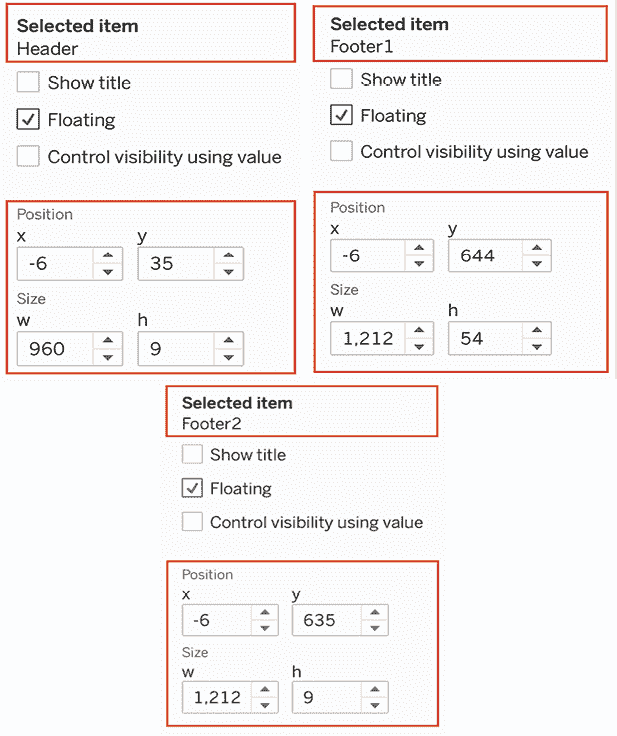

图 10.10：改变位置

1.  通过点击工具栏中**标准**旁边的**适应**下拉菜单并选择**完整视图**，将每个工作表设置为**完整视图**：

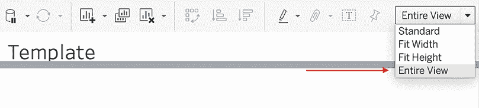

图 10.11：改变视图

1.  结果应该是标题下方有一条横跨仪表盘 80%的线，以及两条横跨整个仪表盘的底部条形图：

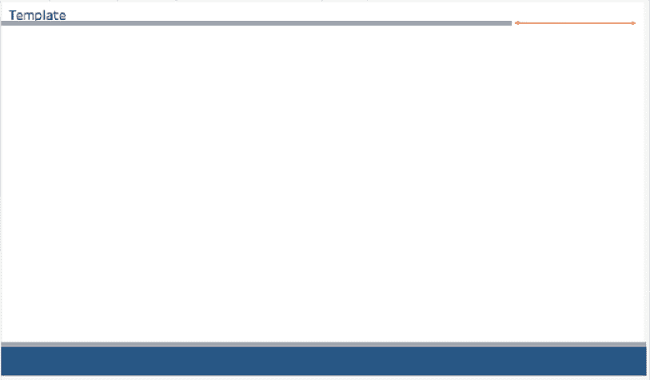

图 10.12：布局

1.  点击位于**模板**标题下方的容器。

1.  如果你还没有做过，下载与本章相关的资源。工作簿中提供了下载链接。

1.  在**对象**面板下选择**浮动**：

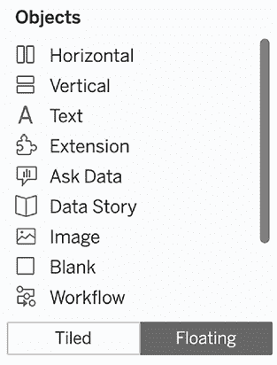

图 10.13：浮动

1.  从**仪表盘**面板的**对象**部分将**图像**对象拖动到仪表盘上。当提示时，选择本章提供的`tableau-logo.png`图像：

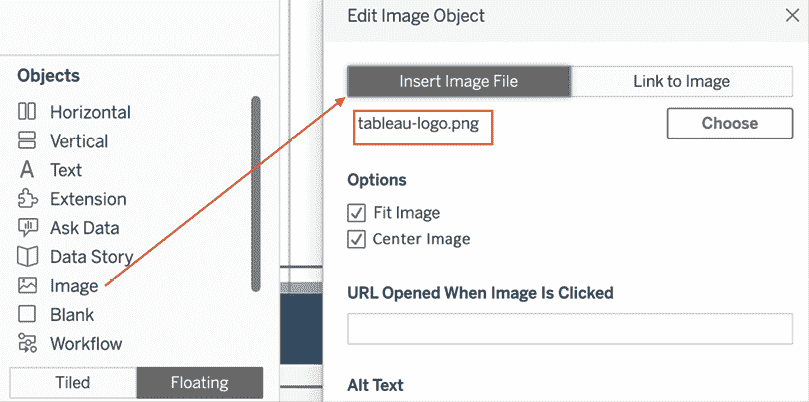

图 10.14：添加图像

1.  选择**适应图像**和**居中图像**选项，然后点击**确定**。

1.  通过**布局**面板调整图像位置，方法如下：

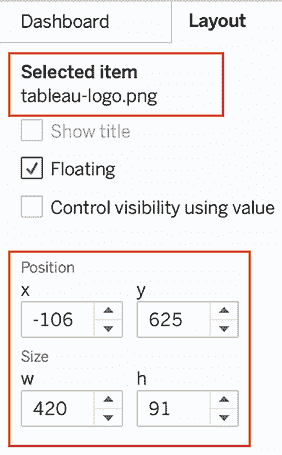

图 10.15：定位徽标

你的 PowerPoint 模板现在已经准备好使用：

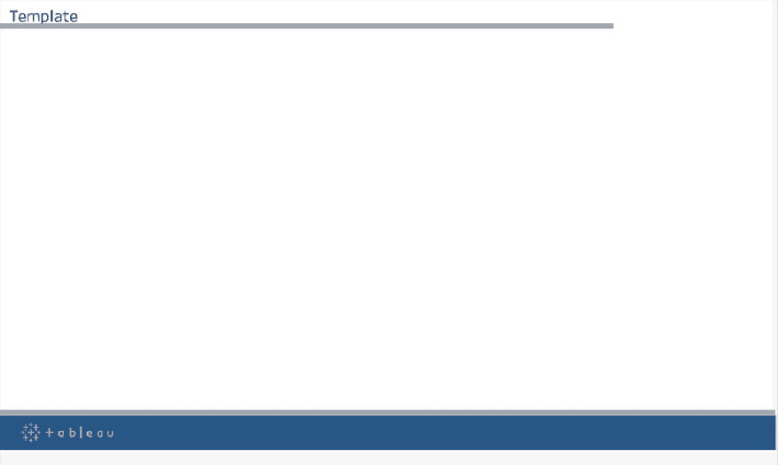

图 10.16：模板

对于你现在将拍摄的每个截图，周围的设计始终保持一致。这样做，你的演示文稿看起来会更具吸引力，观众很快就能通过设计识别出你的作品。像这样的模板还能帮助你遵循公司设计指南。额外的提示是，确保使用匹配的颜色来设计页眉、页脚和图表！

接下来，我们将通过一些示例来查看模板的使用。

## 为打印创建仪表板

本练习将利用之前创建的模板，并结合一个仪表板，从而使其适合打印和/或展示。提供了基本说明，但具体细节留给个人偏好：

1.  右键点击之前练习中创建的名为`Template`的标签，*创建模板*，然后选择**复制**。

1.  将复制的仪表板重命名为`Superstore Loss Leaders`。

1.  使用工作表`HexMap`和`Loss Leaders States`填充**Superstore Loss Leaders**仪表板。（这两个工作表是我根据`Superstore`数据集制作的，显示了六边形地图上的**利润率**以及一个列出**底部 20 个利润州**的列表，用于识别需要更多工作的地方。）按需排列。以下给出了一个示例布局：

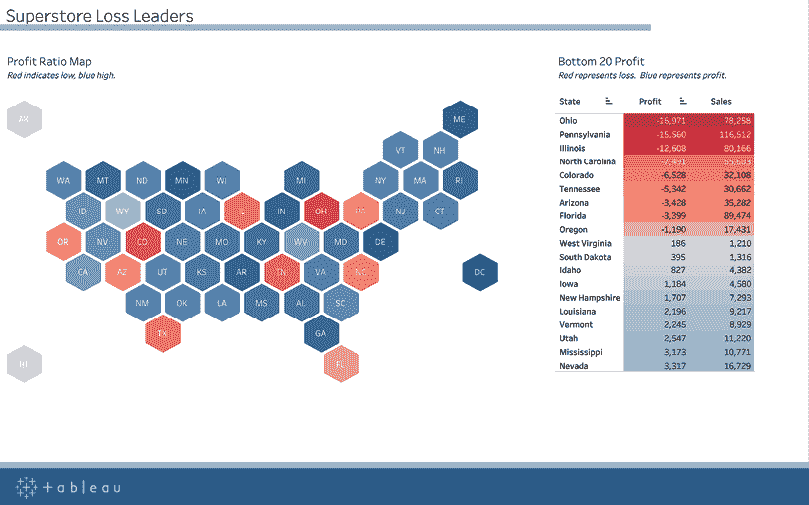

图 10.17：仪表板和模板

模板上的仪表板看起来不错，不是吗？它立刻显得更有趣，更适合展示。不过，你是不是在想，为什么我们选择使用这个特定的布局？好吧，允许我解释一下：如果你想在打印版本中展示一个 Tableau 仪表板，或者你必须将仪表板导出到 PowerPoint 中，记住一个重要的点：所有交互性都会丢失。

Tableau 的一个亮点和最大卖点——交互性——在二维打印中无法实现。但显然，你不想重新创建那些已经存在于 Tableau 服务器上的图表，实际上你也不需要。只要确保观众能够理解可视化内容，即使无法点击某个字段或悬停查看更多信息：

+   **提示 1**：*图 10.17*中的仪表板已调整为与模板的颜色匹配，看起来好像两者是一起设计的。

+   **提示 2**：使用了**六边形地图**（**hex map**）而非 Tableau 自带的默认地图。原因是，当以实际比例打印时，东海岸的小州会消失，而阿拉斯加和夏威夷距离太远，通常也无法适应地图。六边形地图为每个州分配了相同的空间，因此即使打印出来，用户也可以看到阿拉斯加和罗德岛的情况。

+   **提示 3**：颜色表明俄亥俄州和科罗拉多州的利润率特别差，但观众可能想了解更多。这时表格就派上用场了。利润率是利润除以销售额，表格显示了这两个数字，观众可以更好地了解当前情况，你也可以避免他们提问。

+   **提示 4**：为了避免打印时出现滚动条，我只选择了底部的 20 个州。如果主题是亏损引导者，那么你很可能不需要展示所有表现好的州。

希望这个例子能为你准备打印仪表板提供一些思路！如果打印频繁发生，我建议你将其作为页面添加到 Tableau Server 上的交互式仪表板中，这样如果有人要求，你就可以随时准备好。如果你有兴趣复制六边形地图，请查看 *第八章*，*超越基础*，或者查看以下文章：[`www.tableau.com/about/blog/2017/1/viz-whiz-hex-tile-maps-64713`](https://www.tableau.com/about/blog/2017/1/viz-whiz-hex-tile-maps-64713)。

接下来，我们将查看另一个例子，这次是一个每周 PowerPoint 演示文稿的自动化。

## 半自动化 PowerPoint 演示文稿

之前的练习（*创建模板* 和 *为打印创建仪表板*）演示了生成 PowerPoint 演示文稿模板的两种方法，并给出了如何调整仪表板以便打印和/或用于 PowerPoint 演示文稿的一些技巧。然而，通常情况下，你的 Tableau 仪表板不是静态的，数据在下一次需要时会发生变化。当然，你可以导出一个带有更新数据的新 PowerPoint 文件，但你可能还有其他幻灯片不想丢失。以下步骤将帮助你半自动化更新 PowerPoint 演示文稿的过程：

1.  打开之前创建的名为 `Superstore Loss Leaders` 的仪表板。

1.  点击 **仪表板** | **导出图片…**：

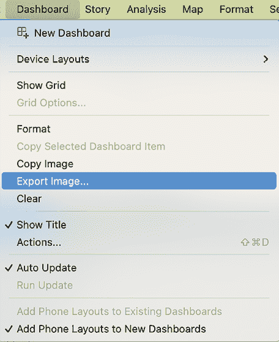

图 10.18：导出图片…

1.  点击 **确定**，在弹出的对话框中选择将图片保存为 `SuperstoreLossLeaders.png`。

1.  打开 PowerPoint 演示文稿。打开一张幻灯片。

1.  选择 **插入** 功能区，选择 **图片** | **来自文件的图片…**：

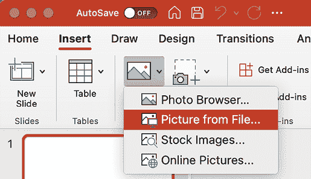

图 10.19：将图片插入 PowerPoint

1.  导航到你刚刚导出的 PNG 图片。

1.  在 **插入** 对话框中，选择 **插入** 旁边的下拉选择器，Windows 系统选择 **插入并链接**，或者 Mac 系统选择 **选项** | **链接到文件** | **插入**。请注意，这一步很重要，因为它将允许图片轻松更换，如下所示：

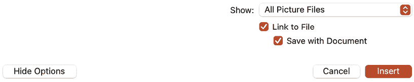

图 10.20：链接到文件

1.  将 PowerPoint 演示文稿保存为 `AutoUpdate.pptx`。

1.  关闭 PowerPoint。在 Tableau 中，修改仪表板；例如，从表格中删除一个州。

1.  通过 **Dashboard** | **Export Image…** 替换之前导出的 `SuperstoreLossLeaders.png` 图片。

1.  打开 `AutoUpdate.pptx` 并注意到仪表板的新图片显示出来。

在我教授 Tableau 课程时，我经常遇到一种情况，就是有些人每周或每月负责提供 PowerPoint 演示文稿。这些演示文稿包含已更新的图表和图形，但整体布局保持不变。上一节中提到的技巧可以让这个过程变得更加高效。虽然 Tableau Desktop 只允许作者一次更新一张图片，但 Tableau Server 可以配置为同时导出多张图片，从而使整个过程更加高效。关于从 Tableau Server 导出图片的内容，请参见 *第十四章*，*探索 Tableau Server 和 Tableau Cloud*。

如果我们能在幻灯片中直接展示我们的网页浏览器、Tableau Server，包括所有的交互性，那岂不是更好？下一节将介绍这个话题，并分享一些实现这一目标的思路。

# 将 Tableau 嵌入 PowerPoint

直接将 Tableau 嵌入 PowerPoint 演示文稿是可行的，或者更准确地说，是通过嵌入一个网页浏览器，通过它可以访问 Tableau Server。有多种方法可以实现这一目标，包括 Web Viewer 应用、一个名为 LiveWeb 的第三方插件以及 VBA 代码。

Web Viewer 应用可以在 [`appsource.microsoft.com/en-us/product/office/WA104295828?tab=Overview`](https://appsource.microsoft.com/en-us/product/office/WA104295828?tab=Overview) 获取。虽然它在 Tableau Public 中表现良好，但默认的 Tableau Server 设置不允许通过 Web Viewer 访问。不过，你的 Tableau Server 管理员可以帮助更改这些设置。LiveWeb（可以在 [`skp.mvps.org/liveweb.htm`](http://skp.mvps.org/liveweb.htm) 获取）也能正常工作，但需要额外安装。你必须从提供的 URL 下载安装文件并启动 PowerPoint。然后你可以向 PowerPoint 功能区添加一个插件，该插件可以让你添加一个 Tableau Server 的 URL，并直接显示在 Tableau 中。详细说明可以在该网站上找到。

# 将 Tableau 嵌入 Google 幻灯片

Google 幻灯片是另一个广泛使用的演示工具，由于其基于网页的特性，使用起来非常方便。就像在 PowerPoint 中一样，你可以插入图片、音频和视频，但遗憾的是，无法插入网页或 Tableau 仪表板。

在写这篇文章时，我也没有找到任何解决方法。然而，如果你不想在不同应用之间切换，可以将 Google 幻灯片嵌入 Tableau，也就是反过来。这至少能把工具数量减少到一个！

让我们试试看：

你确实需要一个 Google 帐号才能执行此操作。

1.  打开 Google 幻灯片，[`docs.google.com/presentation`](https://docs.google.com/presentation)，然后点击 **Blank** 打开一个新的演示文稿。

    输入类似如下内容：

    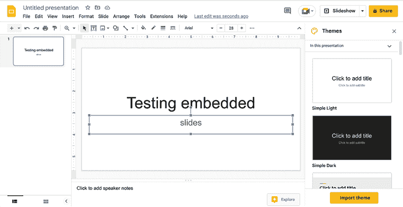

    图 10.21：Google Slides

1.  填充第二页：

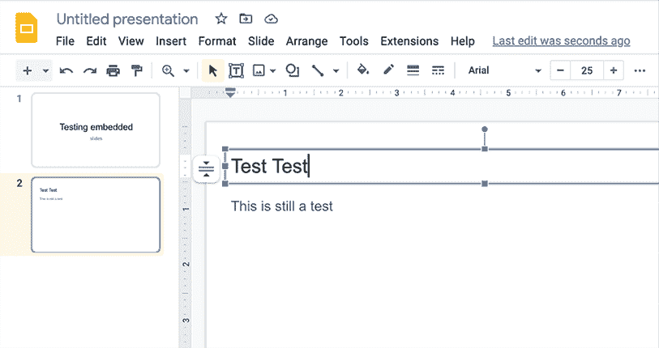

图 10.22：测试幻灯片

1.  点击**File** | **Share** | **Publish to web**。

1.  将下拉菜单中的**Auto-advance slides**更改为**每分钟**。然后点击**Publish**：

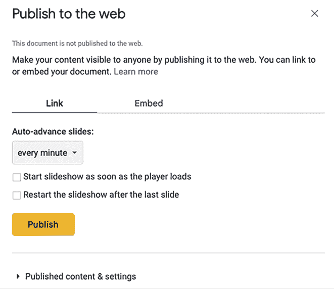

图 10.23：发布到网页

1.  复制现在出现的网址。

1.  在你的 Tableau 工作簿中打开一个新的仪表板页面。

1.  将**Web Page**对象拖到仪表板上：

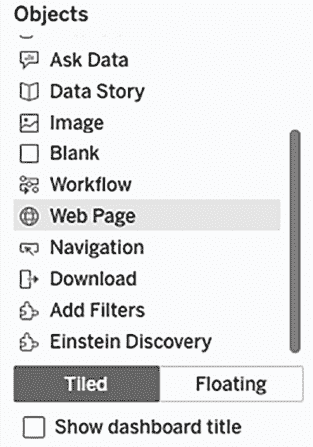

图 10.24：网页

1.  粘贴你之前从 Google Slides 复制的网址，并删除高亮部分`&delayms=60000`：

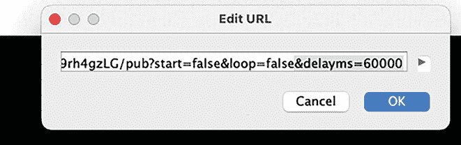

图 10.25：网址

1.  现在你应该可以在 Tableau 中看到你的演示文稿了！幻灯片控制按钮可以在左下角找到：

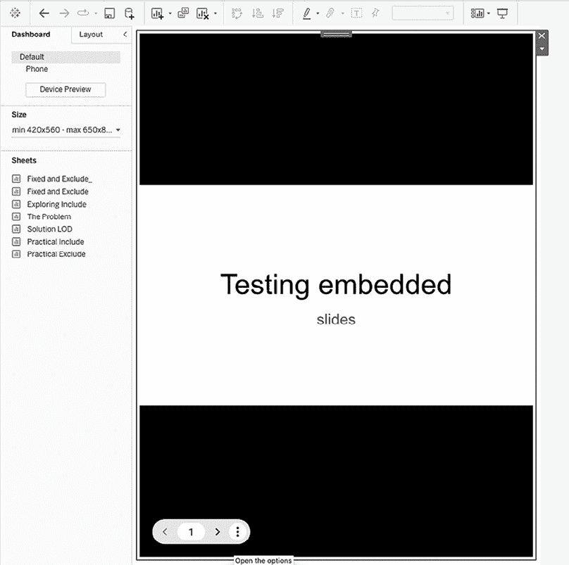

图 10.26：Tableau 中的幻灯片

在这一部分，你已经学会了如何将 Google 幻灯片嵌入到 Tableau 仪表板中，从而只使用一个工具，而无需在两个工具之间切换。接下来，我们将讨论如何为 Tableau 带来动画，从而支持你的数据叙事。

# 为 Tableau 添加动画

在演示中加入动画对于吸引观众非常有效。Hans Rosling 在他著名的 YouTube 视频*200 Countries, 200 Years, 4 Minutes*（[`youtu.be/jbkSRLYSojo`](https://youtu.be/jbkSRLYSojo)）中做得非常出色。在这个视频中，Rosling 通过数据可视化跟踪了财富和预期寿命的变化。他将数据可视化与富有洞察力的评论以及对信息的热情结合，使得 Rosling 的视频成为任何想通过数据制作吸引人演示的人必看的内容。

动画易于实现，并且可以通过 Tableau Reader 和 Tableau Server（自 2020.1 版本起）使用。到目前为止，我只遇到一个缺点：上传到 Tableau Server 的带动画的工作表只能提供单一速度级别，而 Tableau Desktop 则显示三种速度。不过，这不应该阻止你使用这个功能。

以下练习跟踪了 1991 年到 2015 年间 ACT 考试的分数。完成此练习可以学习如何在 Tableau 中创建动画，并了解美国标准化测试结果是否随时间有所改善。

执行以下步骤：

1.  打开与本章节相关的工作簿，进入名为`ACT 1991–2015`的工作表。

1.  选择`ACT`数据源。

1.  重命名工作表为`ACT scores`。

1.  将**Year**放置到**Columns**架上，**Score Value**放置到**Rows**架上，**Score Type**放置到**Color**卡片中。

1.  右键点击**Score Value**轴并选择**Edit Axis...**。在弹出的对话框中，取消选择**Include zero**。

1.  将**Year**放置到**Pages**架上。你的视图应该如下所示：

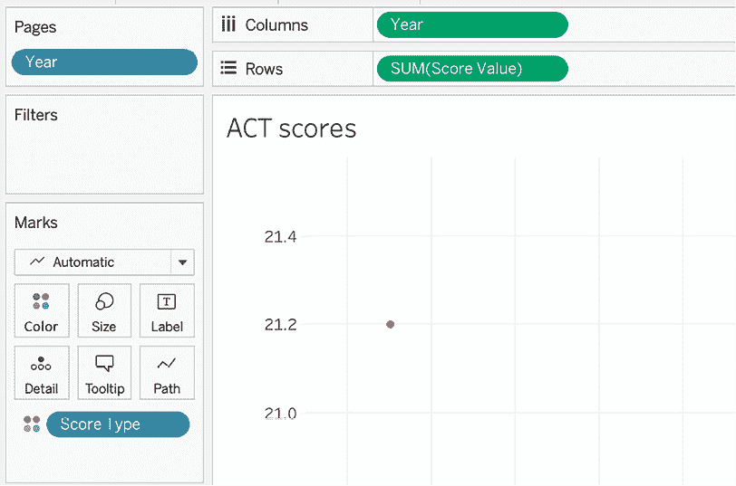

图 10.27：ACT scores – 1991

1.  在工作表中出现的 **当前页面** 面板中，勾选 **显示历史记录**。点击箭头打开下拉菜单，并根据下图对齐所有参数：

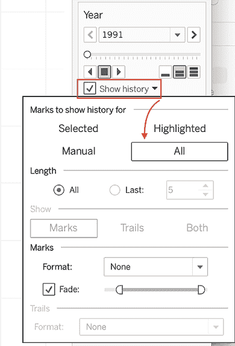

图 10.28：对齐参数

1.  在 **标记** 面板中，点击下拉菜单，将视图类型从 **自动** 更改为 **圆形**。

1.  再次点击 **显示历史记录** 下拉菜单，注意现在 **显示** 选项和 **轨迹** 选项都可用。在 **显示** 下，选择 **两者**。

1.  点击 **格式** 下拉菜单中的 **轨迹**，然后选择虚线选项：

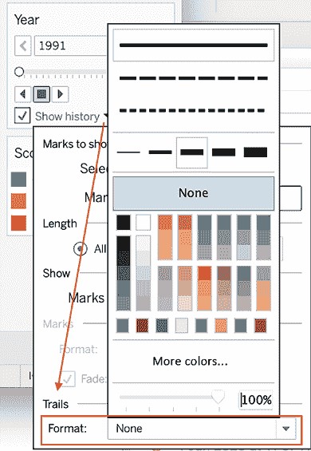

图 10.29：虚线

1.  简要延伸一下在 Tableau 中创建虚线的主题，如果你想了解如何创建多条不同类型虚线，请查看 [`boraberan.wordpress.com/2015/11/22/quick-tip-creating-your-own-dashed-line-styles-in-tableau/`](https://boraberan.wordpress.com/2015/11/22/quick-tip-creating-your-own-dashed-line-styles-in-tableau/)，在这里，Bora Beran 提出了使用计算字段插入空值来实现不同线条效果的方法。

    自 Tableau 2023.2 版本以来，虚线和点线已可用于基本的折线图。

1.  现在，点击播放按钮，看看 Tableau 如何逐年显示，每次显示一个年份：

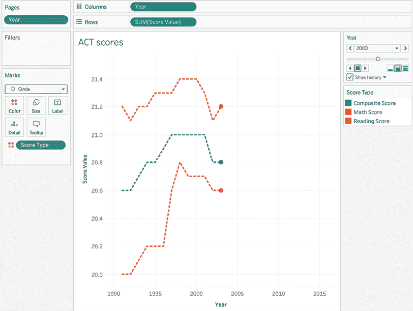

图 10.30：动画

尽管此功能对于深入分析并不是一个好的应用案例，但它在可视化时间变化时很有帮助，例如，在做演示时，或者进行其他形式的讲故事。我最近使用它来展示产品集群如何随时间变化，得出的结论是集群不应保持静态。我接着继续寻找早期识别集群变化的方法，以便相应地调整定价和营销策略。

总结一下，使用 Tableau 中的 **页面** 功能可以实现动画。我希望你能找到许多此功能的应用场景。接下来，我们将以不同的方式使用动画功能，向你展示如何导出多个图像。

## 使用动画导出多个图像

有至少两个原因可能需要从时间轴中导出多个图像。首先，从分析角度来看，查看每个时间快照的单独图像可能是有利的；例如，每个月的每一天都有一张单独的图像。其次，可能需要在 Tableau 之外创建动画，或许是在 PowerPoint 中。

接下来的两个练习 *使用动画导出多个图像* 和 *在 Tableau 中使用动画创建 PowerPoint 动画* 涵盖了这两种场景：

请注意，以下步骤假设前面的练习已完成。

1.  打开与本章相关的工作簿，并导航到名为 `ACT scores` 的工作表：

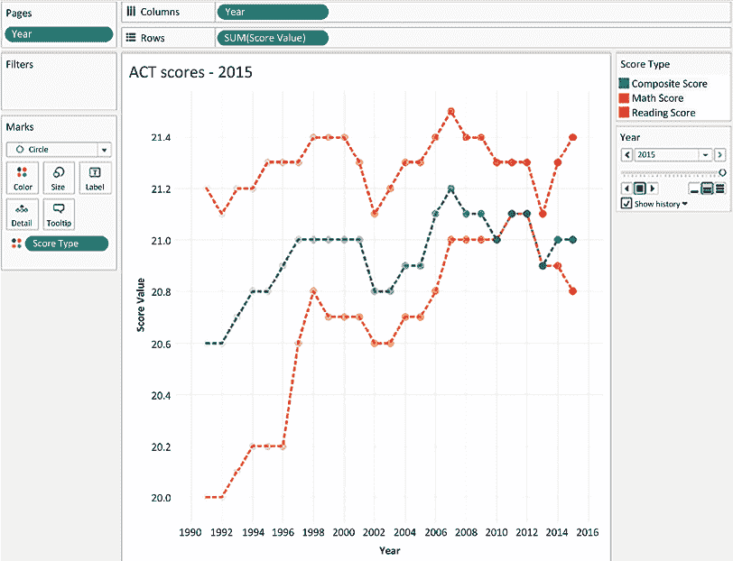

图 10.31：ACT 成绩最终

1.  选择 **文件** | **页面设置...**。在弹出的对话框底部的 **页面架** 下，选择 **显示所有页面**：

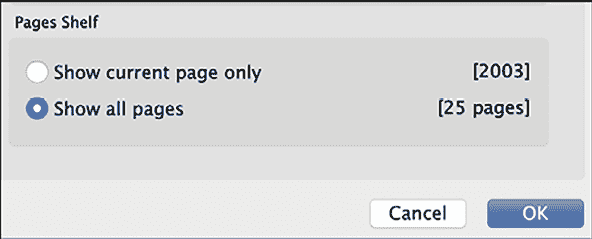

图 10.32：显示所有页面

1.  选择**文件** | **打印为 PDF**。Mac 用户应选择**文件** | **打印**。

1.  在弹出的对话框中，将**范围**设置为**活动表**。同时，将页面方向设置为**横向**。

1.  点击**确定**并将 PDF 保存为`Animation.pdf`到您选择的目录。

1.  访问[`www.pdftoppt.com/`](https://www.pdftoppt.com/)。上传`Animation.pdf`并将其转换为 PowerPoint 格式。转换后几分钟内会发送一封电子邮件。

1.  通过电子邮件提供的链接下载文件，并在 PowerPoint 中打开。

1.  在 PowerPoint 中，选择**文件** | **另存为**。在**另存为**类型下拉菜单中，选择***.png**：

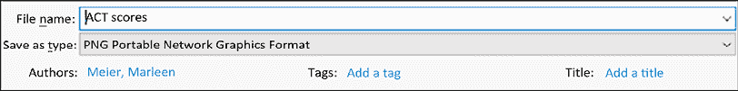

图 10.33：Animation.png

1.  当提示时，选择导出**所有幻灯片**：

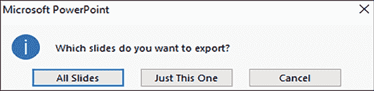

图 10.34：所有幻灯片

1.  保存 PowerPoint 演示文稿。请注意，当 PowerPoint 保存完成时，会显示一个对话框，说明演示文稿中的每张幻灯片都已作为单独的文件保存。

1.  按需打开并检查已保存的 PNG 文件：

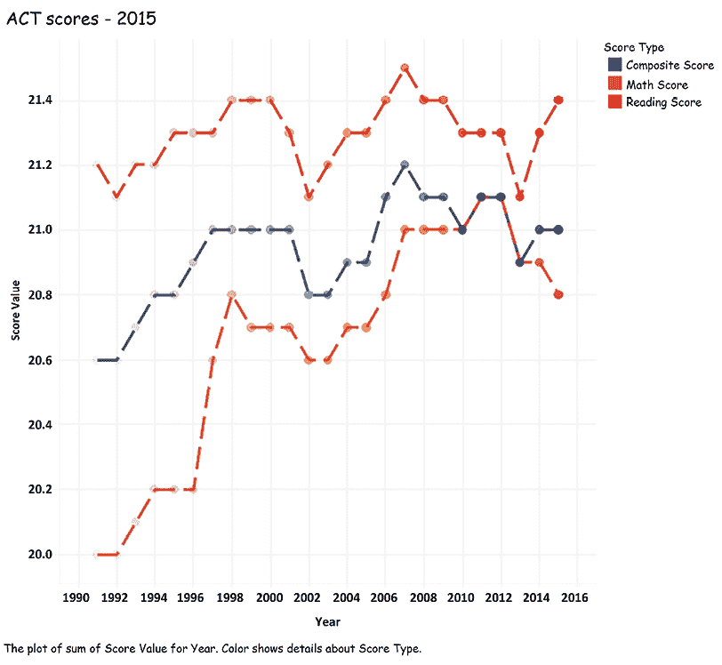

图 10.35：最后一张幻灯片为.png

通过执行所有前述步骤，您应该已经能够一次保存多个图像。希望这能为您节省时间，尽管这种情况可能不会太频繁发生，但了解这个选项对您有益。

## 使用 Tableau 中的动画来创建 PowerPoint 中的动画

本练习将向您展示如何使用我们在前一个练习中保存的大量图像来创建动画。因此，我们将使用之前创建的文件在 PowerPoint 中制作动画：

1.  在前一练习中下载的 PowerPoint 演示文稿可以通过[`www.pdftoppt.com/`](https://www.pdftoppt.com/)访问。

1.  在**视图**功能区，选择**幻灯片浏览器**，位于**演示文稿视图**组下。

1.  选择 PowerPoint 演示文稿中的**所有幻灯片**，除了最后一张。

1.  在**过渡**功能区的**计时**组中，设置幻灯片在 0.1 秒后自动切换：

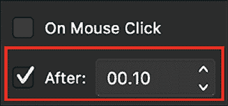

图 10.36：推进幻灯片

1.  按*F5*键查看动画效果。

这不是很酷吗？您可以看到一个类似于在 Tableau 中看到的模拟效果！为了进一步改善 PowerPoint 中的动画，请考虑以下附加步骤：

+   将初始 PDF 上传到[`pdfresizer.com/crop`](https://pdfresizer.com/crop)，并根据需要裁剪大小。

+   如果 PowerPoint 中的动画太慢，很可能是因为所有文本和绘图元素都被保持了。例如，背景网格由单独的线条组成。渲染所有文本和绘图元素非常耗费资源。可以考虑使用在*使用动画导出多张图片*练习中创建的 PNG 图片来创建一个单独的 PowerPoint 演示。这样可以让动画运行更快、更流畅。

希望本节内容能给你一些关于如何提升 PowerPoint 演示效果的灵感。通过使用这些新掌握的技巧，或许你甚至不再需要使用 Prezi。然而，本章若不提到故事点这一功能，就不完整了。如果你完全不想使用 PowerPoint，故事点将是一个很有帮助的功能。

# 用于演示的故事点和仪表板

**故事点**是 Tableau 对 PowerPoint 的回应。因此，二者在基本结构上有相似之处。PowerPoint 演示提供了一种线性沟通方式，Tableau 的故事点也同样如此。PowerPoint 演示提供的幻灯片，每一张都像是一块空白画布，为用户提供无限的可能性来传达想法。Tableau 中的故事为此目的提供了故事点。

尽管二者在基本结构上有相似之处，但需要理解的是，Tableau 故事点和 PowerPoint 演示通常并不扮演相同的角色。每种方式各有优缺点，因此应考虑一个优缺点列表。

我们可以通过下表查看 PowerPoint 和 Tableau 故事点的优缺点：

| **PowerPoint** | **Tableau 故事点** |
| --- | --- |
| **优点** | **缺点** | **优点** | **缺点** |
| 创建起来快速且简单 | 难以基于底层数据变化进行自动化更新 | 随着底层数据变化自动更新 | 创建过程可能更加复杂 |
| 可以轻松适配不同分辨率 | 难以创建允许跳出线性思维的演示 | 容易在演示过程中进行非线性探索 | 需要事先考虑分辨率大小 |

那么，在做演示时，如何在使用 PowerPoint 和 Tableau 之间做出选择呢？也许以下列表会有所帮助：

| **何时使用 PowerPoint** | **何时使用 Tableau 故事点** |
| --- | --- |
| 演示过程中，观众几乎没有机会提供即时反馈 | 演示过程中，观众可能提供即时反馈，并可能提出探索性问题 |
| 一次性演示，包含清晰划分的要点 | 基于底层数据变化进行更新的可重复使用演示 |
| 演示时，无法提前知道显示器分辨率大小 | 演示时，显示器分辨率大小已知或可以假定 |

创建和使用故事点的基础是简单的，而且在写作时，除了基础知识外，并没有更多内容。由于本书的重点是更高级的 Tableau 思想和概念，因此不会在这里讨论这些基础内容。如果你需要快速了解故事点的基础知识，我推荐阅读以下页面：[`help.tableau.com/current/pro/desktop/en-us/stories.htm`](https://help.tableau.com/current/pro/desktop/en-us/stories.htm)。

我喜欢使用故事点，尤其是在我的观众面前打开自己的 Tableau 并能够跟随自己的操作时。这是一种让人们更深入理解的好方法，因为它允许你展示比静态截图更复杂的信息。如果你想提高整体的演示技巧，请继续阅读下一部分。

# 演示资源

在 Tableau 中有效地使用故事点可能更多是一个艺术层面的考虑，而非技术层面的。虽然本书试图始终考虑数据可视化的最佳实践，并鼓励设计吸引人且用户友好的工作表和仪表板，但有效的演示技巧讨论超出了本书的范围。

如果你想提高创建有效演示的能力，可以考虑以下资源：

+   **Tableau 故事点**：通过实例学习是非常宝贵的。在 Tableau 上可以找到一些很好的故事点示例。如果你想学习其中最引人入胜的一个，可以访问[`help.tableau.com/current/pro/desktop/en-us/story_example.htm`](https://help.tableau.com/current/pro/desktop/en-us/story_example.htm)。

+   **TEDx 演讲**：TEDx 演讲非常适合学习，甚至可以在通勤或离开桌子时听。我推荐的一个视频是 Phil Waknell 的《惊人演示的三大魔法元素》[`www.youtube.com/watch?v=yoD8RMq2OkU`](https://www.youtube.com/watch?v=yoD8RMq2OkU)。

+   **博客**：关于 Tableau 故事点与优秀演示方法结合的有趣文章之一可以在这里找到：[`www.artofvisualization.com/blog/10-secrets-perfect-tableau-story`](https://www.artofvisualization.com/blog/10-secrets-perfect-tableau-story)。

尽管这些演示技巧超出了本章的范围，但我希望前面提到的资源能给你带来启发。

# 总结

我们从探索各种屏幕截图工具以及 Tableau 的本地导出功能开始了本章的内容。接着，我们将注意力转向了 PowerPoint，在这里我们探讨了如何从 Tableau 工作簿创建 PowerPoint 演示文稿的各种方法，甚至探讨了如何将 Tableau 的实时实例嵌入 PowerPoint 中。然后，我们考虑了 Tableau 动画的使用。最后，我们探讨了如何利用故事点和仪表板进行演示。在*第十一章*，*仪表板设计与可视化最佳实践*中，我们将专注于仪表板设计，在这里我们将突破常规仪表板的界限，但仍然不会偏离实际应用。

## 在 Discord 上了解更多

要加入本书的 Discord 社区——在这里你可以分享反馈、向作者提问，并了解新版本——请扫描下面的二维码：

[`packt.link/tableau`](https://packt.link/tableau)

