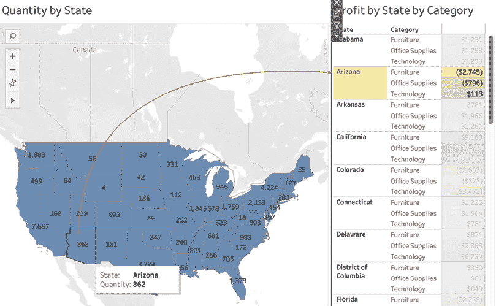

# 第十一章：设计仪表板和可视化的最佳实践

现在，我们将深入探讨数据可视化的基本原则和最佳实践，特别关注仪表板设计。通过探索如何以视觉上引人注目且富有信息的方式呈现数据，你将获得知识并学习技巧，帮助你创建具有影响力的仪表板，进而有效传达洞察，推动决策，并吸引你的观众。本章受到数据可视化领域几位大师的影响：《功能艺术》——Alberto Cairo 著，《信息仪表板设计》——Stephen Few 著，《仪表板大全》——Steve Wexley、Jeffrey Shaffer 和 Andy Cotgraeve 著，《设计的通用原则》——William Lidwell、Kritina Holden 和 Jill Butler 著，《数据故事》——Nancy Duarte 著，以及《定量信息的可视化展示》——Edward Tufte 著。

在本章中，我们将涵盖以下主题：

+   可视化设计理论

+   格式化规则

+   颜色规则

+   可视化类型规则

+   保持可视化简洁

+   仪表板设计

+   仪表板最佳实践

+   额外内容

现在我们已经定义了本章的主题，接下来让我们深入探讨设计理论，这将为你提供可以应用于你将要构建的每一个仪表板的规则。

# 可视化设计理论

你的可视化思维过程应始终从设计的基本元素开始，从最低级别做起。换句话说，我们将从仪表板上显示的工作表开始讨论，并确保这些工作表设计得当。

因此，我们的讨论将从考虑可视化设计原则开始，例如以下集合，灵感来自于*设计的 7 个原则*：[`www.turing.com/kb/what-are-the-7-principles-of-design-detailed-breakdown`](https://www.turing.com/kb/what-are-the-7-principles-of-design-detailed-breakdown)：

+   **强调**最重要的内容

+   **放大**重要数据点

+   **对齐和平衡**元素，合理使用颜色、大小和纹理

+   使用**对比**突出元素或分组

+   **限制**颜色或字体的使用至三种，以增强品牌识别度并保持控制

+   使用对人类用户友好的**比例**，如黄金分割

+   使用户的视线沿 Z 字形**移动**

+   使用**线条**作为基准或阈值

+   使用**空白区域**进行组织和结构化

因此，在接下来的部分，*格式化规则*，我们将考虑各种规则，同时牢记一旦你熟悉了基础，规则可以被打破以实现特定目的。

# 格式化规则

以下格式化规则涵盖了**字体**、**线条**和**带状图**。字体当然是显而易见的格式化考虑因素。然而，线条和带状图可能不是你通常会使用的元素，但在 Tableau 中，线条和带状图绝对需要考虑。这表明数据可视化与图形设计密切相关，在这里线条和带状图的作用远大于例如 Excel 中的作用，而格式化考虑的内容也远不止文本布局。

## 保持字体选择简洁

通常建议在仪表板上使用一种或两种字体。更多字体可能会创建一个混乱的环境，影响可读性。

为标题选择的字体应粗壮且清晰，而正文的字体应易于阅读。在 Tableau 中，选择适当的字体非常简单：选择**Format** | **Font**来显示**Format Font**窗口，以查看并选择你喜欢的字体。

Tableau 的字体总是适用的，如 Tableau Bold、Tableau Book、Tableau Medium、Tableau Light 等。对于特殊场合，我喜欢使用 Corbel 或者尝试新字体。

## 按照可见性顺序使用线条

我们通常按以下顺序安排线条的可见性：趋势线、图表线、参考线、下降线和网格线。例如，趋势线的可见性应大于参考线的可见性。通常通过增加线条粗细来增强可见性，但也可以通过颜色饱和度或选择点线或虚线而非实线来增强可见性。让我们按照可见性递减的顺序来看一下每种线条类型：

+   **趋势线**：如果存在趋势线，它通常是图表上最显眼的线条。趋势线通过**Analytics**窗格显示，并可以通过**Format** | **Lines**进行调整：

    +   **使用案例**：一个数据点多且随着时间波动较大的时间序列。使用趋势线来显示整体方向（随时间的增加/减少），从而让用户更容易处理信息。

+   **图表线条**：图表线条（例如，时间序列图中的线条）不应太粗，以免遮挡数据的波动。尽管通过使用**Pages**架构，可以将图表线条显示为点线或虚线，但通常不建议这样做，因为它可能会影响可见性。图表线条的粗细可以通过点击**Size**架构中的**Marks remove bold**区域进行调整：

    +   **使用案例**：这是折线图的实际线条。

+   **参考线**：通常不如趋势线常见，可以通过**Format** | **Reference lines**进行格式化：

    +   **使用案例**：一条直线用于显示，例如，一个在仪表板视图中至少在一个维度上是静态的阈值。

+   **虚线**：不常用。要部署虚线，请右键单击视图中的空白部分，选择**视图** | **显示虚线**。接下来，单击视图中的某个点以显示虚线。要格式化虚线，请选择**格式** | **虚线**。只有在可视化中使用了至少一个坐标轴时，虚线才会生效：

    +   **使用场景**：标记从图表上的某一点到坐标轴的线。这有助于您识别与该数据点相关的特定值。

+   **零线**：这些有时也被称为基准线，仅在视图中包含零或负值，或正值接近零时显示。通过**格式** | **线条**格式化零线：

    +   **使用场景**：如果您对默认的零线不满意，可以格式化它。它有助于区分正值开始和负值结束的位置（反之亦然）。

+   **网格线**：这些应该是视图中最柔和的线条，也可以完全不显示。通过**格式** | **线条**格式化网格线：

    +   **使用场景**：网格线有助于眼睛识别远离坐标轴的数据点值。使用它们可以帮助用户更好地理解可视化中的数值。

## 使用三到五个一组的带状图

由高表格文本或横向条形图组成的可视化应将维度成员分成三到五组。

请按照步骤操作，体验在 Tableau 中高效使用带状图：

1.  请访问[`public.tableau.com/profile/marleen.meier`](https://public.tableau.com/profile/marleen.meier)以查找并下载与本章相关的工作簿。

1.  导航到`带状图`工作表。

1.  选择`Superstore`数据源，并将**产品名称**放置到**行**架上。

1.  双击**折扣**、**利润**、**数量**和**销售额**。请注意，完成此步骤后，Tableau 会默认对每隔一行进行带状格式化。对于短表格，这种默认格式化没有问题，但对于高表格来说，可能会显得过于繁琐，并且在处理大数据集时可能会导致性能问题。

1.  导航到**格式** | **阴影**，并在**行带状图**下设置**带状大小**，使每个带状图包含三到五行文本。务必为**面板**和**标题**设置适当的颜色：


图 11.1：格式化阴影

*三到五个一组的带状图*规则受 Dona W. Wong 的影响，在她的著作《华尔街日报信息图形指南》中，她建议使用细线将长表格或条形图分隔成三到五组，帮助读者横向阅读。

# 颜色规则

讨论印刷为黑白的书籍中的颜色规则似乎有些讽刺（要下载彩色图像，请看这里：[`packt.link/TybKH`](https://packt.link/TybKH)）。当然，如果您在电子设备上阅读此书，则情况可能并非如此。然而，即使在单色设置中，讨论颜色也是相关的。例如，仅使用黑色文字传达的信息与使用灰色变化相比是完全不同的。以下是有助于确保您在各种环境中有效使用颜色的颜色规则列表。

## 保持颜色简单和有限

遵循基本色调，并仅提供少量（也许三到五种）色调变化。在他的书《功能艺术：信息图形和可视化导论》中，Alberto Cairo 提供了为什么这一点很重要的见解：

> 我们视觉工作记忆的有限能力有助于解释为什么在地图和图表上识别不同现象时不宜使用超过四五种颜色或象形图案。

## 尊重颜色的心理影响

每个地区都有一种无处不在的颜色词汇，它已经成为了第二天性。红色通常用于表达爱情或危险；在某些亚洲国家，它还可以代表财富，并且在婚礼礼服中很常见。绿色可以代表幸运，在墨西哥，绿色代表独立。绿色交通信号灯告诉我们前进，而红色告诉我们停止。同样，仪表板上的颜色通常具有特定目的。红色和橙色通常与负面表现相关联，而蓝色和绿色则与正面表现相关联。颜色的反常使用可能会引起混淆，因此请注意颜色的使用及您的观众及其解读。

## 考虑色盲友好

一次快速的 Google 搜索告诉我，“*全球大约有 3 亿色盲人口。大约 12 名男性和 200 名女性中就有 1 人患有色盲*。”因此，在您的职业生涯中很可能会有色盲或色觉缺陷的观众。色盲通常表现为无法区分红色和绿色，或蓝色和黄色。红/绿和蓝/黄在色轮的对立面上。

因此，这些颜色组合给色盲人士带来的挑战可以很容易地通过 Photoshop 等图像编辑软件重新创建。如果您不是色盲，将使用这些颜色组合的图像转换为灰度并进行观察。对于 8.0%的男性和 0.5%的女性而言，色盲问题立即显而易见！或者，使用以下网站上传您仪表板的图像，并体验您的用户可能如何看待所使用的颜色：[`www.color-blindness.com/coblis-color-blindness-simulator/`](https://www.color-blindness.com/coblis-color-blindness-simulator/)。

## 谨慎使用纯色

以下练习得到的颜色应该是非常鲜艳的红色、绿色和蓝色。根据显示器的不同，你甚至可能发现直视这些颜色有些困难。这些被称为**纯色**，应该谨慎使用，或许只用来突出特别重要的项目或者例如违反的阈值警报。

请按照以下步骤进行：

1.  打开与本章相关联的工作簿，并导航到`纯色`工作表。

1.  选择`超级商店`数据源，并将**类别**放置在**行**架和**颜色**架上。

1.  将**适合**设置为**整个视图**。

1.  点击**颜色**架并选择**编辑颜色...**。

1.  在**编辑颜色**对话框中，依次选择**家具**、**办公用品**和**技术**，分别选择蓝色、绿色和红色：


图 11.2：颜色

亲自体验看这些纯色时，选择三种其他不那么鲜艳的颜色进行比较。过于鲜艳的颜色会使你的眼睛很累并且难以集中注意力。然而，颜色过于相似也很难区分。找到良好的平衡是关键。

## 选择颜色变化而不是符号变化

对用户来说，解读不同的符号需要比区分颜色更多的心理能量。因此，应该优先使用颜色变化而不是符号变化。

请看以下散点图的例子，以查看符号变化：


图 11.3：符号变化

观察颜色变化：


图 11.4：颜色变化

总结颜色规则时，请保持你的颜色调色板简单，并注意你所在地区和文化中颜色的含义。此外，请考虑你的观众可能存在色盲；工具可以帮助你明智选择颜色，而 Tableau 也提供色盲色板。过多的鲜艳颜色会让观众难以专注于重要的项目。最后，不要在一个视图中使用太多形状；而是用颜色来区分不同的类别。

# 可视化类型规则

此部分需要一本独立的书籍，并与许多其他学科如叙事、沟通和说服力相关联；因此，我们不会在这里花时间详细列出可视化类型的规则，而是强调一些经常讨论的规则。我们将考虑保持简单形状与复杂形状的对比，以及饼图的有效使用。

## 保持形状简单

太多的形状细节会妨碍理解。这是因为形状细节会将用户的注意力从数据上移开。考虑以下使用两种不同购物车图像的练习。

让我们看一下以下的练习步骤：

1.  打开与本章相关的工作簿，并导航到`简单购物车`工作表。请注意，数据可视化图是一个散点图，展示了按总销售额和利润排序的前十名子类别。

1.  导航到`My Tableau`库中的`Shapes`目录。在我的计算机中，路径是`C:\Users\Marleen Meier\Documents\My Tableau Repository\Shapes`。在你的电脑上找到相应的 Tableau 库并打开`Shapes`目录。

1.  在`Shapes`目录内，创建一个名为`My Shapes`的文件夹。

1.  在工作表的评论区参考提供的链接，下载本章相关资源。在下载的材料中，找到名为`Shopping_Cart`和`Shopping_Cart_3D`的图像，然后将这些图像复制到`My Shapes`目录中。

1.  在 Tableau 中，访问`简单购物车`工作表。

1.  点击**形状**货架，然后选择**更多形状**。

1.  在**编辑形状**对话框中，点击**重新加载形状**按钮：


图 11.5：重新加载形状

1.  选择**My Shapes**调色板并将形状设置为`Shopping_Cart`。

1.  关闭对话框后，点击**大小**货架并按需调整。同时，可以根据需要调整其他可视化元素。

1.  导航到`3D 购物车`工作表，然后重复*步骤 6-9*。不同之处在于，使用`Shopping_Cart_3D`代替`Shopping_Cart`。请查看以下屏幕截图，比较简单和 3D 购物车：


图 11.6：2D 与 3D

比较这两种可视化图。哪种购物车更具吸引力？可能你选择的是具有 3D 效果的购物车。那么，为什么不选择更具吸引力的图像呢？让可视化图更具吸引力只是一种次要考虑。主要目标是尽可能清晰高效地展示数据。简单的形状比复杂的形状更容易被快速直观地理解。此外，3D 图像的可爱效果很快会消失。

## 谨慎使用饼图

Edward Tufte 在他的著作《定量信息的可视化展示》中对饼图提出了尖锐的批评，认为表格总是比饼图更好，因为我们人类无法正确解读饼图的视觉维度。

目前数据可视化界的情绪大多支持 Tufte 的批评。然而，可能也有一些例外情况——也就是说，在某些情况下，饼图是最优的。考虑以下可视化图：


图 11.7：比较可视化图

哪种可视化图最能展示 A 占整体的 25%？显然是饼图！因此，或许更公平的做法是将饼图称为有限的，并且应该谨慎使用，而不是认为它们本身就不理想。

构建可视化往往是一种平衡行为。遇到来自书籍、博客、顾问，甚至是组织内部相互矛盾的方向并不罕见。有的人可能坚持使用每一像素空间，而另一些人则倡导简约和留白。有人建议采用引导式方法，而另一些人则推荐构建开放式仪表板，让最终用户自行发现路径。

前卫的类型可能渴望复杂的可视化，而更加保守的人则倾向于遵循传统。让我们探讨一些更常见的竞争性需求，并提出折衷方案。

## 使仪表板既简洁又强大

奥卡姆剃刀法则表明，任何问题的最简单解决方案可能是正确的。然而，有时即使是最简单的解决方案也可能相当复杂。这没关系！在 Tableau 仪表板中，复杂性不必被排斥。但对一些基本指南的清晰理解可以帮助作者明智地平衡简化需求与强大功能需求之间的折衷：

+   *更频繁的数据更新要求更简洁的设计*：一些 Tableau 仪表板可能接近实时。可能会使用第三方技术强制通过 Tableau Server 展示的浏览器每隔几分钟刷新一次，以确保显示最新数据。在这种情况下，设计应该非常简洁。最终用户必须能够立即看到所有相关数据，并且不应该将该仪表板用于深入分析。相反，一个每月更新的仪表板可以支持较高的复杂性，因此可以用于深度探索。

+   *更高的最终用户专业知识支持更复杂的仪表板设计*：了解你的用户。如果他们需要简洁、一目了然的可视化，那么保持仪表板简洁。如果他们喜欢深入分析，那么就根据需要设计。

+   *较小的观众群体需要更精确的设计*：如果只有少数人监控某个仪表板，可能需要高度定制化的设计。在这种情况下，规范可能会非常详细，复杂且难以执行和维护。这是因为小范围的用户群体有些期待，这些期待可能并非 Tableau 中容易实现的。

+   *屏幕分辨率和可视化复杂性成正比*：使用低分辨率设备的用户需要与仪表板简单互动。因此，这样仪表板的设计通常会相对简单。相反，高分辨率设备则支持更大的复杂性。

+   *离屏幕的距离越远，仪表板元素越大*：如果仪表板是为会议室观看而设计的，那么仪表板上的元素可能需要较大，以满足远离屏幕的人群的观看需求。因此，仪表板可能相对简单。相反，主要在最终用户桌面上查看的仪表板则可以更为复杂。

虽然这些要点都涉及简洁与复杂的对比，但不要把简单等同于容易。一个简单且设计精美的仪表盘可能比复杂的仪表盘更难制作。

正如史蒂夫·乔布斯所说，简单可能比复杂更难；然而，简单可以移山。

## 以良好的方式呈现密集的信息

通常，一张折线图最多应该有四到五条线。然而，有时你可能希望展示更多的线。通过展示多条线并让最终用户根据需要突出显示，可以达到一种折衷。下图显示了从 2000 年到 2012 年间，各国的互联网使用百分比。用户可以选择一个国家，选中的国家会改变颜色，并与其他国家进行比较。

我们可以在以下截图中看到这个例子：


图 11.8：多条线图

使用折线图与多条线图时，重点不应是比较一条线与其他某一特定线的表现，而是观察一条线在众多其他线中的表现。

## 讲述一个故事

在她的书《*数据故事*》中，南希·杜阿尔特详细解释了多种讲述数据故事的技巧，其中许多技巧与之前讨论的可视化设计理论有重叠。接下来，我们将聚焦于一些新的、专门针对故事讲述的方面：

探索数据点，深入钻研更低层级的聚合。使用工具提示中的可视化（请参见本章的《*最大化仪表盘文档*》部分）以及操作（请参见本章的《*仪表盘最佳实践*》部分）是一个很好的方法。

关联你的数据；例如，如果距离、大小、时间或速度难以理解，可以将其转化为人们熟知的事物。或者，“*如果太阳和足球一样大，而月亮和……一样大，那么它们之间的距离就会是从这里到 x*。”或者，举个很具体的例子，别直接显示糖分的毫克数，而是以糖块的数量表示，或者与推荐的每日摄入量进行对比。

使用修辞手法引导读者通过你对故事的看法，包括情感词汇、修辞性问题和感叹词。

如果你的数据与人类有所关联——而这通常是这样的——就要将其“人性化”。与人交谈，了解问题；然后你可以将定性信息添加到你的仪表盘中。要注意不要做假设。

你会意识到，讲故事并不像人们想的那么简单：

> “几乎所有的东西都可以被计数和衡量。通过数据寻宝并发现黄金机会的每一刻都是令人兴奋的[…]. 在你职业生涯的旅程中，愿你掌握数据的科学，也掌握沟通数据的艺术。”
> 
> 南希·杜阿尔特 – 《数据故事》

你可以选择通过指导性仪表板设计讲述故事（即一个引导观众的仪表板），或者选择构建一个允许发现多个故事的仪表板。你的选择将根据给定的数据集和受众而有所不同。如果你选择创建一个故事发现的平台，确保采用 Grimwade 在 Alberto Cairo 的《功能性艺术：信息图表与可视化导论》一书中建议的*纽约时报*方法：“提供提示、指引和良好的文档，帮助最终用户成功地与您想要讲述的故事互动，或成功地发现他们自己的故事”。

## 最大化仪表板上的文档内容

在*讲述故事*部分，我们考虑了提供提示、指引和良好文档的建议，但存在一个问题。这些内容会占用空间。仪表板空间是宝贵的。通常，Tableau 作者会被要求将更多的内容挤进仪表板，因此，他们寻找减少空间占用的方法。以下是一些建议，旨在最大化仪表板上的文档内容，同时尽量减少对屏幕空间的影响：

+   **为清晰沟通制作标题**：标题是必要的。不仅仅是仪表板和仪表板上的工作表的标题，还包括图例、过滤器和其他对象的标题。这些标题可以用于有效且高效的文档编写。例如，过滤器的标题不应仅为**市场**，而应改为**选择一个市场**。注意这是一个命令句。用户被告知要执行某个操作，这是一条有用的提示。为标题添加几个词通常不会占用太多仪表板空间。

+   **使用副标题传达指令**：副标题会占用一些额外的空间，但不需要占用太多。在标题下方的小号斜体字体是用户自然会寻找指导的明显位置。考虑一个例子：**红色代表损失**。这个简短的句子可以作为副标题，从而可能消除图例的需求，实际上节省了空间。

+   **使用直观的图标**：考虑从一个仪表板导航到另一个仪表板的使用场景。当然，你可以将某个操作与一些超链接文本关联，文本中声明该操作会导航到另一个仪表板。但是，当一个操作可以与一个小而不起眼的箭头（例如 PowerPoint 中本地使用的箭头）关联时，这似乎不必要，这样同样可以传达相同的意思。

+   **将更为详细的文档存储在与帮助图标相关联的工具提示中**：应用程序右上角的小问号很常见。目前，我正在 Word 中编写这一章节，Word 也有这样的问号。在 Tableau 仪表板中，常常使用灯泡图标来实现相同的功能。这清楚地传达了需要额外帮助时该去哪里。如下所示的练习中，创建这个非常简单。

按照以下步骤创建一个信息丰富的工具提示来帮助用户：

1.  打开与本章相关的工作簿，并导航到`Help`工作表。

1.  将鼠标悬停在工作表上的灯泡图标上，注意出现的文本：


图 11.9：Lorem ipsum

请注意，前述截图中的*Lorem ipsum...*文本通常由网页设计师使用，网页设计师从排版工人那里借用此文本，排版工人使用这段拉丁文本作为占位符已有数百年历史。访问[www.loremipsum.io](http://www.loremipsum.io)了解更多信息。

该工作表中的文本是通过**工作表** | **工具提示**部署的。此工作表可以巧妙地放置在仪表板上（例如，右上角），以提供非常详细的文档，同时对空间影响最小。

### 可视化类型

另一个重要的规则集是：对于不同的数据类型，应该使用什么可视化类型！这里列举几个例子：

+   使用脊柱图表示偏差数据

+   使用散点图或热图表示相关性

+   使用折线图或地震图表示时间序列

+   使用条形图、棒棒糖图或坡度图表示排名

+   使用直方图或箱型图表示分布

+   使用树状图、网格图或瀑布图表示部分与整体的数据关系

+   使用条形图、雷达图或子弹图来反映量级

+   使用流图、点密度图或热图表示空间数据

+   使用桑基图、瀑布图或网络图表示流动

这个清单远不完整；如果你想获取更多关于这个主题的信息，我强烈推荐查看 Andy Kriebel 创建的*Visual Vocabulary*，该作品灵感来自《金融时报》([`ft-interactive.github.io/visual-vocabulary/`](https://ft-interactive.github.io/visual-vocabulary/))，可以在 Tableau Public 上找到：[`public.tableau.com/profile/andy.kriebel#!/vizhome/VisualVocabulary/VisualVocabulary`](https://public.tableau.com/profile/andy.kriebel#!/vizhome/VisualVocabulary/VisualVocabulary)。每个类别包含多个合适的可视化类型；你可以点击某个类别查看详情：


图 11.10：视觉词汇

例如，这里是**分布**类别的详细页面：


图 11.11：视觉词汇 – 分布

选择一个与图表数据相匹配的可视化类型是创建优秀仪表板的第一步。将这项工作作为优先事项，投入时间去研究这个主题；它是大多数项目中的一个关键决策。

# 保持可视化简洁

有些人厌倦了不断看到相同的图表类型。这会导致类似“我们能否给仪表板增加一些变化？”的要求。通常，应该抵制这种情绪。正如本章开头所说，仅仅为了追求变化而引入不同的可视化类型是适得其反的。然而，也有一些时候，使用较少见的可视化类型可能比使用更流行的类型更为合适。那么，何时是这种时候呢？

在以下情况下使用较少见的图表类型：

+   该图表用于吸引最终用户的注意力。

+   图表类型能更有效地展示数据。

有时候，一种不太常见的图表类型可以有效地吸引最终用户的注意力，以达到某个目标，比如幽默、突出一个关键点，或者让可视化更具记忆点。一个这样的例子可以在 Tableau 404 错误页面上找到。请访问[`www.tableau.com/asdf`](http://www.tableau.com/asdf)，观察一个被塞满的气泡图中的大脚怪。请注意，这个页面会不时变化，因此你可能会看到埃尔维斯、外星人或其他可视化内容。

第二点的一个例子是使用树图代替饼图。这两者都是非笛卡尔图表类型（没有**行**或**列**字段的可视化），用于展示整体的一部分。饼图是两者中更常见的，但树图通常能更好地呈现数据。至少有三个原因：

+   树图可以表示更多的数据点。

+   树图的矩形结构更有效地适配显示器空间。

+   与树图的分段大小相比，饼图的切片大小更难区分。

有时候，使用不太常见的可视化类型可能会引发抱怨：*我喜欢饼图。给我一个饼图！* 在这种情况下，可能可以进行折衷。稍后在本章中，我们将讨论工作表交换。正如你将会学到的，工作表交换可以让最终用户决定查看哪种可视化类型。最终，如果无法达成折衷，并且负责发放你工资的人要求使用一个不太理想的图表类型……那么，我建议你按他们的要求去做！

# 仪表盘设计

现在我们已经完成了可视化理论的讨论，让我们转向仪表盘设计。我们将从一个问题开始：什么是仪表盘？这个问题很难回答；然而，在许多组织中，日常对话中的使用表明人们对仪表盘有一个明确的概念。此外，搜索引擎的结果提供了大量的定义。但这些定义可能会有显著不同，甚至是自相矛盾的。

为什么定义一个仪表盘如此困难？部分原因在于数据可视化整体以及仪表盘设计特别是作为一个新兴领域，它融合了许多其他学科。这些学科包括统计分析、图形和网页设计、计算机科学，甚至新闻学。一个包含这么多组成部分的新兴领域是一个不断变化的目标，因此很难给出明确的定义。

就我们的目的而言，我们将从 Stephen Few 在 2004 年首次出现在《*Intelligent Enterprise*》杂志上的定义开始。他指出，仪表盘是我们需要查看的关键统计数据的可视化展示，所有这些数据都集中在一个屏幕上，以便可以在一个地方查看这些信息。然后，我们将扩展并调整这个定义，以适应 Tableau 仪表盘的需求。

尽管这个定义不错，Tableau 的定义更加广泛。例如，Tableau 仪表板可能只包含在一个屏幕上，但可以设计（而且非常有效地设计）需要滚动才能查看的内容。更重要的是，Tableau 仪表板通常是互动的，这为探索、分析和设计提供了广泛的选择。因此，让我们尝试一种以 Tableau 为中心的仪表板定义：

*Tableau 仪表板是一种显示，包含一个或多个数据可视化，旨在使用户快速查看度量标准。此显示可以提供交互元素，如过滤、突出显示和深入探索功能，以进行进一步的探索和分析。*

## 仪表板布局

仪表板的布局之所以重要，与杂志折页或网页布局的重要性相同。将正确的信息放在正确的位置有助于观众快速高效地获取信息并得出结论。

为了体会这一事实，请考虑上次在糟糕构建的网页中寻找重要信息时的情形。你的时间本可以更好地用于实际应用那些重要信息！

### 黄金分割布局

你可能听说过斐波那契数列或黄金分割。由于你可能已经好几年没上数学课了，简短的提醒可能会有所帮助。

斐波那契数列是一系列的数字，其中每个数字都是前两个数字的和，例如，1, 1, 2, 3, 5, 8, 13, 21。

当矩形的最长边与最短边的比率约为 1.618 时，就实现了黄金矩形。这个比率被称为黄金分割。数学上，黄金分割表示如下：


当将斐波那契数列的每个数字除以前一个数字时，你可以看到与黄金分割之间的关系；例如，考虑以下序列：

0, 1, 1, 2, 3, 5, 8, 13, 21, 34

这导致以下情况：


现在，让我们考虑使用黄金分割的仪表板布局。这里展示的布局是由矩形构成的，每个矩形的长度或高度都是下一个的 1.618 倍。展示了螺旋（称为黄金螺旋），以演示矩形的顺序：


图 11.12：黄金分割（https://www.pixpa.com/blog/golden-ratio）

斐波那契数列/黄金矩形/黄金比例在大自然和历史中无处不在。许多贝壳和花朵都与斐波那契数列紧密相关。吉萨的大金字塔似乎是在考虑黄金比例的情况下建造的。菲迪亚斯可能使用了黄金比例来设计雅典帕台农神庙的雕像。事实上，帕台农神庙本身就是按照黄金矩形的比例设计的。即使最近的研究表明黄金比例无法精确到小数点，然而大自然和艺术仍然非常接近其背后的数学原理。

那么，前面图示中的黄金比例是否代表理想的仪表板布局？也许更恰当的说法是，这张图代表了一种可以接受的仪表板布局。理想的布局并不是在抽象中找到的，而是在应用中找到的。仪表板布局有时可能接近黄金比例，但正如我们所看到的，其他仪表板布局在不同的场景中可能更为合适。

这里展示的仪表板（该仪表板也可以在本章附带的 Tableau 工作簿中找到）使用了黄金矩形：


图 11.13：黄金矩形

请注意，这个例子并没有尝试通过越来越小的矩形来遵循黄金比例。存在实际的限制。

黄金矩形布局特别适用于引导观众从粗到细的粒度。在这个例子中，仪表板的左侧部分展示了最粗的粒度——17 个子类别。接下来是地图。最后，散点图展示了最细的粒度。创建遵循这一路径的操作将为最终用户提供自然的交互体验。例如，最终用户可能首先点击**表格**，然后点击**宾夕法尼亚州**的状态，以观察散点图中的异常值。

### 四分布局

四分布局将仪表板分成四个大致相等的象限。它实现起来很简单。在一个空白的仪表板上，直接在**仪表板**窗格中双击四个工作表。结果是一个四分布局，尽管可能需要做一些小调整，以适应图例、过滤器和参数。要查看四分布局，请参考*图 11.7*中的示意图。

### 小型多重布局

小型多重布局在单个仪表板上显示多个视图。像四分布局一样，小型多重布局可以通过在**仪表板**窗格中双击每个所需的工作表来简单实现。

小型多重布局在查看重复使用相同可视化类型的信息时非常有用。此外，一致的主题也很重要；例如，以下截图展示了美国各州的利润表现主题。尝试使用多个可视化类型和多个主题来创建小型多重布局，可能会显得杂乱无章，且难以交互：


图 11.14：小型多重布局

有些布局本质上是主题的变种。例如，一个布局展示三个视图，其中一个视图在仪表板上占据了其他两个视图两倍的空间，这可能本质上是四分之一布局的变种。其他布局则难以简单分类，且是特定仪表板的独特设计。不管怎样，希望这些内容能为你未来设计仪表板时提供一些思路。

我们在讨论妥协时已经提到过下一部分——工作表切换，这对于妥协是一个非常好的功能。如果你的利益相关者要求你构建某些你知道可能不太好或不符合最佳可视化实践的东西，你始终可以添加工作表切换，这样既能让利益相关者满意，又能为其他用户提供一个替代方案。我们将在下一部分进行工作表切换练习。

## 利用工作表切换

工作表选择，通常称为工作表切换，允许 Tableau 作者隐藏和显示可视化内容，以及将工作表从仪表板上移入或移出。

这些技术已经以创造性的方式使用，并取得了非常令人印象深刻的结果。例如，Tableau Zen Master Joshua Milligan 使用工作表选择创建了包括井字游戏和二十一点在内的各种游戏。就我们的目的而言，我们将继续使用工作表选择来帮助创建符合我们讨论的设计原则的仪表板。

在 *谨慎使用饼图* 部分，我们讨论了饼图和树状图，并指出树状图是一种更好的可视化方式。然而，人们通常更习惯使用饼图。作为妥协，在第一个练习中，我们将回顾一个示例，允许最终用户选择是查看饼图还是树状图。

请按照以下步骤操作：

1.  打开与本章相关的工作簿，并导航到 `Population Pie` 工作表。

1.  选择 `World Indicators` 数据源并注意计算字段，名为 `Blank`。该代码由单引号组成，中间有一个空格。

1.  将 **Blank** 放到 **Columns** 架上。

1.  在视图中，通过 *Ctrl* + *A* 或拖动框选整个饼图来选择所有的饼块。非笛卡尔可视化类型（例如，没有字段放在**行或列**架上的可视化类型）需要此步骤才能使工作表切换功能生效。否则，当将工作表放置到仪表板上的垂直容器中时，工作表将无法正确拉伸以填充容器的宽度。

1.  右键点击任意饼块，选择 **注释** | **标记**。

1.  在弹出的对话框中，删除除 `<Country>` 外的所有文本：


图 11.15：注释

1.  根据需要定位和格式化注释。请注意，在饼图部署到仪表板上后，可能需要进行额外的调整。

1.  创建一个名为 `Select Chart Type` 的参数，并设置以下选项：


图 11.16：参数

1.  创建一个名为`工作表切换`的计算字段，包含以下代码：

    ```py
    [Select Chart Type] 
    ```

1.  将**工作表切换**放到**过滤器**架上，并在弹出的对话框中选择**饼图**。

1.  右键点击**选择图表类型**并选择**显示参数控制**以显示该参数。

1.  导航到`人口树`工作表。

1.  将**空白**放到**列**架上。

1.  将**工作表切换**放到**过滤器**架上，并在弹出的对话框中选择**树形图**。

1.  如果**树形图**没有显示为选择项，请确保**选择图表类型**参数已切换为**树形图**，然后点击**确定**：


图 11.17：过滤器

1.  创建一个新的仪表板，命名为`拉丁美洲人口`。

1.  在**仪表板**窗格中，双击**垂直**以在仪表板上放置一个垂直容器。

1.  在**仪表板**窗格中，双击**人口树**和**人口饼图**，将它们添加到视图中。

1.  右键点击**人口** **树**和**人口饼图**的标题，然后为两个标题选择**隐藏标题**。

1.  将**人口地图**和**人口变化**放到仪表板上，然后根据需要定位它们：


图 11.18：仪表板

1.  按住 Shift 键并拖动**选择** **图表类型**参数，浮动控件；根据需要定位它。

1.  删除所有图例和快速过滤器。格式化、文档化并根据需要定位所有仪表板元素。用户现在可以决定是否查看**树形图**或**饼图**。

以下是带树形图的仪表板示例：


图 11.19：带树形图的仪表板

以下是带有饼图的显示：


图 11.20：饼图

如果某些用户偏好某种可视化方式，您可以使用工作表切换功能。接下来，我们将创建一个可以在仪表板上隐藏的过滤菜单。在*最大化仪表板文档*部分中提到，仪表板空间非常宝贵。因此，在第二个练习中，*创建可折叠菜单*，我们将回顾一个示例，使用工作表选择功能允许最终用户显示或隐藏过滤器，从而更有效地利用屏幕空间。

## 创建一个可折叠菜单

请按照以下步骤学习如何将可折叠过滤菜单添加到您的仪表板：

1.  复制我们在前一个练习中创建的仪表板并将其重命名为`可折叠菜单`。如果您没有完成前面的练习，可以使用本章提供的解决方案工作簿中的仪表板。

1.  选择仪表板上的任何工作表并点击箭头；选择显示**国家**和**仅年份**的过滤器。


图 11.21：过滤器

1.  这两个筛选器将被放置在仪表板右侧的容器中。双击其中一个筛选器顶部中间的两条水平线，以选择容器。周围的线条将变为蓝色。选择**添加显示/隐藏按钮**：


图 11.22：添加显示/隐藏按钮

1.  请注意，**X**符号出现在筛选器旁边。在**演示模式**下，这个按钮现在可以用来最小化筛选器：


图 11.23：国家

在本节中，我们了解到，通过使用容器和筛选器，Tableau 可以在容器内自动调整所选工作表的大小。这个功能可以让它看起来像是可以切换工作表。然而，Tableau 基本上只是最小化一个工作表并最大化另一个工作表，尽管这对用户眼睛不可见。真聪明，不是吗？

完成这个练习后，你可能会想，好的，筛选器在仪表板上没有显示，但它们仍然在旁边可见。虽然在 Tableau Desktop 中这是正确的，但如果你将工作簿上传到 Tableau Server 实例，你会注意到当点击菜单图标时，筛选器会出现和消失，而不会显示在旁边。

可折叠菜单是一个非常好的附加功能，有助于简化仪表板。如果你阅读过本书的上一版（第三版），你可能还记得，当时要让可折叠菜单正常工作是一个繁琐的过程——更多的是一种变通方法，而非一个功能。现在，通过**添加显示/隐藏按钮**，这变得非常简单。用户可以专注于数据，仅在需要时使用筛选器。

# 仪表板最佳实践

可视化最佳实践不仅仅限于视觉特性；动作、筛选器和数据组织同样重要。本节将提到 Tableau 提供的一些功能。它们中的每一项都能帮助你改善用户体验或跟踪你所构建的内容——因为有时在处理多个不同工作表时，你可能会迷失方向。

我们将首先讨论六种不同类型的**动作**，然后是**下载**和**导航对象**，接着是**使用功能**，最后是**项目层级**。这些都能提升仪表板构建体验。让我们开始吧！

## 动作

我们之前隐含地讨论过几次这个问题，但现在让我们明确看看通过使用**动作**，我们可以在可视化和仪表板设计中实现什么。动作起作用的地方是，当你希望用户通过点击或悬停在可视化数据上进行跳转时。如果你有大量数据需要展示，而不想将所有内容放在同一仪表板上，这会非常有用。你也不应该这么做，因为这样会分散注意力，且如果是层级数据，动作是实现 drill-down 技术的完美方式。

以下章节将解释你可以在 Tableau 中使用的所有不同动作，以增加交互性，支持简洁而有效的仪表盘设计。

### 筛选动作

在此示例中，我们将使用筛选动作显示最初隐藏的数据。通过这样做，我们确保一次只展示较小的数据块，用户可以深入查看任何感兴趣的内容。请按照以下步骤操作：

1.  请打开工作表`按州统计的数量`：

    图 11.24：地图

    你可以在前面的截图中看到，每个州表示一个特定产品的销量。但如果能通过点击某个州看到更多详细信息，那该多好？为了实现这一目标，我们需要设置动作。

1.  首先，我们需要第二个工作表，作为我们在动作中使用的目标。请打开工作表`按州按类别统计的利润`：

    图 11.25：表格

    你可以在前面的截图中看到，展示了每个州、每个类别以及相应的利润。

1.  现在，返回到工作表`按州统计的数量`，启用一个动作，提示用户跳转到`按州按类别统计的利润`工作表，并在用户点击的州上进行筛选。

1.  在`按州统计的数量`工作表中，选择**工作表** | **动作**；接下来将显示以下窗口。点击**添加动作**按钮并选择**筛选...**：


图 11.26：筛选动作

1.  在下一个窗口中，添加一个名为**映射到表（数量到利润）**的筛选动作，并复制设置，如截图所示。然后，点击**确定**：


图 11.27：筛选动作参数

1.  如果你现在点击工作表`按州统计的数量`（源工作表）中的某个州，Tableau 会在目标工作表中查找该**州**并进行筛选。以下是点击**德克萨斯州**后的示例：


图 11.28：筛选后的表格

本节讨论的筛选动作可以用来简化你的仪表盘设计。遵循设计原则往往意味着“少即是多”，如果你有很多数据点要展示，使用钻取或筛选动作可以帮助你实现这一目标。先展示高级数据，然后通过筛选动作展示更详细的数据层。你还可以在标题下方为用户添加一句话，例如*点击某个州以查看更详细的信息*。

### 高亮显示动作

其他选项，例如高亮操作，对于同一页面上的工作表更为有用，因为它仅会高亮显示相关字段。您可以在同一个仪表板上展示所有数据，但高亮操作使用户更容易找到相关数据点。按照以下步骤操作：

1.  请打开仪表板`Qty & Profit`，该仪表板结合了我们之前使用的两个工作表：


图 11.29：仪表板

1.  点击**仪表板** | **操作**，这次，复制以下**高亮操作**的参数：


图 11.30：高亮操作

1.  上述参数意味着，在`Qty` `&` `Profit`仪表板上，我们的数据源工作表将是`Quantity` `by` `State`，并通过悬停，目标工作表上的相应数据将被高亮显示。在此情况下，唯一的公共数据是**State**（州），因此高亮操作将仅考虑**State**。结果如下所示：



图 11.31：高亮操作仪表板

通过在地图上悬停在亚利桑那州，右侧表格中的相同州将被高亮显示。如您所见，实现高亮过滤器可以帮助用户更快地找到相关数据点。与导航操作相比，该过滤器应在同一页面上的工作表中使用，并作为视觉帮助来查找数值。

### URL 操作

下一个操作是 URL 操作。这个操作允许您在仪表板中点击数据点时打开一个 URL。按照以下步骤进行操作：

1.  转到`Quantity by State`工作表并打开**工作表** | **操作**。

1.  删除所有可见的操作。

1.  现在，选择**添加操作**并选择**跳转到 URL...**。复制所有参数，如下所示，然后点击维基百科 URL 旁边的箭头。您的数据源中的字段将会显示，您可以向 URL 添加一个字段，该字段将根据仪表板自动返回一个值。选择**State**（州）：


图 11.32：URL 操作

1.  点击**数量按州**工作表中地图上的一个州，查看维基百科如何打开相应的网页。

URL 操作非常有用，当您想向用户展示网站上可用的附加信息时，可以使用它。您还可以使用纬度和经度值打开 Google 地图，或者将 URL 操作链接到公司内部网站，提供法规或票务系统等信息。

### 导航操作

下一个操作通常与按钮结合使用，以提供更具互动性的体验。您将不再通过点击标签从一个页面跳转到另一个页面，而是添加按钮并进行操作，直接跳转到特定工作表：

1.  进入`Qty & Profit`仪表板，创建一个名为`String`的计算字段，代码为`"Go back to […]"`。稍后这将作为我们的按钮。

1.  打开一个新的工作表并命名为`Button`。

1.  将计算字段**String**通过拖放**详细信息**和**标签**放置到其中。

1.  从**标记**卡片下拉菜单中选择**形状**，并选择你选择的任何形状（和颜色）。

1.  隐藏标题并禁用**工具提示**。

1.  点击**标签**并选择**底部居中对齐**。结果将如下所示：


图 11.33：按钮

1.  返回到`Qty & Profit`仪表板，选择**浮动**，然后将`Button`工作表拖动到仪表板上——例如，放在左下角：


图 11.34：仪表板上的按钮

1.  点击**仪表板** | **操作**并复制以下参数：


图 11.35：前往工作表操作

1.  点击**确定**并点击`Qty & Profit`仪表板上的`Button`工作表。

它现在将带你返回到`Latin` `American` `Population`仪表板！如今，由于发布了一个特定的导航对象，这个操作使用得较少，但为了完整性，了解它还是很有用的。

### 参数操作

接下来的步骤是**参数操作**。它用于通过点击仪表板上的数据点来改变参数，而不是使用参数控制。按照以下步骤操作：

1.  将`Categories`工作表放置到`Qty & Profit`仪表板上——例如，放在右上角：


图 11.36：参数操作

1.  点击**仪表板** | **操作**并复制以下参数：


图 11.37：参数操作设置

1.  创建一个名为`Cat Param`的计算字段，代码如下：

    ```py
    If [Parameter Action] = [Category]
    Then [Category]
    Else ""
    END 
    ```

1.  将**Cat Param**放置到`Profit by State by Category`工作表的**过滤器**架上，选择空值并启用**排除**，如下所示，然后点击**确定**：


图 11.38：类别过滤器

1.  如果你现在将鼠标悬停在顶部的任何**类别**上，以下表格将相应调整：


图 11.39：类别过滤仪表板

### 设置操作

我们将讨论的最后一个操作是集合操作。集合将你的数据分为两类，**In**或**Out**。如果你根据以下列表创建一个名为动物的集合：[cat, tree, dog, leopard, house, car]，你会将 cat、dog 和 leopard 标记为**In**，将 tree、house 和 car 标记为**Out**。然后你可以将这个集合作为仪表板上的新字段。按照以下步骤操作：

1.  转到`Qty & Profit`仪表板并选择西部州**加利福尼亚**、**俄勒冈**和**华盛顿**。注意，弹出窗口显示了右上角的两个圆圈。使用这个图标是创建集合的一种方式；点击它：


图 11.40：集合操作

1.  以下窗口将打开；点击**确定**：

    图 11.41：集合

    在数据窗格中，已经创建了一个新的字段——名为`West Coast`的集合。

1.  通过如下方式更改`Profit by State by Category`工作表，查看它如何工作：从**行**中移除**State**，并添加**West Coast**（你可以从筛选架中移除**Cat Param**，也可以保留它，两者都有效）：

    图 11.42：设置字段状态

    **Out**带中的利润考虑了所有州，除了`加利福尼亚`、`俄勒冈`和`华盛顿`，而**In**带则显示这些三个州相对的数字。

1.  返回`Qty & Profit`仪表板并选择**仪表板** | **操作**，将以下参数复制到**集合操作**中：


图 11.43：集合操作参数

1.  如果你现在点击任意一个或多个状态，所有选中的状态都会成为集合的**In**组。因此，利润数字将显示你所选择的状态与其他状态之间的利润差异，如下所示：


图 11.44：集合操作仪表板

1.  你还可以通过点击并选择**编辑别名…**来重命名**In**和**Out**值：


图 11.45：编辑别名…

以上是六个 Tableau 操作；通过**筛选**和**高亮**操作，你可以让用户通过下钻更容易地找到更详细的信息。**跳转到工作表**和**跳转到 URL**操作可以看作是互动按钮，会将用户重定向到额外的信息，无论是网站还是其他工作表。最后，**更改参数**和**更改** **集合**操作可以用于调整预定义的单一或多个值，从而让用户从不同的角度与数据进行交互和分析。

## 下载

除了动作，用户体验中的另一个组成部分是内置的下载按钮。将此类按钮添加到仪表板中，可以让用户在喜欢的情况下与他人共享图像或截图，或者用于文档编制或演示。添加按钮非常简单，只需按照以下步骤操作：

1.  打开仪表板`Golden Rectangle`，选择左下角的**浮动**，然后将**下载**拖到右上角：


图 11.46：下载按钮

1.  在**演示模式**下，点击（*Alt* + 点击用于非演示模式）新添加的按钮；一个**打印为 PDF**的弹出窗口将出现：


图 11.47：打印为 PDF

1.  点击**确定**，然后你就可以从桌面打开仪表板的 PDF 文件。

就这样！只需一步，你就可以让很多喜欢打印的用户非常高兴。

Tableau 工作簿以及 Tableau 仪表板可能会变得非常复杂，具体取决于用于创建它们的工作表数量。幸运的是，Tableau 提供了像**项目层级**和**使用于**这样的组织功能来帮助我们。

## 项目层级

正如我们在*创建可折叠菜单*部分中简要提到的，如果你打开`拉丁美洲人口`仪表板，你会注意到**项目层级**位于**布局**窗格的左下角。通过点击**Tiled**旁边的箭头，你将能够看到仪表板的所有不同部分以及每个容器中使用的工作表。你还可以发现容器中的容器以及布局的结构：


图 11.48：扩展的项目层级

尝试在项目层级中保持逻辑顺序。这将使你以后更容易对仪表板进行更改。你选择的逻辑完全取决于你；我常用的一个方法是从高层到更详细，从最重要到最不重要，或者从空间较大的工作表到较小的工作表。关于如何保持仪表板简洁的一篇好文章可以在这里找到：[`www.thedataschool.co.uk/joe-beaven/layout-containers-how-to-get-your-item-hierarchy-under-control`](https://www.thedataschool.co.uk/joe-beaven/layout-containers-how-to-get-your-item-hierarchy-under-control)。

## 使用于

**使用于**功能会显示某个工作表在哪些仪表板中被使用。只需右键点击工作表并选择**使用于**：


图 11.49：使用于

这个功能特别有用，如果你想对工作表进行更改。在执行之前，你可以检查哪些仪表板会受到影响，这样破坏现有仪表板的风险将大大降低。

### 额外内容

当我第一次开始使用 Tableau 时，我非常喜欢并且现在仍然是 Makeover Monday 的忠实粉丝（[`www.makeovermonday.co.uk`](https://www.makeovermonday.co.uk)）。Makeover Monday 是由 Eva Murray 和 Andy Kriebel 主办的一个项目。每个星期一，Tableau 社区（你）会获得一个数据集和一个可视化，并被要求改进它。这些数据集可能来自报纸或网站等地方。参与者将分析数据集，构建仪表板，并通过 Twitter 发布改进后的版本，使用标签 **#makeovermonday**。如果你将社区的作品与原始作品进行比较，你一定会学会看出哪些仪表板效果最好，哪些设计最符合你的喜好，从而你可以慢慢培养自己的风格，特别是在参与其中时。

Makeover Monday 第一年学到的经验总结成了同名的书籍。在 2022 年，Makeover Monday 暂时休整，但现在以稍有不同的形式回归，由 Andy 单独领导。值得一试。以下是一些示例和我对它们为什么有效的解释；你将会看到我们在本章中讨论的规则（我会将其放在括号中）：

第一个例子发布在 *The Guardian*，显示了 2020 年 1 月英国出口商品的减少。

数据链接：[`data.world/makeovermonday/2021w13`](https://data.world/makeovermonday/2021w13)。


图 11.50：英国出口

### 什么有效？

使用折线图（规则：保持可视化简单）来展示时间序列数据是个好主意。我还喜欢线条是红色的（规则：颜色的心理学意义），因为这个可视化展示的是负面信息，出口急剧下降。Y 轴表示这些变化的货币价值，给我作为用户一个关于绝对损失的概念。

现在让我们看看 Makeover Monday 的人们都做出了什么：

Kimberly Furdell 创建了图表 *图 11.51*，在继续阅读之前，问问自己，和原始可视化相比有什么不同，哪一个你更喜欢，为什么？

可视化链接：[`public.tableau.com/app/profile/kimberly.furdell/viz/UKexportstoEU_16172321299550/Dashboard1`](https://public.tableau.com/app/profile/kimberly.furdell/viz/UKexportstoEU_16172321299550/Dashboard1)。


图 11.51：脱欧后出口

### 为什么它更有效

这篇文章中讲的故事出现在*《卫报》*，讲述了 2021 年 1 月相比 2020 年 1 月，出口下降了 40%。原始可视化中并没有明确说明这一数字与去年相关，而 Kimberly 在她的可视化中提供了足够的信息，你无需阅读完整的文章就能理解（规则：最大化仪表盘文档化）。为了进一步支持故事线，Kimberly 在更改图表方面做得非常出色。

这个可视化效果更好，因为*Y*轴显示的是百分比。现在，你可以清楚地看到 2021 年 1 月的下降比 2020 年的下降更为严重，后者由于绝对值的特性，看起来与原始图表相似。通过增加更多年的时间序列数据，强调了这些变化已经超出了过去几年的范围。她的仪表盘上的灰色线条代表了不同的出口类别，因此，用面积图表示总值，用线图表示细节（规则：呈现密集信息时，谨慎使用纯色）是个很好的主意。表示这一时期事件的参考线使得故事更加完整（规则：讲述一个故事）。最后，用户想知道哪一类别对剧烈的出口下降贡献最大时，可以从下拉菜单中选择第二个视图，横向条形图（设计：工作表切换）。

接下来，我们将看看另一个 Makeover Monday 挑战以及两个如何做得更好的例子。

这一次，我们关注的是不同知名连锁咖啡中的咖啡因含量。文章和数据最初发布于 [www.which.co.uk](http://www.which.co.uk)。

挑战链接：[`data.world/makeovermonday/2023w9`](https://data.world/makeovermonday/2023w9)。

在这里你可以看到原始的可视化，我个人认为它还不错：


图 11.52：咖啡

### 什么有效？

咖啡杯的图像很不错；无需查看表格或阅读标题，你就能知道这个可视化是关于咖啡的。它会吸引你的注意力。颜色使用有限，但背景不是我最喜欢的；蓝色引人注目，但与主题无关，且略显沉重。表格却很有效；它让你可以轻松比较不同品牌的饮品和同一饮品在不同品牌之间的差异（规则：保持简单且稳健）。

显示咖啡因含量和毫升数几乎是过多的信息，可以更好地进行标准化。不过，让我们看看 Tableau 社区有什么想法。

这个第一个例子，*图 11.53*，是由 Will Sutton 发布的。他创造了一个故事，每一页都是朝着改进版本的步骤。真是个好主意！

可视化链接：[`public.tableau.com/app/profile/wjsutton/viz/HighStreetCaffeine/ImprovingabarchartMakeoverMonday2023Week9`](https://public.tableau.com/app/profile/wjsutton/viz/HighStreetCaffeine/ImprovingabarchartMakeoverMonday2023Week9)。


图 11.53：标注

### 为什么它效果更好

它之所以效果更好，部分原因可以从横向条形图旁边看到；数字被放置到了情境中（规则：讲故事）。除此之外，Will 将表格改成了一个非常简单的条形图；他专注于一种饮品，并通过深红色标出最高的健康风险，即浓缩咖啡（规则：让仪表板简单且强大，简单的颜色）。他带领用户走过一个故事，而原始表格则留下了很多上下文和未知问题的空间。

但我会展示一个重新设计的版本，包含所有咖啡链和所有饮品；下一个是由 Gabriela Comanescu 制作的。

可视化链接：[`public.tableau.com/app/profile/gabriela.comanescu/viz/HowmuchcaffeineisinyourcoffeeMakeoverMonday/Coffee`](https://public.tableau.com/app/profile/gabriela.comanescu/viz/HowmuchcaffeineisinyourcoffeeMakeoverMonday/Coffee)。


图 11.54：咖啡因

### 为什么它效果更好

Gabriela 采用了原始帖子的主题，使用咖啡作为图像来吸引用户的注意。然而，她使用的是一张真实的咖啡豆图片作为可视化的背景，而不是插图。她的颜色选择非常简单；字体保持在接近白色的颜色，几乎可以看作是咖啡上面的牛奶（规则：简单的颜色）。但我最喜欢的是她将数据标准化。对于所有饮品，她展示的是每 100 毫升中的咖啡因含量（毫克）。这样每种饮品都可以进行比较，因此，将它们绘制成圆形条形图是很有意义的。用户几秒钟内就能看到每种饮品的最高咖啡因含量，并且能够相互比较。使用圆形条形图非常聪明，因为它看起来像是在搅拌咖啡（规则：让仪表板简单且强大，展示密集信息，以及颜色的心理暗示）。

这就是我对 Makeover Monday 的看法，希望到现在为止，你也已经成为它的粉丝。如果你有一天推特发布了你自己版本的任何数据集，请使用标签 **#MasteringTableau**，这样我和本书的读者可以查看你的作品。

最后但同样重要的是，我强烈推荐的另一个网站是 Visual Capitalist ([`www.visualcapitalist.com`](https://www.visualcapitalist.com))。它的仪表板设计得非常完美，你真的应该尝试并从中学习。

# 总结

我们从考虑可视化设计理论开始本章内容。我们讨论了格式化规则、颜色规则以及关于哪些可视化类型应该使用，哪些应该避免使用的规则。我们还探讨了当最终用户表达出相互矛盾的设计目标时，如何进行妥协。接着，我们讨论了仪表盘设计原则，涵盖了三种流行的布局：黄金矩形、四分之一布局和小多个布局。

随后，我们探讨了如何使用工作表选择技巧来支持良好的设计。具体来说，我们研究了如何让最终用户选择查看哪种可视化类型，以及如何隐藏和显示过滤器，以便更好地利用屏幕空间。接下来，我们讨论了为提供更好的用户体验而设计的操作和下载按钮，此外还包括项目层次结构和**Used In**功能，这对于组织仪表盘非常有帮助。这反过来将有助于改进布局设计。最后，为了将我们学到的所有内容结合起来，我们分析了三个 Makeover Monday 仪表盘，并解释了为什么这些设计符合之前讨论的规则。

在下一章中，我们将重点关注使用案例。从数据集到产品将是本章的主题，我们将通过地理空间数据等进行实践。你在前几章中获得的知识将非常有用！

## 在 Discord 上了解更多

要加入本书的 Discord 社区——在这里你可以分享反馈、向作者提问，并了解新版本——请扫描下方的二维码：

[`packt.link/tableau`](https://packt.link/tableau)


