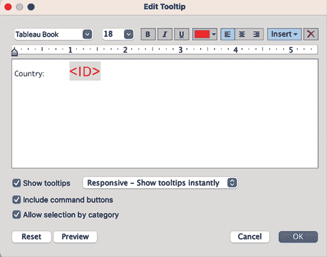
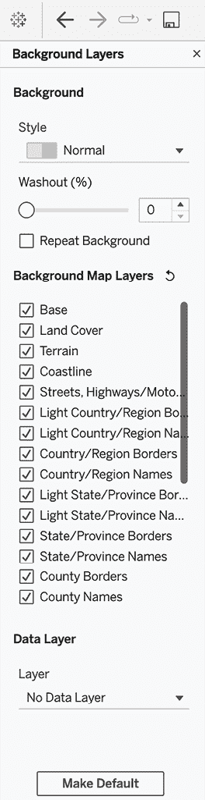
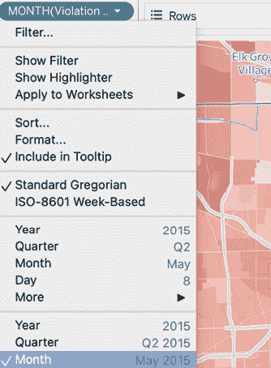
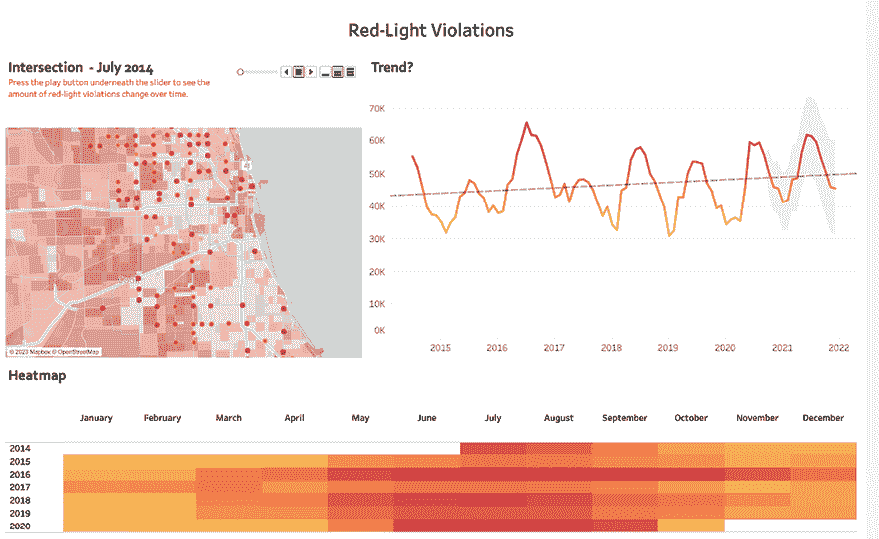
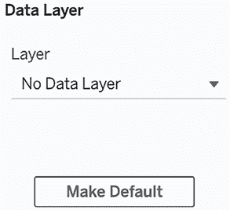

# 第十二章：利用高级分析

本章重点介绍高级自助分析。自助分析可以看作是一种商业智能形式，企业中的人员被鼓励自己在数据集上执行查询，而不是将查询请求提交到 IT 团队的待办事项中。然后，可以进行查询分析，这将有助于产生更多的洞察力和数据驱动的决策。那么，如果这是你第一次做自助分析，你如何开始创建有用的自助仪表板呢？你如何从一个数据集到一个产品呢？你是否曾问自己，其他人是如何开始做仪表板的，如何清理数据，以及如何设计仪表板的？如果是这样，那么本章正是为你准备的！我想和你分享三个使用案例，它们以思维列车的方式写成，目的是让你了解我是如何工作的。请注意，这仅仅是我的个人经验；有很多不同的方法可以实现你的目标。

我们将覆盖以下主题：

+   可视化世界指数相关性

+   使用芝加哥交通违规数据进行地理空间分析

+   使用距离度量扩展地理空间分析

现在我们已经进行了介绍，可以开始处理第一个使用案例。

# 可视化世界指数相关性

想象一下，你正在处理世界指数数据集，而你的直属经理给你以下任务：

为我创建一个仪表板，能够轻松地显示所有相关的世界指数及其分布。我需要它在明天早上之前完成。

现在，在继续阅读之前，花几分钟时间思考一下你将如何处理这个任务。数据集包含 67 列不同的指数，比如出生登记、排放值、进出口和森林面积，分为 188 行，每一行代表一个国家。

写下你计划的步骤，打开与本章相关的工作簿，来自[`public.tableau.com/profile/marleen.meier`](https://public.tableau.com/profile/marleen.meier)，并按照你的步骤执行；为自己设定时间，以便更好地掌握在使用 Tableau 时的时间估算。这样，你可以确保按时交付，并在被问及需要多长时间构建某个仪表板时，能够管理预期。

## 绘制散点图

现在，我将展示我可能想象的解决这个任务的一种方式：

1.  首先，我在 Tableau Prep Builder 中打开`world-indices`文件，以便更详细地了解数据集本身；这将帮助我描述数据，并且能够发现明显的数据缺陷，比如空值、重复条目等：

    图 12.1：Tableau Prep Builder

    对于这个数据集，我实际上没有在 Prep Builder 中发现任何明显的数据质量问题，也没有进一步准备数据的需求。每个国家有 1 行数据——你可以在**ID**列中看到均匀分布的条形图——并且每个国家有 65 列不同的指标。由于不需要数据准备，我决定直接使用 Tableau Desktop。于是，我关闭了 Tableau Prep Builder 并打开了 Tableau Desktop。

1.  我的下一个想法是，如何一次性可视化所有的相关性，同时又不至于信息过载？我有 65 个不同的列，这意味着有 4,225 种可能的组合。不，我决定显示所有内容是行不通的。这个任务非常通用，因此我决定采用两参数的方法，这样最终用户就可以选择各自的指标组合。我开始草拟仪表板的外观，并设计出以下内容：


图 12.2：草图

1.  为了执行我的计划，我首先创建了两个参数，命名为**X-Axis**和**Y-Axis**，它们将用于定义各自的*X*轴和*Y*轴。

1.  我将两个参数都定义为**字符串**类型，并将剪贴板中的所有字段名粘贴到这两个参数中。为此，我在 Excel 中打开输入文件，将标题行转置为一列，然后按*Ctrl* + *C*。现在可以通过**从剪贴板粘贴**选项将数据粘贴到参数中。这节省了时间并且减少了出错的可能：


图 12.3：粘贴到参数

1.  我还希望参数能在仪表板上显示出来，因此我选择了**显示参数**：


图 12.4：显示参数

1.  如果你现在测试参数，什么也不会发生。我们需要一个计算字段，定义当从参数中做出选择时，Tableau 会选择相应的字段。我创建了以下计算字段来实现这一点（该字段已包含在`Starter`和`Solution`工作簿中，便于你使用）：


图 12.5：计算字段

1.  现在我们将对**Y-Axis**参数执行相同的操作。

    为了更快速地创建**Y-Axis**的计算字段，将**X-Axis**的计算字段复制粘贴到 Excel 中，并用`[Parameters].[Y-Axis]`替换`[Parameters].[X-Axis]`。

1.  将**X-Axis**计算字段拖到**列**上，将**Y-Axis**拖到**行**上。同时，将**ID**字段放到**详细信息**架上。

1.  为了查看 Tableau 的相关性分析，将**趋势线**拖到工作表上：


图 12.6：趋势线

1.  带有趋势线的工作表如下所示。当你将鼠标悬停在趋势线上时，你将看到该线的方程式、**R 平方**值以及**P 值**：

    图 12.7：趋势线值

    **Y 轴**方程意味着，对于每个*X*轴上的点，*Y*轴的值将增加 17.9717，从*X*轴的 0 点和*Y*轴的-4.33685 点开始。因此，整体而言，*Y*项的增加速度比（同样增加的）*X*项快。**R 平方**值解释了趋势线所解释的方差比例（80.81%），最后，**P 值**解释了模型的显著性。**P 值**小于 0.05 被认为是显著的，这意味着数据随机符合趋势线的概率为 5%。前面图中的趋势线**P 值**小于 0.01%。因此，我们可以安全地假设这两个变量之间存在真实的关系。

1.  要查看更多系数，右键点击线条并选择**描述趋势线…**：

    图 12.8：描述趋势线…

    以下窗口将会出现：

    

    图 12.9：趋势线信息

1.  另外，你可以选择**描述趋势模型…**选项，你将看到以下内容：

    图 12.10：趋势模型信息

    如果你想了解更多关于解释趋势线的内容，可以阅读以下文章：[`onlinehelp.tableau.com/current/pro/desktop/en-us/trendlines_add.htm`](https://onlinehelp.tableau.com/current/pro/desktop/en-us/trendlines_add.htm)。

1.  我有点分心于网格线，所以我决定通过右键点击屏幕并选择**格式…**来去除它们：


图 12.11：格式化

1.  我在**格式**窗口中选择第五个选项——网格线，并将**网格线**值设置为**无**：


图 12.12：移除网格线

1.  我还将**Marks**从**自动**更改为**圆形**并将颜色更改为黑色。

1.  现在，我认为在散点图上显示每个点代表的国家会很有帮助，因此我将**ID**字段从**详细信息**更改为**标签**，但是这看起来有些混乱：


图 12.13：ID 转文本

1.  我点击撤销箭头，并通过右键点击**ID**并选择**显示高亮**功能来添加高亮功能。现在，最终用户可以搜索某个国家，并且该点将在散点图中被高亮显示：


图 12.14：显示高亮

1.  我还希望当悬停在任何点上时，国家名称能清晰地以红色显示，我通过在**编辑工具提示**中将**ID**颜色更改为红色并增加字体大小来实现：

    图 12.15：工具提示

    结果如下所示：

    

    图 12.16：悬停在某个点上

1.  我已经添加了趋势线，现在我想在视图中显示**Pearson R**，也叫**R 平方**值，这样用户就知道两个指标是否相关；然而，无法设置**描述趋势线**或**描述趋势模型**选项为始终显示。因此，我将自己在新字段中计算该值；我使用`CORR()`函数来做到这一点：


图 12.17: Pearson R

1.  但我想显示一些文本，指示两个变量是否相关，而不是显示值本身，因为我希望让仪表板更加清晰。因此，我创建了另一个名为`是否相关`的计算字段，代码如下：

    ```py
    IF [Pearson R] > 0.7 then 'The two variables <' + [Parameters].[X-Axis]+ '> and <'+ [Parameters].[Y-Axis]+ '> have a very strong positive correlation of: ' + STR([Pearson R])
    ELSEIF [Pearson R] < 0.7 and [Pearson R] > 0.4 then 'The two variables <'  + [Parameters].[X-Axis] + '> and <'+ [Parameters].[Y-Axis]+ '> have a strong positive correlation of: '  + STR([Pearson R])
    ELSEIF [Pearson R] < 0.4 and [Pearson R] > 0.2 then 'The two variables <'  + [Parameters].[X-Axis] + '> and <'+ [Parameters].[Y-Axis]+ '> have a moderate positive correlation of: ' + STR([Pearson R])
    ELSEIF [Pearson R] <0.2 and [Pearson R] > -0.2 then 'The two variables <'  + [Parameters].[X-Axis] + '> and <'+ [Parameters].[Y-Axis]+ '> have no or a weak correlation of:' + STR([Pearson R])
    ELSEIF [Pearson R] < -0.2 and [Pearson R] >-0.4 then 'The two variables <'  + [Parameters].[X-Axis] + '> and <'+ [Parameters].[Y-Axis]+ '> have a moderate negative correlation of: '+ STR([Pearson R])
    ELSEIF [Pearson R] < -0.4 and [Pearson R] > -0.7 then 'The two variables <'  + [Parameters].[X-Axis] + '> and <'+ [Parameters].[Y-Axis]+ '> have a strong negative correlation of: ' + STR([Pearson R])
    ELSEIF [Pearson R] < -0.7 THEN 'The two variables <'  + [Parameters].[X-Axis] + '> and <'+ [Parameters].[Y-Axis]+ '> have a very strong negative correlation of: ' + STR([Pearson R])
    END 
    ```

1.  完成这一步后，我创建了一个新工作表并将**是否相关**放到**文本**架上。该工作表看起来非常简单，如下所示：


图 12.18: 文本相关性

1.  我右击标题并选择**隐藏标题**。

最后，几乎所有内容都准备好了，可以根据本节开头的草图构建仪表板。只缺少每个轴的分布。

## 添加坐标轴分布

我们已经开始了，但现在我想将*x*轴和*y*轴的分布图添加到散点图旁边。我按照以下步骤进行：

1.  我从*x*轴开始，打开另一个工作表，并将**X 轴**拖到**行**中。接着，我点击刚刚添加的**绿色药丸 X 轴**并选择**度量** | **计数**。现在，在数据窗格中右击**X 轴**并选择**创建** | **区间...**。在弹出窗口中，点击**确定**。最后，我将新的维度**X 轴（区间）**拖到**列**中。

1.  关闭**编辑坐标轴 [X 轴]**窗口后，我右击**X 轴**并取消选择**显示标题**，以不再显示标题。

1.  我继续在另一个新的工作表中使用**Y 轴**，并将**Y 轴**拖到**列**中。接着，我通过点击它并选择**度量** | **计数**来更改**列**中的**Y 轴**。现在，在数据窗格中右击**Y 轴**并选择**创建** | **区间...**。在弹出窗口中，点击**确定**。


图 12.19: 区间

1.  最后，我将新的维度**Y 轴（区间）**拖到**行**中。

1.  我在**标记**卡中将颜色更改为灰色，并在页面顶部选择**整个视图**。

1.  *y*轴的分布应该与散点图对齐；因此，我点击**Y 轴（区间）** | **排序** | **降序**。接着，我右击**Y 轴**并取消选择**显示标题**，以不再显示标题。

1.  为了将所有内容结合在一起，我打开一个仪表板页面并命名为`分布`，然后将`散点图`工作表放在页面底部，将`相关性`工作表放在仪表板画布顶部。

1.  我将分布工作表添加到散点图的相关位置（`Y 轴`到*y*轴，`X 轴`到*x*轴）。

1.  我还在左下角添加了一个空白，以使分布与散点图的边缘对齐：

    图 12.20：添加空白

    最终的布局如下所示：

    

    图 12.21：最终布局

1.  我想赋予分布更多的意义，并添加一个动作，使其能够在两个分布图中突出显示国家。我这样做是为了让用户能够看到某个国家在某个指标的所有国家范围中的位置，因为有时在散点图中很难看到。另一方面，散点图可以用来获得更多关于两个指标之间关系的见解。对于**高亮**动作，我需要将参数设置如下：


图 12.22：高亮

1.  为了使高亮功能在**X 轴**和**Y 轴**的工作表中生效，请在两个工作表中的**Detail**栏中添加**ID**。


图 12.23：添加 ID

现在，看看下面的截图：


图 12.24：相关性

我在**X 轴**上选择了`Public health expenditure percentage of GDP 2013`，在**Y 轴**上选择了`Mean years of schooling – Years`。我必须通过右键点击**数据**面板中的**X 轴桶**，选择| **编辑** | **建议桶大小** | **确定**来调整**X 轴桶**的大小。我看到这两个衡量标准之间的总体相关性是正相关的，相关系数为 0.359。但通过悬停在点上，现在可以调查哪些国家对这种相关性有影响。对于靠近趋势线的国家，相关系数更接近实际因素。例如，位于右上角的美国，其**x**轴（健康支出）值为 16.8，**y**轴（受教育年限）值为 12.76。如果将 12.76 乘以 0.359（相关系数），得到 4.581，这几乎正好是 12.76 与 16.8 之间的差距。现在，如果你搜索塞拉利昂（右下方），你会看到**x**和**y**值分别为 11.4 和 2.9。在这里，将相关系数相乘并不能很好地解释这种关系。这一点可以在散点图中清楚地看到，因为塞拉利昂远离趋势线。我非常喜欢这个仪表板，因为它简化了变量之间的关系，可以帮助新手和高级用户理解数据。

## 添加相关矩阵

在点击仪表板并测试功能后，我意识到很难记住我已经尝试过哪些组合，并且我希望能够筛选出高度相关的组合。为了解决这个问题，我想在这个工作簿中添加一个新的仪表板：一个包含所有组合的相关矩阵，并用颜色编码，同时提供筛选选项：

1.  首先，我回到**数据源**选项卡，再次添加相同的数据集，但使用一个新的名称：`World Indices Correlation Matrix`。我甚至添加了两次，因为我需要将每个指标与其他所有指标进行关联：


图 12.25：世界指标相关矩阵

1.  使用的关键字段是**ID**：


图 12.26：ID 作为关键字段

1.  然后，我需要对两个表进行透视，因为我需要一个列来显示所有指标名称，另一个列显示所有值，而不是每个指标对应一列。我选择除**ID**外的所有字段，并使用**透视**：


图 12.27：透视

1.  这样就得到了三列。我将**Pivot Field Values**重命名为**Value Index A**，将**Pivot Field Names**重命名为**Index A**：


图 12.28：重命名列

1.  现在我再次对第二个表格进行操作，并将列重命名为**Index B**和**Value Index B**。

1.  我打开一个新的工作表，将**Index B**放置在**列**上，将**Index A**放置在**行**上。我创建一个名为**Pearson R**的计算字段，代码为`CORR([Value Index B], [Value Index A])`，并将其放置在**过滤器**、**颜色**和**文本**中。右键点击**Pearson R**字段，选择**显示过滤器**：

    图 12.29：相关矩阵

    颜色可以根据个人喜好调整；我选择了从红色到黑色的五色渐变，表示红色字段为负相关，黑色字段为正相关。

1.  我打开一个新的仪表板标签，并将工作表放置其中。尝试调整过滤器，使其仅显示高度相关的范围 0.89–0.99，这样就能更小的数据集来操作：


图 12.30：过滤器相关矩阵

本节帮助我们创建了所有可能组合的热力图，我们通过颜色编码相关值并添加了过滤器来聚焦于感兴趣的点。在前面的截图中，你可以看到高度相关的指标。

## 完成仪表板

为了避免混淆，我想向用户解释**皮尔逊 R**过滤器，并完成仪表板：

1.  我开始将文本字段`Pearson R ranges explained`添加到仪表板。如果有更多时间，我可以将其做成像**X 轴**和**Y 轴**字段那样的下拉参数：


图 12.31：添加关于 Pearson R 的文本

1.  为了完成所有操作，需要三个步骤。首先，需要两个**参数**操作，以便通过点击相关矩阵来更改**X 轴**和**Y 轴**参数的值，第一个操作应该按如下方式进行定制：

    图 12.32：参数操作 1

    上述截图中的操作将会把**X 轴**参数改为**Index A**中的值。

1.  现在，我按如下方式编辑第二个**参数**操作：

    图 12.33：参数操作 2

    上述图中的操作将会把**Y 轴**参数改为**Index B**中的值。

1.  最后，我添加了一个名为**GoToScatterplot**的**Sheet Navigation**操作，允许用户在选择指数组合后更改仪表板：

    图 12.34：Sheet Navigation 操作

    前面的操作将显示一个菜单以转到趋势线仪表板。

1.  用户现在可以选择一个值并点击它。在背景中，**X 轴**和**Y 轴**参数将调整为与该字段相关的两个指标。例如，对于**平均学年**和**人类发展指数**，会显示一个超链接：


图 12.35：菜单

1.  用户将被重定向到带有现在已预过滤的趋势线和相同两个指标的仪表板：**平均学年**和**人类发展指数**：


图 12.36：过滤可视化

从中可以看出，选择的两个指数正相关性为 89.9%。我们还可以看到*x*轴和*y*轴上每个指数的分布。

这是一个冗长的练习，但我想向你展示我完整的思维过程，并看看仪表板的创建。如果有更多时间，我肯定会添加更多见解，例如：

+   对每个指数添加解释。

+   对相关性添加更详细的解释。

+   添加 p 值或其他系数到分析中，并相应地更改文本。

不要忘记收集反馈并与利益相关者核对你是否在正确的方向上。有些人会使用草图，然后制作草稿，再次征求反馈，直到产品最终确定。我倾向于向利益相关者提问，以更好地理解他们的需求，并让他们指导我完成用 Tableau 仪表板替换或更改的过程。然后，我会呈现完整版本或中间版本，具体取决于复杂性和时间安排。你应该避免花费数小时或数天在不符合利益相关者期望的事物上。

现在，让我们看一个第二个更短的用例，它包含地理空间数据。

# 芝加哥交通违规的地理空间分析

这是星期三早上；你的经理走进你的办公室，想要检查芝加哥去年的红灯违规情况。他们询问你是否可以为此目的制作一个仪表板。特别是，你被要求突出显示违规最多发生的地点，并查看近几年芝加哥交通信号违规的总体趋势。你被提供了两个数据集，一个带有摄像机位置，另一个带有违规信息，并被告知需要在下一个小时内完成仪表板。你会怎么做？

在继续阅读之前，请考虑如何解决这个问题。花五分钟，思考你将采取的步骤，并草绘一个仪表板设计。

以下是我如何操作的概述：

1.  在 Tableau Prep Builder 中打开数据集。

1.  连接这两个数据集。

1.  如有需要，清理数据。

1.  在 Tableau 中打开输出。

1.  如果可能，使用地图来可视化相机的位置。

1.  添加每个相机的违规次数。

1.  确定是否存在按月趋势。

接下来是我设计仪表盘的粗略草图：


图 12.37：草图

接下来是我将要执行的逐步描述。相应的 Tableau 仪表盘可以从 Tableau Public 下载，Tableau Prep Builder 文件可以从 GitHub 获得（[`github.com/PacktPublishing/Mastering-Tableau-2023-Fourth-Edition/tree/main/Chapter12`](https://github.com/PacktPublishing/Mastering-Tableau-2023-Fourth-Edition/tree/main/Chapter12)），数据集本身可以在这里公开获取：[`data.cityofchicago.org/Transportation/Red-Light-Camera-Violations/spqx-js37`](https://data.cityofchicago.org/Transportation/Red-Light-Camera-Violations/spqx-js37)。

## 准备数据

在将两个文件加载到 Tableau Prep Builder 中后，我发现通过**LONGITUDE**和**LATITUDE**连接无法得到任何结果，因为几乎所有记录都是不匹配的：


图 12.38：连接 I

我尝试另一种方法：在交集上进行连接。这再次导致**0**个连接的行，但这次我知道原因了。在一个数据集中，**INTERSECTION**值是由短横线（**-**）分隔的，而在另一个数据集中是**AND**；此外，一个使用大写字母，另一个没有：


图 12.39：连接 II

我可以添加一个清理步骤，将所有字母转换为大写，并将交叉口拆分成两部分。我可以在**-**以及**AND**上执行**自定义拆分...**：


图 12.40：数据准备

然后，我注意到交叉口的顺序不同；例如，`Ashland-71st`和`71ST AND ASHLAND`。我可能会考虑重新构建数据集并创建一个循环，将两个街道按字母顺序排列在两个拆分中，但现在我没有时间做这个。

另一种解决方案是先将 split 1 和 split 1 以及 split 2 和 split 2 连接起来。接着，在第二次连接中，我可以将 split 1 和 split 2 以及 split 2 和 split 1 连接。之后，我可以将两个连接的结果合并并创建输出文件（或者直接将 Prep Builder 数据集加载到 Tableau Desktop 中）。通过这种方法，我仍然不会包括所有数据，但我将会有从 444,000 行中筛选出的 380,000 行数据。这应该足以获得一个大致的模式。如果我还有时间，我可以继续映射剩余的不匹配项。

然而，我最终决定完全放弃位置数据集，仅使用违规数据集，因为我意识到我只会错过那些尚未发生违规行为的位置。违规行为的发生地点已经足够。如果你需要确定交通信号灯控制是否失效，你必须使用两个数据集。

# 构建交叉口的地图

我继续在 Tableau 中打开违规数据集：

1.  经度和纬度值没有自动识别，所以我必须点击数据类型图标将两者都更改为**Number (decimal)**：


图 12.41：更改数据类型

1.  然后，我通过点击字段上的下拉箭头（如前图所示）并选择**Convert to Measure**，将**Longitude**和**Latitude**字段更改为**Measure**。

1.  现在我可以再次点击数据类型图标，并将两个字段更改为**Latitude**和**Longitude**：


图 12.42：更改地理角色

1.  将**Longitude**拖放到**Columns**，**Latitude**拖放到**Rows**，并将**Intersection**放到**Text**货架上，我可视化了红灯位置——至少是曾经发生过违规的位置：


图 12.43：芝加哥的交叉点

1.  工作表的名称将是`Intersection`，由于我正在查看违规情况，我将**Marks**卡片中的颜色更改为红色。最后，我不需要看到交叉点名称，所以我将**Intersection**从**Text**更改为**Detail**。

1.  接下来，我更喜欢地图显示一些细节，所以我使用**Background Layers…**选择了更多的选项：

    图 12.44：背景图层…

    选择要在地图上显示的所有图层：

    

    图 12.45：芝加哥地图

    Tableau 的另一个好功能是，你可以向视图添加**Data Layer**。你可以在前面截图的左下角看到该选项。

1.  我使用**人口普查区**的**人口**层，希望它能为我提供一些关于密集人口区域是否发生更多或更少违规行为的详细信息：

    图 12.46：数据层

    在下面的截图中，你可以看到它的样子——请注意，红色越深，区域的人口密度越高：

    

    图 12.47：交叉点可视化

1.  我将**MONTH(Violation Date)**添加到**Pages**；这样，我的老板可以调整月份，查看违规数量何时何地变化：



图 12.48：页面

1.  当然，我需要添加**Violations**字段以使**Pages**正常工作。我决定使用 Tableau 的**Density**功能，并以红色为颜色：


图 12.49：密度可视化

## 添加相应的热力图工作表

点击**Pages**播放按钮后，我注意到某些月份有模式。我想更仔细地观察，所以我打开了一个新的工作表：

1.  我将新工作表命名为**Heatmap**，并将**MONTH(Violation Date)**放到**Columns**，**YEAR(Violation Date)**放到**Rows**。然后，我将**Violations**拖放到**Color**货架上，并选择红金色得到以下结果：

    图 12.50：热力图

    夏季肯定有更多的红灯违规行为，2016 年和 2020 年显示了最多的违规行为。

1.  最后，我添加了一个名为`Trend?`的新工作表。我将**MONTH(Violation Date)**拖动并放到**Columns**架上。**Violations**字段应放在**Rows**上。我确保这两个度量都是**连续型（绿色）**。在**Analytics**面板中，我将线性**趋势线**拖到工作表上。接下来，我将**预测**拖到视图中：


图 12.51：折线图

在前面的图中，你可以看到红灯违章的整体趋势在多年间略有上升。预测显示，夏季出现更多红灯违章的季节性特征可能会持续到 2021 年。

欢迎在 2021 年底查看 Tableau 的预测模型表现如何！芝加哥市的数据集会不断更新。

## 完成仪表板

时间差不多了，我正在将这三个工作表放到一个仪表板上，命名为**红灯违章**，并稍作格式调整；它的样子如下：



图 12.52：最终仪表板

你可以在 Tableau Public 上找到与本章相关的 Tableau 工作簿中的最终仪表板，地址是：[`public.tableau.com/profile/marleen.meier/`](https://public.tableau.com/profile/marleen.meier/)。

仪表板可以改进吗？是的，永远可以改进。但在这个第一次迭代之后，我的老板可以告诉我是否需要调整，我会进行调整。我确信我可以花更多时间改进它，但大多数时候，仪表板制作更重要的是快速交付。而且，完整的生产模型与临时问题或一次性练习是不同的，特别是当你以敏捷方式工作，将工作分割为交付物，获取反馈并继续改进时。

# 扩展地理空间分析与距离度量

我们的最后一个用例也是针对相同的芝加哥交通数据集进行的地理空间分析，但这次我们将添加另一个组件。我们打算租一个新地方，但要求该地方周围的半径*X*范围内没有超过*n*个交叉路口，而且海军码头距离最多为*y*英里。变量*n*、*x*和*y*应该是互动的，以便我们可以进行更改并拥有非常灵活的仪表板体验。关于这个任务，问题如下：

+   我们如何将芝加哥的任何一个位置添加到我们的数据集中？目前它只显示交叉路口和违章数据。

+   我们如何生成*n*、*x*和*y*这三个变量？

+   我们如何在地图上的任意点添加半径指示器？

+   我们如何衡量两个变量点之间的距离？

以下步骤将解答这些问题：

1.  返回与本章相关的工作簿。

1.  右键点击名为**Intersection**的工作表，点击**复制**。

1.  将新的工作表重命名为`Rental`。

1.  从**页面**中移除**月份(违章日期)**，从**颜色**架中移除**违章次数的总和**，并从标题中删除红色文本（子标题），使工作表看起来像这样：


图 12.53：交叉点

1.  将**标记**类型更改为**地图**。

1.  点击**地图** | **地图图层**，将**数据图层**更改为**无数据图层**：



图 12.54：地图层

1.  将**违章日期**放到**筛选器**架上，并选择年份**2020**。

1.  将**违章次数**拖到**颜色**架上，并选择**红色**配色方案：


图 12.55：编辑颜色

现在，我们面前有一张芝加哥的地图，其中每个点代表 2020 年发生违章的交叉口。点的颜色越深，表示该交叉口登记的违章次数越多。

## 将测量点添加到地图上

接下来，我们需要添加一个功能，允许我们在地图上设置一个标记并从那里开始测量。可以通过创建经度和纬度参数，并在计算字段中使用它们来实现：

1.  创建以下参数，`纬度`和`经度`：

****

图 12.56：参数

1.  右键点击每个参数并选择**显示参数**。

1.  创建一个名为`地址手动输入`的计算字段：

    ```py
    MAKEPOINT([Lat], [Long]) 
    ```

1.  将**地址手动输入**拖到地图上，放置在**添加标记层**弹出窗口上方：


图 12.57：添加一个图层

1.  将新图层的**标记**类型更改为**地图**。

1.  完成这些步骤后，我们就得到了一个带有交叉点的地图，显示了颜色编码的违章次数，并且有一个点可以通过使用`纬度`和`经度`参数来更改。用户可以使用例如 Google Maps 来找到纬度和经度；只需在 Google Maps 上选择一个代表出租房位置的点：


图 12.58：Google Maps

1.  纬度和经度将在 URL 中以及页面底部显示。将它们输入到`纬度`和`经度`参数中，相同的点将出现在我们的 Tableau 地图上：


图 12.59：纬度和经度

## 添加距离线

在接下来的步骤中，我们将添加一个半径和一条从海军码头开始的距离线：

1.  创建一个名为`英里半径`的参数，并将当前值设置为`1.1`。

1.  右键点击`英里半径`参数并选择**显示参数**。

1.  创建一个名为`缓冲区`的计算字段，用作我们围绕**地址手动输入**点的半径：

    ```py
    BUFFER([Address manual],[Radius in miles], 'miles') 
    ```

1.  将**缓冲区**字段拖到地图上，就像我们之前将**地址手动输入**字段拖到**添加标记层**弹出窗口上一样。

1.  将此新层的**标记**类型更改为**地图**。

1.  点击**颜色**，将不透明度更改为**50%**，并选择灰色：

    图 12.60：带有半径的地图

    **海军码头**的坐标显示在以下图中的 URL 中（41.8859088,-87.6064094）：

    

    图 12.61：海军码头

1.  创建如下计算字段：

    ```py
    MAKEPOINT(41.892133, -87.604045) 
    ```

1.  将**Navy Pier**字段拖放到顶部的**添加标记层**弹出窗口上的地图上。

1.  将**标记**类型更改为**地图**。

1.  为了连接**Navy Pier**和我们的**地址手动**点并测量距离，请创建另一个名为`Line`的计算字段：

    ```py
    MAKELINE([Address manual], [Navy Pier]) 
    ```

1.  要测量两者之间的距离，请使用以下代码创建一个`Distance`字段：

    ```py
    DISTANCE([Address manual], [Navy Pier], 'miles') 
    ```

1.  将**Line**字段放置在顶部的**添加标记层**弹出窗口上的地图上。

1.  将新图层中的**标记**类型更改为**地图**。

1.  将**Distance**放置在**标签**架上，将测量值更改为**平均值**，然后单击**标签**以添加文本`miles`：


图 12.62：编辑标签

我们的仪表板现在如下所示：


图 12.63：最终仪表板

这使其完整。 半径清楚地显示了某一距离内有多少个交点； 悬停在点上可以看到交点违规的数量。 从 Navy Pier 到我们当前位置的**地址手动**告诉我们这两个点相距多远。

回答我们一开始的问题：

+   *如何将芝加哥的任何给定位置添加到我们的数据集中？* *目前仅显示交点和违规*。 通过在计算字段中使用`Makepoint()`函数。

+   *如何制作 n、x 和 y 变量？* 通过使用参数。

+   *如何在地图上的任意给定点添加半径？* 通过使用`Buffer()`函数。

+   *如何测量两个可变点之间的距离？* 通过使用`Distance()`函数；通过添加`MakeLine()`函数，将绘制一条线。

此用例可以重新创建为某一区域内的超市数量、学校、公共交通点等。 保持创造性，随时将您的仪表板上传到 Tableau Public，并不要忘记添加**#MasteringTableau**标签！

如果您经常使用空间数据，我还建议您查看这些链接：

+   [`www.tableau.com/about/blog/2019/6/geospatial-analysis-made-easy-two-new-spatial-functions-makepoint-and-makeline`](https://www.tableau.com/about/blog/2019/6/geospatial-analysis-made-easy-two-new-spatial-functions-makepoint-and-makeline)

+   [`www.tableau.com/about/blog/2020/3/seeing-and-understanding-proximity-made-easy-buffer-calculations`](https://www.tableau.com/about/blog/2020/3/seeing-and-understanding-proximity-made-easy-buffer-calculations)

# 概要

在本章中，我们探索了自助式高级分析的迷人世界。我们首先理解了自助式分析作为一种商业智能形式的概念，它使个人能够直接查询数据集并获取有价值的见解。在我们的旅程中，我们发现了三个引人入胜的应用案例，展示了自助式分析的强大力量。我们揭示了世界指数之间复杂的相关性，深入理解了全球市场动态。接着，我们进入了芝加哥交通违规领域，运用地理空间分析揭示了潜在的模式和改进的领域。最后，我们扩展了地理空间分析，利用距离度量来确定基于关键变量的住房位置的最佳半径。

在这些不同的场景中，有一个关键的教训始终贯穿其中：当开始一个自助式分析项目时，结构化的方法至关重要。通过精心规划工作、熟悉数据、运用描述性统计，并根据中期结果调整计划，我们为成功铺平了道路。

还要记住，仪表板永远不会真正完成：你总是可以修改内容；你的受众可能会改变；利益相关者的需求也可能不同。交付一个具有基本功能的可用可视化，并在收到反馈后继续改进。根据你的待办事项或其他情况，最小可行产品可能正是你所需要的。

在我们结束本章时，我敦促你反思所获得的见解，并考虑如何将这些原则应用于你自己的自助式分析工作。记住，尽管我的经验可以作为指导，但有许多不同的路径可以帮助你实现目标。拥抱自助式分析的力量，用数据赋能自己，并在寻求数据驱动决策的过程中，开启无限的可能性。同时，给你的 IT 团队一些休息时间，让他们专注于那些超出你范围的更复杂的实施工作。

下一章将专注于提高性能。随着数据量的不断增加，性能至关重要，它可能意味着成功与失败之间的差距。

## 在 Discord 上了解更多

要加入本书的 Discord 社区——你可以在这里分享反馈、向作者提问并了解新版本——请扫描下面的二维码：

[`packt.link/tableau`](https://packt.link/tableau)


