# 第十三章：提升性能

一旦人们熟悉了 Tableau 的功能，他们很快就会遇到另一种类型的问题：性能。你们可能都曾经在屏幕上盯着 *加载数据* 或 *执行查询* 的字样发呆。但别担心，我们有办法！如果设计得当，Tableau 仪表盘即使处理大量数据也能表现得非常好。

本章将涵盖性能的各个方面，旨在让你掌握技术，创建加载快速、响应灵敏的工作簿。

在本章中，我们将讨论以下主题：

+   理解性能记录仪表盘

+   硬件和即时技术

+   连接数据源

+   使用提取数据

+   明智地使用过滤器

+   高效计算

+   提升性能的其他方法

正如你所看到的，我们需要覆盖许多与性能提升相关的主题。因此，让我们不要浪费任何时间，直接进入正题。我们的第一个话题将是性能记录，这是你在遇到性能下降时应首先查看的内容，因为它能帮助你找出所有缓慢的根源。

# 理解性能记录仪表盘

Tableau 包含一个性能记录功能，作为安装包的一部分，它以名为 `PerformanceRecording.twb` 的仪表盘形式提供。该仪表盘为 Tableau 作者提供了一个简单的方法，用于理解和排查性能问题。以下的练习和讨论将回顾性能记录仪表盘的各个方面，包括如何生成它、如何利用它来提升性能，以及它是如何构建的。

执行以下步骤：

1.  导航到 [`public.tableau.com/profile/marleen.meier`](https://public.tableau.com/profile/marleen.meier) 查找并下载与本章相关的工作簿。

1.  导航到 `事件类型` 工作表。

1.  选择 **帮助** | **设置与性能** | **开始性能记录**。

1.  在 Windows 上按 *F5* 或在 macOS 上按 *Command* + *R* 刷新视图。

1.  选择 **帮助** | **设置与性能** | **停止性能记录**。这时会打开一个新的仪表盘：

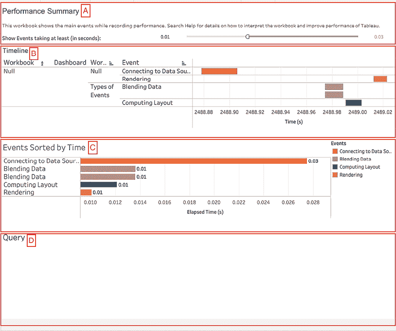

图 13.1：性能摘要

需要关注的四个主要部分：

**A) 性能摘要** 显示了仪表盘执行所有步骤所需的时间，这些步骤发生在 *步骤 3*（开始性能记录）和 *步骤 5*（停止性能记录）之间。可以使用滑块进行筛选。

**B) 时间线** 显示了每个步骤发生的时间及其持续时长。

**C)** 这些步骤也通过颜色编码，可以在 **事件** 条形图中找到。

**D) 查询** 仅在点击（**B**）或（**C**）中的任何事件时显示详细信息。

让我们继续进行接下来的步骤：

1.  将 **事件** 时间线滑块拖动到（**A**）的最左侧以显示所有事件。

1.  在**按时间排序的事件**（**C**）中，点击任何标记为**执行查询**的绿色条。注意，**查询**部分现在已显示属于高亮条的 VizQL： |

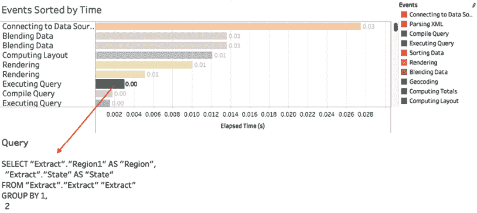

图 13.2：事件 |

1.  要查看完整的查询，导航到**查询**工作表并将视图设置为**整个视图**（在**查询**中，Tableau 指的是 VizQL 查询）。请注意，尤其长的查询可能未被完全记录。为了查看这样的查询的每一行，请参考位于**我的 Tableau 存储库**中的日志文件。 |

前面的步骤旨在为你提供初步了解性能记录仪表板的用途。我通常用它来检查某个查询是否比其他查询花费了明显更长的时间。然后，我查看**查询**标签，检查哪个部分受到了影响，通过查看所使用的字段，尝试进行更改，然后再次运行性能仪表板，看看变化如何。现在，让我们来看一些更详细的信息。 |

如果你从性能记录仪表板访问**事件**工作表，你将看到不同的事件。接下来，我们将更详细地讨论这些事件及其对性能的影响： |

| **事件类型** | **性能考虑因素** |
| --- | --- |
| 连接数据源 | 连接数据源时的性能差可能表明网络延迟、数据库问题，甚至是驱动程序过时。 |
| 生成提取 | 在提取之前聚合数据并隐藏未使用的列可以提高性能，因为这将分别减少总列数和行数。 |
| 编译查询 | 编译查询性能问题可能表明数据库存在问题。 |
| 执行查询 | 如果查询花费时间过长，你可以通过过滤不需要的数据或隐藏不使用的字段来提高性能。有关更多信息，请参考本章的*明智使用过滤器*部分。 |
| 排序数据 | 与排序问题相关的性能问题可能表明视图中标记过多。此排序问题也可能由依赖视图中数据排序的表计算引起。 |
| 地理编码 | 地理编码性能问题可能表明视图中标记过多、互联网延迟、硬件问题或显卡性能差。 |
| 混合数据 | 混合数据的性能可以通过减少基础数据量或使用过滤来提高。 |
| 计算表计算 | 由于表计算通常是在本地执行的，复杂的计算可能会给终端用户的计算机带来负担。 |
| 计算总数 | 计算总数的性能可以通过减少基础数据量或使用过滤来提高。 |
| 计算布局 | 计算布局性能问题可能表明仪表板中有太多工作表或元素，如图片。 |

在本概述之后，你可以随时回顾，我们将更深入地研究当启用性能记录时会发生什么。请注意，以下内容假设作者正在使用 Tableau Desktop，而不是 Tableau Server。在*第十四章*，*探索 Tableau Server 和 Tableau Cloud*中，我们将介绍 Tableau Server 上的性能记录。

在记录性能时，Tableau 会在`My Tableau Repository\Logs`中初步创建一个名为`performance_[timestamp].tab`的文件。此外，还会在 Tableau 程序目录中创建一个名为`PerformanceRecording_new.twb`的文件，例如`C:\Program Files\Tableau\Tableau.[version]\Performance`。一旦停止录制，该文件会自动打开，从而让作者查看结果。

我们刚刚了解了如何记录性能指标并使用随 Tableau Desktop 和 Tableau Server（如果管理员启用）提供的仪表板。在接下来的章节中，我们将一步步指导你如何优化整体性能的不同选项。

# 硬件和即时技术

虽然 Tableau Desktop 对硬件要求不高，但公司中的桌面电脑或笔记本往往配置不足，尤其是对于那些所谓的业务用户而言，他们的日常工作不需要编程工具或大量的处理能力。

因此，在本节中，我们将讨论技术要求。根据[www.tableau.com](http://www.tableau.com)，最新的技术要求如下：

| **Windows** | Microsoft Windows 8/8.1, Windows 10 (x64), Windows 11 |
| --- | --- |
|  | 2 GB 内存 |
|  | 至少 1.5 GB 的可用硬盘空间 |
|  | CPU 必须支持 SSE4.2 和 POPCNT 指令集 |
| **Mac** | macOS Catalina 10.15，macOS Big Sur 11.4+，macOS Monterey 12.6+（适用于 Tableau 2022.3+），以及 macOS Ventura（适用于 Tableau 2022.3+） |
|  | 英特尔处理器或使用 Rosetta 的 Apple Silicon 处理器 |
|  | 至少 1.5 GB 的可用硬盘空间 |

现在我们已经理清了基础内容，接下来让我们看看一个可能会无意间拖慢你性能的功能以及如何解决它。我们第一个即刻使用的技巧叫做自动更新。

可以通过工具栏上的图标、**工作表** | **自动更新**，或者使用快捷键*F10*（在 Windows 上）或*Option* + *Command* + *0*（在 Mac 上）来访问自动更新。自动更新为作者提供了暂停/恢复工作表和/或筛选器的自动更新的选项，如果你想多次更改布局而不希望每次更改后 Tableau 都重新加载（因为每次加载意味着会发送新的查询到底层数据源并进行处理，这会消耗处理能力），这个功能会非常有用。你可以简单地暂停更新，进行更改，然后一次性执行更新。

以下练习展示了这一过程是如何工作的：

1.  打开与本章关联的工作簿，并导航到`Auto Updates`工作表。

1.  在**数据**窗格中，选择`超市`数据集。

1.  将**状态**字段放置在**行**架上。

1.  通过工具栏取消选择**自动更新工作表**：


图 13.3：自动更新工作表

1.  将**城市**字段放置在**状态**字段右侧的**行**架上。请注意，视图并未更新。

1.  通过工具栏启用**自动更新工作表**，视图现在会更新。

1.  右键点击**状态**字段在**行**架上，选择**显示过滤器**。

1.  右键点击**城市**字段在**行**架上，选择**显示过滤器**。

1.  在**城市**过滤器上，点击下拉菜单并选择**多选值**(**列表**)以及**仅相关值**：

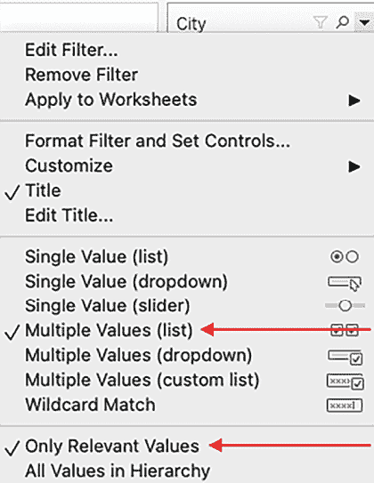

图 13.4：仅相关值

1.  取消选择**自动更新过滤器**，如*图 13.3*所示。

1.  在**状态**过滤器中，仅选择**阿拉巴马**州。请注意，**城市**过滤器没有更新。

1.  通过工具栏启用**自动更新过滤器**，此时**城市**过滤器会更新。

自动更新非常有用。作者可以暂停自动更新，进行多次修改，然后再恢复自动更新，从而间接节省时间并提高性能。

作为旁注，像**仅相关值**或**上下文中的所有值**等级联过滤器，在使用暂停按钮或自动更新时可能无法填充，因为它们依赖于先传递查询。

## 执行更新功能

位于暂停/恢复自动更新选项右侧的**执行更新**图标是用来执行一次刷新，而用户可以保持禁用的**自动更新**功能。以下简短示例应该有助于说明此选项：

1.  复制名为`自动更新`的**上一份**工作表，并将副本命名为`执行更新`。

1.  通过点击**暂停自动更新**图标，暂停所有更新。

1.  在**状态**过滤器中随机选择几个州。

1.  如*图 13.5*所示，点击**执行更新**图标并选择**更新过滤器**或**更新工作表**。运行更新的快捷键是 Windows 的*F9*，macOS 上的快捷键是*Shift* + *Command* + *0*：


图 13.5：执行更新

1.  在**状态**过滤器中，随机选择几个州。请注意，自动更新仍然处于暂停状态。

重申一下，**执行更新**允许 Tableau 作者在保持自动更新暂停的情况下间歇性地刷新视图。我们刚刚讨论的这两个更新功能将通过在加载数据之前做多次更改，避免等待刷新数据，从而使你作为仪表盘开发者的工作变得更轻松，但如果你想从根本上解决性能问题，你还需要更多的工具。以下部分将介绍提取功能，这对于加速计算和渲染非常有效。

## 小型提取

尽管提取数据将在*使用提取数据*一节中进行更详细的讨论，但在进行创作时提到提取数据似乎是合适的，因为它与性能考虑密切相关。即使在最优条件下，处理大数据源也可能很慢。如果在创作时不需要持续访问整个数据集，可以考虑创建一个小型本地提取。尽可能多地完成工作簿的创作，然后，当所有底层数据确实需要时，再指向原始数据源。

以下步骤展示了该技术的简要示例：

1.  在本章附带的工作簿中，导航到`Small Local Extract`工作表。

1.  选择**数据** | **新建数据源**，然后选择所需的数据源。这个练习假设使用`Superstore.xls`，它是随着 Tableau 一起安装的，但你可以选择任何你喜欢的数据集。

1.  将任意字段拖到**文本**货架上。在我的例子中，我使用了`Number` `of` `Records`**，**这是一个只包含数字 1 的计算字段。

1.  右键点击数据源（对我来说是`Superstore`），然后选择**提取数据...**：

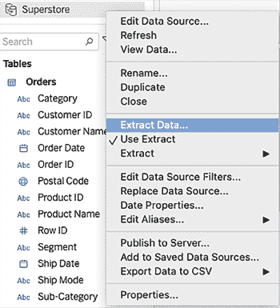

图 13.6：提取数据

1.  在**提取数据...**对话框的底部，选择**Top**，你的数据源，然后选择**1000**。在下图中，选择了**Orders**，这是超级商店连接的两个部分之一：

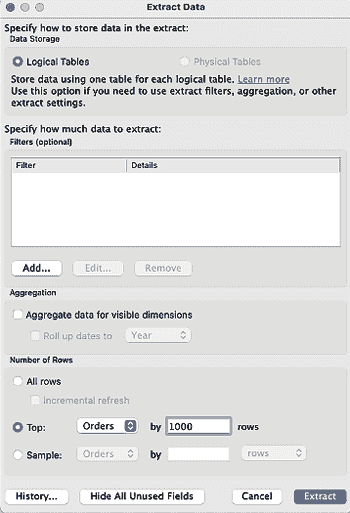

图 13.7：前几行

1.  点击**提取**按钮，注意记录数现在显示为`1000`行。

1.  在**数据**窗格中，右键点击**Superstore**，取消选择**使用提取**。请注意，**记录数**已恢复到原始值。

通过创建一个小的本地提取，Tableau 作者缓解了两个性能瓶颈：网络延迟和数据集大小。

本节介绍了如何临时减少数据集并选择不离开 Tableau 界面就能恢复到原始大小的选项。这是加快仪表板构建过程并避免长时间等待的好方法。在下一节中，我们将讨论如何连接数据源，以实现最佳性能。

# 连接数据源

Tableau 的一个优点是你可以通过多种方式轻松连接到许多不同的数据源。正如本书前面提到的，Tableau 定义了许多连接器，以便与各种数据源接口。此外，这种灵活性不仅限于连接单个表格或文件。

尽管 Tableau 可以轻松连接到各种数据源，但必须强调的是，Tableau 不是一个**提取、转换和加载**（**ETL**）工具。如果生成有用结果需要复杂的连接和数据混合，建议在 Tableau 外部进行 ETL 工作，例如在 Tableau Prep Builder 中（有关此服务的更多信息，请参见*第三章*，*使用 Tableau Prep Builder*）。ETL 工作理想情况下将带来更好的数据建模，从而在 Tableau 中实现更轻松的创作和更快的性能。

Tableau 连接数据的四种方式如下：

+   Tableau 可以连接到单个表。这是理想的，因为它提供了最全面的功能和最简单的故障排除，同时使 Tableau 能够发送最简单的查询，从而实现最佳性能。然而，连接到单个表并不总是可能的，尽管这是理想的，但也不合理要求这么严格的限制。数据源与报告工具之间的关系是不断变化的。一个在数据连接方式上不灵活的报告工具，可能不会成功，无论最终结果多么优雅美观。

+   第二种选择是关系，这是一个更新且更灵活的方式来结合两个或多个数据集。详细程度将在每个工作表中定义，而不是在**数据源**选项卡中定义，这使得此功能非常强大。

+   Tableau 连接数据的第三种方式是通过连接。一个表可能无法提供所有必要的数据，但通过连接两个或多个表，所有需要的数据都可以访问。随着连接的复杂性增加，性能可能会受到影响，故障排除也可能变得困难。幸运的是，Tableau 可以假设引用完整性，从而即使在复杂的连接中也能高效工作。更多信息可以在这里找到：[`help.tableau.com/current/pro/desktop/en-us/joins_xbd_perf.htm`](https://help.tableau.com/current/pro/desktop/en-us/joins_xbd_perf.htm)。

+   最后，Tableau 可以利用数据混合。只要混合的数据源中不超过一个是大型的，并且用于混合的维度成员相对较少，数据混合通常表现得非常出色。

在可能的情况下，应该选择关系而不是连接，选择连接而不是混合。当混合多个大型数据源时，性能可能会受到严重影响。当在高基数维度上进行混合时，问题会更加复杂。此外，数据混合会限制某些功能，例如使用来自二级数据源的维度、行级计算或 LOD 表达式的能力。

然而，也有例外，下面讨论了其中两个：

+   首先，当两个表之间没有共享的公共键时，数据混合是有优势的（通常也是必要的）。

+   其次，在某些情况下，交叉连接将无法使用，需要进行数据混合。例如，当你处理两个具有不同粒度且无法建立关系的数据集时，或当交叉数据库连接不可用时（例如，针对数据立方体或仅限提取连接），或者当你处理大型数据集时，混合数据可以提高性能。

更多信息请访问：[`help.tableau.com/current/pro/desktop/en-us/multiple_connections.htm`](https://help.tableau.com/current/pro/desktop/en-us/multiple_connections.htm)。

因此，作为指导原则，如果存在连接选项，通常应避免使用数据混合。

*第四章*，*关于连接、混合和数据结构的学习*，提供了关于连接和混合的详细信息。对于本章而言，连接和混合的讨论将限于性能考虑。

## 高效处理大型数据源

本节将介绍一些数据库调优的基础知识，以及如何高效地处理大型数据源。由于本主题更多关注数据源而非 Tableau，因此不包含练习。

如果你正在连接大型数据源并且遇到性能问题，与**数据库管理员**（**DBA**）的对话可能会有所帮助。

清晰的沟通结合少量的数据库工作可以显著提高性能。对话中应包括数据库调优要点，如显式定义主键和外键、将列定义为*not null*以及索引。每个要点将在此讨论。

### 定义主键和外键

主键和外键对于连接表格至关重要。主键由表中的一列或多列组成，主键应该对每一行都是唯一的。连接时使用非唯一的行级键可能会导致错误的结果，正如在*第四章*，*关于连接、混合和数据结构的学习*中所探讨的那样。在数据库中显式定义主键有助于确保每个键值都是唯一的：

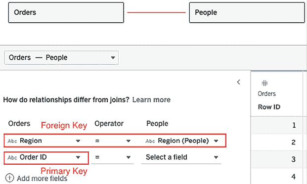

图 13.8：数据库键

外键由表中的一列或多列组成，唯一标识另一个表中的行。这种唯一标识是因为表中的外键引用了另一个表中的主键。显式定义外键可以使 Tableau 跳过许多完整性检查，从而提高性能。

### 将列定义为 NOT NULL

Tableau 已发布多篇关于性能提升技巧和建议的白皮书（[`help.tableau.com/current/pro/desktop/en-us/performance_tips.htm`](https://help.tableau.com/current/pro/desktop/en-us/performance_tips.htm)），其中指出程序员和 Tableau Desktop 都不喜欢 `NULL` 数据。如果可能，定义每一列时使用显式的 `NOT NULL`。

实际上，数据库管理员就何时定义列为`NOT NULL`进行辩论；然而，有两点是明确的：

+   主键或外键应该定义为`NOT NULL`。这是显而易见的，因为主键和外键按定义必须是唯一的。

+   此外，任何需要索引的列都应该定义为`NOT NULL`，因为否则索引可能无法使用。

索引将在下一节中更详细地讨论。

### 索引

让我们考虑关于索引的以下两个问题：

+   什么是索引？

+   应该对哪些内容进行索引？

我们的两个问题中的第一个可能很容易由数据库管理员（DBA）回答，但对于普通的 Tableau 作者来说，可能是未知领域。因此，为了澄清，索引是数据库表中选定列的副本，这些副本已经过优化，可以高效地进行搜索。由于这些复制的列包含指向原始列的指针，因此可以通过它们快速找到给定的行并返回所需的数据。

一个简单的例子可能会有所帮助。根据波音公司，787 梦想客机大约有 230 万个部件。假设有一个表格列出了所有这些部件的**Part_Name**列。你的任务是搜索这个列中以“fuse”字符串开头的每个部件。在没有索引的列上，这将需要检查数据库中每一行的数据。这样的搜索可能会非常慢。幸运的是，可以使用索引来减少搜索的行数，从而加快过程。一种用于索引的结构化数据是 B 树。B 树数据结构是有序的。因此，当使用 B 树数据结构来访问索引搜索所有以*fuse*开头的部件时，就不必考虑每一行。数据库可以直接跳到*fs*并快速返回所需的行。

现在让我们继续讨论第二个关于索引的问题。应该对哪些内容进行索引？这个问题可以简洁地回答：理想情况下，所有用于连接或筛选的列都应该在数据源中建立索引。

尽管在 Tableau 中创建更高效连接的基本性能考虑因素（例如，在左连接足够时避免外连接）是存在的，但连接性能主要在 Tableau 外部决定。因此，通常更重要的是对用于连接的列进行索引，而不是用于筛选的列。

为了继续我们关于操作数据源的讨论，下一节将介绍如何使用 Tableau 通过提取来创建汇总数据集。

# 使用提取数据

本节将讨论什么是 Tableau 数据提取，以及如何高效构建提取。我的一位同事最近与一家相对较小的手机服务提供商进行了咨询。尽管该公司规模较小，但每天的呼叫量可能超过 1,000,000 次。公司管理层坚持要求能够与 Tableau 工作簿中的单个呼叫的详细可视化进行交互。工作簿的性能显然成为了一个问题。如此低级别的详细信息是否必要？减少细节并使工作簿更迅速是否可能带来更好的商业决策？

为了平衡业务需求与实际性能要求，企业通常需要确定哪些层级的细节对于报告真正有帮助。通常情况下，详细的粒度并非必要。当情况是这样时，摘要表可能提供足够的业务洞察，并且能提高性能。在手机服务提供商的案例中，每日的通话量快照可能已经足够了。即使是每小时的快照，也会大大减少表的大小并提高 Tableau 的性能。

为了满足这一常见的业务需求，提取是由 Tableau Desktop 创建的专有压缩数据源。自发布以来，提取的文件扩展名已从 `.tde` 更改为 `.hyper` 格式。因此，新的格式使用了 Hyper 引擎，Hyper 引擎在*第一章*，*回顾基础知识*中已讨论过。提取可以本地存储，并由 Tableau 访问以渲染可视化。

考虑以下几点，使得提取文件成为提高性能的优秀选择：

+   提取可以在汇总级别上快速生成。

+   提取是一个列式存储，记录的是列的顺序。

+   关系型数据库通常使用**行存储**方法存储数据。

在以下示例中，请注意，**行存储**非常适合返回单独的行，而**列存储**则更适合返回汇总数据。

这是一个示例表：

|  | **表** |  |  |
| --- | --- | --- | --- |
|  | 乐器 | 存储 | 价格 |
| 行 1 | 塞尔梅小号 | 北部 | $3,500 |
| 行 2 | 康奈尔法式圆号 | 东部 | $4,500 |
| 行 3 | 盖岑长号 | 南部 | $2,500 |
| 行 4 | 米拉丰大号 | 西部 | $9,000 |

这里是一个数据库中的**行存储**表：

| **行 1** | 塞尔梅小号 |
| --- | --- |
|  | 北部 |
|  | $3,500 |
| **行 2** | 康奈尔法式圆号 |
|  | 东部 |
|  | $4,500 |
| **行 3** | 盖岑长号 |
|  | 南部 |
|  | $2,500 |
| **行 4** | 米拉丰大号 |
|  | 西部 |
|  | $9,000 |

这里是一个数据库中的**列存储**表：

| **乐器** | 塞尔梅小号 |
| --- | --- |
|  | 康奈尔法式圆号 |
|  | 盖岑长号 |
|  | 米拉丰大号 |
| 存储 | 北部 |
|  | 东部 |
|  | 南部 |
|  | 西部 |
| 价格 | $3,500 |
|  | $4,500 |
|  | $2,500 |
|  | $9,000 |

我希望您能看到，在**列存储**表中，每*n*行的某个属性构成了第一行。例如，`Instrument`的第一行、`Store`的第一行和`Price`的第一行都与一个条目相关，而在**行存储**表中，属于同一个条目的所有行是连续的。

总结本节学习的内容，提取文件利用压缩技术来减少文件大小，同时保持性能，并利用 RAM 和硬盘空间以达到最佳性能。而使用与数据库的实时连接时，以上两者都无法实现——因此，当数据库无法提供良好性能时，提取文件可以提升仪表板的性能。

## 构建提取文件

本节将从性能角度讨论提取文件。提取文件的其他方面，如调度和增量刷新，将不在这里讨论，但您可以在此处找到更多信息：[`help.tableau.com/current/pro/desktop/en-us/extracting_refresh.htm`](https://help.tableau.com/current/pro/desktop/en-us/extracting_refresh.htm)。

正如我们在*小型提取*部分中讨论的那样，提取文件是通过**数据** | **[数据源]** | **提取数据**创建的。从结果对话框中，我们可以执行以下操作：

+   **根据需要过滤提取文件**：有时，需要一个精确反映数据源的提取文件，但通常，过滤掉不同的字段仍然可以填充提取文件所需的数据，同时缩小大小并提高性能。要添加过滤器，只需点击**添加...**，即可访问与工作表中使用的**过滤器**对话框相同的对话框。

+   **聚合到视图中表示的粒度级别**：聚合不仅减少文件大小，还可以从安全性角度提供帮助。如果没有聚合，提取文件将使用行级数据构建。因此，Tableau 作者应注意，如果在构建提取时没有选择聚合，任何敏感的行级数据都可以被访问：


图 13.9：聚合

+   **减少行数**：如在*小型提取*部分所示，减少行数可以让作者创建一个小的、本地的提取文件以便快速构建工作簿，然后可以访问原始数据源进行完整分析：

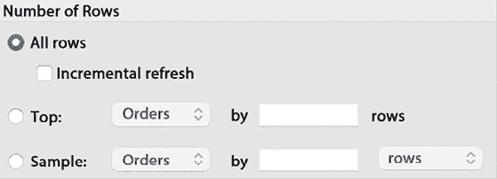

图 13.10：减少行数

+   **隐藏所有未使用的字段**：此选项会排除工作簿中未使用的所有列。这样可以显著减少提取文件的大小并提高性能：


图 13.11：隐藏字段

通过采取这四个度量，您的性能应该会立即改善。欢迎使用性能记录工具亲自测试，并创建同一数据源的不同提取。接下来将讨论如何使用聚合和性能记录操作。

## 聚合

以下练习将使用来自单一数据源的两个聚合数据，一个是**州**级别的，另一个是**城市**级别的。这些聚合数据源将用于创建两个工作表。这些工作表将与第三个包含行级信息的工作表一起放置到仪表板上。最后，将创建筛选器操作将这三个工作表联系起来。该练习的目的是演示如何将小规模的数据提取与更大的数据集结合使用，从而创建更高效的仪表板：

1.  打开与本章关联的工作簿并转到`State Agg`工作表。

1.  在**数据**窗格中，选择`State Agg`数据源。

1.  使用州创建填充地图，将**州**放到**详细信息**架上，并从**标记**卡中选择**填充地图**。

1.  右键单击`State Agg`数据源并选择**提取数据**。

1.  请注意，Tableau 会显示一个错误，说明它无法找到引用的文件。您可以指向与 Tableau 一起提供的`Superstore`实例，或者使用通过 GitHub 链接提供的实例：[`github.com/PacktPublishing/Mastering-Tableau-2023-Fourth-Edition/tree/main`](https://github.com/PacktPublishing/Mastering-Tableau-2023-Fourth-Edition/tree/main)。

1.  连接到数据源后，Tableau 会显示**提取数据**对话框。在对话框中，选择**聚合可见维度的数据**和**所有行**。点击**隐藏所有未使用字段**按钮，然后点击**提取**：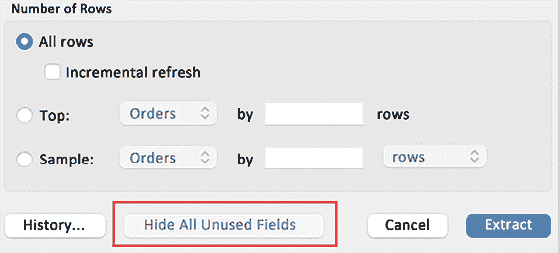

    图 13.12：提取数据

    请注意，结果提取仅包含**州**。还要注意，数据已被聚合，因此没有底层数据可用。

1.  转到`City Agg`工作表。

1.  在**数据**窗格中，选择`City Agg`数据源。请注意，这个数据源已经被提取，因此只包含**州**、**城市**和**销售**。还要注意，数据已经过聚合，因此没有底层数据可用。

1.  将**城市**放到**行**架上，**销售**放到**文本**架上，**州**放到**详细信息**架上。即使**州**在视图中没有显示，也不要忘记包括它。必须使用它，以便在练习结束时创建的仪表板能正确工作。

1.  转到`Row Detail`工作表并选择`Superstore`数据集。

1.  创建一个交叉表视图，显示**客户名称**、**订单 ID**、**行 ID**、**利润**和**销售**。创建这个视图的一种快速方法是双击每个字段。

1.  转到`Agg Dash`仪表板并将三个工作表中的每一个放到仪表板上。

1.  在**Superstore**和**City Agg**数据源之间创建**City**和**State**的混合关系：

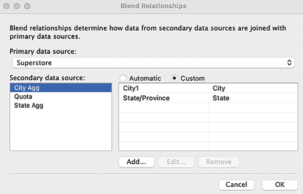

图 13.13：混合

1.  通过**仪表板** | **操作** | **添加操作** | **筛选**创建以下操作：

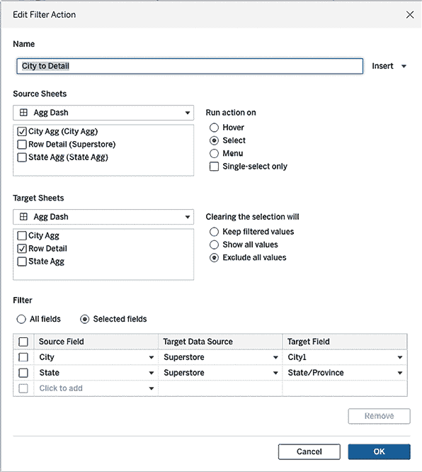

图 13.14：添加城市到详细信息操作

1.  通过**仪表板** | **操作** | **添加操作** | **筛选**创建以下操作：

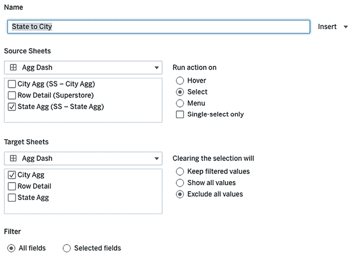

图 13.15：添加州到城市操作

1.  创建这两个操作后，在仪表板中点击**State**字段。

1.  然后，点击**City**字段。

1.  点击`City Agg`工作表的空白部分以排除**Row Detail**上的所有值。

1.  点击`State Agg`工作表的空白部分以排除**City Agg**上的所有值。

1.  根据需要格式化仪表板：

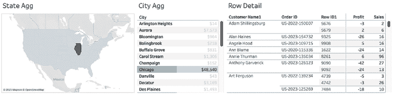

图 13.16：仪表板上的操作

完成本练习后，请注意，生成的仪表板在以下几个方面具有良好的性能：

+   当用户第一次打开仪表板时，只有**State Agg**显示。这有两个原因使得性能较好。首先，打开仪表板时只显示一个工作表，而不是所有工作表，可以减少初始查询次数并减少渲染。其次，访问小的提取数据比访问较大的数据源更快。

+   由于`City Agg`工作表也在访问一个小的提取数据，当用户点击一个州时，**City Agg**工作表会迅速显示出来。

+   当用户点击**City**时，会向数据源发送一个仅包含该城市信息的请求。拉取的数据量相对较小，因此即使是较大的数据集，性能也应该很好。

除了使用汇总提取数据外，良好的性能实践还应该考虑到这一点。仪表板中没有快速筛选器。通常情况下，在仪表板上使用快速筛选器是没有必要的。如果仪表板上的工作表可以用于筛选，那么这些工作表实际上可以起到双重作用。也就是说，工作表不仅能提供有价值的分析，同时还能作为其他工作表的筛选器。这比使用快速筛选器有性能上的优势，因为添加快速筛选器会导致向底层数据源发送额外的查询。

在前面的仪表板中，每个工作表都引用了不同的数据源。因此，你可能会问，如何在不同的数据源之间让操作筛选器正常工作？答案可以在筛选操作对话框中找到。如*图 13.14*和*图 13.15*所示，**所有**字段都被视为**目标筛选器**。Tableau 会简单地匹配每个数据源中相同名称的字段。提取数据可以进一步优化，以获得更好的性能结果。我们将在下一节中详细介绍这一点。

## 优化提取数据

优化通过在可能的情况下物化计算字段来加速性能。这意味着 Tableau 会为计算字段生成提取中的值，从而可以查找这些值，而不是每次都计算。如果你使用表计算，Tableau 将必须每次都计算这些值，改变视图时也不例外。

请注意，并非所有计算字段都被物化。未物化的字段包括表计算、可变或不稳定的函数，如 `NOW()` 和 `TODAY()`，以及使用参数的计算字段。

当首次创建提取时，它会自动进行优化。换句话说，计算字段会在可能的情况下自动物化。然而，随着时间的推移，计算字段可能会被更改，导致提取丢失物化字段。此时，请打开 **数据** | **[数据源]** | **提取**，并点击 **立即计算**，以重新生成物化字段：

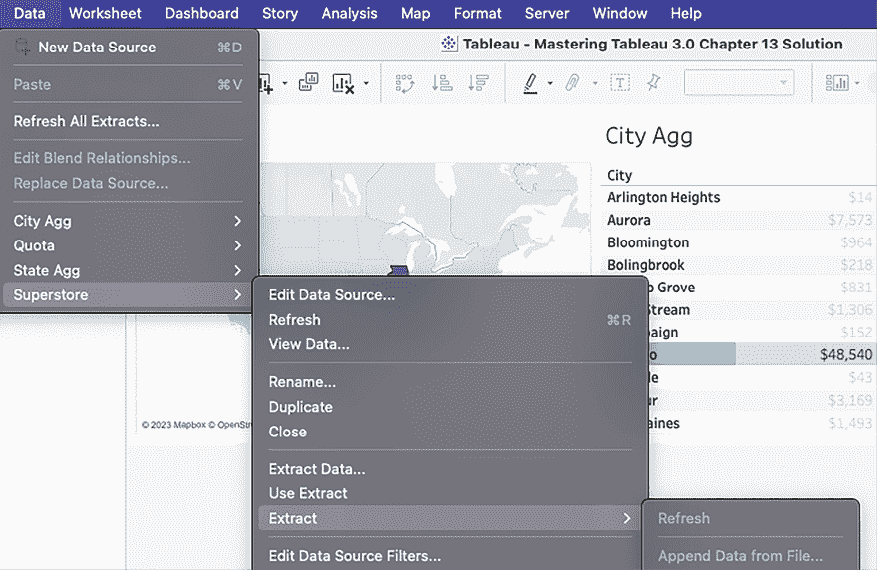

图 13.17：计算计算

如果提取设置为在 Tableau Server 上刷新，则每次刷新时提取都会自动优化。

最后，如果你在仪表板中使用了参数，请检查是否能消除这些参数，并改用计算来提高性能。如果某些计算无法整体物化，请将可以物化的部分放入一个计算字段，将无法物化的部分放入另一个计算字段。如果某些计算可以在提取创建过程中计算出来，性能也会得到提升。

使用提取的优势已详细讨论过，现在让我们继续探讨如何最大限度地利用筛选器。

# 明智地使用筛选器

筛选器通常可以提高 Tableau 的性能。例如，当使用维度筛选器只查看西部地区时，会向底层数据源发送查询，只返回该地区的信息。通过减少返回的数据量，性能得到了提升。这是因为更少的数据意味着减少了网络带宽负载、减少了数据库处理需求以及减少了本地计算机的处理需求。

筛选器也可能对 Tableau 性能产生负面影响。例如，使用 **仅相关值** 会导致向底层数据源发送额外的查询，从而减慢响应时间。此外，从高基数维度创建快速筛选器也可能会损害性能。

Tableau 的筛选器按照特定顺序执行，因此在使用时需要记住这一点。下面的流程图，以及一个链接到一个小时的演示，可能会帮助你更全面地理解这一概念：[`help.tableau.com/current/pro/desktop/en-us/order_of_operations.htm`](https://help.tableau.com/current/pro/desktop/en-us/order_of_operations.htm)：

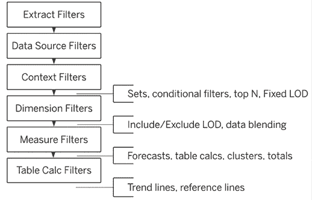

图 13.18：筛选操作顺序

本节其余部分按照操作顺序逐步介绍。到最后，你将了解在不同情况下应该使用哪些过滤器，从而为你的仪表板实现最佳性能。

## 提取过滤器

提取过滤器从提取的数据源中删除数据。简单来说，就是数据不存在。因此，通过减少数据的总体量，性能得到了提升。由于提取的数据使用了 Tableau 的专有列式数据集，性能也可能得到进一步提升。

此外，提取数据源总是被扁平化，这相比于通过连接数据集使用连接操作的方式，在性能上具有优势。要创建提取过滤器，首先选择**数据** | **[数据源]** | **提取数据**。在弹出的对话框中，选择添加过滤器。

## 数据源过滤器

数据源过滤器在整个工作簿中应用。例如，如果你创建一个数据源过滤器，移除**国家**维度中所有成员，除了美国，那么在工作簿中的所有工作表中，**国家**维度将仅包含美国。

数据源过滤器以与维度和度量过滤器相同的方式提高性能；即数据源过滤器使 Tableau 向底层数据源生成查询，从而限制返回的数据量。返回的数据越少，通常处理和渲染速度越快。数据源过滤器的另一个优点是易于创建。例如，如果 Tableau 的作者事先知道整个工作簿将以美国为中心，创建数据源过滤器就能避免在工作簿中使用该数据源的每个工作表上都应用维度过滤器。

还需要注意的是，数据源过滤器在处理流程中发生得相当早。所有计算（包括使用固定 LOD 表达式的计算，在触发维度和度量过滤器之前进行渲染）都遵守数据源过滤器的规则。

要创建数据源过滤器，请点击位于**Tableau Desktop**左下角的**数据源**标签。然后，点击页面右上角的**添加**链接：

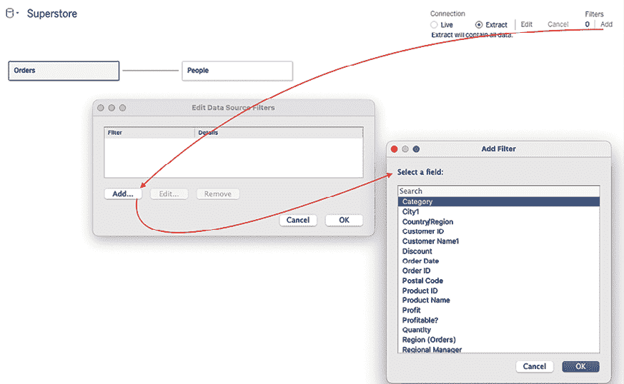

图 13.19：添加过滤器

## 上下文过滤器

创建上下文过滤器的方法很简单，只需右键点击**过滤器**架上的一个字段，然后选择**添加到上下文**：

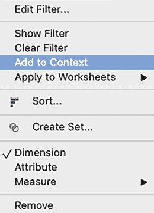

图 13.20：上下文过滤器

维度和度量过滤器是独立的。每个过滤器独立地查询数据源并返回结果。而上下文过滤器则会迫使维度和度量过滤器依赖于它。在某些情况下，这种行为是有帮助的（甚至是必要的），以获得正确的答案。例如，如果 Tableau 作者访问**Superstore** 数据集并使用一个关于**产品名称**的过滤器来返回某一类别中的前 10 大畅销产品名称，那么必须将**类别**定义为上下文过滤器。否则，**产品名称**过滤器将返回总前 10 名。因此，上下文过滤器能提高性能。

## 维度和度量过滤器

维度和度量过滤器可以提高性能。由于维度过滤器或度量过滤器都会导致 Tableau 向底层数据源生成查询，从而限制返回的数据，因此性能得以提升。简单来说，返回的数据集越小，性能越好。

然而，维度和度量过滤器也可能会降低性能。由于 Tableau 不仅需要生成查询来显示可视化图表，还需要生成查询来显示过滤器，因此显示的过滤器越多，性能越慢。此外，显示在高基数维度上的过滤器会抑制性能。（拥有许多成员的维度被称为高基数维度。）考虑一个示例，假设有一个过滤器显示数据集中的每个客户。由于必须查找并返回底层数据集中的每个客户，之后 Tableau 还需要渲染并显示这些客户在过滤器中，性能可能会较慢。

当在视图中使用两个或更多维度或度量过滤器时，可以使用相关过滤器来限制显示的选择。例如，如果视图包含城市和邮政编码过滤器，后者可能设置为仅显示**相关值**：

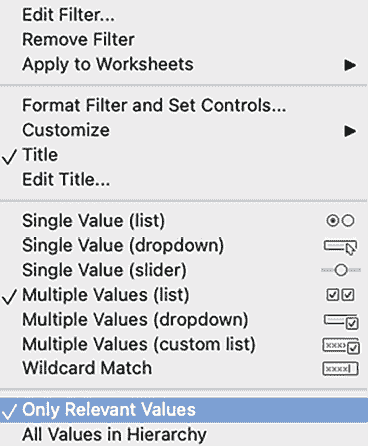

图 13.21：仅显示相关值

这对最终用户有利，因为它调整显示的邮政编码数量，仅反映与第一个过滤器中选择的城市相关的邮政编码。然而，使用相对过滤器会导致向数据源发送额外的查询，从而可能会降低性能。

## 表格计算过滤器

使用表计算作为过滤器并没有与维度或度量过滤器相同的性能增强。如上所述，维度和度量过滤器减少了返回的数据集，而表计算过滤器则不会。在 Tableau 的处理流程中，表计算在从数据源返回数据之后才会渲染。这意味着表计算无法用于生成限制返回数据的查询。换句话说，表计算过滤器导致所有与给定维度或度量相关的数据都会返回，之后 Tableau 在返回的数据集上执行过滤器。

要演示这一点，请执行以下步骤：

1.  打开与本章关联的工作簿，并导航到`Late Filter`工作表。

1.  在**Data**窗格中，选择`Superstore`数据源。

1.  创建一个名为`Cust Name Tbl Calc`的计算字段，并使用以下代码：

    ```py
    LOOKUP( MAX( [Customer Name] ),0 ) 
    ```

1.  将**Customer Name**放置在**Rows**架上。

1.  将**Cust Name Tbl Calc**放置在**Filters**架上，并限制仅显示**Aaron Bergman**。

1.  将**Sales**放置在**Text**架上。

1.  右键单击**Sales**，然后选择**Quick Table Calculation** | **Rank**。

在这个练习中，客户列表整体返回到 Tableau，之后 Tableau 部署过滤器。基本上，仅使用**Cust Name Tbl Calc**作为过滤器仅隐藏底层数据。这很有用，因为**Aaron Bergman**返回的排名是正确的。仅对**Customer Name**进行过滤将返回**Aaron Bergman**的排名为**1**。不幸的是，正确的结果会带来性能损失。运行此练习的性能记录器将显示，表计算对性能产生了负面影响。

幸运的是，随着 LOD 计算的出现，通常不需要将表计算作为过滤器使用。LOD 是独立于当前视图包含或排除数据的计算字段。有关更多信息，请参阅*第五章*，*介绍表计算*。

## 使用动作而不是过滤器

另一种提高性能的方法可能是使用动作而不是过滤器。您可以开发一个仪表板，首先显示高级概述，仅在用户选择后才进入详细信息。其机制与我们在*聚合*部分展示的机制类似；但是，聚合是在每个工作表而不是数据源本身上进行的。通过在高级概述中选择一个标记，将触发一个动作。用户可以深入了解详情，但详细级别只会逐步增加。因此，一次加载的数据量较少。

有关此主题的非常精彩的演示可以在[`youtu.be/veLlZ1btoms`](https://youtu.be/veLlZ1btoms)找到。如果你对了解更多关于热-温-冷方法感兴趣，可以阅读这篇文章：[`gemshare.org/2019/08/16/hot-warm-cold-data-architecture-best-practices/`](https://gemshare.org/2019/08/16/hot-warm-cold-data-architecture-best-practices/)。

接下来的主题我们将讨论计算。我们如何以最有效且高性能的方式编写计算？

# 高效的计算

计算的构建方式可能不同，但却能实现相同的结果。例如，看看以下示例，它展示了如何用更简单的代码替代`IF`语句：

| **情景 I** | **情景 II** |
| --- | --- |
| 创建一个计算字段，使用以下代码：`IF SUM(Profit) > 0 THEN 'Profitable' ELSE 'Unprofitable' END` 将计算字段放置到**颜色**架上。 | 创建一个计算字段，使用以下代码：`SUM(Profit) > 0` 将计算字段放置到**颜色**架上。右键点击结果图例中的**True**和**False**，并将它们重命名为**Profitable**和**Unprofitable**。 |

既然这两种情景都会返回所需结果，那么应该使用哪一个呢？决定因素是性能。本节将探讨在创建计算字段时如何最大化性能，应该做什么以及避免做什么。

## 优先考虑代码值

使用布尔值或数字的计算比使用日期的计算性能更好。使用日期的计算又比使用字符串的计算性能更好。这不仅仅适用于 Tableau，在计算机科学中也是如此。

根据这些信息，前表中列出的**情景 II**比**情景 I**性能更好。**情景 I**会导致 Tableau 创建一个查询，要求数据源引擎处理报告盈利能力的字符串，而**情景 II**则仅发送 1 和 0 来确定盈利能力。**情景 II**的第三步（即将**True**和**False**别名为**Profitable**和**Unprofitable**）只是一个标签更改，发生在从数据源返回汇总数据集之后，这对 Tableau 来说既快速又简单。

## 细节级别计算或表计算

在某些情况下，**细节级别**（**LOD**）计算可能比表计算更快，反之亦然。如果不确定，可以尝试两者，看看哪种性能更好。当然，你也可以运行性能记录。如果它们不是真正需要的，那就都不要使用。请参阅下图，了解何时选择哪种计算类型：

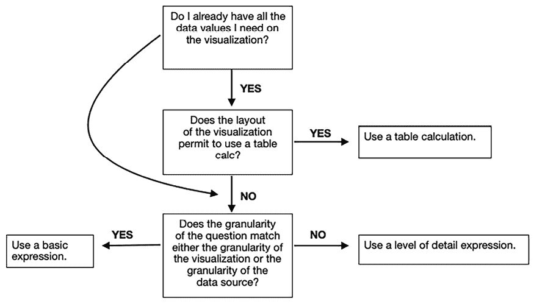

图 13.22：选择计算类型

这张图以及关于选择计算类型的更多建议，可以通过以下链接访问：[`www.tableau.com/about/blog/2016/4/guide-choosing-right-calculation-your-question-53667`](https://www.tableau.com/about/blog/2016/4/guide-choosing-right-calculation-your-question-53667)。

# 提高性能的其他方法

总结本章内容，让我们考虑一些提高性能的其他可能性。

## 避免让仪表盘过于拥挤

通常，最终用户希望在仪表盘上一次性看到所有信息。虽然这可能被认为是有益的，但往往并非如此。考虑在仪表盘上加入一个大型交叉表。浏览大量详细信息是否会增加仪表盘的分析价值？也许答案是“否”。此外，仪表盘上的信息过多可能会掩盖重要的洞察力。委婉地主张简洁的仪表盘可能会带来更好的决策和更佳的性能。

## 修复仪表盘大小

仪表盘可以设置为精确大小或**范围**或**自动**。精确大小会带来更快的性能，因为一旦 Tableau 服务器为某个最终用户渲染了一个视图，该渲染会保存在缓存中，并可以被下一个访问该仪表盘的用户复用。而**自动**和**范围**则会导致 Tableau 服务器尝试确定每个最终用户使用的分辨率大小，并相应地渲染仪表盘。这意味着 Tableau 服务器不会使用缓存中存储的仪表盘实例来为下一个最终用户提供服务，这反过来会影响性能。

## 使用 Tableau Prep Builder

之前已经提到过，但仍然非常相关，因此我会重复一遍：**如果需要复杂的连接和复杂的数据混合才能生成有用的结果，那么建议在 Tableau 之外执行 ETL 工作**，例如，在 Tableau Prep Builder 中（有关此服务的更多信息，请参见*第三章*，*使用 Tableau Prep Builder*）。ETL 工作理想情况下会导致更好的数据建模、汇总数据，或者包含额外列的数据，这些列本来需要在 Tableau Desktop 中创建，因此使用 Prep Builder 会使得 Tableau 的创作更简单，性能更快。

## 设置期望值

如果最终用户期望接近即时的性能，那么，当然，任何低于此期望的表现都会令人失望。提前解释复杂、注重细节的仪表盘可能无法达到高性能，至少可以从两方面有所帮助。首先，解释可能存在的性能问题后，可能达成妥协，创建一个不那么复杂但仍能传递有价值信息的仪表盘。其次，如果仪表盘的复杂性和注重细节是绝对必要的，至少已经提醒了最终用户，在使用时可能需要耐心等待。

## 工作簿优化器

最后，对于那些懒人——或者可以说是“高效”的人，Tableau 不久前发布了一个非常棒的功能：工作簿优化器。它根据一套规则检查你的工作簿，并会返回三种类型的类别：需要采取行动、需要审核和已通过。因此，它使用广为人知的 RAG（红-黄-绿）或交通灯系统为你完成性能检查。

在撰写本文时，规则包括：计算长度、使用多个数据源进行计算、仪表板大小不固定、筛选器使用条件逻辑、筛选器使用“仅相关值”、实时数据连接、数据源中的多个连接、嵌套计算、非物化计算、数据源数量、筛选器数量、布局容器数量、LOD 计算数量、仪表板中的视图数量、工作簿工作表数量、未使用的数据源、未使用的字段、数据混合、日期计算和分组。我相信，未来会有更多的规则出现，且创建高性能仪表板将变得越来越容易。你可以通过选择**服务器** | **运行优化器**来访问工作簿优化器功能：

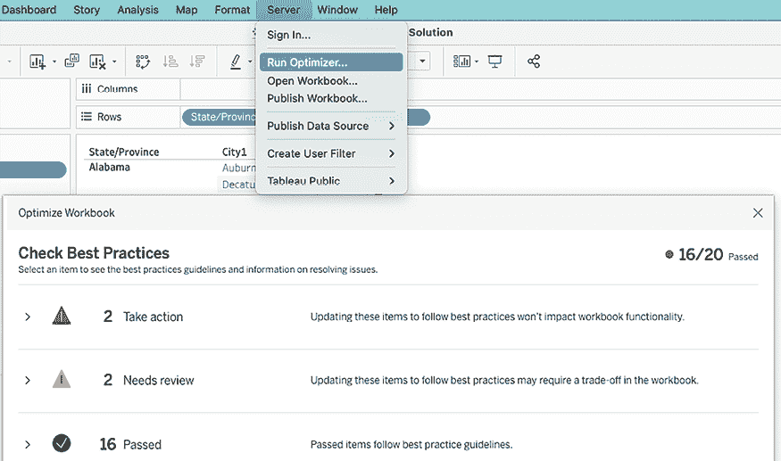

图 13.23：运行优化器

你将能够按类别深入分析，查看哪些地方需要改进。对于大多数规则，仍然需要一些人工干预，但对于某些规则，只需点击一个按钮即可解决，就像在*图 13.24*中所示。请注意规则下方的图标——扳手图标表示 Tableau 可以为你自动修复。

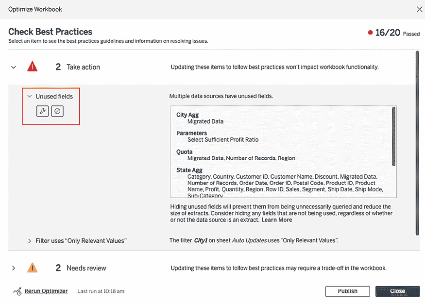

图 13.24：未使用的字段

对于每条规则，Tableau 还提供了一个**了解更多**的超链接，点击后将跳转到 Tableau 帮助页面，提供进一步的解释。

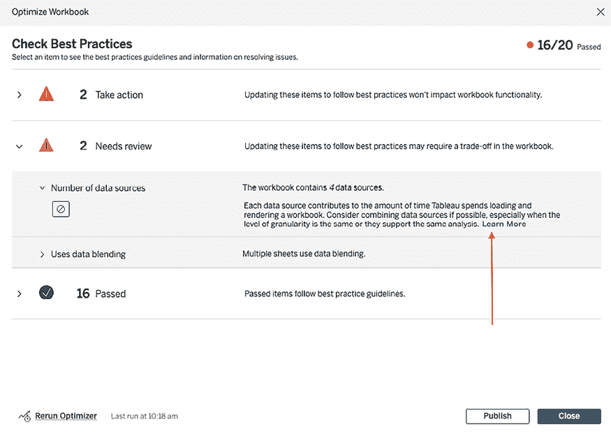

图 13.25：数据源数量

这个功能是不是很棒？！从现在开始，务必记得使用**运行优化器**按钮！

# 总结

我们从本章的性能记录仪表板讨论开始。这一点非常重要，因为许多后续的练习都利用性能记录仪表板来检查底层查询。接下来，我们讨论了硬件和实时技术，目的是传达良好的 Tableau 性能所需的硬件考虑因素，并在缺乏理想硬件的情况下，使用技术手段从任何计算机中榨取出最佳性能。

接下来，我们讨论了如何与数据源一起工作，包括连接、融合和高效操作数据源。随后，我们讨论了如何尽可能高效地生成和使用提取文件。通过这三部分内容，我们聚焦于数据源，学习了最佳实践以及在处理远程数据集或提取文件时应避免的错误。接下来的部分则探讨了不同类型的过滤器和计算对性能的影响。最后，我们探讨了其他性能因素，进一步讨论了仪表盘性能以及如何设定期望。

在下一章中，我们将关注 Tableau Server。Tableau Server 是一个内容丰富的话题，值得单独成书，因此我们将只从 Tableau Desktop 作者的角度来简要探讨 Tableau Server。

## 在 Discord 上了解更多信息

要加入本书的 Discord 社区——你可以在这里分享反馈、向作者提问并了解新版本——请扫描下面的二维码：

[`packt.link/tableau`](https://packt.link/tableau)


