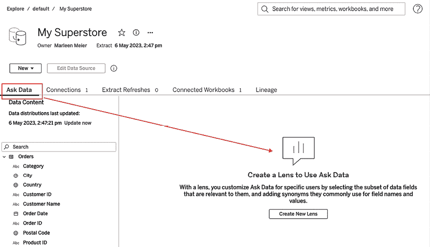
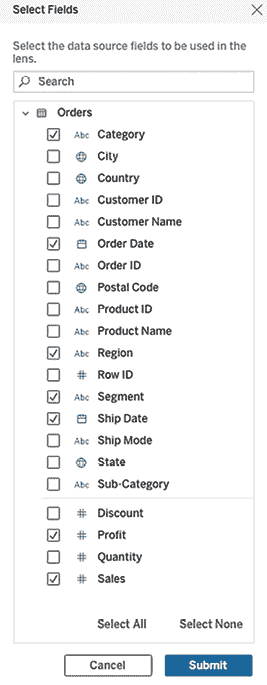
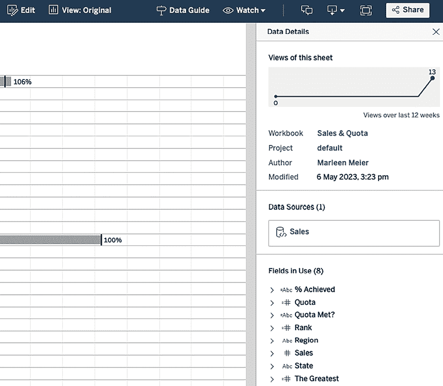

# 第十四章：探索 Tableau Server 和 Tableau Cloud

Tableau Server 和 Tableau Cloud 是用于共享、分发和协作处理在 Tableau Desktop 和/或 Tableau Public 中创建的内容的在线解决方案。它的优势包括提供一个环境，让最终用户可以安全地查看、探索和刷新实时或计划中的数据可视化。Tableau Server 和 Tableau Cloud 之间的主要区别在于，Tableau Server 需要您自己进行维护，而 Tableau Cloud 完全由 Tableau 托管，并由 Amazon Web Services 基础设施进行备份。为了便于阅读，我们将两者统称为 Tableau Server。

本章的范围仅限于 Tableau Desktop 用户与 Tableau Server 的互动。诸如安装和升级、身份验证与访问、安全配置以及命令行工具等主题，与 Tableau Desktop 用户与 Tableau Server 的互动无关，因此不包括在本章内容中。然而，帮助文档非常完善。此外，您还可以观看一些来自 Tableau 软件公司关于 Tableau Server 的视频（例如，[`www.youtube.com/c/tableausoftware/search?query=Tableau%20Server`](https://www.youtube.com/c/tableausoftware/search?query=Tableau%20Server)）。如果您对本章中提到的任何主题或其他 Tableau Server 相关问题有疑问，请务必访问在线帮助网站：[`www.tableau.com/support/help`](https://www.tableau.com/support/help)。

本章将探讨以下主题：

+   将数据源发布到 Tableau Server

+   网页创作

+   在 Tableau Server 上维护工作簿

+   更多 Tableau Server 设置和功能

Tableau Server 是将您公司 Tableau 采用提升到新层次的绝佳方式。您最关心的问题可能是，如何将 Tableau Desktop 上的仪表板迁移到 Server？这正是我们在第一部分将要向您展示的内容。

# 将数据源发布到 Tableau Server

所以，您购买了 Tableau Desktop，成为了一名专业的仪表板开发者，现在您希望与同事分享您的作品。他们是否都需要拥有 Tableau Desktop 的许可和安装才能查看您的可视化内容？幸运的是，答案是：不需要！分享 Tableau 仪表板的最佳方式是通过 Tableau Server。这样，您的同事只需要拥有 Tableau Server 查看许可，这比开发者许可便宜得多，他们就可以完全互动地使用您上传到 Server 的仪表板。关于 Tableau Server 许可模型中不同角色的详细描述，请参见：[`help.tableau.com/current/server/en-us/license_manage.htm`](https://help.tableau.com/current/server/en-us/license_manage.htm)。

本章假设读者可以访问 Tableau Server，并拥有足够的权限来发布数据源和在 Web 编辑环境中编辑。如果你没有访问 Tableau Server 的权限，但希望完成本章中的练习，可以考虑下载试用版，截至写作时，试用版提供两周的完整功能。

那么，如何将仪表板从桌面上传到服务器呢？让我们来看一下以下步骤，看看如何将数据源发布到 Tableau Server：

1.  访问 [`public.tableau.com/profile/marleen.meier`](https://public.tableau.com/profile/marleen.meier) 以查找并下载与本章相关的工作簿。

1.  导航到 `Publish` 工作表。

1.  确保数据源是 `My Superstore`。

1.  如果你还没有这样做，点击 **服务器** | **登录…**，登录到你的 **Tableau Server** 实例：

图 14.1：服务器—登录…

1.  在 **数据** 面板中，选择 `My Superstore` 数据源。

1.  选择 **服务器** | **发布数据源** | **My Superstore**：

图 14.2：服务器—发布数据源

1.  在弹出的对话框中，输入你所需的设置。

如果你的 Tableau Server 上有不同的项目，你可以选择将数据源发布到哪个项目。你还可以更改名称，或者添加描述，这在你有大量不同数据源时特别有用，能帮助用户寻找他们需要的那个数据源。通过添加标签，你将添加一个元数据层，允许 Tableau Server 用户根据标签搜索特定的数据源。你还可以更改权限。你的设置可能是不同用户属于不同的组，因此你可以选择哪些组被授予哪些权限。最后，你可以立即上传包含数据源的工作簿，使得两者都能在 Tableau Server 上使用。

## Tableau 文件类型

我们将继续讨论 Tableau Server，考虑各种 Tableau 文件类型。虽然这似乎是一个意外的延续位置，但随着你阅读下去，你会发现对文件类型的清晰理解为 Tableau Desktop 作者提供了与 Tableau Server 高效互动的基础知识。

前面讨论过的与理解如何与 Tableau Server 互动相关的文件类型会被详细探讨。与理解 Tableau Server 无关的文件类型会被简要提及。有些文件类型（例如与许可证激活相关的文件类型）不会被考虑。

### Tableau 数据源

现在让我们来看一下 Tableau 中可用的各种数据源。请查看以下 Tableau 数据文件：

+   **文件格式类型**：XML。

+   **它包含的内容**：元数据。

+   **它为什么有用**：`.tds` 文件非常重要，因为它允许 Tableau 作者定义默认格式和聚合、计算字段、数据类型、字段类型等。此外，`.tds` 文件可以发布到 Tableau Server，从而使其他作者在该环境中可以访问它。这有效地将 `.tds` 文件变成了一本工作手册，确保了组织内的一致性。这个重要特性将在 *Tableau Server 架构* 部分中进行更深入的探讨。

+   **如何生成**：可以通过右键点击 **数据** 面板中的数据源并选择 **添加到已保存的数据源...**，然后在弹出的对话框中选择 **Tableau 数据源** 来生成 `.tds` 文件。也可以通过 **服务器** | **发布数据源** | **[数据源]** 在发布到 Tableau Server 时生成 `.tds` 文件。*发布数据源到 Tableau Server* 部分展示了如何发布 `.tds` 文件和 `.tdsx` 文件。

+   **如何访问它**：`.tds` 文件类型通常可以在两个地方访问。首先，它可以存储在**我的 Tableau 仓库** | **数据源**中。当存储在此目录时，`.tds` 文件将在 **开始** 页面左侧的 **已保存数据源** 部分显示。第二个常见的存储 `.tds` 文件的位置是 Tableau Server。导航到 **数据** | **新建数据源** 并选择 **Tableau 服务器**，允许 Tableau 作者指向已发布到 Tableau Server 的 `.tds` 和 `.tdsx` 文件。

### Tableau 打包数据源

查看以下 Tableau 数据文件详细信息：

+   **文件格式类型**：压缩。

+   **它包含什么**：元数据和数据提取。

+   **它为什么有用**：`.tdsx` 文件非常有用，因为它可以用于访问元数据和数据。Tableau 作者可以将位于 Tableau Server 上的 `.tdsx` 文件作为数据源进行访问，从而消除了工作簿直接连接到外部数据源的需要。已发布的 `.tdsx` 文件可以设置为定期更新，从而确保从底层数据源进行定期更新。

+   **如何生成**：可以通过右键点击 **数据** 面板中的数据源并选择 **添加到已保存的数据源...**，然后在弹出的对话框中选择 **Tableau 打包数据源** 来生成 `.tdsx` 文件。像 `.tds` 文件一样，`.tdsx` 文件也可以通过 **服务器** | **发布数据源** | **[数据源]** 在发布到 Tableau Server 时生成。有关更多详细信息，请参见下一部分练习。

+   **如何访问它**：`.tdsx` 文件的访问方式与 `.tds` 文件相同。首先，它可以存储在 **我的 Tableau 仓库** | **数据源** 中。当存储在该目录中时，`.tdsx` 文件将在 **开始页面** 左侧的 **已保存的数据源** 部分显示。`.tdsx` 文件的第二个常见存储位置是 Tableau Server。选择 **数据** | **新建数据源** 并选择 **Tableau Server**，可以让 Tableau 作者指向已发布到某个 Tableau Server 实例的 `.tds` 和 `.tdsx` 文件。

### Tableau 工作簿

除了数据源，我们还有 Tableau 工作簿。查看以下 Tableau 数据文件详细信息：

+   **文件格式类型**：XML。

+   **它包含什么**：元数据和模式。模式定义了工作簿中的可视化。请注意，在此上下文中，模式指的是定义工作簿可视组件的 XML，包括工作表上显示的可视化以及仪表板和故事的布局。

+   **它为什么有用**：`.twb` 文件类型是 Tableau 作者最常用的文件类型。它是创建指向实时数据集的可视化所必需的。因此，实时解决方案将使用此文件类型。

+   **如何生成它**：`.twb` 文件通过 **文件** | **另存为** 创建，然后在弹出的对话框中选择 `.twb` 文件类型。

+   **如何访问它**：`.twb` 文件可以通过 Tableau Desktop 打开，或者通过指向 Tableau Server 实例的浏览器访问。由于 `.twb` 文件是 XML 格式的，它可以通过文本编辑器打开、查看和更新。

### Tableau 打包工作簿

查看以下 Tableau 数据文件详细信息：

+   **文件格式类型**：压缩。

+   **它包含什么**：元数据、模式，以及可选的一个或多个数据提取。

+   **它为什么有用**：`.twbx` 文件类型是使用 Tableau Reader 时必需的。它在访问 Tableau Server 不直接连接的数据源时（如平面文件、Microsoft Excel 和 Access 文件）也可以有效使用。接下来将讨论 `.twbx` 文件的缺点。

+   **如何生成它**：`.twbx` 文件通过 **文件** | **另存为** 创建，然后在弹出的对话框中选择 `.twbx` 文件类型。

+   **如何访问它**：`.twbx` 文件可以通过 Tableau Desktop 打开，或者通过指向 Tableau Server 实例的浏览器访问。由于 `.twbx` 文件是一个压缩文件，它也可以通过压缩工具（如 WinZip 或 7-Zip）解压缩。

### 其他文件类型

你应该熟悉的其余文件类型与 Tableau Server 并没有特别的关联，因此这里只会简要讨论。Tableau Desktop 提取文件与 Tableau Server 版本之间可能存在兼容性问题。有关兼容性场景的完整列表，请访问[`help.tableau.com/current/desktopdeploy/en-us/desktop_deploy_compatibility.htm`](https://help.tableau.com/current/desktopdeploy/en-us/desktop_deploy_compatibility.htm)。

让我们看一下以下其他文件类型：

+   **Tableau 数据提取**：`.hyper`文件可以通过以下方式生成：如果`.twb`文件在 Tableau Desktop 中打开，可以通过右键点击**数据**窗格中的数据源并选择**提取数据**来创建`.hyper`文件。选择所需的选项后，Tableau 将提供一个对话框，供作者将文件保存到指定位置。提取的文件可以用来创建数据源的本地快照，从而提供更快的创作体验。这个本地快照也是可移植的，因此可以离线使用。

+   **Tableau 书签**：`.tbm`文件可以通过**窗口** | **书签** | **创建书签**来生成。它对于在多个工作簿之间复制工作表以及在多个工作簿之间共享格式非常有用。

+   **Tableau 地图源**：在*第九章*，*与地图一起工作*中，我们讨论了 Mapbox 和 WMS 的使用；如果你想保存这些仪表板，可以将其保存为`.tms`格式。

+   **Tableau 偏好设置源**：`.tps`文件可以用来创建自定义的颜色调色板。当一个组织希望在 Tableau 工作簿中使用其自有颜色方案时，这非常有用。Tableau 使用的`.tps`文件称为`Preferences.tps`，并位于`My Tableau Repository`中。由于它是 XML 格式，因此可以通过文本编辑器进行修改。Matt Francis 发布了一篇有用的博客，地址为[`wannabedatarockstar.blogspot.com/`](https://wannabedatarockstar.blogspot.com/)，清晰地讲解了如何调整这个文件。你也可以参考 Tableau 的帮助页面。

现在我们已经讨论了不同的文件类型，让我们来谈谈网页创作。

# 网页创作

在你将仪表板发布到 Tableau Server 后，如何编辑它呢？Tableau 提供了两种选项。在第一种选项中，你和所有有权限访问并下载该仪表板的人都可以下载它，在 Tableau Desktop 中编辑，并用新的上传文件覆盖 Tableau Server 上的最新版本。另一种选项是在服务器上实时编辑仪表板。这个功能叫做**Web 创作**。Web 创作是 Tableau Server 的一个功能，提供了一个类似于 Tableau Desktop 的创作界面。最初，Web 创作界面功能有限，但每个版本都会增加更多的功能。因此，Tableau Server 的 Web 创作环境和 Tableau Desktop 之间的能力差距已经缩小。Web 创作环境提供了强大的功能，能够创建和应用表计算，并支持创建仪表板。

截至目前，Tableau Server 的 Web 创作环境中仍然缺少一些功能，但以下链接会给你一个概述，比较 Tableau Desktop 和 Tableau Server Web 创作功能：[`help.tableau.com/current/pro/desktop/en-us/server_desktop_web_edit_differences.htm`](https://help.tableau.com/current/pro/desktop/en-us/server_desktop_web_edit_differences.htm)。

接下来，通过两个非常简短的练习，演示如何访问 Tableau Server 中的创作环境。请记住，Tableau Server 管理员需要为用户授予相应的权限才能执行此操作。

## 使用 Web 创作编辑现有工作簿

让我们按照以下步骤，在 Tableau Server 上编辑现有的工作簿：

1.  登录到 Tableau Server 实例。

1.  选择我们在*将数据源发布到 Tableau Server*部分上传的`My Superstore`数据源。

1.  选择**新建，工作簿**，以便基于发布的数据源创建工作簿：

图 14.3：已发布数据源

1.  将**类别**拖到**列**，将**利润**拖到**行**。

1.  现在点击**文件** | **另存为…**，在弹出的窗口中为工作簿选择一个名称（我将其命名为`Test`），然后点击**发布**：

图 14.4：发布工作簿

1.  如果你现在回到 Tableau Server 的默认文件夹，你会看到一个额外的工作簿，名为**Test**，它与**My Superstore**发布的数据源并排：

图 14.5：工作簿视图

1.  如果你想继续编辑`Test`工作簿，只需在 Tableau Server 上打开它，并选择**编辑**按钮：

图 14.6：Web 创作

这就是最简单的方式了。

到目前为止，我们已经发布了一个数据集，在 Tableau Server 上基于该数据集创建了一个工作簿，也许你已经编辑了这个工作簿。如果还没有，别担心，我们将在接下来的练习中进行编辑。

## 理解 Tableau Server 的 Web 创作环境

让我们执行以下步骤，以了解 Tableau Server Web 创作环境：

1.  打开与本章相关联的工作簿，并注意到 `Sales & Quota` 工作表：

图 14.7：Web 创作 II

1.  通过点击 **服务器** | **发布工作簿** 将工作表发布到 Tableau Server 实例。在出现的窗口中，将工作簿重命名为 `Sales & Quota`，并确保只上传 **Sales & Quota** 工作表：

图 14.8：发布工作簿

1.  将会弹出以下对话框：

图 14.9：发布工作簿 II

1.  通过点击 **Sales & Quota** 发布视图，打开 Tableau Server 上的工作表，然后点击 **编辑** 进入 Web 创作：

图 14.10：访问 Web 创作

1.  从这里，你应该会看到一个类似于你在 Tableau Desktop 中使用的界面。这就是 Web 创作的全部内容——你可以在线使用大部分 Tableau Desktop 的功能，而且只要你的工作簿已经发布到 Tableau Server，就不需要打开 Tableau Desktop。来试试吧！

1.  你可能首先会注意到，尽管我们没有发布 `Cover` 或 `Publish` 工作表，但它在 Web 创作视图中是可见的。你可以右键点击其中一个工作表，通过选择 **发布**，将其使 Tableau Server 上无法访问 Web 创作的用户可访问：

图 14.11：Web 创作

1.  接下来，在 `Sales & Quota` 标签上，按住 *Ctrl*（Windows）或 *Command*（macOS）键，然后拖动 **Quota Met?** 字段到 **行** 货架上：

图 14.12：Web 创作 II

1.  你将看到在视图中出现了叉号和勾号。这表明我们不仅可以使用颜色来指示是否达到了配额，还可以使用这个简单的计算字段在视图中添加标记：`IF SUM([Sales]) >= [Quota] THEN "``" ELSE "``" END`。尽管如此，你可以随意尝试在 Tableau Desktop 中轻松处理的其他操作，包括以下内容：

    +   创建计算字段

    +   添加过滤器

    +   调整工具提示

    +   创建新工作表

    +   创建仪表板

编辑完成后，尝试点击右上角的叉号。你会看到你的更改在仪表板中不可见。再次点击 **编辑** 进入 Web 创作模式，瞧！**Quota Met?** 仍然显示在 **行** 货架上。根据你的服务器设置，Tableau 会自动保存，但你必须使用 **发布** 按钮才能让更改对服务器上的查看者可见。

# 在 Tableau Server 上维护工作簿

我们已经讨论了仪表板编辑选项和自动保存，但还没有讨论如何跟踪更改，并确保在生成新信息的过程中不会丢失重要数据。本节将提供关于如何在 Tableau Server 上维护工作簿的帮助，首先从修订历史开始。

## 修订历史

作为 Tableau 仪表板开发者或 Tableau Server 管理员，您希望确保用户始终查看正确的数据。但有时会发生这种情况：您编辑了一个仪表板，编辑后仪表板显示错误信息。一位用户打电话给您，要求立即恢复旧的仪表板。您该怎么办？使用修订历史！

Tableau Server 配备了修订历史，确保每个工作簿和数据源的过去 25 个版本都可以恢复。此设置可以由 Tableau Server 管理员启用或禁用。在 Tableau Desktop 中，如果您尝试上传一个与先前上传文件同名的工作簿或数据源，Tableau Desktop 会显示类似**工作簿名称已被使用**的警告：

图 14.13：覆盖数据源

发布将覆盖现有的数据源。如果继续上传，版本控制将被激活，文件的先前版本将作为修订版保持可访问。要访问 Tableau Server 中单个工作簿和数据源的修订历史，只需选择任何上传的数据源或工作簿，并点击右下角的三个点。在弹出窗口中，选择**修订历史...**：

图 14.14：修订历史...

这将打开一个对话框，您可以选择恢复哪个先前的版本：

图 14.15：修订历史 II

修订历史非常有用！我希望你不必经常使用它们，但拥有这个选项总是好的。许多组织接下来的问题是，如何确保用户只能看到他们应该看到的内容，而不是 Tableau Server 上发布的所有内容？一种解决方案是用户过滤器。我们接下来将讨论这个话题！

## 用户过滤器

学生们经常问我类似以下的问题：我有负责不同区域的销售经理。对于销售经理来说，重要的是他们只能看到自己的指标；也就是说，不能看到其他销售经理的指标。为了实现这一点，我需要为每个销售经理创建单独的工作簿吗？

幸运的是，答案是否定的。Tableau 提供了用户过滤器，允许 Tableau 作者确保每位销售经理只看到他们有权限查看的信息。为了演示这一点，请按照以下步骤操作：

1.  这个练习需要在 Tableau Server 上至少有一个用户。因此，请通过点击**用户** | **添加用户**来创建至少一个额外的用户。我使用了我自己拥有的第二个电子邮件地址来进行操作：

图 14.16：添加用户

1.  作为可选步骤，您可以更改账户的显示名称。要更改账户的显示名称，请登录到[`www.tableau.com/`](https://www.tableau.com/)，点击**用户** | **编辑账户**，并对姓名字段进行所需的更改。

1.  作为第二个可选步骤，您可以将用户组分配给过滤器，而不是单个用户。为此，您可以创建不同的组，如下所示：

图 14.17：添加组

1.  然后，您可以通过选择一个用户并在**操作**下选择**组成员资格...**，将 Tableau 服务器实例上的用户分为**中部**、**东部**、**南部**和**西部**区域：

图 14.18：添加组 II

1.  现在，访问与本章相关的工作簿，并导航到`视图级用户过滤器`工作表。注意，视图是一个美国的字段地图，**州**位于**详细信息**架上，**区域**位于**颜色**架上，**销售额**位于**标签**架上。

1.  通过**服务器** | **从 Tableau Desktop 登录**，登录到 Tableau 服务器的一个实例。

1.  选择**服务器** | **创建用户过滤器** | **区域...**（仅可通过 Tableau Desktop 访问）：

图 14.19：创建用户过滤器

1.  在弹出的**用户过滤器**对话框中，您现在可以将单个用户或组分配给一个区域。将用户过滤器命名为`销售区域`，然后点击**确定**：

图 14.20：用户过滤器

1.  注意，**销售区域**现在已被添加到**数据**窗格的**集合**部分：

图 14.21：设置已添加

1.  将**销售区域**放置到**过滤器**架上。

1.  在状态栏的右侧部分，点击下拉菜单访问用户过滤器：

图 14.22：在过滤器之间切换

1.  选择不同的组或用户，注意显示的结果会根据*图 14.20*中的设置变化。

一旦工作簿发布到 Tableau 服务器，访问工作簿的用户将只能看到过滤器允许的内容。这也可以应用于数据源级别的已保存数据源。

需要注意的一点是，与简单地将维度过滤器添加到**过滤器**架上不同，您可能希望考虑将**销售区域**添加到**数据源**过滤器中。这一点非常重要，因为任何拥有网页创作权限的用户都可以轻松地从**过滤器**架上移除一个过滤器。在本练习的情况下，用户将能够查看所有区域的指标。然而，数据源过滤器无法通过网页创作环境删除，因此更加安全。此外，数据源过滤器是跨工作簿的，这进一步确保了数据的安全性。然而，如果您没有启用网页创作功能，**过滤器**架仍能发挥其作用。

关于过滤器和 Tableau 操作顺序的更多细节，请查阅*第十三章*，*性能提升*。

# 更多 Tableau Server 设置和功能

一旦仪表板已发布，用户可以设置警报、认证数据源、订阅、向仪表板添加评论等，具体取决于他们的权限。本节将介绍两个不同位置的不同功能：一个是在工作表上，另一个是在视图上。除此之外，Tableau Server 还有更多功能，尤其是面向站点管理员的设置——这些内容不幸地超出了本书的范围。

## 工作表级别的功能

我所说的*工作表级别的功能*，是指在选择一个项目和特定工作表后，您可以使用的设置，像这样：

图 14.23：Tableau Server

在此级别，我们看到八个不同的选项卡，我们将在接下来的几页中讨论这些内容。

**视图**：视图显示所有已发布的工作簿中的工作表或仪表板的缩略图。当将工作簿上传到 Tableau Server 时，您可以选择所有应在此处显示的视图：

图 14.24：发布工作簿

通过点击视图旁边的三个点，将显示更多选项，如以下屏幕截图所示：

图 14.25：选项

不同的选项是显而易见的：您可以编辑视图（也称为网页创作，我们在本章前面已经讨论过），还可以与其他用户共享视图，Tableau 会向您共享视图的用户发送一封包含图片和超链接的电子邮件。您还可以添加标签，帮助其他用户找到该视图，查看哪些用户或组有权限打开该视图，以及查看谁已经查看了该视图，最后，您还可以删除它。哪些选项会显示取决于 Tableau Server 的配置，您的管理员可以启用或禁用不同的功能，以便显示，或者它们可能会变灰。

**数据源**：下一个选项卡是**数据源**。它将为您提供创建此工作簿所使用的数据源概览：

图 14.26：数据源

您将能够看到使用了哪些类型的数据源；例如，通过点击每个源旁边的三个点，您将再次能够查看更多设置，这取决于您 Tableau Server 的设置：

图 14.27：数据源 II

**连接度量**：接下来是连接度量。这是一个相对较新的功能。要查看度量，首先必须在视图中设置它们。我们将在本节的第二部分讨论这个功能，基本上，它允许你选择来自不同仪表板和视图的部分数据点，并将这些数据点作为度量来监控你的数据。度量使用视图中的特定数据标记。因此，你可能需要调整视图，以显示你想要使用的那个标记。

例如，如果你有一个展示过去一年每日利润的仪表板，但你的度量应只显示最新的利润数据点，你将需要创建一个新的视图，以便在度量中使用明确的最新利润数据点，即使数据已经是初始视图的一部分。然而，一个很大的优势是，你不需要连接不同的数据源，因为在不同工作簿中已设置的连接会被利用。

关于度量的更多细节可以在这里找到：[`www.tableau.com/about/blog/2020/5/introducing-metrics-headlines-your-data`](https://www.tableau.com/about/blog/2020/5/introducing-metrics-headlines-your-data)。

**提取刷新**：使用提取作为数据源时，你可以在上传工作簿到 Tableau Server 时，或者在发布工作簿后，定义一个刷新计划。不同的计划可以由你的服务器管理员设置。例如，如果你将提取刷新设置为每天早上 7 点运行，那么 Tableau Server 将在早上 7 点访问数据源（可能是 SQL 数据库），加载数据，然后你将在 Tableau 仪表板中看到最新的数据。根据数据量和数据源类型，使用提取的性能通常优于实时连接，但请注意，仪表板中的数据将始终保持为最新的提取数据。

**订阅**：订阅可以在视图级别设置；我们将在下一节讨论这一点。但在工作簿级别，你将能够看到与某个工作簿相关的所有激活的订阅。

**数据血缘**：数据血缘是 Tableau Server 上的一个相对较新的功能。它仅通过数据管理附加组件提供，需额外付费，并将显示数据源的依赖关系。

想了解更多关于数据血缘的信息，请访问[`help.tableau.com/current/server/en-us/dm_lineage.htm`](https://help.tableau.com/current/server/en-us/dm_lineage.htm)。

**使用情况**：**使用情况**标签可以让你了解有多少人查看了你的仪表板，以及有多少其他用户将你的仪表板添加为收藏。

使用情况数据也可以从 Tableau 数据库中访问，因此可以用于进一步的分析。

最后，请注意工作簿页面上的三个点，它们包含更多选项以及我们之前看到的选项：

图 14.28：选项

再次提醒，你能够使用哪些功能取决于 Tableau Server 管理员给你设置的权限。

当选择基于发布的数据源时，可用的选项看起来会略有不同，就像我们在本章开始时发布到 Tableau Server 的 `My Superstore` 数据源：

图 14.29：选项 II

大多数项目都不言自明，但我想特别提一下**质量警告**，这是在数据管理附加组件中额外收费提供的功能。这个功能将允许你在使用数据或任何基于该数据的工作簿时，提醒每个用户要特别小心。

根据设置，Tableau Server 会显示各种类型的警告，如 **已弃用**、**陈旧数据**、**维护中** 和 **敏感数据**，这些都可以从下拉菜单中选择。

你还可以决定是否仅在数据源上显示类型，或在相关工作簿上也显示。以下是仅在数据源上显示的示例：

图 14.30：数据质量警告

这里是警告在工作簿级别的一个示例：

图 14.31：数据质量警告 II

即使在打开视图时：

图 14.32：数据质量警告 III

这是一个非常强大的功能，展示了每个版本发布后 Tableau 如何日益成熟。数据质量是许多数据策略的核心，也是所有分析的基础。Tableau Server 已经适应了这一点，并为你提供了将随着数据策略和质量措施一起发展的功能。

**询问数据**：在继续视图级别之前，最后一个项目是**询问数据**，该功能仅适用于 Tableau Server。要访问 **询问数据**，选择一个已发布的数据源并点击第一个标签。现在有趣的部分开始了，Tableau Server 会根据**自然语言处理**（**NLP**）帮助你构建可视化：

图 14.33：询问数据

在左侧，你可以看到所有可用的字段，而在中间，你可以创建一个所谓的**镜头**。镜头可以是用户特定的或小组特定的，其目的是帮助用户更容易地提出正确的问题，从而使用自然语言处理（NLP）从数据源中提取正确的信息。因此，它是一种更结构化和受管控的 NLP 方法。你甚至会看到更多的提示弹出：

图 14.34：询问数据 II

但回到创建镜头的部分。首先，选择你希望提供给用户的字段：

图 14.35：选择字段

提交你的设置，看看右侧的**数据**窗格发生了什么变化——现在它限制得多了：

图 14.36：数据

现在，你的用户可以开始询问类似以下内容的信息：

图 14.37 Ask Data III

你可以看到我输入了`每年利润`，然后 Tableau 提供了四个不同的选项供我选择。我选择了第三个并点击了箭头按钮。看看现在发生了什么：

图 14.38：Ask Data 图表

Tableau Server 创建了一个视图。你还可以为数据集中的每个条目添加同义词，并尝试 Tableau 为你提供的众多建议之一。

图 14.39：字段详情

图 14.40：Ask Data 绘图

**Ask Data**有多酷？在我看来，这个功能特别强大，因为即使 Tableau 非常直观，很多人并不像你那样精通数据。提供高质量的数据集并将其发布到 Tableau Server，将使更多人能够数据驱动并自行进行快速分析。这将帮助你专注于更复杂的仪表盘，而临时问题则可以通过此功能来解答。

Tableau 提供了更多自助式的洞察功能；请参阅*第十三章*，*提升性能*，了解更多细节。

## 视图级别的功能

我们已经覆盖了工作簿级别的所有设置，现在我们将更仔细地看看一个较低级别的设置，即视图。视图大致如下，红框中的设置是本节内容的重点：

图 14.41：视图级别功能

**数据详情**：**数据详情**选项卡将显示与视图中使用的数据源相关的更多信息。此功能是通过数据管理附加组件提供的，需额外付费。右侧弹出窗口有三个不同的部分：**此工作表的视图**、**数据源**和**使用中的字段**：

图 14.42：数据详情

在上一节中，你将有机会单独打开每个字段。如果是计算字段，计算结果将显示；如果是来自原始数据源的字段，则会显示数据类型和描述（如果添加了描述）：

图 14.43：数据详情 II

**编辑**：你已经知道这个功能了。**编辑**让你进入 Tableau Server 上的网页创作环境。

**视图**：**视图**选项卡允许您添加一个不同于默认视图的视图并保存。下次打开仪表板时，您可以通过点击该选项卡选择创建的视图，保存的设置将一次性应用。您的视图可能包含例如特定的筛选器选择、与默认视图不同的参数选择，或者是对您最重要的集合。这样，您无需每次打开视图时都更改筛选器、参数和集合，可以直接使用**视图**选项卡：

图 14.44：自定义视图

**数据指南**是仪表板中数据的总结。无需多言，应该很明了吧？

****

图 14.45：自定义视图

**观看**包含**订阅**、**度量**和**警报**：

****

图 14.46：自定义视图

**警报**：在撰写本文时，警报仅能设置在连续的数值轴上。然而，Tableau 论坛中正在讨论一些想法，旨在增加警报设置的灵活性。

在 Tableau Ideas 论坛中，用户可以写下他们对未来版本的想法，社区可以对此进行投票。获得高投票的想法有可能很快被采纳。您可以在此找到该论坛：[`community.tableau.com/community/ideas`](https://community.tableau.com/community/ideas)。

点击**警报**按钮，右侧将显示以下文本：

图 14.47：警报

选择数值轴（例如**销售额**）后，将弹出一个新窗口，可以在其中输入条件和阈值。同时，还可以指定阈值检查的频率：

图 14.48：警报 II

如果设置了警报，当阈值被突破时，所有在该警报中指定的用户和团队将收到一封电子邮件。电子邮件将包含一张静态图像和一个指向 Tableau Server 上交互式版本的链接。

**度量**：如前所述，这是一个相对较新的功能。要创建度量，选择任何视图中的一个标记并点击**度量**选项卡。右侧将会打开如下屏幕：

图 14.49：度量

**度量**功能与 Tableau Mobile 紧密集成，因此可以用来向任何人展示关键绩效指标，无论他们身在何处。点击**创建**后，可以从已保存的项目中访问度量视图。

**订阅**：订阅用于频繁的电子邮件更新。它们的工作方式类似于警报；个人或团队可以订阅，届时将按预定时间收到包含相关仪表板概览的电子邮件。该时间表可以由管理员预先设置，例如，每天早上 7 点。

**分享**：点击**分享**，会弹出一个窗口，允许您与 Tableau 服务器上已知的任何人分享视图的 URL 链接。该人将收到一封带有链接的电子邮件。确保该用户可以访问项目，否则他们将无法打开该视图：

图 14.50：分享视图

**下载**：Tableau 服务器还提供下载功能。根据管理员进行的配置，您可以选择不同格式进行下载：

图 14.51：下载

**备注**：最后但同样重要的是，您可以对视图进行评论——无论是原始的还是编辑后的，两者都可以。要这样做，请单击右上角的**备注**按钮：

图 14.52：评论

您可以在评论中提到同事的名字 `@colleaguesname`，他们将收到一封包含您评论的电子邮件。还可以向评论中添加截图。

# 摘要

我们从查看 Tableau 服务器设置开始了这一章，我们了解到修订历史功能可以在意外覆盖文件时提供安全保障。我们探讨了 Tableau 服务器 Web 创作环境的部分，将该环境与 Tableau Desktop 进行了比较。本节的主要目的是建立一个知识库，以确定哪些人员应该拥有 Tableau Desktop 许可证，以及哪些人应该足够使用 Tableau 服务器的 Web 创作能力。

然后我们讨论了用户筛选器。用户筛选器使 Tableau 作者能够确保用户只能访问其有权限的数据。最后，我们看了一些方便的功能，如警报、订阅、评论等。

在下一章中，我们将从 Tableau 世界分支出来，考虑如何将其与 R 和 Python 集成。了解编程集成的知识将帮助 Tableau 作者完成超出 Tableau 能力范围的分析任务，同时仍然使用 Tableau 来可视化结果。

## 在 Discord 上了解更多

要加入此书的 Discord 社区——在那里您可以分享反馈，向作者提问，并了解新版本发布信息——请扫描下方的 QR 码：

[`packt.link/tableau`](https://packt.link/tableau)

