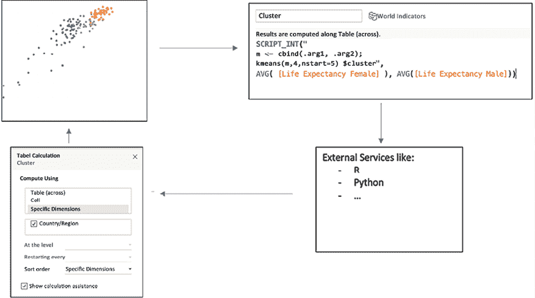
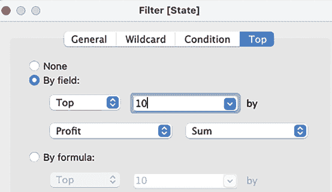
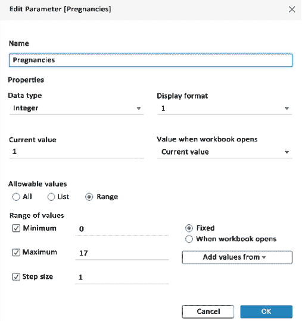

# 第十五章：集成编程语言

在经历了 14 章关于 Tableau 功能和练习的学习之后，我们还缺少什么？没错，那个能开启全新机会的大功能：编程集成！如果你需要的功能是 Tableau 计算字段本身没有覆盖的，而且你知道如何编写代码，你可以依赖编程集成。具体来说，支持两种语言：R 和 Python。

想象以下场景：你处理的是一个金融数据集，并且希望在 Tableau 仪表板上添加一个期权定价公式。你查找公式时，发现自己有所有必需的变量，比如行使价格、股票价格和波动率，但你还需要一个概率密度函数，而这个在 Tableau 中找不到。在这种情况下，你可以利用编程集成，在 R 或 Python 中运行计算并返回输出——是不是很棒？现在再想象第二个场景：你正在做一个情感分析项目。你可以在 Tableau 之外的 Python 中计算情感分析，然后将输出作为模型的输入，但如果你能在 Tableau 中完成这一切岂不更好？当然可以，使用编程工具集成就能实现这一点。

在本章中，我们将涵盖以下内容：

+   集成编程语言

+   R 安装与集成

+   实现 R 功能

+   Python 安装与集成

+   实现 Python 功能

# 集成编程语言

集成如何增强 Tableau 功能？这是通过计算字段实现的。Tableau 动态地与 Rserve 或 TabPy 接口，传递值并接收结果。而 Tableau Prep Builder 也有 R 和 Python 集成功能，正如我们在*第三章*《使用 Tableau Prep Builder》中看到的那样！所以，让我们不浪费时间，直接开始吧。

基本的 Tableau 与 R 及 Tableau 与 Python 集成非常简单：视图通过计算字段显示数据，借助这些计算字段，Tableau 将数据分别推送到 Rserve 或 TabPy，然后通过表格计算获取结果：



图 15.1：Tableau 外部服务

无论是在 Tableau Desktop 上查看工作簿，还是通过 Tableau Server，若你希望运行 R 和 Python 计算，必须确保 Rserve 或 TabPy 可访问。

为了更好地理解集成过程，我们也来看一下 Tableau/R 工作流的示例。以下图中的术语，可能是你不熟悉的，会在本章中逐步解释：


图 15.2：Tableau/R 工作流

上面的截图同样适用于 Python。我们先从 R 开始，因为它是第一个可用的集成方式。

# R 安装与集成

为了充分理解 Tableau 与 R 如何协同工作，重要的是要掌握宏观的概念。为了便于理解，我们将在本节中概述一些高层次的概念和信息，然后再深入计算字段和 R 脚本的细节。

安装 R 通常不难，但它不仅仅是双击可执行文件那么简单。要成功将 Tableau 与 R 连接，您需要确保权限设置正确，并且各种组件——一些是必需的，一些只是附加的——都已正确实现。我们将涵盖基础内容，回顾一些安装过程中常见的挑战，并提供故障排除指南。

执行以下步骤来安装 R：

1.  访问 [`www.r-project.org/`](http://www.r-project.org/) 下载 R，点击 **download R** 超链接，并选择一个 CRAN 镜像。请注意，R 在 Linux 或 Unix 环境下表现最佳；然而，为了学习 R 并开始使用 Tableau/R 功能完成本章的练习，安装 Windows 版本就足够了。

1.  通过双击下载的可执行文件安装 R。

1.  打开 R。

安装 R 时可能会遇到各种问题。例如，您可能会因为 R 工作目录的权限不足而遇到问题。当尝试安装 R 包时，这个问题可能会首先显现。为了解决这个问题，您可以使用 `getwd()` 函数确定 R 的工作目录。接下来，可以通过 `setwd()` 更改工作目录，或者在操作系统层面——无论您更倾向于哪个方法——为工作目录设置适当的读取和执行权限。

问题还可能由于安全系统和端口配置问题而出现。默认情况下，Tableau 将通过端口 `6311` 连接到 Rserve。或者，您可以在 Tableau 中指定不同的端口来连接 R。

[`www.r-project.org/`](http://www.r-project.org/) 上的文档提供了有关解决各种安装问题的详细信息。

虽然不是必须的，但 RStudio Desktop 提供的用户界面比默认安装的 R GUI 更好。RStudio 包含一个控制台，提供智能代码补全（即 IntelliSense）、一个工作区浏览器，可以方便地访问文件、包和帮助文档，一个数据查看器等等，所有这些都在一个统一的环境中：


图 15.3：RStudio

RStudio 的开源版本适用于许多使用场景。您可以通过 [`posit.co/download/rstudio-desktop/`](https://posit.co/download/rstudio-desktop/) 下载该应用程序。只需根据个人喜好选择 Desktop 版或 R GUI 版。

打开 R：


图 15.4：R GUI

要与 Tableau 建立连接，您需要启动 Rserve。技术上，Rserve 是一个独立的包；然而，它默认与 R 一起安装：

+   为确保安装了 Rserve 包，在 R 中输入以下命令：

    ```py
    rownames(installed.packages()) 
    ```

+   应该列出几个包，包括 RServe。如果由于某种原因 Rserve 包没有随您的 R 实例一起安装，您可以通过以下命令进行安装：

    ```py
    install.packages("Rserve") 
    ```

+   要启动`Rserve`，请输入`library(Rserve); Rserve()`。

分号（`;`）表示 R 中一行新代码的开始：


图 15.5：Rserve 初始化

现在你已经成功安装了 R 并启动了 Rserve，接下来可以将 Tableau 连接到 R。在 Tableau 中，选择**帮助** | **设置与性能** | **管理分析扩展连接…**：


图 15.6：分析扩展

**管理分析扩展连接**屏幕将会打开；选择**RServe**。以下截图中的默认设置适用于大多数本地安装：


图 15.7：分析扩展连接

尽管将 Tableau 与 R 集成并不需要与 R 界面进行任何交互，但你可能希望在将代码嵌入 Tableau 之前，在 GUI（如 R GUI 或 RStudio）中试用你的 R 代码。这将使你能够利用 R 语言相关的有用附加功能，如帮助、示例和为 R 量身定制的示例数据集。请注意，Tableau 中的计算字段编辑器仅作为 R 代码的传递工具，并不提供任何支持。

# 实现 R 功能

既然我们已经成功将 Tableau 与 R 连接，接下来让我们在 Tableau 中编写一些代码来调用 R。在 Tableau 中，打开**计算字段编辑器**。注意以`SCRIPT_`开头的函数类，如以下截图所示：


图 15.8：SCRIPT_ 函数

`SCRIPT_`函数由 Tableau 用于调用 R。函数名表示返回结果的数据类型；`SCRIPT_REAL`返回浮动值，`SCRIPT_BOOL`返回真或假值，依此类推。

`SCRIPT_`函数的语法在下图中表示：


图 15.9：R 脚本语法

上面的示例代码计算了平均利润，但我们将在接下来的章节中探讨更多示例。首先，通过使用 R 集成功能再现 Tableau 功能，从而证明 R 工作正常。

## 在 R 中再现原生 Tableau 功能

在我们的第一个练习中，我们将使用 Tableau 中的`AVG`、`MEDIAN`和`STDEV`函数，并将结果与 R 中的`mean`、`median`和`sd`函数进行比较。这将帮助你练习`SCRIPT_`函数，开始理解 R 语法，并比较 Tableau 生成的结果与 R 生成的结果。

执行以下步骤：

1.  访问[`public.tableau.com/profile/marleen.meier/`](https://public.tableau.com/profile/marleen.meier/)来定位并下载与本章相关的工作簿。

1.  导航到`median | mean | sd`工作表。

1.  选择`Superstore`数据源。

1.  创建以下 Tableau 中心的计算：

    +   `Tab Avg`: `WINDOW_AVG(SUM(Sales))`

    +   `Tab Median`: `WINDOW_MEDIAN(SUM(Sales))`

    +   `Tab Stdev`: `WINDOW_STDEV(SUM(Sales))`

1.  将 **Region** 维度放到 **行**架上，并将 **Sales** 放到 **文本**架上。

1.  双击 **Tab Avg**、**Tab Median** 和 **Tab Stdev**。它们将出现在 **度量值**架上：


图 15.10：测试 R

1.  确保 R 已按照 *R 安装与集成* 部分的说明安装、连接并运行。

1.  如果你还没有安装 `Rserve` 包，可以在 R 界面中输入 `install.packages("Rserve")` 来安装 `Rserve` 包。

1.  接下来，在 R 界面中输入 `library(Rserve); Rserve()`。你可能会看到以下错误：

    ```py
    Fatal error: you must specify '--save', '--no-save' or '--vanilla' 
    ```

    在这种情况下，输入 `Rserve(args = "--no-save")`。R 要求你在会话结束时选择保存、不保存或其他组合（默认）。我个人偏好选择不保存，但其他两种选项也可以。

1.  按照 *R 安装与集成* 部分的说明，将 R 连接到 Tableau。完成此操作后，返回 Tableau 并点击 **测试连接** 按钮，检查是否连接成功：


图 15.11：测试 R 连接

1.  点击 **确定** 关闭窗口。

1.  在 Tableau 中创建以下以 R 为中心的计算。注意，R 函数（如 `mean`）区分大小写：

    +   `R` `-` `mean`：`SCRIPT_INT("mean(.arg1)", SUM(Sales))`

    +   `R` `-` `median`：`SCRIPT_REAL ("median(.arg1)", SUM(Sales))`

    +   `R` `-` `sd`：`SCRIPT_INT("sd(.arg1)", SUM(Sales))`

1.  将每个 R 计算字段放到 **度量值**架上，并将它们排列在一起，使得相同类型的计算并排，但 Tableau 和 R 计算交替出现；例如，**Tab Avg** 然后是 **R – mean**，接着是 **Tab Median**，再是 **R – median**，依此类推。由于 `SCRIPT_` 函数被分类为表格计算（稍后会详细讲解），确保每个 R 计算字段和 Tableau 计算字段都使用 **Compute Using** 设置为 **Table (Down)**：


图 15.12：Tableau 与 R 输出对比

1.  注意，Tableau 和 R 函数显示的结果是相同的。

注意，`INT` 在中位数计算中已被替换为 `REAL`，这表明，正如名称所示，`SCRIPT_REAL` 使用浮动值，而 `SCRIPT_INT` 使用整数。以中位数为例，`SCRIPT_INT` 函数会导致四舍五入的差异——试试看，自己验证一下！

这是我们第一次进行 R 集成练习——很简单吧？这次练习的主要目的是向你展示 R 计算的工作原理，因此我们比较了三种相同的计算，每种计算都由 Tableau 和 R 计算。换句话说，就是复制 Tableau 的功能以验证 R 集成是否按预期工作。下一次练习将是我们不能通过 Tableau 内建功能完成的（截至撰写本文时）。我们将进行一个涉及两个以上变量的回归分析。

## 使用 R 进行回归计算

简而言之，回归分析是一种估算变量关系的技术。回归分析有几种类型，其中最常用的是线性回归。如以下截图所示，线性回归估算出最适合数据的线，并且是 Tableau 中的内置功能。

您只需要在**Rows**和**Columns**上放置两个度量，并且还需要一个维度来划分视图中的点。然后，转到**Analysis**并将**Trend Line**拖到屏幕上，选择**Linear**：


图 15.13：散点图

请注意，这张截图来自 Tableau。您可以通过点击与本章相关的工作簿中的**Scatterplot**工作表来访问它。这是一个简单的散点图，已启用趋势线。在 Tableau 中，趋势线默认为线性，但也包括对数、指数和多项式选项，这些都是回归分析的示例。通过在使用趋势线的可视化中访问**Worksheet** | **Export** | **Data**，您可以生成一个带有预测值和残差的**Access**数据库。但是这是一个繁琐的过程，不能为更强大的线性回归应用提供一个稳健的动态解决方案。使用 R 语言可以提供更多的灵活性。

线性回归可以使用单个或多个变量。单变量方程适合学习，但在实际应用中通常需要多变量方程。以下练习包含了多变量方程。我们本次练习的目标是确定线性回归模型如何拟合`COUNT(Quantity)`、`SUM(Sales)`和`AVG(Discount)`这几个变量：

1.  转到`Regression`工作表。

1.  选择`Superstore`数据源。

1.  通过将**Profit**放置在**Columns**架上，将**State**放置在**Rows**架上，并通过将**State**放置在**Filters**架上来过滤**Profit**的**Top 10**，构建基本布局：



图 15.14：筛选前 10 名

1.  创建一个名为`Profit_Expected`的计算字段，使用以下代码：

    ```py
    SCRIPT_REAL(" 
    x <- lm(.arg1 ~ .arg2 + .arg3 + .arg4) 
    x$fitted",
    SUM(Profit), COUNT(Quantity), SUM(Sales), AVG(Discount)
    ) 
    ```

    该功能的详细信息将在稍后解释。

1.  创建一个名为`% Diff`的计算字段，用于计算`SUM`(`Profit`)和`Profit_Expected`之间的百分比差异：

    ```py
    SUM(Profit)/Profit_Expected - 1 
    ```

1.  创建一个名为`Profit_Expected (residuals)`的计算字段，返回`SUM`(`Profit`)和`Profit_Expected`之间的美元差异：

    ```py
    SCRIPT_REAL(" 
    x <- lm(.arg1 ~ .arg2 + .arg3 + .arg4) 
    x$residuals", 
    SUM(Profit),COUNT(Quantity), SUM(Sales), AVG(Discount)) 
    ```

1.  将**Profit_Expected**放置在**Columns**架上，紧挨着**Profit**。然后，点击任意一个并启用**双轴**。

1.  右键单击一个轴并选择**同步轴**。

1.  在**Marks**卡片的**SUM(Profit)**部分，将`% Diff`移到**Color**架上。选择**红黑渐变**色板，并将**Stepped Color**的**Steps**设置为`2`。这样，所有正值将显示为黑色，所有负值将显示为红色。确保选择**Bar**作为视图类型。


图 15.15：颜色编码

1.  从菜单中选择 **Analysis** | **Stack Marks** | **Off**。

1.  在 **Marks** 卡片上的 **Profit_Expected** 部分，将 **Profit_Expected (residuals)**、**% Diff** 和 **Profit_Expected** 移动到 **Label** 货架上。确保选择 **Gantt Bar** 作为视图类型。

1.  仔细检查所有的表格计算（由三角形符号表示：**Profit_Expected (residuals)**、**% Diff** 和 **Profit_Expected**）是否使用 **State** 进行计算：


图 15.16：计算使用

1.  点击 **Label**，然后在 **Text** 部分的三个点上点击并编辑标签，按照自己的喜好调整：


图 15.17：预期利润

根据需要调整 **Bar** 和 **Gantt Bar** 的大小，并观察结果：


图 15.18：回归分析

*图 15.18* 中的可视化显示了实际利润、预期利润和两者之间差异的比较。这个计算在零售市场尤其有用，但在任何公司的财务规划中也同样重要。

现在我们已经完成了练习，让我们花一点时间考虑一下我们在这个练习中使用的一些代码：

| `SCRIPT_REAL` | 这个 Tableau 函数调用 R 引擎并返回一个浮动值。 |
| --- | --- |
| `"x <- lm(.arg1 ~ .arg2 +.arg3+.arg4); x$residuals"` | 这是一个 R 表达式，包含一个变量、一个函数和一个参数，然后返回预测值。 |
| `x <-` | 这是一个变量，用于后续 R 函数的填充。 |
| `lm(.arg1 ~ .arg2 + .arg3 +.arg4)` | 这个 R 函数用于拟合线性模型。它可以根据参数提供的变量返回回归分析。括号中的内容被称为参数，用于拟合模型。具体而言，响应值在波浪符号（`~`）的左侧，模型在右侧。因此，这是一个多变量线性回归，其中 `.arg1 =` `SUM(Profit)`、`.arg2 = COUNT(Quantity)`、`.arg3 = SUM(Sales)` 和 `.arg4 = AVG(Discount)`。用英文描述，参数可以读作 `SUM(Profit)`，它被建模为 `COUNT(Quantity)`、`SUM(Sales)` 和 `AVG(Discount)` 的组合项。 |
| `x$fitted` | `lm` 函数返回许多值作为其模型对象的一部分，包括系数、残差、秩和拟合值。`x$fitted` 引用的是作为传递数据到模型结果的拟合值。 |
| `", SUM(Profit), COUNT(Quantity), SUM(Sales) , AVG(Discount))` | 这些是用于填充 `.arg#` 变量的参数。请注意，双引号（`"`) 表示传递给 R 的代码的结束，而逗号（`,`）表示 Tableau 函数的第二部分，也就是表达式。 |

成功实现回归之后，我们将探讨一种不同的统计方法，通常用于区分数据集中的子集，称为聚类。

## 使用 R 在 Tableau 中进行聚类

聚类用于从较大的数据集中选择具有相似特征的成员组成的小子集。例如，考虑一个市场营销场景。你有一个庞大的客户群，计划向他们发送广告材料；然而，成本限制使你无法向每个客户发送材料。对数据集进行聚类将返回具有相似特征的客户组。然后，你可以调查这些结果并选择一个目标群体。

主要的聚类方法包括层次聚类和 *k*-均值聚类。层次聚类更为彻底，因此时间消耗也更多。它生成一系列模型，从 *1*（包含所有数据点）到 *n*（每个数据点是一个独立模型）。*k*-均值聚类是一种更快的方法，用户或其他函数定义聚类的数量。例如，用户可以选择从包含一千个成员的数据集中创建四个聚类。

Tableau 包含聚类功能。你可以在 **分析** 标签下找到此功能。Tableau 中的聚类实现基于四个支柱：

+   严谨的方法论

+   可重复的结果

+   快速处理时间

+   易于使用

一定要查看更多细节（[`help.tableau.com/current/pro/desktop/en-us/clustering.htm`](https://help.tableau.com/current/pro/desktop/en-us/clustering.htm)）以及随附解决方案工作簿中的 **聚类（Tableau 原生）** 标签。

Tableau 开发团队有多种方式可以处理聚类。例如，R 提供了许多不同的聚类包，采用不同的方法。Tableau 作者可能有充分的理由选择这些不同的方法。例如，使用 Tableau 原生聚类功能时，聚类结果始终相同。但并不一定非得如此。通过使用 R 进行聚类，底层数据和视图可能保持不变，但每次刷新时聚类结果可能不同，因为该函数会在看到整个数据集之前停留在最佳结果（局部最小值）处。使用所谓的局部最小值与全局最小值之间的性能权衡已经被证明是值得的。但根据数字的顺序，局部最小值每次运行函数时可能会有所不同。如果你正在寻找标记可能在不同聚类之间切换的边缘情况，这可能对你有利。以下示例探讨了这种情况。

本次练习的目标是基于出生率和婴儿死亡率将世界各国分为四个聚类：

1.  导航到 `Cluster (R)` 工作表。

1.  选择 `World Indicators` 数据源（此数据集随 Tableau 一起提供，可以在 **已保存的数据源** 下找到）。

1.  通过将 **婴儿死亡率** 放置在 **列** 区域，**出生率** 放置在 **行** 区域，**国家/地区** 放置在 **详细信息** 区域来构建初始视图。

    右键点击每个轴并选择**Logarithmic**，取消选中**Include Zero**。这将使数据点更加均匀地分布，并有助于使可视化效果更加美观且易于阅读：

    

    图 15.19：聚类

1.  创建一个名为`Cluster`的计算字段，代码如下：

    ```py
    SCRIPT_INT("
    m <- cbind(.arg1, .arg2); 
    kmeans(m,4,nstart=5)$cluster",
    AVG( [Life Expectancy Female] ), AVG([Life Expectancy Male])) 
    ```

    这段代码的详细解释将在本练习结束时进行。

    将你刚刚创建的**Cluster**字段拖动到**Detail**和**Color**架上。请注意，Rserve 引擎会抛出一个错误：

    

    图 15.20：错误处理

    这是因为底层数据集中存在空值。例如，数据中没有*Puerto Rico*的**Infant Mortality Rate**。

    如果你在其他度量中遇到此错误，解决方案是相同的。

    为了纠正错误，将**Infant Mortality Rate**字段拖动到**Filters**架上。在**Filter**对话框中，选择如下值以去除所有小于`0.01`的值：

    

    图 15.21：过滤器

1.  确保将**Cluster**设置为**Discrete**并将**Compute Using** | **Country/Region**设置为避免另一个错误：*error in k-means (m, 4, nstart = 5): more cluster centers than distinct data points*。

1.  结果视图应如下图所示：


图 15.22：聚类

1.  按下*F5*并观察每次刷新时聚类的变化。

现在我们已经完成了练习，花点时间回顾一下我们看到的一些代码：

| `SCRIPT_REAL` | 这个 Tableau 函数调用 R 引擎并返回一个浮动值。 |
| --- | --- |
| `"m <- cbind(.arg1, .arg2); kmeans(m,4,nstart=1)$cluster"` | 这是包含一个变量、一个函数和一个参数的 R 表达式，然后返回聚类结果。 |
| `m <-` | 这是一个变量，后续的 R 函数将填充该变量。 |
| `cbind` | 这个 R 函数将以下`.arg#`变量合并为列。 |
| `(.arg1, .arg2)` | 括号中的变量被称为参数。每个变量包含向量信息。具体来说，`.arg1 = AVG( [Infant Mortality Rate] )`和`.arg2 = AVG([Birth Rate])`。 |
| `kmeans(m,4,nstart=1)$cluster"` | `kmeans`声明了聚类方法。`m`包含由`cbind`参数创建的向量。`4`是指定的聚类数量。`nstart`声明了随机集的数量。 |
| `", AVG( [Infant Mortality Rate] ), AVG([Birth Rate]))` | 这些是用于填充`.arg#`变量的参数。请注意，双引号（`"`）标志着传递给 R 的代码的结束，而逗号（`,`）标志着 Tableau 函数的第二部分，即表达式。 |

我们达成了什么目标？我们成功地根据寿命预期将数据集中的国家分为四个子组。我们在散点图中展示了基于两个度量：婴儿死亡率和出生率的聚类结果。通过这种方式，我们可以间接地同时分析四个度量，在本例中为**婴儿死亡率**、**出生率**、**国家/地区**和**寿命预期**。R 的聚类基于*k*-均值方法，这与 Tableau 默认的聚类方法不同，可以调整为在 R 中执行的任何方法。

接下来，我们将探索分位数的世界。

## 引入分位数

分位数通常被认为与四分位数同义，但它们并不相同。分位数是将一组值均匀分割的集合。四分位数是分位数的一种类型—比如五分位数、三分位数和十分位数也是如此。为了理解分位数如何均匀地划分值的分布，想象一下将一组数据乘以 1/4、2/4、3/4、4/4，你就得到了 4 个四分位数。为了得到五分位数，你将数据乘以 1/5、2/5、3/5、4/5、5/5，以此类推。

Tableau 允许你通过右键点击一个坐标轴并选择**添加参考线** | **分布** | **计算** | **分位数**来查看分位数：


图 15.23：三分位数

但是你也可以将分位数的数量改为 4、5 或其他任何数字，以创建四分位数、五分位数等。通过这种方式访问的分位数功能相当有限。主要是因为参考线不会生成可以放置到架上的度量。这限制了可视化选项。通过 R 生成分位数可以大大扩展这些选项。

本次练习的目标是通过 R 创建*n*个分位数，按销售额查看客户分布。我们将通过创建限制数据集成员数的参数来进一步扩展练习，限制在给定的百分位数范围内。最后，我们将通过添加抖动来微调可视化效果。

让我们来看一下接下来的步骤：

1.  转到`Quantiles`工作表。

1.  选择`Superstore`数据源。

1.  将视图类型更改为**形状**，在**标记**卡片上。

1.  将**销售额**拖动到**行**架上，将**客户姓名**拖动到**详细信息**架上，将**地区**拖动到**颜色**架上：


图 15.24：分位数

1.  创建并显示一个名为`Number of quantiles`的参数，设置如下：


图 15.25：分位数参数

1.  右键点击已创建的参数并选择**显示参数**。

1.  创建一个名为`Quantiles`的计算字段，并使用以下代码：

    ```py
    SCRIPT_REAL("
    x <- .arg1;
    y <- .arg2[1];
    m <- c(1:y)/y;
    n <- length(x);
    z <- c(1:n); for (i in c(1:n)) z[i] <- 0;
    for (j in c(1:y)) for (i in c(1:n)) z[i] <- if (x[i] <= quantile(x,m)[j] && z[i] == 0 ) j else z[i];
    z;"
    , SUM(Sales), [Number of quantiles]) 
    ```

    这段代码的详细解释将在本练习结束时给出。

1.  右键点击新创建的计算字段`Quantiles`并选择**转换为离散**。

1.  创建并显示两个参数，**选择百分位数下限范围**和**选择百分位数上限范围**。对这两个参数使用以下设置：


图 15.26：百分位数参数

1.  右键点击新创建的两个参数，并选择**显示参数**。

1.  创建一个名为`Percentile`的计算字段，使用以下代码：

    ```py
    RANK_PERCENTILE(SUM([Sales])) < [Select Percentile Top Range] 
    AND
    RANK_PERCENTILE(SUM([Sales])) > [Select Percentile Bottom Range] 
    ```

1.  将**分位数**拖到**列**架上，并将**计算方式**设置为**客户名称**。

1.  将**百分位数**拖到**过滤器**架上，点击**确定**，然后将**计算方式**设置为**客户名称**。再次打开过滤器并选择**True**值。

    那么，回顾一下我们到目前为止做的工作。我们绘制了每个地区的销售值，然后添加了一个 R 脚本，将销售点云分成分位数。我们还创建了一个参数，让我们可以选择在视图中显示多少个分位数，因为我们了解到，分位数不一定非得是四分位数，它们也可以是三分位数、五分位数，甚至更多。

    接下来我们将看到这个视图的实际效果，并且我们会加入抖动效果。

1.  你可能希望添加以下这些额外的步骤来进一步增强可视化效果。为了使用抖动效果，创建一个索引计算字段`Index()`，并将该字段放置到**列**架上。将**计算方式**设置为**客户名称**。确保取消选择**显示标题**，以免**索引**显示在视图中。

1.  右键点击每个坐标轴并选择**对数**，然后取消选择**包含零**。你应该会在屏幕上看到如下效果：


图 15.27：分位数仪表板

在前面的图中，我们可以看到我们决定显示四个分位数（利用**分位数数量**参数），因此这些被称为四分位数。通过将`Index()`函数添加到列上，我们能够将这些分位数划分为四个部分。从这个仪表板得出的一个结论是，在这四个分位数中，西部地区的销售额最高，而南部地区的销售额最低。然而，中央和南部地区在第三分位数中非常接近。基于这些信息，我们可以进一步分析这些地区发生了什么，以及为什么中央地区的销售额在这一分位数中相比其他地区有所下降。

现在我们已经完成了练习，先花一点时间回顾一下我们在这个练习中看到的一些代码：

| `SCRIPT_REAL` | 这个 Tableau 函数调用 R 引擎并返回一个浮动值。 |
| --- | --- |
| `x <- .arg1;` | `x` 是我们将要创建分位数的变量。这里的变量是`[销售]`。 |
| `y <- .arg2[1];` | 这个变量设置分位数的数量。`[1]` 强制设置为单一数字，而不是向量。 |
| `m <- c(1:y)/y;` | `m` 将概率均匀分布在`1:y`之间。 |
| `n <- length(x);` | 这设置了循环的大小。循环的相关内容将在下文讨论。 |
| `z <- c(1:n); for (i in c(1:n)) z[i] = 0;` | `z` 设置了初始响应向量，将所有元素初始化为 0。 |
| `for (j in c(1:y)) for (i in c(1:n)) z[i] = if (x[i] <= quantile(x,m)[j] && z[i] == 0 ) j else z[i];` | 对于每个分位数，我们遍历 `z` 向量，对于每个条目，我们测试 `x` 的值是否小于该分位数的上限。如果 `x` 已经被设置，我们就保持不变。否则，`z[i]` 就是该分位数（`j`）。 |

在本练习中，你看到通过使用 R，像聚类这样的 Tableau 默认功能可以得到扩展，这将为仪表板用户提供更多的自由，去回答在使用仪表板过程中出现的新问题，因为他们将能够例如修改参数并看到可视化的变化。现在我们已经了解了一些可能的 R 用例，是时候讨论一些值得关注的内容，即使用编程集成与 Tableau 结合时的性能挑战。

## 性能挑战

R 脚本是表计算。像所有表计算一样，这意味着你只能使用视图中存在的字段。另外，正确设置分区和定位也很重要，否则你可能会得到意外的结果。

在*引入分位数*部分中，你可能注意到，当使用 **分位数数量** 参数设置的分位数数量增多时，结果显示的时间会更长。这是因为 R 在 **分位数** 计算字段中对每个分位数运行一次循环。例如，如果 **分位数数量** 参数设置为 **1**，则循环仅运行一次。如果设置为 **2**，则运行两次，依此类推。经验法则是，R 代码每次只对每个分区执行一次。分区越多，性能就越慢。因此，在使用 R 代码时，尽可能减少分区的数量。

这部分是本章中的 R 代码。希望你喜欢这个部分，并且它能为你提供灵感，去构思出你自己的想法，扩展我们迄今为止分享的功能。接下来，我们将继续探讨另一种非常著名的编程语言：Python。幸运的是，Tableau 也与 Python 有集成层。

# Python 安装与集成

Python 是一种解释型编程语言，以其可读性著称。首次发布是在 1991 年，距今已有相当一段时间（比大多数人猜测的要久），由 Guido van Rossum 开发。TabPy 是一个外部服务，允许你将 Python 与 Tableau 连接——类似于 Rserve。通过使用 TabPy，你可以将 Tableau 仪表板中的字段解析到 Python 中，执行计算，并将结果作为新计算的字段发送回 Tableau。或者，你还可以在计算字段中调用你在 Python 中实现的函数。关于 TabPy 的更详细文章可以在此处找到：[`tableaumagic.com/tableau-and-python-an-introduction`](https://tableaumagic.com/tableau-and-python-an-introduction)。

安装 Python 通常不难，但它涉及的内容不止是双击一个可执行文件。为了成功将 Tableau 与 Python 连接，你可能需要安装一些库，并在命令行中执行一些指令。接下来的段落将引导你完成这个过程。

安装 Python 的最简单方法是执行以下步骤：

1.  下载 Anaconda 并选择 Python 3.10 版本：[`www.anaconda.com`](https://www.anaconda.com)。其他任何 Python 解释器也可以使用。

    要将 Python 和 Tableau 集成，需要一些额外的步骤：

1.  打开 Anaconda 中的 Jupyter Notebook 并输入：

    ```py
    !pip install tabpy 
    ```

    或者，在你的 Python 目录中，执行以下命令：

    ```py
    pip install tabpy 
    ```

1.  通过命令行或终端（Mac）导航到`TabPy`的安装目录，并在命令行或终端界面中输入`tabpy`：


图 15.28：启动 TabPy

1.  现在你已连接到`tabpy`服务器，该服务器必须在运行 Tableau 和 Python 时保持打开状态。

1.  如果你遇到 TabPy 的其他问题，例如版本不兼容，快速的 Google 搜索能帮你解决大部分问题。

1.  打开 Tableau，选择**帮助** | **设置和性能** | **管理分析扩展连接**，选择`localhost`作为**服务器**，并输入`9004`作为**端口**：


图 15.29：分析扩展连接

1.  正如你在前面的截图中看到的，如果你有任何安全问题或需要进行更大规模的企业推广，可以设置用户名、密码和 SSL。

1.  点击**测试连接**，你应该会看到以下弹出窗口：


图 15.30：测试分析扩展

关于如何使 TabPy 正常运行的完整文档，请访问 [`github.com/tableau/TabPy`](https://github.com/tableau/TabPy)。如果你不想或不能在你的计算机上安装 TabPy，Tableau 还提供了一个 Docker 容器，可以安装 TabPy 的最新版本。你可以在这里找到更多信息：[`hub.docker.com/r/emhemh/tabpy/`](https://hub.docker.com/r/emhemh/tabpy/)。

# 实现 Python 功能

就像 R 一样，TabPy 在 Tableau 中使用`SCRIPT_`函数。在接下来的部分中，我们将实践使用 TabPy，并查看多个使用案例。使用 TabPy 的 Tableau 计算与 R 非常相似。对于 TabPy，重要的是在计算字段中添加`return`语句，并注意参数是用下划线而非点表示的：


图 15.31：Python TabPy 语法

这将在接下来的练习中表现出来；我们将首先研究随机数生成器。

## 随机数和正态随机数

许多计算可以通过计算字段轻松访问，其他则通过表格计算访问——还有一些隐藏的函数。隐藏的原因是这些函数尚未（完全）得到支持或测试；因此，使用时需小心。例如，如果你尝试查找`Random`函数，你是无法找到的。但你仍然可以使用`Random()`函数，如下所示：


图 15.32：随机数

另一种选择是使用 TabPy 获取`Random`函数。我们将查看随机数以及具有变量`mu`和`sigma`的正态随机数。这将使我们能够从分布中抽取随机数，这是一种在统计学、定量建模等领域中常用的方法，用于模拟、再现或计算概率；`mu` 和 `sigma` 是定义分布的均值和标准差。

### 生成随机数

执行以下步骤，创建一个具有特定底层分布的随机变量点云，分布由均值和标准差定义：

1.  创建一个包含一个`Index`列和从 1 到 1,000 的行的 Excel 表格。这是为了拥有一个初始数据集，包含我们想用于随机数生成器的行数。

1.  保存文件并将 Tableau 连接到此 Excel 表格。你应该能看到一个名为**Index**的导入度量（就像你 Excel 文件中的标题一样）。

1.  按照*Python 安装与集成*的说明将 Tableau 连接到 Python。

1.  创建一个名为`Random`的计算字段，内容应如下所示：

    ```py
    SCRIPT_REAL("
    from numpy import random as rd 
    return rd.random(_arg1[0]).tolist()",
    SIZE()
    ) 
    ```

1.  将**Index**拖动到**行**，将**Random**拖动到**列**。

1.  在 **分析** 标签页中禁用**汇总度量**。


图 15.33：随机数可视化

在上面的截图中，你可以看到 1,000 个随机数据点。让我们考虑在本练习中用于生成此可视化的一些代码：

| `SCRIPT_REAL` | 这个 Tableau 函数调用 Python 引擎并返回一个浮动值。 |
| --- | --- |
| `"from numpy import random as rd` | 在这部分代码中，我们需要 Python 库`numpy`，并且从该库中需要`random`模块，我们将其以较短的名称`rd`加载。 |
| `return` | 此命令仅用于返回一个值。 |
| `rd.random(_arg1[0]).tolist()"` | 在这一步，我们调用之前导入的`rd`模块。从`rd`模块中，我们调用`random`函数。`_arg1[0]`是为了给定某个值来激活该函数。最后，我们通过添加`.tolist()`将所有检索到的值放入一个值的列表中。 |
| `SIZE()` | 这是将替代`_arg1`的值，`_arg1`是`random`函数所需的。我们使用`SIZE()`来满足这个需求，因为它将返回分区中的行数，足以从该函数中获取一个随机数。 |

我们得到正好 1,000 个数字，因为我们的初始 Excel 表格有 1,000 行。通过使用计算字段，你可以向数据框中添加列，但不能添加行。因此，我们需要一个数据源来提供数据架构。在下一部分中，我们将学习如何指定从正态分布中抽取的随机数。

### 随机正态

现在，让我们重现一个正态分布的随机变量。这种技术通常用于统计建模中来计算概率。随机正态值可以用来替代或补充你已经收集的观测值。一旦我们学会如何使用正态分布，你也可以扩展这个知识并在 Tableau 中创建其他分布：

1.  重用上一个练习中的工作簿。

1.  创建一个`Random Normal`计算字段：

    ```py
    SCRIPT_REAL("
    from numpy import random as rd 
    mu, sigma = 0, 1
    return (rd.normal(mu, sigma, _arg1[0])).tolist()
    ",
    SIZE()
    ) 
    ```

1.  将**Random Normal**放在**列**上，**Index**放在**行**上。

1.  在**分析**标签中禁用**聚合度量**。

1.  选择**标记**类型为**圆形**。你现在可以看到一个包含 1,000 个数据点的图表，这些数据点是正态分布的：


图 15.34：正态分布可视化

为了给用户更多的灵活性，你还可以向视图中添加与 Python 集成互动的参数。例如，创建以下两个参数：


图 15.35：sigma 和 mu 参数

然后，创建一个名为`Random Normal Param`的计算字段，如下所示：

```py
SCRIPT_REAL("
from numpy import random as rd 
mu, sigma = _arg2, _arg3
return (rd.normal(mu, sigma, _arg1[0])).tolist()
",
SIZE(), [mu], [sigma]
) 
```

向视图中添加参数控制，以便用户可以决定他们想要传递给 Python 的变量：


图 15.36：最终的正态分布工作表

与我们之前的正态分布可视化相比，你可以在前面的截图中看到，通过将 `mu` 参数改为 10，我们将均值改为 10，从而可以将整个点云向任何方向移动。通过在 Tableau 中使用随机数，你可以例如可视化一个蒙特卡罗模拟，这在许多现实生活中的应用中都非常有用，因为它能够模拟可能的概率结果，从而帮助相关方理解风险和不确定性的影响。

关于如何在 Tableau 中计算蒙特卡罗模拟的更多信息，请点击这里：[`jacksontwo.com/exploring-python-tableau`](https://jacksontwo.com/exploring-python-tableau)，此外，关于蒙特卡罗的更多内容可以在这里找到：[`www.ibm.com/topics/monte-carlo-simulation`](https://www.ibm.com/topics/monte-carlo-simulation)。

在继续之前，我们再次考虑一下本次练习中使用的一些关键代码行：

| `SCRIPT_REAL` | 这个 Tableau 函数调用 Python 引擎并返回一个浮动值。 |
| --- | --- |
| `"from numpy import random as rd` | 这一部分代码中，我们需要 Python 库 `numpy`，并从该库中导入 `random` 模块，我们将使用简短的名字 `rd` 来加载它。 |
| `mu, sigma = _arg2,_arg3` | 这一部分定义了我们将使用 `_arg2` 和 `_arg3` 来引用 `mu` 和 `sigma`。 |
| `return` | 这个命令只是为了返回一个值。 |
| `rd.normal(mu, sigma, _arg1[0])).tolist()` | 在这一步中，我们调用了之前导入的 `rd` 模块。从 `rd` 模块中，我们获取了 `random` 函数。`_arg1[0]` 是需要提供给函数以激活它的某个值。可选值为 `mu` 和 `sigma`，这次我们将使用这两个值。最后，通过添加 `.tolist()`，我们将获取到的所有值放入一个列表中。 |
| `SIZE(), [mu], [sigma]` | 这是替换 `_arg1`、`_arg2` 和 `_arg3` 的值。与之前一样，我们使用 `SIZE()` 来激活函数。可选值 `mu` 和 `sigma` 将指向我们之前创建的参数。 |

完成前两个与 TabPy 相关的练习后，我们学习了如何在 Tableau 中使用随机数。接下来，我们将随机数改为从正态分布中抽取的随机数，并向仪表板中添加参数，使得用户可以更改正态分布的`mu`和`sigma`。当然，你也可以将 TabPy 中的函数更改为其他分布。

下一个主题较为高级。我们将使用 TabPy 执行对 2003 到 2021 年报纸头条的情感分析。

## 计算情感分析

除了机器学习和人工智能，另一个日益被使用的术语是**自然语言处理**（**NLP**）。这是机器理解单词及其含义的过程。情感分析属于这一类别；该技术有不同的变种，其中之一是测量极性，即说话者是持有积极还是消极的意见。应用场景包括评论、推文、留言、情节、歌词等数据集。让我们来看看！

这个练习基于 Brit Cava 的想法，他使用了来自前 100 首歌曲歌词的 Makeover Monday 数据，尝试了 Tableau 与 Python 的集成。你可以在这里找到博客文章：[`www.tableau.com/about/blog/2016/12/using-python-sentiment-analysis-tableau-63606`](https://www.tableau.com/about/blog/2016/12/using-python-sentiment-analysis-tableau-63606)。让我们用这个包含一百万条新闻标题的澳大利亚广播公司数据集来再现它：[`www.kaggle.com/datasets/therohk/million-headlines`](https://www.kaggle.com/datasets/therohk/million-headlines)。

1.  在与该章节相关的工作簿中，导航到`Sentiment` `Analysis`标签页。

1.  连接到`Headlines`数据源。

1.  将 Tableau 连接到 Python。

1.  创建一个`Sentiment Score`计算字段。格式化内容，比如缩进文本，非常重要：

    ```py
    SCRIPT_REAL("
    from nltk.sentiment import SentimentIntensityAnalyzer 
    text = _arg1
    scores = []
    sid = SentimentIntensityAnalyzer() 
    for word in text:
        ss = sid.polarity_scores(word) 
    scores.append(ss['compound'])
    return scores "
    ,ATTR([headline_text])) 
    ```

1.  创建一个`Color Coding`计算字段：

    ```py
    IIF ([Sentiment Scores] >= 0, 'Positivity', 'Negativity') 
    ```

1.  将**publish_date**放置在**行**架上，并且将**MONTH(publish_date)**放置在同一架上。

1.  将**Sentiment Score**放置在**列**架上。

1.  将**Color Coding**添加到**颜色**架上，将**headline_text**添加到**详情**架上。最后，从**分析**窗格中拖动一条平均线到视图中（**每个单元格**）：


图 15.37：情感得分

根据需要限制数据，考虑到你电脑的性能。我展示的是 2019-2021 年的数据，仅选取了 1 月、2 月、11 月和 12 月，用于比较年初和年末之间的差异：


图 15.38：工作表

到目前为止，我们已经加载了数据集，并创建了一个 Python 计算，使用了一个预训练的情感分析器来判断标题是负面还是正面。在前面的图中，我们将所有内容结合在一起，你可以看到在 2021 年的每个月中，负面新闻占据主导地位，2 月最糟糕（平均得分为-10.45），而 12 月则是最正面的（平均得分为-0.14）。接下来，我们将继续检查新闻报道的最常见话题。

要了解在 ABC 新闻中最常讨论的主题，我们必须计算使用的单词。也许在 Tableau 中有方法可以通过将**headline_text**字段分割成每个单词、透视并计数，但这无疑是一个繁琐的过程。而且，市面上有足够的库可以去除像停用词这样的内容，并将单词还原为其核心形式，例如，horse = horses。因此，我们将部署另一个模型。请按照以下步骤进行：

1.  创建一个 `开始` 参数。这个参数稍后会帮助我们定义我们想要查询的时间段：


图 15.39：开始

1.  还需要创建一个 `结束` 参数：


图 15.40：结束

1.  在 Tableau 工作簿中新建一个名为 `most common words` 的标签页，显示两个参数。


图 15.41：工作表

1.  接下来，你需要在你选择的 Python IDE 中编写代码（例如，Jupyter Notebook）。现在，复制以下代码。解释将在本节末尾给出（不要忘了将这一行 `df = pd.read_csv('abcnews-date-text.csv')` 中的路径更改为你文件的准确位置）：

    ```py
    from tabpy.tabpy_tools.client import Client
    client = Client('http://localhost:9004/')
    def common_words(_arg1, _arg2):

        #load all required libraries
        import pandas as pd
        import nltk
        from nltk.corpus import stopwords
        from nltk.tokenize import word_tokenize
        from nltk.probability import FreqDist
        from nltk.sentiment import SentimentIntensityAnalyzer 
        df = pd.read_csv('abcnews-date-text.csv')
        df['publish_date'] = pd.to_datetime(df['publish_date'], format='%Y%m%d')

        #convert the Tableau input date to a readable format
        _arg1 = pd.to_datetime(_arg1, format='%Y-%m-%d')[0]
        _arg2 = pd.to_datetime(_arg2, format='%Y-%m-%d')[0]
        df = df.set_index('publish_date')
        #empty lists to be filled
        scores = []
        filtered_sentence = []

        # Select the rows between two dates
        in_range_df = df[df.index.isin(pd.date_range(_arg1, _arg2))]
        #loading english stop words
        stop_words = set(stopwords.words('english'))
        text = in_range_df['headline_text']
        #most used words
        for row in range(0, len(in_range_df)):
            text =  in_range_df['headline_text'][row]
            word_tokens = word_tokenize(text)
            for w in word_tokens:
                if w not in stop_words:
                    filtered_sentence.append(w)
        #calculate the frequency of each word
        fdist = FreqDist(filtered_sentence)
        #extract the N most common words
        most_common_words = fdist.most_common(3)
        return str(most_common_words)
    client.deploy('common_words', common_words,'Retrieves the most common words', override = True) 
    ```

    由于缩进尤为重要，下面是它应该如何显示的截图；你还可以看到，我指定了 `abcnews` 文件的位置为 ‘`/Users/marleenmeier/Downloads/abcnews-date-text.csv`’，因为我的文件就在这个位置：

    

    图 15.42：代码

1.  现在运行 Python 脚本。

1.  返回 Tableau 仪表板中的 most common words 标签页，创建以下计算字段 `common words`：

    ```py
    MODEL_EXTENSION_STR("common_words", "_arg1, _arg2", [Start], [End]) 
    ```

    你也可以像我们在前一个练习中那样使用 `SCRIPT_STR` 函数，但对于已部署的 TabPy 模型，Tableau 提供了更简便的 `MODEL_EXTENSION` 函数语法。

1.  将 **常见词** 拖到 **行** 里，查看你的第一个结果；在 2014 年 1 月至 2015 年 12 月期间，*new* 一词在 ABC 新闻的标题中出现了 4,909 次，*police* 出现了 4,307 次，*man* 出现了 4,171 次。你看到前 3 个词，因为代码中指定了这些，我们稍后会查看这个代码。不过，你可以将其更改为任何数字！

1.  调整 **开始** 和 **结束** 日期，看看会发生什么！这里有两个例子；还可以看到词频本身，2020 年排名第一的单词 (*coronavirus*，出现了 8,383 次) 的使用频率是 2014 至 2015 年间排名第一的单词 (*new*，出现了 4,909 次) 的两倍：


图 15.43：单词 II


图 15.44：单词 III

如果你想继续工作，可以将前 N 个作为模型输入参数，并且如果你只想查看某一特定情感的前 N 个，还可以加入情感评分。

在这个练习中，我们展示了 Tableau 可以分析文本数据的情感，这是我们以前没有见过的。为了实现这一点，我们需要将 Tableau 与 Python 连接，使用外部服务 TabPy 就可以做到。Python 可以使用如 `nltk.sentiment` 这样的库——我们在本例中使用的就是这个库。该包的详细描述可以在这里找到：[`www.nltk.org/api/nltk.sentiment.html`](https://www.nltk.org/api/nltk.sentiment.html)。还有许多其他情感分析的库，但 `nltk` 是用于演示和学习的常用库，大家可以尝试其他库！

让我们解密一些在这个练习中加入的新代码实例： |

| `SCRIPT_REAL` | 这个 Tableau 函数调用 Python 引擎并返回一个浮动值。 |
| --- | --- |
| `from nltk.sentiment import SentimentIntensityAnalyzer` | 在这一部分的代码中，我们需要使用 Python 库`nltk`，并从该库中导入`sentiment`模块，加载`SentimentIntensityAnalyzer`函数。 |
| `scores = []``text = _arg1``sid = SentimentIntensityAnalyzer()``ss = sid.polarity_scores(word)` | 这部分定义了我们的`_arg1`将被称为`text`，`scores`是一个空列表（稍后在代码中填充），`sid`表示`SentimentIntensityAnalyzer`函数，最后，`ss`是每个单词的分数参考。 |
| `scores.append(ss['compound'])` | 在这一步，我们将使用极性分数填充空的`scores`表格。 |
| `return scores` | 在这里，我们将返回现在已填充的`scores`表格作为输出传递给 Tableau。 |
| `ATTR([Dialog])` | 我们的`_arg1`被指定为 Tableau 工作簿中的字段`Dialog`。 |
| `from tabpy.tabpy_tools.client import Client``client = Client('http://localhost:9004/')` | 在这一部分的代码中，我们将 Tableau 连接到 Python 实例。 |
| `import pandas as pd``import nltk``from nltk.corpus import stopwords``from nltk.tokenize import word_tokenize``from nltk.probability import FreqDist``from nltk.sentiment import SentimentIntensityAnalyzer` | 这里我们加载了所有需要的库。 |
| `df = pd.read_csv('abcnews-date-text.csv')``df['publish_date'] = pd.to_datetime(df['publish_date'], format='%Y%m%d')` | 接下来，我们读取`abcnews`文件。 |
| `_arg1 = pd.to_datetime(_arg1, format='%Y-%m-%d')[0]``_arg2 = pd.to_datetime(_arg2, format='%Y-%m-%d')[0]``df = df.set_index('publish_date')` | 接着，我们必须将输入转换为我们的模型可以读取的格式。 |
| `scores = []``filtered_sentence = []` | 这部分是为了创建两个列表，我们将在`for`循环中填充它们。 |
| `in_range_df = df[df.index.isin(pd.date_range(_arg1, _arg2))]` | 现在我们将过滤数据，确保它位于我们的起始日期和结束日期之间。 |
| `stop_words = set(stopwords.words('english'))``text = in_range_df['headline_text']` | 幸运的是，英语停用词是现成的；我们在这一步加载它们。 |
| `for row in range(0, len(in_range_df)):``text = in_range_df['headline_text'][row]``word_tokens = word_tokenize(text)``for w in word_tokens:``if w not in stop_words: filtered_sentence.append(w)` | 在这一部分的代码中，我们将剩余的标题转换为令牌，这是计算频率所需的，最后，非停用词的单词将被存储在`filtered_sentence`列表中。 |
| `fdist = FreqDist(filtered_sentence)` | 利用我们在开始时加载的库，我们现在可以获取每个单词的频率。 |
| `most_common_words = fdist.most_common(3)``return str(most_common_words)` | 既然我们已经获得了频率，现在我们可以加载最常用的单词。 |
| `client.deploy('common_words', common_words,'Retrieves the most common words', override = True)` | 最后，我们将部署模型，这样就可以从 Tableau Desktop 中调用它。 |

我们现在已经看到了嵌入的 Python 代码；你可以创建一个计算字段，并使用数据集中的字段作为输入。但如果你想使用一个包含多行代码和多个变量的大型模型，或者是对模型进行预先训练呢？这会超出 TabPy 的能力吗？不会！因为除了嵌入的代码外，我们还可以在 Tableau 之外编写 Python 脚本。

## 使用 TabPy 部署模型

有时，你的脚本可能会太长，无法在计算字段中使用，或者你需要对一个不同的数据集或扩展的数据集进行预先训练，而不是你在 Tableau 中拥有的数据集。在这种情况下，我们可以以稍微不同的方式使用 TabPy。你可以在 Tableau 之外编写模型——使用 Python 并将其部署到 Tableau，从而可以在桌面端调用它。

在接下来的示例中，我们将构建一个推荐系统，该系统预测一个 Pima 女性在输入 7 个参数（年龄、BMI、怀孕次数、血压、血糖、胰岛素和皮肤厚度）时患糖尿病的可能性。该数据集来源于 *J.W. Smith, J.E. Everhart, W.C. Dickson, W.C. Knowler, 和 R.S. Johannes* 1988 年的研究，相关链接如下：[`www.ncbi.nlm.nih.gov/pmc/articles/PMC2245318/`](https://www.ncbi.nlm.nih.gov/pmc/articles/PMC2245318/)。

我们将从 Jupyter Notebook 或你喜欢的**集成开发环境**（**IDE**）中的代码开始。请按照以下步骤操作：

1.  我们通过导入 `tabpy` 客户端来开始代码，这是建立 Python-Tableau 连接所需的：

    ```py
    from tabpy.tabpy_tools.client import Client
    client = Client('http://localhost:9004/') 
    ```

1.  接下来，我们导入所有需要的库和数据。确保将数据集名称替换为文件位置的完整路径（例如，`H:/Documents/Diabetes.csv` 而不是 `Diabetes.csv`）：

    ```py
    import numpy as np
    import pandas as pd
    from sklearn import ensemble
    from sklearn.model_selection import train_test_split
    df = pd.read_csv("Diabetes.csv", sep = ',')
    df = df[['Pregnancies', 'Glucose', 'BloodPressure', 'SkinThickness', 'Insulin', 'BMI', 'Age', 'Outcome']] 
    ```

1.  现在，我们将数据集分成四个部分；两个测试数据集将帮助我们检查模型的准确性，另外两个训练数据集用于训练模型：

    ```py
    X_train, X_test, y_train, y_test = train_test_split(df.drop(['Outcome'], axis = 'columns'),df['Outcome'], test_size = 0.2) 
    ```

1.  如果你对这段代码背后的更多细节和数学原理感兴趣，请查看[`scikit-learn.org/stable/modules/generated/sklearn.ensemble.GradientBoostingClassifier.html`](https://scikit-learn.org/stable/modules/generated/sklearn.ensemble.GradientBoostingClassifier.html)。

1.  接下来，我们将从 `sklearn` 加载 `GradientBoosting` 模型并拟合我们的数据；然后，我们可以立即可视化分数，这可以解释为我们的模型正确预测的总百分比：

    ```py
    gb = ensemble.GradientBoostingClassifier()
    gb.fit(X_train, y_train)
    gbscore = gb.score(X_test, y_test)
    print('gradient boost: ' + str(round(gbscore*100,2))) 
    ```

1.  这是 Jupyter 中的完整代码：

    图 15.45：Python 脚本

    总结第一阶段，我们的模型在 72.08%的情况下正确预测了是否患有糖尿病。这是一个相当不错的结果。为了进一步改进它，我们可以增加更多数据（行数方面），扩展输入变量（列数方面），或者创建新的特征，比如变量之间的比率（通过这种方式可以突出隐藏的信息）。但目前，我们可以继续使用这个模型，因为最终我们希望预测一个人患糖尿病的概率。接下来让我们切换到 Tableau：

1.  本次练习我们不需要数据集，因为所有的数据都存储在 Jupyter Notebook 中。在 Tableau 中，您可以随机选择一个数据集，因为我们不会使用它。在一个新的 Tableau 工作表中，命名为`Diabetes`，创建以下七个参数：


图 15.46：年龄和血压参数


图 15.47：BMI 和胰岛素参数


图 15.48：皮肤厚度和血糖参数



图 15.49：怀孕次数参数

1.  创建所有七个参数后，选择它们并点击**显示参数**：


图 15.50：显示参数

1.  现在请返回 Jupyter 并执行最后两段缺失的代码，这些代码将创建一个调用我们模型的函数：

    ```py
    def diabetes_predictor(_arg1, _arg2, _arg3, _arg4, _arg5,_arg6,_arg7):
        import pandas as pd
        row = {'Pregnancies': _arg1, 'Glucose': _arg2, 'BloodPressure':
               _arg3, 'SkinThickness': _arg4, 'Insulin': _arg5, 'BMI':_arg6,
               'Age': _arg7}
        test_data = pd.DataFrame(data = row,index=[0])
        predprob_diabetes = gb.predict_proba(test_data)
        return [probability[1] for probability in predprob_diabetes] 
    ```

1.  最后，部署函数到 TabPy 的代码如下：

    ```py
    client.deploy('diabetes_predictor', diabetes_predictor,'Predicts the chances of a Pima female having diabetes', override = True) 
    ```

1.  在 Jupyter 中，这看起来如下：


图 15.51：部署函数

1.  要检查您的模型是否已经部署，请在浏览器中输入`https://localhost:9004/endpoints`。这将列出所有已部署到您机器上 TabPy 的模型：

    图 15.52：部署函数

    返回 Tableau 并再次检查与 TabPy 的连接是否仍然处于活动状态。

1.  创建一个名为`糖尿病预测器`的计算字段，如下所示：

    ```py
    SCRIPT_REAL("
    return tabpy.query('diabetes_predictor',_arg1,_arg2,_arg3,_arg4,_arg5,_arg6,
    _arg7)['response']",
    [Pregnancies], [Glucose], [BloodPressure], [SkinThickness], [Insulin], 
    [BMI],[Age]
    ) 
    ```

    这里可以看到，由于我们所有的编码都是在 Python 中完成的，我们只需要告诉 Tableau 返回一个名为`diabetes_predictor`的 TabPy 查询，然后将所有的 *n* 变量引用添加到函数所需的变量中，最后在末尾添加`['response']`。

    或者，由于部署在 TabPy 上的模型还支持`MODEL_EXTENSION_BOOL`、`MODEL_EXTENSION_INT`、`MODEL_EXTENSION_REAL`和`MODEL_EXTENSION_STR`函数，您也可以使用以下代码：

    ```py
    MODEL_EXTENSION_REAL("diabetes_predictor", "_arg1, _arg2, _arg3, _arg4, _arg5, _arg6, _arg7", 
    [Pregnancies], [Glucose], [BloodPressure], [SkinThickness], [Insulin], [BMI],[Age]
    ) 
    ```

    第二段代码较短且更直观，不过两者都可以正常工作！

1.  现在，将字段**糖尿病预测器**放到**文本**架构中，并观察结果：


图 15.53：交互式 TabPy 糖尿病工作表

通过左右滑动参数，你会看到糖尿病的可能性发生变化。计算字段通过 TabPy 将参数的数据发送到 Python，在那里你的数据会被拟合到模型中。结果会被发送回来，你可以看到它。当然，你可以围绕它构建一个完整的仪表板。可以在 Tableau 网站找到示例：[`www.tableau.com/about/blog/2017/1/building-advanced-analytics-applications-tabpy-64916`](https://www.tableau.com/about/blog/2017/1/building-advanced-analytics-applications-tabpy-64916)。

如果你想了解更多关于 Python 语言本身的信息，一个好的资源是：[`www.w3schools.com/python/default.asp`](https://www.w3schools.com/python/default.asp)。这个网页会一步步地引导你了解 Python 语法。但 Tableau 让这一切更加简单，因为一套函数已经为你写好。

## 预部署的 TabPy 函数

并非每个人都喜欢在 Tableau 之外进行编程，这也是 Tableau 推出一套广泛使用、预部署的函数供你开箱即用的原因。你仍然需要执行一行代码，仅此而已！但是在 Python 中你只需要做这些。可用的函数包括 ANOVA、T 检验、情感分析和 PCA，Tableau 也曾多次提到，可能会有更多的函数即将推出。你可以在这里找到文档：[`tableau.github.io/TabPy/docs/tabpy-tools.html`](https://tableau.github.io/TabPy/docs/tabpy-tools.html)。

但让我们一步步走过这些步骤：

1.  在你的 Jupyter Notebook 中，执行`tabpy-deploy-models`并查看是否安装了四个函数：


图 15.54：部署 TabPy 默认模型

1.  你可以通过在浏览器中输入`http://localhost:9004/endpoints`来进行二次确认，你应该能看到所有已部署的模型。

    就是这样；在 Tableau 中调用计算字段中的函数现在变得像下面这样简单（以调用`ttest`函数为例）：

    ```py
    tabpy.query('ttest', _arg1, _arg2)['response'] 
    ```

1.  我挑战你将 TabPy 默认部署模型的情感得分与我们创建的模型进行比较：它们有区别吗？如果有，区别在哪里？

从 Python 中，你可以直接连接到，例如：

+   DataRobot ([`www.tableau.com/solutions/datarobot`](https://www.tableau.com/solutions/datarobot))

+   Dataiku ([`www.dataiku.com/partners/tableau/`](https://www.dataiku.com/partners/tableau/))

+   MATLAB ([`www.mathworks.com/products/reference-architectures/tableau.html`](https://www.mathworks.com/products/reference-architectures/tableau.html))

这些都是付费的第三方工具，有助于简化您的数据分析工作。如果您能将 R 和 Python 连接到其他外部工具，还可以通过 Rserve 和 TabPy 分别将这些功能带回 Tableau。如果您对这种连接感兴趣，或者想刷新部署函数的相关内容，可以查看这个视频——[`youtu.be/0BN_Y2CxdYY`](https://youtu.be/0BN_Y2CxdYY)——在视频中，Tableau 前高级分析产品经理 Nathan Mannheimer 也解释了我们讨论的所有内容。

您在编程集成方面的个人目标是什么？如果您有很棒的想法，欢迎与 Tableau 社区分享。

## 提升您的 R 和 Python 技能

有些人可能会觉得使用代码很有压力，正在寻找一种更简单的学习方式，在使用 R 或 Python 之前先入门。在网站 [www.geeksforgeeks.org](http://www.geeksforgeeks.org) 上，您可以了解这两种语言，并在网站上进行编程练习，无需安装任何工具。

## 爱因斯坦发现

如果您是 Salesforce 用户并购买了 Einstein Discovery 许可证，您可以使用另一个现成的模型集。AI 驱动的模型随 Einstein Discovery 提供，并可以与 Tableau 工作流集成。您可以利用这个组合为您的 Salesforce 数据生成强大的洞察。例如，您可以根据 Salesforce 中的数据预测销售额，并将其直接加载到 Tableau 中，然后在您熟悉的 Tableau Server 实例上共享这些洞察，从而将所有仪表板集中在一个地方。由于 Salesforce 和 Tableau 都是 Salesforce 套件的一部分，我想提一下这一点；不过，它仍然是另一种需要额外许可证的软件，因此我决定不深入探讨其使用（事实上，凭借本章所学，您可以以零额外成本复制大部分功能）。如果您有兴趣深入了解，我建议您访问 tableau.com 上以下页面及子页面：[`www.tableau.com/products/einstein-discovery`](https://www.tableau.com/products/einstein-discovery)。

# 总结

本章仅仅触及了与 R 和 Python 相关选项的皮毛。完成本章后，您应该能够从 Tableau 连接到 Python 和 R，并识别和编写这两种编程语言在 Tableau 中的基本语法。最重要的是，您现在已经足够熟练，能够利用 R 和 Python 函数的强大功能，从简单的均值计算到回归分析，再到实现自己的机器学习模型。尽管我们讨论了安装、集成和工作流程，以及一些更常见的函数和使用案例，但还有很多内容值得探索。事实上，Tableau 的编程集成的可能性在商业智能领域依然是一个大多数人未曾涉足的领域。

数据可视化领域的勇者们正在不断推动边界，但仍有许多工作需要完成。对于那些希望提升职业发展的读者，掌握这两个工具包的专业知识将带来巨大的优势。而且，更多的内容即将推出！

在 2023 年的 Tableau 大会期间，公司传递了一个明确的信号，Tableau 将继续发展其高级分析和人工智能能力。新宣布的产品，如 Tableau GPT 和 Tableau Pulse，让我迫不及待地期待即将到来的惊艳功能。在这里查看你可以期待的内容摘要：[`www.tableau.com/blog/data-innovations-tableau-conference-2023`](https://www.tableau.com/blog/data-innovations-tableau-conference-2023)。

虽然下一章不幸是本书的最后一章，但我们仍有时间探索另一个热门话题。除了高级分析，数据治理是一个日益重要的领域。法规和不断增加的数据安全风险迫使公司更加重视结构良好的指导方针和质量检查。在*第十六章*，*开发数据治理实践*中，我们将向你介绍 Tableau 的另一面。

## 在 Discord 上了解更多

要加入本书的 Discord 社区——在这里你可以分享反馈、向作者提问，并了解新版本发布——请扫描下面的二维码：

[`packt.link/tableau`](https://packt.link/tableau)


