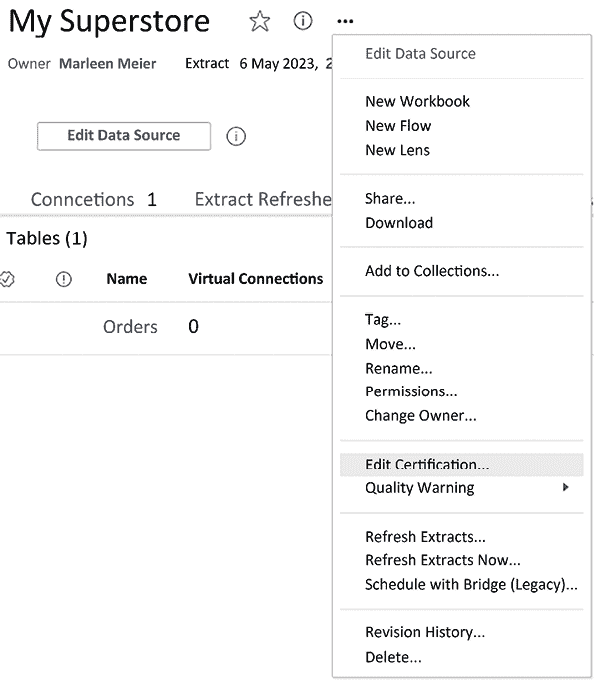
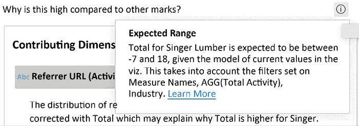
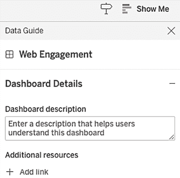

# 第十六章：开发数据治理实践

这一章节与其他章节略有不同。我们将不讨论在 Tableau 仪表板或 Tableau Server 中使用的某个功能，而是讨论与 Tableau 中数据治理相关的数据能力——谁可以访问哪些数据，谁查看了哪些仪表板及其频率，仪表板的数据组件是什么，数据的来源在哪里等等。

我们将讨论以下主题：

+   什么是数据治理？

+   数据治理原则

+   Tableau 中的数据治理

+   跟随示例

近年来，尤其是过去 20 年，数据治理的重要性日益增加，表明这一领域的成熟度不断提升。早期，数据治理通常是 IT 部门的单一任务，并且多局限于数据目录管理；而如今，数据治理已成为许多人共同承担的任务。随着公司存储的数据量增多，招聘的分析师增多，数据使用量增大，所需的规则和指南也越来越多。如今，企业因缺乏适当的数据治理而被罚款，巨大的数据安全漏洞和数据泄露事件越来越频繁地登上头条。因此，许多机构，如欧盟，已通过数据保护法律和法规，将数据治理作为其中的一个主要支柱。例如，欧盟的 GDPR 和加州的 CCPA。

即使你主要关心的是构建仪表板和分享数据洞察，数据保护依然是公司各部门共同的责任，未来也会愈发成为一项集体努力。理解政策和法规、了解如何使用数据治理工具并负责任地行动，对你来说也是必要的。因此，我将这一章专门献给数据治理以及 Tableau 在这一领域提供的所有内置功能。让我们开始吧！

# 什么是数据治理？

数据治理涉及根据法规和行业标准生成和实施与数据相关的政策。其主要目标是确保信息的有效性、可访问性和安全性。强化的数据治理可以改善数据分析，确保分析师可以放心依赖的数据来源可靠，已经过验证，并经过严格的数据质量评估等多项措施。

在 [www.tableau.com](http://www.tableau.com) 网站上，你可以找到一份白皮书，介绍了 Tableau 用户如何进行数据管理，包括数据治理：[`www.tableau.com/learn/whitepapers/tableau-data-management`](https://www.tableau.com/learn/whitepapers/tableau-data-management)。

如果你更喜欢视频形式，你可以通过以下链接查看演示：[`www.tableau.com/products/data-management#content-446367`](https://www.tableau.com/products/data-management#content-446367)。

白皮书和视频都讨论了这个设置：

![一张包含文字、截图、图表、计划的图片]

描述自动生成](img/B18435_16_01.png)

图 16.1：Tableau 数据管理

通常，数据治理包括确保数据质量、解决数据安全和隐私问题、制定数据政策和标准、指定数据管理员、遵守法规以及记录数据资产等关键方面。

**那么，为什么数据治理如此重要？** 强有力的数据治理能够提高数据质量，降低数据管理成本，并增强数据访问。它增强了数据合规性的可信度，从而促进更好的决策、提高运营效率并减少风险。Tableau 可以作为数据治理框架内数据可视化和分析的有价值工具，同时遵守经过验证的政策和指南。

# 数据治理原则

如果你计划从事数据治理工作，你应该知道数据治理原则通常是整个工作的核心。为了说明这一点，让我们以 GDPR（[`gdpr-info.eu/`](https://gdpr-info.eu/)）中列出的七个原则为例，探讨如何有效地利用 Tableau 来执行这些原则：

+   合法性、公平性和透明性

+   目的限制

+   数据最小化

+   准确性

+   存储限制

+   完整性和机密性

+   问责制

## 合法性、公平性和透明性

这要求为提供商品或服务而收集的个人信息必须合法且公平地获得，并且需告知个人其使用目的。此外，个人信息仅可在获得个人明确同意的情况下收集，并且必须保留该同意的记录。

## 目的限制

个人信息应仅为特定且合法的目的收集，除非获得明确同意，否则不得用于不同或不兼容的目的。

## 数据最小化

个人信息的处理应仅限于履行既定目的所必需的范围。

## 准确性

个人信息必须准确收集，并通过定期更新来维护，以减少对个人的风险，任何不准确的信息应及时纠正或删除。

## 存储限制

个人信息应仅在履行处理目的所需的时间内保留，除非出于科学、档案保存或公共利益的目的，否则可以存储更长时间。

## 完整性和机密性

GDPR 中的完整性要求保持准确和可靠的个人数据，同时机密性要求保护个人数据不被未经授权访问和披露，确保隐私权得到维护。

## 问责制

对于成功的数据治理方法，问责制至关重要，因为它提供了方向性和有效性；建立由所有部门代表组成的数据治理委员会，包括高层管理人员，是确保跨组织责任以及数据流程和政策的制定与执行的关键。接下来我们将了解 Tableau 如何帮助我们遵守这些原则。

# Tableau 中的数据治理

Tableau 提供了一系列功能和能力，帮助支持组织内的数据治理工作，作为一个配套工具，与数据治理原则保持一致。

以下许多功能仅在购买 Tableau Server 的数据管理附加组件时可用（[`www.tableau.com/products/data-management`](https://www.tableau.com/products/data-management)）。请在阅读本章节时注意这一点。

## 数据源连接

Tableau 的数据源连接使得组织能够通过连接到各种数据源来建立集中式数据治理，促进了一种可信且精心管理的数据管理方式。

数据源连接使得遵循 GDPR 中*完整性与机密性*原则变得更加容易，因为数据被安全存储，且可以控制访问。

## 数据访问控制

Tableau 使管理员能够管理用户对数据源和仪表板的访问，实施用户和群组权限，确保只有授权的个人才能访问和操作特定的数据资产。

数据访问控制使得遵循 GDPR 中**完整性与机密性**原则变得更加容易，因为可以集中管理访问，从而限制不当访问。

## 数据安全

Tableau 提供了如数据加密、**单点登录**（**SSO**）认证和与身份管理系统的集成等安全功能，通过执行政策和保护敏感信息来增强数据安全性。

数据安全使得遵循 GDPR 中**完整性与机密性**原则变得更加容易，因为安全漏洞及由此导致的非法访问敏感数据将受到限制。

## 元数据管理

Tableau 帮助创建和管理元数据，提供有价值的上下文信息，如数据定义、描述和来源细节。这一能力通过增强对数据资产的理解与控制，支持数据治理工作。

元数据管理使得遵循 GDPR 中**准确性**原则变得更加容易，因为元数据的变化可以轻松被检测到。

## 数据认证

Tableau 使用户能够认证并推广可信的数据源和仪表板，标志着数据已通过质量保证，可以依赖于此进行分析和决策。该认证过程确保用户可以访问到可靠且受管控的数据资产。

数据认证使得遵循 GDPR 中**准确性**原则变得更加容易，因为所有用户都可以信任经过认证的数据，这些数据会被监控其准确性和时效性。

## 版本控制

Tableau 提供版本控制功能，使组织能够追踪对仪表板和数据源所做的更改，促进数据治理，通过提供对修改的可见性并便于审计跟踪过程。

版本控制使得遵循 GDPR 中**合法性、公平性和透明性**原则变得更加容易，因为它具备审计跟踪功能。

## 监控与审计

Tableau 的监控和审计功能使管理员能够追踪用户活动、访问模式和数据使用情况，帮助识别潜在的合规问题，并确保遵守数据治理政策。

监控与审计使得遵循 GDPR 中**合法性、公平性和透明性**原则变得更加容易，因为它帮助我们遵守规则和法规。

## 协作与文档管理

Tableau 通过提供评论、注释和文档附件等功能，支持协作与文档管理，使用户能够直接在 Tableau 环境内记录和讨论数据资产、定义和治理相关信息。

协作与文档管理使得遵循 GDPR 中**问责制**原则变得更加容易，因为评论和注释是可见的，并且可以在用户之间共享。

虽然 Tableau 提供了数据治理功能，但对于组织来说，拥有一个全面的数据治理策略和框架是至关重要的，这一框架应超越 Tableau 平台。Tableau 的功能可以增强并与更广泛的数据治理计划保持一致，但它们应该纳入一个全面的治理计划中，以最大化效果。

# 跟随实例

在本章的最后部分，你可以亲自尝试一些数据治理功能；随时可以在你的 Tableau Server 版本中跟随操作。

## 认证数据源

认证数据源是指通过验证数据源的质量、准确性和合规性，将其指定为受信任且可靠的资产。这一认证过程建立了信任，确保数据质量，支持合规性，促进一致性，加强数据治理，提升决策制定，促进数据发现，并由组织内的数据治理团队或专家进行。

你可以通过以下步骤在 Tableau 中认证一个数据源：

1.  打开 Tableau Server。

1.  打开数据源。

1.  点击数据源名称旁的三个点。

1.  选择**编辑认证...**：

图 16.2：认证

1.  你现在可以输入一条消息，告知数据源用户认证的理由或类似内容。你输入的内容取决于公司内部达成的政策。点击**保存**。

图 16.3：认证消息

1.  在数据源所有者和日期旁边，您将看到一个指示，表明该数据源已认证：

图 16.4：已认证

认证的数据源有助于决策，使分析师和业务用户对所使用的数据更加自信，从而得出更精确的见解、做出更明智的决策并改善业务结果。

## 数据质量警告

数据质量警告是一些通知，突出显示数据集质量中潜在的问题或异常，这些问题可能由数据不完整或缺失、不一致、异常值、数据完整性问题、验证失败或过时信息引起。这些警告提示需要进一步调查和数据清理，以确保正确的分析和决策，强调了解决数据质量问题对获得可靠见解的重要性。

您可以按照以下步骤设置数据质量警告：

1.  打开 Tableau 服务器。

1.  打开数据源。

1.  点击**数据源名称旁边的三个点**。

1.  选择**质量警告**，然后选择**质量警告 …**或**提取刷新监控 …**。

1.  **数据质量警告**弹出窗口将如下所示：

图 16.5：数据质量警告

1.  在此，从下拉菜单中选择五个标签中的一个**选择标签**：

图 16.6：选择标签

1.  **提取刷新监控**弹出窗口看起来非常相似，不过没有下拉菜单：

图 16.7：提取刷新监控

1.  在这两种情况下，数据源概览页面上将显示**警告**指示器：

图 16.8：警告

1.  如果调度提取失败，您还可以检查**调度**概览页面：

图 16.9：调度

数据质量警告作为指示，表明数据可能需要在用于分析、报告或决策之前进行进一步调查或清理。它们有助于发现潜在的数据问题，这些问题可能会影响分析结果的准确性、可靠性和有效性。解决数据质量警告通常涉及数据清理、错误修正，并确保数据符合所需的质量标准。

需要注意的是，数据质量警告应当及时处理，因为它们可能会影响从数据中得出的见解的可靠性和有效性。解决数据质量问题并保持高质量的数据，对于做出明智的决策并从数据分析中得出准确结论至关重要。

## Tableau 血缘

数据血统很重要，因为它建立了对数据的信任，帮助数据质量管理和问题解决，促进影响分析，支持合规性检查，加强数据治理和管理实践，帮助故障排除和调试，并实现成功的数据和系统集成。数据血统提供了透明度、理解力和对数据流的控制，促进了数据治理和决策过程的改进。

要查看血统，你可以打开任何类型的概览页面、数据源、准备流程、工作表、工作簿等，在 Tableau Server 上查看**血统**标签：

图 16.10：Tableau 血统

右侧面板为你提供了与各自血统相关的所有详细信息。从这里，你可以点击任何一个给定的组件并被重定向到该组件。

图 16.11：详细的血统

从表格视图中，你甚至可以查看某一列的使用情况；首先，转到一个表格：

图 16.12：上游表格

然后，点击任何一个列。观察右侧面板显示该列**City**在**数据库**和**表格**中使用，但没有在其他地方使用：

图 16.13：列血统

总体而言，数据血统提供了对数据流的透明度、理解力和控制力。它支持数据质量管理、合规性工作和决策过程。通过记录数据的血统，组织可以改善其数据治理实践，提高数据可信度，并减轻与数据管理和分析相关的风险。

## 数据详情

Tableau 中的**数据详情**帮助你和你的用户理解已发布仪表板中的数据。要访问它，在任何给定的仪表板上，点击左上角的**数据详情**，并观察右侧弹出的详细信息：

图 16.14：Tableau 数据详情

几秒钟内，**数据详情**让你查看随时间变化的视图、数据源和使用中的字段。

## 数据指南

数据指南，如数据字典或数据参考指南，是一种文档资源，提供关于数据元素的结构、内容和含义的详细信息。它对于数据理解、一致性、集成、质量评估、治理、协作、培训和文档化都非常重要。数据指南增强了数据管理实践，促进了数据素养，并支持组织内有效的数据利用。

要探索数据指南，请在 Tableau 服务器上打开仪表板，并点击蓝色顶部栏右侧的**数据指南**按钮：

图 16.15：数据指南

通过选择视图中的一个标记，数据指南会自动填充有关数据点和使用的筛选器的详细信息，还会提供解释。你已经在本书前几章的**解释数据**中了解了这一功能，但数据指南使得标记的解释和探索变得前所未有的简单。

这里有一个清晰的示例，展示了 Tableau 如何弥合单一数据点与完整数据集平均值之间的差距：

图 16.16：说明

通过点击一个箭头，更多信息将显示出来：

图 16.17：文本说明

你甚至可以生成证明这个观点的图表：

图 16.18：贡献维度

数据指南还允许你为用户添加描述和资源：

图 16.19：描述

这是关于 Tableau 数据治理领域的最后一个示例。这是一个庞大的话题，远远超出了 Tableau 的范畴，因此我们只是在表面上探讨了 GDPR——众多数据法规之一、Tableau 中的数据治理功能，最后还介绍了一些实际应用。这个话题确实值得一本书来详细阐述，但我希望在此简要提及，并共同承担这一责任，因为即使是你作为一个 Tableau 开发人员，也有责任并可以为保护我们的数据做出贡献。希望这一章节能够给你提供足够的思考，让你在开发精彩的仪表板时更加关注数据治理。

现在，我们已经走到了书的最后部分，回顾我们的旅程，从将数据加载到 Tableau、创建第一个可视化图表、执行第一个函数开始。接下来，我们通过熟悉细节层次和表格计算，学习了 Tableau Prep Builder、Tableau 服务器以及一般的可视化最佳实践，最后进入高级分析和利用 Tableau 编程工具集成的强大功能。

这让我只剩下一个问题：你的下一个 Tableau 项目是什么？欢迎在 Tableau Public 上分享，并别忘了添加标签**#MasteringTableau**。我要祝贺大家参与并投入到这个学习过程中！无论你有更多问题、意见或反馈，随时可以联系我或 Tableau 社区。我祝愿你在个人的 Tableau 职业生涯中取得巨大成功。

祝你使用 Tableau 愉快！

## 在 Discord 上了解更多

要加入本书的 Discord 社区——你可以在这里分享反馈、向作者提问、了解新版本——请扫描下面的二维码：

[`packt.link/tableau`](https://packt.link/tableau)

