# 第一章：介绍自然语言处理

为什么一本**网络分析**书籍会从**自然语言处理**（**NLP**）开始呢？我猜你一定会问这个问题，这个问题问得非常好。原因如下：我们人类用语言和文本来描述周围的世界。我们写关于我们认识的人、我们做的事情、我们去的地方等等。文本可以用来揭示存在的关系。事物之间的关系可以通过网络可视化来展示。我们可以通过网络分析来研究这些关系。

简而言之，文本可以用来提取有趣的关系，网络可以用来进一步研究这些关系。我们将使用文本和 NLP 来识别关系，使用网络分析和可视化来深入了解。

NLP 对于创建网络数据非常有用，我们可以利用这些网络数据来学习网络分析。本书是一个学习 NLP 和网络分析的机会，了解它们如何一起使用。

在以非常高的层次解释 NLP 时，我们将讨论以下主题：

+   什么是 NLP？

+   为什么在一本网络分析书中讨论 NLP？

+   NLP 的简短历史

+   NLP 是如何帮助我的？

+   NLP 的常见用途

+   NLP 的高级应用

+   初学者如何开始学习 NLP？

# 技术要求

尽管本章有几个地方展示了代码示例，但我并不期望你现在就写代码。这些示例仅用于展示，给你一个预览，看看能做什么。本书的其余部分将非常实践，所以先看一看并理解我在做什么。现在不用担心写代码。首先，学习概念。

# 什么是 NLP？

NLP 是一组帮助计算机处理人类语言的技术。然而，它不仅仅可以用于处理单词和句子。它还可以处理应用日志文件、源代码或任何其他使用人类文本的地方，甚至是虚构语言，只要文本遵循语言的规则。*自然语言*是人类说或写的语言。*处理*是计算机使用数据的行为。所以，*NLP*就是计算机使用口语或书面的人类语言。这么简单。

作为软件开发人员中的许多人，可能多年来我们都在做 NLP，甚至没有意识到。我就拿我自己的例子来说。我从事网页开发时完全是自学的。在我职业生涯的初期，我建立了一个非常受欢迎的网站，拥有一个不错的社区，于是我从当时流行的 Yahoo Chats 中获得灵感，逆向工程它，并建立了我自己的互联网留言板。它迅速成长，提供了多年的娱乐，并让我结交了几个亲密的朋友。然而，像所有优秀的社交应用一样，恶搞者、机器人以及各种恶劣的用户最终成为了问题，所以我需要一种方式来自动标记和隔离恶意内容。

当时，我创建了包含侮辱性词汇和字符串的列表，这些词汇可以帮助识别虐待行为。我并不想停止所有的脏话，因为我不相信完全控制人们在线发布的文本；然而，我希望识别有毒行为、暴力和其他不良行为。任何拥有评论区的网站都很可能做类似的事情来管理网站，或者应该这样做。关键是，我从职业生涯开始就一直在做 NLP，而我甚至没有意识到，但那时还是基于规则的。

现在，机器学习主导了 NLP 领域，因为我们能够训练模型来检测虐待、暴力，或几乎任何我们能想象的东西，这也是我最喜欢 NLP 的一个原因。我感觉自己的创造力才是唯一的限制。因此，我已经创建了分类器来检测包含极端政治情绪、暴力、音乐、艺术、数据科学、自然科学和虚假信息的讨论，在任何时刻，我通常都有几个 NLP 模型在脑海中，想要构建却还没找到时间。我甚至使用 NLP 来检测恶意软件。但是，NLP 不仅仅是针对书面或口语的，如我的恶意软件分类器所示。如果你记住这一点，你会发现 NLP 的潜在用途会大大扩展。我的经验法则是*如果数据中存在可以提取为词语的序列——即使它们本身不是词语——也可以使用 NLP 技术*。

过去，可能现在也一样，分析师会丢弃包含文本的列，或者进行一些非常基础的转换或计算，例如一热编码、计数，或确定某物是否存在（真/假）。然而，你可以做得更多，我希望这一章和这本书能激发你们的灵感和好奇心，带给你们启发。

# 为什么在一本网络分析书中讲 NLP？

你们中的大多数人可能是为了学习如何使用 Python 进行应用社会网络分析才购买了这本书。那么，为什么我要讲解 NLP 呢？原因是：如果你熟悉 NLP 并且能够从文本中提取数据，那么这对于创建网络数据并调查文本中提到的事物之间的关系来说，可以非常强大。下面是我最喜欢的书《爱丽丝梦游仙境》中的一个例子，作者是路易斯·卡罗尔。

“从前有三个小妹妹，”睡鼠急匆匆地开始讲，“她们的名字叫 Elsie、Lacie 和 Tillie，她们住在一个井底。”

从这些词语中我们能观察到什么？提到了哪些角色或地方？我们可以看到，睡鼠正在讲述一个关于三姐妹的故事，她们的名字分别是*Elsie*、*Lacie* 和 *Tillie*，并且她们住在一个井底。如果你能以关系的角度来思考，你会发现这些关系是存在的：

+   三姐妹 -> 睡鼠（他要么认识她们，要么知道一个关于她们的故事）

+   Dormouse -> Elsie

+   Dormouse -> Lacie

+   Dormouse -> Tillie

+   Elsie -> 井底

+   Lacie -> 井底

+   Tillie -> 井底

也很可能这三姐妹彼此都认识，因此出现了额外的关系：

+   Elsie -> Lacie

+   Elsie -> Tillie

+   Lacie -> Elsie

+   Lacie -> Tillie

+   Tillie -> Elsie

+   Tillie -> Lacie

我们的大脑如此高效地构建这些关系图，以至于我们甚至没有意识到自己在这么做。当我读到这三人是姐妹时，我脑海中立刻浮现出这三人彼此认识的画面。

让我们再看一个来自当前新闻故事的例子：*奥卡西奥-科尔特斯加大对曼钦批评力度*（CNN，2021 年 6 月：[`edition.cnn.com/videos/politics/2021/06/13/alexandria-ocasio-cortez-joe-manchin-criticism-sot-sotu-vpx.cnn`](https://edition.cnn.com/videos/politics/2021/06/13/alexandria-ocasio-cortez-joe-manchin-criticism-sot-sotu-vpx.cnn)）。

代表亚历山大·奥卡西奥-科尔特斯（纽约州 D）表示，乔·曼钦参议员（西弗吉尼亚州 D）不支持一项房屋投票权法案，受到了该法案广泛改革的影响，旨在限制游说者的角色和“黑暗资金”政治捐赠的影响。

谁被提到，他们之间是什么关系？我们从这段简短的文字中能学到什么？

+   代表亚历山大·奥卡西奥-科尔特斯在谈论参议员乔·曼钦

+   两者都是民主党成员

+   参议员乔·曼钦不支持一项房屋投票权法案

+   代表亚历山大·奥卡西奥-科尔特斯声称参议员乔·曼钦受到该法案改革的影响

+   代表亚历山大·奥卡西奥-科尔特斯声称，参议员乔·曼钦受到了“黑暗资金”政治捐赠的影响

+   可能存在参议员乔·曼钦与“黑暗资金”政治捐赠者之间的关系

我们可以看到，即使是少量的文本，也蕴含了大量的信息。

如果你在处理文本时无法确定关系，我在大学创意写作课上学到，要考虑“*W*”问题（以及*如何*），以便在故事中解释事物：

+   谁：谁参与其中？谁在讲述故事？

+   什么：在谈论什么？发生了什么？

+   什么时候：这发生在什么时候？是哪一天的什么时间？

+   哪里：发生在何处？描述的是哪个地点？

+   为什么：这为什么重要？

+   如何：这件事是怎么做的？

如果你提出这些问题，你会注意到事物之间的关系，这对构建和分析网络是基础。如果你能做到这一点，你就能在文本中识别关系。如果你能识别文本中的关系，你就能利用这些知识构建社交网络。如果你能构建社交网络，你就能分析关系，检测重要性，发现弱点，并利用这些知识深入理解你所分析的任何事物。你还可以利用这些知识攻击黑暗网络（犯罪、恐怖主义等）或保护人、地方和基础设施。这不仅仅是洞察力，*这些是可操作的洞察力*——最好的那种。

这就是本书的要点。将 NLP 与社交网络分析和数据科学相结合，对于获得新的视角来说极为强大。如果你能抓取或获得所需的数据，你将真正深入了解事物之间的关系及其原因。

这就是为什么本章旨在非常简单地解释什么是 NLP，如何使用它，以及它能做什么。但在此之前，让我们稍微了解一下 NLP 的历史，因为这通常被 NLP 书籍所忽略。

# 一段简短的 NLP 历史

如果你研究 NLP 的历史，你不会找到一个关于其起源的确凿答案。在我为本章制定大纲时，我意识到自己对 NLP 的应用和实现了解颇多，但对其历史和起源却有盲点。我知道它与计算语言学息息相关，但我也不了解计算语言学的历史。关于**机器翻译**（**MT**）的最早概念据说出现在十七世纪；然而，我对这个说法持深深怀疑态度，因为我敢打赌，人类在语言诞生的同时，就已经在为词汇和字符之间的关系困惑不解。我认为这是不可避免的，因为几千年前的人并非愚笨。他们和我们一样聪明、好奇，甚至可能更为聪明。然而，让我给出一些我挖掘到的关于 NLP 起源的有趣信息。请理解，这并不是完整的历史。关于 NLP 的起源和历史可以写成一本书。所以，为了快速推进，我将简要地列出我发现的一些亮点。如果你想了解更多，这个话题是一个值得深入研究的领域。

有件事让我困惑，那就是我很少看到密码学（密码学和密码分析）被提到作为 NLP 或甚至 MT 的起源之一，然而密码学本身就是将信息转换为乱码，而密码分析则是将密文恢复为有用的信息。因此，对我来说，任何能够辅助进行密码学或密码分析的自动化技术，哪怕是几百年前或几千年前的，也应该是讨论的一部分。虽然它可能不像现代的翻译那样是机器翻译（MT），但它仍然是一种翻译的形式。所以，我认为机器翻译甚至可以追溯到由尤利乌斯·凯撒发明的凯撒密码，甚至更早。凯撒密码通过将文本按一定的数字偏移来将信息转化为代码。举个例子，我们来看这个句子：

*我真的很* *喜欢 NLP。*

首先，我们应该去掉空格和大小写，以免任何窃听者能够猜测出单词的边界。现在字符串如下：

*ireallylovenlp*

如果我们进行`shift-1`，每个字母都向右偏移一个字符，那么我们就得到：

*jsfbmmzmpwfomq*

我们移动的数字是任意的。我们也可以使用反向移动。木棍曾被用来将文本转换为密码，因此我认为它也可以作为一种翻译工具。

在凯撒密码之后，还发明了许多其他复杂的加密技术。一部名为*《密码书》*的杰出作品，由西蒙·辛格（Simon Singh）撰写，深入探讨了几千年来的密码学历史。话虽如此，我们接着讨论人们通常认为与自然语言处理（NLP）和机器翻译（MT）相关的内容。

在十七世纪，哲学家们开始提交关于如何在语言之间建立联系的编码提案。这些提案完全是理论性的，且没有被用于实际机器的开发，但像机器翻译这样的思想最初是通过考虑未来的可能性提出的，随后才考虑其实现。几百年后，在 20 世纪初，瑞士语言学教授费迪南·德·索绪尔（Ferdinand de Saussure）提出了一种将语言作为一个系统来描述的方法。他在 20 世纪初去世，几乎让“*语言作为科学*”的概念失传，但意识到他的思想重要性后，他的两位同事于 1916 年撰写了《普通语言学教程》（*Cours de linguistique generale*）。这本书为结构主义方法奠定了基础，该方法起初应用于语言学，后来扩展到了包括计算机在内的其他领域。

最后，在 1930 年代，第一批机器翻译的专利开始申请。

后来，第二次世界大战爆发，这让我开始考虑凯撒密码和密码学作为早期的机器翻译形式。在二战期间，德国使用一种名为恩尼格玛的机器来加密德语信息。该技术的复杂性使得这些密码几乎无法破解，造成了极其严重的后果。1939 年，艾伦·图灵与其他英国密码分析师一道，设计了“炸弹机”（bombe），该机灵感来源于波兰的 bomba，后者在七年前曾用于破解恩尼格玛信息。最终，炸弹机能够破解德国语言密码，剥夺了德国潜艇利用密码保护的秘密优势，拯救了许多生命。这个故事本身非常引人入胜，我鼓励读者了解更多关于破解恩尼格玛密码的努力。

战后，机器翻译（MT）和自然语言处理（NLP）的研究真正起飞。1950 年，艾伦·图灵发布了*《计算机与智能》*，提出了图灵测试作为评估智能的方式。至今，图灵测试常被提及作为衡量**人工智能**（**AI**）智能水平的标准。

1954 年，乔治敦实验将超过 60 个俄语句子自动翻译成英语。1957 年，诺姆·乔姆斯基的*《句法结构》*通过基于规则的句法结构系统革新了语言学，被称为**普遍语法**（**UG**）。

为了评估机器翻译（MT）和 NLP 研究的进展，美国**国家研究委员会**（**NRC**）在 1964 年创建了**自动语言处理咨询委员会**（**ALPAC**）。与此同时，在麻省理工学院，Joseph Weizenbaum 创造了世界上第一个聊天机器人*ELIZA*。基于反射技巧和简单的语法规则，ELIZA 能够将任何句子重述为另一句作为对用户的回应。

然后冬天来临了。1966 年，由于 ALPAC 报告的影响，NLP 研究遭遇了停滞，NLP 和机器翻译（MT）的资金被撤销。因此，AI 和 NLP 研究在许多人眼中变成了死胡同，但并非所有人都这么认为。这一停滞期持续到 1980 年代末期，当时一场新的 NLP 革命开始了，推动力来自计算能力的稳步增长和转向**机器学习**（**ML**）算法，而非硬编码规则。

1990 年代，统计模型在 NLP 领域的流行开始崛起。随后，在 1997 年，**长短期记忆网络**（**LSTM**）和**递归神经网络**（**RNN**）模型被引入，它们在 2007 年找到了用于语音和文本处理的应用场景。2001 年，Yoshua Bengio 及其团队提出了第一个前馈神经语言模型。2011 年，苹果的 Siri 成为全球第一个被普通消费者广泛使用的成功 AI 和 NLP 助手之一。

自 2011 年以来，NLP 的研究与发展爆炸性增长，所以我在这里讲到的历史仅到此为止。我相信 NLP 和 MT 的历史中还有很多空白，因此我鼓励你自己做一些研究，深入挖掘那些令你着迷的部分。我大部分职业生涯都在从事网络安全工作，所以我对几乎任何与密码学历史相关的事物都感兴趣，特别是古老的密码学技术。

# NLP 如何帮助了我？

我想做的不仅仅是教你如何做某件事，我还想展示它如何帮助你。最简单的解释这种方法如何对你有用的方式，就是解释它如何对我有用。有几件事让我对自然语言处理（NLP）感到非常吸引。

## 简单文本分析

我非常喜欢阅读，从小就热爱文学，所以当我第一次了解到 NLP 技术可以用于文本分析时，我立刻被吸引住了。即便是像统计书中某个特定单词出现次数这么简单的事，也能引发兴趣并激发好奇心。例如，夏娃，圣经中的第一位女性，在创世纪中提到过多少次？她在整个圣经中被提到多少次？亚当在创世纪中被提到多少次？亚当在整个圣经中被提到多少次？这个例子中，我使用的是《钦定版圣经》。

让我们做个对比：

| **名称** | **创世纪计数** | **圣经计数** |
| --- | --- | --- |
| 夏娃 | 2 | 4 |
| 亚当 | 17 | 29 |

图 1.1 – 亚当与夏娃在圣经中的提及表

这些结果很有趣。即使我们不将《创世纪》故事视为字面上的真相，它仍然是一个有趣的故事，我们常常听到亚当和夏娃的故事。因此，容易假设他们会被同样频繁地提到，但在《创世纪》中，亚当的出现频率是夏娃的八倍多，而在整本圣经中，亚当的出现频率是夏娃的七倍多。理解文学的一部分是建立一个关于文本内容的心智图。对我来说，夏娃出现得如此少有点奇怪，这让我想要调查男性与女性的提及频率，或者研究哪几本圣经书籍中女性角色最多，以及这些故事的内容。如果没有其他的话，这至少激发了我的好奇心，应该会促使我进行更深入的分析和理解。

自然语言处理（NLP）为我提供了从原始文本中提取可量化数据的工具。它使我能够在研究中使用这些可量化的数据，而这些研究在没有这些工具的情况下是不可能完成的。试想一下，如果要手动完成这个过程，逐页阅读每一页而不遗漏任何细节，来得到这些小的计数，可能需要多长时间。而现在，考虑到代码编写完成后，这只花费了我大约一秒钟。这是非常强大的，我可以利用这个功能在任何文本中研究任何人。

## 社区情感分析

其次，和我刚才提到的观点相关，NLP 提供了调查和分析群体情感与主题的方法。在 Covid-19 大流行期间，一些人群公开表示反对佩戴口罩，传播恐惧和误信息。如果我从这些人群中抓取文本，我可以利用情感分析技术来确定并衡量这些人群在不同话题上的情感共识。我就做了这一点。我能够抓取成千上万条推文，并了解他们对不同话题的真实感受，比如 Covid-19、国旗、第二修正案、外国人、科学等。我为我的一个项目 *#100daysofnlp* 在 LinkedIn 上做了这个分析 ([`www.linkedin.com/feed/hashtag/100daysofnlp/`](https://www.linkedin.com/feed/hashtag/100daysofnlp/))，结果非常有启发性。

自然语言处理（NLP）让我们能够客观地调查和分析人群对任何事物的情感，只要我们能够获取文本或音频。许多推特数据是公开发布的，公众可以自由使用。唯一的警告是：如果你打算进行数据抓取，请将你的能力用于正当用途，而非恶意用途。利用这些数据来了解人们在思考什么、感受什么。将其用于研究，而不是监视。

## 解答以前无法回答的问题

事实上，将这两者联系在一起的是，NLP 帮助我回答那些以前无法回答的问题。在过去，我们可以讨论人们的感受以及为什么这样，或描述我们阅读过的文学作品，但只能停留在表面层次。通过本书中我要向你展示的内容，你将不再局限于表面。你将能够快速绘制出几千年前发生的复杂关系，并能够深入分析任何关系，甚至是关系的演变。你将能够将这些相同的技术应用于任何类型的文本，包括转录音频、书籍、新闻文章和社交媒体帖子。自然语言处理打开了一个未被开发的知识宇宙。

## 安全与保障

2020 年，Covid-19 疫情席卷全球。当疫情爆发时，我担心许多人会失去工作和住所，我害怕世界会失控，陷入彻底的无政府状态。虽然情况变得严峻，但我们并没有看到武装帮派在全球各地袭击城镇和社区。紧张局势加剧，但我希望找到一种方法，可以实时监控我所在地区的暴力事件。因此，我从我所在地区的多个警察账户上抓取了推文，因为他们几乎实时报告各种犯罪事件，包括暴力。我创建了一个包含暴力与非暴力推文的数据集，其中暴力推文包含诸如枪击、刺伤等暴力相关的词汇。然后，我训练了一个机器学习分类器，用来检测与暴力相关的推文。通过这个分类器的结果，我可以随时了解我所在地区的暴力情况。我可以关注任何我想关注的内容，只要我能获取文本，但了解我所在地区的街头暴力状况可以为我提供警示或安慰。再次强调，将原本仅限于感觉和情感的内容转化为可量化的数据是非常强大的。

# 自然语言处理的常见用途

我最喜欢自然语言处理（NLP）的一点是，你的主要限制就是你的想象力和你能用它做的事情。如果你是一个富有创造力的人，你将能够提出许多我没有解释的想法。

我将解释一些我发现的自然语言处理常见用途。虽然其中一些可能通常不会出现在 NLP 书籍中，但作为一个终身程序员，每当我想到 NLP 时，我自然会想到任何与字符串相关的编程工作，而字符串就是字符的序列。例如，`ABCDEFG` 是一个*字符串*，`A` 是一个*字符*。

注意事项

请现在不要担心编写代码，除非你只是想用一些自己的数据进行实验。本章中的代码仅用于展示可能实现的功能以及代码可能的样子。我们将在本书的后续章节深入探讨实际代码。

## 真/假 – 存在/不存在

这可能不完全符合 NLP 的严格定义，但它经常出现在任何文本操作中，这在 NLP 中的机器学习中也会发生，那里使用了独热编码（one-hot encoding）。在这里，我们严格关注某个事物的存在与否。例如，如我们在本章之前看到的，我想计算亚当和夏娃在《圣经》中出现的次数。我也可以写一些简单的代码，来确定亚当和夏娃是否出现在《圣经》中，或者是否出现在《出埃及记》中。

对于这个例子，让我们使用我已经设置好的这个 DataFrame：

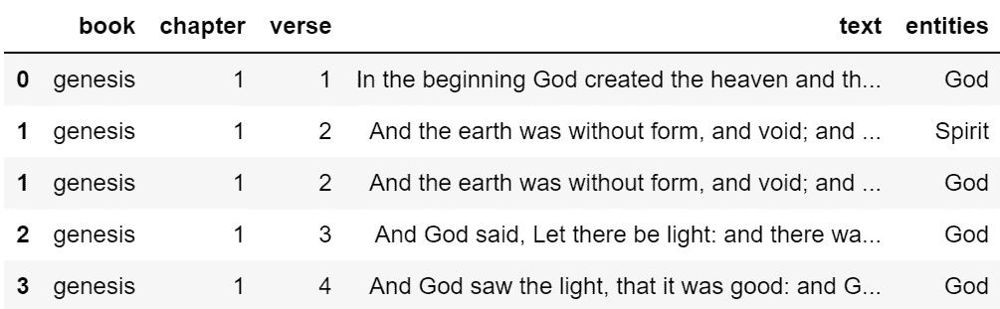

图 1.2 – 包含《圣经》全书的金句版文本的 pandas DataFrame

我特别想查看夏娃是否作为`df['entities']`中的一个实体存在。我希望将数据保存在 DataFrame 中，因为我会用到它，所以我会在`entities`字段上进行一些模式匹配：

```py
check_df['entities'].str.contains('^Eve$')
0        False
1        False
1        False
2        False
3        False
         ...
31101    False
31101    False
31102    False
31102    False
31102    False
Name: entities, Length: 51702, dtype: bool
```

在这里，我使用了所谓的`^`符号，表示`E`在夏娃中的位置位于字符串的最开始，`$`表示`e`在字符串的末尾。这确保了存在一个名为 Eve 的实体，且前后没有其他字符。使用正则表达式，你可以获得比这更大的灵活性，但这是一个简单的例子。

在 Python 中，如果你有一个`True`和`False`值的系列，`.min()`会给你`False`，`.max()`会给你`True`，这也有道理，因为从另一个角度来看，`True`和`False`分别是`1`和`0`，而`1`大于`0`。虽然有其他方法可以做到这一点，但我打算用这种方式。所以，为了查看《圣经》是否至少提到一次夏娃，我可以做如下操作：

```py
check_df['entities'].str.contains('^Eve$').max()
True
```

如果我想查看亚当是否在《圣经》中，可以将`Eve`替换为`Adam`：

```py
check_df['entities'].str.contains('^Adam$').max()
True
```

检测文本中某个事物的存在或不存在是很有用的。例如，如果我们想快速获取一份关于**夏娃**的圣经经文列表，可以这样做：

```py
check_df[check_df['entities'].str.contains('^Eve$')]
```

这将给我们一个包含提及夏娃的圣经经文的 DataFrame：

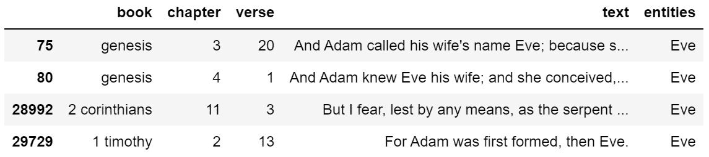

图 1.3 – 包含严格提及夏娃的圣经经文

如果我们想要得到关于诺亚的经文列表，可以这样做：

```py
check_df[check_df['entities'].str.contains('^Noah$')].head(10)
```

这将给我们一个包含提及**诺亚**的圣经经文的 DataFrame：

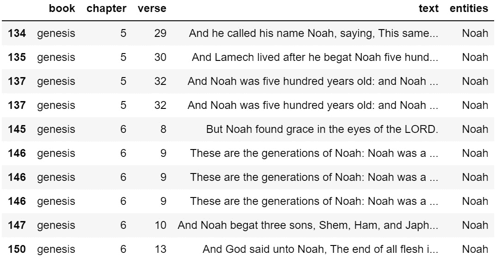

图 1.4 – 包含严格提及诺亚的圣经经文

我已经添加了.`head(10)`，只查看前十行。对于文本，我经常发现自己想要查看更多内容，而不是默认的五行。

如果我们不想使用**entities**字段，我们也可以改为在文本中查找。

```py
df[df['text'].str.contains('Eve')]
```

这将给我们一个包含提到**夏娃**的圣经经文的 DataFrame。

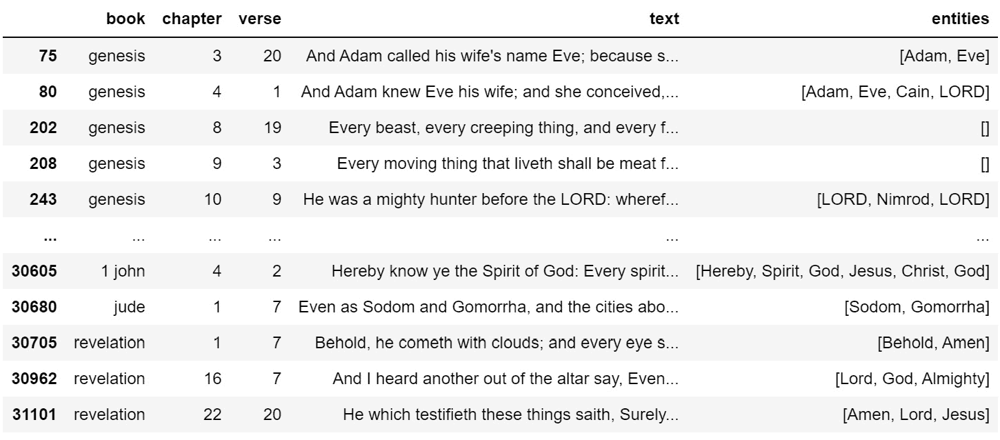

图 1.5 – 包含提及夏娃的圣经经文

这就是问题变得有些复杂的地方。我已经做了一些繁重的工作，提取了该数据集中的实体，稍后我会展示如何做到这一点。当你处理原始文本时，正则表达式（regex）和模式匹配可能会很麻烦，正如前面图示所示。我只想要包含“Eve”的诗句，但结果却匹配了**even**和**every**等词。这不是我想要的。

任何处理文本数据的人都会想要学习正则表达式的基础知识。不过，别担心。我已经使用正则表达式超过二十年了，但我仍然经常需要在谷歌上搜索来确保正则表达式正确工作。我会再次讲解正则表达式，但我希望你能明白，判断一个词是否存在于字符串中其实是相当简单的。举个更实际的例子，如果你有 40 万个抓取的推文，而你只对那些关于特定主题的推文感兴趣，你可以轻松地使用前面提到的技巧或正则表达式来查找精确匹配或相近匹配。

## 正则表达式（regex）

我在前一部分简要解释了正则表达式，但它的用途远不止于此，远比仅仅用来判断某些东西的存在或不存在。例如，你还可以使用正则表达式从文本中提取数据，以丰富你的数据集。我们来看一个我抓取的数据科学动态：

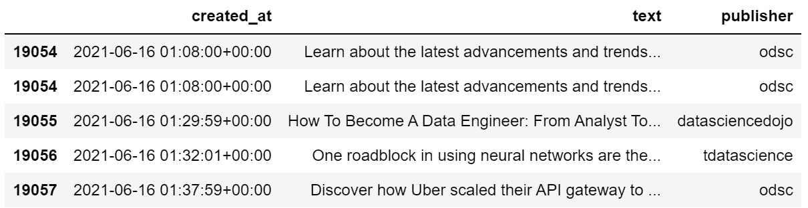

图 1.6 – 抓取的数据科学 Twitter 动态

这些文本字段中包含很多有价值的信息，但以当前形式处理起来很困难。如果我只想要每天发布的链接列表怎么办？如果我想看到数据科学社区使用的标签怎么办？如果我想把这些推文拿去构建一个社交网络来分析谁在互动呢？我们应该做的第一件事是通过提取我们需要的内容来丰富数据集。所以，如果我想创建包含标签、提及和网址列表的三个新字段，我可以这样做：

```py
df['text'] = df['text'].str.replace('@', ' @')
df['text'] = df['text'].str.replace('#', ' #')
df['text'] = df['text'].str.replace('http', ' http')
df['users'] = df['text'].apply(lambda tweet: [token for token in tweet.split() if token.startswith('@')])
df['tags'] = df['text'].apply(lambda tweet: [token for token in tweet.split() if token.startswith('#')])
df['urls'] = df['text'].apply(lambda tweet: [token for token in tweet.split() if token.startswith('http')])
```

在前面三行中，我在每个提及、标签和网址后面加了一个空格，以便为分割提供一些空间。在接下来的三行中，我通过空格分割每条推文，然后应用规则来识别提及、标签和网址。在这种情况下，我没有使用复杂的逻辑。提及以`@`开头，标签以`#`开头，网址以 HTTP（包括 HTTPS）开头。这个代码的结果是，我最终得到了三列额外的数据，分别包含用户、标签和网址的列表。

如果我对用户、标签和网址使用`explode()`，我将得到一个每个用户、标签和网址都有自己一行的 DataFrame。以下是`explode()`后的 DataFrame 样式：

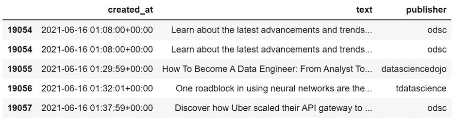

图 1.7 – 抓取的数据科学 Twitter 动态，已增加用户、标签和网址

然后，我可以使用这些新列来获取使用过的独特标签列表：

```py
sorted(df['tags'].dropna().str.lower().unique())
['#',
 '#,',
 '#1',
 '#1.',
 '#10',
 '#10...',
 '#100daysofcode',
 '#100daysofcodechallenge',
 '#100daysofcoding',
 '#15minutecity',
 '#16ways16days',
 '#1bestseller',
 '#1m_ai_talents_in_10_years!',
 '#1m_ai_talents_in_10_yrs!',
 '#1m_ai_talents_in_10yrs',
 '#1maitalentsin10years',
 '#1millionaitalentsin10yrs',
 '#1newrelease',
 '#2'
```

很明显，我在数据丰富过程中使用的正则表达式并不完美，因为标点符号不应该包含在标签中。这是需要修正的地方。请注意，处理人类语言是非常混乱的，很难做到完美。我们只需要坚持不懈，才能准确地得到我们想要的结果。

让我们看看独特的提及是怎样的。所谓独特的提及，指的是推文中去重后的单独账户：

```py
sorted(df['users'].dropna().str.lower().unique())
['@',
 '@027_7',
 '@0dust_himanshu',
 '@0x72657562656e',
 '@16yashpatel',
 '@18f',
 '@1ethanhansen',
 '@1littlecoder',
 '@1njection',
 '@1wojciechnowak',
 '@20,',
 '@26th_february_2021',
 '@29mukesh89',
 '@2net_software',
```

这看起来好多了，不过`@`符号不应该单独出现，第四个看起来有些可疑，其中一些看起来像是被错误地作为提及，而本应作为标签使用。这可能是推文文本的问题，而不是正则表达式的问题，但值得进一步调查。

我喜欢将提及和标签转换为小写字母，这样更容易找到独特的标签。这通常作为*预处理* *用于自然语言处理（NLP）*。

最后，让我们获取提到的独特网址列表（这些可以进一步用于抓取）：

```py
sorted(df['urls'].dropna().unique())
['http://t.co/DplZsLjTr4',
 'http://t.co/fYzSPkY7Qk',
 'http://t.co/uDclS4EI98',
 'https://t.co/01IIAL6hut',
 'https://t.co/01OwdBe4ym',
 'https://t.co/01wDUOpeaH',
 'https://t.co/026c3qjvcD',
 'https://t.co/02HxdLHPSB',
 'https://t.co/02egVns8MC',
 'https://t.co/02tIoF63HK',
 'https://t.co/030eotd619',
 'https://t.co/033LGtQMfF',
 'https://t.co/034W5ItqdM',
 'https://t.co/037UMOuInk',
 'https://t.co/039nG0jyZr'
```

这看起来很干净。我能够提取多少个网址？

```py
len(sorted(df['urls'].dropna().unique()))
19790
```

这有很多链接。由于这是 Twitter 数据，很多网址通常是照片、自拍、YouTube 链接和其他一些对研究者可能不太有用的内容，但这是我的抓取数据科学信息流，它从数十个与数据科学相关的账户中获取信息，所以这些网址很可能包含一些令人兴奋的新闻和研究成果。

正则表达式（Regex）允许你从数据中提取额外的数据，并使用它来丰富数据集，以便进行更简单或进一步的分析。如果你提取了网址，可以将其作为额外抓取的输入。

我不会对正则表达式做一个长篇的讲解。关于这个话题有很多专门的书籍。最终，你很可能需要学习如何使用正则表达式。对于本书中的内容，前面提到的正则表达式大概是你所需要的全部，因为我们使用这些工具来构建可以分析的社交网络。本书的核心并不是关于 NLP 的，我们只是在创建或丰富数据时使用一些 NLP 技术，其他部分则主要依赖网络分析。

## 词频统计

词频统计也很有用，特别是当我们想要进行对比时。例如，我们已经比较了《圣经》中亚当和夏娃被提及的次数，但如果我们想要看到所有实体在《圣经》中被提及的次数该怎么办呢？我们可以用简单的方法来做，也可以用 NLP 方法来做。我个人偏好尽可能使用简单的方法，但很多时候，NLP 或图形方法反而变成了更简单的方式，所以要学会所有的方法，再根据情况做选择。

我们将用简单的方法来做，计算实体被提及的次数。我们再次使用数据集，并进行一些聚合操作，看看在《圣经》中最常被提及的人物是谁。记住，我们可以对任何我们抓取的内容执行这个操作，只要我们已将数据集丰富到包含提及列表。但在这个示范中，我将使用《圣经》。

在第三行，我保留了名字长度超过两个字符的实体，有效地去除了那些最终出现在数据中的无关实体。我使用的是这个过滤器：

```py
check_df = df.explode('entities')
check_df.dropna(inplace=True) # dropping nulls
check_df = check_df[check_df['entities'].apply(len) > 2] # dropping some trash that snuck in
check_df['entities'] = check_df['entities'].str.lower()
agg_df = check_df[['entities', 'text']].groupby('entities').count()
agg_df.columns = ['count']
agg_df.sort_values('count', ascending=False, inplace=True)
agg_df.head(10)
```

这将在下面的 DataFrame 中显示：

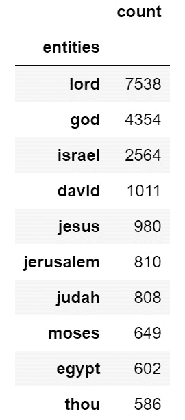

图 1.8 – 整个圣经中实体计数

这看起来很不错。实体是指人、地点和事物，唯一不同的地方是词汇**thou**。之所以会出现它，是因为在圣经中，*thou*这个词通常会被大写为*Thou*，而在进行实体识别和提取时，它会被标记为**NNP**（**专有名词**）。然而，*thou*指的是*You*，因此也能理解。例如，*Thou shalt not kill, thou shalt* *not steal*。

如果我们有这样的数据，我们也可以非常容易地进行可视化，帮助我们从不同的角度理解：

```py
agg_df.head(10).plot.barh(figsize=(12, 6), title='Entity Counts by Bible Mentions', legend=False).invert_yaxis()
```

这将给我们一个水平条形图，显示实体计数：

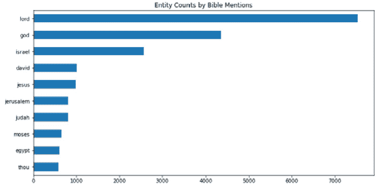

图 1.9 – 整个圣经中实体计数的可视化

显然，这不仅限于圣经中的应用。如果你有任何你感兴趣的文本，你可以使用这些技术来构建更深的理解。如果你想将这些技术用于艺术创作，你可以。如果你想使用这些技术来帮助打击犯罪，你也可以。

## 情感分析

这是我在所有 NLP 技术中最喜欢的一项。我想知道人们在谈论什么，他们对这些事物的感受如何。这是 NLP 中一个经常被低估的领域，如果你关注大多数人如何使用它，你会看到很多关于如何构建分类器的展示，这些分类器可以确定积极或消极的情感。然而，我们人类很复杂。我们不仅仅是开心或悲伤。有时，我们是中立的。有时，我们大部分是中立的，但更多的是积极而非消极。我们的感情是微妙的。我用过的一本书为我自己的情感分析教育和研究提供了很多帮助，书中提到了一项研究，讲述了人类情感被划分为主要、次要和三级情感（Liu, *Sentiment Analysis*, 2015，第 35 页）。这里有几个例子：

| **主要情感** | **次要情感** | **三级情感** |
| --- | --- | --- |
| 愤怒 | 反感 | 蔑视 |
| 愤怒 | 嫉妒 | 妒忌 |
| 恐惧 | 惊悚 | 警觉 |
| 恐惧 | 紧张 | 焦虑 |
| 爱 | 喜爱 | 崇拜 |
| 爱 | 欲望 | 渴望 |

图 1.10 – 主要、次要和三级情感的表格

有一些主要情感，更多的是次要情感，而更多的是三级情感。情感分析可以用来尝试分类任何情感的“是”或“否”，只要你有训练数据。

情感分析并不仅仅用于检测情感。这些技术也可以用于分类，因此我觉得情感分析这个术语并不完全准确，也许这就是为什么有这么多人只是简单地从 Yelp 和 Amazon 评论中检测积极/消极情感的原因。

我有一些更有趣的情感分类应用。目前，我使用这些技术来检测有毒言论（真正的辱骂性语言）、积极情感、消极情感、暴力、好消息、坏消息、问题、虚假信息研究和网络科学研究。你可以将其视为一种智能模式匹配，它能够学习关于某个话题的文本通常是如何被写作的。例如，如果我们想捕捉关于虚假信息的推文，我们可以训练一个关于虚假信息、误导信息和假新闻的文本模型。在训练过程中，模型会学习到其他相关术语，能够比任何人都更快速、更精准地捕捉到它们。

### 情感分析和文本分类建议

在我进入下一部分之前，这里有一些建议：对于情感分析和文本分类，在很多情况下，你不需要神经网络来处理这么简单的任务。如果你正在构建一个检测仇恨言论的分类器，使用“词袋”方法进行预处理，再加上一个简单的模型进行分类就足够了。总是从简单的开始。如果你努力训练，神经网络可能会提高几个百分点的准确率，但它需要更多时间，且可解释性较差。一个 `linearsvc` 模型可以在瞬间训练完成，并且通常能达到同样的效果，有时甚至更好，你也应该尝试一些其他简单的模型和技术。

另一个建议是：试验停用词去除，但不要仅仅因为别人告诉你要去除停用词就去除它们。有时候它有帮助，有时候却会对模型产生不利影响。大多数时候，它可能有帮助，但这足够简单，可以进行实验。

此外，在构建数据集时，如果你对句子进行情感分析，而不是对大块文本进行分析，通常能得到最佳效果。假设我们有以下文本：

*今天我早早醒来，喝了些咖啡，然后出去查看花朵。天空湛蓝，是一个温暖的六月早晨。然而，当我回到屋子里时，我发现水管漏水，整个厨房被淹了。接下来的一整天都很糟糕。我现在真是太生气了。*

你认为第一句话的情感和最后一句话的情感是完全一样的吗？这个虚构故事的情感变化很大，从一开始的愉快和积极到最后的灾难和愤怒。如果你在句子层面进行分类，你能做到更精确。然而，即便如此，这也并不完美。

*今天一开始一切都很完美，但最后一切都崩溃了，我现在真是太生气了。*

那个句子的情感是什么？是积极的还是消极的？它其实是两者都有。因此，理想情况下，如果你能够捕捉到一个句子同时表现出多种情感，那将会非常强大。

最后，在构建模型时，你总是可以选择是否构建二分类或多分类的语言模型。根据我自己的使用经验以及一些与我产生共鸣的研究，通常最简单的是构建一些小模型，只需要检查某些内容是否存在。因此，与其构建一个神经网络来判断文本是积极、消极还是中立的，不如构建一个模型检查“积极”与其他情感的对比，另一个模型检查“消极”与其他情感的对比。

这看起来可能会更费力，但我发现这做起来要快得多，可以使用非常简单的模型，而且这些模型可以组合在一起，寻找各种不同的信息。例如，如果我想分类政治极端主义，我可以使用三个模型：有毒语言、政治和暴力。如果一段文本被分类为有毒语言，属于政治话题，并且倡导暴力，那么这篇内容的发布者可能表现出一些危险的特征。如果只显示有毒语言和政治情感，那很常见，通常不具备极端政治或危险性。政治讨论往往带有敌意。

## 信息提取

我们已经在之前的示例中做了一些信息提取，所以我会简要说明。在前一部分中，我们提取了用户提及、话题标签和网址。这些操作是为了丰富数据集，使进一步的分析变得更加容易。我将这些提取步骤直接加到我的抓取程序中，这样我在下载新数据时就能立即获得用户、提及和网址的列表。这让我可以立即开始网络分析或调查最新的 URL。基本上，如果你正在寻找某些信息，并且你找到了一种可以反复从文本中提取信息的方法，而你发现自己在不同数据集上重复做这些步骤，那么你应该考虑将这些功能加入到你的抓取程序中。

最丰富的、提升我 Twitter 数据集的数据来自两个字段：*发布者*和*用户*。**发布者**是发布推文的账号。**用户**是发布者提到的账号。我的每个信息流中都有几十个发布者。有了发布者和用户，我可以从原始文本中构建社交网络，本书中将对此进行详细解释。这是我发现的一项最有用的技巧，你也可以利用这些结果去寻找其他有趣的账号进行抓取。

## 社区检测

**社区检测**通常不会在自然语言处理（NLP）中提及，但我认为它应该被提到，尤其是在使用社交媒体文本时。例如，如果我们知道某些标签（hashtag）被特定群体使用，我们可以通过他们使用的标签检测到其他可能与这些群体有联系或支持这些群体的人。利用这一点进行人群研究非常简单。只需抓取一堆数据，查看他们使用的标签，然后搜索这些标签。提及也可以给你提供其他账户的信息，供你进一步抓取。

社区检测通常在社交网络分析中提到，但它也可以非常容易地通过 NLP 实现，我也曾使用话题建模和上述方法来进行社区检测。

## 聚类

**聚类**是无监督学习中常见的一种技术，也常用于网络分析。在聚类中，我们是在寻找与其他事物相似的事物。做这项工作的方式有很多种，甚至 NLP 的话题建模也可以作为一种聚类方式。在无监督机器学习中，你可以使用像 k-means 这样的算法，找到与其他推文、句子或书籍相似的推文、句子或书籍。你也可以使用话题建模，利用 TruncatedSVD 来做类似的事情。或者，如果你有一个实际的社交图（社交网络图），你可以查看连接的组件，看看哪些节点是连接的，或者应用 k-means 算法来分析某些网络度量（我们稍后会深入讨论），看看哪些节点具有相似的特征。

# NLP 的高级应用

你日常进行的大部分 NLP 工作可能都会属于较为简单的应用，但我们也来讨论一些高级应用。在某些情况下，我所描述的高级应用实际上是将多个简单应用结合起来，提供更复杂的解决方案。所以，让我们讨论一些更高级的应用，比如聊天机器人和对话代理、语言建模、信息检索、文本摘要、话题发现和建模、文本转语音和语音转文本、机器翻译（MT）以及个人助手。

## 聊天机器人和对话代理

**聊天机器人**是能够与用户进行对话的程序。这类程序已经存在多年，最早的聊天机器人出现在 20 世纪 60 年代，但它们一直在不断改进，现在已成为一种有效的工具，用于将用户引导到更具体的客户支持形式。例如，如果你进入一个网站的支持部分，可能会看到一个小的聊天框弹出，里面写着类似“*今天我们能为您提供什么帮助？*”的话。你可能会输入“*我想偿还我的信用卡余额*。”当应用程序收到你的答案时，它就能用这个信息来判断你需要哪种支持形式。

虽然聊天机器人是为处理人类文本而构建的，但**对话代理**可以处理语音音频。Siri 和 Alexa 就是对话代理的例子。你可以与它们对话并提问。

然而，聊天机器人和对话代理不仅限于文本；当我们用电话拨打公司电话时，也经常遇到类似的电话交换机。我们会接到一系列相同的问题，可能需要回答一个单词或输入数字。因此，在后台，如果涉及语音，就会有一个语音转文本的转换元素。同时，应用程序还需要确定用户是在提问还是在陈述，因此很可能还会涉及文本分类。

最后，为了提供答案，文本摘要可以将搜索结果转化为简洁的陈述，以文本或语音的形式返回给用户，完成交互。

然而，聊天机器人不仅仅是简单的问答系统。我认为它们将成为我们与文本互动的有效方式。例如，你可以围绕《爱丽丝梦游仙境》这本书（或者圣经）构建一个聊天机器人，以回答有关这本书的具体问题。你还可以根据自己的私人信息构建一个聊天机器人，与自己对话。在这里，有很多创造空间。

## 语言建模

**语言建模**关注的是在给定一系列单词的情况下，预测下一个单词。例如，接下来会是什么：“*The cow jumped over the ______.*” 或者：“*Green eggs and _____.*”如果你去 Google 并开始在搜索栏中输入，你会注意到下一个预测的单词会显示在下拉列表中，以加速你的搜索。

我们可以看到，Google 预测下一个单词是**ham**，但它也在查找与已输入文本相关的查询。这看起来像是语言建模与聚类或主题建模的结合。它们在你输入之前就预测了下一个单词，甚至还进一步寻找与你已输入文本相关的其他查询。

数据科学家还可以将语言建模作为生成模型创建的一部分。在 2020 年，我用数千行圣诞歌曲的歌词训练了一个模型，并训练它写圣诞诗。结果虽然粗糙且幽默，因为我只花了几天时间，但它能够以种子文本为基础，利用这些文本生成整首诗。例如，种子文本可以是“铃儿响叮当”，然后模型会不断根据之前的文本生成诗句，直到达到单词和行数的限制。以下是我最喜欢的那首：

```py
youre the angel
and the manger is the king
of kings and sing the sea
of door to see to be
the christmas night is the world
and i know i dont want
to see the world and much
see the world is the sky
of the day of the world
and the christmas is born and
the world is born and the
world is born to be the
christmas night is the world is
born and the world is born
to you to you to you
to you to you to a
little child is born to be
the world and the christmas tree
is born in the manger and
everybody sing fa
la la la la la la
la la la la la la
la la la la la la
la la la la la la
la la la la la la
```

我构建了一个生成过程，从训练数据中的任意一行随机选取一个单词作为开头。接着，它会生成由 6 个单词组成的句子，直到完成 25 行。我只训练了 24 小时，因为我希望能在圣诞节前迅速完成这项工作。有几本关于创建生成模型的书籍，如果你想利用人工智能来增强你的创造力，我强烈建议你了解一下它们。这更像是与模型的合作，而不是用模型来取代我们自己。

现如今，生成式文本模型变得相当令人印象深刻。ChatGPT——2022 年 11 月发布——凭借其回答大多数问题并提供看似现实的答案的能力，吸引了众多人的关注。这些答案并不总是正确的，因此生成模型仍有很长的路要走，但如今关于生成模型的讨论热度很高，人们也在考虑如何将它们应用到自己的工作和生活中，以及它们对我们未来的意义。

## 文本摘要

**文本摘要**几乎不言自明。其目标是将文本作为输入，返回一个摘要作为输出。当你需要管理成千上万或数百万篇文档，并希望提供关于每篇文档的简明概述时，这项技术非常有力。它本质上类似于你在学术文章中找到的“摘要”部分。许多细节会被去除，最终只保留核心内容。

然而，这并不是一种完美的艺术，因此请注意，如果使用此方法，算法可能会舍弃文本中的重要概念，而保留那些较不重要的部分。机器学习并不完美，因此请时刻关注结果。

然而，这个方法更适用于返回简短摘要，而非搜索。你可以使用主题建模和分类来判断文档的相似性，再利用这些信息来总结最终的文档集。

如果你将整本书的内容输入到文本摘要算法中，我希望它能够捕捉到自然语言处理（NLP）与网络分析的结合是强大且人人可及的。你不需要成为天才才能使用机器学习、自然语言处理或社交网络分析。我希望这本书能激发你的创造力，使你在解决问题和批判性思考方面更加高效。文中有许多重要的细节，但这就是其本质。

## 主题发现与建模

**主题发现与建模**非常类似于聚类。这在**潜在语义索引**（**LSI**）中得到应用，它对于识别文本中存在的主题（topic）非常有效，并且还可以作为文本分类的一个有效预处理步骤，使得模型能够根据上下文而非单纯的词语进行训练。此前我在*聚类*和*社区检测*小节中提到过，这一方法如何根据用户在其账户描述中使用的词汇和标签来识别社区内的细微群体。

比如，主题建模会在主题中找到相似的字符串。如果你对政治新闻和社交媒体帖子进行主题建模，你会注意到，在这些主题中，类似的事物往往会聚集在一起。词语会和其他相似的词汇出现在一起。例如，*2A* 可能会写作 *第二修正案*，*USA* 可能会写作其扩展形式（*美利坚合众国*）等等。

## 语音合成与语音识别转换

这种类型的自然语言处理（NLP）模型旨在将文本转换为语音音频，或将语音转换为文本记录。然后，这些文本可以作为输入用于分类或对话代理（聊天机器人、个人助理）。

我的意思是，你不能仅仅将音频输入到文本分类器中。此外，如果没有任何语言分析组件，仅凭音频捕捉上下文也是困难的，因为人们说话时会使用不同的方言、语气等等。

第一步通常是将音频转录为文本，然后分析文本本身。

## 机器翻译（MT）

从自然语言处理的历史来看，我认为可以安全地说，从语言 A 翻译到语言 B 可能在人类开始与使用不同语言的其他人互动时，就已经成为人类的心思。例如，圣经中甚至有关于巴别塔的故事，说在塔被摧毁时，我们失去了彼此理解对方语言的能力。机器翻译有着许多有用的应用，不仅在合作、保密性上，在创造力方面也有重要意义。

比如，对于合作来说，你需要能够共享知识，即使团队成员之间不共享相同的语言。事实上，这在任何需要共享知识的地方都非常有用，所以你经常会在社交媒体帖子和评论中看到 **查看翻译** 的链接。今天，机器翻译（MT）几乎已经完美了，尽管偶尔会有一些有趣的错误。

在安全领域，你需要知道敌人正在计划什么。如果你根本无法理解敌人正在说什么或打算做什么，那么间谍活动可能就毫无意义。翻译是一项专业技能，当涉及人工翻译时，这通常是一个漫长且手动的过程。机器翻译可以大大加快分析速度，因为另一种语言可以被迅速翻译成你自己的语言。

对于创造力来说，将文本从一种语言转化为自己创造的语言是多么有趣啊？这是完全可行的。

由于机器翻译和文本生成的重要性，庞大的神经网络已经被训练来处理文本生成和机器翻译。

## 个人助理

我们大多数人可能已经知道像 Alexa 和 Siri 这样的个人助理，它们已经成为我们生活中的重要组成部分。我猜我们将变得更加依赖这些助手，最终，我们会像在老电视节目 *霹雳游侠* 中一样与我们的汽车对话（该节目于 1982 年至 1986 年间播出）。“*嘿，车子，带我去超市*”可能会像“*嘿 Alexa，明天的天气怎么样？*”一样常见。

个人助手结合了前面提到的几种 NLP 技术。它们可能使用分类技术来判断你的查询是一个问题还是一个陈述。然后，它们可能会在互联网上搜索与你的问题最相关的网页内容。接着，它可以从一个或多个结果中提取原始文本，再使用摘要技术来构建简洁的答案。最后，它会将文本转化为语音，并将答案反馈给用户。

个人助手结合了前面提到的几种 NLP 技术：

1.  它们可能使用分类技术来判断你的查询是一个问题还是一个陈述。

1.  然后，它们可能会在互联网上搜索与你的问题最相关的网页内容。

1.  它们可以从一个或多个结果中提取原始文本，再使用摘要技术来构建简洁的答案。

1.  最后，它们会将文本转化为语音，并将答案反馈给用户。

我对个人助手的未来感到非常兴奋。我很想拥有一个可以与之对话的机器人和汽车。我认为，创造力可能是我们在创建不同类型的个人助手或它们所使用的模块时唯一的限制。

# 初学者如何入门自然语言处理（NLP）？

如果我们最终不深入探讨如何使用这些工具和技术，这本书将几乎没有什么用处。我在这里描述的常见和高级应用只是其中的一部分。当你对 NLP 感到熟悉时，我希望你不断考虑其他可能尚未得到满足的 NLP 应用。例如，仅仅在文本分类方面，你就可以深入探讨。你可以使用文本分类技术尝试分类更复杂的概念，比如讽刺或共情，但我们暂时不提前讨论这些。这是我希望你做的事。

## 从一个简单的想法开始

简单地思考，只有在需要时才增加复杂性。想想有什么事情是你感兴趣的，并且想要了解更多的，然后找到讨论这个话题的人。如果你对摄影感兴趣，找几个讨论摄影的 Twitter 账号。如果你想分析政治极端主义，找一些在 Twitter 上公开展示其统一标签的账号。如果你对花生过敏研究感兴趣，找一些研究人员的 Twitter 账号，他们发布自己的研究成果和文章，努力挽救生命。我之所以反复提到 Twitter，是因为它是一个研究人们如何讨论问题的宝贵资源，且人们常常会发布链接，这可能引导你进一步抓取更多内容。但你也可以使用任何社交媒体平台，只要它能被抓取。

然而，从一个非常简单的想法开始。你想了解一段文本（或大量的推文）中的什么内容？你想了解一个社区的人们的什么情况？头脑风暴一下。拿出一个笔记本，开始写下你脑海中浮现的每一个问题。给它们排个优先级。然后，你就会有一份问题清单，去寻找答案。

例如，我的研究问题可能是：“*人们在说关于黑人的命也是命抗议的事情吗？*”或者，我们也可以研究一些不那么严肃的话题，问：“*人们在说关于最新的漫威电影的事吗？*” 个人来说，我更倾向于至少尝试用数据科学为善，去让世界变得稍微安全一些，所以我对电影评论不太感兴趣，但别人可能会。每个人都有自己的偏好。研究你感兴趣的内容。

对于这个演示，我将使用我抓取的数据科学信息流。我有一些初步的问题：

+   哪些账户每周发布最多？

+   哪些账户被提及最多？

+   这个群体的人们主要使用哪些标签？

+   在回答完这些问题后，我们可以想到哪些后续问题？

我们将只使用自然语言处理（NLP）和简单的字符串操作来回答这些问题，因为我还没有开始讲解社交网络分析。我还假设你熟悉 Python 编程，并且熟悉 pandas 库。我将在后面的章节中更详细地讲解 pandas，但不会进行深入的培训。有一些很棒的书籍可以深入讲解 pandas。

这是我抓取的数据科学信息流的原始数据样式：

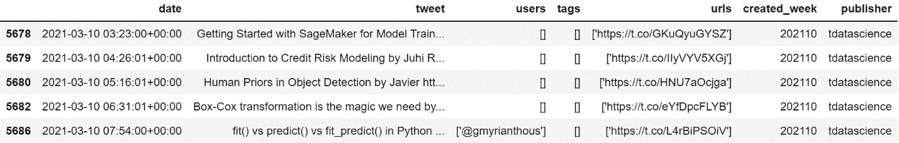

图 1.11 – 抓取并丰富的数据科学 Twitter 信息流

为了节省时间，我已经在抓取程序中设置了正则表达式步骤，用来创建用户、标签和 URL 的列。所有这些都是在自动化抓取的过程中被抓取或生成的。这将使得回答我提出的四个问题变得更加容易和迅速。那么，我们开始吧。

## 发布频率最高的账户

我首先想做的是看看哪些账户总共发布了最多的内容。我还会看看哪些账户发布最少，以检查是否有账户自从被加入到我的抓取程序中后已经停止更新。为此，我将简单地选取`publisher`（发布推文的账户）和`tweet`这两列，对`publisher`进行`groupby`操作，然后进行计数：

```py
Check_df = df[['publisher', 'tweet']]
check_df = check_df.groupby('publisher').count()
check_df.sort_values('tweet', ascending=False, inplace=True)
check_df.columns = ['count']
check_df.head(10)
```

这将显示一个按推文数量排序的发布者数据框，向我们展示最活跃的发布者：

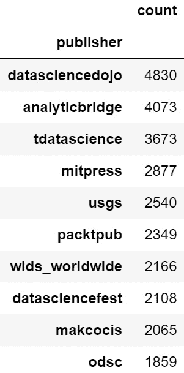

图 1.12 – 数据科学 Twitter 信息流中的用户推文数量

太棒了。如果你想进入数据科学领域，而且你使用 Twitter，那么你应该关注这些账户。

然而，对我来说，这些问题的实用性有限。我真正想看到的是每个账户的发布行为。为此，我将使用数据透视表。我将使用`publisher`作为索引，`created_week`作为列，并进行计数聚合。以下是按当前周排序的前十名：

```py
Check_df = df[['publisher', 'created_week', 'tweet']].copy()
pvt_df = pd.pivot_table(check_df, index='publisher', columns='created_week', aggfunc='count').fillna(0)
pvt_df = pvt_df['tweet']
pvt_df.sort_values(202129, ascending=False, inplace=True)
keep_weeks = pvt_df.columns[-13:-1] # keep the last twelve weeks, but excluding current
pvt_df = pvt_df[keep_weeks]
pvt_df.head(10)
```

这将生成以下数据框：

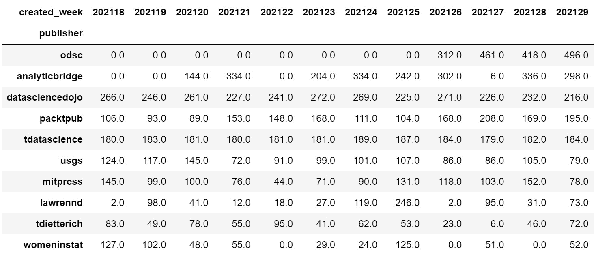

图 1.13 – 按周的用户推文数量数据透视表

这看起来更有用，而且对周次敏感。作为可视化，它也应该很有趣，可以感受一下规模：

```py
_= pvt_df.plot.bar(figsize=(13,6), title='Twitter Data Science Accounts – Posts Per Week', legend=False)
```

我们得到了以下图表：

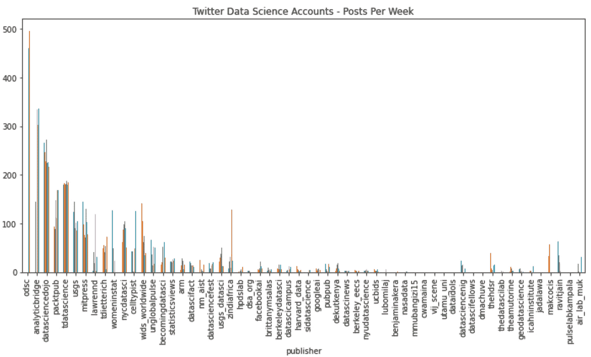

图 1.14 – 用户推文按周数的条形图

这种方式可视化时，看到单独的周次有点困难。对于任何可视化，你都需要考虑如何最容易地讲述你想要表达的故事。由于我主要对展示哪些账户的总推文数最多感兴趣，因此我将使用第一次聚合的结果。这看起来很有趣，也很酷，但并不特别实用：

```py
_= check_df.plot.bar(figsize=(13,6), title='Twitter Data Science Accounts – Posts Per Week', legend=False)
```

这段代码给我们以下图表：

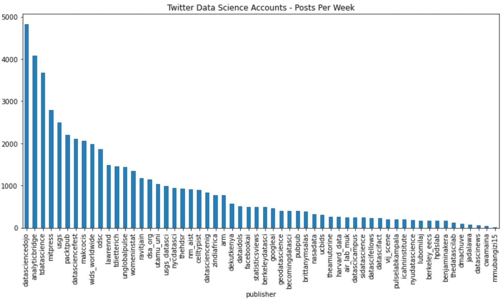

图 1.15 – 用户推文总数的条形图

这更容易理解。

## 最常被提及的账户

现在，我想看看哪些账户被发布者（发推文的账户）提及得最频繁。这可以显示合作伙伴，也可以显示其他值得抓取的有趣账户。为此，我将使用`value_counts`来查看前 20 个账户。我想要一个快速的答案：

```py
Check_df = df[['users']].copy().dropna()
check_df['users'] = check_df['users'].str.lower()
check_df.value_counts()[0:20]
users
@dataidols         623
@royalmail         475
@air_lab_muk       231
@makcocis          212
@carbon3it         181
@dictsmakerere     171
@lubomilaj         167
@brittanymsalas    164
@makererenews      158
@vij_scene         151
@nm_aist           145
@makerereu         135
@packtpub          135
@miic_ug           131
@arm               127
@pubpub            124
@deliprao          122
@ucberkeley        115
@mitpress          114
@roydanroy         112
dtype: int64
```

这看起来很棒。我敢打赌这些账户中有一些有趣的数据科学家。我应该去看看，并考虑抓取这些账户并将它们添加到我的数据科学信息流中。

## 前 10 个数据科学标签

接下来，我想看看哪些标签使用得最频繁。代码会非常相似，唯一不同的是，我需要对标签字段运行`explode()`，以便为每个推文的标签列表中的每个元素创建一行。我们先做这个。为此，我们可以简单地创建 DataFrame，去除空值，将标签小写化以保持一致，然后使用`value_counts()`来得到我们想要的结果：

```py
Check_df = df[['tags']].copy().dropna()
check_df['tags'] = check_df['tags'].str.lower()
check_df.value_counts()[0:10]
tags
#datascience           2421
#dsc_article           1597
#machinelearning        929
#ai                     761
#wids2021               646
#python                 448
#dsfthegreatindoors     404
#covid19                395
#dsc_techtarget         340
#datsciafrica           308
dtype: int64
```

这看起来很棒。我打算可视化前十名结果。然而，`value_counts()` somehow 使得标签有些损坏，所以我改用了 DataFrame 的 `groupby` 操作：

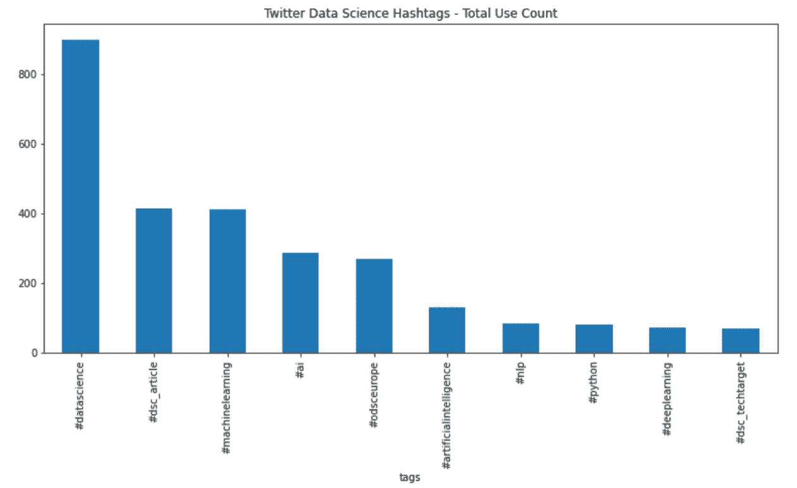

图 1.16 – 数据科学 Twitter 信息流中的标签计数

让我们用一些相关的想法结束这一部分。

## 简单分析得出的额外问题或行动项

总的来说，如果我不在写书，这个分析大约需要我花费 10 分钟时间。代码看起来可能有些奇怪，因为你可以在 Python 中将命令链式连接。我更喜欢将重要操作单独放在一行，这样下一个需要管理我代码的人就不会漏掉任何附加在一行末尾的重要内容。然而，笔记本是相当个人化的，笔记本中的代码通常不是写得非常干净。当你在研究数据或进行粗略的可视化时，重点应该放在你要做什么上。直到你准备好编写生产版本的代码之前，你不需要写出完美的代码。话虽如此，不要把笔记本质量的代码直接投入生产环境。

现在我们已经完成了快速分析，我有一些后续问题，应该去回答：

+   这些账号中有多少实际上与数据科学相关，而我没有已经在抓取的？

+   这些账号中有哪一些给了我新的推送灵感吗？例如，我有关于数据科学、虚假信息研究、艺术、自然科学、新闻、政治新闻、政治人物等方面的推送。也许我应该增加一个摄影方面的推送。

+   是否值得通过关键词抓取任何一个热门关键词，来收集更多有趣的内容和账号？

+   是否有任何账号已经停止更新（从未发布新帖子）？是哪些账号？它们何时停止更新的？为什么停止更新？

你试试看。你能从这个数据集中想到任何问题吗？

接下来，让我们尝试一个相似但稍微不同的方法，使用自然语言处理工具分析《爱丽丝梦游仙境》这本书。具体来说，我想看看是否能将 `tf-idf` 向量化并绘制出每章中角色的出现情况。如果你不熟悉的话，**词频-逆文档频率**（**TF-IDF**）这个名称非常合适，因为这正是数学原理。我不会讲解代码，但这就是结果的展示：

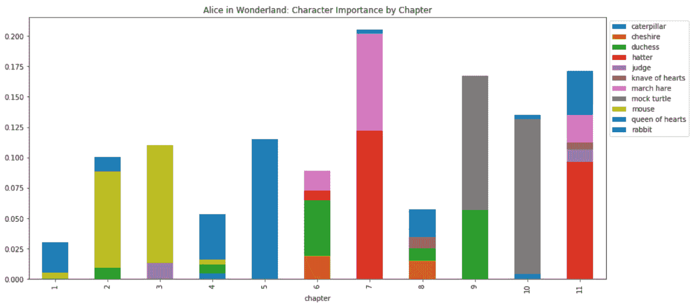

图 1.17 – 基于书籍章节的《爱丽丝梦游仙境》TF-IDF 人物可视化

通过使用堆叠条形图，我可以看到哪些角色在同一章节中一起出现，以及它们的相对重要性，基于它们被提到的频率。这完全是自动化的，我认为这将带来一些非常有趣的应用，比如一种更互动的方式来研究各种书籍。在下一章中，我将介绍社交网络分析，如果你也加入这一部分，你甚至可以构建《爱丽丝梦游仙境》或任何其他文学作品中的社交网络，从而看到哪些角色之间的互动。

为了执行 `tf-idf` 向量化，你需要将句子分割成词汇单元。分词是自然语言处理（NLP）的基础，词汇单元就是一个词。所以，比如说，如果我们要分词这个句子：

今天是美好的一天。

我最终会得到以下词元的列表：

`['今天', '是', '一个', '美好', '的', '``一天', '.']`

如果你有几个句子，你可以将它们输入到 `tf-idf` 中，以返回文本语料库中每个词元的相对重要性。这通常对使用简单模型进行文本分类非常有用，也可以作为主题建模或聚类的输入。然而，我从未见过其他人使用它来按书籍章节确定角色的重要性，所以这是一个创造性的做法。

这个例子只是 NLP 所能做的一小部分，它只探讨了我们可能提出的几个问题。当你进行自己的研究时，我鼓励你随时保持一个纸质笔记本，这样当有问题冒出来时，你可以随时记录下来进行调查。

# 总结

在这一章中，我们介绍了什么是 NLP，它是如何帮助我的，NLP 的一些常见和高级应用，以及初学者如何入门。

我希望这一章能给你一个大致的概念，了解什么是 NLP，它可以用于什么，文本分析是什么样的，以及一些可以进一步学习的资源。这一章绝不是 NLP 的完整图景。即使是写历史部分也很困难，因为其中有太多内容，而且很多已经随着时间的推移被遗忘了。

感谢阅读。这是我第一次写书，也是我第一次为书写的章节，所以这对我来说意义重大！希望到目前为止你喜欢这本书，并且我希望我能给你提供一个充分的初步了解 NLP 的机会。

接下来：网络科学和社交网络分析！
