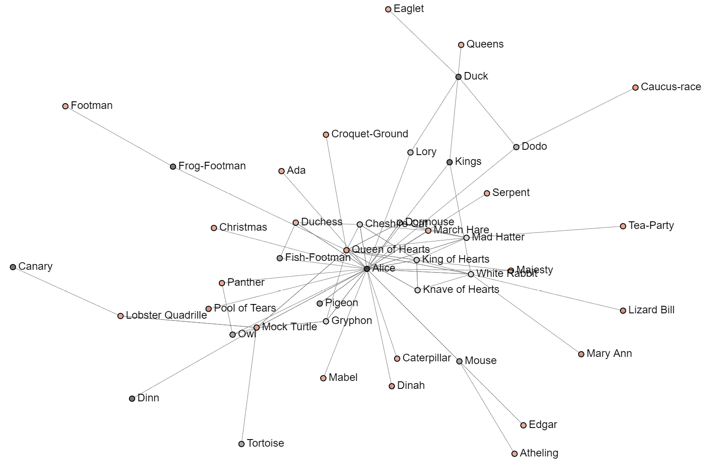
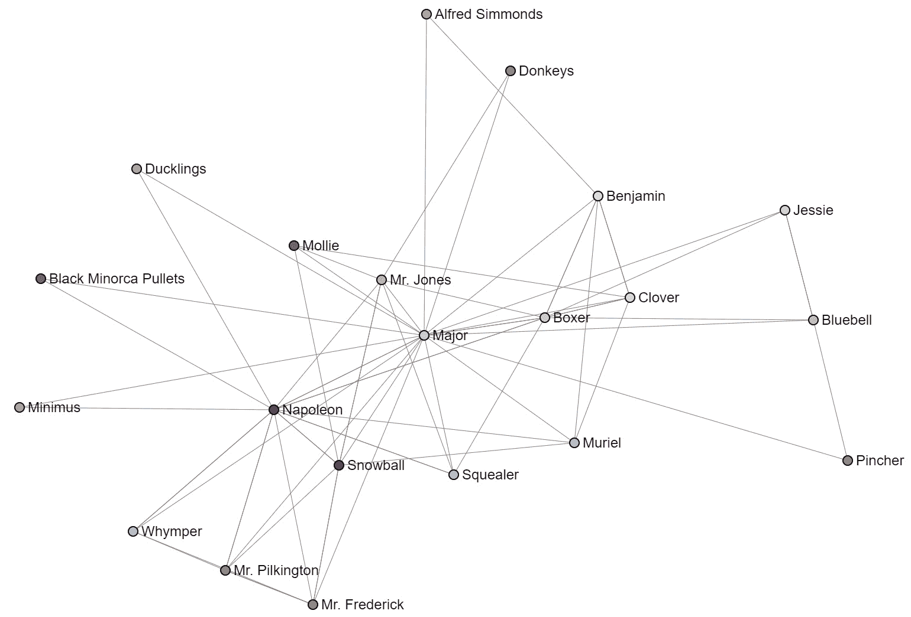
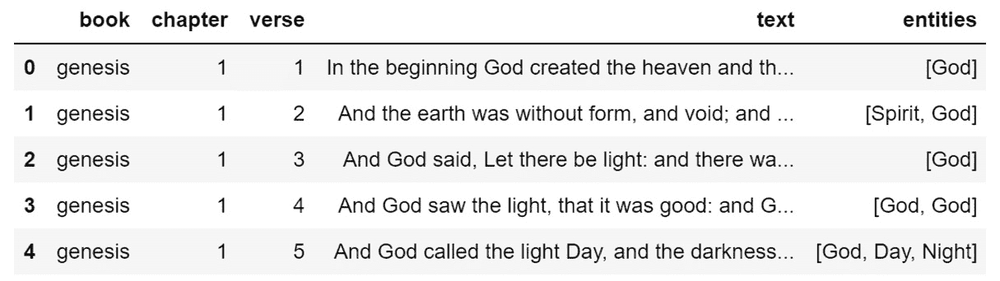
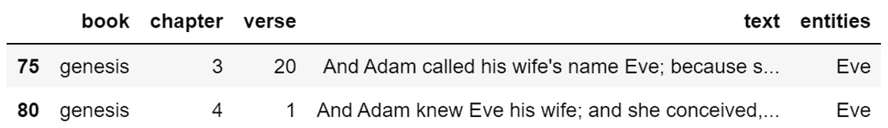
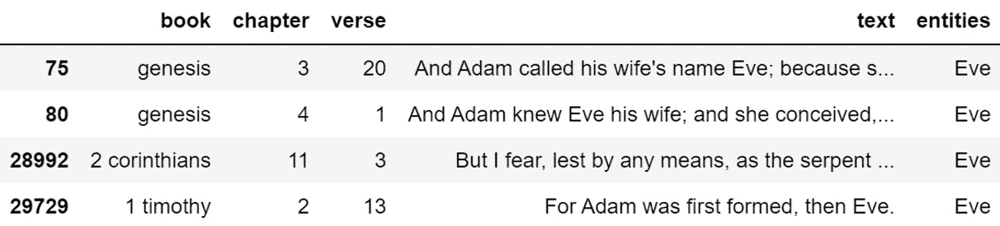
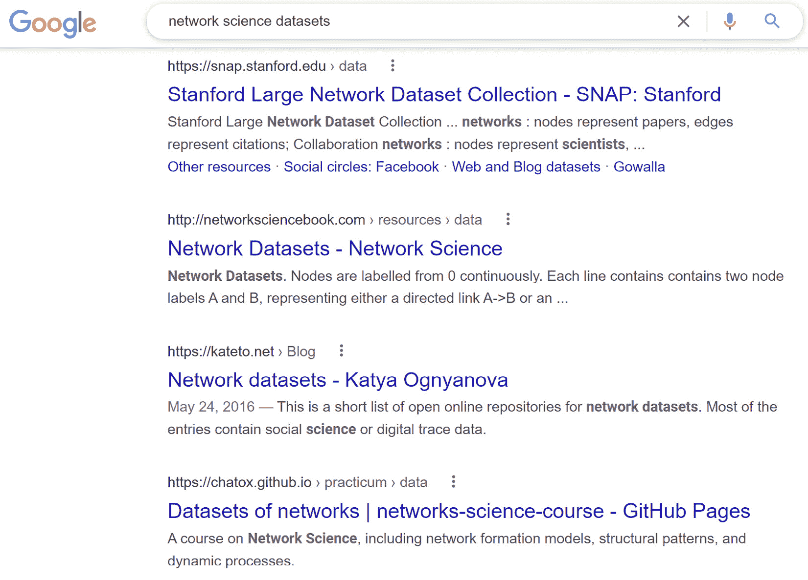
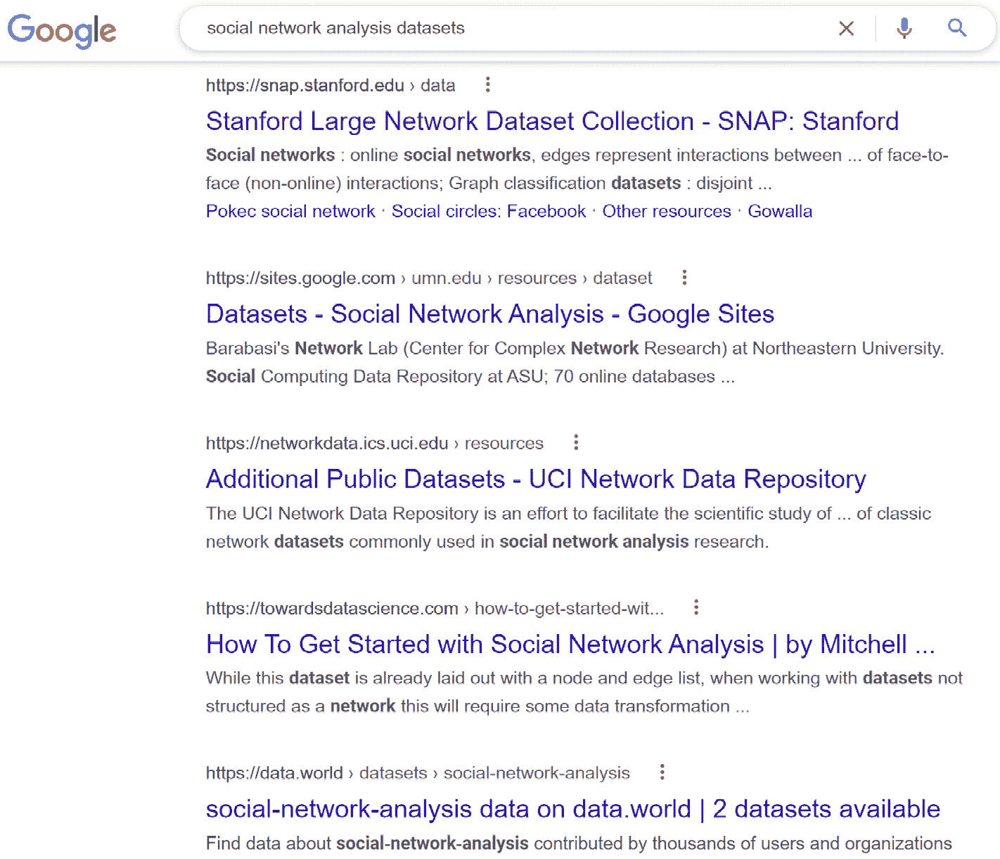
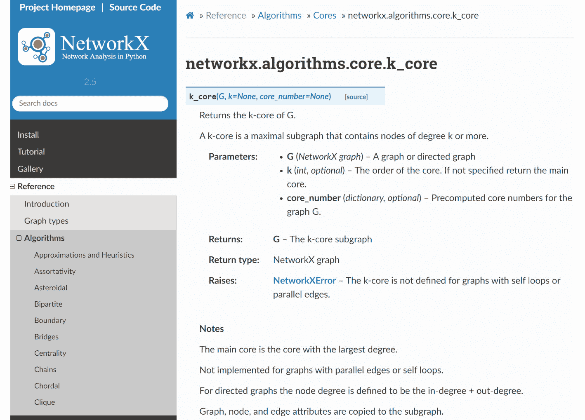
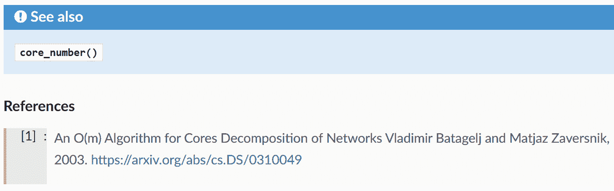

# 第二章：网络分析

在这一章中，我将描述三个不同的主题，但从一个非常高的层次来讲：*图论*、*社交网络分析*和*网络科学*。我们将从讨论围绕“网络”一词的混淆开始，探讨为什么这可能仍然会令人困惑。接着，我们将回顾一下这三者的过去和现在。最后，我们将深入探讨网络分析如何帮助了我，以及如何希望它能帮助你。这不是一个代码密集型的章节。这是一个高层次的介绍。

本章将讨论以下主题：

+   网络背后的混乱

+   这些网络到底是什么？

+   学习网络分析的资源

+   常见的网络应用案例

+   高级网络应用案例

+   网络入门

# 网络背后的混乱

首先，为了减少混淆，如果你看到我提到*NetworkX*，那不是打错字。那是我们在本书中将大量使用的一个 Python 库。Python 是一种非常流行的编程语言。

我整个职业生涯都在**信息技术**（**IT**）领域工作，甚至更进一步。在我职业生涯的某些阶段，我为了工作要求获得了如 Security+和 CISSP 等安全认证，并且我一直在与其他 IT 专业人士合作，如网络工程师。所以，相信我，当我告诉你，我理解与那些将网络主要视为基于 TCP/IP 和子网的人的讨论中的尴尬时。

网络无处不在，甚至在我们体内。事实上，我们的大脑是我们在宇宙中发现的最复杂的东西，正如《如何创造大脑》一书（Kurzweil，2012 年）中所讨论的那样。我们的大脑由数百亿个细胞通过万亿级的连接相互联接。多么复杂的网络啊！

当我想到我们在人工神经网络方面所取得的所有成就，以及它们在翻译、计算机视觉和生成方面的表现时，我觉得它们非常令人印象深刻，但我更为印象深刻的是我们这些超复杂的大脑是如何自然进化出来的，以及即使拥有如此复杂的机制，我们有时也会显得多么愚蠢。

回到我的观点，*网络*不仅仅是计算机网络。网络是事物之间的关系和信息交换的集合。

在本书中，当我谈论网络时，我指的是*图*。我指的是事物之间复杂的关系。一本我非常喜欢的关于这一主题的书，《网络》（Newman，2018 年），描述了几种不同类型的网络，例如以下这些：

+   技术网络

    +   互联网

    +   电力网

    +   电话网络

    +   运输网络

        +   航空公司航线

        +   道路

        +   铁路网络

    +   配送和分发网络

+   信息网络

    +   万维网

    +   引文网络

    +   对等网络

    +   推荐网络

    +   关键词索引

    +   数据流网络

+   社交网络

    +   社交互动网络

    +   以自我为中心的网络

    +   隶属/协作网络

+   生物网络

    +   代谢网络

    +   蛋白质-蛋白质网络

    +   基因调控网络

    +   药物相互作用网络

    +   大脑网络

        +   神经元网络

        +   大脑功能连接网络

    +   生态网络

        +   食物链

        +   寄主-寄生网络

        +   共生网络

就我个人而言，我最喜欢的网络是社交网络（而不是社交媒体公司），因为它们让我们能够绘制和理解人们之间的关系，即使在大规模的情况下也是如此。我*最不*喜欢的网络是计算机网络，因为我对子网掩码或不同的计算机网络架构完全没有兴趣。

在这个美丽的宇宙中，图论、社交网络分析和网络科学赋予你调查和探究许多人甚至没有注意到或意识到的关系的能力。

在这本书中，你会看到“图”和“网络”这两个词交替使用。它们本质上是相同的结构，但通常用于不同的目的。我们在*NetworkX*中使用图来进行网络分析。当这些图被可视化用于社交网络分析时，它们也被称为**社交图**。是的，这有点令人困惑。不过，我保证你会克服这个困惑。为了让自己更轻松，我告诉自己它们是相同的东西，只是名字不同，有时用于不同的目的。

# 这些网络究竟是啥？

让我们稍微进一步细分一下。我想分别讨论图论、社交网络分析和网络科学之间的差异。我会保持高层次的讨论，这样我们可以尽快开始构建。如果你想深入了解这些领域，亚马逊上可能有数十本书可以阅读，我个人大概有 10 本书，而且只要发现有新书出版，我就会再买。

## 图论

最近，**图论**引起了很多关注。我在数据科学社区中最为关注它，甚至看到数据库管理员和安全专家也开始对此感兴趣。凭借这些热度，很多人可能会认为图论是全新的东西，但实际上它已经有*几百*年的历史。

### 图论的历史与起源

图论的历史与起源可以追溯到 1735 年，距今 286 年。当时有一个谜题叫做*柯尼斯堡七桥问题*，其目标是找到一种方法，能够不重复穿越任何一座桥就穿越所有七座桥。1735 年，瑞士数学家莱昂哈德·欧拉证明了这个谜题是无法解决的。根本没有办法在不穿越任何一座桥两次的情况下穿越每座桥。1736 年，欧拉就这个证明写了一篇论文，这篇论文成为图论历史上的第一篇论文。

1857 年，爱尔兰数学家威廉·罗恩·哈密尔顿发明了一种名为 Icosian 游戏的谜题，涉及寻找一种特殊类型的路径，后来被称为哈密尔顿回路。

几乎在欧拉论文发表后的 150 年，即 1878 年，*图*一词由詹姆斯·约瑟夫·西尔维斯特在《自然》期刊上发表的论文中首次提出。

最后，1936 年，匈牙利数学家德内什·科尼格（Dénes Kőnig）写下了第一本图论教材《有限图与无限图的理论》，这距离欧拉解决七桥问题已经过去了 201 年。1969 年，美国数学家弗兰克·哈拉里（Frank Harary）写下了图论的权威教材。

换句话说，图论并不新鲜。

### 图论的实际应用

当前，图论在寻找最优路径方面引起了极大的兴趣。这一知识非常宝贵，因为它在将数据、产品和人员从 A 点到 B 点的路由应用中具有重要作用。我们可以在地图软件找到从源点到目的地的最短路径时看到这一点。我也在解决生产数据库和软件问题时使用路径，所以它的应用不仅限于交通。

在本书中，我们将研究最短路径。继续阅读！

## 社交网络分析

**社交网络分析**并没有像图论那样受到大量的关注，我认为这是件遗憾的事。社交网络分析是对我们每个人都参与其中的社会网络——社会结构——的分析。如果你研究社交网络，你就能更好地理解人们的行为。你可以研究人们与谁互动、谁是他们讨厌的人、谁是他们爱的人、毒品如何传播、白人至上主义者如何组织、恐怖分子如何运作、欺诈如何发生、恶意软件如何传播、如何阻止流行病的蔓延等等。这个过程涉及数学，但在我自己的研究中，我最感兴趣的是揭示社会互动。只要你理解这些技术的作用、它们所做的假设，以及如何判断它们是否有效，你就可以不写一个方程式进行社交网络分析。从数学角度来说，我认为这个领域对数学不感兴趣的人也非常友好。然而，数学能力在这里可以成为一种超能力，因为它将使你能够设计出自己的技术，用以剖析网络并发现洞察。

### 社交网络分析的历史与起源

图论和社交网络分析之间有很大的重叠，因为像最短路径这样的概念在社交网络环境中也非常有用，例如，用它来确定从你当前所在的位置到见到总统需要多少次握手。或者，你需要先见到谁才能有机会见到你最喜欢的明星？

然而，在 1890 年代，法国社会学家大卫·埃米尔·杜尔凯姆和德国社会学家费迪南德·滕尼斯在他们对社会群体的理论和研究中预示了社交网络的概念。滕尼斯认为，社会群体作为连接共享价值观和信仰的个体的纽带（社区）或非个人化和工具性的社会联系（社会）存在。另一方面，杜尔凯姆则提供了一个非个人主义的解释，认为社会现象的产生是因为互动的个体是某种比单个个体属性更大的现实的一部分。我个人对这个观点很感兴趣，当我研究人们在社交图中所处的位置时，我能感受到这一点。人们是否创造了自己在社交网络中的位置，还是部分是偶然的，基于他们认识的人以及他们的连接本身所处的位置？例如，如果你在某个国家的特定地区长大，你很可能会继承社区成员共享的许多情感，但这些情感可能比社区现存的成员还要古老。

在 1930 年代，心理学、人类学和数学领域的多个独立研究小组在社会网络分析方面取得了重要进展。即使在 90 年前，社会网络分析已经是一个多学科的话题。在 1930 年代，雅各布·莫雷诺被认为创造了第一个社会图，以研究人际关系，甚至在 1933 年，这一图被印刷在《纽约时报》上。他说：“*在社会度量学出现之前，没有人知道一个群体的‘人际结构’究竟是怎样的。*”就我个人而言，每当我第一次可视化我构建的任何社交网络时，我都会感受到同样的兴趣。网络结构就像一个谜，直到你第一次看到它被可视化出来，看到它被首次呈现出来总是令人兴奋的。

在 1970 年代，学者们致力于将独立的网络研究的不同路径和传统结合起来。几乎 50 年前，人们意识到独立的研究正在朝着多个方向发展，因此有了将其整合在一起的努力。

在 1980 年代，社交网络分析的理论和方法在社会和行为科学中变得普及。

### 社交网络分析的实际应用

社交网络分析可以用于研究任何社会实体之间的关系。社交网络分析的目标是理解社会实体和社区如何互动。这可以在个人层面，也可以是在国际层面。

这甚至可以用来对抗文学。例如，这是我从《爱丽丝梦游仙境》一书中构建的社交网络：



图 2.1 - 《爱丽丝梦游仙境》中的社交网络

这是我从《动物农场》一书中构建的社交网络：



图 2.2 – 《动物庄园》的社会网络

这些是我最初创建时的原始社会图，因此它们可能还需要做些改进，我们将在本书中对其进行清理和分析。

我比起图论或网络科学，更喜欢社会网络分析。我想理解人类，我想制止坏人，让世界变得更安全。我想阻止恶意软件，让互联网更安全。这一切都是我动力的源泉，因此我把很多空闲时间投入到社会网络分析的研究中。这是我的重点。

## 网络科学

**网络科学**是我另一个兴趣所在。网络科学是关于理解网络是如何形成的，以及它们如何形成的意义。

### 网络科学的历史与起源

和社会网络分析一样，图论和网络科学的起源有很多重叠。对我来说，网络科学似乎更注重统一各种网络学科，将所有内容集中在一个框架下，就像数据科学试图统一各种数据学科一样。事实上，最近我看到网络科学在数据科学家中被广泛使用，因此我预测，最终网络科学会被视为数据科学的一个子领域。

在我读过的关于网络科学的书籍中，欧拉的七桥问题常常被当作网络科学的起源，展示了图论是网络科学的根源。然而，1990 年代有几个关键的研究努力，专注于数学地描述不同的网络拓扑结构。

邓肯·沃茨（Duncan Watts）和史蒂文·斯特罗加茨（Steven Strogatz）描述了“即小世界”网络，大多数节点不是彼此的邻居，但可以通过很少的跳跃相互到达。阿尔伯特·拉斯洛·巴拉巴西（Albert-László Barabási）和瑞卡·阿尔伯特（Reka Albert）发现，小世界网络在现实世界中并不是常态，并提出了无标度网络（scale-free network），这种网络由少数几个中心节点和许多边缘节点组成，后者具有较少的连接。该网络拓扑会不断增长，以维持连接数和所有其他节点之间的恒定比率。

### 网络科学的实际应用

网络科学的实际应用也是图论和社会网络分析的实际应用。我认为图论和社会网络分析是网络科学的一部分，尽管这些技术针对每个学科进行了专门化。我个人不做区分，也不太思考图论的问题。在进行网络科学时，我会运用图论和社会网络分析的技术。当我通过代码实现时，图论的大部分数学内容已经被抽象化，但我仍然经常使用最短路径和中心性等内容，前者来自图论，后者则来自社会网络分析。

# 学习网络分析的资源

那么，开始进行网络思维的旅程需要什么呢？我会给出一些建议，帮助你入门，但请注意，等到这本书出版时，其中一些建议可能已经有些过时，新技术和新方法可能已经出现。这并不是一个完整的清单，而是最低要求。首先，你需要的是一颗好奇心。如果你愿意去探索构成我们存在的隐秘网络，那么你已经具备了第一个前提条件。不过，我还是会给你更多的建议。

## 笔记本界面

我在 Jupyter 笔记本中进行所有的网络分析。你可以通过 Anaconda 下载和安装 Jupyter，网址是：[`docs.anaconda.com/anaconda/install`](https://docs.anaconda.com/anaconda/install)。

如果你不想安装 Jupyter，你也可以直接使用 Google Colab，无需任何安装。你可以在 [`research.google.com/colaboratory`](https://research.google.com/colaboratory) 找到并立即开始使用 Google Colab。

与典型的**集成开发环境**（**IDE**）不同，笔记本界面允许你在“单元格”中编写代码，然后按顺序运行或重新运行它们。这对研究很有用，因为你可以快速地在数据上进行实验，实时进行探索性数据分析和可视化，且可以在你的网页浏览器中查看。以下是效果图：

```py
df = pd.read_csv(data)
df['book'] = df['book'].str.lower()
df['entities'] = create_entity_list(df)
df.head()
```

《圣经》包含在数据文件中，所以这将加载数据并输出《圣经》前五节经文的预览。



图 2.3 – 《圣经》的 pandas DataFrame

现在，让我们来看一下《创世记》中提到`夏娃`的章节：

```py
entity_lookup('Eve', book='genesis')
```

这将显示提到`夏娃`的两节经文的预览：



图 2.4 – 《创世记》中提到的夏娃

让我们看看`夏娃`在整个《圣经》中被提到多少次：

```py
entity_lookup('Eve')
```

再次，这将显示经文的预览：



图 2.5 – 《圣经》中提到的夏娃

我加载了自己创建的《圣经》数据集，并进行了些许清理和丰富，然后我创建了两个额外的单元格，一个是查找《创世记》中的`夏娃`，另一个是查找《圣经》全书中的`夏娃`。如果你仔细看，你会发现我不小心把`df`设置成了全局变量，这样不太好。我应该修复那个代码。哦，好吧，下次吧，代码能运行就好。

一个笔记本允许你进行数据实验，并发挥极大的创意。笔记本有优缺点，其中一个我之前提到过。

优点是你可以非常快速且轻松地在数据集上进行实验，构建加载、预处理、丰富和甚至**机器学习**（**ML**）模型开发的代码。你可以用一个笔记本做很多事情，且非常迅速。这是我进行初步探索和开发时最喜欢的工具。

缺点是，笔记本代码有个不太好的声誉，被认为是快速且不够规范的代码，这种代码其实不适合生产环境。另一个问题是，笔记本代码可能会变得杂乱无章，不仅仅是我们笔记本电脑上的文件，还包括 Jupyter 服务器（如 SageMaker、Kubeflow 等），所以很容易导致事情变得混乱和难以管理。

我建议用它们来探索数据并激发创新，但一旦你有了有效的解决方案，就把这些代码拿到集成开发环境（IDE）中好好构建。我目前偏好的 IDE 是 Visual Studio Code，但你可以使用任何你舒适的工具。IDE 将在下一节中定义。

你可以在 [`code.visualstudio.com/download`](https://code.visualstudio.com/download) 下载 Visual Studio Code。

## 集成开发环境（IDEs）

集成开发环境（IDE）是一种用于编写代码的软件。例如 Visual Studio Code、Visual Studio、PyCharm、IntelliJ 等。不同的 IDE 支持多种编程语言。试试几个，选择最适合自己的工具。如果某个 IDE 使用起来让你效率低下，太长时间没法适应，那就说明它可能不适合你。不过，现代的 IDE 通常都有一定的学习曲线，所以要对自己和软件有耐心。如果你想了解更多关于 IDE 的信息，可以在 Google 上搜索 `popular IDEs`。刚开始时，我建议你花点时间深入学习所选的 IDE，观看视频并阅读文档。我通常每隔几年会这样做，尤其是在刚开始的时候。

## 网络数据集

没有数据，你无法进行网络分析。你要么需要创建数据，要么需要去找一些现成的数据。与创建其他类型的数据集（例如机器学习训练数据）相比，创建网络数据集通常更容易、更简单，也更少需要手动操作，而且它也是快速建立领域知识的好方法。我们的兴趣和好奇心可能比使用别人的数据集更具探索性。不过，为了让你了解，确实有一些网络数据集可以在你熟悉网络分析工具时作为起点：



图 2.6 – Google 搜索：网络科学数据集

除了顶部的链接，其他数据集看起来有些被忽视且基础，似乎好几年没有更新了。

搜索社交网络分析数据集会找到看起来稍微更有趣的数据集，这也有道理，因为社交网络分析比网络科学更为久远。然而，顶部链接是一样的。如果你需要一些现成的数据，看看斯坦福网站以及 `data.world`。



图 2.7 – Google 搜索：社交网络分析数据集

## Kaggle 数据集

Kaggle 是另一个寻找数据的不错地方，几乎可以找到任何类型的数据。Kaggle 偶尔会受到一些人的不公平对待，有些人瞧不起那些使用 Kaggle 数据集的人，因为 Kaggle 上的数据不像现实世界中的数据那样脏乱，但 Kaggle 的数据和前面提到的数据集没有太大区别。它们都已经经过清洗，准备好供你练习机器学习或网络分析工具。Kaggle 上有许多有趣的数据集和问题需要解决，它是一个学习和建立信心的好地方。使用那些对你有帮助的资源。

## NetworkX 和 scikit-network 图形生成器

在本书中，我将解释如何使用 Python 库 *NetworkX* 和 *scikit-network*。我使用 NetworkX 来构建图，使用 scikit-network 来进行可视化。我这么做是因为 scikit-network 并没有真正的网络分析能力，但它可以渲染 **可缩放矢量图形**（**SVG**）格式的网络可视化图，比 NetworkX 的可视化更快、更好看。这两个库还包含了若干个用于生成常见实践网络的生成器。如果你使用它们，你不会熟悉如何从零开始创建网络，但如果你只是想尝试一个预构建的网络，这是一个不错的起点：

+   NetworkX: [`networkx.org/documentation/stable/reference/generators.html`](https://networkx.org/documentation/stable/reference/generators.html)

+   scikit-network: [`scikit-network.readthedocs.io/en/latest/tutorials/data/toy_graphs.html`](https://scikit-network.readthedocs.io/en/latest/tutorials/data/toy_graphs.html)

我的建议是，你应该忽略 scikit-network 的加载器，直接熟悉使用 NetworkX 来创建网络。个人而言，它更为优秀。在目前的情况下，除非是可视化，scikit-network 完全无法替代 NetworkX。

## 创建你自己的数据集

在本书中，我将向你展示如何创建自己的数据集。就我个人而言，我认为这是最好的方法，也是我每次实际操作时都采用的方法。通常，我会有一个想法，然后把它写在白板上或笔记本里，想办法获取数据，然后开始工作。这个过程通常需要几天时间，我通常会采用这样的方式：

1.  想一个点子。

1.  跑去白板或笔记本上写下来。

1.  带着笔记本坐到外面，幻想一下如何获得数据。

1.  设置一些网页抓取器。

1.  在抓取数据一两天后下载数据。

1.  从句子中提取实体并构建边列表数据框。

1.  构建网络。

1.  深入网络分析。

1.  可视化那些看起来有趣的东西。

1.  玩转自我图（ego graphs），从更多角度探索自我网络。

这绝对是一个过程，虽然看起来步骤很多，但随着时间的推移，它们都会融合在一起。你有一个想法，获取数据，进行预处理，然后分析并使用数据。从某种程度上讲，这与其他数据科学工作流并没有太大区别。

在这本书中，我将解释如何将原始数据转化为网络数据。

获取网络数据的途径有很多种。没有哪一种是错误的。有些方法只是省略了一些步骤，简化了操作，使得你可以用工具和技术进行练习。这完全没问题。然而，你应该以自给自足为目标，并且习惯与脏数据打交道。数据永远不会是干净的，即使有人似乎做了很多清理工作。即便是我自己 GitHub 上的数据集，通常还有更多的清理工作要做。文本数据是杂乱的。你需要学会在这些“脏”数据中游刃有余。对我来说，这正是我最喜欢的部分——将混乱的文本数据转化成美丽且有用的网络。我喜欢这样做。

所以，熟悉我们谈论过的所有内容，然后去探索吧。如果你真的很有雄心，甚至可以考虑创建第一个成功将所有内容整合在一起的网络数据存储库。

## NetworkX 和文章

我发现学习网络科学的另一个有用方法是直接在 NetworkX 文档网站上发布的文章链接。当它们描述其功能时，通常会提供一个链接，指向关于构建该功能所用技术的文章。这里是一个例子：



图 2.8 – NetworkX 文档：k_core 算法

如果你去 NetworkX 的`k_core`页面，你可以看到关于该函数、参数、返回值和一些说明的清晰文档。这还不是最棒的部分，最棒的部分隐藏得更深。向下滚动，你通常会看到像这样的内容：



图 2.9 – NetworkX 文档：k-core 文章引用

太棒了！这里有一个 arXiv 链接！

能够阅读关于`k_core`的研究背景非常有用。对我个人来说，得知很多内容其实已经相当陈旧，感到有些宽慰。例如，我提到的**自然语言处理**（**NLP**）历史。我们常常听到说数据科学的进展如此之快，以至于无法跟上。但这只有在你被每个闪亮的新事物分散注意力时才是真的。专注于你想做的事，研究如何实现你的目标，然后构建它。你不应该仅仅使用更新的技术。新的并不总是更好的，甚至通常不是。

以 k_core 为例，我当时在寻找一种方法，快速丢弃所有只有一条边的节点。在我第一次做网络时，我会写很多代码行来完成这个任务，碰到列表推导的麻烦，或者只是写一些能工作但很难看的代码。然而，我本可以直接做`nx.k_core(G, 2)`，就这么简单。问题解决了。

所以，阅读文档吧。如果你想深入了解，可以寻找学术期刊链接，然后不断构建，直到你理解该技术。

你会在 NetworkX 中找到类似的链接，用于中心性或其他主题。去探索一下吧。它是很好的阅读材料，能激发灵感。

非常棒！这为我们进一步了解网络分析中中心性的起源和应用打下了基础。

# 常见的网络使用案例

正如我在*第一章*中所做的，《自然语言处理介绍》，我现在也将解释一些我自己最喜欢的网络数据使用案例。我在本章开头提到过，网络有很多种不同的类型，但我个人更喜欢处理社交网络和我称之为*数据流网络*的内容。

以下是我在处理网络数据时的一些用途：

+   映射生产数据流

+   映射社区互动

+   映射文学社交网络

+   映射历史社交网络

+   映射语言

+   映射黑暗网络

我将从数据流网络开始，因为这是我意识到的第一个网络数据使用案例，也是彻底改变我工作方式的东西。

## 映射生产数据流

如前所述，这是我为自己使用网络数据时的第一个想法。我在软件领域工作了超过 20 年，并且花费了大量时间“解剖”生产代码。这不是为了娱乐，而是有实际用途的。在过去，我曾被要求“升级”旧的生产系统，这意味着将一个旧的生产系统拆解，弄清楚它上面运行的所有内容（代码、数据库以及文件读写操作），然后将一切迁移到新服务器上，以便将旧服务器淘汰。我们称之为*去风险化*生产系统。最终，这会导致一个极其快速的新生产系统，因为这些通常是运行在非常新的基础设施上的老旧代码。

在我以前的方式中，我会通过从`cron`开始，来清点生产系统，即如何在服务器上调度任务。通过从`cron`开始，你可以找到一个过程的根源，看看哪些脚本调用了其他脚本。如果你将这个过程映射出来，最终你会得到这样的内容：

+   cron:

    +   `script_a.php >` `script_a.log`

    +   `script_b.php >` `script_b.log`

    +   `script_c.php >` `script_c.log`

    +   `script_c.php` `使用 script_d.php`

    +   `script_c.php` `使用 script_e.php`

以此类推。这并不是`cron`的真实模样，但它展示了脚本调用和数据写入的方向。因此，在上一个示例中，代码执行了以下操作：

+   `script_a.php` 写入 `script_a.log` 日志文件

+   `script_b.php` 写入 `script_b.log` 日志文件

+   `script_c.php` 写入 `script_c.log` 日志文件

+   `script_c.php` 启动另一个脚本，`script_d.php`

+   `script_c.php` 启动另一个脚本，`script_e.php`

我曾经是手动进行这些工作的，这是一项非常繁琐且精确的工作，因为如果漏掉任何东西，可能会导致迁移时无法迁移或无法在新服务器上测试，这在迁移日发现时会非常痛苦。在一台有几百个脚本的服务器上，甚至需要几周时间才能构建一个脚本图，而完整的输入和输出图则需要更长的时间。从前面的例子来看，脚本图看起来是这样的：

+   cron:

    +   `script_a.php`

    +   `script_b.php`

    +   `script_c.php`

        +   `script_d.php`

        +   `script_e.php`

在生产环境中，这种交互可能非常深入且高度嵌套。2017 年，我发现了一种新的方法，通过使用网络，脚本图会利用图中构建的节点和边缘自动生成。这本可以是一个非常长的讨论，我甚至想过写一本书来详细讲述——不过为了节省时间，这种新方法的工作效率大约是旧方法的 10%，并且能够捕捉到所有信息，只要我在源代码分析时足够仔细。我还不需要在脑中维持一个服务器的运行状态图像，因为我有一个图形可视化工具可以直观检查，并且有一个网络可以进行查询。通过这种方法，我的工作效率提高了 10 倍，在相同的时间内，我可以提升更多的服务器，而过去我可能只能完成一台服务器的工作。通过建立的网络，我还可以快速排查生产问题。过去需要几天才能解决的问题，现在我通常可以在几分钟内解决。

另一个不错的副作用是，如果你想要重新设计软件并使用这种方法，你可以理解服务器上所有内容的输入和输出，利用这些信息找到低效的地方，并提出如何在新平台上更好地构建软件的想法。我也曾经这样做过，将 SQL Server 数据库替换为 Spark 数据流，而且非常成功。

## 映射社区互动

现在，我不再提升生产系统，而是转向了更有趣的工作，因此接下来我将描述的内容来自我自己的独立研究，而不是我在工作中做的事情。对于我的研究，我做了大量的社交媒体抓取与分析，因为这给了我一个了解周围世界的方式。我想要理解的一件事是，某些群体中的人们是如何与彼此以及与群体外的其他人互动的。

例如，我抓取了几十个与数据科学相关的 Twitter 账户，以便关注数据科学和科学社区中的最新动态。在最初抓取一些账户后，我提取了用户提及并映射了它们之间的所有互动。这有助于我发现其他值得抓取的用户，并将它们添加到我的抓取器中，然后我继续提取用户提及并映射它们之间的所有互动。我一次又一次地重复这一过程，不断为我感兴趣的任何领域—数据科学、自然科学、艺术、摄影，甚至 K-pop—建立社交网络。我觉得分析社区非常有趣，这也是我最喜欢做的事情之一。这是本书中我将花很多时间讨论的话题，因为我已经见识到这项技术对研究的巨大价值，甚至曾用抓取的结果构建高度定制的机器学习训练数据，从而自动发现更多我感兴趣的内容！这些结果是自然语言处理、社交网络分析和机器学习的美妙结合！

这对于关注社区内的趋势和讨论话题也非常有用。例如，如果有一个大型数据科学会议即将召开，关于该话题的讨论会突然增多，可能会分享类似的标签。通过创建用户-标签网络而不是用户-用户网络，也可以找到这些标签。这对于观察趋势的变动非常有效，尤其是当你将时间元素加入到网络数据中时。

## 映射文学社交网络

我最喜欢的另一个网络应用是将一部文学作品，如*爱丽丝梦游仙境*或*动物农场*，的社交网络进行映射。我将在本书中详细讨论这一点。与社交媒体相比，这个方法稍微复杂一些，因为前面提到的技术可以单靠正则表达式完成，而这个技术需要自然语言处理中的词性标注或命名实体识别。然而，结果是你能够得到该文本中人物之间互动的社交网络，从而更好地理解角色间的关系。

## 映射历史社交网络

你还可以使用自然语言处理（词性标注和命名实体识别）的方法来映射历史社交网络，只要你有关于某个事件的文本或能展示人物关系的数据。例如，通过我前面描述的文学社交网络技术，可以轻松构建整个《圣经》的社交网络。虽然涉及大量清理工作，但如果你足够细心，最终结果会让人叹为观止。我非常希望看到研究者也能对其他历史文献进行类似的操作，这可能会为我们提供前所未有的新的见解。

## 映射语言

网络的另一个酷炫用途是映射语言本身。这是我在玩《*傲慢与偏见*》这本书时发现的。我想看看如果我构建一个网络，连接她的书中每个句子里每个单词之间的互动，会发生什么。例如，我们来看《*傲慢与偏见*》中的下面这句话：

人们普遍承认，拥有丰厚财富的单身男人，一定是想找个妻子。

让我们通过使用单词序列来映射单词关系。如果一个单词跟随另一个单词，那么我们就说这两个单词之间有关系。把关系想象成连接两个事物的无形线条。对于前面的引用，我们可以这样映射：

+   it -> is

+   is -> a

+   a -> truth

+   truth -> universally

+   universally -> acknowledged

+   acknowledged -> that

+   that -> a

+   a -> single

+   single -> man

+   man -> in

+   in -> possession

+   possession -> of

+   of -> a

+   a -> good

+   good -> fortune

+   fortune -> must

+   must -> be

+   be -> in

+   in -> want

+   want -> of

+   of -> a

+   a -> wife

在网络中，我们称节点之间的连接为**边**。**节点**是我们正在连接的事物。在这种情况下，这是一个单词网络，所以单词是节点，单词之间的连接叫做边。你可以把边看作是连接两个事物的线条。

在引用的句子中，你可能会注意到`a`与`truth`、`single`、`good`和`wife`之间存在联系，`in`也有两个联系，分别与`possession`和`want`相关。

这里是另一个例子，使用了 Smashing Pumpkins 的歌曲：

尽管我充满愤怒，我仍然只是一个笼中之鼠。

你也可以像这样将其映射出来：

+   despite -> all

+   all -> my

+   my -> rage

+   rage -> i

+   i -> am

+   am -> still

+   still -> just

+   just -> a

+   a -> rat

+   rat -> in

+   in -> a

+   a -> cage

字母`a`与`rat`和`cage`之间有联系。

如果你用整本书来做这个，你最终会得到一个超密集的网络，几乎无法可视化；然而，分析这个网络并不是毫无价值的。如果你查看《傲慢与偏见》的外部节点，你会找到简·奥斯汀最少使用的单词，它们通常能组成一个惊人的词汇表。如果你看核心单词，它们通常是连接词，比如“a”、“the”和“of”。

我也使用了同样的技术进行了一些研究，看看我能否通过视觉识别出 AI 生成的文本与人类生成的文本之间的区别。你猜怎么着？可以。如果你用机器学习生成文本，它会选择下一个单词，不是因为它最合适，而是因为它最有可能被使用。当你试图预测句子“Jack and Jill went up the ______”中的下一个单词时，这很棒，但当你真的想用它创造出一些真正原创的东西时，这就不那么棒了。我们人类更具细腻性。如果我想把这个句子变得更加阴郁，我可以用“chimney”来完成这个句子。我真的怀疑机器学习会选择“chimney”。

从视觉上看，AI 生成的文本和人类生成的文本在网络结构上有所不同。当我在 2019 年做这项工作时，AI 生成的网络外观非常参差不齐，核心部分却更为密集，因为它会选择更高概率的词汇。而人类则更为细致，外缘看起来更柔和。我能够在视觉上区分二者。更近期的 AI 会显得不同吗？如果你感兴趣，我鼓励你试试看。

## 绘制黑暗网络

最后一部分有点黑暗。有时，当世界上发生不好的事情时，我想知道一些团体正在策划什么。黑暗网络是那些希望伤害他人的人组成的社交网络，但黑暗网络有不同的种类（涉及犯罪、恐怖、仇恨、毒品等等）。即使是危险人物也会围绕某些社交媒体标签聚集，因此他们偶尔会暗示即将发生的事情。我不会详细讲解可以收集到的情报层级，但你可以按照我在 *绘制社区互动* 下讨论的内容，利用它来关注事态发展，或找到其他感兴趣的人。你也可以用它来举报违反社区准则的社交媒体帖子，甚至在看到具体情况时上报给执法部门。只要知道，如果你进行这种 **开放源代码情报**（**OSINT**）收集，它可能对你的情绪和心理健康产生不良影响，因此要小心处理。不过，它也可以是很好的研究工具。

重要说明

当我用它进行 OSINT 时，我通常会从一些人或感兴趣的事物开始，然后逐渐绘制出它们之间的社交网络。但这并不限于黑暗网络。你也可以使用这种技术来进行攻击、防御，或者仅仅满足你的好奇心。这是研究人与组织之间互动的一种有用方式。

OSINT 有许多用途，关于这一主题已有整本书籍写成。然而，OSINT 的目标是利用公开的数据更好地理解或监控某些事物。例如，你可以使用 OSINT 来研究你正在面试的公司。公司是谁拥有的？谁在面试我？这家公司曾经上过新闻吗？这是个正面新闻还是负面新闻？公众对这家公司的普遍看法是什么？这是一家合法公司吗？前员工对它怎么说？他们在社交媒体上说什么？大部分评论是正面的、负面的，还是中立的？如果你提出正确的问题，并能访问互联网，你可以了解任何事物的很多信息。

## 市场调研

假设一个情境：你创造了一款新产品，想要找到可能会对你的产品感兴趣的人。我为自己的需求做过完全相同的事情。

我曾使用社交网络分析构建一个社区成员的地图，并将结果用于市场研究。对于某个感兴趣的话题，我可以看到来自世界各地的数千名研究人员，如果我想为这个社区创建一个产品，开发一个有效的推广活动来激发对我的产品的兴趣将不需要太多工作。为了这个目的，我只使用了 Twitter 数据，经过几天的抓取和分析，我就能够识别出成千上万的潜在接触对象。

## 查找特定内容

这一部分有点像“先有鸡还是先有蛋”的问题。你需要社交媒体文本才能提取文本中存在的社交网络数据，然后你可以利用社交网络来识别其他需要抓取的账户，进一步提升你的数据流。这是一个迭代的过程：识别、抓取、分析，识别、抓取、分析，依此类推。你可以通过基于抓取的文本构建 NLP 分类器，进一步改善分析部分。社交网络分析将帮助你找到重要账户，但你的 NLP 分类器将帮助你过滤噪音，获取相关和集中的内容。

## 创建机器学习训练数据

如前所述，你可以使用抓取的数据流来创建 NLP 分类器，并利用这些分类器帮助你过滤噪音，从而得到更集中的内容。然后，你可以利用这些集中的内容构建更好的分类器。然而，你必须首先创建初步的分类器，而通过结合 NLP 和网络分析创建的数据流将为你提供所需的丰富过滤数据，以创建有用的训练数据。这个过程是有步骤的，既耗时又需要大量工作。我将在*第十四章*，*网络与监督式* *机器学习* 中解释这一点。

具体而集中的内容流入分类训练数据，训练后的分类器将帮助识别更多有用的内容。

# 高级网络应用场景

在*第一章*，*自然语言处理简介* 中，我指定了 NLP 的几个高级应用场景，如语言翻译和文本生成。然而，在考虑网络分析时，我的脑海里立刻出现了一个问题：一个高级网络应用场景到底意味着什么？这些内容都相当先进。对于 NLP，你有一些简单的任务，如分词、词形还原和简单的情感分析（积极或消极，是否为仇恨言论），同时也有一些高级任务。对于网络分析，我能想到三个潜在的高级应用场景：

+   图形机器学习

+   知识图谱

+   推荐系统

然而，我并不认为它们有多先进。我认为它们只是实现方式与我提到的其他东西不同而已。此外，仅仅因为某件事在技术上更具挑战性，并不意味着它更先进或更重要。事实上，如果它更困难且返回的结果更无用，那就不是理想的做法。那简直是浪费时间。

## 图形机器学习

我曾参与过图形机器学习（Graph ML）项目，主要发现有两种方法：一种是将图形度量（中心性、局部聚类系数等）作为训练数据中的特征，另一种是直接将图形表示数据输入机器学习，让它自己去分析。图形元数据可以为训练数据提供强有力的补充，因为它可以为模型提供一个额外的视角，因此我认为这一点非常有前景。

然而，过去当我看到人们试图直接在机器学习中使用图形数据时，通常图形知识是缺失的或很薄弱的。在你能够分别做好网络分析和机器学习之前，我不建议采用这种方法。在机器学习中，输入数据的重要性通常和模型本身一样大，甚至更重要，因此对网络的了解应该是存在的，但并非总是如此。领域知识在数据科学中非常重要。然而，这仍然是非常有趣的内容，所以一定要去了解一下。

## 推荐系统

**推荐系统**很有趣，尽管我没有花太多时间研究它们；其中一个概念是，如果两个人喜欢相似的事物，他们也可能喜欢其他尚未共有的事物。例如，如果你和我都喜欢乐队 Soundgarden、Smashing Pumpkins 和 Nirvana，而我喜欢 The Breeders，您喜欢 Stone Temple Pilots，那么我很可能也会喜欢 Stone Temple Pilots，而你也会喜欢 The Breeders。如果你想探索推荐系统，我鼓励你深入研究。只是这不是我的兴趣所在，因为我主要使用网络进行社交网络分析、市场调研和开源情报（OSINT）。

然而，推荐系统也有一些缺点，我想指出这些问题。这些系统推荐我们可能喜欢的事物，但结果通常并不令人意外。在音乐方面，我很可能会喜欢 Stone Temple Pilots，而你会喜欢 The Breeders，这完全可以理解，但我个人更兴奋的是当我爱上完全意想不到的东西时。我希望未来我们的推荐系统能够推荐我们可能无法自己发现的食物、音乐和电视节目。我不想只体验类似的事物。我也想要那些意外的东西。

此外，当我们仅被展示我们期望看到的东西时，我们往往会强化一些不太好的东西。例如，如果社交媒体公司只给我们展示他们认为我们喜欢的故事，或者我们可能会参与的内容，我们最终会陷入回声室，这让我们主要与那些和我们一样的人交往，讨论相同的话题，并且在同样的事情上达成一致。这既不具教育意义，也不具有建设性。它导致了两极化，甚至可能引发暴力。当人们只愿意与自己相似的人交往，并开始妖魔化那些与自己不同的人时，这就成了一个危险的问题，而这种现象时常发生，我们也很容易受到影响。

我将留给你自己去决定网络使用的常见与高级应用。在我看来，它们都是高级的，可能只是实现方式不同。

# 网络入门

如果你想开始自己的第一个原创网络分析项目，首先需要想出一个你感兴趣的问题。在社交网络分析中，你通常是想建立一个社交图，一个展示人类如何互动的可视化图。对于你的第一个网络项目，你可以提出以下类似的问题：

+   《<book>》中的人物是如何相互互动的？

+   《动物农场》这本书中的不同动物是否只与相同类型的动物互动？人类是否只与某些类型的动物互动，还是与所有类型的动物都有互动？

+   我所在小镇的 Twitter 圈子是什么样的？

+   餐食配料的网络可视化是什么样的？不同地区的配料网络可视化有什么不同？不同地区的配料网络可视化又是什么样的？

+   某个政治人物周围的 Twitter 社交网络是什么样的？朋友网络是什么样的？敌人网络又是什么样的？

+   如果我构建一个示例暗网，如何才能将其以最优方式摧毁，使其无法修复，以至于即使在持续的攻击下，也永远无法重新形成？

+   如果我构建自己的基础设施网络，并且如果我能够识别出可能导致它在被攻击时破裂的结构性弱点，我该如何保护它，以防止这些类型的攻击打乱网络？

这些只是我在过去几分钟内想到的一些例子。你越是实验并玩弄网络，越容易想出属于你自己的研究思路，所以从一些简单的开始，随着时间的推移再逐步变得更有雄心。这些听起来可能有些复杂，但只要你能获取所需的数据，网络构建、分析和可视化其实并不难，并且它们之间有很多重叠之处。

简而言之，你需要找到一个你感兴趣的主题，并识别这些事物之间的关系。这可能是非常简单的，比如谁认识谁，谁喜欢谁，谁信任谁，谁讨厌谁，谁和谁一起工作，哪些食材可以做哪些菜肴，哪些基础设施和其他基础设施通信，哪些网站链接到其他网站，或者哪些数据库表可以与其他数据库表连接。

对于我自己的独立研究，我通常使用 Twitter 数据，因为在我看来，它是一个自然语言处理（NLP）和网络分析的宝库。而且我的许多工作都遵循一个可重复的过程：

1.  想出一个研究主题。

1.  找到一些与该主题相关的 Twitter 账户。

1.  抓取账户。

1.  分析抓取的数据：

    +   提取网络数据。

    +   提取更多用户进行抓取。

1.  根据需要重复*步骤 3 和 4*。

如前所述，这是一个可重复的过程。我将在*第六章*《图谱构建与清理》和*第七章*《整体网络分析》中解释如何开始抓取数据。一旦你学会了通过抓取和**应用程序编程接口**（**APIs**）获取数据，你将能够获得比你能使用的更多的数据。而对于社交网络分析，你可以按照前面的示例进行操作。慢慢来，它最终会变得自然而然。

## 示例 – K-pop 实现

我的女儿们喜欢 K-pop 音乐。经常在晚餐时，我会听到她们讨论像 BLACKPINK、TWICE 和 BTS 这样的组合，但我根本不知道她们在说什么。然后有一天，我正在思考为我的 LinkedIn 挑战 *#100daysofnetworks* 找一个研究主题，我突然想到应该做一些关于 K-pop 的内容，因为如果我能多了解一点，我就能和女儿们有共同话题，而且这也是向她们展示数据科学的一种方式。于是，我想出了一个过程来把这个想法变成现实：

1.  我决定研究围绕许多著名 K-pop 艺人的社交网络，并且这个网络应该包括音乐中心和粉丝俱乐部。

1.  我花了大约 30 分钟做 Twitter 查询，目的是找出几十个 K-pop 组合、音乐中心和粉丝俱乐部。我找到了大约 30 个，并把它们写在笔记本上。

1.  我把这 30 个账户添加到我的 Twitter 抓取工具中，然后将数据合并成一个`kpop.csv`的文件。这让我可以更轻松地进行所有网络数据的提取和分析，所有的内容都集中在一个文件里。我的抓取工具是 24/7/365 运行的，所以我总是能获得新鲜的数据进行探索。

1.  在抓取了几天的数据后，我分析了数据流，提取了网络数据（用户提及和话题标签），并找出了几十个可以继续抓取的账户。

1.  我重复了*步骤 3 和 4*大约一个月，现在我已经有了一个围绕 K-pop 艺人、音乐中心和粉丝俱乐部的以 Twitter 为中心的社交网络。

现在我正在积极爬取与 K-pop 相关的 97 个账户，我有新鲜的媒体供我的女儿们享用，并且我有有趣的网络数据可以进一步提升我的技能。

因此，对于您自己的网络研究，请找到您感兴趣的内容，然后开始工作。选择您感兴趣的内容。研究不应该是无聊的。这本书将向您展示如何将您的研究好奇心转化为成果。我们将在通过下几章后讨论图构建、分析和可视化。

# 总结

在这一简短的章节中，我们涵盖了很多内容。我们讨论了关于“网络”一词的混淆，深入探讨了图论、社交网络分析和网络科学的历史和起源，讨论了学习和实践的资源，讨论了一些我喜欢的网络应用案例，并最后解释了如何开始制定您自己的网络研究。

我希望这一章给您提供了关于所有这些网络内容的大致了解。我知道我没有详细讨论起源，我主要谈论了社交网络分析，但那是因为那是我的兴趣领域。我希望您现在了解网络可以用于什么，并且希望您明白我只是触及了表面。我的目标是激发您的好奇心。

在下一章中，我将解释用于自然语言处理的工具。我们将逐渐超越理论，进入数据科学领域。

# 进一步阅读

+   Barabási, A.L. (2014). *链接*. 基础书籍。

+   Kurzweil, R. (2012). *如何创造一个心灵*. 企鹅图书。

+   Newman, M. (2018). *网络*. 牛津大学出版社。
