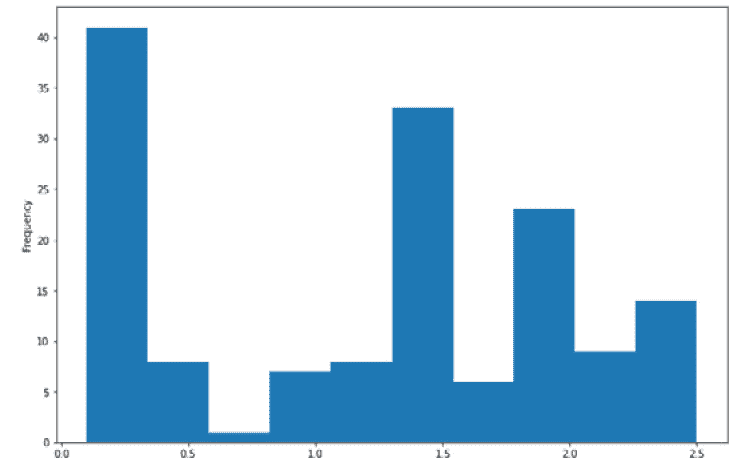

# 第三章：有用的 Python 库

在本章中，我将介绍我们将在本书中使用的几个 Python 库。我会描述它们是什么、如何安装，并给出一些有用的示例。你不需要记住每个 Python 库的所有功能，或者深入理解你使用的每个函数的内部原理。重要的是，你需要知道哪些库是可用的，它们的整体功能是什么，以及库中有哪些关键的时间节省工具（这会让你反复使用）。每个人的使用场景不同，无法记住所有内容。我建议你尽快理解这一点，在需要时学习所需内容。根据需要深入了解库的内部结构。

为了保持条理，我将按照类别来划分软件库。以下是我们将讨论的库：

| **Python 库** | **类别** |
| --- | --- |
| `pandas` | 数据分析与处理 |
| `NumPy` | 数据分析与处理 |
| `Matplotlib` | 数据可视化 |
| `Seaborn` | 数据可视化 |
| `Plotly` | 数据可视化 |
| `NLTK` | 自然语言处理 |
| `spaCy` | 自然语言处理 |
| `NetworkX` | 网络分析与可视化 |
| `Scikit-Network` | 网络可视化（更好） |
| `scikit-learn` | 机器学习 |
| `Karate Club` | 机器学习（图形） |
| `spaCy (重复)` | 机器学习（自然语言处理） |

图 3.1 – 自然语言处理的 Python 库表格

以这种方式划分库非常有用，因为它是合乎逻辑的。我们需要首先收集、处理和分析数据，然后再做其他任何事情。在分析数据的过程中，我们应当进行数据可视化。某些库专注于自然语言处理，其他库专注于网络分析与可视化。最后，有些库对于不同类型的机器学习（ML）非常有用，甚至一些非 ML 专注的库也往往具有 ML 功能，例如 `spaCy`。

我将保持这个介绍的高层次，因为我们将在接下来的章节中实际使用这些库。本章介绍的是关于给定库的“什么”和“为什么”的问题，其他章节将介绍它们的使用方法。

继续之前的最后一点：你不需要记住这些 Python 库的每个方面。在软件开发和数据科学中，技能是逐步积累的。现在学习对你有用的部分，然后如果某个库证明有用，再深入学习。不要因为只知道一些小部分而感到愧疚，知识是随着时间积累的，而不是一蹴而就的。

本章的内容将包括以下几个部分：

+   使用笔记本

+   数据分析与处理

+   数据可视化

+   自然语言处理（NLP）

+   网络分析与可视化

+   机器学习（ML）

# 技术要求

本章将介绍我们在全书中将使用的许多资源。

所有代码都可以在 GitHub 仓库中找到：[`github.com/PacktPublishing/Network-Science-with-Python.`](https://github.com/PacktPublishing/Network-Science-with-Python)

# 使用笔记本

进行数据分析和原型开发时，通常最简单且非常有用的方法是使用我们常亲切地称为**笔记本**的工具。**Jupyter** 将 Jupyter Notebook 定义为一个基于网页的交互式计算平台。我喜欢这个简单的定义。笔记本本质上是一系列可以包含代码或文本的“单元”，这些单元可以单独运行，也可以顺序运行。这使得你可以在网页浏览器中编写代码，在网页浏览器中运行代码，并看到即时的结果。对于数据分析或实验，这种即时反馈非常有用。

在本书中，我们使用 Jupyter Notebook。我建议从 Anaconda 网站下载并安装它。你可以在[`www.anaconda.com`](https://www.anaconda.com)进行下载。

在 Jupyter 中，你可以运行代码并查看该代码的即时结果，无论是文本、数字还是数据可视化。你将在本书中看到很多笔记本的使用，所以我会简短说明。

**Google Colab** 是另一种使用笔记本的选择，你无需安装任何东西即可使用它。这可能是使用笔记本的一种更简便的方式，但它也有优点和缺点。我建议你学习如何使用两者，并选择一个最适合你，或者允许你与他人高效合作的工具。

你可以查看 Google Colab，网址是 [`colab.research.google.com`](https://colab.research.google.com)。

接下来，让我们探索一下我们将在数据分析中使用的库。

# 数据分析与处理

在处理数据时，有许多有用的库，而在数据生命周期的不同阶段，你会希望使用不同的库和技术。例如，在数据处理时，**探索性数据分析**（**EDA**）通常是一个有用的起点。之后，你可能需要进行数据清理、数据整理、预处理时的各种转换等等。下面是一些常用的 Python 库及其用途。

## pandas

`pandas` 无疑是 Python 中进行数据处理时最重要的库之一。简而言之，如果你在 Python 中处理数据，你应该了解 `pandas`，并且很可能应该使用它。你可以在数据处理时使用它做多种不同的事情，例如：

+   从各种文件类型或互联网读取数据

+   EDA

+   **提取、转换、** **加载**（**ETL**）

+   简单快捷的数据可视化

+   还有更多更多的内容

如果有一个 Python 库我会推荐给这个星球上的每一个人——不仅仅是数据专业人士——那就是 `pandas`。能够在不使用电子表格的情况下快速进行数据分析是非常解放且强大的。

### 设置

如果你在 Jupyter 或 Google Colab 笔记本中工作，`pandas` 很可能已经安装好了，你可以直接开始使用它。不过，如果需要，你可以按照官方安装指南操作：[`pandas.pydata.org/docs/getting_started/install.html`](https://pandas.pydata.org/docs/getting_started/install.html)。

一旦安装完成，或者如果你怀疑它已经安装，只需在你喜欢的笔记本中运行这个语句：

```py
import pandas as pd
```

如果 Python 没有提示库未安装，那么你就准备好了。

如果你想查看你正在使用的 `pandas` 版本，可以运行这个语句：

```py
pd.__version__
```

我看到我正在运行版本 1.3.4。

### 启动功能

阅读数据是我帮助大家入门 `pandas` 的首选方式。毕竟，如果没有数据玩，数据工作会非常枯燥。在 `pandas` 中，你通常使用 DataFrame，这是一个类似于数据表或电子表格的数据结构。一个 `pandas` DataFrame 是一个由行和列组成的数据对象。

要将 CSV 文件读取到 `pandas` DataFrame 中，你可以像这样做：

```py
data = 'data/fruit.csv'
df = pd.read_csv(data)
```

我想使用的数据位于当前目录的子目录 `data` 中，文件名为 `fruit.csv`。

一旦数据被读取到 DataFrame 中，你可以预览数据：

```py
df.head()
```

这将显示数据框的前五行预览。


图 3.2 – 简单的 pandas DataFrame

你还可以将其他数据集读取到 `pandas` 中。例如，如果你已经安装了 `scikit-learn`，你可以执行如下操作：

```py
from sklearn import datasets
iris = datasets.load_iris()
df = pd.DataFrame(iris['data'], columns=iris['feature_names'])
df.head()
```

这给我们展示了 *图 3.3*：


图 3.3 – iris 数据集的 pandas DataFrame

`pandas` 不仅仅可以从 CSV 文件读取数据。它非常多才多艺，而且比其他加载 CSV 文件的方法更不容易出错。例如，我常常发现 `pandas` 可以毫无问题地处理这些数据。

什么是 Spark？

Spark 是一种常用于处理大量数据的技术。Spark 对于“大数据”工作负载非常有用。到了一定程度，庞大的数据量可能会超出像 `pandas` 这样的工具的处理能力，了解像 Spark 这样的更强大工具是非常有用的。

这里是一些其他的 `pandas` `read_*` 函数：

+   `pd.read_clipboard()`

+   `pd.read_excel()`

+   `pd.read_feather()`

+   `pd.read_fwf()`

+   `pd.read_gbq()`

+   `pd.read_hdf()`

+   `pd.read_html()`

+   `pd.read_json()`

+   `pd.read_orc()`

+   `pd.read_parquet()`

+   `pd.read_pickle()`

+   `pd.read_sas()`

+   `pd.read_spss()`

+   `pd.read_sql()`

+   `pd.read_sql_query()`

+   `pd.read_sql_table()`

+   `pd.read_stata()`

+   `pd.read_table()`

+   `pd.read_xml()`

这些看起来有点多，我个人并没有全部记住。我通常只使用其中的一小部分，比如 `read_csv`、`read_json` 和 `read_parquet`，但在紧急情况下，`read_html` 偶尔也会很有用。

对我而言，EDA（探索性数据分析）和简单的可视化是我迷上 `pandas` 的原因。例如，如果你想绘制直方图，可以这样做：

```py
df['petal width (cm)'].plot.hist()
```



图 3.4 – 花瓣宽度直方图

`pandas`能做的远不止我展示的内容。关于使用`pandas`进行数据分析的博客文章和书籍不计其数。专门讲解如何使用`pandas`的书籍也写了很多。我鼓励你买几本书，尽可能多地了解这个库。你对`pandas`了解得越多，你在处理数据时就会越得心应手。

### 文档

你可以通过访问这个网站来了解更多关于`pandas`的信息：[`pandas.pydata.org/docs/getting_started/overview.html`](https://pandas.pydata.org/docs/getting_started/overview.html)。

你可以将本书作为参考，以便更熟练地使用`pandas`，但也有许多在线指南可以提供动手练习，例如这个：[`pandas.pydata.org/docs/getting_started/intro_tutorials/01_table_oriented.html`](https://pandas.pydata.org/docs/getting_started/intro_tutorials/01_table_oriented.html)。

## NumPy

`pandas`非常适合对 DataFrame 进行数据分析，`NumPy`则更为通用，包含了各种各样的数学函数和转换。

那它和`pandas`有什么区别呢？这是一个很好的问题，因为这两个库通常是一起使用的。你在使用`pandas`时，通常也会看到`NumPy`。经过几年同时使用这两个库，我通常会先在`pandas`中尝试做某件事，发现做不到，然后发现`NumPy`可以做到。这两个库很好地协作，它们满足不同的需求。

使用`pandas`时，第一次读取 CSV 文件并绘制直方图总是令人兴奋。而使用`NumPy`时，没有什么特别令人兴奋的时刻，它只是非常有用。它是一个强大而多功能的工具，当`pandas`做不到你需要做的事情时，它在紧急情况下能为你省下 9 次中的 10 次。

### 安装

和`pandas`一样，如果你在笔记本环境中工作，`NumPy`可能已经安装好了。不过，如果你需要跟随步骤操作，可以参考官方安装指南：[`numpy.org/install/`](https://numpy.org/install/)。

### 启动功能

如果你想玩一玩`NumPy`，感受一下它能做什么，可以查看他们的快速入门教程，比如[`numpy.org/doc/stable/user/quickstart.html`](https://numpy.org/doc/stable/user/quickstart.html)。在教程中，他们解释了一些基本操作，比如生成随机数、重塑数组、打印数组等等。

### 文档

你可以在[`numpy.org/doc/stable/`](https://numpy.org/doc/stable/)上了解更多关于`NumPy`的信息。在本书中，当`pandas`或其他库无法完成我们需要做的事情时，我们会在紧急情况下依赖`NumPy`，正如我之前描述的那样。通常，`NumPy`中有一个简单的解决方案。因此，注意我们对`NumPy`的使用，并了解其过程。

让我们从分析和处理转向我们将用来可视化数据的库。

# 数据可视化

有几个 Python 库可以用来进行数据可视化。**Matplotlib** 是一个很好的起点，但其他库，如 **Seaborn** 可以生成更具吸引力的可视化，而 **Plotly** 则可以生成交互式可视化。

## Matplotlib

`Matplotlib` 是一个用于数据可视化的 Python 库。就是这样。如果你有数据，`Matplotlib` 很可能可以用来可视化它。该库已直接集成到 `pandas` 中，所以如果你使用 `pandas`，你很可能也在使用 `Matplotlib`。

`Matplotlib` 的学习曲线非常陡峭，根本不直观。我认为如果你在学习 Python 数据科学，它是一个必需的恶魔。不管我用 `Matplotlib` 做多少数据可视化，它都永远不会变得容易，而且我记住的也很少。我这么说并不是为了贬低 `Matplotlib`，而是让你知道，如果你在使用这个库时感到挣扎，不要对自己感到沮丧。我们都在和这个库斗争。

### 设置

和 `pandas` 以及 `NumPy` 一样，如果你在一个笔记本环境中工作，`Matplotlib` 很可能已经安装好了。然而，如果你需要按照步骤进行，你可以按照官方安装指南操作：[`matplotlib.org/stable/users/installing/`](https://matplotlib.org/stable/users/installing/)。

### 启动功能

如果你使用 `pandas` 进行数据可视化，那么你已经在使用 `Matplotlib` 了。例如，在 `pandas` 的讨论中，我们使用了以下代码来绘制直方图：

```py
df['petal width (cm)'].plot.hist()
```

像条形图这样的简单可视化可以很容易地完成。它们最直接地在 `pandas` 中完成。

例如，你可以创建一个水平条形图：

```py
import matplotlib.pyplot as plt
 df['petal width (cm)'].value_counts().plot.barh(figsize=(8,6)).invert_yaxis()
```

这将渲染一个非常简单的数据可视化。


图 3.5 – 花瓣宽度水平条形图

### 文档

`Matplotlib` 的教程部分可能是开始学习的最佳地方：[`matplotlib.org/stable/tutorials/`](https://matplotlib.org/stable/tutorials/)。

然而，在本书中，我们将大量使用 `pandas` 和 `Matplotlib`，所以你应该通过跟随和练习，掌握相当多的知识。

## Seaborn

`Seaborn` 本质上是“美化版的 `Matplotlib`。”它是 `Matplotlib` 的扩展，能够生成更具吸引力的数据可视化。缺点是，一些在 `Matplotlib` 中完全不直观的东西，在 `Seaborn` 中变得更不直观。它有着像 `Matplotlib` 一样的学习曲线，而且学习永远不会记住。我发现每次需要制作可视化时，我都在谷歌搜索。

然而，一旦你开始弄清楚事情，它也没有那么糟。你会开始记得你克服的困难，并且处理那些应该很简单的难题（比如调整可视化的大小）随着时间的推移变得稍微不那么烦人。

这些可视化效果美观，远胜于 `Matplotlib` 的默认设置。浏览 `Seaborn` 可视化示例目录非常有趣：[`seaborn.pydata.org/examples/.`](https://seaborn.pydata.org/examples/.)

我们在本书中偶尔会使用 `Seaborn`，但大多数情况下会使用 `Matplotlib` 和 `scikit-network` 来进行可视化。不过，还是要了解这个库，它非常重要。

### 设置

我不记得笔记本是否已经安装了 `Seaborn`。如果现在已经安装了，我也不会感到惊讶。如果你需要安装 `Seaborn`，可以参考官方安装指南：[`seaborn.pydata.org/installing.html`](https://seaborn.pydata.org/installing.html)。

### 启动功能

`Seaborn` 能做 `Matplotlib` 可以做的事，但做得更好、更漂亮。例如，让我们重新做一下之前创建的直方图，并加上 **核密度估计**（**KDE**）：

```py
import seaborn as sns
sns.histplot(df['petal width (cm)'], kde=True)
```

这将生成以下图表：


图 3.6 – 带有 KDE 的 Seaborn 花瓣宽度直方图

学习 Seaborn 最好的方式就是直接上手。获取一些数据，然后尝试将其可视化。浏览他们的示例画廊，找一些与你的数据相符的例子，然后尝试构建相同的内容。最开始可以复制他们的代码，并尝试调整参数。

### 文档

你可以通过他们的网站了解更多关于 `Seaborn` 的信息：[`seaborn.pydata.org/`](https://seaborn.pydata.org/)。

## Plotly

说实话，我们在本书中不会经常使用 `Plotly`，但是有一章需要使用交互式散点图，`Plotly` 提供了一个非常有用的可视化工具。不过，了解 `Plotly` 还是很有用的，它在需要简单交互的数据可视化时可以成为一个强大的工具。

`Plotly` 宣传称其可以制作交互式、出版质量的图表。仅此而已。它本质上做的是 `Matplotlib` 和 `Seaborn` 所做的工作，但以交互的方式进行。将交互功能添加到 `Matplotlib` 是可能的，但过程比较痛苦。使用 `Plotly`，则既简单又快速，而且过程充满乐趣。

### 设置

若要安装 `Plotly`，请参考其官方指南：[`plotly.com/python/getting-started/#installation`](https://plotly.com/python/getting-started/#installation)。

### 启动功能

他们的网站有一个非常有趣和互动的画廊，可以激发创意。我建议你先阅读他们的入门指南，探索他们的示例：[`plotly.com/python/getting-started/`](https://plotly.com/python/getting-started/)。

我们将在 *sw* 中使用 `Plotly`，*《网络数据的无监督机器学习》*。


图 3.7 – Plotly 交互式散点图

### 文档

你可以在他们的网站上学到更多关于 `Plotly` 的知识：[`plotly.com/python/`](https://plotly.com/python/)。

现在我们已经介绍了一些用于数据可视化的有用库，接下来我们将做同样的事情，针对自然语言处理（NLP）和文本处理。

# 自然语言处理（NLP）

从数据可视化转到 NLP，仍有几个 Python 库会对我们处理文本数据有所帮助。每个库都有独特的功能、优点和缺点，文档需要仔细阅读。

## 自然语言工具包

`NLTK`是一个较老的 Python 库，通常对于曾经用`NLTK`完成的任务（例如命名实体识别或词性标注），使用`spaCy`等其他库会更好。

然而，仅仅因为它较老并不意味着它已经过时。它仍然非常适合分析文本数据，并且提供了比`spaCy`等库更多的语言学功能。

简而言之，`NLTK`是做 Python NLP 的基础性库，你不应跳过它，去直接使用更新的库和方法。

## 设置

安装`NLTK`非常简单。只需按照指南操作：[`www.nltk.org/install.html`](https://www.nltk.org/install.html)。

## 启动功能

在本书中，我们将大量使用`NLTK`。当你准备好时，跳入下一章，我们会立刻开始。作为入门功能，并没有什么特别值得展示的。随着学习的深入，NLP 变得更为有趣。起初，它至少有点让人困惑。

## 文档

`NLTK`网站作为学习工具并不太有用，但你可以在这里看到一些代码片段和示例：[`www.nltk.org`](https://www.nltk.org)。

如今，你很可能通过博客文章（*TowardsDataScience*等）了解`NLTK`，而非通过官方`NLTK`网站。如果你想从其他来源学习，可以搜索“`nltk getting started`”，会找到一些有用的指南。

本书将足以帮助你入门`NLTK`，但我确实建议向其他撰写关于 NLP 文章的作者学习。NLP 有太多内容值得学习和探索。

## spaCy

`NLTK`。例如，如果你正在做命名实体识别、词性标注或词形还原，我建议你使用`spaCy`，因为它更快捷且简单，能够获得较好的结果。然而，`NLTK`的数据加载器、停用词、分词器和其他语言学工具依然非常有用，而且有时候`spaCy`无法匹敌。个人认为，如果你从事 Python 中的 NLP 工作，应该同时学习`NLTK`和`spaCy`，而不仅仅是`spaCy`。了解两者，并记住`spaCy`在某些方面比`NLTK`更强。

### 设置

要安装`spaCy`，请使用官方安装指南：[`spacy.io/usage#quickstart`](https://spacy.io/usage#quickstart)。

### 启动功能

在本书中，你将看到`spaCy`的使用，尤其是在命名实体识别方面，这对图谱构建非常有用。如果你想看到它的实际应用，可以跳到后面。

例如，让我们安装语言模型，如下所示：

```py
!python -m spacy download en_core_web_sm
```

我们可以运行这段代码：

```py
import spacy
nlp = spacy.load("en_core_web_sm")
doc = nlp("David Knickerbocker wrote this book, and today is September 4, 2022.")
for ent in doc.ents:
    print(ent.text, ent.label_)
```

这将输出一些命名实体识别（NER）结果：

```py
David Knickerbocker PERSON
today DATE
September 4, 2022 DATE
```

你可能会想，它是怎么做到的呢？是魔法！开个玩笑——其实是机器学习。

### 文档

与`NLTK`不同，`spaCy`的文档非常详尽且有帮助，而且看起来现代化。我建议你花大量时间在他们的网站上，了解它的功能。`spaCy`能做的事情远比本书所涵盖的要多。要了解更多内容，请访问[`spacy.io/usage/linguistic-features`](https://spacy.io/usage/linguistic-features)。

# 网络分析与可视化

我们接下来要使用的几种库对于分析和可视化各种类型的网络很有用。网络可视化是数据可视化的另一种形式，但专门针对网络。没有网络可视化软件，创建有用的网络可视化是非常困难和繁琐的。

# `NetworkX`

`NetworkX`，没有比这更好的资源来进行 Python 中的网络分析了。

还有其他库可以用于非常简单的网络可视化。在本书中，我忽略了这些，并展示了如何使用`NetworkX`和`scikit-network`进行良好的网络分析并制作出相对美观的网络可视化。

还有其他一些库可以与`NetworkX`一起使用，用于社区检测或分析网络的脆弱性等，但`NetworkX`是核心。我写这本书的目的是传播网络科学的知识以及在软件开发中使用网络的理念，而`NetworkX`对于这一目标至关重要。我希望更多的软件工程师能够掌握这些技能。

### 设置

请按照官方指南安装`NetworkX`：[`networkx.org/documentation/stable/install.html`](https://networkx.org/documentation/stable/install.html)。

### 启动功能

我们将用`NetworkX`做很多非常酷的事情，但如果你想确认它是否正常工作，你可以运行这段代码：

```py
import networkx as nx
G = nx.les_miserables_graph()
sorted(G.nodes)[0:10]
```

在一本笔记本中，这应该显示一个 Python 列表，包含*悲惨世界*图中的前 10 个节点：

```py
['Anzelma',
 'Babet',
 'Bahorel',
 'Bamatabois',
 'BaronessT',
 'Blacheville',
 'Bossuet',
 'Boulatruelle',
 'Brevet',
 'Brujon']
```

或者，你也可以这样做，快速获取*悲惨世界*图的概览：

```py
print(nx.info(G))
Graph with 77 nodes and 254 edges
```

### 文档

学习`NetworkX`的最佳方式可能就是阅读这本书。关于如何使用`NetworkX`的书籍非常少。也有一些博客文章，`NetworkX`网站上的一些指南也很有帮助。这里有一个，但它假设你已经理解了图的概念：[`networkx.org/documentation/stable/tutorial.html`](https://networkx.org/documentation/stable/tutorial.html)。

该网站确实有非常详细的文档，介绍了不同工具的使用：[`networkx.org/documentation/stable/reference/`](https://networkx.org/documentation/stable/reference/)。

我最喜欢他们在线资源的一部分是，他们会指向关于已实现功能的学术论文。例如，如果你访问**链接预测**部分中的**优先附加**页面，你会看到这个块：


图 3.8 – NetworkX 参考

在多次场合中，我很喜欢深入研究开发几个算法背后的编写工作。了解背景是很有意义的，算法绝对不应该被盲目使用。如果你要使用一个工具，了解它的工作原理，以及它在哪些方面可能不起作用。

## scikit-network

`NetworkX`的可视化速度很慢，以至于我不会教它们。即使在小型网络上，它们的渲染也需要很长时间，而且其外观单调且基础。另一方面，`scikit-network`的可视化加载非常快速，因为它们是以 SVG 格式渲染的。即使你有成百上千个节点，加载速度也很合理。

然而，将其视为一个用于分析大规模图形的包并不准确。从本质上讲，这是一款可视化软件，尽管它的功能稍微超出了这个范围。看起来他们已经加入了一些额外的功能（例如**图神经网络**（**GNNs**）），但大多数文档页面还是侧重于可视化。不过，还是可以看看他们在嵌入和社区检测方面的工作。似乎他们正在朝着超越网络可视化的方向发展，这个库也在不断演化。

### 设置

要安装`scikit-network`，请按照官方指南操作：[`scikit-network.readthedocs.io/en/latest/first_steps.html`](https://scikit-network.readthedocs.io/en/latest/first_steps.html)。

### 启动功能

在本书中，我们将仅使用`scikit-network`进行网络可视化，因此如果你想开始使用它，请查看他们的一些教程，例如[`scikit-network.readthedocs.io/en/latest/tutorials/visualization/graphs.html`](https://scikit-network.readthedocs.io/en/latest/tutorials/visualization/graphs.html)。有多个教程可以帮助你深入了解这个库。

### 文档

`scikit-network`的文档非常好且组织得很有条理。文档的简洁性表明它实际上并不是一个非常深奥的 Python 库。如果你想深入了解，先从这里开始：[`scikit-network.readthedocs.io/en/latest/`](https://scikit-network.readthedocs.io/en/latest/)。

你可能会想，既然`scikit-network`还提供一些机器学习、社区检测和其他功能，为什么我只用它来做可视化呢？原因是这样的：`NetworkX`和`KarateClub`也提供类似的功能，而且它们做得更好。例如，`KarateClub`提供的功能更强，而`NetworkX`提供的`scikit-network`功能也能很好地实现，而且更干净。

这就是为什么我只展示它在可视化方面的使用。其他功能并未表现得比`NetworkX`和`KarateClub`提供的更好。这并非针对个人。每个人都有自己喜欢的工具。

在接下来的章节中，我们将讨论可以用于机器学习的库。

# 机器学习

Python 还有一组用于机器学习的库。了解 Python 库和算法是不够的。请尽可能多地了解你将使用的模型和技术。总是有更多东西可以学习。以下是你可能经常使用的一些库。

## scikit-learn

`TensorFlow` 和 `PyTorch`，但我们在本书中不会直接使用它们。只需知道它们的存在，并且随着你的机器学习技能的提高，你应该了解它们。

如果你正在学习或使用 Python 进行机器学习，你很快就会接触到`scikit-learn`。`scikit-learn` 提供了大量的机器学习模型、数据加载器、预处理器、转换器等等。有很多关于`scikit-learn`的书籍和博客文章，包括一些由 Packt 出版的。如果你有兴趣学习机器学习，你会阅读很多内容，而`scikit-learn`是一个很好的起点。

### 设置

如果你在使用笔记本，那么`scikit-learn`可能已经安装好了。但是，如果你需要安装它，请按照官方指南操作：[`scikit-learn.org/stable/install.html`](https://scikit-learn.org/stable/install.html)。

### 初学者功能

机器学习很复杂，构建和使用模型需要多个步骤。现在，只需确保安装了`scikit-learn`并且能够查看运行的版本：

```py
import sklearn
sklearn.__version__
```

对我来说，这表明我正在运行版本`1.0.2`。对于本书的练习，我们不需要精确匹配，但是在实际部署中，所有库的版本应保持一致以确保可复现性。

### 文档

关于`scikit-learn`的资源比我在本章提到的其他每个 Python 库的资源都要多。机器学习是一个热门话题，对书籍、博客文章、视频和其他教程的需求很大，因此学习资源丰富。然而，`scikit-learn`文档是开始学习的地方。

`scikit-learn`入门指南可以在这里找到：[`scikit-learn.org/stable/getting_started.html`](https://scikit-learn.org/stable/getting_started.html)。

完整的用户指南可以在[`scikit-learn.org/stable/user_guide.html`](https://scikit-learn.org/stable/user_guide.html)找到，并且还有一个 API 参考文档在[`scikit-learn.org/stable/modules/classes.html`](https://scikit-learn.org/stable/modules/classes.html)。

在本书中，我们将进行一些监督和无监督的机器学习，但不会深入讨论。如果你有兴趣，还有很多东西可以学习。本书只是浅尝辄止地介绍了机器学习，希望能引发你的兴趣。

## 空手道俱乐部

`NetworkX`。换句话说，`Karate Club`弥合了机器学习和图形分析之间的差距。它提供了几种有用的无监督学习模型，可用于社区检测以及从图形中创建节点嵌入，这些嵌入可以用于下游的有监督学习任务。这通常被称为图形机器学习，且目前人们对将图形和机器学习结合使用非常感兴趣，例如预测新连接（谁应该成为朋友，谁会喜欢某种音乐或产品等）。

这和`scikit-learn`有什么区别？`scikit-learn`可以用于任何数字数据，而`Karate Club`专注于通过无监督机器学习将图形转换为数字数据。`Karate Club`的输出可以作为`scikit-learn`的输入，但反过来却很少。

要使`Karate Club`有用，你需要图形（`NetworkX`）和机器学习（`scikit-learn`、`TensorFlow`、`PyTorch`等）。`Karate Club`本身的用途有限。

`Karate Club`尚不支持更高版本的 Python，如 3.10。

### 设置

要安装`Karate Club`，请按照官方指南：[`karateclub.readthedocs.io/en/latest/notes/installation.html`](https://karateclub.readthedocs.io/en/latest/notes/installation.html)。

### 入门功能

没有值得展示的入门功能。机器学习很复杂，需要几个步骤才能真正有用。现在，我们只需要验证库是否已安装，并且可以看到版本号：

```py
import karateclub
karateclub.__version__
```

我可以看到我正在运行的版本是`1.3.0`。

### 文档

`Karate Club`提供了一个入门指南：[`karateclub.readthedocs.io/en/latest/notes/introduction.html`](https://karateclub.readthedocs.io/en/latest/notes/introduction.html)。在这里，你可以开始了解如何使用该库。你还可能会注意到一些对其他库的引用，如`scikit-learn`。

`Karate Club`拥有出色的文档。你可以在[`karateclub.readthedocs.io/en/latest/modules/root.html`](https://karateclub.readthedocs.io/en/latest/modules/root.html)找到它。我最喜欢的一点是，他们会引用关于这些模型的期刊文章。例如，如果你查看任何算法的文档，通常会找到提到关于该模型的论文。


图 3.9 – 空手道俱乐部文档参考

在本书中，我查看了多个`Karate Club`模型，因此有机会阅读许多相关的论文，这也给了我很多小时的乐趣。我非常喜欢这个。

如果你在代码中使用`Karate Club`，你也可以在笔记本中看到提到这篇论文的内容，只需在函数调用时按下*Shift* + *Tab*：


图 3.10 – 空手道俱乐部代码参考

这个库不仅使用起来令人兴奋，学习它也具有很高的教育价值。

## spaCy（再探）

是的，我又提到`spaCy`了。为什么？因为`spaCy`提供了多个语言模型，而且涵盖了多种语言。这意味着你可以将`spaCy`预训练的机器学习模型用于自己的目的，例如用于命名实体识别。它们的模型已经过训练，可以直接导入并使用。在本书的接下来的几章中，你将学习如何做到这一点。

# 总结

本书中还会使用其他一些 Python 库，但它们将在相关章节中进行解释。在本章中，我想描述我们将用于工作的主要库。为了能够进入本书讨论的真正实验性内容，我们需要打下基础。

例如，你需要能够读取和分析表格（结构化）数据。你还需要能够将数据可视化。对于文本，你需要能够将文本转换为适合分析和使用的格式。对于图表，你也需要具备相同的能力。最后，如果你想将机器学习应用于网络或文本，你应该理解如何做到这一点。

这就是为什么本节被分解为数据分析与处理、数据可视化、自然语言处理、网络分析与可视化以及机器学习。我希望这样的结构能有所帮助。

在安装并简要解释了这些库之后，我们现在可以开始深入探索网络科学、社交网络分析和自然语言处理，所有这些都将在 Python 中进行。

# 第二部分：图表构建与清理

网络数据并不总是存在于分析师感兴趣的研究中。本部分的章节展示了如何从各种在线资源中提取文本数据，并将其转换为可以分析的网络。这些章节还介绍了数据处理步骤，用于清理网络，以便进行分析和后续处理。

本节包括以下章节：

+   *第四章**，自然语言处理与网络协同作用*

+   *第五章**，更简单的网页抓取*

+   *第六章**，图表构建与清理*
