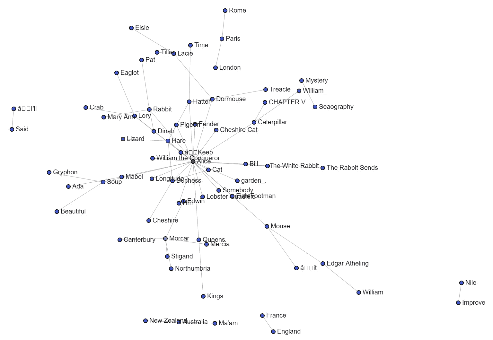

# 第四章：NLP 和网络的协同作用

在前几章中，我们讨论了**自然语言处理**（**NLP**）、网络分析以及在 Python 编程语言中用于这两者的工具。我们还讨论了用于进行网络分析的非编程工具。

在本章中，我们将把所有这些知识付诸实践。我希望能解释通过结合 NLP 和网络分析所揭示的强大功能和洞察力，这也是本书的主题。在后续章节中，我们将继续围绕这一主题展开讨论，同时还会涉及其他用于处理 NLP 和网络的工具，如无监督和监督的机器学习。本章将展示确定文本片段所讲述的对象或内容的技术。

本章将涵盖以下主题：

+   为什么我们在一本网络书中学习 NLP？

+   提出问题讲述故事

+   介绍网页抓取

+   在库、API 和源数据之间进行选择

+   使用自然语言工具包（NLTK）库进行词性标注（PoS）

+   使用 spaCy 进行词性标注和命名实体识别（NER）

+   将实体列表转换为网络数据

+   将网络数据转换为网络

+   做网络可视化的抽查

# 技术要求

在本章中，我们将使用几种不同的 Python 库。在每一节中都会列出`pip install`命令来安装每个库，因此只需要跟着做，按需进行安装。如果遇到安装问题，通常可以在 Stack Overflow 上找到答案。用 Google 搜索错误信息！

在开始之前，我想解释一件事，这样我们使用的库的数量就不会显得那么令人不知所措。重要的是我们使用每个库的理由。

本书的大部分内容将会做三件事之一：网络分析、网络可视化，或使用网络数据进行机器学习（也称为 GraphML）。

每当我们处理网络数据时，我们都会使用`NetworkX`来操作它。

每当我们进行分析时，可能会使用`pandas`。

关系看起来是这样的：

+   `NetworkX`

+   `pandas`

+   `scikit-network`

+   `scikit-learn` 和 `Karate Club`

看看最开始的几个词。如果我要进行网络分析，我会使用`NetworkX`和`pandas`。如果我要做网络可视化，我会使用`NetworkX`和`scikit-network`。如果我要用网络数据做机器学习，我会使用`NetworkX`、`scikit-learn`，可能还会使用`Karate Club`。

这些是本章中将使用的核心库。

此外，*你必须随时准备好`draw_graph()`* *函数的代码*，因为你将在本书中多次使用它。那段代码有点复杂，因为在写作时它确实需要这样做。不幸的是，`NetworkX`在网络可视化方面并不优秀，而`scikit-network`在网络构建或分析方面也不够强大，所以我将两者结合起来进行可视化，这效果很好。我希望这本书的后续版本中，网络可视化能够得到改进和简化。

所有必要的代码可以在[`github.com/PacktPublishing/Network-Science-with-Python`](https://github.com/PacktPublishing/Network-Science-with-Python)找到。

# 为什么我们在一本网络书中学习 NLP？

我在第一章的介绍中简要回答了这个问题，但值得更详细地重复一遍。许多从事文本分析工作的人都知道情感分析和文本分类。**文本分类**是预测一段文本是否可以被归类为某种类型的能力。例如，我们来看这个字符串：

“*你今天* *怎么样？*”

我们能从这段字符串中得出什么结论？这是一个问题还是陈述？这是一个问题。这个问题是问谁的？是问你。这个问题中有积极、消极还是中立的情绪？我觉得它看起来是中立的。我们再试试另一段字符串。

“*Jack 和 Jill 爬上了山坡，但 Jack 跌倒了，因为他是* *个傻瓜。*”

这是关于 Jack 和 Jill 的陈述，其中 Jack 被称为傻瓜，这并不是个很友善的说法。然而，这个侮辱似乎是开玩笑写的，因此不清楚作者写的时候是生气还是在笑。我可以确认，在写这句话时我是在笑的，所以其中包含了积极的情绪，但文本分类可能难以识别这一点。我们再试试另一个。

“*我这一生从未像现在这样愤怒过!* *真是愤怒到了极点!*”

作者表达了非常强烈的负面情绪。情感分析和文本分类很容易识别这一点。

**情感分析**是一种使用算法自动检测文本或转录记录中嵌入的情绪的技术集合。文本分类使用相同的算法，但其目标不是识别情绪，而是识别主题。例如，文本分类可以检测文本中是否存在侮辱性语言。

这不是关于情感分析或文本分类的章节。本章节的目的是解释如何自动提取文本中存在的实体（人物、地点、事物等），以便识别和研究文本中描述的社交网络。然而，情感分析和文本分类可以与这些技术结合，为社交网络提供更多上下文，或者用于构建专门的社交网络，例如友谊网络。

# 提出问题来讲述故事

我从讲故事的角度进行工作；我让我的故事决定工作，而不是反过来。例如，如果我开始一个项目，我会考虑，甚至写下关于谁、什么、哪里、何时、为什么和如何的一系列问题：

+   我们有哪些数据？足够吗？

+   我们从哪里获得更多数据？

+   我们如何获得更多数据？

+   什么阻碍了我们获取更多数据？

+   我们多久需要更多数据？

但这是一个不同类型的项目。我们想要深入了解一篇文本的内容，而不仅仅是通过阅读来获得信息。即使读完一本书后，大多数人也无法记住文本中描述的关系，而且即使记得，也可能是错误的回忆。但我们应该有这样的疑问：

+   文中提到了谁？

+   他们认识谁？

+   他们的对手是谁？

+   这篇文章的主题是什么？

+   存在哪些情感？

+   文中提到了哪些地方？

+   这件事发生在什么时候？

在开始任何形式的分析之前，制定一套可靠的问题非常重要。深入分析时，你会遇到更多的问题。

本章将为你提供工具，自动调查所有这些问题，除了关于主题和对手的问题。本章的知识，再加上对文本分类和情感分析的理解，将使你能够回答*所有*这些问题。这就是本章的“为什么”。我们希望自动提取文中提到的人、地点，甚至可能还有一些事物。大多数时候，我只想要人物和地点，因为我想研究社交网络。

然而，重要的是要解释清楚，这对于辅助文本分类和情感分析非常有用。例如，如果你不知道正在评审的内容，正面的亚马逊或 Yelp 评论几乎没有什么意义。

在我们进行任何揭示文本中存在的关系的工作之前，我们需要获取一些文本。作为练习，我们有几个选择。我们可以使用像 NLTK 这样的 Python 库加载它，我们可以使用 Twitter（或其他社交网络）库收集它，或者我们可以自己抓取它。即使是抓取也有不同的方式，但我只会解释一种方法：使用 Python 的`BeautifulSoup`库。只要知道有很多选择，但我喜欢`BeautifulSoup`的灵活性。

在本章中，演示将使用从互联网上抓取的文本，你可以对代码做些小修改，以适应你自己的网页抓取需求。

# 介绍网页抓取

首先，什么是 **网页抓取**，谁能做呢？任何具有编程技能的人都可以使用几种不同的编程语言进行抓取，但我们将使用 Python。网页抓取是从网络资源中获取内容的行为，您可以将数据用于您的产品和软件。您可以使用抓取来获取网站没有通过数据馈送或 API 暴露的信息。但有一个警告：不要抓取得过于激进，否则您可能会通过意外的 **拒绝服务攻击**（**DoS**）击垮一个网站服务器。只获取您需要的内容，按需获取。慢慢来，不要贪婪或自私。

## 介绍 BeautifulSoup

**BeautifulSoup** 是一个强大的 Python 库，用于抓取您可以访问的任何在线内容。我经常用它从新闻网站收集故事的 URL，然后我抓取这些 URL 的文本内容。我通常不需要实际的 HTML、CSS 或 JavaScript，所以我会渲染网页，然后抓取内容。

`BeautifulSoup` 是一个重要的 Python 库，如果您打算进行网页抓取，了解它非常重要。虽然 Python 还有其他网页抓取选项，但 `BeautifulSoup` 是最常用的。

没有什么比看到 `BeautifulSoup` 在实际操作中的效果更能解释它的了，所以让我们开始吧！

## 使用 BeautifulSoup 加载和抓取数据

在这个实践演示中，我们将看到三种不同的加载和抓取数据的方式。它们各自独立都有用，但也可以以多种方式结合使用。

首先，最简单的方法是使用一个库，一次性获取您想要的内容，且需要最少的清理。多个库，如 `pandas`、`Wikipedia` 和 `NLTK` 都有加载数据的方法，让我们从这些开始。由于本书主要讲解如何从文本中提取关系并进行分析，因此我们需要文本数据。我将演示几种方法，然后描述每种方法的优缺点。

### Python 库 – Wikipedia

有一个强大的库可以从维基百科中提取数据，叫做 `Wikipedia`。您可以通过运行以下命令安装它：

```py
pip install wikipedia
```

安装完成后，您可以像这样将其导入到代码中：

```py
import wikipedia as wiki
```

一旦导入，您就可以通过编程方式访问维基百科，允许您搜索并使用任何您感兴趣的内容。由于在本书中我们将进行大量的社交网络分析，让我们看看 `Wikipedia` 对该主题有什么内容：

```py
search_string = 'Social Network Analysis'
page = wiki.page(search_string)
content = page.content
content[0:680]
```

最后一行，`content[0:680]`，仅显示 `content` 字符串中的内容，直到第 680 个字符，这是以下代码中展示的句子的结束部分。680 之后还有很多内容。我选择在此演示中截断它：

```py
'Social network analysis (SNA) is the process of investigating social structures  through the use of networks and graph theory. It characterizes networked structures in terms of nodes (individual actors, people, or things within the network) and the ties, edges, or links (relationships or interactions) that connect them.  Examples of social structures commonly visualized through social network analysis include social media networks, memes spread, information circulation, friendship and acquaintance networks, business networks, knowledge networks, difficult working relationships, social networks, collaboration graphs, kinship, disease transmission, and sexual relationships.'
```

通过几行代码，我们能够直接从维基百科中提取文本数据。我们能看到那个维基百科页面上有什么链接吗？是的，我们可以！

```py
links = page.links
links[0:10]
```

我使用方括号`[`，只选择 `links` 中的前 10 项：

```py
['Actor-network theory',
 'Adjacency list',
 'Adjacency matrix',
 'Adolescent cliques',
 'Agent-based model',
 'Algorithm',
 'Alpha centrality',
 'Anatol Rapoport',
 'Anthropology',
 'ArXiv (identifier)']
```

如果我们仅选择前 10 个链接并只在 A 链接中，那么我认为可以安全地说，可能还有更多。维基百科上关于社交网络分析的内容非常丰富！这真的很简单！让我们继续尝试另一种便捷的抓取方法：`pandas`库。

### Python 库 – pandas

如果你有兴趣使用 Python 进行数据科学，你将不可避免地学习和使用`pandas`。这个库在处理数据时非常强大和多功能。在这个演示中，我将用它从网页中提取表格数据，但它可以做更多的事情。如果你对数据科学感兴趣，尽可能多地学习关于`pandas`的知识，并熟悉它的使用。

`pandas`可以从网页中提取表格数据，但它对原始文本的处理能力较弱。如果你想从维基百科加载文本，应该使用之前提到的`Wikipedia`库。如果你想从其他网页提取文本，则应该同时使用`Requests`和`BeautifulSoup`库。

让我们使用`pandas`从维基百科提取一些表格数据。首先，尝试使用`pandas`抓取同一个维基百科页面，看看我们能得到什么。如果你已经在电脑上安装了 Jupyter，那么很可能你已经安装了`pandas`，所以让我们直接进入代码：

1.  首先导入`pandas`库：

    ```py
    import pandas as pd
    ```

    ```py
    url = 'https://en.wikipedia.org/wiki/Social_network_analysis'
    ```

    ```py
    data = pd.read_html(url)
    ```

    ```py
    type(data)
    ```

在这里，我们导入了`pandas`库并给它起了一个简短的名字，然后使用`pandas`读取了关于社交网络分析的同一维基百科页面。我们得到了什么？`type(data)`显示了什么？我预计会得到一个`pandas` DataFrame。

1.  输入以下代码。只需输入`data`并运行代码：

    ```py
    data
    ```

你应该看到我们得到了一个列表。在`pandas`中，如果你执行`read`操作，通常会得到一个 DataFrame，那么为什么我们得到了一个列表呢？这是因为该页面上有多个数据表，因此`pandas`返回了所有表格的 Python 列表。

1.  让我们检查一下列表的元素：

    ```py
    data[0]
    ```

这应该会给我们一个来自维基百科页面的第一个表格的`pandas` DataFrame：


图 4.1 – pandas DataFrame 显示维基百科数据的第一个元素

这些数据看起来有点问题。为什么我们在表格中看到一堆文本？为什么最后一行看起来像是一堆代码？下一个表格是什么样子的呢？

```py
data[1]
```

这将给我们一个来自同一维基百科页面的第二个表格的`pandas` DataFrame。请注意，维基百科页面偶尔会被编辑，因此您的结果可能会有所不同：


图 4.2 – pandas DataFrame 显示维基百科数据的第二个元素

糟糕。这看起来更糟。我之所以这么说，是因为似乎有一些非常短的字符串，看起来像是网页部分。这看起来不太有用。记住，`pandas`非常适合加载表格数据，但对于维基百科使用的文本数据表格并不适用。我们已经看到，这比我们通过维基百科库轻松捕获的数据更没用。

1.  让我们尝试一个包含有用数据的页面。这个页面包含关于俄勒冈州犯罪的表格数据：

    ```py
    url = 'https://en.wikipedia.org/wiki/Crime_in_Oregon'
    ```

    ```py
    data = pd.read_html(url)
    ```

    ```py
    df = data[1]
    ```

    ```py
    df.tail()
    ```

这将展示一个包含俄勒冈州犯罪数据的`Pandas`数据框架中的最后五行：


图 4.3 – Pandas 数据框架中的维基百科表格数值数据

哇，这看起来是有用的数据。然而，数据中没有显示 2009 年以后的信息，这已经是相当久远的时间了。也许有一个更好的数据集，我们应该使用那个。无论如何，这显示了`Pandas`能够轻松地从网上抓取表格数据。然而，有几点需要注意。

首先，如果你在项目中使用抓取的数据，知道自己已经把自己交给了网站管理员的支配。如果他们决定丢弃数据表，或者重命名或重新排序列，那么直接从维基百科读取数据的应用程序可能会崩溃。你可以通过在抓取数据时保留本地数据副本以及在代码中加入错误处理来防范这种情况。

为最坏的情况做好准备。当你进行数据抓取时，要建立必要的错误检查机制，并且知道何时抓取程序无法再拉取数据。接下来我们将转向下一种方法——使用`NLTK`。

### Python 库 – NLTK

让我们直奔主题：

1.  首先，NLTK 并不随 Jupyter 安装，因此你需要自行安装。你可以使用以下命令安装：

    ```py
    pip install nltk
    ```

1.  Python 的**NLTK**库可以轻松地从古腾堡计划中提取数据，古腾堡计划是一个包含超过 60,000 本免费书籍的库。让我们看看我们能获取到什么：

    ```py
    from nltk.corpus import gutenberg
    ```

    ```py
    gutenberg.fileids()
    ```

    ```py
    …
    ```

    ```py
    ['austen-emma.txt',
    ```

    ```py
     'austen-persuasion.txt',
    ```

    ```py
     'austen-sense.txt',
    ```

    ```py
     'bible-kjv.txt',
    ```

    ```py
     'blake-poems.txt',
    ```

    ```py
     'bryant-stories.txt',
    ```

    ```py
     'burgess-busterbrown.txt',
    ```

    ```py
     'carroll-alice.txt',
    ```

    ```py
     'chesterton-ball.txt',
    ```

    ```py
     'chesterton-brown.txt',
    ```

    ```py
     'chesterton-thursday.txt',
    ```

    ```py
     'edgeworth-parents.txt',
    ```

    ```py
     'melville-moby_dick.txt',
    ```

    ```py
     'milton-paradise.txt',
    ```

    ```py
     'shakespeare-caesar.txt',
    ```

    ```py
     'shakespeare-hamlet.txt',
    ```

    ```py
     'shakespeare-macbeth.txt',
    ```

    ```py
     'whitman-leaves.txt']
    ```

如你所见，结果远远少于 60,000 个，因此我们通过这种方式能获取的内容有限，但这仍然是练习自然语言处理（NLP）有用的数据。

1.  让我们看看`blake-poems.txt`文件中有什么内容：

    ```py
    file = 'blake-poems.txt'
    ```

    ```py
    data = gutenberg.raw(file)
    ```

    ```py
    data[0:600]
    ```

    ```py
    …
    ```

    ```py
    '[Poems by William Blake 1789]\n\n \nSONGS OF INNOCENCE AND OF EXPERIENCE\nand THE BOOK of THEL\n\n\n SONGS OF INNOCENCE\n \n \n INTRODUCTION\n \n Piping down the valleys wild,\n   Piping songs of pleasant glee,\n On a cloud I saw a child,\n   And he laughing said to me:\n \n "Pipe a song about a Lamb!"\n   So I piped with merry cheer.\n "Piper, pipe that song again;"\n   So I piped: he wept to hear.\n \n "Drop thy pipe, thy happy pipe;\n   Sing thy songs of happy cheer:!"\n So I sang the same again,\n   While he wept with joy to hear.\n \n "Piper, sit thee down and write\n   In a book, that all may read."\n So he vanish\'d'
    ```

我们可以加载整个文件。文件内容比较凌乱，包含了换行符和其他格式，但我们会清理这些内容。如果我们想要获取不在此列表中的其他书籍，而这些书籍位于包含 60,000 本书的完整库中，该怎么办呢？我们就没机会了吗？浏览网站时，我看到我可以阅读我最喜欢的书之一——弗朗茨·卡夫卡的*《变形记》*，网址是[`www.gutenberg.org/files/5200/5200-0.txt`](https://www.gutenberg.org/files/5200/5200-0.txt)。让我们尝试获取这个数据，不过这次我们将使用 Python 的 Requests 库。

### Python 库 – Requests

**Requests**库随 Python 预安装，所以你只需要导入它。Requests 用于从网页抓取原始文本，但它的功能不止如此。请研究这个库，了解它的更多功能。

重要提示

如果你使用这种方法，请注意不要过于激进。像这样一次加载一本书是可以的，但如果你尝试一次性下载太多书籍，或者在古腾堡项目上过于激烈地抓取所有书籍，你很可能会暂时被封禁 IP 地址。

在我们的演示中，首先导入库，然后从古腾堡提供的*变形记*中抓取原始文本：

```py
import requests
url = 'https://www.gutenberg.org/files/5200/5200-0.txt'
data = requests.get(url).text
data
…
'The Project Gutenberg eBook of Metamorphosis, by Franz Kafka\r\n\r\nThis eBook is for the use of anyone anywhere in the United States and\r\nmost other parts of the world at no cost and with almost no restrictions\r\nwhatsoever. You may copy it, give it away or re-use it under the terms\r\nof the Project Gutenberg License included with this eBook or online at\r\nwww.gutenberg.org. If you are not located in the United States, you\r\nwill have to check the laws of the country where you are located before\r\nusing this eBook.\r\n\r\n** This is a COPYRIGHTED Project Gutenberg eBook, Details Below **\r\n**     Please follow the copyright guidelines in this file.     *\r\n\r\nTitle: Metamorphosis\r\n\r\nAuthor: Franz Kafka\r\n\r\nTranslator: David Wyllie\r\n\r\nRelease Date: May 13, 2002 [eBook #5200]\r\n[Most recently updated: May 20, 2012]\r\n\r\nLanguage: English\r\n\r\nCharacter set encoding: UTF-8\r\n\r\nCopyright (C) 2002 by David Wyllie.\r\n\r\n*** START OF THE PROJECT GUTENBERG EBOOK METAMORPHOSIS ***\r\n\r\n\r\n\r\n\r\nMetamorphosis\r\n\r\nby Franz Kafka\r\n\r\nTranslated by David Wyllie\r\n\r\n\r\n\r\n\r\nI\r\n\r\n\r\nOne morning, when Gregor Samsa woke from troubled dreams, he found\r\nhimself transformed in his bed into a horrible vermin…'
```

我将所有在“`vermin`”之后的文本剪切掉，目的是简要展示数据中的内容。就这样，我们得到了整本书的完整文本。正如在 NLTK 中一样，数据充满了格式和其他字符，因此这些数据需要清理才能变得有用。清理是本书中我将解释的每一部分的一个非常重要的环节。我们继续吧；在这些演示中，我会展示一些清理文本的方法。

我已经展示了从古腾堡或维基百科提取文本是多么简单。但这两者只是互联网中可供抓取的内容的一小部分。`pandas`可以从任何网页读取表格数据，但它是有限的。大部分网页内容并非完美格式化或干净的。如果我们想要设置爬虫从我们感兴趣的各种新闻网站上收集文本和内容怎么办？NLTK 无法帮助我们获取这些数据，而 Pandas 在返回的数据上也有限制。我们有哪些选择呢？我们看到`Requests`库能够拉取另一本通过 NLTK 无法获取的古腾堡书籍。我们能否像这样使用 requests 从网站抓取 HTML 呢？让我们尝试抓取一些来自日本冲绳的新闻吧！

```py
url = 'http://english.ryukyushimpo.jp/'
data = requests.get(url).text
data
'<!DOCTYPE html PUBLIC "-//W3C//DTD XHTML 1.0 Transitional//EN" "http://www.w3.org/TR/xhtml1/DTD/xhtml1-transitional.dtd">\r\n<html  dir="ltr" lang="en-US">\r\n\r\n<!-- BEGIN html head -->\r\n<head profile="http://gmpg.org/xfn/11">\r\n<meta http-equiv="Content-Type" content="text/html; charset=UTF-8" />\r\n<title>Ryukyu Shimpo - Okinawa, Japanese newspaper, local news</title>…'
```

好了！我们刚刚从给定的 URL 加载了原始 HTML，我们可以对任何公开访问的网页进行相同的操作。但是，如果你认为古腾堡的数据已经很杂乱，那看看这个！我们在这个 HTML 中还能指望什么呢？更别提建立自动化工具来解析 HTML 并提取有用数据了。令人惊讶的是，答案是肯定的，我们可以感谢`BeautifulSoup` Python 库以及其他抓取库。它们为我们打开了一个数据的新世界。让我们看看如何利用`BeautifulSoup`从中提取内容。

### Python 库 - BeautifulSoup

首先，`BeautifulSoup`与`Requests`库一起使用。Requests 随 Python 预安装，但`BeautifulSoup`并没有，因此你需要安装它。你可以使用以下命令来安装：

```py
pip install beautifulsoup4
```

`BeautifulSoup`有很多功能，所以请去探索这个库。但提取冲绳新闻网站上所有链接需要做什么呢？下面是你可以做的：

```py
from bs4 import BeautifulSoup
soup = BeautifulSoup(data, 'html.parser')
links = soup.find_all('a', href=True)
links
[<a href="http://english.ryukyushimpo.jp">Home</a>,
 <a href="http://english.ryukyushimpo.jp">Ryukyu Shimpo – Okinawa, Japanese newspaper, local news</a>,
 <a href="http://english.ryukyushimpo.jp/special-feature-okinawa-holds-mass-protest-rally-against-us-base/">Special Feature: Okinawa holds mass protest rally against US base</a>,
 <a href="http://english.ryukyushimpo.jp/2021/09/03/34020/">Hirokazu Ueyonabaru returns home to Okinawa from the Tokyo Paralympics with two bronze medals in wheelchair T52 races, "the cheers gave me power"</a>,
 <a href="http://english.ryukyushimpo.jp/2021/09/03/34020/"> </a>…]
```

很简单！我这里只展示了前几个提取的链接。第一行导入了库，第二行设置了 `BeautifulSoup` 以便解析 HTML，第三行查找了所有包含 `href` 属性的链接，最后一行则显示了这些链接。我们抓取了多少个链接？

```py
len(links)
…
277
```

你的结果可能会有所不同，因为该页面可能在这本书写完后进行了编辑。

在不到一秒钟的时间内，已经抓取了 277 个链接！让我们看看是否能清理它们并只提取 URL。我们不需要担心链接的文本内容。我们还应该将其转换为一个 URL 列表，而不是 `<a>` HTML 标签列表：

```py
urls = [link.get('href') for link in links]
urls
…
['http://english.ryukyushimpo.jp',
 'http://english.ryukyushimpo.jp',
 'http://english.ryukyushimpo.jp/special-feature-okinawa-holds-mass-protest-rally-against-us-base/',
 'http://english.ryukyushimpo.jp/2021/09/03/34020/',
 'http://english.ryukyushimpo.jp/2021/09/03/34020/',
 'http://english.ryukyushimpo.jp/2021/09/03/34020/',
 'http://english.ryukyushimpo.jp/2021/09/03/34020/'…]
```

在这里，我们使用了列表推导式和 `BeautifulSoup` 来提取每个已抓取链接中的 `href` 值。我发现有些重复的链接，因此我们需要在最终存储结果之前去除它们。让我们看看是否丢失了原先的 277 个链接：

```py
len(urls)
…
277
```

完美！我们选择其中一个，看看是否能够从页面中提取出原始文本，去掉所有 HTML。我们来试试这个我手动选择的 URL：

```py
url = 'http://english.ryukyushimpo.jp/2021/09/03/34020/'
data = requests.get(url).text
soup = BeautifulSoup(data, 'html.parser')
soup.get_text()
…
"\n\n\n\n\nRyukyu Shimpo – Okinawa, Japanese newspaper, local news  » Hirokazu Ueyonabaru returns home to Okinawa from the Tokyo Paralympics with two bronze medals in wheelchair T52 races, "the cheers gave me power"\n\n\n\n\n\n\n\n\n\n\n\n\n\n\n\n\n\n\n\n\n\n\n\n\n\n\n\n\n\n\n\n\n\n\n\n\n\n\n\n\n\n\n\n\n\n\n\n\n\n\n\n\n\n\n\n\n\n\n\nHome\n\n\n\nSearch\n\n\n\n\n\n\n\n\n\n\nTuesdaySeptember 07,2021Ryukyu Shimpo – Okinawa, Japanese newspaper, local news\n\n\n\n\n\n\r\nTOPICS:Special Feature: Okinawa holds mass protest rally against US base\n\n\n\n\n\n\n\n\n\n\n\n\nHirokazu Ueyonabaru returns home to Okinawa from the Tokyo Paralympics with two bronze medals in wheelchair T52 races, "the cheers gave me power"…"
```

完成！我们已经从网页中捕获到了相当干净且可用的文本！这可以自动化，以便不断从任何感兴趣的网站抓取链接和文本。现在，我们已经拥有了进入本章有趣部分的基础：从文本中提取实体，然后利用实体来构建社交网络。到现在为止，应该显而易见，我们探索的所有选项都需要进行一些清理，所以我们现在就开始处理这一部分。要做到完美，你需要做的比我接下来要做的更多，但至少我们可以让它变得有些可用：

```py
text = soup.get_text()
text[0:500]
…
'\n\n\n\n\nRyukyu Shimpo – Okinawa, Japanese newspaper, local news  » Hirokazu Ueyonabaru returns home to Okinawa from the Tokyo Paralympics with two bronze medals in wheelchair T52 races, "the cheers gave me power"\n\n\n\n\n\n\n\n\n\n\n\n\n\n\n\n\n\n\n\n\n\n\n\n\n\n\n\n\n\n\n\n\n\n\n\n\n\n\n\n\n\n\n\n\n\n\n\n\n\n\n\n\n\n\n\n\n\n\n\nHome\n\n\n\nSearch\n\n\n\n\n\n\n\n\n\n\nTuesdaySeptember 07,2021Ryukyu Shimpo – Okinawa, Japanese newspaper, local news\n\n\n\n\n\n\r\nTOPICS:Special Feature: Okinawa holds mass protest rally against US base\n\n\n\n\n\n\n\n\n\n\n\n\nHirokazu Ueyonabaru returns home t'
```

第一件引起我注意的事是文本中存在大量的文本格式和特殊字符。我们有几个选择。首先，我们可以把所有的换行符转换为空格。我们来看看效果如何：

```py
text = text.replace('\n', ' ').replace('\r', ' ').replace('\t', ' ').replace('\xa0', ' ')
text
…
"     Ryukyu Shimpo – Okinawa, Japanese newspaper, local news  » Hirokazu Ueyonabaru returns home to Okinawa from the Tokyo Paralympics with two bronze medals in wheelchair T52 races, "the cheers gave me power"                                                            Home    Search           TuesdaySeptember 07,2021Ryukyu Shimpo – Okinawa, Japanese newspaper, local news        TOPICS:Special Feature: Okinawa holds mass protest rally against US base             Hirokazu Ueyonabaru returns home to Okinawa from the Tokyo Paralympics with two bronze medals in wheelchair T52 races, "the cheers gave me power"   Tokyo Paralympic bronze medalist Hirokazu Ueyonabaru receiving congratulations from some young supporters at Naha Airport on August 30…"
```

如果你继续向下滚动文本，你可能会看到故事在“`Go to Japanese`”处结束，那么我们也将删除该部分及其之后的内容：

```py
cutoff = text.index('Go to Japanese')
cutoff
…
1984
```

这显示了截断字符串从第 1,984 个字符开始。让我们保留所有直到截断位置的内容：

```py
text = text[0:cutoff]
```

这成功地去除了页脚的杂项，但仍然有一些页头的杂项需要处理，看看我们能否去除它。这个部分总是比较棘手的，每个网站都有其独特之处，但我们可以尝试去除故事之前的所有内容作为练习。仔细看，我发现故事从第二次出现“`Hirokazu Uevonabaru`”开始。我们从那个点开始捕获所有内容。我们将使用 `.rindex()` 代替 `.index()` 来捕获最后一次出现。这段代码对于实际应用来说过于具体，但希望你能看到你有一些清理脏数据的选项：

```py
cutoff = text.rindex('Hirokazu Ueyonabaru')
text = text[cutoff:]
```

如果你不熟悉 Python，这可能会让你感到有些奇怪。我们保留了从最后一次出现“`Hirokazu Ueyonabaru`”开始的所有内容，这正是故事的起点。现在看起来怎么样？

```py
text
…
'Hirokazu Ueyonabaru, 50, – SMBC Nikko Securities Inc. – who won the bronze medal in both the 400-meter and 1,500-meter men's T52 wheelchair race, returned to Okinawa the evening of August 30, landing at Naha airport. Seeing the people who came out to meet him, he said "It was a sigh of relief (to win a medal)" beaming a big smile. That morning he contended with press conferences in Tokyo before heading home. He showed off his two bronze medals, holding them up from his neck in the airport lobby, saying "I could not have done it without all the cheers from everyone…'
```

看起来几乎完美！总是可以做更多的清理，但现在这样已经足够好了！当你刚开始进行网页抓取时，你需要清理、检查、清理、检查、清理和检查——逐渐地，你会停止发现明显需要删除的东西。你不想削减太多。只需要让文本可以使用——我们将在后续步骤中进行额外的清理。

# 选择库、API 和源数据

作为这次演示的一部分，我展示了几种从互联网获取有用数据的方法。我展示了几个库如何直接加载数据，但它们提供的数据是有限的。NLTK 只提供了完整古腾堡书籍档案的一小部分，因此我们必须使用`Requests`库来加载*变形记*。我还演示了如何通过`Requests`和`BeautifulSoup`轻松提取链接和原始文本。

当 Python 库将数据加载功能集成到库中时，它们也可以使加载数据变得非常简单，但你只能使用那些库提供的数据。如果你只是想要一些数据来玩，并且不需要太多清理，这可能是理想选择，但仍然需要清理。在处理文本时，你无法避免这一点。

其他网络资源提供了自己的 API，这使得在向它们发送请求后加载数据变得非常简单。Twitter 就是这样做的。你通过 API 密钥进行身份验证，然后你就可以提取你想要的任何数据。这是在 Python 库和网页抓取之间的一个理想平衡。

最后，网页抓取让你能够访问整个互联网。如果你能访问一个网页，你就可以抓取它并使用它提供的任何文本和数据。网页抓取具有灵活性，但它更为复杂，且结果需要更多的清理。

我通常会按照以下顺序考虑我的抓取和数据增强项目：

+   有没有 Python 库可以让我轻松加载我想要的数据？

+   没有吗？好吧，有没有我可以用来提取我想要的数据的 API？

+   没有吗？好吧，我能用`BeautifulSoup`直接抓取吗？能吗？那就开始吧。我们开始跳舞吧。

从简单开始，只有在需要时才逐步增加复杂度。开始简单意味着从最简单的方法开始——在这种情况下，就是使用 Python 库。如果库不能满足需求，可以通过查看是否有 API 可用来帮助，且是否负担得起，来增加一点复杂度。如果没有 API 可用，那么网页抓取就是你需要的解决方案，无法避免，但你将能够获得你需要的数据。

现在我们已经有了文本，我们将进入自然语言处理（NLP）。具体来说，我们将使用**词性标注（PoS tagging）和命名实体识别（NER）**，这两种不同的方法从原始文本中提取实体（人物和事物）。

# 使用 NLTK 进行词性标注

在这一部分，我将解释如何使用 NLTK Python 库进行所谓的 PoS 标注。NLTK 是一个较老的 Python 自然语言处理库，但它仍然非常有用。在将 NLTK 与其他 Python 自然语言处理库（例如`spaCy`）进行比较时，也有其优缺点，因此了解每个库的优缺点是有益的。然而，在我进行这次演示的编码过程中，我意识到`spaCy`在 PoS 标注和命名实体识别（NER）方面确实让一切变得更加简便。因此，如果你想要最简单的方法，随时可以跳到`spaCy`部分。我仍然喜欢`NLTK`，在某些方面，这个库对我来说比`spaCy`更自然，但这可能只是因为我已经用了很多年。无论如何，我想先用`NLTK`演示 PoS 标注，然后在下一部分演示如何使用`spaCy`进行 PoS 标注和 NER。

PoS 标注是一个过程，它将文本中的单词标记为相应的词性。回顾一下，token 是单个单词。一个 token 可能是*apples*。

在 NLP 中，token 很有用，但二元组（bigram）通常更加有用，它们可以提高文本分类、情感分析，甚至是无监督学习的结果。二元组本质上是两个 token——例如，t*wo tokens*。

我们不要想太多。这只是两个 token。你认为三元组（trigram）是什么？没错，就是三个 token。例如，如果在提取三元组之前移除掉一些填充词，你可能会得到一个像*green* *eggs ham*这样的三元组。

有许多不同的`pos_tags`，你可以在这里查看完整列表：[`www.ling.upenn.edu/courses/Fall_2003/ling001/penn_treebank_pos.html`](https://www.ling.upenn.edu/courses/Fall_2003/ling001/penn_treebank_pos.html)。

对于我们正在做的工作，我们将只使用我们需要的 NLP 特性，PoS 标注和 NER 是两种有用的不同方法，可以帮助我们识别文本中描述的实体（人和物）。在上述列表中，我们需要的是 NNP 和 NNPS，在大多数情况下，我们会找到 NNP，而不是 NNPS。

为了解释我们要做的事情，我们将遵循以下步骤：

1.  获取一些文本进行处理。

1.  将文本拆分成句子。

1.  将每个句子拆分成 token。

1.  识别每个 token 的 PoS 标签。

1.  提取每个专有名词的 token。

专有名词是指人、地方或事物的名称。我一直在说我们要提取实体，并将实体定义为人、地方或事物，因此 NNP 标签将准确标识我们想要的内容：

1.  让我们开始工作，获取一些文本数据！

    ```py
    url = 'https://www.gutenberg.org/files/5200/5200-0.txt'
    ```

    ```py
    text = requests.get(url).text
    ```

我们之前使用这段代码加载了卡夫卡的书《变形记》中的整个文本，*The Metamorphosis*。

1.  这个文件的头部有很多杂乱的内容，但故事从“`One morning`”开始，所以我们从那之前的部分删除掉。你可以在我们操作时随意查看`text`变量。我省略了反复展示数据的步骤以节省空间：

    ```py
    cutoff = text.index('One morning')
    ```

    ```py
    text = text[cutoff:]
    ```

这里，我们已经识别出了短语的起始点`One morning`，并移除了所有到这个点为止的内容。那只是我们不需要的头部垃圾。

1.  接下来，如果你查看文本底部，你会看到故事在`*** END OF THE PROJECT GUTENBERG EBOOK METAMORPHOSIS`处结束，那么让我们从这个点开始裁剪：

    ```py
    cutoff = text.rindex('*** END OF THE PROJECT GUTENBERG EBOOK METAMORPHOSIS ***')
    ```

    ```py
    text = text[:cutoff]
    ```

仔细看截断，你会发现截断的位置与删除头部时使用的位置不同。我本质上是在说，“*给我所有内容直到截断位置*。”现在结束的文本看起来怎么样？

```py
text[-500:]
…
'talking, Mr. and Mrs.\r\nSamsa were struck, almost simultaneously, with the thought of how their\r\ndaughter was blossoming into a well built and beautiful young lady.\r\nThey became quieter. Just from each otherâ\x80\x99s glance and almost without\r\nknowing it they agreed that it would soon be time to find a good man\r\nfor her. And, as if in confirmation of their new dreams and good\r\nintentions, as soon as they reached their destination Grete was the\r\nfirst to get up and stretch out her young body.\r\n\r\n\r\n\r\n\r\n'
We have successfully removed both header and footer junk. I can see that there are a lot of line breaks, so let's remove all of those as well.
text = text.replace('\r', ' ').replace('\n', ' ')
text
…
'One morning, when Gregor Samsa woke from troubled dreams, he found  himself transformed in his bed into a horrible vermin. He lay on his armour-like back, and if he lifted his head a little he could see his  brown belly, slightly domed and divided by arches into stiff sections…'
```

不错。这是一个显著的进步，我们离干净的文本又近了一步。撇号也被破坏，显示为`â\x80\x99`，所以我们需要将其替换：

```py
text = text.replace('â\x80\x99', '\'').replace('â\x80\x9c', '"').replace('â\x80\x9d', '""')\
.replace('â\x80\x94', ' ')
print(text)
…
One morning, when Gregor Samsa woke from troubled dreams, he found  himself transformed in his bed into a horrible vermin. He lay on his  armour-like back, and if he lifted his head a little he could see his  brown belly, slightly domed and divided by arches into stiff sections.  The bedding was hardly able to cover it and seemed ready to slide off  any moment. His many legs, pitifully thin compared with the size of the  rest of him, waved about helplessly as he looked.    "What's happened to me?"" he thought…
```

1.  这个几乎完美了，接下来我们将这些步骤转化为一个可重用的函数：

    ```py
    def get_data():
    ```

    ```py
        url = 'https://www.gutenberg.org/files/5200/5200-0.txt'
    ```

    ```py
        text = requests.get(url).text
    ```

    ```py
        # strip header junk
    ```

    ```py
        cutoff = text.index('One morning')
    ```

    ```py
        text = text[cutoff:]
    ```

    ```py
        # strip footer junk
    ```

    ```py
        cutoff = text.rindex('*** END OF THE PROJECT GUTENBERG EBOOK METAMORPHOSIS ***')
    ```

    ```py
        text = text[:cutoff]
    ```

    ```py
        # pre-processing to clean the text
    ```

    ```py
        text = text.replace('\r', ' ').replace('\n', ' ')
    ```

    ```py
        text = text.replace('â\x80\x99', '\'').replace('â\x80\x9c', '"')\
    ```

    ```py
         .replace('â\x80\x9d', '""').replace('â\x80\x94', ' ')
    ```

    ```py
        return text
    ```

1.  运行这个函数后，我们应该得到相当干净的文本：

    ```py
    text = get_data()
    ```

    ```py
    text
    ```

    ```py
    …
    ```

    ```py
    'One morning, when Gregor Samsa woke from troubled dreams, he found  himself transformed in his bed into a horrible vermin. He lay on his  armour-like back, and if he lifted his head a little he could see his  brown belly, slightly domed and divided by arches into stiff sections.  The bedding was hardly able to cover it and seemed ready to slide off  any moment. His many legs, pitifully thin compared with the size of the  rest of him, waved about helplessly as he looked.    "What\'s happened to me?"" he thought'
    ```

出色！我们现在准备好进入下一步了。

在我们继续之前，我想解释一件事：如果你对任何书籍或文章的完整文本进行`PoS 标注`，那么文本会被当作一个巨大的整体处理，你就失去了理解实体如何关联和互动的机会。你最终得到的只会是一个巨大的实体列表，这对于我们的需求并不太有帮助，但如果你只是想从某个文本中提取实体，它倒是很有用。

对于我们的目的，首先你需要做的事情是将文本拆分成句子、章节或其他想要的类别。为了简单起见，我们就按句子来拆分。这可以通过 NLTK 的句子标记化工具轻松完成：

```py
from nltk.tokenize import sent_tokenize
sentences = sent_tokenize(text)
sentences[0:5]
…
['One morning, when Gregor Samsa woke from troubled dreams, he found  himself transformed in his bed into a horrible vermin.',
 'He lay on his  armour-like back, and if he lifted his head a little he could see his  brown belly, slightly domed and divided by arches into stiff sections.',
 'The bedding was hardly able to cover it and seemed ready to slide off  any moment.',
 'His many legs, pitifully thin compared with the size of the  rest of him, waved about helplessly as he looked.',
 '"What\'s happened to me?""']
```

*漂亮*! 我们现在有了一个句子列表可以使用。接下来，我们要做的是从这些句子中提取出任何提到的实体。我们需要的是 NNP 标记的词语。这部分稍微复杂一些，我会一步步带你完成。如果我们直接将句子传给 NLTK 的`pos_tag 工具`，它会错误分类所有内容：

```py
import nltk
nltk.pos_tag(sentences)
[('One morning, when Gregor Samsa woke from troubled dreams, he found  himself transformed in his bed into a horrible vermin.',
  'NNP'),
 ('He lay on his  armour-like back, and if he lifted his head a little he could see his  brown belly, slightly domed and divided by arches into stiff sections.',
  'NNP'),
 ('The bedding was hardly able to cover it and seemed ready to slide off  any moment.',
  'NNP'),
 ('His many legs, pitifully thin compared with the size of the  rest of him, waved about helplessly as he looked.',
  'NNP'),
 ('"What\'s happened to me?""', 'NNP'),
 ('he thought.', 'NN')…]
```

很好的尝试，但这不是我们需要的。我们需要做的是遍历每个句子并识别 PoS 标签，所以我们先手动处理一个句子：

```py
sentence = sentences[0]
sentence
…
'One morning, when Gregor Samsa woke from troubled dreams, he found  himself transformed in his bed into a horrible vermin.'
```

首先，我们需要对句子进行标记化。NLTK 中有许多不同的标记化工具，每个工具有自己的优缺点。我习惯了使用随意的标记化工具，所以我将使用它。随意的标记化工具适用于随意的文本，但也有其他几个标记化工具可以选择：

```py
from nltk.tokenize import casual_tokenize
tokens = casual_tokenize(sentence)
tokens
…
['One',
 'morning',
 ',',
 'when',
 'Gregor',
 'Samsa',
 'woke',
 'from',
 'troubled',
 'dreams',
 ',',
 'he',
 'found',
 'himself',
 'transformed',
 'in',
 'his',
 'bed',
 'into',
 'a',
 'horrible',
 'vermin',
 '.']
```

很好。现在，对于每个标记，我们可以找到它对应的`pos_tag`：

```py
nltk.pos_tag(tokens)
…
[('One', 'CD'),
 ('morning', 'NN'),
 (',', ','),
 ('when', 'WRB'),
 ('Gregor', 'NNP'),
 ('Samsa', 'NNP'),
 ('woke', 'VBD'),
 ('from', 'IN'),
 ('troubled', 'JJ'),
 ('dreams', 'NNS'),
 (',', ','),
 ('he', 'PRP'),
 ('found', 'VBD'),
 ('himself', 'PRP'),
 ('transformed', 'VBN'),
 ('in', 'IN'),
 ('his', 'PRP$'),
 ('bed', 'NN'),
 ('into', 'IN'),
 ('a', 'DT'),
 ('horrible', 'JJ'),
 ('vermin', 'NN'),
 ('.', '.')]
```

这也完美！我们要提取的是 NNP。你能看到我们想要提取的两个标记吗？没错，就是 Gregor Samsa。让我们遍历这些 PoS 标签并提取 NNP 标记：

```py
entities = []
for row in nltk.pos_tag(tokens):
    token = row[0]
    tag = row[1]
    if tag == 'NNP':
        entities.append(token)
entities
…
['Gregor', 'Samsa']
```

这就是我们需要的。希望 NER 能识别这两项结果为同一个人，但一旦把它放进图中，很容易就能纠正。让我们将其转化为一个函数，它将接受一个句子并返回 NNP 标记——即实体：

```py
def extract_entities(sentence):
    entities = []
    tokens = casual_tokenize(sentence)
    for row in nltk.pos_tag(tokens):
        token = row[0]
        tag = row[1]
        if tag == 'NNP':
            entities.append(token)
    return entities
```

看起来不错。我们试试看！

```py
extract_entities(sentence)
…
['Gregor', 'Samsa']
```

现在，让我们大胆尝试一下，将其应用到整本书的每一个句子上：

```py
entities = [extract_entities(sentence) for sentence in sentences]
entities
[['Gregor', 'Samsa'],
 [],
 [],
 [],
 ["What's"],
 [],
 [],
 [],
 ['Samsa'],
 [],
 ['Gregor'],
 [],
 [],
 [],
 [],
 ['Oh', 'God', '"', '"', "I've"],
 [],
 [],
 ['Hell']]
```

为了让分析稍微简单一些，我们做两件事：首先，将那些空的列表替换成`None`。其次，把所有这些数据放入一个`Pandas` DataFrame 中：

```py
def extract_entities(sentence):
    entities = []
    tokens = casual_tokenize(sentence)
    for row in nltk.pos_tag(tokens):
        token = row[0]
        tag = row[1]
        if tag == 'NNP':
            entities.append(token)
    if len(entities) > 0:
        return entities
    else:
        return None
entities = [extract_entities(sentence) for sentence in sentences]
entities
[['Gregor', 'Samsa'],
 None,
 None,
 None,
 ["What's"],
 None,
 None,
 None,
 ['Samsa'],
 None,
 ['Gregor'],
 None,
 None,
 None,
 None,
 ['Oh', 'God', '"', '"', "I've"],
 None,
 None,
 ['Hell']]
import pandas as pd
df = pd.DataFrame({'sentence':sentences, 'entities':entities})
df.head(10)
```

这将给我们一个包含句子和从句子中提取的实体的 DataFrame：


图 4.4 – Pandas DataFrame 中的句子实体

这是一个好的开始。我们可以看到“**What’s**”被 NLTK 错误地标记了，但在处理文本时，垃圾信息被误识别是正常的。这些问题很快会得到清理。现在，我们想利用这本书构建社交网络，所以让我们获取所有包含两个或更多实体的实体列表。我们至少需要两个实体来识别关系：

```py
df = df.dropna()
df = df[df['entities'].apply(len) > 1]
entities = df['entities'].to_list()
entities
[['Gregor', 'Samsa'],
 ['Oh', 'God', '"', '"', "I've"],
 ['"', '"'],
 ["I'd", "I'd"],
 ["I've", "I'll"],
 ['First', "I've"],
 ['God', 'Heaven'],
 ['Gregor', '"', '"', '"'],
 ['Gregor', "I'm"],
 ['Gregor', 'Gregor', '"', '"', '"'],
 ['Gregor', "I'm"],
 ['"', '"', 'Gregor', '"'],
 ['Seven', '"'],
 ["That'll", '"', '"'],
 ["They're", '"', '"', 'Gregor'],
 ["Gregor's", 'Gregor'],
 ['Yes', '"', 'Gregor'],
 ['Gregor', '"', '"'],
 ['Mr', 'Samsa', '"', '"']]
```

除了一些标点符号悄悄混入外，这看起来还不错。让我们回顾一下之前的代码，并忽略所有非字母字符。这样，`Gregor's`会变成`Gregor`，`I'd`会变成`I`，以此类推。这样清理起来会更加容易：

```py
def extract_entities(sentence):
    entities = []
    tokens = casual_tokenize(sentence)
    for row in nltk.pos_tag(tokens):
        token = row[0]
        tag = row[1]
        if tag == 'NNP':
            if "'" in token:
                cutoff = token.index('\'')
                token = token[:cutoff]
            entities.append(token)
    if len(entities) > 0:
        return entities
    else:
        return None
entities = [extract_entities(sentence) for sentence in sentences]
entities
[['Gregor', 'Samsa'],
 None,
 None,
 None,
 ['What'],
 None,
 None,
 None,
 ['Samsa']…]
```

让我们将这个数据重新放入 DataFrame 中，并重复我们的步骤，看看实体列表是否有所改善：

```py
df = pd.DataFrame({'sentence':sentences, 'entities':entities})
df = df.dropna()
df = df[df['entities'].apply(len) > 1]
entities = df['entities'].to_list()
entities
[['Gregor', 'Samsa'],
 ['Oh', 'God', '"', '"', 'I'],
 ['"', '"'],
 ['I', 'I'],
 ['I', 'I'],
 ['First', 'I'],
 ['God', 'Heaven'],
 ['Gregor', '"', '"', '"'],
 ['Gregor', 'I'],
 ['Gregor', 'Gregor', '"', '"', '"'],
 ['Gregor', 'I'],
 ['"', '"', 'Gregor', '"'],
 ['Seven', '"'],
 ['That', '"', '"'],
 ['They', '"', '"', 'Gregor'],
 ['Gregor', 'Gregor'],
 ['Yes', '"', 'Gregor'],
 ['Gregor', '"', '"'],
 ['Mr', 'Samsa', '"', '"']]
```

这已经好很多了，但数据中仍然有一些双引号。让我们去除所有标点符号以及之后的内容：

```py
from string import punctuation
def extract_entities(sentence):
    entities = []
    tokens = casual_tokenize(sentence)
for row in nltk.pos_tag(tokens):
        token = row[0]
        tag = row[1]
        if tag == 'NNP':
            for p in punctuation:
                if p in token:
                    cutoff = token.index(p)
                    token = token[:cutoff]
            if len(token) > 1:
                entities.append(token)
if len(entities) > 0:
        return entities
    else:
        return None
entities = [extract_entities(sentence) for sentence in sentences]
df = pd.DataFrame({'sentence':sentences, 'entities':entities})
df = df.dropna()
df = df[df['entities'].apply(len) > 1]
entities = df['entities'].to_list()
entities
…
[['Gregor', 'Samsa'],
 ['Oh', 'God'],
 ['God', 'Heaven'],
 ['Gregor', 'Gregor'],
 ['They', 'Gregor'],
 ['Gregor', 'Gregor'],
 ['Yes', 'Gregor'],
 ['Mr', 'Samsa'],
 ['He', 'Gregor'],
 ['Well', 'Mrs', 'Samsa'],
 ['No', 'Gregor'],
 ['Mr', 'Samsa'],
 ['Mr', 'Samsa'],
 ['Sir', 'Gregor'],
 ['Oh', 'God']]
```

这个结果已经足够好了！我们可以增加一些逻辑，防止同一标记连续出现两次，但我们可以很容易地从网络中去除这些，所以让我们重构代码继续进行：

```py
def get_book_entities():
    text = get_data()
    sentences = sent_tokenize(text)
    entities = [extract_entities(sentence) for sentence in sentences]
    df = pd.DataFrame({'sentence':sentences, 'entities':entities})
    df = df.dropna()
    df = df[df['entities'].apply(len) > 1]
    entities = df['entities'].to_list()
    return entities
entities = get_book_entities()
entities[0:5]
…
[['Gregor', 'Samsa'],
 ['Oh', 'God'],
 ['God', 'Heaven'],
 ['Gregor', 'Gregor'],
 ['They', 'Gregor']]
```

这非常棒。此时，不管我们是做词性标注还是 NER，我们都需要一个实体列表，这已经足够接近了。接下来，我们将使用 spaCy 做同样的操作，你应该能够看到 spaCy 在某些方面更为简便。然而，它的设置更为复杂，因为你需要安装一个语言模型来与 spaCy 一起使用。每种方法都有其优缺点。

# 使用 spaCy 进行词性标注和 NER

在这一节中，我将解释如何使用 spaCy 做我们刚刚用 NLTK 完成的工作。我还将展示如何使用 NER 作为一种通常优于词性标注（PoS）的方式来识别和提取实体。在开始编写本章内容之前，我主要使用 NLTK 的`PoS tagging`作为我的实体提取核心，但在为这一节编写代码并稍微深入探索后，我意识到 spaCy 有了显著的改进，因此我认为我在这一节展示的内容优于之前用 NLTK 做的工作。我认为解释 NLTK 的有用性还是有帮助的。学习两者并使用最适合你的方法。但对于实体提取，我相信 spaCy 在易用性和处理速度方面优于 NLTK。

之前，我编写了一个函数来加载弗朗茨·卡夫卡的书《变形记》，所以我们也将使用这个加载器，因为它不依赖于 NLTK 或 spaCy，并且可以很容易地修改，以便从古腾堡计划的档案中加载任何书籍。

要使用 spaCy 做任何事情，首先需要做的是加载所选的 spaCy 语言模型。在我们加载之前，必须先安装它。你可以通过运行以下命令来完成安装：

```py
python -m spacy download en_core_web_md
```

有几种不同的模型可供选择，但我使用的三个英文文本模型分别是小型、中型和大型。`md`代表中型。你可以将其替换为`sm`或`lg`，分别获取小型或大型模型。你可以在这里了解更多关于 spaCy 模型的信息：[`spacy.io/usage/models`](https://spacy.io/usage/models)。

一旦模型安装完成，我们就可以将其加载到我们的 Python 脚本中：

```py
import spacy
nlp = spacy.load("en_core_web_md")
```

如前所述，你可以根据需要将 `md` 替换为 `sm` 或 `lg`，取决于你想使用的模型。较大的模型需要更多的存储和内存。较小的模型需要较少。选择一个足够适合你工作的模型。你可能不需要大型模型。中型和小型模型表现很好，不同模型之间的差异通常不易察觉。

接下来，我们需要一些文本，因此让我们重用之前编写的函数：

```py
def get_data():
    url = 'https://www.gutenberg.org/files/5200/5200-0.txt'
text = requests.get(url).text
    # strip header junk
    cutoff = text.index('One morning')
    text = text[cutoff:]
    # strip footer junk
    cutoff = text.rindex('*** END OF THE PROJECT GUTENBERG EBOOK METAMORPHOSIS ***')
    text = text[:cutoff]
    # pre-processing to clean the text
    text = text.replace('\r', ' ').replace('\n', ' ')
    text = text.replace('â\x80\x99', '\'').replace('â\x80\x9c', '"').replace('â\x80\x9d', '""').replace('â\x80\x94', ' ')
return text
That looks good. We are loading The Metamorphosis, cleaning out header and footer junk, and then returning text that is clean enough for our purposes. Just to lay eyes on the text, let's call our function and inspect the returned text.
text = get_data()
text[0:279]
…
'One morning, when Gregor Samsa woke from troubled dreams, he found himself transformed in his bed into a horrible vermin. He lay on his  armour-like back, and if he lifted his head a little he could see his  brown belly, slightly domed and divided by arches into stiff sections.'
```

句子中间有一些额外的空格，但这对我们来说不会构成任何问题。分词会自动清理这些空格，而我们无需做额外的工作。我们很快就会涉及到这个问题。首先，像在 NLTK 中那样，我们需要将文本拆分成句子，以便可以根据每个句子中揭示的实体构建网络。使用 spaCy 而非 NLTK 做这件事要容易得多，下面是操作方法：

```py
doc = nlp(text)
sentences = list(doc.sents)
```

第一行将 *变形记* 的完整文本传递给 spaCy，并使用我们选择的语言模型，而第二行则提取文本中的句子。现在，我们应该得到一个 Python 列表，包含所有的句子。让我们检查列表中的前六个句子：

```py
for s in sentences[0:6]:
    print(s)
    print()
…
One morning, when Gregor Samsa woke from troubled dreams, he found  himself transformed in his bed into a horrible vermin.
He lay on his  armour-like back, and if he lifted his head a little he could see his  brown belly, slightly domed and divided by arches into stiff sections.
The bedding was hardly able to cover it and seemed ready to slide off  any moment.
His many legs, pitifully thin compared with the size of the  rest of him, waved about helplessly as he looked.
"What's happened to me?"
" he thought.
```

六个句子可能看起来是一个奇怪的数量，但我想给你展示一些东西。看看最后两个句子。SpaCy 已成功地将主要角色的内心独白提取为一个独立的句子，并且创建了一个单独的句子来补充周围的句子。对于我们的实体提取来说，如果这些句子合并在一起也不会有任何问题，但我喜欢这样。这不是一个 bug，这是一个功能，正如我们软件工程师常说的那样。

## SpaCy 词性标注

现在我们已经有了句子，让我们使用 spaCy 的词性标注作为实体提取的预处理：

```py
for token in sentences[0]:
    print('{}: {}'.format(token.text, token.tag_))
…
One: CD
morning: NN
,: ,
when: WRB
Gregor: NNP
Samsa: NNP
woke: VBD
from: IN
troubled: JJ
dreams: NNS
,: ,
he: PRP
found: VBD
 :
himself: PRP
transformed: VBD
in: IN
his: PRP$
bed: NN
into: IN
a: DT
horrible: JJ
vermin: NN
.: .
```

好的。我们需要的是 NNP，因为这些是专有名词。如果你使用 `pos_` 而不是 `tag_`，你可以看到这一点：

```py
for token in sentences[0]:
    print('{}: {}'.format(token.text, token.pos_))
…
One: NUM
morning: NOUN
,: PUNCT
when: ADV
Gregor: PROPN
Samsa: PROPN
woke: VERB
from: ADP
troubled: ADJ
dreams: NOUN
,: PUNCT
he: PRON
found: VERB
 : SPACE
himself: PRON
transformed: VERB
in: ADP
his: ADJ
bed: NOUN
into: ADP
a: DET
horrible: ADJ
vermin: NOUN
.: PUNCT
```

让我们添加一些提取的逻辑。我们需要做两件事——我们需要一个列表来存储结果，并且需要一些逻辑来提取 NNP：

```py
entities = []
for token in sentences[0]:
    if token.tag_ == 'NNP':
        entities.append(token.text)
entities
…
['Gregor', 'Samsa']
Perfect! But this is only working on a single sentence. Let's do the same for all sentences.
entities = []
for sentence in sentences:
    sentence_entities = []
    for token in sentence:
        if token.tag_ == 'NNP':
            sentence_entities.append(token.text)
    entities.append(sentence_entities)
entities[0:10]
…
[['Gregor', 'Samsa'], [], [], [], [], [], [], [], [], ['Samsa']]
```

对于 NLTK，我们创建了一个函数来提取给定句子的实体，但是通过这种方式，我一次性做完了所有事情，而且非常简单。让我们把这个转化为一个函数，这样我们就能方便地用于以后的工作。同时，让我们防止实体列表中返回空列表，因为我们不需要这些：

```py
def extract_entities(text):
    doc = nlp(text)
    sentences = list(doc.sents)
    entities = []
    for sentence in sentences:
        sentence_entities = []
        for token in sentence:
            if token.tag_ == 'NNP':
                sentence_entities.append(token.text)
        if len(sentence_entities) > 0:
            entities.append(sentence_entities)
    return entities
```

现在我们应该有一个干净的实体列表，其中不包含任何空的内部列表：

```py
extract_entities(text)
…
[['Gregor', 'Samsa'],
 ['Samsa'],
 ['Gregor'],
 ['God'],
 ['Travelling'],
 ['God', 'Heaven'],
 ['Gregor'],
 ['Gregor'],
 ['Gregor'],
 ['Gregor'],
 ['Gregor']…]
```

这比 NLTK 的结果好多了，而且步骤更少。这简单而优雅。我不需要用到`Pandas`，也不需要删除空行，或者清理那些莫名其妙出现的标点符号。我们可以在任何清理过的文本上使用这个函数。你也可以在清理之前使用它，但那时你会得到一些无用的实体，尤其是在针对抓取的网页数据时。

## SpaCy 命名实体识别（NER）

SpaCy 的 NER 同样简单易用。`词性标注（PoS tagging）` 和 NER 的区别在于，NER 进一步识别了人物、地点、事物等。关于 spaCy 语言特性的详细描述，我强烈推荐 Duygu Altinok 的书籍 *Mastering spaCy*。简而言之，spaCy 将标记归类为 *18* 种不同的实体类型。在我看来，这有些过多，因为 `MONEY` 并不是一个实体，但我只取我需要的。请查看 spaCy 获取完整的实体类型列表。我们需要的是被标记为 `PERSON`、`ORG` 或 `GPE` 的实体。`ORG` 代表组织，`GPE` 包含国家、城市和州。

让我们遍历第一句话中的所有标记，看看这在实践中是如何运作的：

```py
for token in sentences[0]:
    print('{}: {}'.format(token.text, token.ent_type_))
…
One: TIME
morning: TIME
,:
when:
Gregor: PERSON
Samsa: PERSON
woke:
from:
troubled:
dreams:
,:
he:
found:
 :
himself:
transformed:
in:
his:
bed:
into:
a:
horrible:
vermin:
.:
```

这个方法有效，但有一个小问题：我们希望“Gregor Samsa”作为一个实体出现，而不是两个。我们需要做的是创建一个新的 spaCy 文档，然后遍历文档的 `ents`，而不是单独的标记。在这方面，NER 的方法与 `词性标注（PoS tagging）`略有不同：

```py
doc = nlp(sentences[0].text)
for ent in doc.ents:
    print('{}: {}'.format(ent, ent.label_))
…
One morning: TIME
Gregor Samsa: PERSON
```

完美！接下来做几件事：我们将重做之前的实体提取函数，不过这次使用 NER 而不是`词性标注（PoS tagging）`，然后将实体限制为`PERSON`、`ORG` 和 `GPE`。请注意，只有在一句话中有多个实体时，我才会添加实体。我们需要识别人物之间的关系，而你至少需要两个人才算得上有关系：

```py
def extract_entities(text):
    doc = nlp(text)
    sentences = list(doc.sents)
    entities = []
    for sentence in sentences:
        sentence_entities = []
        sent_doc = nlp(sentence.text)
        for ent in sent_doc.ents:
            if ent.label_ in ['PERSON', 'ORG', 'GPE']:
                entity = ent.text.strip()
                if "'s" in entity:
                    cutoff = entity.index("'s")
                    entity = entity[:cutoff]
                if entity != '':
                    sentence_entities.append(entity)
        sentence_entities = list(set(sentence_entities))
        if len(sentence_entities) > 1:
            entities.append(sentence_entities)
    return entities
```

我添加了一些代码，去除任何多余的空白，并且清除了每个 `sentence_entity` 列表中的重复项。我还去除了出现在名字后面的 `'s` 字符——比如 `Gregor's`，它会显示为 `Gregor`。我本可以在网络清理时处理这些，但这是一个不错的优化。让我们看看结果如何。我把实体列表命名为 `morph_entities`，代表 `metaMORPHosis` 实体。我想要一个描述性的名字，这个是我能想到的最合适的：

```py
morph_entities = extract_entities(text)
morph_entities
…
[['Gregor', 'Grete'],
 ['Gregor', 'Grete'],
 ['Grete', 'Gregor'],
 ['Gregor', 'Grete'],
 ['Grete', 'Gregor'],
 ['Grete', 'Gregor'],
 ['Grete', 'Gregor'],
 ['Samsa', 'Gregor'],
 ['Samsa', 'Gregor'],
 ['Samsa', 'Grete'],
 ['Samsa', 'Grete'],
 ['Samsa', 'Grete']]
```

看起来很棒！哇，我已经很多年没读过 *变形记* 了，竟然忘记了故事中的人物有多少！

SpaCy 的 NER 是使用预训练的深度学习模型完成的，而机器学习从来不是完美的。请记住这一点。总是需要一些清理工作。SpaCy 允许你根据自己的文档自定义语言模型，如果你在某个专业领域工作，这非常有用，但我更倾向于将 spaCy 的模型作为通用工具使用，因为我处理的文本类型种类繁多。我不想为推文、文学作品、虚假信息和新闻定制 spaCy。我宁愿按原样使用它，并根据需要进行清理。对我来说，这一直是非常有效的。

你应该能看到有很多重复项。显然，在*变形记*中，很多时间都在谈论格雷戈尔。稍后我们可以通过一行`NetworkX`代码删除这些重复项，所以我决定保留它们，而不是调整函数。能达到“足够好”就可以。如果你正在处理大量数据并且支付云存储费用，你可能需要修复这些低效之处。

在本章的其余部分，我将使用 NER 结果作为我们的网络数据。我们同样可以使用`pos_tag`实体，但这样做不如 NER 好，因为 NER 能够结合名字和姓氏。在我们当前的实体中，这些信息并没有被提取出来，但在其他文本中会有。这就是*变形记*的写作方式。我们将在创建网络时清理这些数据。

为了做个理智检查，让我们看看《爱丽丝梦游仙境》中的实体！

```py
def get_data():
    url = 'https://www.gutenberg.org/files/11/11-0.txt'
    text = requests.get(url).text
    # strip header junk
    cutoff = text.index('Alice was beginning')
    text = text[cutoff:]
    # strip footer junk
    cutoff = text.rindex('THE END')
    text = text[:cutoff]
    # pre-processing to clean the text
    text = text.replace('\r', ' ').replace('\n', ' ')
    text = text.replace('â\x80\x99', '\'').replace('â\x80\x9c', '"').replace('â\x80\x9d', '""').replace('â\x80\x94', ' ')
    return text
text = get_data()
text[0:310]
…
'Alice was beginning to get very tired of sitting by her sister on the  bank, and of having nothing to do: once or twice she had peeped into  the book her sister was reading, but it had no pictures or  conversations in it, "and what is the use of a book,"" thought Alice  "without pictures or conversations?""  '
```

我同意你的看法，爱丽丝。

我已经调整了加载函数，以加载《爱丽丝梦游仙境》这本书，并去除了任何页眉或页脚文本。其实这挺有趣的。砍掉他们的头（或页头）！让我们尝试提取实体。我预期这会有点杂乱，因为我们在处理幻想类角色，但让我们看看会发生什么。也许简·奥斯汀的作品会给出更好的结果。我们拭目以待！

```py
alice_entities = extract_entities(text)
alice_entities[0:10]
…
[['Alice', 'Rabbit'],
 ['Alice', 'Longitude'],
 ['New Zealand', "Ma'am", 'Australia'],
 ['Fender', 'Alice'],
 ['Alice', 'Rabbit'],
 ['Mabel', 'Ada'],
 ['Rome', 'Paris', 'London'],
 ['Improve', 'Nile'],
 ['Alice', 'Mabel'],
 ['Alice', 'William the Conqueror']]
```

结果比我预期的要好，但还是有一些垃圾数据混进来了。我们将使用这两个实体列表来创建和可视化网络。这为我们的下一步工作打下了良好的基础。现在我们有了一些看起来非常有用的实体，接下来让我们着手创建一个可以加载到 NetworkX 图形中的 Pandas DataFrame！这正是将实体列表转换为实际社交网络所需要的。

这就结束了我们关于使用 spaCy 进行词性标注（PoS tagging）和命名实体识别（NER）的演示。我希望你能看到，虽然增加了一个额外的依赖项（语言模型），但实体提取过程变得简单得多。现在，是时候进入我认为最激动人心的部分：将实体列表转换为网络数据，然后用这些数据创建社交网络，之后我们可以可视化并进行调查。

# 将实体列表转换为网络数据

既然我们已经得到了相当干净的实体数据，接下来是将它转换成一个可以轻松加载到 NetworkX 中的 Pandas DataFrame，以便创建一个实际的社交网络图。这句话需要解释的内容有点多，但我们的工作流程是这样的：

1.  加载文本。

1.  提取实体。

1.  创建网络数据。

1.  使用网络数据创建图。

1.  分析图。

再次强调，我将“图”和“网络”这两个术语交替使用。虽然这样会引起一些混淆，但这些名字不是我起的。我更喜欢说“网络”，但是人们会认为我在讲计算机网络，然后我不得不提醒他们我是在讲图，接着他们又会认为我在讲柱状图。对于不熟悉这些概念的人来说，解释图和网络真的很难，即使是我自己，在别人开始谈论网络和图时也会感到困惑。你是指节点和边，还是指 TCP/IP 和柱状图？唉，真是没法赢。

在接下来的部分，我们确实有多种方法来实现这一点，但我会解释我通常使用的方法。来看一下来自*爱丽丝梦游仙境*的实体：

```py
alice_entities[0:10]
…
[['Alice', 'Rabbit'],
 ['Alice', 'Longitude'],
 ['New Zealand', "Ma'am", 'Australia'],
 ['Fender', 'Alice'],
 ['Alice', 'Rabbit'],
 ['Mabel', 'Ada'],
 ['Rome', 'Paris', 'London'],
 ['Improve', 'Nile'],
 ['Alice', 'Mabel'],
 ['Alice', 'William the Conqueror']]
```

在大多数情况下，每个内部列表中只有两个实体，但有时会有三个或更多。我通常做的是将第一个实体视为源，任何其他实体视为目标。那在句子中是怎样的呢？我们来看这个句子：“*Jack 和 Jill 上山去向他们的朋友 Mark 打招呼*。”如果我们将其转换为实体，列表会是这样：

```py
['Jack', 'Jill', 'Mark']
```

为了实现我的方法，我会将列表中的第一个元素添加到我的源列表中，然后将第一个元素后的所有内容添加到我的目标列表中。下面是用代码展示的样子，但我使用的是*Alice*中的实体：

```py
final_sources = []
final_targets = []
for row in alice_entities:
    source = row[0]
    targets = row[1:]
    for target in targets:
        final_sources.append(source)
        final_targets.append(target)
```

仔细看一下捕获`source`和`targets`的两行代码。`source`是每个实体列表的第一个元素，`targets`是每个实体列表中除第一个元素外的所有内容。然后，对于每个目标，我将源和目标添加到`final_sources`和`final_targets`中。我循环遍历`targets`，因为它们可以是一个或多个。`source`永远不会多于一个，因为它是第一个元素。理解这一点很重要，因为这个过程对于如何在最终的社交网络中展示关系至关重要。我们本可以采用另一种方法，将每个实体相互连接，但我更喜欢我展示的方法。稍后的列表如果有关系证据，可能会填补任何空白。那么我们的最终源是什么样的呢？

```py
final_sources[0:5]
…
['Alice', 'Alice', 'New Zealand', 'New Zealand', 'Fender']
Nice. How about our final targets?
final_targets[0:5]
…
['Rabbit', 'Longitude', "Ma'am", 'Australia', 'Alice']
```

两者看起来都不错。记住，我们使用了命名实体识别（NER）来捕获人物、地点和事物，所以这看起来没问题。稍后，我会直接从社交网络中删除一些源和目标。现在这样就足够了。

将第一个元素与目标连接的这种方法，我仍然经常考虑。另一种方法是将同一句中出现的每个实体都连接起来。我更倾向于我的方法，但你应该考虑这两种选择。

第一个实体与同一句中的其他实体互动，但并非所有实体都会彼此互动。例如，看看这句话：

“*John 去看他的好朋友 Aaron，然后他和 Jake 一起去了公园*。”

这就是实体列表的样子：

```py
['John', 'Aaron', 'Jake']
```

在这个例子中，Aaron 可能认识 Jake，但根据这句话我们无法确定。希望的是，如果确实存在某种关系，最终会被识别出来。也许在另一句话中，例如这句：

“*Aaron 和 Jake 去滑冰，然后吃了些比萨饼*。”

在那句话之后，将会有明确的联系。我的首选方法需要更多证据才能连接实体。

我们现在有了一个代码，用来处理实体列表并创建两个列表：`final_sources` 和 `final_targets`，但这对于传递给 NetworkX 来创建图形并不实用。我们做两个额外的事情：使用这两个列表创建一个 Pandas DataFrame，然后创建一个可重用的函数，接受任何实体列表并返回这个 DataFrame：

```py
def get_network_data(entities):
    final_sources = []
    final_targets = []
    for row in entities:
        source = row[0]
        targets = row[1:]
        for target in targets:
            final_sources.append(source)
            final_targets.append(target)
    df = pd.DataFrame({'source':final_sources, 'target':final_targets})
    return df
```

看起来不错。让我们看看它的实际效果！

```py
alice_network_df = get_network_data(alice_entities)
alice_network_df.head()
```

这将显示一个包含源节点和目标节点的网络数据的 DataFrame。这被称为边列表：


图 4.5 – 《爱丽丝梦游仙境》实体关系的 Pandas DataFrame

很好。那么它如何处理来自*变形记*的实体？

```py
morph_network_df = get_network_data(morph_entities)
morph_network_df.head()
```

这将显示*变形记*的网络边列表：


图 4.6 – 《变形记》实体关系的 Pandas DataFrame

完美，而且这个函数是可重用的！

我们现在准备将这两个都转化为实际的 NetworkX 图形。我认为这是有趣的地方。我们之前做的所有事情只是预处理工作。现在，我们可以玩转网络，尤其是社交网络分析！在这一章之后，我们将主要学习社交网络分析和网络科学。至于自然语言处理（NLP）中的一些领域，我略过了，例如词形还原和词干提取，但我故意这样做，因为它们在实体提取上没有 PoS 标注和命名实体识别（NER）那么重要。如果你想更深入了解 NLP，推荐你阅读 Duygu Altinok 的《Mastering spaCy》。在本书中，我们的 NLP 内容就到这里，因为这已经是我们所需的全部内容。

# 将网络数据转换为网络

是时候拿出我们创建的网络数据，创建两个图，一个是 *Alice’s Adventures in Wonderland*，另一个是 *The Metamorphosis*。我们暂时不深入进行网络分析，那是在后面的章节里讲的内容。但让我们看看它们的样子，看看能从中得出什么见解。

首先，我们需要导入 NetworkX 库，然后创建我们的图。这非常简单，因为我们已经创建了 Pandas DataFrame，NetworkX 将使用这些 DataFrame。这是我发现的创建图的最简单方法。

首先，如果你还没有安装 NetworkX，你需要通过以下命令安装：

```py
pip install networkx
```

现在我们已经安装了 NetworkX，让我们来创建两个网络：

```py
import networkx as nx
G_alice = nx.from_pandas_edgelist(alice_network_df)
G_morph = nx.from_pandas_edgelist(morph_network_df)
```

就这么简单。我们已经在文本预处理上完成了困难的工作。它成功了吗？让我们看一下每个图：

```py
nx.info(G_alice)
…
'Graph with 68 nodes and 71 edges'
…
nx.info(G_morph)
…
'Graph with 3 nodes and 3 edges'
```

很棒！我们已经在了解两个社交网络之间的差异了。在图中，节点通常是与其他节点有关系的事物。没有任何关系的节点叫做孤立节点，但由于我们图的构建方式，不会有孤立节点。因为我们查找了包含两个或更多实体的句子。试着想象这两个实体就像两个点，中间有一条线。这实际上就是图/网络可视化的样子，只不过通常有许多点和许多线。两个节点之间的关系被称为边。你需要理解节点和边的区别，才能更好地处理图。

看一下 *Alice* 图的汇总信息，我们可以看到有 68 个节点（角色）和 71 条边（这些角色之间的关系）。

看一下 *The Metamorphosis* 网络的汇总信息，我们可以看到只有三个节点（角色）和三条边（这些角色之间的关系）。当进行可视化时，这将是一个非常简单的网络，因此我很高兴我们也做了 *Alice*。

NetworkX 中还隐藏着许多其他有用的度量和总结，我们将在讨论中心性、最短路径以及其他社交网络分析和网络科学主题时讨论这些内容。

# 做一个网络可视化抽查

让我们可视化这些网络，快速看一眼，然后完成本章内容。

这里有两个我经常使用的可视化函数。在我看来，使用 `sknetwork` 后，我再也没有回过头去使用 NetworkX 进行可视化。

第一个函数将 NetworkX 图转换为邻接矩阵，sknetwork 使用该矩阵来计算 `PageRank`（重要性分数），然后将网络渲染为 SVG 图像。第二个函数使用第一个函数，但目标是可视化 `ego_graph`，稍后会介绍。在 ego 图中，你探索围绕单个节点存在的关系。第一个函数是更通用的。

说够了。你会在看到结果时更能理解：

```py
def draw_graph(G, show_names=False, node_size=1, font_size=10, edge_width=0.5):
    import numpy as np
    from IPython.display import SVG
    from sknetwork.visualization import svg_graph
    from sknetwork.data import Bunch
    from sknetwork.ranking import PageRank
    adjacency = nx.to_scipy_sparse_matrix(G, nodelist=None, dtype=None, weight='weight', format='csr')
    names = np.array(list(G.nodes()))
    graph = Bunch()
    graph.adjacency = adjacency
    graph.names = np.array(names)
    pagerank = PageRank()
    scores = pagerank.fit_transform(adjacency)
    if show_names:
        image = svg_graph(graph.adjacency, font_size=font_size, node_size=node_size, names=graph.names, width=700, height=500, scores=scores, edge_width=edge_width)
    else:
        image = svg_graph(graph.adjacency, node_size=node_size, width=700, height=500, scores = scores, edge_width=edge_width)
    return SVG(image)
```

接下来，让我们创建一个显示自我图的函数。

为了明确，最好不要在函数内部包含`import`语句。最好将`import`语句保留在函数外部。然而，在这个情况下，这样做可以更容易地将代码复制并粘贴到你的 Jupyter 或 Colab 笔记本中，所以我做个例外：

```py
def draw_ego_graph(G, ego, center=True, k=0, show_names=True, edge_width=0.1, node_size=3, font_size=12):
    ego = nx.ego_graph(G, ego, center=center)
    ego = nx.k_core(ego, k)
    return draw_graph(ego, node_size=node_size, font_size=font_size, show_names=show_names, edge_width=edge_width)
```

仔细看看这两个函数。拆解它们，试着弄清楚它们在做什么。为了快速完成本章内容，我将展示使用这些函数的结果。我已经抽象化了可视化这些网络的难度，让你可以做这件事：

```py
draw_graph(G_alice)
```

由于我们没有向函数传递任何参数，这应该会显示一个非常简单的网络可视化。它将看起来像一堆点（节点），其中一些点通过线（边）连接到其他点：

重要提示

请将`draw_graph`函数保持在手边。我们将在本书中多次使用它。


图 4.7 – 爱丽丝梦游仙境的粗略社交网络

好吧，这看起来有点没帮助，但这是故意的。我通常处理的是大规模网络，因此我更倾向于一开始省略节点名称，以便可以直观地检查网络。不过，你可以覆盖我正在使用的默认值。让我们做这些，并稍微减少线条宽度，增加节点大小，并添加节点名称：

```py
draw_graph(G_alice, edge_width=0.2, node_size=3, show_names=True)
```

这将绘制我们的社交网络，并带有标签！



图 4.8 – 爱丽丝梦游仙境的标记社交网络

字体大小有点小，看起来有些难以阅读，所以我们将增加字体大小，并将`node_size`减小一个：

```py
draw_graph(G_alice, edge_width=0.2, node_size=2, show_names=True, font_size=12)
```

这创建了以下网络：


图 4.9 – 爱丽丝梦游仙境的最终社交网络

太棒了。想一想我们做了什么。我们从*爱丽丝*中提取了原始文本，提取了所有实体，并构建了书中描述的社交网络。这是如此强大，它还为你打开了学习更多关于社交网络分析和网络科学的大门。例如，你是想分析别人的玩具数据集，还是更愿意研究你感兴趣的东西，比如你最喜欢的书？我更喜欢追随自己的好奇心。

让我们看看爱丽丝周围的自我图是什么样子的！

```py
draw_ego_graph(G_alice, 'Alice')
```

这给我们带来了以下网络：


图 4.10 – 爱丽丝自我图

什么？！这太不可思议了。我们可以看到实体列表中有些杂乱的内容，但我们将在下一章学习如何清理这些内容。我们可以再进一步。如果我们想从她的自我图中取出爱丽丝，只探究她周围的关系，这可能吗？

```py
draw_ego_graph(G_alice, 'Alice', center=False)
```

这给我们提供了以下的可视化：


图 4.11 – 爱丽丝自我图（去除中心）

太简单了。但是分析现有的群体聚类是很困难的。在去除中心后，许多节点变成了孤立节点。如果有一种方法能去除这些孤立节点，我们就能更容易地看到群体。哦，等等！

```py
draw_ego_graph(G_alice, 'Alice', center=False, k=1)
```

我们得到以下的输出：


图 4.12 – 爱丽丝自我图（去除中心和孤立节点）

总的来说，*爱丽丝*社交网络看起来相当不错。虽然还需要一些清理工作，但我们可以研究关系。那么*变形记*的社交网络是什么样的呢？记住，这里只有三个节点和三条边。即使是爱丽丝的自我图，也比*变形记*的社交网络要复杂。让我们来可视化它吧！

```py
draw_graph(G_morph, show_names=True, node_size=3, font_size=12)
```

这段代码生成了以下网络：


图 4.13 – *变形记*的标记社交网络

等等，但为什么有六条边？我只看到了三条。原因是`sknetwork`会将多条边绘制为一条边。我们确实有一些选项，比如根据边的数量增加线条宽度，但我们还是来看看 Pandas DataFrame，确保我的想法是正确的：

```py
morph_network_df
```

这将给我们以下的 DataFrame：


图 4.14 – *变形记*的网络数据 Pandas DataFrame

如果我们去掉重复项，会发生什么？

```py
morph_network_df.drop_duplicates()
```

我们得到以下的 DataFrame：


图 4.15 – *变形记*的网络数据 Pandas DataFrame（去除重复项）

啊哈！Gregor 和 Grete 之间有关系，但反过来也是如此。我看到的一点是，Samsa 与 Gregor 和 Grete 都有连接，但 Grete 没有回连到 Samsa。换句话说，正如我们在本书中将要讨论的，方向性也是很重要的。你可以有一个有向图。在这种情况下，我只是使用了一个无向图，因为关系往往（但并非总是）是互惠的。

这标志着本次演示的结束。我们最初的目标是使用原始文本创建一个社交网络，而我们轻松地达成了目标。现在，我们有了网络数据可以进行操作。接下来，本书将变得更加有趣。

# 额外的 NLP 和网络考虑

这一章真是一次马拉松式的挑战。请再耐心等我一会儿。我有一些最后的想法想表达，然后我们就可以结束这一章了。

## 数据清理

首先，如果你处理的是语言数据，总是需要清理。语言是混乱且复杂的。如果你只习惯处理预先清理过的表格数据，那么这会显得很凌乱。我喜欢这种挑战，因为每个项目都能让我提高技巧和战术。

我展示了两种提取实体的方法：PoS 标注和 NER。两种方法都非常有效，但考虑一下哪种方法能够更快、更轻松地让我们得到一个干净且有用的实体列表。使用`PoS 标注`时，我们一次得到一个词元。而使用 NER 时，我们能很快得到实体，但模型有时会出错或漏掉一些内容，因此仍然需要进行清理。

没有银弹。我希望使用任何能够让我尽快接近目标的方法，因为清理是不可避免的。越少的修正意味着我可以更快地开始从网络中提取洞察。

## 比较 PoS 标注和 NER

PoS 标注可能需要额外的步骤，但清理通常更为简单。另一方面，NER 可能步骤较少，但如果你将它应用于抓取的网页文本，可能会得到错误的结果。某些情况下步骤虽然少，但清理工作可能让人头疼。我曾看到 spaCy 的 NER 在抓取的网页内容上出现很多误标。如果你处理的是网页文本，在将数据送入 NER 之前，务必花些时间进行清理。

最后，稍微有些混乱的结果远比没有结果要好得多。这些技术对于丰富数据集以及提取文本中的“谁、什么、在哪里”部分是非常有用的。

## 抓取注意事项

在规划任何抓取项目时，也有一些需要注意的事项。首先是隐私问题。如果你抓取社交媒体的文本，并从他人的文本中提取实体信息，那么你就相当于在对他们进行监控。想一想，如果有人对你做同样的事情，你会有什么感受。此外，如果你存储这些数据，你就存储了个人数据，这也可能涉及到法律问题。为了避免麻烦，除非你在政府或执法机关工作，否则最好仅针对文学和新闻使用这些技术，直到你有了处理其他类型内容的计划。

还有伦理问题。如果你决定使用这些技术来构建一个监控引擎，你应该考虑构建这样一个系统是否符合伦理。考虑一下对随机陌生人进行监控是否是道德的行为。

最后，抓取就像是自动浏览一个网站，但抓取工具可能会造成损害。如果你在一秒钟内用抓取工具访问一个网站一千次，你可能不小心触发了**DoS**攻击。按你需要的速度获取你需要的数据。如果你在循环遍历网站上的所有链接并进行抓取，最好在每次抓取前加一个 1 秒的延迟，而不是每秒钟抓取一千次。即便是无意中，你也要为导致网站服务器瘫痪的后果负责。

说了这么多话只是为了告诉你，除非你是为了新闻或文学用途，否则要注意你在做什么。对于新闻和文学内容来说，这可能会揭示一些信息，并可能促使新技术的诞生。对于其他类型的内容，在动手之前请先考虑清楚你在做什么。

# 概述

在这一章中，我们学习了如何找到并抓取原始文本，将其转化为实体列表，然后将实体列表转化为实际的社交网络，以便我们可以调查揭示出的实体和关系。我们是否捕获了文本中的*谁*、*什么*和*哪里*？绝对是的。我希望你现在能理解当自然语言处理（NLP）和社交网络分析结合使用时的有用性。

在这一章中，我展示了几种获取数据的方法。如果你不熟悉网页抓取，这可能会显得有些压倒性，但一旦开始，你会发现其实并不难。不过，在下一章中，我会展示几种更简单的数据获取方法。
