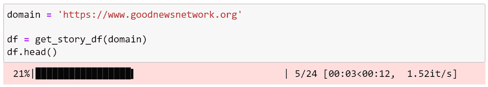

# 第五章：更简便的抓取方法！

在上一章中，我们讲解了网页抓取的基础知识，即从网络上获取数据以供自己使用和项目应用。在本章中，我们将探讨更简便的网页抓取方法，并且介绍社交媒体抓取的内容。上一章非常长，因为我们需要覆盖很多内容，从定义抓取到解释如何使用`Requests`库和`BeautifulSoup`来收集网页数据。我会展示一些更简单的方法，获取有用的文本数据，减少清理工作。请记住，这些简单的方法并不一定能取代上一章中解释的内容。在处理数据或进行软件项目时，当事情没有立即按预期工作时，拥有多个选择是非常有用的。但目前，我们将采用更简便的方法来抓取网页内容，并且介绍如何抓取社交媒体的文本数据。

首先，我们将介绍`Newspaper3k` Python 库，以及`Twitter V2` Python 库。

当我说`Newspaper3k`是一种更简便的收集网页文本数据的方法时，这是因为`Newspaper3k`的作者在简化收集和丰富网页数据的过程上做得非常出色。他们已经完成了你通常需要自己做的许多工作。例如，如果你想收集关于网站的元数据，比如它使用的语言、故事中的关键词，或者甚至是新闻故事的摘要，`Newspaper3k`都能提供给你。这本来是需要很多工作的。它之所以更简便，是因为这样你不需要从头开始做。

第二步，你将学习如何使用`Twitter V2` Python 库，因为这是一个非常简便的方法来从 Twitter 抓取推文，这对于自然语言处理（NLP）和网络分析非常有用。

本章将涵盖以下主题：

+   为什么要介绍 Requests 和 BeautifulSoup？

+   从 Newspaper3k 入门

+   介绍 Twitter Python 库

# 技术要求

在本章中，我们将使用 NetworkX 和 pandas Python 库。这两个库现在应该已经安装完毕，所以可以直接使用。如果还没有安装，您可以通过以下命令安装 Python 库：

```py
pip install <library name>
```

例如，要安装 NetworkX，可以执行以下命令：

```py
pip install networkx
```

我们还将讨论一些其他的库：

+   `Requests`

+   `BeautifulSoup`

+   `Newspaper3k`

Requests 应该已经包含在 Python 中，通常不需要单独安装。

`BeautifulSoup`可以通过以下方式安装：

```py
pip install beautifulsoup4
```

`Newspaper3k`可以通过以下方式安装：

```py
pip install newspaper3k
```

在*第四章*中，我们还介绍了一个`draw_graph()`函数，它使用了 NetworkX 和 scikit-network 库。每次进行网络可视化时，你都需要使用到这段代码，记得保留它！

你可以在本书的 GitHub 仓库中找到本章的所有代码：[`github.com/PacktPublishing/Network-Science-with-Python`](https://github.com/PacktPublishing/Network-Science-with-Python)。

# 为什么要介绍`Requests`和`BeautifulSoup`？

我们都喜欢事物变得简单，但生活充满挑战，事情并不总是如我们所愿。在抓取过程中，这种情况常常发生，简直让人发笑。最初，你可以预期更多的事情会出错而不是成功，但只要你坚持不懈并了解自己的选择，最终你会获得你想要的数据。

在上一章中，我们介绍了`Requests` Python 库，因为它让你能够访问和使用任何公开可用的网页数据。使用`Requests`时，你有很大的自由度。它能为你提供数据，但使数据变得有用则是一个既困难又耗时的过程。接着，我们使用了`BeautifulSoup`，因为它是一个强大的 HTML 处理库。通过`BeautifulSoup`，你可以更具体地指定从网页资源中提取和使用的数据类型。例如，我们可以轻松地从一个网站收集所有的外部链接，甚至获取网站的完整文本，排除所有 HTML 代码。

然而，`BeautifulSoup`默认并不会提供完美清洁的数据，特别是当你从成百上千的网站抓取新闻故事时，这些网站都有不同的页头和页脚。我们在上一章中探讨的使用偏移量来裁剪页头和页脚的方法，在你只从少数几个网站收集文本时非常有用，你可以轻松为每个独特的网站设置一些规则进行处理，但当你想扩展抓取的网站数量时，就会遇到可扩展性问题。你决定抓取的网站越多，你就需要处理更多的随机性。页头不同，导航结构可能不同，甚至语言可能不同。抓取过程中遇到的困难正是让我觉得它非常有趣的一部分。

## 介绍`Newspaper3k`

如果你想做自然语言处理（NLP）或将文本数据转化为社交网络分析和网络科学中使用的网络数据，你需要干净的数据。`Newspaper3k`提供了继`BeautifulSoup`之后的下一步，它进一步抽象了数据清理的过程，为你提供了更干净的文本和有用的元数据，减少了工作量。许多性能优化和数据清理工作都被抽象了出来。而且，由于你现在已经了解了上一章中关于数据清理的一些方法，当你看到`Newspaper3k`的数据清洁度时，你可能会更好地理解背后发生的事情，并且希望你会对他们的工作感到非常赞赏，感谢他们为你节省的时间。

现在，我们可以认为`Newspaper3k`是从网上收集文本的“简便方法”，但它之所以简便，是因为它建立在之前的基础之上。

在你的网页抓取和内容分析项目中，你仍然可能需要使用`Requests`和`BeautifulSoup`。我们需要先了解这些内容。当进行网页抓取项目时，不要一开始就从最基础的部分开始，一边重造每个需要的工具，也许我们应该通过问自己几个问题，来决定从哪里开始：

+   我可以用`Newspaper3k`做吗？

+   不行吗？好吧，那我能用`Requests`和`BeautifulSoup`做吗？

+   不行吗？好吧，那我至少可以使用`Requests`获取一些数据吗？

你在哪里获得有用的结果，就应该从哪里开始。如果你能从`Newspaper3k`中获得所需的一切，就从那里开始。如果用`Newspaper3k`不能得到你需要的内容，但用`BeautifulSoup`可以，那就从`BeautifulSoup`开始。如果这两种方法都不可行，那你就需要使用`Requests`来获取数据，然后写清理文本的代码。

我通常建议人们从基础开始，只有在必要时才增加复杂性，但对于数据收集或文本抓取，我不推荐这种方法。重造 HTML 解析器几乎没有用处，没有必要去制造不必要的麻烦。只要它能满足你的项目需求，使用任何能快速提供有用数据的工具。

## 什么是 Newspaper3k？

`Newspaper3k`是一个 Python 库，用于从新闻网站加载网页文本。然而，与`BeautifulSoup`不同，`Newspaper3k`的目标不在于灵活性，而是快速获取有用数据*快速*。我最为钦佩的是 Newspaper3k 的清洗数据的能力，结果相当纯净。我曾比较过使用`BeautifulSoup`和`Newspaper3k`的工作，后者给我留下了非常深刻的印象。

`Newspaper3k`不是`BeautifulSoup`的替代品。它可以做一些`BeautifulSoup`能做的事情，但并不是所有的，而且它的设计并没有考虑到处理 HTML 时的灵活性，这正是`BeautifulSoup`的强项。你给它一个网站，它会返回该网站的文本。使用`BeautifulSoup`时，你有更多的灵活性，你可以选择只查看链接、段落或标题。而`Newspaper3k`则提供文本、摘要和关键词。`BeautifulSoup`在这一抽象层次上略低一些。理解不同库在技术栈中的位置非常重要。`BeautifulSoup`是一个高层次的抽象库，但它的层次低于`Newspaper3k`。同样，`BeautifulSoup`的层次也高于`Requests`。这就像电影《盗梦空间》——有层层叠叠的结构。

## Newspaper3k 的用途是什么？

`Newspaper3k`对于获取网页新闻故事中的干净文本非常有用。这意味着它解析 HTML，剪切掉无用的文本，并返回新闻故事、标题、关键词，甚至是文本摘要。它能返回关键词和文本摘要，意味着它背后具有一些相当有趣的自然语言处理能力。你不需要为文本摘要创建机器学习模型，`Newspaper3k`会透明地为你完成这项工作，而且速度惊人。

`Newspaper3k`似乎受到了在线新闻解析的启发，但它不限于此。我也曾用它来抓取博客。如果你有一个网站想尝试抓取，不妨给`Newspaper3k`一个机会，看看效果如何。如果不行，可以使用`BeautifulSoup`。

`Newspaper3k`的一个弱点是，它无法解析使用 JavaScript 混淆技术将内容隐藏在 JavaScript 中，而不是 HTML 中的网站。网页开发者有时会这样做，以阻止抓取，原因多种多样。如果你将`Newspaper3k`或`BeautifulSoup`指向一个使用 JavaScript 混淆的网站，它们通常只会返回很少甚至没有有用的结果，因为数据隐藏在 JavaScript 中，而这两个库并不适用于处理这种情况。解决方法是使用像`Selenium`配合`Requests`这样的库，这通常足以获取你需要的数据。`Selenium`超出了本书的范围，而且经常让人觉得麻烦，不值得花费太多时间。因此，如果你在 JavaScript 混淆面前卡住了，可以查阅相关文档，或干脆跳过并抓取更简单的网站。大多数网站是可以抓取的，那些不能抓取的通常可以忽略，因为它们可能不值得投入太多精力。

# 开始使用`Newspaper3k`

在使用`Newspaper3k`之前，你必须先安装它。这非常简单，只需要运行以下命令：

```py
pip install newspaper3k
```

在之前的安装过程中，我曾收到一个错误，提示某个 NLTK 组件未下载。留意奇怪的错误信息。解决办法非常简单，只需要运行一个 NLTK 下载命令。除此之外，库的表现一直非常好。安装完成后，你可以立即将它导入到 Python 代码中并使用。

在上一章中，我展示了灵活但更为手动的抓取网站方法。许多无用的文本悄悄混入其中，数据清理相当繁琐，且难以标准化。`Newspaper3k`将抓取提升到了另一个层次，让它变得比我见过的任何地方都要简单。我推荐你尽可能使用`Newspaper3k`进行新闻抓取。

## 从一个网站抓取所有新闻 URL

使用`Newspaper3k`从域名中提取 URL 非常简单。这是加载网页域名中所有超链接所需的全部代码：

```py
import newspaper
domain = 'https://www.goodnewsnetwork.org'
paper = newspaper.build(domain, memoize_articles=False)
urls = paper.article_urls()
```

但是，我想指出一个问题：当你以这种方式抓取所有 URL 时，你也会发现我认为是“垃圾 URL”的一些链接，这些 URL 指向网站的其他区域，而不是文章。这些 URL 可能有用，但在大多数情况下，我只想要文章的 URL。如果我不采取任何措施去删除垃圾，URL 会像这样：

```py
urls
['https://www.goodnewsnetwork.org/2nd-annual-night-of-a-million-lights/',
'https://www.goodnewsnetwork.org/cardboard-pods-for-animals-displaced-by-wildfires/',
'https://www.goodnewsnetwork.org/category/news/',
'https://www.goodnewsnetwork.org/category/news/animals/',
'https://www.goodnewsnetwork.org/category/news/arts-leisure/',
'https://www.goodnewsnetwork.org/category/news/at-home/',
'https://www.goodnewsnetwork.org/category/news/business/',
'https://www.goodnewsnetwork.org/category/news/celebrities/',
'https://www.goodnewsnetwork.org/category/news/earth/',
'https://www.goodnewsnetwork.org/category/news/founders-blog/']
```

请注意，如果你在不同的时间爬取一个网站，你可能会得到不同的结果。新内容可能已被添加，旧内容可能已被删除。

在我大多数抓取中，那些位于前两个 URL 下方的内容就是我认为的垃圾。我只需要文章 URL，那些是指向特定分类页面的 URL。有几种方法可以解决这个问题：

+   你可以删除包含“category”一词的 URL。在这种情况下，这看起来非常合适。

+   你可以删除那些 URL 长度超过某个阈值的 URL。

+   你可以将这两种选项合并成一种方法。

对于这个例子，我决定选择第三个选项。我将删除所有包含“category”一词的 URL，以及长度小于 60 个字符的 URL。你也许想尝试不同的截止阈值，看看哪个最适合你。简单的清理代码如下：

```py
urls = sorted([u for u in urls if 'category' not in u and len(u)>60])
```

现在我们的 URL 列表看起来更加干净，只包含文章 URL。这正是我们需要的：

```py
urls[0:10]
…
['https://www.goodnewsnetwork.org/2nd-annual-night-of-a-million-lights/',
 'https://www.goodnewsnetwork.org/cardboard-pods-for-animals-displaced-by-wildfires/',
 'https://www.goodnewsnetwork.org/couple-living-in-darkest-village-lights-sky-with-huge-christmas-tree/',
 'https://www.goodnewsnetwork.org/coya-therapies-develop-breakthrough-treatment-for-als-by-regulating-t-cells/',
 'https://www.goodnewsnetwork.org/enorme-en-anidacion-de-tortugasen-tailandia-y-florida/',
 'https://www.goodnewsnetwork.org/good-talks-sustainable-dish-podcast-with-shannon-hayes/',
 'https://www.goodnewsnetwork.org/gopatch-drug-free-patches-good-gifts/',
 'https://www.goodnewsnetwork.org/horoscope-from-rob-brezsnys-free-will-astrology-12-10-21/',
 'https://www.goodnewsnetwork.org/how-to-recognize-the-eight-forms-of-capital-in-our-lives/',
 'https://www.goodnewsnetwork.org/mapa-antiguo-de-la-tierra-te-deja-ver-su-evolucion/']
```

现在我们有了一个干净的 URL 列表，我们可以遍历它，抓取每个故事，并加载文本供我们使用。

在继续之前，你应该注意到，在这个单一的网络域上，他们发布的故事是多语言的。他们发布的大部分故事是英语的，但也有一些不是。如果你将 `Newspaper3k` 指向该域（而不是指向单独的故事 URL），它可能无法正确地识别该域的语言。最好在故事级别做语言查找，而不是在域级别。我会展示如何在故事级别做这个。

## 从网站抓取新闻故事

现在我们有了一个包含故事 URL 的列表，我们想从中抓取文章文本和元数据。下一步是使用选定的 URL，收集我们需要的任何数据。对于这个例子，我将下载并使用我们 URL 列表中的第一个故事 URL：

```py
from newspaper import Article
url = urls[0]
article = Article(url)
article.download()
article.parse()
article.nlp()
```

这个代码片段中有几行比较令人困惑，我会逐行解释：

1.  首先，我从报纸库中加载 `Article` 函数，因为它用于下载文章数据。

1.  接下来，我将 `Article` 指向我们的 URL 列表中的第一个 URL，也就是 `urls[0]`。此时它并没有执行任何操作；它只是被指向了源 URL。

1.  然后，我从给定的 URL 下载并解析文本。这对于获取完整的文章和标题很有用，但它不会捕获文章的关键词。

1.  最后，我运行 `Article` 的 `nlp` 组件来提取关键词。

通过这四个步骤，我现在应该已经拥有了这篇文章所需的所有数据。让我们深入看看，看看我们有什么！

+   文章标题是什么？

    ```py
    title = article.title
    ```

    ```py
    title
    ```

    ```py
    …
    ```

    ```py
    'After Raising $2.8M to Make Wishes Come True for Sick Kids, The 'Night of a Million Lights' Holiday Tour is Back'
    ```

+   干净利落。那文本呢？

    ```py
    text = article.text
    ```

    ```py
    text[0:500]
    ```

    ```py
    …
    ```

    ```py
    'The Night of A Million Lights is back—the holiday spectacular that delights thousands of visitors and raises millions to give sick children and their weary families a vacation.\n\n'Give Kids The World Village' has launched their second annual holiday lights extravaganza, running until Jan. 2\n\nIlluminating the Central Florida skyline, the 52-night open house will once again provide the public with a rare glimpse inside Give Kids The World Village, an 89-acre, whimsical nonprofit resort that provide'
    ```

+   文章摘要是什么？

    ```py
    summary = article.summary
    ```

    ```py
    summary
    ```

    ```py
    …
    ```

    ```py
    'The Night of A Million Lights is back—the holiday spectacular that delights thousands of visitors and raises millions to give sick children and their weary families a vacation.\nWhat began as an inventive pandemic pivot for Give Kids The World has evolved into Central Florida's most beloved new holiday tradition.\n"Last year's event grossed $2.8 million to make wishes come true for children struggling with illness and their families," spokesperson Cindy Elliott told GNN.\nThe 
    ```

    ```py
    display features 1.25M linear feet of lights, including 3.2 million lights that were donated by Walt Disney World.\nAll proceeds from Night of a Million Lights will support Give Kids The World, rated Four Stars by Charity Navigator 15 years in a row.'
    ```

+   文章是用什么语言写的？

    ```py
    language = article.meta_lang
    ```

    ```py
    language
    ```

    ```py
    …
    ```

    ```py
    'en'
    ```

+   文章中发现了哪些关键词？

    ```py
    keywords = article.keywords
    ```

    ```py
    keywords
    ```

    ```py
    …
    ```

    ```py
    ['million',
    ```

    ```py
     'kids',
    ```

    ```py
     'children',
    ```

    ```py
     'lights',
    ```

    ```py
     'world',
    ```

    ```py
     'true',
    ```

    ```py
     'tour',
    ```

    ```py
     'wishes',
    ```

    ```py
     'sick',
    ```

    ```py
     'raising',
    ```

    ```py
     'night',
    ```

    ```py
     'village',
    ```

    ```py
     'guests',
    ```

    ```py
     'holiday',
    ```

    ```py
     'wish']
    ```

+   这篇文章配的是什么图片？

    ```py
    image = article.meta_img
    ```

    ```py
    image
    ```

    ```py
    …
    ```

    ```py
    'https://www.goodnewsnetwork.org/wp-content/uploads/2021/12/Christmas-disply-Night-of-a-Million-Lights-released.jpg'
    ```

而且，你还可以使用 `Newspaper3k` 做更多的事情。我鼓励你阅读该库的文档，看看还有哪些功能能对你的工作有所帮助。你可以在[`newspaper.readthedocs.io/en/latest/`](https://newspaper.readthedocs.io/en/latest/)阅读更多内容。

## 优雅地抓取并融入其中

在构建任何爬虫时，我通常会做两件事：

+   与人群融为一体

+   不要过度抓取

这两者之间有些重叠。如果我与真实的网页访问者融为一体，我的爬虫就不那么显眼，也不太容易被封锁。其次，如果我不进行过度抓取，我的爬虫也不太可能被注意到，从而减少被封锁的可能性。然而，第二点更为重要，因为对 web 服务器进行过度抓取是不友好的。最好在 URL 抓取之间设置 0.5 或 1 秒的等待：

1.  对于第一个想法，即与人群融为一体，你可以伪装成一个浏览器用户代理。例如，如果你希望你的爬虫伪装成在 macOS 上运行的最新 Mozilla 浏览器，可以按如下方式操作：

    ```py
    from newspaper import Config
    ```

    ```py
    config = Config()
    ```

    ```py
    config.browser_user_agent = 'Mozilla/5.0 (Macintosh; Intel Mac OS X 12.0; rv:95.0) Gecko/20100101 Firefox/95.0'
    ```

    ```py
    config.request_timeout = 3
    ```

1.  接下来，为了在每次抓取 URL 之间添加 1 秒钟的暂停，你可以使用 `sleep` 命令：

    ```py
    import time
    ```

    ```py
    time.sleep(1)
    ```

`user_agent` 配置通常足以绕过简单的机器人检测，且 1 秒的暂停是一个友好的操作，有助于与人群融为一体。

## 将文本转换为网络数据

为了将我们刚刚抓取的文本转换为网络数据，我们可以重用前一章创建的函数。提醒一下，这个函数是使用一种名为**命名实体识别**（**NER**）的 NLP 技术来提取文档中提到的人物、地点和组织：

1.  这是我们将使用的函数：

    ```py
    import spacy
    ```

    ```py
    nlp = spacy.load("en_core_web_md")
    ```

    ```py
    def extract_entities(text):
    ```

    ```py
        doc = nlp(text)
    ```

    ```py
        sentences = list(doc.sents)
    ```

    ```py
        entities = []
    ```

    ```py
        for sentence in sentences:
    ```

    ```py
            sentence_entities = []
    ```

    ```py
            sent_doc = nlp(sentence.text)
    ```

    ```py
            for ent in sent_doc.ents:
    ```

    ```py
                if ent.label_ in ['PERSON', 'ORG', 'GPE']:
    ```

    ```py
                    entity = ent.text.strip()
    ```

    ```py
                    if "'s" in entity:
    ```

    ```py
                        cutoff = entity.index("'s")
    ```

    ```py
                        entity = entity[:cutoff]
    ```

    ```py
                    if entity != '':
    ```

    ```py
                        sentence_entities.append(entity)
    ```

    ```py
            sentence_entities = list(set(sentence_entities))
    ```

    ```py
            if len(sentence_entities) > 1:
    ```

    ```py
                entities.append(sentence_entities)
    ```

    ```py
        return entities
    ```

1.  我们可以简单地将抓取的文本传入此函数，它应该返回一个实体列表：

    ```py
    entities = extract_entities(text)
    ```

    ```py
    entities
    ```

    ```py
    …
    ```

    ```py
    [['Night', 'USA'],  ['Florida', 'Kissimmee'],  ['GNN', 'Cindy Elliott'],  ['the Centers for Disease Control and Prevention', 'CDC'],  ['Florida', 'Santa'],  ['Disney World', 'Central Florida']]
    ```

1.  完美！现在，我们可以将这些实体传递给另一个函数，以获取我们可以用来构建网络的 `pandas` DataFrame 边缘列表数据。

1.  接下来，我们将使用 `get_network_data` 函数，其代码如下：

    ```py
    import pandas as pd
    ```

    ```py
    def get_network_data(entities):
    ```

    ```py
        final_sources = []
    ```

    ```py
        final_targets = []
    ```

    ```py
        for row in entities:
    ```

    ```py
            source = row[0]
    ```

    ```py
            targets = row[1:]
    ```

    ```py
            for target in targets:
    ```

    ```py
                final_sources.append(source)
    ```

    ```py
                final_targets.append(target)
    ```

    ```py
        df = pd.DataFrame({'source':final_sources, 'target':final_targets})
    ```

    ```py
        return df
    ```

1.  我们可以通过传入实体列表来使用它：

    ```py
    network_df = get_network_data(entities)
    ```

    ```py
    network_df.head()
    ```

经检查，效果很好。网络边缘列表必须包含一个源节点和一个目标节点，而现在我们已经有了这两者：


图 5.1 – pandas DataFrame 实体边缘列表

很好。第四行很有趣，因为 NER 成功识别出了两种不同的表示 CDC 的方式，既有全称也有缩写。第一行似乎有一个误报，但我会在下一章讲解如何清理网络数据。现在这一切都很完美。

## 端到端 Network3k 抓取与网络可视化

现在我们有了所有演示两个事项所需的东西。我想展示如何抓取多个 URL，并将数据合并为一个 DataFrame 以供使用和存储，你将学习如何将原始文本转换为网络数据并可视化它。在上一章中我们做过这个，但再做一次会更有助于加深记忆。

### 将多个 URL 抓取结果合并到一个 DataFrame 中

在这两个演示之间，这部分是最基础和最重要的。我们将在下一个演示中使用此过程的结果。在大多数实际的抓取项目中，重复抓取单个 URL 没有什么意义。通常，你想对你抓取的任何域名重复这些步骤：

1.  抓取所有的 URL。

1.  删除你已经抓取过文本的 URL。

1.  抓取剩余 URL 的文本。

对于这个演示，我们只会做*步骤 1*和*步骤 3*。对于你的项目，你通常需要想出一个方法来删除你已经抓取的 URL，这取决于你将抓取后的数据写入哪里。本质上，你需要检查你已经抓取的内容，并忽略你已经使用过的 URL。这可以防止重复工作、不必要的抓取噪音、不必要的抓取负担以及重复的数据。

以下代码抓取给定域名的所有 URL，抓取每个发现的 URL 的文本，并创建一个`pandas` DataFrame，供使用或输出到文件或数据库。我还加入了一个额外的 Python 库：`tqdm`。`tqdm`库在你想了解一个过程需要多长时间时非常有用。如果你在后台自动化中使用这个功能，你可能不需要`tqdm`的功能，但现在它很有用，因为你正在学习。

你可以通过运行`pip` `install tqdm`来安装`tqdm`：



图 5.2 – TQDM 进度条的实际应用

这是完整的 Python 代码，它接受一个域名并返回一个抓取的故事的`pandas` DataFrame：

```py
import newspaper
from newspaper import Article
from tqdm import tqdm
def get_story_df(domain):
    paper = newspaper.build(domain, memoize_articles=False)
    urls = paper.article_urls()
    urls = sorted([u for u in urls if 'category' not in u and len(u)>60])
    titles = []
    texts = []
    languages = []
    keywords = []
    for url in tqdm(urls):
        article = Article(url)
        article.download()
        article.parse()
        article.nlp()
        titles.append(article.title)
        texts.append(article.text)
        languages.append(article.meta_lang)
        keywords.append(article.keywords)
    df = pd.DataFrame({'urls':urls, 'title':titles, 'text':texts, 'lang':languages, 'keywords':keywords})
    return df
```

要使用这个函数，你可以运行以下代码，并指向任何感兴趣的新闻域名：

```py
domain = 'https://www.goodnewsnetwork.org'
df = get_story_df(domain)
df.head()
```

现在，你应该有一个干净的新闻故事 DataFrame 可供使用。如果你遇到 404（页面未找到）错误，可能需要在函数中添加一些 try/except 异常处理代码。我将这些和其他边缘情况留给你处理。不过，URL 抓取和文章文本抓取的时间间隔越短，遇到 404 错误的可能性就越小。

让我们来检查一下结果！


图 5.3 – 抓取的 URL 数据的 pandas DataFrame

酷！`tqdm`进度条一直工作到完成，我们还可以看到最终故事的语言已被设置为西班牙语。这正是我们想要的。如果我们试图通过抓取主页（landing page）来检测整个域的语言，语言检测组件可能会给出错误的结果，甚至什么都不返回。这个网站既有英语故事也有西班牙语故事，我们可以在故事级别看到这一点。

捕捉一段文本的语言对于 NLP 工作非常有用。通常，经过一种语言训练的机器学习分类器在应用到另一种语言时会遇到困难，而在使用无监督机器学习（聚类）处理文本数据时，用不同语言写的数据会聚集在一起。我的建议是，利用捕捉到的语言数据将数据按语言拆分，以便进行后续的 NLP 扩展工作。这样你会获得更好的结果，同时分析结果也会变得更加简单。

接下来，让我们使用这些故事来创建网络数据和可视化！

### 将文本数据转换成网络进行可视化

本书中，我们已经多次提取文本、提取实体、创建网络数据、构建网络并进行可视化。我们在这里也会做同样的事情。不同之处在于，我们现在有一个包含多篇新闻文章的`pandas` DataFrame，每篇文章都可以转换成一个网络。对于这个示例，我只做两次。从现在开始，你应该不会再有困难将文本转换成网络，你也可以重用已经写好的代码。

我们的实体提取是基于英语语言的 NLP 模型构建的，因此我们只使用英语语言的故事。为了简化演示，我们将使用 DataFrame 中的第二篇和第四篇文章，因为它们给出了有趣且干净的结果：

1.  首先，我们将使用第二篇文章。你应该能看到我正在加载`df['text'][1]`，其中`[1]`是第二行，因为索引是从`0`开始的：

    ```py
    text = df['text'][1]
    ```

    ```py
    entities = extract_entities(text)
    ```

    ```py
    network_df = get_network_data(entities)
    ```

    ```py
    G = nx.from_pandas_edgelist(network_df)
    ```

    ```py
    draw_graph(G, show_names=True, node_size=4, edge_width=1, font_size=12)
    ```

这是网络可视化：


图 5.4 – 文章实体关系的网络可视化（第二篇文章）

这看起来不错，但非常简单。一篇新闻文章通常涉及几个个人和组织，所以这并不令人惊讶。我们仍然可以看到一些野生动物保护组织之间的关系，一个人与大学之间的关系，以及**澳大利亚**和**考拉**之间的关系。所有这些看起来都很现实。

1.  接下来，让我们尝试第四篇文章：

    ```py
    text = df['text'][3]
    ```

    ```py
    entities = extract_entities(text)
    ```

    ```py
    network_df = get_network_data(entities)
    ```

    ```py
    G = nx.from_pandas_edgelist(network_df)
    ```

    ```py
    draw_graph(G, show_names=True, node_size=4, edge_width=1, font_size=12)
    ```

这是网络可视化。这一部分更加有趣且复杂：


图 5.5 – 文章实体关系的网络可视化（第四篇文章）

这是一个比新闻报道中常见的实体集合更加丰富的集合，事实上，这个故事中涉及的实体和关系比我们在上一章研究的《变形记》这本书还要多。这看起来很棒，我们可以进一步研究这些被揭示出来的关系。

从本书这一章开始，我将主要使用 Twitter 数据来创建网络。我想解释如何对任何文本进行这种操作，因为这让我们能够自由地揭示任何文本中的关系，而不仅仅是社交媒体文本。然而，你应该已经理解这一点了。本书剩余部分将更多关注分析网络，而不是创建网络数据。一旦文本数据转化为网络，其余的网络分析信息同样具有相关性和实用性。

# 介绍 Twitter Python 库

Twitter 是一个非常适合 NLP 项目的宝藏。它是一个非常活跃的社交网络，且审查制度不太严格，这意味着用户在讨论各种话题时都很自在。这意味着 Twitter 不仅适合研究轻松的话题，也可以用来研究更为严肃的话题。你有很大的灵活性。

与其他社交网络相比，Twitter 也有一个相对简单的 API。它很容易入门，并且可以用来捕捉数据，这些数据可以为未来的 NLP 研究提供支持。在我个人的 NLP 研究中，学习如何抓取 Twitter 数据极大地推动了我的 NLP 学习。当你有了自己感兴趣的数据时，学习 NLP 变得更加有趣。我曾使用 Twitter 数据来理解各种网络、创造原创的 NLP 技术以及生成机器学习训练数据。我虽然不常用 Twitter，但我发现它对所有与 NLP 相关的内容来说都是一座金矿。

## 什么是 Twitter Python 库？

多年来，Twitter 一直在开放其 API，以便软件开发者和研究人员能够利用他们的数据。由于文档有些零散且令人困惑，使用该 API 是一项挑战，因此创建了一个 Python 库来简化与 API 的交互。我将解释如何使用这个 Python 库，但你需要自行探索 Twitter API，了解 Twitter 为防止过度使用 API 所设置的各种限制。

你可以在[`developer.twitter.com/en/docs`](https://developer.twitter.com/en/docs)查看更多关于 Twitter API 的信息。

## Twitter 库有哪些用途？

一旦你学会了使用 Twitter 库和 API，你就可以完全自由地用它来做任何研究。你可以用它来了解 K-Pop 音乐圈，或者用它来关注机器学习或数据科学领域的最新动态。

另一个用途是分析整个受众。例如，如果一个账户有 50,000 个粉丝，你可以使用 Twitter 库加载关于所有 50,000 个粉丝的数据，包括他们的用户名和描述。利用这些描述，你可以使用聚类技术来识别更大群体中的各种子群体。你还可以使用这类数据潜在地识别机器人和其他形式的人工放大。

我建议你找到一些你感兴趣的东西，然后追寻它，看看它会引导你到哪里。这种好奇心是培养 NLP 和社交网络分析技能的极好驱动力。

## 可以从 Twitter 收集哪些数据？

即使与两年前相比，Twitter 似乎已经扩展了其 API 提供的功能，允许更多不同类型的数据科学和 NLP 项目。然而，在他们的 **版本一**（**V1**）API 中，Twitter 会返回一个包含大量数据的字典，这些数据都是他们可以提供的。这在他们的 V2 API 中有所变化，现在他们要求开发者明确指定请求哪些数据。这使得知道 Twitter 提供的所有数据变得更加困难。任何与 Twitter API 一起工作的人都需要花时间阅读文档，以了解有哪些可用的数据。

对于我的研究，我通常只对以下几个方面感兴趣：

+   谁在发布内容？

+   他们发布了什么？

+   它是什么时候发布的？

+   他们提到了谁？

+   他们使用了什么话题标签？

所有这些内容都可以轻松地通过 Twitter API 获取，我会向你展示如何操作。但这并不是 Twitter 提供的全部功能。我最近对 V2 API 曝露的一些新发现的数据印象深刻，但我还没有足够的了解来写关于它的内容。当你遇到感觉应该由 API 曝露的内容时，查阅文档。在我与 Twitter API 工作的经验中，一些本应默认暴露的内容，现在相比于 V1，可能需要做更多额外的工作。尝试找出如何获取你需要的内容。

## 获取 Twitter API 访问权限

在你能使用 Twitter API 做任何事情之前，首先你需要做的就是获得访问权限：

1.  首先，创建一个 Twitter 账户。你不需要用它发布任何内容，但你确实需要有一个账户。

1.  接下来，访问以下 URL 请求 API 访问权限：[`developer.twitter.com/en/apply-for-access`](https://developer.twitter.com/en/apply-for-access)。

申请访问权限的时间可能从几分钟到几天不等。你需要填写一些表格，说明你将如何使用这些数据，并同意遵守 Twitter 的服务条款。在描述你使用 Twitter 数据的方式时，你可以说明你是为了学习 NLP 和社交网络分析而使用这些数据。

1.  一旦你获得了访问权限，你将拥有自己的开发者门户。在身份验证部分搜索，直到看到类似这样的内容：


图 5.6 – Twitter 认证 Bearer Token

具体来说，你需要一个 **Bearer Token**。生成一个并将其保存在安全的地方。你将用它来进行 Twitter API 的身份验证。

一旦你生成了 Bearer Token，你就可以通过 Twitter Python 库开始与 Twitter API 进行交互了。

## Twitter 身份验证

在进行身份验证之前，你需要安装 Twitter Python 库：

1.  你可以通过运行以下代码来实现：

    ```py
    pip install python-twitter-v2
    ```

1.  接下来，在你选择的笔记本中，尝试导入库：

    ```py
    from pytwitter import Api
    ```

1.  接下来，你需要使用 Bearer Token 来进行 Twitter 身份验证。将以下代码中的 `bearer_token` 文本替换为你自己的 Bearer Token，然后尝试进行身份验证：

    ```py
    bearer_token = 'your_bearer_token'
    ```

    ```py
    twitter_api = Api(bearer_token=bearer_token)
    ```

如果没有失败，那么你应该已经通过身份验证，并准备好开始抓取推文、连接以及更多数据。

## 抓取用户推文

我创建了两个辅助函数，用于将用户推文加载到 `pandas` DataFrame 中。如果你需要更多的数据，可以扩展 `tweet_fields`，并可能需要添加 `user_fields`：

1.  请查看以下代码块中的 `search_tweets()` 函数，了解如何将 `user_fields` 添加到 Twitter 调用中。此函数不使用 `user_fields`，因为我们已经传入了用户名：

    ```py
    def get_user_id(twitter_api, username):
    ```

    ```py
        user_data = twitter_api.get_users(usernames=username)
    ```

    ```py
        return user_data.data[0].id
    ```

1.  第一个函数接受一个 Twitter 用户名并返回其 `user_id`。这是很重要的，因为某些 Twitter 调用需要 `user_id` 而不是 `username`。以下函数使用 `user_id` 来查找该用户的推文：

    ```py
    def get_timeline(twitter_api, username):
    ```

    ```py
        tweet_fields = ['created_at', 'text', 'lang']
    ```

    ```py
        user_id = get_user_id(twitter_api, username)
    ```

    ```py
        timeline_data = twitter_api.get_timelines(user_id, return_json=True, max_results=100, tweet_fields=tweet_fields)
    ```

    ```py
        df = pd.DataFrame(timeline_data['data'])
    ```

    ```py
        df.drop('id', axis=1, inplace=True)
    ```

    ```py
        return df
    ```

在这个函数中，`twitter_api.get_timelines()` 函数完成了大部分工作。我已经指定了我需要的 `tweet_fields`，传入了用户的 `user_id`，指定了要获取该用户最近的 `100` 条推文，并指定返回的数据格式为 JSON，方便转换为 `pandas` DataFrame。如果调用这个函数，我应该能立即获得结果。

1.  让我们看看圣诞老人都在谈些什么：

    ```py
    df = get_timeline(twitter_api, 'officialsanta')
    ```

    ```py
    df.head()
    ```

现在我们应该能看到圣诞老人五条推文的预览：


图 5.7 – 圣诞老人推文的 pandas DataFrame

完美。现在我们已经获取到了圣诞老人最近的 `100` 条推文。

1.  我还为你提供了一个额外的辅助函数。这个函数会提取 `text` 字段中的实体和标签，我们将利用这些信息绘制社交网络：

    ```py
    def wrangle_and_enrich(df):
    ```

    ```py
        # give some space for splitting, sometimes things get smashed together
    ```

    ```py
        df['text'] = df['text'].str.replace('http', ' http')
    ```

    ```py
        df['text'] = df['text'].str.replace('@', ' @')
    ```

    ```py
        df['text'] = df['text'].str.replace('#', ' #')
    ```

    ```py
        # enrich dataframe with user mentions and hashtags
    ```

    ```py
        df['users'] = df['text'].apply(lambda tweet: [clean_user(token) for token in tweet.split() if token.startswith('@')])
    ```

    ```py
        df['tags'] = df['text'].apply(lambda tweet: [clean_hashtag(token) for token in tweet.split() if token.startswith('#')])
    ```

    ```py
        return df
    ```

1.  我们可以将这个函数作为一个增强步骤添加进去：

    ```py
    df = get_timeline(twitter_api, 'officialsanta')
    ```

    ```py
    df = wrangle_and_enrich(df)
    ```

    ```py
    df.head()
    ```

这为我们提供了额外的有用数据：


图 5.8 – 丰富版圣诞老人推文的 pandas DataFrame

这非常适合我们在本章接下来的工作，但在继续之前，我们也将看看如何抓取连接信息。

## 抓取用户关注列表

我们可以轻松抓取一个账户所关注的所有账户。可以通过以下函数来完成：

```py
def get_following(twitter_api, username):
    user_fields = ['username', 'description']
    user_id = get_user_id(twitter_api, username)
    following = twitter_api.get_following(user_id=user_id, return_json=True, max_results=1000, user_fields=user_fields)
    df = pd.DataFrame(following['data'])
    return df[['name', 'username', 'description']]
```

在这里，我指定了`max_results=1000`。这是 Twitter 一次最多返回的结果数，但你可以加载比 1000 条更多的数据。你需要传入一个`'next_token'`键，继续获取`1000`条粉丝的数据集。你也可以做类似的操作来加载某个用户的超过 100 条推文。理想情况下，如果你有这个需求，应该在编程中使用递归。你可以使用前面的函数加载第一批数据，如果需要构建递归功能，应该能够扩展它。

你可以调用以下函数：

```py
df = get_following(twitter_api, 'officialsanta')
df.head()
```

这将为你提供以下格式的结果：


图 5.9 – 圣诞老人追踪的 Twitter 账户的 pandas DataFrame

对于调查一个群体内部存在的子群体，包含账户描述是非常有用的，因为人们通常会描述自己的兴趣和政治倾向。为了捕获描述，你需要将描述包含在`user_fields`列表中。

## 抓取用户粉丝

抓取粉丝几乎是相同的。以下是代码：

```py
def get_followers(twitter_api, username):
    user_fields = ['username', 'description']
    user_id = get_user_id(twitter_api, username)
    followers = twitter_api.get_followers(user_id=user_id, return_json=True, max_results=1000, user_fields=user_fields)
    df = pd.DataFrame(followers['data'])
    return df[['name', 'username', 'description']]
```

你可以调用这个函数：

```py
df = get_followers(twitter_api, 'officialsanta')
df.head()
```

这将为你提供与之前所示相同格式的结果。确保包含账户描述。

## 使用搜索词抓取

收集关于搜索词的推文也很有用。你可以用这个来探索*谁*参与了关于某个搜索词的讨论，同时也可以收集这些推文，以便阅读和处理。

以下是我为根据搜索词抓取推文编写的代码：

```py
def search_tweets(twitter_api, search_string):
    tweet_fields = ['created_at', 'text', 'lang']
    user_fields = ['username']
    expansions = ['author_id']
    search_data = twitter_api.search_tweets(search_string, return_json=True, expansions=expansions, tweet_fields=tweet_fields, user_fields=user_fields, max_results=100)
    df = pd.DataFrame(search_data['data'])
    user_df = pd.DataFrame(search_data['includes']['users'])
    df = df.merge(user_df, left_on='author_id', right_on='id')
    df['username'] = df['username'].str.lower()
    return df[['username', 'text', 'created_at', 'lang']]
```

这个函数比之前的函数稍微复杂一些，因为我指定了`tweet_fields`和`user_fields`，这是我感兴趣的内容。为了捕获用户名，我需要在`author_id`上指定一个扩展，最后，我想要 100 条最新的推文。如果你想包含额外的数据，你需要探索 Twitter API，找出如何添加你感兴趣的数据字段。

你可以像这样调用该函数：

```py
df = search_tweets(twitter_api, 'natural language processing')
df = wrangle_and_enrich(df)
df.head()
```

我还通过`wrangle_and_enrich()`函数调用，丰富了`pandas` DataFrame，使其包括用户提及和话题标签。这样就得到了以下的`pandas` DataFrame：


图 5.10 – Twitter 搜索推文的 pandas DataFrame

这些搜索推文非常适合用于创建社交网络可视化，因为这些推文来自多个账户。在数据的前两行，你可能会在视觉上注意到**intempestades**、**pascal_bornet**和**cogautocom**之间有关系。如果我们要可视化这个网络，它们将显示为相连的节点。

## 将 Twitter 推文转换为网络数据

将社交媒体数据转换为网络数据比处理原始文本要容易得多。幸运的是，推特的情况正好符合这一点，因为推文通常很简短。这是因为用户经常在推文中互相标记，以增加可见性和互动，而且他们经常将推文与话题标签关联，这些关联可以用来构建网络。

使用用户提及和话题标签，我们可以创建几种不同类型的网络：

+   *账户到提及网络 (@ -> @)*：有助于分析社交网络。

+   *账户到话题标签网络 (@ -> #)*：有助于找到围绕某个主题（话题标签）存在的社区。

+   *提及到话题标签网络 (@ -> #)*：类似于之前的网络，但链接到被提及的账户，而不是推文账户。这对于寻找社区也很有用。

+   *话题标签到话题标签网络 (# -> #)*：有助于发现相关的主题（话题标签）和新兴的趋势话题。

此外，你可以使用 NER 从文本中提取额外的实体，但推文通常比较简短，因此这可能不会提供太多有用的数据。

在接下来的几个部分中，你将学习如何构建第一类和第三类网络。

### 账户到提及网络 (@ -> @)

我创建了一个有用的辅助函数，将`pandas` DataFrame 转换为此账户到提及网络数据：

```py
def extract_user_network_data(df):
    user_network_df = df[['username', 'users', 'text']].copy()
    user_network_df = user_network_df.explode('users').dropna()
    user_network_df['users'] = user_network_df['users'].str.replace('\@', '', regex=True)
    user_network_df.columns = ['source', 'target', 'count'] # text data will be counted
    user_network_df = user_network_df.groupby(['source', 'target']).count()
    user_network_df.reset_index(inplace=True)
    user_network_df.sort_values(['source', 'target'], ascending=[True, True])
    return user_network_df
```

这个函数中涉及的内容非常多：

1.  首先，我们从`df` DataFrame 中复制用户名、用户和文本字段，并将它们用于`user_network_df` DataFrame。`users`字段的每一行包含一个用户列表，因此我们会“展开”`users`字段，为每个用户在 DataFrame 中创建一行。我们还会删除不包含任何用户的行。

1.  接下来，我们移除所有的`@`字符，这样数据和可视化结果会更加易读。

1.  然后，我们重命名 DataFrame 中的所有列，为创建我们的图形做准备。NetworkX 的图形需要源和目标字段，`count`字段也可以作为额外数据传入。

1.  接下来，我们进行聚合，并统计 DataFrame 中每个源-目标关系的数量。

1.  最后，我们对 DataFrame 进行排序并返回。虽然我们不需要对 DataFrame 进行排序，但我习惯这样做，因为它有助于查看 DataFrame 或进行故障排除。

你可以将`search_tweets` DataFrame 传递给这个函数：

```py
user_network_df = extract_user_network_data(df)
user_network_df.head()
```

你将得到一个边列表 DataFrame，表示用户之间的关系。我们将利用这个来构建和可视化我们的网络。仔细观察，你应该能看到有一个额外的**count**字段。我们将在后面的章节中使用这个字段作为选择哪些边和节点在可视化中显示的阈值：


图 5.11 – 账户到提及 pandas DataFrame 边列表

这个 DataFrame 中的每一行表示一个用户（**源**）与另一个用户（**目标**）之间的关系。

### 提及到话题标签网络 (@ -> #)

我创建了一个有用的辅助函数，将 `pandas` DataFrame 转换为 **提及** 到话题标签的网络数据。这个函数与之前的类似，但我们加载了用户和话题标签，而完全不使用原账户的用户名：

```py
def extract_hashtag_network_data(df):
    hashtag_network_df = df[['users', 'tags', 'text']].copy()
    hashtag_network_df = hashtag_network_df.explode('users')
    hashtag_network_df = hashtag_network_df.explode('tags')
    hashtag_network_df.dropna(inplace=True)
    hashtag_network_df['users'] = hashtag_network_df['users'].str.replace('\@', '', regex=True)
    hashtag_network_df.columns = ['source', 'target', 'count'] # text data will be counted
    hashtag_network_df = hashtag_network_df.groupby(['source', 'target']).count()
    hashtag_network_df.reset_index(inplace=True)
    hashtag_network_df.sort_values(['source', 'target'], ascending=[True, True])
    # remove some junk that snuck in
    hashtag_network_df = hashtag_network_df[hashtag_network_df['target'].apply(len)>2]
    return hashtag_network_df
You can pass the search_tweets DataFrame to this function.
hashtag_network_df = extract_hashtag_network_data(df)
hashtag_network_df.head()
```

你将获得一个用户关系的边列表 DataFrame。如前所示，还会返回一个 **count** 字段，我们将在后面的章节中将其用作选择显示哪些节点和边的阈值：


图 5.12 – 提及到话题标签的 pandas DataFrame 边列表

这个 DataFrame 中的每一行显示一个用户（源）和一个话题标签（目标）之间的关系。

## 从头到尾抓取 Twitter 数据

我希望之前的代码和示例已经展示了如何轻松使用 Twitter API 来抓取推文，也希望你能看到如何轻松地将推文转化为网络。在本章的最终演示中，我希望你能按照以下步骤进行：

1.  加载一个包含与网络科学相关的推文的 `pandas` DataFrame。

1.  丰富该 DataFrame，使其包括用户提及和话题标签作为独立字段。

1.  创建账户到提及网络数据。

1.  创建提及到话题标签的网络数据。

1.  创建账户到提及网络。

1.  创建提及到话题标签的网络。

1.  可视化账户到提及的网络。

1.  可视化提及到话题标签的网络。

让我们在代码中顺序进行操作，重用本章中使用的 Python 函数。

这是前六步的代码：

```py
df = search_tweets(twitter_api, 'network science')
df = wrangle_and_enrich(df)
user_network_df = extract_user_network_data(df)
hashtag_network_df = extract_hashtag_network_data(df)
G_user = nx.from_pandas_edgelist(user_network_df )
G_hash = nx.from_pandas_edgelist(hashtag_network_df)
```

真的就这么简单。虽然背后有很多复杂的操作，但你越多地练习网络数据，编写这类代码就会变得越简单。

这两个网络现在都已准备好进行可视化：

1.  我将从账户到提及的网络可视化开始。这是一个社交网络。我们可以这样绘制它：

    ```py
    draw_graph(G_user, show_names=True, node_size=3, edge_width=0.5, font_size=12)
    ```

这应该会渲染出一个网络可视化图：


图 5.13 – 账户到提及社交网络可视化

这有点难以阅读，因为账户名重叠了。

1.  让我们看看没有标签的网络长什么样：

    ```py
    draw_graph(G_user, show_names=False, node_size=3, edge_width=0.5, font_size=12)
    ```

这将给我们一个没有节点标签的网络可视化图。这样我们可以看到整个网络的样子：


图 5.14 – 账户到提及社交网络可视化（无标签）

哇！对我来说，这真是既美丽又有用。我看到有几个用户群体或集群。如果我们仔细观察，将能够识别出数据中存在的社区。我们将在*第九章*中进行此操作，本章专门讲解社区检测。

1.  现在，让我们看看提及到话题标签的网络：

    ```py
    draw_graph(G_hash, show_names=True, node_size=3, edge_width=0.5, font_size=12)
    ```

这应该会渲染出一个网络可视化图：


图 5.15 – 从提及到话题标签的网络可视化

与“提及账户”网络不同，这个网络更易于阅读。我们可以看到与各种话题标签相关联的用户。没有标签的话显示这些数据没有任何价值，因为没有标签它是无法读取和使用的。这标志着演示的结束。

# 总结

在本章中，我们介绍了两种更简单的方法来抓取互联网上的文本数据。`Newspaper3k`轻松抓取了新闻网站，返回了干净的文本、标题、关键词等。它让我们跳过了使用`BeautifulSoup`时的一些步骤，能够更快地得到清洁数据。我们使用这些清洁的文本和命名实体识别（NER）来创建并可视化网络。最后，我们使用了 Twitter 的 Python 库和 V2 API 来抓取推文和连接，我们也用推文来创建和可视化网络。通过本章和前一章所学，你现在在抓取网络和将文本转换为网络的过程中有了更大的灵活性，这样你就能探索嵌入的和隐藏的关系。

这里有个好消息：收集和清理数据是我们要做的工作中最困难的部分，这标志着数据收集和大部分清理工作的结束。在本章之后，我们将大部分时间都在享受与网络相关的乐趣！

在下一章中，我们将研究图形构建。我们将利用本章中使用的技术，创建用于分析和可视化的网络。
