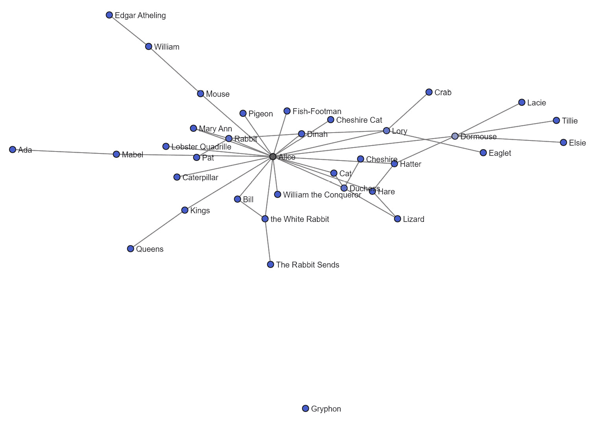

# 第六章：图形构建与清洗

到目前为止，我们已经覆盖了很多内容。在前几章中，我们介绍了自然语言处理（NLP）、网络科学和社交网络分析，并学习了如何将原始文本转换为网络数据。我们甚至还可视化了其中的一些网络。我希望看到文本转化为可视化网络对你产生的影响和我当时的感觉一样强烈。第一次尝试时，我使用的是《创世纪》一书（来自《圣经》），能将几千年前的文本转换为一个实际的交互式网络，真是让我大吃一惊。

在前两章中，我们学习了从互联网上的网站和社交网络收集文本数据的几种不同方式，并利用这些文本数据创建网络。好消息是，我不需要再展示更多的文本抓取方法了。你已经有了足够的选择，应该能够将这些知识作为其他类型抓取的基础。

坏消息是，现在该讨论每个人的“最爱”话题：数据清洗！说实话，这是我处理网络数据时最喜欢的部分。清洗工作需要一些努力，但其实并不复杂。现在是时候播放一些音乐，泡一杯热饮，放松一下，开始寻找需要修复的小问题了。

为了让本章特别有趣，我们将使用来自 *《爱丽丝梦游仙境》* 的社交网络。我已经按照前几章中描述的过程创建了这个网络。由于我们已经讨论了几遍如何将文本转换为实体、实体转换为网络数据以及网络数据转换为图形的步骤，所以这次我将跳过这些内容的解释。原始的网络数据已经上传到我的 GitHub，我们将在本章中使用这些数据。

本章我们将涵盖以下内容：

+   从边列表创建图形

+   列出节点

+   移除节点

+   快速视觉检查

+   重命名节点

+   移除边

+   持久化网络

+   模拟攻击

# 技术要求

本章中，我们将使用 NetworkX 和 pandas Python 库。我们还将导入一个 NLTK 分词器。到现在为止，这些库应该已经安装好了，所以它们应该可以立即使用。

本章的所有代码都可以在本书的 GitHub 仓库中找到，地址是 [`github.com/PacktPublishing/Network-Science-with-Python`](https://github.com/PacktPublishing/Network-Science-with-Python)。

# 从边列表创建图形

我们将使用这个文件作为我们的原始边列表：[`raw.githubusercontent.com/itsgorain/datasets/main/networks/alice/edgelist_alice_original.csv`](https://raw.githubusercontent.com/itsgorain/datasets/main/networks/alice/edgelist_alice_original.csv)。让我们来看一下：

1.  在创建图形之前，我们必须导入两个我们将使用的库：`pandas` 和 `networkx`。我们使用 `pandas` 将边列表读取到一个 DataFrame 中，然后将该 DataFrame 传递给 `networkx` 来创建图形。你可以按如下方式导入这两个库：

    ```py
    import pandas as pd
    ```

    ```py
    import networkx as nx
    ```

1.  导入库后，让我们使用 pandas 将 CSV 文件读取为 DataFrame，然后显示它，如下代码块所示：

    ```py
    data = 'https://raw.githubusercontent.com/itsgorain/datasets/main/networks/alice/edgelist_alice_original.csv'
    ```

    ```py
    network_df = pd.read_csv(data)
    ```

    ```py
    network_df.head()
    ```

如果你在 Jupyter notebook 中运行这个，你应该会看到以下的 DataFrame：


图 6.1 – 《爱丽丝梦游仙境》边列表的 pandas DataFrame

在继续之前，我想说的是，如果你能将任何两个事物表示为具有某种关系的形式，那么你就可以将它们作为网络数据。在我们的 DataFrame 中，源节点和目标节点是人、地点和组织，就像我们在 **命名实体识别**（**NER**）工作中配置的那样，但你也可以制作以下类型的网络：

+   配料和菜肴

+   学生和老师

+   行星和星系

我可以一直说下去。意识到网络在我们周围是如此普遍，并且在所有事物中都能看到它们：这就是解锁网络分析力量的前奏。这是关于理解事物之间关系的。我对文学和安全感兴趣，我的大部分网络分析都涉及人类语言和安全之间的交集。你可能有其他的兴趣，因此你会在其他类型的网络中找到更多的用处。试着从本书中汲取灵感，激发你去研究感兴趣的话题的新方式。

既然这一点已经说清楚了，我们有了边列表的 DataFrame，接下来让我们把它转换成图形。最简单的形式就是下面这样：

```py
G = nx.from_pandas_edgelist(network_df)
```

真的吗？就这样？是的，就是这样。当我第一次了解到从 `pandas` DataFrame 转换为可用的图形竟然这么简单时，我立刻被吸引住了。就是这么简单。但它之所以如此简单，有几个原因：

+   首先，`networkx` 函数期望 `.csv` 文件包含这些列，我们不需要重命名任何列或指定哪些列是源节点和目标节点。

+   其次，我们没有指定使用哪种图，因此 `networkx` 默认使用 `nx.Graph()`。这是最简单的图形形式，只允许节点之间有一条边，并且不包括方向性。

在笔记本中，如果我们检查 `G`，我们会看到以下内容：

```py
G
<networkx.classes.graph.Graph at 0x255e00fd5c8>
```

这验证了我们正在使用默认的图类型 `Graph`。

有几种方法可以将网络数据加载到 `networkx` 中，但我更喜欢使用边列表。边列表最简单的形式是带有两个字段的表格数据：*source* 和 *target*。由于这种简单性，它们可以轻松地存储为纯文本或数据库中。你不需要一个复杂的图形数据库来存储边列表。

有些人在处理网络数据时更喜欢使用邻接矩阵。邻接矩阵不容易存储在数据库中，而且也不易扩展。你可以选择你喜欢的方式，但边列表非常容易使用，所以我建议你学习如何使用、创建和存储它们。

## 图的类型

NetworkX 提供了四种不同类型的图：

+   **Graph**

+   **DiGraph**

+   **MultiGraph**

+   **MultiDiGraph**

你可以在这里了解更多关于它们的信息：[`networkx.org/documentation/stable/reference/classes/`](https://networkx.org/documentation/stable/reference/classes/)。我将简要概述每种图的类型，并分享我对何时使用它们的看法。

### 图

**Graph**是 NetworkX 提供的默认和最简单的图形式。在一个简单的图中，节点之间只能有一条边。如果你的边列表包含多个源和目标之间的边，它将被简化为一条边。这并不总是坏事。存在减少网络复杂度的方法，其中一种方法就是聚合数据——例如，计算两个节点之间存在的边的数量，并将该值作为加权计数，而不是让边列表如下所示：

*source, target*

而是像这样：

*source,* *target, edge_count*

以这种形式，图依然有效，因为多个边被简化成了一条边，原本存在的边数也被减少到了计数。这是一种非常好的方法，能够在保持所有信息的同时简化网络数据。

对于我的大部分工作，图是非常合适的。如果我没有选择默认的图，那是因为我需要方向性，因此我选择了`DiGraph`。

创建默认图网络可以通过以下代码完成：

```py
G = nx.from_pandas_edgelist(network_df)
```

### DiGraph

`DiGraph`类似于图，主要区别在于它是有向的。DiGraph 代表**有向图**。就像图一样，每个节点之间只能有一条边。关于聚合的大部分内容仍然适用，但如果遇到自环，你可能需要进行处理。

当你需要理解信息的方向性和流动时，这些非常有用。知道两者之间存在关系并不总是足够的。通常，最重要的是理解影响的方向性，以及信息如何传播。

例如，假设我们有四个人，分别是 Sarah、Chris、Mark 和 John。Sarah 写了很多东西，并与她的朋友 Chris 分享她的想法。Chris 有些影响力，并将从 Sarah（和其他人）那里获得的信息分享给他的追随者，这些人包括 Mark 和 John。在这种情况下，数据流动是这样的：

*Sarah -> Chris -> (Mark* *and John)*

在这个数据流中，Sarah 是一个重要人物，因为她是全新信息的发起者。

Chris 也是一个重要人物，因为信息通过他流向了许多其他人。我们将在后续章节中学习如何捕捉这种重要性，当我们讨论“介于中心性”时。

最后，Mark 和 John 是这些信息的接收者。

如果这不是一个有向图，我们无法直观地看出是谁创造了信息，或者谁是信息的最终接收者。这种方向性使我们能够追溯到源头，并跟踪信息流动。

有向图在映射生产数据流方面也非常有用，这些数据流发生在生产中的服务器和数据库上。当流程以这种方式映射时，如果某个环节停止工作，你可以一步步回溯，直到找出问题所在。使用这种方法，我能够在几分钟内排查出以前需要几天时间才能解决的问题。

创建一个有向图就像这样简单：

```py
G = nx.from_pandas_edgelist(network_df, create_using=nx.DiGraph)
```

如果你检查`G`，你应该看到如下内容：

```py
<networkx.classes.digraph.DiGraph at 0x255e00fcb08>
```

### MultiGraph

一个`MultiGraph`可以在任意两个节点之间有多个边。`MultiGraph`不保留任何方向性上下文。说实话，我不使用`MultiGraph`。我更喜欢将多个边汇总成计数，并使用`Graph`或`DiGraph`。不过，如果你想创建一个`MultiGraph`，可以使用以下命令：

```py
G = nx.from_pandas_edgelist(network_df, create_using = nx.MultiGraph)
```

如果你检查`G`，你会看到如下内容：

```py
<networkx.classes.multigraph.MultiGraph at 0x255db7afa88>
```

### MultiDiGraph

一个`MultiDiGraph`可以在任意两个节点之间有多个边，并且这些图形也传达了每条边的方向性。我不使用`MultiDiGraph`，因为我更喜欢将多个边汇总成计数，然后使用`Graph`或`DiGraph`。如果你想创建一个`MultiDiGraph`，可以使用以下命令：

```py
G = nx.from_pandas_edgelist(network_df, create_using = nx.MultiDiGraph)
```

如果你检查`G`，你应该看到如下内容：

```py
<networkx.classes.multidigraph.MultiDiGraph at 0x255e0105688>
```

## 总结图形

为了确保我们覆盖了所有内容，让我们回顾一下这些图形：

1.  让我们使用默认图形重新创建我们的图：

    ```py
    G = nx.from_pandas_edgelist(network_df)
    ```

很好。我们已经将所有数据加载到`G`中。这是一个很小的网络，因此在 Jupyter 笔记本中加载速度非常快，我想你也会很快加载完成。考虑到操作速度如此之快，我常常会觉得不过瘾，就会想：“就这些？我花了那么多功夫创建这些数据，结果就这样？”嗯，是的。

1.  然而，有一个函数对于快速概览图形非常有用：

    ```py
    print(nx.info(G))
    ```

如果我们运行这个命令，我们会看到如下内容：

```py
Graph with 68 nodes and 68 edges
```

整洁。这是一个很小、简单的网络。节点和边数这么少，应该足够清晰地帮助清理。

还有其他方法可以快速检查图形，但这是最简单的一种。现在，让我们来看看清理工作；我们将在后面的章节中了解更多关于网络分析的内容。

# 列出节点

在从文本构建网络之后，我通常会列出已添加到网络中的节点。这让我可以快速查看节点名称，从而估算出需要清理和重命名节点的工作量。在我们的实体提取过程中，我们有机会清理实体输出。实体数据用于创建网络数据，而网络数据又用于生成图形本身，因此在多个步骤中都可以进行清理和优化，越是在前期做得好，后期需要做的工作就越少。

不过，查看节点名称仍然很重要，目的是识别任何仍然成功进入网络的异常：

1.  获取节点列表的最简单方法是运行以下`networkx`命令：

    ```py
    G.nodes
    ```

这将给你一个`NodeView`：

```py
NodeView(('Rabbit', 'Alice', 'Longitude', 'New Zealand', "Ma'am", 'Australia', 'Fender', 'Ada', 'Mabel', 'Paris', 'Rome', 'London', 'Improve', 'Nile', 'William the Conqueror', 'Mouse', 'Lory', 'Eaglet', 'Northumbria', 'Edwin', 'Morcar', 'Stigand', 'Mercia', 'Canterbury', 'â\x80\x98it', 'William', 'Edgar Atheling', "â\x80\x98I'll", 'Said', 'Crab', 'Dinah', 'the White Rabbit', 'Bill', 'The Rabbit Sends', 'Mary Ann', 'Pat', 'Caterpillar', 'CHAPTER V.', 'William_', 'Pigeon', 'Fish-Footman', 'Duchess', 'Cheshire', 'Hare', 'Dormouse', 'Hatter', 'Time', 'Tillie', 'Elsie', 'Lacie', 'Treacle', 'Kings', 'Queens', 'Cat', 'Cheshire Cat', 'Somebody', 'Mystery', 'Seaography', 'Lobster Quadrille', 'France', 'England', 'â\x80\x98Keep', 'garden_.', 'Hm', 'Soup', 'Beautiful', 'Gryphon', 'Lizard'))
```

1.  这样是可读的，但看起来可能更容易一些。这个函数将稍微整理一下：

    ```py
    def show_nodes(G):
    ```

    ```py
        nodes = sorted(list(G.nodes()))
    ```

    ```py
        return ', '.join(nodes)
    ```

这可以如下运行：

```py
show_nodes(G)
```

这将输出一个更清晰的节点列表：

```py
"Ada, Alice, Australia, Beautiful, Bill, CHAPTER V., Canterbury, Cat, Caterpillar, Cheshire, Cheshire Cat, Crab, Dinah, Dormouse, Duchess, Eaglet, Edgar Atheling, Edwin, Elsie, England, Fender, Fish-Footman, France, Gryphon, Hare, Hatter, Hm, Improve, Kings, Lacie, Lizard, Lobster Quadrille, London, Longitude, Lory, Ma'am, Mabel, Mary Ann, Mercia, Morcar, Mouse, Mystery, New Zealand, Nile, Northumbria, Paris, Pat, Pigeon, Queens, Rabbit, Rome, Said, Seaography, Somebody, Soup, Stigand, The Rabbit Sends, Tillie, Time, Treacle, William, William the Conqueror, William_, garden_., the White Rabbit, â\x80\x98I'll, â\x80\x98Keep, â\x80\x98it"
```

现在我们有了一个清理过的*《爱丽丝梦游仙境》*社交网络中的节点列表。立刻，我的目光被最后三个节点吸引。它们甚至不像是名字。我们将删除它们。我还看到`CHAPTER V.`, `Soup`和其他一些非实体节点被加入了。这是使用自然语言处理（NLP）进行词性标注（`pos_tagging`）或**命名实体识别**（NER）时常见的问题。这两种方法经常会在单词首字母大写的情况下出错。

我们有一些工作要做。我们将删除错误添加的节点，并重命名一些节点，使它们指向*白兔*。

在检查图时，我列出的是节点，而不是边。你可以使用以下方式列出边：

```py
G.edges
```

这会给你一个`EdgeView`，像这样：

```py
EdgeView([('Rabbit', 'Alice'), ('Rabbit', 'Mary Ann'), ('Rabbit', 'Pat'), ('Rabbit', 'Dinah'), ('Alice', 'Longitude'), ('Alice', 'Fender'), ('Alice', 'Mabel'), ('Alice', 'William the Conqueror'), ('Alice', 'Mouse'), ('Alice', 'Lory'), ('Alice', 'Mary Ann'), ('Alice', 'Dinah'), ('Alice', 'Bill'), ('Alice', 'Caterpillar'), ('Alice', 'Pigeon'), ('Alice', 'Fish-Footman'), ('Alice', 'Duchess'), ('Alice', 'Hare'), ('Alice', 'Dormouse'), ('Alice', 'Hatter'), ('Alice', 'Kings'), ('Alice', 'Cat'), ('Alice', 'Cheshire Cat'), ('Alice', 'Somebody'), ('Alice', 'Lobster Quadrille'), ('Alice', 'â\x80\x98Keep'), ('Alice', 'garden_.'), ('Alice', 'Hm'), ('Alice', 'Soup'), ('Alice', 'the White Rabbit'), ('New Zealand', "Ma'am"), ('New Zealand', 'Australia'), ('Ada', 'Mabel'), ('Paris', 'Rome'), ('Paris', 'London'), ('Improve', 'Nile'), ('Mouse', 'â\x80\x98it'), ('Mouse', 'William'), ('Lory', 'Eaglet'), ('Lory', 'Crab'), ('Lory', 'Dinah'), ('Northumbria', 'Edwin'), ('Northumbria', 'Morcar'), ('Morcar', 'Stigand'), ('Morcar', 'Mercia'), ('Morcar', 'Canterbury'), ('William', 'Edgar Atheling'), ("â\x80\x98I'll", 'Said'), ('the White Rabbit', 'Bill'), ('the White Rabbit', 'The Rabbit Sends'), ('Caterpillar', 'CHAPTER V.'), ('Caterpillar', 'William_'), ('Duchess', 'Cheshire'), ('Duchess', 'Cat'), ('Duchess', 'Lizard'), ('Hare', 'Hatter'), ('Hare', 'Lizard'), ('Dormouse', 'Hatter'), ('Dormouse', 'Tillie'), ('Dormouse', 'Elsie'), ('Dormouse', 'Lacie'), ('Dormouse', 'Treacle'), ('Hatter', 'Time'), ('Kings', 'Queens'), ('Mystery', 'Seaography'), ('France', 'England'), ('Soup', 'Beautiful'), ('Soup', 'Gryphon')])
```

我通常不列出边，因为当我删除或重命名节点时，边会自动修正。指向已删除节点的边会被删除，指向已重命名节点的边会连接到新的节点。`EdgeView`也更难阅读。

有了清理过的节点列表，这是我们的攻击计划：

1.  删除不良节点。

1.  重命名*白兔*节点。

1.  添加我知道的任何缺失节点。

1.  添加我能识别的任何缺失的边。

让我们从这些步骤的第一步开始。

# 删除节点

接下来我们要做的是删除那些错误进入网络的节点，通常是由于`pos_tagging`或**NER**的假阳性结果。你可能会听到我提到这些节点是“不良”节点。我也可以称它们为“无用”节点，但重点是这些节点不属于网络，应该被删除。为了简化，我称它们为不良节点。

删除节点的一个原因是清理网络，使其更贴近现实，或者贴近某段文本中描述的现实。然而，删除节点也可以用于模拟攻击。例如，我们可以从*爱丽丝梦游仙境*社交网络中删除关键角色，模拟如果红心皇后实现她的愿望处决多个角色的结果。我们将在本章中进行此操作。

模拟攻击也有助于增强防御。如果一个节点是单点故障，并且它的删除会对网络造成灾难性后果，你可以在某些位置添加节点，这样即使关键节点被删除，网络仍能保持完整，信息流动不受影响：

+   在`networkx`中，有两种删除节点的方法：一次删除一个，或者一次删除多个。你可以像这样删除单个节点：

    ```py
    G.remove_node('â\x80\x98it')
    ```

+   你可以一次性删除多个节点，像这样：

    ```py
    drop_nodes = ['Beautiful', 'CHAPTER V.', 'Hm', 'Improve', 'Longitude', 'Ma\'am', 'Mystery', 'Said', 'Seaography', 'Somebody', 'Soup', 'Time', 'garden_.', 'â\x80\x98I\'ll', 'â\x80\x98Keep']
    ```

    ```py
    G.remove_nodes_from(drop_nodes)
    ```

我更喜欢第二种方法，因为它还可以用来移除单个节点，只要`drop_nodes`变量仅包含一个节点名称。你可以简单地不断扩展`drop_nodes`，直到列出所有不良实体，然后继续刷新剩余节点的列表。现在我们已经移除了一些节点，让我们看看剩下哪些实体：

```py
show_nodes(G)
'Ada, Alice, Australia, Bill, Canterbury, Cat, Caterpillar, Cheshire, Cheshire Cat, Crab, Dinah, Dormouse, Duchess, Eaglet, Edgar Atheling, Edwin, Elsie, England, Fender, Fish-Footman, France, Gryphon, Hare, Hatter, Kings, Lacie, Lizard, Lobster Quadrille, London, Lory, Mabel, Mary Ann, Mercia, Morcar, Mouse, New Zealand, Nile, Northumbria, Paris, Pat, Pigeon, 
Queens, Rabbit, Rome, Stigand, The Rabbit Sends, Tillie, Treacle, William, William the Conqueror, William_, the White Rabbit'
```

现在看起来干净多了。接下来，我们将通过重命名和合并某些节点，进一步清理网络，特别是与*白兔*相关的节点。

# 快速视觉检查

在继续进行更多清理之前，让我们对网络进行一次快速的视觉检查。我们将重用本书中一直使用的`draw_graph`函数：

```py
draw_graph(G, show_names=True, node_size=5, edge_width=1)
```

这输出了以下网络：


图 6.2 – 快速视觉检查网络

好的，我们看到什么了？我可以看到有一个大型的连接实体集群。这是《爱丽丝梦游仙境》网络的主要组成部分。

我们还看到了什么？**爱丽丝**是主要组件中最中心的节点。这很有意义，因为她是故事中的主角。想到主要角色，我看到许多我熟悉的名字，比如**睡鼠**、**柴郡猫**和**白兔**。但令我感兴趣的是，不仅它们被展示出来，而且我还能开始看到哪些角色对故事最重要，基于与它们连接的实体数量。然而，我也注意到红心皇后和红心国王缺席了，这让我有些失望。命名实体识别（NER）未能将它们识别为实体。从我所看到的，NER 在处理奇幻和古代名字时存在困难，因为它是基于更现实的数据训练的。它对真实名字的处理要好得多。我们将手动添加皇后宫廷的几位成员，包括国王和皇后。

我还可以看到一些奇怪的节点，它们似乎是故事的一部分，但与主要组件没有连接。为什么**狮鹫**与一切都断开连接？**狮鹫**认识谁？我们应该在故事文本中寻找这些关系。我们将手动添加这些边。

最后，我看到一些与地球上的地方有关的节点，比如**尼罗河**、**法国**、**英格兰**、**新西兰**和**澳大利亚**。我们可以保留这些，因为它们从技术上讲是故事的一部分，但我打算将它们移除，这样我们就可以更多地关注仙境中的角色关系社交网络。我们将移除这些。

让我们从移除非仙境节点开始：

```py
drop_nodes = ['New Zealand', 'Australia', 'France', 'England', 'London', 'Paris', 'Rome', 'Nile', 'William_', 'Treacle', 'Fender', 'Canterbury', 'Edwin', 'Mercia', 'Morcar', 'Northumbria', 'Stigand']
G.remove_nodes_from(drop_nodes)
```

现在，让我们再次可视化这个网络：



图 6.3 – 快速视觉检查网络（已清理）

看起来好多了。我们仍然有**狮鹫**像孤岛一样漂浮着，但我们很快会处理它。尽管如此，红心皇后到底在哪呢？我写了一个辅助函数来帮助调查这个问题：

```py
from nltk.tokenize import sent_tokenize
def search_text(text, search_string):
    sentences = sent_tokenize(text)
    for sentence in sentences:
        if search_string in sentence.lower():
            print(sentence)
            print()
```

通过这个函数，我们可以传入任何文本和任何搜索字符串，它将输出包含搜索字符串的句子。这将帮助我们找到 NER 未能找到的实体和关系。我使用的是 NLTK 的句子分割器，而不是 spaCy，因为它更快且能更容易地得到我目前需要的结果。有时，NLTK 是更快且更简便的方式，但在这个情况下不是。

注意

要运行以下代码，你需要使用*第四章*或*第五章*中的一种方法加载`text`变量。我们已经展示了多种加载《爱丽丝梦游仙境》文本的方法。

让我们找一下与皇后相关的文本：

```py
search_text(text, 'queen')
```

这里是一些结果：

```py
An invitation from the  Queen to play croquet.""
The Frog-Footman repeated, in the same solemn  tone, only changing the order of the words a little, "From the Queen.
"I must go and get ready to play  croquet with the Queen,"" and she hurried out of the room.
"Do you play croquet with the  Queen to-day?""
"We  quarrelled last March just before _he_ went mad, you know "" (pointing  with his tea spoon at the March Hare,) " it was at the great concert  given by the Queen of Hearts, and I had to sing    âTwinkle, twinkle, little bat!
"Well, I'd hardly finished the first verse,"" said the Hatter, "when the  Queen jumped up and bawled out, âHe's murdering the time!
The Queen's Croquet-Ground      A large rose-tree stood near the entrance of the garden: the roses  growing on it were white, but there were three gardeners at it, busily  painting them red.
"I heard the Queen say only  yesterday you deserved to be beheaded!""
```

运行这个函数会得到比这些更多的结果——这些只是其中的一些。但我们已经可以看到`Queen of Hearts`认识`Frog-Footman`，而`Frog-Footman`在我们的网络中，因此我们应该添加`Queen of Hearts`和其他缺失的角色，并在它们与互动的角色之间添加边。

# 添加节点

我们需要添加缺失的节点。由于《爱丽丝梦游仙境》是一个幻想故事，而 NER 模型通常是用更现代和现实的文本进行训练的，因此 NER 难以识别一些重要的实体，包括红心皇后。这其中有几个教训：

+   首先，永远不要盲目相信模型。它们所训练的数据将对它们做得好或做得不好产生影响。

+   其次，领域知识非常重要。如果我不了解《爱丽丝梦游仙境》的故事，我可能根本不会注意到皇家人物的缺失。

+   最后，即使有缺陷，NER 和这些方法仍然能完成*大部分*的工作，将文本转换为网络，但你的领域知识和批判性思维将带来最佳的结果。

就像删除节点一样，`networkx`有两种添加节点的方法：一次一个，或者一次添加多个：

+   我们可以只添加`'Queen` `of Hearts'`：

    ```py
    G.add_node('Queen of Hearts')
    ```

+   或者，我们也可以一次性添加所有缺失的节点：

    ```py
    add_nodes = ['Queen of Hearts', 'Frog-Footman', 'March Hare', 'Mad Hatter', 'Card Gardener #1', 'Card Gardener #2', 'Card Gardener #3', 'King of Hearts', 'Knave of Hearts', 'Mock Turtle']
    ```

    ```py
    G.add_nodes_from(add_nodes)
    ```

我仍然偏好批量处理方式，因为我可以不断扩展`add_nodes`列表，直到我对结果满意。如果我们现在可视化网络，这些新增的节点将呈现为孤岛，因为我们尚未在它们与其他节点之间创建边：


图 6.4 – 添加缺失节点的网络

看起来不错。接下来，我们来添加那些缺失的边。

## 添加边

我们使用了`search_text`函数来识别不仅是缺失的角色，还有这些角色之间缺失的关系。采用的方法如下：

1.  找出“红心皇后”认识谁；做笔记，因为这些是缺失的边。

1.  添加红心皇后和其他任何缺失的节点。

1.  找出每个缺失角色认识谁；做笔记，因为这些是缺失的边。

这涉及使用`search_text`函数进行大量查找，并在我的 Jupyter 笔记本中将关系跟踪为注释。最终，它看起来是这样的：


图 6.5 – 识别出的缺失边

这些是我们需要添加的已识别边。我们可能遗漏了一些，但这已经足够满足我们的需求：

+   我们可以一次性添加一条边：

    ```py
    G.add_edge('Frog-Footman', 'Queen of Hearts')
    ```

+   另外，我们也可以一次性添加多个。我还是更喜欢批量方式。要使用批量方式，我们将使用一个元组列表来描述边：

    ```py
    add_edges = [('Alice', 'Mock Turtle'), ('King of Hearts', 'Alice'), ('King of Hearts', 'Card Gardener #1'),
    ```

    ```py
                 ('King of Hearts', 'Card Gardener #2'), ('King of Hearts', 'Card Gardener #3'),
    ```

    ```py
                 ('King of Hearts', 'Dormouse'), ('King of Hearts', 'Frog-Footman'), ('King of Hearts', 'Kings'),
    ```

    ```py
                 ('King of Hearts', 'Lizard'), ('King of Hearts', 'Mad Hatter'), ('King of Hearts', 'March Hare'),
    ```

    ```py
                 ('King of Hearts', 'Mock Turtle'), ('King of Hearts', 'Queen of Hearts'), ('King of Hearts', 'Queens'),
    ```

    ```py
                 ('King of Hearts', 'White Rabbit'), ('Knave of Hearts', 'King of Hearts'),
    ```

    ```py
                 ('Knave of Hearts', 'Queen of Hearts'),
    ```

    ```py
                 ('Queen of Hearts', 'Alice'), ('Queen of Hearts', 'Card Gardener #1'),
    ```

    ```py
                 ('Queen of Hearts', 'Card Gardener #2'), ('Queen of Hearts', 'Card Gardener #3'),
    ```

    ```py
                 ('Queen of Hearts', 'Dormouse'), ('Queen of Hearts', 'Frog-Footman'), ('Queen of Hearts', 'Kings'),
    ```

    ```py
                 ('Queen of Hearts', 'Lizard'), ('Queen of Hearts', 'Mad Hatter'), ('Queen of Hearts', 'March Hare'),
    ```

    ```py
                 ('Queen of Hearts', 'Mock Turtle'), ('Queen of Hearts', 'Queens'), ('Queen of Hearts', 'White Rabbit')]
    ```

    ```py
    G.add_edges_from(add_edges)
    ```

现在我们的网络看起来如何？


图 6.6 – 添加了缺失边的网络

现在看起来好多了，我们已经把女王的宫廷安排好。不过，Gryphon 仍然是一个孤岛，所以让我们查找一下缺失的关系或关系：

```py
search_text(text, 'gryphon')
```

这给了我们一些文本来查看，我用它来识别缺失的边。让我们添加它们：

```py
add_edges = [('Gryphon', 'Alice'), ('Gryphon', 'Queen of Hearts'), ('Gryphon', 'Mock Turtle')]
G.add_edges_from(add_edges)
```

现在，让我们再一次可视化这个网络：


图 6.7 – 添加了缺失边的网络（最终版）

啊！当一个断开的网络终于连接起来，所有的孤岛/孤立节点都得到处理时，真是一种美妙的感觉。这是干净且易于阅读的。我们已经成功地移除了垃圾节点，添加了缺失节点，并将缺失的节点连接到它们应该共享边的节点！我们可以继续前进了！

# 重命名节点

这个网络看起来足够好，以至于我们可能会忍不住认为我们的清理工作已经完成。然而，还有一些事情需要做，特别是对白兔的处理，还有一些其他角色。我可以看到有三个节点与白兔有关：

+   `the` `White Rabbit`

+   `Rabbit`

+   `The` `Rabbit Sends`

如果我们将这三个节点都重命名为`White Rabbit`，那么它们将合并成一个节点，它们的边也会正确连接。还有一些其他的节点也应该被重命名。以下是重命名节点的方法：

```py
relabel_mapping = {'Cheshire':'Cheshire Cat', 'Hatter':'Mad Hatter', 'Rabbit':'White Rabbit','William':'Father William', 'the White Rabbit':'White Rabbit', 'The Rabbit Sends':'White Rabbit', 'Bill':'Lizard Bill', 'Lizard':'Lizard Bill', 'Cat':'Cheshire Cat', 'Hare':'March Hare'}
G = nx.relabel_nodes(G, relabel_mapping)
```

我们传入一个包含节点及其重命名的 Python 字典。例如，我们将`Cheshire`改为`Cheshire Cat`，将`Hatter`改为`Mad Hatter`。

现在我们的节点看起来如何？

```py
show_nodes(G)
'Ada, Alice, Card Gardener #1, Card Gardener #2, Card Gardener #3, Caterpillar, Cheshire Cat, Crab, Dinah, Dormouse, Duchess, Eaglet, Edgar Atheling, Elsie, Father William, Fish-Footman, Frog-Footman, Gryphon, King of Hearts, Kings, Knave of Hearts, Lacie, Lizard Bill, Lobster Quadrille, Lory, Mabel, Mad Hatter, March Hare, Mary Ann, Mock Turtle, Mouse, Pat, Pigeon, Queen of Hearts, Queens, Tillie, White Rabbit, William the Conqueror'
```

很好。看起来完美。我们的网络在视觉上如何呢？


图 6.8 – 重命名后的网络

完美。**White Rabbit** 已经正确放置，节点的颜色和位置表明它是一个核心角色，就在**Alice**旁边，离**Queen of Hearts**和**King of Hearts**也不远。

# 移除边

很可能你会遇到需要删除边的情况。这不仅对清理网络有用，还可以用于模拟攻击，或者识别团体和社区。例如，我常常使用所谓的**最小割**或**最小边割**来找到将网络分割成两部分所需的最少边数。我用这个方法来进行社区检测，也用它来发现社交媒体上的新兴趋势。

对于*爱丽丝梦游仙境*网络，实际上没有需要删除的边，因此我将首先演示如何删除一些边，然后再演示如何将它们放回去：

+   你可以逐一删除边：

    ```py
    G.remove_edge('Dormouse', 'Tillie')
    ```

+   或者，你也可以一次性删除几条边：

    ```py
    drop_edges = [('Dormouse', 'Tillie'), ('Dormouse', 'Elsie'), ('Dormouse', 'Lacie')]
    ```

    ```py
    G.remove_edges_from(drop_edges)
    ```

这个可视化效果怎么样？


图 6.9 – 删除边的网络

这看起来正如预期的那样。如果我们删除的是**Elsie**、**Tillie** 和 **Lacie** 的节点，而不是它们的边，那么节点和边都会被删除。相反，我们删除的是边，这有点像剪断一根绳子。这三个节点现在变成了孤岛，孤立无援，什么也没有连接。

让我们把它们放回去：

```py
add_edges = [('Dormouse', 'Elsie'), ('Dormouse', 'Lacie'), ('Dormouse', 'Tillie')]
G.add_edges_from(add_edges)
```

现在网络看起来怎么样？


图 6.10 – 添加边的网络

完美。**Elsie**、**Tillie** 和 **Lacie** 已经回到它们应该在的位置，连接到 **Dormouse**。这样一来，我认为这个网络非常适合我们的用途。

# 持久化网络

我希望将这个网络持久化，以便我们在后面的章节中可以使用它，而无需再次进行所有这些工作。在本书中，我们将多次使用这个网络：

```py
outfile = r'C:\blah\blah\blah\networks\alice\edgelist_alice_cleaned.csv'
final_network_df = nx.to_pandas_edgelist(G)
final_network_df.to_csv(outfile, header=True, index=False)
```

我正在使用微软 Windows。你的输出文件路径可能不同。

# 模拟攻击

我们已经完成了将一个粗略的网络边列表转换成网络、清理网络并持久化清理后的网络边列表的端到端工作流，因此接下来让我们进行一个模拟。

在大多数网络中，一些节点充当着关键枢纽。这些节点可以通过查看节点的度数（边数），或检查 PageRank 或各种中心性指标来发现。我们将在后面的章节中使用这些方法来识别重要节点。现在，我们有可以利用的领域知识。我们这些知道这个故事的人，可能能够脱口而出几个故事中的重要主角：爱丽丝、疯帽子、柴郡猫等等。而且，我们这些熟悉这个故事的人，也可能非常清楚红心女王反复喊着“砍掉他们的头！”

在一个网络中，如果你移除最连接的和最重要的节点，通常会发生类似于*星球大战*中死亡星爆炸的场景。瞬间，许多节点变成了孤立节点，它们的边缘也与被移除的中央节点一起被摧毁。这对网络来说是灾难性的，信息流被中断。你能想象当关键节点从网络中被移除时，现实世界会带来怎样的影响吗？你的互联网断了。电力中断了。供应链被打乱了。超市没有货物了，等等等等。理解网络并模拟中断可以为如何加强供应链和信息流提供一些思路。这就是这个练习的意义所在。

但我们要玩得开心。我们将让红心皇后大获全胜。我们将让她执行四个故事中的主要角色，然后看看会发生什么：

1.  首先，让我们执行这些操作：

    ```py
    drop_nodes = ['Alice', 'Dormouse', 'White Rabbit', 'Mad Hatter']
    ```

    ```py
    G.remove_nodes_from(drop_nodes)
    ```

我们决定红心皇后成功执行了`Alice`、`Dormouse`、`White Rabbit`和`Mad Hatter`。如果真的发生了这种情况，那将是一个可怕的故事，但我们要将它演绎出来。我选择这四个角色是因为我知道他们是故事中的关键人物。移除他们应该会摧毁网络，这是我想要展示的。

1.  仅仅移除这四个关键节点后，剩余的网络会是什么样子？这会带来什么后果？


图 6.11 – 被摧毁的爱丽丝网络

灾难。我们可以看到几个节点被孤立了。中心依然有一个主组件，我们还有两个较小的组件，每个组件包含两到四个节点。但总的来说，网络已经被打碎，信息流被中断。需要重新建立新的关系，新的层级结构也需要建立。女王的宫廷已经变得主导，仅仅通过移除四个节点就实现了这一点。

1.  让我们仔细看看主组件：

    ```py
    components = list(nx.connected_components(G))
    ```

    ```py
    main_component = components[4]
    ```

    ```py
    G_sub = G.subgraph(main_component)
    ```

    ```py
    draw_graph(G_sub, show_names=True, node_size=4, edge_width = 0.5)
    ```

这段代码中有一些需要理解的地方。首先，`nx.connected_components(G)`将图转换成了一个连接组件的列表。列表中的一个组件将是主组件，但它不一定是列表中的第一个组件。经过一些调查，我们发现第四个组件是主组件，所以我们将其设置为`main_component`，然后可视化该组件的子图。我们看到的是这样的：


图 6.12 – 女王的宫廷子图

女王的宫廷完好无损，包含了一些在执行发生之前不幸被困在网络中的角色。

本章到此为止！

# 总结

在这一章中，我们从原始数据开始，执行了一系列步骤来清理网络，甚至进行了一个非常简单的攻击模拟。

我希望到目前为止，查看和操作网络开始变得更加自然。随着我越来越多地与网络打交道，我开始在每一件事物中看到它们，并且它们影响着我对世界的理解。我们使用一个虚构的故事来展开这一章，因为它的规模适中，便于讲解构建、清理和一些简单的分析。随着你对网络的了解越来越深，你可能会发现现实中的网络通常更加杂乱、复杂且庞大。我希望这个简单的网络能为你提供所需的工具和实践，最终帮助你去解决更加雄心勃勃的问题。

在接下来的章节中，我们将会非常有趣。下一章我们将讨论如何分析整体网络。你将学到各种有用的知识，比如如何识别网络中最有影响力的节点。从现在开始，我们将进行大量的网络分析和可视化。

# 第三部分：网络科学与社交网络分析

在这些章节中，我们学习如何分析网络并寻找洞察。我们从整体网络分析的讨论开始，逐步缩小到节点层面，探讨自我中心网络。接着，我们会寻找网络中存在的社区和子群体。最后，我们通过展示图数据如何对监督式和无监督式机器学习有用来结束本书。

本节包括以下章节：

+   *第七章**, 整体网络分析*

+   *第八章**, 自我中心网络分析*

+   *第九章**, 社区检测*

+   *第十章**, 网络数据上的监督式机器学习*

+   *第十一章**, 网络数据上的无监督机器学习*
