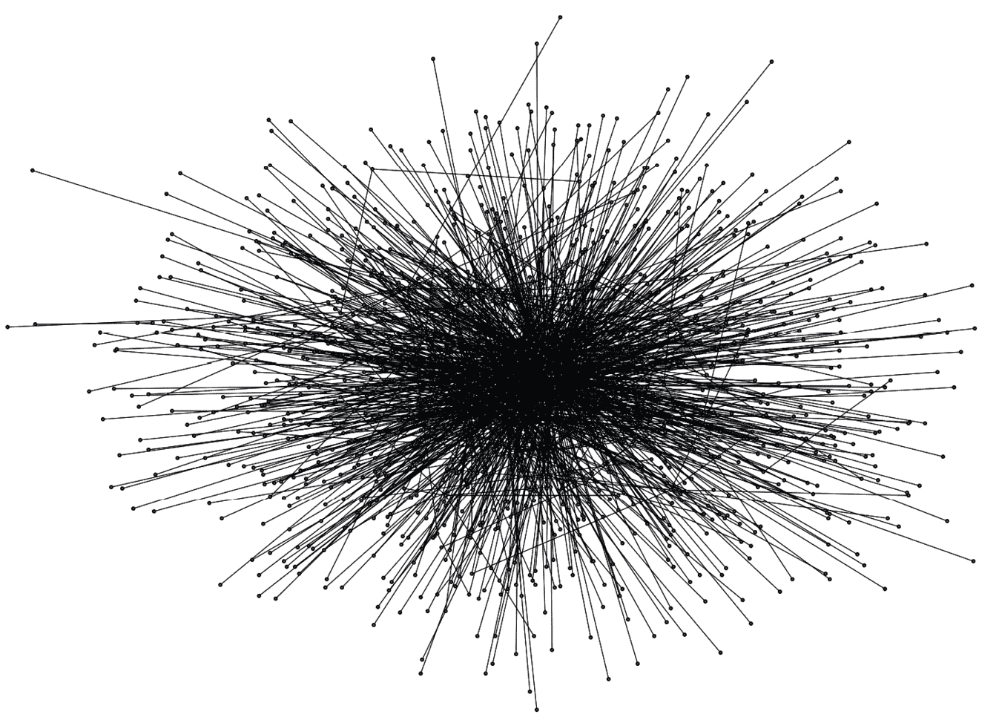
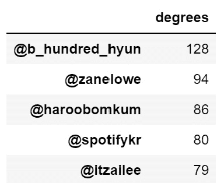

# 第七章：整体网络分析

在前几章中，我们花了很多时间讲解如何通过文本构建网络以及如何清理网络数据。在本章中，我们将开始进行**整体网络分析**。为了简便起见，我将其简称为**WNA**。WNA 用来了解网络的整体情况，分析网络的密度、哪些节点在不同方面最为重要、存在哪些社区等。我将介绍一些我认为有用的内容，这些内容与大多数**社交网络分析**（**SNA**）或网络科学书籍中的内容有所不同。我每天都在进行应用网络科学，我的目标是展示一些可以让读者快速开始网络分析的选项。

网络科学和 SNA 都是非常丰富的主题，如果你觉得本章某一部分特别有趣，我鼓励你自己进行研究，进一步了解。在本书中，我会引用一些 NetworkX 文档中的特定部分。请注意，这些参考页面上还有许多没有覆盖的功能，了解那些鲜为人知的函数，它们的功能及使用方式，会非常有帮助。

NetworkX 的在线文档分享了期刊文章的链接，供你阅读和学习。

在阅读本章时，我希望你考虑自己工作中遇到的问题，并尝试找出你可以将我所描述的方法应用到自己工作的方式。一旦你开始处理网络问题，你会发现它们无处不在，一旦学会如何分析和操作它们，机会的世界便会向你展开。

我们将涵盖以下主题：

+   创建基准 WNA 问题

+   WNA 实践

+   比较中心性

+   可视化子图

+   调查连通分量

+   理解网络层次

# 技术要求

本章中，我们将使用 Python 库 NetworkX 和 pandas。这两个库现在应该已经安装完成，可以随时使用。如果没有安装，你可以通过以下命令安装这些 Python 库：

```py
pip install <library name>
```

比如，要安装 NetworkX，你可以使用以下命令：

```py
pip install networkx
```

在 *第四章*中，我们还介绍了一个`draw_graph()`函数，它同时使用了 NetworkX 和 `Scikit-Network`。每次进行网络可视化时，你都需要用到这个代码，记得随时备好！

你可以在 GitHub 仓库中找到本章所有代码：[`github.com/PacktPublishing/Network-Science-with-Python`](https://github.com/PacktPublishing/Network-Science-with-Python)。

# 创建基准 WNA 问题

在进行任何分析之前，我通常会记录下自己的一些问题。这有助于我明确自己要寻找的目标，并为我设定一个框架，去追寻这些答案。

在进行任何类型的 WNA 时，我关注的是寻找每一个问题的答案：

+   网络有多大？

+   网络有多复杂？

+   网络在视觉上是什么样子的？

+   网络中最重要的节点是什么？

+   是不是有孤岛，还是只有一个大大陆？

+   网络中可以找到哪些社区？

+   网络中存在哪些桥梁？

+   网络的层次揭示了什么？

这些问题为我提供了一个起点，可以作为我进行网络分析时的任务清单。这使我在进行网络分析时有了一个有条理的方法，而不仅仅是追随自己的好奇心。网络是嘈杂且混乱的，而这个框架为我提供了一个保持专注的工具。

## 修改后的 SNA 问题

在本章中，我们将使用一个 K-pop 社交网络。你可以在*第二章*中了解更多关于此网络数据的信息。

我的目标是了解网络的形态，以及信息如何在个体和社区之间流动。我还希望能够探索网络的不同层次，就像剥洋葱一样。核心通常特别有趣。

由于这是一个社交网络，我有一些额外的问题，超出了之前的基本问题：

+   社交网络有多大？这意味着什么？

+   网络的复杂性和相互连接程度如何？

+   网络在视觉上是什么样子的？

+   网络中最重要的人和组织是谁？

+   网络中只有一个巨大的集群吗，还是有孤立的人群？

+   网络中可以找到哪些社区？

+   网络中存在哪些桥梁？

+   网络的层次揭示了什么？

## 社交网络分析重访

在*第二章*，《网络分析》中，我描述了网络科学和社会网络分析（SNA）的定义、起源和用途。尽管这两个领域是独立的研究领域，但它们有很多重叠，因此我认为社交网络是一组应该整合到网络科学中的技术。这是因为 SNA 可以很好地利用网络科学的工具和技术，而将网络科学应用于社交网络会使其更加有趣。我个人并不区分这两者。

什么是社交网络分析？在我看来，它是从社会角度看网络分析的一种不同视角。网络科学涉及的是网络如何构建、网络的属性以及网络如何随时间演变。而在社交网络分析中，我们更加关注个体。我们想知道网络中哪些人和组织是重要的，哪些个体作为社区之间的桥梁，哪些社区存在以及它们存在的原因。

**内容分析**是 NLP 与网络科学结合最为重要的领域。NLP 允许提取实体（人、地点和组织）并预测文本的情感分类。网络科学和 SNA 则使我们能够更深入地理解这些网络中存在的关系。因此，通过 NLP 和网络分析，你不仅可以获得内容背景，还能获得关系背景。这是一个强大的协同效应，*1 + 1 =* *3*。

在本章中，我们不会进行任何自然语言处理（NLP）。我将解释网络科学和社会网络分析（SNA）的一些功能。那么，让我们开始吧！

# WNA（网络分析）实战

正如前一章所提到的，在 NetworkX 中，你可以构建无向图、有向图、多重图或多重有向图。在本章中，我们将使用无向图，因为我想展示某些功能如何帮助理解网络。需要知道的是：我接下来展示的内容如果使用其他类型的网络，会有不同的意义。当使用有向网络时，你还有更多的选择，比如研究`in_degrees`和`out_degrees`，不仅仅是总度数。

## 加载数据并创建网络

我们需要做的第一件事是构建图形。没有图形，我们就无法进行分析：

1.  你可以像这样从我的 GitHub 读取 K-pop 边列表：

    ```py
    import pandas as pd
    ```

    ```py
    data = 'https://raw.githubusercontent.com/itsgorain/datasets/main/networks/kpop/kpop_edgelist.csv'
    ```

    ```py
    df = pd.read_csv(data)
    ```

    ```py
    df['source'] = df['source'].str[0:16]
    ```

    ```py
    df['target'] = df['target'].str[0:16]
    ```

    ```py
    df.head()
    ```

预览 pandas DataFrame，我们可以看到有`'source'`和`'target'`两列。这正是 NetworkX 用来构建图形所需要的。如果你想为图的列命名不同的名称，NetworkX 也允许你指定自己的源和目标列。

1.  查看边列表的形状，我们可以看到边列表中有 1,286 条边：

    ```py
    df.shape[0]
    ```

    ```py
    1286
    ```

记住，边是指一个节点与另一个节点之间，或者一个节点与其自身之间的关系，这被称为**自环**。

1.  现在我们已经准备好了 pandas 边列表，我们可以用它来构建无向图：

    ```py
    import networkx as nx
    ```

    ```py
    G = nx.from_pandas_edgelist(df)
    ```

    ```py
    G.remove_edges_from(nx.selfloop_edges(G))
    ```

    ```py
    G.remove_node('@') # remove a junk node
    ```

1.  最后，让我们检查`G`，确保它是一个无向 NetworkX 图：

    ```py
    G
    ```

    ```py
    <networkx.classes.graph.Graph at 0x217dc82b4c8>
    ```

这看起来完美无缺，所以我们可以开始分析了。

## 网络的大小和复杂性

我们要调查的第一件事是网络的大小、形状和整体复杂性。让我来定义一下我的意思：

+   **网络大小**：网络中节点和边的数量

+   **网络复杂性**：网络中的聚类程度和密度。聚类指的是在网络中实际存在的三角形数量，密度则类似于指网络中节点之间的互联程度。

NetworkX 使得查找网络中节点和边的数量变得非常容易。你只需使用`nx.info(G)`，如下所示：

```py
nx.info(G)
'Graph with 1163 nodes and 1237 edges'
```

我们的网络有 1,163 个节点和 1,237 条边。简单来说，我们的 K-pop 社交网络由 1,163 个人和组织组成，在这 1,163 个人和组织之间，有 1,237 个已识别的互动。由于这是 Twitter 数据，因此在此情况下，互动意味着两个账户在同一条推文中被提到，意味着它们以某种方式是相关的。回到自然语言处理和内容分析的重要性，我们可以利用这些已识别的关系进一步挖掘这些关系到底是什么类型的。它们是合作关系吗？他们在争论吗？他们一起写了论文吗？社会网络分析（SNA）无法给出这些答案。我们需要内容分析来解决这些问题。但这一章是关于网络分析的，所以让我们继续。

这是一个密集的网络吗？除非你分析的是一个紧密的社群，否则互联网社交网络往往是稀疏的，而非密集的。

让我们看看网络的聚类和密度是什么样子的：

1.  首先，让我们检查一下平均聚类：

    ```py
    nx.average_clustering(G)
    ```

    ```py
    0.007409464946430933
    ```

聚类的结果约为`0.007`，这表明这是一个稀疏的网络。如果聚类返回的结果是`1.000`，那就表示每个节点都与网络中的其他节点连接。在 SNA 的背景下，这意味着网络中的每个人和组织彼此相识并进行互动。但在 K-pop 中，情况显然不是这样的。并非所有的音乐人都认识他们的粉丝，粉丝们也不一定和他们最喜欢的偶像是朋友。

1.  `密度`是什么样子的呢？

    ```py
    from networkx.classes.function import density
    ```

    ```py
    density(G)
    ```

    ```py
    0.001830685967059492
    ```

密度给出的结果约为`0.002`，进一步验证了这个网络的稀疏性。

我们先不要继续。我想确保这些概念被理解。让我们构建一个完全连接的图——一个“完全”图——包含 20 个节点，并重复前面几段的步骤。NetworkX 有一些方便的函数用于生成图形，我们将使用`nx.complete_graph`进行演示：

1.  让我们构建图表吧！

    ```py
    G_conn = nx.complete_graph(n=20)
    ```

1.  首先，让我们调查一下网络的大小：

    ```py
    nx.info(G_conn)
    ```

    ```py
    'Graph with 20 nodes and 190 edges'
    ```

很棒。我们有一个包含 20 个节点的网络，这 20 个节点之间有 190 条边。

1.  但这真的是一个完全连接的网络吗？如果是的话，那么我们应该会得到`1.0`的聚类和密度值：

    ```py
    nx.average_clustering(G_conn)
    ```

    ```py
    1.0
    ```

    ```py
    density(G_conn)
    ```

    ```py
    1.0
    ```

1.  完美。那正是我们预期的结果。但这个网络到底是什么样子的呢？让我们使用我们在本书中一直使用的相同函数来绘制可视化图：

    ```py
    draw_graph(G_conn, edge_width=0.3)
    ```

这将绘制出没有节点标签的网络。


图 7.1 – 完全图

如你在网络可视化中看到的，每个节点都与其他节点相连。这是一个完全连接的网络。我们的 K-pop 网络是一个稀疏连接的网络，因此其可视化图将看起来非常不同。

## 网络可视化与思考

我们知道完全连接的网络是什么样子，我们也知道 K-pop 社交网络是稀疏连接的，但这到底是什么样子的呢？让我们看看：

```py
draw_graph(G, node_size=1, show_names=False)
```

这将创建一个没有标签的节点和边的网络可视化。



图 7.2 – K-pop 网络

需要注意的一点是，即使只有一千个节点，这仍然需要几秒钟才能渲染完成，并且无法从网络中提取任何真正的洞察。我们看到一堆小点，看到这些小点与其他小点之间的许多线条。我们还可以注意到，网络有一个核心部分，并且随着我们向网络的边缘推进，网络的稀疏度增加。本章稍后会探讨网络层的概念。关键是，除了考虑它看起来很酷之外，我们对这种可视化几乎做不了什么。至少我们可以将其可视化，而在本章的后续部分，我将解释如何“剥洋葱”以理解网络中的各种层次。

但现在为了展示一些内容，这里有一种非常快速的方法来删除所有只有一个边的节点，而这些节点占据了大部分网络。如果你这样做，你可以非常迅速地去噪网络。这是一个巨大的时间节省，因为我之前做完全相同事情的方法是如下：

1.  使用列表推导识别每个只有一个边的节点。

1.  从网络中移除它。

这一行代码消除了所有这些需求。`K_core`将`G`图转换为另一个只包含两个或更多边的节点的图：

```py
draw_graph(nx.k_core(G, 2), node_size=1, show_names=False)
```

很简单。现在网络看起来怎么样？


图 7.3 – 简化后的 K-pop 网络

我希望你能看到，这一个单独的步骤迅速揭示了所有只有一个边的节点下存在的网络结构。有几种方法可以简化网络，我经常使用这种方法。

## 重要节点

我们现在已经了解了网络的一般形态，但我们更关心的是了解谁是最重要的人物和组织。在网络科学中，存在着所谓的**中心性得分**，它根据节点的位置以及信息流动的方式来表示节点在网络中的重要性。NetworkX 提供了数十种不同的中心性度量方法。你可以在[`networkx.org/documentation/stable/reference/algorithms/centrality.html`](https://networkx.org/documentation/stable/reference/algorithms/centrality.html)了解它们。

我将介绍一些我常用的中心性，但这些不一定是最重要的中心性。每种中心性在揭示不同的背景时都有其用途。谷歌的创始人们也创造了他们自己的中心性，著名的叫做 **PageRank**。PageRank 是许多数据专业人士常用的中心性，但它可能还不够全面。为了全面了解，你应该理解节点的重要性，不仅要看它们是如何连接的，还要看信息是如何流动的。让我们探索几种衡量网络中节点重要性的方法。

## 度数

判断网络中某个事物或人的重要性最简单的方法就是根据它与其他节点之间的连接数。以 Twitter 或 Facebook 等流行社交网络为例，网红通常连接非常广泛，而我们则会对连接非常少的账户产生怀疑。我们正在借助代码提取这个概念，从我们的网络中获取这一洞察。

在网络中，实体（如人、地方、组织等）称为节点，节点与节点之间的关系称为边。我们可以通过调查网络中节点的度数来计算每个节点的边数：

```py
degrees = dict(nx.degree(G))
degrees
{'@kmg3445t': 1,
 '@code_kunst': 13,
 '@highgrnd': 1,
 '@youngjay_93': 1,
 '@sobeompark': 1,
 '@justhiseung': 1,
 '@hwajilla': 1,
 '@blobyblo': 4,
 '@minddonyy': 1,
 '@iuiive': 1,
 '@wgyenny': 1,
 ...
 }
```

现在，我们有一个包含节点及其度数的 Python 字典。如果我们将这个字典放入 pandas DataFrame 中，我们可以轻松地排序并可视化度数：

1.  首先，我们将其加载到 pandas DataFrame 中，并按度数降序排序（从高到低）：

    ```py
    degree_df = pd.DataFrame(degrees, index=[0]).T
    ```

    ```py
    degree_df.columns = ['degrees']
    ```

    ```py
    degree_df.sort_values('degrees', inplace=True, ascending=False)
    ```

    ```py
    degree_df.head()
    ```

这将展示一个 Twitter 账户及其度数的 DataFrame。



图 7.4 – 节点度数的 pandas DataFrame

1.  现在，让我们创建一个水平条形图，以便快速获取一些洞察：

    ```py
    import matplotlib.pyplot as plt
    ```

    ```py
    title = 'Top 20 Twitter Accounts by Degrees'
    ```

    ```py
    _= degree_df[0:20].plot.barh(title=title, figsize=(12,7))
    ```

    ```py
    plt.gca().invert_yaxis()
    ```

这将通过度数可视化 Twitter 账户之间的连接。


图 7.5 – 按度数排列的 Twitter 账户水平条形图

一个显著的现象是，即使是比较连接最多的前 20 个节点，度数也迅速下降。在最连接的节点之后，度数下降非常明显。网络中连接最多的节点属于歌手/词曲创作人/演员边伯贤（Byun Baek-hyun），他是组合 Exo 的成员，更为人知的名字是 Baekhyun。这很有意思。为什么他会有这么多连接？是人们在连接他，还是他在连接其他人？每一个洞察通常会引发更多可以探索的问题。把这些问题写下来，根据价值进行优先级排序，然后你可以利用这些问题进行更深入的分析。

## 度数中心性

**度数中心性**类似于根据节点的度数判断其重要性。度数中心性是网络中一个节点与其他节点连接的比例。一个节点的度数越多，它与其他节点连接的比例就越高，因此度数和度数中心性可以互换使用：

1.  我们可以计算网络中每个节点的度数中心性：

    ```py
    degcent = nx.degree_centrality(G)
    ```

    ```py
    degcent
    ```

    ```py
    {'@kmg3445t': 0.0008605851979345956,
    ```

    ```py
     '@code_kunst': 0.011187607573149742,
    ```

    ```py
     '@highgrnd': 0.0008605851979345956,
    ```

    ```py
     '@youngjay_93': 0.0008605851979345956,
    ```

    ```py
     '@sobeompark': 0.0008605851979345956,
    ```

    ```py
     '@justhiseung': 0.0008605851979345956,
    ```

    ```py
     '@hwajilla': 0.0008605851979345956,
    ```

    ```py
     '@blobyblo': 0.0034423407917383822,
    ```

    ```py
     '@minddonyy': 0.0008605851979345956,
    ```

    ```py
     '@iuiive': 0.0008605851979345956,
    ```

    ```py
     ...
    ```

    ```py
     }
    ```

1.  我们可以用它来创建另一个 pandas DataFrame，按度数中心性降序排序：

    ```py
    degcent_df = pd.DataFrame(degcent, index=[0]).T
    ```

    ```py
    degcent_df.columns = ['degree_centrality']
    ```

    ```py
    degcent_df.sort_values('degree_centrality', inplace=True, ascending=False)
    ```

    ```py
    degcent_df.head()
    ```

这将显示一个 Twitter 账户及其度数中心性的 DataFrame。


图 7.6 – 节点度数中心性的 pandas DataFrame

1.  最后，我们可以将其可视化为一个横向条形图：

    ```py
    title = 'Top 20 Twitter Accounts by Degree Centrality'
    ```

    ```py
    _= degcent_df[0:20].plot.barh(title=title, figsize=(12,7))
    ```

    ```py
    plt.gca().invert_yaxis()
    ```

这将绘制一个按度数中心性排序的 Twitter 账户横向条形图。


图 7.7 – 按度数中心性排序的 Twitter 账户横向条形图

你注意到度数和度数中心性的条形图除了数值外，看起来几乎一模一样吗？这就是我说它们可以互换使用的原因。使用度数通常会更容易解释和辩护。

## 介数中心性

**介数中心性**与信息如何在网络中流动有关。如果一个节点位于其他两个节点之间，那么这两个节点中的任何一个的信息必须通过位于它们之间的节点传递。信息通过位于中间的节点流动。这个节点可以被视为一个瓶颈，或者是一个优势的地方。拥有他人所需信息的节点可以提供战略上的优势。

然而，通常情况下，介数中心性较高的节点位于多个节点之间，而不仅仅是两个节点之间。这通常出现在一个启动网络中，其中一个核心节点连接到几十个或更多的其他节点。想象一下一个社交媒体上的网红。这个人可能与 2200 万粉丝相连，但这些粉丝之间很可能互不相识。他们肯定认识这个网红（或者是一个虚假的机器人）。这个网红就是一个核心节点，介数中心性将会体现这一点。

在我们了解如何计算介数中心性之前，请注意，计算介数中心性对于大型或密集的网络来说非常耗时。如果你的网络较大或密集，且导致介数中心性的计算速度慢到无法使用，考虑使用其他中心性指标来计算重要性：

1.  我们可以计算网络中每个节点的介数中心性：

    ```py
    betwcent = nx.betweenness_centrality(G)
    ```

    ```py
    betwcent
    ```

    ```py
    {'@kmg3445t': 0.0,
    ```

    ```py
     '@code_kunst': 0.016037572215773392,
    ```

    ```py
     '@highgrnd': 0.0,
    ```

    ```py
     '@youngjay_93': 0.0,
    ```

    ```py
     '@sobeompark': 0.0,
    ```

    ```py
     '@justhiseung': 0.0,
    ```

    ```py
     '@hwajilla': 0.0,
    ```

    ```py
     '@blobyblo': 0.02836579219003866,
    ```

    ```py
     '@minddonyy': 0.0,
    ```

    ```py
     '@iuiive': 0.0,
    ```

    ```py
     '@wgyenny': 0.0,
    ```

    ```py
     '@wondergirls': 0.0013446180439736057,
    ```

    ```py
     '@wg_lim': 0.0026862711087984274,
    ```

    ```py
     ...
    ```

    ```py
     }
    ```

1.  我们可以用它来创建另一个 pandas DataFrame，按介数中心性降序排序：

    ```py
    betwcent_df = pd.DataFrame(betwcent, index=[0]).T
    ```

    ```py
    betwcent_df.columns = ['betweenness_centrality']
    ```

    ```py
    betwcent_df.sort_values('betweenness_centrality', inplace=True, ascending=False)
    ```

    ```py
    betwcent_df.head()
    ```

这将显示一个 Twitter 账户及其介数中心性的 DataFrame。


图 7.8 – 节点介数中心性的 pandas DataFrame

1.  最后，我们可以将其可视化为一个横向条形图：

    ```py
    title = 'Top 20 Twitter Accounts by Betweenness Centrality'
    ```

    ```py
    _= betwcent_df[0:20].plot.barh(title=title, figsize=(12,7))
    ```

    ```py
    plt.gca().invert_yaxis()
    ```

这将绘制一个按介数中心性排序的 Twitter 账户横向条形图。


图 7.9 – 按介数中心性排序的 Twitter 账户横向条形图

请注意，条形图与度数和度中心性的图表非常不同。还要注意，`@youtube`、`@spotifykr` 和 `@kchartsmaster` 是具有最高中介中心性的节点。这可能是因为艺术家和其他人在推特中提到 YouTube、Spotify 和 KChartsMaster。这些节点位于节点和其他节点之间。

## 接近中心性

**接近中心性**与节点之间的接近程度有关，这与被称为**最短路径**的概念相关，计算大规模或密集网络的最短路径是计算上昂贵且缓慢的。因此，接近中心性可能比中介中心性还要慢。如果由于网络的大小和密度，获取接近中心性结果太慢，你可以选择其他中心性度量来评估重要性。

最短路径将在另一个章节中讨论，它与从一个节点到另一个节点所需的跳数或握手次数有关。这是一个非常缓慢的操作，因为涉及到许多计算：

1.  我们可以计算网络中每个节点的接近中心性：

    ```py
    closecent = nx.closeness_centrality(G)
    ```

    ```py
    closecent
    ```

    ```py
    {'@kmg3445t': 0.12710883458078617,
    ```

    ```py
     '@code_kunst': 0.15176930794223495,
    ```

    ```py
     '@highgrnd': 0.12710883458078617,
    ```

    ```py
     '@youngjay_93': 0.12710883458078617,
    ```

    ```py
     '@sobeompark': 0.12710883458078617,
    ```

    ```py
     '@justhiseung': 0.12710883458078617,
    ```

    ```py
     '@hwajilla': 0.12710883458078617,
    ```

    ```py
     '@blobyblo': 0.18711010406907921,
    ```

    ```py
     '@minddonyy': 0.12710883458078617,
    ```

    ```py
     '@iuiive': 0.12710883458078617,
    ```

    ```py
     '@wgyenny': 0.07940034854856182,
    ```

    ```py
     ...
    ```

    ```py
     }
    ```

1.  我们可以用它来创建另一个 pandas 数据框，按接近中心性降序排序：

    ```py
    closecent_df = pd.DataFrame(closecent, index=[0]).T
    ```

    ```py
    closecent_df.columns = ['closeness_centrality']
    ```

    ```py
    closecent_df.sort_values('closeness_centrality', inplace=True, ascending=False)
    ```

    ```py
    closecent_df.head()
    ```

这将展示一个包含 Twitter 账户及其接近中心性的数据框。


图 7.10 – pandas 数据框，节点的接近中心性

1.  最后，我们可以将其可视化为水平条形图：

    ```py
    title = 'Top 20 Twitter Accounts by Closeness Centrality'
    ```

    ```py
    _= closecent_df[0:20].plot.barh(title=title, figsize=(12,7))
    ```

    ```py
    plt.gca().invert_yaxis()
    ```

这将绘制一个根据接近中心性排序的 Twitter 账户水平条形图。


图 7.11 – 根据接近中心性排序的 Twitter 账户水平条形图

请注意，结果与我们之前看到的其他任何中心性度量都不同。`@blackpink` 排名第一，其次是 `@youtube`、`@kchartsmaster` 和 `@spotifykr`。BLACKPINK 是著名的 K-pop 女团，它们在 K-pop 网络中有很强的连接性，能够获得影响力。其他 K-pop 艺术家可能需要调查 BLACKPINK 在做什么，才能使其处于一个战略上有利的网络位置。

## PageRank

最后，PageRank 是 Google 搜索背后的算法。Google 的创始人在 1999 年发表了这篇论文：[`ilpubs.stanford.edu:8090/422/1/1999-66.pdf`](http://ilpubs.stanford.edu:8090/422/1/1999-66.pdf)。如果你曾经在 Google 上搜索过任何内容，那么返回的结果部分是因为 PageRank，尽管自 1999 年以来，搜索算法可能已经发生了显著的演变。

PageRank 的数学公式不仅考虑了目标节点的入度和出度，还考虑了连接节点的入度和出度。这也是为什么**搜索引擎优化**（**SEO**）成为一项重要工作，因为人们了解到，要获得 Google 的高排名，一个网站应该尽可能多地拥有外部链接，并且还要链接到其他信息来源。如需了解 PageRank 背后的数学原理，请查看斯坦福大学的 PDF 文档。

PageRank 是一个非常快速的算法，适用于大规模和小规模的网络，并且作为*重要性*度量非常有用。许多图解决方案在其工具中提供 PageRank 功能，许多人将 PageRank 视为首选的中心性。就个人而言，我认为你应该了解几种中心性，了解它们的应用场景及其局限性。PageRank 在大型和密集网络中也非常有用，因此我建议在进行任何中心性分析时都包含它：

1.  我们可以计算网络中每个节点的 PageRank 得分：

    ```py
    pagerank = nx.pagerank(G)
    ```

    ```py
    pagerank
    ```

    ```py
    {'@kmg3445t': 0.00047123124840596525,
    ```

    ```py
     '@code_kunst': 0.005226313735064201,
    ```

    ```py
     '@highgrnd': 0.00047123124840596525,
    ```

    ```py
     '@youngjay_93': 0.00047123124840596525,
    ```

    ```py
     '@sobeompark': 0.00047123124840596525,
    ```

    ```py
     '@justhiseung': 0.00047123124840596525,
    ```

    ```py
     '@hwajilla': 0.00047123124840596525,
    ```

    ```py
     '@blobyblo': 0.0014007295303692594,
    ```

    ```py
     '@minddonyy': 0.00047123124840596525,
    ```

    ```py
     ...
    ```

    ```py
     }
    ```

1.  我们可以使用这个来创建另一个按 PageRank 降序排序的 pandas DataFrame：

    ```py
    pagerank_df = pd.DataFrame(pagerank, index=[0]).T
    ```

    ```py
    pagerank_df.columns = ['pagerank']
    ```

    ```py
    pagerank_df.sort_values('pagerank', inplace=True, ascending=False)
    ```

    ```py
    pagerank_df.head()
    ```

这将显示一个 Twitter 账户及其 PageRank 得分的数据框。


图 7.12 – 节点的 PageRank 得分的 pandas DataFrame

1.  最后，我们可以将其可视化为水平条形图：

    ```py
    title = 'Top 20 Twitter Accounts by Page Rank'
    ```

    ```py
    _= pagerank_df[0:20].plot.barh(title=title, figsize=(12,7))
    ```

    ```py
    plt.gca().invert_yaxis()
    ```

这将绘制一个按 PageRank 排序的 Twitter 账户水平条形图。


图 7.13 – 按 PageRank 排序的 Twitter 账户水平条形图

这些结果实际上与度和度中心性所得到的条形图非常相似。再次，Exo 的 Baekhyun 位居榜首。

## 边的中心性

在结束这一部分关于中心性的内容之前，我想指出，你并不仅限于节点的中心性。也有边的中心性。例如，**边介数中心性**可以用来识别连接最多节点的边。如果你剪断了这条连接最多节点的边，网络通常会被分割成两个大块，称为**连通分量**。这实际上对识别社区或新兴趋势非常有用，我们将在后续章节中深入探讨。

# 比较中心性

为了了解不同中心性之间的差异，或者将多种中心性一起使用（例如，在构建机器学习分类器并希望使用图度量时），将不同的中心性合并成一个 pandas DataFrame 可能非常有用。你可以通过 pandas 的`concat`函数轻松实现：

```py
combined_importance_df = pd.concat([degree_df, degcent_df, betwcent_df, closecent_df, pagerank_df], axis=1)
combined_importance_df.head(10)
```

这将把我们的所有中心性和 PageRank DataFrame 合并成一个统一的 DataFrame。这样可以更方便地比较不同类型的中心性。


图 7.14 – 综合重要性度量的 pandas DataFrame

你可能会注意到，如果你按不同类型的中心性排序，一些中心性结果非常相似，而其他则差异很大。我留给你这个结论：没有一个中心性能够统治所有的网络。它们是不同的，应在不同的情境下使用。如果你正在绘制信息流的图谱，那么介数中心性非常有用，只要网络的规模是可管理的。如果你只想查看网络中哪些节点最为连接，可以通过查看节点的度数来最轻松地做到这一点。如果你想了解哪些节点与每个其他节点的距离最短，可以尝试使用接近中心性。如果你想要一个能很好地识别重要节点，并且即使在大型网络上也能高效运行的算法，可以尝试 PageRank：

```py
combined_importance_df.sort_values('pagerank', ascending=False)[0:10]
```

这将展示一个包含 Twitter 账户和综合网络中心性及 PageRank 得分的 DataFrame。


图 7.15 – 按 PageRank 排序的综合重要性度量的 pandas DataFrame

只需要知道，即使是 PageRank 和介数中心性也可能给出非常不同的结果，因此你应该学习几种不同的衡量重要性的方法，并了解你想要做什么。这些对初学者来说可能是非常陌生的，但不要害怕，跳进去学习吧。NetworkX 文档中的文档和相关期刊将足以帮助你入门。

如果你刚刚开始进行社交网络分析和网络科学，中心性可能是这一章中最不寻常的部分。从这一章节开始，接下来的概念应该就不那么陌生了。

# 可视化子图

在网络分析中，我们常常希望查看网络的一部分，以及该部分中的节点如何彼此连接。例如，如果我有一个 100 个感兴趣的网页域名或社交媒体账号的列表，那么创建一个包含所有节点的子图来进行分析和可视化可能会非常有用。

对于子图的分析，本章中的所有内容仍然适用。例如，你可以在子图中使用中心性来识别一个社区中的重要节点。你还可以使用社区检测算法来识别子图中存在的社区，尤其是当这些社区尚未被识别时。

当你想去除网络中的大部分噪音并研究某些节点之间的交互时，可视化子图也非常有用。可视化子图与我们可视化整个网络、个人图和时序图的方式是一样的。但创建子图需要稍微花费一点工作。首先，我们需要识别出感兴趣的节点，然后我们需要构建一个仅包含这些节点的子图，最后，我们将可视化这个子图：

1.  举个例子，让我们选择网络中 PageRank 得分最高的 100 个节点：

    ```py
    subgraph_nodes = pagerank_df[0:100].index.to_list()
    ```

    ```py
    subgraph_nodes
    ```

    ```py
    ['@b_hundred_hyun',
    ```

    ```py
     '@zanelowe',
    ```

    ```py
     '@haroobomkum',
    ```

    ```py
     '@itzailee',
    ```

    ```py
     '@spotifykr',
    ```

    ```py
     '@shxx131bi131',
    ```

    ```py
     '@thinktwicekpop',
    ```

    ```py
     '@leehi_hi',
    ```

    ```py
     '@bambam1a',
    ```

    ```py
     '@bighitent',
    ```

    ```py
     '@ericnamofficial',
    ```

    ```py
     '@twicetly',
    ```

    ```py
     ...
    ```

    ```py
     ]
    ```

很简单。我这里只展示了几个节点，因为整个屏幕滚动下去时，节点会显示得很远。

1.  接下来，我可以构建一个子图，如下所示：

    ```py
    G_sub = G.subgraph(subgraph_nodes)
    ```

1.  最后，我可以像可视化任何其他网络一样进行可视化：

    ```py
    draw_graph(G_sub, node_size=3)
    ```

在这个例子中，我省略了节点名称，但我也可以很容易地将它们添加进来。我觉得不加节点名称会使这个示例的可视化更简洁。


图 7.16 – 按 PageRank 排序的前 100 个 K-pop Twitter 账号的子图可视化

就这样。实际上，关于子图创建的内容并不多，除了它是可行的以及如何做。只要知道方法，过程是简单的。

# 调查岛屿和大陆——连接组件

如果你查看子图的可视化图，你可能会注意到有一个大的节点簇，几个小的节点岛屿（有两条或更多的边），以及几个孤立节点（没有边的节点）。这是许多网络中常见的现象。通常，网络中会有一个巨大的超级簇，几个中等大小的岛屿，以及许多孤立节点。

这带来了挑战。当一些人刚开始接触网络分析时，他们通常会对网络进行可视化，并使用 PageRank 来识别重要节点。但这远远不够。提取网络中的洞察有很多不同的方法，我将在本书的过程中向你展示几种方法。

但是有一种非常简单的方式可以去除噪声，那就是识别网络中存在的大陆和岛屿，利用它们创建子图，然后分析和可视化这些子图。

这些*大陆*和*岛屿*在正式术语中称为**连接组件**。连接组件是一个网络结构，其中每个节点至少与另一个节点相连。实际上，NetworkX 允许孤立节点存在于自己的连接组件中，这让我感到奇怪，因为孤立节点除了可能自连接外，实际上没有与任何其他节点相连（自环存在）。

在网络中找到所有存在的连接组件是非常容易的：

```py
components = list(nx.connected_components(G))
len(components)
```

我这里做了两件事：首先，我将我们`G`图的所有连接组件加载到一个 Python 列表中，然后计算存在的组件数量。K-pop 网络中有 15 个连接组件。

很好，但这 15 个中哪些是大陆，哪些是岛屿呢？通过一个简单的循环，我们可以计算每个连接组件中存在的节点数：

```py
for i in range(len(components)):
    component_node_count = len(components[i])
    print('component {}: {}'.format(i, component_node_count))
```

这将给我们一个连接组件的列表，以及属于该连接组件的节点数：

```py
component 0: 909
component 1: 2
component 2: 3
component 3: 4
component 4: 2
component 5: 2
component 6: 80
component 7: 129
component 8: 3
component 9: 7
component 10: 4
component 11: 4
component 12: 2
component 13: 10
component 14: 2
```

完美。注意到其中一个组件有 909 个节点。这是网络中可能存在的大型“大陆”之一。还要注意到，组件中有 80 和 129 个节点。这比最大连通组件中的节点数量少得多，但仍然是一个相当大的节点数。我把这些看作是岛屿。最后，注意到还有几个组件的节点数在 2 到 10 之间。这些就像是小岛屿。

每一个连通组件都可以作为子图进行分析和可视化。为了简化可视化，我将创建一个辅助函数，扩展我的主要`draw_graph`函数：

```py
def draw_component(G, component, node_size=3, show_names=True)
    check_component = components[component]
    G_check = G.subgraph(check_component)
    return draw_graph(G_check, show_names=show_names, node_size=node_size)
```

让我们试试看吧。让我们可视化一个随机组件，组件 13：

```py
draw_component(G, component=13, node_size=5)
```

它是怎么呈现的？


图 7.17 – 连通组件 #13 的子图可视化

看起来不错。我们已经成功地可视化了整个网络中的一个单一组件。接下来，让我们可视化最大的组件：

```py
draw_component(G, 0, show_names=False, node_size=2)
```


图 7.18 – 连通组件 #0 的子图可视化

再次回到那个巨大的、混乱的线团。虽然我们成功地进行了可视化，但我们可以通过去除所有只有一个边的节点来大大简化它，比如这样做。

连通组件有点不寻常，就像中心性一样，但如果你把它们看作是存在于网络中的岛屿和大陆，那就能去除很多神秘感。总的来说，在一个网络中，通常会有几个连通组件，我把它们看作是大陆、岛屿或孤立点。在大多数网络中，通常至少有一个大型大陆，几个岛屿，以及零到多个孤立点。孤立点的数量取决于图的构建方式。使用我们在前几章中提到的 NER 方法，实际上是没有孤立点的。

我们将在*第九章*中查看更多关于连通组件的内容。

## 社区

社区检测算法在各种形式的网络分析中非常有用。在 WNA 中，它们可以用来识别整个网络中存在的社区。当应用于以自我为中心的网络（自我图）时，它们可以揭示围绕单个节点存在的社区和团体；在时间网络中，它们可以用来观察社区随时间的演变。

社区检测在社会网络分析（SNA）中很常见，因为在人口庞大的群体中存在不同的社群，识别这些社群是非常有用的。社区检测有多种方法，网络上有很多关于社区检测算法如何工作的资料。本书主要讲解应用网络科学，因此我只会演示其中一种，叫做**Louvain 算法**。与中心性一样，没有“最佳”的算法。我曾经参加过一些讨论，其中有人提到了一种边缘算法，并坚信它更好；也有讨论中人们更倾向于使用 Louvain 算法。

您可以在这里了解更多关于 Louvain 算法的信息：[`python-louvain.readthedocs.io/en/latest/`](https://python-louvain.readthedocs.io/en/latest/)。

1.  Louvain 算法并未随 NetworkX 一起提供。您需要安装它，安装方法非常简单，如下所示：

    ```py
    pip install python-louvain
    ```

1.  之后，您可以通过以下方式导入该库进行使用：

    ```py
    import community as community_louvain
    ```

1.  为了节省大量时间并跳过数学部分，Louvain 算法可以识别节点所属的各种分区（社区）。与我们通常的网络可视化相比，可视化这些分区有点棘手，因为`scikit-network`对节点着色的灵活性并不高。为了节省时间，我将回到我以前的网络可视化实践，并使用 NetworkX 进行可视化。下面是绘制图形和着色社区的代码：

    ```py
    def draw_partition(G, partition):
    ```

    ```py
        import matplotlib.cm as cm
    ```

    ```py
        import matplotlib.pyplot as plt
    ```

    ```py
        # draw the graph
    ```

    ```py
        plt.figure(3,figsize=(12,12))
    ```

    ```py
        pos = nx.spring_layout(G)
    ```

    ```py
        # color the nodes according to their partition
    ```

    ```py
        cmap = cm.get_cmap('flag', max(partition.values()) + 1)
    ```

    ```py
        nx.draw_networkx_nodes(G, pos, partition.keys(), node_size=20, cmap=cmap, node_color=list(partition.values()))
    ```

    ```py
        nx.draw_networkx_edges(G, pos, alpha=0.5, width=0.3)
    ```

    ```py
        return plt.show()
    ```

1.  现在我们已经有了可视化功能，我们需要先识别分区，然后我们需要可视化网络。让我们将这两步一起完成。我在经过一些调整后使用`resolution=2`，因为社区布局看起来最优：

    ```py
    partition = community_louvain.best_partition(G, resolution=2)
    ```

    ```py
    draw_partition(G, partition)
    ```

看起来怎么样？


图 7.19 – 社区分区的可视化

这些图像对我来说虽然凌乱，但却令人着迷。我可以轻松地看到一些以前从未注意到的、易于区分的社区。但是它们是什么呢？哪些节点属于每个社区？将这个分区列表转换为 pandas DataFrame 非常简单，我们可以利用它来识别社区，统计每个社区中节点的数量，确定某个节点属于哪个社区，并可视化各个社区：

1.  首先，让我们从分区列表创建一个 pandas DataFrame：

    ```py
    community_df = pd.DataFrame(partition, index=[0]).T
    ```

    ```py
    community_df.columns = ['community']
    ```

    ```py
    community_df.head()
    ```

现在看起来怎么样？


图 7.20 – pandas DataFrame 中的社区分区

1.  这看起来不错。我们可以看到，它已经按分区编号排序，我称之为`community`。现在它已经是一个 pandas DataFrame，统计每个社区中属于的节点数量变得很简单：

    ```py
    community_df['community'].value_counts()
    ```

这将为我们提供一个社区列表（左侧数字）以及该社区中节点的数量（右侧数字）：

```py
21    170
10    133
14    129
16    104
2      91
3      85
13     80
23     70
0      66
15     55
4      51
22     48
1      36
17     10
19      7
9       4
20      4
5       4
8       3
18      3
12      2
11      2
7       2
6       2
24      2
```

我们可以轻松看到哪些社区拥有最多的节点。我们应该使用子图来分析和可视化这些社区，正如前面所解释的那样。

1.  那么我们如何识别每个社区中的节点呢？我们可以直接在 pandas 中进行。以下是一个简单的辅助函数：

    ```py
    def get_community_nodes(commmunity_df, partition):
    ```

    ```py
        community_nodes = community_df[community_df['community']==partition].index.to_list()
    ```

    ```py
        return community_nodes
    ```

1.  我们可以直接使用这个功能，但我更倾向于将这些`community`节点提取出来，创建一个子图并进行可视化。以下是实现这一功能的辅助函数：

    ```py
    def draw_community(G, community_df, partition, node_size=3, show_names=False):
    ```

    ```py
        community_nodes = get_community_nodes(community_df, partition)
    ```

    ```py
        G_community = G.subgraph(community_nodes)
    ```

    ```py
        return draw_graph(G_community, node_size=node_size, show_names=show_names)
    ```

我们来试试一个：

```py
draw_community(G, community_df, 1, show_names=True)
```


图 7.21 – 社区 #1 的子图可视化

运行后，我可以看到这个可视化效果。如果你看到的是不同的结果，不用担心。在处理网络时，像连通分量和社区编号等东西，在下一次运行时位置不一定相同。

非常酷。这感觉与可视化连通分量非常相似，但社区不一定是孤岛或大陆。例如，多个社区可以出现在一个大型的连通分量中。算法寻找分隔节点群体的边界，然后据此标记社区。

如果你从事网络工作，特别是如果你有兴趣识别社交网络中存在的社群，你会想要尽可能多地了解如何识别团体和社区。尝试不同的算法。我选择了 Louvain，因为它快速且可靠，即使在大型网络中也是如此。

## 桥接节点

简单来说，桥接节点是位于两个不同社区之间的节点。在小型社交网络中，这些节点通常很容易被目视识别，因为会有一个或几个看起来像橡皮筋的连接强度，如果被剪断，两个群体就会分开。就像桥梁让人们可以跨越水面从一块陆地走到另一块陆地一样，网络中的桥接节点也能让信息从一个社区传播到另一个社区。作为人类，身处桥接节点是一个强有力的位置，因为信息和资源必须通过你才能传递到另一方。

在复杂的网络中，桥接节点更难以目视识别，但它们通常存在，位于两个社区之间。我们的 K-Pop 网络相当复杂，因此网络比在较小的社交网络中更不容易看出，但它们确实存在。

1.  你可以像这样在网络中找到桥接节点：

    ```py
    list(nx.bridges(G))
    ```

    ```py
    [('@kmg3445t', '@code_kunst'),
    ```

    ```py
     ('@code_kunst', '@highgrnd'),
    ```

    ```py
     ('@code_kunst', '@youngjay_93'),
    ```

    ```py
     ('@code_kunst', '@sobeompark'),
    ```

    ```py
     ('@code_kunst', '@justhiseung'),
    ```

    ```py
     ('@code_kunst', '@hwajilla'),
    ```

    ```py
     ('@code_kunst', '@blobyblo'),
    ```

    ```py
     ('@code_kunst', '@minddonyy'),
    ```

    ```py
     ('@code_kunst', '@iuiive'),
    ```

    ```py
     ('@code_kunst', '@eugenius887'),
    ```

    ```py
     ...
    ```

    ```py
    ]
    ```

1.  这是一个非常长的桥接节点列表，我这里只展示了一部分行，但我们可以结合 pandas 来识别最重要的桥接节点：

    ```py
    bridges = [s[0] for s in list(nx.bridges(G))]
    ```

    ```py
    pd.Series(bridges).value_counts()[0:10]
    ```

    ```py
    @b_hundred_hyun    127
    ```

    ```py
    @zanelowe           90
    ```

    ```py
    @haroobomkum        84
    ```

    ```py
    @itzailee           78
    ```

    ```py
    @spotifykr          60
    ```

    ```py
    @shxx131bi131       57
    ```

    ```py
    @thinktwicekpop     53
    ```

    ```py
    @leehi_hi           53
    ```

    ```py
    @bambam1a           49
    ```

    ```py
    @bighitent          46
    ```

1.  删除桥接节点的一个副作用是，它可能类似于删除高度中心的节点——网络会碎裂成一大群孤立节点和一些较小的连通分量。让我们把拥有最多边的 10 个桥接节点删除：

    ```py
    cut_bridges = pd.Series(bridges).value_counts()[0:10].index.to_list()
    ```

    ```py
    G_bridge_cut = G.copy()
    ```

    ```py
    G_bridge_cut.remove_nodes_from(cut_bridges)
    ```

1.  做完这一步后，我们的网络可能看起来像一颗超级新星爆发，碎片飞向太空。让我们来看看：

    ```py
    draw_graph(G_bridge_cut, show_names=False)
    ```

这应该会绘制一个没有节点标签的网络。


图 7.22 – 切割主要桥梁后的网络可视化

如我们所见，网络中心仍然存在一个密集连接的组件，少数由几个节点组成的小型连接组件，以及许多独立的孤立节点。切割桥梁并不总是如此具有破坏性。在我处理的其他网络中，存在一个由两个社区组成的核心结构，几个节点位于这两个社区之间作为桥梁。当移除这些桥梁时，网络的核心社区就会分裂开来，几乎没有或没有孤立节点。

识别桥梁是有原因的。在社交网络中，这些节点是信息必须经过的节点，才能到达另一边的社区。如果你想在这些网络中战略性地定位自己，理解桥梁节点的作用，并模仿他们所做的，和两边的人建立联系，将会是通向权力的捷径。

同样，如果你的目标是禁用一个网络，识别并移除重要的桥梁将会停止信息从一个社区流向另一个社区。这将造成高度的干扰。这对于破坏暗网（如犯罪、仇恨等）可能非常有用。

这些是可以从网络中提取的有用见解，没有网络分析很难识别。识别桥梁并为处理它们制定计划，可以提供战略优势。你可以利用它们来获取权力，也可以用来破坏网络，或者将网络社区分离，进行更清晰的分析。

# 使用 k_core 和 k_corona 理解网络的层次

网络可以被看作是洋葱，通常也以类似的方式进行可视化，孤立节点位于最外层，接下来是具有单一边缘的节点，然后是具有两条边的节点，依此类推，直到到达网络的核心。NetworkX 提供了两种方法来“剥洋葱”，即 **k_core** 和 **k_corona**。

## k_core

NetworkX 的 `k_core` 函数允许我们轻松将网络简化为仅包含具有 `k` 条或更多边缘的节点，其中 "`k`" 是一个介于 0 和网络中任意节点的最大边数之间的数字。因此，您得到的是一个包含 `k` 条或更多边缘的网络“核心”。如果执行 `k_core(G, 2)`，则返回的图形将仅包含那些具有两条或更多边缘的节点，同时移除了孤立节点和仅有一个边缘的节点，一步完成。

这一单一的网络去噪步骤可能看起来没什么大不了，但如果通过列表推导或循环来实现，需要更多的步骤、更多的思考以及更多的调试。这一步骤轻松地完成了清理工作。因此，当我最关注去除孤立节点和单边节点后的网络形态时，`k_core(G, 2)` 是我代码中常见的操作。

比如说，这就是我们完整的 K-pop 网络渲染出来的样子。很难看清任何东西，因为那些单边节点已经将网络可视化变成了一团乱麻。


图 7.23 – 整个网络的可视化

然而，我们可以很容易地删除所有度数小于两个的节点：

```py
G_core = nx.k_core(G, 2)
```

那么网络现在看起来怎么样？

```py
draw_graph(G_core, show_names=True, node_size=3)
```

这应该绘制出我们的`G_core`网络，并显示节点标签。


图 7.24 – 带有 k_core 和 k=2 的整个网络可视化

很明显，这样要更容易解释。

学习`k_core`是我学习如何分析图形和社交网络过程中最重要的时刻之一。我以前是通过不太直接的方法来去噪网络，识别度数少于两个的节点，将它们添加到列表中，然后从网络中删除它们。这个单一功能节省了我大量的时间。

## k_corona

正如`k_core`允许我们提取网络的核心一样，`k_corona`让我们可以研究网络的每一层。`k_corona`不是为了找出核心，而是为了研究网络每一层发生的事情。例如，如果我们只想查看那些有零条或一条边的节点，我们可以这样做：

```py
G_corona = nx.k_corona(G, 1)
```

这将显示一堆孤立节点，并且可能还会有一些节点之间存在一条边：

1.  首先，让我们可视化`k_corona(G, 1)`的结果：

    ```py
    draw_graph(G_corona, show_names=False, node_size=2)
    ```

这应该渲染出所有拥有一个或更少边的节点的网络可视化。没有任何边的节点称为孤立节点，将以点的形式显示。


图 7.25 – k_corona k=1 层的可视化

如我们所见，有很多孤立节点。你能识别出那些只有一条边连接的节点吗？我看不出来。这就像在读那本《在哪里是沃尔多？》一样。那么，我们如何识别出这个层次中有边相连的节点呢？如何移除所有度数小于一的节点呢？想一想。

1.  没错，我们将使用`k_core`进行清理：

    ```py
    G_corona = nx.k_corona(G, 1)
    ```

    ```py
    G_corona = nx.k_core(G_corona, 1)
    ```

如果我们将其可视化，可以看到有五个连接组件，每个组件包含两个节点，每个节点与该组件中另一个节点之间有一条边。

```py
draw_graph(G_corona, show_names=True, node_size=5, font_size=12)
```

这将绘制出`G_corona`网络，孤立节点已被移除，并且显示节点标签。


图 7.26 – k_corona k=1 层的简化可视化

1.  有没有简单的方法来提取这些节点，以便我们可以进一步分析它们？是的，很简单：

    ```py
    corona_nodes = list(G_corona.nodes)
    ```

    ```py
    corona_nodes
    ```

这将显示我们`corona_nodes`中所有节点的列表：

```py
['@day6official',
 '@9muses_',
 '@bol4_official',
 '@8_ohmygirl',
 '@withdrama',
 '@elris_official',
 '@hunus_elris',
 '@miiiiiner_misog',
 '@into__universe',
 '@shofarmusic']
```

1.  第二层网络看起来如何，即每个节点具有两个度数的层？这些层上的节点是否彼此连接？让我们创建并呈现这个可视化：

    ```py
    G_corona = nx.k_corona(G, 2)
    ```

    ```py
    draw_graph(G_corona, show_names=True, node_size=3)
    ```

这将呈现一个所有节点边数为两个或更少的网络可视化。


图 7.27 – k=2 层的 k_corona 可视化

它看起来非常类似于第一层的`k_corona`，但我们可以更容易地看到一些节点连接到其他节点。我们还可以看到这一层中孤立节点显著减少。我们可以重新进行`k_core`步骤来清理，但我认为你已经理解了重点。

就我个人而言，我并不经常使用`k_corona`。我对逐层剥离网络并没有太大兴趣，但这是一个选择，也许对你而言比对我更有用。然而，我几乎每次处理网络时都会使用`k_core`，用于去噪声网络，并研究存在于社交网络核心的核或核。我建议你了解这两者，但可能你对`k_core`的需求比对`k_corona`更大。不过，`k_corona`为分析开启了一些有趣的可能性。

# 挑战自己！

在结束这一章之前，我想向你提出一个挑战。你已经学会了如何使用文本创建网络，边缘列表的样子以及如何在 pandas 中构建一个，如何创建网络，如何清理网络，现在你已经介绍了整体网络分析。你现在拥有开始你的网络分析之旅所需的每一样工具。我将在后续章节中详细解释如何做更多事情，但你已经拥有了开始并迷上网络分析所需的所有工具。

我想挑战你，思考一下你自己的数据，关于你处理的数据，你玩耍的社交网络，你协作的工作网络，以及更多。我希望你考虑如何将这些活跃的网络描述成边缘列表（只是源和目标列），绘制网络可视化，并分析这些网络。你有能力做到这一点，而网络无处不在。我建议，当你学习调查社交网络和各种网络时，使用对你真正有趣的数据。你不需要在网上找数据集。你可以轻松地自己创建一个，或者像我们在之前章节中探索的那样，抓取社交媒体上的数据。

我挑战你，在这一章节停下来，玩上一会儿。在网络中迷失。重新阅读本书中的前几章。探索。变得怪异。玩得开心。这是我最喜欢的学习方式。我非常享受构建我自己的数据集，并分析我最感兴趣的事物。

# 总结

我们在本章中走了很长一段路。本章内容可以独立成书，但我的目标是快速带你了解网络中可以做的事情。正如我在开始时所说，这本书不会是一本数学书。我想为你开启新的能力和机会，我相信本章和本书能够为你实现这一点。

在本章中，我们涉及了很多内容：解释了整体网络分析，描述了有助于分析的问题，并花了很多时间进行实际的网络分析。我们从整体上看待网络，同时也研究了节点中心性、连接组件和层级。

在下一章中，我们将学习自我中心网络分析。我们将其称为**自我网络**，为了简洁。在那一章中，我们将聚焦于感兴趣的节点，了解它们周围的社区和节点。你可以把自我中心网络分析想象成一次放大。
