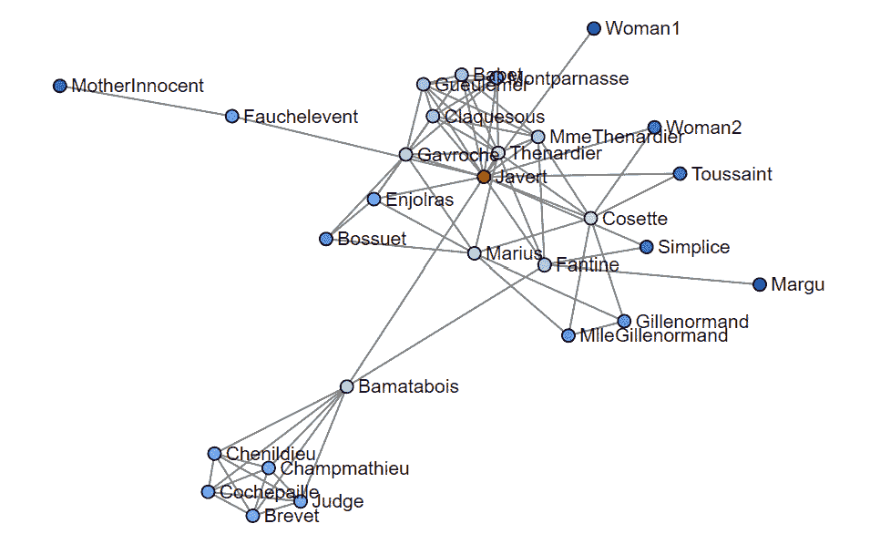
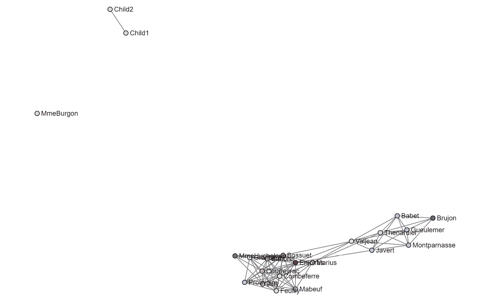

# 第八章：自我中心网络分析

前一章内容非常丰富，我们学习了如何可视化和分析整个网络。相比之下，本章应该会感觉更简单，内容也会少得多。在之前的章节中，我们学习了如何获取和创建网络数据，如何从网络数据构建图形，如何清理图形数据，以及如何做一些有趣的事情，比如识别社区。在本章中，我们将进行所谓的 **自我中心** **网络分析**。

好消息是，前一章所学的所有内容都可以应用于自我中心网络。中心性可以帮助我们找出重要的节点。社区算法可以帮助我们识别社区。最棒的消息是，本章其实不需要涉及太多内容。自我中心网络分析在规模和范围上都更简单。最重要的是，我会解释如何开始，展示你可以做什么，并说明你未来可能想采取的进一步分析步骤。就像任何类型的分析一样，总是有更多的事情可以做，但我们将在本章中保持简单。

本章将涉及以下主题：

+   进行自我中心网络分析

+   调查自我节点和连接

+   识别其他研究机会

# 技术要求

在本章中，我们将主要使用 Python 库 NetworkX 和 pandas。这些库应该已经安装好了，所以你可以直接使用它们。如果没有安装，你可以通过以下方式安装 Python 库：

```py
pip install <library name>
```

例如，要安装 NetworkX，你可以按照以下步骤操作：

```py
pip install networkx
```

在*第四章*中，我们也介绍了一个 `draw_graph()` 函数，它使用了 NetworkX 和 `scikit-network`。每当我们进行网络可视化时，你都需要使用这段代码。本章以及本书的大多数章节中，你都需要用到它。

代码可以在 GitHub 上找到：[`github.com/PacktPublishing/Network-Science-with-Python`](https://github.com/PacktPublishing/Network-Science-with-Python)。

# 自我中心网络分析

**自我中心网络分析** 是一种网络分析方法，适用于研究社交网络中围绕特定个人存在的关系。我们不再研究整个社交网络，而是聚焦于某个个体以及该个体与之互动的人。自我中心网络分析使用一种更简单的网络形式，称为 **自我中心网络**（**自我网络**）。从现在起，我将这些网络称为 *自我网络*。

在自我网络中，有两种类型的节点：**自我节点**和**他者节点**。自我节点是你正在研究的个体的节点。另一方面，他者节点是存在于自我网络中的所有其他节点。如果我基于自己的生活创建一个自我网络，我就是自我节点，我认识的人就是他者节点。如果我想调查在前一章中提到的 K-pop 社交网络中，**@spotifykr** Twitter 账号提到或被提到的人，我会为 spotifykr 创建一个自我网络。spotifykr 是自我节点，所有其他节点都是他者节点。

这有什么意义呢？你可以通过与某个个体互动的人了解很多关于这个人或组织的情况。许多情况下，相似的人会相互吸引。在我的生活中，我的大多数朋友都是工程师或数据科学家，但我另外的一些朋友是艺术家。我喜欢认识既具创造力又具分析力的人。其他人可能有完全不同类型的朋友。分析和可视化自我网络可以帮助我们洞察那些我们可能无法在当下察觉或看到的关系。我们可能会有某种直觉，觉得某些类型的关系存在，或者某个人是如何受到影响的，但能够分析和可视化自我网络本身是非常有启发性的。

与整个网络相比，使用自我网络的一个好处是自我网络通常比整个网络小且不太复杂。这很有道理，因为自我网络是更大生态系统的子集。例如，在一个由数百万人的社交网络中，一个自我网络将专注于自我节点和围绕它的其他节点。由于这些网络更小且不太复杂，因此可以使用原本计算量大的算法进行轻松处理。处理的数据量较少。然而，显然，自我网络的规模取决于个体的受欢迎程度。一个名人网红的自我网络将比我自己的自我网络复杂得多。我没有数百万粉丝。

## 自我中心网络分析的应用

在社交网络分析中，**自我网络**用于理解一个人周围的关系和社区。然而，这并不是你可以使用自我网络分析的唯一限制。我已经在各种不同的工作中使用自我网络，来理解人们的关系、沟通流和影响力。我还使用网络来绘制数据中心中的生产数据流，并利用自我网络来调查围绕某个软件或数据库表格的数据流和流程。如果你能创建一个网络，你就可以使用自我网络深入挖掘该网络，进行更细致的观察。你不仅限于分析人类，你还可以用它来分析恶意软件家族。例如，你可以用它来理解社交媒体上的放大效应。你也可以用它来检查供应链中的一个组件。你的限制只有你自己的创造力和你能够创建或获取的数据。只要网络存在，自我网络就可以用于分析。

## 解释分析方法论

本章将完全以实践为主，并且是可重复的。我们将使用一个预先构建的 NetworkX 网络，该网络包含了小说《*悲惨世界*》中的人物。我选择使用这个网络是因为它既大且复杂，足够有趣，同时也有清晰的社区，可以在不同的自我网络中看到这些社区。这是一个进行社交网络分析练习的极好网络。

NetworkX 网络自带权重，这使得我们可以在互动较多的节点之间绘制较粗的边，区别于互动较少的节点。然而，在本次分析中，我选择去掉权重，因为我希望你们更多地关注围绕自我节点的其他节点和社区。在这个分析中，我更感兴趣的是自我网络的结构以及自我网络内部存在的社区。我确实建议你挑战自己。在本章的代码中，或许你可以保留权重，而不是去除它们，然后看看这对网络可视化产生了什么影响。

我们将从快速检查整个网络开始，先看看网络的样子，并挑选出一些可能对识别有趣节点、进而进行自我网络分析的中心节点。

之后，我们将查看四个独立的自我网络。我们将从了解小说中自我角色的简短信息开始，但我们不会深入探讨。然后，我们将分别可视化有无中心的自我网络。在自我网络中，如果你去掉自我节点，这就叫做去掉中心。自我节点位于中心。在自我网络中，所有 alters 都与自我节点之间有一条边。如果一个 alter 在自我网络中，那么它与自我节点之间有某种关系。那么，你认为如果去掉自我节点会发生什么？自我网络会变得更简单，甚至可能断裂成多个部分。这种断裂尤其有用，因为它能够帮助我们很容易地识别不同的社区，这些社区表现为节点群集。因此，我们将执行去除中心的自我网络分析。

我们将识别自我网络中的 alters，找出最重要的 alters，并比较四个自我网络的密度。我们还将寻找存在于不同社区之间的桥梁。

开始吧！

### 整个网络抽查

在我们进行自我网络分析之前，首先需要构建我们的图。我们已经做过好几次了，所以这应该是熟悉的内容，但这次我们将使用 NetworkX 提供的预构建图。加载一个预构建图非常简单：

```py
import networkx as nx
G = nx.les_miserables_graph()
```

NetworkX 提供了其他几种图形，因此请务必浏览文档，您可能会找到其他对您工作和学习有帮助的网络。

该图包含边权。虽然这对于理解节点之间的交互数量非常有用，但我决定从我们的图中移除它，以便使线条更加清晰，并且能够专注于自我网络本身。以下命令将把图转化为一个 pandas 边列表 DataFrame —— 只保留源节点和目标节点字段 —— 并使用 DataFrame 创建一个新图：

```py
df = nx.to_pandas_edgelist(G)[['source', 'target']]
G = nx.from_pandas_edgelist(df)
```

现在我们的修改图已经构建完成，我们可以查看节点和边的数量：

```py
nx.info(G)
'Graph with 77 nodes and 254 edges'
```

只有 `77` 个节点和 `254` 条边，这是一个简单的网络，我们可以轻松地在 *图 8.1* 中可视化它：

```py
draw_graph(G, font_size=12, show_names=True, node_size=4, edge_width=1)
```

这将产生如下网络：


图 8.1 – 《悲惨世界》整个网络

现在的结果足够了，但我想提醒你，我们在上一章学到过的内容。我们可以使用 `k_core` 来移除可视化中节点数小于 `k` 的节点。在这个例子中，我选择不显示节点数少于两个的节点：

```py
draw_graph(nx.k_core(G, 2), font_size=12, show_names=True, node_size=4, edge_width=1)
```

这将绘制一个网络可视化，显示具有两个或更多边的节点，有效地移除孤立节点和仅有一条边的节点。这将帮助我们快速了解和预览网络的结构：


图 8.2 – 《悲惨世界》整个网络 (k=2)

在可视化一个网络后，我通常会收集网络中所有节点的 PageRank 分数。PageRank 是一个快速的算法，能够在网络规模不管多大时都表现良好，因此它是一个快速识别节点重要性的好算法，正如上一章所讨论的那样。提醒一下，`pagerank`算法是基于一个节点的进出边数量来计算其重要性分数的。对于这个网络，我们使用的是无向图，因此`pagerank`实际上是基于一个节点所拥有的边的数量来计算分数的，因为在无向网络中并没有`in_degree`或`out_degree`的概念。以下是我们如何计算`pagerank`并将分数放入 pandas DataFrame 中进行快速分析和可视化：

```py
import pandas as pd
pagerank = nx.pagerank(G)
pagerank_df = pd.DataFrame(pagerank, index=[0]).T
pagerank_df.columns = ['pagerank']
pagerank_df.sort_values('pagerank', inplace=True, ascending=False)
pagerank_df.head(20)
```

让我们可视化`pagerank`算法的计算过程：


图 8.3 – 《悲惨世界》网络中的前 20 个 PageRank 节点

一张图片可以帮助我们更容易地看到每个节点之间 PageRank 的差异：

```py
pagerank_df.head(20).plot.barh(figsize=(12,8)).invert_yaxis()
```

可视化结果如下：


图 8.4 – 《悲惨世界》网络中前 20 个 PageRank 节点的可视化

很好。我们可以清楚地看到**瓦尔让**在这个故事中是一个非常重要的角色。我们肯定需要检查瓦尔让的自我网络，以及**米里埃尔**和**加夫罗什**的自我网络。为了确保我们不会得到太相似的自我网络，我选择了**乔利**作为第四个要检查的角色。乔利在 PageRank 榜单上排得较低。

这就是我们在本章中进行的全部网络分析。从此时起，我们将开始学习自我网络。让我们开始吧！

# 调查自我节点和连接

在自我中心网络分析中，我们感兴趣的是了解围绕一个单一节点存在的社区。我们对整个网络的结构和组成不太感兴趣。可以说，我们是“放大”来看。我们将使用自我中心网络分析来检查《悲惨世界》中核心角色周围存在的社区。

## 自我 1 – 瓦尔让

根据维基百科，尚·瓦尔让是《悲惨世界》的主角。了解这一点后，我们就能明白瓦尔让在网络中拥有最高的 PageRank 分数。任何故事的主角通常都会与比其他人更多的角色互动，PageRank 也会反映这一点。为了本章的目的，这就是我们对每个角色所做的背景分析。如果你想对一部文学作品中的网络进行深入分析，你需要做得更深。在本章中，我最感兴趣的是展示如何处理自我网络。

### 完整的自我网络

在我们能够分析自我网络之前，我们必须先创建一个。在 NetworkX 中，这叫做 `ego_graph`，可以通过简单地传入完整的图以及你想要分析的节点名称来创建：

```py
ego_1 = nx.ego_graph(G, 'Valjean')
```

就这样。这就是如何创建自我网络。你还可以传入其他参数，但实际上，这已经是最复杂的部分了：

```py
draw_graph(ego_1, font_size=12, show_names=True, node_size=4, edge_width=1)
```

我们现在可以可视化自我网络：


图 8.5 – Valjean 自我网络

如果你仔细看，你应该能看到 Valjean 位于他自己自我网络的中心。这是有道理的。自我节点（Valjean）与存在于自我网络中的所有他人节点（其他节点）都有某种关系。

在继续之前，有一件重要的事情我想指出。自我网络只是另一种网络。我们在上一章中学习的所有内容——*中心性*、*社区*、*度数*、`k_core`和`k_corona`——同样适用于自我网络。考虑到上一章提到过，某些中心性计算开销大且耗时，特别是在整个网络上运行时。但根据我的经验，这种情况并不总是发生，甚至通常不会发生。对于自我网络，原本对整个网络来说不切实际的算法反而可以派上用场，而且应用起来非常简单。整个网络分析和自我中心网络分析之间是有重叠的。我们在上一章中学到的所有内容都可以应用于自我网络。

### 从自我网络中移除中心节点

一个常被忽视的重要选项是能够去除自我网络的中心。简单来说，这意味着将 Valjean 从他的自我网络中去除。我发现这样做非常有用，因为当你去除一个中心节点时，网络通常会被拆分成几个部分，这使得识别网络中的社区变得更加容易。我们可以像这样从自我网络中去除中心节点：

```py
ego_1 = nx.ego_graph(G, 'Valjean', center=False)
```

现在，我们已经移除了中心节点——自我节点——让我们再一次可视化网络：

```py
draw_graph(ego_1, font_size=12, show_names=True, node_size=4, edge_width=1)
```


图 8.6 – 删除中心后的 Valjean 自我网络

将这个可视化与之前的进行对比。你看到了什么？我看到有一个较大的节点簇，它的顶部和左侧似乎至少有两个社区。右侧我还看到一个由三个节点组成的社区，它已经独立成岛。我还看到四个孤立节点。我希望你能明白，去掉中心节点可以使这些事情变得更加容易看出。

### 自我网络（去除中心，去噪）

我常常使用 `k_core` 来去噪一个网络，同样的操作也可以用于自我网络。让我们去掉所有度数小于一个的节点，实际上就是去掉这四个孤立节点：

```py
draw_graph(nx.k_core(ego_1, 1), font_size=12, show_names=True, node_size=4, edge_width=1)
```

现在，让我们使用前面的代码来可视化它：


图 8.7 – Valjean 自我网络，去掉中心节点和孤立节点

现在我们有了一个更干净的网络，很明显，网络中有两个节点集群。在维基百科上快速搜索发现 **Myriel** 是一位主教，**Magloire** 是他的仆人和妹妹，**Baptistine** 也是他的妹妹。他们属于自己的社区是有道理的。

### 交互者列表和数量

我们查找整个网络中存在的节点的方式，也可以应用于自我网络。我们将使用 `ego_1.nodes`，而不是 `G.nodes`，因为 `ego_1` 是我们的自我网络：

```py
sorted(ego_1.nodes)
['Babet', 'Bamatabois', 'Bossuet', 'Brevet', 'Champmathieu', 'Chenildieu', 'Claquesous', 'Cochepaille', 'Cosette', 'Enjolras', 'Fantine', 'Fauchelevent', 'Gavroche', 'Gervais', 'Gillenormand', 'Gueulemer', 'Isabeau', 'Javert', 'Judge', 'Labarre', 'Marguerite', 'Marius', 'MlleBaptistine', 'MlleGillenormand', 'MmeDeR', 'MmeMagloire', 'MmeThenardier', 'Montparnasse', 'MotherInnocent', 'Myriel', 'Scaufflaire', 'Simplice', 'Thenardier', 'Toussaint', 'Woman1', 'Woman2']
```

有两种不同的方式可以获取自我网络中存在的交互者数量。记住，我们已经去掉了中心节点（自我节点），因此所有剩余的节点都是交互者：

1.  第一个方法是简单地计算网络中节点的数量：

    ```py
    len(ego_1.nodes)
    ```

    ```py
    36
    ```

没问题，但如果我们还想看到边的数量呢？

1.  让我们直接使用 `nx.info()` 函数，而不是查找如何获取网络中所有边的列表，因为这样更简单：

    ```py
    nx.info(ego_1)
    ```

    ```py
    Graph with 36 nodes and 76 edges'
    ```

整个网络有 `77` 个节点，因此显然，自我网络更简单。

### 重要的交互者

获取交互者列表是一回事，但如果我们能得到一个带有相关中心性分数的交互者列表，那就更有用，这样我们就可以评估网络中单个节点的重要性。记住，没有单一的中心性分数能够代表所有的中心性。我们可以使用 PageRank、接近中心性、中介中心性或其他任何度量方法。这些是与自我网络中最多其他节点相连的节点：

```py
degcent = nx.degree_centrality(ego_1)
degcent_df = pd.DataFrame(degcent, index=[0]).T
degcent_df.columns = ['degree_centrality']
degcent_df.sort_values('degree_centrality', inplace=True, ascending=False)
degcent_df.head(10)
```

让我们可视化这一点，看看我们的中心性：


图 8.8 – Valjean 自我网络中交互者的度中心性

`degree_centrality` 大约为 `0.457`。考虑到 Javert 在自我网络中的中心地位，这很有道理。



图 8.9 – Javert 在 Valjean 自我网络中的网络位置

其他具有最高中心性的交互者则更难以察觉。**MmeThenardier** 位于中心，右侧突出了。

### 自我网络密度

让我们通过计算网络密度来总结这个自我网络。密度与网络中所有节点之间的连接程度有关。为了达到 `1.0` 的密度，每个节点都会与网络中的每个其他节点相连。要有 `0.0` 的密度，网络将完全由孤立节点组成，节点之间没有任何连接。你能大致猜测这个网络的密度是多少吗？它看起来连接松散，且有几个密集连接的社区。因此，我的猜测是一个相当低的分数。让我们使用 NetworkX 来计算密度：

```py
nx.density(ego_1)
0.12063492063492064
```

密度大约为`0.12`的网络是一个连接松散的网络。我计算了密度，因为我希望用它来比较每个自我网络的密度。

注

你可能在想，为什么我们在看介数中心性（betweenness centrality）和密度，或者想知道中心性和密度之间的关系。中心性得分有助于了解网络中一个节点的重要性。密度则告诉我们网络的整体构成。如果一个网络是密集的，那么节点之间的连接比稀疏网络要多。中心性和密度得分是快速了解网络的一种方式。

## 自我节点 2 – 马吕斯

维基百科将马吕斯·庞特马西（Marius Pontmercy）列为小说中的另一个主角。接下来，让我们看看他的自我网络。

### 完整的自我网络

首先，我们将构建完整的自我网络，而不去除中心节点：

```py
ego_2 = nx.ego_graph(G, 'Marius')
draw_graph(ego_2, font_size=12, show_names=True, node_size=4, edge_width=1)
```

接下来，我们将可视化整个自我网络：


图 8.10 – 马吕斯的自我网络

完美。有一点很明确：这个自我网络看起来与瓦尔让的完全不同。看向左下角，我能看到一个密集连接的个体社区。看向右边，我能看到一个**马吕斯**（Marius）对其有深厚感情的角色，但不剧透。

### 自我网络（去除中心）

让我们从这个网络中去除中心节点（自我节点），看看它是什么样子：

```py
ego_2 = nx.ego_graph(G, 'Marius', center=False)
draw_graph(ego_2, font_size=12, show_names=True, node_size=4, edge_width=1)
```

这将绘制出我们的自我网络：


图 8.11 – 去除中心节点后的马吕斯自我网络

去除中心节点的结果与我们为瓦尔让的自我网络所做的完全不同。在瓦尔让的情况下，四个孤立节点从网络中断开。而在马吕斯的自我网络中，即使去除了中心节点，也没有孤立节点。他的自我网络中的成员连接得足够紧密，以至于去掉马吕斯的节点也没有破坏网络结构。这个网络具有很强的韧性。

在这个自我网络中，密集连接的社区在右侧也很容易看见。我还可以看到接近网络中心的瓦尔让（Valjean）。

之前，我们使用了`k_core`方法来去除孤立节点，以便在去除中心节点后能更容易查看剩余节点。在马吕斯的自我网络中，我们将跳过这一步骤。因为没有孤立节点需要去除。

### 更改列表和数量

让我们来看看马吕斯自我网络中的外部节点：

```py
sorted(ego_2.nodes)
['Bahorel', 'BaronessT', 'Bossuet', 'Combeferre', 'Cosette', 'Courfeyrac', 'Enjolras', 'Eponine', 'Feuilly', 'Gavroche', 'Gillenormand', 'Joly', 'LtGillenormand', 'Mabeuf', 'MlleGillenormand', 'Pontmercy', 'Thenardier', 'Tholomyes', 'Valjean']
```

接下来，让我们轻松地获取节点和边的数量：

```py
nx.info(ego_2)
'Graph with 19 nodes and 57 edges'
```

完美。这是一个非常简单的网络。

### 重要的外部连接

现在，让我们看看哪些外部节点处于中心位置。它们在网络中占据着强势地位：

```py
degcent = nx.degree_centrality(ego_2)
degcent_df = pd.DataFrame(degcent, index=[0]).T
degcent_df.columns = ['degree_centrality']
degcent_df.sort_values('degree_centrality', inplace=True, ascending=False)
degcent_df.head(10)
```

这将给我们提供度中心性。让我们仔细看看！


图 8.12 – 马吕斯的自我网络外部节点的度中心性

哇，有意思。我本以为让·瓦尔让会是最中心的节点之一，但有几个人排在他前面。你能猜到为什么吗？他们是紧密连接社区的一部分，每个人与自我网络中的成员连接的数量都超过了**瓦尔让**。这个社区应该有很多信息共享。现在看看瓦尔让的位置，我可以看到他是一个核心人物，但他连接的节点比紧密连接社区的成员要少。

请注意，有几个节点的中心性得分相同。是的，这种情况会发生。中心性得分只是数学的结果，而不是魔法。

### 自我网络密度

最后，为了比较自我网络，让我们计算密度得分：

```py
nx.density(ego_2)
0.3333333333333333
```

记住，瓦尔让的自我网络密度大约是`0.12`。马吕斯的自我网络密度几乎是瓦尔让的三倍。这可以解释为什么在去掉马吕斯的中心节点时，网络并没有破裂。紧密连接的网络在去除中心节点时更加具有韧性。这一点在考虑如何增强现实世界网络的可用性时非常重要。从人的角度来看，即使关键节点被去除，这个社区仍然会继续存在。

## 自我 3 – 加夫罗什

在《悲惨世界》中，加夫罗什是一个生活在巴黎街头的小男孩。考虑到这一点，我想他的自我网络会与成年人或社会中更为联系紧密的人截然不同。让我们来看看。

### 完整的自我网络

首先，让我们可视化网络，保留中心节点：

```py
ego_3 = nx.ego_graph(G, 'Gavroche')
draw_graph(ego_3, font_size=12, show_names=True, node_size=4, edge_width=1)
```

这将呈现加夫罗什的完整自我网络：


图 8.13 – 加夫罗什的自我网络

有趣。加夫罗什的连接广泛。考虑到他是一个生活在街头的孩子，看到**Child1**和**Child2**位于顶部很有意思。这三个人物之间的关系看起来可能非常有趣。我还看到一个人（**MmeBurgon**），当去除加夫罗什的中心节点时，她的节点将变成孤立节点。最后，我看到在自我网络的左下角和右下角似乎有两个社区。这些社区在去除中心节点后应该会更加清晰。

### 自我网络（去除中心节点）

让我们去掉中心节点，再次可视化网络：

```py
ego_3 = nx.ego_graph(G, 'Gavroche', center=False)
draw_graph(ego_3, font_size=12, show_names=True, node_size=4, edge_width=1)
```

这将呈现加夫罗什的自我网络，去除中心节点后。这应该能让不同的社区更容易识别：



图 8.14 – 加夫罗什的自我网络，去除中心节点

完美。如预期，一些节点变成了孤立点，两个孩子形成了他们自己的小群体，剩余的连接组件包含两个独立的社区。使用社区检测算法分析最大群体可能会很有趣，但让我们继续。很明显，瓦尔让位于这两个社区之间。

从这个网络中移除孤立点没有多大意义，因为只有一个孤立点，所以让我们继续前进。

### 修改列表和数量

让我们看看还有哪些其他角色是加夫罗什自我网络的一部分。换句话说，我想知道加夫罗什认识谁。这将告诉我们哪些角色在他的生活中扮演了重要角色：

1.  输入以下代码：

    ```py
    sorted(ego_3.nodes)
    ```

这一简单的代码将为我们提供加夫罗什自我网络中的所有节点，按字母顺序排序：

```py
['Babet', 'Bahorel', 'Bossuet', 'Brujon', 'Child1', 'Child2', 'Combeferre', 'Courfeyrac', 'Enjolras', 'Feuilly', 'Grantaire', 'Gueulemer', 'Javert', 'Joly', 'Mabeuf', 'Marius', 'MmeBurgon', 'MmeHucheloup', 'Montparnasse', 'Prouvaire', 'Thenardier', 'Valjean']
```

很好。我能看到一些熟悉的名字，而且我也清楚地看到了`Child1`和`Child2`。

1.  接下来，我们来看看这个网络中有多少个节点和边，采用简单的方法：

    ```py
    nx.info(ego_3)
    ```

这将给我们以下输出：

```py
'Graph with 22 nodes and 82 edges'
```

哇。这比主角自己的自我网络要紧密得多。瓦尔让的自我网络有`36`个节点和`76`条边。你认为节点较少而边较多会如何影响这个网络的密度分数？

在我们进入这个话题之前，我们先看看中心性。

### 重要的变动者

再次，我们使用度中心性来看谁是这个自我网络中最有连接的人。到现在为止，这些步骤应该已经开始变得相似了。我们使用不同的中心性来理解哪些节点在我们的网络中是重要的：

```py
degcent = nx.degree_centrality(ego_3)
degcent_df = pd.DataFrame(degcent, index=[0]).T
degcent_df.columns = ['degree_centrality']
degcent_df.sort_values('degree_centrality', inplace=True, ascending=False)
degcent_df.head(10)
```

这将给我们一个按度中心性排序的角色数据框。我们仔细看看：


图 8.15 – 加夫罗什的自我网络变更后的度中心性

哇，**恩乔伊拉斯**是一个高度连接的人，还有其他几个高度连接的人。我们可以看到他们在特别紧密的社区中。

### 自我网络密度

最后，让我们计算密度，以便比较自我网络：

```py
nx.density(ego_3)
0.354978354978355
```

这真有趣。加夫罗什是一个生活在巴黎街头的孩子，但他的社交网络比我们之前看到的任何一个都要密集。瓦尔让的自我网络密度大约是`0.12`，马吕斯的是`0.33`，而加夫罗什的更高。我从没想到过这一点。如果我读这本书，我会特别关注这个角色。他看起来非常有联系，我很好奇这在故事中的表现如何。

## 自我 4 – 乔利

在本章的开头，我选择了四个人来创建自我网络。前三个有较高的 PageRank 分数，而我特意选择了一个 PageRank 分数较低的人作为第四个，因为我希望能得到一个与其他三个截然不同的自我网络。

乔利是一个医学学生，我想知道这是否会影响他的自我网络。学生通常会与其他学生社交，所以我会调查一下他的一些直接连接。

### 完整的自我网络

首先，让我们创建并可视化一个保持中心不变的自我网络：

```py
ego_4 = nx.ego_graph(G, 'Joly')
draw_graph(ego_4, font_size=12, show_names=True, node_size=4, edge_width=1)
```

这将展示乔利的自我网络。


图 8.16 – 乔利的自我网络

哇，通常在可视化网络时，总会有一个网络给我留下特别深刻的印象，觉得它特别独特。在这一章我们做过的四个网络中，这个网络最为突出。它看起来不像典型的自我网络，而是一个密集连接的网络。乔利的自我网络中的每个人都与其他人紧密相连。如果我们移除乔利的节点，这个自我网络可能几乎不会发生变化。在此之前，我们先看看这些人物中的一些，看看是否有其他人是医学学生或“革命学生友会”的成员，乔利正是这个组织的一员。

#### 博苏埃

博苏埃·莱斯格尔被称为最不幸的学生，也是“革命学生友会”（Les Amis de l’ABC）的成员。作为一名学生和革命学生的成员，乔利与他有联系是合乎逻辑的。

#### 恩乔拉斯

恩乔拉斯是“革命学生友会”（Les Amis de l’ABC）的领导人。这一联系也是合情合理的。

#### 巴霍雷特

巴霍雷特是“革命学生友会”（Les Amis de l’ABC）的另一名成员。

#### 加夫罗什

加夫罗什似乎不是“革命学生友会”（Les Amis de l’ABC）的成员，但他协助与他们并肩作战。

即使我们对故事或人物了解不多，我们也能通过检查整体网络、自我网络以及社区，轻松识别同一社区的成员。

### 自我网络（去除中心）

现在，让我们将中心从自我网络中去除，看看我的假设是否正确，即这个自我网络不会发生太大变化，因为它是密集连接的：

```py
ego_4 = nx.ego_graph(G, 'Joly', center=False)
draw_graph(ego_4, font_size=12, show_names=True, node_size=4, edge_width=1)
```

这将绘制出去除中心的乔利自我网络。如果该网络中存在独立的社区，它们将作为群集单独展示。如果只有一个社区，那么该社区将作为一个单一的群集展示：


图 8.17 – 去除中心的乔利自我网络

这很有趣。去除乔利后，自我网络仍然完整，核心人物依旧是核心。这个网络具有很强的韧性，作为革命者，他们的网络具有韧性是有意义的，因为这样他们的革命才有机会取得成功。

这个网络没有孤立点，因此没有必要对其进行去噪处理。

### 参与者列表和数量

让我们列出所有参与此自我网络的个体：

```py
sorted(ego_4.nodes)
```

这将给我们提供一个排序后的参与者列表，这些人物是该自我网络的一部分：

```py
['Bahorel', 'Bossuet', 'Combeferre', 'Courfeyrac', 'Enjolras', 'Feuilly', 'Gavroche', 'Grantaire', 'Mabeuf', 'Marius', 'MmeHucheloup', 'Prouvaire']
```

与其他自我网络相比，参与者非常少。

让我们来统计节点和边的数量：

```py
nx.info(ego_4)
```

这应该能让我们了解这个自我网络的规模和复杂性：

```py
'Graph with 12 nodes and 57 edges'
```

这个网络的节点数和边数比我们之前分析的其他网络少，但它的密度明显大于其他网络。

### 重要的参与者

让我们来看一下自我中心网络中最重要的“改变者”：

```py
degcent = nx.degree_centrality(ego_4)
degcent_df = pd.DataFrame(degcent, index=[0]).T
degcent_df.columns = ['degree_centrality']
degcent_df.sort_values( 'degree_centrality', inplace=True, ascending=False)
degcent_df.head(10)
```


图 8.18 – Joly 的自我中心网络的“改变者”的度中心性

与我们看到的其他网络相比，这些中心性得分令人难以置信。`1.0`的中心性得分表明这是一个高中心性的网络，意味着网络连接性非常好。你认为这将如何影响密度得分？

### 自我中心网络的密度

让我们计算一下这个自我中心网络的密度。我怀疑这个网络的密度会非常高：

```py
nx.density(ego_4)
0.8636363636363636
```

这与其他密度得分相比，确实非常高：

+   Valjean 的自我中心网络的密度约为`0.12`

+   Marius 的自我中心网络的密度约为`0.33`

+   Gavroche 的自我中心网络的密度约为`0.35`

+   Joly 的自我中心网络的密度约为`0.86`

这个密度比其他任何密度得分都要高得多。

但这也是有道理的。Joly 既是学生又是一个革命团体的成员。我预期这两个群体都会与其他学生和革命者保持良好的联系。

## 自我中心网络之间的洞察

我们查看了四个不同的自我中心网络。我们本可以为网络中的每个节点创建一个自我中心网络，但那样会非常耗时。在进行自我中心网络分析时，我通常从筛选几个我感兴趣的节点开始，然后再进一步调查。我通常是在寻找一些东西，比如以下内容：

+   谁的连接性最强

+   谁拥有最多的`out_degrees`

+   谁的`pagerank`最高

+   谁与已知的对立面有联系

在本章中，我们研究了小说《悲惨世界》中的人物，因此我故意选择了那些具有最高 PageRank 得分的人物，因为我预期他们的自我中心网络会很有趣。这一策略非常有效。

在总结本章之前，我希望为你留下以下几点启示：

+   首先，通过增加连接来增强网络是可行的，这会使网络具有抗失败能力。如果删除一个节点，网络仍然可以保持完整，而不会破裂成碎片。这对于许多事物有深远的影响。例如，为了保持信息流动的稳定，一个信息共享网络希望能抵抗攻击。除此之外，在哪些情况下拥有一个抗失败的网络会是有价值的呢？

+   其次，删除自我中心网络的中心节点可以告诉你很多关于网络中存在的社区的信息，以及该网络的韧性。当我们移除中心节点时，哪些网络出现了孤立节点或孤岛？哪些网络保持了完全的完整性？我们能看到哪些社区？

让我们看看接下来会发生什么。

# 识别其他研究机会

在进行任何类型的网络分析时，了解总是有更多的操作空间是很重要的；例如，我们可以做以下几项：

+   我们还可以在图中嵌入更多信息，比如权重或节点类型（教师、学生、革命者等）

+   我们可以根据节点类型为节点上色，便于识别社区。

+   我们可以根据节点的度数或中心性得分来调整节点大小，便于识别重要节点。

+   我们可以使用有向网络来理解信息共享的方向性。

你可以做的事情永远不止这些，但重要的是知道“足够”就好。你应该只使用你需要的内容。在这一章，我一开始在做太多事情时遇到困难，浪费了时间去思考一些实际上对教学这个主题并不重要的内容。保持简单，只添加必要和有用的内容。如果有时间，添加更多有价值的内容。

# 总结

在这一章中，你学到了一种新的网络分析方法，叫做自我中心网络分析。我习惯将自我中心网络简称为*自我网络*，以便简洁。我们学到的是，我们不必将网络作为整体进行分析。我们可以将其拆分成部分，这样可以研究某个节点在与另一个节点关系中的位置。

就个人而言，自我中心网络分析是我最喜欢的网络分析方法，因为我喜欢研究网络中个体层面的事物。整体网络分析作为一个广阔的地图很有用，但通过自我中心网络分析，你可以对网络中存在的各种关系有更深入的了解。希望你和我一样享受这一章的阅读和学习。我也希望这能激发你更深入的学习。

在下一章，我们将深入探讨社区检测算法！
