# 第九章：社区检测

在过去的两章中，我们介绍了整体网络分析和自我中心网络分析。前者有助于理解复杂网络的完整结构。后者则有助于研究存在于“自我”节点周围的人和关系。然而，在整个网络和自我之间，还存在一个我们尚未讨论的缺失层次。社区存在于其中。我们是人类，我们是地球上全球人口的一部分，但我们每个人也是个体社区的一部分。例如，我们在公司工作，作为个人团队的一部分。我们中的许多人有社交兴趣，我们通过参与活动认识人。生活有层次，我们可以使用算法自动识别网络中存在的各种社区。

本章包含以下几个部分：

+   介绍社区检测

+   入门社区检测

+   探索连接组件

+   使用 Louvain 方法

+   使用标签传播

+   使用 Girvan-Newman 算法

+   社区检测的其他方法

# 技术要求

在本章中，我们将主要使用 NetworkX 和 pandas Python 库。这些库应该已经安装好，可以供您使用。如果尚未安装，您可以使用以下命令安装 Python 库：

```py
pip install <library name>
```

例如，要安装 NetworkX，您可以使用以下命令：

```py
pip install networkx
```

在*第四章*中，我们还介绍了一个`draw_graph()`函数，该函数同时使用了 NetworkX 和 Scikit-Network。您将在进行网络可视化时需要这段代码。这不仅限于本章，几乎适用于本书的大部分章节。

对于社区检测，我们还将使用`python-louvain`。您可以使用以下命令进行安装：

```py
pip install python-louvain
```

您可以像这样导入它，稍后您将在本章看到：

```py
from community import community_louvain
```

如果您对`python-louvain`的安装和导入命令感到困惑，这是可以理解的。该库的名称与导入库名称不匹配。这是一个用于社区检测的有用库，因此让我们接受这种奇怪现象并继续前进。

# 介绍社区检测

社区检测涉及识别网络中存在的各种社区或群组。这在社交网络分析中非常有用，因为人类作为我们各种社区的一部分与他人互动，但这些方法不仅限于研究人类。

我们还可以使用这些方法来研究与其他节点紧密交互的任何类型的节点，无论这些节点是动物、标签、网站还是网络中的任何节点。稍作思考，我们正在做什么。社区检测是对我们正在做的事情的一个明确、简洁且恰当的名称。我们正在聚焦于网络中存在的社区。您对探索和理解哪些社区感兴趣，以及为什么？

这种方法有很多很好的使用场景。你可以用它来了解社区对你产品的情感反应。你可以用它来了解威胁格局。你可以用它来了解不同群体之间思想是如何传播和转变的。这里可以发挥创意。它可能有比你想象的更多的用途。

在本章中，我们将从人类生活的角度来探讨这一点，但你不应只限于将其应用于社交网络分析。它在社交网络分析中非常有用，但它在分析大多数网络数据时也很有用，不仅仅是社交网络数据。例如，这在网络安全（恶意软件分析）和计算人文学科中非常有用，或者在理解思想如何在群体之间传播并演变时也很有用。

至少有三种不同的方法进行社区检测，其中最常被研究的包括以下几种：

+   节点连通性

+   节点接近度

+   网络拆分

我所说的*节点连通性*与节点是否属于同一个连通组件有关。如果两个节点不属于同一个连通组件，那么它们属于完全不同的社交群体，而不是同一个社区。

节点接近度与两个节点之间的距离有关，即使它们是同一个连通组件的一部分。例如，两个可能在同一个大型组织中一起工作的人，但如果他们之间有超过两个握手的距离，他们可能不属于同一个社区。要让他们相遇，需要经过几轮介绍。想一想，要认识你最喜欢的名人，你需要通过多少人介绍。你需要经过多少人？

网络拆分实际上是通过移除节点或边来将一个网络切割成多个部分。我将解释的首选方法是对边进行切割，但我也做过类似的操作，移除节点，我在本书中做过几次，通过去除中心节点将网络打碎成碎片。

我不认为我们已经在社区检测的发现上走到了尽头。我希望通过阅读本章内容，你能够获得一些新的思路来识别网络中存在的各种社区。

# 开始进行社区检测

在开始之前，我们需要一个网络来使用。让我们继续使用上章中提到的 NetworkX 的*悲惨世界*图，因为它包含了几个独立的社区：

1.  加载网络是简单的：

    ```py
    import networkx as nx
    ```

    ```py
    import pandas as pd
    ```

    ```py
    G = nx.les_miserables_graph()
    ```

这就是加载图形所需要的全部操作。

1.  有一个`weight`属性，我不打算在网络中包含它，因为在这个简单的演示中我们不需要边权重。因此，我将删除它并重新构建图形：

    ```py
    df = nx.to_pandas_edgelist(G)[['source', 'target']]
    ```

    ```py
    # dropping 'weight'
    ```

    ```py
    G = nx.from_pandas_edgelist(df)
    ```

在这两个步骤中，我们将*悲惨世界*图转换为`pandas`的边列表，并且仅保留`source`和`target`字段，有效地去除了`weight`字段。让我们看看网络中有多少节点和边：

```py
nx.info(G)
'Graph with 77 nodes and 254 edges'
```

这是一个小网络。这个网络包含孤立点和孤岛吗，还是只有一个大的连通分量？让我们来检查一下。

1.  首先，让我们添加`draw_graph`函数：

    ```py
    def draw_graph(G, show_names=False, node_size=1, font_size=10, edge_width=0.5):
    ```

    ```py
        import numpy as np
    ```

    ```py
        from IPython.display import SVG
    ```

    ```py
        from sknetwork.visualization import svg_graph
    ```

    ```py
        from sknetwork.data import Bunch
    ```

    ```py
        from sknetwork.ranking import PageRank
    ```

    ```py
        adjacency = nx.to_scipy_sparse_matrix(G, nodelist= None, dtype=None, weight='weight', format='csr')
    ```

    ```py
        names = np.array(list(G.nodes()))
    ```

    ```py
        graph = Bunch()
    ```

    ```py
        graph.adjacency = adjacency
    ```

    ```py
        graph.names = np.array(names)
    ```

    ```py
        pagerank = PageRank()
    ```

    ```py
        scores = pagerank.fit_transform(adjacency)
    ```

    ```py
        if show_names:
    ```

    ```py
            image = svg_graph(graph.adjacency, font_size = font_size , node_size=node_size, names=graph.names, width=700, height=500, scores=scores, edge_width = edge_width)
    ```

    ```py
        else:
    ```

    ```py
            image = svg_graph(graph.adjacency, node_size = node_size, width=700, height=500, scores = scores, edge_width=edge_width)
    ```

    ```py
        return SVG(image)
    ```

1.  现在，让我们全面展示网络：

    ```py
    draw_graph(G, font_size=12, show_names=True, node_size =4, edge_width=1)
    ```

输出如下：

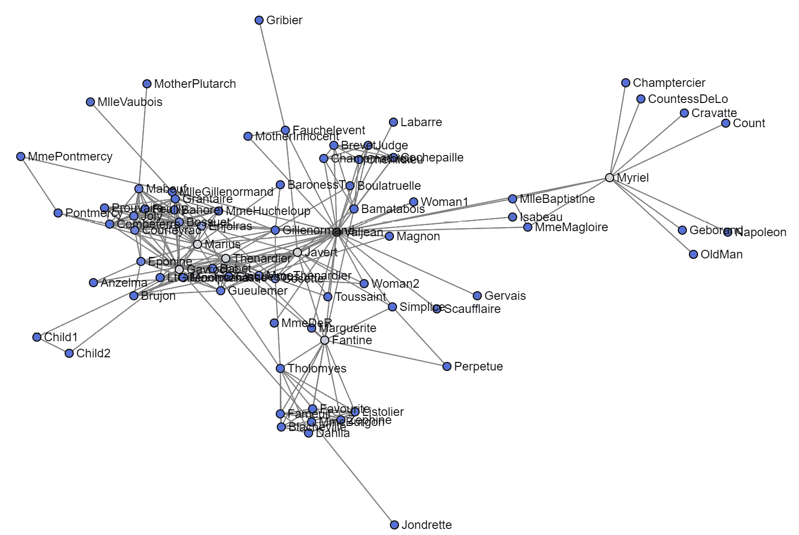

图 9.1 – 悲惨世界图

一眼看去，我们应该能够看到没有孤立点（没有边的节点），有几个只有一条边的节点，有几个节点群体非常接近（社区），还有一些非常关键的节点。如果移除这些关键节点，网络就会支离破碎。

1.  让我们稍微放大一点，使用`k_core`，并且只显示具有两条或更多边的节点。我们也不显示标签，这样可以更好地看到网络的整体形状：

    ```py
    draw_graph(nx.k_core(G, 2), font_size=12, show_names=False, node_size=4, edge_width=0.5)
    ```

我们将得到以下输出：

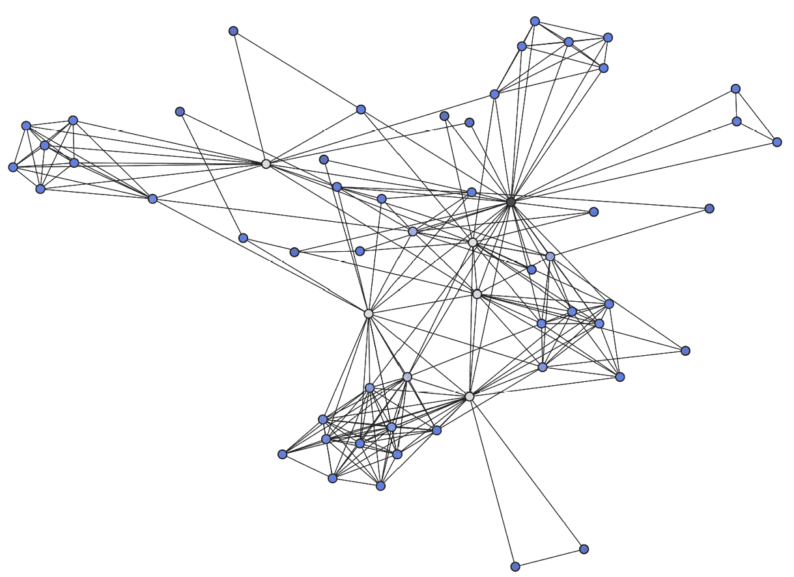

图 9.2 – 悲惨世界图，k_core，K=2，无标签

现在社区应该更清晰了。寻找节点紧密且边/线更多的图部分。你看到了几个社区？我看到有四个社区特别明显，但周围也有一些较小的群体，而且网络中心可能还有一个社区。

现在我们已经准备好尝试社区检测了。

# 探索连通分量

理解网络中存在的各种社区和结构的第一步常常是分析连通分量。正如我们在*w*中讨论的，连通分量是网络中的结构，其中所有节点都与同一组件中的另一个节点连接。

正如我们之前看到的，连通分量对于查找较小的连接部分非常有用。这些可以被视为社区，因为它们与主要组件和整体网络分离，但最大的连通分量通常不是单个社区。它通常由几个社区组成，并且通常可以分割成单独的社区。

在*悲惨世界*网络中，只有一个连通分量。没有孤岛或孤立点。只有一个单一组件。这是有道理的，因为这些都是文学作品中的角色，书中的角色不会整天和自己说话。然而，这也削弱了检查此图的连通分量的一些用处。

有一个解决方法！正如我之前提到的，如果我们从网络中移除几个关键节点，那么网络往往会支离破碎：

1.  让我们从网络中移除五个非常重要的角色：

    ```py
    G_copy = G.copy()
    ```

    ```py
    G_copy.remove_nodes_from(['Valjean', 'Marius', 'Fantine', 'Cosette', 'Bamatabois'])
    ```

1.  在这两行代码中，我们构建了一个名为`G_copy`的第二个图，然后移除了五个关键节点。让我们再次可视化这个网络！

    ```py
    draw_graph(G_copy, font_size=12, show_names=True, node_size=4, edge_width=1)
    ```

这给我们带来了如下输出：

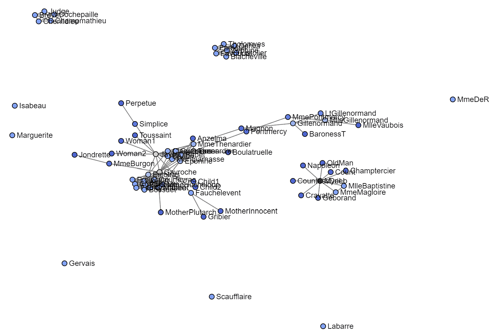

图 9.3 – 破碎后的《悲惨世界》网络

很好。这与许多现实世界网络的样子更为接近。依然有一个主要的连通组件（大陆），有三个较小的连通组件（岛屿），还有六个孤立节点。把这些叫做岛屿和大陆是我个人的命名方式。没有一个明确的标准来决定岛屿是否就是大陆。只是大多数网络都包含一个超大组件（大陆），大量孤立节点，以及若干连通组件（岛屿）。这对我有帮助，但你可以随意处理。

另一个需要记住的事情是，我们刚才所做的可以作为社区检测中的一步。移除一些关键节点可以将网络拆散，揭示出存在的小社区。这些至关重要的节点将一个或多个社区维系在一起，作为更大结构的一部分。移除这些重要节点使得社区之间可以自由漂移。我们通过移除重要节点来完成这一操作，虽然这通常不是最理想的做法。然而，其他实际的社区检测方法工作原理类似，通过移除边而非节点来实现。

1.  在破碎网络后，还剩下多少个连通组件？

    ```py
    components = list(nx.connected_components(G_copy))
    ```

    ```py
    len(components)
    ```

    ```py
    10
    ```

NetworkX 说有 `10` 个连通组件，但孤立节点除了可能与自身连接外，不与任何东西相连。

1.  在查看连通组件之前，让我们先移除它们：

    ```py
    G_copy = nx.k_core(G_copy, 1)
    ```

    ```py
    components = list(nx.connected_components(G_copy))
    ```

    ```py
    len(components)
    ```

    ```py
    4
    ```

看起来有四个连通组件。

1.  由于它们数量很少，我们来检查每一个：

    ```py
    community = components[0]
    ```

    ```py
    G_community = G_copy.subgraph(community)
    ```

    ```py
    draw_graph(G_community, show_names=True, node_size=5)
    ```

让我们来看一下可视化效果：

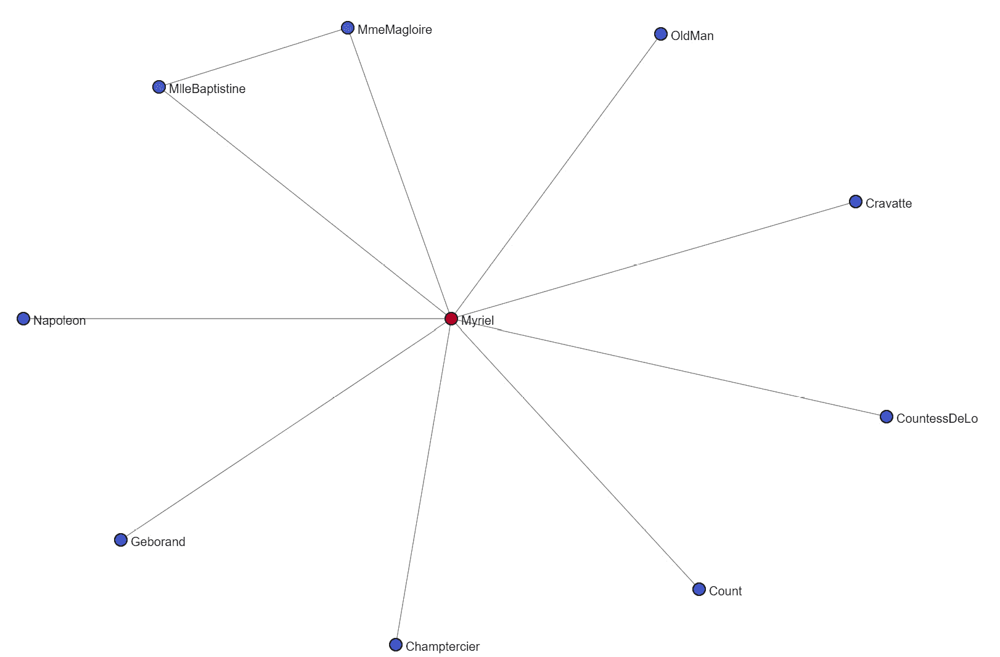

图 9.4 – 破碎后的《悲惨世界》网络中组件 0 的子图

非常有趣！第一个连通组件几乎是一个星型网络，所有节点都连接到一个中心角色——**米里埃尔**。然而，如果你看看左上角，你应该会看到两个角色也共享一个链接。这种关系可能值得进一步研究。

1.  让我们看下下一个组件：

    ```py
    community = components[1]
    ```

    ```py
    G_community = G_copy.subgraph(community)
    ```

    ```py
    draw_graph(G_community, show_names=True, node_size=4)
    ```

这给我们带来了如下输出：

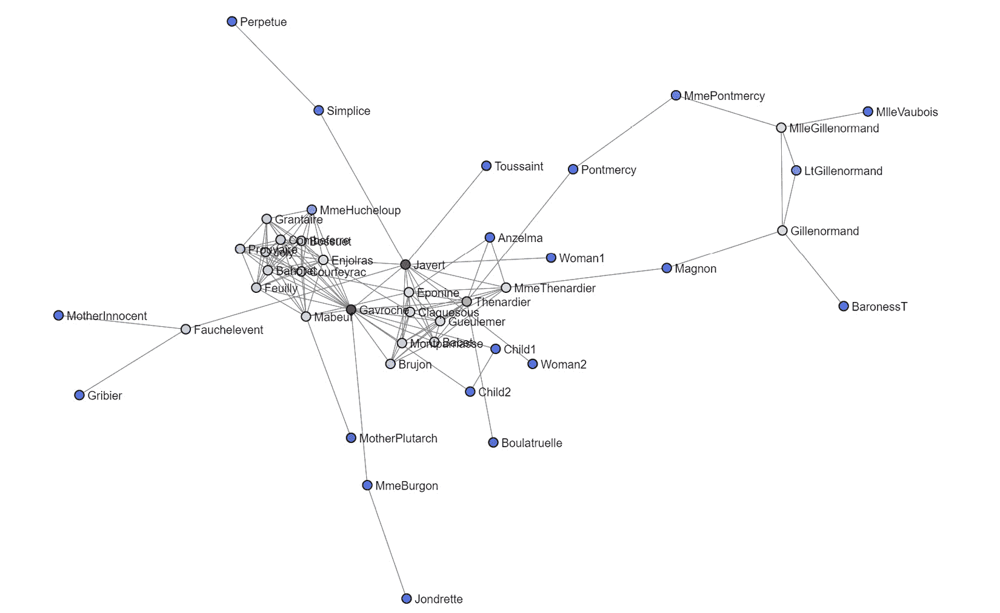

图 9.5 – 破碎后的《悲惨世界》网络中组件 1 的子图

这更加有趣了。我把这个叫做主要组件。它是破碎网络中最大的连通组件。然而，正如我之前说的，连通组件并不适合用来识别社区。稍微左偏一点，你应该能看到网络中心左边有两个节点簇，两个独立的社区。右侧至少还有一个其他社区。如果移除两条边或节点，右侧的社区就会从网络中分离出来。继续前进！

1.  让我们继续打破社区：

    ```py
    community = components[2]
    ```

    ```py
    G_community = G_copy.subgraph(community)
    ```

    ```py
    draw_graph(G_community, show_names=True, node_size=4)
    ```

我们将得到以下输出：

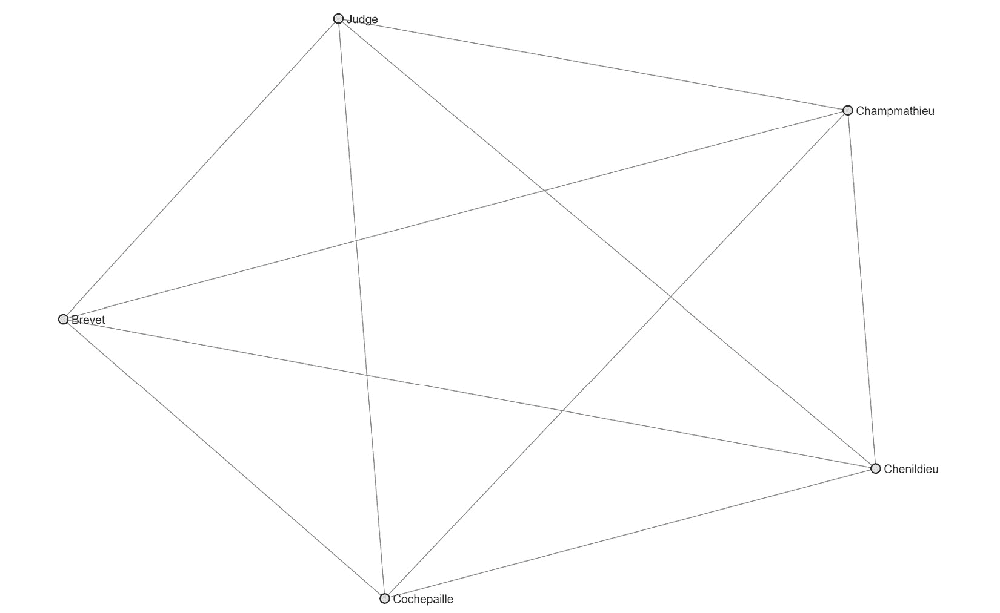

图 9.6 – 破碎的《悲惨世界》网络的组件 2 子图

这是一个强连接组件。每个节点都与这个网络中的其他节点有连接。如果移除一个节点，网络仍然保持完整。从网络的角度来看，每个节点与其他节点同样重要或中心。

1.  让我们检查最后一个组件：

    ```py
    community = components[3]
    ```

    ```py
    G_community = G_copy.subgraph(community)
    ```

    ```py
    draw_graph(G_community, show_names=True, node_size=4)
    ```

这为我们提供了以下的可视化：

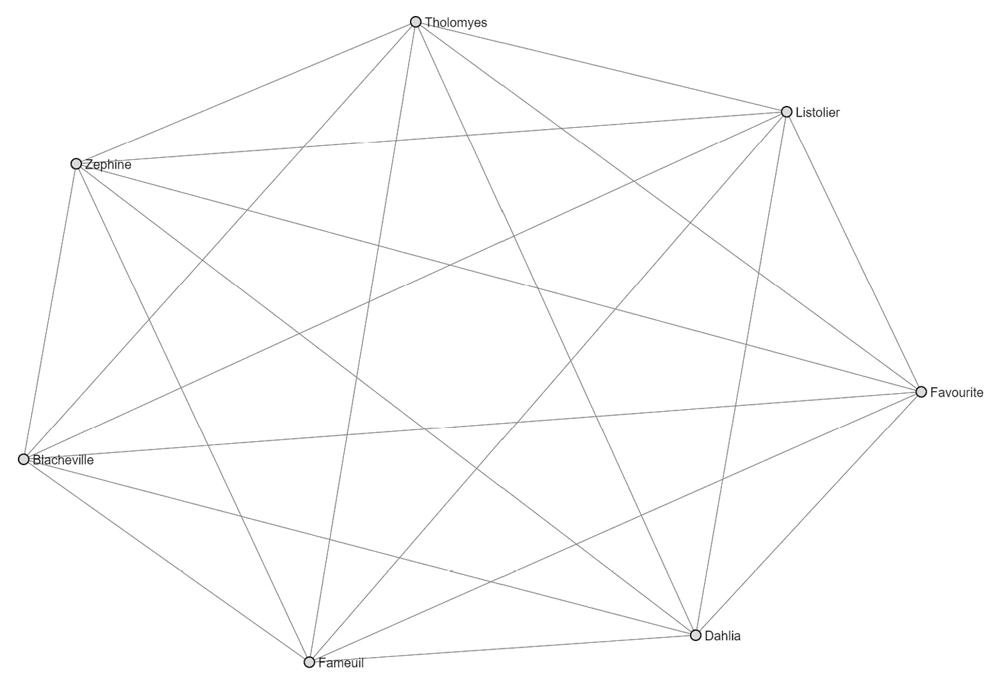

图 9.7 – 破碎的《悲惨世界》网络的组件 3 子图

这是另一个密集连接的网络。每个节点同样重要或中心。如果移除一个节点，网络仍然保持完整。

如你所见，我们通过查看连接组件找到了三个社区，但连接组件没有揭示出在更大主组件中存在的社区。如果我们想要识别这些社区，我们需要移除其他重要节点，然后重复分析。丢弃节点是一种丢失信息的方式，因此我不推荐这种方法，但在快速的临时分析中，它可以是有用的。

我不认为研究连接组件属于社区检测，但在研究连接组件时可以找到社区。我认为这是任何网络分析过程中应该做的第一步，获得的见解非常有价值，但它对于社区检测来说不够敏感。

如果你的网络中没有连接组件的超级集群，那么连接组件对于社区检测来说是相当足够的。然而，你必须将超级集群当作一个社区，实际上，那个集群包含了多个社区。随着网络规模的增大，连接组件方法的效果会变得不那么有效。

让我们继续讨论更合适的方法。

# 使用卢瓦恩方法

**卢瓦恩方法**无疑是我最喜欢的社区检测方法，原因有很多。

首先，这种算法可以应用于非常大的数百万节点的网络，且效果显著且快速。我们将在本章探讨的其他方法在大型网络中无法使用，也没有那么快，因此使用这种算法我们能得到其他地方找不到的效果和速度。因此，这是我首选的社区检测算法，其他的算法我则保留作为备选方案。

其次，可以调节`分辨率`参数来找到最适合的社区检测分割，这在默认结果不理想时提供了灵活性。而其他算法则没有这种灵活性。

总结来说，使用 Louvain 方法，我们有了一个快速的算法，它在大规模网络中的社区检测中非常有效，我们还可以优化该算法以获得更好的结果。我建议从 Louvain 方法入手，尝试社区检测，然后在学习过程中逐步掌握其他方法。了解不同的选择是很有帮助的。

## 它是如何工作的？

Louvain 方法的创始人能够在一个包含数亿个节点和超过十亿条边的网络上使用他们的算法，这使得这种方法非常适用于大型网络。你可以在 [`arxiv.org/pdf/0803.0476.pdf`](https://arxiv.org/pdf/0803.0476.pdf) 阅读更多关于 Louvain 方法的内容。

该算法通过一系列的传递工作，每次传递包含两个阶段。第一阶段将不同的社区分配给网络中的每个节点。最初，每个节点都会分配一个不同的社区。接着，对每个邻居进行评估，并将节点分配到社区。第一步在无法再进行改进时结束。在第二阶段，构建一个新的网络，其中节点是第一阶段发现的社区。然后，可以重复第一阶段的结果。两个步骤不断迭代，直到找到最佳社区。

这是算法工作原理的简化描述。建议完整阅读研究论文，以更好地理解算法是如何工作的。

## Louvain 方法的实际应用！

我们在 *第三章* 中简要使用了 Louvain 方法，所以如果你有注意的话，这段代码应该很熟悉。Louvain 方法已经包含在最新版本的 NetworkX 中，因此如果你使用的是最新版本的 NetworkX，就不需要使用 `community` Python 库了，但你的代码会有所不同。为了保持一致，我将使用`community`库的方法：

1.  首先，让我们导入库：

    ```py
    import community as community_louvain
    ```

1.  下面是一些帮助我们绘制 Louvain 分区的代码：

    ```py
    def draw_partition(G, partition):
    ```

    ```py
        import matplotlib.cm as cm
    ```

    ```py
        import matplotlib.pyplot as plt
    ```

    ```py
        # draw the graph
    ```

    ```py
        plt.figure(3,figsize=(12,12))
    ```

    ```py
        pos = nx.spring_layout(G)
    ```

    ```py
        # color the nodes according to their partition
    ```

    ```py
        cmap = cm.get_cmap('jet', max(partition.values()) + 1)
    ```

    ```py
        nx.draw_networkx_nodes(G, pos, partition.keys(), node_size=40, cmap=cmap, node_color = list(partition.values()))
    ```

    ```py
        nx.draw_networkx_edges(G, pos, alpha=0.5, width = 0.3)
    ```

    ```py
        return plt.show()
    ```

1.  现在，让我们使用 `best_partition` 函数，利用 Louvain 方法来识别最佳分区。在我的测试中，我发现 `resolution=1` 是理想值，但在其他网络中，你应该尝试调整这个参数：

    ```py
    partition = community_louvain.best_partition(G, resolution=1)
    ```

    ```py
    draw_partition(G, partition)
    ```

这将生成一个可视化：

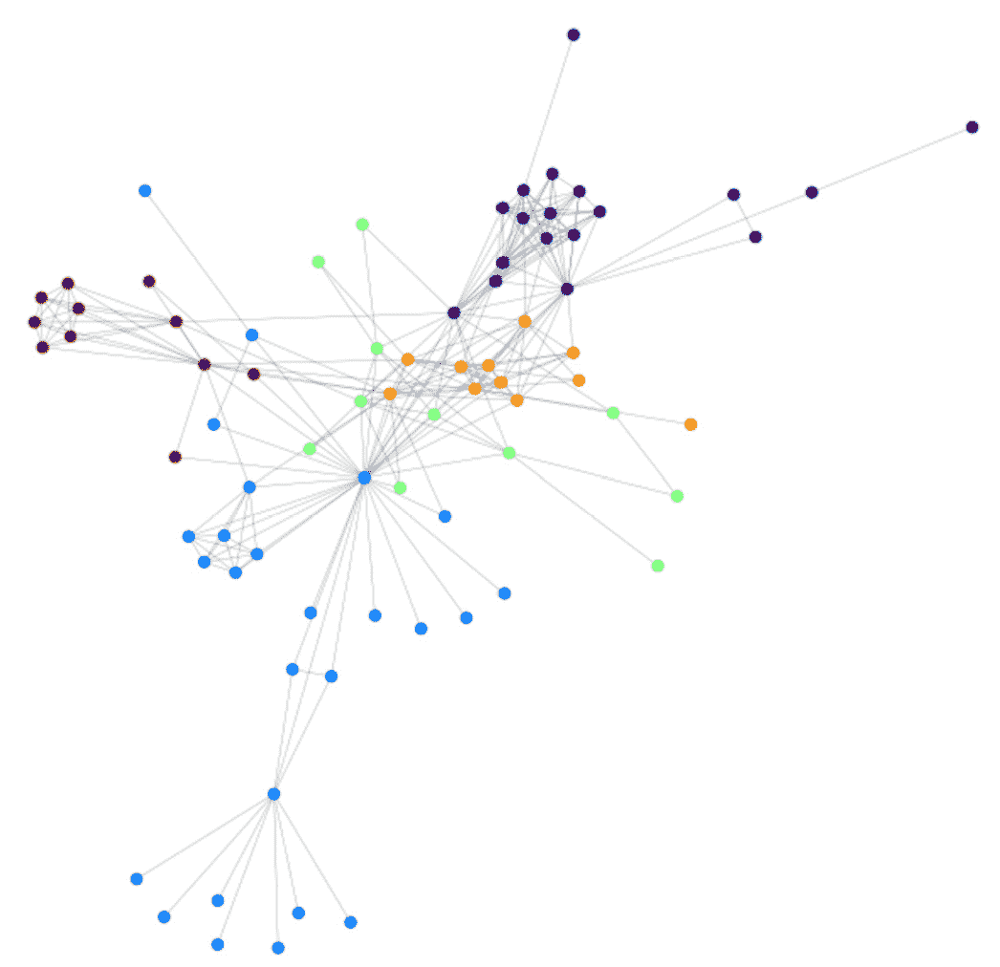

图 9.8 – Louvain 方法对《悲惨世界》网络的社区检测

*步骤 2* 中的辅助函数将根据节点所属的社区为其着色。重要的是，已经检测到独立的社区，并且每个节点的社区都用不同的颜色标识。每个节点都属于不同的分区，而这些分区就是社区。

1.  让我们来看看 `partition` 变量中包含了什么：

    ```py
    partition
    ```

    ```py
    {'Napoleon': 1,
    ```

    ```py
     'Myriel': 1,
    ```

    ```py
     'MlleBaptistine': 1,
    ```

    ```py
     'MmeMagloire': 1,
    ```

    ```py
     'CountessDeLo': 1,
    ```

    ```py
     'Geborand': 1,
    ```

    ```py
      …
    ```

    ```py
     'Grantaire': 0,
    ```

    ```py
     'Child1': 0,
    ```

    ```py
     'Child2': 0,
    ```

    ```py
     'BaronessT': 2,
    ```

    ```py
     'MlleVaubois': 2,
    ```

    ```py
     'MotherPlutarch': 0}
    ```

为了节省空间，我剪掉了一些节点和分区。每个节点都有一个关联的分区编号，这就是它所属的社区。如果你想获取属于某个特定社区的节点列表，你可以像这样操作：

```py
[node for node, community in partition.items() if community == 2]
```

那么，为什么这令人兴奋？Louvain 方法到底有什么酷的地方？首先，它能够扩展到庞大的网络，允许对像互联网这样的最大网络进行研究。其次，它很快，这意味着它是实用的。如果一个算法慢到只适用于小型网络，那它就没有多大意义。Louvain 方法在大规模网络上实用。这个算法既快速又高效，结果也非常好。它是你工具箱中会需要的一个社区检测算法。

接下来，让我们看看标签传播作为社区检测的另一个选择。

# 使用标签传播

标签传播是另一种快速识别网络中社区的方法。根据我的经验，结果没有 Louvain 方法那么好，但它是一个可以探索的工具，作为社区检测的一部分。你可以在[`arxiv.org/pdf/0709.2938.pdf`](https://arxiv.org/pdf/0709.2938.pdf)上阅读关于标签传播的更多内容。

## 它是如何工作的？

这是一种迭代方法。每个节点被初始化为一个唯一的标签，在每次算法迭代过程中，每个节点都会采用其大多数邻居的标签。例如，如果**David**节点有七个邻居节点，且其中四个邻居的标签是**label 1**，另外三个邻居的标签是**label 0**，那么**David**节点将选择**label 1**。在每次步骤中，每个节点都会选择大多数邻居的标签，最终通过将拥有相同标签的节点分组为社区来结束该过程。

## 标签传播在行动！

这个算法可以直接从 NetworkX 中导入：

```py
from networkx.algorithms.community.label_propagation import label_propagation_communities
```

一旦导入了算法，你所要做的就是将它传递给你的图，然后你会得到一个社区列表：

1.  让我们使用《悲惨世界》图来试试看：

    ```py
    communities = label_propagation_communities(G)
    ```

这一行将我们的图传递给标签传播算法，并将结果写入一个`community`变量。在这么小的网络上，这个算法非常快速，只需要不到一秒钟的时间就能识别社区。我更喜欢将这些结果转换成列表，以提取社区节点。

1.  我们可以像这样做到：

    ```py
    communities = list(communities)
    ```

    ```py
    communities[0]
    ```

    ```py
    {'Champtercier',
    ```

    ```py
     'Count',
    ```

    ```py
     'CountessDeLo',
    ```

    ```py
     'Cravatte',
    ```

    ```py
     'Geborand',
    ```

    ```py
     'Myriel',
    ```

    ```py
     'Napoleon',
    ```

    ```py
     'OldMan'}
    ```

在最后一行中，我们检查了第一个社区，社区 0。可视化这些社区非常简单。

1.  我们可以将它们提取为子图，然后使用我们在本书中一直使用的相同的`draw_graph`函数：

    ```py
    community = communities[1]
    ```

    ```py
    G_community = G.subgraph(community)
    ```

    ```py
    draw_graph(G_community, show_names=True, node_size=5)
    ```

我们从输出中可以看到什么？

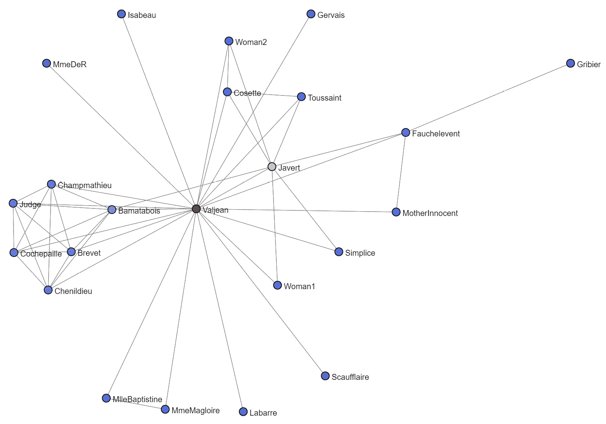

图 9.9 – 《悲惨世界》网络的标签传播社区检测，社区 1

这个结果看起来不错，但还不如 Louvain 方法的结果那么好。虽然它速度很快，但精度不如我预期的那么高。例如，看看**Valjean**左边，有一个紧密连接的社区，节点之间的连接非常密集。这个应该是一个独立的社区，而不是这个大社区的一部分。这个算法并不完美，但没有算法是完美的。然而，这个算法很快，能够扩展到大规模网络，因此它是大规模社区检测的另一种选择。

1.  让我们再看看几个社区：

    ```py
    community = communities[2]
    ```

    ```py
    G_community = G.subgraph(community)
    ```

    ```py
    draw_graph(G_community, show_names=True, node_size=5)
    ```

这为我们提供了以下输出：

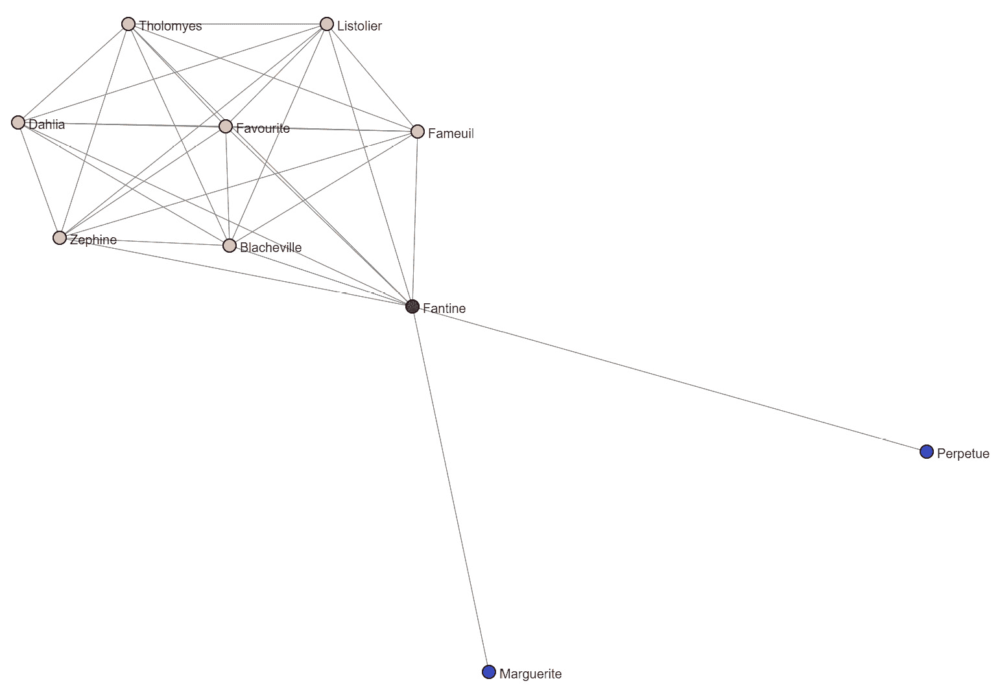

图 9.10 – 悲惨世界网络的标签传播社区检测，社区 2

这个社区看起来几乎完美。在社区中，除了最密集连接的部分外，出现一些额外的节点并不罕见。

1.  让我们看另一个例子：

    ```py
    community = communities[3]
    ```

    ```py
    G_community = G.subgraph(community)
    ```

    ```py
    draw_graph(G_community, show_names=True, node_size=5)
    ```

这为我们提供了以下的可视化：

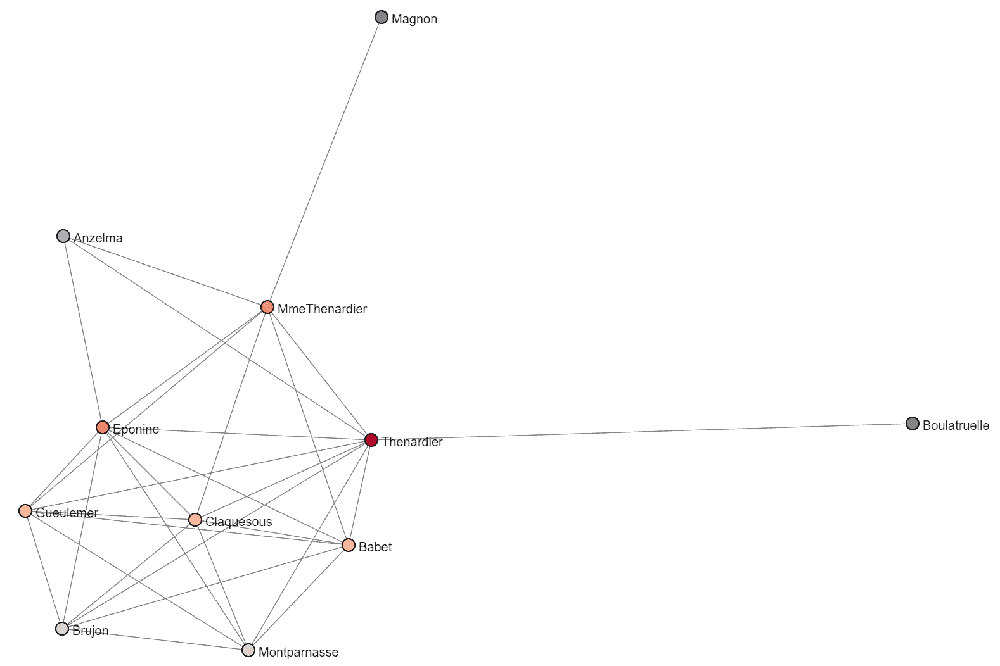

图 9.11 – 悲惨世界网络的标签传播社区检测，社区 3

这个社区看起来也很好。总体来说，这个算法效果很好，且速度很快。此外，设置比 Louvain 方法更容易、更快，因为你只需导入算法，传入一个图形，然后可视化结果。在易用性方面，这是我见过的最简单的算法。结果看起来不错，社区很快就被识别出来了。

但是，快速和易于使用并不足够。Louvain 更准确，并且快速且易于使用。尽管如此，这个算法仍然有其用处。

# 使用 Girvan-Newman 算法

在本章开始时，我们注意到*悲惨世界*网络由一个大的连通分量组成，并且没有孤立点或除了大连通分量之外的小型“岛屿”社区。为了展示连通分量如何有助于识别社区，我们通过去除一些关键节点来打破这个网络。

这种方法通常并不理想。尽管节点（人、地点、事物）和边（关系）中都包含信息，但根据我的经验，通常更倾向于去掉边而不是去掉节点。

一个比我们之前做的更好的方法是，找出能导致网络分裂的最少边，这些边将是切断网络的关键。我们可以通过寻找通过最多最短路径的边来实现这一点——也就是具有最高`edge_betweenness_centrality`的边。

这正是**Girvan-Newman** **算法**的作用。

## 它是如何工作的？

Girvan-Newman 算法通过尽可能少地切割边来识别社区，从而将网络分割成两部分。你可以在这里了解他们的研究方法：[`www.pnas.org/doi/full/10.1073/pnas.122653799`](https://www.pnas.org/doi/full/10.1073/pnas.122653799)。

很多时候，当我在查看网络时，我会看到几个节点被几条边连接在两个不同的侧面上。它几乎看起来像几根橡皮筋将这两组捆绑在一起。如果你剪断橡皮筋，这两个社区应该会分开，类似于当关键节点被移除时，网络会分裂成碎片的情况。

从某种程度上来说，这比删除节点更具精准性。信息损失较少。当然，丧失某些关系的信息是一个缺点，但所有节点仍然完好无损。

通过一系列迭代，Girvan-Newman 算法识别出具有最高`edge_betweenness_centrality`得分的边并将其删除，将网络分割成两部分。然后，过程再次开始。如果没有足够重复，社区会太大；如果重复太多次，社区最终会只剩一个节点。因此，在使用此算法时需要进行一些实验，以找到理想的分割次数。

这个算法的核心就是切割。这个算法的缺点是它并不快。计算`edge_betweenness_centrality`要比 Louvain 方法或标签传播的计算更加耗费计算资源。因此，这个算法很快就变得不再实用，因为它变得非常慢，无法再实际应用。

然而，如果你的网络足够小，这是一个非常酷的社区检测算法，可以进行探索。它也很直观，容易向他人解释。

## Girvan-Newman 算法在运行中！

让我们用我们的*悲惨世界*图来试试看。图足够小，这个算法应该能够很快地将其分割成多个社区：

1.  首先，导入算法：

    ```py
    from networkx.algorithms.community import girvan_newman
    ```

1.  接下来，我们需要将图作为参数传递给算法。这样做时，算法将返回每次迭代分割的结果，我们可以通过将结果转换为列表来进行调查：

    ```py
    communities = girvan_newman(G)
    ```

    ```py
    communities = list(communities)
    ```

1.  在每个社区由单个节点组成之前，算法最多可以进行多少次迭代？我们来看一下：

    ```py
    len(communities)
    ```

    ```py
    76
    ```

太棒了！我们有`76`次分割迭代保存在 Python 列表中。我建议你研究不同的分割级别，找到最适合你需求的一个。可能是过程中的非常早期，前 10 次分割，或者可能稍微晚一些。这部分需要一些分析，使得这个算法更具实践性。

1.  然而，为了推进进度，假设我们发现第十次迭代的分割得到了最好的结果。我们将第十次迭代的结果作为最终的社区分组，然后像使用 Louvain 方法和标签传播一样可视化这些社区：

    ```py
    communities = communities[9]
    ```

我们保留了第十次迭代的结果，删除了其他所有结果。如果我们不想丢弃这些结果，可以使用不同的变量名。

1.  我们来看一下这些社区是什么样的，以便将它们与我们讨论的其他算法进行比较：

    ```py
    community = communities[0]
    ```

    ```py
    G_community = G.subgraph(community)
    ```

    ```py
    draw_graph(G_community, show_names=True, node_size=5)
    ```

我们得到以下输出：

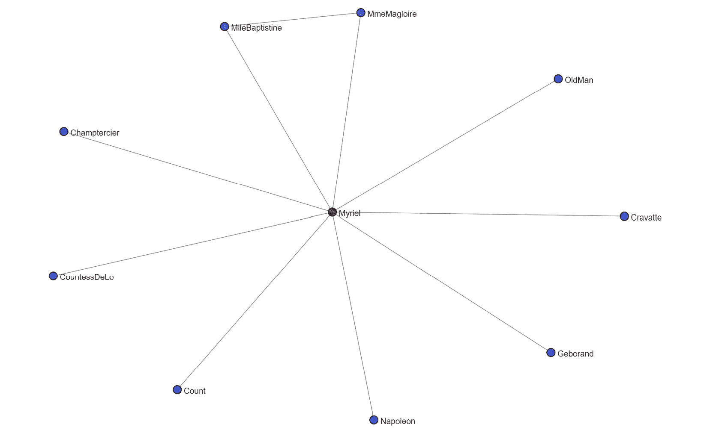

图 9.12 – 《悲惨世界》网络的 Girvan-Newman 社区检测，社区 0

这个子图应该很熟悉！当我们通过节点将网络分裂然后可视化连接组件时，看到的正是这个。这个算法通过切割边缘分裂网络，并成功找到了相同的社区。

1.  我们来看另一个社区：

    ```py
    community = communities[1]
    ```

    ```py
    G_community = G.subgraph(community)
    ```

    ```py
    draw_graph(G_community, show_names=True, node_size=5)
    ```

这将生成以下网络可视化：

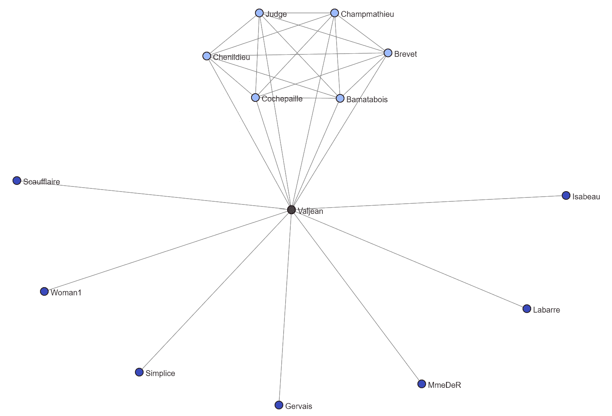

图 9.13 – 《悲惨世界》网络的 Girvan-Newman 社区检测，社区 1

这也看起来非常好。社区中有密集连接的节点组，以及一些连接较少的节点，这并不罕见。

1.  另一个社区：

    ```py
    community = communities[2]
    ```

    ```py
    G_community = G.subgraph(community)
    ```

    ```py
    draw_graph(G_community, show_names=True, node_size=5)
    ```

我们将看到以下输出：

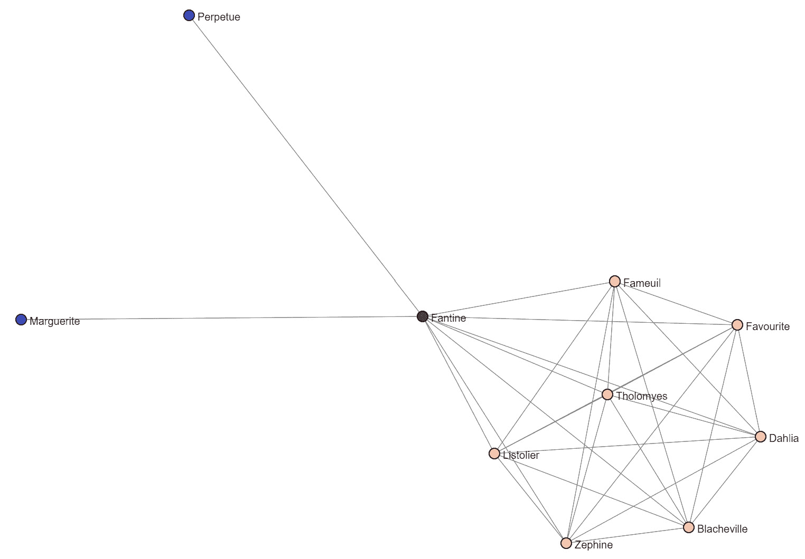

图 9.14 – 《悲惨世界》网络的 Girvan-Newman 社区检测，社区 2

这与上一个社区类似。我们有一个密集连接的节点组和两个只有一条边的节点。看起来很棒。

1.  我们来看一下社区 3：

    ```py
    community = communities[3]
    ```

    ```py
    G_community = G.subgraph(community)
    ```

    ```py
    draw_graph(G_community, show_names=True, node_size=5)
    ```

社区 3 看起来是这样的：

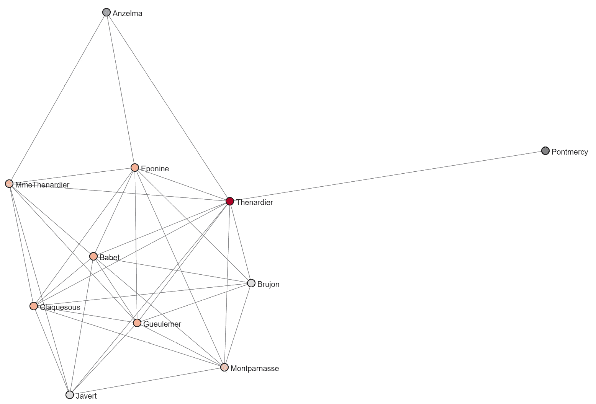

图 9.15 – 《悲惨世界》网络的 Girvan-Newman 社区检测，社区 3

这也应该很熟悉。标签传播方法找到了相同的社区，但 Girvan-Newman 算法删除了一个额外的节点。

1.  以及下一个：

    ```py
    community = communities[4]
    ```

    ```py
    G_community = G.subgraph(community)
    ```

    ```py
    draw_graph(G_community, show_names=True, node_size=5)
    ```

我们将看到以下网络：

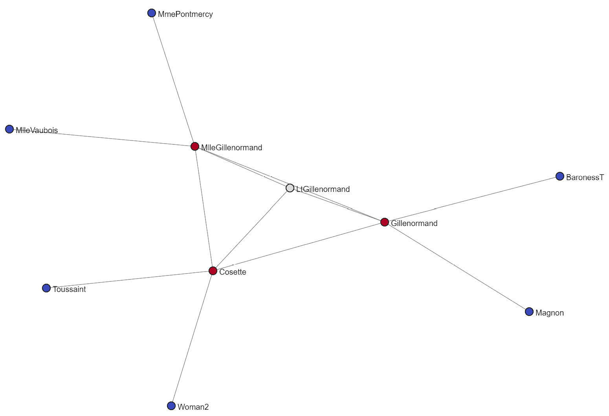

图 9.16 – 《悲惨世界》网络的 Girvan-Newman 社区检测，社区 4

尽管这可能在视觉上不如其他的网络可视化那么吸引人，但我认为它比其他的更令人印象深刻。这是一个不那么明显的社区，通过切割具有最高`edge_betweenness_centrality`得分的边找到的。中间有一个连接较多的节点组，周围是每个只与一条边连接的节点。

Girvan-Newman 算法可以给出非常好的、干净的结果。唯一的缺点是速度。计算`edge_betweenness_centrality`和最短路径是一个耗时的过程，因此该算法比我们讨论的其他算法要慢得多，但如果你的网络不太大，它仍然非常有用。

# 其他社区检测方法

我们探讨过的所有这些算法，都是人们关于如何在网络中识别社区的想法，基于与其他节点的接近度或通过切割边缘来找到社区。然而，这些并不是唯一的方法。我在了解 Girvan-Newman 算法之前，曾提出过一种方法，通过切割节点而不是边缘来识别社区。然而，当我了解了 Girvan-Newman 方法后，我发现它更理想，因此放弃了我的实现。但这让我思考，识别网络社区可能还有其他方法吗？

随着你对网络的理解逐渐深入，并且在使用网络分析时越来越得心应手，尝试发现其他识别社区的方法。

# 总结

在这一章中，我们探讨了几种不同的社区检测方法。每种方法都有其优缺点。

我们看到，连通组件在识别社区时是有用的，但前提是网络不仅仅由一个单一的主要组件组成。要利用连通组件识别社区，网络中需要有一些较小的连通组件被分割出来。在网络分析的初期使用连通组件非常重要，这有助于了解网络的整体结构，但作为单独的工具用于识别社区并不理想。

接下来，我们使用了 Louvain 方法。这个算法非常快速，适用于节点数量达到数亿、边缘数量达到数十亿的网络。如果你的网络非常大，这将是一个很有用的社区检测初步方法。算法运行速度快，结果清晰。你还可以调整一个参数，以获得最佳的划分结果。

然后，我们使用了标签传播方法来识别社区。在*悲惨世界*网络中，这个算法识别社区的时间仅为几分之一秒。总体来说，结果不错，但它似乎在将一个密集的节点群体从一个较大的社区中分割出来时遇到了一些困难。然而，其他社区的划分效果都很好。这个算法很快，并且应该能够扩展到大型网络，但我从未听说过它被应用于一个拥有数百万节点的网络。值得尝试。

最后，我们使用了 Girvan-Newman 算法，这是一种通过对具有最高`edge_betweenness_centrality`分数的边缘进行多轮切割来寻找社区的算法。结果非常清晰。这个算法的缺点是它非常慢，并且在大规模网络中扩展性差。然而，如果你的网络较小，这将是一个非常有用的社区检测算法。

这一章的编写过程非常有趣。对我来说，社区检测是网络分析中最有趣的领域之一。分析整个网络或探索自我中心网络是一回事，但能够识别并提取社区则是一项位于整体网络分析和自我中心网络分析之间的技能。

在接下来的几章中，我们将进入未知领域，探索如何将网络科学与机器学习结合起来！第一章将讲解监督式机器学习，而最后一章则将讲解无监督式机器学习。我们只剩下几章了！坚持住！
