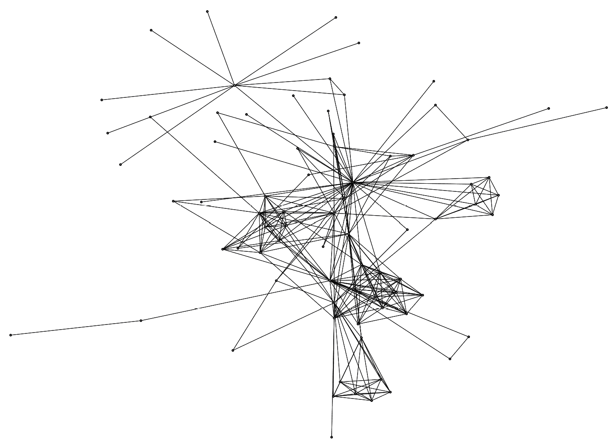
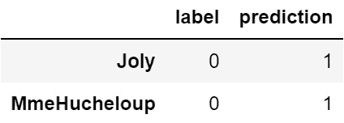

# 第十章：网络数据上的监督学习

在前面的章节中，我们花费了大量时间探讨如何从互联网上收集文本数据，将其转换为网络数据，进行网络可视化，并分析网络。我们能够使用中心性和各种网络指标来获得有关单个节点在网络中位置和影响力的更多上下文信息，并使用社区检测算法来识别网络中存在的各种社区。

在本章中，我们将开始探索网络数据如何在**机器学习**（**ML**）中发挥作用。由于这是一本数据科学和网络科学的书，我预计许多读者已经对机器学习有所了解，但我会给出一个非常简短的解释。

本章包括以下几个部分：

+   引入机器学习

+   从机器学习开始

+   数据准备和特征工程

+   选择模型

+   准备数据

+   训练和验证模型

+   模型洞察

+   其他应用案例

# 技术要求

在本章中，我们将使用 Python 库 NetworkX、pandas 和 scikit-learn。现在这些库应该已经安装好了，因此可以随时使用。如果没有安装，你可以通过以下方式安装 Python 库：

```py
pip install <library name>
```

例如，要安装 NetworkX，你可以执行以下命令：

```py
pip install networkx
```

在*第四章*中，我们还介绍了一个`draw_graph()`函数，利用了 NetworkX 和`scikit-network`库。每次进行网络可视化时，你都需要使用这段代码。记得保留它！

本章的代码可以在 GitHub 上找到：[`github.com/PacktPublishing/Network-Science-with-Python`](https://github.com/PacktPublishing/Network-Science-with-Python)。

# 引入机器学习

机器学习（ML）是一组技术，能够使计算机从数据中的模式和行为中学习。通常说，机器学习有三种不同的类型：**监督学习**、**无监督学习**和**强化学习**。

在监督学习中，数据会附带一个答案——称为**标签**——以便让机器学习模型学习那些可以帮助其预测正确答案的模式。简单来说，你给模型提供数据*和*答案，然后它会弄清楚如何做出正确预测。

在无监督学习中，模型不会被提供答案。目标通常是找出相似数据的聚类。例如，你可以使用聚类算法来识别数据集中不同类型的新闻文章，或在文本语料库中找出不同的主题。这与我们做的社区检测工作类似。

在强化学习中，模型会被赋予一个目标，并逐渐学习如何达到这个目标。在许多强化学习演示中，你会看到模型玩乒乓球或其他视频游戏，或者学习走路。

这些是机器学习类型的极简描述，还有更多的变体（**半监督学习**等）。机器学习是一个广泛的主题，因此如果本章内容让你感兴趣，我鼓励你查阅相关书籍。对我来说，它使自然语言处理成为了一种痴迷。

# 开始机器学习

有很多关于如何使用自然语言处理（NLP）进行情感分析的指南和书籍，但关于如何将图数据转换成可以用于机器学习分类格式的指南和书籍却少之又少。在本章中，你将看到如何使用图数据进行机器学习分类。

对于这个练习，我创建了一个名为“找出革命者”的小游戏。与前两章一样，我们将使用 *《悲惨世界》* 网络，因为它包含足够多的节点和社区，足够有趣。在前面的章节中，我指出革命者社区是高度连接的。作为提醒，这就是它的样子：


图 10.1 – 《悲惨世界》ABC 革命社群网络

社区中的每个成员几乎都与其他成员相互连接。没有与外部人员的连接。

网络的其他部分看起来不同。


图 10.2 – 《悲惨世界》全网

即使是视觉检查也能看出，在网络的不同部分，节点的连接方式不同，结构也有所差异。在某些地方，连接类似于星形；在其他地方，连接则像网格。网络指标将为我们提供这些值，机器学习模型可以使用它们进行预测。

我们将使用这些指标来玩“找出革命者”的游戏。这会很有趣。

注意

我不会深入解释机器学习，只会简要介绍它的能力。如果你对数据科学或软件工程感兴趣，我强烈建议你花时间学习机器学习。它不仅仅适用于学者、数学家和科学家。机器学习变得越来越复杂，因此强烈建议具备数学和统计学基础，但你完全可以自由探索这一主题。

本章不会是一堂数学课。所有的工作都将通过代码完成。我将展示一个使用网络数据进行分类的例子。这不是唯一的应用场景，使用网络数据进行机器学习的应用远不止这些。我也只会展示一个模型（随机森林），而不是所有可用的模型。

我还将展示有时不正确的预测和正确的预测一样具有启发性，并且有时模型预测中也包含有用的见解。

我将展示从图数据到预测和见解的工作流程，以便你可以在自己的实验中使用这一方法。你并不需要每次都使用图神经网络（**NN**）。使用更简单的模型也是完全可能的，它们同样能够提供有价值的见解。

足够的免责声明。开始吧。

# 数据准备和特征工程

在我们可以使用机器学习之前，首先需要收集数据，并将其转换为模型可以使用的格式。我们不能直接将图 G 传递给随机森林并就此结束。我们可以将图的邻接矩阵和一组标签传递给随机森林，它也能工作，但我想展示一些我们可以做的特征工程。

特征工程是利用领域知识创建额外的特征（大多数人称之为列），这些特征将对我们的模型有用。例如，回顾前一节中的网络，如果我们想能够识别革命者，我们可能希望为模型提供额外的数据，如每个节点的度数（连接数）、介数中心性、紧密中心性、页面排名、聚类系数和三角形：

1.  让我们从先构建网络开始。现在应该很容易，因为我们已经做过好几次了：

    ```py
    import networkx as nx
    ```

    ```py
    import pandas as pd
    ```

    ```py
    G = nx.les_miserables_graph()
    ```

    ```py
    df = nx.to_pandas_edgelist(G)[['source', 'target']] # dropping 'weight'
    ```

    ```py
    G = nx.from_pandas_edgelist(df)
    ```

我们在前面的章节中已经采取了这些步骤，但提醒一下，*《悲惨世界》*图谱带有边权重，而我不需要这些。第一行加载图谱，第二行从图谱中创建边列表，去掉边权重，第三行则从边列表重建图谱，去掉权重。

1.  我们现在应该有一个有用的图谱。让我们来看看：

    ```py
    draw_graph(G)
    ```

这将生成以下图谱：



图 10.3 – 《悲惨世界》图谱（不带节点名称）

看起来不错！我可以清楚地看到这个网络中有几个不同的节点簇，而其他部分的网络则更为稀疏。

那么，我们如何将这个混乱的纠结结转化为机器学习模型可以使用的东西呢？好吧，我们在前几章中已经研究过中心性和其他度量。所以我们已经有了在这里使用的基础。我将创建几个包含我所需数据的数据框，然后将它们合并成训练数据。

## 度数

**度数**只是一个节点与其他节点连接的数量。我们首先获取这个数据：

```py
degree_df = pd.DataFrame(G.degree)
degree_df.columns = ['person', 'degrees']
degree_df.set_index('person', inplace=True)
degree_df.head()
```

我们得到如下输出：


图 10.4 – 《悲惨世界》特征工程：度数

接下来我们进入下一步。

## 聚类

接下来，我们将计算聚类系数，它告诉我们节点周围的连接密度。值为 1.0 表示每个节点都与其他节点相连，值为 0.0 表示没有邻近节点与其他邻近节点连接。

让我们来捕捉聚类：

```py
clustering_df = pd.DataFrame(nx.clustering(G), index=[0]).T
clustering_df.columns = ['clustering']
clustering_df.head()
```

这将给我们聚类的输出：


图 10.5 – 《悲惨世界》特征工程：聚类

这告诉我们 **MlleBaptistine** 和 **MmeMagloire** 都是高度连接的社区的一部分，这意味着这两个人也认识同样的人。**Napoleon** 与其他人没有任何交集，**CountessDeLo** 也是如此。

## 三角形

`triangle_df` 是统计给定节点属于多少个三角形。如果一个节点属于许多不同的三角形，那么它与网络中的许多节点相连接：

```py
triangle_df = pd.DataFrame(nx.triangles(G), index=[0]).T
triangle_df.columns = ['triangles']
triangle_df.head()
```

这将给我们带来如下结果：


图 10.6 – 《悲惨世界》特征工程：三角形

这是理解节点之间连接性的一种方式。这些节点代表人物，所以它也是理解人与人之间连接性的一种方式。请注意，结果类似于但并不完全相同于聚类。

## 介数中心性

**介数中心性**与节点在其他节点之间的位置有关。举个例子，假设有三个人（*A*、*B* 和 *C*），如果 *B* 坐在 *A* 和 *C* 之间，那么从 *A* 到 *C* 传递的所有信息都会通过 *B*，使得 *B* 处于一个重要且有影响力的位置。这只是介数中心性有用性的一个例子。我们可以通过以下代码获取这个信息：

```py
betw_cent_df = pd.DataFrame(nx.betweenness_centrality(G), index=[0]).T
betw_cent_df.columns = ['betw_cent']
betw_cent_df.head()
```

这将给我们带来以下输出：


图 10.7 – 《悲惨世界》特征工程：介数中心性

## 接近中心性

**接近中心性**与一个给定节点与网络中所有其他节点的距离有关，具体来说是最短路径。因此，接近中心性在大规模网络中计算起来非常慢。然而，对于*《悲惨世界》*网络来说，它会表现得很好，因为这是一个非常小的网络：

```py
close_cent_df = pd.DataFrame(nx.closeness_centrality(G), index=[0]).T
close_cent_df.columns = ['close_cent']
close_cent_df.head()
```


图 10.8 – 《悲惨世界》特征工程：接近中心性

## PageRank

最后，即使在大规模网络中，`pagerank` 仍然有效。因此，它被广泛用于衡量重要性：

```py
pr_df = pd.DataFrame(nx.pagerank(G), index=[0]).T
pr_df.columns = ['pagerank']
pr_df.head()
```

这将给我们 *图 10.9*。


图 10.9 – 《悲惨世界》特征工程：pagerank

## 邻接矩阵

最后，我们可以将 **邻接矩阵** 纳入训练数据，使得我们的模型可以将邻居节点作为特征来进行预测。例如，假设你有 10 个朋友，但其中一个是罪犯，而每个这个朋友介绍给你的人也都是罪犯。你可能会随着时间的推移，学到不应该和这个朋友或他们的朋友交往。你的其他朋友没有这个问题。在你的脑海中，你已经开始对那个人及其交往的人做出判断。

如果我们省略邻接矩阵，模型将试图仅从其他特征中学习，但它无法意识到相邻节点的上下文。在“识别革命者”游戏中，它将仅使用中心性、聚类、度数和其他特征，因为它无法从其他任何地方获取学习信息。

我们将使用邻接矩阵。这感觉几乎像是泄漏（答案隐藏在另一个特征中），因为在社交网络中，相似的事物往往会相互吸引，但这也展示了将网络数据与机器学习结合的实用性。如果你觉得这是一种作弊方式，可以不使用邻接矩阵，我个人不这么认为：

```py
adj_df = nx.to_pandas_adjacency(G)
adj_df.columns = ['adj_' + c.lower() for c in adj_df.columns]
adj_df.head()
```

这段代码输出以下 DataFrame：


图 10.10 – 《悲惨世界》特征工程：邻接矩阵

## 合并数据框

现在我们有了所有这些有用的特征，是时候将 DataFrame 合并在一起了。这很简单，但需要几个步骤，以下代码展示了如何操作：

```py
clf_df = pd.DataFrame()
clf_df = degree_df.merge(clustering_df, left_index=True, right_index=True)
clf_df = clf_df.merge(triangle_df, left_index=True, right_index=True)
clf_df = clf_df.merge(betw_cent_df, left_index=True, right_index=True)
clf_df = clf_df.merge(close_cent_df, left_index=True, right_index=True)
clf_df = clf_df.merge(pr_df, left_index=True, right_index=True)
clf_df = clf_df.merge(adj_df, left_index=True, right_index=True)
clf_df.head(10)
```

在第一步，我创建了一个空的 DataFrame，这样我就可以反复运行 Jupyter 单元，而不需要创建带有奇怪名称的重复列。这只是节省了工作量和减少了烦恼。接着，我按照 DataFrame 的索引顺序，将各个 DataFrame 合并到 `clf_df` 中。DataFrame 的索引是《悲惨世界》中的角色名称。这确保了每个 DataFrame 中的每一行都能正确地合并在一起。


图 10.11 – 《悲惨世界》特征工程：合并的训练数据

## 添加标签

最后，我们需要为革命者添加标签。我已经快速查找了《ABC 朋友们》（Les Amis de l’ABC）成员的名字，这是革命者小组的名称。首先，我会将这些成员添加到 Python 列表中，然后进行抽查，确保名字拼写正确：

```py
revolutionaries = ['Bossuet', 'Enjolras', 'Bahorel', 'Gavroche', 'Grantaire',
                   'Prouvaire', 'Courfeyrac', 'Feuilly', 'Mabeuf', 'Marius', 'Combeferre']
# spot check
clf_df[clf_df.index.isin(revolutionaries)]
```

这会生成以下 DataFrame：


图 10.12 – 《悲惨世界》特征工程：ABC 朋友们

这看起来很完美。列表中有 11 个名字，DataFrame 也有 11 行。为了创建监督学习的训练数据，我们需要添加一个 `1`：

```py
clf_df['label'] = clf_df.index.isin(revolutionaries).astype(int)
```

就这么简单。让我们快速查看一下 DataFrame，确保我们已经有了标签。我会按索引排序，以便在数据中看到一些 `1` 标签：

```py
clf_df[['label']].sort_index().head(10)
```

这将输出以下内容：


图 10.13 – 《悲惨世界》特征工程：标签抽查

完美。我们有了节点，每个节点都有标签。标签为 **1** 表示他们是 ABC 朋友会的成员，标签为 **0** 表示他们不是。这样，我们的训练数据就准备好了。

# 选择模型

对于这次练习，我的目标只是向你展示网络数据如何在机器学习（ML）中可能有所帮助，而不是深入探讨机器学习的细节。关于这个主题，有很多非常厚的书籍。这本书是关于如何将自然语言处理（NLP）和网络结合起来，理解我们周围存在的隐形联系以及它们对我们的影响。因此，我将迅速跳过关于不同模型如何工作的讨论。对于这次练习，我们将使用一个非常有用且强大的模型，它通常足够有效。这个模型叫做**随机森林（Random Forest）**。

随机森林（Random Forest）可以接受数值型和类别型数据作为输入。我们选择的特征对于本次练习来说应该非常合适。随机森林的设置和实验也非常简单，而且它也很容易了解模型在预测中最为有用的特征。

其他模型也可以使用。我尝试使用了**k-近邻（k-nearest neighbors）**，并且达到了几乎相同的成功水平，我确信**逻辑回归（Logistic regression）**在一些额外的预处理之后也会很好用。**XGBoost**和**支持向量机（SVM）**也会有效。你们中的一些人可能也会想使用神经网络（NN）。请随意。我选择不使用神经网络，因为它的设置更复杂，训练时间通常更长，而且可能只能带来微小的准确度提升，这也可能只是偶然。实验不同的模型！这是学习的好方法，即使你是在学习*不该做什么*。

# 准备数据

我们应该再进行几次数据检查。最重要的是，让我们检查一下训练数据中类别的平衡：

1.  从以下代码开始：

    ```py
    clf_df['label'].value_counts()
    ```

    ```py
    …
    ```

    ```py
    0    66
    ```

    ```py
    1    11
    ```

    ```py
    Name: label, dtype: int64
    ```

数据不平衡，但问题不大。

1.  让我们以百分比形式展示，这样可以让它更容易理解：

    ```py
    clf_df['label'].value_counts(normalize=True)
    ```

    ```py
    …
    ```

    ```py
    0    0.857143
    ```

    ```py
    1    0.142857
    ```

    ```py
    Name: label, dtype: float64
    ```

看起来我们在类别之间大约有 86/14 的比例。还不错。记住这一点，因为仅仅基于类别不平衡，模型就应该能够以大约 86%的准确率进行预测。如果它只有 86%的准确率，那它就不会是一个令人印象深刻的模型。

1.  接下来，我们需要将数据切割成适合我们模型的数据。我们将使用特征作为`X`数据，答案作为`y`数据。由于标签是最后添加的，这个过程很简单：

    ```py
    X_cols = clf_df.columns[0:-1]
    ```

    ```py
    X = clf_df[X_cols]
    ```

    ```py
    y = clf_df['label'].values
    ```

`X_cols`是除了最后一列（即标签）之外的所有列，`X`是一个只包含`X_cols`字段的数据框，`y`是我们答案的数组。不要仅仅听我说，做个抽查吧。

1.  运行以下代码：

    ```py
    X.head()
    ```

这将显示一个数据框（DataFrame）。

1.  向右滚动数据框。如果你没有看到**标签**列，那我们就可以开始了：

    ```py
    y[0:5]
    ```

这将显示`y`中的前五个标签。这是一个数组。我们准备好了。

最后，我们需要将数据分成训练数据和测试数据。训练数据将用于训练模型，测试数据是模型完全不知道的数据。我们不关心模型在训练数据上的准确性。记住这一点。我们不关心模型的训练数据准确率或任何性能指标。我们只关心模型在未见数据上的表现。这将告诉我们它的泛化能力以及在实际环境中的表现。是的，我知道这个模型在实际环境中不会有太大用处，但这就是我们的思路。

1.  我们将使用`scikit-learn`的`train_test_split`函数来拆分数据：

    ```py
    from sklearn.model_selection import train_test_split
    ```

    ```py
    X_train, X_test, y_train, y_test = train_test_split(X, y, random_state=1337, test_size=0.4)
    ```

由于我们的训练数据非常少，而且 ABC 协会的成员也很少，我将`test_size`设置为`0.4`，是默认值的两倍。如果数据不那么不平衡，我会将其减少到`0.3`或`0.2`。如果我真的希望模型能够使用尽可能多的训练数据，并且我认为它足够好，我甚至可能尝试`0.1`。但是在这个练习中，我选择了`0.4`。这是我的理由。

这个函数将数据以 60/40 的比例分割，将 60%的数据放入`X_train`和`y_train`，其余 40%放入`X_test`和`y_test`。这样就将 40%的数据作为模型无法知道的“未见数据”。如果模型能在这 40%的未见数据上表现良好，那么它就是一个不错的模型。

我们现在准备好训练我们的模型，看看它的表现如何！

# 训练和验证模型

在人们谈论机器学习时，模型训练是最受关注的部分，但通常它是最简单的一步，只要数据已被收集和准备好。可以并且应该花费大量的时间和精力来优化你的模型，通过**超参数调优**。无论你对哪个模型感兴趣并想使用，做一些关于如何调优该模型的研究，以及数据准备所需的任何额外步骤。

对于这个简单的网络，默认的随机森林模型已经是最优的了。我进行了几个检查，发现默认模型已经足够好。以下是代码：

```py
from sklearn.ensemble import RandomForestClassifier
clf = RandomForestClassifier(random_state=1337, n_jobs=-1, n_estimators=100)
clf.fit(X_train, y_train)
train_acc = clf.score(X_train, y_train)
test_acc = clf.score(X_test, y_test)
print('train_acc: {} - test_acc: {}'.format(train_acc, test_acc))
```

我们正在使用随机森林分类器，所以我们首先需要从`sklearn.ensemble`模块导入模型。随机森林使用决策树的集成来做出预测。每个集成都基于训练数据中的不同特征进行训练，然后做出最终预测。

设置`random_state`为你喜欢的任何数字。我喜欢`1337`，这是一个老黑客笑话。它是*1337*，*leet*，*elite*。将`n_jobs`设置为`-1`，确保在训练模型时使用所有的 CPU。将`n_estimators`设置为`100`，将允许使用 100 个决策树的集成。可以尝试不同的估计器数量。增加它可能有帮助，但在这种情况下没有。

最后，我收集并打印了训练准确率和测试准确率。我们的得分如何？

```py
train_acc: 1.0 - test_acc: 0.9354838709677419
```

在测试集上，结果还不错。这个数据集是未见过的数据，所以我们希望它的准确度较高。如前所述，由于类别不平衡，模型应该至少能达到 86%的准确率，因为 86%的标签属于大类。93.5%的准确率还算不错。不过，你应当注意**欠拟合**和**过拟合**。如果训练集和测试集的准确率都很低，模型很可能是欠拟合，需要更多的数据。如果训练集的准确率远高于测试集的准确率，这可能是过拟合的表现，而这个模型似乎存在过拟合问题。不过，考虑到我们目前的数据量，以及本次实验的目的，今天的结果也算是“够好了”。

你必须知道，模型准确率永远不足以评估模型的表现。它并不能告诉你模型的表现，特别是在少数类的表现。我们应该查看混淆矩阵和分类报告，以了解更多信息。为了使用这两个工具，我们首先需要将`X_test`的预测结果存入一个变量：

```py
predictions = clf.predict(X_test)
predictions
…
array([0, 0, 0, 0, 0, 1, 0, 0, 0, 0, 0, 0, 0, 0, 0, 0, 0, 0, 0, 0, 0, 0,1, 0, 0, 1, 0, 0, 1, 0, 1])
```

很好，我们得到了一个预测数组。接下来，让我们导入`confusion_matrix`和`classification_report`函数：

```py
from sklearn.metrics import confusion_matrix, classification_report, plot_confusion_matrix
```

我们可以通过将`X_test`数据以及对`X_test`做出的预测作为输入，来使用这两个工具。首先，我们来看看混淆矩阵：

```py
confusion_matrix(y_test, predictions)
 …
array([[26,  2],
             [ 0,  3]], dtype=int64)
```

如果这还不够清楚，我们也可以将其可视化：

```py
plot_confusion_matrix(clf, X_test, y_test)
```

这将生成以下矩阵。


图 10.14 – 模型混淆矩阵

混淆矩阵展示了模型如何根据类别进行预测。图示很好地展示了这一点。*y 轴*显示的是真实标签，值为**0**或**1**，而*x 轴*显示的是预测标签，值为**0**或**1**。我可以看到，有 26 个字符被正确预测为不是 ABC 革命者（Friends of the ABC）成员。我们的模型正确预测了三个 ABC 革命者的成员，但也错误地预测了两个非成员为成员。我们需要深入研究这个问题！有时候，错误的预测能帮助我们发现数据中的问题，或者给我们带来一些有趣的见解。

我还发现查看分类报告极其有帮助：

```py
report = classification_report(y_test, predictions)
print(report)
```

我们得到以下输出：


图 10.15 – 模型分类报告

这个报告清楚地显示了模型在预测 ABC 革命者的非成员时表现很好，但在预测革命者时表现较差。为什么会这样？它是被什么困扰了？从网络上看，模型本应能够学习到，不同群体之间有明显的结构差异，特别是在将 ABC 革命者与其他人群进行比较时。到底发生了什么？让我们构建一个简单的数据框来检查一下：

```py
check_df = X_test.copy()
check_df['label'] = y_test
check_df['prediction'] = predictions
check_df = check_df[['label', 'prediction']]
check_df.head()
```

我们得到以下的数据框：


图 10.16 – 预测检查的 DataFrame

现在，让我们创建一个掩码来查找所有标签与预测不匹配的行：

```py
mask = check_df['label'] != check_df['prediction']
check_df[mask]
```

这给了我们*图 10.17*。



图 10.17 – 漏掉预测的 DataFrame

好的，现在我们可以看到模型哪里出了错，但为什么会这样呢？为了节省你的时间，我调查了这两个角色。Joly 实际上是**ABC 朋友会**的成员，而 Madame Hucheloup 经营一家咖啡馆，ABC 朋友会的成员经常在这里聚会。她曾是科林特酒馆的老板，那是成员们的聚会场所，也是他们的最后防线！由于她与该小组成员有联系，模型预测她也是其中的一员。

公平来说，我敢打赌一个人类可能也会做出相同的判断，认为 Madame Hucheloup 是其中之一！对我来说，这就是一个美丽的错误分类！

下一步肯定是给 Joly 一个正确的标签，并重新训练模型。我会保持 Madame Hucheloup 不变，因为她不是成员，但如果我是反叛者，我会密切关注她。

简而言之，我认为模型表现非常好，并且完全使用了图形数据。

# 模型洞察

对我来说，模型洞察比构建和使用模型进行预测更让人兴奋。我喜欢了解周围的世界，而机器学习模型（和网络）让我能够以我的眼睛无法感知的方式理解这个世界。我们看不到所有将我们联系在一起的线条，也很难理解基于周围人的社会网络中他们如何被战略性地安排从而产生的影响。这些模型可以帮助我们做到这一点！网络能够提供提取信息流动和影响的上下文意识的结构。机器学习可以告诉我们哪些信息在理解某些事情时最有用。有时候，机器学习能够穿越噪音，直接找到那些真正影响我们生活的信号。

在我们刚刚建立的模型中，一个见解是《悲惨世界》中的不同角色在不同的网络结构中有不同的类型。革命者们彼此靠得很近，并且紧密连接。学生们也有很强的连接性，我感到惊讶并且高兴的是，模型在许多学生身上没有出现错误分类。书中的其他角色几乎没有什么连接，他们的邻居连接稀疏。我认为，作者在定义这个故事中存在的社交网络方面付出了很多努力，这很美妙。它能让我们重新审视这个故事的创作过程。

但是，哪些特征对模型最重要，帮助它做出如此准确的预测呢？让我们来看一下。随机森林使我们这一点变得非常容易！

你可以通过以下方式非常容易地获取**特征重要性**：

```py
clf.feature_importances_
```

但这些数据在这个格式下并不太有用。如果你将特征重要性放入一个 DataFrame，它们就能被排序和可视化，这样会更有用：

```py
importance_df = pd.DataFrame(clf.feature_importances_, index=X_test.columns)
importance_df.columns = ['value']
importance_df.sort_values('value', ascending=False, inplace=True)
importance_df.head()
```

我们得到了这个 DataFrame：


图 10.18 – 特征重要性的 DataFrame

这些是数字格式的特征重要性。这展示了模型在进行预测时，认为最有用的 10 个特征。值得注意的是，角色与博苏埃和昂若拉的关系是判断一个角色是否为革命者的好指标。在网络特征中，三角形是唯一进入前 10 名的特征。其余的重要特征来自邻接矩阵。让我们通过条形图来可视化这些，以便能看到更多内容，以及每个特征的重要性程度：

```py
import matplotlib.pyplot as plt
importance_df[0:20].plot.barh(figsize=(10,8)).invert_yaxis()
```

我们得到以下图表：


图 10.19 – 特征重要性的水平条形图

要好得多。这看起来更容易理解，而且它准确地显示了模型认为每个特征的有用程度。

顺便说一下，你可以利用特征重要性，积极识别出你可以从训练数据中剔除的特征，从而使模型更加精简。我常常会创建一个基准的随机森林模型，以帮助进行积极的特征选择。积极的特征选择是我用来形容在训练模型之前，毫不留情地剔除不必要数据的过程。对于这个模型，我并没有做积极的特征选择。我使用了我收集到的所有数据。

# 其他使用场景

虽然这可能很有趣，但我们大多数人并不会把捕捉革命者当作日常工作的一部分。那么，这有什么用呢？其实，对网络进行预测有很多用途。最近，图神经网络（Graph ML）引起了很多关注，但大多数文章和书籍展示的都是别人建立的模型（而不是如何从零开始构建模型），或者使用神经网络。这没问题，但它复杂且不总是实用。

我展示的这种方法是轻量且实用的。如果你有网络数据，你也可以做类似的事情。

但还有哪些其他的使用场景呢？对我来说，我最感兴趣的是机器人检测和人工放大检测。我们该如何进行呢？对于机器人检测，您可能需要关注诸如账户年龄（按天计算）、一段时间内发布的帖子数量等特征（真实用户通常会在变得活跃之前，慢慢学习如何使用社交网络）等内容。对于人工放大，您可能会关注一个账户发布每条推文时，获得的粉丝数。例如，如果一个账户一周前上线，发布了 2 条帖子，并获得了 2000 万粉丝，这种增长是如何发生的呢？自然增长要慢得多。也许他们从另一个社交网络带来了粉丝，或者他们的账户被数百个博客推介了。

你还能想到其他哪些使用场景吗？发挥创造力吧。你现在知道什么是网络，也知道如何构建它们并与之互动。你希望预测什么，或者更好地理解什么呢？

# 总结

我们做到了！我们又完成了一个章节。我真心希望你觉得这一章特别有趣，因为很少有资料能解释如何从零开始做这些事情。我决定写这本书的原因之一，就是希望像这样的想法能够得到推广。所以，我希望这一章能引起你的注意，并激发你的创造力。

在本章中，我们将一个实际的网络转化为可以用于机器学习的训练数据。这是一个简化的例子，但这些步骤适用于任何网络。最终，我们创建了一个能够识别 ABC 革命小组成员的模型，尽管它是一个非常简单的模型，并不适用于现实世界中的任何应用。

下一章将与这一章非常相似，但我们将使用无监督学习来识别与其他节点相似的节点。很可能，无监督学习也会识别出 ABC 革命小组的成员，但它也可能揭示出其他有趣的见解。
