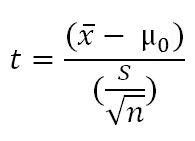
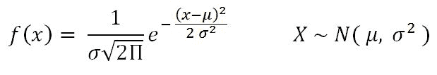
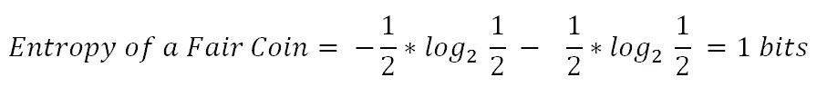

# 第一章：从统计学到机器学习的旅程

最近，**机器学习**（**ML**）和数据科学的流行程度前所未有。这一领域预计在未来几年将呈指数增长。首先，什么是机器学习？为什么有人需要费力去理解其原理呢？嗯，我们有答案给你。一个简单的例子就是电子商务网站中的图书推荐，当某人搜索特定书籍或其他产品时，网站会推荐与之相关的其他产品，以便向用户提供他们可能喜欢的建议。听起来像魔法一样，对吧？事实上，利用机器学习可以实现远比这更强大的功能。

机器学习是一个研究领域，其中模型可以基于数据中的经验自动学习，而不完全像统计模型那样进行建模。随着时间的推移和数据量的增加，模型的预测能力将不断提升。

在这一章中，我们将介绍理解统计学习所需的基本概念，并为那些希望理解机器学习方法背后统计工作原理的全职统计学家或软件工程师奠定基础。

# 构建和验证模型的统计术语

统计学是数学的一个分支，涉及数值数据的收集、分析、解释、展示和组织。

统计学主要分为两个子分支：

+   **描述性统计学**：这些用于总结数据，例如连续数据类型（如年龄）的均值、标准差，而频率和百分比则适用于分类数据（如性别）。

+   **推断统计学**：很多时候，收集全部数据（在统计方法中也称为总体）是不可能的，因此会收集数据点的一个子集，也称为样本，并基于此对整个总体做出结论，这就是推断统计学。通过假设检验、数值特征估计、数据内部关系的相关性分析等方式得出推论。

统计建模是将统计学应用于数据，通过分析变量的显著性来发现潜在的隐藏关系。

# 机器学习

机器学习是计算机科学的一个分支，利用过去的经验进行学习，并用其知识做出未来的决策。机器学习处于计算机科学、工程学和统计学的交汇点。机器学习的目标是从给定的示例中概括出可检测的模式或创建一个未知规则。机器学习领域的概述如下：


机器学习大致分为三类，但根据具体情况，这些类别可以组合在一起，以实现特定应用所需的结果：

+   **监督学习**：这是教机器学习变量之间的关系以及与目标变量的关系，类似于老师向学生提供反馈的方式。监督学习的主要领域如下：

    +   分类问题

    +   回归问题

+   **无监督学习**：在无监督学习中，算法通过自身学习，无需任何监督或目标变量的提供。关键在于从给定的数据中发现隐藏的模式和关系。无监督学习的类别如下：

    +   降维

    +   聚类

+   **强化学习**：这使得机器或代理能够根据来自环境的反馈来学习其行为。在强化学习中，代理采取一系列决定性的行动而不需要监督，最终会得到一个奖励，可能是+1 或-1。根据最终的回报/奖励，代理重新评估其路径。强化学习问题更接近于人工智能的方法论，而非常用的机器学习算法。

在某些情况下，当变量数量非常高时，我们最初执行无监督学习来减少维度，之后再进行监督学习。同样，在一些人工智能应用中，监督学习结合强化学习可以用来解决问题；例如，在自动驾驶汽车中，最初通过监督学习将图像转换为某种数字格式，并与驾驶动作（左、前、右、后）结合使用。

# 模型构建和验证的统计基础及术语

统计学本身是一个庞大的学科，足以编写一本完整的书籍；然而，在此我们试图专注于与机器学习相关的关键概念。本节涵盖了一些基础知识，其余概念将在后续章节中介绍，必要时会涉及机器学习的统计等价物。

预测分析依赖于一个主要假设：历史会重演！

通过在历史数据上拟合预测模型并验证关键指标，得到的模型将用于根据与过去数据中显著的解释变量相同的变量预测未来事件。

统计模型实施的先行者是银行业和制药业；随着时间的推移，分析方法也扩展到其他行业。

统计模型是一类数学模型，通常由数学方程指定，这些方程将一个或多个变量与现实进行近似。统计模型的假设描述了一组概率分布，这使其与非统计、数学或机器学习模型有所不同。

统计模型始终以一些所有变量都应满足的基本假设开始，然后模型提供的性能在统计上是显著的。因此，了解所有构建模块中涉及的各个方面为成为成功的统计学家提供了坚实的基础。

在接下来的部分中，我们描述了相关基础知识及相关代码：

+   **总体**：这是完整的观察总体或关于研究对象的所有数据点。

+   **样本**：样本是总体的一个子集，通常是被分析的群体的一小部分。


通常，对整个群体进行分析是昂贵的；因此，大多数统计方法都是通过分析样本来对群体做出结论。

+   **参数与统计量的区别**：在总体上计算的任何测量都是参数，而在样本上称为**统计量**。

+   **平均值**：这是一个简单的算术平均值，通过将值的总和除以这些值的计数来计算。平均值对数据中的异常值敏感。异常值是与同一数据集或列中的许多其他值非常不同的值；它通常具有非常高或低的值。

+   **中位数**：这是数据的中点，可以通过将数据按升序或降序排列来计算。如果有*N*个观测值。

+   **众数**：这是数据中最重复的数据点：


使用`numpy`数组和`stats`包计算平均值、中位数和众数的 Python 代码如下所示：

```py
>>> import numpy as np 
>>> from scipy import stats 

>>> data = np.array([4,5,1,2,7,2,6,9,3]) 

# Calculate Mean 
>>> dt_mean = np.mean(data) ; print ("Mean :",round(dt_mean,2)) 

# Calculate Median 
>>> dt_median = np.median(data) ; print ("Median :",dt_median)          

# Calculate Mode 
>>> dt_mode =  stats.mode(data); print ("Mode :",dt_mode[0][0])                    
```

上述代码的输出如下所示：


我们使用了 NumPy 数组而不是基本列表作为数据结构；使用这种数据结构的原因是`scikit-learn`包构建在 NumPy 数组之上，其中所有的统计模型和机器学习算法都是基于 NumPy 数组构建的。`numpy`包中没有实现`mode`函数，因此我们使用了 SciPy 的`stats`包。SciPy 也是建立在 NumPy 数组之上的。

描述性统计的 R 代码（均值、中位数和众数）如下所示：

```py
data <- c(4,5,1,2,7,2,6,9,3) 
dt_mean = mean(data) ; print(round(dt_mean,2)) 
dt_median = median (data); print (dt_median) 

func_mode <- function (input_dt) { 
  unq <- unique(input_dt)  unq[which.max(tabulate(match(input_dt,unq)))] 
} 

dt_mode = func_mode (data); print (dt_mode) 
```

我们使用了默认的`stats`包进行 R 编程；然而，`mode`函数并不是内置的，因此我们编写了自定义代码来计算众数。

+   **变异度的测量**：离散度是数据中的变异性，衡量了数据变量值的不一致性。离散度实际上提供了关于扩展而不是中心值的概念。

+   **范围**：这是数值的最大值和最小值之间的差异。

+   **方差**：这是数据点与均值的平方偏差的平均值（*xi* = 数据点，*µ* = 数据的均值，*N* = 数据点的数量）。方差的维度是实际值的平方。之所以在样本中使用分母 *N-1* 而不是总体中的 *N*，是因为自由度的原因。在计算方差时，样本中损失的 1 个自由度是由于从样本中提取的替代：


+   **标准差**：这是方差的平方根。通过对方差应用平方根，我们衡量的是相对于原始变量的离散程度，而不是维度的平方：


+   **分位数**：这些只是数据的相等片段。分位数包括百分位数、十分位数、四分位数等。这些测量是在将数据按升序排列后计算的：

    +   **百分位数**：这仅仅是低于原始数据值的数据点所占的百分比。中位数是第 50 百分位数，因为低于中位数的数据点约占数据的 50%。

    +   **十分位数**：这是第 10 百分位数，意味着低于十分位数的数据点占整个数据的 10%。

    +   **四分位数**：这是数据的四分之一，也是第 25 百分位数。第一四分位数占数据的 25%，第二四分位数占 50%，第三四分位数占 75%。第二四分位数也被称为中位数或第 50 百分位数，或第五十分位数。

    +   **四分位距**：这是第三四分位数与第一四分位数之间的差值。它在识别数据中的异常值时非常有效。四分位距描述了数据中间的 50%部分。


以下是 Python 代码：

```py
>>> from statistics import variance, stdev 
>>> game_points = np.array([35,56,43,59,63,79,35,41,64,43,93,60,77,24,82]) 

# Calculate Variance 
>>> dt_var = variance(game_points) ; print ("Sample variance:", round(dt_var,2)) 

# Calculate Standard Deviation 
>>> dt_std = stdev(game_points) ; print ("Sample std.dev:", round(dt_std,2)) 

# Calculate Range 
>>> dt_rng = np.max(game_points,axis=0) - np.min(game_points,axis=0) ; print ("Range:",dt_rng) 

#Calculate percentiles 
>>> print ("Quantiles:") 
>>> for val in [20,80,100]: 
>>>      dt_qntls = np.percentile(game_points,val)  
>>>      print (str(val)+"%" ,dt_qntls) 

# Calculate IQR                             
>>> q75, q25 = np.percentile(game_points, [75 ,25]); print ("Inter quartile range:",q75-q25) 
```

前面的代码输出如下：


用于离散度（方差、标准差、范围、分位数和四分位距）的 R 代码如下：

```py
game_points <- c(35,56,43,59,63,79,35,41,64,43,93,60,77,24,82) 
dt_var = var(game_points); print(round(dt_var,2)) 
dt_std = sd(game_points); print(round(dt_std,2)) 
range_val<-function(x) return(diff(range(x)))  
dt_range = range_val(game_points); print(dt_range) 
dt_quantile = quantile(game_points,probs = c(0.2,0.8,1.0)); print(dt_quantile) 
dt_iqr = IQR(game_points); print(dt_iqr) 
```

+   **假设检验**：这是通过对样本进行一些统计检验，从而对总体进行推断的过程。零假设和备择假设是验证假设是否具有统计显著性的方法。

+   **P 值**：假设零假设为真，获得至少与实际观察到的结果一样极端的检验统计量的概率（通常在建模中，每个自变量的 p 值小于 0.05 被认为是显著的，大于 0.05 则被认为是不显著的；然而，这些值和定义可能会根据上下文有所变化）。

假设检验的步骤如下：

1.  1.  假设原假设（通常是没有差异、没有显著性等；原假设总是试图假定没有异常模式，且总是均匀的，等等）。

    1.  收集样本。

    1.  计算样本的检验统计量，以验证假设是否在统计上显著。

    1.  根据检验统计量决定是否接受或拒绝原假设。

+   **假设检验示例**：一家巧克力制造商也是你的朋友，他声称他工厂生产的所有巧克力至少重 1,000 克，你感觉这可能不是真的；你们两个收集了 30 块巧克力的样本，发现平均重量为 990 克，样本标准差为 12.5 克。在 0.05 的显著性水平下，我们能否拒绝你朋友的这个声明？

原假设是*µ0 ≥ 1000*（所有巧克力重量超过 1,000 克）。

收集的样本：


计算检验统计量：



*t = (990 - 1000) / (12.5/sqrt(30)) = - 4.3818*

*来自 t 表的临界 t 值 = t0.05, 30 = 1.699 => - t0.05, 30 = -1.699*

*P 值 = 7.03 e-05*

检验统计量为*-4.3818*，小于临界值*-1.699*。因此，我们可以拒绝原假设（你朋友的声明），即巧克力的平均重量超过 1,000 克。

另外，决定该声明的另一种方式是使用 p 值。如果 p 值小于*0.05*，则表示声明的值和分布的均值显著不同，因此我们可以拒绝原假设：


Python 代码如下：

```py
>>> from scipy import stats  
>>> xbar = 990; mu0 = 1000; s = 12.5; n = 30 

# Test Statistic 
>>> t_smple  = (xbar-mu0)/(s/np.sqrt(float(n))); print ("Test Statistic:",round(t_smple,2)) 

# Critical value from t-table 
>>> alpha = 0.05 
>>> t_alpha = stats.t.ppf(alpha,n-1); print ("Critical value from t-table:",round(t_alpha,3))           

#Lower tail p-value from t-table                          
>>> p_val = stats.t.sf(np.abs(t_smple), n-1); print ("Lower tail p-value from t-table", p_val)  
```


T 分布的 R 代码如下：

```py
xbar = 990; mu0 = 1000; s = 12.5 ; n = 30 
t_smple = (xbar - mu0)/(s/sqrt(n));print (round(t_smple,2)) 

alpha = 0.05 
t_alpha = qt(alpha,df= n-1);print (round(t_alpha,3)) 

p_val = pt(t_smple,df = n-1);print (p_val) 
```

+   **第一类和第二类错误**：假设检验通常是在样本上进行的，而不是整个总体，这是由于收集所有可用数据的实际资源限制。然而，从样本推断总体会带来自身的成本，例如拒绝好的结果或接受错误的结果，更不用说当样本量增加时，会减少第一类和第二类错误：

    +   **第一类错误**：当原假设为真时拒绝原假设

    +   **第二类错误**：当原假设为假时接受原假设

+   **正态分布**：这在统计学中非常重要，因为中心极限定理指出，从具有均值*μ*和方差*σ2*的总体中抽取所有可能样本（样本大小为*n*）的总体分布接近正态分布：



示例：假设某入学考试的考试分数符合正态分布。此外，考试的平均分数为*52*，标准差为*16.3*。在考试中得分*67*或更高的学生的百分比是多少？


以下是 Python 代码：

```py
>>> from scipy import stats 
>>> xbar = 67; mu0 = 52; s = 16.3 

# Calculating z-score 
>>> z = (67-52)/16.3  

# Calculating probability under the curve     
>>> p_val = 1- stats.norm.cdf(z) 
>>> print ("Prob. to score more than 67 is ",round(p_val*100,2),"%") 
```


正态分布的 R 代码如下：

```py
xbar = 67; mu0 = 52; s = 16.3 
pr = 1- pnorm(67, mean=52, sd=16.3) 
print(paste("Prob. to score more than 67 is ",round(pr*100,2),"%")) 
```

+   **卡方检验**：这是统计分析中最基本和最常见的假设检验之一，用于检验两个类别型随机变量*X*和*Y*之间是否存在统计依赖关系。

测试通常通过计算数据中的*χ2*值以及表格中带有(*m-1*, *n-1*)自由度的*χ2*值来进行。根据实际值和表格值的比较，决定两个变量是否独立，取其较大的值：


示例：在以下表格中，计算吸烟习惯是否对运动行为产生影响：


以下是 Python 代码：

```py
>>> import pandas as pd 
>>> from scipy import stats 

>>> survey = pd.read_csv("survey.csv")   

# Tabulating 2 variables with row & column variables respectively 
>>> survey_tab = pd.crosstab(survey.Smoke, survey.Exer, margins = True) 
```

在使用`crosstab`函数创建表格时，我们会得到行和列的总计字段。但为了创建观察表，我们需要提取变量部分并忽略总计：

```py
# Creating observed table for analysis 
>>> observed = survey_tab.ix[0:4,0:3]  
```

stats 包中的`chi2_contingency`函数使用观察表并随后计算期望表，再计算 p 值以检查两个变量是否相关。如果*p-value < 0.05*，则两个变量之间存在强依赖关系；而如果*p-value > 0.05*，则两个变量之间没有依赖关系：

```py
>>> contg = stats.chi2_contingency(observed= observed) 
>>> p_value = round(contg[1],3) 
>>> print ("P-value is: ",p_value) 
```


p 值为`0.483`，意味着吸烟习惯与运动行为之间没有依赖关系。

卡方检验的 R 代码如下：

```py
survey = read.csv("survey.csv",header=TRUE) 
tbl = table(survey$Smoke,survey$Exer) 
p_val = chisq.test(tbl) 
```

+   **方差分析（ANOVA）**：方差分析检验两个或多个总体均值是否相等的假设。ANOVA 通过比较不同因子水平下的响应变量均值来评估一个或多个因子的影响。原假设认为所有总体均值相等，而备择假设认为至少有一个均值不同。

示例：一家公司在研究后开发了三种新型的通用肥料，可以用于种植任何类型的作物。为了了解这三种肥料是否具有相似的作物产量，他们随机选择了六种作物类型进行研究。根据随机区组设计，每种作物类型将分别使用这三种肥料进行测试。以下表格展示了每平方米的产量。在 0.05 显著性水平下，检验三种新肥料的平均产量是否相等：

| **肥料 1** | **肥料 2** | **肥料 3** |
| --- | --- | --- |
| 62 | 54 | 48 |
| 62 | 56 | 62 |
| 90 | 58 | 92 |
| 42 | 36 | 96 |
| 84 | 72 | 92 |
| 64 | 34 | 80 |

Python 代码如下：

```py
>>> import pandas as pd 
>>> from scipy import stats 
>>> fetilizers = pd.read_csv("fetilizers.csv") 
```

使用 `stats` 包计算单因素方差分析（ANOVA）：

```py
>>> one_way_anova = stats.f_oneway(fetilizers["fertilizer1"], fetilizers["fertilizer2"], fetilizers["fertilizer3"]) 

>>> print ("Statistic :", round(one_way_anova[0],2),", p-value :",round(one_way_anova[1],3)) 
```


结果：p 值确实小于 0.05，因此我们可以拒绝原假设，即肥料的平均作物产量是相等的。肥料对作物的影响显著。

ANOVA 的 R 代码如下：

```py
fetilizers = read.csv("fetilizers.csv",header=TRUE) 
r = c(t(as.matrix(fetilizers))) 
f = c("fertilizer1","fertilizer2","fertilizer3") 
k = 3; n = 6 
tm = gl(k,1,n*k,factor(f)) 
blk = gl(n,k,k*n) 
av = aov(r ~ tm + blk) 
smry = summary(av) 
```

+   **混淆矩阵**：这是实际值与预测值之间的矩阵。这个概念可以通过使用模型进行癌症预测的例子更好地解释：


混淆矩阵中使用的一些术语有：

+   +   **真正阳性（TPs）**：真正阳性是指当我们预测病人为阳性时，病人实际上是阳性的情况。

    +   **真正阴性（TNs）**：当我们预测病人为阴性时，而病人实际上是阴性的情况。

    +   **假阳性（FPs）**：当我们预测病人为阳性时，而实际上病人并没有得病。FPs 也被认为是 I 型错误。

    +   **假阴性（FNs）**：当我们预测病人为阴性时，而实际上病人是阳性的。FNs 也被认为是 II 型错误。

    +   **精确度（P）**：当预测为阳性时，预测正确的频率有多高？

*(TP/TP+FP)*

+   +   **召回率（R）/灵敏度/真正阳性率**：在实际的阳性病例中，预测为阳性的比例是多少？

*(TP/TP+FN)*

+   +   **F1 分数（F1）**：这是精确度和召回率的调和平均数。乘以常数 *2* 会在精确度和召回率都为 *1* 时将分数扩展到 *1*：


+   +   **特异性**：在实际的阴性病例中，预测为阴性的比例是多少？也等同于 *1- 假阳性率*：

*(TN/TN+FP)*

+   +   **曲线下面积（ROC）**：接收者操作特征曲线用于绘制 **真正阳性率**（**TPR**）与 **假阳性率**（**FPR**）之间的关系图，也称为灵敏度与 *1- 特异性* 图：


曲线下面积（AUC）用于设置分类概率的截止阈值，将预测概率分类到不同的类别。

+   **观察和性能窗口**：在统计建模中，模型试图提前预测事件，而不是在发生时预测，以便留出一定的缓冲时间进行纠正措施。例如，信用卡公司可能会问，某位客户在未来 12 个月内违约的概率是多少？这样我可以联系他，提供折扣或根据情况制定催收策略。

为了回答这个问题，需要通过使用过去 24 个月的自变量和接下来 12 个月的因变量，开发一个违约概率模型（或在技术术语中称为行为评分卡）。在准备好包含*X*和*Y*变量的数据后，它将按 70% - 30%的比例随机划分为训练数据和测试数据；这种方法被称为**时效性验证**，因为训练和测试样本来自同一时间段：


+   **时效性验证与非时效性验证**：时效性验证意味着从同一时间段获取训练和测试数据集，而非时效性验证则意味着训练和测试数据集来自不同的时间段。通常，模型在非时效性验证中的表现会比时效性验证差，原因显而易见，即训练数据集和测试数据集的特征可能不同。

+   **R 平方（决定系数）**：这是一个衡量模型解释响应变量变异度的百分比的指标。它也是衡量模型与仅使用均值作为估计值相比，如何最小化误差的指标。在某些极端情况下，R 平方值可能小于零，这意味着模型的预测值表现得比仅用简单均值作为所有观测值的预测还要差。


+   **调整后的 R 平方**：调整后的 R 平方统计量的解释几乎与 R 平方相同，但如果模型中包含了与其他变量相关性较弱的额外变量，它会对 R 平方值进行惩罚：


这里，*R2* = 样本 R 平方值，*n* = 样本大小，*k* = 预测变量（或）变量数量。

调整后的 R 平方值是评估线性回归质量的关键指标。任何线性回归模型，只要其*R2 调整 >= 0.7*，就可以被认为是足够好的模型。

示例：某样本的 R 平方值为*0.5*，样本大小为*50*，自变量的数量为*10*。计算得出的调整 R 平方值：


+   **最大似然估计（MLE）**：这是通过找到能够最大化观察结果似然的参数值来估计统计模型（精确地说是逻辑回归）参数值的方法。

+   **赤池信息量准则（AIC）**：这是在逻辑回归中使用的，类似于线性回归中调整 R 平方的原理。它衡量给定数据集上模型的相对质量：


这里，*k* = 预测变量或变量数量

AIC 的思想是在模型中包含额外的没有强预测能力的变量时，惩罚目标函数。这是一种逻辑回归中的正则化方法。

+   **熵**：熵来源于信息论，是衡量数据杂乱度的指标。如果样本完全同质，熵为零；如果样本均匀划分，熵为*1*。在决策树中，具有最大异质性的预测变量将被认为最接近根节点，用于以贪心模式将数据分类成不同类别。我们将在第二章，*基于树的机器学习模型*中更深入地探讨这个话题：


这里，*n* = 类别数量。熵在中间最大，值为*1*，在极端最小，值为*0*。熵的低值是理想的，因为它能够更好地划分类别：


示例：给定两种硬币，第一种是公平的硬币（*1/2*为正面，*1/2*为反面概率），另一种是偏向的硬币（*1/3*为正面，*2/3*为反面概率），计算它们的熵，并解释哪一种硬币在建模时更好：



从这两个值中，决策树算法选择偏向的硬币而不是公平的硬币作为观察划分器，因为熵的值较小。

+   **信息增益**：这是通过根据给定属性划分示例所引起的熵的预期减少。这个思想是从混合类别开始，直到每个节点达到最纯的类别为止。在每个阶段，都会选择信息增益最大的变量，采用贪心的方式：

*信息增益 = 父节点的熵 - 总和（加权 % * 子节点的熵）*

*加权 % = 特定子节点中的观察数 / 总和（所有子节点中的观察数）*

+   **基尼系数**：基尼不纯度是一个用于多分类器中的误分类度量。基尼与熵的作用几乎相同，不同之处在于基尼计算更快。


这里，*i* = 类别数量。Gini 系数和熵的相似性如下所示：


# 偏差与方差的权衡

每个模型除了白噪声外，都有偏差和方差误差组件。偏差和方差是相互反向关系的；在试图减少一个组件时，另一个组件的值会增加。真正的艺术在于通过平衡两者来创造一个良好的拟合。理想的模型会同时具有低偏差和低方差。

来自偏差组件的错误源于底层学习算法中的错误假设。高偏差可能导致算法错过特征与目标输出之间的相关关系；这一现象会导致欠拟合问题。

另一方面，方差组件的错误来自于模型拟合的变化敏感性，即使训练数据有微小变化；高方差可能导致过拟合问题：


高偏差模型的一个例子是逻辑回归或线性回归，在这种模型中，拟合的结果只是一个直线，可能由于线性模型无法很好地逼近底层数据而导致较大的误差组件。

高方差模型的一个例子是决策树，在这种模型中，拟合的结果可能是一个曲折的曲线，即使训练数据有微小变化，也会导致曲线拟合的剧烈变化。

目前，最先进的模型正在使用高方差模型，如决策树，并在其上执行集成，以减少由高方差引起的错误，同时又不牺牲由于偏差组件引起的错误增加。这一类别的最佳例子是随机森林，其中许多决策树将独立生长并进行集成，以得出最佳拟合；我们将在后续章节中讨论这个话题：


# 训练数据和测试数据

在实际操作中，数据通常会随机拆分为 70-30 或 80-20 的训练数据和测试数据集，统计建模中，训练数据用于构建模型，其有效性将通过测试数据来验证：


在下面的代码中，我们将原始数据按 70% - 30%的比例拆分为训练数据和测试数据。需要注意的一点是，我们为随机数设置了种子值，以便每次生成训练和测试数据时能够重复相同的随机抽样。可重复性对于重现结果非常重要：

```py
# Train & Test split 
>>> import pandas as pd       
>>> from sklearn.model_selection import train_test_split 

>>> original_data = pd.read_csv("mtcars.csv")      
```

在下面的代码中，`train size`为`0.7`，这意味着 70%的数据应该拆分到训练数据集中，剩余的 30%应该在测试数据集中。随机状态是生成伪随机数过程中的种子值，这使得每次运行时都能分割相同的观测结果，从而确保结果是可重现的：

```py
>>> train_data,test_data = train_test_split(original_data,train_size = 0.7,random_state=42) 
```

统计建模中的训练和测试拆分的 R 代码如下：

```py
full_data = read.csv("mtcars.csv",header=TRUE) 
set.seed(123) 
numrow = nrow(full_data) 
trnind = sample(1:numrow,size = as.integer(0.7*numrow)) 
train_data = full_data[trnind,] 
test_data = full_data[-trnind,] 
```

# 总结

在本章中，我们对统计建模和机器学习中涉及的各种基本构建模块和子组件有了一个高层次的了解，例如均值、方差、四分位数范围、p 值、偏差与方差的权衡、AIC、基尼系数、曲线下面积等，均与统计学背景相关。

在下一章，我们将介绍完整的基于树的模型，如决策树、随机森林、提升树、模型集成等，以提高准确性！
