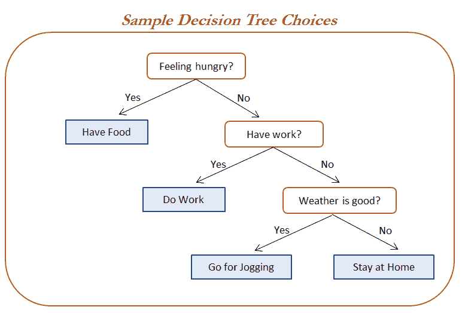
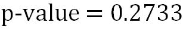
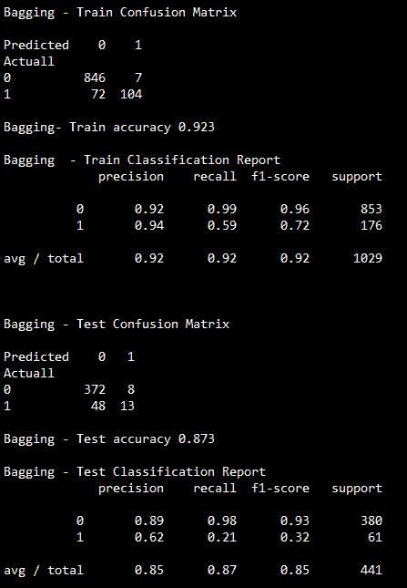
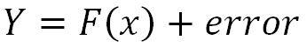

# 第二章：基于树的机器学习模型

基于树的方法的目标是将特征空间划分为多个简单的矩形区域，从而根据所属区域的训练样本的均值或众数（回归问题使用均值，分类问题使用众数）对给定的观测值进行预测。与大多数其他分类器不同，决策树生成的模型易于解释。在本章中，我们将通过人力资源数据的示例，介绍以下基于决策树的模型，用于预测某个员工是否会在近期离开公司。本章将学习以下内容：

+   决策树 - 简单模型及带类别权重调优的模型

+   自助聚合（Bagging）

+   随机森林 - 基础随机森林及超参数调优的网格搜索应用

+   提升方法（AdaBoost、梯度提升、极端梯度提升 - XGBoost）

+   集成的集成（包括异质和同质模型）

# 介绍决策树分类器

决策树分类器生成的规则是简单的英语句子，易于解释，并可直接呈现给高级管理层，无需编辑。决策树可以应用于分类或回归问题。根据数据中的特征，决策树模型学习一系列问题，以推断样本的类别标签。

在下图中，程序员自己设计了简单的递归决策规则，以根据每个问题的回答（是或否）执行相应的操作。



# 决策树中使用的术语

与逻辑回归相比，决策树的复杂度较低。这里有一些指标需要研究。我们将主要关注杂乱度度量；决策树基于设定的杂乱度标准递归地划分变量，直到达到某些停止标准（每个终端节点的最小观测数、任意节点的最小划分观测数等）。

+   **熵：** 熵来源于信息论，是数据杂乱度的度量。如果样本完全同质，则熵为零；如果样本均匀分布，则熵为一。在决策树中，具有最大异质性的预测变量会被视为最接近根节点的特征，用贪婪方式将给定数据分类。我们将在本章中更深入地讨论这一主题：


其中 n = 类别数。熵在中间最大，值为*1*，在极端情况下最小，值为*0*。低熵值是理想的，因为它能够更好地区分类别。

+   **信息增益：** 信息增益是根据给定属性对示例进行分区所导致的熵减少的期望值。这个想法是从混合类开始，并继续分区，直到每个节点达到其最纯净类别的观察值。在每个阶段，以贪婪的方式选择具有最大信息增益的变量。

*信息增益 = 父节点熵 - 总和（加权% * 子节点熵）*

*加权% = 特定子节点中的观察次数/所有子节点中的观察次数之和*

+   **基尼：** 基尼不纯度是一种多类分类器上的误分类度量。基尼的工作方式类似于熵，只是基尼的计算速度更快：


其中 *i = 类别数*。Gini 和熵之间的相似性如下图所示：


# 决策树的工作方法从第一原则开始

在下面的例子中，响应变量只有两类：是否打网球。但是下表是基于记录在不同天气条件下的各种情况编制的。现在，我们的任务是找出哪些输出变量最显著地导致了：是或否。

1.  该示例属于分类树：

| **日期** | **外观** | **温度** | **湿度** | **风** | **打网球** |
| --- | --- | --- | --- | --- | --- |
| D1 | 晴天 | 炎热 | 高 | 弱 | 否 |
| D2 | 晴天 | 炎热 | 高 | 强 | 否 |
| D3 | 阴天 | 炎热 | 高 | 弱 | 是 |
| D4 | 下雨 | 温和 | 高 | 弱 | 是 |
| D5 | 下雨 | 凉爽 | 正常 | 弱 | 是 |
| D6 | 下雨 | 凉爽 | 正常 | 强 | 否 |
| D7 | 阴天 | 凉爽 | 正常 | 强 | 是 |
| D8 | 晴天 | 温和 | 高 | 弱 | 否 |
| D9 | 晴天 | 凉爽 | 正常 | 弱 | 是 |
| D10 | 下雨 | 温和 | 正常 | 弱 | 是 |
| D11 | 晴天 | 温和 | 正常 | 强 | 是 |
| D12 | 阴天 | 温和 | 高 | 强 | 是 |
| D13 | 阴天 | 炎热 | 正常 | 弱 | 是 |
| D14 | 下雨 | 温和 | 高 | 强 | 否 |

1.  以湿度变量为例来对 Play Tennis 字段进行分类：

    +   **CHAID：** 湿度有两个类别，我们的期望值应该均匀分布，以便计算变量的区分度：


计算*x²*（卡方）值：


*计算自由度 = (r-1) * (c-1)*

其中 r = 行组件数/变量类别数，C = 响应变量数。

这里有两个行类别（高和正常）和两个列类别（否和是）。

因此 = *(2-1) * (2-1) = 1*

卡方检验的 p 值为 2.8，自由度为 1 = 0.0942

可以使用以下 Excel 公式获得 p 值：*= CHIDIST (2.8, 1) = 0.0942*

类似地，我们将计算所有变量的*p 值*，并选择具有较低 p 值的最佳变量。

+   **熵：**

熵 = - Σ p * log [2] p


以类似的方式，我们将计算所有变量的*信息增益*，并选择具有*最高信息增益*的最佳变量。

+   **GINI：**

*基尼 = 1- Σp²*


以类似的方式，我们将计算所有变量的*期望基尼值*，并选择具有*最低期望值*的最佳变量。

为了更好地理解，我们也将对风速变量进行类似的计算：

+   **CHAID：** 风速有两个类别，我们的期望值应该均匀分布，以便计算该变量的区分度：



+   **ENTROPY：**


+   **GINI：**


现在我们将比较这两个变量在所有三个指标中的表现，以便更好地理解它们。

| 变量 | CHAID（p 值） | 熵信息增益 | 基尼期望值 |
| --- | --- | --- | --- |
| 湿度 | 0.0942 | 0.1518 | 0.3669 |
| 风速 | 0.2733 | 0.0482 | 0.4285 |
| 更好 | 低价值 | 高价值 | 低价值 |

对于所有三个计算，湿度被证明比风速更适合作为分类器。因此，我们可以确认所有方法传达了类似的信息。

# 逻辑回归与决策树的比较

在深入了解决策树的编码细节之前，我们将快速比较逻辑回归和决策树之间的差异，以便了解哪个模型更好，以及为什么更好。

| 逻辑回归 | 决策树 |
| --- | --- |
| 逻辑回归模型看起来像是独立变量与其因变量之间的方程式。 | 决策树生成的是简单的英语句子的规则，可以轻松向高层管理人员解释。 |
| 逻辑回归是一种参数模型，在这种模型中，通过将参数乘以独立变量来预测因变量。 | 决策树是一种非参数模型，不存在预先假定的参数。隐式地执行变量筛选或特征选择。 |
| 对响应（或因变量）做出假设，采用二项分布或伯努利分布。 | 不对数据的潜在分布做任何假设。 |
| 模型的形状是预定义的（逻辑曲线）。 | 模型的形状不是预定义的；模型根据数据进行最佳分类。 |
| 当自变量是连续的且满足线性关系时，提供非常好的结果。 | 当大多数变量是类别型时，提供最佳结果。 |
| 很难找到变量之间的复杂交互（变量之间的非线性关系）。 | 参数之间的非线性关系不会影响树的性能。决策树常常能够揭示复杂的交互关系。决策树能够处理具有高度偏态或多峰分布的数值数据，以及具有序数或非序数结构的类别预测变量。 |
| 异常值和缺失值会降低逻辑回归的性能。 | 决策树优雅地处理异常值和缺失值。 |

# 比较不同模型样式下的误差组成

需要评估误差，以衡量模型的有效性，并通过调整不同的参数进一步提高模型的性能。误差组成包括偏差成分、方差成分和纯白噪声：


以下三个区域中：

+   第一个区域具有高偏差和低方差的误差组成。在这个区域，模型非常健壮，例如线性回归或逻辑回归。

+   而第三个区域具有高方差和低偏差的误差组成，在该区域，模型表现出高度的不稳定性和变化，类似于决策树，但由于形状变化的巨大变异性，这些模型往往会在训练数据上过拟合，并在测试数据上表现较差。

+   最后但同样重要的是，中间区域，也叫做第二区域，是理想的最佳区域，在这个区域，偏差和方差成分适中，导致它产生最低的总误差。


# 采取补救措施，将模型推向理想区域

具有高偏差或高方差误差成分的模型无法产生理想的拟合。因此，必须进行一些改进。在以下图示中，详细展示了所采用的各种方法。以线性回归为例，其会有一个高偏差成分，意味着模型没有足够的灵活性去拟合数据中的一些非线性关系。解决方法之一是将单一的线性模型分解为多个小线性段，并通过在节点处进行约束来拟合这些线段，这也叫做**线性样条**。而决策树则面临高方差问题，意味着即使是*X*值的微小变化也会导致*Y*值的巨大变化，这个问题可以通过决策树的集成方法来解决：


实际上，实施样条函数是一种复杂且不太流行的方法，因为它涉及到许多方程，实践者需要时刻关注这些方程，还需要检查线性假设和其他诊断 KPIs（如 p 值、AIC、多重共线性等）。相反，决策树的集成方法在数据科学界最为流行，类似于装袋法（bagging）、随机森林（random forest）和提升法（boosting），这些内容将在本章的后续部分深入讲解。集成技术通过聚合来自高度变量的单一分类器（如决策树）的结果来解决方差问题。

# HR 流失数据示例

在本节中，我们将使用 IBM Watson 的 HR 流失数据（在获得数据管理员的事先许可后，本书中使用了该数据），该数据已在 Kaggle 数据集中以开源许可证共享，链接为[`www.kaggle.com/pavansubhasht/ibm-hr-analytics-attrition-dataset`](https://www.kaggle.com/pavansubhasht/ibm-hr-analytics-attrition-dataset)，以预测员工是否会流失，依据的自变量是解释性变量：

```py
>>> import pandas as pd 
>>> hrattr_data = pd.read_csv("WA_Fn-UseC_-HR-Employee-Attrition.csv") 

>>> print (hrattr_data.head()) 
```

该数据包含大约 1470 个观测值和 35 个变量，下面显示了前五行数据，以便快速浏览这些变量：


以下代码用于将“是”或“否”类别转换为 1 和 0，以便进行建模，因为 scikit-learn 不能直接在字符/类别变量上拟合模型，因此需要执行虚拟编码以便在模型中使用这些变量：

```py
>>> hrattr_data['Attrition_ind'] = 0 
>>> hrattr_data.loc[hrattr_data['Attrition'] =='Yes', 'Attrition_ind'] = 1 
```

为所有七个类别变量（按字母顺序排列）创建了虚拟变量，这些类别变量包括`Business Travel`（商务旅行）、`Department`（部门）、`Education Field`（教育领域）、`Gender`（性别）、`Job Role`（职位）、`Marital Status`（婚姻状况）和`Overtime`（加班）。我们忽略了分析中的四个变量，因为它们在所有观测值中没有变化，分别是`Employee count`（员工数量）、`Employee number`（员工编号）、`Over18`（超过 18 岁）和`Standard Hours`（标准工作时间）：

```py
>>> dummy_busnstrvl = pd.get_dummies(hrattr_data['BusinessTravel'], prefix='busns_trvl') 
>>> dummy_dept = pd.get_dummies(hrattr_data['Department'], prefix='dept') 
>>> dummy_edufield = pd.get_dummies(hrattr_data['EducationField'], prefix='edufield') 
>>> dummy_gender = pd.get_dummies(hrattr_data['Gender'], prefix='gend') 
>>> dummy_jobrole = pd.get_dummies(hrattr_data['JobRole'], prefix='jobrole') 
>>> dummy_maritstat = pd.get_dummies(hrattr_data['MaritalStatus'], prefix='maritalstat')  
>>> dummy_overtime = pd.get_dummies(hrattr_data['OverTime'], prefix='overtime')  
```

连续变量被分离，并将在稍后与创建的虚拟变量合并：

```py
>>> continuous_columns = ['Age','DailyRate','DistanceFromHome', 'Education', 'EnvironmentSatisfaction','HourlyRate','JobInvolvement','JobLevel','JobSatisfaction', 'MonthlyIncome', 'MonthlyRate', 'NumCompaniesWorked','PercentSalaryHike',  'PerformanceRating', 'RelationshipSatisfaction','StockOptionLevel', 'TotalWorkingYears', 'TrainingTimesLastYear','WorkLifeBalance', 'YearsAtCompany', 'YearsInCurrentRole', 'YearsSinceLastPromotion','YearsWithCurrManager'] 

>>> hrattr_continuous = hrattr_data[continuous_columns] 
```

在以下步骤中，将从类别变量中衍生出的虚拟变量与直接的连续变量进行合并：

```py
>>> hrattr_data_new = pd.concat([dummy_busnstrvl, dummy_dept, dummy_edufield, dummy_gender, dummy_jobrole, dummy_maritstat, dummy_overtime, hrattr_continuous, hrattr_data['Attrition_ind']],axis=1) 
```

这里，我们没有去除每个类别变量中多余的衍生虚拟变量，因为多重共线性在决策树中并不会像在逻辑回归或线性回归中那样产生问题，因此我们可以简单地利用本章其余部分中的所有衍生变量，因为所有模型都使用决策树作为基础模型，即使是在对其进行集成后也是如此。

一旦基本数据准备好后，需要按 70-30 的比例进行训练和测试数据的划分：

```py
# Train and Test split 
>>> from sklearn.model_selection import train_test_split 
>>> x_train,x_test,y_train,y_test = train_test_split( hrattr_data_new.drop (['Attrition_ind'], axis=1),hrattr_data_new['Attrition_ind'],   train_size = 0.7, random_state=42) 
```

HR 流失数据的 R 语言数据预处理代码：

```py
hrattr_data = read.csv("WA_Fn-UseC_-HR-Employee-Attrition.csv")   
str(hrattr_data);summary(hrattr_data)   
hrattr_data$Attrition_ind = 0;   
hrattr_data$Attrition_ind[   hrattr_data$Attrition=="Yes"]=1   
hrattr_data$Attrition_ind=   as.factor(hrattr_data$Attrition_ind)   

remove_cols = c("EmployeeCount","EmployeeNumber","Over18",   "StandardHours","Attrition")   
hrattr_data_new =   hrattr_data[,!(names(hrattr_data) %in% remove_cols)]   

set.seed(123)   
numrow = nrow(hrattr_data_new)   
trnind = sample(1:numrow,size =   as.integer(0.7*numrow))   
train_data =   hrattr_data_new[trnind,]   
test_data = hrattr_data_new[-trnind,]   
 # Code for calculating   precision, recall for 0 and 1 categories and # at overall level which   will be used in all the classifiers in # later sections   
frac_trzero =   (table(train_data$Attrition_ind)[[1]])/nrow(train_data)   
frac_trone =   (table(train_data$Attrition_ind)[[2]])/nrow(train_data)   

frac_tszero =   (table(test_data$Attrition_ind)[[1]])/nrow(test_data)   
frac_tsone = (table(test_data$Attrition_ind)[[2]])/nrow(test_data)   

prec_zero <-   function(act,pred){  tble = table(act,pred)   
return( round(   tble[1,1]/(tble[1,1]+tble[2,1]),4))}   

prec_one <-   function(act,pred){ tble = table(act,pred)   
return( round(   tble[2,2]/(tble[2,2]+tble[1,2]),4))}   

recl_zero <-   function(act,pred){tble = table(act,pred)   
return( round(   tble[1,1]/(tble[1,1]+tble[1,2]),4))}   

recl_one <-   function(act,pred){ tble = table(act,pred)   
return( round(   tble[2,2]/(tble[2,2]+tble[2,1]),4))}   

accrcy <-   function(act,pred){ tble = table(act,pred)   
return(   round((tble[1,1]+tble[2,2])/sum(tble),4))} 
```

# 决策树分类器

用于建模的`DecisionTreeClassifier`来自 scikit-learn，位于`tree`子模块中：

```py
# Decision Tree Classifier 
>>> from sklearn.tree import DecisionTreeClassifier 
```

以下代码中为决策树分类器选择的参数包括：分割标准为 Gini，最大深度为 5，进行分割所需的最小观测值为 2，终端节点应包含的最小样本数为 1：

```py
 >>> dt_fit = DecisionTreeClassifier(criterion="gini", max_depth=5,min_samples_split=2,  min_samples_leaf=1,random_state=42) 
>>> dt_fit.fit(x_train,y_train) 

>>> print ("\nDecision Tree - Train Confusion  Matrix\n\n", pd.crosstab(y_train, dt_fit.predict(x_train),rownames = ["Actuall"],colnames = ["Predicted"]))    
>>> from sklearn.metrics import accuracy_score, classification_report    
>>> print ("\nDecision Tree - Train accuracy\n\n",round(accuracy_score (y_train, dt_fit.predict(x_train)),3)) 
>>> print ("\nDecision Tree - Train Classification Report\n", classification_report(y_train, dt_fit.predict(x_train))) 

>>> print ("\n\nDecision Tree - Test Confusion Matrix\n\n",pd.crosstab(y_test, dt_fit.predict(x_test),rownames = ["Actuall"],colnames = ["Predicted"])) 
>>> print ("\nDecision Tree - Test accuracy",round(accuracy_score(y_test, dt_fit.predict(x_test)),3)) 
>>> print ("\nDecision Tree - Test Classification Report\n", classification_report( y_test, dt_fit.predict(x_test))) 
```


通过仔细观察结果，我们可以推断，尽管测试准确率较高（84.6%），但“流失 = 是”这一类别的精度和召回率较低（*精度 = 0.39* 和 *召回率 = 0.20*）。当管理层尝试利用该模型在实际流失发生之前，为高流失概率的员工提供额外福利时，这可能会是一个严重问题，因为该模型无法准确识别真正会离开的员工。因此，我们需要寻找其他调整方法；一种方法是通过使用类权重来控制模型。通过使用类权重，我们可以提高特定类别的重要性，代价是增加其他错误的发生。

例如，通过将类权重增加到类别*1*，我们可以识别出更多具有实际流失特征的员工，但这样做会将一些非潜在流失员工标记为潜在流失者（这应当是可以接受的）。

类权重的重要应用的另一个经典例子是银行场景。当发放贷款时，拒绝一些好的申请总比接受坏的贷款要好。因此，即使在这种情况下，将违约者的权重大于非违约者也是一个更好的选择：

在人力资源流失数据上应用决策树分类器的 R 代码：

```py
# Decision Trees using C5.0   package   
library(C50)   
dtree_fit = C5.0(train_data[-31],train_data$Attrition_ind,costs   = NULL,control = C5.0Control(minCases = 1))   
summary(dtree_fit)   
tr_y_pred = predict(dtree_fit,   train_data,type = "class")   
ts_y_pred =   predict(dtree_fit,test_data,type = "class")   
tr_y_act =   train_data$Attrition_ind;ts_y_act = test_data$Attrition_ind   

tr_tble =   table(tr_y_act,tr_y_pred)   
print(paste("Train   Confusion Matrix"))   
print(tr_tble)   
tr_acc =   accrcy(tr_y_act,tr_y_pred)   
trprec_zero =   prec_zero(tr_y_act,tr_y_pred);    
trrecl_zero =   recl_zero(tr_y_act,tr_y_pred)   
trprec_one =   prec_one(tr_y_act,tr_y_pred);    
trrecl_one =   recl_one(tr_y_act,tr_y_pred)   
trprec_ovll = trprec_zero *frac_trzero   + trprec_one*frac_trone   
trrecl_ovll = trrecl_zero   *frac_trzero + trrecl_one*frac_trone   

print(paste("Decision Tree   Train accuracy:",tr_acc))   
print(paste("Decision Tree   - Train Classification Report"))   
print(paste("Zero_Precision",trprec_zero,"Zero_Recall",trrecl_zero))   
print(paste("One_Precision",trprec_one,"One_Recall",trrecl_one))   
print(paste("Overall_Precision",round(trprec_ovll,4),"Overall_Recall",   
round(trrecl_ovll,4)))   
 ts_tble =   table(ts_y_act,ts_y_pred)   
print(paste("Test   Confusion Matrix"))   
print(ts_tble)   

ts_acc =   accrcy(ts_y_act,ts_y_pred)   
tsprec_zero =   prec_zero(ts_y_act,ts_y_pred); tsrecl_zero = recl_zero(ts_y_act,ts_y_pred)   
tsprec_one =   prec_one(ts_y_act,ts_y_pred); tsrecl_one = recl_one(ts_y_act,ts_y_pred)   

tsprec_ovll = tsprec_zero *frac_tszero   + tsprec_one*frac_tsone   
tsrecl_ovll = tsrecl_zero   *frac_tszero + tsrecl_one*frac_tsone   

print(paste("Decision Tree   Test accuracy:",ts_acc))   
print(paste("Decision Tree   - Test Classification Report"))   
print(paste("Zero_Precision",tsprec_zero,"Zero_Recall",tsrecl_zero))   
print(paste("One_Precision",tsprec_one,"One_Recall",tsrecl_one))   
print(paste("Overall_Precision",round(tsprec_ovll,4),   
"Overall_Recall",round(tsrecl_ovll,4))) 
```

# 调整决策树分类器中的类权重

在下面的代码中，调整了类权重，以观察决策树在相同参数下性能的变化。创建了一个虚拟数据框，以保存各种精度-召回细节组合的结果：

```py
>>> dummyarray = np.empty((6,10))
>>> dt_wttune = pd.DataFrame(dummyarray)
```

需要考虑的指标包括零类别和一类别的权重（例如，如果零类别的权重为 0.2，则一类别的权重应自动为 0.8，因为总权重应等于 1）、训练和测试准确率、零类别和一类别的精度，以及整体精度。同样，也计算零类别和一类别的召回率，以及整体召回率：

```py
>>> dt_wttune.columns = ["zero_wght","one_wght","tr_accuracy", "tst_accuracy", "prec_zero","prec_one", "prec_ovll", "recl_zero","recl_one","recl_ovll"] 
```

零类别的权重范围从 0.01 到 0.5 进行验证，因为我们知道我们不想探索将零类别的权重设置得比一类别更高的情况：

```py
>>> zero_clwghts = [0.01,0.1,0.2,0.3,0.4,0.5] 

>>> for i in range(len(zero_clwghts)): 
...    clwght = {0:zero_clwghts[i],1:1.0-zero_clwghts[i]} 
...    dt_fit = DecisionTreeClassifier(criterion="gini",  max_depth=5,               ... min_samples_split=2, min_samples_leaf=1,random_state=42,class_weight = clwght) 
...    dt_fit.fit(x_train,y_train) 
...    dt_wttune.loc[i, 'zero_wght'] = clwght[0]        
...    dt_wttune.loc[i, 'one_wght'] = clwght[1]      
...    dt_wttune.loc[i, 'tr_accuracy'] = round(accuracy_score(y_train, dt_fit.predict( x_train)),3)     
...    dt_wttune.loc[i, 'tst_accuracy'] = round(accuracy_score(y_test,dt_fit.predict( x_test)),3)     

...    clf_sp = classification_report(y_test,dt_fit.predict(x_test)).split() 
...    dt_wttune.loc[i, 'prec_zero'] = float(clf_sp[5])    
...    dt_wttune.loc[i, 'prec_one'] = float(clf_sp[10])    
...    dt_wttune.loc[i, 'prec_ovll'] = float(clf_sp[17])    

...    dt_wttune.loc[i, 'recl_zero'] = float(clf_sp[6])    
...    dt_wttune.loc[i, 'recl_one'] = float(clf_sp[11])    
...    dt_wttune.loc[i, 'recl_ovll'] = float(clf_sp[18]) 
...    print ("\nClass Weights",clwght,"Train accuracy:",round(accuracy_score( y_train,dt_fit.predict(x_train)),3),"Test accuracy:",round(accuracy_score(y_test, dt_fit.predict(x_test)),3)) 
...    print ("Test Confusion Matrix\n\n",pd.crosstab(y_test,dt_fit.predict( x_test),rownames = ["Actuall"],colnames = ["Predicted"])) 
```


从上面的截图中，我们可以看到，在类权重值为 0.3（对于零类）和 0.7（对于一类）时，它能识别出更多的流失者（61 个中有 25 个），且不影响测试准确率（83.9%），使用的是决策树方法：

在人力资源流失数据上应用类权重的决策树分类器 R 代码：

```py
#Decision Trees using C5.0   package - Error Costs   
library(C50)   
class_zero_wgt =   c(0.01,0.1,0.2,0.3,0.4,0.5)   

for (cwt in class_zero_wgt){   
  cwtz = cwt   
  cwto = 1-cwtz   
  cstvr = cwto/cwtz     
  error_cost <- matrix(c(0,   1, cstvr, 0), nrow = 2)     
  dtree_fit = C5.0(train_data[-31],train_data$Attrition_ind, 
 costs = error_cost,control = C5.0Control(  minCases =   1))   
  summary(dtree_fit)     
  tr_y_pred =   predict(dtree_fit, train_data,type = "class")   
  ts_y_pred =   predict(dtree_fit,test_data,type = "class")   

  tr_y_act =   train_data$Attrition_ind;   
  ts_y_act =   test_data$Attrition_ind   
  tr_acc =   accrcy(tr_y_act,tr_y_pred)   
  ts_acc =   accrcy(ts_y_act,ts_y_pred)     

  print(paste("Class   weights","{0:",cwtz,"1:",cwto,"}",   
              "Decision   Tree Train accuracy:",tr_acc,   
              "Decision   Tree Test accuracy:",ts_acc))   
  ts_tble =   table(ts_y_act,ts_y_pred)   
  print(paste("Test   Confusion Matrix"))   
  print(ts_tble)    
} 
```

# Bagging 分类器

正如我们之前讨论过的，决策树存在较高的方差，这意味着如果我们将训练数据随机分成两部分，并为每个样本拟合两棵决策树，那么得到的规则将会非常不同。而低方差和高偏差的模型，例如线性回归或逻辑回归，在两个样本上会产生相似的结果。Bagging 是自助聚合（带替换的重复采样并执行结果聚合，准确来说），它是一种通用的方法，旨在减少模型的方差。在这个例子中，所使用的模型是决策树。

聚合能够减少方差，例如，当我们有 n 个独立观测值 *x[1], x[2], ..., x[n]* 每个观测值的方差为 *σ²* 时，所有观测值均值 *x̅* 的方差为 *σ²/n*，这表明通过平均一组观测值可以减少方差。在这里，我们通过从训练数据中抽取多个样本（也称为自助采样），为每个样本分别构建决策树，对回归问题取平均，对分类问题计算众数，从而得到一个低方差的单一模型，既有低偏差又有低方差：


在 Bagging 过程中，行是被抽样的，而所有列/变量都被选择（而在随机森林中，行和列都会被抽样，我们将在下一节中讲解）。在下图中，两种颜色（粉色和蓝色）代表两种样本，对于每个样本，一些行被抽取，但每次都选择所有的列（变量）。由于选择了所有列，存在一个问题，即大多数树会描述相同的故事，其中最重要的变量会最初出现在分裂中，并在所有树中重复出现，这样就无法产生去相关的树，因此在应用方差减少时可能无法得到更好的性能。在随机森林中（我们将在下一节讲解），我们将同时抽取行和列，避免了这个问题：


在以下代码中，我们使用相同的 HR 数据来拟合 Bagging 分类器，以便在决策树的比较中做到公正：

```py
# Bagging Classifier 
>>> from sklearn.tree import DecisionTreeClassifier
>>> from sklearn.ensemble import BaggingClassifier
```

这里使用的基础分类器是决策树，参数设置与我们在决策树示例中使用的一致：

```py
>>> dt_fit = DecisionTreeClassifier(criterion="gini", max_depth=5,min_samples_split=2, min_samples_leaf=1,random_state=42,class_weight = {0:0.3,1:0.7}) 
```

Bagging 中使用的参数为，`n_estimators`表示使用的单个决策树数量为 5,000，最大样本和特征分别选择 0.67 和 1.0，这意味着每棵树将选择 2/3 的观测值和所有特征。有关更多详细信息，请参考 scikit-learn 手册：[`scikit-learn.org/stable/modules/generated/sklearn.ensemble.BaggingClassifier.html`](http://scikit-learn.org/stable/modules/generated/sklearn.ensemble.BaggingClassifier.html)：

```py
>>> bag_fit = BaggingClassifier(base_estimator= dt_fit,n_estimators=5000, max_samples=0.67, 
...              max_features=1.0,bootstrap=True, 
...              bootstrap_features=False, n_jobs=-1,random_state=42) 

>>> bag_fit.fit(x_train, y_train) 

>>> print ("\nBagging - Train Confusion Matrix\n\n",pd.crosstab(y_train, bag_fit.predict(x_train),rownames = ["Actuall"],colnames = ["Predicted"]))       
>>> print ("\nBagging- Train accuracy",round(accuracy_score(y_train, bag_fit.predict(x_train)),3))  
>>> print ("\nBagging  - Train Classification Report\n",classification_report(y_train, bag_fit.predict(x_train))) 

>>> print ("\n\nBagging - Test Confusion Matrix\n\n",pd.crosstab(y_test, bag_fit.predict(x_test),rownames = ["Actuall"],colnames = ["Predicted"]))       
>>> print ("\nBagging - Test accuracy",round(accuracy_score(y_test, bag_fit.predict(x_test)),3)) 
>>> print ("\nBagging - Test Classification Report\n",classification_report(y_test, bag_fit.predict(x_test)))
```



在分析了 Bagging 的结果后，测试准确率为 87.3%，而决策树的准确率为 84.6%。比较实际流失员工的识别数量，Bagging 方法识别了 13 名，而决策树识别了 12 名，但将 0 分类为 1 的数量显著减少，Bagging 为 8，而决策树为 19。总体而言，Bagging 方法提高了单棵树的性能：

应用于 HR 流失数据的 Bagging 分类器的 R 代码：

```py
# Bagging Classifier - using   Random forest package but all variables selected   
library(randomForest)   
set.seed(43)   
rf_fit = randomForest(Attrition_ind~.,data   = train_data,mtry=30,maxnodes= 64,classwt = c(0.3,0.7), ntree=5000,nodesize =   1)   
tr_y_pred = predict(rf_fit,data   = train_data,type = "response")   
ts_y_pred =   predict(rf_fit,newdata = test_data,type = "response")   
tr_y_act = train_data$Attrition_ind;ts_y_act   = test_data$Attrition_ind   

tr_tble =   table(tr_y_act,tr_y_pred)   
print(paste("Train   Confusion Matrix"))   
print(tr_tble)   
tr_acc =   accrcy(tr_y_act,tr_y_pred)   
trprec_zero =   prec_zero(tr_y_act,tr_y_pred); trrecl_zero = recl_zero(tr_y_act,tr_y_pred)   
trprec_one =   prec_one(tr_y_act,tr_y_pred);    
trrecl_one =   recl_one(tr_y_act,tr_y_pred)   
trprec_ovll = trprec_zero   *frac_trzero + trprec_one*frac_trone   
trrecl_ovll = trrecl_zero   *frac_trzero + trrecl_one*frac_trone   
print(paste("Random Forest   Train accuracy:",tr_acc))   
print(paste("Random Forest   - Train Classification Report"))   
print(paste("Zero_Precision",trprec_zero,"Zero_Recall",trrecl_zero))   
print(paste("One_Precision",trprec_one,"One_Recall",trrecl_one))   
print(paste("Overall_Precision",round(trprec_ovll,4),"Overall_Recall",   
round(trrecl_ovll,4)))   

ts_tble =   table(ts_y_act,ts_y_pred)   
print(paste("Test   Confusion Matrix"))   
print(ts_tble)   
ts_acc =   accrcy(ts_y_act,ts_y_pred)   
tsprec_zero =   prec_zero(ts_y_act,ts_y_pred); tsrecl_zero = recl_zero(ts_y_act,ts_y_pred)   
tsprec_one =   prec_one(ts_y_act,ts_y_pred);    
tsrecl_one =   recl_one(ts_y_act,ts_y_pred)   
tsprec_ovll = tsprec_zero   *frac_tszero + tsprec_one*frac_tsone   
tsrecl_ovll = tsrecl_zero   *frac_tszero + tsrecl_one*frac_tsone   
print(paste("Random Forest   Test accuracy:",ts_acc))   
print(paste("Random Forest   - Test Classification Report"))   
print(paste("Zero_Precision",tsprec_zero,"Zero_Recall",tsrecl_zero))   
print(paste("One_Precision",tsprec_one,"One_Recall",tsrecl_one))   
print(paste("Overall_Precision",round(tsprec_ovll,4),"Overall_Recall",   
round(tsrecl_ovll,4))) 
```

# 随机森林分类器

随机森林通过一个小的调整，利用去相关的树，提供了对 Bagging 的改进。在 Bagging 中，我们基于训练数据的自助抽样构建了多个决策树，但 Bagging 方法的一个大缺点是它选择了所有变量。通过这样做，在每棵决策树中，选择用于划分的候选变量的顺序对于所有个体树来说基本相同，因此它们看起来相互之间相关。在聚合它们时，相关个体的方差减少效果不明显。

在随机森林中，进行自助抽样（带替换的重复采样）时，从训练数据中抽取样本；不仅仅是像 Bagging 那样随机选择第二和第三个观测值，它还从所有预测变量中选择少量预测变量/列（从总 p 个预测变量中选择 m 个预测变量）。

从总变量中选择*m*个变量的拇指法则是，分类问题中*m = sqrt(p)*，回归问题中*m = p/3*，目的是随机选择以避免个体树之间的相关性。通过这样做，可以显著提高准确性。这种 RF 的能力使其成为数据科学社区最喜欢的算法之一，作为跨各种竞赛的获胜秘诀，甚至用于解决各行业的实际问题。

在下面的图示中，不同的颜色代表不同的自助样本。在第一个样本中，选择了第 1、第 3、第 4 和第 7 列，而在第二个自助样本中，选择了第 2、第 3、第 4 和第 5 列。通过这种方式，可以随机选择任何列，无论它们是否相邻。虽然给出了*sqrt (p)*或*p/3*的拇指法则，但建议读者调整要选择的预测变量数量：


样本图显示了在改变所选参数时，测试误差变化的影响，可以明显看出，*m = sqrt(p)*的情形在测试数据上的表现优于*m = p*（我们可以称之为袋装法）：


这里为了说明，使用了来自`scikit-learn`包的随机森林分类器：

```py
# Random Forest Classifier 
>>> from sklearn.ensemble import RandomForestClassifier 
```

随机森林中使用的参数有：`n_estimators`表示使用的单个决策树数量为 5000，选择的最大特征为*auto*，这意味着它将自动选择*sqrt(p)*用于分类，*p/3*用于回归。但这里是一个直接的分类问题。每个叶子的最小样本数提供了终端节点中所需的最小观察值数：

```py
>>> rf_fit = RandomForestClassifier(n_estimators=5000,criterion="gini", max_depth=5, min_samples_split=2,bootstrap=True,max_features='auto',random_state=42, min_samples_leaf=1,class_weight = {0:0.3,1:0.7}) 
>>> rf_fit.fit(x_train,y_train)        

>>> print ("\nRandom Forest - Train Confusion Matrix\n\n",pd.crosstab(y_train, rf_fit.predict(x_train),rownames = ["Actuall"],colnames = ["Predicted"]))       
>>> print ("\nRandom Forest - Train accuracy",round(accuracy_score(y_train, rf_fit.predict(x_train)),3)) 
>>> print ("\nRandom Forest  - Train Classification Report\n",classification_report( y_train, rf_fit.predict(x_train))) 

>>> print ("\n\nRandom Forest - Test Confusion Matrix\n\n",pd.crosstab(y_test, rf_fit.predict(x_test),rownames = ["Actuall"],colnames = ["Predicted"]))       
>>> print ("\nRandom Forest - Test accuracy",round(accuracy_score(y_test, rf_fit.predict(x_test)),3)) 
>>> print ("\nRandom Forest - Test Classification Report\n",classification_report( y_test, rf_fit.predict(x_test))) 
```


随机森林分类器产生了 87.8%的测试准确度，而袋装法为 87.3%，同时识别出 14 名实际离职的员工，而袋装法则识别出了 13 名离职员工：

```py
# Plot of Variable importance by mean decrease in gini 
>>> model_ranks = pd.Series(rf_fit.feature_importances_,index=x_train.columns, name='Importance').sort_values(ascending=False, inplace=False) 
>>> model_ranks.index.name = 'Variables' 
>>> top_features = model_ranks.iloc[:31].sort_values(ascending=True,inplace=False) 
>>> import matplotlib.pyplot as plt 
>>> plt.figure(figsize=(20,10)) 
>>> ax = top_features.plot(kind='barh') 
>>> _ = ax.set_title("Variable Importance Plot") 
>>> _ = ax.set_xlabel('Mean decrease in Variance') 
>>> _ = ax.set_yticklabels(top_features.index, fontsize=13) 
```


从变量重要性图来看，月收入变量似乎是最重要的，其次是加班、总工作年限、股票期权等级、公司年限等等。这为我们提供了一些洞察，帮助我们了解哪些主要因素决定了员工是否会留在公司或离开组织：

应用于 HR 离职数据的随机森林分类器的 R 代码：

```py
# Random Forest   
library(randomForest)   
set.seed(43)   
rf_fit =   randomForest(Attrition_ind~.,data = train_data,mtry=6, maxnodes= 64,classwt =   c(0.3,0.7),ntree=5000,nodesize = 1)   
tr_y_pred = predict(rf_fit,data   = train_data,type = "response")   
ts_y_pred =   predict(rf_fit,newdata = test_data,type = "response")   
tr_y_act =   train_data$Attrition_ind;ts_y_act = test_data$Attrition_ind   
tr_tble =   table(tr_y_act,tr_y_pred)   
print(paste("Train   Confusion Matrix"))   
print(tr_tble)   
tr_acc =   accrcy(tr_y_act,tr_y_pred)   
trprec_zero = prec_zero(tr_y_act,tr_y_pred);   trrecl_zero = recl_zero(tr_y_act,tr_y_pred)   
trprec_one =   prec_one(tr_y_act,tr_y_pred); trrecl_one = recl_one(tr_y_act,tr_y_pred)   
trprec_ovll = trprec_zero   *frac_trzero + trprec_one*frac_trone   
trrecl_ovll = trrecl_zero   *frac_trzero + trrecl_one*frac_trone   

print(paste("Random Forest   Train accuracy:",tr_acc))   
print(paste("Random Forest   - Train Classification Report"))   
print(paste("Zero_Precision",trprec_zero,"Zero_Recall",trrecl_zero))   
print(paste("One_Precision",trprec_one,"One_Recall",trrecl_one))   
print(paste("Overall_Precision",round(trprec_ovll,4),"Overall_Recall",round(trrecl_ovll,4)))   
ts_tble =   table(ts_y_act,ts_y_pred)   
print(paste("Test   Confusion Matrix"))   
print(ts_tble)   
ts_acc =   accrcy(ts_y_act,ts_y_pred)   
tsprec_zero = prec_zero(ts_y_act,ts_y_pred);   tsrecl_zero = recl_zero(ts_y_act,ts_y_pred)   
tsprec_one =   prec_one(ts_y_act,ts_y_pred); tsrecl_one = recl_one(ts_y_act,ts_y_pred)   
tsprec_ovll = tsprec_zero   *frac_tszero + tsprec_one*frac_tsone   
tsrecl_ovll = tsrecl_zero   *frac_tszero + tsrecl_one*frac_tsone   

print(paste("Random Forest   Test accuracy:",ts_acc))   
print(paste("Random Forest   - Test Classification Report"))   
print(paste("Zero_Precision",tsprec_zero,"Zero_Recall",tsrecl_zero))   
print(paste("One_Precision",tsprec_one,"One_Recall",tsrecl_one))   
print(paste("Overall_Precision",round(tsprec_ovll,4),"Overall_Recall",round(tsrecl_ovll,4)))   
```

# 随机森林分类器 - 网格搜索

在机器学习模型中，调整参数起着至关重要的作用。这里展示了一个网格搜索示例，演示如何调整随机森林模型：

```py
# Random Forest Classifier - Grid Search 
>>> from sklearn.pipeline import Pipeline 
>>> from sklearn.model_selection import train_test_split,GridSearchCV 

>>> pipeline = Pipeline([ ('clf',RandomForestClassifier(criterion='gini',class_weight = {0:0.3,1:0.7}))]) 
```

调整参数与随机森林的参数类似，除了使用管道函数验证所有组合。需要评估的组合数量将是*(3 x 3 x 2 x 2) *5 =36*5 = 180*个组合。这里最终使用 5，是因为五折交叉验证：

```py
>>> parameters = { 
...         'clf__n_estimators':(2000,3000,5000), 
...         'clf__max_depth':(5,15,30), 
...         'clf__min_samples_split':(2,3), 
...         'clf__min_samples_leaf':(1,2)  } 

>>> grid_search = GridSearchCV(pipeline,parameters,n_jobs=-1,cv=5,verbose=1, scoring='accuracy') 
>>> grid_search.fit(x_train,y_train) 

>>> print ('Best Training score: %0.3f' % grid_search.best_score_) 
>>> print ('Best parameters set:') 
>>> best_parameters = grid_search.best_estimator_.get_params()  
>>> for param_name in sorted(parameters.keys()): 
...     print ('\t%s: %r' % (param_name, best_parameters[param_name])) 

>>> predictions = grid_search.predict(x_test) 

>>> print ("Testing accuracy:",round(accuracy_score(y_test, predictions),4)) 
>>> print ("\nComplete report of Testing data\n",classification_report(y_test, predictions)) 
```

```py
>>> print ("\n\nRandom Forest Grid Search- Test Confusion Matrix\n\n",pd.crosstab( y_test, predictions,rownames = ["Actuall"],colnames = ["Predicted"]))      
```


在前面的结果中，网格搜索似乎没有提供比已经探索过的随机森林结果更多的优势。但是，实际上，大多数情况下，它会提供比简单模型探索更好、更强大的结果。然而，通过仔细评估多种不同的组合，它最终会发现最佳的参数组合：

应用于 HR 离职数据的带有网格搜索的随机森林分类器的 R 代码：

```py
# Grid Search - Random Forest   
library(e1071)   
library(randomForest)   
rf_grid =   tune(randomForest,Attrition_ind~.,data = train_data,classwt =   c(0.3,0.7),ranges = list( mtry = c(5,6),   
  maxnodes = c(32,64), ntree =   c(3000,5000), nodesize = c(1,2)   
),   
tunecontrol =   tune.control(cross = 5) )   
print(paste("Best   parameter from Grid Search"))   
print(summary(rf_grid))   
best_model = rf_grid$best.model   
tr_y_pred=predict(best_model,data   = train_data,type ="response")   
ts_y_pred=predict(best_model,newdata   = test_data,type= "response")   

tr_y_act =   train_data$Attrition_ind;   
ts_y_act= test_data$Attrition_ind   

tr_tble =   table(tr_y_act,tr_y_pred)   
print(paste("Random Forest   Grid search Train Confusion Matrix"))   
print(tr_tble)   
tr_acc =   accrcy(tr_y_act,tr_y_pred)   
trprec_zero =   prec_zero(tr_y_act,tr_y_pred); trrecl_zero = recl_zero(tr_y_act,tr_y_pred)   
trprec_one =   prec_one(tr_y_act,tr_y_pred); trrecl_one = recl_one(tr_y_act,tr_y_pred)   
trprec_ovll = trprec_zero   *frac_trzero + trprec_one*frac_trone   
trrecl_ovll = trrecl_zero   *frac_trzero + trrecl_one*frac_trone   

print(paste("Random Forest   Grid Search Train accuracy:",tr_acc))   
print(paste("Random Forest   Grid Search - Train Classification Report"))   
print(paste("Zero_Precision",trprec_zero,"Zero_Recall",trrecl_zero))   
print(paste("One_Precision",trprec_one,"One_Recall",trrecl_one))   
print(paste("Overall_Precision",round(trprec_ovll,4),"Overall_Recall",round(trrecl_ovll,4)))   

ts_tble =   table(ts_y_act,ts_y_pred)   
print(paste("Random Forest   Grid search Test Confusion Matrix"))   
print(ts_tble)   
ts_acc =   accrcy(ts_y_act,ts_y_pred)   
tsprec_zero =   prec_zero(ts_y_act,ts_y_pred); tsrecl_zero = recl_zero(ts_y_act,ts_y_pred)   
tsprec_one =   prec_one(ts_y_act,ts_y_pred); tsrecl_one = recl_one(ts_y_act,ts_y_pred)   
tsprec_ovll = tsprec_zero   *frac_tszero + tsprec_one*frac_tsone   
tsrecl_ovll = tsrecl_zero   *frac_tszero + tsrecl_one*frac_tsone   

print(paste("Random Forest   Grid Search Test accuracy:",ts_acc))   
print(paste("Random Forest   Grid Search - Test Classification Report"))   
print(paste("Zero_Precision",tsprec_zero,"Zero_Recall",tsrecl_zero))   
print(paste("One_Precision",tsprec_one,"One_Recall",tsrecl_one))   
print(paste("Overall_Precision",round(tsprec_ovll,4),"Overall_Recall",round(tsrecl_ovll,4)))
```

# AdaBoost 分类器

Boosting 是一种当前许多数据科学家在多个竞赛中获胜的前沿模型。在本节中，我们将介绍 **AdaBoost** 算法，随后介绍 **梯度提升** 和 **极端梯度提升**（**XGBoost**）。Boosting 是一种通用方法，可以应用于许多统计模型。然而，在本书中，我们将讨论 Boosting 在决策树中的应用。在 Bagging 中，我们从训练数据中提取多个样本，并将各个树的结果结合起来创建一个单一的预测模型；这种方法是并行运行的，因为每个自助样本不依赖于其他样本。Boosting 是顺序进行的，它不涉及自助抽样；相反，每棵树都是在原始数据集的修改版上拟合的，最终这些树的结果被加起来形成一个强分类器：


上图展示了 AdaBoost 工作原理的示例方法论。我们将在接下来的算法描述中详细介绍逐步流程。最初，一个简单的分类器已经拟合在数据上（也称为决策树桩，它将数据划分为两个区域），在下一次迭代（迭代 2）中，正确分类的类将给予较低的权重，而错误分类的类（观察者 + 蓝色图标）将给予较高的权重，然后再次拟合另一个决策树桩/弱分类器，并且会改变权重以进行下一次迭代（迭代 3，在这里检查 - 符号以查看哪个权重被增加）。一旦完成所有迭代，这些将与权重（根据错误率自动计算的每个分类器的权重）结合，得到一个强分类器，能够以惊人的准确度预测类别。

**AdaBoost 算法包括以下步骤：**

1.  初始化观察值的权重 *w[i] = 1/N, i=1, 2, …, N*。其中 *N = 观察值的数量*。

1.  对于 m = 1 到 M：

    +   使用权重 *w[i]* 将分类器 *Gm(x)* 拟合到训练数据上

    +   计算：


+   +   计算：


+   +   设置：


1.  输出：


所有观察值赋予相同的权重。

在 Bagging 和随机森林算法中，我们处理的是数据的列；而在 Boosting 中，我们调整的是每个观察值的权重，并不会选择一些列。

我们在数据上拟合一个分类器并评估整体错误。用于计算权重的误差应在最终的加法模型中给予该分类器（**α**）评估。直观上，错误较少的模型会给予更高的权重。最后，每个观察值的权重会被更新。在这里，错误分类的观察值会增加权重，以便在接下来的迭代中给予更多关注，而正确分类的观察值的权重会减少。

所有弱分类器与各自的权重相结合，形成一个强分类器。在下图中，展示了与初始迭代相比，在最后一次迭代中权重变化的快速示意：


```py
# Adaboost Classifier 
>>> from sklearn.tree import DecisionTreeClassifier 
>>> from sklearn.ensemble import AdaBoostClassifier 
```

决策树桩被用作 AdaBoost 的基础分类器。如果我们观察以下代码，树的深度保持为 1，表示只能进行一次决策（也视为弱分类器）：

```py
>>> dtree = DecisionTreeClassifier(criterion='gini',max_depth=1) 
```

在 AdaBoost 中，决策树桩被用作基本估计器，拟合整个数据集，然后将分类器的附加副本拟合到同一数据集上，最多重复 5000 次。学习率将每个分类器的贡献缩小 0.05。学习率和估计器数量之间存在权衡。通过仔细选择较低的学习率和较长的估计器数量，可以更好地收敛到最优解，但代价是计算能力的消耗：

```py
>>>adabst_fit = AdaBoostClassifier(base_estimator= dtree,n_estimators=5000,learning_rate=0.05,random_state=42)

>>>adabst_fit.fit(x_train, y_train)
>>>print ("\nAdaBoost - Train Confusion Matrix\n\n", pd.crosstab(y_train, adabst_fit.predict(x_train), rownames = ["Actuall"],colnames = ["Predicted"]))
>>>print ("\nAdaBoost - Train accuracy",round(accuracy_score(y_train,adabst_fit.predict(x_train)), 3))
>>>print ("\nAdaBoost  - Train Classification Report\n",classification_report(y_train,adabst_fit.predict(x_train)))
```


与已知的最佳随机森林分类器相比，AdaBoost 的结果似乎在召回 1 值的表现上要好得多。尽管与最佳准确率 87.8%相比，准确率略微下降至 86.8%，但是随机森林预测出的 1 的数量为 23，而 AdaBoost 为 14，尽管增加了 0 的预测数量，但它在识别实际流失者方面确实取得了显著进展：

在 HR 流失数据上应用的 AdaBoost 分类器的 R 代码：

```py
# Adaboost classifier using   C5.0 with trails included for boosting   
library(C50)   
class_zero_wgt = 0.3   
class_one_wgt = 1-class_zero_wgt   
cstvr =   class_one_wgt/class_zero_wgt   
error_cost <- matrix(c(0, 1,   cstvr, 0), nrow = 2)   
# Fitting Adaboost model     
ada_fit = C5.0(train_data[-31],train_data$Attrition_ind,costs   = error_cost, trails = 5000,control = C5.0Control(minCases = 1))   
summary(ada_fit)   

tr_y_pred = predict(ada_fit,   train_data,type = "class")   
ts_y_pred =   predict(ada_fit,test_data,type = "class")   

tr_y_act =   train_data$Attrition_ind;ts_y_act = test_data$Attrition_ind   

tr_tble = table(tr_y_act,tr_y_pred)   
print(paste("AdaBoost -   Train Confusion Matrix"))   
print(tr_tble)   
tr_acc =   accrcy(tr_y_act,tr_y_pred)   
trprec_zero =   prec_zero(tr_y_act,tr_y_pred); trrecl_zero = recl_zero(tr_y_act,tr_y_pred)   
trprec_one =   prec_one(tr_y_act,tr_y_pred); trrecl_one = recl_one(tr_y_act,tr_y_pred)   
trprec_ovll = trprec_zero   *frac_trzero + trprec_one*frac_trone   
trrecl_ovll = trrecl_zero   *frac_trzero + trrecl_one*frac_trone   
print(paste("AdaBoost   Train accuracy:",tr_acc))   
print(paste("AdaBoost -   Train Classification Report"))   
print(paste("Zero_Precision",trprec_zero,"Zero_Recall",trrecl_zero))   
print(paste("One_Precision",trprec_one,"One_Recall",trrecl_one))   
print(paste("Overall_Precision",round(trprec_ovll,4),"Overall_Recall",round(trrecl_ovll,4)))   

ts_tble =   table(ts_y_act,ts_y_pred)   
print(paste("AdaBoost -   Test Confusion Matrix"))   
print(ts_tble)   

ts_acc =   accrcy(ts_y_act,ts_y_pred)   
tsprec_zero =   prec_zero(ts_y_act,ts_y_pred); tsrecl_zero = recl_zero(ts_y_act,ts_y_pred)   
tsprec_one =   prec_one(ts_y_act,ts_y_pred); tsrecl_one = recl_one(ts_y_act,ts_y_pred)   

tsprec_ovll = tsprec_zero   *frac_tszero + tsprec_one*frac_tsone   
tsrecl_ovll = tsrecl_zero   *frac_tszero + tsrecl_one*frac_tsone   

print(paste("AdaBoost Test   accuracy:",ts_acc))   
print(paste("AdaBoost -   Test Classification Report"))   
print(paste("Zero_Precision",tsprec_zero,"Zero_Recall",tsrecl_zero))   
print(paste("One_Precision",tsprec_one,"One_Recall",tsrecl_one))   
print(paste("Overall_Precision",round(tsprec_ovll,4),"Overall_Recall",round(tsrecl_ovll,4)))   
```

# 梯度提升分类器

梯度提升是一个在竞争中获胜的算法，它的原理是通过迭代地增强弱学习器，重点关注在前几次迭代中难以预测的有问题的观察数据，并执行弱学习器的集成，通常是决策树。它像其他提升方法一样分阶段构建模型，但通过允许优化任意可微分的损失函数来对这些方法进行泛化。

让我们通过一个简单的例子来理解梯度提升，因为 GB 在工作原理的理解上挑战了许多数据科学家：

1.  最初，我们在观察数据上拟合模型，得到 75%的准确率，其余的未解释方差被捕捉在***错误***项中：



1.  然后，我们将拟合另一个模型来处理误差项，提取额外的解释性成分，并将其加入到原始模型中，这应该会提高整体的准确性：


1.  现在，模型提供了 80%的准确率，方程如下：


1.  我们再继续使用这种方法一次，拟合一个模型到**error2**成分，以提取进一步的解释性成分：


1.  现在，模型的准确性进一步提升至 85%，最终的模型方程如下：


1.  在这里，如果我们使用加权平均（给予预测准确性更高的模型更高的重要性），而不是简单的相加，它将进一步改善结果。事实上，这正是梯度提升算法所做的！


在引入权重后，误差的名称从**error3**变为**error4**，因为这两个误差可能并不完全相同。如果我们找到更好的权重，可能会得到 90%的准确率，而不是简单的相加方法，在相加的情况下我们仅获得 85%的准确率。

**梯度提升包括三个要素：**

+   **需要优化的损失函数：** 损失函数取决于所解决问题的类型。在回归问题中，使用均方误差，而在分类问题中，将使用对数损失。在提升算法中，每个阶段都会优化之前迭代中的未解释损失，而不是从头开始。

+   **弱学习器进行预测：** 决策树被用作梯度提升中的弱学习器。

+   **加法模型通过加入弱学习器来最小化损失函数：** 树是逐一加入的，模型中已有的树不会被更改。梯度下降过程用于最小化添加树时的损失。

**梯度提升算法包含以下步骤：**

1.  初始化：


1.  对于 *m = 1* 到 M：

    +   a) 对于 *i = 1, 2, …, N*，计算：


+   +   b) 拟合回归树到目标 r[im]，得到终端区域 R[jm]，其中 j = 1, 2, …, J[m]，

    +   c) 对于 j = 1, 2, …, J[m]，计算：


+   +   d) 更新：


1.  输出：


初始化常量最优常数模型，该模型只是一个单一的终端节点，将作为起始点，在接下来的步骤中进一步调优。*(2a)*，通过比较实际结果与预测结果来计算残差/误差，接着是(*2b*和*2c*)，在这些步骤中，下一棵决策树将在误差项上拟合，以增加模型的解释能力，最后在(*2d*)步骤中，在最后一次迭代中将额外的组件加入模型。最后，将所有弱学习器进行集成，创造出强学习器。

# AdaBoost 与梯度提升的比较

在了解了 AdaBoost 和梯度提升之后，读者可能会好奇两者的具体差异。这里，我们正是展示了这些内容来解答你的疑问！


这里使用了来自 scikit-learn 包的梯度提升分类器进行计算：

```py
# Gradientboost Classifier
>>> from sklearn.ensemble import GradientBoostingClassifier
```

梯度提升算法中使用的参数如下。由于我们正在解决的是 0/1 二分类问题，因此使用了偏差作为损失函数。学习率选定为 0.05，构建的树的数量为 5000 棵，叶节点/终端节点的最小样本数为 1，桶中进行分割的最小样本数为 2：

```py
>>> gbc_fit = GradientBoostingClassifier (loss='deviance', learning_rate=0.05, n_estimators=5000, min_samples_split=2, min_samples_leaf=1, max_depth=1, random_state=42 ) 

```

```py
>>> gbc_fit.fit(x_train,y_train) 
>>> print ("\nGradient Boost - Train Confusion Matrix\n\n",pd.crosstab(y_train, gbc_fit.predict(x_train),rownames = ["Actuall"],colnames = ["Predicted"]))
>>> print ("\nGradient Boost - Train accuracy",round(accuracy_score(y_train, gbc_fit.predict(x_train)),3))
>>> print ("\nGradient Boost - Train Classification Report\n",classification_report( y_train, gbc_fit.predict(x_train)))

>>> print ("\n\nGradient Boost - Test Confusion Matrix\n\n",pd.crosstab(y_test, gbc_fit.predict(x_test),rownames = ["Actuall"],colnames = ["Predicted"]))
>>> print ("\nGradient Boost - Test accuracy",round(accuracy_score(y_test, gbc_fit.predict(x_test)),3)) >>> print ("\nGradient Boost - Test Classification Report\n",classification_report( y_test, gbc_fit.predict(x_test)))
```


如果我们分析结果，梯度提升比 AdaBoost 取得了更好的结果，最高测试准确率为 87.5%，捕获的 1 的数量最多为 24，而 AdaBoost 的测试准确率为 86.8%。因此，这证明了为什么每个数据科学家都试图使用这一算法来赢得竞赛，毫不奇怪！

应用于 HR 流失数据的梯度提升分类器的 R 代码：

```py
# Gradient boosting
library(gbm)

library(caret)
set.seed(43)
# Giving weights to all the observations in a way that total #weights will 
be euqal 1
model_weights <- ifelse(train_data$Attrition_ind == "0",
 (1/table(train_data$Attrition_ind)[1]) * 0.3,
 (1/table(train_data$Attrition_ind)[2]) * 0.7)
# Setting parameters for GBM
grid <- expand.grid(n.trees = 5000, interaction.depth = 1, shrinkage = .04, n.minobsinnode = 1)
# Fitting the GBM model
gbm_fit <- train(Attrition_ind ~ ., data = train_data, method = "gbm", weights = model_weights,
 tuneGrid=grid,verbose = FALSE)
# To print variable importance plot
summary(gbm_fit)

tr_y_pred = predict(gbm_fit, train_data,type = "raw")
ts_y_pred = predict(gbm_fit,test_data,type = "raw")
tr_y_act = train_data$Attrition_ind;ts_y_act = test_data$Attrition_ind

tr_tble = table(tr_y_act,tr_y_pred)
print(paste("Gradient Boosting - Train Confusion Matrix"))
print(tr_tble)

tr_acc = accrcy(tr_y_act,tr_y_pred)
trprec_zero = prec_zero(tr_y_act,tr_y_pred); trrecl_zero = 
recl_zero(tr_y_act,tr_y_pred)
trprec_one = prec_one(tr_y_act,tr_y_pred); trrecl_one = recl_one(tr_y_act,tr_y_pred)

trprec_ovll = trprec_zero *frac_trzero + trprec_one*frac_trone
trrecl_ovll = trrecl_zero *frac_trzero + trrecl_one*frac_trone

print(paste("Gradient Boosting Train accuracy:",tr_acc))
print(paste("Gradient Boosting - Train Classification Report"))
print(paste("Zero_Precision",trprec_zero,"Zero_Recall",trrecl_zero))
print(paste("One_Precision",trprec_one,"One_Recall",trrecl_one))
print(paste("Overall_Precision",round(trprec_ovll,4),"Overall_Recall",round(trrecl_ovll,4)))

ts_tble = table(ts_y_act,ts_y_pred)
print(paste("Gradient Boosting - Test Confusion Matrix"))
print(ts_tble)
ts_acc = accrcy(ts_y_act,ts_y_pred)
tsprec_zero = prec_zero(ts_y_act,ts_y_pred); tsrecl_zero = 
recl_zero(ts_y_act,ts_y_pred)
tsprec_one = prec_one(ts_y_act,ts_y_pred); tsrecl_one = recl_one(ts_y_act,ts_y_pred)
tsprec_ovll = tsprec_zero *frac_tszero + tsprec_one*frac_tsone
tsrecl_ovll = tsrecl_zero *frac_tszero + tsrecl_one*frac_tsone
print(paste("Gradient Boosting Test accuracy:",ts_acc))
print(paste("Gradient Boosting - Test Classification Report"))
print(paste("Zero_Precision",tsprec_zero,"Zero_Recall",tsrecl_zero))
print(paste("One_Precision",tsprec_one,"One_Recall",tsrecl_one))
print(paste("Overall_Precision",round(tsprec_ovll,4),"Overall_Recall",round(tsrecl_ovll,4)))

# Use the following code for performing cross validation on data - At the moment commented though
#fitControl <- trainControl(method = "repeatedcv", number = 4, repeats = 4)
# gbmFit1 <- train(Attrition_ind ~ ., data = train_data,
method = # "gbm", trControl = fitControl,tuneGrid=grid,verbose = FALSE)
```

# 极限梯度提升 - XGBoost 分类器

XGBoost 是由 *Tianqi Chen* 基于梯度提升原理于 2014 年开发的新算法。自其问世以来，它在数据科学界掀起了风暴。XGBoost 在系统优化和机器学习原理方面都进行了深刻的思考。该库的目标是推动机器计算极限，为用户提供可扩展、可移植且准确的结果：

```py
# Xgboost Classifier
>>> import xgboost as xgb
>>> xgb_fit = xgb.XGBClassifier(max_depth=2, n_estimators=5000, 
learning_rate=0.05)
>>> xgb_fit.fit(x_train, y_train)

>>> print ("\nXGBoost - Train Confusion Matrix\n\n",pd.crosstab(y_train, xgb_fit.predict(x_train),rownames = ["Actuall"],colnames = ["Predicted"])) 
>>> print ("\nXGBoost - Train accuracy",round(accuracy_score(y_train, xgb_fit.predict(x_train)),3))
>>> print ("\nXGBoost  - Train Classification Report\n",classification_report(y_train, xgb_fit.predict(x_train)))
>>> print ("\n\nXGBoost - Test Confusion Matrix\n\n",pd.crosstab(y_test, xgb_fit.predict(x_test),rownames = ["Actuall"],colnames = ["Predicted"])) 
>>> print ("\nXGBoost - Test accuracy",round(accuracy_score(y_test, xgb_fit.predict(x_test)),3))
>>> print ("\nXGBoost - Test Classification Report\n",classification_report(y_test, xgb_fit.predict(x_test)))
```


从**XGBoost**获得的结果几乎与梯度提升相似。获得的测试准确率为 87.1%，而梯度提升为 87.5%，并且识别到的 1 的数量为 23，而梯度提升为 24。XGBoost 相对于梯度提升的最大优势在于性能和可用于控制模型调优的选项。通过更改其中的一些参数，使 XGBoost 甚至超过了梯度提升！

应用于 HR 流失数据的极限梯度提升（XGBoost）分类器的 R 代码：

```py
# Xgboost Classifier
library(xgboost); library(caret)

hrattr_data = read.csv("WA_Fn-UseC_-HR-Employee-Attrition.csv")
str(hrattr_data); summary(hrattr_data)
# Target variable creation
hrattr_data$Attrition_ind = 0;
hrattr_data$Attrition_ind[hrattr_data$Attrition=="Yes"]=1

# Columns to be removed due to no change in its value across observations
remove_cols = c("EmployeeCount","EmployeeNumber","Over18","StandardHours","Attrition")
hrattr_data_new = hrattr_data[,!(names(hrattr_data) %in% remove_cols)] 
# List of  variables with continuous values 
continuous_columns = c('Age','DailyRate', 'DistanceFromHome', 'Education', 'EnvironmentSatisfaction', 'HourlyRate', 'JobInvolvement', 'JobLevel', 'JobSatisfaction','MonthlyIncome', 'MonthlyRate', 'NumCompaniesWorked', 'PercentSalaryHike', 'PerformanceRating', 'RelationshipSatisfaction', 'StockOptionLevel', 'TotalWorkingYears',  'TrainingTimesLastYear', 'WorkLifeBalance', 'YearsAtCompany', 'YearsInCurrentRole', 'YearsSinceLastPromotion', 'YearsWithCurrManager')

# list of categorical variables
ohe_feats = c('BusinessTravel', 'Department', 'EducationField','Gender','JobRole', 'MaritalStatus', 'OverTime')

# one-hot-encoding categorical features
dummies <- dummyVars(~ BusinessTravel+Department+ EducationField+Gender+JobRole+MaritalStatus+OverTime, data = hrattr_data_new)
df_all_ohe <- as.data.frame(predict(dummies, newdata = hrattr_data_new))

# Cleaning column names and replace . with _

colClean <- function(x){ colnames(x) <- gsub("\\.", "_", colnames(x)); x }
df_all_ohe = colClean(df_all_ohe)

hrattr_data_new$Attrition_ind = as.integer(hrattr_data_new$Attrition_ind)

# Combining both continuous and dummy variables from categories
hrattr_data_v3 = cbind(df_all_ohe,hrattr_data_new [,(names(hrattr_data_new) %in% continuous_columns)], hrattr_data_new$Attrition_ind)

names(hrattr_data_v3)[52] = "Attrition_ind"

# Train and Test split based on 70% and 30%
set.seed(123)
numrow = nrow(hrattr_data_v3)
trnind = sample(1:numrow,size = as.integer(0.7*numrow))
train_data = hrattr_data_v3[trnind,]
test_data = hrattr_data_v3[-trnind,]

# Custom functions for calculation of Precision and Recall
frac_trzero = (table(train_data$Attrition_ind)[[1]])/nrow(train_data)
frac_trone = (table(train_data$Attrition_ind)[[2]])/nrow(train_data)

frac_tszero = (table(test_data$Attrition_ind)[[1]])/nrow(test_data)
frac_tsone = (table(test_data$Attrition_ind)[[2]])/nrow(test_data)
prec_zero <- function(act,pred){  tble = table(act,pred)
return( round( tble[1,1]/(tble[1,1]+tble[2,1]),4)  ) }

prec_one <- function(act,pred){ tble = table(act,pred)
return( round( tble[2,2]/(tble[2,2]+tble[1,2]),4)   ) }

recl_zero <- function(act,pred){tble = table(act,pred)
return( round( tble[1,1]/(tble[1,1]+tble[1,2]),4)   ) }

recl_one <- function(act,pred){ tble = table(act,pred)
return( round( tble[2,2]/(tble[2,2]+tble[2,1]),4)  ) }

accrcy <- function(act,pred){ tble = table(act,pred)
return( round((tble[1,1]+tble[2,2])/sum(tble),4)) }

y = train_data$Attrition_ind

# XGBoost Classifier Training
xgb <- xgboost(data = data.matrix(train_data[,-52]),label = y,eta = 0.04,max_depth = 2, nround=5000, subsample = 0.5, colsample_bytree = 0.5, seed = 1, eval_metric = "logloss", objective = "binary:logistic",nthread = 3)

# XGBoost value prediction on train and test data
tr_y_pred_prob <- predict(xgb, data.matrix(train_data[,-52]))
tr_y_pred <- as.numeric(tr_y_pred_prob > 0.5)
ts_y_pred_prob <- predict(xgb, data.matrix(test_data[,-52]))
ts_y_pred <- as.numeric(ts_y_pred_prob > 0.5)
tr_y_act = train_data$Attrition_ind;ts_y_act = test_data$Attrition_ind
tr_tble = table(tr_y_act,tr_y_pred)

# XGBoost Metric predictions on Train Data
print(paste("Xgboost - Train Confusion Matrix"))
print(tr_tble)
tr_acc = accrcy(tr_y_act,tr_y_pred)
trprec_zero = prec_zero(tr_y_act,tr_y_pred); trrecl_zero = recl_zero(tr_y_act,tr_y_pred)
trprec_one = prec_one(tr_y_act,tr_y_pred); trrecl_one = recl_one(tr_y_act,tr_y_pred)
trprec_ovll = trprec_zero *frac_trzero + trprec_one*frac_trone
trrecl_ovll = trrecl_zero *frac_trzero + trrecl_one*frac_trone

print(paste("Xgboost Train accuracy:",tr_acc))
print(paste("Xgboost - Train Classification Report"))
print(paste("Zero_Precision",trprec_zero,"Zero_Recall",trrecl_zero))
print(paste("One_Precision",trprec_one,"One_Recall",trrecl_one))
print(paste("Overall_Precision",round(trprec_ovll,4),"Overall_Recall",round(trrecl_ovll,4)))

# XGBoost Metric predictions on Test Data
ts_tble = table(ts_y_act,ts_y_pred)
print(paste("Xgboost - Test Confusion Matrix"))
print(ts_tble)
ts_acc = accrcy(ts_y_act,ts_y_pred)
tsprec_zero = prec_zero(ts_y_act,ts_y_pred); tsrecl_zero = recl_zero(ts_y_act,ts_y_pred)
tsprec_one = prec_one(ts_y_act,ts_y_pred); tsrecl_one = recl_one(ts_y_act,ts_y_pred)
tsprec_ovll = tsprec_zero *frac_tszero + tsprec_one*frac_tsone
tsrecl_ovll = tsrecl_zero *frac_tszero + tsrecl_one*frac_tsone

print(paste("Xgboost Test accuracy:",ts_acc))
print(paste("Xgboost - Test Classification Report"))
print(paste("Zero_Precision",tsprec_zero,"Zero_Recall",tsrecl_zero))
print(paste("One_Precision",tsprec_one,"One_Recall",tsrecl_one))
print(paste("Overall_Precision",round(tsprec_ovll,4),"Overall_Recall",round(tsrecl_ovll,4)))
```

# 集成集成 - 模型堆叠

集成集成或模型堆叠是一种将不同分类器组合成一个元分类器的方法，这个元分类器的泛化性能优于单独的每个分类器。无论是在处理生活中的个人问题时，还是在感到疑虑时，向多人请教总是一个好主意！执行模型集成有两种方法：

+   **使用不同类型分类器的集成：** 在这种方法中，使用不同类型的分类器（例如，逻辑回归、决策树、随机森林等）在相同的训练数据上进行拟合，结果根据是否为分类问题或回归问题，采用多数投票或平均值的方式进行合并。

+   **使用相同类型的分类器集成，但在不同的自助采样上分别构建：** 在这种方法中，从训练数据中抽取自助采样，并且每次在抽取的样本上拟合独立的模型（这些模型可以是决策树、随机森林等），然后将所有这些结果合并在一起，形成集成。这种方法适用于处理高度灵活的模型，在这种情况下，减少方差仍然能提高性能。

# 使用不同类型分类器的集成集成

如前一部分简要提到的那样，使用不同的分类器在相同的训练数据上进行拟合，并根据多数投票或应用另一个分类器（也称为元分类器），该分类器是基于从各个分类器得到的结果进行拟合的。也就是说，对于元分类器*X*，变量将是模型输出，而 Y 变量将是实际的 0/1 结果。通过这样做，我们将获得每个分类器应该赋予的权重，并据此对未见数据进行分类。这三种集成方法的应用如下：

+   **多数投票或平均值：** 在这种方法中，应用一个简单的众数函数（分类问题）来选择出现次数最多的类别，作为各个分类器的输出。而对于回归问题，将计算平均值并与实际值进行比较。

+   **元分类器在结果上的应用方法：** 从各个分类器预测实际结果 0 或 1，然后在这些 0 和 1 的基础上应用元分类器。这个方法的小问题是，元分类器可能会变得有些脆弱和僵化。我的意思是，0 和 1 只给出结果，而没有提供准确的敏感度（比如概率）。

+   **元分类器应用于概率的方法：** 在此方法中，从各个分类器获得概率，而不是 0 和 1。应用元分类器于概率，使得这种方法比第一种方法更加灵活。尽管用户可以尝试这两种方法，看看哪种表现更好。毕竟，机器学习就是关于探索和试错的过程。

在以下图表中，描述了模型堆叠的完整流程，并展示了各个阶段：


**以下是多个分类器集成示例的步骤**：

+   四个分类器已分别在训练数据上应用（逻辑回归、决策树、随机森林和 AdaBoost）。

+   已经为所有四个分类器确定了概率，然而，只有类别 1 的概率被用于元分类器，因为类别 0 的概率加上类别 1 的概率等于 1，因此只取一个概率就足以表示，否则会出现多重共线性问题。

+   逻辑回归被用作元分类器，以建模四个概率（从每个独立分类器获得）与最终 0/1 结果之间的关系。

+   所有四个变量的系数已被计算，并在新数据上应用，用于计算最终的聚合概率，将观测值分类到各自的类别中：

```py
#Ensemble of Ensembles - by fitting various classifiers
>>> clwght = {0:0.3,1:0.7}

# Classifier 1 – Logistic Regression
>>> from sklearn.linear_model import LogisticRegression
>>> clf1_logreg_fit = LogisticRegression(fit_intercept=True,class_weight=clwght)
>>> clf1_logreg_fit.fit(x_train,y_train)

>>> print ("\nLogistic Regression for Ensemble - Train Confusion Matrix\n\n",pd.crosstab( y_train, clf1_logreg_fit.predict(x_train),rownames = ["Actuall"],colnames = ["Predicted"]))
>>> print ("\nLogistic Regression for Ensemble - Train accuracy",round( accuracy_score(y_train,clf1_logreg_fit.predict(x_train)),3))
>>> print ("\nLogistic Regression for Ensemble - Train Classification Report\n", classification_report(y_train,clf1_logreg_fit.predict(x_train)))
>>> print ("\n\nLogistic Regression for Ensemble - Test Confusion Matrix\n\n",pd.crosstab( y_test,clf1_logreg_fit.predict(x_test),rownames = ["Actuall"],colnames = ["Predicted"]))     >
>> print ("\nLogistic Regression for Ensemble - Test accuracy",round( accuracy_score(y_test,clf1_logreg_fit.predict(x_test)),3))
>>> print ("\nLogistic Regression for Ensemble - Test Classification Report\n", classification_report( y_test,clf1_logreg_fit.predict(x_test)))

# Classifier 2 – Decision Tree
>>> from sklearn.tree import DecisionTreeClassifier
>>> clf2_dt_fit = DecisionTreeClassifier(criterion="gini", max_depth=5, min_samples_split=2, min_samples_leaf=1, random_state=42, class_weight=clwght)
>>> clf2_dt_fit.fit(x_train,y_train)

>>> print ("\nDecision Tree for Ensemble - Train Confusion Matrix\n\n",pd.crosstab( y_train, clf2_dt_fit.predict(x_train),rownames = ["Actuall"],colnames = ["Predicted"]))
>>> print ("\nDecision Tree for Ensemble - Train accuracy", round(accuracy_score( y_train,clf2_dt_fit.predict(x_train)),3))
>>> print ("\nDecision Tree for Ensemble - Train Classification Report\n", classification_report(y_train,clf2_dt_fit.predict(x_train)))
>>> print ("\n\nDecision Tree for Ensemble - Test Confusion Matrix\n\n", pd.crosstab(y_test, clf2_dt_fit.predict(x_test),rownames = ["Actuall"],colnames = ["Predicted"]))
>>> print ("\nDecision Tree for Ensemble - Test accuracy",round(accuracy_score(y_test, clf2_dt_fit.predict(x_test)),3))

>>> print ("\nDecision Tree for Ensemble - Test Classification Report\n", classification_report(y_test, clf2_dt_fit.predict(x_test)))

# Classifier 3 – Random Forest
>>> from sklearn.ensemble import RandomForestClassifier
>>> clf3_rf_fit = RandomForestClassifier(n_estimators=10000, criterion="gini", max_depth=6, min_samples_split=2,min_samples_leaf=1,class_weight = clwght)
>>> clf3_rf_fit.fit(x_train,y_train)

>>> print ("\nRandom Forest for Ensemble - Train Confusion Matrix\n\n", pd.crosstab(y_train, clf3_rf_fit.predict(x_train),rownames = ["Actuall"],colnames = ["Predicted"]))
>>> print ("\nRandom Forest for Ensemble - Train accuracy",round(accuracy_score( y_train,clf3_rf_fit.predict(x_train)),3))
>>> print ("\nRandom Forest for Ensemble - Train Classification Report\n", classification_report(y_train,clf3_rf_fit.predict(x_train))) 
>>> print ("\n\nRandom Forest for Ensemble - Test Confusion Matrix\n\n",pd.crosstab( y_test, clf3_rf_fit.predict(x_test),rownames = ["Actuall"],colnames = ["Predicted"]))     
>>> print ("\nRandom Forest for Ensemble - Test accuracy",round(accuracy_score( y_test,clf3_rf_fit.predict(x_test)),3))
>>> print ("\nRandom Forest for Ensemble - Test Classification Report\n", classification_report(y_test,clf3_rf_fit.predict(x_test))) 
# Classifier 4 – Adaboost classifier
>>> from sklearn.ensemble import AdaBoostClassifier
>>> clf4_dtree = DecisionTreeClassifier(criterion='gini',max_depth=1,class_weight = clwght)
>>> clf4_adabst_fit = AdaBoostClassifier(base_estimator= clf4_dtree,
                n_estimators=5000,learning_rate=0.05,random_state=42)
>>> clf4_adabst_fit.fit(x_train, y_train)
>>> print ("\nAdaBoost for Ensemble  - Train Confusion Matrix\n\n",pd.crosstab(y_train, clf4_adabst_fit.predict(x_train),rownames = ["Actuall"],colnames = ["Predicted"]))     
>>> print ("\nAdaBoost for Ensemble   - Train accuracy",round(accuracy_score(y_train, clf4_adabst_fit.predict(x_train)),3))
>>> print ("\nAdaBoost for Ensemble   - Train Classification Report\n", classification_report(y_train,clf4_adabst_fit.predict(x_train)))
>>> print ("\n\nAdaBoost for Ensemble   - Test Confusion Matrix\n\n", pd.crosstab(y_test, clf4_adabst_fit.predict(x_test),rownames = ["Actuall"],colnames = ["Predicted"]))     
>>> print ("\nAdaBoost for Ensemble   - Test accuracy",round(accuracy_score(y_test, clf4_adabst_fit.predict(x_test)),3))
>>> print ("\nAdaBoost for Ensemble  - Test Classification Report\n", classification_report(y_test, clf4_adabst_fit.predict(x_test)))
```

在接下来的步骤中，我们执行了分类器的集成：

```py
>> ensemble = pd.DataFrame() 
```

在接下来的步骤中，我们只取类别 1 的概率，因为它给出了直观的高概率，并指示了朝向更高类别 1 的值。但如果有人真的想拟合类别 0 的概率，也不应因此而止步。在这种情况下，类别 1 的低概率值更为优选，这让我们有点头疼！

```py
>>> ensemble["log_output_one"] = pd.DataFrame(clf1_logreg_fit.predict_proba( x_train))[1]
>>> ensemble["dtr_output_one"] = pd.DataFrame(clf2_dt_fit.predict_proba(x_train))[1]
>>> ensemble["rf_output_one"] = pd.DataFrame(clf3_rf_fit.predict_proba(x_train))[1]
>>> ensemble["adb_output_one"] = pd.DataFrame(clf4_adabst_fit.predict_proba( x_train))[1]
>>> ensemble = pd.concat([ensemble,pd.DataFrame(y_train).reset_index(drop = True )],axis=1)

# Fitting meta-classifier
>>> meta_logit_fit =  LogisticRegression(fit_intercept=False)
>>> meta_logit_fit.fit(ensemble[['log_output_one', 'dtr_output_one', 'rf_output_one', 'adb_output_one']],ensemble['Attrition_ind'])
>>> coefs =  meta_logit_fit.coef_
>>> ensemble_test = pd.DataFrame()
>>> ensemble_test["log_output_one"] = pd.DataFrame(clf1_logreg_fit.predict_proba( x_test))[1]
>>> ensemble_test["dtr_output_one"] = pd.DataFrame(clf2_dt_fit.predict_proba( x_test))[1] 
>>> ensemble_test["rf_output_one"] = pd.DataFrame(clf3_rf_fit.predict_proba( x_test))[1]
>>> ensemble_test["adb_output_one"] = pd.DataFrame(clf4_adabst_fit.predict_proba( x_test))[1]
>>> coefs =  meta_logit_fit.coef_
>>> ensemble_test = pd.DataFrame()
>>> ensemble_test["log_output_one"] = pd.DataFrame(clf1_logreg_fit.predict_proba( x_test))[1]
>>> ensemble_test["dtr_output_one"] = pd.DataFrame(clf2_dt_fit.predict_proba( x_test))[1]
>>> ensemble_test["rf_output_one"] = pd.DataFrame(clf3_rf_fit.predict_proba( x_test))[1]
>>> ensemble_test["adb_output_one"] = pd.DataFrame(clf4_adabst_fit.predict_proba( x_test))[1]
>>> print ("\n\nEnsemble of Models - Test Confusion Matrix\n\n",pd.crosstab( ensemble_test['Attrition_ind'],ensemble_test['all_one'],rownames = ["Actuall"], colnames = ["Predicted"])) 
>>> print ("\nEnsemble of Models - Test accuracy",round(accuracy_score (ensemble_test['Attrition_ind'],ensemble_test['all_one']),3))
>>> print ("\nEnsemble of Models - Test Classification Report\n", classification_report( ensemble_test['Attrition_ind'], ensemble_test['all_one']))
```


尽管代码会打印出**训练**、**测试准确率**、**混淆矩阵**和**分类报告**，但由于篇幅限制，我们在此未显示它们。建议用户在自己的计算机上运行并检查结果。测试准确率为*87.5%*，这是最高值（与梯度提升结果相同）。然而，通过仔细调优，集成方法确实能提供更好的结果，这得益于加入更好的模型并去除低权重模型：

```py
>>> coefs = meta_logit_fit.coef_
>>> print ("Co-efficients for LR, DT, RF and AB are:",coefs)
```


令人惊讶的是，AdaBoost 似乎在拖慢集成的性能。一个建议是要么更改 AdaBoost 中的参数并重新运行整个过程，要么从集成中移除 AdaBoost 分类器，再次运行集成步骤，看看集成测试准确率、精确度和召回值是否有所改善：

在 HR 流失数据上应用不同分类器的集成方法的 R 代码：

```py
# Ensemble of Ensembles with different type of Classifiers setwd 
("D:\\Book writing\\Codes\\Chapter 4") 

hrattr_data = read.csv("WA_Fn-UseC_-HR-Employee-Attrition.csv") 
str(hrattr_data) 
summary(hrattr_data) 

hrattr_data$Attrition_ind = 0; hrattr_data$Attrition_ind[hrattr_data$Attrition=="Yes"]=1 
hrattr_data$Attrition_ind = as.factor(hrattr_data$Attrition_ind) 

remove_cols = c ("EmployeeCount","EmployeeNumber","Over18",  "StandardHours","Attrition")
hrattr_data_new = hrattr_data[,!(names(hrattr_data) %in% remove_cols)]

set.seed(123)
numrow = nrow(hrattr_data_new)
trnind = sample(1:numrow,size = as.integer(0.7*numrow))
train_data = hrattr_data_new[trnind,]
test_data = hrattr_data_new[-trnind,]

# Ensemble of Ensembles with different type of Classifiers train_data$Attrition_ind = as.factor(train_data$Attrition_ind)

# Classifier 1 - Logistic Regression
glm_fit = glm(Attrition_ind ~.,family = "binomial",data = train_data) glm_probs = predict(glm_fit,newdata = train_data,type = "response")

# Classifier 2 - Decision Tree classifier
library(C50) 
dtree_fit = C5.0(train_data[-31],train_data$Attrition_ind,
 control = C5.0Control(minCases = 1))
dtree_probs = predict(dtree_fit,newdata = train_data,type = "prob")[,2]

# Classifier 3 - Random Forest
library(randomForest)
rf_fit = randomForest(Attrition_ind~., data = train_data,mtry=6,maxnodes= 64,ntree=5000,nodesize = 1)
rf_probs = predict(rf_fit,newdata = train_data,type = "prob")[,2]

# Classifier 4 - Adaboost
ada_fit = C5.0(train_data[-31],train_data$Attrition_ind,trails = 5000,control = C5.0Control(minCases = 1))
ada_probs = predict(ada_fit,newdata = train_data,type = "prob")[,2]

# Ensemble of Models
ensemble = data.frame(glm_probs,dtree_probs,rf_probs,ada_probs)
ensemble = cbind(ensemble,train_data$Attrition_ind)
names(ensemble)[5] = "Attrition_ind"
rownames(ensemble) <- 1:nrow(ensemble)

# Meta-classifier on top of individual classifiers
meta_clf = glm(Attrition_ind~.,data = ensemble,family = "binomial")
meta_probs = predict(meta_clf, ensemble,type = "response")

ensemble$pred_class = 0
ensemble$pred_class[meta_probs>0.5]=1

# Train confusion and accuracy metrics
tr_y_pred = ensemble$pred_class
tr_y_act = train_data$Attrition_ind;ts_y_act = test_data$Attrition_ind
tr_tble = table(tr_y_act,tr_y_pred)
print(paste("Ensemble - Train Confusion Matrix"))
print(tr_tble)

tr_acc = accrcy(tr_y_act,tr_y_pred)
print(paste("Ensemble Train accuracy:",tr_acc))

# Now verifing on test data
glm_probs = predict(glm_fit,newdata = test_data,type = "response")
dtree_probs = predict(dtree_fit,newdata = test_data,type = "prob")[,2]
rf_probs = predict(rf_fit,newdata = test_data,type = "prob")[,2]
ada_probs = predict(ada_fit,newdata = test_data,type = "prob")[,2]

ensemble_test = data.frame(glm_probs,dtree_probs,rf_probs,ada_probs)
ensemble_test = cbind(ensemble_test,test_data$Attrition_ind)
names(ensemble_test)[5] = "Attrition_ind"

rownames(ensemble_test) <- 1:nrow(ensemble_test)
meta_test_probs = predict(meta_clf,newdata = ensemble_test,type = "response")
ensemble_test$pred_class = 0
ensemble_test$pred_class[meta_test_probs>0.5]=1

# Test confusion and accuracy metrics
ts_y_pred = ensemble_test$pred_class
ts_tble = table(ts_y_act,ts_y_pred)
print(paste("Ensemble - Test Confusion Matrix"))
print(ts_tble)

ts_acc = accrcy(ts_y_act,ts_y_pred)
print(paste("Ensemble Test accuracy:",ts_acc))
```

# 使用单一类型分类器的集成集成，结合自助样本

在该方法中，从训练数据中抽取自助样本，每次将会为抽取的样本拟合单独的模型（单个模型可以是决策树、随机森林等），并且所有这些结果最终会被组合成一个集成模型。这种方法适用于处理高度灵活的模型，在这些模型中，减少方差仍然可以提高性能：


在以下示例中，AdaBoost 作为基础分类器，个别 AdaBoost 模型的结果通过袋装分类器结合生成最终结果。尽管如此，每个 AdaBoost 都是由深度为 1 的决策树（决策树桩）组成。在这里，我们想展示的是分类器内的分类器内的分类器是可能的（听起来像电影《盗梦空间》！）：

```py
# Ensemble of Ensembles - by applying bagging on simple classifier 
>>> from sklearn.tree import DecisionTreeClassifier 
>>> from sklearn.ensemble import BaggingClassifier 
>>> from sklearn.ensemble import AdaBoostClassifier 
>>> clwght = {0:0.3,1:0.7}
```

以下是 AdaBoost 分类器中使用的基本分类器（决策树桩）：

```py
>>> eoe_dtree = DecisionTreeClassifier(criterion='gini',max_depth=1,class_weight = clwght)
```

每个 AdaBoost 分类器由 500 棵决策树组成，学习率为 0.05：

```py
>>> eoe_adabst_fit = AdaBoostClassifier(base_estimator= eoe_dtree, n_estimators=500,learning_rate=0.05,random_state=42) 
>>> eoe_adabst_fit.fit(x_train, y_train) 

>>> print ("\nAdaBoost - Train Confusion Matrix\n\n",pd.crosstab(y_train, eoe_adabst_fit.predict(x_train),rownames = ["Actuall"],colnames = ["Predicted"])) 
>>> print ("\nAdaBoost - Train accuracy",round(accuracy_score(y_train, eoe_adabst_fit.predict(x_train)),3)) 
>>> print ("\nAdaBoost - Train Classification Report\n",classification_report(y_train, eoe_adabst_fit.predict(x_train))) 

>>> print ("\n\nAdaBoost - Test Confusion Matrix\n\n",pd.crosstab(y_test, eoe_adabst_fit.predict(x_test),rownames = ["Actuall"],colnames = ["Predicted"])) 
>>> print ("\nAdaBoost - Test accuracy",round(accuracy_score(y_test, eoe_adabst_fit.predict(x_test)),3)) 
>>> print ("\nAdaBoost - Test Classification Report\n",classification_report(y_test, eoe_adabst_fit.predict(x_test)))
```

袋装分类器由 50 个 AdaBoost 分类器组成，以集成这些集成模型：

```py
>>> bag_fit = BaggingClassifier(base_estimator= eoe_adabst_fit,n_estimators=50,
max_samples=1.0,max_features=1.0, bootstrap=True,
bootstrap_features=False,n_jobs=-1,random_state=42) 
>>> bag_fit.fit(x_train, y_train) 
>>> print ("\nEnsemble of AdaBoost - Train Confusion Matrix\n\n",pd.crosstab( y_train,bag_fit.predict(x_train),rownames = ["Actuall"],colnames = ["Predicted"])) 
>>> print ("\nEnsemble of AdaBoost - Train accuracy",round(accuracy_score(y_train, bag_fit.predict(x_train)),3))
>>> print ("\nEnsemble of AdaBoost - Train Classification Report\n", classification_report( y_train,bag_fit.predict(x_train))) 

>>> print ("\n\nEnsemble of AdaBoost - Test Confusion Matrix\n\n",pd.crosstab(y_test, bag_fit.predict(x_test),rownames = ["Actuall"],colnames = ["Predicted"])) 
>>> print ("\nEnsemble of AdaBoost - Test accuracy",round(accuracy_score(y_test,bag_fit.predict(x_test)),3)) 
>>> print ("\nEnsemble of AdaBoost - Test Classification Report\n", classification_report(y_test,bag_fit.predict(x_test)))
```


在 AdaBoost 的集成结果中，显示出了一些改进，其中获得的测试准确率为 87.1%，几乎与梯度提升的 87.5%相当，这是我们目前见过的最佳值。然而，识别出的 1 的数量为 25，超过了梯度提升的数量。因此，已经证明集成集成是有效的！不幸的是，这些类型的功能在 R 软件中不可用，因此我们在此不写相应的 R 代码。

# 总结

在本章中，你已学习了关于树基模型的完整细节，这些模型目前是行业中最常用的，包括使用网格搜索的单棵决策树，以及集成树模型，如袋装法（bagging）、随机森林、提升法（包括 AdaBoost、梯度提升和 XGBoost），最后是集成集成方法，也称为模型堆叠，通过进一步聚合结果来减少方差误差，从而提高准确性。在模型堆叠中，你已经学会了如何为每个模型确定权重，从而做出决策，选择哪些模型保留在最终结果中，以获得最佳的准确性。

在下一章中，你将学习 k 近邻算法和朴素贝叶斯，它们的计算开销比树基模型小。朴素贝叶斯模型将在一个 NLP 用例中进行解释。事实上，朴素贝叶斯和支持向量机（SVM）通常用于变量（维度数）非常高的分类问题。
