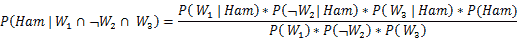
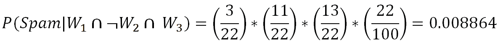
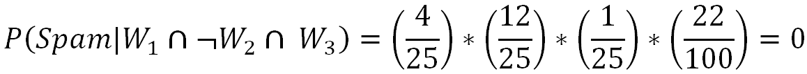

# 第三章：K-最近邻和朴素贝叶斯

在前一章中，我们学习了计算量大的方法。相比之下，本章讨论了平衡这一点的简单方法！我们将介绍两种技术，分别是**K-最近邻**（**KNN**）和朴素贝叶斯。在讨论 KNN 之前，我们通过一个模拟示例解释了维度灾难的问题。随后，利用乳腺癌医学实例来预测癌症是恶性还是良性，并使用 KNN 进行分类。在本章的最后部分，介绍了朴素贝叶斯方法，并通过垃圾邮件/正常邮件分类进行讲解，这也涉及到应用**自然语言处理**（**NLP**）技术，包括以下基本的预处理和建模步骤：

+   标点符号移除

+   词语分词和小写转换

+   停用词移除

+   词干提取

+   词形还原与词性标注

+   将单词转换为 TF-IDF 以创建单词的数值表示

+   将朴素贝叶斯模型应用于 TF-IDF 向量，以预测消息是垃圾邮件还是正常邮件，适用于训练和测试数据

# K-最近邻

K-最近邻是一种非参数的机器学习模型，其中模型记住训练观察数据用于分类未知的测试数据。它也可以称为基于实例的学习。这个模型通常被称为懒惰学习，因为它在训练阶段并不像回归、随机森林等那样学习任何东西。相反，它只在测试/评估阶段工作，通过将给定的测试观察数据与最接近的训练观察数据进行比较，这在比较每个测试数据点时会消耗大量时间。因此，该技术在大数据上并不高效；此外，由于**维度灾难**，当变量数量很高时，性能也会下降。

# KNN 投票者示例

KNN 通过以下简短示例进行更好的说明。目标是根据选民的邻里情况，精确到地理位置（纬度和经度），预测选民将投给哪个政党。这里我们假设可以通过观察该地区大多数选民投票给哪个政党来判断潜在选民将投给哪个政党，从而使其有很高的可能性投给大多数党派。然而，调整 k 值（需要考虑的数量，在这些数量中统计大多数投票）是百万美元的问题（与任何机器学习算法一样）：


在前面的图示中，我们可以看到该研究中的选民将投票给**党派 2**。因为在附近，一个邻居投票给了**党派 1**，另一个选民投票给了**党派 3**。但有三个选民投票给**党派 2**。事实上，通过这种方式，KNN 解决了任何给定的分类问题。回归问题通过在给定的圆圈或邻域内取邻居的均值或 k 值来解决。

# 维度灾难

KNN 完全依赖于距离。因此，研究“维度灾难”是值得的，目的是了解在预测所需的变量数量增加时，KNN 是如何随着维度增加而降低其预测能力的。这是一个显而易见的事实：高维空间是非常广阔的。与低维空间中的点相比，高维空间中的点通常会更加分散。虽然有很多方法可以检查维度曲线，但在这里我们使用了介于零和一之间的均匀随机值，分别生成 1D、2D 和 3D 空间中的数据，以验证这一假设。

在接下来的代码行中，我们计算了 1000 个观察点在不同维度下的平均距离。显而易见，随着维度的增加，点与点之间的距离呈对数增长，这提示我们需要在维度增加时，数据点以指数级增长，才能让机器学习算法正确工作：

```py
>>> import numpy as np 
>>> import pandas as pd 

# KNN Curse of Dimensionality 
>>> import random,math 
```

以下代码生成从零到一之间均匀分布的随机数，维度相当于数组或列表的长度：

```py
>>> def random_point_gen(dimension): 
...     return [random.random() for _ in range(dimension)] 
```

以下函数计算了点之间的欧几里得距离（2-范数）的均方根和，通过计算点之间的差异并将平方求和，最后取总距离的平方根：

```py
>>> def distance(v,w): 
...     vec_sub = [v_i-w_i for v_i,w_i in zip(v,w)] 
...     sum_of_sqrs = sum(v_i*v_i for v_i in vec_sub) 
...     return math.sqrt(sum_of_sqrs) 
```

在下面的代码中，使用维度和对数来计算距离：

```py
>>> def random_distances_comparison(dimension,number_pairs): 
...     return [distance(random_point_gen(dimension),random_point_gen(dimension)) 
            for _ in range(number_pairs)] 

>>> def mean(x): 
...     return sum(x) / len(x) 
```

实验通过将维度从 1 改变到 201，维度每次增加 5 来检查距离的增加：

```py
>>> dimensions = range(1, 201, 5)
```

我们计算了最小距离和平均距离，结果都表明了相似的趋势：

```py
>>> avg_distances = [] 
>>> min_distances = [] 

>>> dummyarray = np.empty((20,4)) 
>>> dist_vals = pd.DataFrame(dummyarray) 
>>> dist_vals.columns = ["Dimension","Min_Distance","Avg_Distance","Min/Avg_Distance"] 

>>> random.seed(34) 
>>> i = 0 
>>> for dims in dimensions: 
...     distances = random_distances_comparison(dims, 1000)   
...     avg_distances.append(mean(distances))     
...     min_distances.append(min(distances))      

...     dist_vals.loc[i,"Dimension"] = dims 
...     dist_vals.loc[i,"Min_Distance"] = min(distances) 
...     dist_vals.loc[i,"Avg_Distance"] = mean(distances) 
...     dist_vals.loc[i,"Min/Avg_Distance"] = min(distances)/mean(distances) 

...     print(dims, min(distances), mean(distances), min(distances)*1.0 / mean( distances)) 
...     i = i+1 

# Plotting Average distances for Various Dimensions 
>>> import matplotlib.pyplot as plt 
>>> plt.figure() 
>>> plt.xlabel('Dimensions') 
>>> plt.ylabel('Avg. Distance') 
>>> plt.plot(dist_vals["Dimension"],dist_vals["Avg_Distance"]) 
>>> plt.legend(loc='best') 

>>> plt.show() 
```


从前面的图表中可以证明，随着维度的增加，平均距离呈对数增长。因此，维度越高，就需要更多的数据来克服维度灾难！

# 1D、2D 和 3D 维度灾难示例

我们快速分析了 60 个随机点的距离，随着维度增加，这些点是如何扩展的。最初，随机点被绘制为一维数据：

```py
# 1-Dimension Plot 
>>> import numpy as np 
>>> import pandas as pd 
>>> import matplotlib.pyplot as plt 

>>> one_d_data = np.random.rand(60,1) 
>>> one_d_data_df = pd.DataFrame(one_d_data) 
>>> one_d_data_df.columns = ["1D_Data"] 
>>> one_d_data_df["height"] = 1 

>>> plt.figure() 
>>> plt.scatter(one_d_data_df['1D_Data'],one_d_data_df["height"]) 
>>> plt.yticks([]) 
>>> plt.xlabel("1-D points") 
>>> plt.show()
```

如果我们观察下面的图表，可以发现所有 60 个数据点在一维空间中非常接近：


这里我们在 2D 空间中重复相同的实验，通过选取 60 个带有 *x* 和 *y* 坐标的随机数，并将其可视化：

```py
# 2- Dimensions Plot 
>>> two_d_data = np.random.rand(60,2) 
>>> two_d_data_df = pd.DataFrame(two_d_data) 
>>> two_d_data_df.columns = ["x_axis","y_axis"] 

>>> plt.figure() 
>>> plt.scatter(two_d_data_df['x_axis'],two_d_data_df["y_axis"]) 
>>> plt.xlabel("x_axis");plt.ylabel("y_axis") 
>>> plt.show()  
```

通过观察 2D 图表，我们可以看到相同的 60 个数据点之间出现了更多的间隙：


最终，我们绘制了 60 个数据点用于 3D 空间。我们可以看到空间的增加更加明显。到目前为止，这在视觉上已经证明，随着维度的增加，空间会变得非常大，这使得分类器难以检测到信号：

```py
# 3- Dimensions Plot 
>>> three_d_data = np.random.rand(60,3) 
>>> three_d_data_df = pd.DataFrame(three_d_data) 
>>> three_d_data_df.columns = ["x_axis","y_axis","z_axis"] 

>>> from mpl_toolkits.mplot3d import Axes3D 
>>> fig = plt.figure() 
>>> ax = fig.add_subplot(111, projection='3d') 
>>> ax.scatter(three_d_data_df['x_axis'],three_d_data_df["y_axis"],three_d_data_df ["z_axis"]) 
>>> plt.show() 
```


# 使用乳腺癌威斯康星数据的 KNN 分类器示例

乳腺癌数据来自 UCI 机器学习库 [`archive.ics.uci.edu/ml/datasets/Breast+Cancer+Wisconsin+%28Diagnostic%29`](http://archive.ics.uci.edu/ml/datasets/Breast+Cancer+Wisconsin+%28Diagnostic%29)，用于示范目的。在这里，任务是基于各种收集的特征，如肿块厚度等，使用 KNN 分类器判断癌症是恶性还是良性：

```py
# KNN Classifier - Breast Cancer 
>>> import numpy as np 
>>> import pandas as pd 
>>> from sklearn.metrics import accuracy_score,classification_report 
>>> breast_cancer = pd.read_csv("Breast_Cancer_Wisconsin.csv") 
```

以下是前几行数据，展示数据的样子。`Class`值为`2`和`4`。值`2`和`4`分别代表良性和恶性类别。而所有其他变量的值在`1`和`10`之间变化，这些值在本质上是类别型的：


只有`Bare_Nuclei`变量有一些缺失值，在以下代码中，我们将这些缺失值替换为最常见的值（类别值`1`）：

```py
>>> breast_cancer['Bare_Nuclei'] = breast_cancer['Bare_Nuclei'].replace('?', np.NAN) 
>>> breast_cancer['Bare_Nuclei'] = breast_cancer['Bare_Nuclei'].fillna(breast_cancer[ 'Bare_Nuclei'].value_counts().index[0]) 
```

使用以下代码将类转换为`0`和`1`的指示符，以用于分类器：

```py
>>> breast_cancer['Cancer_Ind'] = 0 
>>> breast_cancer.loc[breast_cancer['Class']==4,'Cancer_Ind'] = 1
```

在以下代码中，我们正在从分析中剔除无价值的变量：

```py
>>> x_vars = breast_cancer.drop(['ID_Number','Class','Cancer_Ind'],axis=1) 
>>> y_var = breast_cancer['Cancer_Ind'] 
>>> from sklearn.preprocessing import StandardScaler 
>>> x_vars_stdscle = StandardScaler().fit_transform(x_vars.values) 
>>> from sklearn.model_selection import train_test_split 
```

由于 KNN 对距离非常敏感，在应用算法之前，我们在这里对所有列进行了标准化处理：

```py
>>> x_vars_stdscle_df = pd.DataFrame(x_vars_stdscle, index=x_vars.index, columns=x_vars.columns) 
>>> x_train,x_test,y_train,y_test = train_test_split(x_vars_stdscle_df,y_var, train_size = 0.7,random_state=42)
```

KNN 分类器的邻居值为`3`，`p`值表示 2 范数，也就是欧几里得距离，用于计算类别：

```py
>>> from sklearn.neighbors import KNeighborsClassifier 
>>> knn_fit = KNeighborsClassifier(n_neighbors=3,p=2,metric='minkowski') 
>>> knn_fit.fit(x_train,y_train) 

>>> print ("\nK-Nearest Neighbors - Train Confusion Matrix\n\n",pd.crosstab(y_train, knn_fit.predict(x_train),rownames = ["Actuall"],colnames = ["Predicted"]) )      
>>> print ("\nK-Nearest Neighbors - Train accuracy:",round(accuracy_score(y_train, knn_fit.predict(x_train)),3)) 
>>> print ("\nK-Nearest Neighbors - Train Classification Report\n", classification_report( y_train,knn_fit.predict(x_train))) 

>>> print ("\n\nK-Nearest Neighbors - Test Confusion Matrix\n\n",pd.crosstab(y_test, knn_fit.predict(x_test),rownames = ["Actuall"],colnames = ["Predicted"]))       
>>> print ("\nK-Nearest Neighbors - Test accuracy:",round(accuracy_score( y_test,knn_fit.predict(x_test)),3)) 
>>> print ("\nK-Nearest Neighbors - Test Classification Report\n", classification_report(y_test,knn_fit.predict(x_test))) 

```


从结果来看，KNN 在分类恶性和良性类别方面表现非常好，测试准确率达到了 97.6%，恶性类别的召回率为 96%。KNN 分类器唯一的缺点是，在测试阶段它计算密集，因为每个测试样本都要与训练数据中的所有可用样本进行比较，实际上，KNN 并没有从训练数据中“学习”任何东西。因此，我们也称其为懒惰分类器！

以下是 KNN 分类器的 R 代码：

```py
# KNN Classifier 
setwd("D:\\Book writing\\Codes\\Chapter 5") 
breast_cancer = read.csv("Breast_Cancer_Wisconsin.csv") 

# Column Bare_Nuclei have some missing values with "?" in place, we are replacing with median values 
# As Bare_Nuclei is discrete variable 
breast_cancer$Bare_Nuclei = as.character(breast_cancer$Bare_Nuclei)
breast_cancer$Bare_Nuclei[breast_cancer$Bare_Nuclei=="?"] = median(breast_cancer$Bare_Nuclei,na.rm = TRUE)
breast_cancer$Bare_Nuclei = as.integer(breast_cancer$Bare_Nuclei)
# Classes are 2 & 4 for benign & malignant respectively, we # have converted # 
to zero-one problem, as it is easy to convert to work # around with models 
breast_cancer$Cancer_Ind = 0
breast_cancer$Cancer_Ind[breast_cancer$Class==4]=1
breast_cancer$Cancer_Ind = as.factor( breast_cancer$Cancer_Ind) 

# We have removed unique id number from modeling as unique # numbers does not provide value in modeling 
# In addition, original class variable also will be removed # as the same has been replaced with derived variable 

remove_cols = c("ID_Number","Class") 
breast_cancer_new = breast_cancer[,!(names(breast_cancer) %in% remove_cols)] 

# Setting seed value for producing repetitive results 
# 70-30 split has been made on the data 

set.seed(123) 
numrow = nrow(breast_cancer_new) 
trnind = sample(1:numrow,size = as.integer(0.7*numrow)) 
train_data = breast_cancer_new[trnind,] 
test_data = breast_cancer_new[-trnind,] 

# Following is classical code for computing accuracy, # precision & recall 

frac_trzero = (table(train_data$Cancer_Ind)[[1]])/nrow(train_data)
frac_trone = (table(train_data$Cancer_Ind)[[2]])/nrow(train_data)

frac_tszero = (table(test_data$Cancer_Ind)[[1]])/nrow(test_data)
frac_tsone = (table(test_data$Cancer_Ind)[[2]])/nrow(test_data)

prec_zero <- function(act,pred){ tble = table(act,pred)
return( round( tble[1,1]/(tble[1,1]+tble[2,1]),4) ) } 

prec_one <- function(act,pred){ tble = table(act,pred)
return( round( tble[2,2]/(tble[2,2]+tble[1,2]),4) ) } 

recl_zero <- function(act,pred){tble = table(act,pred) 
return( round( tble[1,1]/(tble[1,1]+tble[1,2]),4) ) } 

recl_one <- function(act,pred){ tble = table(act,pred) 
return( round( tble[2,2]/(tble[2,2]+tble[2,1]),4) ) } 

accrcy <- function(act,pred){ tble = table(act,pred) 
return( round((tble[1,1]+tble[2,2])/sum(tble),4)) } 

# Importing Class package in which KNN function do present library(class) 

# Choosing sample k-value as 3 & apply on train & test data # respectively 

k_value = 3 
tr_y_pred = knn(train_data,train_data,train_data$Cancer_Ind,k=k_value)
ts_y_pred = knn(train_data,test_data,train_data$Cancer_Ind,k=k_value) 

# Calculating confusion matrix, accuracy, precision & # recall on train data 

tr_y_act = train_data$Cancer_Ind;ts_y_act = test_data$Cancer_Ind
tr_tble = table(tr_y_act,tr_y_pred) 
print(paste("Train Confusion Matrix")) 
print(tr_tble) 

tr_acc = accrcy(tr_y_act,tr_y_pred) 
trprec_zero = prec_zero(tr_y_act,tr_y_pred); trrecl_zero = recl_zero(tr_y_act,tr_y_pred) 
trprec_one = prec_one(tr_y_act,tr_y_pred); trrecl_one = recl_one(tr_y_act,tr_y_pred) 
trprec_ovll = trprec_zero *frac_trzero + trprec_one*frac_trone
trrecl_ovll = trrecl_zero *frac_trzero + trrecl_one*frac_trone

print(paste("KNN Train accuracy:",tr_acc)) 
print(paste("KNN - Train Classification Report"))
print(paste("Zero_Precision",trprec_zero,"Zero_Recall",trrecl_zero))
print(paste("One_Precision",trprec_one,"One_Recall",trrecl_one))
print(paste("Overall_Precision",round(trprec_ovll,4),"Overall_Recall",round(trrecl_ovll,4))) 

# Calculating confusion matrix, accuracy, precision & # recall on test data 

ts_tble = table(ts_y_act, ts_y_pred) 
print(paste("Test Confusion Matrix")) 
print(ts_tble) 

ts_acc = accrcy(ts_y_act,ts_y_pred) 
tsprec_zero = prec_zero(ts_y_act,ts_y_pred); tsrecl_zero = recl_zero(ts_y_act,ts_y_pred) 
tsprec_one = prec_one(ts_y_act,ts_y_pred); tsrecl_one = recl_one(ts_y_act,ts_y_pred) 

tsprec_ovll = tsprec_zero *frac_tszero + tsprec_one*frac_tsone
tsrecl_ovll = tsrecl_zero *frac_tszero + tsrecl_one*frac_tsone

print(paste("KNN Test accuracy:",ts_acc)) 
print(paste("KNN - Test Classification Report"))
print(paste("Zero_Precision",tsprec_zero,"Zero_Recall",tsrecl_zero))
print(paste("One_Precision",tsprec_one,"One_Recall",tsrecl_one))
print(paste("Overall_Precision",round(tsprec_ovll,4),"Overall_Recall",round(tsrecl_ovll,4))) 
```

# KNN 分类器中的 k 值调整

在前一部分中，我们仅使用了 k 值为 3 的情况。实际上，在任何机器学习算法中，我们都需要调节参数以检查在哪些情况下可以获得更好的性能。对于 KNN，唯一需要调节的参数是 k 值。因此，在以下代码中，我们通过网格搜索来确定最佳 k 值：

```py
# Tuning of K- value for Train & Test data 
>>> dummyarray = np.empty((5,3)) 
>>> k_valchart = pd.DataFrame(dummyarray) 
>>> k_valchart.columns = ["K_value","Train_acc","Test_acc"] 

>>> k_vals = [1,2,3,4,5] 

>>> for i in range(len(k_vals)): 
...     knn_fit = KNeighborsClassifier(n_neighbors=k_vals[i],p=2,metric='minkowski') 
...     knn_fit.fit(x_train,y_train) 

...     print ("\nK-value",k_vals[i]) 

...     tr_accscore = round(accuracy_score(y_train,knn_fit.predict(x_train)),3) 
...     print ("\nK-Nearest Neighbors - Train Confusion Matrix\n\n",pd.crosstab( y_train, knn_fit.predict(x_train),rownames = ["Actuall"],colnames = ["Predicted"]) )      
...     print ("\nK-Nearest Neighbors - Train accuracy:",tr_accscore) 
...     print ("\nK-Nearest Neighbors - Train Classification Report\n", classification_report(y_train,knn_fit.predict(x_train))) 

...     ts_accscore = round(accuracy_score(y_test,knn_fit.predict(x_test)),3)     
...     print ("\n\nK-Nearest Neighbors - Test Confusion Matrix\n\n",pd.crosstab( y_test,knn_fit.predict(x_test),rownames = ["Actuall"],colnames = ["Predicted"]))       
...     print ("\nK-Nearest Neighbors - Test accuracy:",ts_accscore) 
...     print ("\nK-Nearest Neighbors - Test Classification Report\n",classification_report(y_test,knn_fit.predict(x_test))) 

...     k_valchart.loc[i, 'K_value'] = k_vals[i]       
...     k_valchart.loc[i, 'Train_acc'] = tr_accscore      
...     k_valchart.loc[i, 'Test_acc'] = ts_accscore                

# Ploting accuracies over varied K-values 
>>> import matplotlib.pyplot as plt 
>>> plt.figure() 
>>> plt.xlabel('K-value') 
>>> plt.ylabel('Accuracy') 
>>> plt.plot(k_valchart["K_value"],k_valchart["Train_acc"]) 
>>> plt.plot(k_valchart["K_value"],k_valchart["Test_acc"]) 

>>> plt.axis([0.9,5, 0.92, 1.005]) 
>>> plt.xticks([1,2,3,4,5]) 

>>> for a,b in zip(k_valchart["K_value"],k_valchart["Train_acc"]): 
...     plt.text(a, b, str(b),fontsize=10) 

>>> for a,b in zip(k_valchart["K_value"],k_valchart["Test_acc"]): 
...     plt.text(a, b, str(b),fontsize=10) 

>>> plt.legend(loc='upper right')     
>>> plt.show() 
```


结果表明，较小的 k 值会导致更多的过拟合问题，因为训练数据的准确性非常高，而测试数据的准确性较低。随着 k 值的增大，训练和测试的准确性逐渐趋于一致并变得更加稳定。这一现象展示了典型的机器学习现象。对于进一步分析，建议读者尝试比五更高的 k 值，看看训练和测试准确性是如何变化的。以下是 KNN 分类器中 k 值调整的 R 代码：

```py
# Tuning of K-value on Train & Test Data 
k_valchart = data.frame(matrix( nrow=5, ncol=3)) 
colnames(k_valchart) = c("K_value","Train_acc","Test_acc") 
k_vals = c(1,2,3,4,5) 

i = 1
for (kv in k_vals) { 
 tr_y_pred = knn(train_data,train_data,train_data$Cancer_Ind,k=kv)
 ts_y_pred = knn(train_data,test_data,train_data$Cancer_Ind,k=kv)
 tr_y_act = train_data$Cancer_Ind;ts_y_act = test_data$Cancer_Ind
 tr_tble = table(tr_y_act,tr_y_pred) 
 print(paste("Train Confusion Matrix")) 
 print(tr_tble) 
 tr_acc = accrcy(tr_y_act,tr_y_pred) 
 trprec_zero = prec_zero(tr_y_act,tr_y_pred); trrecl_zero = recl_zero(tr_y_act, tr_y_pred) 
 trprec_one = prec_one(tr_y_act,tr_y_pred); trrecl_one = recl_one(tr_y_act,tr_y_pred) 
 trprec_ovll = trprec_zero *frac_trzero + trprec_one*frac_trone
 trrecl_ovll = trrecl_zero *frac_trzero + trrecl_one*frac_trone
 print(paste("KNN Train accuracy:",tr_acc)) 
 print(paste("KNN - Train Classification Report"))

print(paste("Zero_Precision",trprec_zero,"Zero_Recall",trrecl_zero))
print(paste("One_Precision",trprec_one,"One_Recall",trrecl_one))
print(paste("Overall_Precision",round(trprec_ovll,4),"Overall_Recall",round(trrecl_ovll,4))) 
 ts_tble = table(ts_y_act,ts_y_pred) 
 print(paste("Test Confusion Matrix")) 
 print(ts_tble)
 ts_acc = accrcy(ts_y_act,ts_y_pred) 
 tsprec_zero = prec_zero(ts_y_act,ts_y_pred); tsrecl_zero = recl_zero(ts_y_act,ts_y_pred) 
 tsprec_one = prec_one(ts_y_act,ts_y_pred); tsrecl_one = recl_one(ts_y_act,ts_y_pred) 
 tsprec_ovll = tsprec_zero *frac_tszero + tsprec_one*frac_tsone
 tsrecl_ovll = tsrecl_zero *frac_tszero + tsrecl_one*frac_tsone

 print(paste("KNN Test accuracy:",ts_acc)) 
 print(paste("KNN - Test Classification Report"))

print(paste("Zero_Precision",tsprec_zero,"Zero_Recall",tsrecl_zero))
print(paste("One_Precision",tsprec_one,"One_Recall",tsrecl_one))
print(paste("Overall_Precision",round(tsprec_ovll,4),"Overall_Recall",round(tsrecl_ovll,4)))

 k_valchart[i,1] =kv 
 k_valchart[i,2] =tr_acc 
 k_valchart[i,3] =ts_acc i = i+1 } 
# Plotting the graph 
library(ggplot2) 
library(grid) 
ggplot(k_valchart, aes(K_value)) 
+ geom_line(aes(y = Train_acc, colour = "Train_Acc")) + 
geom_line(aes(y = Test_acc, colour = "Test_Acc"))+
labs(x="K_value",y="Accuracy") + 
geom_text(aes(label = Train_acc, y = Train_acc), size = 3)+
geom_text(aes(label = Test_acc, y = Test_acc), size = 3) 
```

# 朴素贝叶斯

贝叶斯算法的概念非常古老，源自 18 世纪。托马斯·贝叶斯（Thomas Bayes）开发了用于从已知事件中确定未知事件概率的基础数学原理。例如，如果所有的苹果都是红色的，且其平均直径约为 4 英寸，那么如果随机从一个篮子中挑选一个红色且直径为 3.7 英寸的水果，这个水果是苹果的概率是多少？朴素贝叶斯假设特定特征之间的独立性。在这种情况下，颜色和直径之间没有依赖关系。这种独立性假设使得朴素贝叶斯分类器在计算上对于某些任务（如基于单词的电子邮件分类）最为高效，即便在假设特征之间相互独立的情况下，词汇的高维度依然能够处理。朴素贝叶斯分类器在实际应用中表现得出奇地好。

贝叶斯分类器最适用于那些需要同时考虑大量属性信息来估计最终结果概率的问题。贝叶斯方法利用所有可用的证据进行预测，即使某些特征对最终结果的影响较弱，依然会被考虑。然而，我们不应忽视这样一个事实：大量相对较小影响的特征，结合在一起会形成强大的分类器。

# 概率基础

在深入了解朴素贝叶斯之前，回顾一下基本原理会很有帮助。一个事件的概率可以通过观察数据来估算，即将事件发生的次数除以总试验次数。例如，如果一个袋子里有红色和蓝色的球，且每次都从袋中随机抽取*10*个球，且每次抽取后会放回，那么在这*10*次试验中，出现*3*个红球，那么我们可以说红球的概率是*0.3*，*p[红球] = 3/10 = 0.3*。所有可能结果的总概率必须为 100%。

如果一个试验有两个可能的结果，例如电子邮件分类问题中，要么是垃圾邮件，要么是正常邮件，且这两个结果不能同时发生，那么这些事件被称为互斥事件。此外，如果这些结果涵盖了所有可能的事件，它们就被称为**穷尽事件**。例如，在电子邮件分类中，如果*P（垃圾邮件） = 0.1*，我们可以计算出*P（正常邮件） = 1 - 0.1 = 0.9*，这两个事件是互斥的。在下面的维恩图中，所有电子邮件的可能类别（整个宇宙）以及结果类型都被表示出来：


# 联合概率

尽管互斥事件的处理比较简单，但大多数实际问题属于非互斥事件的范畴。通过使用联合出现的情况，我们可以预测事件的结果。例如，如果邮件中出现了像 *彩票* 这样的词语，那么它很可能是垃圾邮件而非非垃圾邮件。下图显示了垃圾邮件与 *彩票* 的联合概率。然而，如果你仔细观察，你会发现“彩票”圆并没有完全包含在垃圾邮件圆内。这意味着并非所有垃圾邮件都包含“彩票”一词，也并非每封包含“彩票”一词的邮件都是垃圾邮件。


在下图中，我们扩展了垃圾邮件和非垃圾邮件类别，并用维恩图表示了*彩票*一词：


我们已经看到，10%的邮件是垃圾邮件，4%的邮件包含“彩票”一词，我们的任务是量化这两者之间的重叠程度。换句话说，我们需要确定同时发生 *p(spam)* 和 *p(lottery)* 的联合概率，可以写作 *p(spam ∩ lottery)*。如果这两个事件完全无关，则它们被称为**独立事件**，它们的值为 *p(spam ∩ lottery) = p(spam) * p(lottery) = 0.1 * 0.04 = 0.004*，即 0.4%的邮件是包含“彩票”一词的垃圾邮件。一般来说，对于独立事件，*P(A∩ B) = P(A) * P(B)*。

# 理解贝叶斯定理与条件概率

条件概率提供了一种利用贝叶斯定理计算依赖事件之间关系的方法。例如，*A* 和 *B* 是两个事件，我们希望计算 *P(A\B)*，它可以理解为在事件 *B* 已经发生的情况下，事件 *A* 发生的概率，实际上，这就是**条件概率**，该方程可以写成如下形式：


为了更好地理解，我们现在来讨论一个邮件分类的例子。我们的目标是预测给定“彩票”一词和其他一些线索的情况下，一封邮件是否为垃圾邮件。在这个例子中，我们已经知道了垃圾邮件的总体概率，即 10%，也被称为**先验概率**。现在假设你得到了一个额外的信息，即“彩票”一词在所有邮件中的概率是 4%，也叫做**边际似然性**。现在，我们知道“彩票”一词出现在过去垃圾邮件中的概率，这被称为**似然性**。


通过应用贝叶斯定理到证据上，我们可以计算后验概率，从而计算消息是垃圾邮件的可能性；给定“彩票”一词出现在该消息中的事实。如果该概率大于 50%，则表示这封邮件是垃圾邮件而非非垃圾邮件。


在前面的表格中，记录了*彩票*在垃圾邮件和正常邮件中出现的次数及其相应的可能性。可能性表明 *P(彩票\垃圾邮件)= 3/22 = 0.13*，这表明垃圾邮件中包含“彩票”一词的概率为 13%。随后，我们可以计算 *P(垃圾邮件 ∩ 彩票) = P(彩票\垃圾邮件) * P(垃圾邮件) = (3/22) * (22/100) = 0.03*。为了计算后验概率，我们将 *P(垃圾邮件 ∩ 彩票)* 除以 *P(彩票)*，即 *(3/22)*(22/100) / (4/100) = 0.75*。因此，给定一条信息中包含“彩票”一词，消息为垃圾邮件的概率为 75%。所以，不要相信快速致富的家伙们！

# 朴素贝叶斯分类

在过去的示例中，我们看到的是单个单词 *彩票*，然而在本例中，我们将讨论更多的额外单词，如 *百万* 和 *退订*，以展示实际分类器是如何工作的。让我们构建一个包含三个单词（*W1*，*W2* 和 *W3*）出现频率的可能性表，如下表所示，基于 *100* 封电子邮件：


当收到新邮件时，将计算后验概率，以确定该电子邮件是垃圾邮件还是正常邮件。假设我们收到一封包含 *彩票* 和 *退订* 的邮件，但没有包含 *百万* 一词，基于这些信息，垃圾邮件的概率是多少？

使用贝叶斯定理，我们可以定义问题为 *彩票 = 是*，*百万 = 否* 和 *退订 = 是*：


由于单词之间相互依赖，解决上述方程将具有较高的计算复杂度。随着单词数量的增加，这种计算复杂度将呈爆炸性增长，同时处理所有可能交集事件所需的内存也会非常庞大。最终，这导致了基于单词独立性的直观转变（**条件独立性交叉**），因此贝叶斯分类器被称为“朴素贝叶斯”。当两个事件相互独立时，我们可以写作 *P(A ∩ B) = P(A) * P(B)*。实际上，这种等式的计算更为简单，且对内存的需求更低：


以类似的方式，我们也会计算正常邮件的概率，具体如下：



通过将前述可能性表代入方程，由于垃圾邮件和正常邮件的比例，我们可以简单地忽略两个方程中的分母项。垃圾邮件的总体可能性为：



计算比率后，*0.008864/0.004349 = 2.03*，这意味着这条信息比正常邮件更有可能是垃圾邮件，概率是两倍。但我们可以按照以下方式计算概率：

*P(垃圾邮件) = 0.008864/(0.008864+0.004349) = 0.67*

*P(Ham) = 0.004349/(0.008864+0.004349) = 0.33*

通过将似然值转换为概率，我们可以以易于展示的方式呈现，无论是设置某些阈值，等等。

# 拉普拉斯估计

在前述计算中，所有值都是非零的，这使得计算顺利进行。然而，在实际情况中，有些单词在特定类别中从未出现，突然在后期阶段出现，这会导致整个计算结果为零。

例如，在前面的方程式中，*W[3]*的值是*0*而不是*13*，这会导致整个方程式的结果都变为*0*：


为了避免这种情况，拉普拉斯估计通过在频率表中的每个计数上加上一个小的常数，确保每个特征在每个类别中都有非零的出现概率。通常，拉普拉斯估计设为*1*，这确保每个类别-特征组合在数据中至少出现一次：



如果仔细观察方程，分子中的三个单词都加了*1*，同时，所有分母都加了*3*，以保持等式平衡。

# 朴素贝叶斯 SMS 垃圾邮件分类示例

使用 SMS 垃圾邮件数据集（可在[`www.dt.fee.unicamp.br/~tiago/smsspamcollection/`](http://www.dt.fee.unicamp.br/~tiago/smsspamcollection/)找到）开发了朴素贝叶斯分类器。本章讨论了在构建朴素贝叶斯模型之前，NLP 技术中可用的各种预处理技术：

```py
>>> import csv 

>>> smsdata = open('SMSSpamCollection.txt','r') 
>>> csv_reader = csv.reader(smsdata,delimiter='\t') 
```

以下`sys`包的代码可以在遇到任何`utf-8`错误时使用，尤其是在使用旧版本 Python 时，否则在最新版本的 Python 3.6 中不必要：

```py
>>> import sys 
>>> reload (sys) 
>>> sys.setdefaultendocing('utf-8') 
```

正常编码从此开始，像往常一样：

```py
>>> smsdata_data = [] 
>>> smsdata_labels = [] 

>>> for line in csv_reader: 
...     smsdata_labels.append(line[0]) 
...     smsdata_data.append(line[1]) 

>>> smsdata.close() 
```

以下代码会打印出前五行：

```py
>>> for i in range(5): 
...     print (smsdata_data[i],smsdata_labels[i])
```


获取前述输出后，运行以下代码：

```py
>>> from collections import Counter 
>>> c = Counter( smsdata_labels ) 
>>> print(c) 
```


在 5,572 个样本中，4,825 个是正常邮件，约占 86.5%，而 747 个是垃圾邮件，占余下的 13.4%。

使用 NLP 技术，我们已对数据进行预处理，以获得最终的词向量，进而映射到最终结果：垃圾邮件或正常邮件。主要的预处理阶段包括：

+   **去除标点符号**：在进行进一步处理之前，需要去除标点符号。`string`库中的标点符号包括*!"#$%&\'()*+,-./:;<=>?@[\\]^_`{|}~*，这些标点符号会从所有消息中移除。

+   **词汇分割**：根据空格将句子中的单词拆分，以便进一步处理。

+   **将单词转换为小写**：将所有字母转换为小写可以去除重复项，例如*Run*和*run*，前者出现在句子的开头，而后者出现在句子的中间，等等，这些都需要统一处理以去除重复项，因为我们正在使用词袋模型技术。

+   **停用词移除**：停用词是指在文学中重复出现多次，但对句子的解释力没有太大作用的词。例如：*I*、*me*、*you*、*this*、*that*等，需要在进一步处理之前将其移除。

+   **长度至少为三**：在这里我们移除了长度小于三的单词。

+   **单词的词干提取**：词干提取过程将单词简化为其根词。词干提取的例子是将 running 简化为 run，或将 runs 简化为 run。通过词干提取，我们减少了重复并提高了模型的准确性。

+   **词性标注（POS tagging）**：这一步骤为单词应用词性标签，如名词、动词、形容词等。例如，*running*的词性标注是动词，而*run*的词性标注是名词。在某些情况下，*running*是名词，词形还原不会将其简化为根词*run*，而是将*running*保留原样。因此，词性标注是执行词形还原操作之前必须进行的关键步骤。

+   **单词的词形还原**：词形还原是另一种减少维度的过程。在词形还原过程中，它将单词归结为根词，而不是仅仅截断单词。例如，将*ate*还原为其根词*eat*，当我们将*ate*传递给词形还原器时，词性标签为动词。

`nltk`包已经在所有预处理步骤中使用，因为它包含了所有必要的自然语言处理功能：

```py
>>> import nltk 
>>> from nltk.corpus import stopwords 
>>> from nltk.stem import WordNetLemmatizer 
>>> import string 
>>> import pandas as pd 
>>> from nltk import pos_tag 
>>> from nltk.stem import PorterStemmer  
```

已编写（预处理）函数，包含所有步骤，便于使用。然而，我们将在每个部分中解释这些步骤：

```py
>>> def preprocessing(text): 
```

以下代码行会将单词拆分并检查每个字符是否为标准标点符号，如果是，则将其替换为空格，否则不进行替换：

```py
...     text2 = " ".join("".join([" " if ch in string.punctuation else ch for ch in text]).split()) 
```

以下代码将句子根据空格分割为单词，并将它们组合成一个列表，以便应用进一步的步骤：

```py
...     tokens = [word for sent in nltk.sent_tokenize(text2) for word in 
              nltk.word_tokenize(sent)] 
```

将所有的大小写（大写、小写和首字母大写）转换为小写，以减少语料库中的重复：

```py
...     tokens = [word.lower() for word in tokens] 
```

如前所述，停用词是指那些在理解句子时没有太大意义的词；它们通常用于连接其他词等。我们已经通过以下代码行将它们移除：

```py
...     stopwds = stopwords.words('english') 
...     tokens = [token for token in tokens if token not in stopwds]  
```

以下代码将只保留长度大于`3`的单词，用于去除那些几乎没有实际意义的小单词：

```py
...     tokens = [word for word in tokens if len(word)>=3] 
```

对单词应用了`PorterStemmer`函数进行词干提取，该函数从单词中去除额外的后缀：

```py
...     stemmer = PorterStemmer() 
...     tokens = [stemmer.stem(word) for word in tokens]  
```

词性标注是词形还原的前提，基于单词是名词还是动词等，它将单词简化为根词：

```py
...     tagged_corpus = pos_tag(tokens)     
```

`pos_tag`函数为名词返回四种格式，为动词返回六种格式。名词包括`NN`（普通名词，单数）、`NNP`（专有名词，单数）、`NNPS`（专有名词，复数）、`NNS`（普通名词，复数）；动词包括`VB`（动词原形）、`VBD`（动词过去式）、`VBG`（动词现在分词）、`VBN`（动词过去分词）、`VBP`（动词现在时，非第三人称单数）、`VBZ`（动词现在时，第三人称单数）：

```py
...    Noun_tags = ['NN','NNP','NNPS','NNS'] 
...    Verb_tags = ['VB','VBD','VBG','VBN','VBP','VBZ'] 
...    lemmatizer = WordNetLemmatizer()
```

`prat_lemmatize`函数的创建仅为了解决`pos_tag`函数和词形还原函数（lemmatize）的输入值不匹配的问题。如果某个词的标签属于相应的名词或动词标签类别，则在词形还原函数中会应用`n`或`v`：

```py
...     def prat_lemmatize(token,tag): 
...         if tag in Noun_tags: 
...             return lemmatizer.lemmatize(token,'n') 
...         elif tag in Verb_tags: 
...             return lemmatizer.lemmatize(token,'v') 
...         else: 
...             return lemmatizer.lemmatize(token,'n') 
```

在执行了分词和各种操作后，我们需要将其重新连接起来形成字符串，以下函数实现了这一操作：

```py
...     pre_proc_text =  " ".join([prat_lemmatize(token,tag) for token,tag in tagged_corpus])              
...     return pre_proc_text 
```

接下来的步骤是对数据应用预处理函数，并生成新的语料库：

```py
>>> smsdata_data_2 = [] 
>>> for i in smsdata_data: 
...     smsdata_data_2.append(preprocessing(i))  
```

数据将按 70-30 的比例分为训练集和测试集，并转换为 NumPy 数组，以应用机器学习算法：

```py
>>> import numpy as np 
>>> trainset_size = int(round(len(smsdata_data_2)*0.70)) 
>>> print ('The training set size for this classifier is ' + str(trainset_size) + '\n') 
>>> x_train = np.array([''.join(rec) for rec in smsdata_data_2[0:trainset_size]]) 
>>> y_train = np.array([rec for rec in smsdata_labels[0:trainset_size]]) 
>>> x_test = np.array([''.join(rec) for rec in smsdata_data_2[trainset_size+1:len( smsdata_data_2)]]) 
>>> y_test = np.array([rec for rec in smsdata_labels[trainset_size+1:len( smsdata_labels)]]) 
```

以下代码将单词转换为向量化格式，并应用**词频-逆文档频率**（**TF-IDF**）权重，这是通过增加高频词的权重并同时惩罚常见词（如*the*，*him*，*at*等）的一种方法。在以下代码中，我们限制了词汇表中最频繁的 4,000 个单词，尽管我们也可以调整此参数，以检查在哪些参数下获得更好的准确率：

```py
# building TFIDF vectorizer  
>>> from sklearn.feature_extraction.text import TfidfVectorizer 
>>> vectorizer = TfidfVectorizer(min_df=2, ngram_range=(1, 2),  stop_words='english',  
    max_features= 4000,strip_accents='unicode',  norm='l2') 
```

TF-IDF 转换在训练数据和测试数据上展示如下。使用`todense`函数将数据转换成可视化格式：

```py
>>> x_train_2 = vectorizer.fit_transform(x_train).todense() 
>>> x_test_2 = vectorizer.transform(x_test).todense() 
```

多项式朴素贝叶斯分类器适用于具有离散特征（例如单词计数）的分类，这通常需要大量的特征。然而，实际上，像 TF-IDF 这样的分数计数也能很好地工作。如果我们没有提及任何拉普拉斯估计器，它的默认值为*1.0*，意味着它将在每个词项的分子和分母总和中添加*1.0*：

```py
>>> from sklearn.naive_bayes import MultinomialNB 
>>> clf = MultinomialNB().fit(x_train_2, y_train) 

>>> ytrain_nb_predicted = clf.predict(x_train_2) 
>>> ytest_nb_predicted = clf.predict(x_test_2) 

>>> from sklearn.metrics import classification_report,accuracy_score 

>>> print ("\nNaive Bayes - Train Confusion Matrix\n\n",pd.crosstab(y_train, ytrain_nb_predicted,rownames = ["Actuall"],colnames = ["Predicted"]))       
>>> print ("\nNaive Bayes- Train accuracy",round(accuracy_score(y_train, ytrain_nb_predicted),3)) 
>>> print ("\nNaive Bayes  - Train Classification Report\n",classification_report(y_train, ytrain_nb_predicted)) 

>>> print ("\nNaive Bayes - Test Confusion Matrix\n\n",pd.crosstab(y_test, ytest_nb_predicted,rownames = ["Actuall"],colnames = ["Predicted"]))       
>>> print ("\nNaive Bayes- Test accuracy",round(accuracy_score(y_test, ytest_nb_predicted),3)) 
>>> print ("\nNaive Bayes  - Test Classification Report\n",classification_report( y_test, ytest_nb_predicted)) 
```


根据之前的结果，似乎朴素贝叶斯算法在垃圾邮件的测试准确率达到了 96.6%，且召回值显著，为 76%，而在正常邮件（ham）的准确率几乎达到了 100%。

然而，如果我们想查看基于朴素贝叶斯的前 10 个特征及其系数，以下代码将非常有用：

```py
# printing top features  
>>> feature_names = vectorizer.get_feature_names() 
>>> coefs = clf.coef_ 
>>> intercept = clf.intercept_ 
>>> coefs_with_fns = sorted(zip(clf.coef_[0], feature_names)) 

>>> print ("\n\nTop 10 features - both first & last\n") 
>>> n=10 
>>> top_n_coefs = zip(coefs_with_fns[:n], coefs_with_fns[:-(n + 1):-1]) 
>>> for (coef_1, fn_1), (coef_2, fn_2) in top_n_coefs: 
...     print('\t%.4f\t%-15s\t\t%.4f\t%-15s' % (coef_1, fn_1, coef_2, fn_2)) 
```


尽管 R 语言并不是进行自然语言处理（NLP）的热门选择，但这里我们展示了相关代码。我们鼓励读者修改代码，并观察准确率如何变化，从而更好地理解相关概念。以下是用于处理短信垃圾邮件/正常邮件数据的朴素贝叶斯分类器的 R 代码：

```py
# Naive Bayes 
smsdata = read.csv("SMSSpamCollection.csv",stringsAsFactors = FALSE) 
# Try the following code for reading in case if you have 
#issues while reading regularly with above code 
#smsdata = read.csv("SMSSpamCollection.csv", 
#stringsAsFactors = FALSE,fileEncoding="latin1") 
str(smsdata) 
smsdata$Type = as.factor(smsdata$Type) 
table(smsdata$Type) 

library(tm) 
library(SnowballC) 
# NLP Processing 
sms_corpus <- Corpus(VectorSource(smsdata$SMS_Details)) 
corpus_clean_v1 <- tm_map(sms_corpus, removePunctuation)
corpus_clean_v2 <- tm_map(corpus_clean_v1, tolower) 
corpus_clean_v3 <- tm_map(corpus_clean_v2, stripWhitespace)
corpus_clean_v4 <- tm_map(corpus_clean_v3, removeWords, stopwords())
corpus_clean_v5 <- tm_map(corpus_clean_v4, removeNumbers)
corpus_clean_v6 <- tm_map(corpus_clean_v5, stemDocument) 

# Check the change in corpus 
inspect(sms_corpus[1:3]) 
inspect(corpus_clean_v6[1:3]) 

sms_dtm <- DocumentTermMatrix(corpus_clean_v6) 

smsdata_train <- smsdata[1:4169, ] 
smsdata_test <- smsdata[4170:5572, ] 

sms_dtm_train <- sms_dtm[1:4169, ] 
sms_dtm_test <- sms_dtm[4170:5572, ] 

sms_corpus_train <- corpus_clean_v6[1:4169] 
sms_corpus_test <- corpus_clean_v6[4170:5572]

prop.table(table(smsdata_train$Type))
prop.table(table(smsdata_test$Type)) 
frac_trzero = (table(smsdata_train$Type)[[1]])/nrow(smsdata_train)
frac_trone = (table(smsdata_train$Type)[[2]])/nrow(smsdata_train)
frac_tszero = (table(smsdata_test$Type)[[1]])/nrow(smsdata_test)
frac_tsone = (table(smsdata_test$Type)[[2]])/nrow(smsdata_test)

Dictionary <- function(x) { 
 if( is.character(x) ) { 
 return (x) 
 } 
 stop('x is not a character vector') 
} 
# Create the dictionary with at least word appears 1 time 
sms_dict <- Dictionary(findFreqTerms(sms_dtm_train, 1)) 
sms_train <- DocumentTermMatrix(sms_corpus_train,list(dictionary = sms_dict)) 
sms_test <- DocumentTermMatrix(sms_corpus_test,list(dictionary = sms_dict)) 
convert_tofactrs <- function(x) { 
 x <- ifelse(x > 0, 1, 0) 
 x <- factor(x, levels = c(0, 1), labels = c("No", "Yes")) 
 return(x) 
} 
sms_train <- apply(sms_train, MARGIN = 2, convert_tofactrs) 
sms_test <- apply(sms_test, MARGIN = 2, convert_tofactrs) 

# Application of Naïve Bayes Classifier with laplace Estimator
library(e1071) 
nb_fit <- naiveBayes(sms_train, smsdata_train$Type,laplace = 1.0)

tr_y_pred = predict(nb_fit, sms_train) 
ts_y_pred = predict(nb_fit,sms_test) 
tr_y_act = smsdata_train$Type;ts_y_act = smsdata_test$Type 

tr_tble = table(tr_y_act,tr_y_pred) 
print(paste("Train Confusion Matrix")) 
print(tr_tble) 

tr_acc = accrcy(tr_y_act,tr_y_pred) 
trprec_zero = prec_zero(tr_y_act,tr_y_pred);  trrecl_zero = recl_zero(tr_y_act,tr_y_pred) 
trprec_one = prec_one(tr_y_act,tr_y_pred); trrecl_one = recl_one(tr_y_act,tr_y_pred) 
trprec_ovll = trprec_zero *frac_trzero + trprec_one*frac_trone
trrecl_ovll = trrecl_zero *frac_trzero + trrecl_one*frac_trone

print(paste("Naive Bayes Train accuracy:",tr_acc)) 
print(paste("Naive Bayes - Train Classification Report"))
print(paste("Zero_Precision",trprec_zero,"Zero_Recall",trrecl_zero))
print(paste("One_Precision",trprec_one,"One_Recall",trrecl_one))
print(paste("Overall_Precision",round(trprec_ovll,4),"Overall_Recall",round(trrecl_ovll,4))) 

ts_tble = table(ts_y_act,ts_y_pred) 
print(paste("Test Confusion Matrix")) 
print(ts_tble) 

ts_acc = accrcy(ts_y_act,ts_y_pred) 
tsprec_zero = prec_zero(ts_y_act,ts_y_pred); tsrecl_zero = recl_zero(ts_y_act,ts_y_pred) 
tsprec_one = prec_one(ts_y_act,ts_y_pred); tsrecl_one = recl_one(ts_y_act,ts_y_pred) 
tsprec_ovll = tsprec_zero *frac_tszero + tsprec_one*frac_tsone
tsrecl_ovll = tsrecl_zero *frac_tszero + tsrecl_one*frac_tsone

print(paste("Naive Bayes Test accuracy:",ts_acc)) 
print(paste("Naive Bayes - Test Classification Report"))
print(paste("Zero_Precision",tsprec_zero,"Zero_Recall",tsrecl_zero))
print(paste("One_Precision",tsprec_one,"One_Recall",tsrecl_one))
print(paste("Overall_Precision",round(tsprec_ovll,4),"Overall_Recall",round(tsrecl_ovll,4))) 
```

# 概述

在本章中，您已经学习了 KNN 和朴素贝叶斯技术，这些技术所需的计算能力相对较低。事实上，KNN 被称为懒惰学习器，因为它除了与训练数据点进行比较以进行分类外，不会进行任何学习。此外，您还了解了如何使用网格搜索技术调整 k 值。对于朴素贝叶斯分类器，我们提供了相关解释，并结合所有著名的 NLP 处理技术，简洁地向您展示了这个领域的一些示例。尽管在文本处理过程中，朴素贝叶斯或 SVM 技术都可以使用，因为这两种技术能够处理具有高维度的数据，这在 NLP 中非常重要，因为单词向量的维度相对较高且通常是稀疏的。

在下一章中，我们将详细介绍无监督学习，特别是聚类和主成分分析模型。
