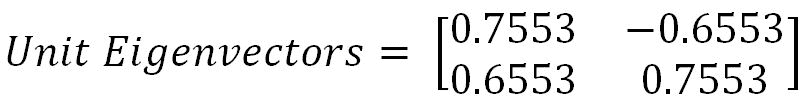

# 第四章：无监督学习

无监督学习的目标是发现数据中的隐藏模式或结构，其中不存在用于执行分类或回归方法的目标变量。无监督学习方法通常更具挑战性，因为结果是主观的，并且没有像预测类别或连续变量这样简单的分析目标。这些方法通常作为探索性数据分析的一部分进行。此外，由于没有公认的结果验证机制，因此很难评估无监督学习方法获得的结果。

尽管如此，无监督学习方法在各个领域的应用越来越重要，成为当前的热门话题，许多研究人员正在积极研究这些方法，探索这一新领域。以下是一些良好的应用示例：

+   **基因组学**：将无监督学习应用于理解基因组范围的生物学见解，从 DNA 入手更好地理解疾病和人类。这些任务本质上更具探索性。

+   **搜索引擎**：搜索引擎可能会根据其他相似用户的点击历史来选择显示哪些搜索结果给特定个体。

+   **知识提取**：从原始文本中提取概念的分类法，生成知识图谱，以创建自然语言处理（NLP）领域的语义结构。

+   **客户细分**：在银行业中，像聚类这样的无监督学习被应用于将相似的客户分组，并根据这些细分，营销部门设计他们的接触策略。例如，年龄较大、低风险的客户将通过定期存款产品进行目标营销，而高风险、年轻的客户则会通过信用卡或共同基金等进行营销，等等。

+   **社交网络分析**：识别网络中彼此更紧密连接、具有共同特征的凝聚群体。

在本章中，我们将介绍以下技术，使用公开可获得的数据进行无监督学习：

+   K-means 聚类

+   主成分分析

+   奇异值分解

+   深度自编码器

# K-means 聚类

聚类是将观察值分组的任务，确保同一聚类的成员彼此之间更加相似，而不同聚类的成员之间差异较大。

聚类通常用于探索数据集，以识别其中的潜在模式或创建一组特征。在社交网络中，可以通过聚类来识别社区并建议人们之间缺失的连接。以下是一些示例：

+   在反洗钱措施中，可以通过异常检测识别可疑的活动和个人。

+   在生物学中，聚类用于寻找具有相似表达模式的基因群体。

+   在市场营销分析中，聚类用于寻找相似客户的细分群体，从而为不同的客户群体制定不同的营销策略。

k-means 聚类算法是一个迭代过程，它将聚类中心或质心移动到其组成点的均值位置，并反复将实例分配到最接近的聚类，直到聚类中心数量没有显著变化或达到最大迭代次数。

k-means 的代价函数由属于某个聚类的观测值与其相应质心之间的欧几里得距离（平方范数）决定。理解该公式的一种直观方法是，如果只有一个聚类（*k=1*），那么所有观测值与该单一均值的距离将被比较。而如果聚类数增加到*2*（*k=2*），则计算两个均值，一些观测值被分配到聚类*1*，另一些观测值根据距离分配到聚类*2*。随后，通过应用相同的距离度量，但分别对其聚类中心计算距离，从而得到代价函数：


# 从第一性原理出发的 K-means 工作方法论

k-means 的工作方法论通过以下示例进行了说明，在该示例中考虑了 12 个实例及其*X*和*Y*值。任务是从数据中确定最优的聚类。

| **实例** | **X** | **Y** |
| --- | --- | --- |
| 1 | 7 | 8 |
| 2 | 2 | 4 |
| 3 | 6 | 4 |
| 4 | 3 | 2 |
| 5 | 6 | 5 |
| 6 | 5 | 7 |
| 7 | 3 | 3 |
| 8 | 1 | 4 |
| 9 | 5 | 4 |
| 10 | 7 | 7 |
| 11 | 7 | 6 |
| 12 | 2 | 1 |

在将数据点绘制到二维图表上后，我们可以看到大致上有两个聚类可能性，其中左下角是第一个聚类，右上角是另一个聚类。但在许多实际案例中，变量（或维度）会非常多，以至于我们无法简单地将其可视化。因此，我们需要一种数学和算法的方法来解决这些问题。


迭代 1：假设从所有*12*个实例中选择两个中心。这里，我们选择了实例*1*（*X = 7, Y = 8*）和实例*8*（*X = 1, Y = 4*），因为它们似乎位于两个极端。对于每个实例，我们将计算其相对于两个质心的欧几里得距离，并将其分配到最近的聚类中心。

| **实例** | **X** | **Y** | **质心 1 距离** | **质心 2 距离** | **分配的聚类** |
| --- | --- | --- | --- | --- | --- |
| 1 | 7 | 8 | 7.21 | 0.00 | C2 |
| 2 | 2 | 4 | 1.00 | 6.40 | C1 |
| 3 | 6 | 4 | 5.00 | 4.12 | C2 |
| 4 | 3 | 2 | 2.83 | 7.21 | C1 |
| 5 | 6 | 5 | 5.10 | 3.16 | C2 |
| 6 | 5 | 7 | 5.00 | 2.24 | C2 |
| 7 | 3 | 3 | 2.24 | 6.40 | C1 |
| 8 | 1 | 4 | 0.00 | 7.21 | C1 |
| 9 | 5 | 4 | 4.00 | 4.47 | C1 |
| 10 | 7 | 7 | 6.71 | 1.00 | C2 |
| 11 | 7 | 6 | 6.32 | 2.00 | C2 |
| 12 | 2 | 1 | 3.16 | 8.60 | C1 |
| 聚类中心 1 | 1 | 4 |  |  |  |
| 聚类中心 2 | 7 | 8 |  |  |  |

两点之间的欧几里得距离 *A (X1, Y1)* 和 *B (X2, Y2)* 如下所示：


聚类中心的距离计算是通过计算欧几里得距离来进行的。以下展示了一个样本计算。例如，六号实例与两个聚类中心（聚类中心 1 和聚类中心 2）之间的距离。


以下图表描述了实例到两个聚类中心的分配情况，格式与前面的表格相同：


如果仔细观察前面的图表，我们会发现，除了实例*9 (X =5, Y = 4)*外，所有实例似乎都已被正确分配。然而，在后续阶段，它应该被正确分配。让我们看看下面的步骤中分配是如何演变的。

迭代 2：在此迭代中，新的聚类中心由分配给该聚类或聚类中心的实例计算得出。新的聚类中心是基于所分配点的简单平均值来计算的。

| **实例** | **X** | **Y** | **分配的聚类** |
| --- | --- | --- | --- |
| 1 | 7 | 8 | C2 |
| 2 | 2 | 4 | C1 |
| 3 | 6 | 4 | C2 |
| 4 | 3 | 2 | C1 |
| 5 | 6 | 5 | C2 |
| 6 | 5 | 7 | C2 |
| 7 | 3 | 3 | C1 |
| 8 | 1 | 4 | C1 |
| 9 | 5 | 4 | C1 |
| 10 | 7 | 7 | C2 |
| 11 | 7 | 6 | C2 |
| 12 | 2 | 1 | C1 |
| 聚类中心 1 | 2.67 | 3 |  |
| 聚类中心 2 | 6.33 | 6.17 |  |

聚类中心 1 和 2 的样本计算如下所示。类似的方法将应用于所有后续的迭代：


更新聚类中心后，我们需要将实例重新分配给最近的聚类中心，这将在迭代 3 中执行。

迭代 3：在此迭代中，新的分配是基于实例与新聚类中心之间的欧几里得距离计算的。如果发生任何变化，将反复计算新的聚类中心，直到分配没有变化或达到迭代次数为止。下表描述了新聚类中心与所有实例之间的距离度量：

| **实例** | **X** | **Y** | **质心 1 距离** | **质心 2 距离** | **先前分配的聚类** | **新分配的聚类** | **是否变化？** |
| --- | --- | --- | --- | --- | --- | --- | --- |
| 1 | 7 | 8 | 6.61 | 1.95 | C2 | C2 | No |
| 2 | 2 | 4 | 1.20 | 4.84 | C1 | C1 | No |
| 3 | 6 | 4 | 3.48 | 2.19 | C2 | C2 | No |
| 4 | 3 | 2 | 1.05 | 5.34 | C1 | C1 | No |
| 5 | 6 | 5 | 3.88 | 1.22 | C2 | C2 | No |
| 6 | 5 | 7 | 4.63 | 1.57 | C2 | C2 | No |
| 7 | 3 | 3 | 0.33 | 4.60 | C1 | C1 | No |
| 8 | 1 | 4 | 1.95 | 5.75 | C1 | C1 | No |
| 9 | 5 | 4 | 2.54 | 2.55 | C1 | C1 | No |
| 10 | 7 | 7 | 5.89 | 1.07 | C2 | C2 | No |
| 11 | 7 | 6 | 5.27 | 0.69 | C2 | C2 | No |
| 12 | 2 | 1 | 2.11 | 6.74 | C1 | C1 | No |
| 质心 1 | 2.67 | 3 |  |  |  |  |  |
| 质心 2 | 6.33 | 6.17 |  |  |  |  |  |

似乎没有注册到任何变化。因此，我们可以说，解决方案已经收敛。需要注意的一点是，除了实例*9 (X = 5, Y = 4)*外，所有实例都已非常清晰地被分类。根据直觉，它应该分配给质心 2，但经过仔细计算后，该实例实际上更接近聚类 1 而非聚类 2。然而，距离的差异非常小（质心 1 的距离为 2.54，质心 2 的距离为 2.55）。

# 最优聚类数量与聚类评估

尽管选择聚类的数量更像是一门艺术而非科学，但在选择最优聚类数时，若增加聚类数后，解释能力的提升非常小，则可以选择该数量。在实际应用中，通常业务方应该能够提供他们大致需要的聚类数量。

# 肘部法则

肘部法则用于确定 k-means 聚类中的最优聚类数量。肘部法则绘制不同*k*值下由代价函数产生的值。如你所知，当*k*增加时，平均失真度会降低，每个聚类的构成实例会减少，并且实例会更接近各自的质心。然而，随着*k*的增加，平均失真度的改善会逐渐减缓。失真度改善下降最明显的*k*值称为肘部，应该在此停止继续划分数据为更多的聚类。


使用轮廓系数评估聚类：轮廓系数是衡量聚类紧凑性和分离度的指标。较高的值代表更好的聚类质量。轮廓系数对紧凑且分离良好的聚类较高，而对重叠聚类则较低。轮廓系数值变化范围从 -1 到 +1，值越高，聚类质量越好。

轮廓系数是按实例计算的。对于一组实例，它是各个样本得分的平均值。


*a* 是簇内实例之间的平均距离，*b* 是该实例与下一个最近簇中实例之间的平均距离。

# 使用鸢尾花数据集进行 K-means 聚类示例

经典的鸢尾花数据集来自 UCI 机器学习库，用于演示 K-means 聚类。数据下载链接在此：[`archive.ics.uci.edu/ml/datasets/Iris`](http://archive.ics.uci.edu/ml/datasets/Iris)。鸢尾花数据集包含三种花卉：山鸢尾、变色鸢尾和维吉尼亚鸢尾，以及它们的萼片长度、萼片宽度、花瓣长度和花瓣宽度的相应测量值。我们的任务是根据这些测量值将花卉分组。代码如下：

```py
>>> import os 
""" First change the following directory link to where all input files do exist """ 
>>> os.chdir("D:\\Book writing\\Codes\\Chapter 8") 

K-means algorithm from scikit-learn has been utilized in the following example 

# K-means clustering 
>>> import numpy as np 
>>> import pandas as pd 
>>> import matplotlib.pyplot as plt 
>>> from scipy.spatial.distance import cdist, pdist 

>>> from sklearn.cluster import KMeans 
>>> from sklearn.metrics import silhouette_score
```

```py
>>> iris = pd.read_csv("iris.csv") 
>>> print (iris.head()) 
```


以下代码用于将 `class` 变量作为依赖变量来为图中的颜色创建并应用无监督学习算法，且在给定的 `x` 变量上进行操作，没有目标变量：

```py
>>> x_iris = iris.drop(['class'],axis=1) 
>>> y_iris = iris["class"] 
```

作为示例，使用了三个簇，但在现实生活中，我们无法事先知道数据将属于多少个簇，因此需要通过反复试验来测试结果。这里选择的最大迭代次数为 300，当然，这个值也可以调整并相应地检查结果：

```py
>>> k_means_fit = KMeans(n_clusters=3,max_iter=300) 
>>> k_means_fit.fit(x_iris) 

>>> print ("\nK-Means Clustering - Confusion Matrix\n\n",pd.crosstab(y_iris, k_means_fit.labels_,rownames = ["Actuall"],colnames = ["Predicted"]) )      
>>> print ("\nSilhouette-score: %0.3f" % silhouette_score(x_iris, k_means_fit.labels_, metric='euclidean')) 
```


从之前的混淆矩阵中，我们可以看到所有的山鸢尾花都被正确地聚类，而 50 个变色鸢尾花中的 2 个和 50 个维吉尼亚鸢尾花中的 14 个被错误地分类。

再次强调，在现实生活中的例子中，我们事先并不知道类别名称，因此无法衡量准确性等指标。

以下代码用于执行敏感性分析，检查实际提供更好细分解释的簇的数量：

```py
>>> for k in range(2,10): 
...     k_means_fitk = KMeans(n_clusters=k,max_iter=300) 
...     k_means_fitk.fit(x_iris) 
...     print ("For K value",k,",Silhouette-score: %0.3f" % silhouette_score(x_iris, k_means_fitk.labels_, metric='euclidean')) 
```


上述结果中的轮廓系数值显示，`K 值 2` 和 `K 值 3` 的得分优于其他所有值。作为经验法则，我们需要选择轮廓系数最高的下一个 `K 值`。在这里，我们可以说 `K 值 3` 更好。此外，在得出最佳 `K 值` 之前，我们还需要查看每个簇内的平均变化值和肘部图。

```py
# Avg. within-cluster sum of squares 
>>> K = range(1,10) 

>>> KM = [KMeans(n_clusters=k).fit(x_iris) for k in K] 
>>> centroids = [k.cluster_centers_ for k in KM] 

>>> D_k = [cdist(x_iris, centrds, 'euclidean') for centrds in centroids] 

>>> cIdx = [np.argmin(D,axis=1) for D in D_k] 
>>> dist = [np.min(D,axis=1) for D in D_k] 
>>> avgWithinSS = [sum(d)/x_iris.shape[0] for d in dist] 

# Total with-in sum of square 
>>> wcss = [sum(d**2) for d in dist] 
>>> tss = sum(pdist(x_iris)**2)/x_iris.shape[0] 
>>> bss = tss-wcss 

# elbow curve - Avg. within-cluster sum of squares 
>>> fig = plt.figure() 
>>> ax = fig.add_subplot(111) 
>>> ax.plot(K, avgWithinSS, 'b*-') 
>>> plt.grid(True) 
>>> plt.xlabel('Number of clusters') 
>>> plt.ylabel('Average within-cluster sum of squares') 
```


从肘部图中看，值为三时，斜率发生了剧烈变化。在这里，我们可以选择最优的 k 值为三。

```py
# elbow curve - percentage of variance explained 
>>> fig = plt.figure() 
>>> ax = fig.add_subplot(111) 
>>> ax.plot(K, bss/tss*100, 'b*-') 
>>> plt.grid(True) 
>>> plt.xlabel('Number of clusters') 
>>> plt.ylabel('Percentage of variance explained')
>>> plt.show()
```


最后但同样重要的是，解释的总方差百分比值应该大于 80%，以决定最优的聚类数量。即使在这里，k 值为三似乎也能提供一个合理的总方差解释值。因此，我们可以从前述的所有指标（轮廓系数、聚类内平均方差和总方差解释）得出结论，三类聚类是理想的。

使用鸢尾花数据的 k 均值聚类的 R 代码如下：

```py
setwd("D:\\Book writing\\Codes\\Chapter 8")   

iris_data = read.csv("iris.csv")   
x_iris =   iris_data[,!names(iris_data) %in% c("class")]   
y_iris = iris_data$class   

km_fit = kmeans(x_iris,centers   = 3,iter.max = 300 )   

print(paste("K-Means   Clustering- Confusion matrix"))   
table(y_iris,km_fit$cluster)   

mat_avgss = matrix(nrow = 10,   ncol = 2)   

# Average within the cluster   sum of square   
print(paste("Avg. Within   sum of squares"))   
for (i in (1:10)){   
  km_fit =   kmeans(x_iris,centers = i,iter.max = 300 )   
  mean_km =   mean(km_fit$withinss)   
  print(paste("K-Value",i,",Avg.within   sum of squares",round(mean_km, 2)))   
  mat_avgss[i,1] = i   
  mat_avgss[i,2] = mean_km   
}   
 plot(mat_avgss[,1],mat_avgss[,2],type   = 'o',xlab = "K_Value",ylab = "Avg. within sum of square")   
title("Avg. within sum of   squares vs. K-value")   

mat_varexp = matrix(nrow = 10,   ncol = 2)   
# Percentage of Variance   explained   
print(paste("Percent.   variance explained"))   
for (i in (1:10)){   
  km_fit =   kmeans(x_iris,centers = i,iter.max = 300 )   
  var_exp =   km_fit$betweenss/km_fit$totss   
  print(paste("K-Value",i,",Percent   var explained",round(var_exp,4)))   
  mat_varexp[i,1]=i   
  mat_varexp[i,2]=var_exp   
}   

plot(mat_varexp[,1],mat_varexp[,2],type   = 'o',xlab = "K_Value",ylab = "Percent Var explained")   
title("Avg. within sum of   squares vs. K-value") 
```

# 主成分分析 - PCA

**主成分分析**（**PCA**）是一种具有多种用途的降维技术。PCA 通过将数据投影到低维子空间来减少数据集的维度。例如，可以通过将点投影到一条线上来减少二维数据集。数据集中的每个实例将由单个值表示，而不是一对值。以类似的方式，可以通过将变量投影到平面上将三维数据集减少到二维。PCA 具有以下用途：

+   缓解维度灾难

+   在压缩数据的同时，尽量减少信息丢失。

+   主成分将在监督学习的下一阶段中进一步应用，如随机森林、提升方法等。

+   理解具有数百个维度的数据结构可能很困难，因此，通过将维度减少到二维或三维，可以更容易地可视化观察结果。

主成分分析（PCA）可以通过以下机械支架的示意图来轻松解释，该图已在机械工程课程的机械制图模块中绘制。图的左侧展示了组件的顶部视图、正面视图和侧面视图。而右侧则绘制了等轴测视图，其中使用了一张图像来可视化组件的外观。所以，可以想象，左侧的图像是实际的变量，右侧则是第一个主成分，其中捕获了大部分方差。

最终，通过旋转轴向，三张图像被替换为一张图像。实际上，我们在 PCA 分析中应用了相同的技术。


主成分工作方法在以下示例中进行了说明，实际数据在二维空间中展示，其中使用*X*和*Y*轴来绘制数据。主成分是捕捉数据最大变异性的部分。


下图展示了拟合主成分后的效果。第一个主成分涵盖了数据中的最大方差，第二个主成分与第一个主成分正交，正如我们所知，所有主成分彼此正交。我们可以仅用第一个主成分来表示整个数据。事实上，这就是用更少的维度表示数据的优势，不仅可以节省空间，还能抓取数据中的最大方差，这在下一阶段的监督学习中可以得到利用。这就是计算主成分的核心优势。


特征向量和特征值在线性代数、物理学、力学等领域具有重要意义。在学习主成分分析（PCA）时，刷新对特征向量和特征值的基础知识是必要的。特征向量是线性变换作用下仅通过 *拉伸/压缩* 和/或 *翻转* 的轴（方向）；而特征值则告诉你压缩发生的倍数。换句话说，线性变换的特征向量是一个非零向量，在应用该线性变换时，其方向保持不变。

更正式地说，*A* 是从向量空间到  的线性变换，如果  是  的标量倍数，则  是 *A* 的特征向量。该条件可以写为以下方程：


在前面的方程中， 是一个特征向量，*A* 是一个方阵，λ 是一个标量，称为特征值。特征向量的方向在被 *A* 变换后保持不变，只有其大小发生了变化，这一变化由特征值表示。换句话说，将一个矩阵乘以其特征向量等同于对特征向量进行缩放，这是原始矩阵的紧凑表示。下图展示了特征向量和特征值在二维空间中的图形表示：


以下示例描述了如何从方阵及其理解中计算特征向量和特征值。请注意，特征向量和特征值只能针对方阵（行列数相同的矩阵）进行计算。


回想一下方程，即 *A* 与任何 *A* 的特征向量的乘积必须等于特征向量与特征值的大小相乘：


特征方程表明矩阵的行列式，即数据矩阵与单位矩阵和特征值的乘积之差为*0*。


前述矩阵的两个特征值均为*-2*。我们可以使用特征值来替代方程中的特征向量：


将特征值代入前述方程，我们将得到以下公式：


前述方程可以重写为以下方程组：


这个方程表明它可以有多个特征向量的解，我们可以用任何满足前述方程的值进行替代以验证方程。在这里，我们使用了向量*[1 1]*进行验证，似乎已被证明。


PCA 需要单位特征向量进行计算，因此我们需要用范数除以特征向量，或者我们需要对特征向量进行归一化处理。二范数方程如下所示：


输出向量的范数计算如下：


单位特征向量如下所示：


# PCA 从基本原理出发的工作方法

PCA 工作方法在以下示例数据中描述，每个实例或数据点有两个维度。这里的目标是将二维数据降维为一维（也称为**主成分**）：

| **实例** | **X** | **Y** |
| --- | --- | --- |
| 1 | 0.72 | 0.13 |
| 2 | 0.18 | 0.23 |
| 3 | 2.50 | 2.30 |
| 4 | 0.45 | 0.16 |
| 5 | 0.04 | 0.44 |
| 6 | 0.13 | 0.24 |
| 7 | 0.30 | 0.03 |
| 8 | 2.65 | 2.10 |
| 9 | 0.91 | 0.91 |
| 10 | 0.46 | 0.32 |
| 列均值 | 0.83 | 0.69 |

第一步，在进行任何分析之前，是从所有观察值中减去均值，这样可以去除变量的尺度因素，并使它们在各维度之间更加统一。

| **X** | **Y** |
| --- | --- |
| *0.72 - 0.83 = -0.12* | *0.13 - 0.69 = - 0.55* |
| *0.18 - 0.83 = -0.65* | *0.23 - 0.69 = - 0.46* |
| *2.50 - 0.83 = 1.67* | *2.30 - 0.69 = 1.61* |
| *0.45 - 0.83 = -0.38* | *0.16 - 0.69 = - 0.52* |
| *0.04 - 0.83 = -0.80* | *0.44 - 0.69 = - 0.25* |
| *0.13 - 0.83 = -0.71* | *0.24 - 0.69 = - 0.45* |
| *0.30 - 0.83 = -0.53* | *0.03 - 0.69 = - 0.66* |
| *2.65 - 0.83 = 1.82* | *2.10 - 0.69 = 1.41* |
| *0.91 - 0.83 = 0.07* | *0.91 - 0.69 = 0.23* |
| *0.46 - 0.83 = -0.37* | *0.32 - 0.69 = -0.36* |

主成分可以通过两种不同的技术进行计算：

+   数据的协方差矩阵

+   奇异值分解

我们将在下一节中介绍奇异值分解技术。在本节中，我们将使用协方差矩阵方法求解特征向量和特征值。

协方差是衡量两个变量共同变化程度的指标，也是衡量两个变量集合之间相关性强度的度量。如果两个变量的协方差为零，我们可以得出结论，说明这两个变量集合之间没有任何相关性。协方差的公式如下：


下面的公式展示了 *X* 和 *Y* 变量的样本协方差计算。然而，它是一个 2 x 2 的矩阵，表示整个协方差矩阵（此外，它是一个方阵）。


由于协方差矩阵是方阵，我们可以从中计算特征向量和特征值。你可以参考前面章节中解释的方法。


通过求解上述方程，我们可以获得特征向量和特征值，如下所示：



前述结果可以通过以下 Python 语法获得：

```py
>>> import numpy as np
>>> w, v = np.linalg.eig(np.array([[ 0.91335 ,0.75969 ],[ 0.75969,0.69702]]))
\>>> print ("\nEigen Values\n", w)
>>> print ("\nEigen Vectors\n", v)
```


一旦获得特征向量和特征值，我们可以将数据投影到主成分上。第一个特征向量具有最大的特征值，是第一个主成分，因为我们希望将原始的 2D 数据压缩成 1D 数据。


从上述结果中，我们可以看到原始 2D 数据的第一个主成分的 1D 投影。此外，特征值 1.5725 表明主成分解释了原始变量 57% 的方差。在多维数据的情况下，一般的经验法则是选择特征值或主成分的值大于某个阈值作为投影的依据。

# 使用 scikit-learn 对手写数字应用 PCA

PCA 示例已通过来自 scikit-learn 数据集的手写数字示例进行说明，其中手写数字从 0 到 9，并且其相应的 64 个特征（8 x 8 矩阵）表示像素强度。这里的核心思想是将原始的 64 维特征尽可能压缩到更少的维度：

```py
# PCA - Principal Component Analysis 
>>> import matplotlib.pyplot as plt 
>>> from sklearn.decomposition import PCA 
>>> from sklearn.datasets import load_digits 

>>> digits = load_digits() 
>>> X = digits.data 
>>> y = digits.target 

>>> print (digits.data[0].reshape(8,8)) 
```


使用 `plt.show` 函数绘制图形：

```py
>>> plt.matshow(digits.images[0])  
>>> plt.show()  
```


在执行 PCA 之前，建议对输入数据进行缩放，以消除因数据维度不同而可能产生的问题。例如，在对客户数据应用 PCA 时，客户的薪水维度要大于客户的年龄维度。因此，如果我们没有将所有变量缩放到相同的维度，一个变量会解释整个变化，而不是其实际的影响。在下面的代码中，我们已对所有列分别进行了缩放：

```py
>>> from sklearn.preprocessing import scale 
>>> X_scale = scale(X,axis=0)
```

在下面的代码中，我们使用了两个主成分，以便将性能表示在 2D 图上。在后续部分，我们还应用了 3D。

```py
>>> pca = PCA(n_components=2) 
>>> reduced_X = pca.fit_transform(X_scale) 

>>> zero_x, zero_y = [],[] ; one_x, one_y = [],[] 
>>> two_x,two_y = [],[]; three_x, three_y = [],[] 
>>> four_x,four_y = [],[]; five_x,five_y = [],[] 
>>> six_x,six_y = [],[]; seven_x,seven_y = [],[] 
>>> eight_x,eight_y = [],[]; nine_x,nine_y = [],[] 
```

在下面的代码部分中，我们将相关的主成分分别附加到每个数字上，以便我们可以创建所有 10 个数字的散点图：

```py
>>> for i in range(len(reduced_X)): 
...     if y[i] == 0: 
...         zero_x.append(reduced_X[i][0]) 
...         zero_y.append(reduced_X[i][1]) 

...     elif y[i] == 1: 
...         one_x.append(reduced_X[i][0]) 
...         one_y.append(reduced_X[i][1]) 

...     elif y[i] == 2: 
...         two_x.append(reduced_X[i][0]) 
...         two_y.append(reduced_X[i][1]) 

...     elif y[i] == 3: 
...         three_x.append(reduced_X[i][0]) 
...         three_y.append(reduced_X[i][1]) 

...     elif y[i] == 4: 
...         four_x.append(reduced_X[i][0]) 
...         four_y.append(reduced_X[i][1]) 

...     elif y[i] == 5: 
...         five_x.append(reduced_X[i][0]) 
...         five_y.append(reduced_X[i][1]) 

...     elif y[i] == 6: 
...         six_x.append(reduced_X[i][0]) 
...         six_y.append(reduced_X[i][1]) 

...     elif y[i] == 7: 
...         seven_x.append(reduced_X[i][0]) 
...         seven_y.append(reduced_X[i][1]) 

...     elif y[i] == 8: 
...         eight_x.append(reduced_X[i][0]) 
...         eight_y.append(reduced_X[i][1]) 

...     elif y[i] == 9: 
...         nine_x.append(reduced_X[i][0]) 
...         nine_y.append(reduced_X[i][1]) 
>>> zero = plt.scatter(zero_x, zero_y, c='r', marker='x',label='zero') 
>>> one = plt.scatter(one_x, one_y, c='g', marker='+') 
>>> two = plt.scatter(two_x, two_y, c='b', marker='s') 

>>> three = plt.scatter(three_x, three_y, c='m', marker='*') 
>>> four = plt.scatter(four_x, four_y, c='c', marker='h') 
>>> five = plt.scatter(five_x, five_y, c='r', marker='D') 

>>> six = plt.scatter(six_x, six_y, c='y', marker='8') 
>>> seven = plt.scatter(seven_x, seven_y, c='k', marker='*') 
>>> eight = plt.scatter(eight_x, eight_y, c='r', marker='x') 

>>> nine = plt.scatter(nine_x, nine_y, c='b', marker='D') 

>>> plt.legend((zero,one,two,three,four,five,six,seven,eight,nine), 
...            ('zero','one','two','three','four','five','six', 'seven','eight','nine'), 
...            scatterpoints=1, 
...            loc='lower left', 
...            ncol=3, 
...            fontsize=10) 

>>> plt.xlabel('PC 1') 
>>> plt.ylabel('PC 2') 

>>> plt.show() 
```


尽管前面的图看起来有些杂乱，但它确实提供了一些关于数字彼此之间的远近的想法。我们可以得出结论，数字*6*和*8*非常相似，而数字*4*和*7*则远离中心组，等等。然而，我们也应该尝试使用更多的主成分，因为有时我们可能无法在二维中完全表示每个变化。

在下面的代码中，我们应用了三个主成分，以便可以在 3D 空间中更好地查看数据。这个过程与两个主成分非常相似，除了为每个数字创建一个额外的维度（*X*、*Y* 和 *Z*）。

```py
# 3-Dimensional data 
>>> pca_3d = PCA(n_components=3) 
>>> reduced_X3D = pca_3d.fit_transform(X_scale) 

>>> zero_x, zero_y,zero_z = [],[],[] ; one_x, one_y,one_z = [],[],[] 
>>> two_x,two_y,two_z = [],[],[]; three_x, three_y,three_z = [],[],[] 
>>> four_x,four_y,four_z = [],[],[]; five_x,five_y,five_z = [],[],[] 
>>> six_x,six_y,six_z = [],[],[]; seven_x,seven_y,seven_z = [],[],[] 
>>> eight_x,eight_y,eight_z = [],[],[]; nine_x,nine_y,nine_z = [],[],[] 

>>> for i in range(len(reduced_X3D)): 

...     if y[i]==10: 
...         continue  

...     elif y[i] == 0: 
...         zero_x.append(reduced_X3D[i][0]) 
...         zero_y.append(reduced_X3D[i][1]) 
...         zero_z.append(reduced_X3D[i][2]) 

...     elif y[i] == 1: 
...         one_x.append(reduced_X3D[i][0]) 
...         one_y.append(reduced_X3D[i][1]) 
...         one_z.append(reduced_X3D[i][2]) 

...     elif y[i] == 2: 
...         two_x.append(reduced_X3D[i][0]) 
...         two_y.append(reduced_X3D[i][1]) 
...         two_z.append(reduced_X3D[i][2]) 

...     elif y[i] == 3: 
...         three_x.append(reduced_X3D[i][0]) 
...         three_y.append(reduced_X3D[i][1]) 
...         three_z.append(reduced_X3D[i][2]) 

...     elif y[i] == 4: 
...         four_x.append(reduced_X3D[i][0]) 
...         four_y.append(reduced_X3D[i][1]) 
...         four_z.append(reduced_X3D[i][2]) 

...     elif y[i] == 5: 
...         five_x.append(reduced_X3D[i][0]) 
...         five_y.append(reduced_X3D[i][1]) 
...         five_z.append(reduced_X3D[i][2]) 

...     elif y[i] == 6: 
...         six_x.append(reduced_X3D[i][0]) 
...         six_y.append(reduced_X3D[i][1]) 
...         six_z.append(reduced_X3D[i][2]) 

...     elif y[i] == 7: 
...         seven_x.append(reduced_X3D[i][0]) 
...         seven_y.append(reduced_X3D[i][1]) 
...         seven_z.append(reduced_X3D[i][2]) 

...     elif y[i] == 8: 
...         eight_x.append(reduced_X3D[i][0]) 
...         eight_y.append(reduced_X3D[i][1]) 
...         eight_z.append(reduced_X3D[i][2]) 

...     elif y[i] == 9: 
...         nine_x.append(reduced_X3D[i][0]) 
...         nine_y.append(reduced_X3D[i][1]) 
...         nine_z.append(reduced_X3D[i][2]) 

 # 3- Dimensional plot 
>>> from mpl_toolkits.mplot3d import Axes3D 
>>> fig = plt.figure() 
>>> ax = fig.add_subplot(111, projection='3d') 

>>> ax.scatter(zero_x, zero_y,zero_z, c='r', marker='x',label='zero') 
>>> ax.scatter(one_x, one_y,one_z, c='g', marker='+',label='one') 
>>> ax.scatter(two_x, two_y,two_z, c='b', marker='s',label='two') 

>>> ax.scatter(three_x, three_y,three_z, c='m', marker='*',label='three') 
>>> ax.scatter(four_x, four_y,four_z, c='c', marker='h',label='four') 
>>> ax.scatter(five_x, five_y,five_z, c='r', marker='D',label='five') 

>>> ax.scatter(six_x, six_y,six_z, c='y', marker='8',label='six') 
>>> ax.scatter(seven_x, seven_y,seven_z, c='k', marker='*',label='seven') 
>>> ax.scatter(eight_x, eight_y,eight_z, c='r', marker='x',label='eight') 

>>> ax.scatter(nine_x, nine_y,nine_z, c='b', marker='D',label='nine') 
>>> ax.set_xlabel('PC 1') 
>>> ax.set_ylabel('PC 2') 
>>> ax.set_zlabel('PC 3')
```

```py
>>> plt.legend(loc='upper left', numpoints=1, ncol=3, fontsize=10, bbox_to_anchor=(0, 0)) 

>>> plt.show()
```


与 R 图等其他软件绘图相比，matplotlib 图形有一个巨大的优势。它们是交互式的，这意味着我们可以旋转它们并从不同的角度观察它们的外观。我们鼓励读者通过旋转和探索来观察图形。在 3D 图中，我们可以看到类似的情况，并得到更多的解释。数字*2*位于最左边，数字*0*位于图形的下方。而数字*4*位于右上角，数字*6*似乎更靠近*PC 1*轴。通过这种方式，我们可以可视化并观察数字如何分布。在使用 4 个主成分时，我们需要使用子图并分别进行可视化。

选择提取多少主成分是无监督学习中的一个开放性问题，但有一些方法可以得到一个大致的估计。我们可以通过两种方式来确定聚类的数量：

+   检查总方差解释是否在边际上开始减少

+   总方差解释大于 80%

以下代码提供了随着主成分数目变化，所解释的总方差。随着主成分数目的增加，能够解释的方差也会增多。但挑战在于尽可能限制主成分的数量，这可以通过限制方差解释的边际增量开始下降来实现。

```py
# Choosing number of Principal Components 
>>> max_pc = 30 

>>> pcs = [] 
>>> totexp_var = [] 

>>> for i in range(max_pc): 
...     pca = PCA(n_components=i+1) 
...     reduced_X = pca.fit_transform(X_scale) 
...     tot_var = pca.explained_variance_ratio_.sum() 
...     pcs.append(i+1) 
...     totexp_var.append(tot_var) 

>>> plt.plot(pcs,totexp_var,'r') 
>>> plt.plot(pcs,totexp_var,'bs') 
>>> plt.xlabel('No. of PCs',fontsize = 13) 
>>> plt.ylabel('Total variance explained',fontsize = 13) 
```

```py
>>> plt.xticks(pcs,fontsize=13) 
>>> plt.yticks(fontsize=13) 
>>> plt.show() 

```


从之前的图中可以看到，总方差解释度在 10 个主成分（PCA）时略微减少；而 21 个主成分时，总方差解释度大于 80%。选择哪个值取决于业务和用户的需求。

应用于手写数字数据的 PCA 的 R 代码如下：

```py
# PCA   
digits_data = read.csv("digitsdata.csv")   

remove_cols = c("target")   
x_data =   digits_data[,!(names(digits_data) %in% remove_cols)]   
y_data = digits_data[,c("target")]   

# Normalizing the data   
normalize <- function(x)   {return((x - min(x)) / (max(x) - min(x)))}   
data_norm <-   as.data.frame(lapply(x_data, normalize))   
data_norm <-   replace(data_norm, is.na(data_norm), 0.0)   

# Extracting Principal   Components   
pr_out =prcomp(data_norm)   
pr_components_all = pr_out$x   

# 2- Dimensional PCA   
K_prcomps = 2   
pr_components =   pr_components_all[,1:K_prcomps]   

pr_components_df =   data.frame(pr_components)   
pr_components_df =   cbind(pr_components_df,digits_data$target)   
names(pr_components_df)[K_prcomps+1]   = "target"   

out <- split(   pr_components_df , f = pr_components_df$target )   
zero_df = out$`0`;one_df =   out$`1`;two_df = out$`2`; three_df = out$`3`; four_df = out$`4`   
five_df = out$`5`;six_df =   out$`6`;seven_df = out$`7`;eight_df = out$`8`;nine_df = out$`9`   

library(ggplot2)   
# Plotting 2-dimensional PCA   
ggplot(pr_components_df, aes(x   = PC1, y = PC2, color = factor(target,labels = c("zero","one","two",   "three","four", "five","six","seven","eight","nine"))))   +    
geom_point()+ggtitle("2-D   PCA on Digits Data") +   
labs(color = "Digtis")   

# 3- Dimensional PCA   
# Plotting 3-dimensional PCA   
K_prcomps = 3   

pr_components =   pr_components_all[,1:K_prcomps]   
pr_components_df =   data.frame(pr_components)   
pr_components_df =   cbind(pr_components_df,digits_data$target)   
names(pr_components_df)[K_prcomps+1]   = "target"   

pr_components_df$target =   as.factor(pr_components_df$target)   

out <- split(   pr_components_df , f = pr_components_df$target )   
zero_df = out$`0`;one_df =   out$`1`;two_df = out$`2`; three_df = out$`3`; four_df = out$`4`   
five_df = out$`5`;six_df =   out$`6`;seven_df = out$`7`;eight_df = out$`8`;nine_df = out$`9`   

library(scatterplot3d)   
colors <- c("darkred",   "darkseagreen4", "deeppink4", "greenyellow", "orange",   "navyblue", "red", "tan3", "steelblue1",   "slateblue")   
colors <- colors[as.numeric(pr_components_df$target)]   
s3d =   scatterplot3d(pr_components_df[,1:3], pch = 16, color=colors,   
xlab = "PC1",ylab = "PC2",zlab   = "PC3",col.grid="lightblue",main = "3-D PCA on   Digits Data")   
legend(s3d$xyz.convert(3.1,   0.1, -3.5), pch = 16, yjust=0,   
       legend =   levels(pr_components_df$target),col =colors,cex = 1.1,xjust = 0)   

# Choosing number of Principal   Components   
pr_var =pr_out$sdev ²   
pr_totvar = pr_var/sum(pr_var)   
plot(cumsum(pr_totvar), xlab="Principal   Component", ylab ="Cumilative Prop. of Var.",   ylim=c(0,1),type="b",main = "PCAs vs. Cum prop of Var   Explained") 
```

# 奇异值分解 - SVD

许多 PCA 实现使用奇异值分解来计算特征向量和特征值。SVD 通过以下方程给出：


*U* 的列称为数据矩阵的左奇异向量，*V* 的列是其右奇异向量， 的对角线条目是其奇异值。左奇异向量是协方差矩阵的特征向量， 的对角元素是协方差矩阵特征值的平方根。

在进行 SVD 之前，了解一些 SVD 的优点和重要点是明智的：

+   SVD 可以应用于矩形矩阵；而特征值仅定义于方阵。通过 SVD 方法获得的特征值等价物称为奇异值，得到的与特征向量等价的向量称为奇异向量。然而，由于它们本质上是矩形的，我们需要分别为它们的维度计算左奇异向量和右奇异向量。

+   如果矩阵 *A* 的特征向量矩阵 *P* 不可逆，那么 *A* 没有特征分解。然而，如果 *A* 是一个 *m* x *n* 的实矩阵且 *m* > *n*，则 A 可以通过奇异值分解表示。

+   *U* 和 *V* 都是正交矩阵，这意味着 *U^T U = I*（其中 *I* 是 *m* x *m* 的单位矩阵）或 *V^T V = I*（这里 *I* 是 *n* x *n* 的单位矩阵），两个单位矩阵的维度可能不同。

+    是一个具有 *m* x *n* 维度的非负对角矩阵。

然后，奇异值和奇异向量的计算通过以下一组方程式完成：


在第一阶段，使用方程计算奇异值/特征值。一旦获得奇异值/特征值，我们将代入计算 *V* 或右奇异/特征向量：


一旦我们获得了右奇异向量和对角值，我们将代入公式以获得左奇异向量 *U*，公式如下：


这样，我们将计算原始方程矩阵的奇异值分解。

# 使用 scikit-learn 对手写数字应用 SVD

可以对相同的手写数字数据应用 SVD，以进行技术的“苹果对苹果”比较。

```py
# SVD 
>>> import matplotlib.pyplot as plt 
>>> from sklearn.datasets import load_digits 

>>> digits = load_digits() 
>>> X = digits.data 
>>> y = digits.target 
```

在下面的代码中，使用了 15 个奇异向量和 300 次迭代，但我们鼓励读者修改这些值并检查 SVD 的性能。我们使用了两种类型的 SVD 函数，其中`randomized_svd`函数提供了原始矩阵的分解，而`TruncatedSVD`函数则可以提供总方差解释比例。在实际应用中，用户可能不需要查看所有的分解，只需使用`TruncatedSVD`函数来满足实际需求。

```py
>>> from sklearn.utils.extmath import randomized_svd 
>>> U,Sigma,VT = randomized_svd(X,n_components=15,n_iter=300,random_state=42) 

>>> import pandas as pd 
>>> VT_df = pd.DataFrame(VT) 

>>> print ("\nShape of Original Matrix:",X.shape) 
>>> print ("\nShape of Left Singular vector:",U.shape) 
>>> print ("Shape of Singular value:",Sigma.shape) 
>>> print ("Shape of Right Singular vector",VT.shape) 
```


从之前的截图中，我们可以看到，原始矩阵（维度为 1797 x 64）已经被分解为左奇异向量（1797 x 15）、奇异值（15 维的对角矩阵）和右奇异向量（15 x 64）。我们可以通过按顺序乘以这三种矩阵来恢复原始矩阵。

```py
>>> n_comps = 15 
>>> from sklearn.decomposition import TruncatedSVD 
>>> svd = TruncatedSVD(n_components=n_comps, n_iter=300, random_state=42) 
>>> reduced_X = svd.fit_transform(X) 

>>> print("\nTotal Variance explained for %d singular features are %0.3f"%(n_comps, svd.explained_variance_ratio_.sum())) 
```


对于 15 个奇异值特征，总方差解释为 83.4%。但是读者需要更改不同的值，以决定最优值。

以下代码说明了奇异值个数变化时总方差解释的变化：

```py
# Choosing number of Singular Values 
>>> max_singfeat = 30 
>>> singfeats = [] 
>>> totexp_var = [] 

>>> for i in range(max_singfeat): 
...     svd = TruncatedSVD(n_components=i+1, n_iter=300, random_state=42) 
...     reduced_X = svd.fit_transform(X) 
...     tot_var = svd.explained_variance_ratio_.sum() 
...     singfeats.append(i+1) 
...     totexp_var.append(tot_var) 

>>> plt.plot(singfeats,totexp_var,'r') 
>>> plt.plot(singfeats,totexp_var,'bs') 
>>> plt.xlabel('No. of Features',fontsize = 13) 
>>> plt.ylabel('Total variance explained',fontsize = 13) 

>>> plt.xticks(pcs,fontsize=13) 
>>> plt.yticks(fontsize=13) 
>>> plt.show()
```


从之前的图中，我们可以根据需求选择 8 个或 15 个奇异向量。

应用于手写数字数据的 SVD 的 R 代码如下：

```py
#SVD    
library(svd)   

digits_data = read.csv("digitsdata.csv")   

remove_cols = c("target")   
x_data =   digits_data[,!(names(digits_data) %in% remove_cols)]   
y_data = digits_data[,c("target")]   

sv2 <- svd(x_data,nu=15)   

# Computing the square of the   singular values, which can be thought of as the vector of matrix energy   
# in order to pick top singular   values which preserve at least 80% of variance explained   
energy <- sv2$d ^ 2   
tot_varexp = data.frame(cumsum(energy)   / sum(energy))   

names(tot_varexp) = "cum_var_explained"   
tot_varexp$K_value =   1:nrow(tot_varexp)   

plot(tot_varexp[,2],tot_varexp[,1],type   = 'o',xlab = "K_Value",ylab = "Prop. of Var Explained")   
title("SVD - Prop. of Var   explained with K-value")    
```

# 深度自编码器

自编码神经网络是一种无监督学习算法，它通过反向传播设置目标值，使其等于输入值 *y^((i)) = x^((i))*。自编码器试图学习一个函数 *hw,b ≈ x*，这意味着它试图学习一个近似的恒等函数，使得输出  与 *x* 类似。


尽管试图复制恒等函数看似一个简单的任务，通过在网络上施加约束（例如限制隐藏单元的数量），我们可以发现数据中的有趣结构。假设输入的图像大小为 10 x 10 像素，具有强度值，总共有 100 个输入值，第二层（隐藏层）中的神经元数量为 50 个，最终输出层有 100 个神经元，因为我们需要将图像传递并映射到自身，在此过程中，我们将迫使网络学习输入的压缩表示，即隐藏单元激活 *a^((2))  ε  R¹⁰⁰*，通过这个表示，我们必须尝试重建这 100 个像素的输入 *x*。如果输入数据完全随机，且没有任何相关性等，那么压缩将非常困难；而如果潜在的数据具有某些相关性或可检测的结构，那么这个算法将能够发现这些相关性并紧凑地表示它们。实际上，自编码器通常最终会学习到与 PCA 非常相似的低维表示。

# 使用编码器-解码器架构的模型构建技术

训练自编码器模型有点复杂，因此提供了详细的说明以便更好地理解。在训练阶段，整个编码器-解码器部分会针对相同的输入进行训练，作为解码器的输出。为了实现所需的输出，特征将在中间层进行压缩，因为我们通过了收敛和发散层。一旦通过多次迭代减少错误值完成足够的训练，就可以使用训练好的编码器部分来为下一阶段的建模创建潜在特征，或进行可视化等。

在下图中，展示了一个样本。输入层和输出层有五个神经元，而中间部分的神经元数量逐渐减少。压缩层只有两个神经元，即我们希望从数据中提取的潜在维度的数量。


下图展示了如何使用训练过的编码器部分，从新的输入数据中创建潜在特征，这些特征可以用于可视化或模型的下一个阶段：


# 使用 Keras 应用在手写数字上的深度自编码器

深度自编码器使用相同的手写数字数据进行说明，目的是展示这种非线性方法与 PCA 和 SVD 等线性方法的区别。一般来说，非线性方法的表现要好得多，但这些方法类似黑盒模型，我们无法得知其背后的解释。本文中使用了 Keras 软件来构建深度自编码器，因为它们像乐高积木一样工作，用户可以通过不同的模型架构和参数组合进行实验，以便更好地理解：

```py
# Deep Auto Encoders 
>>> import matplotlib.pyplot as plt 
>>> from sklearn.preprocessing import StandardScaler 
>>> from sklearn.datasets import load_digits 

>>> digits = load_digits() 
>>> X = digits.data 
>>> y = digits.target 

>>> print (X.shape) 
>>> print (y.shape) 
>>> x_vars_stdscle = StandardScaler().fit_transform(X) 
>>> print (x_vars_stdscle.shape) 
```


使用 Keras 的密集神经元模块构建编码器-解码器架构：

```py
>>> from keras.layers import Input,Dense 
>>> from keras.models import Model
```


本文使用了 NVIDIA GTX 1060 的 GPU，并安装了`cuDNN`和`CNMeM`库，以进一步提升性能，使其比常规 GPU 性能提高 4x-5x。这些库利用了 20%的 GPU 内存，剩下的 80%内存用于处理数据。用户需要注意，如果他们使用的是内存较小的 GPU，如 3GB 到 4GB 的显卡，可能无法充分利用这些库。

读者需要考虑一个重要的点，那就是，Keras 代码的语法在 CPU 模式和 GPU 模式下是相同的。

以下几行代码是模型的核心。输入数据有 64 列，我们需要将这些列作为层的输入，因此我们给出了 64 的形状。此外，每一层的神经网络都被赋予了名称，稍后我们会在代码的后续部分解释这样做的原因。在第一隐藏层中，使用了 32 个全连接神经元，这意味着输入层的所有 64 个输入都连接到第一隐藏层的 32 个神经元。整个维度流动是 *64, 32, 16, 2, 16, 32, 64*。我们将输入压缩到两个神经元，以便在 2D 图上绘制分量；而如果需要绘制 3D 数据（我们将在下一部分讨论），则需要将隐藏层的层数从 2 改为 3。训练完成后，我们需要使用编码器部分来预测输出。

```py
# 2-Dimensional Architecture 

>>> input_layer = Input(shape=(64,),name="input") 

>>> encoded = Dense(32, activation='relu',name="h1encode")(input_layer) 
>>> encoded = Dense(16, activation='relu',name="h2encode")(encoded) 
>>> encoded = Dense(2, activation='relu',name="h3latent_layer")(encoded) 

>>> decoded = Dense(16, activation='relu',name="h4decode")(encoded) 
>>> decoded = Dense(32, activation='relu',name="h5decode")(decoded) 
>>> decoded = Dense(64, activation='sigmoid',name="h6decode")(decoded) 
```

为了训练模型，我们需要传递架构的起点和终点。在以下代码中，我们提供了输入层为`input_layer`，输出为`decoded`，即最后一层（名称为`h6decode`）：

```py
>>> autoencoder = Model(input_layer, decoded) 
```

使用了 Adam 优化算法来优化均方误差，因为我们希望在网络的输出层末端重现原始输入：

```py
>>> autoencoder.compile(optimizer="adam", loss="mse") 
```

网络使用了 100 个周期进行训练，每个批次的批量大小为 256 个观察值。使用了 20%的验证集来检查随机选取的验证数据的准确性，以确保模型的鲁棒性，因为如果只在训练数据上训练，可能会导致过拟合问题，这在高度非线性模型中非常常见：

```py
# Fitting Encoder-Decoder model 
>>> autoencoder.fit(x_vars_stdscle, x_vars_stdscle, epochs=100,batch_size=256, shuffle=True,validation_split= 0.2 ) 
```


从之前的结果可以看出，模型已经在 1,437 个训练样本上进行了训练，并在 360 个验证样本上进行了验证。从损失值来看，训练损失和验证损失分别从 1.2314 降至 0.9361 和从 1.0451 降至 0.7326。因此，我们正在朝着正确的方向前进。然而，建议读者尝试不同的架构、迭代次数、批次大小等，看看准确度还能进一步提高多少。

一旦编码器-解码器部分训练完成，我们只需要使用编码器部分来压缩输入特征，以获得压缩的潜在特征，这也是降维的核心思想！在以下代码中，我们构建了一个新的模型，包含了训练好的输入层和中间隐藏层（`h3latent_layer`）。这就是为每一层网络分配名称的原因。

```py
# Extracting Encoder section of the Model for prediction of latent variables 
>>> encoder = Model(autoencoder.input,autoencoder.get_layer("h3latent_layer").output) 

Extracted encoder section of the whole model used for prediction of input variables to generate sparse 2-dimensional representation, which is being performed with the following code 

# Predicting latent variables with extracted Encoder model 
>>> reduced_X = encoder.predict(x_vars_stdscle)  
```

仅检查降维后的输入变量的维度，可以看到，对于所有观察值，我们可以看到两个维度或两个列向量：

```py
 >>> print (reduced_X.shape) 
```


以下代码部分非常类似于 2D 主成分分析（PCA）：

```py
>>> zero_x, zero_y = [],[] ; one_x, one_y = [],[] 
>>> two_x,two_y = [],[]; three_x, three_y = [],[] 
>>> four_x,four_y = [],[]; five_x,five_y = [],[] 
>>> six_x,six_y = [],[]; seven_x,seven_y = [],[] 
>>> eight_x,eight_y = [],[]; nine_x,nine_y = [],[] 

# For 2-Dimensional data 
>>> for i in range(len(reduced_X)): 
...     if y[i] == 0: 
...         zero_x.append(reduced_X[i][0]) 
...         zero_y.append(reduced_X[i][1]) 

...     elif y[i] == 1: 
...         one_x.append(reduced_X[i][0]) 
...         one_y.append(reduced_X[i][1]) 

...     elif y[i] == 2: 
...         two_x.append(reduced_X[i][0]) 
...         two_y.append(reduced_X[i][1]) 
 ...     elif y[i] == 3: 
...         three_x.append(reduced_X[i][0]) 
...         three_y.append(reduced_X[i][1]) 

...     elif y[i] == 4: 
...         four_x.append(reduced_X[i][0]) 
...         four_y.append(reduced_X[i][1]) 

...     elif y[i] == 5: 
...         five_x.append(reduced_X[i][0]) 
...         five_y.append(reduced_X[i][1]) 

...     elif y[i] == 6: 
...         six_x.append(reduced_X[i][0]) 
...         six_y.append(reduced_X[i][1]) 

...     elif y[i] == 7: 
...         seven_x.append(reduced_X[i][0]) 
...         seven_y.append(reduced_X[i][1]) 

...     elif y[i] == 8: 
...         eight_x.append(reduced_X[i][0]) 
 ...        eight_y.append(reduced_X[i][1]) 

 ...    elif y[i] == 9: 
 ...        nine_x.append(reduced_X[i][0]) 
 ...        nine_y.append(reduced_X[i][1]) 

>>> zero = plt.scatter(zero_x, zero_y, c='r', marker='x',label='zero') 
>>> one = plt.scatter(one_x, one_y, c='g', marker='+') 
>>> two = plt.scatter(two_x, two_y, c='b', marker='s') 

>>> three = plt.scatter(three_x, three_y, c='m', marker='*') 
>>> four = plt.scatter(four_x, four_y, c='c', marker='h') 
>>> five = plt.scatter(five_x, five_y, c='r', marker='D') 

>>> six = plt.scatter(six_x, six_y, c='y', marker='8') 
>>> seven = plt.scatter(seven_x, seven_y, c='k', marker='*') 
>>> eight = plt.scatter(eight_x, eight_y, c='r', marker='x') 

>>> nine = plt.scatter(nine_x, nine_y, c='b', marker='D') 

>>> plt.legend((zero,one,two,three,four,five,six,seven,eight,nine), 
...  ('zero','one','two','three','four','five','six','seven','eight','nine'), 
...            scatterpoints=1,loc='lower right',ncol=3,fontsize=10) 

>>> plt.xlabel('Latent Feature 1',fontsize = 13) 
>>> plt.ylabel('Latent Feature 2',fontsize = 13) 

>>> plt.show() 
```


从之前的图中我们可以看到，数据点已经很好地分离，但问题在于视角方向，因为这些特征并没有像主成分那样沿彼此垂直的维度变化。在深度自编码器中，我们需要将视角方向从*(0, 0)*改变，以便可视化这种非线性分类，接下来我们将在 3D 案例中详细展示这一点。

以下是 3D 潜在特征的代码。除了`h3latent_layer`中的值需要从`2`替换为`3`外，其余代码保持不变，因为这是编码器部分的结束，我们将在创建潜在特征时使用它，最终它将用于绘图。

```py
# 3-Dimensional architecture 
>>> input_layer = Input(shape=(64,),name="input") 

>>> encoded = Dense(32, activation='relu',name="h1encode")(input_layer) 
>>> encoded = Dense(16, activation='relu',name="h2encode")(encoded) 
>>> encoded = Dense(3, activation='relu',name="h3latent_layer")(encoded) 

>>> decoded = Dense(16, activation='relu',name="h4decode")(encoded) 
>>> decoded = Dense(32, activation='relu',name="h5decode")(decoded) 
>>> decoded = Dense(64, activation='sigmoid',name="h6decode")(decoded) 

>>> autoencoder = Model(input_layer, decoded) 
autoencoder.compile(optimizer="adam", loss="mse") 

# Fitting Encoder-Decoder model 
>>> autoencoder.fit(x_vars_stdscle, x_vars_stdscle, epochs=100,batch_size=256, shuffle=True,validation_split= 0.2) 
```


从之前的结果我们可以看到，加入三维度而不是二维度后，得到的损失值比 2D 用例中的值要低。对于两个潜在因子的训练和验证损失，在 100 轮迭代后的损失分别为 0.9061 和 0.7326，而对于三个潜在因子，在 100 轮迭代后的损失为 0.8032 和 0.6464。这表明，增加一个维度可以显著减少误差。这样，读者可以改变不同的参数，确定适合降维的理想架构：

```py
# Extracting Encoder section of the Model for prediction of latent variables 
>>> encoder = Model(autoencoder.input,autoencoder.get_layer("h3latent_layer").output) 

# Predicting latent variables with extracted Encoder model 
>>> reduced_X3D = encoder.predict(x_vars_stdscle) 

>>> zero_x, zero_y,zero_z = [],[],[] ; one_x, one_y,one_z = [],[],[] 
>>> two_x,two_y,two_z = [],[],[]; three_x, three_y,three_z = [],[],[] 
>>> four_x,four_y,four_z = [],[],[]; five_x,five_y,five_z = [],[],[] 
>>> six_x,six_y,six_z = [],[],[]; seven_x,seven_y,seven_z = [],[],[] 
>>> eight_x,eight_y,eight_z = [],[],[]; nine_x,nine_y,nine_z = [],[],[] 

>>> for i in range(len(reduced_X3D)): 

...     if y[i]==10: 
...         continue 

...     elif y[i] == 0: 
...         zero_x.append(reduced_X3D[i][0]) 
...         zero_y.append(reduced_X3D[i][1]) 
...         zero_z.append(reduced_X3D[i][2]) 

...     elif y[i] == 1: 
...         one_x.append(reduced_X3D[i][0]) 
...         one_y.append(reduced_X3D[i][1]) 
...         one_z.append(reduced_X3D[i][2]) 

...     elif y[i] == 2: 
...         two_x.append(reduced_X3D[i][0]) 
...         two_y.append(reduced_X3D[i][1]) 
...         two_z.append(reduced_X3D[i][2]) 

...     elif y[i] == 3: 
...         three_x.append(reduced_X3D[i][0]) 
...         three_y.append(reduced_X3D[i][1]) 
...         three_z.append(reduced_X3D[i][2]) 

...     elif y[i] == 4: 
...         four_x.append(reduced_X3D[i][0]) 
...         four_y.append(reduced_X3D[i][1]) 
...         four_z.append(reduced_X3D[i][2]) 

...     elif y[i] == 5: 
...         five_x.append(reduced_X3D[i][0]) 
...         five_y.append(reduced_X3D[i][1]) 
...         five_z.append(reduced_X3D[i][2]) 

...     elif y[i] == 6: 
...         six_x.append(reduced_X3D[i][0]) 
...         six_y.append(reduced_X3D[i][1]) 
...         six_z.append(reduced_X3D[i][2]) 

...     elif y[i] == 7: 
...         seven_x.append(reduced_X3D[i][0]) 
...         seven_y.append(reduced_X3D[i][1]) 
...         seven_z.append(reduced_X3D[i][2]) 

...     elif y[i] == 8: 
...         eight_x.append(reduced_X3D[i][0]) 
...         eight_y.append(reduced_X3D[i][1]) 
...         eight_z.append(reduced_X3D[i][2]) 

...     elif y[i] == 9: 
...         nine_x.append(reduced_X3D[i][0]) 
...         nine_y.append(reduced_X3D[i][1]) 
...         nine_z.append(reduced_X3D[i][2]) 

 # 3- Dimensional plot 
>>> from mpl_toolkits.mplot3d import Axes3D 
>>> fig = plt.figure() 
>>> ax = fig.add_subplot(111, projection='3d') 

>>> ax.scatter(zero_x, zero_y,zero_z, c='r', marker='x',label='zero') 
>>> ax.scatter(one_x, one_y,one_z, c='g', marker='+',label='one') 
>>> ax.scatter(two_x, two_y,two_z, c='b', marker='s',label='two') 

>>> ax.scatter(three_x, three_y,three_z, c='m', marker='*',label='three') 
>>> ax.scatter(four_x, four_y,four_z, c='c', marker='h',label='four') 
>>> ax.scatter(five_x, five_y,five_z, c='r', marker='D',label='five') 

>>> ax.scatter(six_x, six_y,six_z, c='y', marker='8',label='six') 
>>> ax.scatter(seven_x, seven_y,seven_z, c='k', marker='*',label='seven') 
>>> ax.scatter(eight_x, eight_y,eight_z, c='r', marker='x',label='eight') 
 >>> ax.scatter(nine_x, nine_y,nine_z, c='b', marker='D',label='nine') 

>>> ax.set_xlabel('Latent Feature 1',fontsize = 13) 
>>> ax.set_ylabel('Latent Feature 2',fontsize = 13) 
>>> ax.set_zlabel('Latent Feature 3',fontsize = 13) 

>>> ax.set_xlim3d(0,60) 

>>> plt.legend(loc='upper left', numpoints=1, ncol=3, fontsize=10, bbox_to_anchor=(0, 0)) 

>>> plt.show() 
```


深度自编码器生成的 3D 图相比于三个 PCA 图提供了更好的分类分离。这里我们得到了更好的数字分离。读者需要注意的一点是，上述图是从*(0, 0, 0)*的旋转视角看到的，因为数据分离并不是在正交平面（如 PCA）上发生的，因此我们需要从原点的视角来看才能看到这种非线性分类。

# 总结

在本章中，您已经学习了多种无监督学习方法，用于识别数据中的结构和模式，使用了 k-means 聚类、PCA、SVD 和深度自编码器。同时，使用鸢尾花数据解释了 k-means 聚类算法。展示了如何根据各种性能指标选择最优的 k 值。利用来自 scikit-learn 的手写数据对比了线性方法（如 PCA 和 SVD）与非线性技术和深度自编码器之间的差异。详细介绍了 PCA 和 SVD 之间的区别，以便读者理解 SVD，它可以应用于矩形矩阵，即用户数量和产品数量不一定相等的情况。最后，通过可视化，证明了深度自编码器在分离数字方面优于 PCA 和 SVD 等线性无监督学习方法。

在下一章中，我们将讨论各种强化学习方法及其在人工智能等领域的应用。
