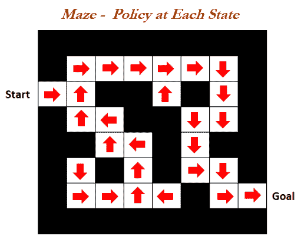
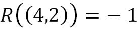
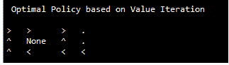

# 第五章：强化学习

**强化学习**（**RL**）是继监督学习和无监督学习之后的第三大机器学习领域。这些技术在近年来在人工智能应用中获得了很大的关注。在强化学习中，需要做出顺序决策，而不是一次性决策，这在某些情况下使得训练模型变得困难。在本章中，我们将涵盖强化学习中使用的各种技术，并提供实际示例支持。虽然涵盖所有主题超出了本书的范围，但我们确实在这里涵盖了这个主题的最重要基础知识，以激发读者对这一主题产生足够的热情。本章讨论的主题包括：

+   马尔可夫决策过程

+   贝尔曼方程

+   动态规划

+   蒙特卡洛方法

+   时间差分学习

# 强化学习基础知识

在深入研究强化学习的细节之前，我想介绍一些理解 RL 方法的各种要素所必需的基础知识。这些基础知识将出现在本章的各个部分中，我们将在需要时详细解释：

+   **环境：** 这是具有状态和状态之间转换机制的任何系统。例如，机器人的环境是其操作的景观或设施。

+   **代理：** 这是与环境交互的自动化系统。

+   **状态：** 环境或系统的状态是完全描述环境的变量或特征集。

+   **目标或吸收状态或终止状态：** 这是提供比任何其他状态更高折现累积奖励的状态。高累积奖励可以防止最佳策略在训练过程中依赖于初始状态。每当代理达到目标时，我们将完成一个回合。

+   **动作：** 这定义了状态之间的转换。代理负责执行或至少推荐一个动作。执行动作后，代理从环境中收集奖励（或惩罚）。

+   **策略：** 这定义了在环境的任何状态下要选择和执行的动作。换句话说，策略是代理的行为；它是从状态到动作的映射。策略可以是确定性的，也可以是随机的。

+   **最佳策略：** 这是通过训练生成的策略。它定义了 Q 学习中的模型，并且会随着任何新的回合不断更新。

+   **奖励：** 这量化了代理与环境的积极或消极交互。奖励通常是代理到达每个状态时获得的即时收益。

+   **回报或值函数：** 值函数（也称为回报）是对每个状态未来奖励的预测。这些用于评估状态的好坏，基于这一点，代理将选择/行动以选择下一个最佳状态：


+   **回合**：这定义了从初始状态到目标状态所需的步骤数。回合也称为试验。

+   **视野**：这是在最大化奖励过程中所考虑的未来步骤或动作的数量。视野可以是无限的，在这种情况下，未来的奖励会被折扣，以便策略的价值能够收敛。

+   **探索与利用**：强化学习（RL）是一种试错学习方法。目标是找到最佳策略；同时，要保持警觉，探索一些未知的策略。一个经典的例子就是寻宝：如果我们只是贪婪地去已知的位置（利用），就会忽视其他可能藏有宝藏的地方（探索）。通过探索未知的状态，尽管即时奖励较低且没有失去最大奖励，我们仍然可能实现更大的目标。换句话说，我们是在逃离局部最优解，以便达到全局最优解（即探索），而不是仅仅专注于即时奖励的短期目标（即利用）。以下是几个例子来解释二者的区别：

    +   **餐馆选择**：通过偶尔探索一些未知的餐馆，我们可能会发现比我们常去的最喜欢的餐馆更好的餐馆：

        +   **利用**：去你最喜欢的餐馆

        +   **探索**：尝试一家新的餐馆

    +   **油井钻探示例**：通过探索新的未开发地点，我们可能会获得比仅仅探索相同地点更有益的新见解：

        +   **利用**：在已知最佳地点钻探石油

        +   **探索**：在新地点钻探

+   **状态值与状态-动作函数**：在动作值中，Q 代表一个智能体在状态*S*下采取动作*A*并根据某一策略π(a|s)（即在给定状态下采取某一动作的概率）之后预期获得的回报（累计折扣奖励）。

在状态值中，值是智能体在状态*s*下根据策略*π(a|s)*行为所预期获得的回报。更具体地说，状态值是基于策略下各动作值的期望：


+   **策略内学习与策略外学习的时间差分控制**：策略外学习者独立于智能体的行动学习最优策略的值。Q 学习是一个策略外学习者。策略内学习者则学习智能体执行的策略值，包括探索步骤。

+   **预测与控制问题**：预测是指根据给定策略评估我的表现：也就是说，如果有人给我一个策略，我执行它后能获得多少奖励。而在控制中，问题是找到最佳策略，以便我能够最大化奖励。

+   **预测**：评估在给定策略下各状态的值。

对于均匀随机策略，所有状态的价值函数是多少？

+   **控制：** 通过找到最佳策略来优化未来。

最优价值函数是什么，如何在所有可能的策略中找到最优策略？

通常，在强化学习中，我们需要先解决预测问题，之后才能解决控制问题，因为我们需要找出所有策略，才能找出最佳或最优的策略。

+   **RL 智能体分类：** 一个 RL 智能体包括以下一个或多个组件：

    +   **策略：** 智能体的行为函数（从状态到动作的映射）；策略可以是确定性的或随机的

    +   **价值函数：** 每个状态的好坏（或）每个状态的未来奖励预期值预测

    +   **模型：** 智能体对环境的表征。模型预测环境接下来会做什么：

        +   **转移：** p 预测下一个状态（即动态）：


+   +   +   **奖励：** R 预测下一个（即时）奖励


让我们通过基于策略和值的组合以及用以下迷宫示例来解释 RL 智能体分类中的各种可能类别。在以下迷宫中，你既有起点，也有目标；智能体需要尽快到达目标，选择一条路径以获得最大的总奖励和最小的总负奖励。这个问题主要可以通过五种类别的方式来解决：

+   基于价值

+   基于策略

+   Actor critic

+   无模型

+   基于模型


# 类别 1 - 基于价值

价值函数看起来像图像的右侧（折扣未来奖励的总和），其中每个状态都有一个值。假设距离目标一步的状态值为-1；距离目标两步的状态值为-2。类似地，起始点的值为-16。如果智能体卡在错误的位置，值可能达到-24。事实上，智能体确实根据最佳值在网格中移动，以到达目标。例如，智能体处于值为-15 的状态。在这里，它可以选择向北或向南移动，因此由于高奖励，它选择向北移动（-14），而不是向南移动（值为-16）。通过这种方式，智能体选择它在网格中的路径，直到到达目标。

+   **价值函数**：在所有状态下仅定义值

+   **无策略（隐式）：** 没有专门的策略；策略根据每个状态的值来选择


# 类别 2 - 基于策略

以下图中的箭头表示智能体在这些状态中选择的下一个移动方向。例如，智能体首先向东移动，然后向北移动，沿着所有箭头直到目标被达成。这也被称为从状态到动作的映射。一旦我们有了这个映射，智能体只需要读取它并相应地行动。

+   **策略**：策略或箭头，通过调整这些策略来达到最大可能的未来奖励。顾名思义，只有策略被存储并优化，以最大化奖励。

+   **无价值函数**：状态没有对应的价值。



# 第三类 - Actor-Critic

在 Actor-Critic 中，我们有策略和价值函数（或价值基和策略基的结合）。这种方法融合了两者的优点：

+   策略

+   价值函数

# 第四类 - 无模型

在强化学习中，一个基本的区分是是否基于模型或无模型。在无模型方法中，我们并未显式地建模环境，或者我们不了解完整环境的所有动态。相反，我们直接通过策略或价值函数来获得经验，并了解策略如何影响奖励：

+   策略和/或价值函数

    +   无模型

# 第五类 - 基于模型

在基于模型的强化学习中，我们首先建立整个环境的动态：

+   策略和/或价值函数

+   模型

经过上述所有类别后，以下维恩图展示了强化学习智能体的分类法的整体框架。如果你拿起任何关于强化学习的论文，这些方法都可以适应这个框架中的任意部分。


# 顺序决策中的基本类别

顺序决策中有两种基本的类型问题：

+   **强化学习**（例如，自主直升机等）：

    +   环境最初是未知的

    +   智能体与环境交互并从环境中获得策略、奖励和价值

    +   智能体改善其策略

+   **规划**（例如，象棋、Atari 游戏等）：

    +   环境模型或完整的环境动态已知

    +   智能体通过其模型进行计算（无需任何外部交互）

    +   智能体改善其策略

    +   这些问题也被称为推理、搜索、自省等问题

尽管前述的两类可以根据具体问题结合在一起，但这基本上是两种设置类型的宏观视角。

# 马尔可夫决策过程与贝尔曼方程

**马尔可夫决策过程**（**MDP**）正式描述了强化学习中的环境。其定义如下：

+   环境是完全可观察的

+   当前状态完全表征过程（这意味着未来状态完全依赖于当前状态，而不是历史状态或历史值）

+   几乎所有的强化学习问题都可以形式化为 MDP（例如，最优控制主要处理连续的 MDP）

**MDP 的核心思想：** MDP 基于状态的简单马尔可夫性属性工作；例如，*S[t+1]* 完全依赖于最新的状态 *S[t]*，而不是任何历史依赖关系。在以下方程中，当前状态捕获了来自历史的所有相关信息，这意味着当前状态是未来的充分统计量：


这个特性可以通过自主直升机示例来直观解释：下一步，直升机将向右、向左、俯仰或滚动，等等，完全取决于直升机当前的位置，而不是五分钟前的位置。

**MDP 的建模：** 强化学习问题通过 MDP 的五元组(*S, A, {P[sa]}, y, R*)来建模世界

+   *S* - 状态集（直升机可能的所有朝向）

+   *A* - 动作集（可以拉动控制杆的所有可能位置的集合）

+   *P[sa]* - 状态转移分布（或状态转移概率分布）提供从一个状态到另一个状态的转移及所需的相应概率，供马尔可夫过程使用：


+   γ - 折扣因子：


+   R - 奖励函数（将状态集映射为实数，可以是正数或负数）：


返回是通过折扣未来奖励计算的，直到到达终止状态为止。

**贝尔曼方程在 MDP 中的应用：** 贝尔曼方程用于 MDP 的数学公式化，解决这些方程可以获得环境的最优策略。贝尔曼方程也被称为**动态规划方程**，它是与数学优化方法——动态规划——相关的最优性所必需的条件。贝尔曼方程是线性方程，可以解出整个环境的解。然而，求解这些方程的时间复杂度是 *O (n³)*，当环境中的状态数非常大时，计算开销会变得非常昂贵；有时，由于环境本身非常大，探索所有状态也不可行。在这种情况下，我们需要寻找其他问题求解方法。

在贝尔曼方程中，价值函数可以分解为两部分：

+   从后续状态你将得到的即时奖励 *R[t+1]* 

+   从那个时间步开始，你将获得的后续状态的折现值 *yv(S[t+1])*：


**MDP 的网格世界示例：** 机器人导航任务生活在以下类型的网格世界中。一个障碍物位于单元格（2,2），机器人无法穿越该单元格。我们希望机器人移动到右上角的单元格（4,3），当它到达该位置时，机器人将获得+1 的奖励。机器人应该避免进入单元格（4,2），因为如果进入该单元格，它将获得-1 的奖励。


机器人可以处于以下任何位置：

+   *11 个状态* - （除了 (2,2) 这个格子，那里有一个障碍物阻挡了机器人）

+   A = {N-北，S-南，E-东，W-西}

在现实世界中，机器人的运动是嘈杂的，机器人可能无法精确地移动到它被要求到达的地方。例如，它的一些轮子可能打滑，部件可能连接松动，执行器可能不正确，等等。当要求它移动 1 米时，机器人可能无法精确地移动 1 米；它可能只会移动 90-105 厘米，等等。

在一个简化的网格世界中，机器人的随机动态可以如下建模。如果我们命令机器人向北移动，机器人有 10% 的概率会被拉向左侧，10% 的概率会被拉向右侧。只有 80% 的概率它才会真正向北移动。当机器人碰到墙壁（包括障碍物）并停留在原地时，什么也不会发生：


这个网格世界示例中的每个状态都由 (x, y) 坐标表示。假设机器人位于状态 (3,1)，如果我们让它向北移动，则状态转移概率矩阵如下：


机器人停留在原地的概率为 0。

如我们所知，所有状态转移概率的总和等于 1：


奖励函数：



对于所有其他状态，有一些小的负奖励值，这意味着在网格中跑来跑去时会扣除机器人的电池或燃料消耗，这就产生了不浪费移动或时间的解决方案，同时尽可能快速地达到奖励 +1 的目标，这鼓励机器人以最少的燃料消耗尽可能快速地达到目标。

当机器人到达 +1 或 -1 状态时，世界结束。到达这些状态后将不再有任何奖励；这些状态可以称为吸收状态。这些是零成本的吸收状态，机器人会永远停留在那里。

MDP 工作模型：

+   在状态 *S[0]*

+   选择 *a[0]*

+   到达 *S[1] ~ P*[*s0*, a0]

+   选择 *a[1]*

+   到达 *S[2] ~ P*[*s1*, *a1*]

+   以此类推….

一段时间后，它会获得所有奖励并将其累加：


折扣因子模型化了一种经济应用，其中今天赚到的一美元比明天赚到的一美元更有价值。

机器人需要在一段时间内选择行动（a[0]，a[1]，a[2]，......）以最大化预期回报：


在这个过程中，一个强化学习算法学习一个策略，该策略是每个状态下的行动映射，意味着这是一个推荐的行动，机器人需要根据其所处的状态来采取行动：


**网格世界的最优策略：** 策略是从状态到行动的映射，这意味着如果你处于某个特定状态，你需要采取这一特定行动。以下策略是最优策略，它最大化了总回报或折扣奖励的期望值。策略总是根据当前状态来决策，而不是之前的状态，这就是马尔可夫性质：


需要注意的一个问题是位置（3,1）：最优策略显示应向左（西）走，而不是向北走，虽然向北走可能涉及的状态数较少；但是，我们也可能进入一个更危险的状态。因此，向左走可能需要更长时间，但可以安全到达目的地而不会陷入负面陷阱。这些类型的结论可以通过计算获得，虽然对人类而言不明显，但计算机在提出这些策略时非常擅长：

定义：*V^π, V*, π**

*V^π* = 对于任何给定的策略π，价值函数为 *V^π : S -> R*，使得 *V^π (S)* 是从状态 S 开始，执行π后的期望总回报


**网格世界的随机策略：** 以下是一个随机策略及其价值函数的示例。这个策略是一个相当糟糕的策略，具有负值。对于任何策略，我们都可以写出该策略的价值函数：


简单来说，Bellman 方程说明了当前状态的价值等于即时奖励和折扣因子应用于新状态（*S'*)的期望总回报，这些回报根据它们进入这些状态的概率进行加权。

Bellman 方程用于求解策略的价值函数的闭式解，给定固定策略，如何求解价值函数方程。

Bellman 方程对价值函数施加了一组线性约束。事实证明，通过求解一组线性方程，我们可以在任何状态 *S* 下求解其价值函数。

**Bellman 方程在网格世界问题中的示例：**

为单元格 *(3,1)* 选择的策略是向北移动。然而，我们的系统存在随机性，大约 80%的时间它会朝着指定方向移动，而 20%的时间它会偏离，向左（10%）或向右（10%）偏移。


可以为网格中的所有 11 个 MDP 状态写出类似的方程。我们可以从中获得以下度量值，利用线性方程组的方法来解决所有未知值：

+   11 个方程

+   11 个未知值函数变量

+   11 个约束条件

这是解决一个`n`个变量与`n`个方程的问题，我们可以通过使用方程组轻松找到一个解决方案的确切形式，进而得到整个网格的 V (π)的精确解，网格包含了所有的状态。

# 动态规划

动态规划是一种通过将复杂问题分解为子问题并逐一解决它们来顺序求解问题的方法。一旦子问题解决，它就会将这些子问题的解组合起来解决原始的复杂问题。在强化学习中，动态规划是一种在环境的完美模型作为马尔可夫决策过程（MDP）下计算最优策略的方法论。

动态规划适用于具有以下两个性质的问题。事实上，MDP 满足这两个性质，这使得动态规划非常适合通过求解贝尔曼方程来解决它们：

+   最优子结构

    +   最优性原理适用

    +   最优解可以分解成子问题

+   子问题重叠

    +   子问题重复多次

    +   解可以被缓存和重用

+   MDP 满足这两个性质——幸运的是！

    +   贝尔曼方程具有状态值的递归分解

    +   值函数存储并重用解决方案

然而，经典的动态规划算法在强化学习中的应用有限，原因在于它们假设了一个完美的模型，并且计算开销较大。然而，它们依然很重要，因为它们为理解强化学习领域的所有方法提供了必要的基础。

# 使用动态规划计算最优策略的算法

计算 MDP 最优策略的标准算法利用了动态规划，以下是相关算法，我们将在本章后续部分详细讲解：

+   **值迭代算法：** 一种迭代算法，其中状态值不断迭代直到达到最优值；随后，最优值被用于确定最优策略

+   **策略迭代算法：** 一种迭代算法，其中策略评估和策略改进交替进行，以达到最优策略

**值迭代算法：** 值迭代算法之所以容易计算，是因为它仅对状态值进行迭代计算。首先，我们将计算最优值函数 *V*，然后将这些值代入最优策略方程，以确定最优策略。为了说明问题的规模，对于 11 个可能的状态，每个状态可以有四个策略（N-北，S-南，E-东，W-西），因此总共有 11⁴ 种可能的策略。值迭代算法包括以下步骤：

1.  初始化 *V(S) = 0* 对于所有状态 S

1.  对每个 S，更新：


1.  通过反复计算步骤 2，我们最终会收敛到所有状态的最优值：


在算法的步骤 2 中，有两种更新值的方法

+   **同步更新** - 通过执行同步更新（或贝尔曼备份操作符），我们将执行右侧计算并替换方程的左侧，如下所示：


+   **异步更新** - 一次更新一个状态的值，而不是同时更新所有状态，在这种情况下，状态会按固定顺序更新（先更新状态 1，再更新状态 2，以此类推）。在收敛过程中，异步更新比同步更新稍快。

**值迭代在网格世界示例中的说明：** 值迭代在网格世界中的应用在下图中进行了说明，解决实际问题的完整代码会在本节末尾提供。在使用贝尔曼方程对 MDP 应用之前的值迭代算法后，我们得到了以下所有状态的最优值 V*（Gamma 值选择为 *0.99*）：


当我们将这些值代入到我们的策略方程时，我们得到以下的策略网格：


这里，在位置 (3,1) 我们想通过数学证明为什么最优策略建议向左（西）而不是向上（北）移动：


由于墙壁，每当机器人尝试向南（下方）移动时，它会停留在原地，因此我们为当前位置分配了 0.71 的值，概率为 0.1。

同样地，对于北，我们计算了如下的总收益：


因此，向西而非向北移动会是最优的选择，因此最优策略选择了这种方式。

**策略迭代算法：** 策略迭代是获得 MDP 最优策略的另一种方法，在这种方法中，策略评估和策略改进算法被反复应用，直到解决方案收敛到最优策略。策略迭代算法包括以下步骤：

1.  初始化随机策略 π

1.  重复执行以下操作，直到收敛发生

    +   对当前策略求解贝尔曼方程，以使用线性方程组获得 V^π：


+   +   根据新的价值函数更新策略，通过将新值假设为最优值，使用 argmax 公式改进策略：


1.  通过重复这些步骤，值和策略将会收敛到最优值：


策略迭代通常适用于较小的问题。如果一个 MDP 的状态数量非常庞大，策略迭代会在计算上非常昂贵。因此，大型 MDP 通常使用值迭代而不是策略迭代。

**如果我们在现实生活中不知道确切的状态转移概率** *P[s,a]* **该怎么办？**

我们需要使用以下简单公式从数据中估计概率：


如果某些状态没有数据可用，导致出现 0/0 问题，我们可以从均匀分布中获取一个默认概率。

# 使用基本 Python 的值迭代和策略迭代算法的网格世界示例

经典的网格世界示例被用来通过动态规划说明值迭代和策略迭代，以求解 MDP 的贝尔曼方程。在以下网格中，代理从网格的西南角（1,1）位置开始，目标是向东北角（4,3）移动。一旦到达目标，代理将获得 +1 的奖励。在途中，它应该避免进入危险区（4,2），因为这会导致 -1 的负奖励。代理不能从任何方向进入有障碍物（2,2）的位置。目标区和危险区是终止状态，意味着代理会继续移动，直到到达这两个状态之一。其他所有状态的奖励为 -0.02。在这里，任务是为代理在每个状态（共 11 个状态）确定最优策略（移动方向），以使代理的总奖励最大化，或者使代理尽可能快地到达目标。代理可以朝四个方向移动：北、南、东和西。


完整的代码使用 Python 编程语言编写，带有类实现。欲了解更多，请参考 Python 中的面向对象编程，了解类、对象、构造函数等。

导入`random`包以生成任何 N、E、S、W 方向的动作：

```py
>>> import random,operator
```

以下`argmax`函数根据每个状态的值计算给定状态中的最大状态：

```py
>>> def argmax(seq, fn):
...     best = seq[0]; best_score = fn(best)
...     for x in seq:
...         x_score = fn(x)
...     if x_score > best_score:
...         best, best_score = x, x_score
...     return best
```

要在分量级别上添加两个向量，以下代码已被用于：

```py
>>> def vector_add(a, b):
...     return tuple(map(operator.add, a, b))
```

方位提供了需要加到代理当前位置的增量值；方位可以作用于*x*轴或*y*轴：

```py
>>> orientations = [(1,0), (0, 1), (-1, 0), (0, -1)]
```

以下函数用于将代理转向正确的方向，因为我们知道在每个命令下，代理大约 80%的时间会按该方向移动，10%的时间会向右移动，10%的时间会向左移动：

```py
>>> def turn_right(orientation):
...     return orientations[orientations.index(orientation)-1]
>>> def turn_left(orientation):
...     return orientations[(orientations.index(orientation)+1) % len(orientations)]
>>> def isnumber(x):
...     return hasattr(x, '__int__')
```

马尔可夫决策过程在这里定义为一个类。每个 MDP 由初始位置、状态、转移模型、奖励函数和 gamma 值定义。

```py
>>> class MDP:
... def __init__(self, init_pos, actlist, terminals, transitions={}, states=None, gamma=0.99):
...     if not (0 < gamma <= 1):
...         raise ValueError("MDP should have 0 < gamma <= 1 values")
...     if states:
...         self.states = states
...     else:
...         self.states = set()
...         self.init_pos = init_pos
...         self.actlist = actlist
...         self.terminals = terminals
...         self.transitions = transitions
...         self.gamma = gamma
...         self.reward = {}
```

返回状态的数值奖励：

```py
... def R(self, state):
...     return self.reward[state]
```

转移模型从某个状态和动作返回每个状态的（概率，结果状态）对的列表：

```py
... def T(self, state, action):
...     if(self.transitions == {}):
...         raise ValueError("Transition model is missing")
...     else:
...         return self.transitions[state][action]
```

可以在特定状态下执行的动作集：

```py
... def actions(self, state):
...     if state in self.terminals:
...         return [None]
...     else:
...         return self.actlist
```

`GridMDP`类用于建模一个二维网格世界，其中每个状态有网格值、终端位置、初始位置和折扣值（gamma）：

```py
>>> class GridMDP(MDP):
... def __init__(self, grid, terminals, init_pos=(0, 0), gamma=0.99):
```

以下代码用于反转网格，因为我们希望将*第 0 行*放在底部，而不是顶部：

```py
... grid.reverse()
```

以下`__init__`命令是一个构造函数，用于在网格类中初始化参数：

```py
... MDP.__init__(self, init_pos, actlist=orientations,
terminals=terminals, gamma=gamma)
... self.grid = grid
... self.rows = len(grid)
... self.cols = len(grid[0])
... for x in range(self.cols):
...     for y in range(self.rows):
...         self.reward[x, y] = grid[y][x]
...         if grid[y][x] is not None:
...             self.states.add((x, y))
```

状态转移在 80%的情况下随机朝向期望方向，10%朝左，10%朝右。这是为了模拟机器人在地板上可能滑动的随机性，等等：

```py
... def T(self, state, action):
...     if action is None:
...         return [(0.0, state)]
...     else:
...         return [(0.8, self.go(state, action)),
...                (0.1, self.go(state, turn_right(action))),
...                (0.1, self.go(state, turn_left(action)))]
```

返回执行指定方向后产生的状态，前提是该状态在有效状态列表中。如果下一个状态不在列表中，例如撞墙，则代理应保持在同一状态：

```py
... def go(self, state, direction):
...     state1 = vector_add(state, direction)
...     return state1 if state1 in self.states else state
```

将从(x, y)到 v 的映射转换为[[...，v，...]]网格：

```py
... def to_grid(self, mapping):
...     return list(reversed([[mapping.get((x, y), None)
...                         for x in range(self.cols)]
...                         for y in range(self.rows)]))
```

将方位转换为箭头，以便更好地进行图形表示：

```py
... def to_arrows(self, policy):
...     chars = {(1, 0): '>', (0, 1): '^', (-1, 0): '<', (0, -1):
 'v', None: '.'}
...     return self.to_grid({s: chars[a] for (s, a) in policy.items()})
```

以下代码用于通过值迭代求解 MDP，并返回最优状态值：

```py
>>> def value_iteration(mdp, epsilon=0.001):
...     STSN = {s: 0 for s in mdp.states}
...     R, T, gamma = mdp.R, mdp.T, mdp.gamma
...     while True:
...         STS = STSN.copy()
...         delta = 0
...         for s in mdp.states:
...             STSN[s] = R(s) + gamma * max([sum([p * STS[s1] for 
...             (p, s1) in T(s,a)]) for a in mdp.actions(s)])
...             delta = max(delta, abs(STSN[s] - STS[s]))
...         if delta < epsilon * (1 - gamma) / gamma:
...             return STS
```

给定一个 MDP 和一个效用函数`STS`，确定最佳策略，即从状态到动作的映射：

```py
>>> def best_policy(mdp, STS):
...     pi = {}
...     for s in mdp.states:
...         pi[s] = argmax(mdp.actions(s), lambda a: expected_utility(a, s, STS, mdp))
...     return pi
```

根据 MDP 和 STS，执行动作`a`在状态`s`中的预期效用：

```py
>>> def expected_utility(a, s, STS, mdp):
...     return sum([p * STS[s1] for (p, s1) in mdp.T(s, a)])
```

以下代码用于通过策略迭代求解 MDP，通过交替执行策略评估和策略改进步骤：

```py
>>> def policy_iteration(mdp):
...     STS = {s: 0 for s in mdp.states}
...     pi = {s: random.choice(mdp.actions(s)) for s in mdp.states}
...     while True:
...         STS = policy_evaluation(pi, STS, mdp)
...         unchanged = True
...         for s in mdp.states:
...             a = argmax(mdp.actions(s),lambda a: expected_utility(a, s, STS, mdp))
...             if a != pi[s]:
...                 pi[s] = a
...                 unchanged = False
...         if unchanged:
...             return pi
```

以下代码用于返回从每个 MDP 状态到其效用的更新效用映射`U`，使用近似（修改后的策略迭代）：

```py
>>> def policy_evaluation(pi, STS, mdp, k=20):
...     R, T, gamma = mdp.R, mdp.T, mdp.gamma
 ..     for i in range(k):
...     for s in mdp.states:
...         STS[s] = R(s) + gamma * sum([p * STS[s1] for (p, s1) in T(s, pi[s])])
...     return STS

>>> def print_table(table, header=None, sep=' ', numfmt='{}'):
...     justs = ['rjust' if isnumber(x) else 'ljust' for x in table[0]]
...     if header:
...         table.insert(0, header)
...     table = [[numfmt.format(x) if isnumber(x) else x for x in row]
...             for row in table]
...     sizes = list(map(lambda seq: max(map(len, seq)),
...                      list(zip(*[map(str, row) for row in table]))))
...     for row in table:
...         print(sep.join(getattr(str(x), j)(size) for (j, size, x)
...             in zip(justs, sizes, row)))
```

以下是一个 4 x 3 网格环境的输入网格，呈现出代理的顺序决策问题：

```py
>>> sequential_decision_environment = GridMDP([[-0.02, -0.02, -0.02, +1],
...                                           [-0.02, None, -0.02, -1],
...                                           [-0.02, -0.02, -0.02, -0.02]],
...                                           terminals=[(3, 2), (3, 1)])
```

以下代码用于在给定的顺序决策环境中执行价值迭代：

```py
>>> value_iter = best_policy(sequential_decision_environment,value_iteration (sequential_decision_environment, .01))
>>> print("\n Optimal Policy based on Value Iteration\n")
>>> print_table(sequential_decision_environment.to_arrows(value_iter))
```



策略迭代的代码如下：

```py
>>> policy_iter = policy_iteration(sequential_decision_environment)
>>> print("\n Optimal Policy based on Policy Iteration & Evaluation\n")
>>> print_table(sequential_decision_environment.to_arrows(policy_iter))
```


从前面的输出结果来看，两个结果表明，价值迭代和策略迭代为智能体提供了相同的最优策略，使其能在最短时间内通过网格到达目标状态。当问题规模足够大时，从计算角度考虑，选择价值迭代更为可取，因为在策略迭代中，每次迭代都需要进行两个步骤：策略评估和策略改进。

# 蒙特卡洛方法

使用**蒙特卡洛**（**MC**）方法，我们首先计算价值函数，并确定最优策略。在这种方法中，我们不假设对环境有完全的了解。蒙特卡洛方法只需要经验，这些经验包括来自与环境实际或模拟互动的状态、动作和回报的样本序列。从实际经验中学习非常具有意义，因为它不依赖于对环境动态的先验知识，但仍能获得最优行为。这与人类或动物从实际经验中学习而非依赖任何数学模型的方式非常相似。令人惊讶的是，在许多情况下，根据所需的概率分布生成样本经验是容易的，但获得这些分布的显式形式却不可行。

蒙特卡洛方法通过对每个回合中的样本回报进行平均来解决强化学习问题。这意味着我们假设经验被划分为多个回合，并且所有回合最终都会终止，无论选择什么动作。只有在每个回合完成后，才会估算价值并改变策略。蒙特卡洛方法是按回合逐步增量的，而不是按步骤增量（这属于在线学习，我们将在时间差学习部分进行相同讨论）。

蒙特卡洛方法通过对每个状态-动作对在整个回合中的回报进行采样和平均。然而，在同一回合内，采取某一动作后的回报依赖于后续状态中采取的动作。由于所有的动作选择都在进行学习，从早期状态的角度来看，问题变得非平稳。为了处理这种非平稳性，我们借用了动态规划中的策略迭代思想，其中，首先计算固定任意策略的价值函数；然后，再改进策略。

# 蒙特卡洛预测

如我们所知，蒙特卡洛方法预测给定策略的状态值函数。任何状态的值是从该状态开始的预期回报或预期累计未来折扣奖励。这些值在蒙特卡洛方法中通过简单地对访问该状态后的回报进行平均来估算。随着越来越多的值被观察到，平均值应该根据大数法则收敛到预期值。实际上，这是所有蒙特卡洛方法适用的原理。蒙特卡洛策略评估算法包括以下步骤：

1.  初始化：


1.  无限重复：

    +   使用π生成一个回合

    +   对回合中出现的每个状态*s*：

        +   G 回报，跟随第一次出现的*s*

        +   将*G*附加到 Returns(s)

        +   V(s)  平均值（Returns(s)）

# 蒙特卡洛预测在网格世界问题上的适用性

下图用于说明目的。然而，实际上，由于并非所有策略都能保证终止，蒙特卡洛方法不能轻易用于解决网格世界类型的问题。如果发现某个策略导致代理停留在同一状态，那么下一个回合将永远不会结束。像**（状态-动作-奖励-状态-动作）**（**SARSA**，我们将在本章后面讨论的时间差分学习控制方法中讲解）这样的逐步学习方法没有这个问题，因为它们在回合过程中迅速学习到这些策略是差的，并会切换到其他策略。


# 使用 Python 建模二十一点游戏的蒙特卡洛方法

流行赌场扑克牌游戏“二十一点”的目标是获得一组牌，这些牌的点数总和尽可能大，但不得超过 21 点。所有的面牌（国王、皇后和杰克）都算作 10 点，而 A 牌可以根据玩家的需求算作 1 点或 11 点，只有 A 牌具有这种灵活性选项。其他所有牌按面值计算。游戏开始时，庄家和玩家各发两张牌，其中庄家的其中一张牌是面朝上的，另一张是面朝下的。如果玩家从这两张牌中得到“自然 21 点”（即一张 A 牌和一张 10 点牌），那么玩家获胜，除非庄家也有自然 21 点，在这种情况下，游戏为平局。如果玩家没有自然 21 点，则可以要求继续抽牌，一张一张地抽（称为“要牌”），直到他选择停牌（不再要牌）或超过 21 点（称为“爆牌”）。如果玩家爆牌，则玩家失败；如果玩家选择停牌，则轮到庄家。庄家根据固定策略选择要牌或停牌，无法选择：通常庄家在总点数为 17 点或更高时选择停牌，低于 17 点时选择要牌。如果庄家爆牌，则玩家自动获胜。如果庄家停牌，则游戏结果将是胜利、失败或平局，取决于庄家和玩家的点数哪个更接近 21 点。


黑杰克问题可以被建模为一个周期性有限的马尔可夫决策过程（MDP），其中每一局黑杰克游戏为一个回合。每个回合的奖励分别为+1（胜利）、-1（失败）和 0（平局），这些奖励会在游戏结束时给出，游戏状态中的其余奖励则为 0，不进行折扣（gamma = 1）。因此，终端奖励也就是游戏的回报。我们从一个无限的牌堆中抽取卡牌，以确保没有可追踪的规律。以下是用 Python 语言建模的整个游戏代码。

以下代码片段灵感来自*Shangtong Zhang*的强化学习 Python 代码，并已获得*Richard S. Sutton*著作《Reinforcement Learning: An Introduction》学生的许可，在本书中发布（详细信息请见*进一步阅读*部分）。

以下包用于数组操作和可视化：

```py
>>> from __future__ import print_function 
>>> import numpy as np 
>>> import matplotlib.pyplot as plt 
>>> from mpl_toolkits.mplot3d import Axes3D 
```

在每个回合中，玩家或庄家可以采取两种可能的行动：抽牌或停牌。这是唯一的两种可能状态：

```py
>>> ACTION_HIT = 0 
>>> ACTION_STAND = 1   
>>> actions = [ACTION_HIT, ACTION_STAND] 
```

玩家策略使用 21 个值的数组来建模，因为玩家总分超过 21 时将爆掉：

```py
>>> policyPlayer = np.zeros(22) 

>>> for i in range(12, 20): 
...     policyPlayer[i] = ACTION_HIT 
```

如果玩家的总分为 20 或 21 点，他将选择停牌；否则，玩家将继续抽牌：

```py
>>> policyPlayer[20] = ACTION_STAND 
>>> policyPlayer[21] = ACTION_STAND 
```

玩家目标策略的函数形式：

```py
>>> def targetPolicyPlayer(usableAcePlayer, playerSum, dealerCard): 
...     return policyPlayer[playerSum] 
```

玩家行为策略的函数形式：

```py
>>> def behaviorPolicyPlayer(usableAcePlayer, playerSum, dealerCard): 
...     if np.random.binomial(1, 0.5) == 1: 
...         return ACTION_STAND 
...     return ACTION_HIT 
```

庄家的固定策略是持续抽牌直到达到 17 点，然后在 17 到 21 点之间停牌：

```py
>>> policyDealer = np.zeros(22) 
>>> for i in range(12, 17): 
...     policyDealer[i] = ACTION_HIT 
>>> for i in range(17, 22): 
...     policyDealer[i] = ACTION_STAND 
```

以下函数用于从牌堆中抽取一张新牌，并进行替换：

```py
>>> def getCard(): 
...     card = np.random.randint(1, 14) 
...     card = min(card, 10) 
...     return card 
```

让我们开始游戏吧！

```py
>>> def play(policyPlayerFn, initialState=None, initialAction=None): 
```

1.  玩家总分、玩家轨迹以及玩家是否将王牌算作 11 点的情况：

```py
...     playerSum = 0 
...     playerTrajectory = [] 
...     usableAcePlayer = False 
```

1.  庄家抽牌状态：

```py
...     dealerCard1 = 0 
...     dealerCard2 = 0 
...     usableAceDealer = False 

...     if initialState is None: 
```

1.  生成一个随机初始状态：

```py
...         numOfAce = 0 
```

1.  初始化玩家的手牌：

```py
...         while playerSum < 12: 
```

1.  如果玩家的总分小于 12 点，始终要抽一张牌：

```py
...             card = getCard() 
...             if card == 1: 
...                 numOfAce += 1 
...                 card = 11 
...                 usableAcePlayer = True 
...             playerSum += card 
```

1.  如果玩家的总分大于 21 点，他必须至少拥有一张王牌，但也可以有两张王牌。在这种情况下，他将会把王牌当作 1 点来计算，而不是 11 点。如果玩家只有一张王牌，那么他将不再有可用的王牌：

```py
...         if playerSum > 21: 
...             playerSum -= 10 
...             if numOfAce == 1: 
...                 usableAcePlayer = False 
```

1.  初始化庄家手牌：

```py
...         dealerCard1 = getCard() 
...         dealerCard2 = getCard() 

...     else: 
...         usableAcePlayer = initialState[0] 
...         playerSum = initialState[1] 
...         dealerCard1 = initialState[2] 
...         dealerCard2 = getCard() 
```

1.  初始化游戏状态：

```py
...     state = [usableAcePlayer, playerSum, dealerCard1] 
```

1.  初始化庄家的总分：

```py
...     dealerSum = 0 
...     if dealerCard1 == 1 and dealerCard2 != 1: 
...         dealerSum += 11 + dealerCard2 
...         usableAceDealer = True 
...     elif dealerCard1 != 1 and dealerCard2 == 1: 
...         dealerSum += dealerCard1 + 11 
...         usableAceDealer = True 
...     elif dealerCard1 == 1 and dealerCard2 == 1: 
...         dealerSum += 1 + 11 
...         usableAceDealer = True 
...     else: 
...         dealerSum += dealerCard1 + dealerCard2 
```

1.  游戏从这里开始，因为玩家需要从这里开始抽取额外的牌：

```py
...     while True: 
...         if initialAction is not None: 
...             action = initialAction 
...             initialAction = None 
...         else: 
```

1.  根据当前玩家的总分选择行动：

```py
...             action = policyPlayerFn(usableAcePlayer, playerSum, dealerCard1) 
```

1.  跟踪玩家轨迹以便进行重要性采样：

```py
...         playerTrajectory.append([action, (usableAcePlayer, playerSum, dealerCard1)]) 

...         if action == ACTION_STAND: 
...             break 
```

1.  如果选择抽牌（hit the deck），则抽一张新牌：

```py
...         playerSum += getCard() 
```

1.  如果玩家的总分大于 21 点，玩家爆掉，游戏结束，玩家获得奖励-1。不过，如果玩家手上有王牌，他可以将王牌用作 11 点来挽救游戏，否则将会失败。

```py
...         if playerSum > 21: 
...             if usableAcePlayer == True: 
...                 playerSum -= 10 
...                 usableAcePlayer = False 
...             else: 
...                 return state, -1, playerTrajectory 
```

1.  现在轮到庄家行动。他将根据总分来决定是否抽牌：如果他达到 17 点，就停牌，否则继续抽牌。如果庄家也有王牌，他可以使用王牌来达到爆掉的情况，否则庄家会爆掉：

```py
...     while True: 
...         action = policyDealer[dealerSum] 
...         if action == ACTION_STAND: 
...             break 
...         dealerSum += getCard() 
...         if dealerSum > 21: 
...             if usableAceDealer == True: 
...                 dealerSum -= 10 
...                 usableAceDealer = False 
...             else: 
...                 return state, 1, playerTrajectory 
```

1.  现在我们将玩家的总和与庄家的总和进行比较，决定谁在不爆掉的情况下获胜：

```py
...     if playerSum > dealerSum: 
...         return state, 1, playerTrajectory 
...     elif playerSum == dealerSum: 
...         return state, 0, playerTrajectory 
...     else: 
...         return state, -1, playerTrajectory 
```

以下代码演示了使用*On-Policy*的蒙特卡洛采样：

```py
>>> def monteCarloOnPolicy(nEpisodes): 
...     statesUsableAce = np.zeros((10, 10)) 
...     statesUsableAceCount = np.ones((10, 10)) 
...     statesNoUsableAce = np.zeros((10, 10)) 
...     statesNoUsableAceCount = np.ones((10, 10)) 
...     for i in range(0, nEpisodes): 
...         state, reward, _ = play(targetPolicyPlayer) 
...         state[1] -= 12 
...         state[2] -= 1 
...         if state[0]: 
...             statesUsableAceCount[state[1], state[2]] += 1 
...             statesUsableAce[state[1], state[2]] += reward 
...         else: 
...             statesNoUsableAceCount[state[1], state[2]] += 1 
...             statesNoUsableAce[state[1], state[2]] += reward 
...     return statesUsableAce / statesUsableAceCount, statesNoUsableAce / statesNoUsableAceCount 
```

以下代码讨论了带有探索起始的蒙特卡洛方法，其中每个状态-动作对的所有回报都会被累积并平均，不管观察到时使用的是何种策略：

```py
>>> def monteCarloES(nEpisodes): 
...     stateActionValues = np.zeros((10, 10, 2, 2)) 
...     stateActionPairCount = np.ones((10, 10, 2, 2)) 
```

行为策略是贪心策略，获取平均回报(s, a)的`argmax`：

```py
...     def behaviorPolicy(usableAce, playerSum, dealerCard): 
...         usableAce = int(usableAce) 
...         playerSum -= 12 
...         dealerCard -= 1 
...         return np.argmax(stateActionValues[playerSum, dealerCard, usableAce, :] 
                      / stateActionPairCount[playerSum, dealerCard, usableAce, :]) 
```

游戏会持续若干回合，每一回合随机初始化状态、动作，并更新状态-动作对的值：

```py
...     for episode in range(nEpisodes): 
...         if episode % 1000 == 0: 
...             print('episode:', episode) 
...         initialState = [bool(np.random.choice([0, 1])), 
...                        np.random.choice(range(12, 22)), 
...                        np.random.choice(range(1, 11))] 
...         initialAction = np.random.choice(actions) 
...         _, reward, trajectory = play(behaviorPolicy, initialState, initialAction) 
...         for action, (usableAce, playerSum, dealerCard) in trajectory: 
...             usableAce = int(usableAce) 
...             playerSum -= 12 
...             dealerCard -= 1 
```

更新状态-动作对的值：

```py
...             stateActionValues[playerSum, dealerCard, usableAce, action] += reward 
...             stateActionPairCount[playerSum, dealerCard, usableAce, action] += 1 
...     return stateActionValues / stateActionPairCount 
```

打印状态值：

```py
>>> figureIndex = 0 
>>> def prettyPrint(data, tile, zlabel='reward'): 
...     global figureIndex 
...     fig = plt.figure(figureIndex) 
...     figureIndex += 1 
...     fig.suptitle(tile) 
...     ax = fig.add_subplot(111, projection='3d') 
...     x_axis = [] 
...     y_axis = [] 
...     z_axis = [] 
...     for i in range(12, 22): 
...         for j in range(1, 11): 
...             x_axis.append(i) 
...             y_axis.append(j) 
...             z_axis.append(data[i - 12, j - 1]) 
...     ax.scatter(x_axis, y_axis, z_axis,c='red') 
...     ax.set_xlabel('player sum') 
...     ax.set_ylabel('dealer showing') 
...     ax.set_zlabel(zlabel) 
```

使用或不使用可用 A 牌的*On-Policy*结果，经过 10,000 和 500,000 次迭代：

```py
>>> def onPolicy(): 
...     statesUsableAce1, statesNoUsableAce1 = monteCarloOnPolicy(10000) 
...     statesUsableAce2, statesNoUsableAce2 = monteCarloOnPolicy(500000) 
...     prettyPrint(statesUsableAce1, 'Usable Ace & 10000 Episodes') 
...     prettyPrint(statesNoUsableAce1, 'No Usable Ace & 10000 Episodes') 
...     prettyPrint(statesUsableAce2, 'Usable Ace & 500000 Episodes') 
...     prettyPrint(statesNoUsableAce2, 'No Usable Ace & 500000 Episodes') 
...     plt.show() 

```

策略迭代的优化或蒙特卡洛控制：

```py
>>> def MC_ES_optimalPolicy(): 
...     stateActionValues = monteCarloES(500000) 
...     stateValueUsableAce = np.zeros((10, 10)) 
...     stateValueNoUsableAce = np.zeros((10, 10)) 
    # get the optimal policy 
...     actionUsableAce = np.zeros((10, 10), dtype='int') 
...     actionNoUsableAce = np.zeros((10, 10), dtype='int') 
...     for i in range(10): 
...         for j in range(10): 
...             stateValueNoUsableAce[i, j] = np.max(stateActionValues[i, j, 0, :]) 
...             stateValueUsableAce[i, j] = np.max(stateActionValues[i, j, 1, :]) 
...             actionNoUsableAce[i, j] = np.argmax(stateActionValues[i, j, 0, :]) 
...             actionUsableAce[i, j] = np.argmax(stateActionValues[i, j, 1, :]) 
...     prettyPrint(stateValueUsableAce, 'Optimal state value with usable Ace') 
...     prettyPrint(stateValueNoUsableAce, 'Optimal state value with no usable Ace') 
...     prettyPrint(actionUsableAce, 'Optimal policy with usable Ace', 'Action (0 Hit, 1 Stick)') 
...     prettyPrint(actionNoUsableAce, 'Optimal policy with no usable Ace', 'Action (0 Hit, 1 Stick)') 
...     plt.show() 

# Run on-policy function 
>>> onPolicy()
```


从前面的图表中，我们可以得出结论：即使在低玩家总和的组合下，手中有可用 A 牌也能带来更高的奖励，而对于没有可用 A 牌的玩家，如果回报少于 20，这些值之间的差异就非常明显。

```py
# Run Monte Carlo Control or Explored starts 
>>> MC_ES_optimalPolicy() 
```


从最优策略和状态值中，我们可以得出结论：如果有可用的 A 牌，我们可以打得比停牌更多，而且奖励的状态值也远高于没有 A 牌时的情况。尽管我们讨论的结果是显而易见的，但我们可以看到持有 A 牌对结果的影响程度。

# 时序差分学习：

**时序差分**（**TD**）学习是强化学习的核心和创新主题。TD 学习结合了**蒙特卡洛**（**MC**）和**动态规划**（**DP**）的思想。与蒙特卡洛方法类似，TD 方法可以直接从经验中学习，无需环境模型。类似于动态规划，TD 方法基于其他已学习的估计值来更新估计，而不需要等待最终结果，这与 MC 方法不同，后者只有在达到最终结果后才更新估计。


# 时序差分预测：

TD 和 MC 都使用经验来解决*z*预测问题。给定某个策略π，两者都更新它们对非终结状态*S[t]*的估计*v*，该状态在经验中发生。蒙特卡洛方法会等到访问后的回报已知后，再将该回报作为*V(S[t])*的目标。


上述方法可以被称为常数 - *α MC*，其中 MC 必须等到回合结束后才能确定对*V(S[t])*的增量（只有到那时*G[t]*才会知道）。

TD 方法只需要等到下一个时间步。到达*t+1*时，它们立即形成目标并使用观察到的奖励*R[t+1]*和估计的*V(S[t+1])*进行有用的更新。最简单的 TD 方法是*TD(0)*，其公式为：


MC 更新的目标是 *G[t]*，而 TD 更新的目标是 *R[t+1] + y V(S[t+1])*。

在下图中，我们对比了 TD 和 MC 方法。如我们在方程 TD(0) 中所写，我们使用一步的实际数据，然后使用下一个状态的价值函数的估计值。同样，我们也可以使用两步的实际数据，以便更好地理解现实，并估计第三阶段的价值函数。然而，随着步骤的增加，最终需要越来越多的数据来进行参数更新，这将消耗更多的时间。

当我们采取无限步数，直到触及终止点以更新每个回合的参数时，TD 就变成了蒙特卡罗方法。


用于估计 *v* 的 TD (0) 算法包含以下步骤：

1.  初始化：


1.  重复（对于每个回合）：

    +   初始化 *S*

    +   重复（对于回合的每一步）：

        +   A <- 由 π 给定的动作，针对 S

        +   执行动作 A，观察 *R,S'*

        +   

        +   

1.  直到 *S* 是终止状态。

# 驾驶办公室示例用于 TD 学习

在这个简单的示例中，你每天从家里出发到办公室，试图预测早晨到达办公室需要多长时间。当你离开家时，你记录下这个时间、星期几、天气情况（是否下雨、刮风等）以及你认为相关的其他参数。例如，在星期一早晨，你在早上 8 点整离开，并估计到达办公室需要 40 分钟。到了 8:10，你注意到一位贵宾正在经过，你需要等到完整的车队离开，因此你重新估计从那时起需要 45 分钟，总共需要 55 分钟。15 分钟后，你顺利完成了高速公路部分的行程。现在你进入了一个绕行的道路，你将总行程时间的估计减少到 50 分钟。不幸的是，这时你被一堆牛车堵住了，路太窄无法通过。你不得不跟着那些牛车走，直到你转入一条侧街，在 8:50 到达了办公室。七分钟后，你到达了办公室停车场。状态、时间和预测的顺序如下：


在这个示例中，奖励是每段行程所用的时间，我们使用了折扣因子（gamma，*v = 1*），因此每个状态的回报就是从该状态到目的地（办公室）的实际时间。每个状态的价值是预计的行驶时间，即前表中的第二列，也被称为每个遇到的状态的当前估计值。


在前面的图示中，蒙特卡洛方法被用来绘制在事件序列中的预测总时间。箭头始终表示由常数-α MC 方法推荐的预测变化。这些是每个阶段的估计值与实际回报（57 分钟）之间的误差。在 MC 方法中，学习仅在结束后进行，因此它需要等待直到 57 分钟过去。然而，实际上，您可以在达到最终结果之前进行估计，并相应地修正您的估计。TD 也遵循相同的原理，在每个阶段它尝试进行预测并相应地修正估计。因此，TD 方法立即学习，不需要等到最终结果。事实上，这也是人类在现实生活中的预测方式。由于这些积极的特性，TD 学习被认为是强化学习中的创新方法。

# SARSA 在策略上的 TD 控制

**状态-动作-奖励-状态-动作**（**SARSA**）是一个在策略的 TD 控制问题，其中策略将使用策略迭代（GPI）进行优化，仅在 TD 方法用于评估预测策略时。首先，算法学习一个 SARSA 函数。特别地，对于一种策略方法，我们估计当前行为策略 π 下所有状态（s）和动作（a）对应的 *q[π] (s, a)*，并使用 TD 方法学习 v[π]。

现在，我们考虑从状态-动作对到状态-动作对的转换，并学习状态-动作对的值：


此更新在每次从非终结状态 *S[t]* 转换后进行。如果 *S[t+1]* 是终结状态，则 *Q (S[t+1,] A[t+1])* 定义为零。此规则使用事件五元组的每个元素（*S[t]*，*A[t]*，*Rt*，*St[+1]*，*A[t+1]*），它们构成从一个状态-动作对到下一个的转换。这个五元组使得算法被命名为 SARSA。

与所有策略方法一样，我们不断估计行为策略 π 的 q[π]，并同时将 π 向贪心策略调整，以符合 q[π]。SARSA 计算的算法如下：

1.  初始化：


1.  重复（对于每个回合）：

    +   初始化 S

    +   使用从 Q 中得出的策略从 S 中选择 A（例如，ε-贪心策略）

    +   重复（对于每一步的回合）：

        +   执行动作 *A*，观察 *R, S'*

        +   使用从 Q 中得出的策略从 *S'* 中选择 *A'*（例如，ε-贪心策略）

        +   

        +   

1.  直到 *S* 是终结状态

# Q-learning - 非策略 TD 控制

Q-learning 是目前在许多强化学习问题中应用最广泛的方法。策略外的 TD 控制算法被称为 Q-learning。在这种情况下，学习到的动作-价值函数 Q 直接逼近最优的动作-价值函数，独立于所遵循的策略。这个逼近简化了算法的分析，并支持早期收敛性的证明。策略仍然有影响，因为它决定了哪些状态-动作对会被访问和更新。然而，对于正确的收敛性而言，只需要所有对都继续被更新。正如我们所知，这是一个最小要求，因为任何能够保证找到最优行为的算法在一般情况下都必须满足这个要求。收敛算法的步骤如下：

1.  初始化：


1.  重复（每个回合）：

    +   初始化 S

    +   重复（每个步骤都进行）：

        +   从 S 中选择 A，使用从 Q 中推导的策略（例如，ε - 贪婪策略）

        +   采取动作 A，观察*R,S'*

        +   

        +   

1.  直到*S*为终止状态

# TD 控制的策略内和策略外的悬崖行走示例

使用悬崖行走网格世界示例来比较 SARSA 和 Q-learning，突出策略内（SARSA）和策略外（Q-learning）方法之间的区别。这是一个标准的非折扣、回合制任务，具有起始和结束目标状态，并且允许四个方向（北、南、西、东）移动。除了标记为*悬崖*的区域，所有的转移都使用-1 作为奖励，踩到这个区域会使智能体受到-100 的惩罚，并立即将其送回起始位置。


以下代码片段灵感来自于 Shangtong Zhang 的强化学习 Python 代码，并已获得*Richard S. Sutton*（《强化学习：导论》一书的著名作者）的学生的许可，在本书中发布（更多详细信息请参阅*进一步阅读*部分）：

```py
# Cliff-Walking - TD learning - SARSA & Q-learning 
>>> from __future__ import print_function 
>>> import numpy as np 
>>> import matplotlib.pyplot as plt 

# Grid dimensions 
>>> GRID_HEIGHT = 4 
>>> GRID_WIDTH = 12 

# probability for exploration, step size,gamma  
>>> EPSILON = 0.1 
>>> ALPHA = 0.5 
>>> GAMMA = 1 

# all possible actions 
>>> ACTION_UP = 0; ACTION_DOWN = 1;ACTION_LEFT = 2;ACTION_RIGHT = 3 
>>> actions = [ACTION_UP, ACTION_DOWN, ACTION_LEFT, ACTION_RIGHT] 

# initial state action pair values 
>>> stateActionValues = np.zeros((GRID_HEIGHT, GRID_WIDTH, 4)) 
>>> startState = [3, 0] 
>>> goalState = [3, 11] 

# reward for each action in each state 
>>> actionRewards = np.zeros((GRID_HEIGHT, GRID_WIDTH, 4)) 
>>> actionRewards[:, :, :] = -1.0 
>>> actionRewards[2, 1:11, ACTION_DOWN] = -100.0 
>>> actionRewards[3, 0, ACTION_RIGHT] = -100.0 

# set up destinations for each action in each state 
>>> actionDestination = [] 
>>> for i in range(0, GRID_HEIGHT): 
...     actionDestination.append([]) 
...     for j in range(0, GRID_WIDTH): 
...         destinaion = dict() 
...         destinaion[ACTION_UP] = [max(i - 1, 0), j] 
...         destinaion[ACTION_LEFT] = [i, max(j - 1, 0)] 
...         destinaion[ACTION_RIGHT] = [i, min(j + 1, GRID_WIDTH - 1)] 
...         if i == 2 and 1 <= j <= 10: 
...             destinaion[ACTION_DOWN] = startState 
...         else: 
...             destinaion[ACTION_DOWN] = [min(i + 1, GRID_HEIGHT - 1), j] 
...         actionDestination[-1].append(destinaion) 
>>> actionDestination[3][0][ACTION_RIGHT] = startState 

# choose an action based on epsilon greedy algorithm 
>>> def chooseAction(state, stateActionValues): 
...     if np.random.binomial(1, EPSILON) == 1: 
...         return np.random.choice(actions) 
...     else: 
...         return np.argmax(stateActionValues[state[0], state[1], :]) 

# SARSA update 

>>> def sarsa(stateActionValues, expected=False, stepSize=ALPHA): 
...     currentState = startState 
...     currentAction = chooseAction(currentState, stateActionValues) 
...     rewards = 0.0 
...     while currentState != goalState: 

...         newState = actionDestination[currentState[0]][currentState[1]] [currentAction] 

...         newAction = chooseAction(newState, stateActionValues) 
...         reward = actionRewards[currentState[0], currentState[1], currentAction] 
...         rewards += reward 
...         if not expected: 
...             valueTarget = stateActionValues[newState[0], newState[1], newAction] 
...         else: 
...             valueTarget = 0.0 
...             actionValues = stateActionValues[newState[0], newState[1], :] 
...             bestActions = np.argwhere(actionValues == np.max(actionValues)) 
...             for action in actions: 
...                 if action in bestActions: 

...                     valueTarget += ((1.0 - EPSILON) / len(bestActions) + EPSILON / len(actions)) * stateActionValues[newState[0], newState[1], action] 

...                 else: 
...                     valueTarget += EPSILON / len(actions) * stateActionValues[newState[0], newState[1], action] 
...         valueTarget *= GAMMA 
...         stateActionValues[currentState[0], currentState[1], currentAction] += stepSize * (reward+ valueTarget - stateActionValues[currentState[0], currentState[1], currentAction]) 
...         currentState = newState 
...         currentAction = newAction 
...     return rewards 

# Q-learning update 
>>> def qlearning(stateActionValues, stepSize=ALPHA): 
...     currentState = startState 
...     rewards = 0.0 
...     while currentState != goalState: 
...         currentAction = chooseAction(currentState, stateActionValues) 
...         reward = actionRewards[currentState[0], currentState[1], currentAction] 
...         rewards += reward 
...         newState = actionDestination[currentState[0]][currentState[1]] [currentAction] 
...         stateActionValues[currentState[0], currentState[1], currentAction] += stepSize * (reward + GAMMA * np.max(stateActionValues[newState[0], newState[1], :]) - 
...             stateActionValues[currentState[0], currentState[1], currentAction]) 
...         currentState = newState 
...     return rewards 

# print optimal policy 
>>> def printOptimalPolicy(stateActionValues): 
...     optimalPolicy = [] 
...     for i in range(0, GRID_HEIGHT): 
...         optimalPolicy.append([]) 
...         for j in range(0, GRID_WIDTH): 
...             if [i, j] == goalState: 
...                 optimalPolicy[-1].append('G') 
...                 continue 
...             bestAction = np.argmax(stateActionValues[i, j, :]) 
...             if bestAction == ACTION_UP: 
...                 optimalPolicy[-1].append('U') 
...             elif bestAction == ACTION_DOWN: 
...                 optimalPolicy[-1].append('D') 
...             elif bestAction == ACTION_LEFT: 
...                 optimalPolicy[-1].append('L') 
...             elif bestAction == ACTION_RIGHT: 
...                 optimalPolicy[-1].append('R') 
...     for row in optimalPolicy: 
...         print(row) 

>>> def SARSAnQLPlot(): 
    # averaging the reward sums from 10 successive episodes 
...     averageRange = 10 

    # episodes of each run 
...     nEpisodes = 500 

    # perform 20 independent runs 
...     runs = 20 

...     rewardsSarsa = np.zeros(nEpisodes) 
...     rewardsQlearning = np.zeros(nEpisodes) 
...     for run in range(0, runs): 
...         stateActionValuesSarsa = np.copy(stateActionValues) 
...         stateActionValuesQlearning = np.copy(stateActionValues) 
...         for i in range(0, nEpisodes): 
            # cut off the value by -100 to draw the figure more elegantly 
...             rewardsSarsa[i] += max(sarsa(stateActionValuesSarsa), -100) 
...             rewardsQlearning[i] += max(qlearning(stateActionValuesQlearning), -100) 

    # averaging over independent runs 
...     rewardsSarsa /= runs 
...     rewardsQlearning /= runs 

    # averaging over successive episodes 
...     smoothedRewardsSarsa = np.copy(rewardsSarsa) 
...     smoothedRewardsQlearning = np.copy(rewardsQlearning) 
...     for i in range(averageRange, nEpisodes): 
...         smoothedRewardsSarsa[i] = np.mean(rewardsSarsa[i - averageRange: i + 1]) 
...         smoothedRewardsQlearning[i] = np.mean(rewardsQlearning[i - averageRange: i + 1]) 

    # display optimal policy 
...     print('Sarsa Optimal Policy:') 
...     printOptimalPolicy(stateActionValuesSarsa) 
...     print('Q-learning Optimal Policy:') 
...     printOptimalPolicy(stateActionValuesQlearning) 

    # draw reward curves 
...     plt.figure(1) 
...     plt.plot(smoothedRewardsSarsa, label='Sarsa') 
...     plt.plot(smoothedRewardsQlearning, label='Q-learning') 
...     plt.xlabel('Episodes') 
...     plt.ylabel('Sum of rewards during episode') 
...     plt.legend() 

# Sum of Rewards for SARSA versus Qlearning 
>>> SARSAnQLPlot() 
```


在初步的瞬态之后，Q-learning 学习最优策略的价值，沿着最优路径行走，在此过程中智能体会沿着悬崖边缘行走。不幸的是，这会因为ε-贪婪动作选择导致偶尔从悬崖上掉下去。而 SARSA 则考虑到动作选择，学习通过网格上部的更长且更安全的路径。尽管 Q-learning 学习最优策略的价值，但其在线表现不如 SARSA，后者学习了绕行的最安全策略。即便我们观察下图所显示的奖励总和，SARSA 在整个过程中获得的奖励总和也比 Q-learning 要少负。


# 进一步阅读

目前有许多经典的强化学习资源可供使用，我们鼓励读者进行学习：

+   R.S. Sutton 和 A.G. Barto, *强化学习：导论*，*MIT Press*，剑桥，美国，1998 年

+   *RL 课程* 由 *David Silver* 在 YouTube 上提供：[`www.youtube.com/watch?v=2pWv7GOvuf0&list=PL7-jPKtc4r78-wCZcQn5IqyuWhBZ8fOxT`](https://www.youtube.com/watch?v=2pWv7GOvuf0&list=PL7-jPKtc4r78-wCZcQn5IqyuWhBZ8fOxT)

+   *机器学习*（斯坦福大学）由 *Andrew NG* 在 YouTube 上提供（第 16-20 讲）：[`www.youtube.com/watch?v=UzxYlbK2c7E&list=PLA89DCFA6ADACE599`](https://www.youtube.com/watch?v=UzxYlbK2c7E&list=PLA89DCFA6ADACE599)

+   *强化学习算法*，*Csaba* 著，*Morgan & Claypool* 出版社

+   *人工智能：现代方法* 第 3 版，*Stuart Russell* 和 *Peter Norvig* 著，*Prentice Hall* 出版

# 摘要

在本章中，你学习了各种强化学习技术，如马尔可夫决策过程、贝尔曼方程、动态规划、蒙特卡罗方法、时序差分学习，包括基于策略（SARSA）和非基于策略（Q-learning）的算法，并通过 Python 示例来理解其在实际中的实现。你还了解了 Q-learning 如何在许多实际应用中使用，因为这种方法通过与环境互动并通过试错学习。

最后，如果你希望全职深入学习强化学习，我们为你提供了*进一步阅读*的资源。我们祝你一切顺利！
