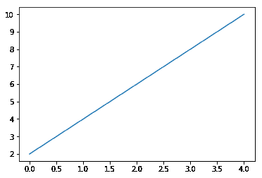

# 第六章：你好，绘图世界！

学习编程时，我们通常从打印“Hello world！”消息开始。那么，对于包含数据、坐标轴、标签、线条和刻度的图形，我们应该如何开始呢？

本章概述了 Matplotlib 的功能和最新特性。我们将引导你完成 Matplotlib 绘图环境的设置。你将学习如何创建一个简单的折线图、查看并保存你的图形。在本章结束时，你将足够自信开始创建自己的图表，并准备好在接下来的章节中学习自定义和更高级的技巧。

来，向图表世界说“你好！”

本章涵盖的主题包括：

+   什么是 Matplotlib？

+   绘制第一个简单的折线图

+   将数据加载到 Matplotlib 中

+   导出图形

# 你好，Matplotlib！

欢迎来到 Matplotlib 2.0 的世界！按照本章中的简单示例，绘制你第一个“Hello world”图表。

# 什么是 Matplotlib？

Matplotlib 是一个多功能的 Python 库，用于生成数据可视化图形。凭借丰富的图表类型和精致的样式选项，它非常适合创建专业的图表，用于演示和科学出版物。Matplotlib 提供了一种简单的方法来生成适合不同目的的图形，从幻灯片、高清海报打印、动画到基于 Web 的交互式图表。除了典型的二维图表，Matplotlib 还支持基本的三维绘图。

在开发方面，Matplotlib 的层次化类结构和面向对象的绘图接口使绘图过程直观且系统化。虽然 Matplotlib 提供了一个用于实时交互的本地图形用户界面，但它也可以轻松集成到流行的基于 IPython 的交互式开发环境中，如 Jupyter Notebook 和 PyCharm。

# Matplotlib 2.0 的新特性

Matplotlib 2.0 引入了许多改进，包括默认样式的外观、图像支持和文本渲染速度。我们选取了一些重要的变化稍后会详细介绍。所有新变化的详细信息可以在文档网站上找到：[`matplotlib.org/devdocs/users/whats_new.html`](http://matplotlib.org/devdocs/users/whats_new.html)。

如果你已经在使用 Matplotlib 的旧版本，可能需要更加关注这一部分来更新你的编码习惯。如果你完全是 Matplotlib 甚至 Python 的新手，可以直接跳过这部分，先开始使用 Matplotlib，稍后再回来查看。

# 默认样式的更改

Matplotlib 2.0 版本最显著的变化是默认样式的改变。你可以在这里查看更改的详细列表：[`matplotlib.org/devdocs/users/dflt_style_changes.html`](http://matplotlib.org/devdocs/users/dflt_style_changes.html)。

# 颜色循环

为了快速绘图而不必为每个数据系列单独设置颜色，Matplotlib 使用一个称为默认属性循环的颜色列表，每个系列将被分配循环中的一个默认颜色。在 Matplotlib 2.0 中，该列表已经从原来的红色、绿色、蓝色、青色、品红色、黄色和黑色（记作`['b', 'g', 'r', 'c', 'm', 'y', 'k']`）变更为 Tableau 软件引入的当前 category10 色板。顾名思义，新的色板有 10 种不同的颜色，适用于分类显示。通过导入 Matplotlib 并在 Python 中调用`matplotlib.rcParams['axes.prop_cycle']`，可以访问该列表。

# 色图

色图对于展示渐变非常有用。黄色到蓝色的“viridis”色图现在是 Matplotlib 2.0 中的默认色图。这个感知统一的色图比经典的“jet”色图更好地展示了数值的视觉过渡。下面是两种色图的对比：


除了默认的感知连续色图外，现在还可以使用定性色图将值分组为不同类别：


# 散点图

散点图中的点默认尺寸更大，且不再有黑色边缘，从而提供更清晰的视觉效果。如果没有指定颜色，则每个数据系列将使用默认颜色循环中的不同颜色：

       

# 图例

虽然早期版本将图例设置在右上角，但 Matplotlib 2.0 默认将图例位置设置为“最佳”。它自动避免图例与数据重叠。图例框还具有圆角、较浅的边缘和部分透明的背景，以便将读者的焦点保持在数据上。经典和当前默认样式中的平方数曲线展示了这一情况：

       

# 线条样式

线条样式中的虚线模式现在可以根据线条宽度进行缩放，以显示更粗的虚线以增加清晰度：


来自文档（https://matplotlib.org/users/dflt_style_changes.html#plot）

# 填充边缘和颜色

就像前面散点图中的点一样，大多数填充元素默认不再有黑色边缘，使图形看起来更简洁：


# 字体

默认字体已经从“Bitstream Vera Sans”更改为“DejaVu Sans”。当前的字体支持更多的国际字符、数学符号和符号字符，包括表情符号。

# 改进的功能或性能

Matplotlib 2.0 展示了改善用户体验的新特性，包括速度、输出质量和资源使用的优化。

# 改进的颜色转换 API 和 RGBA 支持

Alpha 通道，现在完全支持 Matplotlib 2.0，用于指定透明度。

# 改进的图像支持

Matplotlib 2.0 现在使用更少的内存和更少的数据类型转换重新采样图像。

# 更快的文本渲染

据称，Agg 后端的文本渲染速度提高了 20%。我们将在第九章中进一步讨论后端内容，*添加交互性和动画图表*。

# 默认动画编解码器的更改

为了生成动画图表的视频输出，现在默认使用更高效的编解码器 H.264 代替 MPEG-4。由于 H.264 具有更高的压缩率，较小的输出文件大小允许更长的视频记录时间，并减少加载它们所需的时间和网络数据。H.264 视频的实时播放通常比 MPEG-4 编码的视频更加流畅且质量更高。

# 设置的更改

为了方便性、一致性或避免意外结果，Matplotlib v2.0 中更改了一些设置。

# 新的配置参数（rcParams）

新增了一些参数，如 `date.autoformatter.year` 用于日期时间字符串格式化。

# 样式参数黑名单

不再允许样式文件配置与样式无关的设置，以防止意外后果。这些参数包括以下内容：

```py
'interactive', 'backend', 'backend.qt4', 'webagg.port', 'webagg.port_retries', 'webagg.open_in_browser', 'backend_fallback', 'toolbar', 'timezone', 'datapath', 'figure.max_open_warning', 'savefig.directory', tk.window_focus', 'docstring.hardcopy'
```

# Axes 属性关键字的更改

Axes 属性 `axisbg` 和 `axis_bgcolor` 被 `facecolor` 替代，以保持关键字一致性。

# 绘制我们的第一个图表

我们将从一个简单的平方曲线的线性图开始，即 *y = x²*。

# 加载数据以进行绘图

为了可视化数据，我们应该从“拥有”一些数据开始。虽然我们假设你手头有一些不错的数据可以展示，但我们将简要展示如何在 Python 中加载数据以进行绘图。

# 数据结构

有几个常见的数据结构我们将不断遇到。

# 列表

列表是 Python 中用于存储一组值的基本数据类型。列表是通过将元素值放入方括号中创建的。为了重用我们的列表，我们可以给它起个名字并像这样存储它：

```py
evens = [2,4,6,8,10]
```

当我们希望获取更大范围的系列时，例如，为了让平方曲线更平滑，获取更多的数据点，我们可以使用 Python 的 `range()` 函数：

```py
evens = range(2,102,2)
```

此命令将给出从 2 到 100（包含）的所有偶数，并将其存储在名为 `evens` 的列表中。

# Numpy 数组

很多时候，我们处理的是更复杂的数据。如果你需要一个包含多个列的矩阵，或者想对集合中的所有元素进行数学操作，那么 numpy 就是你的选择：

```py
import numpy as np
```

我们根据约定将`numpy`缩写为`np`，以保持代码简洁。

`np.array()` 将支持的数据类型（在此例中是列表）转换为 Numpy 数组。为了从我们的 `evens` 列表中生成一个 numpy 数组，我们这样做：

```py
np.array(evens)
```

# pandas 数据框

当我们在矩阵中有一些非数值标签或值时，pandas 数据框非常有用。它不像 Numpy 那样要求数据类型统一。列可以命名。还有一些函数，比如 `melt()` 和 `pivot_table()`，它们在重塑表格以便分析和绘图时提供了便利。

要将一个列表转换为 pandas 数据框，我们可以做如下操作：

```py
import pandas as pd
pd.DataFrame(evens)
```

你也可以将一个 numpy 数组转换为 pandas 数据框。

# 从文件加载数据

虽然这一切能让你复习我们将要处理的数据结构，但在现实生活中，我们不是发明数据，而是从数据源读取它。制表符分隔的纯文本文件是最简单且最常见的数据输入类型。假设我们有一个名为 `evens.txt` 的文件，里面包含了前面提到的偶数。该文件有两列。第一列只记录不必要的信息，我们想要加载第二列的数据。

这就是假文本文件的样子：


# 基本的 Python 方式

我们可以初始化一个空列表，逐行读取文件，拆分每一行，并将第二个元素附加到我们的列表中：

```py
evens = []
with open as f:
    for line in f.readlines():
        evens.append(line.split()[1])
```

当然，你也可以使用一行代码来实现：

`evens = [int(x.split()[1]) for x in open('evens.txt').readlines()]`

我们只是尝试一步步走，遵循 Python 的 Zen（禅哲学）：简单优于复杂。

# Numpy 方式

当我们有一个只有两列的文件，并且只需要读取一列时，这非常简单，但当我们拥有一个包含成千上万列和行的扩展表格，并且想要将其转换为 Numpy 矩阵时，它可能会变得更加繁琐。

Numpy 提供了一个标准的一行代码解决方案：

```py
import numpy as np
np.loadtxt(‘evens.txt’,delimiter=’\t’,usecols=1,dtype=np.int32)
```

第一个参数是数据文件的路径。`delimiter` 参数指定用于分隔值的字符串，这里是一个制表符。因为 `numpy.loadtxt()` 默认情况下将任何空白符分隔的值拆分成列，所以这个参数在这里可以省略。我们为演示设置了它。

对于 `usecols` 和 `dtype`，它们分别指定要读取哪些列以及每列对应的数据类型，你可以传递单个值，也可以传递一个序列（例如列表）来读取多列。

Numpy 默认情况下还会跳过以 `#` 开头的行，这通常表示注释或标题行。你可以通过设置 `comment` 参数来更改这种行为。

# pandas 方式

类似于 Numpy，pandas 提供了一种简单的方法将文本文件加载到 pandas 数据框中：

```py
import pandas as pd
pd.read_csv(usecols=1)
```

这里的分隔符可以用 `sep` 或 `delimiter` 来表示，默认情况下它是逗号 `,`（**CSV** 代表 **逗号分隔值**）。

关于如何处理不同的数据格式、数据类型和错误，有一长串不太常用的选项可供选择。你可以参考文档：[`pandas.pydata.org/pandas-docs/stable/generated/pandas.read_csv.html`](http://pandas.pydata.org/pandas-docs/stable/generated/pandas.read_csv.html)。除了平面 CSV 文件外，Pandas 还提供了读取其他常见数据格式的内置函数，例如 Excel、JSON、HTML、HDF5、SQL 和 Google BigQuery。

为了保持对数据可视化的关注，本书将不深入探讨数据清洗的方法，但这对于数据科学来说是一个非常有用的生存技能。如果你感兴趣，可以查阅关于使用 Python 进行数据处理的相关资源。

# 导入 Matplotlib 的 pyplot 模块

Matplotlib 包包含许多模块，其中包括控制美学的 artist 模块和用于设置默认值的 rcParams 模块。Pyplot 模块是我们主要处理的绘图接口，它以面向对象的方式创建数据图表。

按惯例，我们在导入时使用`plt`这个缩写：

```py
import matplotlib.pylot as plt
```

别忘了运行 Jupyter Notebook 的单元格魔法 `%matplotlib inline`，以便将图形嵌入输出中。

**不要使用 pylab 模块！**

现在不推荐使用 pylab 模块，通常被 **面向对象**（**OO**）接口所替代。虽然 pylab 通过在一个命名空间下导入`matplotlib.pyplot`和`numpy`提供了一些便利，但现在许多在线的 pylab 示例仍然存在，但最好分别调用 `Matplotlib.pyplot` 和 `numpy` 模块。

# 绘制曲线

绘制列表的折线图可以简单到：

```py
plt.plot(evens)
```



当只指定一个参数时，Pyplot 假定我们输入的数据位于 y 轴，并自动选择 x 轴的刻度。

要绘制图表，调用`plt.plot(x,y)`，其中`x`和`y`是数据点的 *x* 坐标和 *y* 坐标：

```py
plt.plot(evens,evens**2)
```

要为曲线添加图例标签，我们在 `plot` 函数中添加标签信息：

```py
plt.plot(evens,evens**2,label = 'x²')
plt.legend()
```

# 查看图形

现在，别忘了调用`plt.show()`来显示图形！


# 保存图形

现在我们已经绘制了第一个图形。让我们保存我们的工作！当然，我们不想依赖截图。这里有一个简单的方法，通过调用 `pyplot.savefig()` 来完成。

如果你既想在屏幕上查看图像，又想将其保存在文件中，记得在调用 `pyplot.show()` 之前先调用 `pyplot.savefig()`，以确保你不会保存一个空白画布。

# 设置输出格式

`pyplot.savefig()` 函数接受输出文件的路径，并自动以指定的扩展名输出。例如，`pyplot.savefig('output.png')` 会生成一个 PNG 图像。如果没有指定扩展名，默认会生成 SVG 图像。如果指定的格式不受支持，比如`.doc`，会抛出一个 `ValueError` Python 异常：


# PNG（便携式网络图形）

与另一种常见的图像文件格式 JPEG 相比，PNG 的优势在于允许透明背景。PNG 被大多数图像查看器和处理程序广泛支持。

# PDF（便携式文档格式）

PDF 是一种标准的文档格式，你不必担心阅读器的可用性。然而，大多数办公软件不支持将 PDF 作为图像导入。

# SVG（可伸缩矢量图形）

SVG 是一种矢量图形格式，可以在不失去细节的情况下进行缩放。因此，可以在较小的文件大小下获得更好的质量。它与 HTML5 兼容，适合用于网页。但某些基础图像查看器可能不支持它。

# Post（Postscript）

Postscript 是一种用于电子出版的页面描述语言。它对于批量处理图像以进行出版非常有用。

**Gimp 绘图工具包**（**GDK**）的光栅图形渲染在 2.0 版本中已被弃用，这意味着像 JPG 和 TIFF 这样的图像格式不再由默认后端支持。我们将在后面更详细地讨论后端。

# 调整分辨率

分辨率衡量图像记录的细节。它决定了你可以在不失去细节的情况下放大图像的程度。具有较高分辨率的图像在较大尺寸下保持较高质量，但文件大小也会更大。

根据用途，你可能希望以不同的分辨率输出图形。分辨率是通过每英寸的颜色像素**点数（dpi）**来衡量的。你可以通过在`pyplot.savefig()`函数中指定`dpi`参数来调整输出图形的分辨率，例如：

```py
plt.savefig('output.png',dpi=300)
```

虽然较高的分辨率能提供更好的图像质量，但它也意味着更大的文件大小，并且需要更多的计算机资源。以下是一些关于你应设置图像分辨率多高的参考：

+   幻灯片演示：96 dpi+

以下是微软针对不同屏幕大小的 PowerPoint 演示文稿图形分辨率建议：[`support.microsoft.com/en-us/help/827745/how-to-change-the-export-resolution-of-a-powerpoint-slide`](https://support.microsoft.com/en-us/help/827745/how-to-change-the-export-resolution-of-a-powerpoint-slide)：

| **屏幕高度（像素）** | **分辨率（dpi）** |
| --- | --- |
| 720 | 96（默认） |
| 750 | 100 |
| 1125 | 150 |
| 1500 | 200 |
| 1875 | 250 |
| 2250 | 300 |

+   海报展示：300 dpi+

+   网络：72 dpi+（推荐使用可以响应式缩放的 SVG）

# 摘要

在本章中，你学习了如何使用 Matplotlib 绘制一个简单的折线图。我们设置了环境，导入了数据，并将图形输出为不同格式的图像。在下一章，你将学习如何可视化在线数据。
