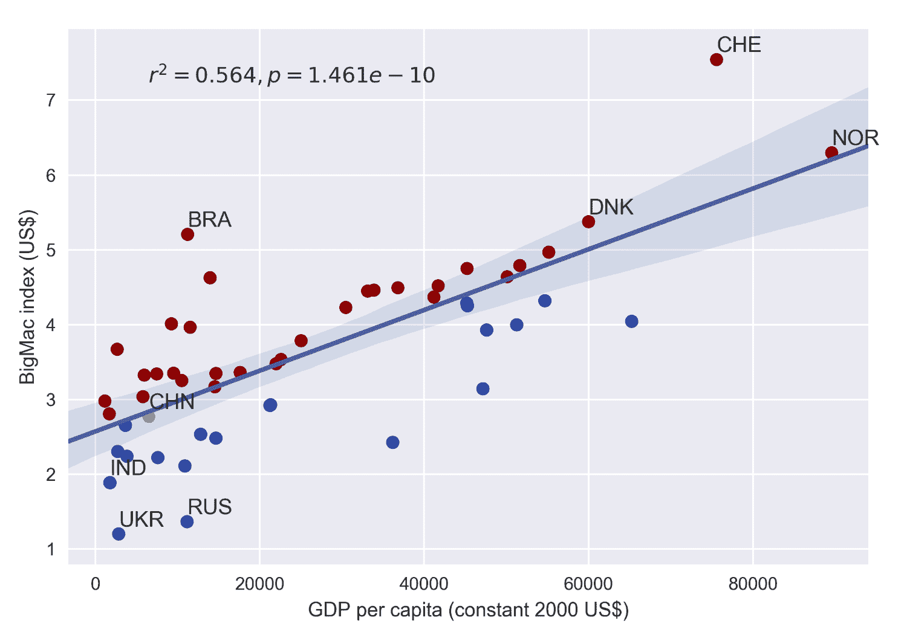
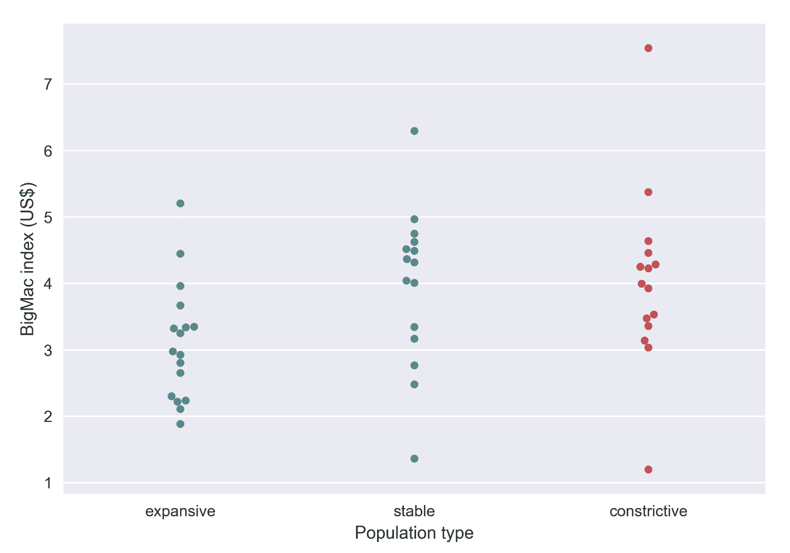

# 第七章：可视化在线数据

到目前为止，我们已经介绍了使用 Matplotlib 创建和定制图表的基础知识。在本章中，我们将通过在专门主题中的示例，开始了解更高级的 Matplotlib 使用方法。

在考虑可视化某个概念时，需要仔细考虑以下重要因素：

+   数据来源

+   数据过滤和处理

+   选择适合数据的图表类型：

    +   可视化数据趋势：

        +   折线图、区域图和堆叠区域图

    +   可视化单变量分布：

        +   条形图、直方图和核密度估计图

    +   可视化双变量分布：

        +   散点图、KDE 密度图和六边形图

    +   可视化类别数据：

        +   类别散点图、箱线图、蜂群图、小提琴图

+   调整图形美学以有效讲述故事

我们将通过使用人口统计和财务数据来讨论这些主题。首先，我们将讨论从 **应用程序编程接口**（**API**）获取数据时的典型数据格式。接下来，我们将探索如何将 Matplotlib 2.0 与 Pandas、Scipy 和 Seaborn 等其他 Python 包结合使用，以实现不同数据类型的可视化。

# 常见的 API 数据格式

许多网站通过 API 提供数据，API 是通过标准化架构连接应用程序的桥梁。虽然我们这里不打算详细讨论如何使用 API，因为网站特定的文档通常可以在线找到；但我们将展示在许多 API 中使用的三种最常见的数据格式。

# CSV

**CSV**（**逗号分隔值**）是最古老的文件格式之一，它在互联网存在之前就已经被引入。然而，随着其他高级格式如 JSON 和 XML 的流行，CSV 格式现在逐渐被淘汰。顾名思义，数据值由逗号分隔。预安装的 `csv` 包和 `pandas` 包包含读取和写入 CSV 格式数据的类。这个 CSV 示例定义了一个包含两个国家的总人口表：

```py
Country,Time,Sex,Age,Value
United Kingdom,1950,Male,0-4,2238.735
United States of America,1950,Male,0-4,8812.309
```

# JSON

**JSON**（**JavaScript 对象表示法**）因其高效性和简洁性，近年来越来越受欢迎。JSON 允许指定数字、字符串、布尔值、数组和对象。Python 提供了默认的 `json` 包来解析 JSON。另外，`pandas.read_json` 类可以用于将 JSON 导入为 Pandas 数据框。前面的总人口表可以通过以下 JSON 示例表示：

```py
{
 "population": [
 {
 "Country": "United Kingdom",
 "Time": 1950,
 "Sex", "Male",
 "Age", "0-4",
 "Value",2238.735
 },{
 "Country": "United States of America",
 "Time": 1950,
 "Sex", "Male",
 "Age", "0-4",
 "Value",8812.309
 },
 ]
}
```

# XML

**XML**（**可扩展标记语言**）是数据格式中的瑞士军刀，已成为 Microsoft Office、Apple iWork、XHTML、SVG 等的默认容器。XML 的多功能性有其代价，因为它使得 XML 变得冗长且较慢。Python 中有多种解析 XML 的方法，但建议使用 `xml.etree.ElementTree`，因为它提供了 Python 风格的接口，并且有高效的 C 后端支持。本书不打算介绍 XML 解析，但其他地方有很好的教程（例如 [`eli.thegreenplace.net/2012/03/15/processing-xml-in-python-with-elementtree`](http://eli.thegreenplace.net/2012/03/15/processing-xml-in-python-with-elementtree)）。

例如，相同的人口表可以转换为 XML 格式：

```py
<?xml version='1.0' encoding='utf-8'?>
<populations>
 <population>
 <Country>United Kingdom</Country> 
 <Time>1950</Time>
 <Sex>Male</Sex>
 <Age>0-4</Age>
 <Value>2238.735</Value>
 </population>
 <population>
 <Country>United States of America</Country>
 <Time>1950</Time>
 <Sex>Male</Sex>
 <Age>0-4</Age>
 <Value>8812.309</Value>
 </population>
</populations>
```

# 介绍 pandas

除了 NumPy 和 SciPy，pandas 是 Python 中最常见的科学计算库之一。其作者旨在使 pandas 成为任何语言中最强大、最灵活的开源数据分析和处理工具，实际上，他们几乎实现了这一目标。其强大且高效的库与数据科学家的需求完美契合。像其他 Python 包一样，Pandas 可以通过 PyPI 轻松安装：

```py
pip install pandas
```

Matplotlib 在 1.5 版本中首次引入，支持将 pandas DataFrame 作为输入应用于各种绘图类。Pandas DataFrame 是一种强大的二维标签数据结构，支持索引、查询、分组、合并以及其他一些常见的关系数据库操作。DataFrame 类似于电子表格，因为 DataFrame 的每一行包含一个实例的不同变量，而每一列则包含一个特定变量在所有实例中的向量。

pandas DataFrame 支持异构数据类型，如字符串、整数和浮点数。默认情况下，行按顺序索引，列由 pandas Series 组成。可以通过 index 和 columns 属性指定可选的行标签或列标签。

# 导入在线人口数据（CSV 格式）

让我们首先来看一下将在线 CSV 文件导入 pandas DataFrame 的步骤。在这个例子中，我们将使用联合国经济和社会事务部在 2015 年发布的年度人口总结数据集。该数据集还包含了面向 2100 年的人口预测数据：

```py
import numpy as np # Python scientific computing package
import pandas as pd # Python data analysis package

# URL for Annual Population by Age and Sex - Department of Economic
# and Social Affairs, United Nations
source = "https://github.com/PacktPublishing/Matplotlib-2.x-By-Example/blob/master/WPP2015_DB04_Population_Annual.zip"

# Pandas support both local or online files 
data = pd.read_csv(source, header=0, compression='zip', encoding='latin_1') 

# Show the first five rows of the DataFrame
data.head() 
```

代码的预期输出如下所示：

| **LocID** | **Location** | **VarID** | **Variant** | **Time** | **MidPeriod** | **SexID** | **Sex** | **AgeGrp** | **AgeGrpStart** | **AgeGrpSpan** | **Value** |  |
| --- | --- | --- | --- | --- | --- | --- | --- | --- | --- | --- | --- | --- |
| **0** | 4 | 阿富汗 | 2 | 中等 | 1950 | 1950.5 | 1 | 男性 | 0-4 | 0 | 5 | 630.044 |
| **1** | 4 | 阿富汗 | 2 | 中等 | 1950 | 1950.5 | 1 | 男性 | 5-9 | 5 | 5 | 516.205 |
| **2** | 4 | 阿富汗 | 2 | 中等 | 1950 | 1950.5 | 1 | 男性 | 10-14 | 10 | 5 | 461.378 |
| **3** | 4 | 阿富汗 | 2 | 中等 | 1950 | 1950.5 | 1 | 男性 | 15-19 | 15 | 5 | 414.368 |
| **4** | 4 | 阿富汗 | 2 | 中等 | 1950 | 1950.5 | 1 | 男性 | 20-24 | 20 | 5 | 374.110 |

`pandas.read_csv` 类极为多功能，支持列标题、自定义分隔符、各种压缩格式（例如，`.gzip`、`.bz2`、`.zip` 和 `.xz`）、不同的文本编码等。读者可以参考文档页面（[`pandas.pydata.org/pandas-docs/stable/generated/pandas.read_csv.html`](http://pandas.pydata.org/pandas-docs/stable/generated/pandas.read_csv.html)）获取更多信息。

通过调用 Pandas DataFrame 对象的 `.head()` 函数，我们可以快速查看数据的前五行。

在本章中，我们将把这个人口数据集与 Quandl 中的其他数据集合并。不过，Quandl 使用三字母国家代码（ISO 3166 alpha-3）来表示地理位置；因此我们需要相应地重新格式化地点名称。

`pycountry` 包是根据 ISO 3166 标准转换国家名称的优秀选择。同样，`pycountry` 可以通过 PyPI 安装：

```py
pip install pycountry 
```

继续之前的代码示例，我们将为数据框添加一个新的 `country` 列：

```py
from pycountry import countries

def get_alpha_3(location):
    """Convert full country name to three letter code (ISO 3166 alpha-3)

    Args:
        location: Full location name
    Returns:
        three letter code or None if not found"""

    try:
        return countries.get(name=location).alpha_3
    except:
        return None

# Add a new country column to the dataframe
population_df['country'] = population_df['Location'].apply(lambda x: get_alpha_3(x))
population_df.head()
```

代码的预期输出如下所示：

| **-** | **LocID** | **Location** | **VarID** | **Variant** | **Time** | **MidPeriod** | **SexID** | **Sex** | **AgeGrp** | **AgeGrpStart** | **AgeGrpSpan** | **Value** | **country** |
| --- | --- | --- | --- | --- | --- | --- | --- | --- | --- | --- | --- | --- | --- |
| 0 | 4 | 阿富汗 | 2 | 中等 | 1950 | 1950.5 | 1 | 男性 | 0-4 | 0 | 5 | 630.044 | AFG |
| 1 | 4 | 阿富汗 | 2 | 中等 | 1950 | 1950.5 | 1 | 男性 | 5-9 | 5 | 5 | 516.205 | AFG |
| 2 | 4 | 阿富汗 | 2 | 中等 | 1950 | 1950.5 | 1 | 男性 | 10-14 | 10 | 5 | 461.378 | AFG |
| 3 | 4 | 阿富汗 | 2 | 中等 | 1950 | 1950.5 | 1 | 男性 | 15-19 | 15 | 5 | 414.368 | AFG |
| 4 | 4 | 阿富汗 | 2 | 中等 | 1950 | 1950.5 | 1 | 男性 | 20-24 | 20 | 5 | 374.110 | AFG |

# 导入在线财务数据（JSON 格式）

在本章中，我们还将利用 Quandl 的 API 提取财务数据，并创建有洞察力的可视化图表。如果你不熟悉 Quandl，它是一个财务和经济数据仓库，存储了来自数百家出版商的数百万个数据集。Quandl 最棒的地方在于，这些数据集通过统一的 API 进行交付，无需担心如何正确解析数据。匿名用户每天可以进行最多 50 次 API 调用，注册用户可获得最多 500 次免费的 API 调用。读者可以在[`www.quandl.com/?modal=register`](https://www.quandl.com/?modal=register)注册免费 API 密钥。

在 Quandl 中，每个数据集都有一个唯一的 ID，这个 ID 在每个搜索结果网页上由 Quandl Code 定义。例如，Quandl 代码 GOOG/NASDAQ_SWTX 定义了 Google 财务发布的历史 NASDAQ 指数数据。每个数据集有三种格式可用——CSV、JSON 和 XML。

尽管 Quandl 提供了官方的 Python 客户端库，但为了演示导入 JSON 数据的一般过程，我们将不使用它。根据 Quandl 的文档，我们可以通过以下 API 调用获取 JSON 格式的数据表：

`GET https://www.quandl.com/api/v3/datasets/{Quandl code}/data.json`

让我们尝试从 Quandl 获取巨无霸指数数据。

```py
from urllib.request import urlopen
import json
import time
import pandas as pd

def get_bigmac_codes():
    """Get a Pandas DataFrame of all codes in the Big Mac index dataset

    The first column contains the code, while the second header
    contains the description of the code.

    for example, 
    ECONOMIST/BIGMAC_ARG,Big Mac Index - Argentina
    ECONOMIST/BIGMAC_AUS,Big Mac Index - Australia
    ECONOMIST/BIGMAC_BRA,Big Mac Index - Brazil

    Returns:
        codes: Pandas DataFrame of Quandl dataset codes"""

    codes_url = "https://www.quandl.com/api/v3/databases/ECONOMIST/codes"
    codes = pd.read_csv(codes_url, header=None, names=['Code', 'Description'], 
                        compression='zip', encoding='latin_1')

    return codes

def get_quandl_dataset(api_key, code):
    """Obtain and parse a quandl dataset in Pandas DataFrame format

    Quandl returns dataset in JSON format, where data is stored as a 
    list of lists in response['dataset']['data'], and column headers
    stored in response['dataset']['column_names'].

    for example, {'dataset': {...,
             'column_names': ['Date',
                              'local_price',
                              'dollar_ex',
                              'dollar_price',
                              'dollar_ppp',
                              'dollar_valuation',
                              'dollar_adj_valuation',
                              'euro_adj_valuation',
                              'sterling_adj_valuation',
                              'yen_adj_valuation',
                              'yuan_adj_valuation'],
             'data': [['2017-01-31',
                       55.0,
                       15.8575,
                       3.4683903515687,
                       10.869565217391,
                       -31.454736135007,
                       6.2671477203176,
                       8.2697553162259,
                       29.626894343348,
                       32.714616745128,
                       13.625825886047],
                      ['2016-07-31',
                       50.0,
                       14.935,
                       3.3478406427854,
                       9.9206349206349,
                       -33.574590420925,
                       2.0726096168216,
                       0.40224795003514,
                       17.56448458418,
                       19.76377270142,
                       11.643103380531]
                      ],
             'database_code': 'ECONOMIST',
             'dataset_code': 'BIGMAC_ARG',
             ... }}

    A custom column--country is added to denote the 3-letter country code.

    Args:
        api_key: Quandl API key
        code: Quandl dataset code

    Returns:
        df: Pandas DataFrame of a Quandl dataset

    """
    base_url = "https://www.quandl.com/api/v3/datasets/"
    url_suffix = ".json?api_key="

    # Fetch the JSON response 
    u = urlopen(base_url + code + url_suffix + api_key)
    response = json.loads(u.read().decode('utf-8'))

    # Format the response as Pandas Dataframe
    df = pd.DataFrame(response['dataset']['data'], columns=response['dataset']['column_names'])

    # Label the country code
    df['country'] = code[-3:]

    return df

quandl_dfs = []
codes = get_bigmac_codes()

# Replace this with your own API key
api_key = "INSERT YOUR KEY HERE" 

for code in codes.Code:
    # Get the DataFrame of a Quandl dataset
    df = get_quandl_dataset(api_key, code)

    # Store in a list
    quandl_dfs.append(df)

    # Prevents exceeding the API speed limit
    time.sleep(2)

# Concatenate the list of dataframes into a single one    
bigmac_df = pd.concat(quandl_dfs)
bigmac_df.head()
```

预期的输出如下：

| - | **日期** | **本地价格** | **美元汇率** | **美元价格** | **美元 PPP** | **美元估值** | **美元调整估值** | **欧元调整估值** | **英镑调整估值** | **日元调整估值** | **人民币调整估值** | **国家** |
| --- | --- | --- | --- | --- | --- | --- | --- | --- | --- | --- | --- | --- |
| **0** | 2017-01-31 | 55.0 | 15.85750 | 3.468390 | 10.869565 | -31.454736 | 6.26715 | 8.26976 | 29.6269 | 32.7146 | 13.6258 | 阿根廷 |
| **1** | 2016-07-31 | 50.0 | 14.93500 | 3.347841 | 9.920635 | -33.574590 | 2.07261 | 0.402248 | 17.5645 | 19.7638 | 11.6431 | 阿根廷 |
| **2** | 2016-01-31 | 33.0 | 13.80925 | 2.389703 | 6.693712 | -51.527332 | -24.8619 | -18.714 | -18.7209 | 0.40859 | -17.029 | 阿根廷 |
| **3** | 2015-07-31 | 28.0 | 9.13500 | 3.065134 | 5.845511 | -36.009727 | -4.7585 | -0.357918 | -6.01091 | 30.8609 | 5.02868 | 阿根廷 |
| **4** | 2015-01-31 | 28.0 | 8.61000 | 3.252033 | 5.845511 | -32.107881 | 0.540242 | -0.804495 | -2.49468 | 34.3905 | 6.01183 | 阿根廷 |

巨无霸指数是《经济学人》于 1986 年发明的，用来轻松检查货币是否在正确的水平。它基于**购买力平价**（**PPP**）理论，并被认为是货币汇率在 PPP 下的非正式衡量标准。它通过与类似商品和服务的价格对比来衡量货币的价值，在这种情况下，是巨无霸的价格。市场汇率下不同的价格意味着某种货币被低估或高估。

从 Quandl API 解析 JSON 的代码稍微复杂一些，因此额外的解释可能有助于你理解它。第一个函数`get_bigmac_codes()`解析 Quandl Economist 数据库中所有可用数据集代码的列表，并将其作为 pandas DataFrame 返回。与此同时，第二个函数`get_quandl_dataset(api_key, code)`将 Quandl 数据集 API 查询的 JSON 响应转换为 pandas DataFrame。所有获取的数据集都通过`pandas.concat()`进行拼接。

# 可视化数据趋势

一旦我们导入了这两个数据集，就可以开始进一步的可视化之旅。让我们从绘制 1950 年到 2017 年的全球人口趋势开始。为了根据某一列的值选择行，我们可以使用以下语法：`df[df.variable_name == "target"]`或`df[df['variable_name'] == "target"]`，其中`df`是数据框对象。其他条件运算符，如大于 > 或小于 <，也支持。可以使用“与”运算符&或“或”运算符|将多个条件语句链在一起。

为了聚合某一年内所有年龄组的人口数据，我们将依赖 `df.groupby().sum()`，如以下示例所示：

```py
import matplotlib.pyplot as plt

# Select the aggregated population data from the world for both genders,
# during 1950 to 2017.
selected_data = data[(data.Location == 'WORLD') & (data.Sex == 'Both') & (data.Time <= 2017) ]

# Calculate aggregated population data across all age groups for each year 
# Set as_index=False to avoid the Time variable to be used as index
grouped_data = selected_data.groupby('Time', as_index=False).sum()

# Generate a simple line plot of population vs time
fig = plt.figure()
plt.plot(grouped_data.Time, grouped_data.Value)

# Label the axis
plt.xlabel('Year')
plt.ylabel('Population (thousands)')

plt.show()
```


# 区域图和堆叠区域图

有时，我们可能希望通过为线图下方的区域填充颜色来增加视觉冲击力。可以通过 `fill_between` 类来实现这一点：

```py
fill_between(x, y1, y2=0, where=None, interpolate=False, step=None)
```

默认情况下，当未指定 `y2` 时，`fill_between` 会为 `y=0` 和曲线之间的区域着色。可以通过使用 `where`、`interpolate` 和 `step` 等关键字参数来指定更复杂的着色行为。读者可以通过以下链接获取更多信息：[`matplotlib.org/examples/pylab_examples/fill_between_demo.html`](https://matplotlib.org/examples/pylab_examples/fill_between_demo.html)

让我们尝试通过区分男女来绘制一个更详细的图表。我们将探讨男性和女性对人口增长的相对贡献。为此，我们可以使用 `stackplot` 类绘制堆叠区域图：

```py
# Select the aggregated population data from the world for each gender,
# during 1950 to 2017.
male_data = data[(data.Location == 'WORLD') & (data.Sex == 'Male') & (data.Time <= 2017) ]
female_data = data[(data.Location == 'WORLD') & (data.Sex == 'Female') & (data.Time <= 2017) ]

# Calculate aggregated population data across all age groups for each year 
# Set as_index=False to avoid the Time variable to be used as index
grouped_male_data = male_data.groupby('Time', as_index=False).sum()
grouped_female_data = female_data.groupby('Time', as_index=False).sum()

# Create two subplots with shared y-axis (sharey=True)
fig, (ax1, ax2) = plt.subplots(nrows=1, ncols=2, figsize=(12,4), sharey=True)

# Generate a simple line plot of population vs time,
# then shade the area under the line in sky blue.
ax1.plot(grouped_data.Time, grouped_data.Value)
ax1.fill_between(grouped_data.Time, grouped_data.Value, color='skyblue')

# Use set_xlabel() or set_ylabel() instead to set the axis label of an
# axes object
ax1.set_xlabel('Year')
ax1.set_ylabel('Population (thousands)')

# Generate a stacked area plot of population vs time
ax2.stackplot(grouped_male_data.Time, grouped_male_data.Value, grouped_female_data.Value)

# Add a figure legend
ax2.legend(['Male', 'Female'], loc='upper left')

# Set the x-axis label only this time
ax2.set_xlabel('Year')
plt.show()
```


# 介绍 Seaborn

Seaborn 是由 Michael Waskom 开发的一个统计可视化库，建立在 Matplotlib 之上。它提供了用于可视化类别变量、单变量分布和双变量分布的便捷函数。对于更复杂的图表，提供了多种统计方法，如线性回归模型和聚类算法。像 Matplotlib 一样，Seaborn 也支持 Pandas 数据框作为输入，并自动进行必要的切片、分组、聚合以及统计模型拟合，从而生成有用的图形。

这些 Seaborn 函数旨在通过最小化的参数集，通过 API 创建出版级质量的图形，同时保持 Matplotlib 完整的自定义功能。事实上，Seaborn 中的许多函数在调用时会返回一个 Matplotlib 轴或网格对象。因此，Seaborn 是 Matplotlib 的得力伙伴。要通过 PyPI 安装 Seaborn，可以在终端中运行以下命令：

```py
pip install pandas
```

Seaborn 将在本书中以 `sns` 导入。本节不会是 Seaborn 的文档，而是从 Matplotlib 用户的角度，概述 Seaborn 的功能。读者可以访问 Seaborn 的官方网站 ([`seaborn.pydata.org/index.html`](http://seaborn.pydata.org/index.html)) 获取更多信息。

# 可视化单变量分布

Seaborn 使得可视化数据集分布的任务变得更加容易。以之前讨论的人口数据为例，让我们通过绘制条形图来查看 2017 年不同国家的人口分布情况：

```py
import seaborn as sns
import matplotlib.pyplot as plt

# Extract USA population data in 2017
current_population = population_df[(population_df.Location 
                                    == 'United States of America') & 
                                   (population_df.Time == 2017) &
                                   (population_df.Sex != 'Both')]

# Population Bar chart 
sns.barplot(x="AgeGrp",y="Value", hue="Sex", data = current_population)

# Use Matplotlib functions to label axes rotate tick labels
ax = plt.gca()
ax.set(xlabel="Age Group", ylabel="Population (thousands)")
ax.set_xticklabels(ax.xaxis.get_majorticklabels(), rotation=45)
plt.title("Population Barchart (USA)")

# Show the figure
plt.show()
```


# Seaborn 中的条形图

`seaborn.barplot()` 函数显示一系列数据点作为矩形条。如果每组有多个点，则在条形顶部显示置信区间，以指示点估计的不确定性。与大多数其他 Seaborn 函数一样，支持各种输入数据格式，如 Python 列表、Numpy 数组、pandas Series 和 pandas DataFrame。

展示人口结构的更传统方式是通过人口金字塔。

那么什么是人口金字塔？顾名思义，它是显示人口年龄分布的金字塔形绘图。它可以粗略地分为三类，即压缩型、稳定型和扩张型，分别用于经历负增长、稳定增长和快速增长的人口。例如，压缩型人口的年轻人比例较低，因此金字塔底部看起来受限。稳定型人口的年轻人和中年组相对较多。而扩张型人口则有大量年轻人，从而导致金字塔底部扩大。

我们可以通过在两个共享 y 轴的子图上绘制两个条形图来构建人口金字塔：

```py
import seaborn as sns
import matplotlib.pyplot as plt

# Extract USA population data in 2017
current_population = population_df[(population_df.Location 
                                    == 'United States of America') & 
                                   (population_df.Time == 2017) &
                                   (population_df.Sex != 'Both')]

# Change the age group to descending order
current_population = current_population.iloc[::-1]

# Create two subplots with shared y-axis
fig, axes = plt.subplots(ncols=2, sharey=True)

# Bar chart for male
sns.barplot(x="Value",y="AgeGrp", color="darkblue", ax=axes[0],
            data = current_population[(current_population.Sex == 'Male')])
# Bar chart for female
sns.barplot(x="Value",y="AgeGrp", color="darkred", ax=axes[1],
            data = current_population[(current_population.Sex == 'Female')])

# Use Matplotlib function to invert the first chart
axes[0].invert_xaxis()

# Use Matplotlib function to show tick labels in the middle
axes[0].yaxis.tick_right()

# Use Matplotlib functions to label the axes and titles
axes[0].set_title("Male")
axes[1].set_title("Female")
axes[0].set(xlabel="Population (thousands)", ylabel="Age Group")
axes[1].set(xlabel="Population (thousands)", ylabel="")
fig.suptitle("Population Pyramid (USA)")

# Show the figure
plt.show()
```


由于 Seaborn 建立在 Matplotlib 的坚实基础之上，我们可以使用 Matplotlib 的内置函数轻松定制绘图。在前面的例子中，我们使用 `matplotlib.axes.Axes.invert_xaxis()` 将男性人口图水平翻转，然后使用 `matplotlib.axis.YAxis.tick_right()` 将刻度标签位置改为右侧。我们进一步使用 `matplotlib.axes.Axes.set_title()`、`matplotlib.axes.Axes.set()` 和 `matplotlib.figure.Figure.suptitle()` 组合定制了绘图的标题和轴标签。

我们尝试通过将行 `population_df.Location == 'United States of America'` 更改为 `population_df.Location == 'Cambodia'` 或 `population_df.Location == 'Japan'` 来绘制柬埔寨和日本的人口金字塔。你能把金字塔分类到三类人口金字塔中的一类吗？


为了看到 Seaborn 如何简化相对复杂绘图的代码，让我们看看如何使用原始 Matplotlib 实现类似的绘图。

首先，像之前基于 Seaborn 的示例一样，我们创建具有共享 y 轴的两个子图：

```py
fig, axes = plt.subplots(ncols=2, sharey=True)
```

接下来，我们使用 `matplotlib.pyplot.barh()` 绘制水平条形图，并设置刻度的位置和标签，然后调整子图间距：

```py
# Get a list of tick positions according to the data bins
y_pos = range(len(current_population.AgeGrp.unique()))

# Horizontal barchart for male
axes[0].barh(y_pos, current_population[(current_population.Sex ==
             'Male')].Value, color="darkblue")

# Horizontal barchart for female
axes[1].barh(y_pos, current_population[(current_population.Sex == 
             'Female')].Value, color="darkred")

# Show tick for each data point, and label with the age group
axes[0].set_yticks(y_pos)
axes[0].set_yticklabels(current_population.AgeGrp.unique())

# Increase spacing between subplots to avoid clipping of ytick labels
plt.subplots_adjust(wspace=0.3)
```

最后，我们使用相同的代码进一步定制图形的外观和感觉：

```py
# Invert the first chart
axes[0].invert_xaxis()

# Show tick labels in the middle
axes[0].yaxis.tick_right()

# Label the axes and titles
axes[0].set_title("Male")
axes[1].set_title("Female")
axes[0].set(xlabel="Population (thousands)", ylabel="Age Group")
axes[1].set(xlabel="Population (thousands)", ylabel="")
fig.suptitle("Population Pyramid (USA)")

# Show the figure
plt.show()
```


与基于 Seaborn 的代码相比，纯 Matplotlib 实现需要额外的代码行来定义刻度位置、刻度标签和子图间距。对于一些其他包含额外统计计算（如线性回归、皮尔逊相关）的 Seaborn 图表类型，代码的简化更加明显。因此，Seaborn 是一个“开箱即用”的统计可视化包，使用户可以写出更简洁的代码。

# Seaborn 中的直方图和分布拟合

在人口示例中，原始数据已经分为不同的年龄组。如果数据没有被分组（例如大麦指数数据），该怎么办呢？事实证明，`seaborn.distplot`可以帮助我们将数据分组，并显示相应的直方图。让我们看一下这个例子：

```py
import seaborn as sns
import matplotlib.pyplot as plt

# Get the BigMac index in 2017
current_bigmac = bigmac_df[(bigmac_df.Date == "2017-01-31")]

# Plot the histogram
ax = sns.distplot(current_bigmac.dollar_price)
plt.show()
```


`seaborn.distplot`函数期望输入的是 pandas Series、单维度的 numpy.array 或者 Python 列表。然后，它根据 Freedman-Diaconis 规则确定箱子的大小，最后在直方图上拟合**核密度估计**（**KDE**）。

KDE 是一种非参数方法，用于估计变量的分布。我们还可以提供一个参数分布，例如贝塔分布、伽马分布或正态分布，作为`fit`参数。

在这个例子中，我们将拟合来自`scipy.stats`包的正态分布到大麦指数数据集：

```py
from scipy import stats

ax = sns.distplot(current_bigmac.dollar_price, kde=False, fit=stats.norm)
plt.show()
```


# 可视化双变量分布

我们应当记住，大麦指数在不同国家之间并不能直接比较。通常，我们会预期贫穷国家的商品比富裕国家的便宜。为了更公平地呈现该指数，最好显示大麦价格与**国内生产总值**（**GDP**）人均的关系。

我们将从 Quandl 的**世界银行世界发展指标**（**WWDI**）数据集中获取人均 GDP 数据。基于之前获取 Quandl JSON 数据的代码示例，你能尝试将其修改为下载人均 GDP 数据集吗？

对于不耐烦的人，这里是完整的代码：

```py
import urllib
import json
import pandas as pd
import time
from urllib.request import urlopen

def get_gdp_dataset(api_key, country_code):
    """Obtain and parse a quandl GDP dataset in Pandas DataFrame format
    Quandl returns dataset in JSON format, where data is stored as a 
    list of lists in response['dataset']['data'], and column headers
    stored in response['dataset']['column_names'].

    Args:
        api_key: Quandl API key
        country_code: Three letter code to represent country

    Returns:
        df: Pandas DataFrame of a Quandl dataset
    """
    base_url = "https://www.quandl.com/api/v3/datasets/"
    url_suffix = ".json?api_key="

    # Compose the Quandl API dataset code to get GDP per capita
    # (constant 2000 US$) dataset
    gdp_code = "WWDI/" + country_code + "_NY_GDP_PCAP_KD"

    # Parse the JSON response from Quandl API
    # Some countries might be missing, so we need error handling code
    try:
        u = urlopen(base_url + gdp_code + url_suffix + api_key)
    except urllib.error.URLError as e:
        print(gdp_code,e)
        return None

    response = json.loads(u.read().decode('utf-8'))

    # Format the response as Pandas Dataframe
    df = pd.DataFrame(response['dataset']['data'], columns=response['dataset']['column_names'])

    # Add a new country code column
    df['country'] = country_code

    return df

api_key = "INSERT YOUR KEY HERE"
quandl_dfs = []

# Loop through all unique country code values in the BigMac index DataFrame
for country_code in bigmac_df.country.unique():
    # Fetch the GDP dataset for the corresponding country 
    df = get_gdp_dataset(api_key, country_code)

    # Skip if the response is empty
    if df is None:
        continue

    # Store in a list DataFrames
    quandl_dfs.append(df)

    # Prevents exceeding the API speed limit
    time.sleep(2)

# Concatenate the list of DataFrames into a single one 
gdp_df = pd.concat(quandl_dfs)
gdp_df.head()
```

预期输出：

```py
WWDI/EUR_NY_GDP_PCAP_KD HTTP Error 404: Not Found
WWDI/SIN_NY_GDP_PCAP_KD HTTP Error 404: Not Found
WWDI/ROC_NY_GDP_PCAP_KD HTTP Error 404: Not Found
WWDI/UAE_NY_GDP_PCAP_KD HTTP Error 404: Not Found
```

|  | 日期 | 值 | 国家 |
| --- | --- | --- | --- |
| 0 | 2015-12-31 | 10501.660269 | ARG |
| 1 | 2014-12-31 | 10334.780146 | ARG |
| 2 | 2013-12-31 | 10711.229530 | ARG |
| 3 | 2012-12-31 | 10558.265365 | ARG |
| 4 | 2011-12-31 | 10780.342508 | ARG |

我们可以看到，人均 GDP 数据集在四个地理位置上不可用，但我们现在可以忽略这一点。

接下来，我们将使用`pandas.merge()`合并包含大麦指数和人均 GDP 的两个 DataFrame。WWDI 人均 GDP 数据集的最新记录是在 2015 年底收集的，所以我们将其与同年对应的大麦指数数据集配对。

对于熟悉 SQL 语言的用户，`pandas.merge()`支持四种模式，即左连接、右连接、内连接和外连接。由于我们只关心两个 DataFrame 中都有匹配国家的行，所以我们将选择内连接：

```py
merged_df = pd.merge(bigmac_df[(bigmac_df.Date == "2015-01-31")], gdp_df[(gdp_df.Date == "2015-12-31")], how='inner', on='country')
merged_df.head()
```

|  | Date_x | local_price | dollar_ex | dollar_price | dollar_ppp | dollar_valuation | dollar_adj_valuation | euro_adj_valuation | sterling_adj_valuation | yen_adj_valuation | yuan_adj_valuation | country | Date_y | Value |
| --- | --- | --- | --- | --- | --- | --- | --- | --- | --- | --- | --- | --- | --- | --- |
| 0 | 2015-01-31 | 28.00 | 8.610000 | 3.252033 | 5.845511 | -32.107881 | 0.540242 | -0.804495 | -2.49468 | 34.3905 | 6.01183 | ARG | 2015-12-31 | 10501.660269 |
| 1 | 2015-01-31 | 5.30 | 1.227220 | 4.318705 | 1.106472 | -9.839144 | -17.8995 | -18.9976 | -20.3778 | 9.74234 | -13.4315 | AUS | 2015-12-31 | 54688.445933 |
| 2 | 2015-01-31 | 13.50 | 2.592750 | 5.206827 | 2.818372 | 8.702019 | 68.4555 | 66.2024 | 63.3705 | 125.172 | 77.6231 | BRA | 2015-12-31 | 11211.891104 |
| 3 | 2015-01-31 | 2.89 | 0.661594 | 4.368235 | 0.603340 | -8.805115 | 3.11257 | 1.73343 | 0 | 37.8289 | 8.72415 | GBR | 2015-12-31 | 41182.619517 |
| 4 | 2015-01-31 | 5.70 | 1.228550 | 4.639616 | 1.189979 | -3.139545 | -2.34134 | -3.64753 | -5.28928 | 30.5387 | 2.97343 | CAN | 2015-12-31 | 50108.065004 |

# Seaborn 中的散点图

散点图是科学和商业世界中最常见的图表之一。它尤其适用于显示两个变量之间的关系。虽然我们可以简单地使用`matplotlib.pyplot.scatter`来绘制散点图，但我们也可以使用 Seaborn 来构建具有更多高级功能的类似图表。

`seaborn.regplot()`和`seaborn.lmplot()`这两个函数以散点图的形式显示线性关系、回归线，以及回归线周围的 95% 置信区间。两者的主要区别在于，`lmplot()`结合了`regplot()`和`FacetGrid`，使我们能够创建带有颜色编码或分面散点图，显示三个或更多变量对之间的交互作用。我们将在本章和下一章展示`lmplot()`的使用。

`seaborn.regplot()`的最简单形式支持 numpy 数组、pandas Series 或 pandas DataFrame 作为输入。可以通过指定`fit_reg=False`来移除回归线和置信区间。

我们将研究一个假设，即在较贫穷的国家巨无霸更便宜，反之亦然，并检查巨无霸指数与人均 GDP 之间是否存在相关性：

```py
import seaborn as sns
import matplotlib.pyplot as plt

# seaborn.regplot() returns matplotlib.Axes object
ax = sns.regplot(x="Value", y="dollar_price", data=merged_df, fit_reg=False)
ax.set_xlabel("GDP per capita (constant 2000 US$)")
ax.set_ylabel("BigMac index (US$)")

plt.show()
```

预期的输出：


到目前为止一切顺利！看起来巨无霸指数与人均 GDP 正相关。让我们重新启用回归线，并标注一些巨无霸指数值极端的国家：

```py
ax = sns.regplot(x="Value", y="dollar_price", data=merged_df)
ax.set_xlabel("GDP per capita (constant 2000 US$)")
ax.set_ylabel("BigMac index (US$)")

# Label the country code for those who demonstrate extreme BigMac index
for row in merged_df.itertuples():
    if row.dollar_price >= 5 or row.dollar_price <= 2:
        ax.text(row.Value,row.dollar_price+0.1,row.country)

plt.show()
```

这是预期的输出：


我们可以看到，许多国家的数据都落在回归线的置信区间内。根据每个国家的人均 GDP 水平，线性回归模型预测了相应的巨无霸指数。如果实际指数偏离回归模型，则货币价值可能出现低估或高估的迹象。

通过标注那些显示极高或极低值的国家，我们可以清晰地看到，即使考虑到 GDP 差异，巴西和瑞士的巨无霸平均价格被高估，而印度、俄罗斯和乌克兰的价格则被低估。

由于 Seaborn 并不是一个用于统计分析的包，我们需要依赖其他包，如`scipy.stats`或`statsmodels`，来获得回归模型的参数。在下一个示例中，我们将从回归模型中获取`slope`和`intercept`参数，并为高于或低于回归线的点应用不同的颜色：

```py
from scipy.stats import linregress

ax = sns.regplot(x="Value", y="dollar_price", data=merged_df)
ax.set_xlabel("GDP per capita (constant 2000 US$)")
ax.set_ylabel("BigMac index (US$)")

# Calculate linear regression parameters
slope, intercept, r_value, p_value, std_err = linregress(merged_df.Value, merged_df.dollar_price)

colors = []
for row in merged_df.itertuples():
    if row.dollar_price > row.Value * slope + intercept:
        # Color markers as darkred if they are above the regression line
        color = "darkred"
    else:
        # Color markers as darkblue if they are below the regression line
        color = "darkblue"

    # Label the country code for those who demonstrate extreme BigMac index
    if row.dollar_price >= 5 or row.dollar_price <= 2:
        ax.text(row.Value,row.dollar_price+0.1,row.country)

    # Highlight the marker that corresponds to China
    if row.country == "CHN":
        t = ax.text(row.Value,row.dollar_price+0.1,row.country)
        color = "yellow"

    colors.append(color)

# Overlay another scatter plot on top with marker-specific color
ax.scatter(merged_df.Value, merged_df.dollar_price, c=colors)

# Label the r squared value and p value of the linear regression model.
# transform=ax.transAxes indicates that the coordinates are given relative
# to the axes bounding box, with 0,0 being the lower left of the axes
# and 1,1 the upper right.
ax.text(0.1, 0.9, "$r²={0:.3f}, p={1:.3e}$".format(r_value ** 2, p_value), transform=ax.transAxes)

plt.show()
```



与普遍观点相反，2015 年中国的货币似乎并没有显著低估，因为其标记完全落在回归线的 95%置信区间内。

为了更好地展示数值的分布，我们可以通过`seaborn.jointplot()`将`x`或`y`值的直方图与散点图结合起来：

```py
# seaborn.jointplot() returns a seaborn.JointGrid object
g = sns.jointplot(x="Value", y="dollar_price", data=merged_df)

# Provide custom axes labels through accessing the underlying axes object
# We can get matplotlib.axes.Axes of the scatter plot by calling g.ax_joint
g.ax_joint.set_xlabel("GDP per capita (constant 2000 US$)")
g.ax_joint.set_ylabel("BigMac index (US$)")

# Set the title and adjust the margin
g.fig.suptitle("Relationship between GDP per capita and BigMac Index")
g.fig.subplots_adjust(top=0.9)

plt.show()
```


通过在`jointplot`中额外指定`kind`参数为`reg`、`resid`、`hex`或`kde`，我们可以迅速将图表类型分别更改为回归图、残差图、六边形图或 KDE 轮廓图。


在此给出一个重要声明：根据我们手头的数据，现在下结论关于货币估值仍然为时过早！劳动力成本、租金、原材料成本和税收等不同的商业因素都会对巨无霸的定价模型产生影响，但这些内容超出了本书的范围。

# 可视化分类数据

在本章的最后，我们来整合一下到目前为止我们处理过的所有数据集。还记得在本章开头我们简要介绍过三种人口结构类别（即收缩型、稳定型和扩展型）吗？

在本节中，我们将实现一个简单的算法，将人口分类为三种类别之一。之后，我们将探索不同的可视化分类数据的技术。

在线上，大多数参考文献只讨论了人口金字塔的可视化分类（例如，[`www.populationeducation.org/content/what-are-different-types-population-pyramids`](https://www.populationeducation.org/content/what-are-different-types-population-pyramids)）。确实存在基于聚类的方法（例如，Korenjak-Cˇ erne, Kejžar, Batagelj (2008)。*人口金字塔的聚类*。Informatica. 32.），但是迄今为止，人口类别的数学定义很少被讨论。我们将在下一个示例中构建一个基于“0-4”和“50-54”年龄组之间人口比例的简单分类器：

```py
import pandas as pd
import seaborn as sns
import matplotlib.pyplot as plt

# Select total population for each country in 2015
current_population = population_df[(population_df.Time == 2015) &
                                   (population_df.Sex == 'Both')]

# A list for storing the population type for each country
pop_type_list = []

# Look through each country in the BigMac index dataset
for country in merged_df.country.unique():
    # Make sure the country also exist in the GDP per capita dataset
    if not country in current_population.country.values:
       continue

    # Calculate the ratio of population between "0-4" and "50-54"
    # age groups
    young = current_population[(current_population.country == country) &
                               (current_population.AgeGrp == "0-4")].Value

    midage = current_population[(current_population.country == country) &
                                (current_population.AgeGrp == "50-54")].Value

    ratio = float(young) / float(midage)

    # Classify the populations based on arbitrary ratio thresholds
    if ratio < 0.8:
        pop_type = "constrictive"
    elif ratio < 1.2 and ratio >= 0.8:
        pop_type = "stable"
    else:
        pop_type = "expansive"

    pop_type_list.append([country, ratio, pop_type])

# Convert the list to Pandas DataFrame
pop_type_df = pd.DataFrame(pop_type_list, columns=['country','ratio','population type'])

# Merge the BigMac index DataFrame with population type DataFrame
merged_df2 = pd.merge(merged_df, pop_type_df, how='inner', on='country')
merged_df2.head()
```

期望的输出如下：

|  | Date_x | local_price | dollar_ex | dollar_price | dollar_ppp | dollar_valuation | dollar_adj_valuation | euro_adj_valuation | sterling_adj_valuation | yen_adj_valuation | yuan_adj_valuation | country | Date_y | Value | ratio | population type |
| --- | --- | --- | --- | --- | --- | --- | --- | --- | --- | --- | --- | --- | --- | --- | --- | --- |
| 0 | 2015-01-31 | 28.00 | 8.610000 | 3.252033 | 5.845511 | -32.107881 | 0.540242 | -0.804495 | -2.49468 | 34.3905 | 6.01183 | ARG | 2015-12-31 | 10501.660269 | 1.695835 | 扩张 |
| 1 | 2015-01-31 | 5.30 | 1.227220 | 4.318705 | 1.106472 | -9.839144 | -17.8995 | -18.9976 | -20.3778 | 9.74234 | -13.4315 | AUS | 2015-12-31 | 54688.445933 | 0.961301 | 稳定 |
| 2 | 2015-01-31 | 13.50 | 2.592750 | 5.206827 | 2.818372 | 8.702019 | 68.4555 | 66.2024 | 63.3705 | 125.172 | 77.6231 | BRA | 2015-12-31 | 11211.891104 | 1.217728 | 扩张 |
| 3 | 2015-01-31 | 2.89 | 0.661594 | 4.368235 | 0.603340 | -8.805115 | 3.11257 | 1.73343 | 0 | 37.8289 | 8.72415 | GBR | 2015-12-31 | 41182.619517 | 0.872431 | 稳定 |
| 4 | 2015-01-31 | 5.70 | 1.228550 | 4.639616 | 1.189979 | -3.139545 | -2.34134 | -3.64753 | -5.28928 | 30.5387 | 2.97343 | CAN | 2015-12-31 | 50108.065004 | 0.690253 | 收缩 |

# 分类散点图

通过将数据分类，我们可以检查不同人口类型是否展示出不同的*Big Mac 指数*分布。

我们可以使用`seaborn.lmplot`来解析数据并创建一个分类散点图。回顾一下，`lmplot()`将`regplot()`与`FacetGrid`结合，用于在分面网格或颜色编码的散点图中可视化三对或更多的变量。在接下来的示例中，我们将把人口类型变量分配给`lmplot()`的`col`、`row`或`hue`参数。让我们来看一下结果：

```py
# Horizontal faceted grids (col="population type")
g = sns.lmplot(x="Value", y="dollar_price", col="population type", data=merged_df2)
g.set_xlabels("GDP per capita (constant 2000 US$)")
g.set_ylabels("BigMac index (US$)")

plt.show()
```

上述代码片段生成了：


另外，如果我们在代码片段中将`row="population type"`替换为`col="population type"`，将会生成以下图表：


最后，通过将`col="population type"`更改为`hue="population type"`，将生成一个颜色编码的分类散点图：


实际上，`col`、`row` 和 `hue` 可以结合使用，创建丰富的分面网格。当数据中存在多个维度时，这特别有用。关于分面网格的更多讨论将在下一章中介绍。

# 条形图和蜂群图

条形图本质上是一个散点图，其中 *x-* 轴表示一个分类变量。条形图的典型用法是在每个数据点上应用一个小的随机抖动值，使得数据点之间的间隔更加清晰：

```py
# Strip plot with jitter value
ax = sns.stripplot(x="population type", y="dollar_price", data=merged_df2, jitter=True)
ax.set_xlabel("Population type")
ax.set_ylabel("BigMac index (US$)")

plt.show()
```


蜂群图与条形图非常相似，然而点的位置会自动调整以避免重叠，即使没有应用抖动值。这些图像像蜜蜂围绕某个位置飞舞，因此也被称为蜂群图。

如果我们将前面代码片段中的 Seaborn 函数调用从`sns.stripplot`更改为`sns.swarmplot`，结果将会变成这样：



# 箱型图和小提琴图

条形图和蜂群图的数据显示方式使得比较变得困难。假设你想找出稳定型或收缩型人口类型的中位数 BigMac 指数值哪个更高。你能基于前面两个示例图进行判断吗？

你可能会认为收缩型组的中位数值较高，因为它有更高的最大数据点，但实际上，稳定型组的中位数值更高。

是否有更好的图表类型来比较分类数据的分布？来看看这个！我们来尝试一下箱型图：

```py
# Box plot
ax = sns.boxplot(x="population type", y="dollar_price", data=merged_df2)
ax.set_xlabel("Population type")
ax.set_ylabel("BigMac index (US$)")

plt.show()
```

预期输出：


箱型图的框表示数据的四分位数，中心线表示中位数值，胡须表示数据的完整范围。那些偏离上四分位数或下四分位数超过 1.5 倍四分位距的数据点被视为异常值，并以飞点形式显示。

小提琴图将我们数据的核密度估计与箱型图结合在一起。箱型图和小提琴图都显示了中位数和四分位数范围，但小提琴图更进一步，通过显示适合数据的完整估计概率分布来展示更多信息。因此，我们可以判断数据中是否存在峰值，并且还可以比较它们的相对幅度。

如果我们将代码片段中的 Seaborn 函数调用从`sns.boxplot`更改为`sns.violinplot`，结果将会像这样：


我们还可以将条形图或蜂群图叠加在箱型图或蜂群图之上，从而兼得两者的优点。这里是一个示例代码：

```py
# Prepare a box plot
ax = sns.boxplot(x="population type", y="dollar_price", data=merged_df2)

# Overlay a swarm plot on top of the same axes
sns.swarmplot(x="population type", y="dollar_price", data=merged_df2, color="w", ax=ax)
ax.set_xlabel("Population type")
ax.set_ylabel("BigMac index (US$)")

plt.show()
```

预期输出：


# 控制 Seaborn 图形美学

虽然我们可以使用 Matplotlib 自定义图形的美学，但 Seaborn 提供了几个方便的函数来简化定制。如果您使用的是 Seaborn 0.8 或更高版本，必须在导入后显式调用 `seaborn.set()`，以启用 Seaborn 默认的美观主题。在较早版本中，`seaborn.set()` 在导入时隐式调用。

# 预设主题

Seaborn 中的五种默认主题，即 darkgrid、whitegrid、dark、white 和 ticks，可以通过调用 `seaborn.set_style()` 函数来选择。

必须在发出任何绘图命令之前调用 `seaborn.set_style()`，以便正确显示主题。

# 从图形中移除脊柱

要删除或调整脊柱的位置，可以使用 `seaborn.despine` 函数。默认情况下，图形的顶部和右侧脊柱被移除，可以通过设置 `left=True` 或 `bottom=True` 来移除其他脊柱。通过使用偏移和修剪参数，还可以调整脊柱的位置。

`seaborn.despine` 必须在调用 Seaborn 绘图函数之后调用。

这里是 `seaborn.despine` 函数中不同参数组合的结果：


# 改变图形的大小

要控制图形的高度和宽度，我们也可以依赖 `matplotlib.pyplot.figure(figsize=(WIDTH,HEIGHT))`。

在此示例中，我们将把之前的直方图示例的大小更改为宽 8 英寸，高 4 英寸：

```py
import seaborn as sns
import matplotlib.pyplot as plt
from scipy import stats

# Note: Codes related to data preparation are skipped for brevity
# Reset all previous theme settings to defaults
sns.set()

# Change the size to 8 inches wide and 4 inches tall
fig = plt.figure(figsize=(8,4))

# We are going to reuse current_bigmac that was generated earlier
# Plot the histogram
ax = sns.distplot(current_bigmac.dollar_price)
plt.show()
```

以下是前述代码的预期输出：


Seaborn 还提供了 `seaborn.set_context()` 函数来控制图表元素的比例。有四种预设的上下文，分别是 paper、notebook、talk 和 poster，它们按大小递增排列。默认情况下，选择的是 Notebook 风格。以下是将上下文设置为 `poster` 的示例：

```py
# Reset all previous theme settings to defaults
sns.set()

# Set Seaborn context to poster
sns.set_context("poster")

# We are going to reuse current_bigmac that was generated earlier
# Plot the histogram
ax = sns.distplot(current_bigmac.dollar_price)
plt.show()
```

以下是前述代码的预期输出：


# 微调图形的样式

Seaborn 图形中的几乎每个元素都可以通过 `seaborn.set` 进一步自定义。以下是支持的参数列表：

+   `context`：预设的上下文之一——{paper, notebook, talk, poster}。

+   `style`：轴样式之一——{darkgrid, whitegrid, dark, white, ticks}。

+   `palette`：在 [`seaborn.pydata.org/generated/seaborn.color_palette.html#seaborn.color_palette`](https://seaborn.pydata.org/generated/seaborn.color_palette.html#seaborn.color_palette) 中定义的色板之一。

+   `font`：支持的字体或字体家族名称，如 serif、sans-serif、cursive、fantasy 或 monospace。欲了解更多信息，请访问 [`matplotlib.org/api/font_manager_api.html`](https://matplotlib.org/api/font_manager_api.html)。

+   `font_scale`：字体元素的独立缩放因子。

+   `rc`：额外 `rc` 参数映射的字典。要获取所有 `rc` 参数的完整列表，可以运行 `seaborn.axes_style()`。

当前使用的预设上下文或轴样式中未定义的 RC 参数无法被覆盖。有关 `seaborn.set()` 的更多信息，请访问 [`seaborn.pydata.org/generated/seaborn.set.html#seaborn.set`](https://seaborn.pydata.org/generated/seaborn.set.html#seaborn.set)。

让我们尝试增加字体比例、增加 KDE 图的线宽，并改变几个图表元素的颜色：

```py
# Get a dictionary of all parameters that can be changed
sns.axes_style()

"""
Returns
{'axes.axisbelow': True,
 'axes.edgecolor': '.8',
 'axes.facecolor': 'white',
 'axes.grid': True,
 'axes.labelcolor': '.15',
 'axes.linewidth': 1.0,
 'figure.facecolor': 'white',
 'font.family': [u'sans-serif'],
 'font.sans-serif': [u'Arial',
 u'DejaVu Sans',
 u'Liberation Sans',
 u'Bitstream Vera Sans',
 u'sans-serif'],
 'grid.color': '.8',
 'grid.linestyle': u'-',
 'image.cmap': u'rocket',
 'legend.frameon': False,
 'legend.numpoints': 1,
 'legend.scatterpoints': 1,
 'lines.solid_capstyle': u'round',
 'text.color': '.15',
 'xtick.color': '.15',
 'xtick.direction': u'out',
 'xtick.major.size': 0.0,
 'xtick.minor.size': 0.0,
 'ytick.color': '.15',
 'ytick.direction': u'out',
 'ytick.major.size': 0.0,
 'ytick.minor.size': 0.0}
 """

# Increase the font scale to 2, change the grid color to light grey, 
# and axes label color to dark blue
sns.set(context="notebook", 
 style="darkgrid",
 font_scale=2, 
 rc={'grid.color': '0.6', 
 'axes.labelcolor':'darkblue',
 "lines.linewidth": 2.5})

# Plot the histogram
ax = sns.distplot(current_bigmac.dollar_price)
plt.show()
```

该代码生成以下直方图：


到目前为止，我们只介绍了控制全局美学的函数。如果我们只想改变某个特定图表的样式呢？

幸运的是，大多数 Seaborn 绘图函数都提供了专门的参数来定制样式。这也意味着并没有一个适用于所有 Seaborn 绘图函数的通用样式教程。然而，我们可以仔细查看这段 `seaborn.distplot()` 的代码示例，以了解大概：

```py
# Note: Codes related to data preparation and imports are skipped for
# brevity
# Reset the style
sns.set(context="notebook", style="darkgrid")

# Plot the histogram with custom style
ax = sns.distplot(current_bigmac.dollar_price,
                 kde_kws={"color": "g", 
                          "linewidth": 3, 
                          "label": "KDE"},
                 hist_kws={"histtype": "step", 
                           "alpha": 1, 
                           "color": "k",
                           "label": "histogram"})

plt.show()
```

预期结果：


一些 Seaborn 函数支持更加直接的美学定制方法。例如，`seaborn.barplot` 可以通过关键字参数，如 `facecolor`、`edgecolor`、`ecolor` 和 `linewidth`，传递给底层的 `matplotlib.pyplot.bar` 函数：

```py
# Note: Codes related to data preparation and imports are skipped
# for brevity
# Population Bar chart 
sns.barplot(x="AgeGrp",y="Value", hue="Sex",
            linewidth=2, edgecolor="w",
            data = current_population)

# Use Matplotlib functions to label axes rotate tick labels
ax = plt.gca()
ax.set(xlabel="Age Group", ylabel="Population (thousands)")
ax.set_xticklabels(ax.xaxis.get_majorticklabels(), rotation=45)
plt.title("Population Barchart (USA)")

# Show the figure
plt.show()
```


# 更多关于颜色的内容

颜色可能是图表风格中最重要的方面，因此它值得单独设立一个小节。有许多优秀的资源讨论了选择颜色在可视化中的原则（例如，[`betterfigures.org/2015/06/23/picking-a-colour-scale-for-scientific-graphics/`](https://betterfigures.org/2015/06/23/picking-a-colour-scale-for-scientific-graphics/) 和 [`earthobservatory.nasa.gov/blogs/elegantfigures/2013/08/05/subtleties-of-color-part-1-of-6/`](https://earthobservatory.nasa.gov/blogs/elegantfigures/2013/08/05/subtleties-of-color-part-1-of-6/)）。官方的 Matplotlib 文档也包含了关于颜色映射的良好概述（[`matplotlib.org/users/colormaps.html`](http://matplotlib.org/users/colormaps.html)）。

有效使用颜色可以增加足够的对比度，使某些内容突出并吸引观众的注意力。颜色还可以唤起情感；例如，红色通常与重要或激情相关，而绿色通常与自然或稳定相关。如果你想通过图表传递一个故事，务必尝试使用合适的配色方案。据估计，8%的男性和 0.5%的女性患有红绿色盲，因此我们在选择颜色时也需要考虑到这些人群。

# 配色方案和调色板

Seaborn 提供了三种常见的颜色调色板——定性、发散性和连续性：

+   定性调色板最适用于具有离散级别或名义/分类数据的数据。可以通过向`seaborn.color_palette`提供 Matplotlib 颜色列表来创建自定义定性调色板。

+   分歧调色板用于突出图形中的低值和高值，具有中性色的中点。可以通过将两个色调值以及可选的亮度和饱和度值传递给`seaborn.diverging_palette`函数来创建自定义分歧调色板。

+   顺序调色板通常用于量化数据，这些数据在低到高之间连续变化。

    可以通过向`seaborn.light_palette`或`seaborn.dark_palette`提供单一的 Matplotlib 颜色，创建自定义顺序调色板，这将生成一个从浅色或深色的去饱和值逐渐变化到种子颜色的调色板。

在下一个示例中，我们将绘制最常用的定性、分歧和顺序调色板，以及一些自定义调色板：

```py
import numpy as np
import matplotlib.pyplot as plt
from matplotlib.colors import ListedColormap

def palplot(pal, ax):
    """Plot the values in a color palette as a horizontal array.
    Adapted from seaborn.palplot

    Args:
        p : seaborn color palette
        ax : axes to plot the color palette
    """
    n = len(pal) 
    ax.imshow(np.arange(n).reshape(1, n),
              cmap=ListedColormap(list(pal)),
              interpolation="nearest", aspect="auto")
    ax.set_xticks(np.arange(n) - .5)
    ax.set_yticks([-.5, .5])
    ax.set_xticklabels([])
    ax.set_yticklabels([])

palettes = {"qualitative": ["deep", "pastel", "bright", "dark", 
                            "colorblind", "Accent", "Paired", 
                            "Set1", "Set2", "Set3", "Pastel1", 
                            "Pastel2", "Dark2"],
            "diverging": ["BrBG", "PiYG", "PRGn", "PuOr", "RdBu", 
                          "RdBu_r", "RdGy", "RdGy_r", "RdYlGn", 
                          "coolwarm"],
            "sequential": ["husl", "Greys", "Blues", "BuGn_r", 
                           "GnBu_d", "plasma", "viridis","cubehelix"]}

#Reset to default Seaborn style
sns.set()

# Create one subplot per palette, the x-axis is shared
fig, axarr = plt.subplots(13, 3, sharex=True, figsize=(12,11))

# Plot 9 color blocks for each palette
for i, palette_type in enumerate(palettes.keys()):
    for j, palette in enumerate(palettes[palette_type]):
        pal = sns.color_palette(palettes[palette_type][j], 9)
        palplot(pal, axarr[j,i])
        axarr[j,i].set_xlabel(palettes[palette_type][j])

# Plot a few more custom diverging palette
custom_diverging_palette = [
 sns.diverging_palette(220, 20, n=9),
 sns.diverging_palette(10, 220, sep=80, n=9),
 sns.diverging_palette(145, 280, s=85, l=25, n=9)
]

for i, palette in enumerate(custom_diverging_palette):
    palplot(palette, axarr[len(palettes["diverging"])+i,1])
    axarr[len(palettes["diverging"])+i,1].set_xlabel("custom diverging 
    {}".format(i+1))

# Plot a few more custom sequential palette
other_custom_palette = [
 sns.light_palette("green", 9),
 sns.light_palette("green", 9, reverse=True),
 sns.dark_palette("navy", 9),
 sns.dark_palette("navy", 9, reverse=True),
 sns.color_palette(["#49a17a","#4aae82","#4eb98a","#55c091","#c99b5f",
 "#cbb761","#c5cc62","#accd64","#94ce65"])
]

for i, palette in enumerate(other_custom_palette):
    palplot(palette, axarr[len(palettes["sequential"])+i,2])
    axarr[len(palettes["sequential"])+i,2].set_xlabel("custom sequential
    {}".format(i+1))

# Reduce unnecessary margin space
plt.tight_layout()

# Show the plot
plt.show()
```

预期的输出如下：


要更改 Seaborn 图形的配色方案，我们可以使用大多数 Seaborn 函数中提供的`color`或`palette`参数。`color`参数支持应用于所有元素的单一颜色；而`palette`参数支持一系列颜色，用于区分`hue`变量的不同水平。

一些 Seaborn 函数仅支持`color`参数（例如，分布图），而其他函数可以同时支持`color`和`palette`（例如，条形图和箱型图）。读者可以参考官方文档查看哪些参数是受支持的。

以下三个代码片段演示了如何在分布图（dist plot）、条形图（bar plot）和箱型图（box plot）中使用`color`或`palette`参数：

```py
# Note: Codes related to data preparation and imports are skipped
# for brevity
# Change the color of histogram and KDE line to darkred
ax = sns.distplot(current_bigmac.dollar_price, color="darkred")
plt.show()
```


```py
current_population = population_df[(population_df.Location == 'United States of America') & 
                                   (population_df.Time == 2017) &
                                   (population_df.Sex != 'Both')]
# Change the color palette of the bar chart to Paired 
sns.barplot(x="AgeGrp",y="Value", hue="Sex", palette="Paired", data = current_population)
# Rotate tick labels by 30 degree
plt.setp(plt.gca().get_xticklabels(), rotation=30, horizontalalignment='right') 
plt.show()
```


```py
# Note: Codes related to data preparation and imports are skipped
# for brevity
# Change the color palette of the bar chart to Set2 from color
# brewer library
ax = sns.boxplot(x="population type", y="dollar_price", palette="Set2", data=merged_df2)
plt.show()
```


# 总结

你刚刚学会了如何使用多功能的 Pandas 包解析 CSV 或 JSON 格式的在线数据。你进一步学习了如何筛选、子集化、合并和处理数据，以获取见解。现在，你已经掌握了可视化时间序列、单变量、双变量和分类数据的知识。本章最后介绍了若干有用的技巧，以自定义图形美学，从而有效地讲述故事。

呼！我们刚刚完成了一个长篇章节，赶紧去吃个汉堡，休息一下，放松一下吧。
