# 第八章：可视化多变量数据

当我们拥有包含许多变量的**大数据**时，第七章中 *可视化在线数据*的图表类型可能不再是有效的数据可视化方式。我们可能会尝试在单一图表中尽可能多地压缩变量，但过度拥挤或杂乱的细节很快就会超出人类的视觉感知能力。

本章旨在介绍多变量数据可视化技术；这些技术使我们能够更好地理解数据的分布以及变量之间的关系。以下是本章的概述：

+   从 Quandl 获取日终（EOD）股票数据

+   二维分面图：

    +   Seaborn 中的因子图

    +   Seaborn 中的分面网格

    +   Seaborn 中的配对图

+   其他二维多变量图：

    +   Seaborn 中的热力图

    +   matplotlib.finance 中的蜡烛图：

        +   可视化各种股市指标

    +   构建综合股票图表

+   三维图表：

    +   散点图

    +   条形图

    +   使用 Matplotlib 3D 的注意事项

首先，我们将讨论分面图，这是一种用于可视化多变量数据的分而治之的方法。这种方法的要义是将输入数据切分成不同的分面，每个可视化面板中只展示少数几个属性。通过在减少的子集上查看变量，这样可以减少视觉上的杂乱。有时，在二维图表中找到合适的方式来表示多变量数据是困难的。因此，我们还将介绍 Matplotlib 中的三维绘图函数。

本章使用的数据来自 Quandl 的日终（EOD）股票数据库。首先让我们从 Quandl 获取数据。

# 从 Quandl 获取日终（EOD）股票数据

由于我们将广泛讨论股票数据，请注意，我们不保证所呈现内容的准确性、完整性或有效性；也不对可能发生的任何错误或遗漏负责。数据、可视化和分析仅以“原样”方式提供，仅用于教育目的，不附带任何形式的声明、保证或条件。因此，出版商和作者不对您使用内容承担任何责任。需要注意的是，过去的股票表现不能预测未来的表现。读者还应意识到股票投资的风险，并且不应根据本章内容做出任何投资决策。此外，建议读者在做出投资决策之前，对个别股票进行独立研究。

我们将调整第七章《*可视化在线数据*》中的 Quandl JSON API 代码，以便从 Quandl 获取 EOD 股票数据。我们将获取 2017 年 1 月 1 日至 2017 年 6 月 30 日之间六只股票代码的历史股市数据：苹果公司（EOD/AAPL）、宝洁公司（EOD/PG）、强生公司（EOD/JNJ）、埃克森美孚公司（EOD/XOM）、国际商业机器公司（EOD/IBM）和微软公司（EOD/MSFT）。同样，我们将使用默认的`urllib`和`json`模块来处理 Quandl API 调用，接着将数据转换为 Pandas DataFrame：

```py
from urllib.request import urlopen
import json
import pandas as pd

```

```py
def get_quandl_dataset(api_key, code, start_date, end_date):
    """Obtain and parse a quandl dataset in Pandas DataFrame format

    Quandl returns dataset in JSON format, where data is stored as a 
    list of lists in response['dataset']['data'], and column headers
    stored in response['dataset']['column_names'].

    Args:
        api_key: Quandl API key
        code: Quandl dataset code

    Returns:
        df: Pandas DataFrame of a Quandl dataset

    """
    base_url = "https://www.quandl.com/api/v3/datasets/"
    url_suffix = ".json?api_key="
    date = "&start_date={}&end_date={}".format(start_date, end_date)

    # Fetch the JSON response 
    u = urlopen(base_url + code + url_suffix + api_key + date)
    response = json.loads(u.read().decode('utf-8'))

    # Format the response as Pandas Dataframe
    df = pd.DataFrame(response['dataset']['data'], columns=response['dataset']
    ['column_names'])

    return df

# Input your own API key here
api_key = "INSERT YOUR KEY HERE"

# Quandl code for six US companies
codes = ["EOD/AAPL", "EOD/PG", "EOD/JNJ", "EOD/XOM", "EOD/IBM", "EOD/MSFT"]
start_date = "2017-01-01"
end_date = "2017-06-30"

dfs = []
# Get the DataFrame that contains the EOD data for each company
for code in codes:
    df = get_quandl_dataset(api_key, code, start_date, end_date)
    df["Company"] = code[4:]
    dfs.append(df)

# Concatenate all dataframes into a single one
stock_df = pd.concat(dfs)

# Sort by ascending order of Company then Date
stock_df = stock_df.sort_values(["Company","Date"])
stock_df.head()
```

| - | **日期** | **开盘** | **最高** | **最低** | **收盘** | **成交量** | **分红** | **拆股** | **调整后开盘** | **调整后最高** | **调整后最低** | **调整后收盘** | **调整后成交量** | **公司** |
| --- | --- | --- | --- | --- | --- | --- | --- | --- | --- | --- | --- | --- | --- | --- |
| **124** | 2017-01-03 | 115.80 | 116.3300 | 114.76 | 116.15 | 28781865.0 | 0.0 | 1.0 | 114.833750 | 115.359328 | 113.802428 | 115.180830 | 28781865.0 | AAPL |
| **123** | 2017-01-04 | 115.85 | 116.5100 | 115.75 | 116.02 | 21118116.0 | 0.0 | 1.0 | 114.883333 | 115.537826 | 114.784167 | 115.051914 | 21118116.0 | AAPL |
| **122** | 2017-01-05 | 115.92 | 116.8642 | 115.81 | 116.61 | 22193587.0 | 0.0 | 1.0 | 114.952749 | 115.889070 | 114.843667 | 115.636991 | 22193587.0 | AAPL |
| **121** | 2017-01-06 | 116.78 | 118.1600 | 116.47 | 117.91 | 31751900.0 | 0.0 | 1.0 | 115.805573 | 117.174058 | 115.498159 | 116.926144 | 31751900.0 | AAPL |
| **120** | 2017-01-09 | 117.95 | 119.4300 | 117.94 | 118.99 | 33561948.0 | 0.0 | 1.0 | 116.965810 | 118.433461 | 116.955894 | 117.997132 | 33561948.0 | AAPL |

数据框包含每只股票的**开盘价、最高价、最低价和收盘价**（**OHLC**）。此外，还提供了额外信息；例如，分红列反映了当天的现金分红值。拆股列显示当天如果发生了拆股事件，新的股票与旧股票的比例。调整后的价格考虑了分配或公司行为引起的价格波动，假设所有这些行动已被再投资到当前股票中。有关这些列的更多信息，请查阅 Quandl 文档页面。

# 按行业分组公司

正如你可能注意到的，三家公司（AAPL、IBM 和 MSFT）是科技公司，而剩余三家公司则不是。股市分析师通常根据行业将公司分组，以便深入了解。让我们尝试按行业对公司进行标记：

```py
# Classify companies by industry
tech_companies = set(["AAPL","IBM","MSFT"])
stock_df['Industry'] = ["Tech" if c in tech_companies else "Others" for c in stock_df['Company']]
```

# 转换日期为支持的格式

`stock_df`中的`Date`列以一系列 Python 字符串的形式记录。尽管 Seaborn 可以在某些函数中使用字符串格式的日期，但 Matplotlib 则不能。为了使日期更适合数据处理和可视化，我们需要将这些值转换为 Matplotlib 支持的浮动数字：

```py
from matplotlib.dates import date2num

# Convert Date column from string to Python datetime object,
# then to float number that is supported by Matplotlib.
stock_df["Datetime"] = date2num(pd.to_datetime(stock_df["Date"], format="%Y-%m-%d").tolist())
```

# 获取收盘价的百分比变化

接下来，我们想要计算相对于前一天收盘价的收盘价变化。Pandas 中的`pct_change()`函数使得这个任务变得非常简单：

```py
import numpy as np

# Calculate percentage change versus the previous close
stock_df["Close_change"] = stock_df["Close"].pct_change()
# Since the DataFrame contain multiple companies' stock data, 
# the first record in the "Close_change" should be changed to
# NaN in order to prevent referencing the price of incorrect company.
stock_df.loc[stock_df["Date"]=="2017-01-03", "Close_change"] = np.NaN
stock_df.head()
```

# 二维分面图

我们将介绍三种创建分面图的主要方法：`seaborn.factorplot()`、`seaborn.FacetGrid()`和`seaborn.pairplot()`。在上一章当我们讨论`seaborn.lmplot()`时，你可能已经见过一些分面图。实际上，`seaborn.lmplot()`函数将`seaborn.regplot()`和`seaborn.FacetGrid()`结合在一起，并且数据子集的定义可以通过`hue`、`col`和`row`参数进行调整。

我们将介绍三种创建分面图的主要方法：`seaborn.factorplot()`、`seaborn.FacetGrid()`和`seaborn.pairplot()`。这些函数在定义分面时与`seaborn.lmplot()`的工作方式非常相似。

# Seaborn 中的因子图

在`seaborn.factorplot()`的帮助下，我们可以通过调节`kind`参数，将类别点图、箱线图、小提琴图、条形图或条纹图绘制到`seaborn.FacetGrid()`上。`factorplot`的默认绘图类型是点图。与 Seaborn 中的其他绘图函数不同，后者支持多种输入数据格式，`factorplot`仅支持 pandas DataFrame 作为输入，而变量/列名可以作为字符串传递给`x`、`y`、`hue`、`col`或`row`：

```py
import seaborn as sns
import matplotlib.pyplot as plt

sns.set(style="ticks")

# Plot EOD stock closing price vs Date for each company.
# Color of plot elements is determined by company name (hue="Company"),
# plot panels are also arranged in columns accordingly (col="Company").
# The col_wrap parameter determines the number of panels per row (col_wrap=3).
g = sns.factorplot(x="Date", y="Close", 
                   hue="Company", col="Company", 
                   data=stock_df, col_wrap=3)

plt.show()
```

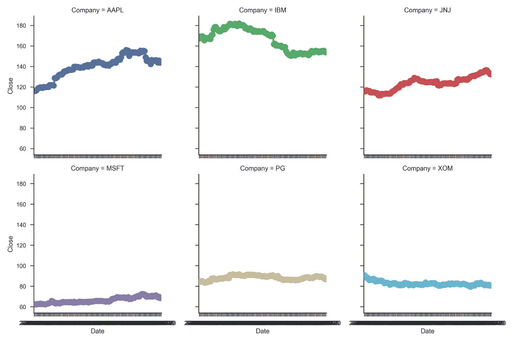

上面的图存在几个问题。

首先，纵横比（长度与高度之比）对于时间序列图来说稍显不理想。较宽的图形将使我们能够观察到在这一时间段内的微小变化。我们将通过调整`aspect`参数来解决这个问题。

其次，线条和点的粗细过大，从而遮盖了一些图中的细节。我们可以通过调整`scale`参数来减小这些视觉元素的大小。

最后，刻度线之间太近，且刻度标签重叠。绘图完成后，`sns.factorplot()`返回一个 FacetGrid，在代码中表示为`g`。我们可以通过调用`FacetGrid`对象中的相关函数进一步调整图形的美学，比如刻度位置和标签：

```py
# Increase the aspect ratio and size of each panel
g = sns.factorplot(x="Date", y="Close", 
                   hue="Company", col="Company", 
                   data=stock_df,
                   col_wrap=3, size=3,
                   scale=0.5, aspect=1.5)

# Thinning of ticks (select 1 in 10)
locs, labels = plt.xticks()
g.set(xticks=locs[0::10], xticklabels=labels[0::10])

# Rotate the tick labels to prevent overlap
g.set_xticklabels(rotation=30)

# Reduce the white space between plots
g.fig.subplots_adjust(wspace=.1, hspace=.2)
plt.show()

```

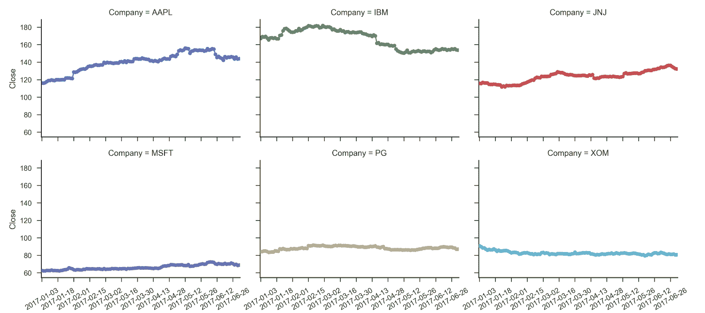

```py
# Create faceted plot separated by industry
g = sns.factorplot(x="Date", y="Close", 
                   hue="Company", col="Industry", 
                   data=stock_df, size=4, 
                   aspect=1.5, scale=0.5)

locs, labels = plt.xticks()
g.set(xticks=locs[0::10], xticklabels=labels[0::10])
g.set_xticklabels(rotation=30)
plt.show()
```

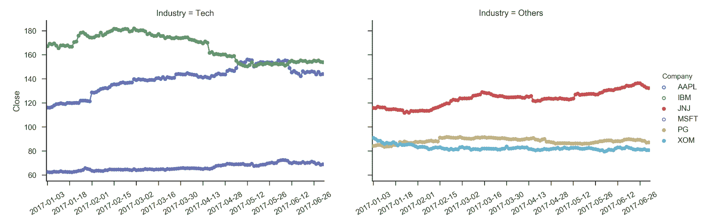

# Seaborn 中的分面网格

到目前为止，我们已经提到过`FacetGrid`几次，但它到底是什么呢？

正如您所知，`FacetGrid`是一个用于对数据进行子集化和绘制绘图面板的引擎，由将变量分配给`hue`参数的行和列来确定。虽然我们可以使用`lmplot`和`factorplot`等包装函数轻松地在`FacetGrid`上搭建绘图，但更灵活的方法是从头开始构建 FacetGrid。为此，我们首先向`FacetGrid`对象提供一个 pandas DataFrame，并通过`col`、`row`和`hue`参数指定布局网格的方式。然后，我们可以通过调用`FacetGrid`对象的`map()`函数为每个面板分配一个 Seaborn 或 Matplotlib 绘图函数：

```py
# Create a FacetGrid
g = sns.FacetGrid(stock_df, col="Company", hue="Company",
                  size=3, aspect=2, col_wrap=2)

# Map the seaborn.distplot function to the panels,
# which shows a histogram of closing prices.
g.map(sns.distplot, "Close")

# Label the axes
g.set_axis_labels("Closing price (US Dollars)", "Density")

plt.show()
```

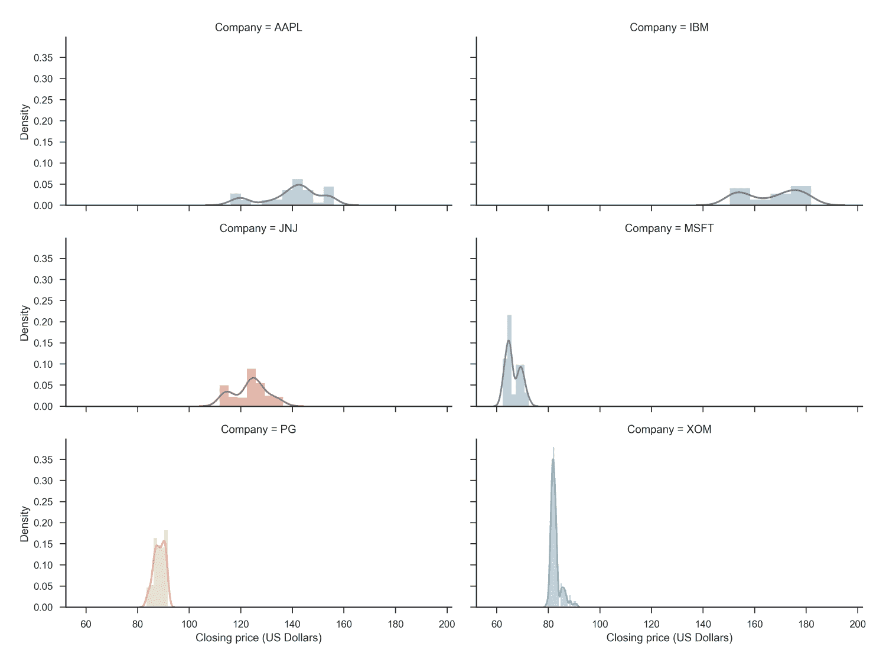

我们还可以向绘图函数提供关键字参数：

```py
g = sns.FacetGrid(stock_df, col="Company", hue="Company",
                  size=3, aspect=2.2, col_wrap=2)

# We can supply extra kwargs to the plotting function.
# Let's turn off KDE line (kde=False), and plot raw 
# frequency of bins only (norm_hist=False).
# By setting rug=True, tick marks that denotes the
# density of data points will be shown in the bottom.
g.map(sns.distplot, "Close", kde=False, norm_hist=False, rug=True)

g.set_axis_labels("Closing price (US Dollars)", "Density")

plt.show()
```

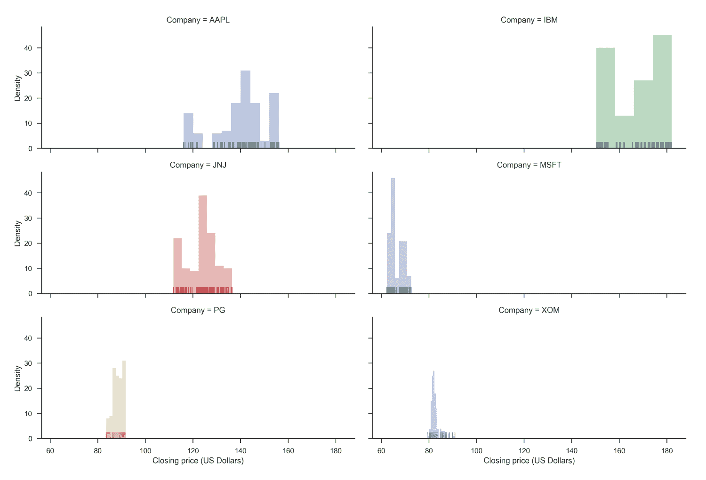

`FacetGrid`不仅限于使用 Seaborn 绘图函数；让我们尝试将老式的`Matplotlib.pyplot.plot()`函数映射到`FacetGrid`上：

```py
from matplotlib.dates import DateFormatter

g = sns.FacetGrid(stock_df, hue="Company", col="Industry",
                  size=4, aspect=1.5, col_wrap=2)

# plt.plot doesn't support string-formatted Date,
# so we need to use the Datetime column that we
# prepared earlier instead.
g.map(plt.plot, "Datetime", "Close", marker="o", markersize=3, linewidth=1)
g.add_legend()

# We can access individual axes through g.axes[column]
# or g.axes[row,column] if multiple rows are present.
# Let's adjust the tick formatter and rotate the tick labels
# in each axes.
for col in range(2):
    g.axes[col].xaxis.set_major_formatter(DateFormatter('%Y-%m-%d'))
    plt.setp(g.axes[col].get_xticklabels(), rotation=30)

g.set_axis_labels("", "Closing price (US Dollars)")
plt.show()
```

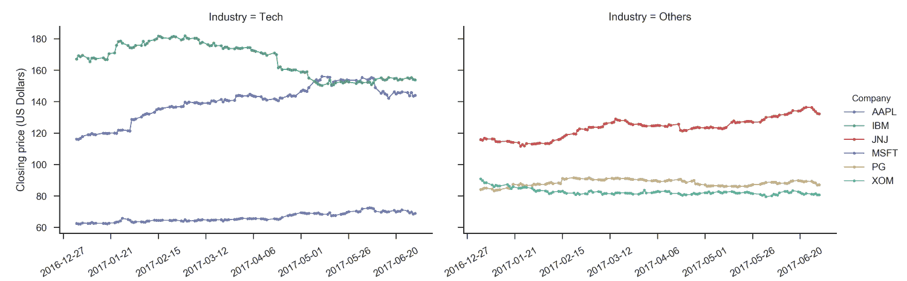

# Seaborn 中的 pair plot

对角线轴上将显示一系列直方图，以显示该列中变量的分布：

```py
# Show a pairplot of three selected variables (vars=["Open", "Volume", "Close"])
g = sns.pairplot(stock_df, hue="Company", 
                 vars=["Open", "Volume", "Close"])

plt.show()
```

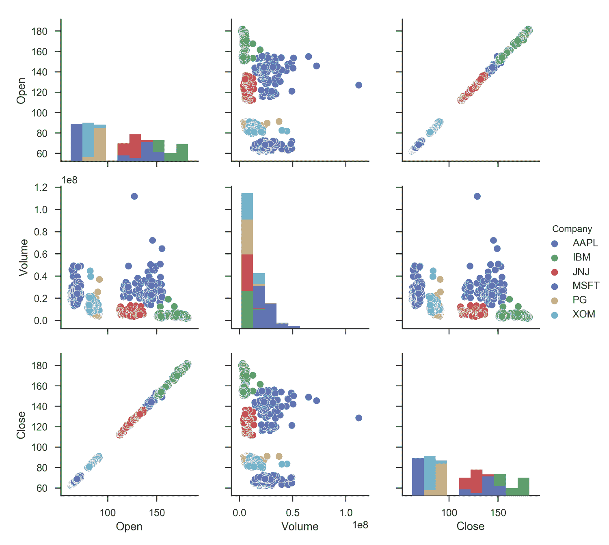

我们可以调整绘图的许多方面。在下一个示例中，我们将增加纵横比，将对角线上的绘图类型更改为 KDE 绘图，并使用关键字参数调整绘图的美学效果：

```py
# Adjust the aesthetics of the plot
g = sns.pairplot(stock_df, hue="Company", 
                 aspect=1.5, diag_kind="kde", 
                 diag_kws=dict(shade=True),
                 plot_kws=dict(s=15, marker="+"),
                 vars=["Open", "Volume", "Close"])

plt.show()
```

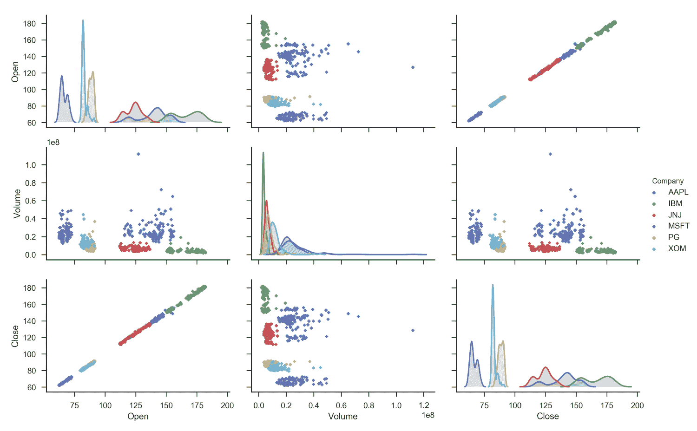

与基于`FacetGrid`的其他绘图类似，我们可以定义要在每个面板中显示的变量。我们还可以手动定义对我们重要的比较，而不是通过设置`x_vars`和`y_vars`参数进行全对全比较。如果需要更高的灵活性来定义比较组，也可以直接使用`seaborn.PairGrid()`：

```py
# Manually defining the comparisons that we are interested.
g = sns.pairplot(stock_df, hue="Company", aspect=1.5,
                 x_vars=["Open", "Volume"],
                 y_vars=["Close", "Close_change"])

plt.show()
```

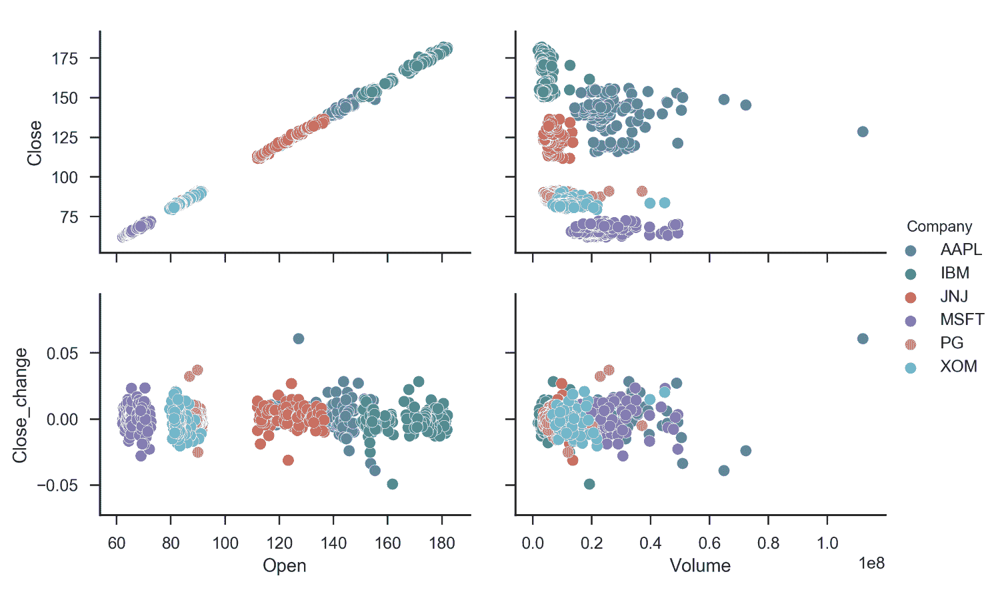

# 其他二维多变量图

当我们需要可视化更多变量或样本时，FacetGrid、factor plot 和 pair plot 可能会占用大量空间。如果您希望最大化空间效率，则有两种特殊的绘图类型非常方便 - 热力图和蜡烛图。

# Seaborn 中的热力图

热力图是显示大量数据的极其紧凑的方式。在金融世界中，色块编码可以让投资者快速了解哪些股票上涨或下跌。在科学世界中，热力图允许研究人员可视化成千上万基因的表达水平。

`seaborn.heatmap()`函数期望以 2D 列表、2D Numpy 数组或 pandas DataFrame 作为输入。如果提供了列表或数组，我们可以通过`xticklabels`和`yticklabels`分别提供列和行标签。另一方面，如果提供了 DataFrame，则将使用列标签和索引值分别标记列和行。

为了开始，我们将使用热图绘制六只股票的表现概览。我们将股票表现定义为与前一个收盘价相比的收盘价变化。这些信息在本章前面已经计算过（即 `Close_change` 列）。不幸的是，我们不能直接将整个 DataFrame 提供给 `seaborn.heatmap()`，因为它需要公司名称作为列，日期作为索引，收盘价变化作为数值。

如果你熟悉 Microsoft Excel，你可能有使用透视表的经验，这是总结特定变量水平或数值的强大技巧。pandas 也包含了类似的功能。以下代码片段使用了 `Pandas.DataFrame.pivot()` 函数来创建透视表：

```py
stock_change = stock_df.pivot(index='Date', columns='Company', values='Close_change')
stock_change = stock_change.loc["2017-06-01":"2017-06-30"]
stock_change.head()
```

| **公司日期** | **AAPL** | **IBM** | **JNJ** | **MSFT** | **PG** | **XOM** |
| --- | --- | --- | --- | --- | --- | --- |
| **2017-06-01** | 0.002749 | 0.000262 | 0.004133 | 0.003723 | 0.000454 | 0.002484 |
| **2017-06-02** | 0.014819 | -0.004061 | 0.010095 | 0.023680 | 0.005220 | -0.014870 |
| **2017-06-05** | -0.009778 | 0.002368 | 0.002153 | 0.007246 | 0.001693 | 0.007799 |
| **2017-06-06** | 0.003378 | -0.000262 | 0.003605 | 0.003320 | 0.000676 | 0.013605 |
| **2017-06-07** | 0.005957 | -0.009123 | -0.000611 | -0.001793 | -0.000338 | -0.003694 |

透视表创建完成后，我们可以继续绘制第一个热图：

```py
ax = sns.heatmap(stock_change)
plt.show()
```

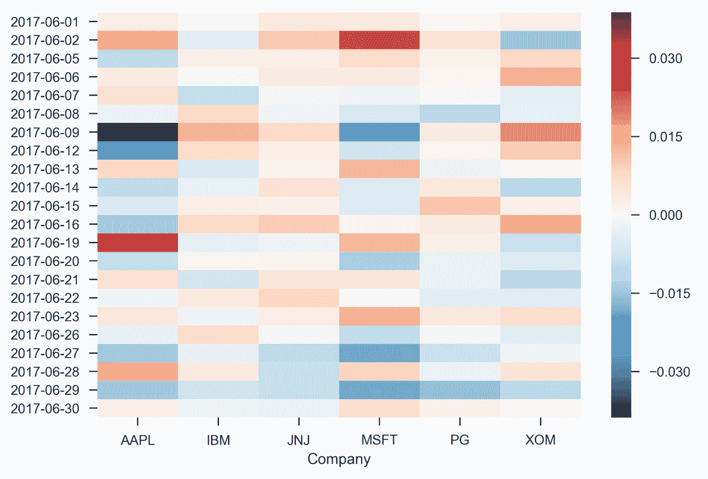

默认的热图实现并不够紧凑。当然，我们可以通过`plt.figure(figsize=(width, height))`来调整图形大小；我们还可以切换方形参数来创建方形的块。为了方便视觉识别，我们可以在块周围添加一条细边框。

根据美国股市的惯例，绿色表示价格上涨，红色表示价格下跌。因此，我们可以调整`cmap`参数来调整颜色图。然而，Matplotlib 和 Seaborn 都没有包含红绿颜色图，所以我们需要自己创建一个：

在第七章《可视化在线数据》末尾，我们简要介绍了创建自定义颜色图的函数。这里我们将使用`seaborn.diverging_palette()`来创建红绿颜色图，它要求我们为颜色图的负值和正值指定色调、饱和度和亮度（husl）。你还可以使用以下代码在 Jupyter Notebook 中启动交互式小部件，帮助选择颜色：

`%matplotlib notebook`

`import seaborn as sns`

`sns.choose_diverging_palette(as_cmap=True)`

```py
# Create a new red-green color map using the husl color system
# h_neg and h_pos determines the hue of the extents of the color map.
# s determines the color saturation
# l determines the lightness
# sep determines the width of center point
# In addition, we need to set as_cmap=True as the cmap parameter of 
# sns.heatmap expects matplotlib colormap object.
rdgn = sns.diverging_palette(h_neg=10, h_pos=140, s=80, l=50,
                             sep=10, as_cmap=True)

# Change to square blocks (square=True), add a thin
# border (linewidths=.5), and change the color map
# to follow US stocks market convention (cmap="RdGn").
ax = sns.heatmap(stock_change, cmap=rdgn,
                 linewidths=.5, square=True)

# Prevent x axes label from being cropped
plt.tight_layout()
plt.show()
```

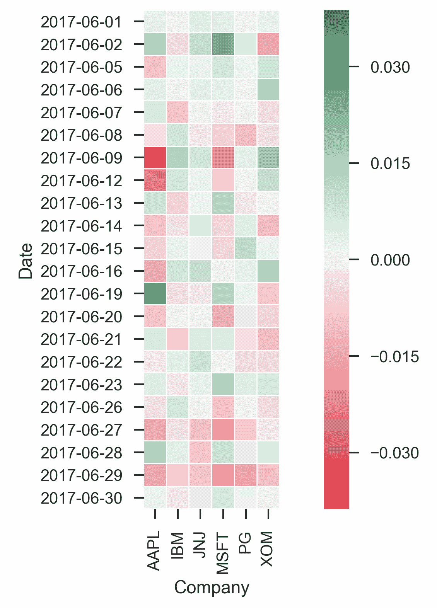

当颜色是唯一的区分因素时，可能很难分辨数值间的小差异。为每个颜色块添加文本注释可能有助于读者理解差异的大小：

```py
fig = plt.figure(figsize=(6,8))

# Set annot=True to overlay the values.
# We can also assign python format string to fmt. 
# For example ".2%" refers to percentage values with
# two decimal points.
```

```py
ax = sns.heatmap(stock_change, cmap=rdgn,
                 annot=True, fmt=".2%",
                 linewidths=.5, cbar=False)
plt.show()
```

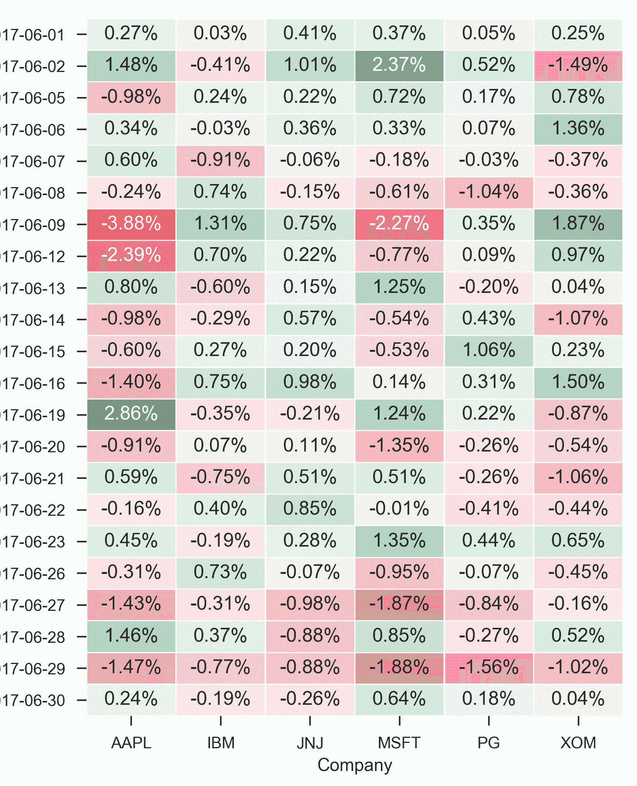

# matplotlib.finance 中的蜡烛图

正如您在本章的第一部分所看到的，我们的数据集包含每个交易日的开盘价、收盘价以及最高和最低价格。到目前为止，我们描述的任何图表都无法在单个图表中描述所有这些变量的趋势。

在金融界，蜡烛图几乎是描述股票、货币和商品在一段时间内价格变动的默认选择。每个蜡烛图由实体组成，描述开盘和收盘价，以及展示特定交易日最高和最低价格的延伸影线。如果收盘价高于开盘价，则蜡烛图通常为黑色。相反，如果收盘价低于开盘价，则为红色。交易员可以根据颜色的组合和蜡烛图实体的边界推断开盘和收盘价。

在以下示例中，我们将准备一个苹果公司在我们的 DataFrame 最近 50 个交易日的蜡烛图。我们还将应用刻度格式化程序来标记日期的刻度：

```py
import matplotlib.pyplot as plt
from matplotlib.dates import date2num, WeekdayLocator, DayLocator, DateFormatter, MONDAY
from matplotlib.finance import candlestick_ohlc

# Extract stocks data for AAPL.
# candlestick_ohlc expects Date (in floating point number), Open, High, Low,
# Close columns only
# So we need to select the useful columns first using DataFrame.loc[]. Extra 
# columns can exist, 
# but they are ignored. Next we get the data for the last 50 trading only for 
# simplicity of plots.
candlestick_data = stock_df[stock_df["Company"]=="AAPL"]\
                       .loc[:, ["Datetime", "Open", "High", "Low", "Close",
                       "Volume"]]\
                       .iloc[-50:]

# Create a new Matplotlib figure
fig, ax = plt.subplots()

# Prepare a candlestick plot
candlestick_ohlc(ax, candlestick_data.values, width=0.6)

ax.xaxis.set_major_locator(WeekdayLocator(MONDAY)) # major ticks on the mondays
ax.xaxis.set_minor_locator(DayLocator()) # minor ticks on the days
ax.xaxis.set_major_formatter(DateFormatter('%Y-%m-%d'))
ax.xaxis_date() # treat the x data as dates
# rotate all ticks to vertical
plt.setp(ax.get_xticklabels(), rotation=90, horizontalalignment='right')

ax.set_ylabel('Price (US $)') # Set y-axis label
plt.show()
```

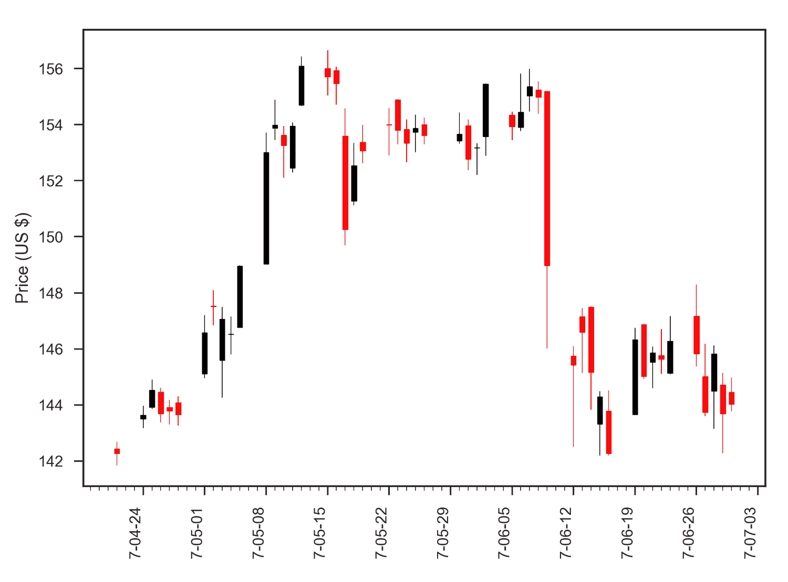

从 Matplotlib 2.0 开始，`matplotlib.finance` 已被弃用。读者应该将来使用`mpl_finance`（[`github.com/matplotlib/mpl_finance`](https://github.com/matplotlib/mpl_finance)）。然而，截至本章撰写时，`mpl_finance` 尚未在 PyPI 上提供，因此我们暂时还是使用`matplotlib.finance`。

# 可视化各种股市指标

当前形式的蜡烛图有些单调。交易员通常会叠加股票指标，如**平均真实范围**（**ATR**）、布林带、**商品通道指数**（**CCI**）、**指数移动平均**（**EMA**）、**移动平均收敛背离**（**MACD**）、**相对强弱指数**（**RSI**）以及各种其他技术分析的统计数据。

Stockstats（[`github.com/jealous/stockstats`](https://github.com/jealous/stockstats)）是一个用于计算这些指标/统计数据以及更多内容的优秀包。它封装了 pandas 的数据框架，并在访问时动态生成这些统计数据。要使用`stockstats`，我们只需通过 PyPI 安装它：`pip install stockstats`。

接下来，我们可以通过`stockstats.StockDataFrame.retype()`将 pandas DataFrame 转换为 stockstats DataFrame。然后，可以按照`StockDataFrame["variable_timeWindow_indicator"]`的模式访问大量股票指标。例如，`StockDataFrame['open_2_sma']`将给出开盘价的 2 天简单移动平均线。一些指标可能有快捷方式，请查阅官方文档获取更多信息：

```py
from stockstats import StockDataFrame

# Convert to StockDataFrame
# Need to pass a copy of candlestick_data to StockDataFrame.retype
# Otherwise the original candlestick_data will be modified
stockstats = StockDataFrame.retype(candlestick_data.copy())

# 5-day exponential moving average on closing price
ema_5 = stockstats["close_5_ema"]
# 20-day exponential moving average on closing price
ema_20 = stockstats["close_20_ema"]
# 50-day exponential moving average on closing price
ema_50 = stockstats["close_50_ema"]
# Upper Bollinger band
boll_ub = stockstats["boll_ub"]
# Lower Bollinger band
boll_lb = stockstats["boll_lb"]
# 7-day Relative Strength Index
rsi_7 = stockstats['rsi_7']
# 14-day Relative Strength Index
rsi_14 = stockstats['rsi_14']
```

准备好股票指标后，我们可以将它们叠加在同一个蜡烛图上：

```py
import datetime
import matplotlib.pyplot as plt
from matplotlib.dates import date2num, WeekdayLocator, DayLocator, DateFormatter, MONDAY
from matplotlib.finance import candlestick_ohlc

# Create a new Matplotlib figure
fig, ax = plt.subplots()

# Prepare a candlestick plot
candlestick_ohlc(ax, candlestick_data.values, width=0.6)

# Plot stock indicators in the same plot
ax.plot(candlestick_data["Datetime"], ema_5, lw=1, label='EMA (5)')
ax.plot(candlestick_data["Datetime"], ema_20, lw=1, label='EMA (20)')
ax.plot(candlestick_data["Datetime"], ema_50, lw=1, label='EMA (50)')
ax.plot(candlestick_data["Datetime"], boll_ub, lw=2, linestyle="--", label='Bollinger upper')
ax.plot(candlestick_data["Datetime"], boll_lb, lw=2, linestyle="--", label='Bollinger lower')

ax.xaxis.set_major_locator(WeekdayLocator(MONDAY)) # major ticks on 
# the mondays
ax.xaxis.set_minor_locator(DayLocator()) # minor ticks on the days
ax.xaxis.set_major_formatter(DateFormatter('%Y-%m-%d'))
ax.xaxis_date() # treat the x data as dates
# rotate all ticks to vertical
plt.setp(ax.get_xticklabels(), rotation=90, horizontalalignment='right')

ax.set_ylabel('Price (US $)') # Set y-axis label

# Limit the x-axis range from 2017-4-23 to 2017-7-1
datemin = datetime.date(2017, 4, 23)
datemax = datetime.date(2017, 7, 1)
ax.set_xlim(datemin, datemax)

plt.legend() # Show figure legend
plt.tight_layout()
plt.show()
```

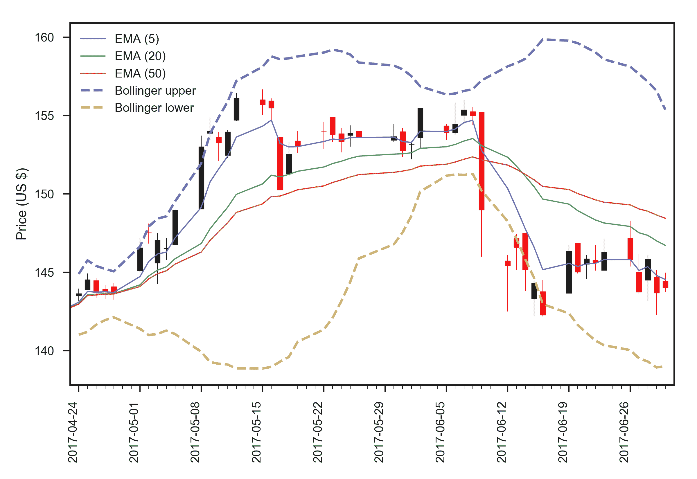

# 创建全面的股票图表

在以下详细示例中，我们将应用到目前为止讲解的多种技巧，创建一个更全面的股票图表。除了前面的图表外，我们还将添加一条线图来显示**相对强弱指数**（**RSI**）以及一条柱状图来显示交易量。一个特殊的市场事件（[`markets.businessinsider.com/news/stocks/apple-stock-price-falling-new-iphone-speed-2017-6-1002082799`](http://markets.businessinsider.com/news/stocks/apple-stock-price-falling-new-iphone-speed-2017-6-1002082799)）也将在图表中做注释：

如果你仔细观察图表，你可能会注意到一些缺失的日期。这些日期通常是非交易日或公共假期，它们在我们的数据框中没有出现。

```py
import datetime
import matplotlib.pyplot as plt
from matplotlib.dates import date2num, WeekdayLocator, DayLocator, DateFormatter, MONDAY
from matplotlib.finance import candlestick_ohlc
from matplotlib.ticker import FuncFormatter

# FuncFormatter to convert tick values to Millions
def millions(x, pos):
    return '%dM' % (x/1e6)

# Create 3 subplots spread acrosee three rows, with shared x-axis. 
# The height ratio is specified via gridspec_kw
fig, axarr = plt.subplots(nrows=3, ncols=1, sharex=True, figsize=(8,8),
                          gridspec_kw={'height_ratios':[3,1,1]})

# Prepare a candlestick plot in the first axes
candlestick_ohlc(axarr[0], candlestick_data.values, width=0.6)

# Overlay stock indicators in the first axes
axarr[0].plot(candlestick_data["Datetime"], ema_5, lw=1, label='EMA (5)')
axarr[0].plot(candlestick_data["Datetime"], ema_20, lw=1, label='EMA (20)')
axarr[0].plot(candlestick_data["Datetime"], ema_50, lw=1, label='EMA (50)')
axarr[0].plot(candlestick_data["Datetime"], boll_ub, lw=2, linestyle="--", label='Bollinger upper')
axarr[0].plot(candlestick_data["Datetime"], boll_lb, lw=2, linestyle="--", label='Bollinger lower')

# Display RSI in the second axes
axarr[1].axhline(y=30, lw=2, color = '0.7') # Line for oversold threshold
axarr[1].axhline(y=50, lw=2, linestyle="--", color = '0.8') # Neutral RSI
axarr[1].axhline(y=70, lw=2, color = '0.7') # Line for overbought threshold
axarr[1].plot(candlestick_data["Datetime"], rsi_7, lw=2, label='RSI (7)')
axarr[1].plot(candlestick_data["Datetime"], rsi_14, lw=2, label='RSI (14)')

# Display trade volume in the third axes
axarr[2].bar(candlestick_data["Datetime"], candlestick_data['Volume'])

# Mark the market reaction to the Bloomberg news
# https://www.bloomberg.com/news/articles/2017-06-09/apple-s-new
# -iphones-said-to-miss-out-on-higher-speed-data-links
# http://markets.businessinsider.com/news/stocks/apple-stock-price
# -falling-new-iphone-speed-2017-6-1002082799
axarr[0].annotate("Bloomberg News",
                  xy=(datetime.date(2017, 6, 9), 155), xycoords='data',
                  xytext=(25, 10), textcoords='offset points', size=12,
                  arrowprops=dict(arrowstyle="simple",
                  fc="green", ec="none"))

# Label the axes
axarr[0].set_ylabel('Price (US $)')
axarr[1].set_ylabel('RSI')
axarr[2].set_ylabel('Volume (US $)')

axarr[2].xaxis.set_major_locator(WeekdayLocator(MONDAY)) # major ticks on the mondays
axarr[2].xaxis.set_minor_locator(DayLocator()) # minor ticks on the days
axarr[2].xaxis.set_major_formatter(DateFormatter('%Y-%m-%d'))
axarr[2].xaxis_date() # treat the x data as dates
axarr[2].yaxis.set_major_formatter(FuncFormatter(millions)) # Change the y-axis ticks to millions
plt.setp(axarr[2].get_xticklabels(), rotation=90, horizontalalignment='right') # Rotate x-tick labels by 90 degree

# Limit the x-axis range from 2017-4-23 to 2017-7-1
datemin = datetime.date(2017, 4, 23)
datemax = datetime.date(2017, 7, 1)
axarr[2].set_xlim(datemin, datemax)

# Show figure legend
axarr[0].legend()
axarr[1].legend()

# Show figure title
axarr[0].set_title("AAPL (Apple Inc.) NASDAQ", loc='left')

# Reduce unneccesary white space
plt.tight_layout()
plt.show()
```

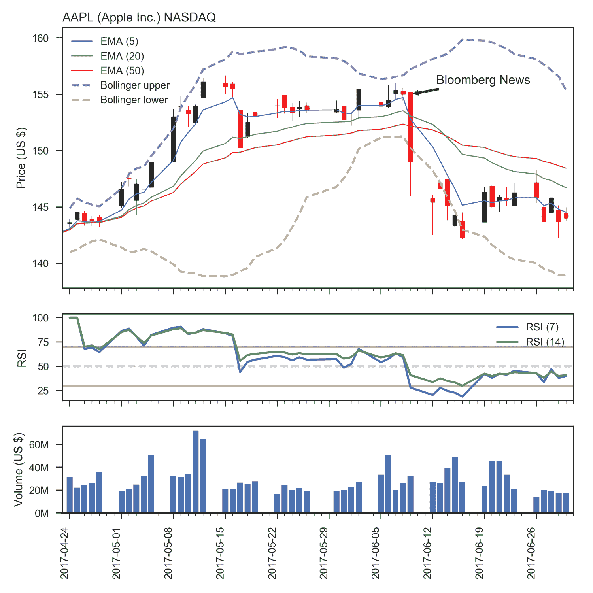

# 三维（3D）图表

通过过渡到三维空间，在创建可视化时，你可能会享有更大的创作自由度。额外的维度还可以在单一图表中容纳更多信息。然而，有些人可能会认为，当三维图形被投影到二维表面（如纸张）时，三维不过是一个视觉噱头，因为它会模糊数据点的解读。

在 Matplotlib 版本 2 中，尽管三维 API 有了显著的进展，但依然存在一些令人烦恼的错误或问题。我们将在本章的最后讨论一些解决方法。确实有更强大的 Python 3D 可视化包（如 MayaVi2、Plotly 和 VisPy），但如果你希望使用同一个包同时绘制 2D 和 3D 图，或者希望保持其 2D 图的美学，使用 Matplotlib 的三维绘图功能是很好的选择。

大多数情况下，Matplotlib 中的三维图与二维图有相似的结构。因此，在本节中我们不会讨论每种三维图类型。我们将重点介绍三维散点图和柱状图。

# 三维散点图

在第六章，《你好，绘图世界！》中，我们已经探索了二维散点图。在这一节中，让我们尝试创建一个三维散点图。在此之前，我们需要一些三维数据点（*x*，*y*，*z*）：

```py
import pandas as pd

source = "https://raw.githubusercontent.com/PointCloudLibrary/data/master/tutorials/ism_train_cat.pcd"
cat_df = pd.read_csv(source, skiprows=11, delimiter=" ", names=["x","y","z"], encoding='latin_1') 
cat_df.head()
```

| **点** | **x** | **y** | **z** |
| --- | --- | --- | --- |
| **0** | -17.034178 | 18.972282 | 40.482403 |
| **1** | -16.881481 | 21.815451 | 44.156799 |
| **2** | -16.749582 | 18.154911 | 34.131474 |
| **3** | -16.876919 | 20.598286 | 36.271809 |
| **4** | -16.849340 | 17.403711 | 42.993984 |

要声明一个三维图，我们首先需要从`mpl_toolkits`中的`mplot3d`扩展导入`Axes3D`对象，它负责在二维平面中渲染三维图表。然后，在创建子图时，我们需要指定`projection='3d'`：

```py
from mpl_toolkits.mplot3d import Axes3D
import matplotlib.pyplot as plt

fig = plt.figure()
ax = fig.add_subplot(111, projection='3d')
ax.scatter(cat_df.x, cat_df.y, cat_df.z)

plt.show()
```

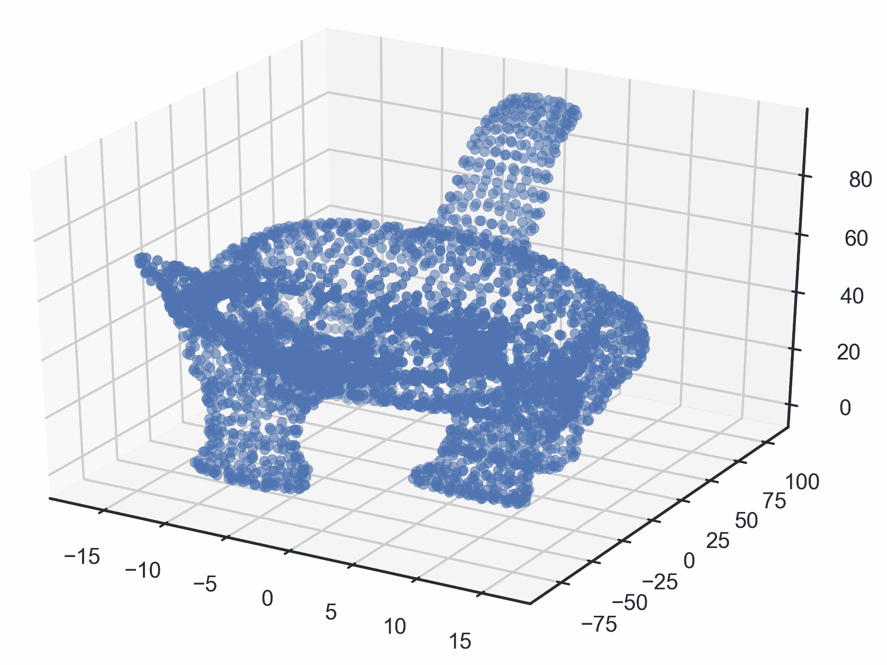

瞧，强大的 3D 散点图。猫目前正在占领互联网。根据《纽约时报》的报道，猫是“互联网的基本构建单元”（[`www.nytimes.com/2014/07/23/upshot/what-the-internet-can-see-from-your-cat-pictures.html`](https://www.nytimes.com/2014/07/23/upshot/what-the-internet-can-see-from-your-cat-pictures.html)）。毫无疑问，它们也应该在本章中占有一席之地。

与 2D 版本的 `scatter()` 相反，当创建 3D 散点图时，我们需要提供 X、Y 和 Z 坐标。然而，2D `scatter()` 支持的参数也可以应用于 3D `scatter()`：

```py
fig = plt.figure()
ax = fig.add_subplot(111, projection='3d')

# Change the size, shape and color of markers
ax.scatter(cat_df.x, cat_df.y, cat_df.z, s=4, c="g", marker="o")

plt.show()
```

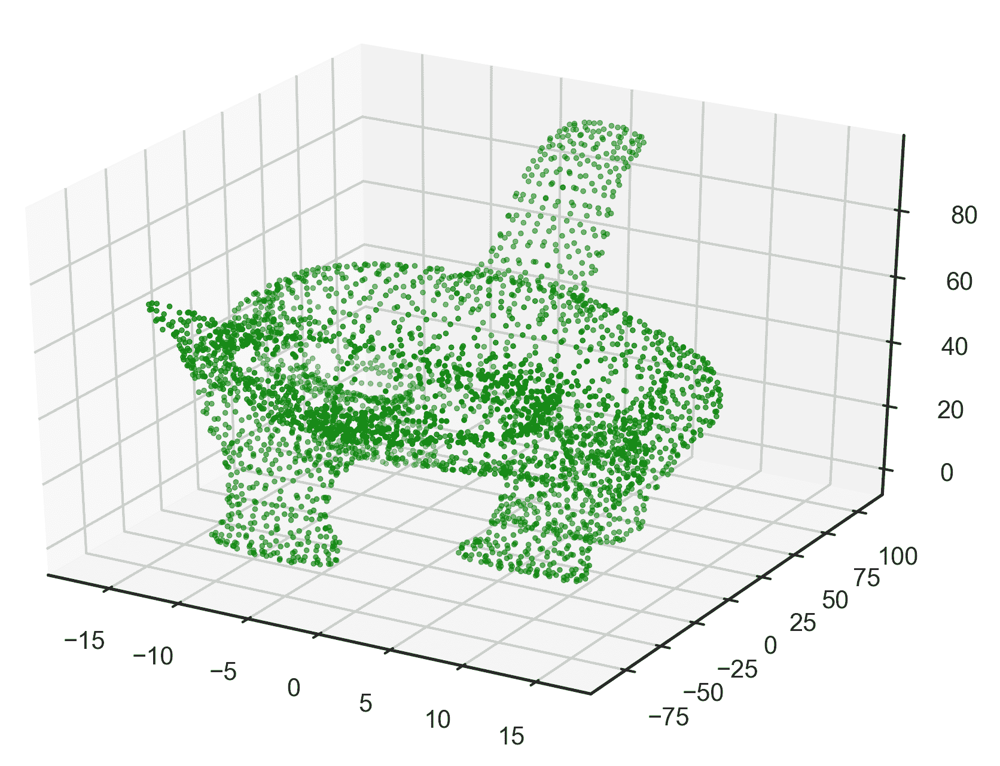

要更改 3D 图的视角和仰角，我们可以使用 `view_init()`。`azim` 参数指定 X-Y 平面上的方位角，而 `elev` 指定仰角。当方位角为 0 时，X-Y 平面将从你的北侧看起来。同时，方位角为 180 时，你将看到 X-Y 平面的南侧：

```py
fig = plt.figure()
ax = fig.add_subplot(111, projection='3d')
ax.scatter(cat_df.x, cat_df.y, cat_df.z,s=4, c="g", marker="o")

# elev stores the elevation angle in the z plane azim stores the 
# azimuth angle in the x,y plane
ax.view_init(azim=180, elev=10)

plt.show()
```

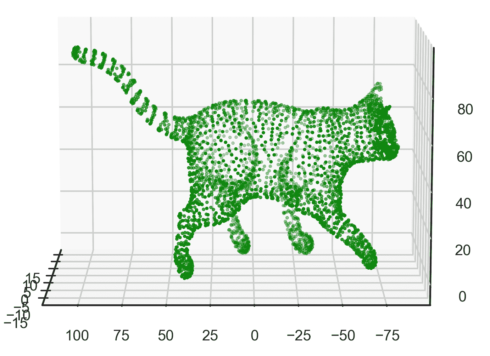

# 3D 条形图

我们引入了烛台图来展示**开盘-最高-最低-收盘**（**OHLC**）金融数据。此外，可以使用 3D 条形图来展示随时间变化的 OHLC。下图展示了绘制 5 天 OHLC 条形图的典型示例：

```py
import matplotlib.pyplot as plt
import numpy as np
from mpl_toolkits.mplot3d import Axes3D

# Get 1 and every fifth row for the 5-day AAPL OHLC data
ohlc_5d = stock_df[stock_df["Company"]=="AAPL"].iloc[1::5, :]

fig = plt.figure()
ax = fig.add_subplot(111, projection='3d')

# Create one color-coded bar chart for Open, High, Low and Close prices.
for color, col, z in zip(['r', 'g', 'b', 'y'], ["Open", "High", "Low", 
                          "Close"], [30, 20, 10, 0]):
    xs = np.arange(ohlc_5d.shape[0])
    ys = ohlc_5d[col]
    # Assign color to the bars
    colors = [color] * len(xs)
    ax.bar(xs, ys, zs=z, zdir='y', color=colors, alpha=0.8, width=5)

plt.show()
```

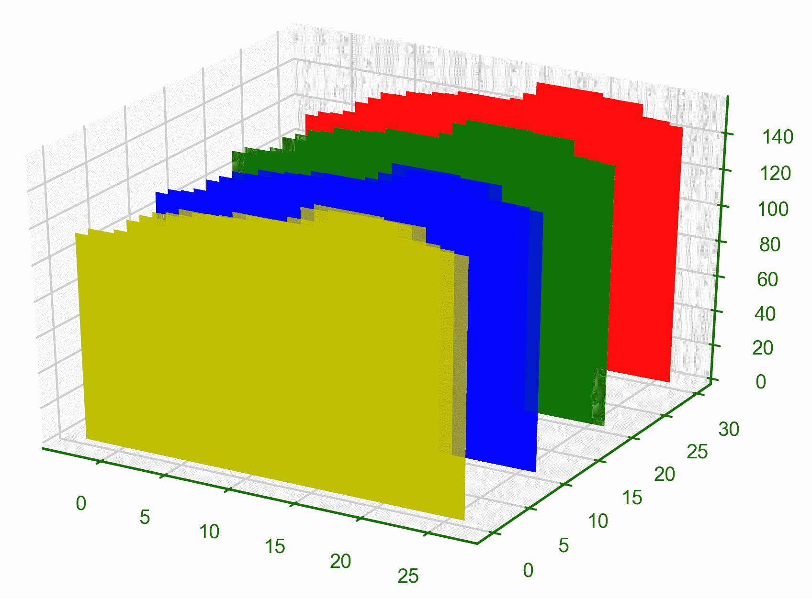

设置刻度和标签的方法与其他 Matplotlib 绘图函数类似：

```py
fig = plt.figure(figsize=(9,7))
ax = fig.add_subplot(111, projection='3d')

# Create one color-coded bar chart for Open, High, Low and Close prices.
for color, col, z in zip(['r', 'g', 'b', 'y'], ["Open", "High", "Low", 
                          "Close"], [30, 20, 10, 0]):
    xs = np.arange(ohlc_5d.shape[0])
    ys = ohlc_5d[col]
    # Assign color to the bars 
    colors = [color] * len(xs)
    ax.bar(xs, ys, zs=z, zdir='y', color=colors, alpha=0.8)

# Manually assign the ticks and tick labels
ax.set_xticks(np.arange(ohlc_5d.shape[0]))
ax.set_xticklabels(ohlc_5d["Date"], rotation=20,
                   verticalalignment='baseline',
                   horizontalalignment='right',
                   fontsize='8')
ax.set_yticks([30, 20, 10, 0])
ax.set_yticklabels(["Open", "High", "Low", "Close"])

# Set the z-axis label
ax.set_zlabel('Price (US $)')

# Rotate the viewport
ax.view_init(azim=-42, elev=31)
plt.tight_layout()
plt.show()
```

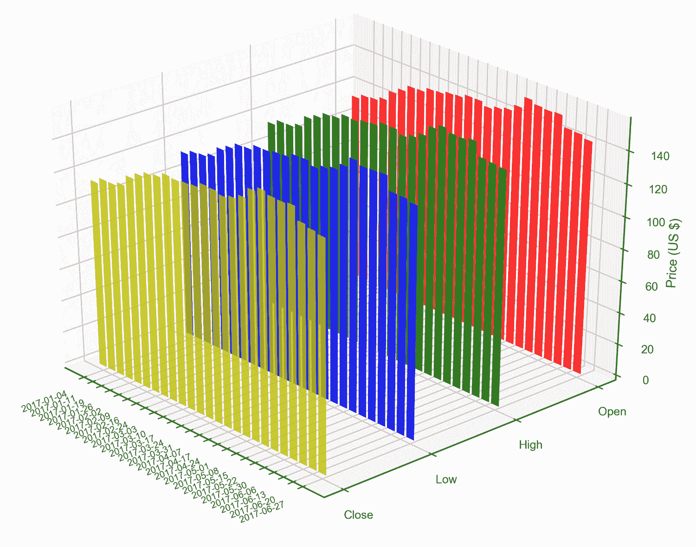

# Matplotlib 3D 的注意事项

由于缺乏真正的 3D 图形渲染后端（如 OpenGL）和适当的算法来检测 3D 对象的交叉点，Matplotlib 的 3D 绘图能力并不强大，但对于典型应用来说仅仅够用。在官方 Matplotlib FAQ 中（[`matplotlib.org/mpl_toolkits/mplot3d/faq.html`](https://matplotlib.org/mpl_toolkits/mplot3d/faq.html)），作者指出 3D 图可能在某些角度看起来不正确。此外，我们还报告了如果设置了 zlim，`mplot3d` 会无法裁剪条形图的问题（[`github.com/matplotlib/matplotlib/issues/8902`](https://github.com/matplotlib/matplotlib/issues/8902)；另见 [`github.com/matplotlib/matplotlib/issues/209`](https://github.com/matplotlib/matplotlib/issues/209)）。在没有改进 3D 渲染后端的情况下，这些问题很难解决。

为了更好地说明后一个问题，让我们尝试在之前的 3D 条形图中的 `plt.tight_layout()` 上方添加 `ax.set_zlim3d(bottom=110, top=150)`：

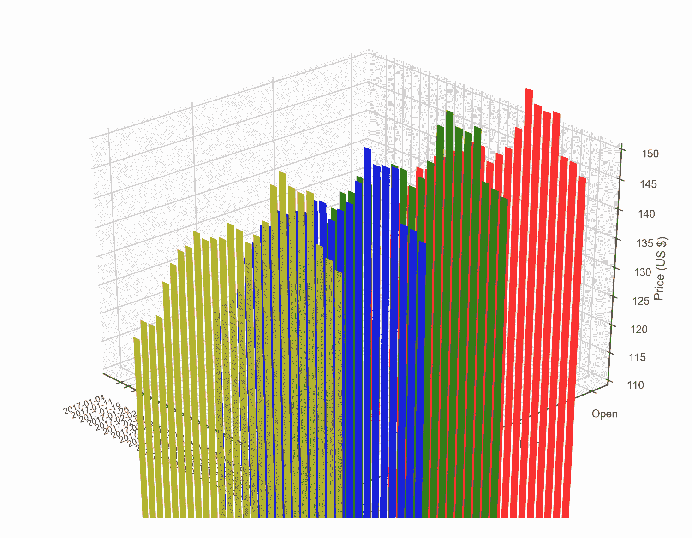

显然，柱状图超出了坐标轴的下边界。我们将尝试通过以下解决方法解决后一个问题：

```py
# FuncFormatter to add 110 to the tick labels
def major_formatter(x, pos):
    return "{}".format(x+110)

fig = plt.figure(figsize=(9,7))
ax = fig.add_subplot(111, projection='3d')

# Create one color-coded bar chart for Open, High, Low and Close prices.
for color, col, z in zip(['r', 'g', 'b', 'y'], ["Open", "High", "Low", 
                          "Close"], [30, 20, 10, 0]):
    xs = np.arange(ohlc_5d.shape[0])
    ys = ohlc_5d[col]

    # Assign color to the bars 
    colors = [color] * len(xs)

    # Truncate the y-values by 110
    ax.bar(xs, ys-110, zs=z, zdir='y', color=colors, alpha=0.8)

# Manually assign the ticks and tick labels
ax.set_xticks(np.arange(ohlc_5d.shape[0]))
ax.set_xticklabels(ohlc_5d["Date"], rotation=20,
                   verticalalignment='baseline',
                   horizontalalignment='right',
                   fontsize='8')

# Set the z-axis label
ax.set_yticks([30, 20, 10, 0])
ax.set_yticklabels(["Open", "High", "Low", "Close"])
ax.zaxis.set_major_formatter(FuncFormatter(major_formatter))
ax.set_zlabel('Price (US $)')

# Rotate the viewport
ax.view_init(azim=-42, elev=31)

plt.tight_layout()
plt.show()
```

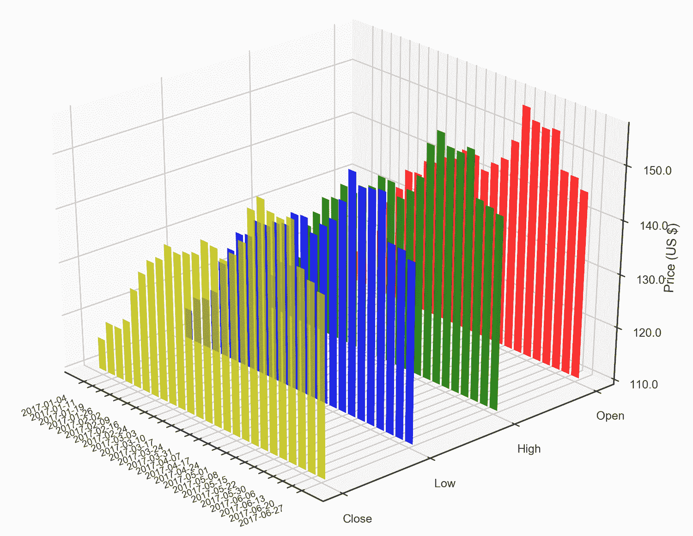

基本上，我们将 *y* 值截断了 110，然后使用刻度格式化器（`major_formatter`）将刻度值恢复到原始值。对于三维散点图，我们可以简单地移除超过 `set_zlim3d()` 边界的数据点，以生成正确的图形。然而，这些解决方法可能并不适用于所有类型的三维图形。

# 总结

你已经成功掌握了将多变量数据以二维和三维形式可视化的技术。尽管本章中的大部分示例围绕股票交易这一主题展开，但数据处理和可视化方法也可以轻松应用于其他领域。特别是，用于在多个面上可视化多变量数据的分治法在科学领域中非常有用。

我们没有过多探讨 Matplotlib 的三维绘图功能，因为它尚未完善。对于简单的三维图形，Matplotlib 已经足够了。如果我们使用同一个库来绘制二维和三维图形，可以减少学习曲线。如果你需要更强大的三维绘图功能，建议你查看 MayaVi2、Plotly 和 VisPy。
